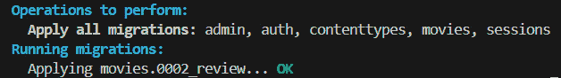
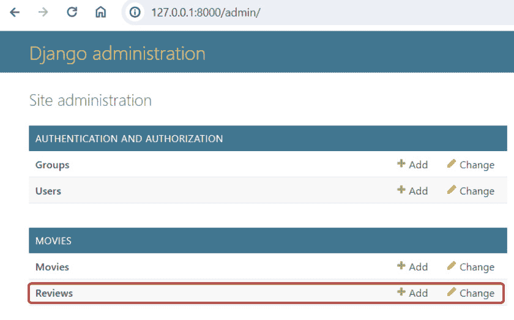
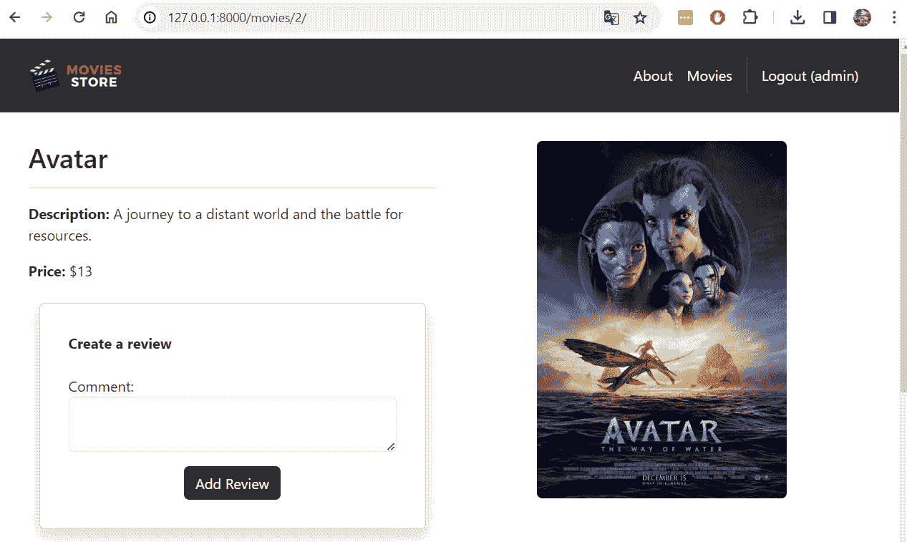
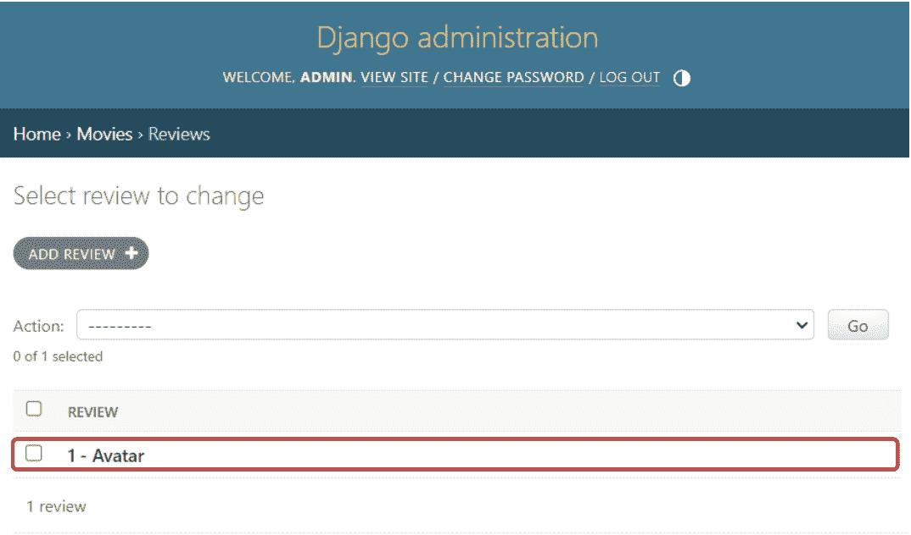
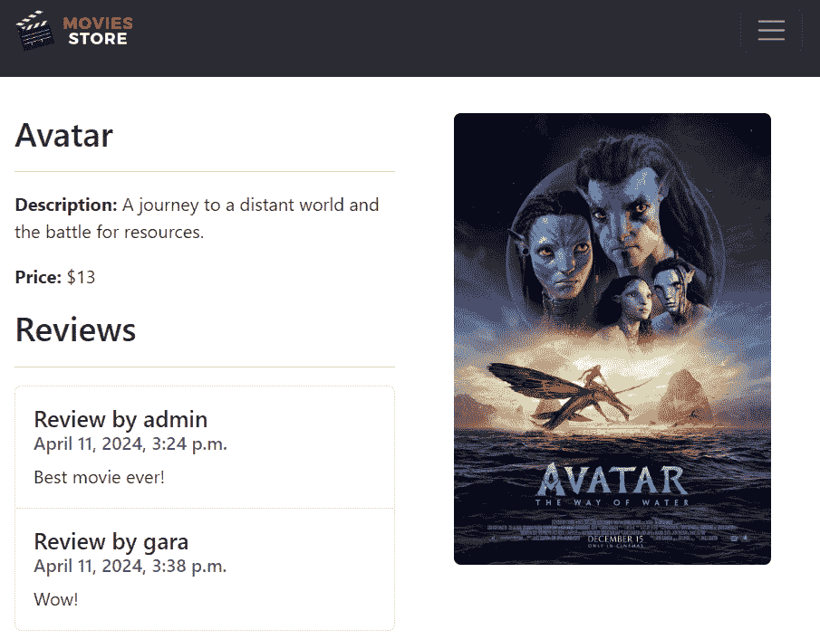
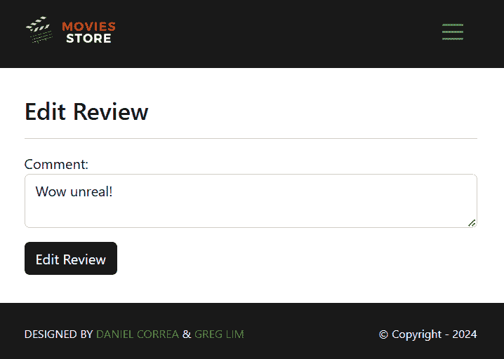
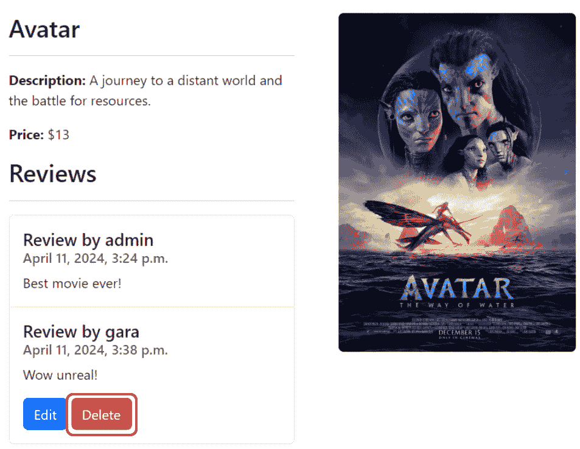

# <st c="0">9</st>

# <st c="2">让用户创建、阅读、更新和删除电影评论</st>

<st c="62">实现了认证系统后，现在是时候让登录用户对电影的评论执行标准的 CRUD 操作了。</st> <st c="207">本章将教您如何执行完整的 CRUD 操作以及如何</st> <st c="286">管理授权。</st>

<st c="308">在本章中，我们将涵盖以下主题：</st>

+   <st c="361">创建评论模型</st>

+   <st c="385">创建评论</st>

+   <st c="402">阅读评论</st>

+   <st c="418">更新</st> <st c="428">评论</st>

+   <st c="436">删除</st> <st c="446">评论</st>

<st c="454">到本章结束时，您将学会如何为您的模型创建 CRUD 操作并处理授权。</st> <st c="577">您还将回顾如何使用表单以及如何管理不同的</st> <st c="642">HTTP 方法。</st>

# <st c="655">技术要求</st>

<st c="678">在本章中，我们将使用 Python 3.10 或更高版本。</st> <st c="735">此外，本书中将使用</st> **<st c="770">VS Code</st>** <st c="777">编辑器，您可以从</st> <st c="822">以下位置下载</st> [<st c="827">https://code.visualstudio.com/</st>](https://code.visualstudio.com/)<st c="857">。</st>

<st c="858">本章的代码位于</st> <st c="896">以下位置</st> [<st c="899">https://github.com/PacktPublishing/Django-5-for-the-Impatient-Second-Edition/tree/main/Chapter09/moviesstore</st>](https://github.com/PacktPublishing/Django-5-for-the-Impatient-Second-Edition/tree/main/Chapter09/moviesstore)<st c="1007">。</st>

<st c="1008">本章的 CiA 视频可以在</st> <st c="1053">以下位置找到</st> [<st c="1056">https://packt.link/dsqdR</st>](https://packt.link/dsqdR)

# <st c="1080">创建评论模型</st>

<st c="1104">为了存储电影的评论</st> <st c="1133">信息，我们需要创建一个评论 Django 模型并遵循</st> <st c="1201">以下步骤：</st>

1.  <st c="1212">创建</st> <st c="1224">评论模型。</st>

1.  <st c="1237">应用迁移。</st>

1.  <st c="1255">将评论模型添加到</st> <st c="1284">管理面板。</st>

## <st c="1296">创建评论模型</st>

<st c="1320">评论信息与电影紧密相关。</st> <st c="1376">因此，我们将此模型包含在</st> `<st c="1421">movies</st>` <st c="1427">应用中。</st> <st c="1433">在</st> `<st c="1440">/movies/models.py</st>` <st c="1457">文件中，添加以下加粗的部分：</st> <st c="1509">：</st>

```py
 from django.db import models <st c="1547">from django.contrib.auth.models import User</st> class Movie(models.Model):
    … <st c="1620">class Review(models.Model):</st>
 <st c="1647">id = models.AutoField(primary_key=True)</st>
 <st c="1687">comment = models.CharField(max_length=255)</st>
 <st c="1730">date = models.DateTimeField(auto_now_add=True)</st>
 <st c="1777">movie = models.ForeignKey(Movie,</st>
 <st c="1810">on_delete=models.CASCADE)</st>
 <st c="1836">user = models.ForeignKey(User,</st>
**<st c="1867">on_delete=models.CASCADE)</st>**
 **<st c="1893">def __str__(self):</st>**
 **<st c="1912">return str(self.id) + ' - ' + self.movie.name</st>**
```

**<st c="1958">让我们解释一下</st> <st c="1977">前面的代码：</st>

+   <st c="1992">我们从 Django 的</st> `<st c="2007">User</st>` <st c="2011">模型中导入</st> `<st c="2032">django.contrib.auth.models</st>` <st c="2058">模块。</st>

+   <st c="2066">我们定义了一个名为</st> `<st c="2098">Review</st>`<st c="2104">的 Python 类，它继承自</st> `<st c="2126">models.Model</st>`<st c="2138">。这意味着</st> `<st c="2156">Review</st>` <st c="2162">是一个 Django</st> <st c="2175">模型类。</st>

+   <st c="2187">在</st> `<st c="2199">Review</st>` <st c="2205">类中，我们定义了</st> <st c="2223">几个字段：</st>

    +   `<st c="2238">id</st>` <st c="2241">是一个</st> `<st c="2248">AutoField</st>`<st c="2257">，它自动为数据库中添加的每个新记录增加其值。</st> <st c="2343">`<st c="2347">primary_key=True</st>` <st c="2363">参数指定该字段是表的</st> <st c="2402">主键，唯一标识</st> <st c="2455">每条记录。</st>

    +   `<st c="2467">评论</st>` <st c="2475">是一个</st> `<st c="2481">CharField</st>`<st c="2490">，它代表一个最大长度为 255 个字符的字符串字段。</st> <st c="2565">它存储电影评论文本。</st>

    +   `<st c="2597">日期</st>` <st c="2602">是一个</st> `<st c="2608">DateTimeField</st>` <st c="2621">，用于日期和时间数据。</st> <st c="2661">`<st c="2665">auto_now_add=True</st>` <st c="2682">确保在创建评论时，日期和时间会自动设置为当前日期和时间。</st>

    +   `<st c="2792">电影</st>` <st c="2798">是与</st> `<st c="2836">Movie</st>` <st c="2841">模型的外键关系。</st> <st c="2849">评论与电影相关联。</st> <st c="2886">`<st c="2890">on_delete</st>` <st c="2899">参数指定如何处理与评论相关联的电影的删除。</st> <st c="2992">在这种情况下，</st> `<st c="3006">on_delete=models.CASCADE</st>` <st c="3030">意味着如果相关电影被删除，相关的评论也将被删除。</st>

    +   `<st c="3118">用户</st>` <st c="3123">是另一个外键关系，但指向</st> `<st c="3171">User</st>` <st c="3175">模型。</st> <st c="3183">评论与用户（撰写评论的人）相关联。</st> <st c="3253">类似于</st> `<st c="3268">电影</st>` <st c="3273">属性，</st> `<st c="3285">on_delete=models.CASCADE</st>` <st c="3309">指定如果相关用户被删除，相关的评论也将被删除。</st>

+   `<st c="3400">__str__</st>` <st c="3408">是一个返回评论字符串表示的方法。</st> <st c="3473">在这种情况下，它返回一个由评论 ID 和与评论相关的电影名称组成的字符串。</st> <st c="3583">的</st> <st c="3586">评论。</st>

## <st c="3594">应用迁移</st>

<st c="3611">现在我们已经创建了</st> `<st c="3641">Review</st>` <st c="3647">模型，让我们通过运行以下</st> <st c="3722">命令将更改应用到我们的数据库中，具体命令根据您的</st> <st c="3749">操作系统</st> <st c="3752">而定：</st>

+   <st c="3766">For macOS,</st> <st c="3778">run this:</st>

```py
 python3 manage.py makemigrations
python3 manage.py migrate
```

+   <st c="3846">For Windows,</st> <st c="3860">run this:</st>

```py
 python manage.py makemigrations
python manage.py migrate
```

<st c="3926">Now, you should see something like in</st> *<st c="3965">Figure 9</st>**<st c="3973">.1</st>*<st c="3975">:</st>



<st c="4052">Figure 9.1 – Applying the review migration</st>

## <st c="4094">Add the review model to the admin panel</st>

<st c="4134">To add the</st> `<st c="4146">Review</st>` <st c="4152">model to</st> `<st c="4162">admin</st>`<st c="4167">, go back to</st> `<st c="4180">/movies/admin.py</st>` <st c="4196">and register it by adding the</st> <st c="4227">following parts that are highlighted</st> <st c="4264">in bold:</st>

```py
 from django.contrib import admin
from .models import Movie<st c="4331">, Review</st> class MovieAdmin(admin.ModelAdmin):
    ordering = ['name']
    search_fields = ['name']
admin.site.register(Movie, MovieAdmin) <st c="4561">/admin</st>. The review model will now show up (as shown in *<st c="4616">Figure 9</st>**<st c="4624">.2</st>*):
			

			<st c="4812">Figure 9.2 – The admin page with reviews available</st>
			<st c="4862">Now that we have created and applied our</st> `<st c="4904">Review</st>` <st c="4910">model, let’s create the functionality to</st> <st c="4952">create reviews.</st>
			<st c="4967">Creating reviews</st>
			<st c="4984">To allow users to</st> <st c="5002">create reviews, we need to follow the</st> <st c="5041">next steps:</st>

				1.  <st c="5052">Update the</st> `<st c="5064">movies.show</st>` <st c="5075">template.</st>
				2.  <st c="5085">Define the</st> `<st c="5097">create_review</st>` <st c="5110">function.</st>
				3.  <st c="5120">Configure</st> <st c="5130">the</st> `<st c="5135">create</st>` `<st c="5142">review</st>` <st c="5148">URL.</st>

			<st c="5153">Updating the movies.show template</st>
			<st c="5187">We will include a form to</st> <st c="5213">allow authenticated users to create reviews.</st> <st c="5259">This form will be included in the</st> `<st c="5293">movies.show</st>` <st c="5304">template.</st> <st c="5315">In the</st> `<st c="5322">/movies/templates/movies/show.html</st>` <st c="5356">file, add the following, as presented</st> <st c="5395">in bold:</st>

```

…

        <p><b>Price:</b> ${{ template_data.movie.price }}</p> <st c="5459"></st>

<st c="5489"><div class="container mt-4"></st>

<st c="5518"><div class="row justify-content-center"></st>

<st c="5559"><div class="col-12"></st>

<st c="5580"><div class="card shadow p-3 mb-4 rounded"></st>

<st c="5623"><div class="card-body"></st>

<st c="5647"><b class="text-start">Create a review</st>

**<st c="5685"></b><br /><br /></st>**

**<st c="5702"><form method="POST" action=</st>**

**<st c="5730">""></st>**

**<st c="5792"></st>**

**<st c="5809"><p></st>**

**<st c="5813"><label for="comment">Comment:</label></st>**

**<st c="5851"><textarea name="comment" required</st>**

**<st c="5885">class="form-control"</st>**

**<st c="5906">id="comment"></textarea></st>**

****<st c="5931"></p></st>**

**<st c="5936"><div class="text-center"></st>**

**<st c="5962"><button type="submit"</st>**

**<st c="5984">class="btn bg-dark text-white"></st>**

**<st c="6016">Add Review</st>**

**<st c="6027"></button></st>**

**<st c="6037"></div></st>**

**<st c="6044"></form></st>**

**<st c="6052"></div></st>**

**<st c="6059"></div></st>**

**<st c="6066"></div></st>**

**<st c="6073"></div></st>**

**<st c="6080"></div></st>**

**<st c="6087"></st>** <st c="6099"></div>

    <div class="col-md-6 mx-auto mb-3 text-center">

        

    </div>

    …

</st>**

```py

 **<st c="6264">Let’s explain the</st> <st c="6282">preceding code:</st>

*   <st c="6298">We use the</st> `<st c="6310"></st>` <st c="6340">DTL conditional statement that checks whether the user is authenticated (logged in).</st> <st c="6426">If the user is authenticated, the block of HTML code within the</st> `<st c="6490">if</st>` <st c="6492">statement will be rendered</st> <st c="6520">and displayed.</st>

*   <st c="6534">We create an HTML form with the</st> `<st c="6567">POST</st>` <st c="6571">method and the</st> `<st c="6587">csrf_token</st>` <st c="6597">token.</st> <st c="6605">This form contains a single input named</st> `<st c="6645">comment</st>`<st c="6652">. This input stores the review text.</st> <st c="6689">The form also contains a</st> <st c="6714">submit button.</st>

*   <st c="6728">The form is linked</st> <st c="6747">to the</st> `<st c="6755">movies.create_review</st>` <st c="6775">URL, and it also passes the movie ID to that URL.</st> <st c="6826">The movie ID will be used to link the current comment with the movie that</st> <st c="6900">it represents.</st>

## <st c="6914">Defining the create_review function</st>

<st c="6950">In</st> `<st c="6954">/movies/views.py</st>`<st c="6970">, add the following, as</st> <st c="6994">presented</st> <st c="7004">in bold:</st>

```

from django.shortcuts import render<st c="7048">, redirect</st> from .models import Movie<st c="7084">, Review</st>

<st c="7092">from django.contrib.auth.decorators import login_required</st> def index(request):

    …

def show(request):

    … <st c="7194">@login_required</st>

<st c="7209">def create_review(request, id):</st>

<st c="7241">if request.method == 'POST' and request.POST['comment']</st>

**<st c="7297">!= '':</st>**

**<st c="7303">movie = Movie.objects.get(id=id)</st>**

**<st c="7336">review = Review()</st>**

**<st c="7354">review.comment = request.POST['comment']</st>**

**<st c="7395">review.movie = movie</st>**

**<st c="7416">review.user = request.user</st>**

**<st c="7443">review.save()</st>**

**<st c="7457">return redirect('movies.show', id=id)</st>**

**<st c="7495">else:</st>**

**<st c="7501">return redirect('movies.show', id=id)</st>**

```py

 **<st c="7539">Let’s explain the</st> <st c="7558">preceding code:</st>

*   <st c="7573">We import the</st> `<st c="7588">redirect</st>` <st c="7596">function, which is</st> <st c="7616">used to redirect the user to a</st> <st c="7647">different URL.</st>

*   <st c="7661">We import the</st> `<st c="7676">Review</st>` <st c="7682">model, which will be used to create</st> <st c="7719">new reviews.</st>

*   <st c="7731">We import</st> `<st c="7742">login_required</st>`<st c="7756">, which is used to verify that only logged users can access the</st> `<st c="7820">create_review</st>` <st c="7833">function.</st> <st c="7844">If a guest user attempts to access this function via the corresponding URL, they will be redirected to the</st> <st c="7951">login page.</st>

*   <st c="7962">We create the</st> `<st c="7977">create_review</st>` <st c="7990">function that handles creating</st> <st c="8022">a review.</st>

*   <st c="8031">The</st> `<st c="8036">create_review</st>` <st c="8049">takes two arguments: the</st> `<st c="8075">request</st>` <st c="8082">that contains information about the HTTP request, and the</st> `<st c="8141">id</st>`<st c="8143">, which represents the ID of the movie for which a review is</st> <st c="8204">being created.</st>

*   <st c="8218">Then, we check whether the request method is</st> `<st c="8264">POST</st>` <st c="8268">and the</st> `<st c="8277">comment</st>` <st c="8284">field in the request’s</st> `<st c="8308">POST</st>` <st c="8312">data is not empty.</st> <st c="8332">If that is</st> `<st c="8343">TRUE</st>`<st c="8347">, the</st> <st c="8353">following happens:</st>

*   <st c="8371">We retrieve the movie using</st> `<st c="8400">Movie.objects.get(id=id)</st>` <st c="8424">based on the</st> <st c="8438">provided</st> `<st c="8447">id</st>`<st c="8449">.</st>
    *   <st c="8450">We create a new</st> `<st c="8467">Review</st>` <st c="8473">object.</st>
    *   <st c="8481">We set the review properties</st> <st c="8511">as follows:</st>
        *   <st c="8522">We set the</st> `<st c="8534">comment</st>` <st c="8541">based on the comments collected in</st> <st c="8577">the form</st>
        *   <st c="8585">We set the</st> `<st c="8597">movie</st>`<st c="8602">, based on the retrieved movie from</st> <st c="8638">the database</st>
        *   <st c="8650">We set the</st> `<st c="8662">user</st>`<st c="8666">, based on the</st> <st c="8681">authenticated user who submitted</st> <st c="8714">the form.</st>
    *   <st c="8723">Finally, we save the review to the database and redirect the user to the movie</st> <st c="8803">show page.</st>

*   <st c="8813">In the</st> `<st c="8821">else</st>` <st c="8825">case, we redirect the user to the movie show page using the</st> `<st c="8886">redirect('movies.show',</st>` `<st c="8910">id=id)</st>` <st c="8916">code.</st>

## <st c="8922">Configuring the create review URL</st>

<st c="8956">In</st> `<st c="8960">/movies/urls.py</st>`<st c="8975">, add the next path as highlighted</st> <st c="9010">in</st> <st c="9012">bold:</st>

```

from django.urls import path

from . import views

urlpatterns = [

    path('', views.index, name='movies.index'),

    path('<int:id>/', views.show, name='movies.show'), <st c="9179">path('<int:id>/review/create/', views.create_review,</st>

<st c="9231">name='movies.create_review'),</st> ]

```py

<st c="9263">Let’s analyze the new path.</st> <st c="9291">The</st> `<st c="9295"><int:id></st>` <st c="9303">part indicates that this path expects an integer value to be passed from the URL and that the integer value will be associated with a variable named</st> `<st c="9453">id</st>`<st c="9455">. The</st> `<st c="9461">id</st>` <st c="9463">variable will be used to identify to which movie the review that we want to create is linked.</st> <st c="9558">For example, if the form is submitted to</st> `<st c="9599">movies/1/review/create</st>`<st c="9621">, it indicates that the new review will be associated with the movie</st> <st c="9690">with</st> `<st c="9695">id</st>`<st c="9697">=</st>`<st c="9699">1</st>`<st c="9700">.</st>

<st c="9701">Now save those files, run the</st> <st c="9732">server, and go to</st> `<st c="9750">http://localhost:8000/movies</st>`<st c="9778">. Click on a specific movie and you will see the form to create reviews (</st>*<st c="9851">Figure 9</st>**<st c="9860">.3</st>*<st c="9862">).</st>

			

<st c="10073">Figure 9.3 – A movie page with the review form</st>

<st c="10119">Then, enter a comment and click</st> **<st c="10152">Add Review</st>**<st c="10162">. A new review should be created, and you should be redirected to the movie show page.</st> <st c="10249">Go to the admin panel, click</st> **<st c="10278">Reviews</st>**<st c="10285">, and you will see the new review there (</st>*<st c="10326">Figure 9</st>**<st c="10335">.4</st>*<st c="10337">).</st>

			

<st c="10478">Figure 9.4 – The reviews admin page</st>

<st c="10513">Let’s now include a</st> <st c="10533">functionality to read and list reviews from our</st> <st c="10582">web application.</st>

# <st c="10598">Reading reviews</st>

<st c="10614">To be able to read and list reviews, we</st> <st c="10655">need to follow the steps</st> <st c="10680">that follow:</st>

1.  <st c="10692">Update the</st> `<st c="10704">movies.show</st>` <st c="10715">template.</st>

2.  <st c="10725">Update the</st> `<st c="10737">show</st>` <st c="10741">function.</st>

## <st c="10751">Updating the movies.show template</st>

<st c="10785">We will list the</st> <st c="10802">reviews in the</st> `<st c="10818">movies.show</st>` <st c="10829">template.</st> <st c="10840">In the</st> `<st c="10847">/movies/templates/movies/show.html</st>` <st c="10881">file, add the following, as highlighted</st> <st c="10922">in bold:</st>

```

…

        <p><b>价格：</b> ${{ template_data.movie.price }}

        </p> <st c="10987"><h2>评论</h2></st>

<st c="11003"><hr /></st>

<st c="11010"><ul class="list-group"></st>

<st c="11034"></st>

<st c="11076"><li class="list-group-item pb-3 pt-3"></st>

<st c="11115"><h5 class="card-title"></st>

<st c="11139">评论者：{{ review.user.username }}</st>

<st c="11176"></h5></st>

<st c="11182"><h6 class="card-subtitle mb-2 text-muted"></st>

<st c="11225">{{ review.date }}</st>

<st c="11243"></h6></st>

<st c="11249"><p class="card-text">{{ review.comment }}</p></st>

<st c="11295"></li></st>

<st c="11301"></st>

<st c="11314"></ul></st> 

        …

```py

<st c="11353">We have added a new section inside the template.</st> <st c="11403">This section iterates through the</st> `<st c="11437">reviews</st>` <st c="11444">and displays</st> <st c="11457">the review</st> `<st c="11469">date</st>` <st c="11473">and</st> `<st c="11478">comment</st>`<st c="11485">, as well as the username of the user who created</st> <st c="11535">the review.</st>

## <st c="11546">Updating the show function</st>

<st c="11573">In</st> `<st c="11577">/movies/views.py</st>`<st c="11593">, add the following, as</st> <st c="11616">highlighted</st> <st c="11629">in bold:</st>

```

…

def show(request, id):

    movie =  Movie.objects.get(id=id) <st c="11695">reviews = Review.objects.filter(movie=movie)</st> template_data = {}

    template_data['title'] = movie.name

    template_data['movie'] = movie <st c="11826">template_data['reviews'] = reviews</st> return render(request, 'movies/show.html',

        {'template_data': template_data})

…

```py

<st c="11939">Let’s explain the</st> <st c="11958">preceding code.</st>

*   <st c="11973">We retrieve all review objects that are associated with the movie that we are showing.</st> <st c="12061">To do this, we use the</st> `<st c="12084">filter</st>` <st c="12090">method to limit the query to reviews related to the</st> <st c="12143">specific movie.</st>

*   <st c="12158">We add those reviews to the</st> `<st c="12187">template_data</st>` <st c="12200">dictionary, which is passed to the</st> `<st c="12236">movies/show.html</st>` <st c="12252">template.</st>

<st c="12262">Now, save those files, run the server, and go to</st> `<st c="12312">http://localhost:8000/movies</st>`<st c="12340">. Click on a specific movie that contains reviews and you will see the movie information, including its corresponding reviews (</st>*<st c="12467">Figure 9</st>**<st c="12476">.5</st>*<st c="12478">).</st>

			

<st c="12700">Figure 9.5 – A movie page with reviews</st>

<st c="12738">Now, let’s move on</st> <st c="12757">to</st> <st c="12761">updating reviews.</st>

# <st c="12778">Updating a review</st>

<st c="12796">To be able to update reviews, we need to</st> <st c="12838">follow</st> <st c="12845">these steps:</st>

1.  <st c="12857">Update the</st> `<st c="12869">movies.show</st>` <st c="12880">template.</st>

2.  <st c="12890">Create the</st> `<st c="12902">movies</st>` `<st c="12909">edit_review</st>` <st c="12920">template.</st>

3.  <st c="12930">Define the</st> `<st c="12942">edit_review</st>` <st c="12953">function.</st>

4.  <st c="12963">Configure the</st> `<st c="12978">edit</st>` `<st c="12983">review</st>` <st c="12989">URL.</st>

## <st c="12994">Updating movies.show template</st>

<st c="13024">In</st> `<st c="13028">/movies/templates/movies/show.html</st>` <st c="13062">file, add the following</st> <st c="13087">bold text:</st>

```

…

        

        <li class="list-group-item pb-3 pt-3">

            <h5 class="card-title">

            评论者：{{ review.user.username }}

            </h5>

            <h6 class="card-subtitle mb-2 text-muted">

            {{ review.date }}

            </h6>

            <p class="card-text">{{ review.comment }}</p> <st c="13360"></st>

<st c="13414"><a class="btn btn-primary"</st>

<st c="13441">href="">编辑</st>

<st c="13530"></a></st>

<st c="13535"></st> </li>

        

        …

```py

<st c="13568">We added a code snippet for</st> <st c="13597">each review that is displayed.</st> <st c="13628">That code checks whether a user is authenticated and whether the user is the one who wrote a specific review.</st> <st c="13738">If both of these conditions are true, it will render the</st> `<st c="13827">movies.edit_review</st>` <st c="13845">URL.</st>

## <st c="13850">Creating the movies edit_review template</st>

<st c="13891">Now, in</st> `<st c="13900">/movies/templates/movies/</st>`<st c="13925">, create a new file,</st> `<st c="13946">edit_review.html</st>`<st c="13962">. For now, fill it in with</st> <st c="13989">the</st> <st c="13993">following:</st>

```





<div class="p-3">

<div class="container">

    <div class="row mt-3">

    <div class="col mx-auto mb-3">

        <h2>编辑审查</h2>

        <hr />

        <form method="POST">

        

        <p>

            <label for="comment">评论：</label>

            <textarea name="comment" required

            class="form-control" id="comment">{{

            template_data.review.comment }}</textarea>

        </p>

        <div class="text-start">

            <button type="submit"

            class="btn bg-dark text-white">编辑评论

            </button>

        </div>

        </form>

    </div>

    </div>

</div>

</div>



```py

<st c="14538">We have created a form to edit the review.</st> <st c="14582">This form is very similar to the review creation form.</st> <st c="14637">The differences</st> <st c="14653">are</st> <st c="14657">as follows:</st>

*   <st c="14668">We removed the form action, which means that the form will be submitted to the</st> <st c="14748">current URL</st>

*   <st c="14759">We displayed the current review comment value inside the</st> <st c="14817">text area</st>

*   <st c="14826">We modified the</st> <st c="14843">button text</st>

## <st c="14854">Defining the edit_review function</st>

<st c="14888">In</st> `<st c="14892">/movies/views.py</st>`<st c="14908">, add the</st> <st c="14917">following, as highlighted</st> <st c="14944">in bold:</st>

```

from django.shortcuts import render, redirect<st c="14998">, get_object_or_404</st> … <st c="15019">@login_required</st>

<st c="15034">def edit_review(request, id, review_id):</st>

<st c="15075">review = get_object_or_404(Review, id=review_id)</st>

<st c="15124">if request.user != review.user:</st>

<st c="15156">return redirect('movies.show', id=id)</st>

<st c="15194">如果请求方法为'GET':</st>

<st c="15222">template_data = {}</st>

<st c="15241">template_data['title'] = '编辑评论'</st>

<st c="15280">template_data['review'] = review</st>

<st c="15313">返回渲染请求，模板为'movies/edit_review.html'，参数为{'template_data': template_data})</st>

**<st c="15363">{'template_data': template_data})</st>**

**<st c="15397">如果请求方法为'POST'并且</st>**

**<st c="15431">请求的 POST 数据中的'comment'字段不为空</st>**

**<st c="15462">获取 Review 对象，id 为 review_id)</st>**

**<st c="15504">评论的评论内容设置为请求的 POST 数据中的'comment'字段</st>**

**<st c="15545">保存评论)</st>**

**<st c="15559">返回重定向到'movies.show'，参数 id 为 id)</st>**

**<st c="15597">否则:</st>**

**<st c="15603">返回重定向到'movies.show'，参数 id 为 id)</st>**

```py

 **<st c="15641">Let’s explain the</st> <st c="15660">preceding code:</st>

*   <st c="15675">We import the</st> `<st c="15690">get_object_or_404</st>` <st c="15707">function, which retrieves an object from the database or</st> <st c="15764">raises an HTTP 404 (Not Found) error (if the object is</st> <st c="15820">not found).</st>

*   <st c="15831">We use the</st> `<st c="15843">@login_required</st>` <st c="15858">decorator to ensure that the</st> `<st c="15888">edit_review</st>` <st c="15899">function can only be accessed by authenticated users.</st> <st c="15954">If an unauthenticated user tries to access this function, they will be redirected to the</st> <st c="16043">login page.</st>

*   <st c="16054">We define the</st> `<st c="16069">edit_review</st>` <st c="16080">function, which takes three parameters: the request, the movie ID, and the</st> <st c="16156">review ID.</st>

*   <st c="16166">We retrieve the</st> `<st c="16183">Review</st>` <st c="16189">object with the given</st> `<st c="16212">review_id</st>`<st c="16221">. If the review does not exist, a 404 error will</st> <st c="16270">be raised.</st>

*   <st c="16280">We check whether the current user (</st>`<st c="16316">request.user</st>`<st c="16329">) is the owner of the review to be edited (</st>`<st c="16373">review.user</st>`<st c="16385">).</st> <st c="16389">If the user does not own the review, the function redirects them to the</st> `<st c="16461">movie.show</st>` <st c="16471">page.</st>

*   <st c="16477">Then, we check whether the request method is</st> `<st c="16523">GET</st>`<st c="16526">. In that case, the function prepares data for the template and renders the</st> `<st c="16602">edit_review.html</st>` <st c="16618">template.</st>

*   <st c="16628">If the request method is</st> `<st c="16654">POST</st>` <st c="16658">and the</st> `<st c="16667">comment</st>` <st c="16674">field in the request’s</st> `<st c="16698">POST</st>` <st c="16702">data is not empty, the</st> <st c="16725">function proceeds to update the review and redirects the user to the movie</st> <st c="16801">show page.</st>

*   <st c="16811">In any other case, the function redirects the user to the movie</st> <st c="16876">show page.</st>

<st c="16886">Note</st>

<st c="16891">You can improve the look and feel of these functionalities by including your own error messages.</st> <st c="16989">You can use the</st> `<st c="17005">login</st>` <st c="17010">template and the</st> `<st c="17028">login</st>` <st c="17033">function, which uses and passes a</st> `<st c="17068">template_data.error</st>`<st c="17087">, as</st> <st c="17092">a base.</st>

## <st c="17099">Configuring the edit_review URL</st>

<st c="17131">In</st> `<st c="17135">/movies/urls.py</st>`<st c="17150">, add the next path, as shown</st> <st c="17180">in</st> <st c="17182">bold:</st>

```

从 django.urls 导入 path

从 . 导入 views

urlpatterns = [

    路径('', views.index, name='movies.index'),

    路径('<int:id>/', views.show, name='movies.show'),

    路径('<int:id>/review/create/', views.create_review,

        name='movies.create_review'), <st c="17432">路径('<int:id>/review/<int:review_id>/edit/',</st><st c="17477">views.edit_review, name='movies.edit_review'),</st> ]

```py

<st c="17526">This path captures two integer values (the movie ID and review ID) from the URL and passes them to the</st> `<st c="17629">edit_review</st>` <st c="17640">function</st> <st c="17649">as arguments.</st>

<st c="17663">Now, save those files, run the server, and go to</st> `<st c="17713">http://localhost:8000/movies</st>`<st c="17741">. Click on a specific movie that contains a review you created, then click the</st> **<st c="17820">Edit</st>** <st c="17824">button (</st>*<st c="17833">Figure 9</st>**<st c="17842">.6</st>*<st c="17844">).</st>

			

<st c="18050">Figure 9.6 – A movie page with reviews and an edit button</st>

<st c="18107">An edit form will be shown.</st> <st c="18136">Modify the review and click the</st> **<st c="18168">Edit Review</st>** <st c="18179">button (</st>*<st c="18188">Figure 9</st>**<st c="18197">.7</st>*<st c="18199">).</st>

			

<st c="18270">Figure 9.7 – The Edit Review page</st>

<st c="18303">You will be redirected to the movie show page.</st> <st c="18351">The new review comment</st> <st c="18374">should appear.</st>

<st c="18388">We just learned how to update</st> <st c="18418">reviews and models in general, so let’s move to the final functionality and learn how to</st> <st c="18508">delete information.</st>

# <st c="18527">Deleting a review</st>

<st c="18545">To be able to delete reviews, we</st> <st c="18579">need to follow the</st> <st c="18598">ensuing steps:</st>

1.  <st c="18612">Update the</st> `<st c="18624">movies.show</st>` <st c="18635">template.</st>

2.  <st c="18645">Define the</st> `<st c="18657">delete_review</st>` <st c="18670">function.</st>

3.  <st c="18680">Configure the</st> `<st c="18695">delete</st>` `<st c="18702">review</st>` <st c="18708">URL.</st>

## <st c="18713">Updating the movies.show template</st>

<st c="18747">In the</st> `<st c="18755">/movies/templates/movies/show.html</st>` <st c="18789">file, add the</st> <st c="18803">following</st> <st c="18814">bolded code:</st>

```

…

            <h5 class="card-title">

            评论者：{{ review.user.username }}

            </h5>

            <h6 class="card-subtitle mb-2 text-muted">

            {{ review.date }}

            </h6>

            <p class="card-text">{{ review.comment }}</p>

            

            <a class="btn btn-primary"

            href="

            id=template_data.movie.id

            review_id=review.id %}">编辑

            </a> <st c="19184"><a class="btn btn-danger"</st>

<st c="19209">href="</st>

<st c="19245">id=template_data.movie.id</st>

<st c="19271">review_id=review.id %}">删除</st>

<st c="19302"></a></st> 

            …

```py

<st c="19321">We have added a new delete</st> <st c="19348">button.</st> <st c="19357">This button links to the</st> `<st c="19382">movies.delete_review</st>` <st c="19402">URL, and much like the</st> **<st c="19426">Edit</st>** <st c="19430">button, it passes the movie ID and the</st> <st c="19470">review ID.</st>

## <st c="19480">Defining the delete_review function</st>

<st c="19516">In</st> `<st c="19520">/movies/views.py</st>`<st c="19536">, add the following</st> <st c="19555">bold code at the end of</st> <st c="19580">the file:</st>

```

… <st c="19591">@login_required</st>

<st c="19606">def delete_review(request, id, review_id):</st>

**<st c="19649">获取 Review 对象，id 为 review_id，如果不存在则返回 404</st>**

**<st c="19698">user=request.user)</st>**

**<st c="19717">删除评论)</st>

**<st c="19733">返回重定向到'movies.show'，参数 id 为 id)</st>**

```py

 **<st c="19771">Let’s explain the</st> <st c="19790">preceding code:</st>

*   <st c="19805">We use the</st> `<st c="19817">@login_required</st>` <st c="19832">decorator to ensure that the</st> `<st c="19862">delete_review</st>` <st c="19875">function can be only accessed by authenticated users.</st> <st c="19930">If an unauthenticated user tries to access this function, they will be redirected to the</st> <st c="20019">login page.</st>

*   <st c="20030">We retrieve the</st> `<st c="20047">Review</st>` <st c="20053">object with the given</st> `<st c="20076">review_id</st>` <st c="20085">that belongs to the current user (</st>`<st c="20120">request.user</st>`<st c="20133">).</st> <st c="20137">If the review does not exist, or if the user does not own the review, an HTTP 404 error will</st> <st c="20230">be raised.</st>

*   <st c="20240">We delete the review from the database using the Django model’s</st> `<st c="20305">delete()</st>` <st c="20313">method.</st>

*   <st c="20321">We redirect to the previous movie</st> <st c="20356">show page.</st>

## <st c="20366">Configuring the delete_review URL</st>

<st c="20400">In</st> `<st c="20404">/movies/urls.py</st>`<st c="20419">, add the following path, as highlighted</st> <st c="20459">in bold:</st>

```

…

urlpatterns = [

    …

    路径('<int:id>/review/<int:review_id>/edit/',

        views.edit_review, name='movies.edit_review'), <st c="20581">路径('<int:id>/review/<int:review_id>/delete/',</st>

<st c="20628">删除评论视图，名称为'movies.delete_review'),</st> ]

```py

<st c="20681">This path captures two integer values (the movie ID and the review ID) from the URL and passes them as arguments to the</st> `<st c="20801">delete_review</st>` <st c="20814">function.</st>

<st c="20824">Now, save those files, run</st> <st c="20851">the server, and go to</st> `<st c="20874">http://localhost:8000/movies</st>`<st c="20902">. Click on a specific movie that contains a review that you created, then click the</st> **<st c="20986">Delete</st>** <st c="20992">button (</st>*<st c="21001">Figure 9</st>**<st c="21010">.8</st>*<st c="21012">).</st>

			

<st c="21226">Figure 9.8 – A movie page with reviews and a Delete button</st>

<st c="21284">The review should be deleted, and</st> <st c="21318">you should be redirected to the movie</st> <st c="21357">show page.</st>

# <st c="21367">Summary</st>

<st c="21375">In this chapter, we implemented a complete CRUD for movie reviews.</st> <st c="21443">With the tools we’ve developed, we can now create various CRUD systems by applying the knowledge gained in this chapter to other projects and models.</st> <st c="21593">As for the</st> *<st c="21604">Movies Store</st>* <st c="21616">project, users can now create, read, update, and delete reviews.</st> <st c="21682">Additionally, we have acquired the skills to manage application authorization, restricting access to certain routes and functions for</st> <st c="21816">non-logged-in users.</st>

<st c="21836">In the next chapter, we will learn how to create a</st> <st c="21888">shopping cart.</st>******** 
```**
