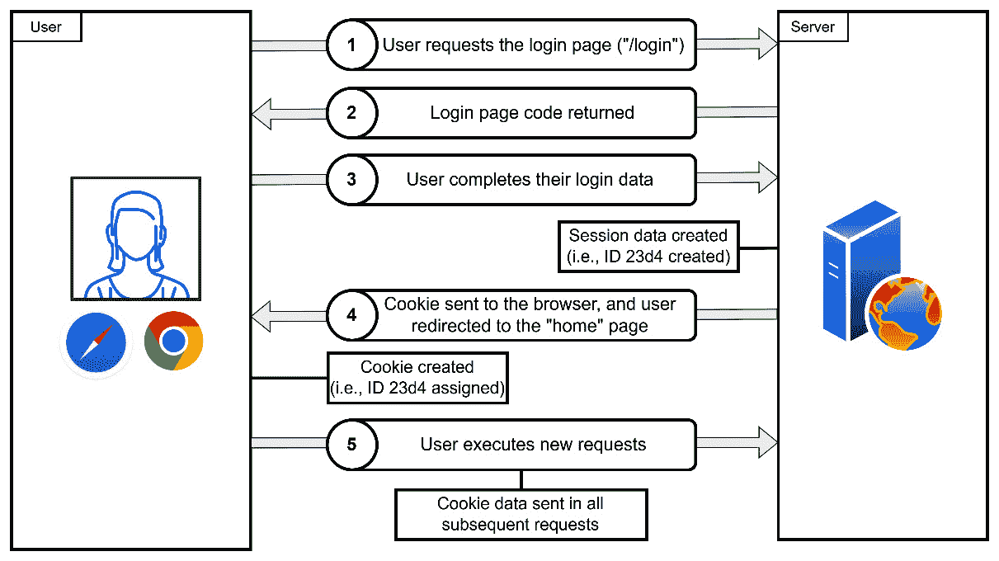
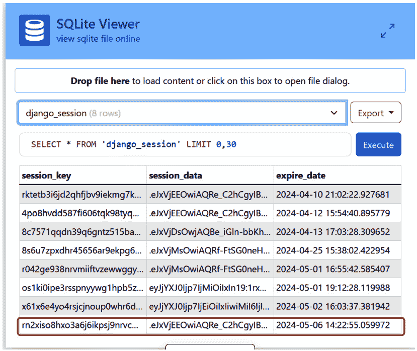
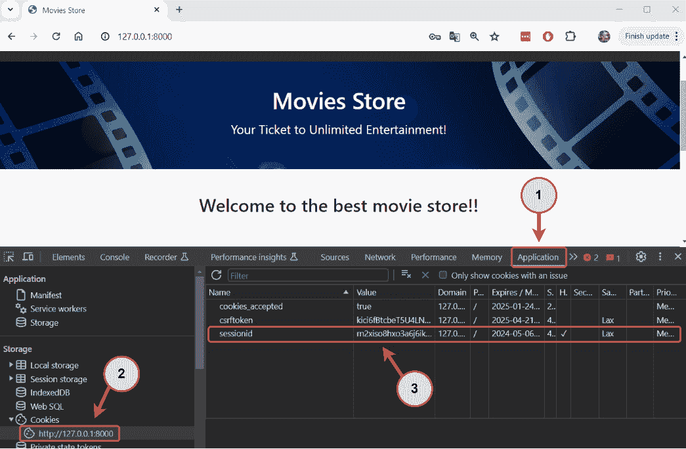
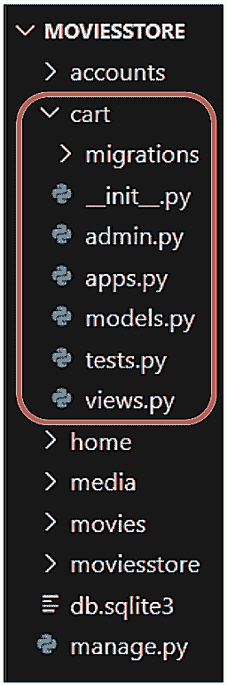
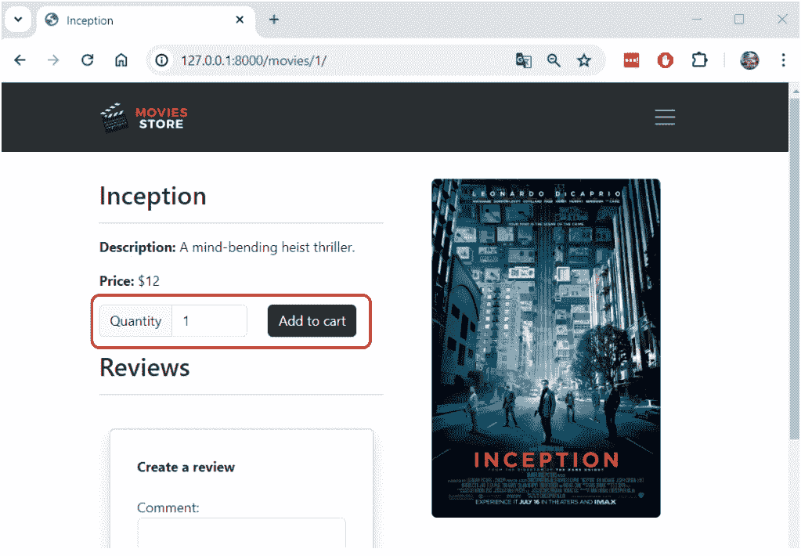
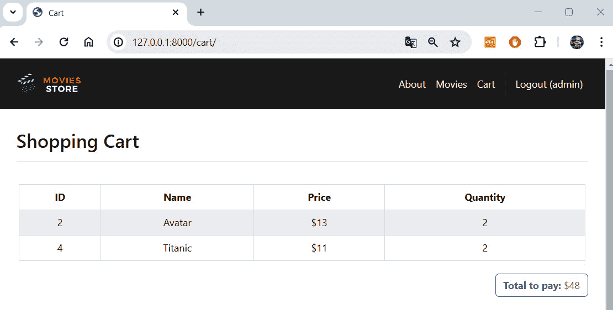
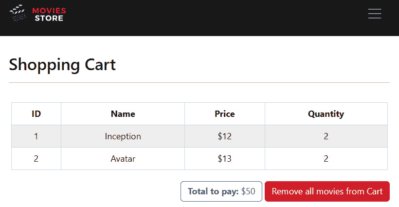

# <st c="0">10</st>

# <st c="3">实现购物车系统</st>

<st c="39">在本章中，我们将学习如何为网站创建购物车。</st> <st c="121">为了实现这一功能，我们需要了解</st> <st c="169">如何</st> **<st c="174">使用网络会话</st>** <st c="186">以及如何使用</st> **<st c="207">Django 会话</st>**<st c="222">。Django 会话</st> <st c="239">将用于在用户浏览网站时存储特定于用户的信息。</st>

<st c="322">在本章中，我们将涵盖以下主题：</st> <st c="364">包括：</st>

+   <st c="381">介绍</st> <st c="394">网络会话</st>

+   <st c="406">创建一个</st> <st c="418">购物车应用程序</st>

+   <st c="426">将电影添加到购物车</st> <st c="444">。</st>

+   <st c="452">列出添加到购物车的电影</st> <st c="477">。</st>

+   <st c="485">从购物车中删除电影</st> <st c="507">。</st>

<st c="515">到本章结束时，你将具备使用网络会话、实现购物车系统以及跟踪和维护同一用户之间请求的用户信息所需的知识。</st> <st c="697">。</st>

# <st c="707">技术要求</st>

<st c="730">在本章中，我们将使用</st> **<st c="765">Python 3.10+</st>**<st c="777">。此外，我们将在本书中使用</st> **<st c="814">Visual Studio Code</st>** <st c="821">编辑器，您可以从</st> <st c="866">以下位置</st> [<st c="871">https://code.visualstudio.com/</st>](https://code.visualstudio.com/)<st c="901">下载。</st>

<st c="902">本章的代码位于</st> <st c="940">以下位置</st> [<st c="943">https://github.com/PacktPublishing/Django-5-for-the-Impatient-Second-Edition/tree/main/Chapter10/moviesstore</st>](https://github.com/PacktPublishing/Django-5-for-the-Impatient-Second-Edition/tree/main/Chapter10/moviesstore)<st c="1051">。</st>

<st c="1052">本章的 CiA 视频可以在</st> <st c="1097">以下位置找到</st> [<st c="1100">https://packt.link/mEcH8</st>](https://packt.link/mEcH8)

# <st c="1124">介绍网络会话</st>

<st c="1149">你理解登录系统是如何工作的吗？</st> <st c="1200">应用程序是如何识别我的连接状态的？</st> <st c="1257">它是如何区分为已登录用户显示注销按钮和为未连接的朋友显示登录按钮的？</st> <st c="1391">应用程序会保留我的</st> <st c="1431">连接状态多长时间？</st>

<st c="1449">在本章中，我们将解答这些问题，并探讨网络会话在 Web 应用程序开发中的重要性。</st> <st c="1582">我们将按照以下顺序探讨这些元素：</st>

1.  <st c="1636">HTTP</st> <st c="1642">协议限制</st>

1.  <st c="1662">网络会话</st>

1.  <st c="1675">Django</st> <st c="1683">登录场景</st>

1.  <st c="1697">Django 会话</st>

## <st c="1713">HTTP 协议限制</st>

<st c="1739">目前，我们与电影商店网站的交互依赖于 HTTP 协议。</st> <st c="1826">例如，要访问电影信息，我们使用</st> `<st c="1880">http://localhost:8000/movies</st>`<st c="1908">，而登录时使用</st> `<st c="1937">http://localhost:8000/login</st>`<st c="1964">。我们发出的每个请求都使用 HTTP 协议作为其</st> <st c="2021">通信媒介。</st>

<st c="2042">尽管如此，HTTP 协议有其局限性。</st> <st c="2096">它以</st> **<st c="2113">无状态</st>** <st c="2122">方式运行，这意味着服务器在连续请求之间不保留任何信息（状态）。</st> <st c="2224">每次新的请求都会建立一个新的连接，消除对先前交互的任何了解。</st> <st c="2334">本质上，它缺乏对</st> <st c="2366">过去行为的记忆。</st>

<st c="2379">然而，当登录到应用程序后，后续请求会显示一个注销按钮，这表明应用程序能够识别用户并维护状态数据。</st> <st c="2548">此功能是通过 Django 会话实现的，它增强了 HTTP 协议的功能。</st>

## <st c="2656">Web 会话</st>

<st c="2669">一个</st> **<st c="2672">Web 会话</st>** <st c="2683">由</st> <st c="2693">在指定时间内访问者在网站上执行的一系列连续操作组成。</st> <st c="2790">每个框架都提供自己的方法来实现会话，以监控访问者的活动。</st> *<st c="2886">图 10</st>**<st c="2895">.1</st>* <st c="2897">说明了 Django 会话的工作原理。</st>



<st c="3299">图 10.1 – Django 会话操作的示例</st>

<st c="3353">让我们分析</st> <st c="3372">之前的场景：</st>

1.  <st c="3390">用户导航到登录页面</st> <st c="3428">在</st> `<st c="3431">http://localhost:8000/login</st>`<st c="3458">。</st>

1.  <st c="3459">然后 Django 向用户发送一个包含</st> <st c="3523">登录表单</st>的 HTTP 响应。</st>

1.  <st c="3534">用户填写登录表单并点击</st> **<st c="3585">登录</st>** <st c="3590">按钮。</st> <st c="3599">Django 验证用户数据，如果准确无误，则为用户创建会话数据，并分配一个 ID 或</st> <st c="3713">一个</st> **<st c="3716">会话密钥</st>**<st c="3727">。默认情况下，会话数据存储在数据库中（我们将在下一节中看到其操作）。</st>

1.  <st c="3831">Django 向用户的浏览器发送一个 cookie。</st> <st c="3877">这个 cookie 包含一个会话 ID，用于在后续请求中检索用户的会话数据。</st> <st c="3986">登录成功后，Django 将用户重定向到</st> <st c="4043">主页。</st>

1.  <st c="4053">每个后续请求都会渲染带有</st> **<st c="4119">注销</st>** <st c="4125">按钮的导航菜单，因为会话 ID 包含在用户的请求中。</st> <st c="4188">这个过程会一直持续到用户点击</st> **<st c="4240">注销</st>** <st c="4246">按钮（这将删除会话数据和 cookie），或者直到会话过期，默认为</st> <st c="4351">两周。</st>

<st c="4361">现在我们已经学习了 Django 会话的工作原理，让我们用我们的电影</st> <st c="4448">商店项目来复制它。</st>

## <st c="4462">Django 登录场景</st>

<st c="4484">让我们按照以下步骤</st> <st c="4513">来查看 Django 会话的实际操作：</st>

1.  <st c="4546">在隐身模式下运行应用程序，转到</st> `<st c="4592">http://localhost:8000/login</st>`<st c="4619">，并使用已注册用户的凭据进行</st> <st c="4678">登录。</st>

1.  <st c="4685">转到</st> [<st c="4692">https://inloop.github.io/sqlite-viewer/</st>](https://inloop.github.io/sqlite-viewer/)<st c="4731">，将您的</st> `<st c="4752">db.sqlite3</st>` <st c="4762">文件拖放到页面上，然后选择</st> `<st c="4803">django_session</st>` <st c="4817">表。</st> <st c="4825">您将看到与刚刚登录的用户对应的新的</st> `<st c="4844">session_key</st>`<st c="4855">，</st> `<st c="4857">session_data</st>`<st c="4869">，和</st> `<st c="4875">expire_date</st>` <st c="4886">（</st>*<st c="4933">图 10</st>**<st c="4943">.2</st>*<st c="4945">）。</st>



<st c="5833">图 10.2 – django_session 表</st>

1.  <st c="5871">之前的</st> <st c="5885">Django 会话数据包含一个 cookie。</st> <st c="5926">打开您的浏览器，确认您位于</st> **<st c="5980">电影商店</st>** <st c="5992">主页上，并打开开发者控制台。</st> <st c="6036">对于 Google Chrome，您可以通过</st> *<st c="6095">Shift</st>* <st c="6100">+</st> *<st c="6103">Ctrl</st>* <st c="6107">+</st> *<st c="6110">J</st>* <st c="6111">(在 Windows/Linux 上)，或者</st> *<st c="6135">option</st>* <st c="6141">+</st> *<st c="6144">⌘</st>* <st c="6145">+</st> *<st c="6148">J</st>* <st c="6149">(在 macOS 上)来打开开发者控制台。</st>

1.  <st c="6161">然后，导航到</st> `<st c="6221">http://127.0.0.1:8000</st>` <st c="6242">选项，您将看到存储的 cookie 数据，其中包括一个</st> `<st c="6309">sessionid</st>` <st c="6318">与数据库中存储的</st> `<st c="6341">session_key</st>` <st c="6352">相匹配（</st>*<st c="6377">图 10</st>**<st c="6387">.3</st>*<st c="6389">）。</st>



<st c="6786">图 10.3 – 电影商店 cookie 数据</st>

<st c="6828">这就是 Django 跟踪我们的网站交互的方式；如果你点击</st> **<st c="6897">注销</st>** <st c="6903">按钮，所有这些数据</st> <st c="6926">都将消失。</st>

<st c="6941">注意</st>

<st c="6946">会话数据不仅在登录场景中创建，也不只是为登录用户创建。</st> <st c="7042">如果你的应用程序在任何时候利用 Django 的会话功能，它也会生成相应的会话和 cookie 数据。</st> <st c="7183">我们将在实现购物车系统时看到这一点。</st> <st c="7260">有关</st> <st c="7296">Django 会话</st>的更多信息，请参阅：</st> [<st c="7318">https://docs.djangoproject.com/en/5.0/topics/http/sessions/</st>](https://docs.djangoproject.com/en/5.0/topics/http/sessions/)<st c="7377">。</st>

## <st c="7378">Django 会话</st>

**<st c="7394">Django 会话</st>** <st c="7410">是在 Web 应用程序中跨 HTTP 请求持久化数据的一种机制。</st> <st c="7490">它们允许 Django 在多个请求中为特定用户存储和检索任意数据。</st> <st c="7591">以下是关于</st> <st c="7622">Django 会话</st>的一些关键点：

+   **<st c="7638">客户端 cookies</st>**<st c="7658">：默认情况下，Django 会话是通过客户端 cookies 实现的。</st> <st c="7732">Django</st> <st c="7739">通常会在用户的浏览器中设置一个唯一的会话 ID，作为</st> <st c="7798">cookie。</st>

+   **<st c="7807">服务器端存储</st>**<st c="7827">：虽然会话 ID 存储在客户端的浏览器中，但实际的会话数据存储在服务器端。</st> <st c="7933">默认情况下，会话数据存储在</st> <st c="7975">数据库中。</st>

+   **<st c="7988">配置选项</st>**<st c="8010">：Django 为会话提供了各种配置选项，包括</st> <st c="8081">会话引擎（例如，数据库支持、缓存、基于文件），会话过期时间和会话数据的加密。</st>

+   **<st c="8197">与认证集成</st>**<st c="8229">：Django 会话通常与 Django 的认证</st> <st c="8288">系统一起工作。</st> <st c="8296">例如，当用户登录时，他们的认证状态通常会存储在会话中，使得 Django 能够在多个请求之间保持用户登录状态，直到他们明确退出或</st> <st c="8499">会话过期。</st>

+   `<st c="8602">request.session</st>` <st c="8617">属性。</st> <st c="8629">这允许它们在请求处理过程中根据需要读取、修改和删除会话数据。</st>

<st c="8723">现在我们已经学习了 Web 会话和 Django 会话的基础知识，让我们开始创建</st> <st c="8826">购物车应用</st>。

# <st c="8835">创建购物车应用</st>

<st c="8855">所有购物车</st> <st c="8878">功能将由它们自己的应用管理。</st> <st c="8936">因此，让我们创建一个购物车应用。</st> <st c="8965">导航到最顶部的</st> `<st c="8985">moviesstore</st>` <st c="8996">文件夹（包含</st> `<st c="9032">manage.py</st>` <st c="9041">文件的文件夹）并在终端中运行以下命令：</st>

+   <st c="9086">对于 macOS，运行以下命令：</st> <st c="9106">以下命令：</st>

    ```py
    <st c="9124">python3 manage.py startapp cart</st>
    ```

+   <st c="9156">对于 Windows，运行以下命令：</st>

    ```py
    <st c="9196">python manage.py startapp cart</st>
    ```

*<st c="9227">图 10</st>**<st c="9237">.4</st>* <st c="9239">显示了新的项目结构。</st> <st c="9273">请确认它与您当前的文件夹结构相匹配。</st>



<st c="9492">图 10.4 – 包含购物车应用的 MOVIESSTORE 项目结构</st>

## <st c="9563">在设置中添加购物车应用</st>

<st c="9591">记住</st> <st c="9600">对于每个新创建的应用，我们必须在</st> `<st c="9661">settings.py</st>` <st c="9672">文件中注册它。</st> <st c="9679">在</st> `<st c="9682">/moviesstore/settings.py</st>`<st c="9706">中，在</st> `<st c="9714">INSTALLED_APPS</st>`<st c="9728">下，添加以下加粗行：</st> <st c="9754">以下内容：</st>

```py
 …
INSTALLED_APPS = [
    …
    'movies',
    'accounts', <st c="9807">'cart',</st> ]
…
```

## <st c="9178">包括购物车 URL 文件到项目级别的 URL 文件中</st>

<st c="9876">在</st> `<st c="9880">/moviesstore/urls.py</st>`<st c="9900">中，添加以下加粗行：</st> <st c="9905">以下内容：</st>

```py
 …
urlpatterns = [
    path('admin/', admin.site.urls),
    path('', include('home.urls')),
    path('movies/', include('movies.urls')),
    path('accounts/', include('accounts.urls')), <st c="10103">path('cart/', include('cart.urls')),</st> ]
…
```

<st c="10143">在</st> `<st c="10181">cart.urls</st>` <st c="10190">文件中定义的所有 URL 都将包含一个</st> `<st c="10211">cart/</st>` <st c="10216">前缀（如前一个路径中定义的）。</st> <st c="10259">我们将在稍后创建</st> `<st c="10278">cart.urls</st>` <st c="10287">文件。</st>

<st c="10299">现在我们已经创建了购物车应用，让我们允许将电影添加到</st> <st c="10377">购物车。</st>

# <st c="10386">将电影添加到购物车</st>

<st c="10412">为了允许将电影添加到购物车，我们将遵循以下步骤：</st> <st c="10435">以下步骤：</st>

1.  <st c="10488">配置</st> `<st c="10503">add_to_cart</st>` <st c="10514">URL。</st>

1.  <st c="10519">定义</st> `<st c="10531">add_to_cart</st>` <st c="10542">函数。</st>

1.  <st c="10552">更新</st> `<st c="10559">movies.show</st>` <st c="10564">模板。</st>

## <st c="10585">配置 add_to_cart URL</st>

<st c="10617">在</st> `<st c="10621">/cart/</st>`<st c="10627">中，创建一个名为</st> `<st c="10641">urls.py</st>`<st c="10661">的新文件。此文件将包含关于购物车应用 URL 的路径。</st> <st c="10731">目前，请用以下内容填充它：</st> <st c="10756">以下内容：</st>

```py
 from django.urls import path
from . import views
urlpatterns = [
    path('<int:id>/add/', views.add, name='cart.add'),
]
```

<st c="10888">我们添加了一个名为</st> `<st c="10916">cart/<int:id>/add</st>` <st c="10933">的新路径（记住项目级别的 URL 文件为该文件定义了一个</st> `<st c="10987">/cart</st>` <st c="10992">前缀）。</st> <st c="11016">其中</st> `<st c="11020"><int:id></st>` <st c="11028">部分表示该路径期望从 URL 传递一个整数值，并且该整数值将与名为</st> `<st c="11178">id</st>`<st c="11180">的变量相关联。</st> <st c="11186">id</st> <st c="11188">变量将用于识别我们想要添加到购物车中的电影。</st> <st c="11263">例如，</st> `<st c="11280">cart/1/add</st>` <st c="11290">路径表示我们想要将</st> `<st c="11341">id=1</st>` <st c="11345">的电影添加到</st> `<st c="11349">购物车中。</st>

## <st c="11358">定义 add_to_cart 函数</st>

<st c="11388">在</st> `<st c="11392">/cart/views.py</st>`<st c="11406">中，添加以下</st> <st c="11425">行</st> <st c="11432">（加粗）：</st>

```py
 from django.shortcuts import render <st c="11477">from django.shortcuts import get_object_or_404, redirect</st>
<st c="11533">from movies.models import Movie</st>
<st c="11565">def add(request, id):</st>
 <st c="11587">get_object_or_404(Movie, id=id)</st>
 <st c="11619">cart = request.session.get('cart', {})</st>
 <st c="11658">cart[id] = request.POST['quantity']</st>
 <st c="11694">request.session['cart'] = cart</st>
 <st c="11725">return redirect('home.index')</st>
```

<st c="11755">让我们解释一下</st> <st c="11773">之前的代码：</st>

+   <st c="11788">我们导入</st> `<st c="11803">redirect</st>` <st c="11811">和</st> `<st c="11816">get_object_or_404</st>` <st c="11833">函数。</st> <st c="11845">我们还从“</st><st c="11864">movies</st>" 应用程序中导入 `<st c="11869">Movie</st>` <st c="11869">模型。</st>

+   <st c="11899">我们定义了一个</st> `<st c="11914">add</st>` <st c="11917">函数，它接受两个参数：请求和</st> <st c="11976">电影 ID。</st>

+   <st c="11985">我们从数据库中获取</st> `<st c="11999">Movie</st>` <st c="12004">对象，使用给定的</st> `<st c="12027">id</st>` <st c="12029">（通过使用</st> `<st c="12062">get_object_or_404</st>` <st c="12079">函数）。</st> <st c="12091">如果没有找到此类对象，将引发一个 404（未找到）错误。</st>

+   <st c="12153">我们检查会话存储中是否存在一个名为</st> `<st c="12200">'cart'</st>`<st c="12206">的键。如果该键不存在，则将一个</st> `<st c="12237">{}</st>` <st c="12239">空字典分配给</st> `<st c="12276">cart</st>` <st c="12280">变量。</st>

+   <st c="12290">我们修改了</st> `<st c="12305">cart</st>` <st c="12309">变量。</st> <st c="12320">我们根据电影 ID 在</st> `<st c="12344">cart</st>` <st c="12348">字典中添加一个新的键，并根据用户想要添加到购物车中的电影数量设置相应的值（我们将在稍后通过 HTML 表单收集</st> `<st c="12490">quantity</st>` <st c="12498">）。</st> <st c="12528">例如，如果用户想要添加</st> `<st c="12566">2</st>` <st c="12567">部</st> `<st c="12580">id=1</st>`<st c="12584">的电影，将添加一个新键/值，例如</st> `<st c="12615">cart["1"] = "2"</st>` <st c="12630">到</st> `<st c="12648">字典中。</st>

+   <st c="12663">更新后的</st> `<st c="12676">购物车</st>` <st c="12680">字典随后使用</st> `<st c="12732">request.session['cart'] =</st>` `<st c="12758">cart</st>`<st c="12762">.</st>

+   <st c="12763">在</st> `<st c="12770">更新购物车后</st>，我们将用户重定向到主页（</st>`<st c="12828">home.index</st>`<st c="12839">）。</st>

<st c="12842">现在，让我们更新</st> `<st c="12865">movies.show</st>` <st c="12876">模板，以包含一个用于将电影添加到</st> `<st c="12921">购物车</st>` <st c="12921">的表单。</st>

## <st c="12930">更新 movies.show 模板</st>

<st c="12964">在</st> `<st c="12972">/movies/templates/movies/show.html</st>` <st c="13006">文件中，添加以下以粗体显示的</st> `<st c="13017">行：</st>`

```py
 …
        <p><b>Description:</b> {{
          template_data.movie.description }}</p>
        <p>
          <b>Price:</b> ${{ template_data.movie.price }}
        </p> <st c="13168"><p class="card-text"></st>
 <st c="13189"><form method="post"</st>
 <st c="13209">action=""></st>
 <st c="13266"><div class="row"></st>
 <st c="13284"></st>
 <st c="13301"><div class="col-auto"></st>
 <st c="13324"><div class="input-group col-auto"></st>
 <st c="13359"><div class="input-group-text">Quantity</st>
 <st c="13398"></div></st>
**<st c="13405"><input type="number" min="1" max="10"</st>**
 **<st c="13443">class="form-control quantity-input"</st>**
 **<st c="13479">name="quantity" value="1"></st>**
 **<st c="13506"></div></st>**
 **<st c="13513"></div></st>**
 **<st c="13520"><div class="col-auto"></st>**
 **<st c="13543"><button class="btn bg-dark text-white"</st>**
 **<st c="13582">type="submit">Add to cart</button></st>**
 **<st c="13617"></div></st>**
 **<st c="13624"></div></st>**
****<st c="13631"></form></st>**
 **<st c="13639"></p></st>** <st c="13644">…</st>**
```

****<st c="13645">我们</st> `<st c="13648">添加了一个新的表单，允许用户将电影添加到购物车。</st> `<st c="13707">此表单还包括一个输入字段，用于指定用户希望添加到购物车的电影数量。</st> `<st c="13819">该表单链接到</st> `<st c="13845">'cart.add'</st>` `<st c="13855">路径，并将电影</st> `<st c="13882">id</st>` `<st c="13884">作为表单操作的</st> `<st c="13900">一部分。</st>`

<st c="13912">现在，保存这些文件，运行服务器，访问</st> `<st c="13958">http://localhost:8000/movies</st>`<st c="13986">，点击一个特定的电影，你将看到可用的</st> **<st c="14036">添加到购物车</st>** <st c="14047">功能（</st>*<st c="14073">图 10</st>**<st c="14083">.5</st>*<st c="14085">）。</st>



<st c="14265">图 10.5 – 带有“添加到购物车”功能的电影页面</st>

<st c="14324">我们成功添加了一个按钮来添加电影到购物车。</st> `<st c="14383">现在，让我们继续列出添加到</st> `<st c="14433">购物车</st>` <st c="14433">的电影。</st>

# <st c="14442">列出添加到购物车的电影</st>

<st c="14475">为了</st> <st c="14478">让我们能够列出添加到购物车的电影，我们将遵循以下</st> `<st c="14541">步骤：</st>`

1.  <st c="14552">配置购物车</st> `<st c="14572">索引 URL。</st>`

1.  <st c="14582">定义一个</st> `<st c="14592">utils</st>` <st c="14597">文件。</st>

1.  <st c="14603">定义一个</st> `<st c="14611">过滤器。</st>`

1.  <st c="14620">定义一个</st> `<st c="14631">索引</st>` <st c="14636">函数。</st>

1.  <st c="14646">创建</st> `<st c="14660">cart.index</st>` <st c="14670">模板。</st>

1.  <st c="14680">更新</st> `<st c="14694">add_to_cart</st>` `<st c="14705">函数。</st>

1.  <st c="14715">在</st> `<st c="14737">基本模板</st>` <st c="14737">中添加链接。</st>

## <st c="14751">配置购物车索引 URL</st>

<st c="14778">在</st> `<st c="14782">/cart/urls.py</st>`<st c="14795">中，通过添加以下以粗体显示的</st> `<st c="14805">行来添加下一个路径：</st>`

```py
 from django.urls import path
from . import views
urlpatterns = [ <st c="14909">path('', views.index, name='cart.index'),</st> path('<int:id>/add/', views.add, name='cart.add'),
]
```

<st c="15003">我们定义了一个</st> `<st c="15017">''</st>` <st c="15019">路径，但请记住，项目级别的 URL 文件为该文件定义了一个</st> `<st c="15080">/cart</st>` <st c="15085">前缀。</st> <st c="15108">因此，如果一个 URL 与</st> `<st c="15133">/cart</st>` <st c="15138">路径匹配，它将执行</st> `<st c="15165">index</st>` <st c="15170">函数，该函数定义在</st> `<st c="15190">views</st>` <st c="15195">文件中。</st> <st c="15207">我们将在稍后实现</st> `<st c="15229">index</st>` <st c="15234">函数。</st>

## <st c="15250">定义一个 utils 文件</st>

<st c="15272">通常，购物车页面会显示</st> <st c="15305">需要支付的总金额。</st> <st c="15331">这是通过将电影的价格根据其对应数量相加来计算的。</st> <st c="15427">我们将定义一个</st> `<st c="15444">calculate_cart_total</st>` <st c="15464">函数来完成这个过程。</st> <st c="15499">然而，不建议将此类函数放置在</st> `<st c="15575">views</st>` <st c="15580">文件或</st> `<st c="15593">models</st>` <st c="15599">文件中。</st> <st c="15606">因此，我们将创建一个名为 utilities (</st>`<st c="15645">utils</st>`<st c="15651">) 的文件，并将此函数放置在其中以便</st> <st c="15702">易于重用。</st>

<st c="15716">在</st> `<st c="15720">/cart/</st>`<st c="15726">目录下，创建一个名为</st> `<st c="15753">utils.py</st>`<st c="15761">的新文件。目前，可以将其填充为以下内容：</st>

```py
 def calculate_cart_total(cart, movies_in_cart):
    total = 0
    for movie in movies_in_cart:
        quantity = cart[str(movie.id)]
        total += movie.price * int(quantity)
    return total
```

<st c="15970">让我们解释一下</st> <st c="15989">之前的代码：</st>

+   <st c="16003">我们定义了一个</st> `<st c="16018">calculate_cart_total</st>` <st c="16038">函数，它接受两个参数：</st> `<st c="16077">cart</st>` <st c="16081">和</st> `<st c="16086">movies_in_cart</st>`<st c="16100">。`<st c="16106">cart</st>` <st c="16110">参数是一个字典，表示用户的购物车。</st> <st c="16179">请记住，键是表示电影 ID 的字符串，值是表示购物车中每部电影数量的字符串。</st> <st c="16320">`<st c="16324">movies_in_cart</st>` <st c="16338">参数是一个表示购物车中电影的</st> `<st c="16362">Movie</st>` <st c="16367">对象的列表。</st>

+   <st c="16412">我们通过</st> `<st c="16429">total</st>` <st c="16434">变量</st> <st c="16444">初始化</st> `<st c="16447">0</st>`<st c="16448">。</st>

+   <st c="16449">我们遍历购物车中的电影列表。</st> <st c="16501">对于每部电影，我们提取添加到购物车中的对应数量，并将其乘以电影的价格。</st> <st c="16611">然后，我们将该电影的总成本添加到</st> `<st c="16660">total</st>` <st c="16665">变量中。</st>

+   <st c="16675">最后，我们返回</st> <st c="16699">total</st> 变量。</st>

在总结中，`<st c="16714">calculate_cart_total</st>` `<st c="16747">通过遍历购物车中的每部电影，将电影的价格乘以其数量，并</st>` `<st c="16900">计算总成本来计算用户购物车中电影的总额。</st>` `<st c="16928">这个函数将在后面的</st>` `<st c="16968">views</st>` `<st c="16973">文件中使用。</st>`

## 定义一个过滤器

`<st c="17153">|</st>` `<st c="17155">)`字符是自定义模板数据展示的强大工具。

我们想要列出添加到购物车中的电影，并显示每部电影的数量。<st c="17332">这需要访问购物车会话数据，并使用每部电影的 ID 作为键来获取</st>` `<st c="17424">数量</st>` `<st c="17432">值。</st>` `<st c="17440">虽然这可能听起来并不复杂，但 Django 模板被设计得简单，主要关注渲染视图提供的数据。</st>` `<st c="17585">有时，Django 模板不允许访问依赖于其他变量或复杂数据结构的数据。</st>` `<st c="17700">在这种情况下，您需要创建一个自定义过滤器或标签。</st>` `<st c="17763">我们将创建一个自定义过滤器来访问购物车中电影的</st>` `<st c="17808">数量</st>` `<st c="17816">数据。</st>`

在`<st c="17849">/cart/</st>` `<st c="17853">`中创建一个`<st c="17870">templatetags</st>` `<st c="17882">文件夹。</st>` `<st c="17891">然后，在</st>` `<st c="17900">/cart/templatetags/</st>` `<st c="17919">创建一个名为</st>` `<st c="17945">cart_filters.py</st>` `<st c="17960">的新文件。</st>` `<st c="17987">目前，请用以下内容填充它：</st>` `<st c="17987">`

```py
 from django import template
register = template.Library()
@register.filter(name='get_quantity')
def get_cart_quantity(cart, movie_id):
    return cart[str(movie_id)]
```

让我们解释一下之前的代码：</st>

+   我们导入`<st c="18196">template</st>` `<st c="18211">模块，它提供了用于处理</st>` `<st c="18219">Django 模板</st>` `<st c="18270">的实用工具。</st>`

+   我们使用`<st c="18287">register = template.Library()</st>` `<st c="18328">代码来创建一个`<st c="18359">template.Library</st>` `<st c="18375">`的实例，它用于注册自定义模板标签和过滤器。</st>

+   我们使用`<st c="18436">@register.filter(name='get_quantity')</st>` `<st c="18485">装饰器来注册</st> `<st c="18512">get_cart_quantity</st>` `<st c="18529">函数作为一个名为</st> `<st c="18573">get_quantity</st>` `<st c="18585">的自定义模板过滤器</st>`。`<st c="18591">name='get_quantity'</st>` `<st c="18610">参数指定了过滤器在模板中使用时的名称。</st>` `<st c="18672">`

+   <st c="18685">我们定义了</st> `<st c="18700">get_cart_quantity</st>` <st c="18717">函数，它接受两个参数：</st> `<st c="18759">cart</st>` <st c="18763">会话字典，以及所需数量的电影的 ID。</st>

+   <st c="18841">我们通过使用</st> `<st c="18856">quantity</st>` <st c="18864">值，通过</st> `<st c="18884">cart</st>` <st c="18888">字典和</st> `<st c="18904">movie_id</st>` <st c="18912">作为键来访问。</st> <st c="18925">我们将</st> `<st c="18936">movie_id</st>` <st c="18944">转换为字符串以确保与</st> `<st c="18990">购物车键</st>` <st c="18990">的兼容性。</st>

+   <st c="19000">最后，我们</st> <st c="19013">返回相应的</st> `<st c="19038">quantity</st>` <st c="19046">值。</st>

<st c="19053">注意</st>

<st c="19058">一旦自定义过滤器被定义并注册，你就可以在 Django 模板中使用它，如下所示：</st> `<st c="19159">{{</st>` `<st c="19162">request.session.cart|get_quantity:movie.id }}</st>`

<st c="19207">在先前的例子中，</st> `<st c="19238">get_quantity</st>` <st c="19250">过滤器被应用于</st> `<st c="19272">request.session.cart</st>` <st c="19292">，使用</st> `<st c="19302">movie.id</st>` <st c="19310">参数来获取购物车中特定电影的数量。</st>

<st c="19377">你可以在</st> [<st c="19444">https://docs.djangoproject.com/en/5.0/howto/custom-template-tags/</st>](https://docs.djangoproject.com/en/5.0/howto/custom-template-tags/)<st c="19509">中找到有关自定义过滤器和标签的更多信息。</st>

<st c="19510">我们已经设计了我们需要的所有元素来实现购物车</st> <st c="19575">索引功能。</st>

## <st c="19590">定义一个索引函数</st>

<st c="19617">在</st> `<st c="19621">/cart/views.py</st>`<st c="19635">中，添加以下</st> <st c="19654">粗体内容：</st>

```py
 from django.shortcuts import render
from django.shortcuts import get_object_or_404, redirect
from movies.models import Movie <st c="19789">from .utils import calculate_cart_total</st>
<st c="19828">def index(request):</st>
 <st c="19848">cart_total = 0</st>
 <st c="19863">movies_in_cart = []</st>
 <st c="19883">cart = request.session.get('cart', {})</st>
 <st c="19922">movie_ids = list(cart.keys())</st>
 <st c="19952">if (movie_ids != []):</st>
 <st c="19974">movies_in_cart =</st>
 <st c="19991">Movie.objects.filter(id__in=movie_ids)</st>
 <st c="20030">cart_total = calculate_cart_total(cart,</st>
 <st c="20070">movies_in_cart)</st>
 <st c="20086">template_data = {}</st>
 <st c="20105">template_data['title'] = 'Cart'</st>
 <st c="20137">template_data['movies_in_cart'] = movies_in_cart</st>
 <st c="20186">template_data['cart_total'] = cart_total</st>
 <st c="20227">return render(request, 'cart/index.html',</st>
 <st c="20269">{'template_data': template_data})</st> def add(request, id):
    …
```

<st c="20327">让我们解释一下</st> <st c="20345">之前的代码：</st>

+   <st c="20360">我们从</st> `<st c="20375">utils</st>` <st c="20395">文件中导入</st> `<st c="20414">calculate_cart_total</st>` <st c="20419">函数。</st>

+   <st c="20425">我们定义了</st> `<st c="20440">index</st>` <st c="20445">函数。</st>

+   <st c="20455">我们将</st> `<st c="20474">cart_total</st>` <st c="20484">初始化为</st> `<st c="20488">0</st>`<st c="20489">，并将</st> `<st c="20495">movies_in_cart</st>` <st c="20509">初始化为一个空列表。</st>

+   <st c="20527">我们使用</st> `<st c="20584">request.session.get('cart', {})</st>`<st c="20615">从会话中检索购物车信息。</st>

+   <st c="20616">根据</st> `<st c="20683">购物车键</st>` <st c="20683">，我们提取添加到购物车中的电影 ID。</st>

+   如果购物车中有任何电影 ID，该函数将使用 `<st c="20800">Movie.objects.filter(id__in=movie_ids)</st>` `<st c="20838">查询数据库以获取具有这些 ID 的电影。此外，我们使用` `<st c="20918">calculate_cart_total</st>` `<st c="20938">函数</st>` 计算购物车中电影的总额，该函数更新了` `<st c="20967">cart_total</st>` `<st c="20977">变量。</st>`

+   最后，我们准备 `<st c="21012">template_data</st>` `<st c="21025">字典并渲染` `<st c="21052">cart/index.html</st>` `<st c="21067">模板。</st>`

总结来说，`<st c="21094">index</st>` `<st c="21099">函数</st>` `<st c="21108">旨在渲染购物车页面，显示购物车中的电影以及这些电影的总额。</st>

## 创建 `cart.index` 模板

在 `<st c="21249">/cart/</st>` `<st c="21255">，创建一个` `<st c="21264">templates</st>` `<st c="21275">文件夹。</st>` 然后，在 `<st c="21293">/cart/templates/</st>` `<st c="21309">，创建一个` `<st c="21320">cart</st>` `<st c="21324">文件夹。</st>`

现在，在 `<st c="21341">/cart/templates/cart/</st>`<st c="21362">，创建一个</st> `<st c="21373">新文件</st>`，`<st c="21383">index.html</st>`<st c="21393">。目前，用以下内容填充它：</st> `<st c="21420">以下内容：</st>`

```py
 



<div class="p-3">
  <div class="container">
    <div class="row mt-3">
      <div class="col mx-auto mb-3">
        <h2>Shopping Cart</h2>
        <hr />
      </div>
    </div>
    <div class="row m-1">
      <table class="table table-bordered table-striped
        text-center">
        <thead>
          <tr>
            <th scope="col">ID</th>
            <th scope="col">Name</th>
            <th scope="col">Price</th>
            <th scope="col">Quantity</th>
          </tr>
        </thead>
        <tbody>
          
          <tr>
            <td>{{ movie.id }}</td>
            <td>{{ movie.name }}</td>
            <td>${{ movie.price }}</td>
            <td>{{
              request.session.cart|get_quantity:movie.id }}
            </td>
          </tr>
          
        </tbody>
      </table>
    </div>
    <div class="row">
      <div class="text-end">
        <a class="btn btn-outline-secondary mb-2"><b>Total
          to pay:</b> ${{ template_data.cart_total }}</a>
      </div>
    </div>
  </div>
</div>

```

让我们解释一下之前的代码：

+   我们使用 `<st c="22360"></st>` `<st c="22383">标签</st>`，它加载在 `<st c="22440">cart_filters</st>` `<st c="22452">文件</st>` 中定义的自定义模板过滤器。在我们的例子中，它包括名为 `<st c="22501">get_quantity</st>` `<st c="22513">的过滤器。</st>`

+   我们创建一个 `<st c="22528">HTML 表格。</st>`

+   我们遍历购物车中的电影。对于每部电影，我们显示其 `<st c="22614">id</st>`<st c="22616">、</st>` `<st c="22618">name</st>`<st c="22622">、</st>` `<st c="22624">price</st>`<st c="22629">、</st>` 和 `<st c="22635">quantity</st>` `<st c="22643">在购物车中的数量。</st>` 为了显示购物车中的数量，我们使用 `<st c="22711">get_quantity</st>` `<st c="22723">过滤器。</st>`

+   最后，我们 `<st c="22744">显示</st>` `<st c="22756">购物车总额</st>` `<st c="22766">的值。</st>

## 更新 `add_to_cart` 函数

在 `<st c="22811">/cart/views.py</st>` `<st c="22825">，添加以下加粗的行：</st>

```py
 …
def add_to_cart(request, id):
    get_object_or_404(Movie, id=id)
    cart = request.session.get('cart', {})
    cart[id] = request.POST['quantity']
    request.session['cart'] = cart
    return redirect('<st c="23046">cart</st>.index')
```

如果用户将电影添加到购物车，他们现在将被重定向到 `<st c="23131">购物车页面。</st>`

## 在基础模板中添加链接

<st c="23176">最后，让我们</st> <st c="23192">在基本模板中添加购物车链接。</st> <st c="23232">在 `<st c="23235">/moviesstore/templates/base.html</st>`<st c="23267">中，在标题部分，添加以下</st> <st c="23316">行（粗体）：</st>

```py
 …
            <a class="nav-link"
              href="">About</a>
            <a class="nav-link"
              href="">Movies</a> <st c="23449"><a class="nav-link"</st>
 <st c="23468">href="">Cart</a></st> …
```

<st c="23508">现在，保存这些</st> <st c="23524">文件，运行服务器，转到</st> `<st c="23553">http://localhost:8000/movies</st>`<st c="23581">，点击几部电影，并将它们添加到购物车。</st> <st c="23638">然后，转到</st> **<st c="23654">购物车</st>** <st c="23658">部分，您将看到一个</st> **<st c="23686">购物车</st>** <st c="23690">页面及其对应的信息（</st>*<st c="23732">图 10</st>**<st c="23742">.6</st>*<st c="23744">）。</st>



<st c="23934">图 10.6 – 购物车页面</st>

<st c="23961">现在我们已经学会了如何实现购物车系统，让我们通过包括从购物车中删除电影的功能来完成本章。</st> <st c="24098">从</st> <st c="24098">购物车中删除电影。</st>

# <st c="24107">从购物车中删除电影</st>

<st c="24137">要</st> <st c="24140">从购物车中删除电影，我们将遵循以下</st> <st c="24189">步骤：</st>

1.  <st c="24200">配置一个</st> `<st c="24213">清晰的</st>` <st c="24218">URL。</st>

1.  <st c="24223">定义一个</st> `<st c="24235">清晰的</st>` <st c="24240">函数。</st>

1.  <st c="24250">更新</st> `<st c="24264">cart.index</st>` <st c="24274">模板。</st>

## <st c="24284">配置清晰的 URL</st>

<st c="24306">在 `<st c="24310">/cart/urls.py</st>`<st c="24323">中，通过添加以下</st> <st c="24333">行来添加下一个路径</st> <st c="24373">（粗体）：</st>

```py
 from django.urls import path
from . import views
urlpatterns = [
    path('', views.index, name='cart.index'),
    path('<int:id>/add/', views.add, name='cart.add'), <st c="24540">path('clear/', views.clear, name='cart.clear'),</st> ]
```

<st c="24589">我们定义了一个</st> `<st c="24601">cart/clear/</st>` <st c="24612">路径，该路径将执行在</st> `<st c="24640">views</st>` <st c="24675">文件中定义的</st> `<st c="24645">clear</st>` <st c="24670">函数。</st> <st c="24682">我们将在稍后实现</st> `<st c="24704">clear</st>` <st c="24709">函数。</st>

## <st c="24725">定义清晰的函数</st>

<st c="24749">在 `<st c="24753">/cart/views.py</st>`<st c="24767">中，在文件末尾添加以下</st> <st c="24776">行（粗体）：</st>

```py
 … <st c="24826">def clear(request):</st>
 <st c="24845">request.session['cart'] = {}</st>
 <st c="24874">return redirect('cart.index')</st>
```

<st c="24904">我们只需将用户的购物车会话更新为空字典。</st> <st c="24968">这将删除购物车中添加的所有先前电影，并将用户重定向到</st> <st c="25052">购物车页面。</st>

## <st c="25062">更新 cart.index 模板</st>

<st c="25095">在 `<st c="25103">/cart/templates/cart/index.html</st>` <st c="25134">文件中，添加以下</st> <st c="25144">行（粗体）：</st>

```py
 …
    <div class="row">
      <div class="text-end">
        <a class="btn btn-outline-secondary mb-2"><b>Total
          to pay:</b> ${{ template_data.cart_total }}</a> <st c="25315"></st>
 <st c="25363"><a href=""></st>
 <st c="25397"><button class="btn btn-danger mb-2"></st>
 <st c="25434">Remove all movies from Cart</st>
 <st c="25462"></button></st>
 <st c="25472"></a></st>
 <st c="25477"></st> </div>
    </div>
    …
```

<st c="25504">我们添加了一个</st> `<st c="25517">if</st>` <st c="25519">部分来检查购物车中是否有任何电影。</st> <st c="25579">如果有，我们显示一个按钮，允许用户清除</st> <st c="25643">购物车。</st>

<st c="25652">现在，保存这些文件，运行服务器，访问</st> `<st c="25698">http://localhost:8000/movies</st>`<st c="25726">，点击几部电影，并将它们添加到购物车。</st> <st c="25783">然后，转到</st> **<st c="25799">购物车</st>** <st c="25803">部分并点击</st> **<st c="25822">从购物车中移除所有电影</st>** <st c="25849">(</st>*<st c="25851">图 10</st>**<st c="25860">.7</st>*<st c="25862">).</st> <st c="25866">您将看到一个</st> <st c="25882">空购物车。</st>



<st c="25984">图 10.7 – 购物车页面</st>

# <st c="26011">总结</st>

<st c="26019">在本章中，我们学习了 Web 会话和 Django 会话的工作原理。</st> <st c="26091">我们创建了一个购物车应用程序，允许我们添加电影到购物车，列出已添加到购物车的电影，以及从购物车中移除电影。</st> <st c="26227">我们还了解到，</st> `<st c="26252">utils</st>` <st c="26257">文件用于存储可以在我们的应用程序中重复使用的函数。</st> <st c="26330">此外，我们还了解到过滤器允许我们修改或格式化在模板中显示的数据，并且我们学习了如何利用一些 Django 会话功能。</st> <st c="26501">在下一章中，我们将创建订单和项目模型，以便用户可以</st> <st c="26582">购买电影。</st>****
