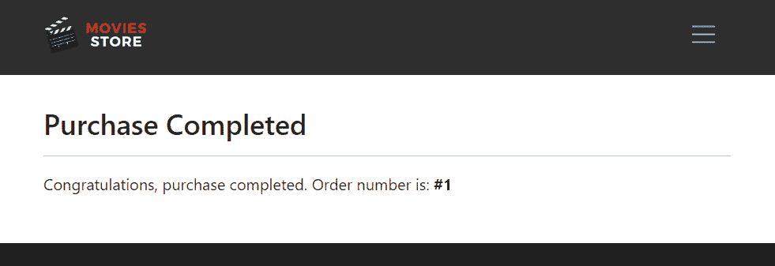
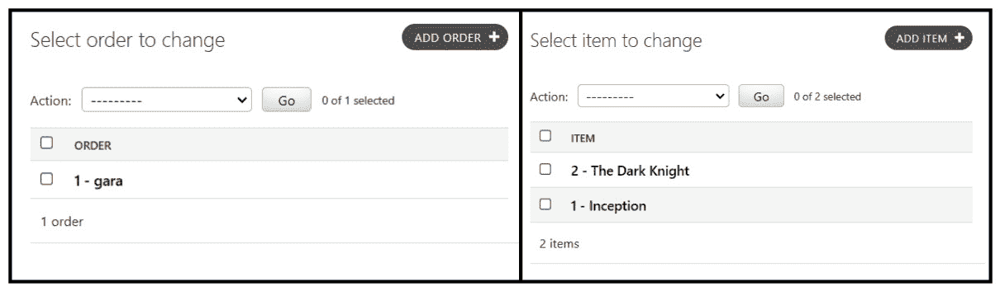
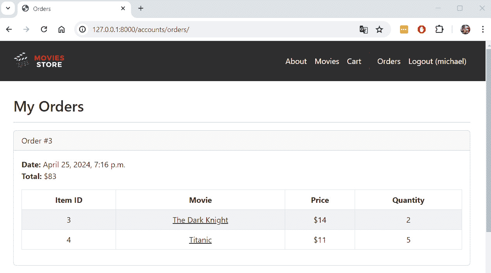
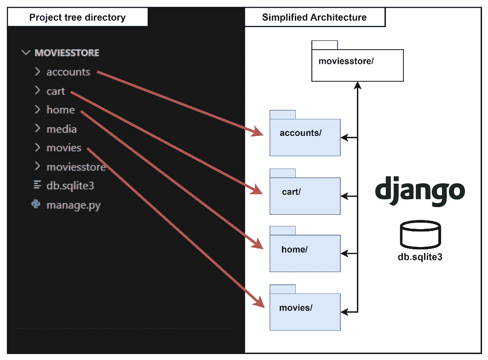
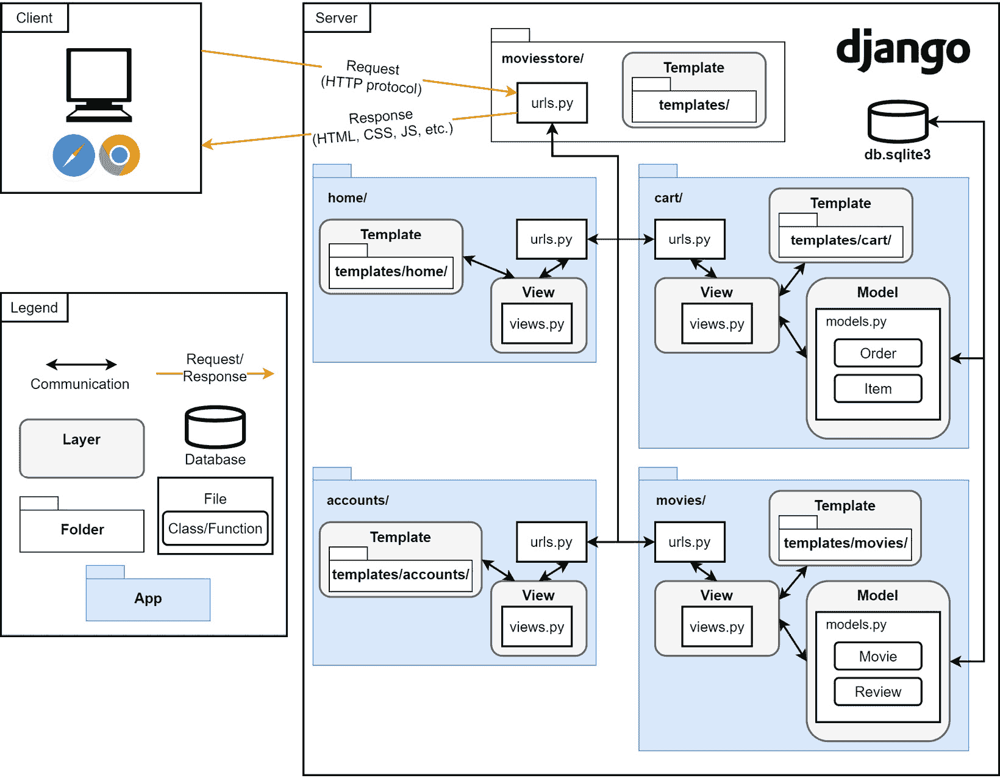

# <st c="0">12</st>

# <st c="3">实现购买和订单页面</st>

<st c="46">在前一章中，我们实现了存储购买信息的模型。</st> <st c="146">在本章中，我们将实现购买功能，并通过订单页面完成电影商店项目的最终构建。</st> <st c="267">用户将能够查看他们已下的订单。</st> <st c="316">稍后，我们将回顾电影商店 MVT 架构，以检查 Python 代码与</st> <st c="428">架构图之间的连贯性。</st>

<st c="449">在本章中，我们将涵盖以下主题：</st> <st c="491">以下内容：</st>

+   <st c="508">创建</st> <st c="522">购买页面</st>

+   <st c="535">创建</st> <st c="549">订单页面</st>

+   <st c="560">回顾电影商店</st> <st c="588">MVT 架构</st>

<st c="604">到本章结束时，我们将拥有我们电影商店项目的完整代码。</st> <st c="693">我们还将能够将架构图与实际</st> <st c="765">实现的代码联系起来。</st>

# <st c="782">技术要求</st>

<st c="805">在本章中，我们将使用 Python 3.10+。</st> <st c="854">此外，我们将在本书中使用</st> **<st c="889">VS Code</st>** <st c="896">编辑器，您可以从</st> <st c="941">以下位置</st> <st c="946">[`code.visualstudio.com/`](https://code.visualstudio.com/)<st c="976">下载。</st>

<st c="977">本章的代码位于</st> <st c="1015">以下位置</st> [<st c="1018">https://github.com/PacktPublishing/Django-5-for-the-Impatient-Second-Edition/tree/main/Chapter12/moviesstore</st>](https://github.com/PacktPublishing/Django-5-for-the-Impatient-Second-Edition/tree/main/Chapter12/moviesstore)<st c="1126">。</st>

<st c="1127">本章的 CiA 视频可以在</st> <st c="1172">以下位置找到</st> [<st c="1175">https://packt.link/4NyAv</st>](https://packt.link/4NyAv)

# <st c="1199">创建购买页面</st>

<st c="1226">让我们改进我们的购物车页面</st> <st c="1263">并添加一些功能，以便用户可以进行购买。</st> <st c="1331">为了实现这一点，我们需要遵循</st> <st c="1366">以下步骤：</st>

1.  <st c="1378">配置购买 URL。</st>

1.  <st c="1408">定义</st> `<st c="1422">购买</st>` <st c="1430">函数。</st>

1.  <st c="1440">更新</st> `<st c="1454">购物车索引</st>` <st c="1464">模板。</st>

1.  <st c="1474">创建</st> `<st c="1488">购物车购买</st>` <st c="1501">模板。</st>

## <st c="1511">配置购买 URL</st>

<st c="1540">在</st> `<st c="1544">/cart/urls.py</st>`<st c="1557">中，添加以下</st> <st c="1571">路径，如</st> <st c="1586">粗体</st> <st c="1593">所示：</st>

```py
 from django.urls import path
from . import views
urlpatterns = [
    path('', views.index, name='cart.index'),
    path('<int:id>/add/', views.add, name='cart.add'),
    path('clear/', views.clear, name='cart.clear'), <st c="1802">path('purchase/', views.purchase,</st>
 <st c="1835">name='cart.purchase'),</st> ]
```

<st c="1860">我们定义了一个`<st c="1873">cart/purchase/</st>` <st c="1887">路径，该路径将执行在`<st c="1915">purchase</st>` <st c="1923">文件中定义的`<st c="1948">purchase</st>` <st c="1953">函数。</st> <st c="1960">我们将在稍后实现`<st c="1982">purchase</st>` <st c="1990">函数。</st>**

## <st c="2006">定义购买函数</st>

<st c="2037">在`<st c="2041">/cart/views.py</st>`<st c="2055">中，添加以下代码行**<st c="2092">（加粗）</st>**<st c="2096">：</st>

```py
 …
from movies.models import Movie
from .utils import calculate_cart_total <st c="2172">from .models import Order, Item</st>
<st c="2203">from django.contrib.auth.decorators import login_required</st> … <st c="2263">@login_required</st>
<st c="2278">def purchase(request):</st>
 <st c="2301">cart = request.session.get('cart', {})</st>
 <st c="2340">movie_ids = list(cart.keys())</st>
 <st c="2370">if (movie_ids == []):</st>
 <st c="2392">return redirect('cart.index')</st>
 <st c="2422">movies_in_cart = Movie.objects.filter(id__in=movie_ids)</st>
 <st c="2478">cart_total = calculate_cart_total(cart, movies_in_cart)</st>
 <st c="2534">order = Order()</st>
 <st c="2550">order.user = request.user</st>
 <st c="2576">order.total = cart_total</st>
 <st c="2601">order.save()</st>
 <st c="2614">for movie in movies_in_cart:</st>
 <st c="2643">item = Item()</st>
 <st c="2657">item.movie = movie</st>
 <st c="2676">item.price = movie.price</st>
 <st c="2701">item.order = order</st>
 <st c="2720">item.quantity = cart[str(movie.id)]</st>
**<st c="2756">item.save()</st>**
 **<st c="2768">request.session['cart'] = {}</st>**
 **<st c="2797">template_data = {}</st>**
 **<st c="2816">template_data['title'] = 'Purchase confirmation'</st>**
 **<st c="2865">template_data['order_id'] = order.id</st>**
 **<st c="2902">return render(request, 'cart/purchase.html',</st>**
 **<st c="2947">{'template_data': template_data})</st>**
```

**<st c="2981">此前的函数是我们在这本书中实现的最大函数。</st> <st c="3023">让我们通过分解它来解释这个函数：</st> <st c="3057">让我们将这个函数分解成几个部分：</st>

+   `<st c="3116">from .models import</st>` `<st c="3137">Order, Item</st>`

    `<st c="3148">from django.contrib.auth.decorators</st>` `<st c="3185">import login_required</st>`

    <st c="3206">让我们分析这段</st> <st c="3232">代码：</st>

    +   <st c="3240">我们从当前`<st c="3255">Order</st>` <st c="3260">和`<st c="3265">Item</st>` <st c="3269">模型从当前`<st c="3294">app 目录</st>` <st c="3299">导入。</st>

    +   <st c="3308">我们导入`<st c="3323">login_required</st>` <st c="3337">装饰器。</st>

+   `<st c="3348">@</st>``<st c="3350">login_required</st>`

    `<st c="3364">def purchase(request):</st>`

    `<st c="3387">cart =</st>` `<st c="3395">request.session.get('cart', {})</st>`

    `<st c="3426">movie_ids =</st>` `<st c="3439">list(cart.keys())</st>`

    `<st c="3456">if (movie_ids == []):</st>`

    `**<st c="3478">return redirect('cart.index')</st>**`

    **<st c="3508">让我们分析这段</st> <st c="3534">代码：</st>**

    +   **<st c="3542">我们使用`<st c="3554">login_required</st>` <st c="3568">装饰器来确保用户必须登录才能访问`<st c="3635">purchase</st>` <st c="3643">函数。</st>**

    +   **<st c="3653">我们定义了`<st c="3668">purchase</st>` <st c="3676">函数，该函数将处理购买过程。</st>**

    +   **<st c="3726">我们从用户的会话中检索购物车数据。</st> <st c="3778">`<st c="3782">cart</st>` <st c="3786">变量将包含一个字典，其中以电影 ID 为键，数量为值。</st>**

    +   **<st c="3870">我们从`<st c="3911">cart</st>` <st c="3915">字典中检索存储的电影 ID 并将它们转换为名为`<st c="3956">movie_ids</st>` <st c="3965">的列表。</st>**

    +   **<st c="3966">我们检查`<st c="3983">movie_ids</st>` <st c="3992">列表是否为空（这表示购物车为空）。</st> <st c="4044">在这种情况下，用户将被重定向到`<st c="4088">cart.index</st>` <st c="4098">页面（在这里，`<st c="4115">purchase</st>` <st c="4123">函数完成其执行）。</st>**

***   `<st c="4158">movies_in_cart =</st>` `<st c="4176">Movie.objects.filter(id__in=movie_ids)</st>`

    `<st c="4214">cart_total =</st>` `<st c="4228">calculate_cart_total(cart, movies_in_cart)</st>`

    `<st c="4270">order =</st>` `<st c="4279">Order()</st>`

    `<st c="4286">order.user =</st>` `<st c="4300">request.user</st>`

    `<st c="4312">order.total =</st>` `<st c="4327">cart_total</st>`

    `**<st c="4337">order.save()</st>**`

    **`<st c="4350">for movie</st>` `<st c="4361">in movies_in_cart:</st>`**

    **`<st c="4379">item =</st>` `<st c="4387">Item()</st>`**

    **`<st c="4393">item.movie =</st>` `<st c="4407">movie</st>`**

    **`<st c="4412">item.price =</st>` `<st c="4426">movie.price</st>`**

    **`<st c="4437">item.order =</st>` `<st c="4451">order</st>`**

    **`<st c="4456">item.quantity =</st>` `<st c="4473">cart[str(movie.id)]</st>`**

    **`**<st c="4492">item.save()</st>**`**

    ****<st c="4504">让我们分析这段</st> <st c="4530">代码：</st>****

    +   ****<st c="4538">如果购物车不为空，我们</st> <st c="4567">继续购买流程。</st>****

    +   ****<st c="4598">根据购物车中存储的 ID 从数据库中检索电影对象</st> <st c="4679">使用</st> `<st c="4685">Movie.objects.filter(id__in=movie_ids</st>`<st c="4722">.</st>****

    +   ****<st c="4723">我们使用</st> `<st c="4788">calculate_cart_total()</st>` <st c="4810">函数计算购物车中电影的总额。</st>****

    +   ****<st c="4820">我们创建一个新的</st> `<st c="4837">Order</st>` <st c="4842">对象。</st> <st c="4851">我们设置其属性，例如</st> `<st c="4881">user</st>` <st c="4885">(登录用户) 和</st> `<st c="4911">total</st>` <st c="4916">(购物车总额)，并将其保存到</st> <st c="4950">数据库中。</st>****

    +   ****<st c="4963">我们遍历购物车中的电影。</st> <st c="5004">对于购物车中的每部电影，我们创建一个</st> `<st c="5017">Item</st>` <st c="5021">对象。</st> <st c="5057">对于每个</st> `<st c="5066">Item</st>`<st c="5070">，我们设置其</st> `<st c="5083">价格</st>` <st c="5088">和</st> `<st c="5093">数量</st>`<st c="5101">，链接相应的</st> `<st c="5126">电影</st>` <st c="5131">和</st> `<st c="5136">订单</st>`<st c="5141">，并将其保存到</st> <st c="5158">数据库中。</st>*********   `<st c="5171">request.session['cart'] = {}</st>`

    `<st c="5200">template_data = {}</st>`

    `<st c="5219">template_data['title'] = '</st>``<st c="5246">购买确认'</st>`

    `<st c="5269">template_data['order_id'] =</st>` `<st c="5298">order.id</st>`

    `<st c="5306">return render(request, 'cart/purchase.html', {'</st>``<st c="5354">template_data': template_data})</st>`

    <st c="5386">让我们分析这段</st> <st c="5412">代码：</st>

    +   <st c="5420">购买完成后，我们通过将</st> `<st c="5505">request.session['cart']</st>` <st c="5528">设置为空字典来清除用户会话中的购物车。</st>

    +   <st c="5552">我们准备要发送到购买确认模板的数据。</st> <st c="5579">这些数据包括页面标题和创建的订单 ID。</st>

    +   <st c="5696">最后，我们渲染</st> `<st c="5720">cart/purchase.html</st>` <st c="5738">模板。</st>******

******<st c="5748">现在我们已经完成了购买功能，让我们添加一个链接到</st> <st c="5835">此功能的按钮。</st>

## <st c="5849">更新购物车.index 模板</st>

<st c="5878">在</st> `<st c="5886">/cart/templates/cart/index.html</st>` <st c="5917">文件中，添加</st> <st c="5928">以下行</st> <st c="5948">在</st> **<st c="5951">粗体</st>**<st c="5955">：</st>

```py
 …
        <a class="btn btn-outline-secondary mb-2">
          <b>Total to pay:</b> ${{ template_data.cart_total
        }}</a>
         <st c="6108"><a href=""</st>
 <st c="6143">class="btn bg-dark text-white mb-2">Purchase</st><st c="6188"></a></st> <a href="">
          <button class="btn btn-danger mb-2">
            Remove all movies from Cart
          </button>
        </a>
        
        …
```

<st c="6321">我们添加了一个按钮，将购物车页面与购买功能链接起来。</st> <st c="6407">此按钮仅在</st> <st c="6444">购物车中添加了电影</st> <st c="6468">时显示</st> <st c="6471">。</st>

## <st c="6480">创建购物车购买模板</st>

<st c="6512">现在，在</st> `<st c="6521">/cart/templates/cart/</st>`<st c="6542">中，创建一个新文件，</st> `<st c="6563">purchase.html</st>`<st c="6576">。目前，用以下内容填充它：</st> <st c="6600">：</st>

```py
 

<div class="p-3">
  <div class="container">
    <div class="row mt-3">
      <div class="col mx-auto mb-3">
        <h2>Purchase Completed</h2>
        <hr />
        <p>Congratulations, purchase completed. Order
          number is: <b>#{{ template_data.order_id }}</b>
        </p>
      </div>
    </div>
  </div>
</div>

```

<st c="6941">我们创建了一个简单的模板，它扩展了</st> `<st c="6993">base.html</st>` <st c="7002">模板，并向用户显示祝贺信息，包括当前购买的订单编号。</st>

<st c="7112">现在，保存这些文件，运行服务器，转到</st> `<st c="7158">http://localhost:8000/movies</st>`<st c="7186">，点击几部电影，并将它们添加到购物车。</st> <st c="7243">然后，转到</st> **<st c="7259">购物车</st>** <st c="7263">部分并点击</st> **<st c="7282">购买</st>** <st c="7290">(您需要</st> <st c="7308">登录才能执行购买操作)。</st> <st c="7355">然后，您将看到一个购买确认消息（</st>*<st c="7407">图 12</st>**<st c="7417">.1</st>*<st c="7419">）：</st>



<st c="7512">图 12.1 – 购买页面</st>

<st c="7539">如果您导航到管理面板，您将看到一个新订单已注册（与进行购买的用户相关联）以及一些项目（与之前的订单相关联），如图</st> *<st c="7721">图 12</st>**<st c="7730">.2</st>*<st c="7732">所示：</st>



<st c="7915">图 12.2 – 管理面板中的订单和项目</st>

<st c="7963">此时，我们能够创建订单并将相应的信息注册到数据库中。</st> <st c="8070">现在，让我们实现一个查看订单的页面。</st>

# <st c="8116">创建订单页面</st>

<st c="8141">让我们通过允许用户查看他们的订单来完善我们的电影商店。</st> <st c="8173">为了实现这一点，我们需要遵循</st> `<st c="8213">以下步骤：</st>`

1.  <st c="8260">配置</st> `<st c="8277">订单 URL。</st>`

1.  <st c="8288">定义</st> `<st c="8302">订单</st>` <st c="8308">函数。</st>

1.  <st c="8318">创建</st> `<st c="8332">accounts.orders</st>` <st c="8347">模板。</st>

1.  <st c="8357">在基础模板中添加链接。</st>

## <st c="8393">配置订单 URL</st>

<st c="8420">订单属于一个</st> `<st c="8442">特定用户</st>`。 <st c="8458">因此，我们将在</st> `<st c="8523">accounts</st>` <st c="8531">应用中添加订单功能。</st> <st c="8537">在</st> `<st c="8540">/accounts/urls.py</st>`<st c="8557">中，添加以下**<st c="8580">粗体</st>**<st c="8584">路径：</st>

```py
 from django.urls import path
from . import views
urlpatterns = [
    path('signup', views.signup, name='accounts.signup'),
    path('login/', views.login, name='accounts.login'),
    path('logout/', views.logout, name='accounts.logout'), <st c="8813">path('orders/', views.orders, name='accounts.orders'),</st> ]
```

<st c="8869">我们定义了一个</st> `<st c="8883">accounts/orders/</st>` <st c="8899">路径，该路径将执行在</st> `<st c="8960">views</st>` <st c="8965">文件中定义的</st> `<st c="8929">orders</st>` <st c="8935">函数。</st> <st c="8972">我们</st> <st c="8975">将在稍后实现</st> `<st c="8994">orders</st>` <st c="9000">函数。</st>

## <st c="9016">定义订单函数</st>

在 `<st c="9049">/accounts/views.py</st>`<st c="9067">中，添加以下</st> `<st c="9076">行</st>` <st c="9087">，并在**<st c="9096">粗体</st>**<st c="9100">中：</st>

```py
 …
from django.shortcuts import redirect
from django.contrib.auth.decorators import login_required <st c="9200">from django.contrib.auth.models import User</st> … <st c="9245">@login_required</st>
<st c="9260">def orders(request):</st>
**<st c="9281">template_data = {}</st>**
 **<st c="9300">template_data['title'] = 'Orders'</st>**
 **<st c="9334">template_data['orders'] = request.user.order_set.all()</st>**
 **<st c="9389">return render(request, 'accounts/orders.html',</st>**
 **<st c="9436">{'template_data': template_data})</st>**
```

**<st c="9470">让我们解释一下</st> `<st c="9489">之前的代码：</st>`

+   <st c="9503">我们从 Django 的</st> `<st c="9518">用户</st>` <st c="9522">模型</st> <st c="9528">中导入。</st> `<st c="9543">认证系统</st>`。

+   <st c="9565">我们使用</st> `<st c="9577">login_required</st>` <st c="9591">装饰器来确保用户必须登录才能访问</st> `<st c="9658">orders</st>` <st c="9664">函数。</st>

+   <st c="9674">我们定义了</st> `<st c="9689">orders</st>` <st c="9695">函数，它</st> `<st c="9711">接受</st>` `<st c="9720">request</st>` <st c="9727">对象作为</st> `<st c="9738">参数</st>`。

+   <st c="9750">我们定义了</st> `<st c="9765">template_data</st>` <st c="9778">变量并将其</st> <st c="9802">分配</st> `<st c="9804">标题</st>`<st c="9809">。</st>

+   我们检索属于当前登录用户的全部订单（</st>`<st c="9877">request.user</st>`<st c="9890">）。</st> <st c="9894">`order_set`</st> <st c="9907">属性用于通过其关系访问与用户相关联的相关订单（你可以在这里了解更多关于此类关系的信息</st> [<st c="10064">https://docs.djangoproject.com/en/5.0/topics/db/examples/many_to_one/</st>](https://docs.djangoproject.com/en/5.0/topics/db/examples/many_to_one/)<st c="10133">）。</st> <st c="10137">记住，`User` <st c="10162">外键</st> <st c="10172">关系存在于`User` <st c="10198">模型和`Order` <st c="10217">模型之间。</st>

+   最后，我们将订单传递给模板并渲染它。

## 创建`accounts.orders`模板

现在，在<st c="10322">`/accounts/templates/accounts/</st>`<st c="10331">中，创建一个新文件，</st> `<st c="10371">新文件</st>` `<st c="10381">orders.html</st>`<st c="10392">。目前，用以下内容填充它：</st>

```py
 

<div class="p-3">
  <div class="container">
    <div class="row mt-3">
      <div class="col mx-auto mb-3">
        <h2>My Orders</h2>
        <hr />
        
        <div class="card mb-4">
          <div class="card-header">
            Order #{{ order.id }}
          </div>
          <div class="card-body">
            <b>Date:</b> {{ order.date }}<br />
            <b>Total:</b> ${{ order.total }}<br />
            <table class="table table-bordered
              table-striped text-center mt-3">
              <thead>
                <tr>
                  <th scope="col">Item ID</th>
                  <th scope="col">Movie</th>
                  <th scope="col">Price</th>
                  <th scope="col">Quantity</th>
                </tr>
              </thead>
              <tbody>
                
                <tr>
                  <td>{{ item.movie.id }}</td>
                  <td>
                    <a class="link-dark"
                      href="">
                      {{ item.movie.name }}
                    </a>
                  </td>
                  <td>${{ item.movie.price }}</td>
                  <td>{{ item.quantity }}</td>
                </tr>
                
              </tbody>
            </table>
          </div>
        </div>
        
      </div>
    </div>
  </div>
</div>

```

让我们解释一下之前的代码：

+   我们扩展了`<st c="11437">base.html</st>` <st c="11446">模板。</st>

+   我们遍历存储在`<st c="11501">template_data.orders</st>`<st c="11521">中的每个订单对象。对于每个订单，我们显示其`<st c="11554">日期</st>` <st c="11558">和</st> `<st c="11563">总计</st>`<st c="11568">。</st>

+   然后，我们遍历当前订单中的每个项目。<st c="11635">The</st> `<st c="11639">order.item_set.all</st>` <st c="11657">检索与当前订单相关联的所有相关项目。</st> <st c="11721">对于这些项目中的每一个，我们显示其</st> `<st c="11761">价格</st>` <st c="11766">和</st> `<st c="11771">数量</st>`<st c="11779">，以及相应的电影</st> `<st c="11808">id</st>` <st c="11812">和名称。</st>

## 在基础模板中添加链接

让我们在<st c="11856">基础模板</st> <st c="11889">中添加订单链接。</st> <st c="11905">在</st> `<st c="11908">/moviesstore/templates/base.html</st>`<st c="11940">中，在标题部分，添加以下带有**<st c="11992">粗体</st>**<st c="11996">的行</st>:

```py
 …
             <st c="12031"><a class="nav-link"</st>
 <st c="12050">href="">Orders</st><st c="12092"></a></st> <a class="nav-link"
              href="">Logout
              ({{ user.username }})
            </a>
            
            <a class="nav-link"
              href="">Login
            </a>
            <a class="nav-link"
              href="">Sign Up
            </a>
            
            …
```

现在，保存这些文件，运行服务器，并转到<st c="12394">http://localhost:8000/accounts/orders</st>。如果你进行了购买，你会看到相应的订单（</st>*<st c="12498">图 12</st>**<st c="12508">.3</st>*<st c="12510">）：</st>



图 12.3 – 订单页面

<st c="12786">我们已经完成了</st> <st c="12809">电影商店项目的代码。</st> <st c="12836">我们已经实现了在第一章*<st c="12891">第一章</st>*中计划的所有功能。</st> <st c="12900">现在，让我们将实现的代码与架构图进行比较。</st> <st c="12951">architecture diagram.</st>

# <st c="12972">回顾电影商店 MVT 架构</st>

<st c="13016">我们设计的电影商店架构图</st> *<st c="13082">第一章</st>* <st c="13091">为设计电影商店的应用、层和代码提供了一个蓝图。</st> <st c="13131">我们已经实现了该图中描述的所有应用程序和元素。</st> <st c="13184">因此，让我们快速回顾一下我们迄今为止所取得的成果。</st> <st c="13273">So, let’s quickly recap what we have accomplished</st> <st c="13323">so far.</st>

*<st c="13330">图 12</st>**<st c="13340">.4</st>* <st c="13342">显示了完整的项目树目录结构，并将其与项目架构的简化版本进行了比较。</st> <st c="13465">我们已经成功实现了四个应用程序（</st>`<st c="13509">accounts</st>`<st c="13518">，</st> `<st c="13520">cart</st>`<st c="13524">，</st> `<st c="13526">home</st>`<st c="13530">，和</st> `<st c="13536">movies</st>`<st c="13542">），它们包含了项目的大部分功能。</st>



<st c="13801">图 12.4 – 项目树目录与简化架构对比</st>

*<st c="13875">图 12</st>**<st c="13885">.5</st>* <st c="13887">显示了完整的</st> <st c="13910">架构。</st> <st c="13924">我们希望您能更好地理解每个架构元素以及它们之间的关系。</st>



<st c="14401">图 12.5 – 电影商店架构</st>

<st c="14440">让我们做一个最后的</st> <st c="14459">快速分析：</st>

+   <st c="14474">我们实现了一个名为</st> `<st c="14519">moviesstore</st>`<st c="14530">的项目级文件夹。这个文件夹包含了项目级的 URL 文件，它与应用程序级的 URL 文件相连接。</st>

+   <st c="14623">我们实现了四个</st> <st c="14643">Django 应用程序。</st> <st c="14657">对于这些应用程序中的每一个，我们都展示了三个主要层（模型、视图和模板）之间的通信。</st>

+   <st c="14774">我们学习了如何将代码分布在多个应用程序中以提高可维护性和</st> <st c="14861">分离职责。</st>

+   <st c="14887">我们通过为我们的电影商店项目实现一系列功能来实践那些文件和层的实现。</st> <st c="15002">Store project.</st>

<st c="15016">这是一段怎样的旅程啊！</st> <st c="15033">我们使用了大量的 Django 模块、库、函数、概念和元素来</st> <st c="15120">实现</st> <st c="15131">这个项目。</st>

# <st c="15144">摘要</st>

<st c="15152">在本章中，我们完成了电影商店项目。</st> <st c="15209">我们实现了购买功能，该功能利用了</st> `<st c="15276">订单</st>` <st c="15281">和</st> `<st c="15286">商品</st>` <st c="15290">模型。</st> <st c="15299">我们创建了一个订单页面，允许用户查看他们的订单。</st> <st c="15362">我们回顾了电影商店架构图，并与实际项目代码进行了比较和讨论。</st> <st c="15485">自从我们开始以来，我们已经学到了很多。</st> <st c="15525">现在，是时候进入最后一章了。</st> <st c="15563">让我们学习如何将我们的电影商店项目部署到</st> <st c="15617">云端。</st>**********
