# 第十四章：<st c="0">13</st>

# <st c="3">将应用程序部署到云端</st>

<st c="42">我们的项目目前运行在本地的计算机上。</st> <st c="98">为了使此项目可供他人访问，我们需要将其部署到互联网上的服务器上。</st> <st c="191">一种常见的方法是将我们的 Django 项目部署到 PythonAnywhere，因为它对小型网站免费。</st> <st c="311">让我们看看如何将我们的应用程序部署到</st> <st c="354">云端。</st>

<st c="364">在本章中，我们将涵盖以下主题：</st>

+   <st c="423">管理 GitHub</st> <st c="440">和 Git</st>

+   <st c="447">将代码克隆到 PythonAnywhere</st>

+   <st c="485">配置</st> <st c="498">虚拟环境</st>

+   <st c="518">设置您的</st> <st c="535">Web 应用</st>

+   <st c="542">配置</st> <st c="555">静态文件</st>

<st c="567">在本章结束时，您将具备将小型 Python 应用程序部署到云的知识和能力。</st>

# <st c="684">技术要求</st>

<st c="707">在本章中，我们将使用 Python 3.10+。</st> <st c="756">我们将使用 Git 将代码上传到云端，您可以从</st> [<st c="838">https://git-scm.com/downloads</st>](https://git-scm.com/downloads)<st c="867">下载。</st> 最后，我们将使用本书中的**<st c="899">VS Code</st>** <st c="906">编辑器，您可以从</st> <st c="951">以下位置下载</st> <st c="956">https://code.visualstudio.com/</st><st c="986">。</st>

<st c="987">本章的 CiA 视频可以在</st> <st c="1032">以下位置找到</st> [<st c="1035">https://packt.link/QXahe</st>](https://packt.link/QXahe)

# <st c="1059">管理 GitHub 和 Git</st>

<st c="1083">要将我们的代码上传到</st> <st c="1104">PythonAnywhere 等网站，首先，我们需要将代码放在 GitHub 或 GitLab 等代码共享平台上。</st> <st c="1218">在本章中，我们将使用 GitHub。</st> <st c="1255">如果您已经熟悉将代码上传到 GitHub，请跳过以下</st> <st c="1345">部分，并将 Movies Store 代码上传到新的 GitHub 仓库。</st> <st c="1425">否则，您可以</st> <st c="1444">跟随操作。</st>

<st c="1457">要将我们的代码上传到 GitHub，我们将遵循以下</st> <st c="1507">步骤：</st>

1.  <st c="1518">理解 Git</st> <st c="1537">和 GitHub。</st>

1.  <st c="1548">创建一个</st> <st c="1560">GitHub 仓库。</st>

1.  <st c="1578">将我们的代码</st> <st c="1598">上传到 GitHub。</st>

## <st c="1608">理解 Git 和 GitHub</st>

**<st c="1637">Git</st>** <st c="1641">是一个</st> <st c="1647">分布式版本控制系统，旨在以速度和效率处理从小型到非常大的项目。</st> <st c="1751">它允许多个开发者通过跟踪文件（</st>[<st c="1860">https://git-scm.com/</st>](https://git-scm.com/)<st c="1881">）的更改来协作。</st>

**<st c="1884">GitHub</st>** <st c="1891">是一个基于 Git 版本控制系统的 Web 平台。</st> <st c="1916">它为使用 Git 进行版本控制的软件开发项目提供托管服务（</st>[<st c="2052">https://github.com/</st>](https://github.com/)<st c="2072">）。</st>

<st c="2075">我们将通过利用 Git 来增强我们的电影商店项目，使其成为一个版本控制系统。</st> <st c="2173">然后，我们将使用 GitHub 在云端托管电影商店项目的代码。</st> <st c="2233">使用 GitHub。</st>

## <st c="2246">创建 GitHub 仓库</st>

<st c="2275">GitHub 仓库是一个中央</st> <st c="2308">位置，用于存储和管理与项目相关的文件和文件夹。</st> <st c="2392">它作为项目的版本控制中心，允许多个协作者参与到</st> <st c="2498">开发过程中。</st>

<st c="2518">让我们按照以下步骤创建一个</st> <st c="2559">GitHub 仓库：</st>

1.  <st c="2577">前往</st> [<st c="2584">https://github.com/</st>](https://github.com/) <st c="2603">，如果你还没有账户，请注册一个。</st> <st c="2654">然后，通过点击右上角的</st> **<st c="2699">+</st>** <st c="2700">创建一个新的仓库，并选择</st> **<st c="2730">新建仓库</st>** <st c="2745">(</st>*<st c="2746">图 13</st>**<st c="2755">.1</st>*<st c="2757">)：</st>

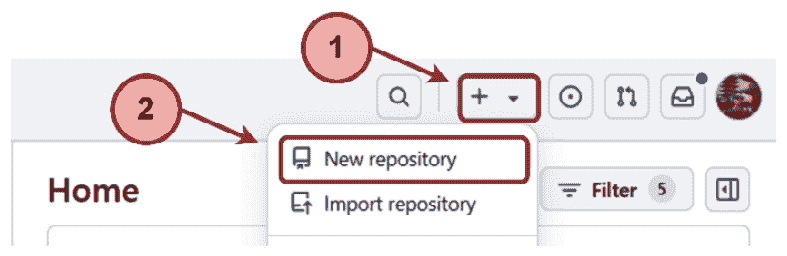

<st c="2815">图 13.1 – GitHub – 创建新仓库选项</st>

1.  <st c="2868">给你的仓库起一个名字，例如</st> `<st c="2905">moviesstore</st>`<st c="2916">。选择</st> **<st c="2929">公共</st>** <st c="2935">单选按钮，然后点击</st> **<st c="2954">创建仓库</st>** <st c="2971">(</st>*<st c="2973">图 13</st>**<st c="2982">.2</st>*<st c="2984">)：</st>

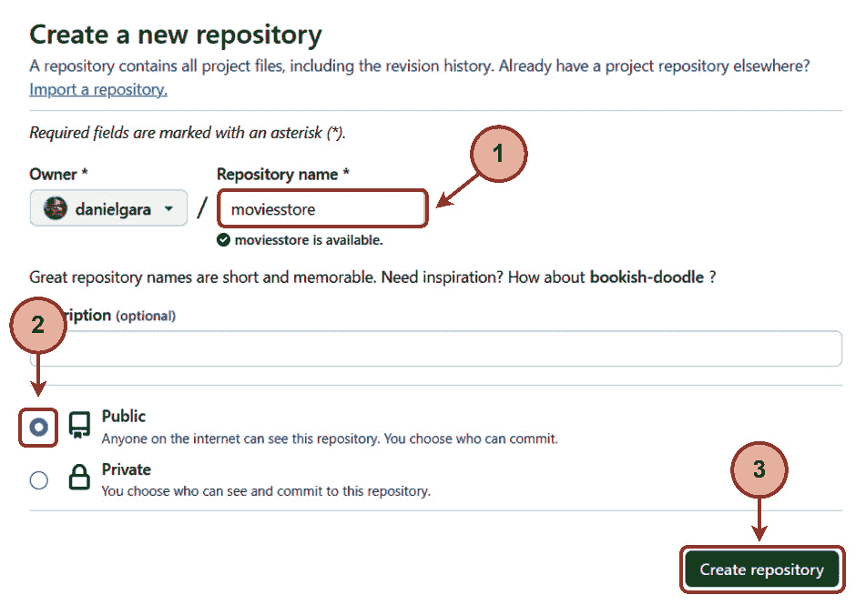

<st c="3529">图 13.2 – GitHub – 创建新仓库</st>

<st c="3577">我们已经成功创建了一个 GitHub 仓库。</st> <st c="3628">我们将用它来存储电影商店项目的代码。</st> <st c="3683">保持你的 GitHub 仓库开启；我们将在下一节中使用那个页面。</st>

## <st c="3759">将我们的代码上传到 GitHub</st>

<st c="3788">我们将开始将我们的</st> <st c="3815">代码移动到 GitHub。</st> <st c="3833">在你的本地机器的终端中，确保你已经安装了 Git，通过运行以下命令来检查：</st> <st c="3908">以下命令：</st>

```py
 git
```

<st c="3926">如果你在终端中运行</st> `<st c="3942">git</st>` <st c="3945">命令并看到 Git 使用和命令列表，这表明你已经安装了 Git（</st>*<st c="4051">图 13</st>**<st c="4061">.3</st>*<st c="4063">）：</st>

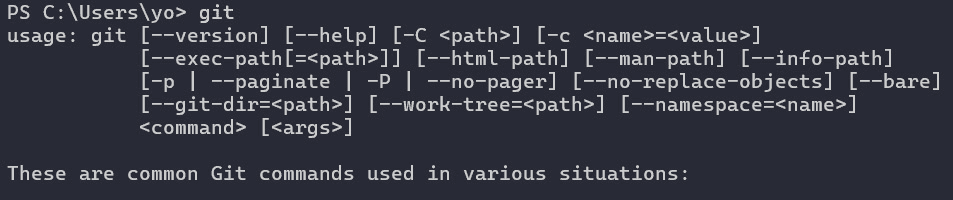

<st c="4404">图 13.3 – 在终端中执行 git 命令</st>

<st c="4459">如果你看不到它们，你需要安装 Git。</st> <st c="4513">访问 Git 网站（</st>[<st c="4533">https://git-scm.com/downloads</st>](https://git-scm.com/downloads)<st c="4563">）并按照说明安装 Git。</st> <st c="4610">安装 Git 后，你可能需要关闭并重新打开终端，并在其中输入“git”以确保它</st> <st c="4720">已安装。</st>

<st c="4733">现在我们已经安装了 Git，让我们继续下一步，将我们的 Movies Store 项目代码上传到我们的</st> <st c="4845">GitHub 仓库：</st>

1.  <st c="4863">在顶部</st> `<st c="4894">moviesstore</st>` <st c="4905">文件夹（包含</st> `<st c="4940">manage.py</st>` <st c="4949">文件的文件夹）中打开你的终端。</st> <st c="4957">然后，运行以下命令：</st> <st c="4971">以下命令：</st>

    ```py
    <st c="4989">git init</st>
    ```

    <st c="4998">之前的命令将你的文件夹标记为 Git 项目，允许你开始跟踪更改。</st> <st c="5096">在项目目录中添加了一个名为 .git 的隐藏文件夹。</st> <st c="5158">此文件夹存储了 Git 需要跟踪更改和管理项目的所有元数据、配置文件和元素。</st>

1.  <st c="5284">接下来，运行以下命令：</st> <st c="5299">以下命令：</st>

    ```py
    <st c="5317">git add .</st>
    ```

    <st c="5327">之前的命令将我们项目中的所有内容（文件夹、子文件夹和文件）添加到暂存区，为下一次提交做准备。</st>

1.  <st c="5483">然后，继续提交之前的更改：</st> <st c="5514">以下更改：</st>

    ```py
    <st c="5531">git commit -m "first version"</st>
    ```

    <st c="5561">之前的命令用于记录我们对暂存区所做的更改和包含内容。</st> <st c="5657">当你运行 git commit 时，你实际上是在创建项目当前状态的快照。</st> <st c="5759">你可以通过你提供的描述性消息来识别不同的提交。</st>

1.  <st c="5834">接下来，运行以下命令：</st> <st c="5849">以下命令：</st>

    ```py
    <st c="6076">git remote add origin <your-origin-path></st> command (*<st c="6126">Figure 13</st>**<st c="6136">.4</st>*) and run it in the Terminal (remember to replace <st c="6189"><your-origin-path></st> with yours):
    ```

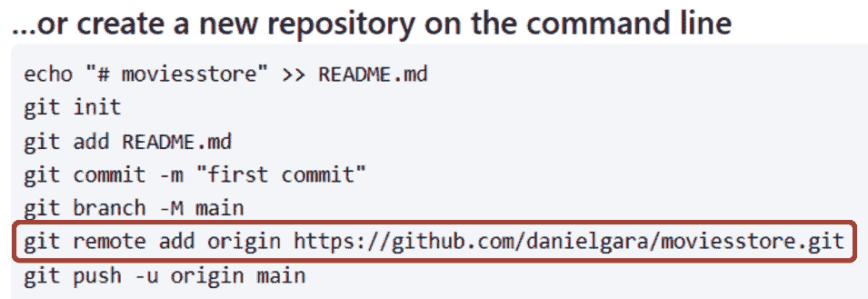

<st c="6475">图 13.4 – 定位你的 GitHub 仓库路径</st>

```py
<st c="6525">git remote add origin <your-origin-path></st>
```

<st c="6566">之前的命令实际上是在告诉 Git 创建一个名为 origin 的新远程仓库，并将其与提供的 URL 或路径关联。</st> <st c="6721">这将允许</st> <st c="6736">你稍后推送你的本地更改到远程</st> <st c="6782">仓库。</st>

1.  <st c="6799">要将代码从你的本地计算机移动到 GitHub，运行以下命令：</st> <st c="6857">以下命令：</st>

    ```py
    <st c="6871">git push -u origin main</st>
    ```

    <st c="6895">如果上传成功，你应该会看到类似这样的消息（</st><st c="6961">图 13</st><st c="6971">.5）：</st>

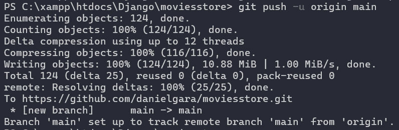

<st c="7495">图 13.5 – 成功将 git 推送到 GitHub 仓库</st>

<st c="7555">注意</st>

<st c="7560">如果您是第一次将代码上传到 GitHub，您可能会看到一个提示，要求您登录 GitHub。</st> <st c="7677">请完成</st> <st c="7693">此过程。</st>

<st c="7706">现在，当您重新加载 GitHub 仓库页面时，应该会看到正确上传的 Movies Store 项目结构和文件（如图</st> *<st c="7847">图 13.6</st>**<st c="7856">.6</st>*<st c="7858">）：</st>

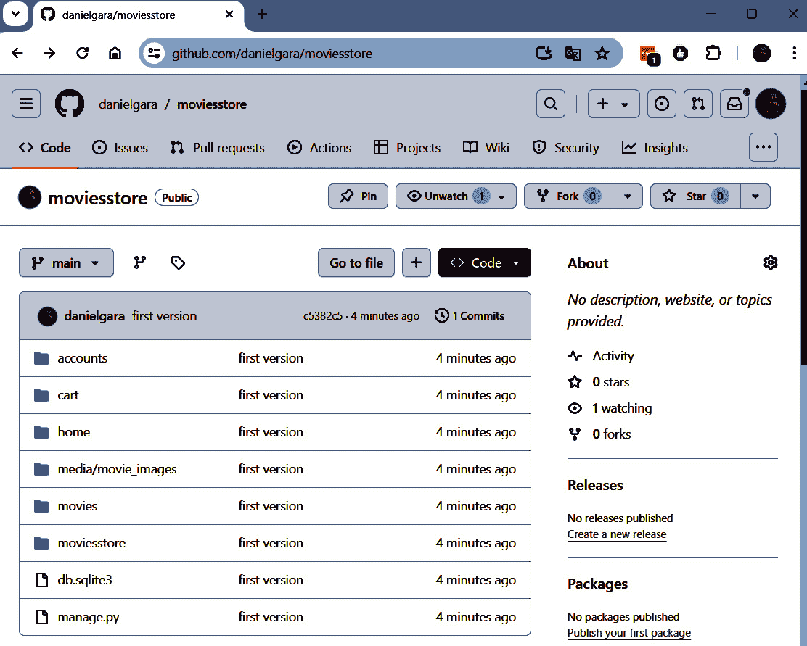

<st c="8696">图 13.6 – 包含 Movies Store 项目代码的 GitHub 仓库</st>

<st c="8768">注意</st>

<st c="8773">请注意，Git 和 GitHub 还有很多内容。</st> <st c="8825">我们刚刚介绍了上传我们的代码到 GitHub 的必要步骤。</st>

<st c="8895">有了这个，我们现在已经将</st> <st c="8925">我们的代码放置在 GitHub 上。</st> <st c="8946">接下来，我们将在 PythonAnywhere 上克隆它。</st>

# <st c="8987">在 PythonAnywhere 上克隆您的代码</st>

**<st c="9025">PythonAnywhere</st>** <st c="9040">(</st>[<st c="9042">https://www.pythonanywhere.com/</st>](https://www.pythonanywhere.com/)<st c="9073">)是一个基于云的平台，为 Python 应用程序提供 Web 托管</st> <st c="9129">环境。</st> <st c="9167">它允许</st> <st c="9177">用户直接在他们的网络浏览器中编写、编辑和运行 Python 代码，而无需在本地安装任何</st> <st c="9280">软件。</st>

<st c="9297">在 PythonAnywhere 上部署现有 Django 项目的步骤可以在</st> [<st c="9379">https://help.pythonanywhere.com/pages/DeployExistingDjangoProject</st>](https://help.pythonanywhere.com/pages/DeployExistingDjangoProject)<st c="9444">找到，但我们将在这里为您指导。</st>

<st c="9484">现在，我们的代码已经上传到 GitHub，接下来我们将进行下一步，创建 PythonAnywhere 账户并将代码从 GitHub</st> <st c="9589">迁移到 PythonAnywhere：</st>

1.  <st c="9634">前往</st> [<st c="9641">https://www.pythonanywhere.com/registration/register/beginner/</st>](https://www.pythonanywhere.com/registration/register/beginner/) <st c="9703">并注册一个免费的初学者账户，如果您还没有的话。</st>

1.  <st c="9766">然后，点击</st> **<st c="9782">仪表板</st>** <st c="9791">|</st> **<st c="9794">新建控制台</st>** <st c="9805">|</st> **<st c="9808">$ Bash</st>** <st c="9814">(</st>*<st c="9816">图 13.7</st>**<st c="9825">.7</st>*<st c="9827">)：</st>

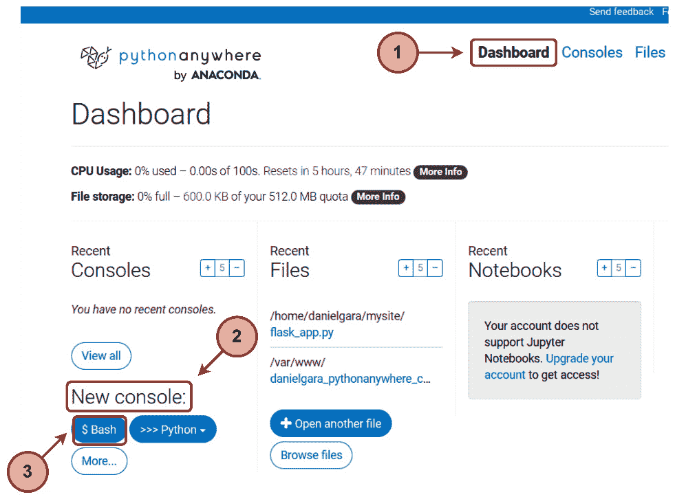

<st c="10279">图 13.7 – 创建新控制台</st>

1.  <st c="10315">上一步将打开一个 Bash 控制台。</st> <st c="10360">回到您的 GitHub 仓库，点击</st> **<st c="10401">代码</st>** <st c="10405">并复制克隆的 URL（</st>*<st c="10433">图 13</st>**<st c="10443">.8</st>*<st c="10445">）：</st>

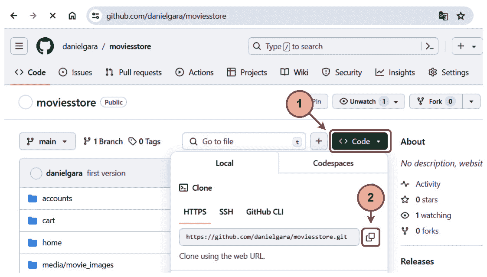

<st c="11021">图 13.8 – 复制仓库 URL</st>

1.  <st c="11057">要克隆之前的</st> <st c="11079">仓库，请返回 PythonAnywhere Bash 控制台并运行以下命令（将</st> `<st c="11178"><repo-url></st>` <st c="11188">部分替换为您的，例如，</st> `<st c="11219">git</st>` `<st c="11223">clone</st>` [<st c="11229">https://github.com/danielgara/moviesstore.git</st>](https://github.com/danielgara/moviesstore.git)<st c="11274">）：</st>

    ```py
    <st c="11461">ls</st> command in Bash, and you will see a folder with the repository name containing the repository code (refer to Figure 13.9).
    ```

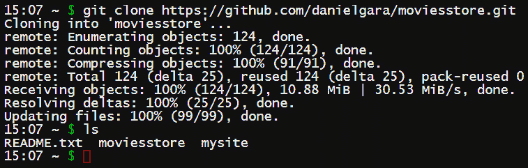

<st c="12064">图 13.9 – 使用 ls 命令检查仓库是否成功克隆</st>

<st c="12150">我们已经成功将我们的仓库代码克隆到 PythonAnywhere 中。</st> <st c="12218">现在，让我们配置一个虚拟</st> <st c="12249">环境，以便能够运行我们的项目。</st>

# <st c="12291">配置虚拟环境</st>

<st c="12324">在 Python 中，一个</st> **<st c="12327">虚拟环境</st>** <st c="12346">是一个包含特定 Python 解释器版本、一系列库和包的自包含目录。</st> <st c="12362">它允许您为每个 Python 项目创建一个隔离的环境，确保依赖项保持独立，不会相互干扰。</st> <st c="12484">It allows you to create an isolated environment for each of your Python projects, ensuring that dependencies are kept separate and do not interfere with</st> <st c="12637">each other.</st>

<st c="12648">接下来，我们将在 PythonAnywhere Bash 控制台中创建一个虚拟环境，以隔离我们的项目代码和依赖项。</st> <st c="12773">让我们按照以下步骤进行：</st> <st c="12796">以下步骤：</st>

1.  <st c="12812">在 PythonAnywhere Bash 控制台中创建虚拟环境，我们需要执行类似以下命令：</st> `<st c="12928">mkvirtualenv -p python3.10 <environment-name></st>`<st c="12973">。目前，我们将用</st> `<st c="13000"><environment-name></st>` <st c="13018">替换为</st> `<st c="13024">moviesstoreenv</st>` <st c="13038">并运行以下命令：</st>

    ```py
    <st c="13061">mkvirtualenv -p python3.10 moviesstoreenv</st>
    ```

    <st c="13103">我们将在 Bash 中看到虚拟 env 的名称，例如，（moviesstoreenv）。</st> <st c="13179">这意味着我们处于虚拟环境中（</st><st c="13225">图 13</st><st c="13235">.10）：</st>

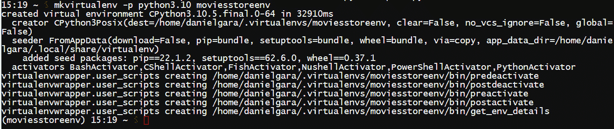

<st c="14185">图 13.10 – Bash 位于虚拟环境内</st>

1.  <st c="14226">回到我们的虚拟 env 中，我们需要安装</st> `<st c="14270">django</st>` <st c="14276">和</st> `<st c="14281">pillow</st>` <st c="14287">（就像我们在开发中做的那样）。</st> <st c="14316">因此，运行以下命令：</st> <st c="14324">以下命令：</st>

    ```py
    <st c="14338">pip install django==5.0 pillow</st>
    ```

    <st c="14369">之前的执行可能需要几分钟到十分钟。</st> <st c="14443">PythonAnywhere 拥有非常快的互联网，但文件系统访问可能较慢，Django 在安装过程中会创建大量的</st> <st c="14549">小文件</st>。 <st c="14586">幸运的是，您只需做一次。</st> <st c="14627">一旦完成，您应该会看到一个类似于图 13</st><st c="14695">.11</st><st c="14704">中所示的消息：</st>

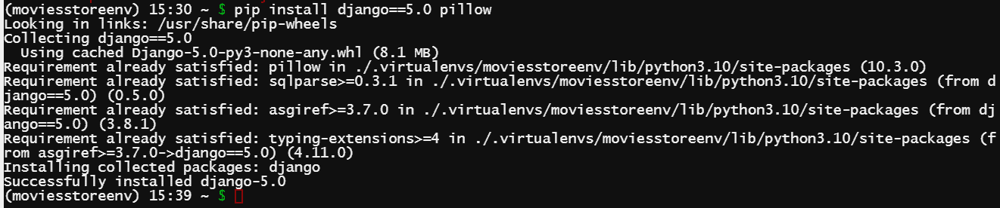

<st c="15489">图 13.11 – Django 和 Pillow 已安装</st>

<st c="15531">我们已经配置好了我们的虚拟环境。</st> <st c="15584">目前，您可以保持 Bash 控制台开启或关闭它。</st> <st c="15643">现在，让我们创建一个利用这个</st> <st c="15690">虚拟环境</st>的 Web 应用。

# <st c="15710">设置您的 Web 应用</st>

<st c="15734">在这个时候，我们需要准备</st> <st c="15774">三份信息：</st>

+   <st c="15803">您的 Django 项目顶级文件夹的路径（包含</st> `<st c="15879">manage.py</st>` <st c="15888">文件的文件夹）。</st> <st c="15896">对于这个项目，它通常是</st> `<st c="15946">/home</st>` <st c="15951">和</st> `<st c="15956">/<pythonanywhere-user></st>` <st c="15978">以及</st> `<st c="15983">/<github-repo-name></st>`<st c="16002">的组合。在我们的例子中，它</st> <st c="16020">是</st> `<st c="16024">/home/danielgara/moviesstore</st>`<st c="16052">。</st>

+   <st c="16053">您主项目文件夹的名称（即包含您的</st> `<st c="16141">settings.py</st>` <st c="16152">文件的文件夹名称）。</st> <st c="16160">在我们的例子中，它</st> <st c="16176">是</st> `<st c="16179">moviesstore</st>`<st c="16190">。</st>

+   <st c="16191">您的虚拟环境名称。</st> <st c="16221">在我们的例子中，它</st> <st c="16236">是</st> `<st c="16239">moviesstoreenv</st>`<st c="16253">。</st>

<st c="16254">现在，按照以下步骤设置您的</st> <st c="16301">Web 应用：</st>

1.  <st c="16309">在您的浏览器中，打开一个新标签页并转到 PythonAnywhere 仪表板。</st> <st c="16382">然后，点击</st> **<st c="16401">Web</st>** <st c="16404">标签页并点击</st> **<st c="16419">添加新的 Web 应用</st>** <st c="16436">(</st>*<st c="16438">图 13</st>**<st c="16447">.12</st>*<st c="16450">):</st>

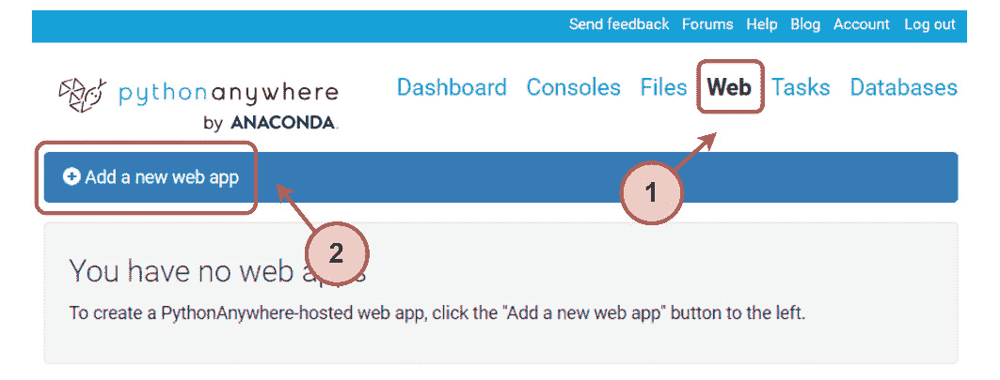

<st c="16686">图 13.12 – PythonAnywhere Web 标签</st>

1.  <st c="16723">PythonAnywhere 将要求您提供</st> <st c="16748">您的 Web 应用的域名</st>**<st c="16782">。只需点击</st> **<st c="16795">下一步</st>** <st c="16799">(</st>*<st c="16801">图 13</st>**<st c="16810">.13</st>*<st c="16813">):</st>

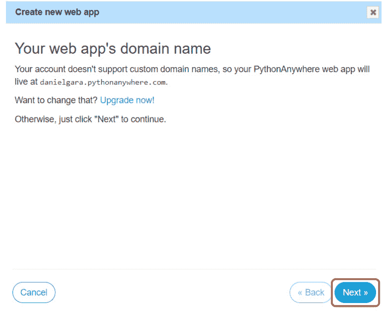

<st c="17052">图 13.13 – PythonAnywhere 域名</st>

1.  <st c="17093">在</st> **<st c="17101">选择 Python Web 框架</st>** <st c="17130">部分，选择</st> **<st c="17147">手动配置</st>** <st c="17167">(</st>*<st c="17169">图 13</st>**<st c="17178">.14</st>*<st c="17181">)：</st>

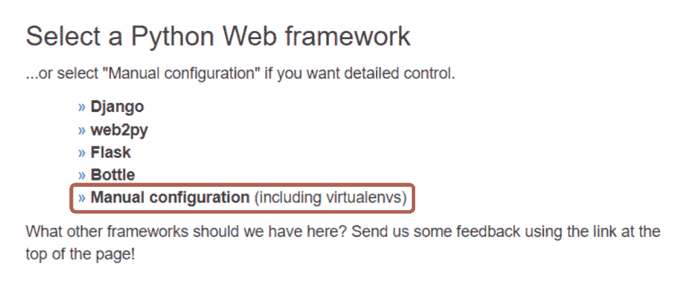

<st c="17469">图 13.14 – 选择手动配置</st>

<st c="17514">注意</st>

确保你选择**<st c="17541">手动配置</st>**<st c="17561">，而不是</st> **<st c="17571">Django</st>** <st c="17577">选项；这仅适用于新</st> <st c="17601">项目。</st>

1.  <st c="17615">选择正确的</st> <st c="17633">Python 版本（与您创建虚拟环境时使用的版本相同）。</st> <st c="17712">在我们的例子中，它是</st> `<st c="17732">Python 3.10</st>` <st c="17743">(</st>*<st c="17745">图 13</st>**<st c="17754">.15</st>*<st c="17757">）。</st> <st c="17761">最后，当被要求选择</st> **<st c="17785">手动配置</st>**<st c="17805">时，点击</st> **<st c="17813">下一步</st>** <st c="17817">(</st>*<st c="17819">图 13</st>**<st c="17828">.16</st>*<st c="17831">)。</st>

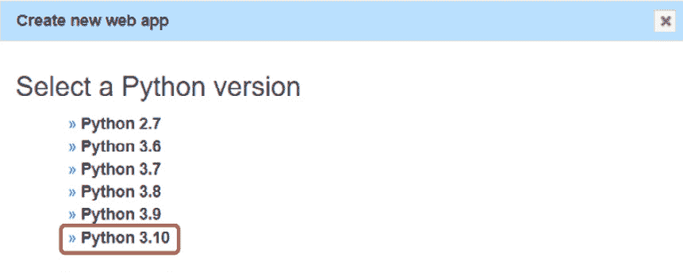

<st c="17938">图 13.15 – 选择正确的 Python 版本</st>

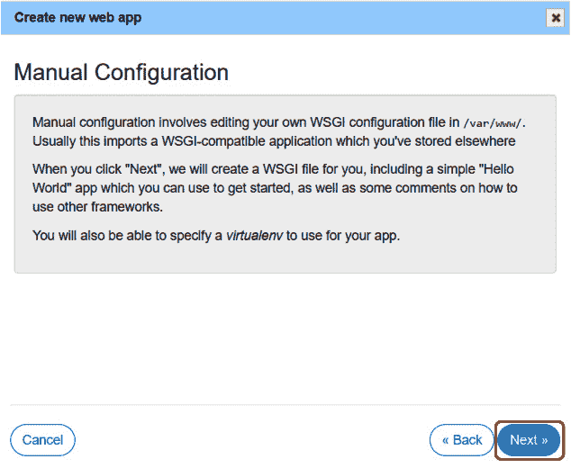

<st c="18431">图 13.16 – 完成 Web 应用</st>

1.  <st c="18468">一旦创建 Web 应用，你需要在</st> `<st c="18621">moviesstoreenv</st>`<st c="18635">中输入你的虚拟环境名称，它将自动完成其完整路径</st> <st c="18686">在</st> `<st c="18689">/home/username/.virtualenvs/moviesstoreenv</st>`<st c="18731">：</st>

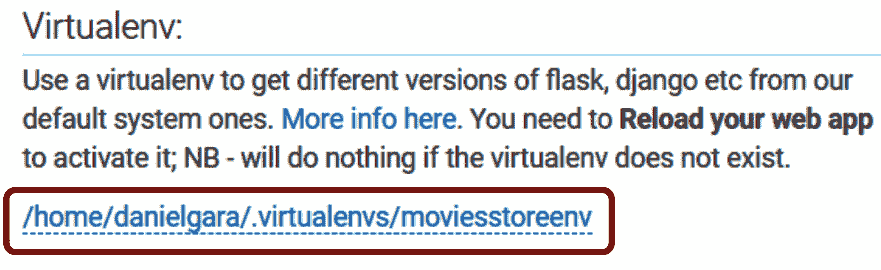

<st c="19007">图 13.17 – 输入虚拟环境名称</st>

1.  <st c="19050">接下来，在</st> **<st c="19130">代码部分</st>**<st c="19142">中输入你的用户文件夹路径（</st>`<st c="19097">/home/<your-username>/</st>`<st c="19120">），用于</st> **<st c="19153">源代码</st>** <st c="19164">和</st> **<st c="19169">工作目录</st>** <st c="19186">(</st>*<st c="19188">图 13</st>**<st c="19197">.18</st>*<st c="19200">)：</st>

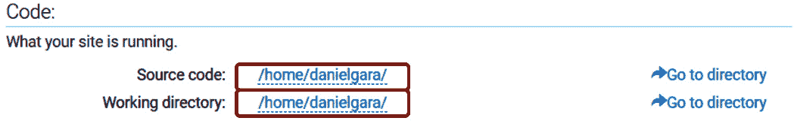

<st c="19339">图 13.18 – 输入你的代码路径</st>

1.  <st c="19384">点击</st> `<st c="19395">wsgi.py</st>` <st c="19402">文件，位于</st> **<st c="19419">代码部分</st>**<st c="19431">内，而不是你本地 Django 项目文件夹中的那个（</st>*<st c="19482">图 13</st>**<st c="19492">.19</st>*<st c="19495">）：</st>

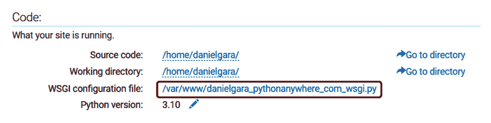

<st c="19673">图 13.19 – 访问 wsgi.py 文件</st>

<st c="19714">这将带您到一个编辑器，您可以在其中</st> <st c="19761">进行更改。</st>

1.  <st c="19774">删除除 Django 部分之外的所有内容，并取消注释该部分。</st> <st c="19793">您的 WSGI 文件将类似于以下内容：</st> <st c="19847">以下：</st>

    ```py
     # +++++++++++ DJANGO +++++++++++
    # To use your own django app use code like this:
    import os
    import sys
    path = '<st c="20013">/home/danielgara/moviesstore</st>'
    if path not in sys.path:
        sys.path.append(path)
    os.environ['DJANGO_SETTINGS_MODULE'] =
        '<st c="20132">moviesstore.settings</st>'
    from django.core.wsgi import get_wsgi_application
    application = get_wsgi_application()
    path = '<st c="20423">DJANGO_SETTINGS_MODULE</st> (where the <st c="20457">settings.py</st> file is located):
    ```

    ```py
    os.environ['DJANGO_SETTINGS_MODULE'] =
        '<st c="20619">settings.py</st>. Go to the PythonAnywhere <st c="20733">settings.py</st> file (*<st c="20751">Figure 13</st>**<st c="20761">.20</st>*):
    ```

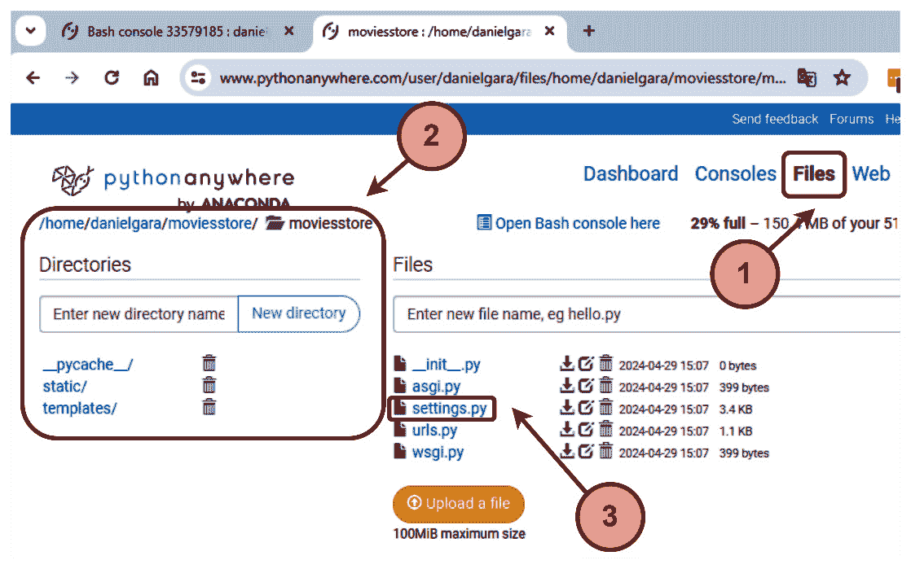

<st c="21409">图 13.20 – 访问 settings.py 文件</st>

1.  <st c="21454">点击</st> `<st c="21465">settings.py</st>` <st c="21476">文件。</st> <st c="21483">在</st> `<st c="21486">settings.py</st>`<st c="21497">中，修改</st> `<st c="21510">ALLOWED_HOSTS</st>` <st c="21523">变量：</st>

    ```py
     …
    # SECURITY WARNING: don't run with debug turned on in
      production! DEBUG = True
    ALLOWED_HOSTS = [<st c="21631">'*'</st>]
    …
    ```

    <st c="21639">保存</st> <st c="21645">文件。</st>

1.  <st c="21654">然后，转到</st> **<st c="21671">Web</st>** <st c="21674">选项卡，并</st> <st c="21682">点击</st> **<st c="21691">Reload</st>** <st c="21697">按钮以刷新您的域名（</st>*<st c="21722">图 13</st>**<st c="21732">.21</st>*<st c="21735">）：</st>

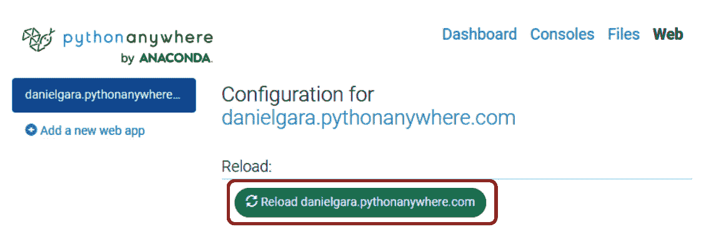

<st c="21885">图 13.21 – 重新加载 web 应用</st>

<st c="21921">以下</st> `<st c="21926">ALLOWED_HOSTS</st>` <st c="21939">设置表示我们的 Django 站点可以服务哪些主机/域名。</st> <st c="22010">这是一项安全措施，以防止 HTTP Host 头攻击。</st> <st c="22074">我们使用了星号（</st>`<st c="22096">*</st>`<st c="22098">）通配符来表示所有域名都是可接受的。</st> <st c="22154">在您的生产项目中，您可以明确列出允许的域名。</st>

1.  <st c="22233">转到您的项目 URL（例如，在之前的屏幕截图中的蓝色链接，例如，</st>`<st c="22321">danielgara.pythonanywhere.com</st>`<st c="22350">），主页现在应该出现（</st>*<st c="22391">图 13</st>**<st c="22401">.22</st>*<st c="22404">）：</st>

<st c="22407">注意</st>

<st c="22412">主页看起来会很奇怪，因为我们需要配置我们的应用程序以服务静态文件（如图片和样式）。</st> <st c="22541">我们稍后会修复它。</st>


<st c="22647">图 13.22 – PythonAnywhere web 应用链接</st>

<st c="22693">我们几乎完成了！</st> <st c="22715">让我们在下一节中修复静态图片。</st>

# <st c="22763">配置静态文件</st>

<st c="22788">让我们解决我们的</st> <st c="22818">静态和媒体图片</st> <st c="22842">不显示的问题：</st>

1.  <st c="22856">在 PythonAnywhere 中，返回到</st> `<st c="22921">settings.py</st>` <st c="22932">文件。</st> <st c="22939">我们需要在**<st c="22971">粗体</st>**<st c="22975">中添加以下内容：</st>

    ```py
     …
    STATIC_URL = 'static/' <st c="23002">STATIC_ROOT = os.path.join(BASE_DIR, 'static')</st> # Default primary key field type
    # https://docs.djangoproject.com/en/4.0/ref/settings/
    #default-auto-field
    DEFAULT_AUTO_FIELD = 'django.db.models.BigAutoField'
    MEDIA_ROOT = os.path.join(BASE_DIR,'media')
    MEDIA_URL = '/media/'
    …
    ```

    <st c="23276">以下</st> `<st c="23281">STATIC_ROOT</st>` <st c="23292">变量定义了一个中央位置，我们将所有</st> <st c="23355">静态文件</st>收集到该位置。

1.  <st c="23368">在 PythonAnywhere 中，转到</st> <st c="23390">的</st> **<st c="23398">控制台</st>** <st c="23406">选项卡，并点击您的</st> **<st c="23427">Bash 控制台</st>**<st c="23439">。然后，通过执行以下命令连接到您的虚拟环境：</st>

    ```py
    <st c="23905">settings.py</st> and copies them into <st c="23938">STATIC_ROOT</st>:
    ```

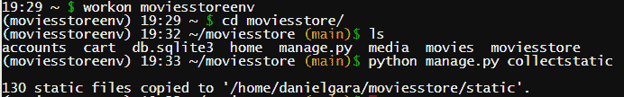

<st c="24234">图 13.23 – 执行 python manage.py collectstatic 命令</st>

<st c="24301">您需要每次想要发布您静态文件的新版本时都重新运行此</st> <st c="24324">命令。</st>

1.  <st c="24396">接下来，设置静态文件映射，以便我们的 web 服务器为您提供服务。</st> <st c="24495">在</st> `<st c="24597">/static/</st>`<st c="24605">. 在</st> `<st c="24650">static/</st>`<st c="24657">, 例如，</st> `<st c="24672">/home/danielgara/moviesstore/static/</st>` <st c="24708">(</st>*<st c="24710">图 13</st>**<st c="24719">.24</st>*<st c="24722">):</st>

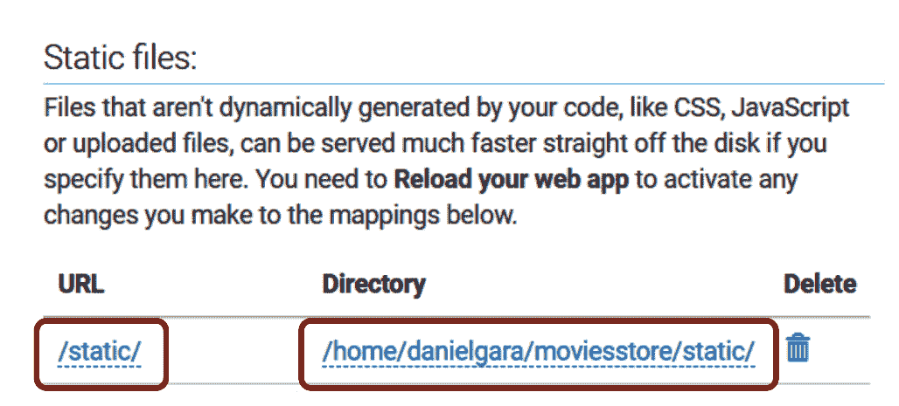

<st c="25067">图 13.24 – 定义静态文件</st>

1.  <st c="25107">然后，在</st> **<st c="25121">Web</st>** <st c="25124">选项卡中，点击</st> **<st c="25134">重新加载</st>**<st c="25140">，打开您的网站，现在您的静态图像应该会出现（</st>*<st c="25203">图 13</st>**<st c="25213">.25</st>*<st c="25216">）：</st>


<st c="25349">图 13.25 – 电影商店 – 首页</st>

<st c="25392">我们做到了！</st> <st c="25404">我们的电影商店</st> <st c="25420">项目已部署到云端。</st> <st c="25461">现在您可以在网站的不同部分之间导航或与同事</st> <st c="25571">和朋友们分享您的网站链接。</st>

# <st c="25583">总结</st>

<st c="25591">我们已经介绍了大量内容，为您提供创建全栈 Django 应用所需的所有技能。</st> <st c="25709">我们涵盖了 Django 的主要功能：模板、视图、URL、用户认证、授权、模型、会话、表单和部署。</st> <st c="25856">您现在有了构建自己的 Django 网站所需的知识。</st> <st c="25930">在我们的 Reviews 应用程序中，CRUD 功能在许多网络应用程序中都很常见 – 例如，您已经有了创建博客、待办事项列表或购物车</st> <st c="26100">网络应用程序的所有工具。</st>

<st c="26117">希望您喜欢这本书，并希望从我们这里学到更多</st> <st c="26185">。</st>
