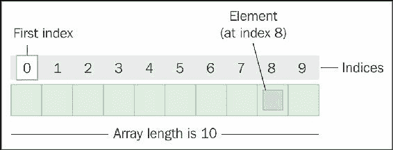
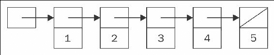
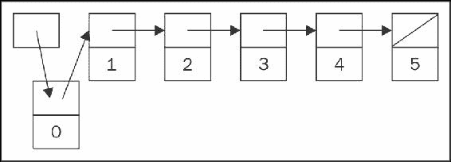
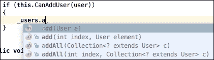

# 第三章：列表：线性集合

在我们上一章中，我们介绍了数组数据结构，这是我们将在本文中探讨的许多结构的基础。尽管数组为静态数据集合提供了良好的性能，但我们的编码示例证明，对于许多应用来说，它们既不灵活也不高效——以至于从集合中添加或删除一个元素这样的简单操作都变得极其复杂且成本高昂。

在某些方面，列表是数组的演变。列表可以被定义为有限、有序的对象或值的序列，称为**元素**。空列表是没有元素的列表，而列表的长度是集合中元素的总数。列表中的第一个项目称为**头**，而最后一个项目称为**尾**。在长度为 1 的列表中，头和尾是同一个对象。

### 注意

虽然**数组**是一种**具体**的数据结构，但**列表**是数据结构的一个抽象概念，许多语言都提供了具体的实现。我们将在本章后面的 Java 示例中更详细地探讨这种区别。

有序列表不应与排序列表混淆，因为列表可以是**排序**的或**未排序**的。有序仅仅意味着每个元素在列表中都有一个定义的位置。排序列表中的对象之间存在某种关系，而未排序列表中的对象之间没有显著的关系。例如，当我的妻子创建购物清单时，她会坐下来并仔细组织杂货，使其与她对超市的布局的了解相关。她清单上的项目是杂货的类型，并且它们根据在超市中的相对位置排列，因此它们有**空间关系**。这是一个排序列表。另一方面，我创建购物清单时，会在冰箱上贴一张纸，并在注意到架子空了或容器缺失时在纸上乱写项目。尽管我清单上的项目都是杂货的类型，但它们没有以任何特定的方式排列，因此它们之间没有**显著的关系**。这是一个未排序列表的例子。

本章我们将涵盖以下内容：

+   列表数据结构的定义

+   初始化列表

+   列表的应用示例

+   列表实现

+   追加、插入和删除操作

+   基于数组的列表

+   链表

+   双向链表

+   搜索

# 列表实现

列表数据结构最常见的实现之一是**基于数组**的列表。一般来说，基于数组的列表只是一个连续的数组位置列表，每个位置都持有指向列表元素的**指针**。由于列表基于数组，其功能和性能与数组非常相似。

如前例所示，另一种常见的实现是**链表**。链表也是一个元素序列，但大多数实现将元素称为**节点**。在链表中，元素的指针不包含在数组结构中，而是在内存中存在一个指针来标识第一个节点。然后每个节点都包含指向列表中后续节点的链接。

最后，还有**双向链表**。在双向链表中，每个节点都包含指向列表中后续节点和前一个节点的链接。双向链表使得双向遍历列表变得更加简单。头节点的上一个链接和尾节点的下一个链接都是空的。另一种选择是将头节点的上一个链接指向尾节点，尾节点的下一个链接指向头节点，这样双向链表就变成了**循环链表**。

### 注意

双向链表这个术语并不常用，但如果你在使用 Java 或 C#中的`LinkedList`类，实际上你就是在使用双向链表。C#和 Java 没有提供**单链表**类型，双向链表为你提供了相同的功能甚至更多，所以你通常不需要它。然而，如果你真的出于学术目的想要实现一个，那也很容易做到。

通常，这个结构的每个具体实现都为你提供了方便的方法，允许你从列表中追加、插入和删除元素。基于数组和基于链接的列表都提供了访问基本追加、插入和删除操作的方法。然而，这些操作的实施方式和它们相关的成本在这两种实现之间略有不同。如果现有的方法没有内置，那么创建这种功能通常是一个简单的练习。

### 注意

与其他抽象数据结构的实现一样，当在创建我们自己的方法和框架提供的任何方法之间做出选择时，选择后者，因为它们通常会更健壮和可靠。

## 基于数组的列表

在基于数组的列表中，追加操作的成本是**O**(*1*)，因为我们总能通过简单地增加尾位置的索引来确定新元素的位置：



每当我们向基于数组的列表中插入一个元素时，我们还需要管理数组中现有对象的位置以容纳新的节点。在索引*i*处插入元素需要我们将*i*之后的所有元素向尾部移动一个位置，这意味着我们需要执行*n* - *i*次操作，其中*n*是列表中已有的元素数量。在头部位置插入是一个最坏情况的操作，耗时**O**(*n*)。由于我们在评估算法效率时总是计算最坏情况下的成本，因此插入一个元素的成本是**O**(*n*)。

从索引*i*处删除列表中的元素需要我们将*i*之后的所有元素向头部移动一个位置，这意味着我们需要执行*n* - *i*- 1 次操作，其中*n*是列表中的元素数量。从头部位置删除是一个最坏情况的操作，耗时**O**(*n*)。因此，删除一个元素的成本是**O**(*n*)，如下图中所示：



## 链表

与基于数组的列表一样，追加操作的成本是**O**(*1*)。然而，插入和删除操作的成本也是**O**(*1*)。与基于数组的列表相比，链表的一个关键优势是可变性。与数组不同，链表是一系列通过内存指针相互关联的离散对象，因此插入或删除元素只是简单地添加或修改这些指针。换句话说，链表能够以非常高效的方式根据集合的增加和删除进行扩展和收缩。



如果我们想在位置*i*插入一个元素，我们需要将原始指针*i* - 1 -> *i*改为指向我们的新元素*i*，并插入一个新的指针*i* -> *i* + 1。同样，删除位置*i*的元素需要调整指针从*i* - 1 -> *i*到*i* - 1 -> *i* + 1。

# 实例化列表

与其他数据结构一样，列表在使用之前必须定义和实例化。我们将在这篇文本中检查的四种语言对列表数据结构的支持各有不同，并且具有独特的实现方式。让我们简要地看看如何在每种语言中实例化一个列表。

**C#**

在 C#中实例化列表需要使用`new`关键字：

```py
    //Array backed lists 
    ArrayList myArrayList = new ArrayList(); 
    List<string> myOtherArrayList = new List<string>(); 

    //Linked lists 
    LinkedList<string> myLinkedList = new LinkedList<string>(); 

```

C#的`ArrayList`类起源于.NET 1.0，现在使用得不太多了。大多数开发者更喜欢使用基于数组的列表的泛型具体实现，即`List<of T>`。这同样适用于泛型具体链表实现，即`LinkedList<of T>`。在 C#中没有非泛型链表数据结构。

**Java**

与 C#类似，在 Java 中初始化列表也需要使用`new`关键字：

```py
    //Array backed lists 
    List<string> myArrayList = new ArrayList<string>(); 

    //Linked lists 
    LinkedList<string> myLinkedList = new LinkedList<string>(); 

```

Java 开发者将使用`List<E>`类的具体实现来创建一个基于数组的列表。这同样适用于具体的链表实现，即`LinkedList<E>`。Java 中没有非泛型的链表数据结构。

**Objective-C**

在 Objective-C 中创建列表的过程如下：

```py
    //Array backed lists 
    NSArray *myArrayList = [NSArray array]; 

    //Linked lists 
    NSMutableArray *myLinkedList = [NSMutableArray array]; 

```

如果你阅读了关于数组的章节，这个例子可能引起了你的注意。实际上，这并不是一个错误。在 Objective-C 中，基于数组的列表最接近的实现可以在`NSArray`类中找到，而链表的最接近实现可以在`NSMutableArray`类中找到。这是因为`NSArray`和`NSMutableArray`被称为**类簇**。类簇提供了真正的抽象类公共 API。当你初始化这些类之一时，你会得到一个针对你提供的数据定制的具体数据结构实现。这些实现甚至可以在运行时根据数据集的性质变化而变化，使得数组类非常灵活。这意味着我们将在本文中讨论的许多数据结构都只通过三个抽象类在 Objective-C（和 Swift）中实现。

### 注意

**Objective-C 中的类簇**

类簇是基于**抽象工厂**模式的设计模式，该模式返回一个遵循特定接口（C#/Java）或协议（Objective-C/Swift）的类型。它们在**Foundation**框架中被大量使用，这是一个好事。

类簇将私有、具体的子类分组在抽象超类或 API 下。与直接处理每个子类相比，这个公共 API 更容易使用。`NSNumber`、`NSString`、`NSArray`和`NSDictionary`都是 Foundation 中类簇的例子。

**Swift**

最后，这是在 Swift 中实例化列表的方法：

```py
    //Lists 
    var myArray = [string]() 
    var myOtherArray: Array<string> = [String]() 

```

Swift 也使用类簇来表示许多不同的抽象集合。对于列表，我们使用`Array`类，它默认既泛型又可变。Swift 中数组有简写和显式声明两种形式。尽管更冗长，但显式定义更清楚地展示了 API 的泛型特性。

# 重新访问登录到服务的用户

在第二章，“数组：基础结构”中，我们创建了一个应用程序来跟踪登录到网络服务的用户，使用数组作为包含`User`对象的底层数据结构。然而，通过使用列表数据结构，这个设计可以大大改进。在这里，让我们重新审视登录到服务的用户问题，并通过用列表替换类数组，我们将看到在大多数情况下我们的原始代码既简短又易于阅读。

**C#**

在这个例子中，我们将`User[]`对象替换为了`List<User>`对象。大部分的代码重构都是显而易见的，但有三行代码需要特别注意。首先，在`CanAddUser()`方法中，我们通过利用`List<T>.Contains()`方法将 15 行代码缩减为 2 行，并简化了我们的逻辑循环。接下来，在`UserAuthenticated()`方法中，我们使用了`List<T>.Add()`方法，这替代了对`Array.Resize()`的调用以及使用下标操作符赋值时容易出错的方法。最后，我们使用`List<T>.Remove()`方法替换了近 20 行复杂且难看的代码。仅从缩短的代码来看，这个包装类提供的便利和功能应该是显而易见的：

```py
    List<User> _users; 
    public LoggedInUserList() 
    { 
        _users = new List<User>(); 
    } 

    bool CanAddUser(User user) 
    { 
        if (_users.Contains(user) || _users.Count >= 30) 
        { 
            return false; 
        } else { 
            return true; 
        } 
    } 

    public void UserAuthenticated(User user) 
    { 
        if (this.CanAddUser(user)) 
        { 
            _users.Add(user); 
        } 
    } 

    public void UserLoggedOut(User user) 
    { 
        _users.Remove(user); 
    } 

```

**Java**

在这个例子中，我们将`User[]`对象替换为了`List<User>`对象。大部分的代码重构都是显而易见的，但有三行代码需要特别注意。首先，在`CanAddUser()`方法中，我们通过利用`List<E>.contains()`方法将 15 行代码缩减为 2 行，并简化了我们的逻辑循环。接下来，在`UserAuthenticated()`方法中，我们使用了`List<E>.add()`方法，这替代了对`Array.copyOf()`的调用以及使用下标操作符赋值时容易出错的方法。最后，我们使用`List<E>.remove()`方法替换了近 20 行复杂且难看的代码：

```py
    List<User> _users; 
    public LoggedInUserList() 
    { 
        _users = new LinkedList<User>; 
    } 

    boolean CanAddUser(User user) 
    { 
        if (_users.contains(user) || _users.size() >= 30) 
        { 
            return false; 
        } else { 
            return true; 
        } 
    } 

    public void UserAuthenticated(User user) 
    { 
        if (this.CanAddUser(user)) 
        { 
            _users.add(user); 
        } 
    } 

    public void UserLoggedOut(User user) 
    { 
        _users.remove(user); 
    } 

```

以下截图展示了当可以使用泛型类时使用泛型类的另一个好处。正如你所见，我们的代码补全，或称为**Intellisense**，建议了可能的补全选项，包括应包含在集合中的正确类型。这可以避免你反复检查以确保使用正确的对象和集合，这既耗时又令人烦恼。



**Objective-C**

在这个例子中，我们将`NSArray _users`对象替换为了`NSMutableArray _users`对象。在这个例子中，除了某些合并和代码清理之外，实际上只有一个重构。在`userLoggedOut:`中，我们使用`NSMutableArray removeObject:`方法替换了近 20 行复杂且难看的代码，而不是检查索引、循环和合并对象：

```py
    @interface EDSLoggedInUserList() 
    { 
        NSMutableArray *_users; 
    } 
    -(instancetype)init 
    { 
        if (self = [super init]) 
        { 
            _users = [NSMutableArray array]; 
        }   
        return self; 
    } 

    -(BOOL)canAddUser:(EDSUser *)user 
    { 
        if ([_users containsObject:user] || [_users count] >= 30) 
        { 
            return false; 
        } else { 
            return true; 
        } 
    } 

    -(void)userAuthenticated:(EDSUser *)user 
    { 
        if ([self canAddUser:user]) 
        { 
            [_users addObject:user]; 
        } 
    } 

    -(void)userLoggedOut:(EDSUser *)user 
    { 
        [_users removeObject:user]; 
    } 

```

**Swift**

如果你仔细比较这段代码与原始代码，你会发现它们实际上是相同的！这是因为 Swift 的`Arrays`已经是可变的，并且已经支持泛型类型，所以我们的原始`LoggedInUserArray`类已经像 Swift 那样能够通过现成的代码产生输出，表现得像是一个链表。我们可以在 Swift 中创建自己的链表实现，但这只有在非常特定的用例中才是必要的：

```py
    var _users: Array = [User]() 
    init() { } 

    func canAddUser(user: User) -> Bool 
    { 
        if (_users.contains(user) || _users.count >= 30) 
        { 
            return false; 
        } else { 
            return true; 
        } 
    } 

    public func userAuthenticated(user: User) 
    { 
        if (self.canAddUser(user)) 
        { 
            _users.append(user) 
        } 
    } 

    public func userLoggedOut(user: User) 
    { 
        if let index = _users.indexOf(user) 
        { 
            _users.removeAtIndex(index) 
        } 
    } 

```

### 注意

这些使用列表数据结构各种变体的重构示例不仅流程简化，而且比它们的数组对应物性能更优。出于这两个原因，列表结构被证明是此应用的更优选择。

## 泛型

你可能已经注意到了我们的 C#示例中的`List<T>.Contains()`方法或 Java 示例中的`List<E>.Add()`方法。这些方法是定义为泛型类的类的一部分。在计算机科学中，泛型允许你在声明类或调用方法之前不指定数据类型。例如，假设你有一个将两个数值相加的方法。为了直接与这些类型交互，你可以为`Add()`方法创建多个重载：

```py
    //C# 
    public int Add(int a, int b) 
    public double Add(double a, double b) 
    public float Add(float a, float b) 

```

泛型允许你创建一个针对调用它的类型定制的单一方法，这极大地简化了你的代码。在这个例子中，`T`可以被替换为调用者需要的任何类型：

```py
    public T Add<T>(T a, T b) 

```

泛型是一个非常强大的工具，我们将在第十二章中更详细地讨论，*排序：从混乱中带来秩序*。

## 案例研究：骑行路线

**业务问题**：为喜欢越野骑行的骑行爱好者编写一个移动应用程序。其中一个关键的业务需求是能够在路径中存储航点。路径必须有起点和终点，并且需要能够双向遍历。应用程序还需要能够实时修改骑行者的路径，以便绕过障碍物、访问休息区或添加兴趣点。

由于应用程序的性质及其需求，表示路径的类将需要几个基本的功能。首先，它将需要添加、删除和插入航点的功能。接下来，它将需要启动路径并遍历路径以向前和向后导航的能力。最后，该类应能够轻松地识别起点和终点以及当前关注的航点。

由于此类数据的性质是所有航点之间都有空间关系，并且应用程序必须利用这种关系从一点到另一点进行遍历，因此数组作为数据结构的选择会很差。然而，由于列表本身提供了一种定义和遍历集合中对象之间关系的机制，开发者选择使用链表结构来构建此组件。

**C#**

C#通过`LinkedList<T>`类和`LinkedListNode<T>`类方便地公开了链表结构。因此，在 C#中构建此类应该是一个相当直接的过程。以下是一个简单的 C#实现示例：

```py
    LinkedList<Waypoint> route; 
    LinkedListNode<Waypoint> current; 
    public WaypointList() 
    { 
        this.route = new LinkedList<Waypoint>(); 
    } 

```

首先，我们声明了两个属性。第一个是`route`属性，它是`LinkedList<Waypoint>`类型。下一个对象是`current`节点。我们声明了这两个对象而没有明确定义它们的范围，因此它们默认为`private`。我们希望这些字段是私有的，因为我们只允许这个类中的方法修改它们的值。我们的构造函数只实例化了`route`属性，因为`current`节点将根据需要分配：

```py
    public void AddWaypoints(List<Waypoint> waypoints) 
    { 
        foreach (Waypoint w in waypoints) 
        { 
            this.route.AddLast(w); 
        } 
    } 

    public bool RemoveWaypoint(Waypoint waypoint) 
    { 
        return this.route.Remove(waypoint); 
    } 

```

`AddWaypoints(List<Waypoint>)`方法允许我们向现有路线添加*1...n*个新的航点。C#不提供合并`List<T>`与`LinkedList<T>`的机制，因此我们必须求助于遍历`waypoints`并使用`LinkedList<T>.AddLast()`逐个添加新节点，这意味着这个操作的成本是**O**(*i*)，其中*i*是`waypoints`列表中的元素数量。

`RemoveWaypoint(Waypoint)`方法简单地调用`LinkedList<T>.Remove()`在路线上，传递`waypoint`作为参数。由于这实际上是搜索操作，它也花费**O**(*n*)：

```py
    public void InsertWaypointsBefore(List<Waypoint> waypoints, Waypoint before) 
    { 
        LinkedListNode<Waypoint> node = this.route.Find(before); 
        if (node != null) 
        { 
            foreach (Waypoint w in waypoints) 
            { 
                this.route.AddBefore(node, w); 
            } 
        } else { 
                this.AddWaypoints(waypoints); 
        }  
    } 

```

`InsertWaypointsBefore(List<Waypoint>, Waypoint)`方法使我们的类能够创建替代路线并在运行时添加中间目的地。首先，我们尝试定位`before`节点。如果我们找到了它，我们就开始顺序地将新航点的列表插入到`before`节点之前。如果没有找到，我们立即调用`AddWaypoints(List<Waypoint>)`将新航点列表附加到路线上。尽管这个循环的功能可能看起来有些奇怪，但通过在`before`节点之前逐个添加每个项目，我们每次操作都将`before`节点向尾部移动一个节点，确保每个新节点按正确顺序插入。

这是这个类中最昂贵的操作，因为它结合了搜索和插入。这意味着它的操作成本是**O**(*n*+*i*)，其中*n*是现有`route`集合中的元素数量，*i*是`waypoints`列表中的元素数量：

```py
    public bool StartRoute() 
    { 
        if (this.route.Count > 1) 
        { 
            this.current = this.StartingLine(); 
            return this.MoveToNextWaypoint(); 
        } 
        return false; 
    } 

```

`StartRoute()`方法用于设置我们的初始当前位置并标记它已被禁用。由于我们的整体类代表一个路线，而路线至少是一个二维对象，`StartRoute()`方法立即验证`route`至少有两个航点。如果没有，我们返回`false`，因为路线尚未准备好被穿越。如果我们有两个或更多的航点，我们将`current`航点设置为起点并移动到下一个点。`StartRoute()`方法的操作成本是**O**(*1*)。

### 注意

我们可以轻松地复制 `StartingLine()` 方法中的关键代码和 `MoveToNextWaypoint()` 方法中的代码，在 `StartRoute()` 方法中本地复制。这样做意味着，如果我们想改变识别起点线或导航路线的方式，我们需要在多个位置维护这段代码。通过遵循这种代码重用的模式，我们最小化了工作量并减少了这种重构可能引入的新潜在错误数量。

接下来我们将查看那些改变对象位置的方法。

```py
    public bool MoveToNextWaypoint() 
    { 
        if (this.current != null) 
        { 
            this.current.Value.DeactivateWaypoint(); 
            if (this.current != this.FinishLine()) 
            { 
                this.current = this.current.Next; 
                return true; 
            } 
            return false; 
        } 
        return false; 
    } 

    public bool MoveToPreviousWaypoint() 
    { 
        if (this.current != null && this.current != this.StartingLine()) 
        { 
            this.current = this.current.Previous; 
            this.current.Value.ReactivateWaypoint(); 
            return true; 
        } 
        return false; 
    } 

```

`MoveToNextWayPoint()` 和 `MoveToPreviousWaypoint()` 方法引入了我们的路线遍历功能。在 `MoveToNextWayPoint()` 中，我们检查当前航标点是否为 `null`，然后将其停用。接下来，我们检查是否到达了终点线，如果没有，我们将 `current` 设置为 `route` 中的下一个节点并返回 `true`。`MoveToPreviousWaypoint()` 方法验证 `current` 是否不为 `null` 并确保我们不在起点线。如果是这样，我们将 `current` 移动到前一个航标点并重新激活它。如果这两个方法中的任何检查失败，我们返回 `false`。这些方法中的每一个都有 **O**(*1*) 的操作成本。

### 注意

在 `MoveToNextWaypoint()` 中看到的这种双重 `false` 返回值可能看起来像是一个设计缺陷，但请记住，我们的类并不负责整个应用程序的功能，只负责路线的功能。检查路线是否准备好遍历的责任在于 *调用者* 在调用 `MoveToNextWaypoint()` 之前。我们的返回值仅表示操作的成功或失败。

最后，我们将查看指示位置的方法：

```py
    public LinkedListNode<Waypoint> StartingLine() 
    { 
        return this.route.First; 
    } 

    public LinkedListNode<Waypoint> FinishLine() 
    { 
        return this.route.Last; 
    } 

    public LinkedListNode<Waypoint> CurrentPosition() 
    { 
        return this.current; 
    } 

```

我们添加了 `StartingLine()` 和 `FinishLine()` 方法来公开路线集合的头和尾节点。最后，我们添加了 `CurrentPosition()` 方法来公开路线中的哪个节点是我们下一个立即的目的地。这些方法中的每一个都有 **O**(*1*) 的操作成本。

**Java**

Java 通过 `LinkedList<E>` 类也公开了一个链表数据结构。然而，Java 并没有提供列表节点结构的实现。这是因为，在 Java 中，你通常不直接与节点交互，而是通过列表迭代器。`ListIterator<E>` 类提供了实现链表结构所需的基本功能。如果我们需要我们自己的节点类，实现起来会很容易。以下是一个简单的 `WaypointList` 类实现示例：

```py
    LinkedList<Waypoint> route; 
    Waypoint current; 
    public WaypointList() 
    { 
        this.route = new LinkedList<Waypoint>(); 
    } 

```

首先，我们声明两个属性。第一个是 `route`，它是一个抽象的 `List<Waypoint>`，下一个对象是 `current` 节点。我们未明确定义这两个对象的范围，因此它们默认为 `package-private`，这对于我们的情况来说是合适的。我们希望这些字段是私有的，因为我们只允许这个类中的方法修改它们的值。我们的构造函数只实例化了 `route`，因为 `current` 节点将根据需要分配：

```py
    public void AddWaypoints(List<Waypoint> waypoints) 
    { 
        this.route.addAll(waypoints); 
    } 

    public boolean RemoveWaypoint(Waypoint waypoint) 
    { 
        return this.route.remove(waypoint); 
    } 

```

`AddWaypoints(List<Waypoint>)` 方法允许我们向现有路线添加 *1..*.*n* 个新的航点。我们使用 `LinkedList<E>.addAll()` 方法将对象添加到我们的列表中。这个操作非常简单，成本为 **O**(*1*)。`RemoveWaypoint(Waypoint)` 方法简单地调用路线上的 `LinkedList<E>.remove()`，并将 `waypoint` 作为参数传递。由于这是一个搜索操作，它成本为 **O**(*n*)：

```py
    public void InsertWaypointsBefore(List<Waypoint> waypoints, Waypoint before) 
    { 
        int index = this.route.indexOf(before); 
        if (index >= 0) 
        { 
            this.route.addAll(index, waypoints); 
        } else { 
            this.AddWaypoints(waypoints); 
        } 
    } 

```

`InsertWaypointsBefore(List<Waypoint>, Waypoint)` 方法使我们的类能够创建替代路线并在飞行中添加中间目的地。首先，我们尝试使用 `LinkedList<E>.indexOf()` 定位 `before` 节点。如果 `indexOf()` 方法找不到对象，它将返回 `-1`，因此我们确认值大于 `-1`；否则，我们立即调用 `AddWaypoints(List<Waypoint>)` 将新的航点列表附加到路线上。如果 `before` 节点是有效的，我们在 `before` 节点之前添加新的航点列表。

这是这个类中最昂贵的操作方法，因为它是一个搜索和插入的组合。这意味着它的操作成本是 **O**(*n*+*i*)，其中 *n* 是现有 `route` 中的元素数量，*i* 是航点列表中的元素数量：

```py
    public boolean StartRoute() 
    { 
        if (this.route.size() > 1) 
        { 
            this.current = this.StartingLine(); 
            return this.MoveToNextWaypoint(); 
        } 
        return false; 
    } 

```

`StartRoute()` 方法用于设置我们的初始当前位置并标记它已被禁用。由于我们的整体类代表一个路线，而路线按定义至少是一个二维对象，`StartRoute()` 方法立即验证 `route` 至少有两个航点，如果没有，我们返回 `false`，因为 `route` 还未准备好被遍历。如果我们有两个或更多航点，我们将 `current` 航点设置为起点并移动到下一个点。`StartRoute()` 的操作成本为 **O**(1)：

```py
    public boolean MoveToNextWaypoint() 
    { 
        if (this.current != null) 
        { 
            this.current.DeactivateWaypoint(); 
            if (this.current != this.FinishLine()) 
            { 
                int index = this.route.indexOf(this.current); 
                this.current = this.route.listIterator(index).next(); 
                return true; 
            } 
            return false; 
        } 
        return false; 
    } 

    public boolean MoveToPreviousWaypoint() 
    { 
        if (this.current != null && this.current != this.StartingLine()) 
        { 
            int index = this.route.indexOf(this.current); 
            this.current = this.route.listIterator(index).previous(); 
            this.current.ReactivateWaypoint(); 
            return true; 
        } 
        return false; 
    } 

```

`MoveToNextWayPoint()` 和 `MoveToPreviousWaypoint()` 方法介绍了我们的路线遍历功能。在 `MoveToNextWayPoint()` 方法中，我们检查当前航标点是否不是 `null`，然后将其停用。接下来，我们检查是否不在终点线，如果不是，我们将 `current` 设置为下一个，通过将其分配给 `listIterator` 属性和 `route` 的 `next()` 方法，然后返回 `true`。`MoveToPreviousWaypoint()` 方法验证 `current` 不是 `null` 并确保我们不在起点线。如果是这样，我们将 `current` 设置为前一个航标点并重新激活它。如果这两个方法中的任何检查失败，我们返回 `false`。由于需要搜索 `current` 的匹配项，这些方法每个都有 **O**(*n*+1) 的操作成本：

```py
    public Waypoint StartingLine() 
    { 
        return this.route.getFirst(); 
    } 

    public Waypoint FinishLine() 
    { 
        return this.route.getLast(); 
    } 

    public Waypoint CurrentWaypoint() 
    { 
        return this.current; 
    } 

```

我们添加了 `StartingLine()` 和 `FinishLine()` 方法来暴露路线集合的头尾节点。最后，我们添加了 `CurrentPosition()` 方法来暴露路线中的哪个节点是我们的下一个直接目的地。这些方法每个都有 **O**(1) 的操作成本。

**Objective-C**

Objective-C 默认不提供任何链表的实现。尽管我们可以创建自己的实现，但本文的目的是演示在现有工具下最佳的方法。对于这个场景，我们再次使用类簇，`NSMutableArray`。以下是一个简单的示例，说明 `EDSWaypointList` 类如何在 Objective-C 中实现：

```py
    @interface EDSWaypointList() 
    { 
        NSMutableArray *_route; 
        EDSWaypoint *_current; 
    } 
    -(instancetype)init 
    { 
        if (self = [super init]) 
        { 
            _route = [NSMutableArray array]; 
        } 
        return self; 
    } 

```

首先，我们声明两个 `ivar` 属性。第一个是 `_route`，它是一个 `NSMutableArray` 数组。下一个对象是 `_current` 节点。同样，我们将其声明为 ivars，因为我们只允许这个类中的方法修改它们的值。我们的初始化器只实例化了 `_route`，因为 `_current` 节点将根据需要分配：

```py
    -(void)addWaypoints:(NSArray*)waypoints 
    { 
        [_route addObjectsFromArray:waypoints]; 
    } 

    -(BOOL)removeWaypoint:(EDSWaypoint*)waypoint 
    { 
        if ([_route containsObject:waypoint]) 
        { 
            [_route removeObject:waypoint]; 
            return YES; 
        } 
        return NO; 
    } 

```

`addWaypoints:` 方法允许我们向现有路线添加 *1...n* 个新的航标点。`NSMutableArray` 允许我们通过调用 `addObjectsFromArray:` 将新数组与现有路线合并。这个操作相当简单，成本为 **O**(*1*)。

`removeWaypoint:` 方法确认 `_route` 包含 `waypoint` 使用 `containsObject:`，然后调用 `removeObject:`。如果我们不关心这个操作的成功或失败，我们可以简单地调用 `removeObject:` 并继续。请注意，由于我们的 `_route` 对象是一个基于数组的列表，它允许进行 **O**(*1*) 的搜索操作。由于我们事先不知道航标点的索引，`removeObject:` 操作仍然成本为 **O**(*n*):

```py
    -(void)insertWaypoints:(NSArray*)waypoints beforeWaypoint:(EDSWaypoint*)before 
    { 
        NSUInteger index = [_route indexOfObject:before]; 
        if (index == NSNotFound) 
        { 
            [self addWaypoints:waypoints]; 
        } else { 
            NSRange range = NSMakeRange(index, [waypoints count]); 
            NSIndexSet *indexSet = [NSIndexSetindexSetWithIndexesInRange:range]; 
            [_route insertObjects:waypoints atIndexes:indexSet]; 
        } 
    } 

```

`insertWaypoints:beforeWaypoint:` 方法使我们的类能够创建替代路线并在飞行中添加中间目的地。首先，我们尝试使用 `indexOfObject:` 定位 `before` 节点。如果我们找不到它，我们立即调用 `addWaypoints:` 将新的航标列表附加到路线上。否则，我们编写一些丑陋的代码来定义一个 `NSRange` 对象和一个 `NSIndexSet` 对象，并使用这些对象与 `insertObjects:atIndexes:` 一起。由于此方法代表搜索和插入，其操作成本是 **O**(*n*+1)，其中 *n* 是现有 `_route` 对象中的元素数量：

```py
    -(BOOL)startRoute 
    { 
        if ([_route count] > 1) 
        { 
            _current = [self startingLine]; 
            return [self moveToNextWaypoint]; 
        } 
        return NO; 
    } 

```

`startRoute:` 方法用于设置我们的初始当前位置并表明它已被停用。由于我们的整体类代表一个路线，而路线按定义至少是一个二维对象，`startRoute:` 方法立即验证 `_route` 至少有两个航标；如果没有，我们返回 `NO`，因为路线尚未准备好被穿越。如果我们有两个或更多的航标，我们将 `_current` 航标设置为起点线并移动到下一个点。`startRoute:` 具有操作成本 **O**(1)。

```py
    -(BOOL)moveToNextWaypoint 
    { 
        if (_current) 
        { 
            [_current deactivateWaypoint]; 
            if (_current != [self finishLine]) 
            { 
                NSUInteger index = [_route indexOfObject:_current]; 
                _current = [_route objectAtIndex:index+1]; 
                return YES; 
            } 
            return NO; 
        } 
        return NO; 
    } 

    -(BOOL)moveToPreviousWaypoint 
    { 
        if (_current && _current != [self startingLine]) 
        { 
            NSUInteger index = [_route indexOfObject:_current]; 
            _current = [_route objectAtIndex:index-1]; 
            [_current reactivateWaypoint]; 
            return YES; 
        } 
        return NO; 
    } 

```

在 `moveToNextWaypoint:` 方法中，我们检查当前航标是否不是 `nil`，然后将其停用。接下来，我们验证我们是否不在终点线，如果不是，我们获取 `_current` 在列表中的索引，并将下一个最高索引的对象分配给属性，然后返回 `YES`。`moveToPreviousWaypoint:` 方法验证 `_current` 是否不是 `nil`，并确保我们不在起点线。如果是这样，我们将 `_current` 设置为前一个航标并重新激活它，然后返回 `YES`。如果这两个方法中的任何检查失败，我们返回 `NO`。由于需要搜索 `_current` 的匹配项，这些方法中的每一个都具有 **O**(*n*+1) 的操作成本：

```py
    -(EDSWaypoint*)startingLine 
    { 
        return [_route firstObject]; 
    } 

    -(EDSWaypoint*)finishLine 
    { 
        return [_route lastObject]; 
    } 

    -(EDSWaypoint*)currentWaypoint 
    { 
        return _current; 
    } 

```

我们添加了 `startingLine:` 和 `finishLine:` 方法来暴露路线集合的头尾节点。最后，我们添加了 `currentPosition:` 方法来暴露路线中的哪个节点是我们的下一个直接目的地。这些方法中的每一个都具有 **O**(1) 的操作成本。

**Swift**

与 Objective-C 类似，Swift 没有公开任何链表数据结构的实现。因此，我们将使用 Swift 的 `Array` 类来创建我们的数据结构。以下是一个使用 Swift 实现此类的一个简单示例：

```py
    var _route: Array = [Waypoint]() 
    var _current: Waypoint?  
    init() { } 

```

首先，我们声明两个属性。第一个是 `_route`，它是一个数组。下一个对象是 `_current` 节点，它是一个 `Waypoint` 对象，标记为 `optional`。同样，我们将这些声明为私有的，因为我们只允许这个类中的方法修改它们的值。我们的初始化器不需要实例化任何对象，因为声明实例化了 `_route`，而 `_current` 被标记为 `optional`，并且将根据需要分配：

```py
    public func addWaypoints(waypoints: Array<Waypoint>) 
    { 
        _route.appendContentsOf(waypoints) 
    } 

    public func removeWaypoint(waypoint: Waypoint) -> Bool 
    { 
        if let index = _route.indexOf(waypoint) 
        { 
            _route.removeAtIndex(index) 
            return true 
        } 
        return false 
    } 

```

`addWaypoints(Array<Waypoint>)` 方法允许我们向现有路线添加 *1..*.*n* 个新的航点。`Array` 允许我们通过调用 `appendContentsOf(Array)` 将新数组与现有路线合并。这个操作相当简单，成本为 **O**(1)。

`removeWaypoint(Waypoint)` 方法确认 `_route` 包含 `waypoint` 并通过调用 `if .. indexOf()` 在一个操作中获取其索引。如果我们没有检索到索引，我们返回 `false`，否则我们调用 `removeAtIndex()` 并返回 `true`。请注意，由于我们的 `_route` 对象是一个基于数组的列表，`removeAtIndex()` 操作的成本仅为 **O**(1)：

```py
    public func insertWaypoints(waypoints: Array<Waypoint>, before: Waypoint) 
    { 
        if let index = _route.indexOf(before) 
        { 
            _route.insertContentsOf(waypoints, at:index) 
        } else { 
            addWaypoints(waypoints) 
        } 
    } 

```

`insertWaypoints(Array<Waypoint>, Waypoint)` 方法首先尝试使用 `if..indexOf()` 定位 `before` 节点。如果我们找不到它，我们立即调用 `addWaypoints()` 将新的航点列表追加到路线中。否则，我们调用 `insertContentOf()`。由于这个方法代表搜索和插入，其操作成本为 **O**(*n*+1)，其中 *n* 是现有 _`route`_ 中元素的数量：

```py
    public func startRoute() -> Bool 
    { 
        if _route.count > 1 
        { 
            _current = startingLine() 
            return moveToNextWaypoint() 
        } 
        return false 
    } 

```

`startRoute:` 对象用于设置我们的初始当前位置并表明它已被停用。如果我们有两个或更多航点，我们将 `_current` 航点设置为起点线并移动到下一个点。`startRoute()` 对象的操作成本为 **O**(1)：

```py
    public func moveToNextWaypoint() -> Bool 
    { 
        if (_current != nil) 
        { 
            _current!.DeactivateWaypoint() 
            if _current != self.finishLine() 
            { 
                let index = _route.indexOf(_current!) 
                _current = _route[index!+1] 
                return true 
            } 
            return false; 
        } 
        return false 
    } 

    public func moveToPreviousWaypoint() -> Bool 
    { 
        if (_current != nil && _current != self.startingLine()) 
        { 
            let index = _route.indexOf(_current!) 
            _current = _route[index!-1] 
            _current!.ReactivateWaypoint() 
            return true 
        } 
    return false 
} 

```

在 `moveToNextWaypoint()` 中，我们验证当前航点不是 `nil`，然后将其停用。接下来，我们确认我们不在终点线；如果不是，我们在列表中获取 `_current` 的索引，并将下一个最高索引的对象分配给 `_current`，然后返回 `true`。`moveToPreviousWaypoint()` 方法验证 `_current` 不是 `nil` 并确保我们不在起点线。如果是这样，我们将 `_current` 设置为前一个航点，重新激活它，并返回 `YES`。如果这两个方法中的任何检查失败，我们返回 `NO`。由于需要搜索 `_current` 的匹配项，这些方法中的每一个都有 **O**(*n*+1) 的操作成本：

```py
    public func startingLine() -> Waypoint 
    { 
        return _route.first! 
    } 

    public func finishLine() -> Waypoint 
    { 
        return _route.last! 
    } 

    public func currentWaypoint() -> Waypoint 
    { 
        return _current!; 
    } 

```

我们添加了 `startingLine()` 和 `finishLine()` 方法来暴露路线集合的头和尾节点。最后，我们添加了 `currentPosition()` 方法来暴露路线中的哪个节点是我们的下一个直接目的地。这些方法中的每一个都有 **O**(1) 的操作成本。

# 双向链表

双向链表增加了 *n* 个额外的指针开销，其中 *n* 是列表的长度。这个额外的指针提供了对列表的简单反向遍历。这种额外的开销可以忽略不计，通常可以忽略，除非在非常特殊的情况下。追加、插入和删除操作的成本仍然只有 **O**(1)。

# 搜索

如果事先知道对象的索引，基于数组的列表提供**O**(1)的操作成本进行搜索。否则，对于未排序的列表，列表中的所有搜索成本为**O**(n)，而对于应用了二分搜索模式的排序列表，搜索成本为**O**(log *n*)。第十三章*搜索：找到你需要的东西*将更详细地讨论二分搜索算法。

# 一些要点

许多语言将内存视为一系列连续的单元，每个单元的大小为一定数量的字节，并且每个单元都有一个唯一的地址。指针是内存管理工具，实际上是引用或指向内存单元地址的对象。通过利用指针，程序可以在内存中存储比单个内存块更大的对象。一些语言使用`*`运算符来表示指针的赋值。如果你使用 Objective-C，或者如果你已经使用过 C/C++，那么你将非常熟悉这个运算符。C#、Java 和 Swift 的开发者可能没有太多使用这个运算符的经验，但无论如何，你应该熟悉指针的工作原理，原因如下：

当内存中的对象不再有指针引用其内存地址时，它应该被释放或从内存中移除。移除未使用的对象以防止它们填满内存被称为**内存管理**。在一些较老的语言中，管理内存指针对于初学者来说是一项繁琐且经常出现错误的任务。大多数现代语言通过使用某种形式的内存管理设备来免除我们这种苦差事。C#、Java 和 Swift 使用所谓的**垃圾回收**（**GC**），而现代 Objective-C 提供了**自动引用计数**（**ARC**）来自动管理内存。

虽然这些工具很棒，但你不应完全依赖 GC 或 ARC 来管理你的内存。GC 和 ARC 一开始并不完美，但两者都可能因为糟糕的实现而被挫败。区分程序员和工程师的是诊断和修复内存管理问题的能力。理解指针及其使用将使你更好地捕捉 GC 或 ARC 经常错过的问题。

对指针的更深入讨论超出了本书的范围，但你绝对应该花时间研究和熟悉这个主题。更好的是，花些时间用像 C 或 C++这样的语言编写代码，这些语言使用手动内存管理。你的职业生涯会感谢你。

# 摘要

在本章中，你学习了列表结构的基本定义，包括排序列表和无序列表之间的区别，以及数组支持与链表之间的区别。我们讨论了如何使用我们在这本书中使用的四种语言中的每一种来初始化列表或伪列表。我们回顾了登录用户类，看看我们是否可以使用列表而不是数组来提高其性能，并了解了四种语言之间有趣的差异，包括它们在过程中使用泛型和类簇的方式。接下来，我们创建了一个代表自行车爱好者的路线的类，利用链表的特性来动态地操作和改变我们的航点集合。

在我们的高级主题部分，我们更详细地考察了列表结构的不同实现方式，包括基于数组的列表、（单链）链表和双链表。最后，对于每种实现方式，我们评估了包括追加、插入、删除和搜索节点在内的基本操作的性能。
