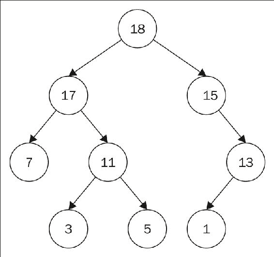
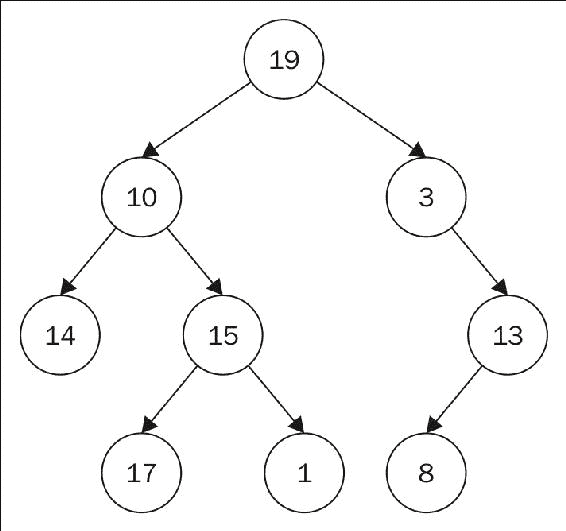

# 第九章：树：非线性结构

**树结构**基本上是节点的集合，通常包括防止对每个节点有多个引用的约束，并规定没有引用指向根节点。这种结构模拟了一个层次化的树状结构，可以根据每个节点中包含的值是有序的还是无序的。此外，节点可以包含值类型或对象的实例，具体取决于树的目的。

树在编程中是极其有用的数据结构，尽管它们的用途可能有些受限。即使一个结构在使用中，你也可能并不总是意识到它们的存在，因为许多其他数据结构都是建立在它们之上的。在本章中，我们将详细检查树数据结构，并在后续章节中检查其他通常以树结构为基础的结构。

在本章中，我们将涵盖以下主题：

+   树数据结构的定义

+   树数据结构与树数据类型

+   与树相关的术语

+   常见操作

+   创建树

+   递归

+   遍历

# 树数据结构 versus 树数据类型

实际上，既有树数据类型，也有树数据结构，两者相当不同。因此，在我们继续之前，区分树数据结构和树数据类型非常重要。

首先，数据类型只是数据的排列，没有定义如何实现该数据集合的任何定义。另一方面，数据结构精确地关注如何将特定的数据类型详细说明，以创建该类型的可用、具体实现。

在树的情况下，一个树数据类型必须有一个值以及一些关于子节点的概念，其中每个子节点也是一个树。树数据结构是一组节点，这些节点根据树数据类型的模式相互链接。

下面的两个图表显示了两种类型的树：

+   有序树：



+   无序树：



因此，每个节点都是一个树，具有潜在的孩子节点，这些孩子节点也是树。在本章中，我们将关注树数据结构的具体实现。

# 树术语

树中使用的许多术语和定义都是这些数据结构特有的。因此，在我们检查树数据结构之前，我们需要花时间学习这种语言。

这里有一些最常见和最重要的术语：

+   **节点**：树中存储的任何对象或值都代表一个节点。在上面的图中，根及其所有子节点和后代都是独立的节点。

+   **根节点**：根节点是树的基节点。具有讽刺意味的是，这个节点通常在树的图形表示的顶部。请注意，即使根节点没有后代，它本身也代表了一整棵树。

+   **父节点**：父节点是包含 1...n 个子节点的任何节点。父节点仅对其子节点中的一个而言是父节点。此外，请注意，任何父节点可以有 0...n 个子节点，这取决于与树的结构相关的规则。

+   **子节点**：任何非根节点都是其他一个（且仅一个）节点的子节点。任何不是其他结构子树的树的根节点是唯一一个不是自身子节点的节点。

+   **兄弟节点**：兄弟节点，也称为子节点，代表了一个特定父节点的所有子节点集合。例如，参考前面的图，根节点下方的两个节点集合表示兄弟节点。

+   **叶节点**：任何没有子节点的节点被称为叶节点。

+   **边**：边是父节点与子节点之间的路径或引用。

+   **后代**：节点的后代是可以通过从该节点沿边远离根节点到达的所有节点。

+   **祖先节点**：节点的祖先是从该节点沿边向根节点到达的所有节点。

+   **路径**：路径被描述为一组节点与其后代之间的边。

+   **树的高度**：树的高度表示根节点与离根节点最远的叶节点之间的边的数量。

+   **深度**：节点与根节点之间的边的数量表示节点的深度。因此，根节点的深度为零。

# 常见操作

树数据结构可以由 1...n 个节点组成，这意味着即使是一个没有父节点或任何子节点的单个节点也被认为是树。因此，许多与树相关的常见操作可以用单个节点或从相同的角度来定义。以下是与树相关最常见的操作列表

+   **数据**：数据操作与单个节点相关联，并返回该节点中包含的对象或值。

+   **子节点**：子节点操作返回与该父节点关联的兄弟节点集合。

+   **父节点**：某些树结构提供了一种机制来“爬升”树，或从任何特定节点遍历结构回到根节点。

+   **枚举**：枚举操作将返回一个列表或包含特定节点的所有后代的集合，包括根节点本身。

+   **插入**：插入操作允许将新节点添加到树中现有节点的子节点。当树结构对特定父节点关联的子节点数量有限制时，插入操作可能会变得有些复杂。当允许的最大子节点数量已经就位时，必须将其中一个子节点重新定位为新插入节点的子节点。

+   **嫁接**：嫁接操作与插入操作类似，但被插入的节点有自己的后代，这意味着它是一个多层树。与插入操作一样，当树结构对特定父节点关联的子节点数量有限制时，嫁接操作可能会变得有些复杂。当允许的最大子节点数量已经就位时，必须将其中一个子节点逻辑上重新定位为新插入的树的叶子的子节点。

+   **删除**：删除操作将从树中删除指定的节点。如果被删除的节点有后代，这些节点必须以某种方式重新定位到被删除节点的父节点，否则该操作被分类为修剪操作。

+   **修剪**：修剪操作将从树中删除一个节点及其所有后代。

# 树的实例化

考虑到树在计算机科学中出现的频率，我们讨论的语言中*没有*一种简单且通用的具体实现为通用用途的树结构，这有点令人惊讶。因此，我们将创建我们自己的实现。

# 树结构

在我们开始之前，我们需要详细说明我们的树结构将具有的一些特性。首先，我们将创建一个有序树，因此我们不会允许添加重复值，这将简化我们的实现。此外，我们将限制每个节点有两个子节点。从技术上讲，这意味着我们正在定义一个二叉树结构，但到目前为止，我们将忽略这种结构的特定优点和应用，稍后我们将更详细地研究这个定义。接下来，我们的结构将通过简单地暴露每个节点中包含的底层对象来实现*数据*和*子节点*操作。我们不会实现父节点操作，因为我们目前没有需要反向遍历树的需求。

*插入*操作将作为两个独立的方法实现，支持原始数据和现有节点，而*嫁接*操作将仅支持现有节点。由于我们决定不允许重复，因此*嫁接*操作将类似于在集合数据结构内的并集操作，即结果树将只包含来自两个输入树的唯一值。这三个操作中的每一个都将返回布尔值，指示操作是否成功。

*删除* 操作也将提供两个支持原始数据和现有节点的方法，而 *修剪* 操作将仅支持现有节点。这三个方法中的每一个都将从树中删除节点并将该节点返回给调用者。这样，*删除* 和 *修剪* 操作将类似于队列或栈中的 *pop* 函数。

我们将需要实现 *搜索* 操作，这些操作将返回匹配的节点，但不会从树中删除节点。这样，搜索函数将类似于队列或栈中的 *peek* 函数。

我们的 *enumerate* 操作将实现为一个递归函数。我们将在稍后更详细地探讨递归，但现在我们只需实现这个方法。最后，我们将实现某种形式的 *copy* 操作。

**C#**

C# 提供了足够的功能，使我们能够用惊人的少量代码创建一个多功能的树数据结构。首先，我们需要构建一个表示树节点的类。以下是一个 `Node` 类的具体实现示例，在 C# 中可能看起来是这样的：

```py
    public Int16 Data; 
    public Node Left; 
    public Node Right; 

```

一个 `Node` 代表两个基本组件，包括节点中包含的数据，以及由我们的节点引用的子节点集合。在我们的实现中，我们有一个公共字段用于我们的节点数据，在这种情况下是一个整数。我们还有一个公共字段用于两个子节点，分别称为 `Left` 和 `Right`。

```py
    public List<Node> Children 
    { 
        get 
        { 
            List<Node> children = new List<Node>(); 
            if (this.Left != null)  
            { 
                children.Add(this.Left); 
            } 
            if (this.Right != null)  
            { 
                children.Add(this.Right); 
            } 
            return children; 
        } 
    } 

```

我们添加了一个额外的获取器 `Children`，它返回一个包含此节点中存在的任何子节点的 `List<Node>`。这个属性与其说是为了方便，不如说是我们后面将要到来的各种递归函数的一个组成部分。

```py
    public Node(Int16 data) 
    { 
        this.Data = data; 
    } 

```

我们的 `Node` 类定义了一个自定义构造函数，它接受一个类型为 `Int` 的单个参数。该参数填充我们的 `Data` 字段，因为它是我们结构中唯一的必需字段，因为子节点始终是可选的。

```py
    public bool InsertData(Int16 data) 
    { 
        Node node = new Node (data); 
        return this.InsertNode(node); 
    } 

    public bool InsertNode(Node node) 
    { 
        if (node == null || node.Data == this.Data) 
        { 
            return false; 
        } 
        else if (node.Data < this.Data)  
        { 
            if (this.Left == null)  
            { 
                this.Left = node; 
                return true; 
            }  
            else  
            { 
                return this.Left.InsertNode(node); 
            } 
       } 
       else 
       { 
           if (this.Right == null)  
           { 
                this.Right = node; 
                return true; 
           }   
           else  
           { 
               return this.Right.InsertNode(node); 
           } 
        } 
    } 

```

我们的前两种方法支持插入数据和插入节点。`InsertData(Int data)` 方法提供了我们用于原始节点数据的 *插入* 功能。因此，此方法在将对象传递给 `InsertNode(Node node)` 方法之前，会从数据点创建一个新的 `Node` 对象。

`InsertNode(Node node)` 方法提供了对现有 `Node` 对象的 *插入* 功能。该方法首先检查 `node` 是否为 `null`，或者 `node` 的 `Data` 值是否与当前节点匹配。如果是这样，我们返回 `false`，这可以防止重复项被添加到我们的树中。接下来，我们检查值是否小于我们当前节点的数据值。如果是这样，我们首先检查 `Left` 节点是否存在，如果不存在，我们将新插入的节点分配到那个空位。否则，这个新节点必须插入到 `Left` 节点下方，因此我们递归调用 `InsertNode(Node node)` 在 `Left` 节点上。那个递归调用将再次开始这个过程，确认 `Left` 不包含此值，依此类推。

如果插入的 `Node` 的值大于我们当前的节点，整个过程将重复，但开始于 `Right` 节点。最终，我们或者在树中找到已存在的值，或者在叶子节点找到一个可用的子节点位置，可以接受插入的 `Node`。这种方法的最坏情况复杂度为 **O**(*log(n)*)。

使用此方法，理论上我们可以通过单个调用合并整个树。不幸的是，如果当前树中存在的值也是插入节点的后代，则 `InsertNode(Node node)` 不会阻止重复值进入我们的树。为此功能，需要执行 *graft* 操作。

```py
    public bool Graft(Node node) 
    { 
        if (node == null)  
        { 
            return false; 
        } 

        List<Node> nodes = node.ListTree(); 
        foreach (Node n in nodes)  
        { 
            this.InsertNode(n); 
        } 

        return true; 
    } 

```

`Graft(Node node)` 方法利用现有的 `InsertNode(Node node)` 方法。该方法首先确认 `node` 不是 `null`，如果是，则返回 `false`。接下来，该方法通过在 `node` 上调用 `ListTree()` 来创建一个新的 `List<Node>` 集合。我们稍后会检查 `ListTree()`，但在此刻，要知道 `ListTree()` 将返回一个包含 `node` 及其所有后代的列表。

```py
    public Node RemoveData(Int16 data) 
    { 
        Node node = new Node (data); 
        return this.RemoveNode(node); 
    } 

    public Node RemoveNode(Node node) 
    { 
        if (node == null) 
        { 
            return null; 
        } 

        Node retNode; 
        Node modNode; 
        List<Node> treeList = new List<Node>(); 

        if (this.Data == node.Data) 
        { 
            //Root match 
            retNode = new Node(this.Data); 
            modNode = this; 
            if (this.Children.Count == 0)  
            { 
                return this; //Root has no childen 
            } 
        } 
        else if (this.Left.Data == node.Data)  
        { 
            retNode = new Node(this.Left.Data); 
            modNode = this.Left; 
        }   
        else if (this.Right.Data == node.Data) 
        { 
            retNode = new Node(this.Right.Data); 
            modNode = this.Right; 
       } 
       else  
       { 
           foreach (Node child in this.Children)  
           { 
               if (child.RemoveNode(node) != null)  
               { 
                   return child; 
               } 
           } 

           //No match in tree 
           return null;  
       } 

       //Reorder the tree 
       if (modNode.Left != null)  
       { 
            modNode.Data = modNode.Left.Data; 
            treeList.AddRange(modNode.Left.ListTree()); 
            modNode.Left = null; 
        }  
        else if (modNode.Right != null)  
        { 
            modNode.Data = modNode.Right.Data; 
            treeList.AddRange(modNode.Right.ListTree()); 
            modNode.Right = null; 
        }  
        else  
        { 
            modNode = null; 
        } 

        foreach (Node n in treeList)  
        { 
            modNode.InsertNode(n); 
        } 

        //Finished 
        return retNode; 
    } 

```

下两个方法支持删除数据和删除节点。`RemoveData(Int data)` 方法为我们提供了对原始节点数据的 *删除* 功能。因此，该方法接受数据点，并从中创建一个新的 `Node` 对象，然后将该对象传递给 `RemoveNode(Node node)` 方法。

`RemoveNode(Node node)` 方法为现有的 `Node` 对象提供 *删除* 功能。该方法首先确认 `node` 不是 `null`，如果是，则返回 `null`。否则，该方法设置三个对象，包括 `retNode`，它表示将要返回的节点；`modNode`，它表示需要修改以容纳被删除节点的节点；以及 `treelist`，当删除节点时将用于重新排序树。

接着，该方法分为两个主要部分。第一个部分搜索与 `node` 参数匹配的内容。第一个 `if` 块检查当前节点数据是否与节点匹配。如果节点匹配，则使用 `this.Data` 创建 `retNode`，并将 `modNode` 设置为 `this`。在执行继续之前，该方法检查 `this` 是否有任何子节点。如果没有，我们就有一个单节点树，因此我们的方法简单地返回 `this`。这种逻辑防止我们尝试完全删除树，这只能由另一个实例化根 `Node` 对象的类来完成。接下来的两个 `if else` 块分别检查节点是否匹配 `Left` 或 `Right`。在任何情况下，都使用匹配子节点的 `Data` 创建 `retNode`，并将 `modNode` 设置为匹配的子节点。如果我们仍然找不到匹配项，该方法将递归地对两个子节点分别调用 `RemoveNode(Node node)`。如果其中任何调用返回一个 `Node` 对象，则将该对象返回给调用者。如果所有其他方法都失败，我们的方法返回 `null`，意味着没有找到与 `node` 匹配的内容。

### 注意

由于算法的编写方式，第一个 `if` 块的内容只能在检查树的根时执行。那是因为，当我们开始递归调用子节点的方法时，我们已经知道它们的 `Data` 值与 `node` 的不匹配。从这一点开始，我们的方法始终在寻找匹配的后代。在递归方面，我们将第一个 `if` 语句称为我们算法的 **基本案例**。我们将在本章的后面部分更详细地探讨递归。

`RemoveNode(Node node)` 的第二个组件重新排序剩余的节点，以便在删除节点过程中不会丢失排序。该组件首先检查 `Left` 是否不是 `null`，这意味着此节点左侧有一个节点分支。如果 `Left` 竟然是 `null`，则接下来检查 `Right`。如果 `Left` 和 `Right` 都为 `null`，那么我们很容易完成，因为这个节点是一个没有后代的叶子节点，不需要重新排序。

如果 `Left` 或 `Right` 有对象，则需要处理后代。在任何情况下，代码块都会将子节点的 `Data` 值移动到 `modNode.Data`，如果您还记得，这就是我们实际上想要删除的节点。通过这种方式移动数据，我们同时删除了节点并将其子 `Data` 上移以取代其位置。随后，我们的方法通过在子节点上调用 `ListTree()` 创建一个 `List<Node>` 集合。此操作返回子节点及其所有后代。然后，代码块通过将子节点设置为 `null` 来完成，从而有效地删除了整个分支。

最后，该方法遍历 `treeList` 集合，并使用列表中的每个 `Node` 调用 `InsertNode(Node node)`。这种方法确保我们的子节点在最终树中的数据值不会重复，并且最终树在操作完成之前将正确排序。

尽管许多算法可以执行此重新排序，也许其中一些比这个更有效，但到目前为止，我们只需要确保我们的最终树结构仍然包含每个节点（除了被删除的节点）并且是正确排序的。换句话说，`RemoveNode(Node node)` 方法有一个 *痛苦地* 高复杂度成本为 **O**(*n²*)。

```py
    public Node Prune(Node root) 
    { 
        Node matchNode; 
        if (this.Data == root.Data) 
        { 
            //Root match 
            Node b = this.CopyTree(); 
            this.Left = null; 
            this.Right = null; 
            return b; 
        } 
        else if (this.Left.Data == root.Data)  
        { 
            matchNode = this.Left; 
        }  
        else if (this.Right.Data == root.Data) 
        { 
            matchNode = this.Right; 
        } 
        else  
        { 
            foreach (Node child in this.Children)  
            { 
                if (child.Prune(root) != null)  
                { 
                    return child; 
                } 
            } 

            //No match in tree 
            return null;  
        } 

        Node branch = matchNode.CopyTree(); 
        matchNode = null; 

        return branch; 
    } 

```

`Prune(Node root)` 方法的工作方式与 `RemoveNode(Node node)` 类似。我们首先确认 `root` 不是 `null`，如果是，则返回 `null`。接下来，我们建立基本案例，并在 `this` 中寻找匹配项。如果根节点匹配，该方法会创建整个树的副本，命名为 `b`，然后将 `Left` 和 `Right` 设置为 `null` 以删除根的所有后代，然后返回 `b`。与 `RemoveNode(Node node)` 类似，这种逻辑防止我们尝试完全删除树，这只能由另一个实例化根 `Node` 对象的类来完成。

如果根节点不匹配`root`，我们的方法将检查`Left`和`Right`，最后递归检查`Children`。如果所有其他方法都失败了，我们仍然返回`null`，表示找不到匹配项。

如果在`Left`或`Right`中找到匹配项，`matchNode`将被设置为匹配的节点，该节点随后被复制到`Node branch`。最后，`matchNode`被设置为`null`，这将从树中删除节点及其后代，并最终返回分支。该方法的最坏情况复杂度为**O**(*n*)。

```py
    public Node FindData(Int16 data) 
    { 
        Node node = new Node (data); 
        return this.FindNode(node); 
    } 

    public Node FindNode(Node node) 
    { 
        if (node.Data == this.Data)  
        { 
            return this; 
        } 

        foreach (Node child in this.Children)  
        {  
            Node result = child.FindNode(node); 
            if (result != null)  
            { 
                return result; 
            } 
        } 

        return false; 
    } 

```

我们的`Node`类使用`FindData(Int data)`和`FindNode(Node node)`方法实现*搜索*功能。`FindData(Int data)`允许我们传入一个原始的`Int`值，这会创建一个新的`Node`对象，并将其传递给`FindNode(Node node)`。

`FindNode(Node node)`方法反过来检查搜索节点数据是否与当前节点数据匹配。如果是这样，我们返回`true`，因为我们找到了匹配项。否则，该方法将递归地对`Children`集合中的每个节点调用`FindNode(Node node)`，直到找到匹配项，或者我们到达树的末尾。在这种情况下，我们返回`false`，表示数据在树中不存在。该方法的最坏情况复杂度为**O**(*log(n)*)。

```py
    public Node CopyTree() 
    { 
        Node n = new Node (this.Data); 
        if (this.Left != null) 
        { 
            n.Left = this.Left.CopyTree(); 
        } 

        if(this.Right != null) 
        { 
            n.Right = this.Right.CopyTree(); 
        } 
        return n; 
    } 

```

`CopyTree()`方法复制当前节点，然后使用递归方法调用将`Left`和`Right`设置为该副本。当方法返回复制的节点时，该副本表示整个树、分支或节点的完整副本。

```py
    public List<Node> ListTree() 
    { 
        List<Node> result = new List<Node>(); 
        result.Add(new Node(this.Data()); 
        foreach (Node child in this.Children) 
        { 
            result.AddRange(child.ListTree()); 
        } 
        return result; 
    } 

```

最后，我们来到由`ListTree()`方法提供的*枚举*功能。此方法简单地创建一个新的`List<Node>`集合，根据`this`中的`Data`添加一个新的`Node`到集合中，然后递归地对`Children`集合中的每个节点调用`ListTree()`，直到我们收集到树中的每个节点。最后，该方法将`result`返回给调用者。

### 注意

这个简单的类代表我们树中的每个节点。然而，你可能想知道为什么节点类实现了整个树数据结构的所有功能。如果你还记得关于术语的讨论，没有任何后代的根节点代表一个完整的树。这意味着任何节点的定义都必须必然提供整个树的所有功能，本身就是一个完整的树。任何随后的树结构实现都将使用单个`Node`对象作为其核心。这个节点将有子节点，这些子节点反过来也会有子节点，依此类推，从而在单个字段中封装整个树结构。

**Java**

Java 还提供了构建我们`Node`类健壮实现所需的基本工具，而且几乎不需要付出太多努力。以下是一个该实现可能的样子示例：

```py
    public int Data; 
    public Node left; 
    public Node right; 

    public List<Node> getChildren() 
    { 
        List<Node> children = new LinkedList<Node>(); 
        if (this.Left != null) 
        { 
            children.add(this.Left); 
        } 
        if (this.Right != null) 
        { 
            children.add(this.Right); 
        } 
        return children; 
    } 

```

与 C# 类似，我们的 Java `Node` 类包括一个用于节点数据的公共字段，以及两个子节点 `Left` 和 `Right` 的公共字段。我们的 Java `Node` 类同样包括一个名为 `getChildren()` 的公共方法，该方法返回一个包含此节点中存在的任何子节点的 `LinkedList<Node>`。

```py
    public Node(int data) 
    { 
        this.Data = data; 
    } 

```

我们的 `Node` 类定义了一个自定义构造函数，它接受一个类型为 `int` 的单个参数，用于填充 `Data` 字段。

```py
    public boolean insertData(int data) 
    { 
        Node node = new Node (data); 
        return this.insertNode(node); 
    } 

    public boolean insertNode(Node node) 
    { 
        if (node == null || node.Data == this.Data) 
        { 
            return false; 
        } 
        else if (node.Data < this.Data) 
        { 
            if (this.Left == null) 
            { 
                this.Left = node; 
                return true; 
            } 
            else 
            { 
                return this.Left.insertNode(node); 
            } 
        } 
        else 
        { 
            if (this.Right == null) 
            { 
                this.Right = node; 
                return true; 
            } 
            else 
            { 
                return this.Right.insertNode(node); 
            } 
        } 
    } 

```

我们的前两个方法支持插入数据和插入节点。`insertData(int data)` 方法为我们提供了对原始节点数据的 *插入* 功能。因此，此方法接受数据点，并从它创建一个新的 `Node` 对象，然后再将此对象传递给 `insertNode(Node node)` 方法。

`insertNode(Node node)` 方法为现有的 `Node` 对象提供了 *插入* 功能。该方法首先检查 `node` 是否为 `null`，或者 `node` 的 `Data` 值是否与当前节点匹配。如果是这样，我们返回 `false`，这可以防止重复项被添加到我们的树中。接下来，我们检查值是否小于我们当前节点的数据值。如果是这样，我们首先检查 `Left` 节点是否存在，如果不存在，我们将新插入的节点分配到那个空位。否则，这个新节点必须插入到 `Left` 节点下方某个位置，因此我们在 `Left` 节点上递归调用 `insertNode(Node node)`。那个递归调用将重新开始这个过程，确认 `Left` 不包含这个值，等等。

如果插入的 `Node` 的值大于我们当前节点，整个过程将重复使用 `Right` 节点。最终，我们将确定值已经在我们的树中存在，或者我们找到一个有可用子位置可以接受插入的 `Node` 的叶子节点。此方法的最坏情况复杂度为 **O**(*log(n)*)。

```py
    public boolean graft(Node node) 
    { 
        if (node == null) 
        { 
            return false; 
        } 

        List<Node> nodes = node.listTree(); 
        for (Node n : nodes) 
        { 
            this.insertNode(n); 
        } 
        return true; 
    } 

```

`graft(Node node)` 方法利用现有的 `insertNode(Node node)`。该方法首先确认 `node` 不是 `null`，如果是，则返回 `false`。接下来，该方法通过在 `node` 上调用 `listTree()` 创建一个新的 `List<Node>` 集合，该方法返回一个包含 `node` 和其所有后代的列表。

```py
    public Node removeData(int data) 
    { 
        Node node = new Node(data); 
        return this.removeNode(node); 
    } 

    public Node removeNode(Node node) 
    { 
        if (node == null) 
        {   
            return null; 
        } 

        Node retNode; 
        Node modNode; 
        List<Node> treeList = new LinkedList<Node>(); 

        if (this.Data == node.Data) 
        { 
            //Root match 
            retNode = new Node(this.Data); 
            modNode = this; 
            if (this.getChildren().size() == 0) 
            { 
                return this; //Root has no childen 
            } 
        } 
        else if (this.Left.Data == node.Data) 
        { 
            //Match found 
            retNode = new Node(this.Left.Data); 
            modNode = this.Left; 
        } 
        else if (this.Right.Data == node.Data) 
        { 
            //Match found 
            retNode = new Node(this.Right.Data); 
            modNode = this.Right; 
        } 
        else 
        { 
            for (Node child : this.getChildren()) 
            { 
                if (child.removeNode(node) != null) 
                { 
                    return child; 
                } 
            } 

            //No match in tree 
            return null; 
        } 

        //Reorder the tree 
        if (modNode.Left != null) 
        { 
            modNode.Data = modNode.Left.Data; 
            treeList.addAll(modNode.Left.listTree()); 
            modNode.Left = null; 
        } 
        else if (modNode.Right != null) 
        { 
            modNode.Data = modNode.Right.Data; 
            treeList.addAll(modNode.Right.listTree()); 
            modNode.Right = null; 
        } 
        else 
        { 
            modNode = null; 
        } 

        for (Node n : treeList) 
        { 
            modNode.insertNode(n); 
        } 

        //Finished 
        return retNode; 
    } 

```

接下来的两个方法支持删除数据和删除节点。`removeData(int data)` 方法为我们提供了对原始节点数据的 *删除* 功能。因此，此方法接受数据点，并从它创建一个新的 `Node` 对象，然后再将此对象传递给 `removeNode(Node node)` 方法。

`removeNode(Node node)` 方法为现有的 `Node` 对象提供了 *删除* 功能。该方法首先确认 `node` 不是 `null`，如果是，则返回 `null`。否则，该方法设置三个对象，包括 `retNode`，它表示将要返回的节点；`modNode`，它表示将被修改以适应被删除节点的节点；以及 `treelist`，在删除节点时将用于重新排序树。

下一个块首先搜索与`node`参数匹配的项。第一个`if`块检查当前节点是否匹配该节点。如果节点匹配，则使用`this.Data`创建`retNode`，并将`modNode`设置为`this`。在执行继续之前，方法会检查`this`是否有任何子节点。如果没有，我们有一个单节点树，因此我们的方法只需返回`this`。接下来的两个`if else`块检查节点是否匹配`Left`或`Right`，分别。在这两种情况下，使用匹配子节点的数据创建`retNode`，并将`modNode`设置为匹配的子节点。如果我们仍然找不到匹配项，方法会递归地对两个子节点中的每个调用`removeNode(Node node)`。如果其中任何调用返回一个`Node`对象，则将该对象返回给调用者。如果所有其他方法都失败了，我们的方法返回`null`，意味着在我们的树中没有与`node`匹配的节点。

`removeNode(Node node)`的第二块代码重新排列剩余的节点，以便在删除节点的过程中不会丢失排序。此组件首先检查`Left`是否不是`null`，这意味着此节点左侧有一个节点分支。如果`Left`恰好是`null`，则接下来检查`Right`。如果`Left`和`Right`都是`null`，则完成。

如果`Left`或`Right`中的任何一个不是`null`，该方法会将`Data`值从子节点移动并分配给`modNode.Data`。随后，我们的方法通过在子节点上调用`listTree()`来创建一个`List<Node>`集合。然后，通过将子节点设置为`null`来结束这个块，从而有效地删除整个分支。

最后，该方法遍历`treeList`集合，并对列表中的每个`Node`调用`insertNode(Node node)`。`RemoveNode(Node node)`方法的开销为**O**(*n²*)。

```py
    public Node prune(Node root) 
    { 
        if (root == null) 
        { 
            return null; 
        } 

        Node matchNode; 
        if (this.Data == root.Data) 
        { 
            //Root match 
            Node b = this.copyTree(); 
            this.Left = null; 
            this.Right = null; 
            return b; 
        } 
        else if (this.Left.Data == root.Data) 
        { 
            matchNode = this.Left; 
        } 
        else if (this.Right.Data == root.Data) 
        { 
            matchNode = this.Right; 
        } 
        else 
        { 
            for (Node child : this.getChildren()) 
            { 
                if (child.prune(root) != null) 
                { 
                    return child; 
                } 
            } 

            //No match in tree 
            return null; 
        }  

        Node branch = matchNode.copyTree(); 
        matchNode = null; 

        return branch; 
    } 

```

`prune(Node root)`方法与`removeNode(Node node)`类似。我们首先确认`root`不是`null`，如果是，则返回`null`。接下来，我们建立我们的基本情况，并在`this`中寻找匹配项。如果我们的根节点匹配，该方法会创建整个树的副本，命名为`b`，然后设置`Left`和`Right`为`null`以删除根节点的所有后代，然后返回`b`。

如果根节点与`root`不匹配，我们的方法会检查`Left`和`Right`，最后递归检查`Children`。如果所有其他方法都失败了，我们返回`null`，因为我们的树中没有与`root`匹配的节点。

如果在`Left`或`Right`中找到匹配项，`matchNode`会被设置为匹配的节点，然后该节点稍后会被复制到`Node branch`。最后，`matchNode`被设置为`null`，这会从树和分支中删除该节点及其后代，并最终返回分支。此方法的开销为**O**(*n*)。

```py
    public Node findData(int data) 
    { 
        Node node = new Node (data); 
        return this.findNode(node); 
    } 

    public Node findNode(Node node) 
    { 
        if (node.Data == this.Data) 
        { 
            return this; 
        } 

        for (Node child : this.getChildren()) 
        { 
            Node result = child.findNode(node); 
            if (result != null) 
            { 
                return result; 
            } 
        } 

        return null; 
    } 

```

我们的`Node`类使用`findData(Int data)`和`findNode(Node node)`方法实现*搜索*功能。`findData(Int data)`允许我们传入一个原始的`int`值，这会创建一个新的`Node`对象并将其传递给`findNode(Node node)`。

`findNode(Node node)` 方法接着检查搜索节点数据是否与当前节点的数据匹配。如果是，我们返回 `true`，因为我们找到了匹配项。否则，该方法将递归地对 `Children` 集合中的每个节点调用 `findNode(Node node)`，直到找到匹配项，或者我们到达树的末尾。在这种情况下，我们返回 `false`，表示数据不在树中。此方法的开销为 **O**(*log(n)*):

```py
    public Node copyTree() 
    { 
        Node n = new Node(this.Data); 
        if (this.Left != null) 
        { 
            n.Left = this.Left.copyTree(); 
        } 

        if(this.Right != null) 
        { 
            n.Right = this.Right.copyTree(); 
        } 
        return n; 
    } 

```

`copyTree()` 方法首先复制当前节点，然后使用递归方法调用将 `Left` 和 `Right` 设置为相同的副本。当方法返回复制的节点时，该副本表示整个树、分支或节点的完整副本。

```py
    public List<Node> listTree() { 
        List<Node> result = new LinkedList<Node>(); 
        result.add(new Node(this.Data)); 
        for (Node child : this.getChildren()) 
        { 
            result.addAll(child.listTree()); 
        } 
        return result; 
    } 

```

最后，我们来到由 `listTree()` 方法提供的 *枚举* 功能。此方法简单地创建一个新的 `LinkedList<Node>` 集合，根据 `this` 中的 `Data` 添加一个新的 `Node` 到集合中，然后递归地对 `Children` 集合中的每个节点调用 `listTree()`，直到我们收集到树中的每个节点。最后，方法将 `result` 返回给调用者。

**Objective-C**

与 Objective-C 中的其他数据结构实现一样，我们必须稍微跳出思维定式来构建我们的节点类。在某些方面，Objective-C 使得我们的工作变得更简单，但并不总是如此。以下是一个 Node 实现可能的样子，在 Objective-C 中：

```py
    -(instancetype)initNodeWithData:(NSInteger)data 
    { 
        if (self = [super init]) 
        { 
            _data = data; 
        } 
        return self; 
    } 

```

我们的 `EDSNode` 类定义了一个初始化器，它接受一个类型为 `NSInetger` 的单个参数。该参数填充我们的 `_data` 字段，因为它是我们结构中唯一的必需字段，因为子节点始终是可选的。

```py
    -(NSInteger)data 
    { 
        return _data; 
    } 

    -(EDSNode*)left 
    { 
        return _left; 
    } 

    -(EDSNode*)right 
    { 
        return _right; 
    } 

    -(NSArray*)children 
    { 
        return [NSArray arrayWithObjects:_left, _right, nil]; 
    } 

```

`EDSNode` 节点有三个公共属性用于数据，以及两个子节点 `left` 和 `right`，还有一个名为 `children` 的数组属性，表示子节点集合：

```py
    -(BOOL)insertData:(NSInteger)data 
    { 
        EDSNode *node = [[EDSNode alloc] initNodeWithData:data]; 
        return [self insertNode:node]; 
    } 

    -(BOOL)insertNode:(EDSNode*)node 
    { 
        if (!node || [self findNode:node]) 
        { 
            return NO; 
        } 
        else if (node.data < _data) 
        { 
            if (!_left) 
            { 
                _left = node; 
                return YES; 
            } 
            else 
            { 
                return [_left insertNode:node]; 
            } 
        } 
        else 
        { 
            if (!_right) 
            { 
                _right = node; 
                return YES; 
            }  
            else  
            { 
                return [_right insertNode:node]; 
            } 
        } 
    } 

```

我们的前两种方法支持插入数据和插入节点。`insertData:` 方法提供了我们用于原始节点数据的 *插入* 功能。因此，此方法在将对象传递给 `insertNode:` 方法之前，会从数据点创建一个新的 `EDSNode` 对象。

`insertNode:` 为现有的 `EDSNode` 对象提供 *插入* 功能。该方法首先检查 `node` 是否为 `nil`，或者 `node` 的 `data` 值是否与当前节点的 `data` 值匹配。如果是，我们返回 `NO`。接下来，我们检查 `data` 的值是否小于我们当前节点的 `data` 值。如果是，我们首先检查 `left` 节点是否存在，如果不存在，我们将新插入的节点分配到该可用位置。否则，这个新节点必须插入到 `left` 节点下方，因此我们递归地对 `left` 节点调用 `insertNode:`。如果插入的 `EDSNode` 的值大于我们当前节点，整个过程将重复使用 `right` 节点。最终，我们或者在树中确认值已经存在，或者找到一个有可用子位置可以接受插入的 `EDSNode` 的叶子节点。此方法的最坏情况复杂度为 **O**(*log(n)*):

```py
    -(BOOL)graft:(EDSNode*)node 
    { 
        if (!node) 
        { 
            return NO; 
        } 

        NSArray *nodes = [node listTree]; 
        for (EDSNode *n in nodes) 
        { 
            [self insertNode:n]; 
        } 

        return true; 
    } 

```

`graft:` 方法利用现有的 `insertNode:` 方法。该方法首先确认 `node` 不是 `nil`，如果是，则返回 `false`。接下来，该方法通过在 `node` 上调用 `listTree` 来创建一个新的 `NSArray` 集合。我们将在稍后更详细地检查 `listTree` 方法，但在此刻只需知道该方法将返回一个包含节点对象及其所有后代的列表。

```py
    -(EDSNode*)removeData:(NSInteger)data 
    { 
        EDSNode *node = [[EDSNode alloc] initNodeWithData:data]; 
        return [self removeNode:node]; 
    } 

    -(EDSNode*)removeNode:(EDSNode*)node 
    { 
        if (!node) 
        { 
            return NO; 
        } 

        EDSNode *retNode; 
        EDSNode *modNode; 
        NSMutableArray *treeList = [NSMutableArray array]; 

        if (self.data == node.data) 
        { 
            //Root match 
            retNode = [[EDSNode alloc] initNodeWithData:self.data]; 
            modNode = self; 
            if ([self.children count] == 0) 
            { 
                return self; //Root has no childen 
            } 
        } 
        else if (_left.data == node.data) 
        { 
            //Match found 
            retNode = [[EDSNode alloc] initNodeWithData:_left.data]; 
            modNode = _left; 
        } 
        else if (_right.data == node.data) 
        { 
            //Match found 
            retNode = [[EDSNode alloc] initNodeWithData:_right.data]; 
            modNode = _right; 
        } 
        else 
        { 
            for (EDSNode *child in self.children) 
            { 
                if ([child removeNode:node]) 
                { 
                    return child; 
                } 
            } 

            //No match in tree 
            return nil; 
        } 

        //Reorder the tree 
        if (modNode.left) 
        { 
            modNode.data = modNode.left.data; 
            [treeList addObjectsFromArray:[modNode.left listTree]]; 
            modNode.left = nil; 
        } 
        else if (modNode.right) 
        { 
            modNode.data = modNode.right.data; 
            [treeList addObjectsFromArray:[modNode.right listTree]]; 
            modNode.right = nil; 
        }   
        else  
        { 
            modNode = nil; 
        } 

        for (EDSNode *n in treeList) 
        { 
            [modNode insertNode:n]; 
        } 

        //Finished 
        return retNode; 
    } 

```

接下来的两个方法支持删除数据和删除节点。`removeData:` 方法为我们提供了原始节点数据的 *删除* 功能。因此，该方法接受数据点并从中创建一个新的 `EDSNode` 对象，然后将该对象传递给 `removeNode:` 方法。`removeNode:` 方法提供了对现有 `Node` 对象的 *删除* 功能。该方法首先确认 `node` 不是 `nil`，如果是，则返回 `nil`。否则，该方法设置三个对象，包括 `retNode`，它表示将要返回的节点；`modNode`，它表示需要修改以适应被删除节点的节点；以及 `treelist`，当删除节点时将用于重新排列树。

然后，该方法分为两个主要组件。第一个组件搜索与 `node` 参数匹配的对象。第一个 `if` 块检查 `self.data` 是否与 `node.data` 匹配。如果节点匹配，则使用 `this.data` 创建 `retNode`，并将 `modNode` 设置为 `this`。在执行继续之前，该方法检查 `this` 是否有任何子节点。如果没有，我们有一个单个节点树，因此我们的方法简单地返回 `this`。这个逻辑阻止我们尝试完全删除树，这只能由另一个实例化根 `EDSNode` 对象的类来完成。接下来的两个 `if else` 块检查节点是否与 `left` 或 `right` 匹配，分别。在任何情况下，都使用匹配子节点的 `data` 创建 `retNode`，并将 `modNode` 设置为匹配的子节点。如果我们仍然找不到匹配项，则方法递归地对两个子节点中的每个调用 `removeNode:`。如果其中任何调用返回 `Node` 对象，则将该对象返回给调用者。当所有其他方法都失败时，我们的方法返回 `nil`，这意味着没有找到与 `node` 匹配的对象。

`removeNode:` 方法的后半部分重新排列剩余的节点，以便在移除节点过程中不会丢失排序。这个组件首先检查 `left` 是否不是 `nil`，这意味着在这个节点左侧有一个节点的分支。如果 `left` 竟然是 `nil`，则接下来检查 `Right`。如果 `left` 和 `right` 都不是 `nil`，则完成。

如果 `left` 或 `right` 有对象，我们的代码会将 `data` 从子节点移动并分配给 `modNode.data`。在此之后，我们的方法通过在子节点上调用 `listTree` 创建一个 `NSArray`。然后，方法将子节点设置为 `nil`，实际上删除了整个分支。最后，方法遍历 `treeList` 集合，并对列表中的每个 `EDSNode` 调用 `insertNode:`。`removeNode:` 方法的成本为 **O**(*n²*)：

```py
    -(EDSNode*)prune:(EDSNode*)root 
    { 
        if (!root) 
        { 
            return nil; 
        } 

        EDSNode *matchNode; 
        if (self.data == root.data) 
        { 
            //Root match 
            EDSNode *b = [self copyTree]; 
            self.left = nil; 
            self.right = nil; 
            return b; 
        } 
        else if (self.left.data == root.data) 
        { 
            matchNode = self.left; 
        } 
        else if (self.right.data == root.data) 
        { 
            matchNode = self.right; 
        } 
        else 
        { 
            for (EDSNode *child in self.children) 
            { 
                if ([child prune:root]) 
                { 
                    return child; 
                } 
            } 

            //No match in tree 
            return nil; 
        } 

        EDSNode *branch = [matchNode copyTree]; 
        matchNode = nil; 

        return branch; 
    } 

```

`prune:` 方法首先确认 `root` 不是 `nil`，如果是，则返回 `nil`。接下来，我们建立基本案例并在 `this` 中寻找匹配项。如果根节点匹配，该方法创建整个树的副本，命名为 `b`，然后设置 `left` 和 `right` 为 `nil` 以删除根节点的所有后代，然后返回 `b`。如果根节点不匹配 `root`，我们的方法会检查 `left` 和 `right`，最后递归检查 `children`。如果所有其他方法都失败，我们仍然返回 `nil` 表示找不到匹配项。

如果在 `left` 或 `right` 中找到匹配项，`matchNode` 被设置为匹配的节点，然后该节点稍后被复制到 `EDSNode branch`。最后，`matchNode` 被设置为 `nil`，这将从树中删除节点及其后代，并最终返回分支。该方法的最坏情况复杂度为 **O**(*n*)：

```py
    -(EDSNode*)findData:(NSInteger)data 
    { 
        EDSNode *node = [[EDSNode alloc] initNodeWithData:data]; 
        return [self findNode:node]; 
    } 

    -(EDSNode*)findNode:(EDSNode*)node 
    { 
        if (node.data == self.data) 
        { 
            return self; 
        } 

        for (EDSNode *child in self.children) 
        { 
            EDSNode *result = [child findNode:node]; 
            if (result) 
            { 
                return result; 
            } 
        } 

        return nil; 
    } 

```

我们的 `EDSNode` 类使用 `findData:` 和 `findNode:` 方法实现 *搜索* 功能。`findData:` 允许我们传入一个原始的 `NSInteger` 值，这会创建一个新的 `EDSNode` 对象并将其传递给 `findNode:`。

`findNode:` 方法会依次检查搜索节点数据是否与当前节点的数据匹配。如果是，我们返回 `YES` 因为找到了匹配项。否则，该方法会递归地在 `children` 集合中的每个节点上调用 `findNode:`，直到找到匹配项或达到树的末尾。在这种情况下，我们返回 `NO` 表示数据在树中不存在。该方法的最坏情况复杂度为 **O**(*log(n)*)：

```py
    -(EDSNode*)copyTree 
    { 
        EDSNode *n = [[EDSNode alloc] initNodeWithData:self.data]; 
        if (self.left) 
        { 
            n.left = [self.left copyTree]; 
        } 

        if(self.right) 
        { 
            n.right = [self.right copyTree]; 
        } 
        return n; 
    } 

```

`copyTree` 方法首先复制当前节点，然后使用递归方法调用将 `left` 和 `right` 设置为该节点的副本。当方法返回复制的节点时，副本表示整个树、分支或节点的完整副本：

```py
    -(NSArray*)listTree 
    { 
        NSMutableArray *result = [NSMutableArray array]; 
        [result addObject:[[EDSNode alloc] initNodeWithData:self.data]]; 
        for (EDSNode *child in self.children) { 
            [result addObjectsFromArray:[child listTree]]; 
        } 
        return [result copy]; 
    } 

```

最后，我们来到 *枚举* 功能，这是由 `listTree:` 方法提供的。该方法简单地创建一个新的 `NSArray` 集合，将基于 `this` 中的 `data` 的新 `EDSNode` 添加到集合中，然后递归地在 `children` 集合中的每个节点上调用 `listTree`，直到收集到树中的每个节点。最后，方法将 `result` 返回给调用者。

**Swift**

我们的 Swift `Node` 类在结构和功能上与 C# 和 Java 实现类似。以下是一个 Swift 中 `Node` 类的示例：

```py
    public var data: Int 
    public var left: Node? 
    public var right: Node? 

    public var children: Array<Node> { 
        return [left!, right!] 
    } 

```

我们的 Swift `Node` 有三个公共属性用于数据，以及两个子节点 `left` 和 `right`，还有一个名为 `children` 的数组属性，表示子节点集合：

```py
    public init (nodeData: Int) 
    { 
        data = nodeData 
    } 

```

我们的 `EDSNode` 类定义了一个初始化器，它接受一个类型为 `NSInetger` 的单个参数。该参数填充我们的 `_data` 字段，因为它是我们结构中唯一的必填字段，因为子节点始终是可选的：

```py
    public func insertData(data: Int) -> Bool 
    { 
        return insertNode(node: Node(nodeData:data)) 
    } 

    public func insertNode(node: Node?) -> Bool 
    { 
        if (node == nil) 
        { 
            return false 
        } 

        if ((findNode(node: node!)) != nil) 
        { 
            return false 
        } 
        else if (node!.data < data) 
        { 
            if (left == nil) 
            { 
                left = node 
                return true 
            } 
            else 
            { 
                return left!.insertNode(node: node) 
            } 
        } 
        else 
        { 
            if (right == node) 
            { 
                right = node 
                return true 
            } 
            else 
            { 
                return right!.insertNode(node: node) 
            } 
        } 
    } 

```

我们的前两个方法支持插入数据和插入节点。`insertData:` 方法为我们提供了原始节点数据的 *插入* 功能。因此，此方法接收数据点，并从它创建一个新的 `EDSNode` 对象，然后再将其传递给 `insertNode:` 方法。

`insertNode:` 方法为现有的 `EDSNode` 对象提供了 *插入* 功能。该方法首先检查 `node` 是否为 `nil`，或者 `node` 的 `data` 值与当前节点匹配。如果是，我们返回 `NO`。接下来我们检查 `data` 的值是否小于我们当前节点的 `data` 值。如果是，我们首先检查 `left` 节点是否存在，如果不存在，我们将新插入的节点分配到那个可用位置。否则，这个新节点必须插入到 `left` 节点下方，因此我们递归调用 `insertNode:` 在 `left` 节点上。如果插入的 `EDSNode` 的值大于我们当前节点的值，整个过程将重复进行 `right` 节点。最终，我们或者在树中确认值已经存在，或者在叶节点找到一个可用的子节点位置，该位置可以接受插入的 `EDSNode`。此方法的最坏情况复杂度为 **O**(*log(n)*):

```py
    public func graft(node: Node?) -> Bool 
    { 
        if (node == nil) 
        { 
            return false 
        } 

        let nodes: Array = node!.listTree() 
        for n in nodes 
        { 
            self.insertNode(node: n) 
        } 

        return true 
    } 

```

`graft:` 方法利用现有的 `insertNode:` 方法。该方法首先确认 `node` 不是 `nil`，如果是，则返回 `false`。接下来，该方法通过在 `node` 上调用 `listTree` 创建一个新的 `NSArray` 集合。我们稍后将检查 `listTree`，但在此刻我们知道 `listTree` 将返回一个包含 `node` 和其所有后代列表：

```py
    public func removeData(data: Int) -> Node? 
    { 
        return removeNode(node: Node(nodeData:data)) 
    } 

    public func removeNode(node: Node?) -> Node? 
    { 
        if (node == nil) 
        { 
            return nil 
        } 

        var retNode: Node 
        var modNode: Node? 
        var treeList = Array<Node>() 

        if (self == node!) 
        { 
            //Root match 
            retNode = Node(nodeData: self.data) 
            modNode = self 
            if (children.count == 0) 
            { 
                return self //Root has no childen 
            } 
        } 
        else if (left! == node!) 
        { 
            //Match found 
            retNode = Node(nodeData: left!.data) 
            modNode = left! 
        } 
        else if (right! == node!) 
        { 
            //Match found 
            retNode = Node(nodeData: right!.data) 
            modNode = right! 
        } 
        else 
        { 
            for child in self.children 
            { 
                if (child.removeNode(node: node) != nil) 
                { 
                    return child 
                } 
            } 

            //No match in tree 
            return nil 
        } 

        //Reorder the tree 
        if ((modNode!.left) != nil) 
        { 
            modNode! = modNode!.left! 
            treeList = modNode!.left!.listTree() 
            modNode!.left = nil 
        } 
        else if ((modNode!.right) != nil) 
        { 
            modNode! = modNode!.right! 
            treeList = modNode!.right!.listTree() 
            modNode!.right = nil 
        }  
        else  
        { 
            modNode = nil 
        } 

        for n in treeList 
        { 
            modNode!.insertNode(node: n) 
        } 

        //Finished 
        return retNode 
    } 

```

接下来的两个方法支持删除数据和删除节点。`removeData:` 方法为我们提供了原始节点数据的 *删除* 功能。因此，此方法接收数据点，并从它创建一个新的 `EDSNode` 对象，然后再将其传递给 `removeNode:` 方法。

`removeNode:` 方法为现有的 `Node` 对象提供了 *删除* 功能。该方法首先确认 `node` 不是 `nil`，如果是，则返回 `nil`。否则，该方法设置三个对象，包括 `retNode`，它表示将要返回的节点；`modNode`，它表示将被修改以容纳被删除节点的节点；`treelist`，当删除节点时将用于重新排序树。

在此之后，该方法被分解为两个主要组件。第一个组件搜索与`node`参数匹配的内容。第一个`if`块检查`self.data`是否与`node.data`匹配。如果节点匹配，则使用`this.data`创建`retNode`，并将`modNode`设置为`this`。在执行继续之前，该方法检查`this`是否有任何子节点。如果没有，我们就有一个单独的节点树，因此我们的方法简单地返回`this`。这个逻辑阻止我们尝试完全消除树，这只能由另一个实例化根`EDSNode`对象的类来完成。接下来的两个`if else`块分别检查节点是否匹配`left`或`right`。在任何情况下，都会使用匹配子节点的`data`创建`retNode`，并将`modNode`设置为匹配的子节点。如果我们仍然找不到匹配项，该方法将递归地对两个子节点分别调用`removeNode:`。如果其中任何调用返回`Node`对象，则将该对象返回给调用者。如果所有其他方法都失败，我们的方法返回`nil`，表示没有找到与`node`匹配的内容。`removeNode:`方法的第二部分重新排列剩余的节点，以便在删除节点过程中不会丢失排序。这个组件首先检查`left`是否不是`nil`，这意味着在这个节点左侧有一个节点分支。如果`left`恰好是`nil`，则接下来检查`right`。如果`left`和`right`都是`nil`，则完成。

如果`left`或`right`中有一个对象，我们的代码将子节点的`data`移动到`modNode.data`。在此之后，我们的方法通过在子节点上调用`listTree`来创建一个`NSArray`。然后，方法将子节点设置为`nil`，实际上删除了整个分支。最后，方法遍历`treeList`集合，并使用列表中的每个`EDSNode`调用`insertNode:`。`removeNode:`方法的成本为**O**(*n²*)：

```py
    public func prune(root: Node?) -> Node? 
    { 
        if (root == nil) 
        { 
            return nil 
        } 

        var matchNode: Node? 
        if (self == root!) 
        { 
            //Root match 
            let b = self.copyTree() 
            self.left = nil 
            self.right = nil 
            return b 
        } 
        else if (self.left! == root!) 
        { 
            matchNode = self.left! 
        } 
        else if (self.right! == root!) 
        { 
            matchNode = self.right! 
        } 
        else 
        { 
            for child in self.children 
            { 
                if (child.prune(root: root!) != nil) 
                { 
                    return child 
                } 
            } 

            //No match in tree 
            return nil; 
        } 

        let branch = matchNode!.copyTree() 
        matchNode = nil 

        return branch 
    } 

```

`prune:`方法首先确认`root`不是`nil`，如果是，则返回`nil`。接下来，我们建立基本案例并在`this`中寻找匹配项。如果根节点与`root`匹配，则方法创建整个树的副本，命名为`b`，然后将`left`和`right`设置为`nil`以删除根的所有后代，然后返回`b`。如果根节点不匹配`root`，则方法检查`left`和`right`，最后递归检查`children`。如果所有其他方法都失败，我们仍然返回`nil`，表示找不到匹配项。

如果在`left`或`right`中找到匹配项，则将`matchNode`设置为匹配的节点，并将该节点稍后复制到`EDSNode branch`。最后，将`matchNode`设置为`nil`，这将删除树中的节点及其后代，并最终返回分支。该方法的最坏情况复杂度为**O**(*n*)：

```py
    public func findData(data: Int) -> Node? 
    { 
        return findNode(node: Node(nodeData:data)) 
    } 

    public func findNode(node: Node) -> Node? 
    { 
        if (node == self) 
        { 
            return self 
        } 

        for child in children 
        { 
            let result = child.findNode(node: node) 
            if (result != nil) 
            { 
                return result 
            } 
        } 

        return nil 
    } 

```

我们的`EDSNode`类使用`findData:`和`findNode:`方法实现了*搜索*功能。`findData:`允许我们传入一个原始的`NSInteger`值，这会创建一个新的`EDSNode`对象并将其传递给`findNode:`。`findNode:`方法随后检查搜索节点数据是否与当前节点的数据匹配。如果是这样，我们返回`YES`，因为我们找到了匹配项。否则，该方法递归地对`children`集合中的每个节点调用`findNode:`，直到找到匹配项，或者我们到达树的末尾。在这种情况下，我们返回`NO`，表示数据在树中不存在。这个方法的最坏情况复杂度为**O**(*log(n)*)。

```py
    public func copyTree() -> Node 
    { 
        let n = Node(nodeData: self.data) 

        if (self.left != nil) 
        { 
            n.left = self.left!.copyTree() 
        } 

        if(self.right != nil) 
        { 
            n.right = self.right!.copyTree() 
        } 

        return n 
    } 

```

`copyTree`方法通过递归方法调用复制当前节点，然后将`left`和`right`设置为这个节点的副本。当方法返回复制的节点时，这个副本代表整个树、分支或节点的完整副本：

```py
    public func listTree() -> Array<Node> 
    { 
        var result = Array<Node>() 
        result.append(self) 
        for child in children 
        { 
            result.append(contentsOf: child.listTree()) 
        } 
        return result 
    } 

```

我们的 Swift `Node`类通过`listTree:`方法实现了*枚举*功能。这个方法简单地创建一个新的`NSArray`集合，将基于`this`中的`data`的新`EDSNode`添加到集合中，然后递归地对`children`集合中的每个节点调用`listTree`，直到我们收集到树中的每个节点。最后，该方法将`result`返回给调用者：

```py
    public func == (lhs: Node, rhs: Node) -> Bool { 
        return (lhs.data == rhs.data) 
    } 

```

最后，由于我们的类实现了`Equatable`协议，我们需要针对`Node`重写`==`运算符。这个方法允许我们通过简单地比较节点本身来比较我们的`Node`对象的数据标签；这使得我们的代码更加简洁易读。

# 递归

尽管许多程序员甚至计算机科学学生都难以理解递归，但这个概念实际上非常简单。简单地说，递归是通过让该操作的函数调用自身来重复执行相同的操作。因此，任何调用自身实例的函数都是**递归函数**。实际上，如果一个函数`f()`调用另一个函数`g()`，而`g()`又可能再次调用函数`f()`，这仍然是一个递归函数，因为`f()`最终会调用自身。递归是解决复杂问题的优秀工具，其中问题的解决方案基于相同问题的较小示例的解决方案。

递归的概念或递归函数非常强大，以至于几乎每种现代计算机语言都通过提供方法自我调用的能力来支持它。然而，在你定义递归函数之前，你应该意识到任何调用自身的函数很容易变成一个会导致应用程序崩溃的**无限循环**。如果没有任何方法可以使递归函数停止，那么任何递归函数都是无用的。为了避免这种情况，你的算法必须定义一个**基本情况**，或者一个标记处理结束的值，允许递归函数返回。让我们看看经典的递归示例，**斐波那契数列**。

斐波那契数列是一系列整数，其中列表中的每个整数都是前两个整数的和。这个定义可以很容易地转换为算法 *x[n] = x[n-1] + x[n-2]*，其中 n 是列表中任何整数的值。例如，对于整数列表 *[1, 1, 2, 3, 5, 8, 13, 21, 34, ..., x[i]]*，其中 *x[n] = 8, x[n-1] = 5* 和 *x[n-2] = 3*，所以 *5 + 3 = 8*。同样，当 *n = 21* 时，*x[n-1] = 13* 和 *x[n-2] = 8*，所以 *13 + 8 = 21*。这种模式在整个整数列表中是一致的，其中 n > 2。

因此，我们有一个可重复的模式，其中 *n > 2*，但如果 *n = 2* 呢？在这种情况下，*x[n] = 1, x[n-1] = 1*，而 *x[n-2] = undefined*，这意味着我们的算法会崩溃。在 n = 1 时，我们会遇到类似的问题。因此，我们需要为 n = 1 和 n = 2 定义基本案例，或者 x[1] 和 x[2]。在斐波那契数列中，*x[1] = 1* 和 *x[2] = 1*。如果我们使用这些基本案例值，我们可以创建一个递归函数来返回任何 n 值的斐波那契整数列表。在这个方法中，我们将为 n = 0 和 n = 1 定义两个基本案例值，但当 n > 1 时，我们的方法会调用自身并返回值。以下是一个 C# 的示例：

```py
    public static int Fibonacci(int n)   
    {   
        if (n == 0) return 0; //Base case   
        if (n == 1) return 1; //Base case   
        return Fibonacci(n - 1) + Fibonacci(n - 2);   
    } 

```

递归是你应该拥有的一个很好的工具，但不要滥用它！我的经验是，许多程序员分为两类。一方面，有些程序员要么没有完全理解递归，要么选择永远不使用它。另一方面，有些程序员试图用它来解决每一个问题，如果你在 LISP 语言中编程，这是可以原谅的。

事实上，你应该在适当的地方使用递归，而且它感觉自然时才使用。当你试图解决一个递归适合的问题时，你很可能会本能地识别出来。你将能够区分问题的递归性质，或者无论你多么努力，你都无法开发出一个可以处理所有基本情况的迭代解决方案。

对于递归函数来说，可读性是一个需要考虑的最终因素。在编写函数时，请记住其他程序员将不得不阅读你的工作。如果你在写完函数几分钟后就发现自己难以理解它，想象一下那些远离问题领域的程序员在阅读它时会感到多么困难。因此，仔细审查你的代码，确保它尽可能易于阅读和理解。你的同行会感谢你的。

# 遍历

在树形数据结构中遍历节点有几种方法，但你选择哪种方法将主要基于你的树节点是如何实现的。例如，我们的 Node 类包括从父节点到子节点的引用，但不包括反向引用。它也不提供任何同等级别或同一层级的兄弟或堂兄弟的引用。因此，我们的遍历模式仅限于通过跟随从父节点到子节点的边或引用来遍历树。这种遍历被称为**遍历树**。

我们的节点构造也允许我们在检查父节点之前检查任意一个子节点。如果我们把搜索模式结构化成先检查左子节点，然后是右子节点，最后是节点本身，那么我们就实现了**中序遍历**。如果我们节点的对象之间包含同等级别的链接，我们可以在检查任何子节点之前检查特定等级的所有父节点。这种方法被称为**前序遍历**。如果我们还包含从子节点到其相应父节点的链接，我们可以执行相反的操作，即在我们检查任何父节点之前，检查特定等级的所有子节点。这种方法被称为**后序遍历**。这两种方法都可以归类为**层次遍历**，它在整个树上执行广度优先搜索，逐层检查节点。

# 摘要

在本章中，我们学习了树形数据结构，以及它们与树形数据类型的区别。我们花了时间来检查与树相关的术语，包括树形数据结构的视觉表示。接下来，我们评估了在处理树时最常见的操作及其复杂度成本。随后，我们从头开始创建了自己的简单二叉树数据结构类，并讨论了如何使用递归操作来遍历树。我们考察了递归的含义以及如何编写自己的递归函数，以斐波那契序列作为这个过程的一个例子。最后，我们考察了根据树中节点之间的关系，树形数据结构可以以各种方式遍历。
