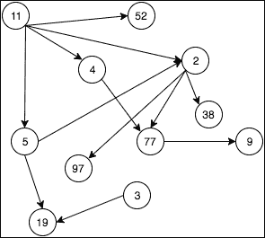
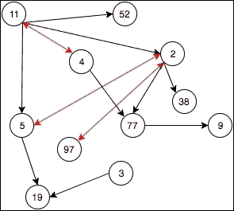
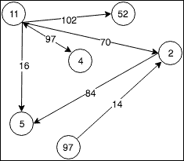

# 第十一章。图：具有关系的值

我们将要考察的最终数据结构是**图**。图是一组没有特定结构关系的对象，其中每个对象可以与集合中一个或多个其他对象有链接。图中的对象通常被称为节点、顶点或点。链接，或对象之间的关系，被称为边、线或弧。这些链接可以是简单的引用，也可以是具有自己值的对象。更正式地说，图是一对集合 *(N, E)*，其中 *N* 是节点的集合，*E* 是边的集合。

图应用的一个优秀例子将是可视化社交媒体数据库中个人之间的关系。在这样的数据库中，数据库中的每个人代表一个节点，他们与其朋友圈中其他人的每个链接代表一条边。在这样的朋友圈中，看到节点之间呈环形或甚至交织的关系是完全合理的，因为一个人可以和另一个人分享许多相同的朋友或同事。当试图合理化这些集合时，树和堆结构会迅速崩溃，而图数据结构实际上正是为了这样的场景而设计的。

在本章中，我们将涵盖以下主题：

+   图数据结构的定义

+   图结构的视觉概念

+   常见操作

+   图的实现

# 视觉图概念

有时使用某些集合的视觉表示来理解图数据结构的概念更容易。考虑以下图示：



这是一个由十一个节点和十二条边组成的基本图。集合 *N* 和 *E* 可以描述如下：

*N = {2, 3, 4, 5, 9, 11, 19, 38, 52, 77, 97}*

*E = {2:38, 2:77, 2:97, 3:19, 4:77, 5:2, 5:19, 11:2, 11:4, 11:5, 11:52, 77:9}*

注意，在这个例子中，节点之间只有单向边。这是完全可以接受的，但当允许双向节点时，图就更加强大。考虑以下示例：



这是我们在前面看到的同一个图，但现在集合 *E* 包含了现有节点之间的一些新互惠边。集合 *N* 和 *E* 现在可以描述如下：

*N = {2, 3, 4, 5, 9, 11, 19, 38, 52, 77, 97}*

*E = {2:5, 2:38, 2:77, 2:97, 3:19, 4:11, 4:77, 5:2, 5:19, 11:2, 11:4, 11:5, 11:52, 77:9, 97:2}*

最后，节点之间的边也可以定义为一个特定的值。考虑以下示例：



在这个图中，我们看到一个包含六个节点和七条边的图。然而，在这种情况下，边被进一步定义为特定的值。这个值不仅限于整数，它可以表示任何类型或所需的自定义对象。对于这个图的集合 *N* 和 *E* 可以描述如下：

*N = {2, 4, 5, 52, 97}*

*E = {2:5(84), 4:11(97), 11:2(70), 11:4(97), 11:5(16), 11:52(102), 97:2(14)}*

# 图操作

由于图支持节点之间的双向引用，并且节点可以几乎无限地拥有邻居，因此为了实现集合，有必要定义两个基本对象。这些包括构成图的节点以及图集合本身。如果实现支持包含值的边，则可能还需要一个边对象。因此，请注意，一些常见的图操作将在多个类中具有组件：

+   **添加节点**：这个操作有时被称为**添加顶点**或**添加点**操作，并且取决于定义图的所用语言。添加节点操作只是将新节点插入到图中，而不定义任何边或对相邻节点的引用。由于一个节点不一定需要邻居才能存在于图中，因此添加节点操作代表一个**O**(1)操作。此外，请注意，添加节点操作仅由图集合对象实现。

+   **删除节点**：这个操作有时被称为**删除顶点**或**删除点**操作，并且取决于定义图的所用语言。删除节点操作从图中删除节点，并删除任何到和从相邻节点的边或引用。此操作的操作成本为**O**(*n* + *k*)，其中*n*是我们图中节点的数量，*k*是边的数量。删除节点操作仅由图集合对象实现。

    ### 注意

    对于简单的删除操作，这可能会显得有些昂贵，但请记住，图中的引用可以是双向的，这意味着我们的节点可能潜在地有指向图中每个其他节点的边，同时图中的每个其他节点也可能同时有指向我们的节点的边。

    这主要是针对设计为支持包含值的边的图而言的。在这种情况下，必须逐个检查每条边，以确定它是否指向要删除的节点，如果确实如此，则必须相应地处理。在边仅仅是对象之间指针的图中，将对象设置为`null`或`nil`将有效地消除指向它的任何边，这可能会将此操作的成本降低到**O**(1)。

+   **AddEdge**: 此操作有时被称为**AddArc**或**AddLine**操作，它依赖于定义节点的语言。AddEdge 操作简单地从节点`x`到节点`y`添加一条新边。AddEdge 操作在集合对象和节点对象中实现。在节点级别，只需传递目标节点`y`作为参数；而在图级别，则需要提供`x`和`y`。如果图支持具有值的边，则新值也必须作为参数传递给图操作。由于图支持节点之间的双向关系，因此无需首先确认从节点`y`到节点`x`是否存在边。这意味着在节点之间添加新边是一个简单的过程，具有**O**(1)的操作成本。

+   **RemoveEdge**: 此操作有时被称为**RemoveArc**或**RemoveLine**操作，它依赖于定义节点的语言。RemoveEdge 操作简单地从节点`x`到节点`y`删除现有边（如果存在）。在节点级别，只需传递目标节点`y`作为参数，而在图级别，则需要提供`x`和`y`。如果图支持具有值的边，则新值也必须作为参数传递给图操作。由于图支持节点之间的双向关系，从节点`x`到节点`y`删除边作为操作与从节点`y`到节点`x`的现有边完全独立；因此，这个过程具有**O**(1)的操作成本。

+   **GetNodeValue**: GetNodeValue 操作有时被称为**GetVertexValue**或**GetPointValue**操作，这取决于定义节点的语言。此操作返回与节点关联的值，无论是原始类型还是某种自定义对象类型，并且操作具有**O**(1)的操作成本。此操作可以在图或节点级别定义，但如果它作为图对象的一部分定义，则必须将需要查询的节点作为参数传递给操作。

+   **SetNodeValue**: SetNodeValue 操作有时被称为**SetVertexValue**或**SetPointValue**操作，它依赖于定义节点的语言。此操作设置节点的值，并具有**O**(1)的操作成本。再次强调，此操作可以在图或节点级别定义，但如果它作为图对象的一部分定义，则必须将需要设置的节点作为参数传递给操作。

+   **Adjacent**: Adjacent 操作检查是否存在从节点`x`到节点`y`的边，通常返回表示结果的布尔值。此操作通常在图级别定义，并需要提供节点`x`和`y`。这个简单的操作具有**O**(1)的操作成本。

+   **Neighbors**：这个操作在树数据结构中的子操作功能类似。`Neighbors`操作返回一个包含所有节点`y`的列表，其中从节点`x`到节点`y`存在边。这个操作通常在图级别定义，并需要提供节点`x`。这个操作具有**O**(1)的操作成本。

+   **Count**：与其他许多集合一样，图通常公开一个计数操作，该操作返回集合中包含的节点数。尽管这取决于实现，但这个操作通常具有**O**(1)的操作成本。

+   **GetEdgeValue**：这个操作有时被称为 GetArcValue 或 GetLineValue 操作，这取决于定义节点的语言。在支持带值边的图中，这个操作返回与边关联的值，无论是原始类型还是某种自定义对象类型，并且操作具有**O**(1)的操作成本。这个操作也可以定义为节点对象的一部分，在这种情况下，必须将需要查询的边作为参数传递给操作。

+   **SetEdgeValue**：这个操作有时被称为**SetArcValue**或**SetLineValue**操作，这取决于定义边的语言。这个操作设置边的值，并且具有**O**(1)的操作成本。再次强调，这个操作可以定义为节点对象的一部分，在这种情况下，要设置的边必须作为参数传递给操作。

# 图实现

与堆一样，图是树数据结构的一种形式，因此在我们讨论的语言中，我们不会找到原生的具体实现。然而，图数据结构实现起来出奇地简单，因此我们将从头开始构建自己的`Graph`类。

# 图数据结构

在我们开始之前，我们需要详细说明我们的图结构将具有的一些特性。我们的图将支持没有与其他节点相连的节点。我们的图还将支持单向和双向边。为了简洁起见，我们的图集合中的边将不支持边值，但如果您决定在自定义实现中使用它们，添加值到边是一个简单的问题。

我们将使用两个类来构建我们的图。第一个是`Graph`类本身，在我们的实现中，它将包含大多数标准图操作。下一个是`GraphNode`类，它将代表我们的集合中的节点。请注意，这个类也可以命名为`GraphVertex`或`GraphPoint`，但为了与我们的第九章中的树`Node`类示例保持一致，即“非线性结构：树”，我们将坚持使用节点。

`Graph` 类将基于一个包含节点根引用的数组或列表。每个 `GraphNode` 对象也将包含一个数组或列表，它持有对其他节点的引用。在这个实现中，这些引用代表我们的数据结构中的边。这个类将支持从头开始实例化或通过传递现有的 `GraphNode` 对象列表进行实例化。在 `Graph` 类中实现添加和删除节点和边的操作。`Graph` 类还将包含检查节点相邻性、节点邻居和集合中节点总数操作的函数。

**C#**

C# 并没有提供具体的 `Graph` 或 `GraphNode` 类，因此我们需要自己创建。我们将从 `GraphNode` 类开始。以下是一个基本的 `GraphNode` 类实现示例，在 C# 中可能看起来是这样的：

```py
    public class GraphNode 
    { 
        public Int16 Value; 

        private List<GraphNode> _neighbors; 
        public List<GraphNode> Neighbors 
        { 
            get 
            { 
                return _neighbors; 
            } 
        } 

        public GraphNode() 
        { 
            _neighbors = new List<GraphNode>(); 
        } 

        public GraphNode(Int16 value) 
        { 
            _neighbors = new List<GraphNode>(); 
            Value = value; 
        } 
    }   

```

这个类非常简单，包含一个名为 `Value` 的公共字段来存储我们的整数数据，以及一个名为 `neighbors` 的 `List<GraphNode>` 对象，它表示此节点与其邻居之间的边。该类还有两个构造函数，它们都实例化了 `_neighbors` 列表。重载的 `GraphNode(Int16 value)` 构造函数还允许在实例化时定义一个值。

接下来，我们可以实现我们的图函数。以下是一个 `Graph` 类的具体实现示例，在 C# 中可能看起来是这样的：

```py
    private List<GraphNode> _nodes; 
    public List<GraphNode> Nodes 
    { 
        get 
        { 
            return _nodes; 
        } 
    } 

    public Graph(List<GraphNode> nodes) 
    { 
        if (nodes == null) 
        { 
            _nodes = new List<GraphNode>(); 
        } 
        else 
        { 
            _nodes = nodes; 
        } 
    } 

```

我们的 `Graph` 类包括一个公共字段，一个名为 `Nodes` 的 `List<GraphNode>` 集合，它公开了私有 `List<GraphNode> _nodes` 字段的只读访问。该字段维护了到相邻节点的边列表。最后，我们的构造函数接受一个类型为 `List<Graphnode>` 的参数，如果它不为空，则将 `_nodes` 设置为这个值；否则，初始化 `_nodes` 集合：

```py
    public void AddNode(GraphNode node) 
    { 
        _nodes.Add(node); 
    } 

    public void AddNodeForValue(Int16 value) 
    { 
        _nodes.Add(new GraphNode(value)); 
    } 

```

`Graph` 中的前两个公共方法是 `AddNode(GraphNode node)` 和 `AddNodeForValue(Int16 value)`，它们为我们这个类添加了两种版本的 `AddNode` 功能。第一个将一个预存在的节点添加到 `_nodes` 集合中，而第二个使用 `value` 实例化一个新的节点，然后将该节点添加到 `_nodes` 集合中。这两个方法添加节点时不定义任何边，因此这些操作的成本为 **O**(1)：

```py
    public bool RemoveNode(Int16 value) 
    { 
        GraphNode nodeToRemove = _nodes.Find(n => n.Value == value); 
        if (nodeToRemove == null) 
        { 
            return false; 
        } 
        _nodes.Remove(nodeToRemove); 

        foreach (GraphNode node in _nodes) 
        { 
            int index = node.Neighbors.IndexOf(nodeToRemove); 
            if (index != -1) 
            { 
                node.Neighbors.RemoveAt(index); 
            } 
        } 
        return true; 
    } 

```

`RemoveNode(Int16 value)` 方法为我们这个类提供了 `RemoveNode` 功能。此方法接受一个类型为 `Int16` 且命名为 `value` 的参数，代表调用者请求删除的节点。该方法首先使用一个 **LINQ** 语句检查集合中的每个节点，寻找与 `value` 匹配的节点。如果没有找到匹配项，则方法返回 `false`。否则，匹配的节点将从 `_nodes` 集合中移除，并且方法执行继续。

此方法的后半部分遍历集合中的每个节点，检查每个节点的邻居以找到`nodeToRemove`的匹配项。找到匹配项意味着从`node`对象到`nodeToRemove`对象存在一条边，并返回该匹配项的索引值。通过使用`index`从`node.Neighbors`集合中删除`nodeToRemove`对象，我们消除了引用并删除了边。

如我们在关于图操作的讨论中所考察的，`RemoveNode`操作的操作成本为**O**(*n* + *k*)，其中*n*是集合中节点的数量，*k*是边的数量。在`RemoveNode(Int16 value)`方法中，方程的前半部分代表*n*，后半部分代表*k*：

```py
    public void AddEdge(GraphNode from, GraphNode to) 
    { 
        from.Neighbors.Add(to); 
    } 

    public void AddBidirectedEdge(GraphNode from, GraphNode to) 
    { 
        from.Neighbors.Add(to); 
        to.Neighbors.Add(from); 
    } 

```

`AddEdge(GraphNode from, GraphNode to)`和`AddBidirectedEdge(GraphNode from, GraphNode to)`方法为`Graph`类提供了 AddEdge 功能。第一个方法是标准的 AddEdge 操作，而第二个方法更多是作为一种便利存在，以防调用者希望立即添加双向引用。第一个方法具有**O**(1)的操作成本，而第二个实际上具有更不寻常的**O**(2)操作成本：

```py
    public bool Adjacent(GraphNode from, GraphNode to) 
    { 
        return from.Neighbors.Contains(to); 
    } 

```

`Adjacent(GraphNode from, GraphNode to)`方法返回一个布尔值，表示两个节点`from`和`to`之间是否存在边。希望签名使这条边的方向清晰，但为了清晰起见，此方法仅确认从`from`节点到`to`节点存在边，但不确认反向。由于此方法基于`contains`函数，它具有**O**(*n*)的操作成本，其中*n*是`from.Neighbors`中包含的边的数量：

```py
    public List<GraphNode> Neighbors(Int16 value) 
    { 
        GraphNode node = _nodes.Find(n => n.Value == value); 
        if (node == null) 
        { 
            return null; 
        } 
        else 
        { 
            return node.Neighbors; 
        } 
    } 

```

`Neighbors(Int16 value)`方法为我们类提供了邻居功能。此方法接受一个类型为`Int16`的参数，命名为`value`，代表调用者请求检查的节点。该方法首先使用 LINQ 语句检查集合中的每个节点，寻找与`value`匹配的节点。如果没有找到匹配项，则方法返回`null`。否则，该方法返回匹配节点的`Neighbors`集合。如果事先知道`GraphNode`对象，则此操作将具有**O**(1)的操作成本。然而，由于我们根据特定节点的值在`Graph`级别检查整个`_nodes`集合，因此此实现具有**O**(*n*)的操作成本：

```py
    public int Count 
    { 
        get  
        {  
            return _nodes.Count;  
        } 
    } 

```

最后，`Count`字段是一个只读值，通过返回`_nodes.Count`来返回集合中包含的节点总数。该字段为我们`Graph`类提供了 Count 功能，并且具有**O**(1)的操作成本。

**Java**

与 C#一样，Java 不提供具体的`Graph`或`GraphNode`类，因此我们需要自己创建。同样，我们将从`GraphNode`类开始。以下是一个基本的`GraphNode`类实现示例在 Java 中看起来像什么：

```py
    public class GraphNode 
    { 
        public int Value; 

        private LinkedList<GraphNode> _neighbors; 
        public LinkedList<GraphNode> GetNeighbors() 
        { 
            return _neighbors; 
        } 

        public GraphNode() 
        { 
            _neighbors = new LinkedList<GraphNode>(); 
        } 

        public GraphNode(int value) 
        { 
            _neighbors = new LinkedList<GraphNode>(); 
            Value = value; 
        } 
    } 

```

这个类非常简单，包含一个名为`Value`的公共字段来存储我们的整数数据，以及一个名为`_neighbors`的私有`LinkedList<GraphNode>`对象，它表示该节点与其邻居之间的边。还有一个名为`GetNeighbors()`的公共方法，它公开了私有`_neighbors`列表。该类还有两个构造函数，它们都实例化了`_neighbors`列表。重载的`GraphNode(Int16 value)`构造函数还允许在实例化时定义一个值。

接下来，我们可以实现我们的图函数。以下是一个`Graph`类在 Java 中的具体实现示例：

```py
    private LinkedList<GraphNode> _nodes; 
    public LinkedList<GraphNode> GetNodes() 
    { 
        return _nodes; 
    } 

    public Graph(){ 
       _nodes = new LinkedList<GraphNode>(); 
    } 

    public Graph(LinkedList<GraphNode> nodes) 
    { 
        _nodes = nodes; 
    } 

```

我们的`Graph`类包含一个私有字段，一个名为`_nodes`的`List<GraphNode>`集合和一个名为`GetNodes()`的方法，该方法提供了对私有`List<GraphNode> _nodes`字段的只读访问。该字段维护了当前节点与其相邻节点之间的边列表。最后，我们的构造函数接受一个类型为`List<Graphnode>`的参数，如果它不是`null`，则将`_nodes`设置为该值；否则，初始化`_nodes`集合：

```py
    public void AddNode(GraphNode node) 
    { 
        _nodes.add(node); 
    } 

    public void AddNodeForValue(int value) 
    { 
        _nodes.add(new GraphNode(value)); 
    } 

```

`Graph`中的前两个公共方法是`AddNode(GraphNode node)`和`AddNodeForValue(int value)`，它们为我们这个类添加了两种版本的 AddNode 功能。第一个将一个现有的节点添加到`_nodes`集合中，而第二个使用`value`实例化一个新的节点，然后将该节点添加到`_nodes`集合中。这两个方法添加节点时不定义任何边，因此这些操作的成本为**O**(1)：

```py
    public boolean RemoveNode(int value) 
    { 
        GraphNode nodeToRemove = null; 
        for (GraphNode node : _nodes) 
        { 
            if (node.Value == value) 
            { 
                nodeToRemove = node; 
                break; 
            } 
        } 

        if (nodeToRemove == null)  
        { 
            return false; 
        } 

        _nodes.remove(nodeToRemove); 

        for (GraphNode node : _nodes) 
        { 
            int index = node.GetNeighbors().indexOf(nodeToRemove); 
            if (index != -1) 
            { 
                node.GetNeighbors().remove(index); 
            } 
        } 
        return true; 
    } 

```

`RemoveNode(int value)`方法为我们这个类提供了`RemoveNode`功能。该方法接受一个类型为`int`的参数`value`，表示调用者请求删除的节点。方法开始时遍历每个节点，搜索`value`的匹配项。如果没有找到匹配项，则方法返回`false`。否则，使用`remove(E)`函数和方法从`_nodes`集合中删除匹配的节点，并继续方法执行。

此方法的后半部分遍历集合中的每个节点，检查每个节点的邻居以找到`nodeToRemove`的匹配项。找到匹配项意味着从`node`到`nodeToRemove`存在一条边，并返回该匹配项的索引值。通过使用`index`从`node.Neighbors`中删除`nodeToRemove`，我们消除了引用并删除了边。

在 Java 中的操作成本与在 C#中相同。`RemoveNode`操作的成本为**O**(*n* + *k*)，其中*n*是集合中节点的数量，*k*是边的数量。在`RemoveNode(int value)`方法中，方程中的前半部分代表*n*，后半部分代表*k*：

```py
    public void AddEdge(GraphNode from, GraphNode to) 
    { 
        from.GetNeighbors().add(to); 
    } 

    public void AddBidirectedEdge(GraphNode from, GraphNode to) 
    { 
        from.GetNeighbors().add(to); 
        to.GetNeighbors().add(from); 
    } 

```

`AddEdge(GraphNode from, GraphNode to)` 和 `AddBidirectedEdge(GraphNode from, GraphNode to)` 方法为 `Graph` 类提供了 `AddEdge` 功能。第一个方法执行标准的 `AddEdge` 操作，而第二个方法则更像是方便调用者立即添加双向引用的便捷方法。第一个方法具有 **O**(1) 的操作成本，而第二个方法在技术上具有更不寻常的 **O**(2) 操作成本：

```py
    public boolean Adjacent(GraphNode from, GraphNode to) 
    { 
        return from.GetNeighbors().contains(to); 
    } 

```

`Adjacent(GraphNode from, GraphNode to)` 方法返回一个布尔值，表示两个节点 `from` 和 `to` 之间是否存在边。希望这个签名使这条边的方向清晰，但为了清晰起见，此方法仅确认从 `from` 节点到 `to` 节点存在边，但不确认反向。由于此方法基于 `contains` 函数，它具有 **O**(*n*) 的操作成本，其中 *n* 是 `from.Neighbors` 中包含的边的数量：

```py
    public LinkedList<GraphNode> Neighbors(int value) 
    { 
        GraphNode node = null; 
        for (GraphNode n : _nodes) 
        { 
            if (n.Value == value) 
            { 
                return node.GetNeighbors(); 
            } 
        } 

        return null;    
    } 

```

`Neighbors(int value)` 方法为我们类提供 Neighbors 功能。此方法接受一个类型为 `int` 的参数，名为 `value`，表示调用者请求检查的节点。方法首先遍历节点集合，寻找 `value` 的匹配项。如果没有找到匹配项，则方法返回 `null`。否则，方法使用 `GetNeighbors()` 返回匹配节点的 `Neighbors` 集合。如果事先知道 `GraphNode` 对象，此操作将具有 **O**(1) 的操作成本。然而，由于我们根据特定节点的值在 `Graph` 层面上检查整个 `_nodes` 集合，此实现具有 **O**(*n*) 的操作成本：

```py
    public int GetCount() 
    { 
        return _nodes.size(); 
    }  

```

最后，`GetCount()` 方法通过返回 `_nodes.size()` 提供对集合中包含的总节点数的只读访问。此字段为我们 `Graph` 类提供 Count 功能，并具有 **O**(1) 的操作成本。

**Objective-C**

Objective-C 不提供具体的 `Graph` 或 `GraphNode` 类，但它提供了构建它们所需的基本组件。以下是一个 `EDSGraphNode` 类在 Objective-C 中的基本实现示例：

```py
    @interface EDSGraphNode() 
    { 
        NSInteger _value; 
        NSMutableArray *_neighbors; 
    } 
    -(instancetype)initGraphNode 
    { 
        if (self = [super init]) 
        { 
            _neighbors = [NSMutableArray array]; 
        } 

        return self; 
    } 

    -(instancetype)initGraphNodeWithValue:(NSInteger)value 
    { 
        if (self = [super init]) 
        { 
            _value = value; 
            _neighbors = [NSMutableArray array]; 
        } 

        return self; 
    } 

    -(NSMutableArray*)neighbors 
    { 
        return _neighbors; 
    } 

    -(NSInteger)value 
    { 
        return _value; 
    } 

```

此类包含两个 ivar 属性，名为 `_value` 和 `_neighbors`。`_value` 属性是一个 `NSInteger` 对象，用于存储我们的整数数据，而 `_neighbors` 是一个 `NSMutableArray` 对象，表示此节点与其邻居之间的边。该类有两个初始化器，两者都实例化了 `_neighbors` 列表。`initGraphNode:` 方法仅实例化 `_neighbors` 数组，而 `initGraphNodeWithValue:` 还将 `_value` 设置为传递的值属性。

接下来，我们可以实现我们的图函数。以下是一个 `EDSGraph` 类在 Objective-C 中的具体实现示例：

```py
    @interface EDSGraph() 
    { 
        NSMutableArray<EDSGraphNode*>* _nodes; 
    } 

    -(NSMutableArray<EDSGraphNode*>*)nodes 
    { 
        return _nodes; 
    } 

    -(instancetype)initGraphWithNodes:(NSMutableArray<EDSGraphNode *> *)nodes 
    { 
        if (self = [super init]) 
        { 
            if (nodes) 
            { 
                _nodes = nodes; 
            } 
            else 
            { 
                _nodes = [NSMutableArray array]; 
            } 
        } 
        return self; 
    } 

```

我们的`EDSGraph`类包括一个 ivar 属性，一个名为`_nodes`的`NSMutableArray<EDSGraphNode*>`，它维护了到相邻节点的边列表。还有一个名为`nodes`的方法，它提供了对私有`_nodes`属性的只读访问。最后，我们的初始化器`initGraphWithNodes:(NSMutableArray<EDSGraphNode *> *)nodes`接受一个`EDSGraphnode`数组，如果它不是`nil`，则将`_nodes`设置为该值。否则，初始化器方法初始化`_nodes`集合：

```py
    -(NSInteger)countOfNodes 
    { 
        return [_nodes count]; 
    } 

```

`countOfNodes`方法通过返回`[_nodes count]`来提供对集合中包含的总节点数的只读访问。此方法为我们提供的`EDSGraph`类提供了计数功能，并且具有**O**(1)的操作成本：

```py
    -(void)addNode:(EDSGraphNode*)node 
    { 
        [_nodes addObject:node]; 
    } 

    -(void)addNodeForValue:(NSInteger)value 
    { 
        EDSGraphNode *node = [[EDSGraphNode alloc] initGraphNodeWithValue:value]; 
        [_nodes addObject:node]; 
    } 

```

`EDSGraph`中的前两个公共方法是`addNode:`和`addNodeForValue:`，它们为我们提供的类添加了两种版本的`AddNode`功能。第一个方法将现有的节点添加到`_nodes`集合中，而第二个方法使用`value`实例化一个新的节点，然后将该节点添加到`_nodes`集合中。这两个方法在添加节点时没有定义任何边，因此这些操作的成本为**O**(1)：

```py
    -(BOOL)removeNodeForValue:(NSInteger)value 
    { 
        EDSGraphNode *nodeToRemove; 
        for (EDSGraphNode *n in _nodes) 
        { 
            if (n.value == value) 
            { 
                nodeToRemove = n; 
                break; 
            } 
        } 

        if (!nodeToRemove) 
        { 
            return NO; 
        } 

        [_nodes removeObject:nodeToRemove]; 

        for (EDSGraphNode *n in _nodes) 
        { 
            long index = [n.neighbors indexOfObject:nodeToRemove]; 
            if (index != -1) 
            { 
                [n.neighbors removeObjectAtIndex:index]; 
            } 
        } 
        return YES;  
    } 

```

`removeNodeForValue:`方法为我们提供的类提供了移除节点的功能。此方法接受一个类型为`NSInteger`的参数，命名为`value`，表示调用者请求移除的节点。方法首先遍历节点集合，寻找与`value`匹配的对象。如果没有找到匹配项，则方法返回`NO`。否则，使用`removeObject:`从`_nodes`集合中移除匹配的节点，并继续方法执行。

此方法的后半部分遍历集合中的每个节点，检查每个节点的邻居以找到与`nodeToRemove`匹配的对象。找到匹配项意味着从`node`到`nodeToRemove`存在一条边，并返回该匹配项的索引值。通过使用`index`从`node.Neighbors`中移除`nodeToRemove`，我们消除了引用并删除了边。

如我们在图操作讨论中所考察的，`RemoveNode`操作的操作成本为**O**(*n* + *k*)，其中*n*是集合中节点的数量，*k*是边的数量。在`removeNodeForValue:`方法中，方程的前半部分代表*n*，后半部分代表*k*：

```py
    -(void)addEdgeFromNode:(EDSGraphNode*)from toNode:(EDSGraphNode*)to 
    { 
        [from.neighbors addObject:to]; 
    } 

    -(void)addBidirectionalEdgeFromNode:(EDSGraphNode*)from toNode:(EDSGraphNode*)to 
    { 
        [from.neighbors addObject:to]; 
        [to.neighbors addObject:from]; 
    } 

```

`addEdgeFromNode:toNode:`和`addBidirectionalEdgeFromNode:toNode:`方法为`Graph`类提供了添加边的功能。第一个方法是标准的添加边操作，而第二个方法则更方便，如果调用者希望立即添加双向引用。第一个方法的操作成本为**O**(1)，而第二个方法的操作成本为**O**(2)：

```py
    -(BOOL)adjacent:(EDSGraphNode*)from toNode:(EDSGraphNode*)to 
    { 
        return [from.neighbors containsObject:to]; 
    } 

```

`adjacent:toNode:` 方法返回一个 `BOOL` 值，表示两个节点 `from` 和 `to` 之间是否存在边。希望这个签名使这条边的方向变得清晰，但为了清晰起见，此方法仅确认从 `from` 节点到 `to` 节点存在边，但不确认反向。由于此方法基于 `containsObject:` 函数，它具有 **O**(*n*) 的操作成本，其中 *n* 是 `from.neighbors` 中包含的边的数量：

```py
    -(NSMutableArray<EDSGraphNode*>*)neighborsOfValue:(NSInteger)value 
    { 
        for (EDSGraphNode *n in _nodes) 
        { 
            if (n.value == value) 
            { 
                return n.neighbors; 
            } 
        } 

        return nil; 
    } 

```

`neighborsOfValue:` 方法为我们提供了类中的邻居功能。此方法接受一个类型为 `NSInteger` 并命名为 `value` 的参数，表示调用者请求检查的节点。该方法首先遍历节点集合以寻找 `value` 的匹配项。如果没有找到匹配项，则方法返回 `nil`。否则，该方法返回匹配节点的 `neighbors` 集合。如果事先知道 `EDSGraphNode` 对象，则此操作的成本为 **O**(1)。然而，由于我们根据特定节点的值在 `EDSGraph` 级别检查整个 `_nodes` 集合，因此此实现具有 **O**(*n*) 的操作成本。

**Swift**

与其对应物一样，Swift 默认不提供具体的 `Graph` 或 `GraphNode` 类，因此我们需要创建自己的。我们将从 `GraphNode` 类开始。以下是一个 `GraphNode` 类在 Swift 中的基本实现示例：

```py
    public class GraphNode : Equatable 
    { 
        public var neighbors: Array = [GraphNode]() 
        public var value : Int 

        public init(val: Int) { 
            value = val 
        } 
    } 

    public func == (lhs: GraphNode, rhs: GraphNode) -> Bool { 
        return (lhs.value == rhs.value) 
    } 

```

这个类扩展了 `Equatable`。这是为了支持按值和按对象进行搜索。该类包含两个公共属性。第一个是一个名为 `neighbors` 的 `GraphNode` 对象数组，它表示节点与其相邻节点之间的边。第二个是一个名为 `value` 的 `Int` 变量，它用于存储对象的整数数据。该类有一个自定义构造函数，它接受 `Int` 并将该值分配给 `value` 变量。最后，该类定义了一个重载的比较运算符以支持 `Equatable` 功能。

接下来，我们可以实现我们的图函数。以下是一个 `Graph` 类在 Swift 中的具体实现示例：

```py
    public var nodes: Array = [GraphNode]() 

    public init(nodes: Array<GraphNode>) 
    { 
        self.nodes = nodes 
    } 

```

我们的 `Graph` 类包含一个名为 `nodes` 的公共 `Array` 属性。该属性维护了到相邻节点的边列表。该类有一个自定义构造函数，它接受一个类型为 `Array<GraphNode>` 的参数，并将 `_nodes` 设置为该值，如果它不是 `nil`。由于 `nodes` 对象在声明时就已经初始化，因此在这里不需要初始化它：

```py
    public func count() -> Int 
    { 
        return nodes.count 
    } 

```

该类中的第一个方法是 `count()`，它通过返回 `nodes.count` 提供对集合中包含的总节点数的只读访问。此方法为我们 `Graph` 类提供计数功能，并且具有 **O**(1) 的操作成本：

```py
    public func addNode(node: GraphNode) 
    { 
        nodes.append(node) 
    } 

    public func addNodeForValue(value: Int) 
    { 
        let node = GraphNode(val: value) 
        nodes.append(node); 
    } 

```

在`Graph`中的下一个两个公共方法`AddNode(node: GraphNode)`和`AddNodeForValue(value: Int)`，为我们的类添加了两种版本的`AddNode`功能。第一个将预存在的节点添加到`nodes`集合中，而第二个使用`value`实例化一个新的节点，然后将该节点添加到`nodes`集合中。这两个方法在添加节点时没有定义任何边，因此这些操作的成本为**O**(1)：

```py
    public func removeNodeForValue(value: Int) -> Bool 
    { 
        var nodeToRemove: GraphNode? = nil 

        for n in nodes 
        { 
            if (n.value == value) 
            { 
                nodeToRemove = n; 
                break 
            } 
        } 

        if (nodeToRemove == nil) 
        { 
            return false 
        } 

        if let index = nodes.index(of: nodeToRemove!) 
        { 
            nodes.remove(at: index) 
            for n in nodes 
            { 
                if let foundIndex = n.neighbors.index(of: nodeToRemove!) 
                { 
                    n.neighbors.remove(at: foundIndex) 
                } 
            } 

            return true 
        } 
        return false 
    } 

```

`removeNodeForValue(value: Int)`方法为我们类提供了`RemoveNode`功能。此方法接受一个类型为`Int`的参数，命名为`value`，代表调用者请求删除的节点。方法首先遍历集合中的每个节点，寻找与`value`对象的匹配项。如果没有找到匹配项，则方法返回`false`。否则，匹配的节点将从`nodes`集合中移除，并且方法执行继续。

该方法的后半部分遍历集合中的每个节点，检查每个节点元素的邻居以找到`nodeToRemove`的匹配项。找到匹配项意味着`node`和`nodeToRemove`对象之间存在边，并返回该匹配项的索引值。通过使用`index`从`node.neighbors`中移除`nodeToRemove`，我们消除了引用并删除了边。

如我们在图操作讨论中所考察的，`RemoveNode`操作的操作成本为**O**(*n* + *k*)，其中*n*是集合中节点的数量，*k*是边的数量。在`removeNodeForValue(value: Int)`方法中，方程的前半部分代表*n*，后半部分代表*k*：

```py
    public func addEdgeFromNodeToNode(from: GraphNode, to: GraphNode) 
    { 
        from.neighbors.append(to) 
    } 

    public func addBidirectionalEdge(from: GraphNode, to: GraphNode) 
    { 
        from.neighbors.append(to) 
        to.neighbors.append(from) 
    } 

```

`addEdgeFromNodeToNode(from: GraphNode, to: GraphNode)`和`addBidirectedEdge(from: GraphNode, to: GraphNode)`方法为`Graph`类提供了`AddEdge`功能。第一个方法是标准的 AddEdge 操作，而第二个方法更像是方便方法，以防调用者想要立即添加双向引用。第一个方法具有**O**(1)的操作成本，而第二个方法在技术上具有**O**(2)的操作成本：

```py
    public func adjacent(from: GraphNode, to: GraphNode) -> Bool 
    { 
        if from.neighbors.index(of: to) != nil 
        { 
            return true 
        } 
        else 
        { 
            return false 
        } 
    } 

```

`adjacent(from: GraphNode, to: GraphNode)`方法返回一个`Bool`值，表示两个节点`from`和`to`之间是否存在边。希望这个签名使这条边的方向清晰，但为了清晰起见，此方法仅确认从`from`节点到`to`节点的边存在，但不确认反向。由于此方法基于`contains`函数，它具有**O**(*n*)的操作成本，其中*n*是`from.Neighbors`中包含的边的数量：

```py
    public func neighborsOfValue(value: Int) -> Array<GraphNode>? 
    { 
        for n in nodes 
        { 
            if (n.value == value) 
            { 
                return n.neighbors 
            } 
        } 

        return nil 
    } 

```

`neighborsOfValue(value: Int)` 为我们的类提供了邻居功能。此方法接受一个类型为 `Int` 的参数，命名为 `value`，代表调用者请求检查的节点。该方法首先通过遍历节点集合来寻找与 `value` 匹配的节点。如果没有找到匹配项，则方法返回 `nil`。否则，该方法返回匹配节点的 `neighbors` 集合。如果事先知道 `GraphNode` 对象，则此操作的成本为 **O**(1)。然而，由于我们根据特定节点的值在 `Graph` 层面上检查整个 `nodes` 集合，因此此实现具有 **O**(*n*) 的操作成本。

# 摘要

在本章中，你学习了图数据结构。我们通过图形的视觉表示来更好地理解它们的结构和它们的使用方式。接下来，我们考察了与图操作最常见的情况，并讨论了它们的典型复杂度成本。随后，我们从头开始，在本书中考察的四种语言中，分别创建了自己的简单图节点对象和图数据结构类。
