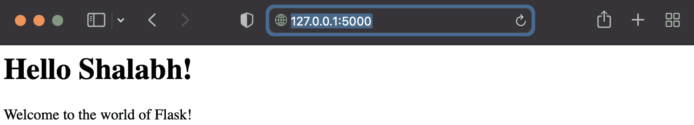
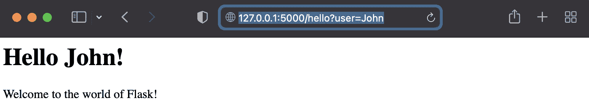
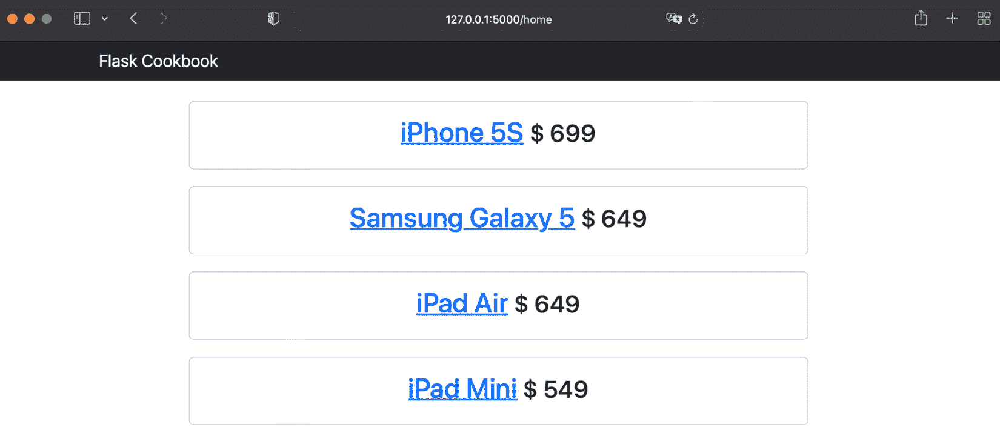
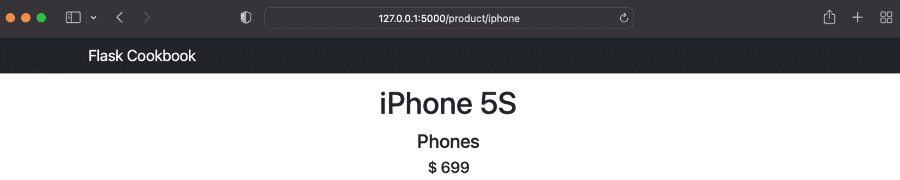
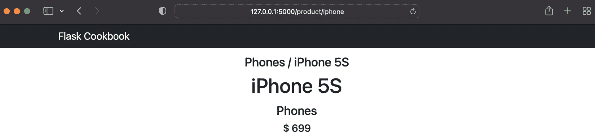
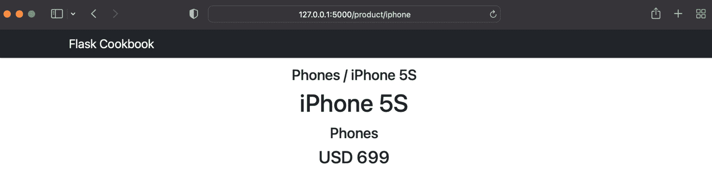
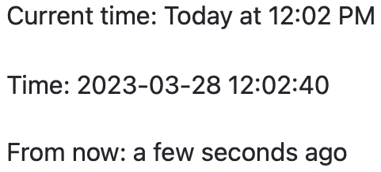

# 2

# 使用 Jinja 模板

本章将从 Flask 的角度介绍 **Jinja** 模板的基础知识。我们还将学习如何使用模块化和可扩展的模板设计和开发应用程序。

信息

如果你已经跟随 Flask 或 Jinja 或本书的前几版，你可能已经注意到，之前这个模板库被称为 *Jinja2*。本书撰写时 Jinja 的最新版本是 3 版，作者/社区决定将其称为 *Jinja*，而不是继续使用容易混淆的 Jinja2、Jinja3 等名称。

在 Flask 中，我们可以编写一个完整的 Web 应用程序，无需第三方模板引擎。例如，看看以下代码；这是一个包含一些 HTML 样式的独立、简单的 Hello World 应用程序：

```py
from flask import Flask
app = Flask(__name__)
@app.route('/')
@app.route('/hello')
@app.route('/hello/<user>')
def hello_world(user=None):
    user = user or 'Shalabh'
    return '''
<html>
    <head>
        <title>Flask Framework Cookbook</title>
    </head>
    <body>
        <h1>Hello %s!</h1>
        <p>Welcome to the world of Flask!</p>
    </body>
</html>''' % user
if __name__ == '__main__':
    app.run()
```

在涉及数千行 HTML、JS 和 CSS 代码的大型应用程序中，前面提到的应用程序编写模式可行吗？在我看来，不可行！

幸运的是，模板提供了一种解决方案，因为它允许我们通过保持模板的可扩展性和分离来结构化我们的视图代码。Flask 默认支持 Jinja，尽管我们可以使用任何适合我们的模板引擎。此外，Jinja 提供了许多额外的功能，使模板非常强大和模块化。

本章将介绍以下食谱：

+   启动标准布局

+   实现块组合和布局继承

+   创建自定义上下文处理器

+   创建自定义 Jinja 过滤器

+   为表单创建自定义宏

+   高级日期和时间格式化

# 技术要求

Jinja 是作为 Flask 标准安装的一部分安装的。无需单独安装。有关更多详细信息，请参阅 *第一章* 中的 *设置虚拟环境* 部分。

# 启动标准布局

Flask 中的大多数应用程序遵循特定的模板布局模式。在本食谱中，我们将实现 Flask 应用程序中模板布局的结构化推荐方式。

## 准备工作

默认情况下，Flask 预期模板应放置在应用程序根级别的名为 `templates` 的文件夹中。如果该文件夹存在，那么 Flask 将自动读取其内容，通过使该文件夹的内容可用于 `render_template()` 方法来使用，我们将在此书中广泛使用该方法。

## 如何做...

让我们用一个小的应用程序来演示这一点。这个应用程序与我们开发的 *第一章* 中 *Flask 配置* 部分非常相似。

首先要做的是在 `my_app` 下添加一个名为 `templates` 的新文件夹。应用程序结构应如下目录结构：

```py
flask_app/
    run.py
    my_app/
        __init__.py
        hello/
            __init__.py
            views.py
        templates
```

我们现在需要对应用程序进行一些修改。`views` 文件中的 `hello_world()` 方法，位于 `my_app/hello/views.py`，应如下所示：

```py
from flask import render_template, request
@hello.route('/')
@hello.route('/hello')
def hello_world():
    user = request.args.get('user', 'Shalabh')
    return render_template('index.html', user=user)
```

在前面的方法中，我们寻找一个 URL 查询参数`user`。如果找到了，我们就使用它；如果没有找到，我们就使用默认参数`Shalabh`。然后，这个值被传递到要渲染的模板的上下文中——即`index.html`——然后渲染出结果模板。

`my_app/templates/index.html`模板可以简单地是以下内容：

```py
<html>
  <head>
    <title>Flask Framework Cookbook</title>
  </head>
  <body>
    <h1>Hello {{ user }}!</h1>
    <p>Welcome to the world of Flask!</p>
  </body>
</html>
```

## 它是如何工作的...

现在，如果我们在一个浏览器中打开`http://127.0.0.1:5000/hello` URL，我们应该看到类似于以下截图的响应：



图 2.1 – 第一个渲染的模板

如果我们传递一个包含`user`键值的 URL 参数，例如`http://127.0.0.1:5000/hello?user=John`，我们应该看到以下响应：



图 2.2 – 在模板中提供自定义内容

如我们在`views.py`中看到的，传递到 URL 的参数是通过`request.args.get('user')`从`request`对象中获取的，然后通过`render_template`传递到正在渲染的模板的上下文中。然后，使用 Jinja 占位符`{{ user }}`解析该参数，以从模板上下文中的当前`user`变量值获取内容。这个占位符会根据模板上下文评估其内部放置的所有表达式。

信息

Jinja 文档可以在[`jinja.pocoo.org/`](http://jinja.pocoo.org/)找到。当编写模板时，这将非常有用。

实现块组合和布局继承

通常，任何 Web 应用程序都将有许多不同的网页。然而，像页眉和页脚这样的代码块几乎在网站的所有页面上都会以相同的方式出现；同样，菜单也会保持不变。实际上，通常只是中心容器块会改变。为此，Jinja 提供了确保模板之间继承的绝佳方式。

考虑到这一点，有一个基础模板是一个好习惯，其中可以构建网站的基本布局，包括页眉和页脚。

## 准备工作

在这个菜谱中，我们将创建一个小型应用程序，它将有一个主页和一个产品页（例如我们在电子商务网站上看到的）。我们将使用 Bootstrap 框架为我们的模板提供简约的设计和主题。可以从[`getbootstrap.com/`](http://getbootstrap.com/)下载 Bootstrap v5。

信息

写作本文时，Bootstrap 的最新版本是 v5。不同的 Bootstrap 版本可能会导致应用程序的 UI 以不同的方式表现，但 Bootstrap 的核心本质保持不变。

为了简单和专注于当前的主题，我们创建了一个硬编码的产品数据存储，可以在 `models.py` 文件中找到。这些在 `views.py` 中被导入和读取，并通过 `render_template()` 方法作为模板上下文变量发送到模板。其余的解析和显示由模板语言处理，在我们的例子中是 Jinja。

## 如何做...

看看下面的布局：

```py
flask_app/
    - run.py
    - my_app/
        - __init__.py
        - product/
            - __init__.py
            - views.py
            - models.py
        - templates/
            - base.html
            - home.html
            - product.html
        - static/
            - js/
                - bootstrap.bundle.min.js
                - jquery.min.js
            - css/
                - bootstrap.min.css
                - main.css
```

在前面的布局中，`static/css/bootstrap.min.css` 和 `static/js/bootstrap.bundle.min.js` 是可以从 *准备就绪* 部分提到的 Bootstrap 网站下载的标准文件。`run.py` 文件保持不变，就像往常一样。其余的应用程序构建过程如下。

首先，在 `my_app/product/models.py` 中定义模型。在本章中，我们将处理一个简单、非持久的键值存储。我们将从提前编写的几个硬编码的产品记录开始，如下所示：

```py
PRODUCTS = {
    'iphone': {
        'name': 'iPhone 5S',
        'category': 'Phones',
        'price': 699,
    },
    'galaxy': {
        'name': 'Samsung Galaxy 5',
        'category': 'Phones',
        'price': 649,
    },
    'ipad-air': {
        'name': 'iPad Air',
        'category': 'Tablets',
        'price': 649,
    },
    'ipad-mini': {
        'name': 'iPad Mini',
        'category': 'Tablets',
        'price': 549
    }
}
```

接下来是视图——即 `my_app/product/views.py`。在这里，我们将遵循蓝图风格来编写应用程序，如下所示：

```py
from werkzeug.exceptions import abort
from flask import render_template
from flask import Blueprint
from my_app.product.models import PRODUCTS
product_blueprint = Blueprint('product', __name__)
@product_blueprint.route('/')
@product_blueprint.route('/home')
def home():
    return render_template('home.html', products=PRODUCTS)
@product_blueprint.route('/product/<key>')
def product(key):
    product = PRODUCTS.get(key)
    if not product:
        abort(404)
    return render_template('product.html', product=product)
```

信息

当你需要用一个特定的错误信息来终止一个请求时，`abort()` 方法会很有用。Flask 提供了基本的错误信息页面，可以根据需要自定义。我们将在 *第四章* 的 *创建自定义 404 和 500 处理器* 菜谱中查看它们，*与视图一起工作*。

在 `Blueprint` 构造函数中传入的蓝图名称（`product`）将被附加到在此蓝图定义的端点上。请查看 `base.html` 代码以获得清晰度。

现在，创建应用程序的配置文件，`my_app/__init__.py`，它应该如下几行代码所示：

```py
from flask import Flask
from my_app.product.views import product_blueprint
app = Flask(__name__)
app.register_blueprint(product_blueprint)
```

总是可能创建自己的自定义 CSS，这可以为 Bootstrap 提供的标准 CSS 添加更多风味。为此，在 `my_app/static/css/main.css` 中添加一些自定义 CSS 代码，如下所示：

```py
body {
  padding-top: 50px;
}
.top-pad {
  padding: 10px 15px;
  text-align: center;
}
```

在考虑模板时，始终创建一个基本模板来存放所有其他模板可以继承的通用代码。将此模板命名为 `base.html` 并将其放置在 `my_app/templates/base.html` 中，如下所示：

```py
<!DOCTYPE html>
<html lang="en">
  <head>
    <meta charset="utf-8">
    <meta http-equiv="X-UA-Compatible" content="IE=edge">
    <meta name="viewport" content="width=device-width,
      initial-scale=1">
    <title>Flask Framework Cookbook</title>
    <link href="{{ url_for('static',
      filename='css/bootstrap.min.css') }}"
      rel="stylesheet">
    <link href="{{ url_for('static',
      filename='css/main.css') }}" rel="stylesheet">
    <script src="{{ url_for('static',
      filename='js/moment.min.js') }}"></script>
  </head>
  <body>
    <nav class="navbar navbar-dark bg-dark fixed-top"
      role="navigation">
      <div class="container">
        <div class="navbar-header">
          <a class="navbar-brand" href="{{
            url_for('product.home') }}">Flask Cookbook</a>
        </div>
      </nav>
    </div>
    <div class="container">
    
    </div>
    <script src="{{ url_for('static',
      filename='js/jquery.min.js') }}"></script>
    <script src="{{ url_for('static',
      filename='js/bootstrap.bundle.min.js') }}"></script>
  </body>
</html>
```

之前的大部分代码包含正常的 HTML 和 Jinja 评估占位符，这是我们之前在 *引导推荐布局* 菜谱中介绍的。然而，需要注意的是 `url_for()` 方法是如何用于蓝图 URL 的。蓝图名称被附加到所有端点上。当应用程序中存在多个蓝图时，这非常有用，因为其中一些可能具有相似的 URL。

在主页上，`my_app/templates/home.html`，遍历所有产品并显示它们，如下所示：

```py


  <div class="top-pad">
    
    <div class="top-pad offset-1 col-sm-10">
      <div class="card text-center">
        <div class="card-body">
          <h2>
            <a href="{{ url_for('product.product', key=id)
              }}">{{ product['name'] }}</a>
            <small>$ {{ product['price'] }}</small>
          </h2>
        </div>
      </div>
    </div>
    
  </div>

```

然后，创建单个产品页面，`my_app/templates/product.html`，它应该如下几行代码所示：

```py


  <div class="top-pad">
    <h1>{{ product['name'] }}</h1>
    <h3><small>{{ product['category'] }}</small></h3>
    <h5>$ {{ product['price'] }}</h5>
  </div>

```

## 它是如何工作的...

在上述模板结构中，遵循了一个继承模式。`base.html` 文件作为所有其他模板的基础模板。`home.html` 文件从 `base.html` 继承，而 `product.html` 从 `home.html` 继承。在 `product.html` 中，`container` 块被覆盖，它最初是在 `home.html` 中填充的。当运行此应用程序时，我们应该看到类似于以下截图所示的输出：



图 2.3 – 遍历块以创建可重用内容

上述截图显示了主页的外观。注意浏览器中的 URL。产品页面应如下所示：



图 2.4 – 继承模板块以创建干净的代码

# 创建自定义上下文处理器

有时，我们可能希望在模板中直接计算或处理一个值。Jinja 维持逻辑处理应在视图中而不是在模板中进行的观点，从而保持模板的简洁。在这种情况下，上下文处理器成为一个方便的工具。使用上下文处理器，我们可以将我们的值传递给一个方法，然后该方法将在 Python 方法中处理，并返回我们的结果值。这可以通过简单地向模板上下文中添加一个函数来实现，因为 Python 允许用户像传递任何其他对象一样传递函数。在本食谱中，我们将了解如何编写自定义上下文处理器。

## 如何操作...

要编写自定义上下文处理器，请按照以下步骤操作。

让我们先以 `类别 / 产品名称` 格式显示产品的描述性名称。之后，将方法添加到 `my_app/product/views.py` 中，如下所示：

```py
@product_blueprint.context_processor
def some_processor():
    def full_name(product):
        return '{0} / {1}'.format(product['category'],
          product['name'])
    return {'full_name': full_name}
```

上下文是一个简单的字典，可以修改以添加或删除值。任何使用 `@product_blueprint.context_processor` 装饰的方法都应该返回一个更新实际上下文的字典。我们可以使用前面的上下文处理器如下：

```py
{{ full_name(product) }}
```

我们可以将前面的代码以以下方式添加到我们的应用程序中，用于产品列表（在 `flask_app/my_app/templates/product.html` 文件中）：

```py


  <div class="top-pad">
    <h4>{{ full_name(product) }}</h4>
    <h1>{{ product['name'] }}</h1>
    <h3><small>{{ product['category'] }}</small></h3>
    <h5>$ {{ product['price'] }}</h5>
  </div>

```

生成的解析后的 HTML 页面应类似于以下截图：



图 2.5 – 产品名称的自定义上下文处理器

信息

请参考本章前面关于实现块组合和布局继承的食谱，以更好地理解本食谱中关于产品和类别逻辑的上下文。

# 创建自定义 Jinja 过滤器

在查看前面的菜谱后，经验丰富的开发者可能会想知道为什么我们使用上下文处理器来创建一个格式良好的产品名称。嗯，我们也可以为同一目的编写一个过滤器，这将使事情更加简洁。可以编写一个过滤器来显示产品的描述性名称，如下例所示：

```py
@product_blueprint.app_template_filter('full_name')
def full_name_filter(product):
    return '{0} / {1}'.format(product['category'],
      product['name'])
```

这也可以按如下方式使用：

```py
{{ product|full_name }}
```

前面的代码将产生与前面菜谱中类似的结果。接下来，让我们通过使用外部库来格式化货币，将事情提升到更高的层次。

## 如何做...

首先，让我们创建一个过滤器，根据当前本地语言格式化货币。将以下代码添加到`my_app/__init__.py`中：

```py
import ccy
from flask import request
@app.template_filter('format_currency')
def format_currency_filter(amount):
    currency_code =
     ccy.countryccy(request.accept_languages.best[-2:])
    return '{0} {1}'.format(currency_code, amount)
```

信息

`request.accept_languages`可能在请求没有`ACCEPT-LANGUAGES`头的情况下不起作用。

前面的代码片段需要安装一个新的包，`ccy`，如下所示：

```py
$ pip install ccy
```

在这个例子中创建的过滤器将选择与当前浏览器区域设置最佳匹配的语言（在我的情况下是`en-US`），然后从区域字符串中取出最后两个字符，并按照 ISO 国家代码生成货币，国家代码由两个字符表示。

小贴士

在这个菜谱中需要注意的一个有趣点是，Jinja 过滤器可以在蓝图级别以及应用级别创建。如果过滤器在蓝图级别，装饰器将是`app_template_filter`；否则，在应用级别，装饰器将是`template_filter`。

## 它是如何工作的...

该过滤器可以按如下方式用于我们的产品模板：

```py
<h3>{{ product['price']|format_currency }}</h3>
```

前面的代码将产生以下截图所示的结果：



图 2.6 – 用于显示货币的自定义 Jinja 过滤器

## 相关内容

本章前面关于*实现块组合和布局继承*的菜谱将有助于你理解本菜谱中关于产品和类别逻辑的上下文。

# 为表单创建自定义宏

宏允许我们编写可重用的 HTML 块。它们类似于常规编程语言中的函数。我们可以像在 Python 中的函数一样向宏传递参数，然后我们可以使用它们来处理 HTML 块。宏可以被调用任意次数，输出将根据它们内部的逻辑而变化。在这个菜谱中，让我们了解如何在 Jinja 中编写宏。

## 准备工作

Jinja 中的宏是一个非常常见的话题，并且有很多用例。在这里，我们只看看如何创建宏并在导入后使用它。

## 如何做...

HTML 中最冗余的代码之一是定义表单中输入字段的代码。这是因为大多数字段具有相似的代码，可能只是进行了一些样式修改。

以下是一个宏示例，当调用时会创建输入字段。最佳实践是将宏创建在单独的文件中以提高可重用性——例如，`_helpers.html`：

```py

<input type="{{ type }}" name="{{ name }}" class="{{ class
  }}" value="{{ value }}"/>

```

信息

`%` 前后的减号 (`-`) 会去除这些块前后空白，使 HTML 代码更易于阅读。

现在，应将宏导入到要使用的文件中，如下所示：

```py

```

现在可以使用以下代码调用它：

```py
<fieldset>
{{ render_field('username', 'icon-user') }}
{{ render_field('password', 'icon-key', type='password') }}
</fieldset>
```

将宏定义在不同的文件中是一种良好的实践，这样可以保持代码整洁并提高代码的可读性。

小贴士

如果你需要编写一个不能从当前文件外部访问的私有宏，请使用名称前带有下划线的宏名称。

# 高级日期和时间格式化

在网络应用程序中处理日期和时间格式化是一件痛苦的事情。在 Python 中使用 `datetime` 库进行此类格式化通常会增加开销，并且当涉及到正确处理时区时相当复杂。当在数据库中存储时间戳时，将时间戳标准化为 UTC 是一种最佳实践，但这意味着每次向全球用户展示时间戳时都需要处理它。

相反，将此处理推迟到客户端——即浏览器——会更智能。浏览器始终知道其用户的当前时区，因此将能够正确地操作日期和时间信息。这种方法还可以减少应用程序服务器上的任何不必要的开销。在本食谱中，我们将了解如何实现这一点。我们将使用 `Moment.js` 来完成此目的。

## 准备工作

`Moment.js` 可以像任何 JS 库一样包含在我们的应用程序中。我们只需下载并将 JS 文件 `moment.min.js` 放置在 `static/js` 文件夹中。`Moment.js` 文件可以从 [`momentjs.com/`](http://momentjs.com/) 下载。然后，可以通过在 HTML 文件中添加以下语句以及其他 JavaScript 库来使用此文件：

```py
<script src="{{ url_for('static',
  filename='js/moment.min.js') }}"></script>
```

`Moment.js` 的基本用法如下所示。这可以在浏览器控制台中为 JavaScript 执行：

```py
>>> moment().calendar(); "Today at 11:09 AM"
>>> moment().endOf('day').fromNow(); "in 13 hours"
>>> moment().format('LLLL'); "Sunday, July 24, 2022 11:10
  AM"
```

## 如何操作...

要在应用程序中使用 `Moment.js`，请遵循所需的步骤。

首先，在 Python 中编写一个包装器，并通过 Jinja 环境变量使用它，如下所示：

```py
from markupsafe import Markup
class momentjs(object):
    def __init__(self, timestamp):
        self.timestamp = timestamp
    # Wrapper to call moment.js method
    def render(self, format):
        return Markup(
            "<script>\ndocument
              .write(moment(\"%s\").%s);\n</script>" % (
              self.timestamp.strftime("%Y-%m-%dT%H:%M:%S"),
              format
            )
        )
    # Format time
    def format(self, fmt):
        return self.render("format(\"%s\")" % fmt)
    def calendar(self):
        return self.render("calendar()")
    def fromNow(self):
        return self.render("fromNow()")
```

你可以根据需要添加任意多的 `Moment.js` 方法到前面的类中。现在，在你的 `app.py` 文件中，将以下创建的类设置为 Jinja 环境变量：

```py
# Set jinja template global
app.jinja_env.globals['momentjs'] = momentjs
```

你现在可以在模板中使用这个类，如下面的示例所示。确保 `timestamp` 是一个 JavaScript `date` 对象的实例：

```py
<p>Current time: {{ momentjs(timestamp).calendar() }}</p>
<br/>
<p>Time: {{momentjs(timestamp).format('YYYY-MM-DD
  HH:mm:ss')}}</p>
<br/>
<p>From now: {{momentjs(timestamp).fromNow()}}</p>
```

## 它是如何工作的…

以下截图显示了前面 HTML 的输出。注意每个语句的格式如何不同。



图 2.7 – 使用 momentjs 格式化日期时间

## 还有更多…

您可以在[`momentjs.com/`](http://momentjs.com/)了解更多关于`Moment.js`库的信息。
