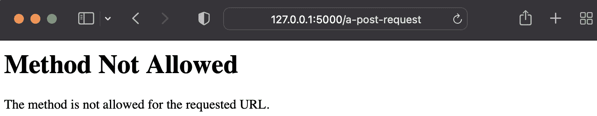
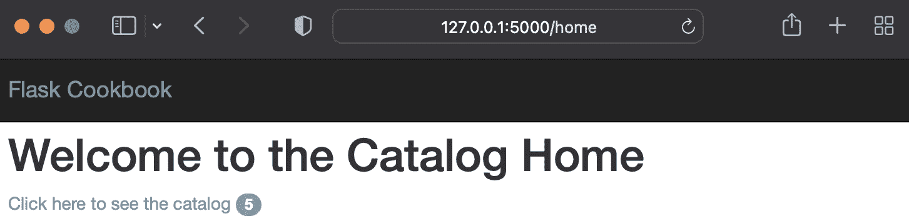
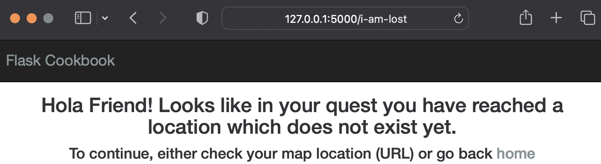
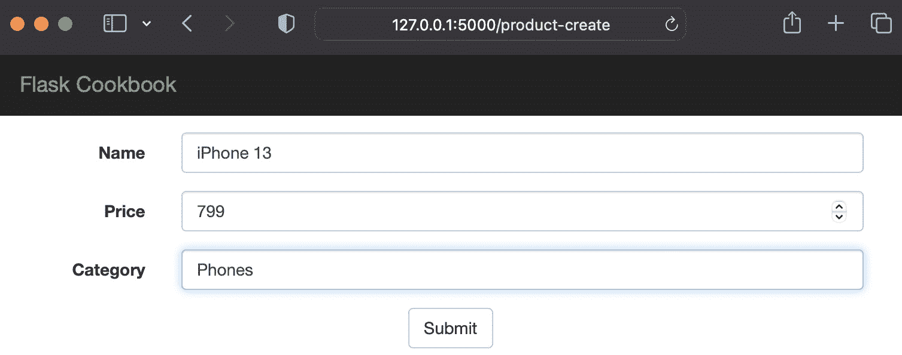
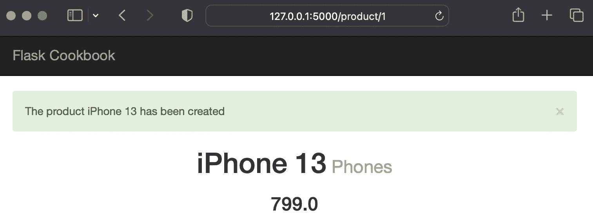

# 4

# 与视图一起工作

对于任何 Web 应用程序，控制你如何与 Web 请求交互以及为这些请求提供适当的响应是非常重要的。本章将引导我们通过正确处理请求和以最佳方式设计它们的各种方法。

Flask 为我们提供了几种设计和布局 URL 路由的方法。它还提供了灵活性，使我们能够保持视图的架构仅为函数，或者创建类，这些类可以根据需要继承和修改。在早期版本中，Flask 只有基于函数的视图。然而，后来在 0.7 版本中，受到 Django 的启发，Flask 引入了可插拔视图的概念，这允许我们拥有类，并在这些类中编写方法。这也使得构建 RESTful API 的过程非常直接，每个 HTTP 方法都由相应的类方法处理。此外，我们总是可以更深入地了解 Werkzeug 库，并使用更灵活但稍微复杂的概念——URL 映射。实际上，大型应用程序和框架更喜欢使用 URL 映射。

在本章中，我们将介绍以下菜谱：

+   编写基于函数的视图和 URL 路由

+   编写基于类的视图

+   实现 URL 路由和基于产品的分页

+   渲染到模板

+   处理 XHR 请求

+   使用装饰器优雅地处理请求

+   创建自定义 4xx 和 5xx 错误处理器

+   显示消息以提供更好的用户反馈

+   实现基于 SQL 的搜索

# 编写基于函数的视图和 URL 路由

这是编写 Flask 中视图和 URL 路由的最简单方法。我们只需编写一个方法，并用端点装饰它。在这个菜谱中，我们将为`GET`和`POST`请求编写几个 URL 路由。

## 准备工作

要通过这个菜谱，我们可以从任何 Flask 应用程序开始。该应用程序可以是新的、空的或复杂的。我们只需要理解这个菜谱中概述的方法。

## 如何做到...

以下部分通过小示例解释了三种最广泛使用的不同类型的请求。

### 简单的 GET 请求

以下是一个简单的`GET`请求示例：

```py
@app.route('/a-get-request')
def get_request():
    bar = request.args.get('foo', 'bar')
    return 'A simple Flask request where foo is %s' % bar
```

在这里，我们只是检查 URL 查询中是否有名为`foo`的参数。如果有，我们在响应中显示它；否则，默认为`bar`。

### 简单的 POST 请求

`POST`请求与`GET`请求类似，但有一些不同：

```py
@app.route('/a-post-request', methods=['POST'])
def post_request():
    bar = request.form.get('foo', 'bar')
    return 'A simple Flask request where foo is %s' % bar
```

路由现在包含一个额外的参数，称为`methods`。此外，我们不再使用`request.args`，而是现在使用`request.form`，因为`POST`假设数据是以表单的形式提交的。

### 简单的 GET/POST 请求

将`GET`和`POST`合并到一个单独的`view`函数中，可以像下面这样编写：

```py
@app.route('/a-request', methods=['GET', 'POST'])
def some_request():
    if request.method == 'GET':
        bar = request.args.get('foo', 'bar')
    else:
        bar = request.form.get('foo', 'bar')
    return 'A simple Flask request where foo is %s' % bar
```

## 它是如何工作的...

让我们尝试理解前面方法的这种玩法。

默认情况下，任何 Flask `视图` 函数仅支持 `GET` 请求。为了支持或处理任何其他类型的请求，我们必须明确告诉我们的 `route()` 装饰器我们想要支持的方法。这正是我们在上一个 `POST` 和 `GET/POST` 方法中做的事情。

对于 `GET` 请求，`request` 对象将寻找 `args`（即 `request.args.get()`），而对于 `POST`，它将寻找 `form`（即 `request.form.get()`）。

此外，如果我们尝试对一个仅支持 `POST` 的方法发起 `GET` 请求，请求将因 `405` HTTP 错误而失败。对所有方法都适用。请参考以下截图：



图 4.1 – 方法不允许错误页面

## 还有更多...

有时，我们可能希望有一个类似 URL 映射的模式，我们更愿意在一个地方定义所有 URL 规则，而不是让它们散布在整个应用程序中。为此，我们需要在不使用 `route()` 装饰器的情况下定义我们的方法，并在我们的应用程序对象上定义路由，如下所示：

```py
def get_request():
    bar = request.args.get('foo', 'bar')
    return 'A simple Flask request where foo is %s' % bar
app = Flask(__name__)
app.add_url_rule('/a-get-request', view_func=get_request)
```

确保你给出了分配给 `view_func` 的方法的正确相对路径。

# 编写基于类的视图

Flask 在 *版本 0.7* 中引入了可插拔视图的概念；这为现有的实现增加了许多灵活性。我们可以以类的形式编写视图；这些视图可以以通用方式编写，并允许易于理解和继承。在本例中，我们将探讨如何创建此类基于类的视图。

## 准备工作

请参考之前的配方，*编写基于函数的视图和 URL 路由*，以首先了解基本的基于函数的视图。

## 如何实现...

Flask 提供了一个名为 `View` 的类，可以继承以添加我们的自定义行为。以下是一个简单的 `GET` 请求示例：

```py
from flask.views import View
class GetRequest(View):
    def dispatch_request(self):
        bar = request.args.get('foo', 'bar')
        return 'A simple Flask request where foo is %s' %
          bar
app.add_url_rule(
    '/a-get-request',
      view_func=GetRequest.as_view('get_request')
)
```

在 `as_view` 中提供的视图名称（即 `get_request`）表示在 `url_for()` 中引用此端点时将使用的名称。

为了同时支持 `GET` 和 `POST` 请求，我们可以编写以下代码：

```py
class GetPostRequest(View):
    methods = ['GET', 'POST']
    def dispatch_request(self):
        if request.method == 'GET':
            bar = request.args.get('foo', 'bar')
        if request.method == 'POST':
            bar = request.form.get('foo', 'bar')
        return 'A simple Flask request where foo is %s' %
          bar
app.add_url_rule(
    '/a-request',
    view_func=GetPostRequest.as_view('a_request')
)
```

## 它是如何工作的...

我们知道默认情况下，任何 Flask `视图` 函数仅支持 `GET` 请求。基于类的视图也是如此。为了支持或处理任何其他类型的请求，我们必须通过一个名为 `methods` 的类属性，明确告诉我们的类我们想要支持的 `HTTP` 方法。这正是我们在上一个 `GET/POST` 请求示例中所做的。

对于 `GET` 请求，`request` 对象将寻找 `args`（即 `request.args.get()`），而对于 `POST`，它将寻找 `form`（即 `request.form.get()`）。

此外，如果我们尝试对一个仅支持 `POST` 的方法发起 `GET` 请求，请求将因 `405` HTTP 错误而失败。对所有方法都适用。

## 还有更多...

现在，你们中的许多人可能正在考虑是否可以在一个`View`类内部仅声明`GET`和`POST`方法，并让 Flask 处理其余的事情。这个问题的答案是`MethodView`。让我们用`MethodView`重写之前的代码片段：

```py
from flask.views import MethodView
class GetPostRequest(MethodView):
    def get(self):
        bar = request.args.get('foo', 'bar')
        return 'A simple Flask request where foo is %s' %
          bar
    def post(self):
        bar = request.form.get('foo', 'bar')
        return 'A simple Flask request where foo is %s' %
          bar
app.add_url_rule(
    '/a-request',
    view_func=GetPostRequest.as_view('a_request')
)
```

## 参见

请参考之前的配方，*基于函数的视图和 URL 路由的编写*，以了解基于类和基于函数的视图之间的区别。

# 实现 URL 路由和基于产品的分页

有时，我们可能会遇到需要以不同方式解析 URL 各个部分的问题。例如，一个 URL 可以有一个整数部分，一个字符串部分，一个特定长度的字符串部分，以及 URL 中的斜杠。我们可以使用 URL 转换器在我们的 URL 中解析所有这些组合。在这个配方中，我们将看到如何做到这一点。此外，我们还将学习如何使用`Flask-SQLAlchemy`扩展实现分页。

## 准备工作

我们已经在本书中看到了几个基本 URL 转换器的实例。在这个配方中，我们将查看一些高级 URL 转换器，并学习如何使用它们。

## 如何做到...

假设我们有一个如下定义的 URL 路由：

```py
@app.route('/test/<name>')
def get_name(name):
    return name
```

在这里，URL `http://127.0.0.1:5000/test/Shalabh` 将导致`Shalabh`被解析并传递给`get_name`方法的`name`参数。这是一个 Unicode 或字符串转换器，它是默认的，不需要明确指定。

我们还可以有特定长度的字符串。假设我们想要解析一个可能包含国家代码或货币代码的 URL。国家代码通常是两个字符长，货币代码通常是三个字符长。可以这样做：

```py
@app.route('/test/<string(minlength=2,maxlength=3):code>')
def get_name(code):
    return code
```

这将匹配 URL 中的`US`和`USD` – 即，`http://127.0.0.1:5000/test/USD` 和 `http://127.0.0.1:5000/test/US` 将被类似处理。我们也可以使用`length`参数而不是`minlength`和`maxlength`来匹配确切的长度。

我们也可以以类似的方式解析整数值：

```py
@app.route('/test/<int:age>')
def get_age(age):
    return str(age)
```

我们还可以指定可以接受的最小和最大值。例如，为了限制可接受年龄在 18 到 99 岁之间，URL 可以被结构化为`@app.route('/test/<int(min=18,max=99):age>')`。我们也可以使用`float`代替先前的例子中的`int`来解析浮点值。

让我们了解**分页**的概念。在*第三章*的*Flask 中的数据建模*配方*创建基本产品模型*中，我们创建了一个处理程序来列出我们数据库中的所有产品。如果我们有数千个产品，那么一次性生成所有这些产品的列表可能会花费很多时间。此外，如果我们需要在模板中渲染这些产品，我们就不想在一次显示 10-20 个产品。分页在构建优秀应用程序时证明是一个很大的帮助。

让我们修改`products()`方法以列出产品并支持分页：

```py
@catalog.route('/products')
@catalog.route('/products/<int:page>')
def products(page=1):
    products = Product.query.paginate(page, 10).items
    res = {}
    for product in products:
        res[product.id] = {
            'name': product.name,
            'price': product.price,
            'category': product.category.name
        }
    return jsonify(res)
```

在前面的处理器中，我们添加了一个新的 URL 路由，将 `page` 参数添加到 URL 中。现在，`http://127.0.0.1:5000/products` URL 将与 `http://127.0.0.1:5000/products/1` 相同，并且两者都将返回数据库中的前 10 个产品列表。`http://127.0.0.1:5000/products/2` URL 将返回下一个 10 个产品，依此类推。

信息

`paginate()` 方法接受四个参数，并返回一个 `Pagination` 类的对象。这四个参数如下：

• `page`: 这是将要列出当前页。

• `per_page`: 这是每页要列出的项目数量。

• `error_out`: 如果页面没有找到任何项目，则将使用 `404` 错误终止。为了防止这种行为，将此参数设置为 `False`，然后它将只返回一个空列表。

• `max_per_page`: 如果指定了此值，则 `per_page` 将限制为相同的值。

## 参见

参考第 *3 章*，*Flask 中的数据建模*中的 *创建基本产品模型* 菜谱，以了解此菜谱中分页的上下文，因为此菜谱是在其基础上构建的。

# 渲染到模板

在编写视图之后，我们当然希望在一个模板中渲染内容，并从底层数据库中获取信息。

## 准备工作

要渲染模板，我们将使用 `Jinja` 作为模板语言。请参阅第 *2 章*，*使用 Jinja2 进行模板化*，以深入了解模板化。

## 如何做...

我们将再次参考之前菜谱中的现有目录应用程序。让我们修改我们的视图以渲染模板，并在这些模板中显示数据库中的数据。

以下是对 `views.py` 代码和模板的修改。完整的应用程序可以从本书提供的代码包或 GitHub 仓库中下载。

我们将首先修改我们的视图——即 `flask_catalog_template/my_app/catalog/views.py` ——以在特定的处理器上渲染模板：

```py
from flask import request, Blueprint, render_template
from my_app import db
from my_app.catalog.models import Product, Category
catalog = Blueprint('catalog', __name__)
@catalog.route('/')
@catalog.route('/home')
def home():
    return render_template('home.html')
```

注意 `render_template()` 方法。当调用 `home` 处理器时，此方法将渲染 `home.html`。

以下方法处理在模板上下文中使用 `product` 对象渲染 `product.html`：

```py
@catalog.route('/product/<id>')
def product(id):
    product = Product.query.get_or_404(id)
    return render_template('product.html', product=product)
```

要获取所有产品的分页列表，请参阅以下方法：

```py
@catalog.route('/products')
@catalog.route('/products/<int:page>')
def products(page=1):
    products = Product.query.paginate(page, 10)
    return render_template('products.html',
      products=products)
```

在这里，`products.html` 模板将使用上下文中的分页 `product` 对象列表进行渲染。

要在创建新产品时渲染产品模板，可以修改 `create_product()` 方法，如下所示：

```py
@catalog.route('/product-create', methods=['POST',])
def create_product():
    # ...Same code as before ...
    return render_template('product.html', product=product)
```

这也可以使用 `redirect()` 来完成，但我们将在稍后阶段介绍。请看以下代码：

```py
@catalog.route('/category-create', methods=['POST',])
def create_category():
    # ...Same code as before ...
    return render_template('category.html',
      category=category)
@catalog.route('/category/<id>')
def category(id):
    category = Category.query.get_or_404(id)
    return render_template('category.html',
      category=category)
@catalog.route('/categories')
def categories():
    categories = Category.query.all()
    return render_template(
        'categories.html', categories=categories)
```

前面的代码中的三个处理器都以类似的方式工作，正如之前在渲染与产品相关的模板时讨论的那样。

以下都是作为应用程序一部分创建和渲染的模板。有关这些模板的编写方式和它们的工作原理的更多信息，请参阅*第二章*，*使用 Jinja2 进行模板化*。

第一个模板文件是 `flask_catalog_template/my_app/templates/base.html`，内容如下：

```py
<!DOCTYPE html>
<html lang="en">
  <head>
    <meta charset="utf-8">
    <meta http-equiv="X-UA-Compatible" content="IE=edge">
    <meta name="viewport" content="width=device-width,
      initial-scale=1">
    <title>Flask Framework Cookbook</title>
    <link href="{{ url_for('static', filename
      ='css/bootstrap.min.css') }}" rel="stylesheet">
    <link href="{{ url_for('static', filename
      ='css/main.css') }}" rel="stylesheet">
  </head>
  <body>
    <div class="navbar navbar-inverse navbar-fixed-top"
      role="navigation">
      <div class="container">
        <div class="navbar-header">
          <a class="navbar-brand" href="{{ url_for
            ('catalog.home') }}">Flask Cookbook</a>
        </div>
      </div>
    </div>
    <div class="container">
    
    </div>
    <!-- jQuery (necessary for Bootstrap's JavaScript
      plugins) -->
    <script src="https://ajax.googleapis.com/ajax/libs
      /jquery/2.0.0/jquery.min.js"></script>
    <script src="{{ url_for('static', filename
      ='js/bootstrap.min.js') }}"></script>
  </body>
</html>
```

文件 `flask_catalog_template/my_app/templates/home.html` 的内容如下：

```py


  <h1>Welcome to the Catalog Home</h1>
  <a href="{{ url_for('catalog.products') }}">Click here to
    see the catalog</a>

```

文件 `flask_catalog_template/my_app/templates/product.html` 的内容如下：

```py


  <div class="top-pad">
    <h1>{{ product.name }}<small> {{ product.category.name
      }}</small></h1>
    <h4>{{ product.company }}</h4>
    <h3>{{ product.price }}</h3>
  </div>

```

文件 `flask_catalog_template/my_app/templates/products.html` 的内容如下：

```py


  <div class="top-pad">
    
      <div class="well">
        <h2>
          <a href="{{ url_for('catalog.product', id
            =product.id) }}">{{ product.name }}</a>
          <small>$ {{ product.price }}</small>
        </h2>
      </div>
    
    
      <a href="{{ url_for(request.endpoint, page
        =products.prev_num) }}">
        {{"<< Previous Page"}}
      </a>
    
      {{"<< Previous Page"}}
     |
    
      <a href="{{ url_for(request.endpoint, page
        =products.next_num) }}">
        {{"Next page >>"}}
      </a>
    
      {{"Next page >>"}}
    
  </div>

```

注意如何为 `上一页` 和 `下一页` 链接创建 URL。我们使用 `request.endpoint` 以确保分页适用于当前 URL，这将使模板与 `search` 一起可重用。我们将在本章后面看到这一点。

文件 `flask_catalog_template/my_app/templates/category.html` 的内容如下：

```py


  <div class="top-pad">
    <h2>{{ category.name }}</h2>
    <div class="well">
      
        <h3>
          <a href="{{ url_for('catalog.product', id
            =product.id) }}">{{ product.name }}</a>
          <small>$ {{ product.price }}</small>
        </h3>
      
    </div>
  </div>

```

文件 `flask_catalog_template/my_app/templates/categories.html` 的内容如下：

```py


  <div class="top-pad">
    
    <a href="{{ url_for('catalog.category',
      id=category.id) }}">
      <h2>{{ category.name }}</h2>
    </a>
    
  </div>

```

## 工作原理...

我们的 `view` 方法在最后调用了一个 `render_template` 方法。这意味着在方法操作成功完成后，我们将渲染一个模板，并在上下文中添加一些参数。

信息

注意在 `products.html` 文件中如何实现了分页。可以进一步改进，在两个导航链接之间显示页码。你应该自己完成这项工作。

## 参考信息

请参阅*实现 URL 路由和基于产品的分页*食谱，了解分页和本食谱中使用的应用程序的其余部分。

# 处理 XHR 请求

**异步 JavaScript**，通常称为**Ajax**，在过去十年左右的时间里已经成为网络应用程序的一个重要部分。浏览器中内置的**XMLHttpRequest**（**XHR**）对象用于在网页上执行 Ajax。随着单页应用程序和 JavaScript 应用程序框架如**Angular**、**Vue**和**React**的出现，这种网络开发技术呈指数级增长。在本食谱中，我们将实现一个 Ajax 请求，以促进后端和前端之间的异步通信。

注意

在这本书中，我选择使用 Ajax 来演示 `async` 请求，因为它更容易理解和演示，并且使本书的焦点保持在 Flask 上。你可以选择使用任何 JavaScript 平台/框架。Flask 代码将保持不变，而 JavaScript 代码将需要根据你使用的框架进行更改。

## 准备工作

Flask 提供了一个简单的方法来处理视图处理程序中的 XHR 请求。我们甚至可以为正常网络请求和 XHR 提供通用方法。我们只需检查 `request` 对象中的 `XMLHttpRequest` 标头，以确定调用类型并相应地操作。

我们将更新目录应用程序，从之前的食谱中添加一个功能来演示 XHR 请求。

## 如何做...

Flask 的 `request` 对象提供了一个检查浏览器发送的请求头部的功能。我们可以检查 `X-Requested-With` 头部以确定是否为 `XMLHttpRequest`，这告诉我们发出的请求是 XHR 请求还是简单的网页请求。通常，当我们有一个 XHR 请求时，调用者期望结果以 JSON 格式返回，这样就可以在网页上正确地渲染内容，而无需重新加载页面。

假设我们在主页本身发送一个 Ajax 调用来获取数据库中的产品数量。一种获取产品的方法是发送产品计数与 `render_template()` 上下文一起。另一种方法是作为 Ajax 调用的响应发送这些信息。我们将实现后者，看看 Flask 如何处理 XHR：

```py
from flask import request, render_template, jsonify
@catalog.route('/')
@catalog.route('/home')
def home():
    if request.headers.get("X-Requested-With") ==
      "XMLHttpRequest":
        products = Product.query.all()
        return jsonify({
            'count': len(products)
        })
    return render_template('home.html')
```

在前面的方法中，我们首先检查这是否是一个 XHR。如果是，我们返回 JSON 数据；否则，我们只渲染 `home.html`，就像我们之前所做的那样。

小贴士

当应用程序规模增长时，这种在一个方法中同时处理 XHR 和常规请求的设计可能会变得有些臃肿，因为在这种情况下，需要执行不同的逻辑处理，与常规请求相比。在这种情况下，这两种类型的请求可以被分离到不同的方法中，其中 XHR 的处理与常规请求分开。这甚至可以扩展到我们有不同的蓝图来使 URL 处理更加清晰。

接下来，修改 `flask_catalog_template/my_app/templates/base.html`，将其修改为 `scripts` 块。这个空块，如这里所示，可以放在包含 `Bootstrap.js` 脚本的行之后：

```py


```

接下来，我们查看 `flask_catalog_template/my_app/templates/home.html`，在这里我们向 `home()` 处理器发送一个 Ajax 调用，该处理器检查请求是否为 XHR 请求。如果是，它从数据库中获取产品计数并将其作为 JSON 对象返回。检查 `scripts` 块内的代码：

```py


  <h1>Welcome to the Catalog Home</h1>
  <a href="{{ url_for('catalog.products') }}"
    id="catalog_link">
    Click here to see the catalog
  </a>


<script>
$(document).ready(function(){
  $.getJSON("/home", function(data) {
    $('#catalog_link').append('<span class="badge">' +
      data.count + '</span>');
  });
});
</script>

```

## 它是如何工作的...

现在，我们的主页包含一个徽章，显示数据库中的产品数量。这个徽章只有在整个页面加载完毕后才会加载。当数据库中有大量产品时，徽章与其他页面内容的加载差异将非常明显。

以下是一个截图，展示了当前主页的样子：



图 4.2 – 使用 AJAX 调用加载计数的主页

# 使用装饰器优雅地处理请求

有些人可能认为，像上一个菜谱中展示的那样，每次都检查请求是否为 XHR 会降低代码的可读性。为了解决这个问题，我们有一个简单的解决方案。在这个菜谱中，我们将编写一个简单的装饰器，可以为我们处理这些冗余代码。

## 准备工作

在这个菜谱中，我们将编写一个装饰器。对于一些 Python 初学者来说，这可能会感觉像是陌生的领域。如果是这样，请阅读[`legacy.python.org/dev/peps/pep-0318/`](http://legacy.python.org/dev/peps/pep-0318/)以更好地理解装饰器。

## 如何做到...

以下是我们为这个菜谱编写的装饰器方法：

```py
from functools import wraps
def template_or_json(template=None):
    """"Return a dict from your view and this will either
    pass it to a template or render json. Use like:
    @template_or_json('template.html')
    """
    def decorated(f):
        @wraps(f)
        def decorated_fn(*args, **kwargs):
            ctx = f(*args, **kwargs)
            if request.headers.get("X-Requested-With") ==
              "XMLHttpRequest" or not template:
                return jsonify(ctx)
            else:
                return render_template(template, **ctx)
        return decorated_fn
    return decorated
```

这个装饰器只是做了我们在上一个菜谱中处理 XHR 所做的事情——即检查我们的请求是否为 XHR，并根据结果，要么渲染模板，要么返回 JSON 数据。

现在，让我们将这个装饰器应用到我们的`home()`方法上，这个方法在上一个菜谱中处理了 XHR 调用：

```py
@catalog.route('/')
@catalog.route('/home')
@template_or_json('home.html')
def home():
    products = Product.query.all()
    return {'count': len(products)}
```

## 参考以下内容

参考处理 XHR 请求的菜谱，了解这个菜谱如何改变编码模式。这个菜谱的参考来源于[`justindonato.com/notebook/template-or-json-decorator-for-flask.html`](http://justindonato.com/notebook/template-or-json-decorator-for-flask.html)。

# 创建自定义 4xx 和 5xx 错误处理程序

每个应用程序在某个时间点都会向用户抛出错误。这些错误可能是由于用户输入了不存在的 URL（`404`）、应用程序过载（`500`）或者某些用户无法访问的内容（`403`）。一个好的应用程序会以用户交互的方式处理这些错误，而不是显示一个丑陋的空白页面，这对大多数用户来说毫无意义。Flask 提供了一个易于使用的装饰器来处理这些错误。在这个菜谱中，我们将了解如何利用这个装饰器。

## 准备工作

Flask `app`对象有一个名为`errorhandler()`的方法，它使我们能够以更美观和高效的方式处理我们的应用程序的错误。

## 如何做到...

创建一个带有`errorhandler()`装饰器的方法，当发生`404 Not Found`错误时，渲染`404.html`模板：

```py
@app.errorhandler(404)
def page_not_found(e):
    return render_template('404.html'), 404
```

以下代码行表示`flask_catalog_template/my_app/templates/404.html`模板，如果有任何`404`错误，则会渲染：

```py


  <div class="top-pad">
    <h3>Hola Friend! Looks like in your quest you have
      reached a location which does not exist yet.</h3>
    <h4>To continue, either check your map location (URL)
      or go back <a href="{{ url_for('catalog.home')
      }}">home</a></h4>
  </div>

```

## 它是如何工作的...

因此，现在，如果我们打开一个错误的 URL——例如，`http://127.0.0.1:5000/i-am-lost`——那么我们将得到以下截图所示的屏幕：



图 4.3 – 自定义错误处理页面

同样，我们也可以为其他错误代码添加更多的错误处理程序。

## 还有更多...

根据应用程序需求创建自定义错误，并将它们绑定到错误代码和自定义错误屏幕也是可能的。这可以按照以下方式完成：

```py
class MyCustom404(Exception):
    pass
@app.errorhandler(MyCustom404)
def special_page_not_found(error):
    return render_template("errors/custom_404.html"), 404
```

# 闪存消息以提供更好的用户反馈

所有优秀 Web 应用程序的一个重要方面是向用户提供关于各种活动的反馈。例如，当用户创建一个产品并被重定向到新创建的产品时，告诉他们产品已经创建是一个好的做法。在这个菜谱中，我们将了解如何使用闪存消息作为用户良好的反馈机制。

## 准备工作

我们将首先将闪现消息功能添加到现有的目录应用程序中。我们还必须确保向应用程序添加一个密钥，因为会话依赖于它，如果没有密钥，应用程序在闪现时将出错。

## 如何操作...

为了演示消息的闪现，我们将在产品创建时闪现消息。

首先，我们将向`flask_catalog_template/my_app/__init__.py`中的应用配置添加一个密钥：

```py
app.secret_key = 'some_random_key'
```

现在，我们将修改位于`flask_catalog_template/my_app/catalog/views.py`中的`create_product()`处理器，以便向用户显示有关产品创建的消息。

此外，对这一处理器也进行了另一项更改；现在，可以通过表单从网络界面创建产品。这一更改将使展示该菜谱的工作方式变得更加容易。

```py
@catalog.route('/product-create', methods=['GET', 'POST'])
def create_product():
    if request.method == 'POST':
        name = request.form.get('name')
        price = request.form.get('price')
        categ_name = request.form.get('category')
        category = Category.query.filter_by(
            name=categ_name).first()
        if not category:
            category = Category(categ_name)
        product = Product(name, price, category)
        db.session.add(product)
        db.session.commit()
        flash('The product %s has been created' % name,
          'success')
        return redirect(
            url_for('catalog.product', id=product.id))
    return render_template('product-create.html')
```

在前面的方法中，我们首先检查请求类型是否为`POST`。如果是，则像往常一样继续产品创建，或者渲染带有表单的新产品创建页面。请注意`flash`语句，它将在产品成功创建时提醒用户。`flash()`的第一个参数是要显示的消息，第二个参数是消息的类别。我们可以在`message`类别中使用任何合适的标识符。这可以用于以后确定要显示的警告消息类型。

添加了一个新的模板；该模板包含产品表单的代码。模板的路径将是`flask_catalog_template/my_app/templates/product-create.html`：

```py


  <div class="top-pad">
    <form
        class="form-horizontal"
        method="POST"
        action="{{ url_for('catalog.create_product') }}"
        role="form">
      <div class="form-group">
        <label for="name" class="col-sm-2 control-
          label">Name</label>
        <div class="col-sm-10">
          <input type="text" class="form-control" id="name"
            name="name">
        </div>
      </div>
      <div class="form-group">
        <label for="price" class="col-sm-2 control-
          label">Price</label>
        <div class="col-sm-10">
          <input type="number" class="form-control"
            id="price" name="price">
        </div>
      </div>
      <div class="form-group">
        <label for="category" class="col-sm-2 control-
          label">Category</label>
        <div class="col-sm-10">
          <input type="text" class="form-control"
            id="category" name="category">
        </div>
      </div>
      <button type="submit" class="btn
        btn-default">Submit</button>
    </form>
  </div>

```

我们还将修改我们的基本模板 – 即`flask_catalog_template/my_app/templates/base.html` – 以容纳闪现的消息。只需在`container`块之前的`<div>`容器内添加以下代码行：

```py
    <br/>
    <div>
      
        <div class="alert alert-{{category}}
          alert-dismissable">
          <button type="button" class="close" data-dismiss
            ="alert" aria-hidden="true">&times;</button>
          {{ message }}
        </div>
      
    </div>
```

信息

注意，在`<div>`容器中，我们已添加了一个机制来显示闪现的消息，该机制使用`get_flashed_messages()`在模板中检索闪现的消息。

## 它是如何工作的...

当访问`http://127.0.0.1:5000/product-create`时，将显示如下截图中的表单：



图 4.4 – 创建产品

填写表单并点击**提交**。这将导致带有顶部警告消息的常规产品页面：



图 4.5 – 成功创建产品时的闪现消息

# 实现基于 SQL 的搜索

在任何 Web 应用程序中，能够根据某些标准在数据库中搜索记录非常重要。在本菜谱中，我们将介绍如何在 SQLAlchemy 中实现基于 SQL 的基本搜索。相同的原理可以用于搜索任何其他数据库系统。

## 准备工作

我们从开始就在目录应用程序中实现了一些搜索功能。每次我们显示产品页面时，我们都会使用其 ID 搜索特定的产品。现在我们将将其提升到一个稍微高级的水平，并基于名称和类别进行搜索。

## 如何做到这一点...

以下是一种在目录应用程序中搜索名称、价格、公司和类别的搜索方法。我们可以搜索任何单一标准，或者多个标准（除了类别搜索，它只能单独搜索）。请注意，我们为不同的值有不同的表达式。对于`price`中的浮点值，我们可以进行等值搜索，而对于字符串，我们可以使用`like`进行搜索。此外，请注意`category`情况下`join`的实现。将此方法放在`views`文件中——即`flask_catalog_template/my_app/catalog/views.py`：

```py
from sqlalchemy.orm import join
@catalog.route('/product-search')
@catalog.route('/product-search/<int:page>')
def product_search(page=1):
    name = request.args.get('name')
    price = request.args.get('price')
    company = request.args.get('company')
    category = request.args.get('category')
    products = Product.query
    if name:
        products = products.filter(Product.name.like('%' +
          name + '%'))
    if price:
        products = products.filter(Product.price == price)
    if company:
        products = products.filter(Product.company.like('%'
          + company + '%'))
    if category:
        products = products.select_from(join(Product,
          Category)).filter(
            Category.name.like('%' + category + '%')
        )
    return render_template(
        'products.html', products=products.paginate(page,
          10)
    )
```

## 它是如何工作的...

我们可以通过输入一个 URL 来搜索产品，例如`http://127.0.0.1:5000/product-search?name=iPhone`。这将搜索名为`iPhone`的产品，并在`products.html`模板上列出结果。同样，我们可以根据需要搜索价格和/或公司或类别。尝试各种组合以帮助理解。

信息

我们使用了相同的产品列表页面来渲染我们的搜索结果。使用 Ajax 实现搜索将很有趣。我将把这个留给你自己来实现。

# 第二部分：Flask 深入探讨

一旦构建了基本的 Flask Web 应用程序，下一个问题就是创建美观且可重用的 Web 表单和身份验证。本部分的前两章专门讨论了这些主题。

作为一名开发者，你可以始终使用纯 HTML 构建 Web 表单，但这通常是一个繁琐的任务，并且难以维护一致的、可重用的组件。这就是 Jinja 发挥作用的地方，它提供了更好的表单定义和超级简单的验证，同时具有可扩展性和可定制性。

认证是任何应用程序最重要的部分之一，无论是 Web、移动还是桌面。*第六章*专注于各种认证技术，这些技术从社交到完全内部管理。

下一章将讨论 API，它是任何 Web 应用程序的一个基本组成部分，Flask 的主要优势之一就是以非常清晰、简洁和可读的格式构建 API。接下来是添加支持多种语言的能力到你的 Flask 应用程序中。

Flask 默认不包含像 Django 这样的管理界面，Django 是另一种流行的 Python 编写的 Web 框架。然而，通过利用一些扩展，可以在 Flask 中快速创建一个完全定制的管理界面。本部分的最后一章讨论了这个主题。

本书本部分包括以下章节：

+   *第五章**，使用 WTForms 的 Web 表单*

+   *第六章**，在 Flask 中进行身份验证*

+   *第七章**，RESTful API 构建*

+   *第八章**，国际化与本地化*

+   *第九章**，Flask 应用的 Admin 界面*
