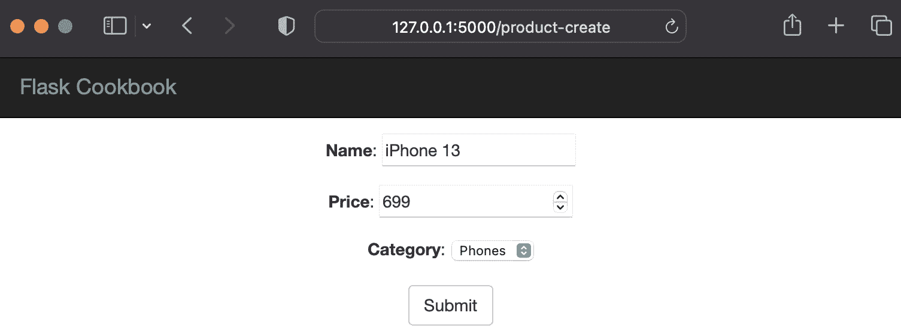
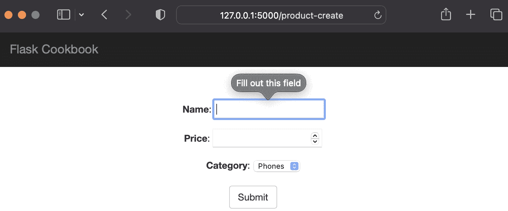
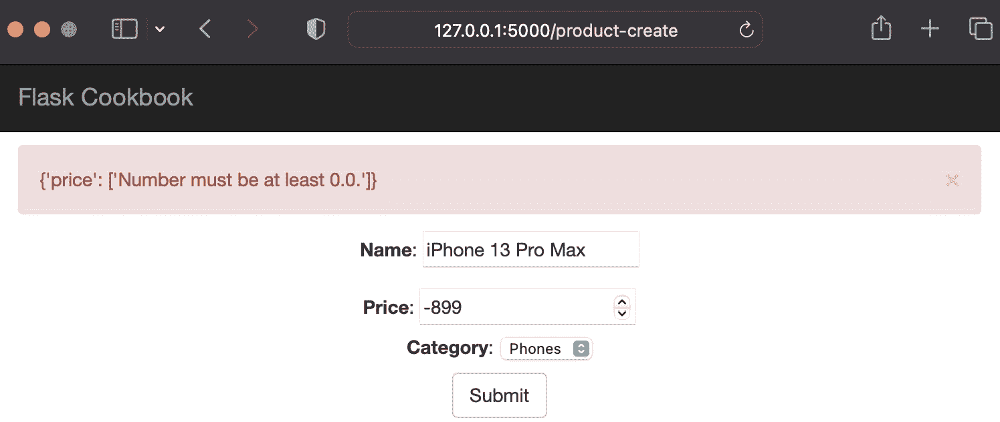
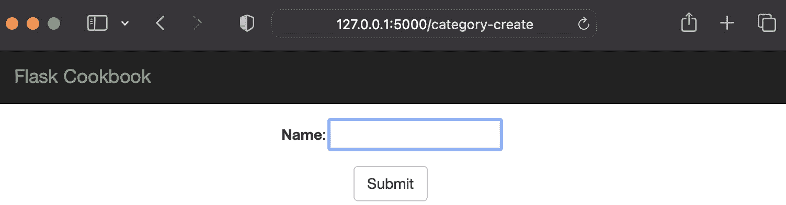
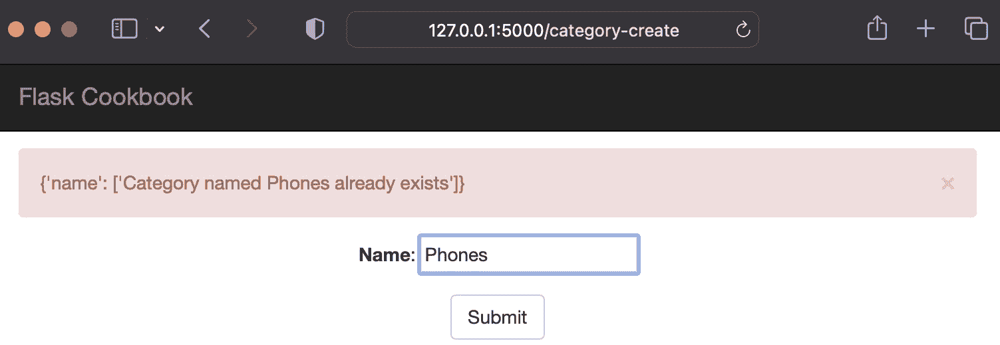
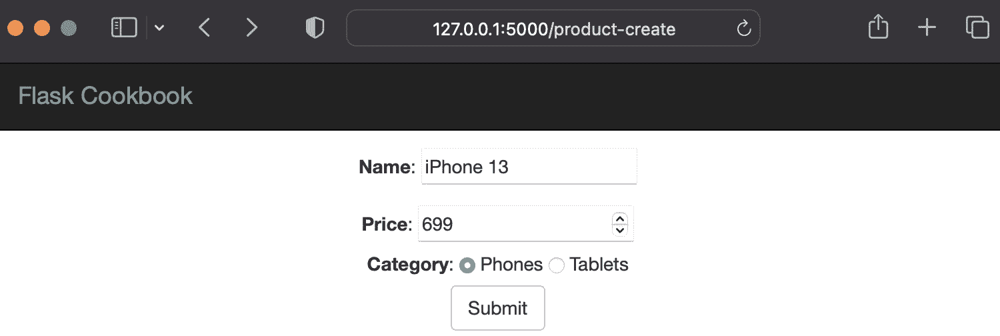
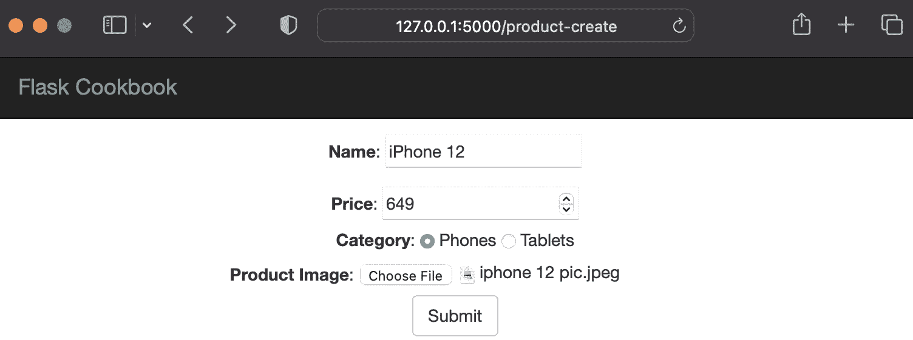
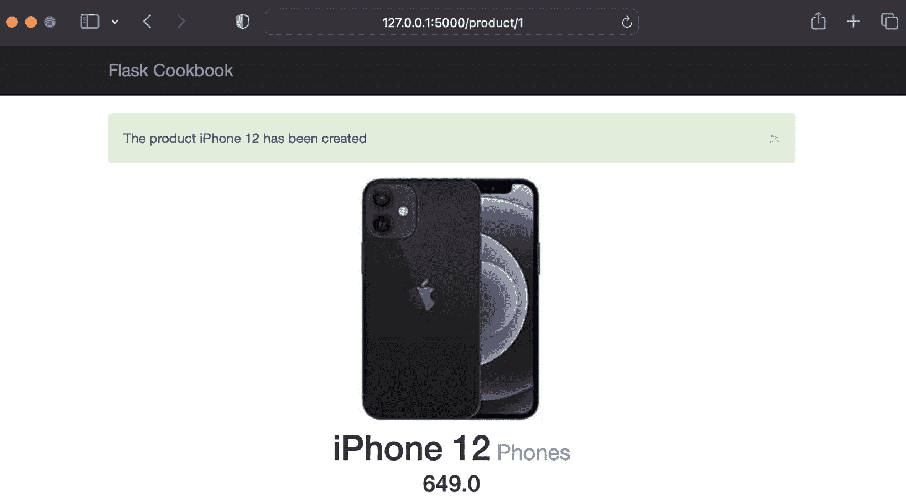
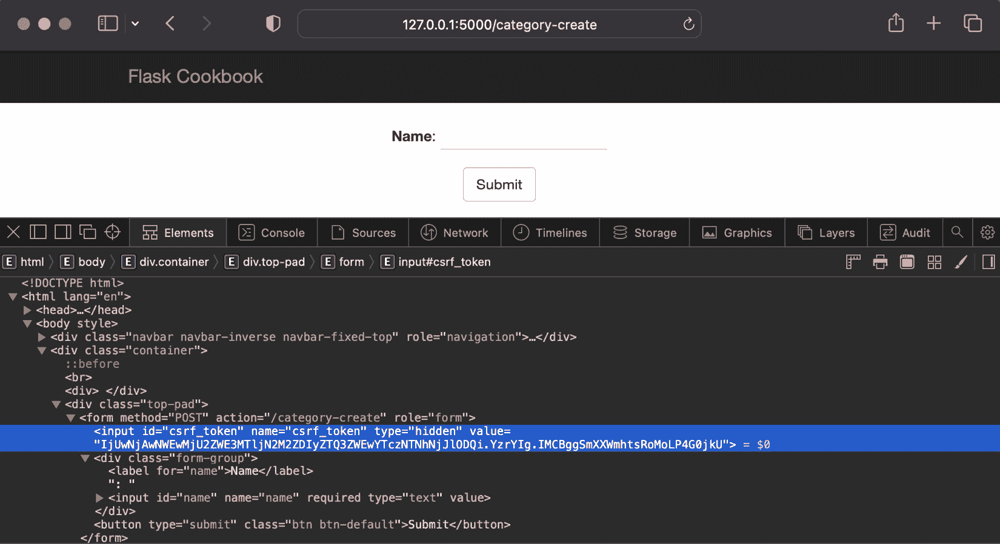

# 第五章：使用 WTForms 的 Web 表单

表单处理是任何 Web 应用程序的一个基本组成部分。可能会有无数的情况使得在任何 Web 应用程序中存在表单非常重要。一些情况可能包括用户需要登录或提交某些数据，或者应用程序可能需要从用户那里获取输入。尽管表单很重要，但它们的验证同样重要，甚至更重要。以交互式方式向用户展示这些信息将为应用程序增添很多价值。

我们有各种方法可以在 Web 应用程序中设计和实现表单。随着 Web 应用的成熟，表单验证和向用户传达正确信息变得非常重要。客户端验证可以通过 JavaScript 和 HTML5 在前端实现。服务器端验证在增加应用程序安全性方面扮演着更重要的角色，而不是用户交互。服务器端验证阻止任何错误数据进入数据库，从而遏制欺诈和攻击。

WTForms 默认提供许多带有服务器端验证的字段，因此提高了开发速度并减少了整体工作量。它还提供了灵活性，可以根据需要编写自定义验证和自定义字段。

在本章中，我们将使用一个 Flask 扩展。这个扩展被称为 Flask-WTF ([`flask-wtf.readthedocs.io/en/latest/`](https://flask-wtf.readthedocs.io/en/latest/))；它提供了 WTForms 和 Flask 之间的集成，负责处理重要和琐碎的事情，否则我们可能需要重新发明以使我们的应用程序安全有效。我们可以使用以下命令来安装它：

```py
$ pip install Flask-WTF
```

在本章中，我们将介绍以下菜谱：

+   将 SQLAlchemy 模型数据表示为表单

+   在服务器端验证字段

+   创建一个通用的表单集

+   创建自定义字段和验证

+   创建自定义小部件

+   通过表单上传文件

+   保护应用程序免受 **跨站请求伪造** （**CSRF**）的侵害

# 将 SQLAlchemy 模型数据表示为表单

首先，让我们使用 SQLAlchemy 模型构建一个表单。在本例中，我们将从本书之前使用的目录应用程序中获取产品模型，并添加功能，通过 Web 表单从前端创建产品。

## 准备工作

我们将使用来自 *第四章* 的目录应用程序，*与视图一起工作*，并将为 `Product` 模型开发一个表单。

## 如何做到这一点...

如果你还记得，`Product` 模型在 `models.py` 文件中的代码如下：

```py
class Product(db.Model):
    id = db.Column(db.Integer, primary_key=True)
    name = db.Column(db.String(255))
    price = db.Column(db.Float)
    category_id = db.Column(db.Integer,
      db.ForeignKey('category.id'))
    category = db.relationship(
        'Category', backref=db.backref('products',
          lazy='dynamic')
    )
```

首先，我们将在 `models.py` 中创建一个 `ProductForm` 类；这将继承 `FlaskForm` 类，它由 `flask_wtf` 提供，以表示 Web 表单上所需的字段：

```py
from wtforms import StringField, DecimalField, SelectField
from flask_wtf import FlaskForm
class ProductForm(FlaskForm):
    name = StringField('Name')
    price = DecimalField('Price')
    category = SelectField('Category', coerce=int)
```

我们从`flask-wtf`扩展中导入`FlaskForm`。其他所有内容，如`fields`和`validators`，都直接从`wtforms`导入。`Name`字段是`StringField`类型，因为它需要文本数据，而`Price`是`DecimalField`类型，它将数据解析为 Python 的`Decimal`数据类型。我们将`Category`保持为`SelectField`类型，这意味着在创建产品时，我们只能从之前创建的类别中选择。

信息

注意，我们在`Category`字段（这是一个选择列表）的定义中有一个名为`coerce`的参数；这意味着在验证或任何其他处理之前，来自 HTML 表单的传入数据将被强制转换为整数值。在这里，强制转换简单地说就是将特定数据类型中提供的值转换为不同的数据类型。

`views.py`中的`create_product()`处理程序现在应该适应之前创建的表单：

```py
from my_app.catalog.models import ProductForm
@catalog.route('/product-create', methods=['GET', 'POST'])
def create_product():
    form = ProductForm(meta={'csrf': False})
    categories = [(c.id, c.name) for c in
      Category.query.all()]
    form.category.choices = categories
    if request.method == 'POST':
        name = request.form.get('name')
        price = request.form.get('price')
        category = Category.query.get_or_404(
            request.form.get('category')
        )
        product = Product(name, price, category)
        db.session.add(product)
        db.session.commit()
        flash('The product %s has been created' % name,
          'success')
        return redirect(url_for('catalog.product',
          id=product.id))
    return render_template('product-create.html',
      form=form)
```

`create_product()`方法接受`POST`请求上的表单值。这个方法将在`GET`请求上渲染一个空表单，并在`Category`字段中预先填充选择。在`POST`请求上，表单数据将用于创建一个新的产品，当产品创建完成后，将显示新创建的产品页面。

信息

注意，在创建`form`对象时，`form = ProductForm(meta={'csrf': False})`，我们将`csrf`设置为`False`。CSRF 是任何安全 Web 应用程序的重要组成部分。我们将在本章的*保护应用程序免受 CSRF 攻击*菜谱中详细讨论这一点。

`templates/product-create.html`模板也需要一些修改。WTForms 创建的`form`对象提供了一个简单的方法来创建 HTML 表单并保持代码可读性：

```py


  <div class="top-pad">
    <form method="POST" action="{{
      url_for('catalog.create_product') }}" role="form">
      <div class="form-group">{{ form.name.label }}: {{
        form.name() }}</div>
      <div class="form-group">{{ form.price.label }}: {{
        form.price() }}</div>
      <div class="form-group">{{ form.category.label }}: {{
        form.category() }}</div>
      <button type="submit" class="btn btn-
        default">Submit</button>
    </form>
  </div>

```

## 它是如何工作的...

在一个`GET`请求上——也就是说，在打开`http://127.0.0.1:5000/product-create`时——我们将看到一个类似于以下截图中的表单：



图 5.1 - 使用 WTForms 创建产品表单

您可以填写此表单以创建新产品。

## 参见

参考以下*在服务器端验证字段*菜谱，了解如何验证我们刚刚学习创建的字段。

# 在服务器端验证字段

我们已经创建了表单和字段，但我们需要验证它们，以确保只有正确的数据通过到数据库，并且错误在之前得到处理，而不是破坏数据库。这些验证还可以保护应用程序免受**跨站脚本攻击**（**XSS**）和 CSRF 攻击。WTForms 提供了一大堆字段类型，这些类型本身就有默认的验证。除此之外，还有一些可以根据选择和需要使用的验证器。在这个菜谱中，我们将使用其中的一些来理解这个概念。

## 如何操作...

向我们的 WTForm 字段添加验证非常简单。我们只需要传递一个 `validators` 参数，它接受要实现的验证器列表。每个验证器都可以有自己的参数，这使得我们能够极大地控制验证。

让我们修改 `models.py` 类中的 `ProductForm` 对象以包含验证：

```py
from decimal import Decimal
class ProductForm(FlaskForm):
    name = StringField('Name',
      validators=[InputRequired()])
    price = DecimalField('Price', validators=[
        InputRequired(), NumberRange(min=Decimal('0.0'))
    ])
    category = SelectField(
        'Category', validators=[InputRequired()],
          coerce=int
    )
```

在这里，我们在所有三个字段上都有 `InputRequired` 验证器；这意味着这些字段是必需的，除非我们为这些字段提供了值，否则表单将不会提交。

`Price` 字段有一个额外的验证器 `NumberRange`，其 `min` 参数设置为 `0.0`。这意味着产品的价格不能小于 `0`。为了补充这些更改，我们还需要修改 `views.py` 中的 `create_product()` 方法：

```py
@catalog.route('/product-create', methods=['GET', 'POST'])
def create_product():
    form = ProductForm(meta={'csrf': False})
    categories = [(c.id, c.name) for c in
      Category.query.all()]
    form.category.choices = categories
    if form.validate_on_submit():
        name = form.name.data
        price = form.price.data
        category = Category.query.get_or_404(
            form.category.data
        )
        product = Product(name, price, category)
        db.session.add(product)
        db.session.commit()
        flash('The product %s has been created' % name,
          'success')
        return redirect(url_for('catalog.product',
          id=product.id))
    if form.errors:
        flash(form.errors, 'danger')
    return render_template('product-create.html',
      form=form)
```

小贴士

`form.errors` 的闪现将仅以 JSON 对象的形式显示错误。这可以被格式化以使用户看到令人愉悦的格式。这留给你自己尝试。

在这里，我们修改了 `create_product()` 方法，以便在提交时验证表单的输入值。一些验证将被翻译并应用到前端，就像 `InputRequired` 验证将添加一个 `required` 属性到表单字段的 HTML 中。在 `POST` 请求中，首先将验证表单数据。如果由于某些原因验证失败，将再次渲染相同的页面，并在其上闪现错误消息。如果验证成功并且产品创建完成，将显示新创建的产品页面。

注意

注意非常方便的 `validate_on_submit()` 方法。这个方法会自动检查请求是否为 `POST` 以及其是否有效。它本质上是将 `request.method == 'POST'` 和 `form.validate()` 的组合。

## 它是如何工作的...

现在，尝试提交一个没有任何字段填写（即空表单）的表单。将显示一个带有错误信息的警告消息，如下所示：



图 5.2 – WTForms 中的内置错误处理

如果你尝试提交一个带有负价格值的表单，闪现的错误将类似于以下截图：



图 5.3 – WTForms 中的自定义错误处理

尝试不同的表单提交组合，这些组合将违反定义的验证器，并注意出现的不同错误消息。

## 参见

参考之前的配方，*将 SQLAlchemy 模型数据表示为表单*，以了解使用 WTForms 创建基本表单的方法。

# 创建公共表单集

一个应用程序可以有多个表单，这取决于设计和目的。其中一些表单将具有共同的字段和共同的验证器。你可能会想，“*为什么不创建通用的表单部分并在需要时重用它们呢？*”在这个菜谱中，我们将看到使用 WTForms 提供的表单定义类结构，这确实是可能的。

## 如何实现...

在我们的目录应用程序中，我们可以有两个表单，每个分别对应 `Product` 和 `Category` 模型。这些表单将有一个共同的字段称为 `Name`。我们可以为这个字段创建一个通用的表单，然后 `Product` 和 `Category` 模型的单独表单可以使用这个表单，而不是在每个模型中都有一个 `Name` 字段。

这可以在 `models.py` 中如下实现：

```py
class NameForm(FlaskForm):
    name = StringField('Name',
      validators=[InputRequired()])
class ProductForm(NameForm):
    price = DecimalField('Price', validators=[
        InputRequired(), NumberRange(min=Decimal('0.0'))
    ])
    category = SelectField(
        'Category', validators=[InputRequired()],
          coerce=int
    )
class CategoryForm(NameForm):
    pass
```

我们创建了一个名为 `NameForm` 的通用表单，其他表单 `ProductForm` 和 `CategoryForm` 从这个表单继承，默认包含一个名为 `Name` 的字段。然后，我们可以根据需要添加更多字段。

我们可以修改 `views.py` 中的 `create_category()` 方法，使用 `CategoryForm` 来创建分类：

```py
@catalog.route('/category-create', methods=['GET', 'POST'])
def create_category():
    form = CategoryForm(meta={'csrf': False})
    if form.validate_on_submit():
        name = form.name.data
        category = Category(name)
        db.session.add(category)
        db.session.commit()
        flash(
            'The category %s has been created' % name,
              'success'
        )
        return redirect(url_for('catalog.category',
          id=category.id))
    if form.errors:
        flash(form.errors)
    return render_template('category-create.html',
      form=form)
```

还需要添加一个新的模板，`templates/category-create.html`，用于创建分类：

```py


  <div class="top-pad">
    <form method="POST" action="{{
      url_for('catalog.create_category') }}" role="form">
      <div class="form-group">{{ form.name.label }}: {{
        form.name() }}</div>
      <button type="submit" class="btn btn-
        default">Submit</button>
    </form>
  </div>

```

## 它是如何工作的...

在您的浏览器中打开 `http://127.0.0.1:5000/category-create` URL。新创建的分类表单将看起来像以下截图：



图 5.4 – 用于创建分类的通用表单

小贴士

这只是一个如何实现通用表单集的小例子。这种方法的实际好处可以在电子商务应用程序中看到，在那里我们可以有通用的地址表单，然后它们可以扩展为具有单独的账单和发货地址。

# 创建自定义字段和验证

除了提供一系列字段和验证之外，Flask 和 WTForms 还提供了创建自定义字段和验证的灵活性。有时，我们可能需要解析一些无法使用当前可用字段处理的数据格式。在这种情况下，我们可以实现自己的字段。

## 如何实现...

在我们的目录应用程序中，我们使用 `SelectField` 来处理分类，并在 `GET` 请求中通过查询 `Category` 模型来填充这个字段的值。如果我们不需要关心这一点，并且这个字段的填充可以自动完成，那就方便多了。

现在，让我们在 `models.py` 中实现一个自定义字段来完成这个功能：

```py
class CategoryField(SelectField):
    def iter_choices(self):
        categories = [(c.id, c.name) for c in
          Category.query.all()]
        for value, label in categories:
            yield (value, label, self.coerce(value) ==
              self.data)
    def pre_validate(self, form):
        for v, _ in [(c.id, c.name) for c in
          Category.query.all()]:
            if self.data == v:
                break
        else:
            raise ValueError(self.gettext('Not a valid
              choice'))
class ProductForm(NameForm):
    price = DecimalField('Price', validators=[
        InputRequired(), NumberRange(min=Decimal('0.0'))
    ])
    category = CategoryField(
        'Category', validators=[InputRequired()],
          coerce=int
    )
```

`SelectField` 实现了一个名为 `iter_choices()` 的方法，它使用提供给 `choices` 参数的值列表来填充表单。我们重写了 `iter_choices()` 方法，直接从数据库中获取分类的值，这样就消除了每次使用这个表单时都需要填充这个字段的必要性。

信息

`CategoryField`在这里创建的行为也可以使用`QuerySelectField`实现。有关更多信息，请参阅[`wtforms-sqlalchemy.readthedocs.io/en/stable/wtforms_sqlalchemy/#wtforms_sqlalchemy.fields.QuerySelectField`](https://wtforms-sqlalchemy.readthedocs.io/en/stable/wtforms_sqlalchemy/#wtforms_sqlalchemy.fields.QuerySelectField)。

由于本节中描述的更改，我们的`views.py`中的`create_product()`方法将需要进行修改。为此，只需删除以下两个填充表单中类别的语句：

```py
categories = [(c.id, c.name) for c in Category.query.all()]
form.category.choices = categories
```

## 工作原理...

应用程序上不会有任何视觉上的影响。唯一的变化将是类别在表单中的填充方式，如前节所述。

## 更多内容...

我们刚刚看到了如何编写自定义字段。同样，我们也可以编写自定义验证。假设我们不想允许重复的类别。我们可以在模型中轻松实现这一点，但让我们使用表单上的自定义验证器来完成：

```py
def check_duplicate_category(case_sensitive=True):
    def _check_duplicate(form, field):
        if case_sensitive:
            res = Category.query.filter(
                Category.name.like('%' + field.data + '%')
            ).first()
        else:
            res = Category.query.filter(
                Category.name.ilike('%' + field.data + '%')
            ).first()
        if res:
            raise ValidationError(
                'Category named %s already exists' %
                  field.data
            )
    return _check_duplicate
class CategoryForm(NameForm):
    name = StringField('Name', validators=[
        InputRequired(), check_duplicate_category()
    ])
```

因此，我们以工厂模式创建了我们的验证器，这样我们就可以根据是否需要大小写敏感的比较来获取单独的验证结果。我们甚至可以编写基于类的设计，这使得验证器更加通用和灵活，但我会把这个留给你去探索。

现在，如果你尝试创建一个与已存在的类别同名的新类别，将会显示以下错误：



图 5.5 – 创建重复类别时的错误

# 创建自定义组件

就像我们可以创建自定义字段和验证器一样，我们也可以创建自定义组件。这些组件允许我们控制字段在前端显示的方式。每个字段类型都关联着一个组件，WTForms 本身提供了大量的基本和 HTML5 组件。在本例中，为了理解如何编写自定义组件，我们将我们的自定义选择字段`Category`转换为单选字段。我同意那些认为我们可以直接使用 WTForms 提供的单选字段的人。在这里，我们只是在尝试理解如何自己完成它。

信息

WTForms 默认提供的组件可以在[`wtforms.readthedocs.io/en/3.0.x/widgets/`](https://wtforms.readthedocs.io/en/3.0.x/widgets/)找到。

## 如何操作...

在我们之前的示例中，我们创建了`CategoryField`。这个字段使用了`Select`组件，它是由`Select`超类提供的。让我们在`models.py`中将`Select`组件替换为单选输入：

```py
from wtforms.widgets import html_params, Select
from markupsafe import Markup
class CustomCategoryInput(Select):
    def __call__(self, field, **kwargs):
        kwargs.setdefault('id', field.id)
        html = []
        for val, label, selected in field.iter_choices():
            html.append(
                '<input type="radio" %s> %s' % (
                    html_params(
                        name=field.name, value=val,
                          checked=selected, **kwargs
                    ), label
                )
            )
        return Markup(' '.join(html))
class CategoryField(SelectField):
    widget = CustomCategoryInput()
    # Rest of the code remains same as in last recipe
      Creating custom field and validation
```

在这里，我们向`CategoryField`类添加了一个名为`widget`的类属性。这个组件指向`CustomCategoryInput`，它负责生成要渲染的字段的 HTML 代码。这个类有一个`__call__()`方法，它被重写以返回与`CategoryField`的`iter_choices()`方法提供的值相对应的单选输入。

## 工作原理...

当你打开产品创建页面，`http://127.0.0.1:5000/product-create`，它看起来如下所示：



图 5.6 – 用于类别选择的自定义小部件

## 参见

参考之前的菜谱，*创建自定义字段和验证*，以了解可以对 WTForms 的组件进行多少定制。

# 通过表单上传文件

通过表单上传文件，并且正确地做这件事，通常是许多网络框架关注的问题。在这个菜谱中，我们将看到 Flask 和 WTForms 如何以简单和流畅的方式为我们处理这个问题。

## 如何做...

在这个菜谱中，我们将实现一个在创建产品时存储产品图片的功能。首先，我们将从配置部分开始。我们需要向应用程序配置提供一个参数——即 `UPLOAD_FOLDER`。这个参数告诉 Flask 我们上传的文件将被存储的位置。

小贴士

存储产品图片的一种方法是将图片存储在数据库的二进制类型字段中，但这种方法效率非常低，在任何应用程序中都不推荐使用。我们应该始终在文件系统中存储图片和其他上传文件，并使用 `string` 字段在数据库中存储它们的路径。

将以下语句添加到 `my_app/__init__.py` 的配置中：

```py
import os
ALLOWED_EXTENSIONS = set(['txt', 'pdf', 'png', 'jpg',
  'jpeg', 'gif'])
app.config['UPLOAD_FOLDER'] = os.path.realpath('.') +
  '/my_app/static/uploads'
```

小贴士

注意 `app.config['UPLOAD_FOLDER']` 语句，我们在 `static` 文件夹内的一个子文件夹中存储图片。这将使渲染图片的过程更加容易。同时，注意 `ALLOWED_EXTENSIONS` 语句，它用于确保只有特定格式的文件通过。这里的列表实际上只是为了演示目的，对于图像类型，我们还可以进一步过滤这个列表。确保在 `app.config['UPLOAD_FOLDER']` 语句中指定的文件夹路径存在；否则，应用程序将出错。

在 `models` 文件中——即 `my_app/catalog/models.py` ——在其指定位置添加以下突出显示的语句：

```py
from flask_wtf.file import FileField, FileRequired
class Product(db.Model):
    image_path = db.Column(db.String(255))
    def __init__(self, name, price, category, image_path):
        self.image_path = image_path
class ProductForm(NameForm):
    image = FileField('Product Image',
      validators=[FileRequired()])
```

在 `ProductForm` 中检查 `image` 的 `FileField` 和 `Product` 模型的 `image_path` 字段。在这里，上传的文件将被存储在配置中定义的路径上的文件系统中，生成的路径将被存储在数据库中。

现在，修改 `create_product()` 方法，将文件保存在 `my_app/catalog/views.py` 中的 `my_app/catalog/views.py`：

```py
import os
from werkzeug.utils import secure_filename
from my_app import ALLOWED_EXTENSIONS
@catalog.route('/product-create', methods=['GET', 'POST'])
def create_product():
    form = ProductForm(meta={'csrf': False})
    if form.validate_on_submit():
        name = form.name.data
        price = form.price.data
        category = Category.query.get_or_404(
            form.category.data
        )
        image = form.image.data
        if allowed_file(image.filename):
            filename = secure_filename(image.filename)
            image.save(os.path.join(app.config
              ['UPLOAD_FOLDER'], filename))
        product = Product(name, price, category, filename)
        db.session.add(product)
        db.session.commit()
        flash('The product %s has been created' % name,
          'success')
        return redirect(url_for('catalog.product',
          id=product.id))
    if form.errors:
        flash(form.errors, 'danger')
    return render_template('product-create.html',
      form=form)
```

将新字段添加到 `template templates/product-create.html` 中的产品创建表单。修改 `form` 标签定义以包含 `enctype` 参数，并在 **提交** 按钮之前（或您认为表单内任何必要的位置）添加字段：

```py
<form method="POST"
        action="{{ url_for('catalog.create_product') }}"
        role="form"
        enctype="multipart/form-data">
      <!-- The other field definitions as always -->
      <div class="form-group">{{ form.image.label }}: {{
        form.image(style='display:inline;') }}</div>
      <button type="submit" class="btn btn-
        default">Submit</button>
    </form>
```

表单应该有 `enctype="multipart/form-data"` 语句来告诉应用程序表单输入将包含多部分数据。

渲染图像非常简单，因为我们把文件存储在 `static` 文件夹本身。只需在 `templates/product.html` 中需要显示图像的地方添加 `img` 标签：

```py

```

## 它是如何工作的...

上传图像的字段看起来可能如下面的截图所示：



图 5.7 – 上传产品图像的文件

在创建产品后，图像将显示，如下面的截图所示：



图 5.8 – 上传文件的产品页面

# 保护应用程序免受 CSRF 攻击

在本章的第一个配方中，我们了解到 CSRF 是网络表单安全的重要组成部分。现在我们将详细讨论这个问题。CSRF 基本上意味着有人可以黑入携带 cookie 的请求并使用它来触发破坏性操作。我们不会在这里详细讨论 CSRF，因为互联网上有大量资源可以学习它。我们将讨论 WTForms 如何帮助我们防止 CSRF。Flask 默认不提供 CSRF 的安全措施，因为这需要在表单验证级别处理，而这不是 Flask 作为框架的核心功能。然而，在本配方中，我们将看到 Flask-WTF 扩展如何为我们完成这项工作。

信息

更多关于 CSRF 的信息可以在 [`owasp.org/www-community/attacks/csrf`](https://owasp.org/www-community/attacks/csrf) 找到。

## 如何做到这一点...

Flask-WTF 默认提供的是一个 CSRF-受保护的表单。如果我们查看到目前为止的配方，我们可以看到我们已经明确告诉我们的表单不要进行 CSRF-保护。我们只需要移除相应的语句来启用 CSRF。

因此，`form = ProductForm(meta={'csrf': False})` 将变为 `form = ProductForm()`。

一些配置位也需要在我们的应用程序中进行设置：

```py
app.config['WTF_CSRF_SECRET_KEY'] = 'random key for form'
```

默认情况下，CSRF 密钥与我们的应用程序的密钥相同。

启用 CSRF 后，我们将在我们的表单中提供一个额外的字段；这是一个隐藏字段，包含 CSRF 令牌。WTForms 会为我们处理隐藏字段，我们只需要在我们的表单中添加 `{{ form.csrf_token }}`：

```py
<form method="POST" action="/some-action-like-create-
  product">
    {{ form.csrf_token }}
</form>
```

这很简单！现在，这并不是我们唯一提交的表单提交类型。我们还提交 AJAX 表单帖子；自从基于 JavaScript 的网络应用程序出现以来，这实际上比普通表单发生得更多，因为它们正在取代传统的网络应用程序。

为了做到这一点，我们需要在我们的应用程序配置中包含另一个步骤：

```py
from flask_wtf.csrf import CSRFProtect
#
# Add configurations #
CSRFProtect(app)
```

之前的配置将允许我们在模板的任何地方使用 `{{ csrf_token() }}` 访问 CSRF 令牌。现在，有两种方法可以将 CSRF 令牌添加到 AJAX `POST` 请求中。

一种方法是在我们的 `script` 标签中获取 CSRF 令牌并在 `POST` 请求中使用它：

```py
<script type="text/javascript">
    var csrfToken = "{{ csrf_token() }}";
</script>
```

另一种方法是在 `meta` 标签中渲染令牌并在需要时使用它：

```py
<meta name="csrf-token" content="{{ csrf_token() }}"/>
```

两种方法之间的区别在于，第一种方法可能需要根据应用程序中 `script` 标签的数量在多个地方重复。

现在，为了将 CSRF 令牌添加到 AJAX `POST` 请求中，我们必须向其中添加 `X-CSRFToken` 属性。此属性的值可以从这里提到的两种方法中的任何一种获取。我们将采用第二种方法作为我们的示例：

```py
$.ajaxSetup({
    beforeSend: function(xhr, settings) {
        if (!/^(GET|HEAD|OPTIONS|TRACE)$/i
          .test(settings.type)) {
            xhr.setRequestHeader("X-CSRFToken", csrftoken)
        }
    }
})
```

这将确保 CSRF 令牌被添加到所有发出的 AJAX `POST` 请求中。

## 它是如何工作的...

以下截图显示了 WTForms 在我们的表单中添加的 CSRF 令牌的外观：



图 5.9 – CSRF 令牌

令牌是完全随机的，对于所有请求都是不同的。有多种实现 CSRF 令牌生成的方法，但这超出了本书的范围，尽管我鼓励你自己探索一些替代实现来了解它是如何完成的。
