# 6

# 在 Flask 中进行身份验证

身份验证是任何应用程序的重要组成部分，无论是基于 Web、桌面还是移动应用程序。每种类型的应用程序在处理用户身份验证方面都有一定的最佳实践。在基于 Web 的应用程序中，特别是 **软件即服务**（**SaaS**）应用程序，这个过程至关重要，因为它充当着应用程序安全与不安全的薄红线。

为了保持简单和灵活，Flask 默认不提供任何身份验证机制。它必须由我们，即开发者，根据我们的需求和应用程序的需求来实现。

为您的应用程序进行用户身份验证可以有多种方式。它可以是一个简单的基于会话的实现，或者是一个更安全的通过 `Flask-Login` 扩展的方法。我们还可以通过集成流行的第三方服务，如 **轻量级目录访问协议**（**LDAP**）或社交登录，如 Facebook、Google 等，来实现身份验证。在本章中，我们将介绍所有这些方法。

在本章中，我们将涵盖以下食谱：

+   创建简单的基于会话的身份验证

+   使用 Flask-Login 扩展进行身份验证

+   使用 Facebook 进行身份验证

+   使用 Google 进行身份验证

+   使用 Twitter 进行身份验证

+   使用 LDAP 进行身份验证

# 创建简单的基于会话的身份验证

在基于会话的身份验证中，当用户首次登录时，用户详细信息被设置在应用程序服务器的会话中，并存储在浏览器的 cookie 中。

之后，当用户打开应用程序时，存储在 cookie 中的详细信息将用于与会话进行核对，如果会话仍然活跃，用户将自动登录。

信息

`SECRET_KEY` 是一个应用程序配置设置，应始终在您的应用程序配置中指定；否则，存储在 cookie 中的数据以及服务器端的会话都将以纯文本形式存在，这非常不安全。

我们将实现一个简单的机制来自行完成。

小贴士

本食谱中实现的方案旨在解释身份验证在较低级别是如何工作的。这种方法**不应**在任何生产级应用程序中采用。

## 准备工作

我们将从 Flask 应用程序配置开始，正如在 *第五章* 中所看到的，*使用 WTForms 的 Web 表单*。

## 如何操作...

配置应用程序以使用 SQLAlchemy 和 WTForms 扩展（有关详细信息，请参阅上一章）。按照以下步骤了解如何操作：

1.  在开始进行身份验证之前，首先创建一个模型来存储用户详细信息。这通过在 `flask_authentication/my_app/auth/models.py` 中创建模型来实现，如下所示：

    ```py
    from werkzeug.security import generate_password_hash, check_password_hash
    ```

    ```py
    from flask_wtf import FlaskForm
    ```

    ```py
    from wtforms import StringField, PasswordField
    ```

    ```py
    from wtforms.validators import InputRequired, EqualTo
    ```

    ```py
    from my_app import db
    ```

    ```py
    class User(db.Model):
    ```

    ```py
        id = db.Column(db.Integer, primary_key=True)
    ```

    ```py
        username = db.Column(db.String(100))
    ```

    ```py
        pwdhash = db.Column(db.String())
    ```

    ```py
        def __init__(self, username, password):
    ```

    ```py
            self.username = username
    ```

    ```py
            self.pwdhash = generate_password_hash(password)
    ```

    ```py
        def check_password(self, password):
    ```

    ```py
            return check_password_hash(self.pwdhash, password)
    ```

上述代码是`User`模型，它有两个字段：`username`和`pwdhash`。`username`字段正如其名所示。`pwdhash`字段存储密码的加盐散列，因为直接在数据库中存储密码是不推荐的。

1.  然后，在`flask_authentication/my_app/auth/models.py`中创建两个表单 – 一个用于用户注册，另一个用于登录。在`RegistrationForm`中创建两个`PasswordField`类型的字段，就像任何其他网站的注册一样；这是为了确保用户在两个字段中输入相同的密码，如下面的代码片段所示：

    ```py
    class RegistrationForm(FlaskForm):
    ```

    ```py
        username = StringField('Username', [InputRequired()])
    ```

    ```py
        password = PasswordField(
    ```

    ```py
            'Password', [
    ```

    ```py
                InputRequired(), EqualTo('confirm', 
    ```

    ```py
                message='Passwords must match')
    ```

    ```py
            ]
    ```

    ```py
        )
    ```

    ```py
        confirm = PasswordField('Confirm Password', 
    ```

    ```py
          [InputRequired()])
    ```

    ```py
    class LoginForm(FlaskForm):
    ```

    ```py
        username = StringField('Username', [InputRequired()])
    ```

    ```py
        password = PasswordField('Password', [InputRequired()])
    ```

1.  接下来，在`flask_authentication/my_app/auth/views.py`中创建视图来处理用户对注册和登录的请求，如下所示：

    ```py
    from flask import request, render_template, flash, redirect, url_for, session, Blueprint
    ```

    ```py
    from my_app import app, db
    ```

    ```py
    from my_app.auth.models import User, RegistrationForm, LoginForm
    ```

    ```py
    auth = Blueprint('auth', __name__)
    ```

    ```py
    @auth.route('/')
    ```

    ```py
    @auth.route('/home')
    ```

    ```py
    def home():
    ```

    ```py
        return render_template('home.html')
    ```

    ```py
    @auth.route('/register', methods=['GET', 'POST'])
    ```

    ```py
    def register():
    ```

    ```py
        if session.get('username'):
    ```

    ```py
            flash('Your are already logged in.', 'info')
    ```

    ```py
            return redirect(url_for('auth.home'))
    ```

    ```py
        form = RegistrationForm()
    ```

    ```py
        if form.validate_on_submit():
    ```

    ```py
            username = request.form.get('username')
    ```

    ```py
            password = request.form.get('password')
    ```

    ```py
            existing_username = User.query.filter(
    ```

    ```py
                User.username.like('%' + username + '%')
    ```

    ```py
            ).first()
    ```

    ```py
            if existing_username:
    ```

    ```py
                flash(
    ```

    ```py
                    'This username has been already taken. Try 
    ```

    ```py
                    another one.',
    ```

    ```py
                    'warning'
    ```

    ```py
                )
    ```

    ```py
                return render_template('register.html', form=form)
    ```

    ```py
            user = User(username, password)
    ```

    ```py
            db.session.add(user)
    ```

    ```py
            db.session.commit()
    ```

    ```py
            flash('You are now registered. Please login.', 
    ```

    ```py
            'success')
    ```

    ```py
            return redirect(url_for('auth.login'))
    ```

    ```py
        if form.errors:
    ```

    ```py
            flash(form.errors, 'danger')
    ```

    ```py
        return render_template('register.html', form=form)
    ```

前面的方法处理用户注册。在`GET`请求中，向用户显示注册表单；这个表单要求输入`username`和`password`。然后，在`POST`请求中，在表单验证完成后检查`username`的唯一性。如果`username`不唯一，用户会被要求选择一个新的`username`；否则，在数据库中创建一个新的用户，并将其重定向到登录页面。

注册成功后，用户会被重定向到登录页面，这由以下代码处理：

```py
@auth.route('/login', methods=['GET', 'POST'])
def login():
    form = LoginForm()
    if form.validate_on_submit():
        username = request.form.get('username')
        password = request.form.get('password')
        existing_user = User.query.filter_by(username=username).
        first()
        if not (existing_user and existing_user.check_
        password(password)):
            flash('Invalid username or password. Please try again.', 
            'danger')
            return render_template('login.html', form=form)
        session['username'] = username
        flash('You have successfully logged in.', 'success')
        return redirect(url_for('auth.home'))
    if form.errors:
        flash(form.errors, 'danger')
    return render_template('login.html', form=form)
```

前面的方法处理用户登录。在表单验证后，它首先检查数据库中是否存在`username`。如果不存在，它会要求用户输入正确的用户名。同样，它检查密码是否正确。如果不正确，它会要求用户输入正确的密码。如果所有检查都通过，会话中就会填充一个`username`键，它包含用户的用户名。这个键在会话中的存在表示用户已登录。考虑以下代码：

```py
@auth.route('/logout')
def logout():
    if 'username' in session:
        session.pop('username')
        flash('You have successfully logged out.', 'success')
    return redirect(url_for('auth.home'))
```

一旦我们理解了`login()`方法，前面的方法就变得不言而喻了。在这里，我们只是从会话中弹出了`username`键，用户就自动登出了。

接下来，创建由之前创建的注册和登录处理程序渲染的模板。

`flask_authentication/my_app/templates/base.html`模板几乎与*第五章*中“使用 WTForms 的 Web 表单”相同。唯一的改变将是路由，其中`catalog`将被替换为`auth`。

首先，创建一个简单的首页，`flask_authentication/my_app/templates/home.html`，如下代码所示。这反映了用户是否已登录，如果用户未登录，则显示注册和登录链接：

```py


  <h1>Welcome to the Authentication Demo</h1>
  
    <h3>Hey {{ session.username }}!!</h3>
    <a href="{{ url_for('auth.logout') }}">Click here to logout</a>
  
  Click here to <a href="{{ url_for('auth.login') }}">login</a> or <a 
  href="{{ url_for('auth.register') }}">register</a>
  

```

现在创建一个注册页面，`flask_authentication/my_app/templates/register.html`，如下：

```py


  <div class="top-pad">
    <form
        method="POST"
        action="{{ url_for('auth.register') }}"
        role="form">
      {{ form.csrf_token }}
      <div class="form-group">{{ form.username.label }}: {{ form.
      username() }}</div>
      <div class="form-group">{{ form.password.label }}: {{ form.
      password() }}</div>
      <div class="form-group">{{ form.confirm.label }}: {{ form.
      confirm() }}</div>
      <button type="submit" class="btn btn-default">Submit</button>
    </form>
  </div>

```

最后，创建一个简单的登录页面，`flask_authentication/my_app/templates/login.html`，以下代码：

```py


  <div class="top-pad">
    <form
        method="POST"
        action="{{ url_for('auth.login') }}"
        role="form">
      {{ form.csrf_token }}
      <div class="form-group">{{ form.username.label }}: {{ form.
      username() }}</div>
      <div class="form-group">{{ form.password.label }}: {{ form.
      password() }}</div>
      <button type="submit" class="btn btn-default">Submit</button>
    </form>
  </div>

```

## 它是如何工作的...

本节通过截图展示了该应用程序的工作原理。

以下截图显示了在打开 `http://127.0.0.1:5000/home` 时出现的首页：

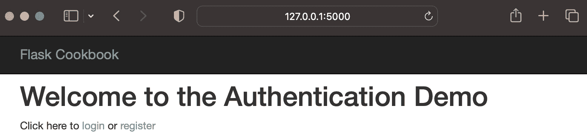

图 6.1 – 对未登录用户可见的首页

在打开 `http://127.0.0.1:5000/register` 时出现的注册页面如下截图所示：

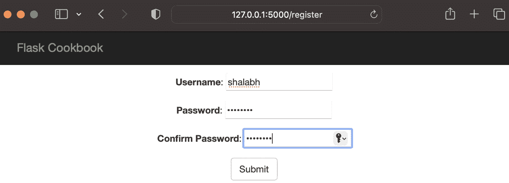

图 6.2 – 注册表单

注册后，在打开 `http://127.0.0.1:5000/login` 时将显示登录页面，如下截图所示：

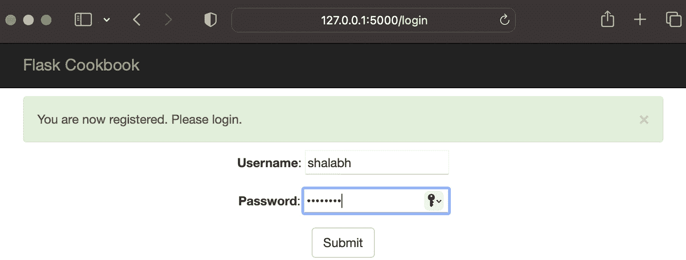

图 6.3 – 成功注册后渲染的登录页面

最后，在 `http://127.0.0.1:5000/home` 上向已登录用户展示首页，如下截图所示：

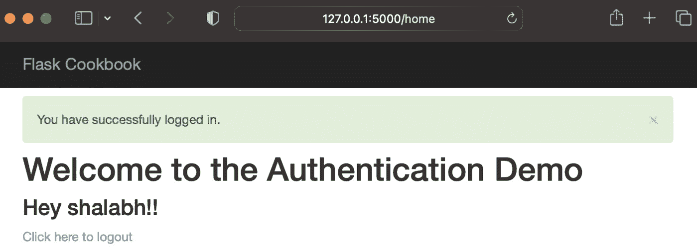

图 6.4 – 展示给已登录用户的首页

## 参见

下一个菜谱，*使用 Flask-Login 扩展进行身份验证*，将介绍一种更安全和适用于生产的用户身份验证方法。

# 使用 Flask-Login 扩展进行身份验证

在我们之前的菜谱中，我们学习了如何自己实现基于会话的身份验证。`Flask-Login` 是一个流行的扩展，以有用且高效的方式处理了许多相同的事情，因此我们不必再次从头开始重新发明轮子。此外，`Flask-Login` 不会将我们绑定到任何特定的数据库，也不会限制我们使用任何特定的字段或方法进行身份验证。它还可以处理 `Flask-Login` 与我们的应用程序。

## 准备中

修改上一道菜谱中创建的应用程序，以适应 `Flask-Login` 扩展所做的更改。

在此之前，我们必须使用以下命令安装该扩展本身：

```py
$ pip install Flask-Login
```

## 如何操作...

按照以下步骤了解如何将 `Flask-Login` 集成到 Flask 应用程序中：

1.  要使用 `Flask-Login`，首先，修改应用程序的配置，该配置位于 `flask_authentication/my_app/__init__.py` 中，如下所示：

    ```py
    from flask_login import LoginManager
    ```

    ```py
    #
    ```

    ```py
    # Do other application configurations
    ```

    ```py
    #
    ```

    ```py
    login_manager = LoginManager()
    ```

    ```py
    login_manager.init_app(app)
    ```

    ```py
    login_manager.login_view = 'auth.login'
    ```

在前面的代码片段中，在从扩展中导入 `LoginManager` 类之后，我们创建了该类的对象。然后，我们使用 `init_app()` 配置 `app` 对象以与 `LoginManager` 一起使用。在 `login_manager` 对象中，可以根据需要执行多个配置。在这里，我们只演示了一个基本且必需的配置，即 `login_view`，它指向登录请求的处理视图。此外，我们还可以配置显示给用户的消息，例如会话将持续多长时间，使用请求头处理登录等。有关更多详细信息，请参阅 [`flask-login.readthedocs.org/en/latest/#customizing-the-login-process`](https://flask-login.readthedocs.org/en/latest/#customizing-the-login-process) 的 `Flask-Login` 文档。

1.  `Flask-Login`要求在`my_app/auth/models.py`中的`User`模型/类中添加一些额外的方法，如下面的代码片段所示：

    ```py
        @property
    ```

    ```py
        def is_authenticated(self):
    ```

    ```py
            return True
    ```

    ```py
        @property
    ```

    ```py
        def is_active(self):
    ```

    ```py
            return True
    ```

    ```py
        @property
    ```

    ```py
        def is_anonymous(self):
    ```

    ```py
            return False
    ```

    ```py
        def get_id(self):
    ```

    ```py
            return str(self.id)
    ```

在前面的代码中，我们添加了四个方法，下面将逐一解释：

+   `is_authenticated()`: 这个属性返回`True`。只有在不想让用户认证的情况下，它才应该返回`False`。

+   `is_active()`: 这个属性返回`True`。只有在用户被阻止或禁止的情况下，它才应该返回`False`。

+   `is_anonymous()`: 这个属性用于指示不应登录到系统并应作为匿名用户访问应用程序的用户。对于常规登录用户，它应该返回`False`。

+   `get_id()`: 这个方法代表用于识别用户的唯一`ID`。这应该是一个 Unicode 值。

信息

在实现`用户`类时，没有必要实现所有讨论的方法和属性。为了简化操作，你可以始终从`flask_login`中的`UserMixin`类进行子类化，该类已经为我们提到的方法和属性提供了默认实现。有关更多信息，请访问[`flask-login.readthedocs.io/en/latest/#flask_login.UserMixin`](https://flask-login.readthedocs.io/en/latest/#flask_login.UserMixin)。

1.  接下来，对`my_app/auth/views.py`中的视图进行以下修改：

    ```py
    from flask import g
    ```

    ```py
    from flask_login import current_user, login_user, logout_user, \
    ```

    ```py
        login_required
    ```

    ```py
    from my_app import login_manager
    ```

    ```py
    @login_manager.user_loader
    ```

    ```py
    def load_user(id):
    ```

    ```py
        return User.query.get(int(id))
    ```

    ```py
    @auth.before_request
    ```

    ```py
    def get_current_user():
    ```

    ```py
        g.user = current_user
    ```

在前面的方法中，`@auth.before_request`装饰器意味着每当收到请求时，该方法将在视图函数之前被调用。

1.  在以下代码片段中，我们已经记录了我们的登录用户：

    ```py
    @auth.route('/login', methods=['GET', 'POST'])
    ```

    ```py
    def login():
    ```

    ```py
        if current_user.is_authenticated:
    ```

    ```py
            flash('You are already logged in.', 'info')
    ```

    ```py
            return redirect(url_for('auth.home'))
    ```

    ```py
        form = LoginForm()
    ```

    ```py
        if form.validate_on_submit():
    ```

    ```py
            username = request.form.get('username')
    ```

    ```py
            password = request.form.get('password')
    ```

    ```py
            existing_user = User.query.filter_by(username=username).
    ```

    ```py
            first()
    ```

    ```py
            if not (existing_user and existing_user.check_
    ```

    ```py
            password(password)):
    ```

    ```py
                flash('Invalid username or password. Please try 
    ```

    ```py
                again.', 'danger')
    ```

    ```py
                return render_template('login.html', form=form)
    ```

    ```py
            login_user(existing_user)
    ```

    ```py
            flash('You have successfully logged in.', 'success')
    ```

    ```py
            return redirect(url_for('auth.home'))
    ```

    ```py
        if form.errors:
    ```

    ```py
            flash(form.errors, 'danger')
    ```

    ```py
        return render_template('login.html', form=form)
    ```

    ```py
    @auth.route('/logout')
    ```

    ```py
    @login_required
    ```

    ```py
    def logout():
    ```

    ```py
        logout_user()
    ```

    ```py
        return redirect(url_for('auth.home'))
    ```

注意，现在在`login()`中，我们在做其他任何事情之前都会检查`current_user`是否已认证。在这里，`current_user`是一个代理，代表当前登录的`User`记录的对象。在完成所有验证和检查后，用户将使用`login_user()`方法登录。此方法接受`user`对象，并处理登录用户所需的全部会话相关活动。

现在，如果我们继续到`logout()`方法，我们可以看到为`login_required()`添加了一个装饰器。这个装饰器确保在执行此方法之前用户已经登录。它可以用于我们应用程序中的任何视图方法。要注销用户，我们只需调用`logout_user()`，这将清理当前登录用户的会话，从而注销用户。

由于我们不自行处理会话，因此需要根据以下代码片段对模板进行一些小的修改。这发生在我们想要检查用户是否已登录以及是否需要向他们显示特定内容时：

```py

...do something...

```

## 它是如何工作的…

本食谱中的演示与上一个食谱中创建的简单基于会话的认证完全相同，*创建一个简单的基于会话的认证*。只有实现方式不同，但最终结果保持不变。

## 还有更多...

`Flask-Login`扩展使得将`remember=True`参数应用到`login_user()`方法上成为可能。这将在一个用户的电脑上保存一个 cookie，如果会话是活跃的，`Flask-Login`将使用这个 cookie 自动登录用户。你应该尝试自己实现这一功能。

## 另请参阅

参考之前的食谱，*创建简单的基于会话的认证*，以了解本食谱的完整工作原理。

Flask 提供了一个名为`g`的特殊对象。你可以在[`flask.palletsprojects.com/en/2.2.x/api/#flask.g`](https://flask.palletsprojects.com/en/2.2.x/api/#flask.g)了解更多相关信息。

另一种有趣的认证方式是使用 JWT 令牌，其工作方式与`Flask-Login`非常相似。更多详情请参阅[`flask-jwt-extended.readthedocs.io/en/stable/`](https://flask-jwt-extended.readthedocs.io/en/stable/)。

# 使用 Facebook 进行认证

你可能已经注意到许多网站提供了使用第三方身份验证（如 Facebook、Google、Twitter、LinkedIn 等）登录自己网站的选择。这是通过**OAuth 2**实现的，它是一个授权的开放标准。它允许客户端站点使用访问令牌来访问资源服务器（如 Google、Facebook 等）提供的受保护信息和资源。在本食谱中，我们将向你展示如何通过 Facebook 实现基于 OAuth 的授权。在后续的食谱中，我们将使用其他提供者做同样的事情。

信息

OAuth 是一种机制，允许用户在不共享密码的情况下，授予网站或应用程序访问其他网站（如 Google、Facebook、Twitter 等）上其信息的能力。本质上意味着第三方客户端应用程序（你的 Flask 应用程序）通过资源服务器（Google、Facebook 等）的认证引擎在资源所有者（用户）批准后，通过访问令牌获取存储在资源服务器上的数据。

## 准备工作

OAuth 2 仅与 SSL 一起工作，因此应用程序应该使用 HTTPS 运行。要在本地机器上这样做，请按照以下步骤操作：

1.  使用`$ pip3 install`命令安装`pyopenssl`。

1.  向`app.run()`添加额外的选项，包括带有`adhoc`值的`ssl_context`。完成的`app.run`应该如下所示：`app.run(debug=True, ssl_context='adhoc')`。

1.  一旦进行了这些更改，请使用 URL `https://localhost:5000/` 运行应用程序。在应用程序加载之前，你的浏览器将显示有关证书不安全的警告。只需接受警告并继续即可。

小贴士

这不是一个推荐的方法。在生产系统中，SSL 证书应该从适当的认证机构获取。

要安装`Flask-Dance`并生成 Facebook 凭证，请按照以下步骤操作：

1.  首先，使用以下命令安装`Flask-Dance`扩展及其依赖项：

    ```py
    $ pip3 install Flask-Dance
    ```

1.  接下来，注册一个用于登录的 Facebook 应用程序。尽管在 Facebook 应用程序上注册的过程相当直接且易于理解，但在此情况下，我们只关注以下截图中的 **App ID**、**App secret** 和 **Site URL** 选项（更多信息可以在 Facebook 开发者页面 [`developers.facebook.com/`](https://developers.facebook.com/) 上找到）：

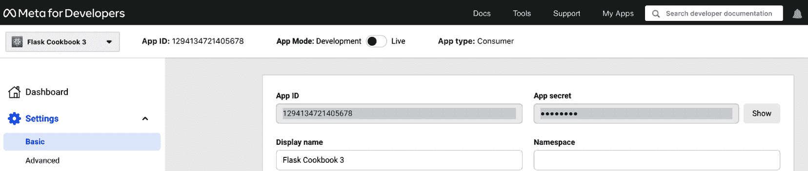

图 6.5 – Facebook 应用程序凭据

在配置 Facebook 时，请确保将网站 URL 配置为 `https://localhost:5000/` 以完成本食谱，并配置有效的 OAuth 重定向 URI，如下截图所示：

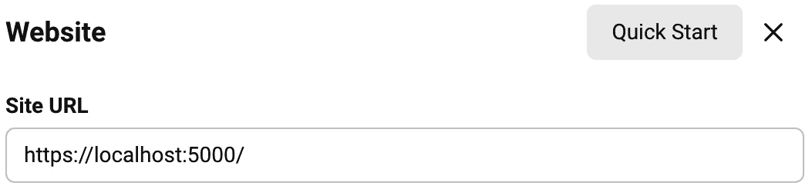

图 6.6 – Facebook 网站 URL 配置

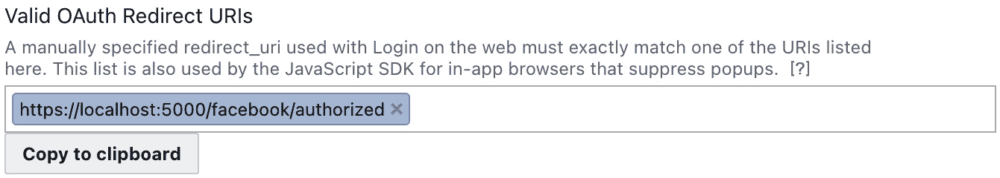

图 6.7 – Facebook OAuth 重定向 URI 配置

## 如何操作...

要为您的应用程序启用 Facebook 认证，请按照以下步骤操作：

1.  如往常一样，从 `my_app/__init__.py` 中的配置部分开始。添加以下代码行；除非你确信更改，否则不要删除或编辑其他任何内容：

    ```py
    app.config["FACEBOOK_OAUTH_CLIENT_ID"] = 'my facebook APP ID'
    ```

    ```py
    app.config["FACEBOOK_OAUTH_CLIENT_SECRET"] = 'my facebook app secret'
    ```

    ```py
    from my_app.auth.views import facebook_blueprint
    ```

    ```py
    app.register_blueprint(auth)
    ```

    ```py
    app.register_blueprint(facebook_blueprint)
    ```

在前面的代码片段中，我们使用 Flask-Dance 和我们的应用程序进行认证。这个蓝图将在 `views` 文件中创建，我们将在下一节中介绍。

1.  现在修改视图，即 `my_app/auth/views.py`，如下所示：

    ```py
        from flask_dance.contrib.facebook import
    ```

    ```py
          make_facebook_blueprint, facebook
    ```

    ```py
        facebook_blueprint =
    ```

    ```py
          make_facebook_blueprint(scope='email',
    ```

    ```py
          redirect_to='auth.facebook_login')
    ```

`make_facebook_blueprint` 从应用程序配置中读取 `FACEBOOK_OAUTH_CLIENT_ID` 和 `FACEBOOK_OAUTH_CLIENT_SECRET`，并在后台处理所有 OAuth 相关操作。在创建 Facebook 蓝图时，我们将 `scope` 设置为 `email`，这样电子邮件地址就可以用作唯一的用户名。我们还设置了 `redirect_to` 为 `auth.facebook_login`，这样一旦认证成功，Facebook 就会将应用程序重定向回这个 URL。如果没有设置此选项，应用程序将自动重定向到主页，即 `/`。

1.  现在，创建一个新的路由处理程序来处理使用 Facebook 的登录，如下所示：

    ```py
    @auth.route("/facebook-login")
    ```

    ```py
    def facebook_login():
    ```

    ```py
        if not facebook.authorized:
    ```

    ```py
            return redirect(url_for("facebook.login"))
    ```

    ```py
        resp = facebook.get("/me?fields=name,email")
    ```

    ```py
        user = User.query.filter_by(username
    ```

    ```py
          =resp.json()["email"]).first()
    ```

    ```py
        if not user:
    ```

    ```py
            user = User(resp.json()["email"], '')
    ```

    ```py
            db.session.add(user)
    ```

    ```py
            db.session.commit()
    ```

    ```py
        login_user(user)
    ```

    ```py
        flash(
    ```

    ```py
            'Logged in as name=%s using Facebook login' % (
    ```

    ```py
                resp.json()['name']), 'success' )
    ```

    ```py
        return redirect(request.args.get('next',
    ```

    ```py
          url_for('auth.home')))
    ```

此方法首先检查用户是否已经通过 Facebook 授权。如果没有，它将应用程序重定向到 Facebook 的登录处理程序，在那里用户需要遵循 Facebook 提出的步骤，并授予我们的应用程序必要的权限以访问请求的用户详细信息，如 `make_facebook_blueprint` 中的设置。一旦用户通过 Facebook 授权，该方法随后将从 Facebook 请求用户的详细信息，例如他们的姓名和电子邮件地址。使用这些用户详细信息，确定是否已存在使用输入的电子邮件地址的用户。如果没有，则创建并登录新用户；否则，直接登录现有用户。

1.  最后，修改 `login.html` 模板以允许更广泛的社会登录功能。这将为 Facebook 登录以及多个替代社交登录充当占位符，我们将在后面介绍。更新后的 `login.html` 模板的代码如下：

    ```py
        
    ```

    ```py
    
    ```

    ```py
      <div class="top-pad">
    ```

    ```py
        <ul class="nav nav-tabs">
    ```

    ```py
         <li class="active"><a href="#simple-form" data-
    ```

    ```py
           toggle="tab">Old Style Login</a></li>
    ```

    ```py
         <li><a href="#social-logins" data-
    ```

    ```py
           toggle="tab">Social Logins</a></li>
    ```

    ```py
        </ul>
    ```

    ```py
        <div class="tab-content">
    ```

    ```py
          <div class="tab-pane active" id="simple-form">
    ```

    ```py
            <form
    ```

    ```py
                method="POST"
    ```

    ```py
                action="{{ url_for('auth.login') }}"
    ```

    ```py
                role="form">
    ```

    ```py
              {{ form.csrf_token }}
    ```

    ```py
              <div class="form-group">{{ form.username
    ```

    ```py
                .label }}: {{ form.username() }}</div>
    ```

    ```py
              <div class="form-group">{{ form.password
    ```

    ```py
                .label }}: {{ form.password() }}</div>
    ```

    ```py
              <button type="submit" class="btn btn-
    ```

    ```py
                default">Submit</button>
    ```

    ```py
            </form>
    ```

    ```py
          </div>
    ```

    ```py
          <div class="tab-pane" id="social-logins">
    ```

    ```py
            <a href="{{ url_for('auth.facebook_login',
    ```

    ```py
              next=url_for('auth.home')) }}"
    ```

    ```py
              >Login via Facebook</a>
    ```

    ```py
          </div>
    ```

    ```py
        </div>
    ```

    ```py
      </div>
    ```

    ```py
    
    ```

在前面的代码中，我们在其中创建了一个标签结构，其中第一个标签是我们的传统登录，第二个标签对应于社交登录。

目前，仅提供一种 Facebook 登录选项。在未来的菜谱中还将添加更多选项。请注意，链接目前很简单；我们可以在以后根据需要添加样式和按钮。

## 它是如何工作的...

登录页面有一个新的标签页，提供用户使用 **社交登录** 登录的选项，如下面的截图所示：

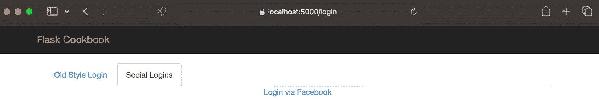

图 6.8 – 社交登录页面

当我们点击 **通过 Facebook 登录** 链接时，应用程序将跳转到 Facebook，用户将被要求提供他们的登录详情和权限。一旦权限被授予，用户将登录到应用程序。

# 使用 Google 进行身份验证

就像我们对 Facebook 所做的那样，我们可以将我们的应用程序集成以启用使用 Google 的登录。

## 准备工作

从上一个菜谱开始构建。通过简单地省略 Facebook 特定的元素，很容易实现 Google 身份验证。

现在，从 Google 开发者控制台（[`console.developers.google.com`](https://console.developers.google.com)）创建一个新项目。在 **APIs and Services** 部分中，点击 **Credentials**。然后，为网络应用程序创建一个新的客户端 ID；此 ID 将提供 OAuth 2.0 运作所需的凭据。在创建客户端 ID 之前，您还需要配置 OAuth 授权屏幕，如下面的截图所示：

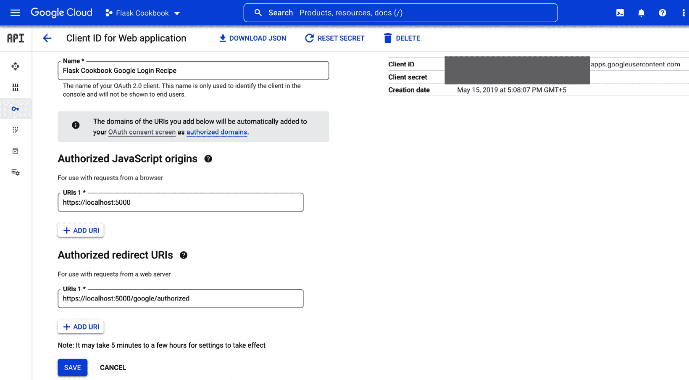

图 6.9 – Google 应用配置

## 如何操作...

要在您的应用程序中启用 Google 身份验证，请按照以下步骤操作：

1.  和往常一样，从 `my_app/__init__.py` 中的配置部分开始，如下所示：

    ```py
    app.config["GOOGLE_OAUTH_CLIENT_ID"] = "my Google
    ```

    ```py
      OAuth client ID"
    ```

    ```py
    app.config["GOOGLE_OAUTH_CLIENT_SECRET"] = "my Google
    ```

    ```py
      OAuth client secret"
    ```

    ```py
    app.config["OAUTHLIB_RELAX_TOKEN_SCOPE"] = True
    ```

    ```py
    from my_app.auth.views import auth,
    ```

    ```py
      facebook_blueprint, google_blueprint
    ```

    ```py
    app.register_blueprint(google_blueprint)
    ```

在前面的代码片段中，我们将 Flask-Dance 提供的 Google 蓝图注册到我们的应用程序以进行身份验证。这个蓝图将在 `views` 文件中创建，我们将在下一部分查看。注意额外的配置选项 `OAUTHLIB_RELAX_TOKEN_SCOPE`。这建议在实现 Google 身份验证时使用，因为 Google 有时会提供与提到的范围不一致的数据。

1.  接下来，修改视图，即 `my_app/auth/views.py`，如下所示：

    ```py
    from flask_dance.contrib.google import
    ```

    ```py
      make_google_blueprint, google
    ```

    ```py
    google_blueprint = make_google_blueprint(
    ```

    ```py
        scope=[
    ```

    ```py
            "openid",
    ```

    ```py
            "https://www.googleapis.com
    ```

    ```py
              /auth/userinfo.email",
    ```

    ```py
            "https://www.googleapis.com
    ```

    ```py
              /auth/userinfo.profile"],
    ```

    ```py
        redirect_to='auth.google_login')
    ```

在前面的代码片段中，`make_google_blueprint`从应用程序配置中读取`GOOGLE_OAUTH_CLIENT_ID`和`GOOGLE_OAUTH_CLIENT_SECRET`，并在后台处理所有 OAuth 相关操作。在创建 Google 蓝图时，我们将`scope`设置为`openid`、`https://www.googleapis.com/auth/userinfo.email`和`https://www.googleapis.com/auth/userinfo.profile`，因为我们想使用用户的电子邮件地址作为他们的唯一用户名和登录后的显示名。`openid`在`scope`中是必需的，因为 Google 更喜欢它。

我们还将`redirect_to`设置为`auth.google_login`，这样 Google 在身份验证成功后能够将应用程序路由回此 URL。如果没有设置此选项，应用程序将自动重定向到主页，即`/`。

1.  接下来，创建一个新的路由处理程序，用于处理使用以下代码的 Google 登录：

    ```py
    @auth.route("/google-login")
    ```

    ```py
    def google_login():
    ```

    ```py
        if not google.authorized:
    ```

    ```py
            return redirect(url_for("google.login"))
    ```

    ```py
        resp = google.get("/oauth2/v1/userinfo")
    ```

    ```py
        user = User.query.filter_by(username=resp.json()
    ```

    ```py
          ["email"]).first()
    ```

    ```py
        if not user:
    ```

    ```py
            user = User(resp.json()["email"], '')
    ```

    ```py
            db.session.add(user)
    ```

    ```py
            db.session.commit()
    ```

    ```py
        login_user(user)
    ```

    ```py
        flash(
    ```

    ```py
            'Logged in as name=%s using Google login' % (
    ```

    ```py
                resp.json()['name']), 'success' )
    ```

    ```py
        return redirect(request.args.get('next',
    ```

    ```py
          url_for('auth.home')))
    ```

在这里，该方法首先检查用户是否已经通过 Google 授权。如果没有，它将应用重定向到 Google 登录处理程序，在那里用户需要遵循 Google 概述的步骤，并允许我们的应用程序访问请求的用户详细信息。一旦用户通过 Google 授权，该方法将从 Google 请求用户的详细信息，包括他们的姓名和电子邮件地址。使用这些用户详细信息，可以确定是否已经存在具有此电子邮件地址的用户。如果没有，将创建一个新用户并登录；否则，将直接登录现有用户。

1.  最后，修改登录模板`login.html`，以允许 Google 登录。在`social-logins`标签内添加以下行：

    ```py
    <a href="{{ url_for('auth.google_login',
    ```

    ```py
      next=url_for('auth.home'))
    ```

    ```py
    }}">Login via Google</a>
    ```

## 它是如何工作的…

Google 登录的方式与前面食谱中的 Facebook 登录类似。

# 使用 Twitter 进行身份验证

OAuth 实际上是在编写 Twitter OpenID API 时诞生的。在这个食谱中，我们将集成 Twitter 登录到我们的应用程序中。

## 准备工作

我们将继续构建在*使用 Google 进行身份验证*食谱之上。实现 Twitter 身份验证很容易 – 简单地从前一个身份验证食谱中省略 Facebook 或 Google 特定的部分。

首先，我们必须从 Twitter**应用管理**页面([`developer.twitter.com/en/portal/dashboard`](https://developer.twitter.com/en/portal/dashboard))创建一个应用程序。它将自动为我们创建消费者 API 密钥（**API Key**和**API Key Secret**），如下面的截图所示：

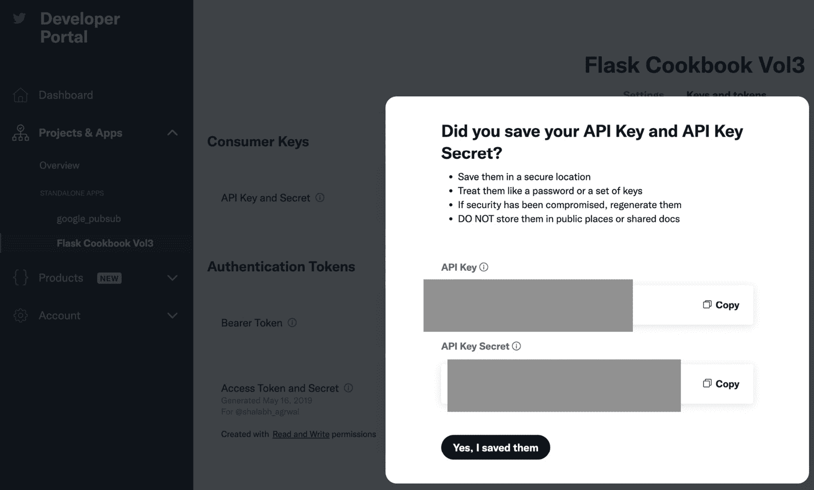

图 6.10 – Twitter 应用配置

## 如何实现...

要为您的应用程序启用 Twitter 身份验证，请按照以下步骤操作：

1.  首先，从`my_app/__init__.py`中的配置部分开始，如下所示：

    ```py
    app.config["TWITTER_OAUTH_CLIENT_KEY"] = "my Twitter
    ```

    ```py
      app ID"
    ```

    ```py
    app.config["TWITTER_OAUTH_CLIENT_SECRET"] = "my
    ```

    ```py
      Twitter app secret"
    ```

    ```py
    from my_app.auth.views import twitter_blueprint
    ```

    ```py
    app.register_blueprint(twitter_blueprint)
    ```

在前面的代码片段中，我们使用 Flask-Dance 提供的 Twitter 蓝图在我们的应用程序中进行身份验证注册。这个蓝图将在`views`文件中创建，我们将在下一节查看。

1.  接下来，修改视图，即`my_app/auth/views.py`，如下所示：

    ```py
    from flask_dance.contrib.twitter import
    ```

    ```py
      make_twitter_blueprint, twitter
    ```

    ```py
    twitter_blueprint = make_twitter_blueprint
    ```

    ```py
      (redirect_to='auth.twitter_login')
    ```

在前面的代码中，`make_twitter_blueprint`从应用程序配置中读取`TWITTER_OAUTH_CLIENT_KEY`和`TWITTER_OAUTH_CLIENT_SECRET`，并在后台处理所有 OAuth 相关操作。不需要设置`scope`，因为我们之前在 Facebook 和 Google 身份验证中做的那样，因为这个配方将使用 Twitter 昵称作为用户名，这是默认提供的。

我们还将`redirect_to`设置为`auth.twitter_login`，以便 Twitter 在身份验证成功后可以将应用程序路由回此 URL。如果不设置此选项，应用程序将自动重定向到主页，即`/`。

1.  接下来，创建一个新的路由处理程序，用于处理使用 Twitter 的登录，如下所示：

    ```py
    @auth.route("/twitter-login")
    ```

    ```py
    def twitter_login():
    ```

    ```py
        if not twitter.authorized:
    ```

    ```py
            return redirect(url_for("twitter.login"))
    ```

    ```py
        resp = twitter.get("account/verify_credentials
    ```

    ```py
          .json")
    ```

    ```py
        user = User.query.filter_by(username=resp
    ```

    ```py
          .json()["screen_name"]).first()
    ```

    ```py
        if not user:
    ```

    ```py
            user = User(resp.json()["screen_name"], '')
    ```

    ```py
            db.session.add(user)
    ```

    ```py
            db.session.commit()
    ```

    ```py
        login_user(user)
    ```

    ```py
        flash(
    ```

    ```py
            'Logged in as name=%s using Twitter login' % (
    ```

    ```py
                resp.json()['name']), 'success' )
    ```

    ```py
        return redirect(request.args.get('next',
    ```

    ```py
          url_for('auth.home')))
    ```

上述方法首先检查用户是否已经通过 Twitter 授权。如果没有，它将应用重定向到 Twitter 登录处理程序，在那里用户需要遵循 Twitter 概述的步骤并允许我们的应用程序访问请求的用户详细信息。一旦用户通过 Twitter 授权，该方法将请求用户的详细信息，包括他们的 Twitter 屏幕名或昵称。使用这些用户详细信息，可以确定是否已经存在具有此 Twitter 昵称的用户。如果没有，将创建一个新用户并登录；否则，现有用户将直接登录。

1.  最后，修改登录模板`login.html`，以允许 Twitter 登录。在`social-logins`选项卡内添加以下行：

    ```py
    <a href="{{ url_for('auth.twitter_login',
    ```

    ```py
    next=url_for('auth.home')) }}">Login via Twitter</a>
    ```

## 它是如何工作的...

此配方的工作方式与之前配方中的 Facebook 和 Google 登录类似。

信息

类似地，我们可以集成 LinkedIn、GitHub 和其他数百个提供 OAuth 登录和身份验证支持的第三方提供者。是否实现更多集成取决于您。以下链接已添加供您参考：

*领英*：[`learn.microsoft.com/en-us/linkedin/shared/authentication/authentication`](https://learn.microsoft.com/en-us/linkedin/shared/authentication/authentication)

*GitHub*：[`docs.github.com/en/developers/apps/building-oauth-apps`](https://docs.github.com/en/developers/apps/building-oauth-apps)

# 使用 LDAP 进行身份验证

LDAP 本质上是一种互联网协议，用于从服务器查找有关用户、证书、网络指针等信息，其中数据存储在目录式结构中。在 LDAP 的多个用例中，最流行的是单点登录功能，用户只需登录一次即可访问多个服务，因为凭据在整个系统中是共享的。

## 准备工作

在这个配方中，我们将创建一个登录页面，类似于我们在本章第一篇配方*创建简单的基于会话的认证*中创建的页面。用户可以使用他们的 LDAP 凭证登录。如果凭证在提供的 LDAP 服务器上成功认证，用户将被登录。

如果你已经有可以访问的 LDAP 服务器，可以自由跳过本节中解释的 LDAP 设置说明。

第一步是获取访问 LDAP 服务器的权限。这可以是一个已经托管在某处的服务器，或者你可以创建自己的本地 LDAP 服务器。启动演示 LDAP 服务器的最简单方法是通过使用 Docker。

重要

这里，我们假设你之前有 Docker 的经验，并且已经在你的机器上安装了 Docker。如果没有，请参阅[`docs.docker.com/get-started/`](https://docs.docker.com/get-started/)。

要使用 Docker 创建 LDAP 服务器，请在终端运行以下命令：

```py
$ docker run -p 389:389 -p 636:636 --name my-openldap-container --detach osixia/openldap:1.5.0
```

一旦前面的命令成功执行，通过以下方式测试服务器，搜索用户名为`admin`和密码为`admin`的示例用户：

```py
$ docker exec my-openldap-container ldapsearch -x -H ldap://localhost -b dc=example,dc=org -D "cn=admin,dc=example,dc=org" -w admin
```

前面命令的成功执行表明 LDAP 服务器正在运行，并准备好使用。

小贴士

更多关于 OpenLDAP Docker 镜像的信息，请参阅`https:/``/``github.``com/``osixia/``docker-``openldap`。

现在，使用以下代码安装将帮助我们的应用程序与 LDAP 服务器通信的 Python 库：

```py
    $ pip install python-ldap
```

## 如何操作...

要启用应用程序的 LDAP 认证，请按照以下步骤操作：

1.  和往常一样，从`my_app/__init__.py`中的配置部分开始，如下所示：

    ```py
    import ldap
    ```

    ```py
    app.config['LDAP_PROVIDER_URL'] = 'ldap://localhost'
    ```

    ```py
    def get_ldap_connection():
    ```

    ```py
        conn = ldap.initialize(app.config
    ```

    ```py
          ['LDAP_PROVIDER_URL'])
    ```

    ```py
        return conn
    ```

在前面的代码片段中，我们导入了`ldap`，然后创建了一个指向 LDAP 服务器地址的应用配置选项。这之后是创建一个简单的函数`get_ldap_connection`，该函数在服务器上创建 LDAP 连接对象，然后返回该连接对象。

1.  接下来，修改视图，即`my_app/auth/views.py`，在这里创建了一个新的路由`ldap_login`，以便通过 LDAP 进行登录，如下所示：

    ```py
    import ldap
    ```

    ```py
    from my_app import db, login_manager,
    ```

    ```py
      get_ldap_connection
    ```

    ```py
    @auth.route("/ldap-login", methods=['GET', 'POST'])
    ```

    ```py
    def ldap_login():
    ```

    ```py
        if current_user.is_authenticated:
    ```

    ```py
            flash('Your are already logged in.', 'info')
    ```

    ```py
            return redirect(url_for('auth.home'))
    ```

    ```py
        form = LoginForm()
    ```

    ```py
        if form.validate_on_submit():
    ```

    ```py
            username = request.form.get('username')
    ```

    ```py
            password = request.form.get('password')
    ```

    ```py
            try:
    ```

    ```py
                conn = get_ldap_connection()
    ```

    ```py
                conn.simple_bind_s(
    ```

    ```py
                    'cn=%s,dc=example,dc=org' % username,
    ```

    ```py
                    password
    ```

    ```py
                )
    ```

    ```py
            except ldap.INVALID_CREDENTIALS:
    ```

    ```py
                flash('Invalid username or password.
    ```

    ```py
                  Please try again.', 'danger')
    ```

    ```py
                return render_template('login.html',
    ```

    ```py
                  form=form)
    ```

    ```py
            user = User.query.filter_by(username=username)
    ```

    ```py
              .first()
    ```

    ```py
            if not user:
    ```

    ```py
                user = User(username, password)
    ```

    ```py
                db.session.add(user)
    ```

    ```py
                db.session.commit()
    ```

    ```py
            login_user(user)
    ```

    ```py
            flash('You have successfully logged in.',
    ```

    ```py
              'success')
    ```

    ```py
            return redirect(url_for('auth.home'))
    ```

    ```py
        if form.errors:
    ```

    ```py
            flash(form.errors, 'danger')
    ```

    ```py
        return render_template('login.html', form=form)
    ```

在这里，我们首先检查用户是否已经认证。如果已经认证，我们将他们重定向到主页；否则，我们继续前进。然后我们使用了`LoginForm`，这是我们之前在*创建简单的基于会话的认证*配方中创建的，因为我们也需要用户名和密码。接下来，我们验证了表单，然后使用`get_ldap_connection`获取连接对象。之后，应用程序尝试使用`simple_bind_s`从 LDAP 服务器认证用户。注意这个方法内部的字符串`'cn=%s,dc=example,dc=org'`，这个字符串可能因服务器内部配置的不同而有所不同。如果你不知道这些细节，请务必联系你的 LDAP 服务器管理员。

如果用户成功认证，那么在我们的本地数据库中创建一个新的用户记录，并且用户将被登录。否则，LDAP 连接失败并抛出错误`INVALID_CREDENTIALS`，然后被捕获并相应地通知用户。

小贴士

我们刚刚见证了可重用组件的力量！正如你所见，`LoginForm`现在已被用于两个不同的目的。这是一个好的编程实践。

1.  最后，修改登录模板`login.html`以允许 LDAP 登录，如下所示：

    ```py
    
    ```

    ```py
    
    ```

    ```py
      <div class="top-pad">
    ```

    ```py
        <ul class="nav nav-tabs">
    ```

    ```py
         <li class="active"><a href="#simple-form" data-
    ```

    ```py
           toggle="tab">Old Style Login</a></li>
    ```

    ```py
         <li><a href="#social-logins" data-
    ```

    ```py
           toggle="tab">Social Logins</a></li>
    ```

    ```py
         <li><a href="#ldap-form" data-toggle="tab">LDAP
    ```

    ```py
           Login</a></li>
    ```

    ```py
        </ul>
    ```

    ```py
        <div class="tab-content">
    ```

    ```py
          <div class="tab-pane active" id="simple-form">
    ```

    ```py
            <br/>
    ```

    ```py
            <form
    ```

    ```py
                method="POST"
    ```

    ```py
                action="{{ url_for('auth.login') }}"
    ```

    ```py
                role="form">
    ```

    ```py
              {{ form.csrf_token }}
    ```

    ```py
              <div class="form-group">{{ form.username
    ```

    ```py
                .label }}: {{ form.username() }}</div>
    ```

    ```py
              <div class="form-group">{{ form.password
    ```

    ```py
                .label }}: {{ form.password() }}</div>
    ```

    ```py
              <button type="submit" class="btn btn-
    ```

    ```py
                default">Submit</button>
    ```

    ```py
            </form>
    ```

    ```py
          </div>
    ```

    ```py
          <div class="tab-pane" id="social-logins">
    ```

    ```py
            <a href="{{ url_for('auth.facebook_login',
    ```

    ```py
              next=url_for('auth.home')) }}"
    ```

    ```py
              >Login via Facebook</a>
    ```

    ```py
            <br/>
    ```

    ```py
            <a href="{{ url_for('auth.google_login',
    ```

    ```py
              next=url_for('auth.home')) }}"
    ```

    ```py
              >Login via Google</a>
    ```

    ```py
            <br/>
    ```

    ```py
            <a href="{{ url_for('auth.twitter_login',
    ```

    ```py
              next=url_for('auth.home')) }}"
    ```

    ```py
              >Login via Twitter</a>
    ```

    ```py
          </div>
    ```

    ```py
          <div class="tab-pane" id="ldap-form">
    ```

    ```py
            <br/>
    ```

    ```py
            <form
    ```

    ```py
                method="POST"
    ```

    ```py
                action="{{ url_for('auth.ldap_login') }}"
    ```

    ```py
                role="form">
    ```

    ```py
              {{ form.csrf_token }}
    ```

    ```py
              <div class="form-group">{{ form.username
    ```

    ```py
                .label }}: {{ form.username() }}</div>
    ```

    ```py
              <div class="form-group">{{ form.password
    ```

    ```py
                .label }}: {{ form.password() }}</div>
    ```

    ```py
              <button type="submit" class="btn btn-
    ```

    ```py
                default">Submit</button>
    ```

    ```py
            </form>
    ```

    ```py
          </div>
    ```

    ```py
        </div>
    ```

    ```py
      </div>
    ```

    ```py
    
    ```

## 它是如何工作的…

带有 LDAP 标签的新登录屏幕应如下截图所示：

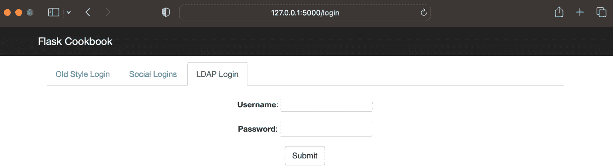

图 6.11 – LDAP 登录屏幕

在这里，用户只需输入他们的用户名和密码。如果凭证正确，用户将被登录并带到主屏幕；否则，将发生错误。

## 参见

你可以在[`en.wikipedia.org/wiki/Lightweight_Directory_Access_Protocol`](https://en.wikipedia.org/wiki/Lightweight_Directory_Access_Protocol)和[`www.python-ldap.org`](https://www.python-ldap.org)了解更多关于 LDAP 的信息。
