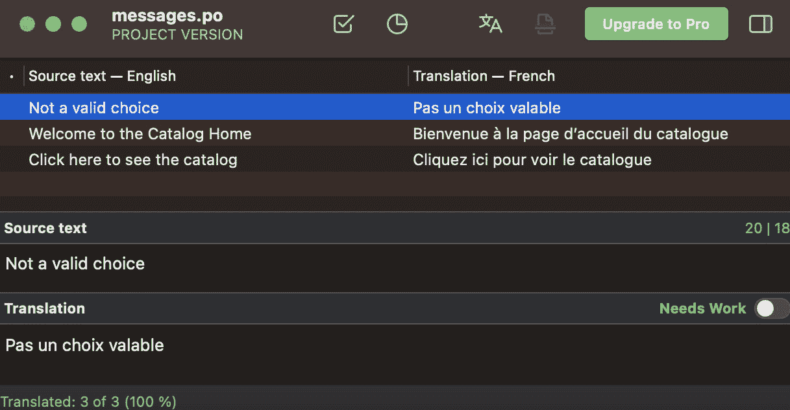
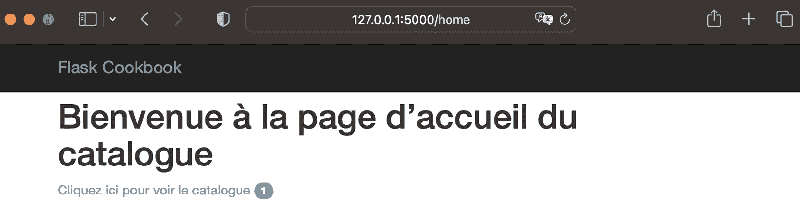
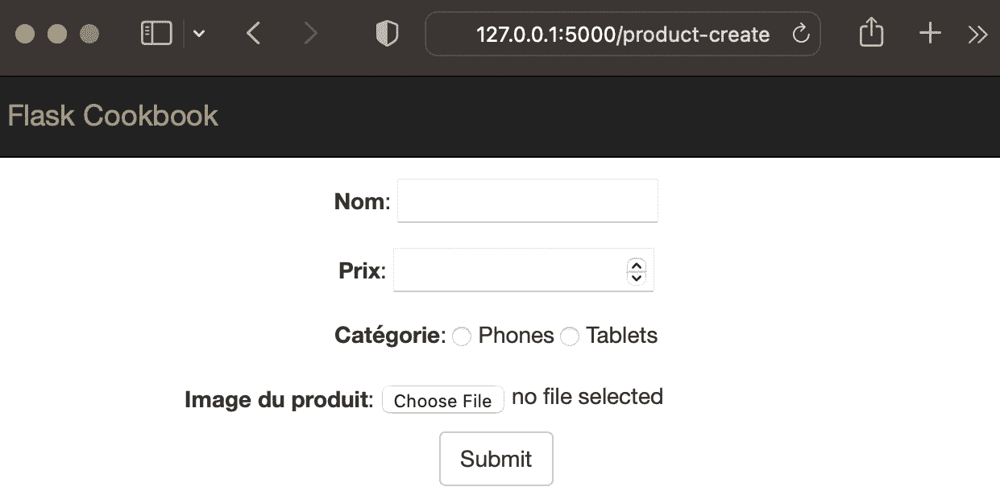
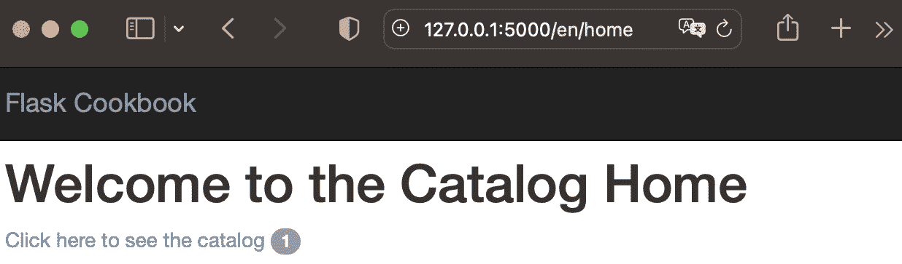
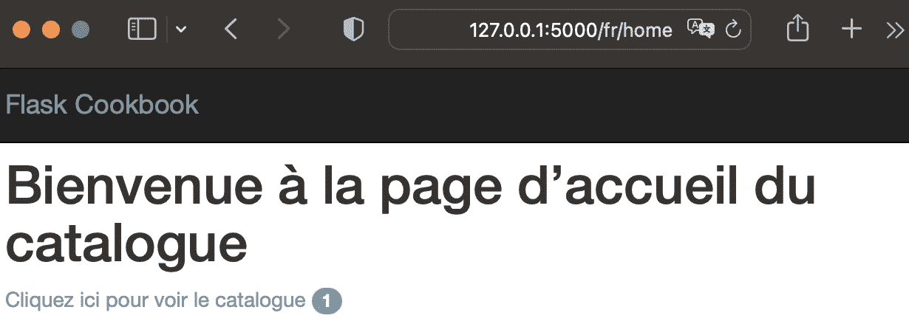

# 第九章：国际化和本地化

Web 应用程序通常不仅限于一个地理区域，也不只是为来自一个语言领域的人提供服务。例如，旨在为欧洲用户设计的 Web 应用程序预计将支持多种欧洲语言，例如德语、法语、意大利语和西班牙语，以及英语。本章将介绍如何在 Flask 应用程序中启用对多种语言的支持。

在任何 Web 应用程序中添加对第二种语言的支持是一件棘手的事情。每次对应用程序进行更改时，都会增加一些开销，并且随着语言数量的增加而增加。除了更改文本之外，还需要注意许多其他事情，具体取决于语言。需要更改的一些主要事项包括货币、数字、时间和日期格式。

**Flask-Babel**，一个为任何 Flask 应用程序添加**国际化**（**i18n**）和**本地化**（**l10n**）支持的扩展，提供了一些工具和技术，使此过程易于实现。

在本章中，我们将介绍以下配方：

+   添加新语言

+   实现延迟评估和`gettext`/`ngettext`函数

+   实现全局语言切换操作

# 添加新语言

默认情况下，Flask（以及几乎所有 Web 框架）构建的应用程序的语言为英语。在本配方中，我们将向我们的应用程序添加第二种语言，并为应用程序中使用的显示字符串添加一些翻译。显示给用户的语言将取决于浏览器当前设置的语言。

## 准备工作

我们将从安装`Flask-Babel`扩展开始：

```py
$ pip install Flask-Babel
```

此扩展使用**Babel**和**pytz**为应用程序添加 i18n 和 l10n 支持。

我们将使用来自*第五章*，“*Web 表单* *与 WTForms*”的目录应用程序。

## 如何操作...

我们将使用法语作为第二种语言。按照以下步骤实现此功能：

1.  从创建`Babel`类的实例开始配置部分，使用`my_app/__init__.py`中的`app`对象。我们还将指定这里将可用的所有语言：

    ```py
    from flask import request
    ```

    ```py
    from flask_babel import Babel
    ```

    ```py
    ALLOWED_LANGUAGES = {
    ```

    ```py
        'en': 'English',
    ```

    ```py
        'fr': 'French',
    ```

    ```py
    }
    ```

    ```py
    babel = Babel(app)
    ```

小贴士

在这里，我们使用了`en`和`fr`作为语言代码。这些分别代表英语（标准）和法语（标准）。如果我们打算支持来自同一标准语言起源的多种语言，但基于地区不同，例如英语（美国）和英语（英国），那么我们应该使用如`en-us`和`en-gb`之类的代码。

1.  应用程序的区域设置取决于初始化`babel`对象时提供的方法的输出：

    ```py
    def get_locale():
    ```

    ```py
        return request.accept_languages.best_match
    ```

    ```py
          (ALLOWED_LANGUAGES.keys())
    ```

    ```py
    babel.init_app(app, locale_selector=get_locale)
    ```

之前的方法从请求中获取`accept_languages`头，并找到与我们允许的语言最匹配的语言。

小贴士

您可以更改浏览器的语言首选项来测试应用程序在另一种语言中的行为。

以前，更改浏览器中的语言首选项相对容易，但随着地区设置在操作系统中的更加根深蒂固，这样做变得困难，除非更改操作系统的全局地区设置。因此，如果您不想弄乱浏览器的语言首选项或操作系统的语言首选项，只需从 `get_locale()` 方法返回预期的语言代码即可。

1.  接下来，在应用程序文件夹中创建一个名为 `babel.cfg` 的文件。此文件的路径为 `my_app/babel.cfg`，其内容如下：

    ```py
    [python: catalog/**.py]
    ```

    ```py
    [jinja2: templates/**.html]
    ```

在这里，前两行告诉 `Babel` 要搜索标记为可翻译文本的文件名模式。

信息

在本书的早期版本中，我建议加载 Jinja2 的几个扩展，即 `jinja2.ext.autoescape` 和 `jinja2.ext.with_`。但自 Jinja 3.1.0 版本起，这些模块已经内置了支持，因此现在没有必要单独加载它们。

1.  接下来，标记一些需要根据语言进行翻译的文本。让我们从启动应用程序时看到的第一个文本开始，该文本位于 `home.html` 中：

    ```py
    
    ```

    ```py
    <h1>{{ _('Welcome to the Catalog Home') }}</h1>
    ```

    ```py
      <a href="{{ url_for('catalog.products') }}"
    ```

    ```py
        id="catalog_link">
    ```

    ```py
      {{ _('Click here to see the catalog ') }}
    ```

    ```py
      </a>
    ```

    ```py
    
    ```

在这里，`_` 是 Babel 提供的 `gettext` 函数的快捷方式，用于翻译字符串。

1.  然后，运行以下命令，以便在浏览器中渲染模板时，标记的文本实际上作为翻译文本可用：

    ```py
     $ pybabel extract -F my_app/babel.cfg -o
    ```

    ```py
       my_app/messages.pot my_app/
    ```

上述命令遍历文件的内容。此命令匹配 `babel.cfg` 中的模式，并挑选出标记为可翻译的文本。所有这些文本都放置在 `my_app/messages.pot` 文件中。以下为上述命令的输出：

```py
extracting messages from my_app/catalog/__init__.py
extracting messages from my_app/catalog/models.py
extracting messages from my_app/catalog/views.py
extracting messages from my_app/templates/404.html
extracting messages from my_app/templates/base.html
extracting messages from
  my_app/templates/categories.html
extracting messages from my_app/templates/category-
  create.html
extracting messages from
  my_app/templates/category.html
extracting messages from my_app/templates/home.html
extracting messages from my_app/templates/product-
  create.html
extracting messages from my_app/templates/product.html
extracting messages from
  my_app/templates/products.html
writing PO template file to my_app/messages.pot
```

1.  运行以下命令以创建一个 `.po` 文件，该文件将保存要翻译的文本的翻译：

    ```py
    $ pybabel init -i my_app/messages.pot -d
    ```

    ```py
      my_app/translations -l fr
    ```

此文件在指定的文件夹 `my_app/translations` 中创建，名为 `fr/LC_MESSAGES/messages.po`。随着我们添加更多语言，将添加更多文件夹。

1.  现在，向 `messages.po` 文件中添加翻译。这可以手动完成，或者我们可以使用诸如 Poedit ([`poedit.net/`](http://poedit.net/)) 这样的图形界面工具。使用此工具，翻译将看起来如下截图所示：



图 9.1 – 编辑翻译时的 Poedit 屏幕

手动编辑 `messages.po` 的样子如下所示。这里仅为了演示目的，只展示了一条消息的翻译：

```py
#: my_app/catalog/models.py:75
msgid "Not a valid choice"
msgstr "Pas un choix valable"
```

1.  在将翻译合并到 `messages.po` 文件后保存，并运行以下命令：

    ```py
    $ pybabel compile -d my_app/translations
    ```

这将在 `message.po` 文件旁边创建一个 `messages.mo` 文件，该文件将由应用程序用于渲染翻译文本。

信息

有时，在运行前面的命令后，消息没有得到编译。这是因为消息可能被标记为模糊（以 `#` 符号开头）。这些需要由人工检查，如果消息可以由编译器更新，则必须移除 `#` 符号。为了绕过此检查，请在前面的 `compile` 命令中添加一个 `-f` 标志，因为它将强制编译所有内容。

## 它是如何工作的...

如果我们在浏览器中将应用程序的主要语言设置为法语（或从 `get_locale()` 方法返回的语言选择），主页将看起来如下截图所示：



图 9.2 – 法语主页

如果主要语言设置为除法语以外的其他语言，则内容将以默认语言英语显示。

## 还有更多...

下次，如果需要更新我们的 `messages.po` 文件中的翻译，我们不需要再次调用 `init` 命令。相反，我们可以运行一个 `update` 命令，如下所示：

```py
 $ pybabel update -i my_app/messages.pot -d
   my_app/translations
```

然后，像往常一样运行 `compile` 命令。

信息

根据用户的 IP 地址和位置（从 IP 地址确定）更改网站的语通常更可取，但总的来说，这不如使用我们在应用程序中使用过的 accept-language 标头推荐。

## 参见

参考本章后面的 *实现全局语言切换操作* 菜谱，它允许用户直接从应用程序而不是在浏览器级别更改语言。

多语言的一个重要方面是能够相应地格式化日期、时间和货币。Babel 也处理得相当整洁。我敦促你尝试一下。有关此信息，请参阅 Babel 文档，可在 [`babel.pocoo.org/en/latest/`](http://babel.pocoo.org/en/latest/) 找到。

# 实现懒加载和 gettext/ngettext 函数

懒加载是一种评估策略，它将表达式的评估延迟到其值需要时；也就是说，它是一个按需调用机制。在我们的应用程序中，可能会有几个文本实例在渲染模板时被延迟评估。这通常发生在我们标记为可翻译的文本位于请求上下文之外时，因此我们推迟这些文本的评估，直到它们实际需要时。

## 准备工作

让我们从上一个菜谱中的应用程序开始。现在，我们希望产品创建表单和分类创建表单中的标签显示翻译后的值。

## 如何做到这一点…

按以下步骤实现翻译的懒加载：

1.  要将产品表单和分类表单中的所有字段标签标记为可翻译，请对 `my_app/catalog/models.py` 进行以下更改：

    ```py
    from flask_babel import _
    ```

    ```py
    class NameForm(FlaskForm):
    ```

    ```py
        name = StringField(
    ```

    ```py
            _('Name'), validators=[InputRequired()])
    ```

    ```py
    class ProductForm(NameForm):
    ```

    ```py
        price = DecimalField(_('Price'), validators=[
    ```

    ```py
            InputRequired(),
    ```

    ```py
              NumberRange(min=Decimal('0.0'))
    ```

    ```py
        ])
    ```

    ```py
        category = CategoryField(
    ```

    ```py
            _('Category'), validators=[InputRequired()],
    ```

    ```py
              coerce=int
    ```

    ```py
        )
    ```

    ```py
        image = FileField(
    ```

    ```py
            _('Product Image'),
    ```

    ```py
              validators=[FileRequired()])
    ```

    ```py
    class CategoryForm(NameForm):
    ```

    ```py
        name = StringField(_('Name'), validators=[
    ```

    ```py
            InputRequired(), check_duplicate_category()
    ```

    ```py
        ])
    ```

注意，所有字段标签都被包含在 `_()` 中以标记为需要翻译。

1.  现在，运行`extract`和`update pybabel`命令以更新`messages.po`文件，然后填写相关翻译并运行`compile`命令。有关详细信息，请参阅之前的菜谱，*添加新语言*。

1.  现在，使用以下链接打开产品创建页面：`http://127.0.0.1:5000/product-create`。它是否按预期工作？不！正如我们现在大多数人都会猜测的那样，这种行为的原因是这段文本在请求上下文之外被标记为需要翻译。

要使此操作生效，修改`import`语句如下：

```py
from flask_babel import lazy_gettext as _
```

1.  现在，我们有更多文本需要翻译。假设我们想翻译产品创建的闪存消息内容，其外观如下：

    ```py
    flash('The product %s has been created' % name)
    ```

要将其标记为可翻译，我们不能简单地将整个内容包裹在`_()`或`gettext()`中。`gettext()`函数支持占位符，可以使用`%(name)s`作为。使用它，前面的代码将变成类似这样：

```py
flash(_('The product %(name)s has been created',
  name=name), 'success')
```

对于这个结果，翻译后的文本将类似于`La produit %(name)s a` `été créée`。

1.  可能会有一些情况，我们需要根据项目数量来管理翻译，即单数或复数名称。这由`ngettext()`方法处理。让我们举一个例子，我们想在`products.html`模板中显示页数。为此，添加以下代码：

    ```py
    {{ ngettext('%(num)d page', '%(num)d pages',
    ```

    ```py
      products.pages) }}
    ```

在这里，模板将渲染`page`如果只有一个页面，如果有多个页面则渲染`pages`。

有趣的是要注意这种翻译在`messages.po`文件中的显示方式：

```py
#: my_app/templates/products.html:20
#, python-format
msgid "%(num)d page"
msgid_plural "%(num)d pages"
msgstr[0] "%(num)d page"
msgstr[1] "%(num)d pages"
```

## 它是如何工作的…

打开产品创建表单，网址为`http://127.0.0.1:5000/product-create`。以下截图显示了将其翻译成法语后的样子：



图 9.3 – 使用惰性评估翻译的表单字段

# 实现全局语言切换操作

在之前的菜谱中，我们看到了语言变化是基于浏览器中的当前语言首选项。然而，现在我们想要一个机制，可以切换正在使用的语言，而不管浏览器的语言如何。在这个菜谱中，我们将了解如何在应用级别处理语言切换。

## 准备工作

我们首先从上一个菜谱中修改应用程序，即*实现惰性评估和 gettext/ngettext 函数*，以适应语言切换的更改。我们将为所有路由添加一个额外的 URL 部分，以便我们能够添加当前语言。我们只需更改 URL 中的语言部分即可在语言之间切换。

## 如何操作…

观察以下步骤以了解如何全局实现语言切换：

1.  首先，修改所有 URL 规则以适应额外的 URL 部分。`@catalog.route('/')`将变为`@catalog.route('/<lang>/')`，而`@catalog.route('/home')`将变为`@catalog.route('/<lang>/home')`。同样，`@catalog.route('/product-search/<int:page>')`将变为`@catalog.route('/<lang>/product-search/<int:page>')`。所有 URL 规则都需要这样做。

1.  现在，添加一个函数，该函数将 URL 中传递的语言添加到全局代理对象`g`中：

    ```py
    @app.before_request
    ```

    ```py
    def before():
    ```

    ```py
        if request.view_args and 'lang' in
    ```

    ```py
          request.view_args:
    ```

    ```py
            g.current_lang = request.view_args['lang']
    ```

    ```py
            request.view_args.pop('lang')
    ```

此方法将在每个请求之前运行，并将当前语言添加到`g`中。

1.  然而，这意味着应用程序中所有的`url_for()`调用都需要修改，以便传递一个名为`lang`的额外参数。幸运的是，有一个简单的解决方案，如下所示：

    ```py
    from flask import url_for as flask_url_for
    ```

    ```py
    @app.context_processor
    ```

    ```py
    def inject_url_for():
    ```

    ```py
        return {
    ```

    ```py
            'url_for': lambda endpoint, **kwargs:
    ```

    ```py
              flask_url_for(
    ```

    ```py
                endpoint, lang=g.get('current_lang',
    ```

    ```py
                  'en'), **kwargs
    ```

    ```py
            )
    ```

    ```py
        }
    ```

    ```py
    url_for = inject_url_for()['url_for']
    ```

在前面的代码中，我们首先从`flask`中导入`url_for`作为`flask_url_for`。然后，我们更新了应用程序上下文处理器，使其具有`url_for()`函数，这是 Flask 提供的修改版`url_for()`，以便将`lang`作为额外参数。我们还使用了在视图中使用的相同`url_for()`方法。

## 它是如何工作的…

现在，以当前状态运行应用程序，你会注意到所有 URL 都有一个语言部分。以下两个截图显示了渲染的模板将看起来如何。

对于英语，以下截图显示了打开`http://127.0.0.1:5000/en/home`后的首页外观：



图 9.4 – 英语首页

对于法语，只需将 URL 更改为`http://127.0.0.1:5000/fr/home`，首页将看起来像这样：



图 9.5 – 法语首页

## 更多内容…

l10n 不仅仅是翻译字母语言。不同的地理区域遵循不同的数字、小数、货币等格式。例如，1.5 百万美元在荷兰会被写成 1,5 Mio USD，而 123.56 在英语中会被写成 123,56 在法语中。

Babel 使得实现这种格式化非常容易。为此目的，有一整套方法可供选择。以下是一些示例：

```py
>>> from babel import numbers
>>> numbers.format_number(12345, 'en_US')
'12,345'
>>> numbers.format_number(12345, 'fr_FR')
'12\u202f345'
>>> numbers.format_number(12345, 'de_DE')
'12.345'
>>> numbers.format_decimal(12.345, locale='de_DE')
'12,345'
>>> numbers.format_decimal(12.345, locale='en_US')
'12.345'
>>> numbers.format_currency(12.345, 'USD', locale='en_US')
'$12.34'
>>> numbers.format_currency(12345789, 'USD', locale='en_US')
'$12,345,789.00'
>>> numbers.format_compact_currency(12345789, 'USD', locale='de_DE')
'12\xa0Mio.\xa0$'
>>> numbers.format_compact_currency(12345789, 'USD', locale='en_US')
'$12M'
```

你可以在[`babel.pocoo.org/en/latest/api/numbers.html#module-babel.numbers`](https://babel.pocoo.org/en/latest/api/numbers.html#module-babel.numbers)了解更多相关信息。

# 第三部分：高级 Flask

一旦在 Flask 中构建了 Web 应用程序，下一个问题就是如何测试应用程序，然后是部署，最后是维护它们。本书的这一部分涵盖了这些重要主题。这是本书从完全面向开发转向关注开发后活动的转折点。

通过编写单元测试来测试应用程序非常重要，这不仅可以对已编写的代码进行内省，还可以预先识别可能出现在功能进一步开发中的任何问题。一旦应用程序构建完成，你将希望从清晰的角度来衡量应用程序的性能。第十章*讨论了这些主题以及其他内容。

接下来的几章重点介绍了各种工具和技术，这些工具和技术可以用来在不同的平台上部署 Flask 网络应用程序，从云原生服务到裸机服务器。你将了解到如何使用最先进的技术，如 Docker 和 Kubernetes，来有效地部署你的网络应用程序。

新增了一章关于 GPT 的内容，讨论了如何将这项前沿技术与 Flask 集成以应对一些常见用例，以及如何通过人工智能使你的应用程序面向未来。

最后一章收集了一些可以在任何特定用例中使用的额外技巧和窍门。还有更多这样的主题，但我主要涵盖了那些我处理得最多的。

这一部分的书包括以下章节：

+   *第十章**，调试、错误处理和测试*

+   *第十一章，部署和部署后*

+   *第十二章**，微服务和容器*

+   *第十三章**，使用 Flask 的 GPT*

+   *第十四章**，额外的技巧和窍门*
