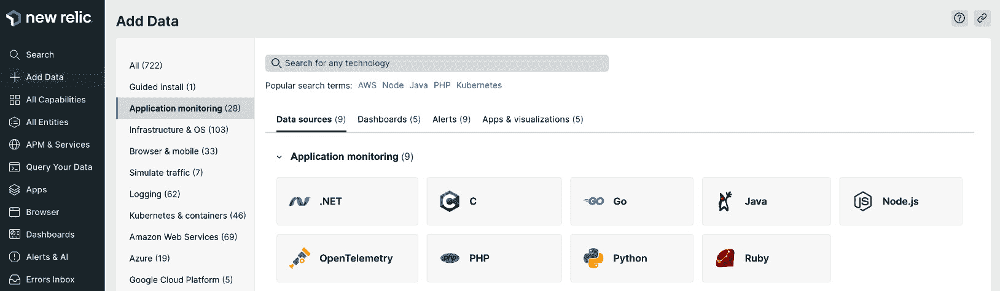
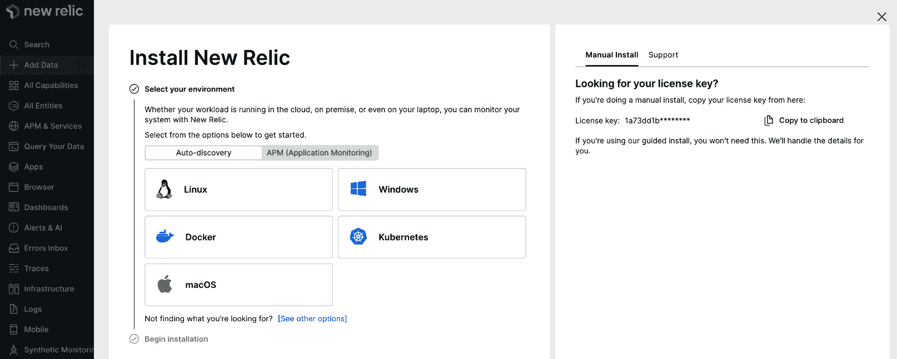
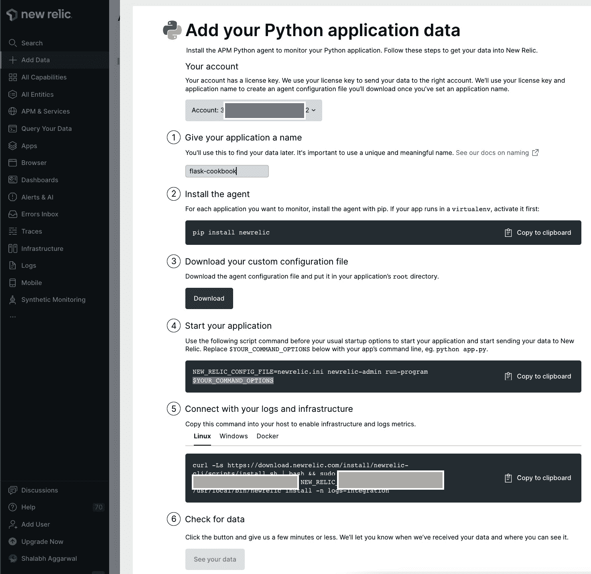
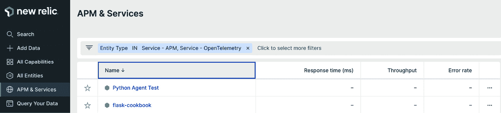
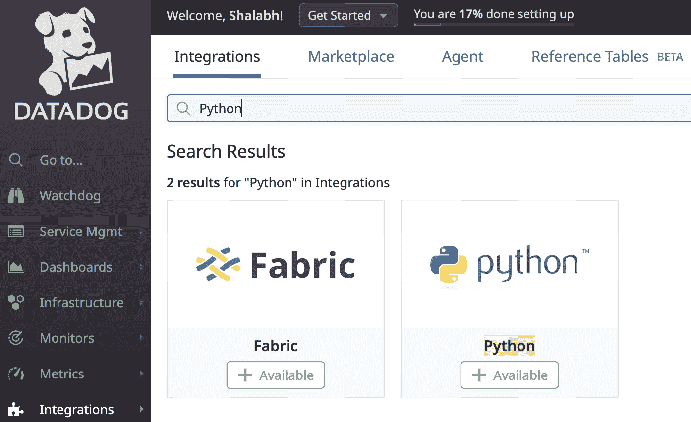
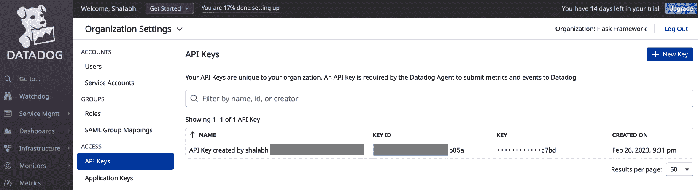
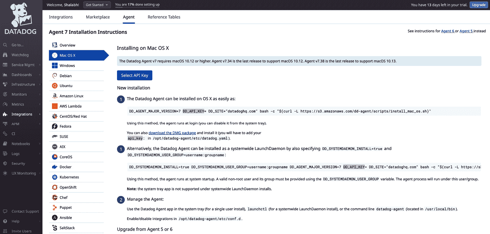
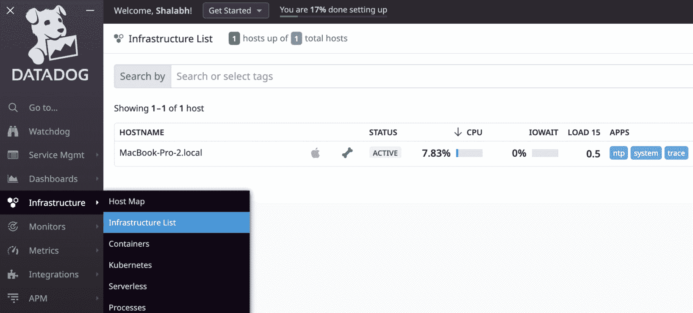
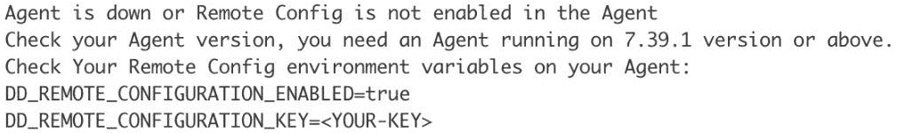
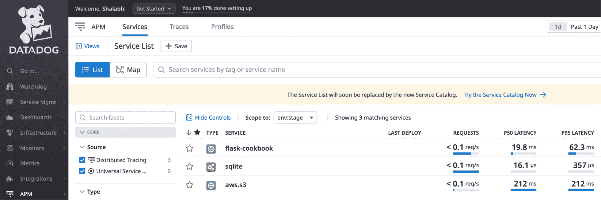

# 第十一章：部署和部署后

到目前为止，我们已经学习了如何以不同的方式编写 Flask 应用程序。部署应用程序和管理部署后的应用程序与开发它一样重要。部署应用程序的方法有很多，选择最佳方法取决于需求。从安全和性能的角度来看，正确部署应用程序非常重要。部署后监控应用程序有多种方式，其中一些是付费的，而另一些则是免费使用的。使用它们取决于它们的需求和提供的功能。

在本章中，我们将讨论各种应用程序部署技术，然后是部署后使用的某些监控工具。

我们将要介绍的每个工具和技术都有一套功能。例如，给应用程序添加过多的监控可能会给应用程序和开发者带来额外的开销。同样，忽略监控可能会导致未检测到的用户错误和整体用户不满。

注意

在本章中，我将专注于部署到**Ubuntu 22.04**服务器。这应该涵盖大多数情况。我会尝试涵盖 macOS 和 Windows 所需的任何特殊步骤，但不要将它们视为详尽的。

因此，我们应该明智地选择我们使用的工具，这将反过来尽可能简化我们的生活。

在部署后的监控工具方面，我们将讨论 New Relic。Sentry 是另一个从开发者的角度来看将证明是最有益的工具。我们已经在*第十章*的*使用 Sentry 监控异常*食谱中介绍了这一点，*调试、错误处理和测试*。

小贴士

本章将涵盖几个主题，并且它们都可以独立于彼此进行遵循/实施。你可以将其中一些组合起来以利用多个功能，我在认为最合适的地方提到了这一点。作为一名软件开发者，请自由地根据自己的判断选择用于何种目的的库。

在本章中，我们将介绍以下食谱：

+   使用 Apache 进行部署

+   使用 uWSGI 和 Nginx 进行部署

+   使用 Gunicorn 和 Supervisor 进行部署

+   使用 Tornado 进行部署

+   使用 S3 存储进行文件上传

+   使用 New Relic 管理和监控应用程序性能

+   使用 Datadog 进行基础设施和应用程序监控

# 使用 Apache 进行部署

在这个食谱中，我们将学习如何使用`Apache`部署 Flask 应用程序，这可以说是最受欢迎的 HTTP 服务器。对于 Python 网络应用程序，我们将使用`mod_wsgi`，它实现了一个简单的 Apache 模块，可以托管任何支持 WSGI 接口的 Python 应用程序。

注意

记住，`mod_wsgi`与 Apache 不同，需要单独安装。

## 准备工作

我们将从上一章的目录应用程序开始。不需要对现有代码进行任何修改。

对于使用 Apache 部署，确保在您打算部署的机器上安装了 Apache `httpd` 服务器的最新版本非常重要。通常，操作系统（尤其是 macOS）附带的 Apache 版本可能较旧，并且不会被 `mod_wsgi` 库支持。

注意

`httpd` 代表 Apache 软件基金会创建的守护进程实现的网络服务器。`apache` 和 `httpd` 通常可以互换使用。

对于 macOS，可以使用 Homebrew 安装 `httpd`：

```py
$ brew install httpd
```

对于 Ubuntu，`httpd` 是默认提供的。只需简单升级即可：

```py
$ sudo apt update
$ sudo apt install python3-dev
$ sudo apt install apache2 apache2-dev
```

对于 Windows 操作系统，请遵循官方文档：[`httpd.apache.org/docs/trunk/platform/`](https://httpd.apache.org/docs/trunk/platform/)。

一旦成功安装/更新了 Apache，下一步是安装 `mod_wsgi` 库。它可以直接在您的虚拟环境中安装：

```py
$ pip install mod_wsgi
```

## 如何操作…

与本书的前几版截然不同，`mod_wsgi` 现在附带了一个现代的 `mod_wsgi-express` 命令，该命令消除了编写 Apache `httpd` 配置的所有复杂性。

`mod_wsgi-express` 命令的唯一参数是包含 Flask 应用程序对象的文件。因此，创建一个名为 `wsgi.py` 的文件，并包含以下内容：

```py
from my_app import app as application
```

重要

由于 `mod_wsgi` 预期 `application` 关键字，因此需要将 `app` 对象导入为 `application`。

## 它是如何工作的…

使用以下命令调用 `mod_wsgi` 运行网络服务器：

```py
$ mod_wsgi-express start-server wsgi.py --processes 4
```

现在，访问 `http://localhost:8000/` 以查看应用程序的实际运行情况。

您也可以通过提供 `--port` 参数在特权端口（如 `80` 或 `443`）上运行您的应用程序。只需确保运行命令的 shell 用户/组有权限访问端口（s）。如果没有，您可以通过传递 `--user` 和 `--group` 参数将用户/组更改为相关的用户/组。

## 参考以下内容

参考以下链接了解 Apache 的更多信息：[`httpd.apache.org/`](http://httpd.apache.org/)

`mod_wgsi` 的最新文档可以在以下链接找到：[`modwsgi.readthedocs.io/en/develop`](https://modwsgi.readthedocs.io/en/develop)。

您可以在以下链接中了解 WSGI 的相关信息：[`wsgi.readthedocs.org/en/latest/`](http://wsgi.readthedocs.org/en/latest/)。

# 使用 uWSGI 和 Nginx 部署

对于已经了解 uWSGI 和 Nginx 作用的人来说，无需过多解释。uWSGI 既是协议也是应用程序服务器，提供完整的堆栈，以便您可以构建托管服务。Nginx 是一个非常轻量级的反向代理和 HTTP 服务器，能够处理几乎无限量的请求。Nginx 与 uWSGI 无缝协作，并提供许多底层的优化以获得更好的性能。在本配方中，我们将使用 uWSGI 和 Nginx 一起部署我们的应用程序。

## 准备工作

我们将使用之前配方中的应用程序，即 *使用 Apache 部署*，并使用相同的 `wsgi.py` 文件。

现在，安装 Nginx 和 uWSGI。在基于 Debian 的发行版，如 Ubuntu 上，它们可以很容易地使用以下命令安装：

```py
$ sudo apt-get install nginx
$ pip install pyuwsgi
```

这些安装说明是针对特定操作系统的，因此请根据您使用的操作系统参考相应的文档。

确保您有一个`sites-enabled`文件夹用于 Nginx，因为这是我们存放特定站点配置文件的地方。通常，它已经存在于大多数安装的`/etc/`文件夹中。如果没有，请参考您操作系统的特定文档以了解如何解决这个问题。

## 如何操作...

按照以下步骤使用 uWSGI 首先部署应用程序，然后将其与 Nginx 作为反向代理结合：

1.  第一步是创建一个名为`wsgi.py`的文件：

    ```py
    from my_app import app as application
    ```

这是因为`uwsgi`期望找到一个名为`application`的可执行文件，所以我们只需将我们的`app`导入为`application`。

1.  接下来，在我们的应用程序根目录中创建一个名为`uwsgi.ini`的文件：

    ```py
    [uwsgi]
    ```

    ```py
    http-socket    = :9090
    ```

    ```py
    wsgi-file = /home/ubuntu/cookbook3/Chapter-11/wsgi.py
    ```

    ```py
    processes   = 3
    ```

在这里，我们已经配置了`uwsgi`以运行在`processes`中指定的工人数所提供的 HTTP 地址上的`wsgi-file`。

要测试 uWSGI 是否按预期工作，请运行以下命令：

```py
$ uwsgi --ini uwsgi.ini
```

现在，将您的浏览器指向`http://127.0.0.1:9090/`；这应该会打开应用程序的主页。

1.  在继续之前，编辑前面的文件，将`http-socket`替换为`socket`。这将把协议从 HTTP 更改为 uWSGI（您可以在[`uwsgi-docs.readthedocs.io/en/latest/Protocol.html`](https://uwsgi-docs.readthedocs.io/en/latest/Protocol.html)上了解更多信息)。

重要

您必须保持`uwsgi`进程运行。目前，我们已将其作为前台进程运行。

您可能希望将 uWSGI 进程作为后台无头服务自动运行，而不是在前景手动运行。有多种工具可以实现这一点，例如`supervisord`、`circus`等等。我们将在下一个菜谱中涉及`supervisord`的不同用途，但也可以在这里复制。我将把它留给你自己尝试。

1.  现在，创建一个名为`nginx-wsgi.conf`的新文件。这将包含为我们提供应用程序和静态内容的 Nginx 配置：

    ```py
    server {
    ```

    ```py
      location / {
    ```

    ```py
        include uwsgi_params;
    ```

    ```py
        uwsgi_pass 0.0.0.0:9090;
    ```

    ```py
      }
    ```

    ```py
      location /static/uploads/ {
    ```

    ```py
        alias /home/ubuntu/cookbook3/Chapter-
    ```

    ```py
          11/flask_test_uploads/;
    ```

    ```py
      }
    ```

    ```py
    }
    ```

在前面的代码块中，`uwsgi_pass`指定了需要映射到指定位置的 uWSGI 服务器。

小贴士

`nginx-wsgi.conf`文件可以创建在任何位置。它可以与您的代码包一起创建，以便进行版本控制，或者如果您有多个`.conf`文件，可以放置在`/etc/nginx/sites-available`以方便维护。

1.  使用以下命令从该文件创建到我们之前提到的`sites-enabled`文件夹的软链接：

    ```py
    $ sudo ln -s ~/cookbook3/Chapter-11/nginx-wsgi.conf /etc/nginx/sites-enabled/
    ```

1.  默认情况下，Nginx 在`sites-available`文件夹中附带一个名为`default`的站点配置，并有一个指向`sites-enabled`文件夹的符号链接。取消链接以为我们提供应用程序；否则，默认设置将阻止我们的应用程序被加载：

    ```py
    $ sudo unlink /etc/nginx/sites-enabled/default
    ```

1.  在完成所有这些之后，使用以下命令重新加载 Nginx 服务器：

    ```py
    $ sudo systemctl reload nginx.service
    ```

将您的浏览器指向 `http://127.0.0.1/` 或 `http://<您的服务器 IP 或域名地址>` 以查看通过 Nginx 和 uWSGI 提供的应用程序。

## 参考以下内容

有关 uWSGI 的更多信息，请参阅 [`uwsgi-docs.readthedocs.org/en/latest/`](https://uwsgi-docs.readthedocs.org/en/latest/)。

有关 Nginx 的更多信息，请参阅 [`www.nginx.com/`](https://www.nginx.com/)。

DigitalOcean 上有一篇关于 Nginx 和 uWSGI 的好文章。我建议您阅读它，以便更好地理解这个主题。它可在 [`www.digitalocean.com/community/tutorials/how-to-serve-flask-applications-with-uwsgi-and-nginx-on-ubuntu-22-04`](https://www.digitalocean.com/community/tutorials/how-to-serve-flask-applications-with-uwsgi-and-nginx-on-ubuntu-22-04) 找到。

要了解 Apache 和 Nginx 之间的差异，我认为 Anturis 的一篇文章相当不错，该文章可在 [`anturis.com/blog/nginx-vs-apache/`](https://anturis.com/blog/nginx-vs-apache/) 找到。

# 使用 Gunicorn 和 Supervisor 进行部署

**Gunicorn** 是一个适用于 Unix 的 WSGI HTTP 服务器。它非常简单易实现，超轻量级，并且相当快速。它的简单性在于它与各种 Web 框架的广泛兼容性。

**Supervisor** 是一个监控工具，它可以控制各种子进程，并在这些子进程突然退出或由于其他原因时处理启动/重启这些子进程。它可以扩展到通过 XML-RPC API 在远程位置控制进程，而无需您登录到服务器（我们在这里不会讨论这一点，因为它超出了本书的范围）。

有一个需要注意的事情是，这些工具可以与其他在先前的菜谱中提到的应用程序一起使用，例如使用 Nginx 作为代理服务器。这留给你去尝试。

## 准备工作

我们将首先安装这两个包——即 `gunicorn` 和 `supervisor`。这两个包都可以直接使用 `pip` 进行安装：

```py
$ pip install gunicorn
$ pip install supervisor
```

## 如何做这件事...

按照以下步骤操作：

1.  要检查 `gunicorn` 包是否按预期工作，只需从我们的应用程序文件夹中运行以下命令：

    ```py
    $ gunicorn -w 4 -b 0.0.0.0:8000 my_app:app
    ```

然后，将您的浏览器指向 `http://0.0.0.0:8000/` 或 `http://<IP 地址或域名>:8000/` 以查看应用程序的主页。

1.  现在，我们需要使用 Supervisor 做与之前相同的事情，以便这个进程作为一个由 Supervisor 本身控制的守护进程运行，而不是通过人工干预。首先，我们需要一个 Supervisor 配置文件。这可以通过在您的虚拟环境中运行以下命令来实现。默认情况下，Supervisor 会寻找一个包含名为 `supervisord.conf` 文件的 `etc` 文件夹。在系统范围内安装中，此文件夹是 `/etc/`，而在虚拟环境中，它将在虚拟环境根文件夹中寻找一个 `etc` 文件夹，然后回退到 `/etc/`。因此，建议您在虚拟环境中创建一个名为 `etc` 的文件夹，以保持关注点的分离：

    ```py
    $ mkdir etc
    ```

    ```py
    $ echo_supervisord_conf > etc/supervisord.conf
    ```

最后一个命令将在 `etc` 文件夹中创建一个名为 `supervisord.conf` 的配置文件。此文件包含使用 Supervisor 守护进程运行的进程的所有配置。

信息

`echo_supervisord_conf` 程序由 Supervisor 提供；它将一个示例配置文件打印到指定的位置。如果在运行命令时遇到权限问题，请尝试使用 `sudo`。

1.  现在，在您之前创建的文件中添加以下配置块：

    ```py
    [program:flask_catalog]
    ```

    ```py
    command=<path to virtual environment>/bin/gunicorn -w
    ```

    ```py
      4 -b 0.0.0.0:8000 my_app:app
    ```

    ```py
    directory=<path to application directory>
    ```

    ```py
    user=someuser # some user with relevant permissions
    ```

    ```py
    autostart=true
    ```

    ```py
    autorestart=true
    ```

    ```py
    stdout_logfile=/tmp/app.log
    ```

    ```py
    stderr_logfile=/tmp/error.log
    ```

在这里，我们指定了 `gunicorn` 进程作为要运行的命令，以及用于进程的目录和用户。其他设置指定了 Supervisor 守护进程启动或重启时的行为以及保存相应日志文件的位置。

小贴士

注意，您永远不应该以 `root` 用户身份运行应用程序。这本身就是一个大安全漏洞，因为应用程序可能会崩溃，或者漏洞可能会损害操作系统本身。

1.  设置完成后，使用以下命令运行 `supervisord`：

    ```py
    $ supervisord
    ```

## 它是如何工作的...

要检查应用程序的状态，请运行以下命令：

```py
$ supervisorctl status
flask_catalog           RUNNING   pid 112039, uptime 0:00:06
```

此命令提供了所有子进程的状态。

小贴士

在本食谱中讨论的工具可以与 Nginx 配合使用，作为反向代理服务器。我建议您亲自尝试一下。

每次您对应用程序进行更改并希望重启 Gunicorn 以反映所做的更改时，请运行以下命令：

```py
$ supervisorctl restart all
```

您也可以指定特定的进程而不是重启所有内容：

```py
$ supervisorctl restart flask_catalog
```

## 参见

您可以在 [`gunicorn-docs.readthedocs.org/en/latest/index.html`](http://gunicorn-docs.readthedocs.org/en/latest/index.html) 上了解更多关于 Gunicorn 的信息。

有关 Supervisor 的更多信息，请参阅 [`supervisord.org/index.html`](http://supervisord.org/index.html)。

# 使用 Tornado 部署

Tornado 是一个完整的 Web 框架，本身也是一个独立的 Web 服务器。在这里，我们将使用 Flask 创建我们的应用程序，Flask 是 URL 路由和模板的组合，而将服务器部分留给 Tornado。Tornado 被构建来处理数千个同时的连接，使得应用程序非常可扩展。

信息

Tornado 在处理 WSGI 应用程序时存在限制，因此请明智选择！您可以在[`www.tornadoweb.org/en/stable/wsgi.html#running-wsgi-apps-on-tornado-servers`](http://www.tornadoweb.org/en/stable/wsgi.html#running-wsgi-apps-on-tornado-servers)了解更多信息。

## 准备工作

可以使用`pip`安装 Tornado：

```py
$ pip install tornado
```

## 如何操作…

让我们创建一个名为`tornado_server.py`的文件，并将以下代码放入其中：

```py
from tornado.wsgi import WSGIContainer
from tornado.httpserver import HTTPServer
from tornado.ioloop import IOLoop
from my_app import app
http_server = HTTPServer(WSGIContainer(app))
http_server.listen(8000)
IOLoop.instance().start()
```

在这里，我们为我们的应用程序创建了一个 WSGI 容器；然后使用该容器创建一个 HTTP 服务器，并将应用程序托管在端口`8000`上。

## 它是如何工作的…

使用以下命令运行我们在上一节中创建的 Python 文件：

```py
$ python tornado_server.py
```

将您的浏览器指向`http://0.0.0.0:8000/`或`http://<IP 地址或域名>:8000/`以查看正在提供的主页。

小贴士

我们可以将 Tornado 与 Nginx（作为反向代理以提供静态内容）和 Supervisor（作为进程管理器）结合使用以获得最佳效果。这留给你作为练习。

# 使用 S3 存储进行文件上传

**亚马逊网络服务**（**AWS**）将 S3 解释为互联网的存储，旨在使开发者的 Web 规模计算更容易。S3 通过 Web 服务提供了一个非常简单的接口；这使得在任何时间从互联网的任何地方存储和检索任何数量的数据都非常简单。到目前为止，在我们的目录应用程序中，我们看到了在管理作为创建过程一部分上传的产品图像时存在一些问题。如果图像存储在某个全球位置并且可以从任何地方轻松访问，那么整个头疼问题都将消失。我们将使用 S3 来完成同样的目的。

## 准备工作

亚马逊提供了`boto3`。可以使用`pip`进行安装：

```py
$ pip install boto3
```

## 如何操作…

现在，对我们的现有目录应用程序进行一些修改，以适应对文件上传和从 S3 检索的支持：

1.  首先，我们需要存储 AWS 特定的配置，以便`boto3`能够调用 S3。将以下语句添加到应用程序的配置文件中——即`my_app/__init__.py`。确保将以下配置值与现有的其他配置值分组：

    ```py
        app.config['AWS_ACCESS_KEY'] = 'AWS Access Key'
    ```

    ```py
        app.config['AWS_SECRET_KEY'] = 'AWS Secret Key'
    ```

    ```py
        app.config['AWS_BUCKET'] = 'Name of AWS Bucket'
    ```

您可以从 AWS IAM 获取这些值。确保与这些凭证关联的用户有权在 S3 中创建和获取对象。

1.  接下来，我们需要更改我们的`views.py`文件：

    ```py
    import boto3
    ```

这是我们需要从`boto3`导入的。接下来，我们需要替换`create_product()`中的以下行：

```py
image.save(os.path.join(current_app.config['UPLOAD_FOL
  DER'], filename))
```

我们必须用以下代码块替换它：

```py
            session = boto3.Session(
                aws_access_key_id=current_app
                  .config['AWS_ACCESS_KEY'],
                aws_secret_access_key=current_app
                  .config['AWS_SECRET_KEY']
            )
            s3 = session.resource('s3')
            bucket = s3.Bucket(current_app
              .config['AWS_BUCKET'])
            if bucket not in list(s3.buckets.all()):
                bucket = s3.create_bucket(
                    Bucket=current_app
                      .config['AWS_BUCKET'],
                    CreateBucketConfiguration={
                        'LocationConstraint':
                          'ap-south-1'
                    },
                )
            bucket.upload_fileobj(
                image, filename,
                ExtraArgs={'ACL': 'public-read'})
```

通过这个代码更改，我们实际上是在更改我们保存文件的方式。之前，图片是通过使用`image.save`在本地保存的。现在，这是通过创建一个 S3 连接并将图片上传到该桶来完成的。首先，我们使用`boto3.Session`与 AWS 创建一个`session`连接。我们使用这个会话来访问 S3 资源，然后创建一个`bucket`（如果不存在，则使用相同的；否则，使用相同的）并使用位置约束`'ap-south-1'`。这个位置约束不是必需的，可以根据需要使用。最后，我们将我们的图片上传到桶中。

1.  最后的更改将应用于我们的`product.html`模板，我们需要更改图片的`src`路径。将原始的`img src`语句替换为以下语句：

    ```py
        

    ```

    `1.amazonaws.com/' + config['AWS_BUCKET']`

    ```py

    ```

    + '/' + product.image_path }}"/>

    ```py

    ```

## 它是如何工作的…

现在，像往常一样运行应用程序并创建一个产品。当创建的产品被渲染时，产品图片会花费一点时间显示出来，因为它现在是从 S3（而不是从本地机器）提供的。如果发生这种情况，那么与 S3 的集成已经成功。

# 使用 New Relic 管理和监控应用程序性能

**New Relic** 是一款提供与应用程序相关的近实时运营和业务分析软件。它从多个方面对应用程序的行为进行深入分析。它执行了分析器的任务，同时也消除了在应用程序中维护额外移动部件的需要。它遵循数据推送原则，即我们的应用程序将数据发送到 New Relic，而不是 New Relic 从我们的应用程序请求统计数据。

## 准备工作

我们将使用我们在整本书中构建的目录应用程序。本质上，这里要使用的应用程序并不重要；它应该只是一个正在运行的 Flask 应用程序。

第一步将是使用 New Relic 注册一个账户。遵循简单的注册流程，完成并验证电子邮件后，您将被发送到仪表板。在这里，从 New Relic 提供的系列产品中选择**应用程序监控**作为我们需要使用的产品，并选择**Python**作为技术栈：



图 11.1 – New Relic 堆栈选择

这个引导安装小部件在提供要运行的命令之前会询问正在使用的操作系统：



图 11.2 – New Relic 安装配置

在此之后，您可以选择手动进行配置和设置，或者只需遵循 New Relic 概述的步骤。我将在下一节讨论这两种方法。

对于手动方法，请确保复制显示在上一个屏幕截图中的许可证密钥。

## 如何操作…

您可以选择引导或手动配置。

### 引导配置

以下屏幕截图列出了你需要遵循的所有步骤，以便让你的应用与 New Relic 进行 APM：



图 11.3 – New Relic 指导配置

### 手动配置

一旦我们有了许可证密钥，我们需要安装 `newrelic` Python 库：

```py
$ pip install newrelic
```

现在，我们需要生成一个名为 `newrelic.ini` 的文件，该文件将包含有关许可证密钥、我们的应用名称等详细信息。可以使用以下命令完成此操作：

```py
$ newrelic-admin generate-config <LICENSE-KEY> newrelic.ini
```

在前面的命令中，将 `LICENSE-KEY` 替换为你的实际许可证密钥。现在，我们有一个名为 `newrelic.ini` 的新文件。打开并编辑该文件，根据需要更改应用名称和其他内容。

要检查 `newrelic.ini` 文件是否成功运行，请运行以下命令：

```py
$ newrelic-admin validate-config newrelic.ini
```

这将告诉我们验证是否成功。如果不成功，请检查许可证密钥及其有效性。

现在，在应用的配置文件顶部添加以下行，在我们的例子中是 `my_app/__init__.py`。确保在导入任何其他内容之前添加这些行：

```py
import newrelic.agent
newrelic.agent.initialize('newrelic.ini')
```

## 它是如何工作的...

现在，当你运行你的应用时，它将开始向 New Relic 发送统计数据，仪表板将添加一个新的应用。在下面的屏幕截图中，有两个应用，其中一个是我们在工作的应用，另一个是我们之前运行以验证 New Relic 是否正常工作的测试：



图 11.4 – New Relic 应用列表

打开特定应用页面；会出现大量的统计数据。它还会显示哪些调用花费了最多的时间以及应用的性能如何。你还会看到多个菜单项，每个菜单项都将对应不同类型的监控，以涵盖所有必要的方面。

## 相关阅读

你可以在 [`docs.newrelic.com/`](https://docs.newrelic.com/) 上了解更多关于 New Relic 及其配置的信息。

# 使用 Datadog 进行基础设施和应用监控

**Datadog** 是一种可观察性服务，为基础设施、数据库、应用和服务提供详细的统计分析。就像 New Relic 一样，Datadog 是一个全栈平台，允许全方位的监控，为应用和基础设施的健康状况提供深刻的见解。

尽管在几乎所有方面，Datadog 和 New Relic 都很相似，但它们各自都有一些相对于对方的优点。例如，有一种普遍的观点认为，虽然 New Relic 在**应用性能监控**（**APM**）方面表现优秀，但 Datadog 在基础设施监控方面更加强大。

简而言之，这两个平台对于大多数用途来说都很棒，你可以选择使用其中的任何一个，或者根据你的需求选择其他工具/平台。

## 准备工作

就像在之前的菜谱中一样，我们将使用我们在整本书中构建的目录应用程序。本质上，这里要使用的应用程序无关紧要；它应该只是一个正在运行的 Flask 应用程序。

第一步是使用 Datadog 创建一个新账户。他们有一个免费层，对于测试来说足够了，就像在我们的案例中一样。一旦你注册并登录，第一步就是在 Datadog 控制台中启用/安装 Python 集成：



图 11.5 – 安装 Python 集成

如前述截图所示，点击**Python**磁贴并安装集成。

一旦你在 Datadog 上创建了一个账户，它就会默认创建一个 API 密钥。这个 API 密钥将在所有后续步骤中都需要，以确保从你的机器/服务器和应用程序发送的监控统计数据被发送到正确的 Datadog 账户。导航到**你的账户** | **组织设置** | **API 密钥**来获取你的 API 密钥，或者直接访问[`app.datadoghq.com/organization-settings/api-keys`](https://app.datadoghq.com/organization-settings/api-keys)：



图 11.6 – 获取 API 密钥

## 如何操作...

按照以下步骤设置 Datadog 的基础设施和应用程序监控：

1.  一旦你获取了 API 密钥，下一步就是在你的操作系统上安装 Datadog 代理，以便进行基础设施监控。根据你的操作系统或基础设施，通过导航到**集成** | **代理**来遵循相应的说明：



图 11.7 – 安装 Datadog 代理

如前述截图所示，选择你的操作系统并按照相应的说明操作。你的操作系统可能会要求一些权限，你需要授予这些权限以确保 Datadog 能够正常工作。

1.  安装代理后，导航到**基础设施** | **基础设施列表**以验证你的基础设施正在被监控：



图 11.8 – 基础设施监控验证

随意探索其他选项或深入了解细节，以查看更多分析。

1.  下一步是安装`ddtrace`实用程序，这是 Datadog 的 Python APM 客户端，允许你分析代码、请求并将跟踪数据流到 Datadog：

    ```py
    $ pip install ddtrace
    ```

重要

如果你的应用程序正在运行在端口 5000 上，请确保你将其更改到其他端口——端口 5000 到 5002 被 Datadog 用于其代理和其他工具。

1.  在安装`ddtrace`之后，使用以下命令运行你的 Flask 应用程序：

    ```py
    $ DD_SERVICE="<your service name>" DD_ENV="<your environment name>" ddtrace-run python run.py
    ```

注意`DD_SERVICE`和`DD_ENV`环境变量。这些对于 Datadog 决定如何隔离和分组你的应用程序日志非常重要。

如果你遇到了以下截图所示的错误，只需设置`DD_REMOTE_CONFIGURATION_ENABLED=false`：



图 11.9 – 处理配置错误

因此，在我的情况下，命令看起来是这样的：

```py
$ DD_SERVICE="flask-cookbook" DD_ENV="stage" DD_REMOTE_CONFIGURATION_ENABLED=false ddtrace-run python run.py
```

1.  现在，只需等待几分钟——你的应用程序统计信息应该开始在 Datadog 上反映：



图 11.10 – APM 在行动

随意尝试并深入了解更多细节，以了解 Datadog 的工作原理以及它提供哪些统计信息。

## 参见

你可以在以下链接中了解更多关于 Datadog 和 `ddtrace` 的信息：

+   Flask 为 `ddtrace` 的配置：[`ddtrace.readthedocs.io/en/stable/integrations.html#flask`](https://ddtrace.readthedocs.io/en/stable/integrations.html#flask)

+   Datadog 文档：[`docs.datadoghq.com/`](https://docs.datadoghq.com/)
