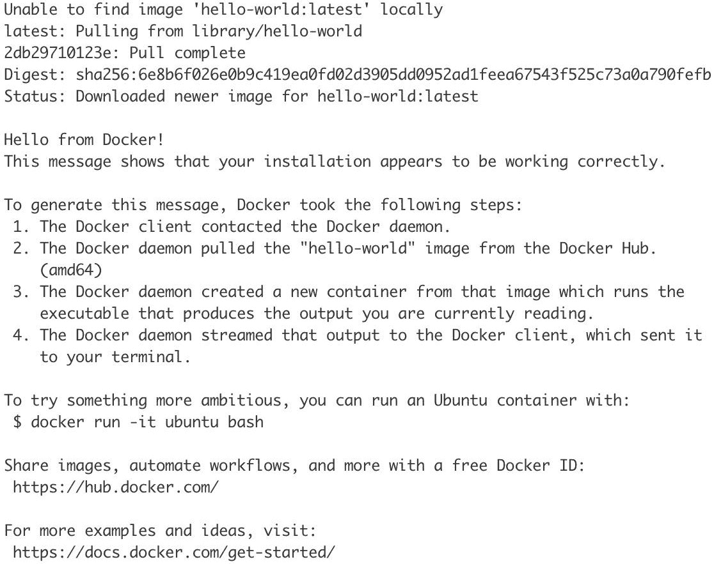
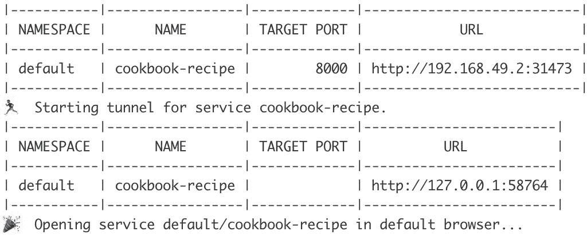
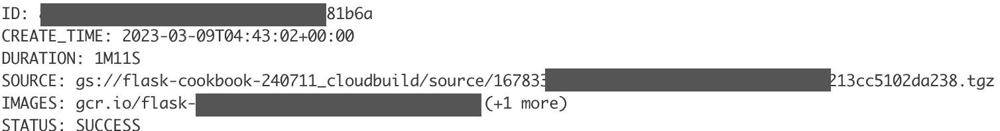
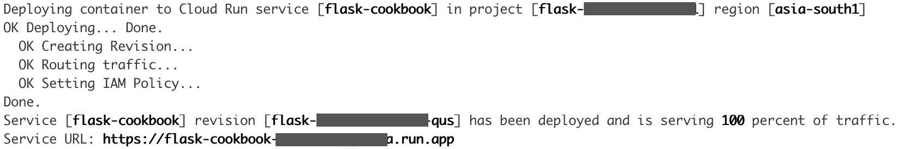
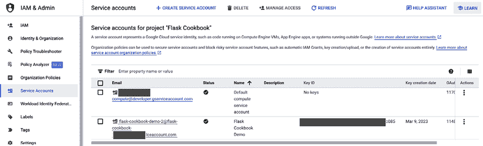
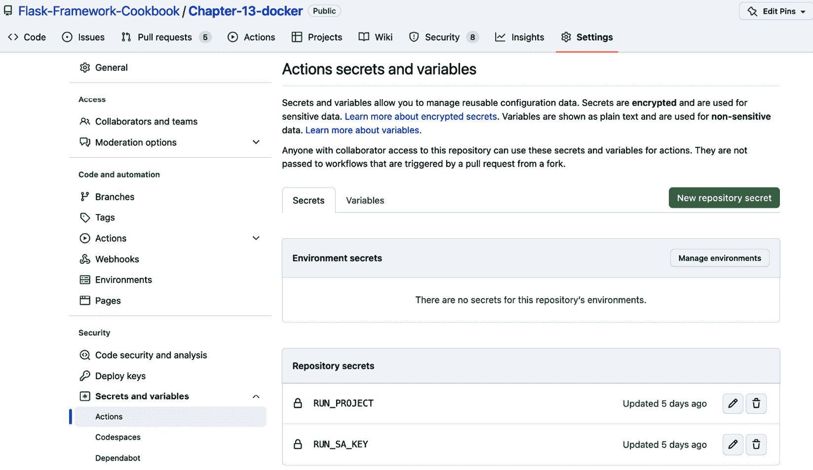
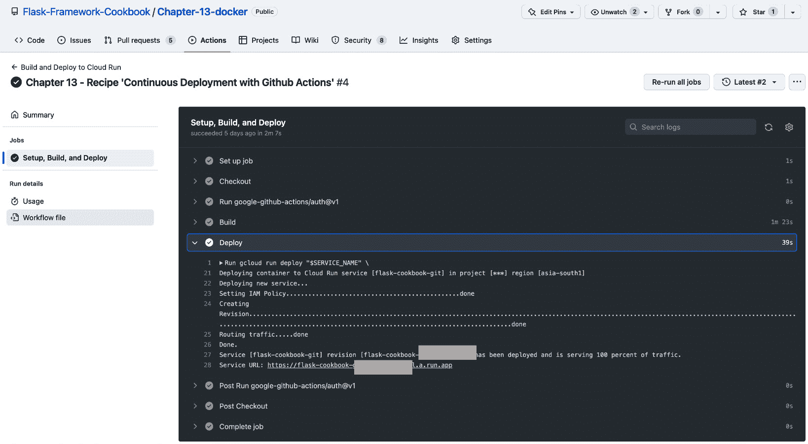

# 12

# 微服务和容器

到目前为止，我们一直将完整的应用程序作为一个代码块（通常称为**单体**）来开发，它通常被设计、测试和部署为一个单一单元。扩展也以类似的方式进行，要么整个应用程序进行扩展，要么不扩展。然而，随着应用程序规模的扩大，自然希望将单体分解成更小的块，以便可以分别管理和扩展。解决这个问题的方案是微服务。本章全部关于微服务，我们将探讨创建和管理微服务的几种方法。

微服务是一种将软件应用程序作为多个松散耦合服务的集合来开发和架构的方法。这些服务被设计和开发出来，以帮助构建具有清晰和细粒度接口的单功能模块。如果设计和架构得当，这种模块化的好处是，整体应用程序更容易理解、开发、维护和测试。多个小型自主团队可以并行工作在多个微服务上，因此开发并交付应用程序的时间实际上得到了有效减少。现在，每个微服务都可以单独部署和扩展，这允许减少停机时间和实现成本效益的扩展，因为只有高流量服务可以根据预定义的标准进行扩展。其他服务可以按常规运行。

本章将从一些常见的术语开始，这些术语可能在讨论微服务时都会听到——那就是，容器和 Docker。首先，我们将探讨如何使用 Docker 容器部署 Flask 应用程序。然后，我们将探讨如何使用 Kubernetes（这是最好的容器编排工具之一）有效地扩展和管理多个容器。接着，我们将探讨如何使用一些云平台（如**AWS Lambda**和**GCP Cloud Run**）创建完全管理的微服务。最后，我们将探讨如何使用**GitHub Actions**将所有这些整合成一个无缝的部署管道。

在本章中，我们将涵盖以下内容：

+   使用 Docker 容器化

+   使用 Kubernetes 编排容器

+   使用 Google Cloud Run 进行无服务器部署

+   使用 GitHub Actions 进行持续部署

# 使用 Docker 容器化

容器可以被视为一个标准化的代码包，其中包含了运行应用程序及其所有依赖项所需的代码，这使得应用程序可以在多个环境和平台上以统一的方式运行。**Docker**是一个工具，它允许通过标准且简单的方法创建、分发、部署和运行使用容器的应用程序。

Docker 实质上是一种虚拟化软件，但它不是可视化整个操作系统，而是允许应用程序使用底层主机操作系统，并要求应用程序根据需要打包额外的依赖项和组件。这使得 Docker 容器镜像非常轻量级且易于分发。

## 准备工作

第一步是安装 Docker。Docker 的安装步骤因所使用的操作系统而异。每个操作系统的详细步骤可以在 [`docs.docker.com/install/`](https://docs.docker.com/install/) 找到。

小贴士

Docker 是一种快速发展的软件，在过去的几年中已经发布了多个主要版本，其中许多旧版本已被弃用。我建议您始终仔细阅读文档，以避免安装任何 Docker 的旧版本。

一旦 Docker 成功安装，请转到终端并运行以下命令：

```py
$ docker ps
CONTAINER ID   IMAGE   COMMAND   CREATED   STATUS   PORTS   NAMES
```

之前的命令用于列出所有正在运行的容器。如果它没有错误地运行并显示以 `CONTAINER ID` 开头的标题行，那么 Docker 已成功安装。

信息

Docker 的不同版本，无论是旧版还是当前版本，都被称为 Docker Toolbox、Docker Machine、Docker Engine、Docker Desktop 等。这些名称将在文档和互联网上的其他资源中多次出现。有很大可能性，这些名称在未来也可能发生变化或发展。为了简单起见，我将只称所有这些为 **Docker**。

验证 Docker 安装的一个更有趣的方法是尝试运行一个 `hello-world` 容器。只需运行以下命令：

```py
$ docker run hello-world
```

之前的命令应该给你以下输出。它列出了 Docker 执行此命令所采取的步骤。我建议仔细阅读：



图 12.1 – 测试 Docker

## 如何操作...

我们将从 *使用 New Relic 管理和监控应用程序性能* 的配方中的目录应用程序开始，该配方位于 *第十一章*：

1.  创建容器的第一步是为它创建一个镜像。可以通过创建一个名为 `Dockerfile` 的文件以脚本方式轻松创建 Docker 镜像。我们的应用程序的基本 `Dockerfile` 可能如下所示：

    ```py
    FROM python:3
    ```

    ```py
    WORKDIR /usr/src/app
    ```

    ```py
    COPY requirements.txt requirements.txt
    ```

    ```py
    RUN pip install -r requirements.txt
    ```

    ```py
    COPY . .
    ```

    ```py
    ENTRYPOINT [ "python" ]
    ```

    ```py
    CMD [ "run.py" ]
    ```

上述文件中的每一行都是一个以线性自上而下的方式执行的命令。`FROM` 指定了新应用程序容器镜像将构建在其上的基础容器镜像。我选择了基础镜像 `python:3`，这是一个安装了 `Python 3.11` 的 Linux 镜像。

信息

写这本书的时候，`python:3` Docker 基础镜像预装了 `Python 3.11`。这会随着时间的推移而改变。

`WORKDIR`指示应用程序将被安装的默认目录。我已经将其设置为`/usr/src/app`。在此之后运行的任何命令都将从这个文件夹内部执行。

`COPY`命令简单地将从本地机器上指定的文件复制到容器文件系统中。我已经将`requirements.txt`复制到了`/usr/src/app`。

这后面跟着`RUN`，它执行提供的命令。在这里，我们使用`pip`安装了`requirements.txt`中的所有依赖项。然后，我简单地从当前本地文件夹（本质上是我的应用程序根文件夹）复制了所有文件到`/usr/src/app`。

最后，定义了一个`ENTRYPOINT`，它指示了默认的`CMD`命令，当容器启动时应运行此命令。在这里，我简单地通过运行`python run.py`来运行我的应用程序。

信息

Dockerfile 提供了许多其他关键字，所有这些都可以用来创建强大的脚本。有关更多信息，请参阅[`docs.docker.com/engine/reference/builder/`](https://docs.docker.com/engine/reference/builder/)。

小贴士

运行应用程序有多种方式，如*第十一章*中概述的，*部署和部署后*。我强烈建议你在将应用程序 docker 化时使用这些方法。

1.  要运行 Dockerfile，你必须在应用程序的根文件夹中有一个`requirements.txt`文件。如果你没有，你可以简单地使用以下命令生成一个`requirements.txt`文件：

    ```py
    $ pip freeze > requirements.txt
    ```

以下是我的`requirements.txt`文件。我鼓励你生成自己的文件，而不是使用下面的文件，因为 Python 包版本会演变，你将希望使用最新和最相关的版本：

```py
aiohttp==3.8.4
aiosignal==1.3.1
async-timeout==4.0.2
attrs==22.2.0
Babel==2.11.0
blinker==1.5
boto3==1.26.76
botocore==1.29.76
certifi==2022.12.7
charset-normalizer==3.0.1
click==8.1.3
Flask==2.2.3
flask-babel==3.0.1
Flask-SQLAlchemy==3.0.3
Flask-WTF==1.1.1
frozenlist==1.3.3
geoip2==4.6.0
greenlet==2.0.2
gunicorn==20.1.0
idna==3.4
itsdangerous==2.1.2
Jinja2==3.1.2
jmespath==1.0.1
MarkupSafe==2.1.2
maxminddb==2.2.0
multidict==6.0.4
python-dateutil==2.8.2
pytz==2022.7.1
requests==2.28.2
s3transfer==0.6.0
sentry-sdk==1.15.0
six==1.16.0
SQLAlchemy==2.0.4
tornado==6.2
typing_extensions==4.5.0
urllib3==1.26.14
Werkzeug==2.2.3
WTForms==3.0.1
yarl==1.8.2
newrelic==8.7.0
```

小贴士

如果你的`requirements.txt`文件中有`mod_wsgi`，你可以从文件中删除它，除非你特别想使用`Apache`在 Docker 容器中运行你的应用程序。`mod_wsgi`是一个特定于操作系统的包，你开发机器上的操作系统可能与 Docker 镜像上的操作系统不匹配，这会导致安装失败。

1.  在`run.py`中需要做一些小的修改，修改后它将如下所示：

    ```py
    from my_app import app
    ```

    ```py
    app.run(debug=True, host='0.0.0.0', port='8000')
    ```

我已经将`host`参数添加到了`app.run`中。这允许应用程序在 Docker 容器外部被访问。

1.  在创建`Dockerfile`之后，构建一个 Docker 容器镜像，然后可以像这样运行：

    ```py
    $ docker build -t cookbook .
    ```

在这里，我们要求 Docker 使用同一位置的 Dockerfile 构建一个镜像。`-t`参数设置了将要构建的镜像的名称/标签。最后的参数是一个点（`.`），表示当前文件夹中的所有内容都需要打包到构建中。当第一次运行此命令时，可能需要一段时间来处理，因为它将下载基础镜像以及我们应用程序的所有依赖项。

让我们检查创建的镜像：

```py
$ docker images
REPOSITORY     TAG     IMAGE ID       CREATED          SIZE
cookbook    latest   bceac988395a   48 seconds ago   1.13GB
```

1.  接下来，运行此镜像以创建一个容器：

    ```py
    $ docker run -d -p 8000:8000 cookbook:latest
    ```

**92a7ee37e044cf59196f5ec4472d9ffb540c7f48ee3f4f1e5f978f7f93b301ba**

在这里，我们要求 Docker 使用在底部的 `Dockerfile` 中指定的命令来运行容器。`-d` 参数要求 Docker 在后台以分离模式运行容器；否则，它将阻塞当前 shell 窗口的控制。`-p` 将主机机的端口映射到 Docker 容器端口。这意味着我们要求 Docker 将本地机器上的端口 `8000` 映射到容器上的端口 `8000`。`8000` 是我们运行 Flask 应用程序（见 `run.py`）的端口。最后一个参数是容器镜像的名称，它是 `REPOSITORY` 和 `TAG` 的组合，如 `docker images` 命令所示。或者，你也可以只提供一个 `IMAGE ID`。

## 它是如何工作的…

打开浏览器并访问 `http://localhost:8000/` 来查看正在运行的应用程序。

现在，再次运行 `docker ps` 来查看正在运行的容器的详细信息：

```py
$ docker ps
CONTAINER ID   IMAGE             COMMAND           CREATED         STATUS         PORTS                    NAMES
92a7ee37e044   cookbook:latest   "python run.py"   7 seconds ago   Up 6 seconds   0.0.0.0:8000->8000/tcp   beautiful_ritchie
```

## 相关阅读

+   你可以在 [`docs.docker.com/engine/reference/builder/`](https://docs.docker.com/engine/reference/builder/) 上了解更多关于 Dockerfile 的信息。

+   Docker 对容器的定义可以在 [`www.docker.com/resources/what-container`](https://www.docker.com/resources/what-container) 中阅读。

+   你可以在 [`en.wikipedia.org/wiki/Microservices`](https://en.wikipedia.org/wiki/Microservices) 上了解有关微服务的一般信息。

+   Martin Fowler 关于微服务的第一篇文章可以在 [`martinfowler.com/articles/microservices.html`](https://martinfowler.com/articles/microservices.html) 找到。

# 使用 Kubernetes 编排容器

如前一个菜谱所示，Docker 容器非常简单且强大，但如果没有强大的容器编排系统，管理容器可能会变得相当复杂。**Kubernetes**（也写作 **K8s**）是一个开源的容器编排系统，它自动化了容器化应用程序的管理、部署和扩展。它最初是在 Google 开发的，经过多年的发展，已经成为最受欢迎的容器编排软件。它在所有主要云提供商中都有广泛的应用。

## 准备工作

在这个菜谱中，我们将看到如何利用 Kubernetes 自动部署和扩展我们在上一个菜谱中创建的应用容器。

Kubernetes 与 Docker Desktop 的新版本一起打包，并以非常直接的方式工作。然而，我们将使用 **minikube**，这是 Kubernetes 本身提供的一个标准发行版。它相当受欢迎，适合入门。对于这个菜谱，我将使用 Minikube，它将允许在本地机器上的虚拟机中运行单个节点的 Kubernetes 集群。你也可以选择使用其他 Kubernetes 发行版；有关更多详细信息，请参阅 [`kubernetes.io/docs/setup/`](https://kubernetes.io/docs/setup/)。

要安装 Minikube，请按照您操作系统的说明在 [`minikube.sigs.k8s.io/docs/start/`](https://minikube.sigs.k8s.io/docs/start/) 中进行操作。

信息

Kubernetes 是一个涵盖多个维度的巨大主题。有多个书籍仅专注于 Kubernetes，还有更多正在编写。在这个配方中，我们将介绍 Kubernetes 的一个非常基本的实现，以便您熟悉它。

## 如何操作...

按照以下步骤了解如何创建和使用本地 Kubernetes 集群：

1.  安装 Minikube 后，在您的本地机器上创建一个 Minikube 集群：

    ```py
    $ minikube start
    ```

    ```py
    😄  minikube v1.29.0 on Darwin 13.0
    ```

    ```py
    ✨  Automatically selected the docker driver. Other choices: hyperkit, ssh
    ```

    ```py
    📌  Using Docker Desktop driver with root privileges
    ```

    ```py
    👍  Starting control plane node minikube in cluster minikube
    ```

    ```py
    🚜  Pulling base image …
    ```

    ```py
    . . . .
    ```

    ```py
    Downloading and installing images
    ```

    ```py
    . . .
    ```

    ```py
    🔎  Verifying Kubernetes components...
    ```

    ```py
    🌟  Enabled addons: storage-provisioner, default-storageclass
    ```

    ```py
    🏄  Done! kubectl is now configured to use "minikube" cluster and "default" namespace by default
    ```

如您所见，前面的命令下载了一组镜像以设置和运行 Minikube，这将在您的本地机器上创建一个虚拟机。使用这些镜像创建虚拟机后，将启动一个仅有一个节点的简单 Kubernetes 集群。这个过程在第一次运行时可能需要一些时间。

Minikube 还提供了一个浏览器仪表板视图。可以通过运行以下命令来启动：

```py
$ minikube dashboard
🔌  Enabling dashboard ...
▪ Using image docker.io/kubernetesui/metrics-scraper:v1.0.8
▪ Using image docker.io/kubernetesui/dashboard:v2.7.0
🤔  Verifying dashboard health ...
🚀  Launching proxy ...
🤔  Verifying proxy health ...
🎉  Opening http://127.0.0.1:57206/api/v1/namespaces/kubernetes-dashboard/services/http:kubernetes-dashboard:/proxy/ in your default browser...
```

访问前面命令输出的 URL 来查看仪表板。

在 Kubernetes 中，容器在 pod 中部署，其中 pod 可以定义为共享资源和网络的一组一个或多个容器。在这个配方中，我们将在一个 pod 中只有一个容器。

1.  无论何时使用 Minikube 创建部署，它都会在云基础镜像仓库中查找 Docker 镜像，例如 Docker Hub 或 Google Cloud Registry，或者某些自定义的仓库。对于这个配方，我们打算使用本地 Docker 镜像来创建部署。因此，我们将运行以下命令，该命令将 `docker` 环境设置为 `minikube docker`：

    ```py
    $ eval $(minikube -p minikube docker-env)
    ```

1.  现在，使用前面设置的 `docker` 环境重新构建 Docker 镜像：

    ```py
    $ docker build -t cookbook .
    ```

关于构建 Docker 镜像的更多细节，请参考之前的配方，*使用 Docker 容器化*。

1.  接下来，在您的应用程序根目录中创建一个名为 `cookbook-deployment.yaml` 的文件：

    ```py
    apiVersion: apps/v1
    ```

    ```py
    kind: Deployment
    ```

    ```py
    metadata:
    ```

    ```py
      creationTimestamp: null
    ```

    ```py
      labels:
    ```

    ```py
        app: cookbook-recipe
    ```

    ```py
      name: cookbook-recipe
    ```

    ```py
    spec:
    ```

    ```py
      replicas: 1
    ```

    ```py
      selector:
    ```

    ```py
        matchLabels:
    ```

    ```py
          app: cookbook-recipe
    ```

    ```py
      strategy: {}
    ```

    ```py
      template:
    ```

    ```py
        metadata:
    ```

    ```py
          creationTimestamp: null
    ```

    ```py
          labels:
    ```

    ```py
            app: cookbook-recipe
    ```

    ```py
        spec:
    ```

    ```py
          containers:
    ```

    ```py
          - image: cookbook:latest
    ```

    ```py
            name: cookbook
    ```

    ```py
            resources: {}
    ```

    ```py
            imagePullPolicy: Never
    ```

    ```py
    status: {}
    ```

在此文件中，我们创建了一个名为 `cookbook-recipe` 的部署，它使用 `cookbook:latest` 镜像。请注意 `imagePullPolicy`，它设置为 `Never` – 这表示 kubectl 不应尝试从在线 Docker 仓库（如 Docker Hub 或 **Google Container Registry** （**GCR**））获取镜像；相反，它应始终在本地搜索此镜像。

1.  现在，使用 kubectl `apply` 之前文件以创建 Kubernetes 部署：

    ```py
    $ kubectl apply -f cookbook-deployment.yaml
    ```

    ```py
    deployment.apps/cookbook-recipe created
    ```

您可以通过运行以下命令来验证和获取已创建部署的状态：

```py
$ kubectl get deployments
NAME              READY   UP-TO-DATE   AVAILABLE   AGE
cookbook-recipe   1/1     1            1           26s
```

检查 `READY`、`UP-TO-DATE` 和 `AVAILABLE` 列的值。这些值代表集群中我们的应用程序副本的数量。

1.  我们的应用程序现在正在运行，但目前无法在集群外部访问。要使应用程序在 Kubernetes 集群外部可用，请创建一个 `LoadBalancer` 类型的服务：

    ```py
    $ kubectl expose deployment cookbook-recipe --type=LoadBalancer --port=8000
    ```

    ```py
    service/cookbook-recipe exposed
    ```

在上一步中创建的部署将我们的应用程序暴露在端口`8000`上，这是集群内部的。前面的命令已经将这个内部的`8000`端口暴露给集群外部的任何随机端口，因此可以通过浏览器访问。

## 它是如何工作的...

要在浏览器中打开应用程序，请运行以下命令：

```py
$ minikube service cookbook-recipe
```



图 12.2 – 使用 Kubernetes 部署的服务

运行前面的命令将在随机端口（如`58764`）上的浏览器中打开应用程序。

使用 Kubernetes 扩展部署非常简单。这只需要运行一个命令。通过这样做，应用程序将在多个 Pod 中进行复制：

```py
$ kubectl scale --replicas=3 deployment/cookbook-recipe
deployment.apps/cookbook-recipe scaled
```

现在，再次查看部署的状态：

```py
$ kubectl get deployments
NAME              READY   UP-TO-DATE   AVAILABLE   AGE
cookbook-recipe   3/3     3            3           90s
```

检查`READY`、`UP-TO-DATE`和`AVAILABLE`列中的副本值，这些值将从`1`增加到`3`。

## 更多内容...

您可以查看 Kubernetes 自动为部署和服务创建的 YAML 配置：

```py
apiVersion: v1
kind: Service
metadata:
  creationTimestamp: "2023-03-06T08:23:24Z"
  labels:
    app: cookbook-recipe
  name: cookbook-recipe
  namespace: default
  resourceVersion: "5991"
  uid: 1253962c-f3d5-4a1f-b997-c11a4abd2b33
spec:
  allocateLoadBalancerNodePorts: true
  clusterIP: 10.105.38.134
  clusterIPs:
  - 10.105.38.134
  externalTrafficPolicy: Cluster
  internalTrafficPolicy: Cluster
  ipFamilies:
  - IPv4
  ipFamilyPolicy: SingleStack
  ports:
  - nodePort: 31473
    port: 8000
    protocol: TCP
    targetPort: 8000
  selector:
    app: cookbook-recipe
  sessionAffinity: None
  type: LoadBalancer
status:
  loadBalancer: {}
```

上一段代码是服务的配置。您可以选择创建/保存并`应用`这个配置（而不是像我们在*步骤 5*中为部署所做的那样，在命令行中指定配置值）。

信息

在这个菜谱中，我展示的是 Kubernetes 的一个非常基本的实现。这个目的在于让您熟悉 Kubernetes。这个菜谱并不打算成为一个生产级别的实现。理想情况下，需要创建配置文件，然后围绕这些文件构建整体的 Kubernetes 部署。我敦促您基于这个菜谱的知识，努力追求 Kubernetes 的生产级技术。

## 参见

要了解更多信息，请查看以下资源：

+   从[`kubernetes.io/docs/concepts/overview/`](https://kubernetes.io/docs/concepts/overview/)开始了解 Kubernetes。

+   Kubernetes 的基础知识可在[`kubernetes.io/docs/tutorials/kubernetes-basics/`](https://kubernetes.io/docs/tutorials/kubernetes-basics/)找到。

+   可以遵循[`kubernetes.io/docs/tutorials/hello-minikube/`](https://kubernetes.io/docs/tutorials/hello-minikube/)中的 Minikube 教程。

+   您可以在[`minikube.sigs.k8s.io/docs/start/`](https://minikube.sigs.k8s.io/docs/start/)了解 Minikube 安装的详细信息。

+   完整的 Kubernetes 文档可在[`kubernetes.io/docs/home/`](https://kubernetes.io/docs/home/)找到。

# 使用 Google Cloud Run 实现无服务器

**无服务器计算**是一种云计算模型，其中云服务提供商运行服务器，并根据消费动态调整机器资源的分配，通过扩展或缩减资源来管理。计费基于实际使用的资源。它还简化了部署代码的整体流程，并且对于不同环境（如开发、测试、预生产和生产）维护不同的执行变得相对容易。无服务器计算的特性使这种模型成为开发部署大量微服务而不必担心管理开销的理想选择。

知识点

为什么这个模型被称为“无服务器”，尽管其中涉及服务器？

尽管涉及一个服务器来托管你的应用程序并处理进入应用程序的请求，但服务器的生命周期与单个请求一样短。因此，你可以将服务器视为只为单个请求而存在的东西。因此，服务器的生命周期通常是毫秒级的。

如谷歌所述，**Cloud Run** 是一个托管计算平台，允许你直接在谷歌的可扩展基础设施上运行容器。此外，由于 Google Cloud 提供了大量与 Cloud Run 非常好集成的其他服务，它允许我们构建具有许多不同云供应商部件的全功能应用程序。

注意

在整个菜谱中，我将交替使用 **Google Cloud**、**Google Cloud Platform** 和 **GCP** 这三个术语。

小贴士

使用无服务器工具进行部署允许开发者更多地专注于编写代码，而不是担心基础设施。

## 准备工作

在你能够使用 Cloud Run 部署之前，你需要设置你的机器上的 `gcloud` CLI，从那里你将部署你的应用程序到 Cloud Run。按照以下步骤操作：

1.  首先，在 Google Cloud Platform 上创建一个账户。如果你还没有账户，请访问 [`console.cloud.google.com/getting-started`](https://console.cloud.google.com/getting-started) 并创建一个新的账户。然后，创建一个项目，你将在其中部署你的应用程序。

一旦你创建了账户，请确保你有一个激活的计费账户。即使你不会为此菜谱的使用案例付费，谷歌也要求你激活一个计费账户并将其链接到你的项目。

1.  接下来，安装 `gcloud` CLI。这非常依赖于操作系统，所以请在此处查找适当的说明：[`cloud.google.com/sdk/docs/install`](https://cloud.google.com/sdk/docs/install)。

`gcloud` CLI 使用 Python 3.5 到 3.9 版本进行安装。如果你有 Python 3.10 或 3.11 等后续版本，你不必担心，因为 `gcloud` 将下载它自己的 Python 版本并为自身创建一个虚拟环境。

1.  一旦完成 `gcloud` 的安装，运行以下命令以初始化 `gcloud` 并进行一些基本设置：

    ```py
    $ gcloud init
    ```

执行此命令将要求您提供一些详细信息，例如您想要使用哪个 GCP 账户来链接到您的 `gcloud` CLI。在桌面电脑上，它将打开浏览器并要求您登录您的 GCP 账户。请确保登录的用户有足够的权限部署到 Cloud Run。对于这个食谱，`owner` 权限应该处理所有事情。

然后，您将需要选择您想要使用的 GCP 项目。

您可以通过再次运行相同的命令来更改此配置。

## 如何做…

请按照以下步骤操作：

1.  在设置和初始化 `gcloud` 之后，下一步是创建并将您的应用程序容器上传到 GCR。您还可以使用其他容器注册表，如 Docker Hub，但这超出了本食谱的范围。

重要

Cloud Run 预期应用程序在端口 `8080` 上运行。因此，更新您的 `run.py` 以在 `8080` 上运行，而不是像我们在本书中迄今为止所做的那样在 `8000` 或 `5000` 上运行。

从您的应用程序根目录（您的 `Dockerfile` 所在的位置）运行以下命令：

```py
$ gcloud builds submit --tag "gcr.io/<Your project
  ID>/<Name of your container image>"
```

之前的命令使用 `Dockerfile` 创建了一个 Docker 容器，然后将其上传到命令中提供的路径上的 GCR。执行成功后，您将获得类似于以下响应：



图 12.3 – GCR 镜像创建

1.  现在，使用您创建的镜像将您的应用程序部署到 Cloud Run。运行以下命令进行相同的操作：

    ```py
    $ gcloud run deploy "your-application-name" –image
    ```

    ```py
      "gcr.io/<Your project ID>/<Name of your container
    ```

    ```py
      image>" --allow-unauthenticated --platform "managed"
    ```

如果尚未设置部署区域，此命令将要求您输入一个区域；然后，它将花费几分钟将应用程序成功部署到 Cloud Run。完成后，它将提供可以访问应用程序的服务 URL。请参阅以下截图：



图 12.4 – Cloud Run 上的部署

## 它是如何工作的…

要检查应用程序部署是否成功并且按预期运行，请打开之前截图所示的服务 URL。它应该打开应用程序的主页。

## 参见

要了解更多信息，请查看以下资源：

+   您可以在 [`cloud.google.com/run/docs/overview/what-is-cloud-run`](https://cloud.google.com/run/docs/overview/what-is-cloud-run) 了解更多关于 Cloud Run 的信息。

+   还有其他无服务器工具和平台，如 Serverless、Zappa、AWS Beanstalk、AWS Lambda 等。我敦促您自己探索它们。基本概念保持不变。

# 使用 GitHub Actions 进行持续部署

持续部署是一种部署策略，它允许在提交代码更改时将软件部署和发布到其相关环境（在大多数情况下是生产环境）。通常，这之前会有自动测试用例；当这些测试通过时，代码会自动部署。

**GitHub Actions**是由 GitHub 提供的一个持续部署平台，允许您在特定的动作（如代码提交/合并/拉取请求）上触发工作流程。这些工作流程可以用于部署到您选择的云提供商。GitHub Actions 最好的地方是它能够无缝集成到 GitHub 中。

可以使用其他工具执行持续部署，但我会专注于 GitHub Actions，因为它是最容易理解和采用的之一。

## 准备工作

对于这个配方，我假设您有一个 GitHub 账户并且了解 GitHub 上管理代码和仓库的基本知识。

在这个配方中，我们将基于上一个配方中的应用程序进行构建。

需要执行两个步骤才能为这个配方做好准备：

1.  在上一个配方中，Google Cloud 的认证步骤是在`gcloud init`期间执行的，当时你被要求登录到 GCP。但是当从 GitHub Actions 部署时，你不会有这种自由；因此，你需要在 Google Cloud 上创建一个服务账户，它有权限在 GCR 上创建容器镜像并将其部署到 Cloud Run。

要创建服务账户，请转到您的 GCP 控制台并打开**IAM & Admin**。接下来，创建一个服务账户并授予它相关的权限/角色。为了测试这个配方，**所有者**权限应该足够。一旦创建并配置了服务账户，它应该看起来像这样：

图 12.5 – GCP 上的服务账户

当有机会时，下载服务账户文件（JSON 格式）。该文件无法再次下载。

1.  接下来，配置您的 GitHub 仓库，以便它在部署运行时存储将被读取的秘密。通过转到`RUN_PROJECT`和`RUN_SA_KEY`来访问您的 GitHub 仓库。

`RUN_PROJECT`是您的 GCP 项目 ID，而`RUN_SA_KEY`是您在上一步中下载的服务账户 JSON 文件的内容：



图 12.6 – GitHub 仓库密钥

## 如何操作...

现在，在您的应用程序根目录中创建一个名为`.github/workflows/main.yml`的文件。确保文件路径已正确创建。您需要在其中创建两个文件夹名为`.github`和`workflows`，然后在后者中创建`main.yml`文件。以下是该文件的内容：

```py
name: Build and Deploy to Cloud Run
on:
  push:
    branches:
    - vol-3
env:
  PROJECT_ID: ${{ secrets.RUN_PROJECT }}
  RUN_REGION: asia-south1
  SERVICE_NAME: flask-cookbook-git
jobs:
  setup-build-deploy:
    name: Setup, Build, and Deploy
    runs-on: ubuntu-latest
    steps:
    - name: Checkout
      uses: actions/checkout@v3
    # Setup gcloud CLI
    - uses: 'google-github-actions/auth@v1'
      with:
        credentials_json: ${{ secrets.RUN_SA_KEY }}
        project_id: ${{ secrets.RUN_PROJECT }}
    # Build and push image to Google Container Registry
    - name: Build
      run: |-
        gcloud builds submit \
          --quiet \
          --tag "gcr.io/$PROJECT_ID/$SERVICE_NAME"
    # Deploy image to Cloud Run
    - name: Deploy
      run: |-
        gcloud run deploy "$SERVICE_NAME" \
          --quiet \
          --region "$RUN_REGION" \
          --image "gcr.io/$PROJECT_ID/$SERVICE_NAME" \
          --platform "managed" \
          --allow-unauthenticated
```

在这个文件中，首先，我们指定了 GitHub 动作在代码推送时触发的分支。然后，我们有一些环境变量将在文件中的下一步中使用。接着创建了一个名为“设置、构建和部署”的工作，它指定了操作系统，在我们的例子中是 Ubuntu。该工作由四个步骤组成：

1.  **检出**：检出之前指定的 GitHub 分支的代码。

1.  `gcloud`并使用服务账户凭证文件进行认证。

1.  `gcloud submit`。

1.  **部署镜像到 Cloud Run**：将前一步创建的 Docker 镜像部署到 Cloud Run。

现在，只需将您的代码提交并推送到相关分支。

## 它是如何工作的...

当代码推送到 GitHub 的正确分支时，GitHub 动作就会被触发。一个成功的 GitHub 动作看起来像这样：



图 12.7 – 成功的 GitHub 动作执行

要查看您的应用程序正在运行，请复制服务 URL，如前一个屏幕截图所示，并在您的浏览器中打开它。

小贴士

如果您从本书开始就一直在跟随，那么这个菜谱就是一个思考所有主要部分如何拼凑在一起以完成拼图的好地方。我们学习了如何创建 Flask 应用程序，然后将其复杂性增加，接着是单元测试用例，最后但同样重要的是，部署。

在这个菜谱中，我们自动化了被称为**持续部署**的代码提交部署。

您还可以修改您的 GitHub 工作流程，在构建镜像之前运行测试用例，并在失败时退出。这被称为**持续集成**。

## 参见

您可以在[`docs.github.com/en/actions/deployment/about-deployments/deploying-with-github-actions`](https://docs.github.com/en/actions/deployment/about-deployments/deploying-with-github-actions)了解更多关于 GitHub Actions 的信息。
