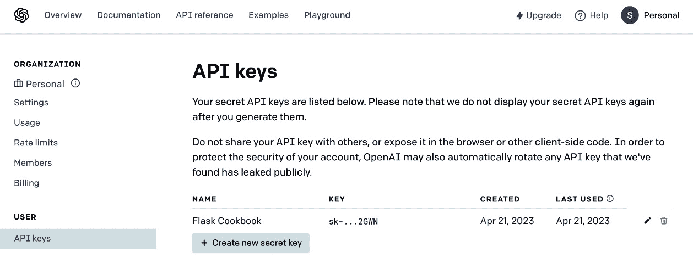
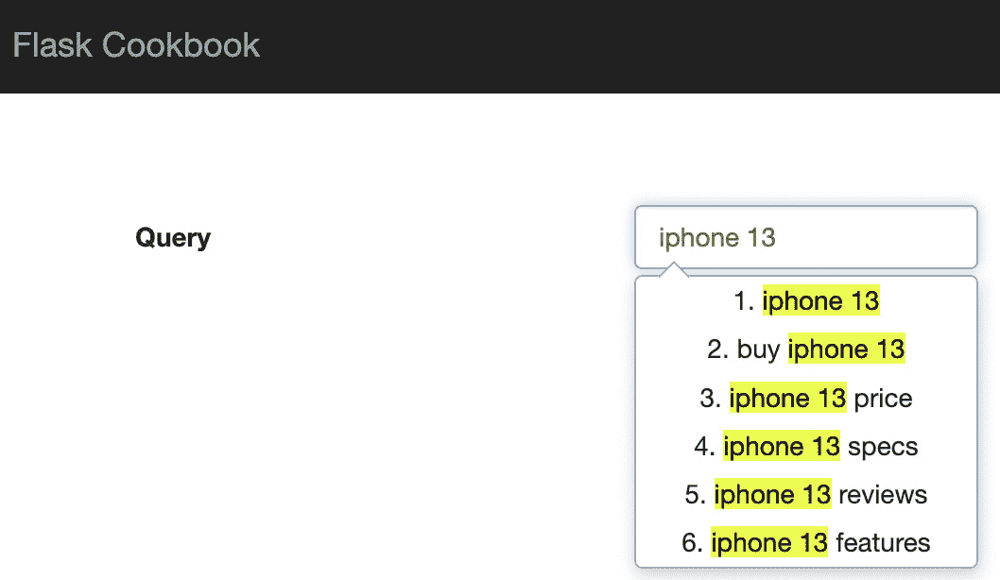
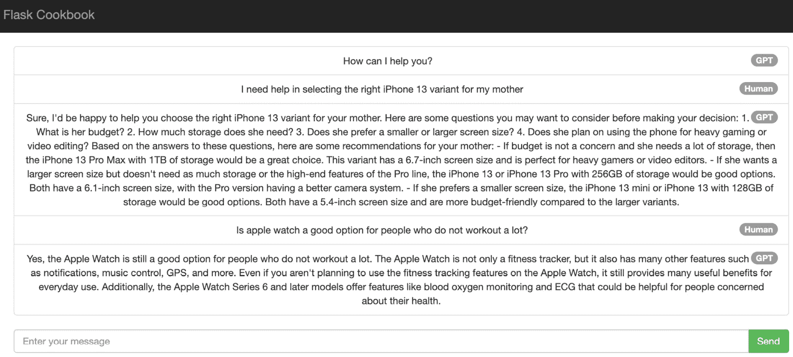
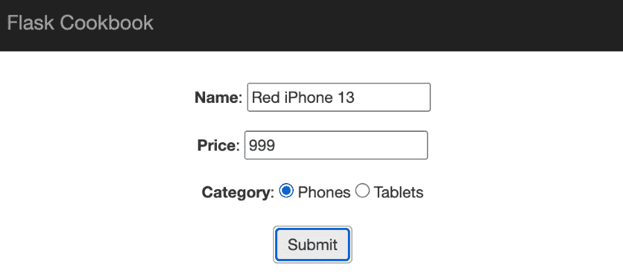
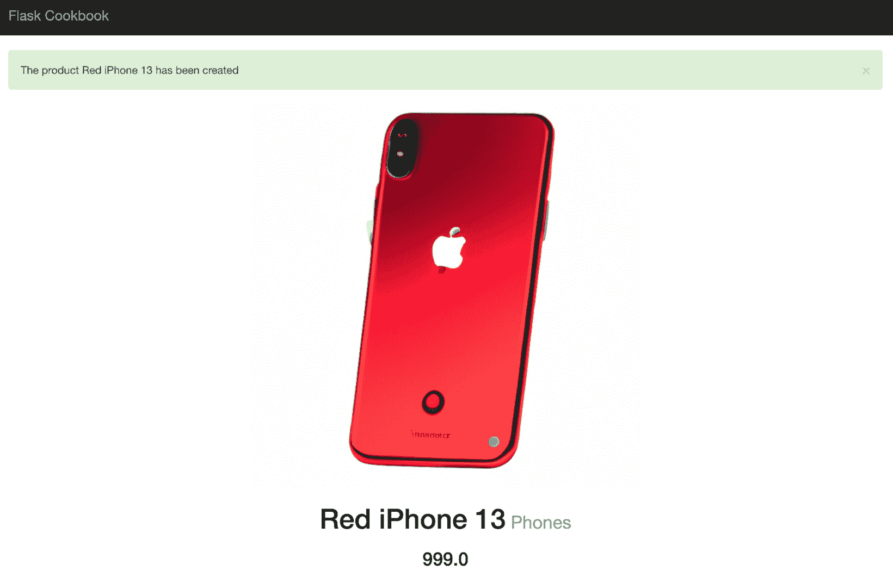

# 第十三章：使用 Flask 的 GPT

**GPT**（今天的最新热门词汇，代表**生成预训练转换器**），是由 **OpenAI** 开发的最先进的语言模型。它基于 Transformer 架构，并使用无监督学习来生成自然语言文本。GPT 首次在 2018 年 GPT-1 发布时推出，随后在 2019 年和 2020 年分别推出了 GPT-2 和 GPT-3。

GPT 最著名的应用之一是文本补全，它可以基于给定的提示生成连贯且语法正确的句子。这导致它在各种写作辅助工具中得到应用，例如文本编辑器和消息应用中的自动完成和自动纠错功能。

GPT 的另一个流行应用是在聊天机器人（如 ChatGPT）的开发中。凭借其生成自然语言响应的能力，GPT 可以创建模拟人类对话的聊天机器人，这使得它们在客户服务和其他应用中非常有用。

GPT 还被用于图像生成，它根据文本描述生成图像。这为艺术和设计等创意应用开辟了新的可能性。

信息

在本章中，我们将简要介绍一些主要针对 GPT 的新术语。其中最重要的新术语之一将是 **提示**。

简而言之，GPT 中的提示是一个起点或部分句子，它被提供给模型。这就像给模型一个建议或提示，以便它可以根据这个提示生成剩余的句子或段落。

例如，如果你想为一家餐厅生成评论，你可以从一个提示开始，比如“食物是...”，然后让 GPT 生成剩余的句子。生成的文本可能类似于“食物美味，香料和风味的平衡恰到好处。份量充足，摆盘美观。”

通过提供提示，你为 GPT 提供了一些上下文，并引导它生成符合该上下文的文本。这在各种自然语言处理任务中非常有用，例如文本补全、摘要等。

GPT 是一种强大的语言模型，已被应用于各种自然语言处理任务，例如文本补全、聊天机器人和图像生成。它生成类似人类文本的能力使其成为开发者的宝贵工具，尤其是对自然语言处理和相关网络应用（如使用 Flask 开发的应用）感兴趣的 Python 社区成员。

在本章中，我们将探讨如何实现 GPT 在我们提到的用例中的应用。GPT 的应用几乎无限，因为它开放于想象力和创造力，但在这章中，我将将其限制于一些适用于网络应用的基本但强大的示例。

在本章中，我们将介绍以下内容：

+   使用 GPT 自动化文本补全

+   使用 GPT 实现聊天（ChatGPT）

+   使用 GPT 生成图像

# 技术要求

对于本章中的所有食谱，以下步骤是常见且必需的：

+   我们将使用一个名为`openai`的库，这是 OpenAI 提供的官方 Python 库，用于与 GPT 一起工作：

    ```py
    $ pip install openai
    ```

+   我们还需要从 OpenAI 网站获取一个 API 密钥，这是使用 GPT 进行任何 API 调用的必要条件。为此，只需在[platform.openai.com](http://platform.openai.com)上创建一个账户，然后导航到**设置**以创建您的 API 密钥。以下是一个展示相同操作的截图：



图 13.1 – OpenAI 上用于 GPT 的 API 密钥

小贴士

请注意，OpenAI 的 GPT 是一个付费工具，并且截至撰写本书时，每个账户都有一笔 5 美元的小额赠款，为期 3 个月，用于实验和熟悉 API。一旦限额用尽，您将不得不选择付费计划。有关定价的更多信息，请参阅[`openai.com/pricing`](https://openai.com/pricing)。

# 使用 GPT 自动化文本补全

使用 GPT 进行文本补全涉及向模型提供一个提示或起始句子，然后模型生成一个连贯且相关的后续内容。GPT 在这个领域的功能令人印象深刻，因为它可以以高精度生成复杂且上下文相关的文本。这使得它成为涉及写作的 Web 应用的理想工具，如内容创作、自动纠错和消息传递。通过将这些应用中的 GPT 文本补全能力整合进去，开发者可以通过自动化繁琐或耗时的工作、提高书面内容的质量以及提供更自然和响应式的通信来增强用户体验。

如果我们谈论电子商务网站的环境，最重要的功能之一是有效的搜索。除了有效性之外，如果搜索变得互动且直观，那么它将非常吸引用户。在这个食谱中，我们将使用 GPT 实现文本补全，以在电子商务网站上构建直观且用户友好的搜索查询。

## 准备工作

请参阅本章开头的技术要求部分，以获取有关设置 GPT 的详细信息。

为了展示这个食谱的完整上下文，我将使用一个名为**Awesomplete**的 JavaScript 库来在演示搜索字段上实现自动完成功能。前往[`projects.verou.me/awesomplete/`](https://projects.verou.me/awesomplete/)下载静态文件并了解更多关于这个库的信息。

为了演示这个食谱，我们将从*第四章*中开发的代码库开始。

## 如何做到这一点...

按照以下步骤执行自动完成功能的设置，然后使用 GPT 进行文本补全：

1.  首先，将`my_app/templates/base.html`中的静态文件添加到项目中：

    ```py
    <!-- Group with other CSS files -—>
    ```

    ```py
    <link href="https://cdnjs.cloudflare.com/
    ```

    ```py
    ajax/libs/awesomplete/1.1.5/awesomplete.min.css"
    ```

    ```py
    rel="stylesheet">
    ```

    ```py
    <!-- Group with other JS files -—>
    ```

    ```py
    <script src="img/pre>

    ```

    ajax/libs/awesomplete/1.1.5/awesomplete.min.js">

    ```py

    ```

    </script>

    ```py

    ```

我直接从 CDN 链接到静态文件。你也可以选择将这些文件下载到你的静态文件文件夹中，并从那里引用。

1.  接下来，将 OpenAI 提供的 API 密钥添加到你的应用程序配置中的`my_app/__init__.py`：

    ```py
    app.config['OPENAI_KEY'] = 'Your own API Key'
    ```

1.  接下来，在`my_app/catalog/views.py`中创建一个新的方法来处理用户搜索词并将其转换为 GPT 生成的搜索查询：

    ```py
    import openai
    ```

    ```py
    @catalog.route('/product-search-
    ```

    ```py
      gpt',methods=['GET','POST'])
    ```

    ```py
    def product_search_gpt():
    ```

    ```py
     if request.method == 'POST':
    ```

    ```py
      query = request.form.get('query')
    ```

    ```py
      openai.api_key = app.config['OPENAI_KEY']
    ```

    ```py
      prompt = """Context: Ecommerce electronics website\n
    ```

    ```py
      Operation: Create search queries for a product\n
    ```

    ```py
                Product: """ + query
    ```

    ```py
            response = openai.Completion.create(
    ```

    ```py
                model="text-davinci-003",
    ```

    ```py
                prompt=prompt,
    ```

    ```py
                temperature=0.2,
    ```

    ```py
                max_tokens=60,
    ```

    ```py
                top_p=1.0,
    ```

    ```py
                frequency_penalty=0.5,
    ```

    ```py
                presence_penalty=0.0
    ```

    ```py
            )
    ```

    ```py
            return response['choices'][0][
    ```

    ```py
                'text'].strip('\n').split('\n')[1:]
    ```

    ```py
    return render_template('product-search-gpt-demo.html')
    ```

在前面的代码中，首先导入`openai`。然后在`catalog`蓝图下创建一个新的端点，相对路径为`/product-search-gpt`。这个端点服务于`GET`和`POST`请求。

在`GET`请求中，它将简单地渲染我们创建的`product-search-gpt-demo.html`模板，以演示这个食谱。

在`POST`请求中，它期望有一个名为`query`的表单字段，然后使用这个字段向`openai.Completion`模块发出一个相关的 API 请求。仔细查看我指定的`Context`之后的`Operation`需要执行的操作。没有定义你可以提供提示的格式；它只需要是 GPT 可以理解和工作的内容。GPT 返回的响应在发送到 JS 库进行解释之前需要一些格式化。

信息

注意我们在对`openai.Completion`模块发出的 API 请求中提供的多个参数。你可以在[`platform.openai.com/docs/api-reference/completions/create`](https://platform.openai.com/docs/api-reference/completions/create)了解更多关于它们的信息。

1.  最后，我们需要创建在最后一步中引用的模板。在`my_app/templates/product-search-gpt-demo.html`中创建一个新的模板文件：

    ```py
    
    ```

    ```py
    
    ```

    ```py
      <div class="top-pad">
    ```

    ```py
        <form
    ```

    ```py
            class="form-horizontal"
    ```

    ```py
            role="form">
    ```

    ```py
          <div class="form-group">
    ```

    ```py
            <label for="name" class="col-sm-2 control-
    ```

    ```py
              label">Query</label>
    ```

    ```py
            <div class="col-sm-10">
    ```

    ```py
              <input type="text" class="form-control
    ```

    ```py
                awesomplete" id="query" name="query">
    ```

    ```py
            </div>
    ```

    ```py
          </div>
    ```

    ```py
        </form>
    ```

    ```py
      </div>
    ```

    ```py
    
    ```

    ```py
    
    ```

    ```py
    <script>
    ```

    ```py
    $(document).ready(function(){
    ```

    ```py
      const input = document.querySelector(
    ```

    ```py
        'input[name="query"]' );
    ```

    ```py
      const awesomplete = new Awesomplete( input, {
    ```

    ```py
        tabSelect: true, minChars: 5 } );
    ```

    ```py
    function ajaxResults() {
    ```

    ```py
      $.ajax({
    ```

    ```py
       url: '{{ url_for("catalog.product_search_gpt") }}',
    ```

    ```py
            type: 'POST',
    ```

    ```py
            dataType: "json",
    ```

    ```py
            data: {
    ```

    ```py
                query: input.value
    ```

    ```py
            }
    ```

    ```py
        })
    ```

    ```py
        .done(function(data) {
    ```

    ```py
            awesomplete.list = data;
    ```

    ```py
        });
    ```

    ```py
      };
    ```

    ```py
      input.addEventListener( 'keyup', ajaxResults );
    ```

    ```py
    });
    ```

    ```py
    </script>
    ```

    ```py
    
    ```

在前面的代码中，我创建了一个简单的 HTML 表单，只有一个字段。它的目的是演示电子商务商店上的搜索字段。在这里，你可以输入任何你选择的产品，输入的值将被发送到 GPT 以创建帮助用户进行更精确搜索的搜索查询。

## 它是如何工作的…

在你的浏览器中打开`http://127.0.0.1:5000/product-search-gpt`。在查询字段中输入你选择的产品值，看看 GPT 如何提供更有帮助的搜索查询。这将在下面的屏幕截图中进行演示。



图 13.2 – 使用 GPT 进行文本补全

## 参见

+   在[`platform.openai.com/docs/guides/completion/introduction`](https://platform.openai.com/docs/guides/completion/introduction)了解使用 GPT 进行文本补全的用法和功能。

+   查看针对文本补全的详细 API 参考[`platform.openai.com/docs/api-reference/completions/create`](https://platform.openai.com/docs/api-reference/completions/create)

# 使用 GPT 实现聊天（ChatGPT）

毫无疑问，使用 GPT 进行的聊天，或者更通俗地说，**ChatGPT**，是 GPT 最广泛的应用。使用 GPT 进行聊天涉及在对话环境中使用模型生成对用户输入的自然语言回应。GPT 在这一领域的功能令人印象深刻，因为它可以生成连贯且与上下文相关的回应，模拟人类对话。这使得它成为涉及聊天机器人、虚拟助手或其他对话界面的网络应用的理想工具。

利用 GPT 生成类似人类回应的能力，使用这项技术开发的聊天机器人可以为用户提供更加个性化和吸引人的体验。通过理解对话的上下文并提供相关的回应，这些聊天机器人可以应用于广泛的场景，例如客户服务、预约安排等。

如果我们谈论电子商务网站或任何网络应用，最近的一个常见功能就是聊天机器人。所有企业都希望与他们的用户保持联系，但同时又可能不想雇佣很多客户支持人员。在这种情况下，ChatGPT 变得非常有帮助。我将通过一些基本示例在这个食谱中演示这一点。

## 准备工作

请参阅本章开头的技术要求部分，以获取设置 GPT 的详细信息。

我们将在之前的食谱“使用 GPT 进行文本补全”的基础上构建这个食谱。请参考该食谱以获取`openai`配置设置。

## 如何实现它...

按照以下步骤在你的 Flask 驱动的网络应用上实现一个基本的聊天机器人使用 ChatGPT：

1.  首先，创建一个处理程序来接收用户聊天消息并使用 ChatGPT 对他们进行回应。这应该在`my_app/catalog/views.py`中完成，如下所示：

    ```py
    @catalog.route('/chat-gpt', methods=['GET', 'POST'])
    ```

    ```py
    def chat_gpt():
    ```

    ```py
      if request.method == 'POST':
    ```

    ```py
          msg = request.form.get('msg')
    ```

    ```py
          openai.api_key = app.config['OPENAI_KEY']
    ```

    ```py
          messages = [
    ```

    ```py
              {
    ```

    ```py
                  "role": "system",
    ```

    ```py
                  "content": "You are a helpful chat
    ```

    ```py
                    assistant for a generic electronics
    ```

    ```py
                    Ecommerce website"
    ```

    ```py
                },
    ```

    ```py
                {"role": "user", "content": msg}
    ```

    ```py
            ]
    ```

    ```py
            response = openai.ChatCompletion.create(
    ```

    ```py
                model="gpt-3.5-turbo",
    ```

    ```py
                messages=messages
    ```

    ```py
            )
    ```

    ```py
            return jsonify(
    ```

    ```py
                message=response[
    ```

    ```py
                    'choices'][0]['message']['content']
    ```

    ```py
            )
    ```

    ```py
        return render_template('chatgpt-demo.html')
    ```

在前面的代码中，我们在`catalog`蓝图下创建了一个新的端点，具有相对路径`/chat-gpt`。此端点服务于`GET`和`POST`请求。

在`GET`请求中，它将简单地渲染我们创建来演示此食谱的`ChatGPT-demo.html`模板。

在`POST`请求中，它期望一个名为`msg`的表单字段，该字段应引用用户在与聊天机器人交谈时输入的消息。然后，使用相关消息集将消息用于向`openai.ChatCompletion`模块发出 API 请求。

如果你仔细查看`ChatCompletion` API 提供的`messages`，你会注意到第一条消息有一个`system`角色。它实际上是为 ChatGPT 准备上下文，其中它将处理实际用户在`msg`变量中的消息。

1.  接下来，我们需要创建我们在上一步中引用的模板。在`my_app/templates/ChatGPT-demo.html`创建一个新的模板文件：

    ```py
    
    ```

    ```py
    
    ```

    ```py
      <div class="top-pad">
    ```

    ```py
        <ul class="list-group" id="chat-list">
    ```

    ```py
          <li class="list-group-item">
    ```

    ```py
            <span class="badge">GPT</span>
    ```

    ```py
            How can I help you?
    ```

    ```py
          </li>
    ```

    ```py
        </ul>
    ```

    ```py
        <div class="input-group">
    ```

    ```py
          <input type="text" class="form-control"
    ```

    ```py
            name="message" placeholder="Enter your
    ```

    ```py
            message" aria-describedby="chat-input">
    ```

    ```py
          <span class="input-group-btn">
    ```

    ```py
            <button class="btn btn-success" type="button"
    ```

    ```py
              data-loading-text="Loading..." id="send-
    ```

    ```py
              message">Send</button>
    ```

    ```py
          </span>
    ```

    ```py
        </div>
    ```

    ```py
      </div>
    ```

    ```py
    
    ```

    ```py
    
    ```

    ```py
    <script>
    ```

    ```py
    function appendToChatList(mode, message) {
    ```

    ```py
      $( "#chat-list" ).append( '<li class="list-
    ```

    ```py
        group-item"><span class="badge">' + mode +
    ```

    ```py
        '</span>' + message + '</li>' );
    ```

    ```py
    }
    ```

    ```py
    $(document).ready(function(){
    ```

    ```py
      $('button#send-message').click(function() {
    ```

    ```py
        var send_btn = $(this).button('loading');
    ```

    ```py
        const inputChat = document.querySelector
    ```

    ```py
          ( 'input[name="message"]' );
    ```

    ```py
        var message = inputChat.value;
    ```

    ```py
        appendToChatList('Human', message);
    ```

    ```py
        inputChat.value = '';
    ```

    ```py
        $.ajax({
    ```

    ```py
          url: '{{ url_for("catalog.chat_gpt") }}',
    ```

    ```py
          type: 'POST',
    ```

    ```py
          dataType: "json",
    ```

    ```py
          data: {
    ```

    ```py
              msg: message
    ```

    ```py
          }
    ```

    ```py
        })
    ```

    ```py
        .done(function(data) {
    ```

    ```py
          appendToChatList('GPT', data.message);
    ```

    ```py
          send_btn.button('reset');
    ```

    ```py
        });
    ```

    ```py
      });
    ```

    ```py
    });
    ```

    ```py
    </script>
    ```

    ```py
    
    ```

在前面的代码文件中，我使用一个 JS 列表创建了一个非常简单的聊天机器人。在这里，一个简单的`textfield`接收用户输入并将其发送到我们在第一步中为 GPT 创建的 API 端点以获得回应。

## 它是如何工作的...

在您的浏览器中打开`http://127.0.0.1:5000/chat-gpt`。在消息字段中，输入您想要发送给聊天机器人的消息，它将在电子商务网站的上下文中给出相关响应。以下截图为演示：



图 13.3 – 使用 GPT 的聊天助手/机器人

## 参考以下内容

+   在[`platform.openai.com/docs/guides/chat`](https://platform.openai.com/docs/guides/chat)阅读有关 ChatGPT 的用法和功能

+   查看针对 ChatGPT 的详细 API 参考，请访问[`platform.openai.com/docs/api-reference/chat`](https://platform.openai.com/docs/api-reference/chat)

# 使用 GPT 生成图片

**使用 GPT 进行图像生成**涉及使用模型根据文本描述生成图像。GPT 在这个领域的功能已经显示出有希望的结果，尽管图像生成不是其主要功能。通过提供文本描述，GPT 可以生成尝试匹配给定描述的图像。

虽然生成的图片质量可能不如专门的图像生成模型，但 GPT 生成视觉表示的能力为网络开发中的创意应用开辟了新的可能性。可能的应用包括生成占位符图片、根据用户输入创建视觉表示，甚至通过提供基于文本描述的视觉建议来协助设计过程。然而，需要注意的是，对于高级图像生成任务，通常更倾向于使用如 GANs 或 VAEs 等专门的图像生成模型。

在这个菜谱中，我们将使用 GPT 为电子商务商店的产品列表生成图片。只要有足够清晰的提示，GPT 应该生成符合我们需求的定制图片。

## 准备工作

参考本章开头的技术要求部分，了解设置 GPT 的详细信息。

为了演示这个菜谱，我们将从*第五章*中开发的代码库开始。

参考本章的第一个菜谱，*使用 GPT 进行文本补全*，以获取`openai`配置设置。

我们还将使用`requests`库来下载图片。它可以通过`pip`简单安装：

```py
$ pip install requests
```

## 如何操作...

在创建产品时自动生成图片并使用同一图片在产品查看页面上，请按照以下步骤操作：

1.  第一个变化是非常微不足道的。在这个菜谱中，我们创建一个产品，而不上传产品图片，因为图片将使用 GPT 生成。因此，在产品创建表单中的`image`字段的需求变得过时。相应地，应在`my_app/catalog/models.py`中创建以下新表单：

    ```py
    class ProductGPTForm(NameForm):
    ```

    ```py
        price = DecimalField('Price', validators=[
    ```

    ```py
            InputRequired(),
    ```

    ```py
              NumberRange(min=Decimal('0.0'))
    ```

    ```py
      ])
    ```

    ```py
      category = CategoryField(
    ```

    ```py
      'Category', validators=[InputRequired()], coerce=int
    ```

    ```py
        )
    ```

在前面的代码中，创建了一个名为 `ProductGPTForm` 的新表单，仅包含 `price` 和 `category` 字段。`name` 字段将由 `NameForm` 提供，这是新创建的表单所继承的。

1.  接下来，需要在 `my_app/catalog/views.py` 文件中创建一个新的商品创建处理程序和端点，该处理程序将使用 GPT 在 `my_app/catalog/views.py` 文件中生成图像：

    ```py
    import openai
    ```

    ```py
    import requests
    ```

    ```py
    from my_app.catalog.models import ProductGPTForm
    ```

    ```py
    @catalog.route('/product-create-
    ```

    ```py
      gpt',methods=['GET','POST'])
    ```

    ```py
    def create_product_gpt():
    ```

    ```py
        form = ProductGPTForm()
    ```

    ```py
        if form.validate_on_submit():
    ```

    ```py
            name = form.name.data
    ```

    ```py
            price = form.price.data
    ```

    ```py
            category = Category.query.get_or_404(
    ```

    ```py
                form.category.data
    ```

    ```py
            )
    ```

    ```py
            openai.api_key = app.config['OPENAI_KEY']
    ```

    ```py
            prompt = "Generate an image for a " + name + \
    ```

    ```py
                " on a white background for a classy
    ```

    ```py
                  e-commerce store listing"
    ```

    ```py
            response = openai.Image.create(
    ```

    ```py
                prompt=prompt,
    ```

    ```py
                n=1,
    ```

    ```py
                size="512x512"
    ```

    ```py
            )
    ```

    ```py
            image_url = response['data'][0]['url']
    ```

    ```py
            filename = secure_filename(name + '.png')
    ```

    ```py
            response = requests.get(image_url)
    ```

    ```py
            open(os.path.join(
    ```

    ```py
                app.config['UPLOAD_FOLDER'], filename
    ```

    ```py
                ), "wb").write(response.content)
    ```

    ```py
            product = Product(name, price, category,
    ```

    ```py
              filename)
    ```

    ```py
            db.session.add(product)
    ```

    ```py
            db.session.commit()
    ```

    ```py
            flash('The product %s has been created' %
    ```

    ```py
              name, 'success')
    ```

    ```py
            return redirect(url_for('catalog.product',
    ```

    ```py
              id=product.id))
    ```

    ```py
        if form.errors:
    ```

    ```py
            flash(form.errors, 'danger')
    ```

    ```py
        return render_template('product-create-gpt.html',
    ```

    ```py
          form=form)
    ```

在前面的代码片段中，对于 `GET` 请求，渲染了 `product-create-gpt.html` 模板，这是一个新创建的模板。

在 `POST` 请求的情况下，一旦表单经过验证，就会捕获 `name`、`price` 和 `category` 字段的相关数据。然后，使用 `openai.Image` 模块的 `create` 方法向 GPT 发送请求，使用给定的 `prompt` 生成图像。注意 `create()` 方法提供的其他参数 – 即 `n` 和 `size`，分别代表要生成的图像数量和像素大小。从 `create()` 的响应中捕获 `image_url`，然后使用 `requests.get()` 下载图像。下载的图像内容随后保存到在应用程序初始化期间配置的 `UPLOAD_FOLDER`。然后，继续进行商品创建，正如在 *第五章* 中讨论的那样。

1.  最后，我们需要创建在最后一步中引用的模板。在 `my_app/templates/product-create-gpt.html` 创建一个新的模板文件：

    ```py
    
    ```

    ```py
    
    ```

    ```py
      <div class="top-pad">
    ```

    ```py
        <form method="POST"
    ```

    ```py
            action="{{
    ```

    ```py
              url_for('catalog.create_product_gpt') }}"
    ```

    ```py
            role="form"
    ```

    ```py
            enctype="multipart/form-data">
    ```

    ```py
          {{ form.csrf_token }}
    ```

    ```py
          <div class="form-group">{{ form.name.label }}:
    ```

    ```py
            {{ form.name() }}</div>
    ```

    ```py
          <div class="form-group">{{ form.price.label }}:
    ```

    ```py
            {{ form.price() }}</div>
    ```

    ```py
          <div class="form-group">{{ form.category.label
    ```

    ```py
            }}: {{ form.category() }}</div>
    ```

    ```py
          <button type="submit" class="btn btn-
    ```

    ```py
            default">Submit</button>
    ```

    ```py
        </form>
    ```

    ```py
      </div>
    ```

    ```py
    
    ```

前面的代码片段是一个简单的 HTML 表单，在发起商品创建的 `POST` 请求之前，它接受商品名称、价格和类别作为输入。

## 工作原理…

首先，运行你的应用程序，并使用以下 URL 创建一些类别：`http://127.0.0.1:5000/category-create`。然后，转到 `http://127.0.0.1:5000/product-create-gpt` 使用前面在本食谱中描述的 GPT 图像生成逻辑创建一个新的商品。屏幕应该看起来像以下截图：



图 13.4 – 不包含图片字段的商品创建表单

填写详细信息后，提交表单，并查看根据提供的商品名称自动使用 GPT 生成的图像。查看以下截图：



图 13.5 – 使用 GPT 生成的图像的新创建商品

重要

前面的例子只是演示了如何使用 GPT 进行图像生成。由于图像版权问题，生成的图像可能不会完全准确或使用确切的商品标志。您可以根据自己的用例在定义 `prompt` 时更加富有创意。

## 参考信息

+   了解使用 GPT 进行图像生成的用法和功能，请参阅 [`platform.openai.com/docs/guides/images/introduction`](https://platform.openai.com/docs/guides/images/introduction)

+   查看针对 GPT 图像生成的详细 API 参考，请访问[`platform.openai.com/docs/api-reference/images`](https://platform.openai.com/docs/api-reference/images)

+   参考第*第五章*以获取更多关于产品创建 API 和表单的详细信息及背景
