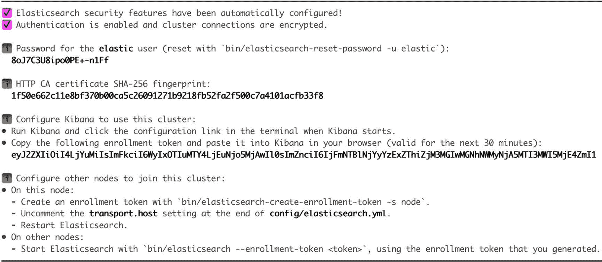

# 14

# 额外的技巧和窍门

本书几乎涵盖了使用 Flask 创建 Web 应用程序所需了解的所有领域。已经涵盖了大量的内容，还有更多需要探索。在本章的最后，我们将介绍一些额外的食谱，这些食谱可以在需要时用于为基于 Flask 的 Web 应用程序增加价值。

我们将学习如何使用 Elasticsearch 实现全文搜索。对于提供大量内容和选项的 Web 应用程序，如电子商务网站，全文搜索变得非常重要。接下来，我们将了解帮助通过发送通知（信号）来解耦应用程序的信号。当在应用程序的某个地方执行操作时，这个信号会被一个订阅者/接收者捕获，并相应地执行操作。这之后，我们将实现为我们的 Flask 应用程序添加缓存。

我们还将了解如何将电子邮件支持添加到我们的应用程序中，以及如何通过执行不同的操作直接从应用程序发送电子邮件。然后我们将看到如何使我们的应用程序异步。默认情况下，WSGI 应用程序是同步和阻塞的——也就是说，默认情况下，它们不会同时服务多个请求。我们将通过一个小示例来了解如何处理这个问题。我们还将集成 Celery 到我们的应用程序中，并了解如何利用任务队列来为我们的应用程序带来好处。

在本章中，我们将涵盖以下食谱：

+   使用 Elasticsearch 实现全文搜索

+   与信号一起工作

+   在您的应用程序中使用缓存

+   实现电子邮件支持

+   理解异步操作

+   与 Celery 一起工作

# 使用 Elasticsearch 实现全文搜索

全文搜索是几乎所有通过 Web 应用程序提供的用例的一个基本部分。如果你打算构建一个电子商务平台或类似的东西，其中搜索扮演着核心角色，那么它就变得更加关键。全文搜索意味着在大量文本数据中搜索某些文本的能力，搜索结果可以包含根据配置的全匹配或部分匹配。

**Elasticsearch**是一个基于 Lucene 的搜索服务器，Lucene 是一个开源的信息检索库。Elasticsearch 提供了一个具有 RESTful 网络接口和无模式 JSON 文档的分布式全文搜索引擎。在本食谱中，我们将使用 Elasticsearch 为我们的 Flask 应用程序实现全文搜索。

## 准备工作

我们将使用一个名为`elasticsearch`的 Python 库，它使得处理 Elasticsearch 变得更加容易：

```py
$ pip install elasticsearch
```

我们还需要安装 Elasticsearch 服务器本身。这可以从[`www.elastic.co/downloads/elasticsearch`](https://www.elastic.co/downloads/elasticsearch)下载。在您的机器上选择任何位置解压该包，并运行以下命令：

```py
$ bin/elasticsearch
```

这将默认在`http://localhost:9200/`上启动 Elasticsearch 服务器。在继续之前，有几个细节需要注意：

+   当您使用前面的命令运行`elasticsearch`服务器时，您将看到以下截图所示的一些详细信息：



图 14.1 – Elasticsearch 安全细节

在此处记录弹性用户的密码。您也可以选择使用前一个截图指定的命令重置密码。

+   当您运行`elasticsearch`服务器时，它会生成一个 HTTP CA 证书，在通过我们的 Flask 应用程序建立连接时需要使用此证书。您可以在`elasticsearch`服务器文件夹的`config/certs`文件夹中找到此证书文件。在大多数情况下，它应该是`<path to your>` `elasticsearch folder>/config/certs/http_ca.crt`。

## 如何操作...

按照以下步骤执行 Elasticsearch 和我们的 Flask 应用程序之间的集成：

1.  首先，将`elasticsearch`对象添加到应用程序的配置中——即`my_app/__init__.py`：

    ```py
    from elasticsearch import Elasticsearch
    ```

    ```py
    es = Elasticsearch(
    ```

    ```py
        'https://192.168.1.6:9200/',
    ```

    ```py
        ca_certs='Users/apple/workspace/elasticsearch-
    ```

    ```py
          8.6.2/config/certs/http_ca.crt',
    ```

    ```py
        verify_certs=False,
    ```

    ```py
        basic_auth=("elastic", '8oJ7C3U8ipo0PE+-n1Ff')
    ```

    ```py
    )
    ```

    ```py
    es.indices.create(index='catalog', ignore=400)
    ```

小贴士

您会注意到前一段代码中使用了几个配置设置。我直接在实例化`es`对象时使用了它们，以便您更容易理解。在实际应用程序中，这些应该来自配置设置或配置文件。

在这里，我们已从`Elasticsearch`类创建了一个`es`对象，该对象接受服务器 URL、HTTP CA 证书以及使用用户名和密码的基本身份验证。HTTP CA 证书和密码在*准备就绪*部分的步骤中获取。`verify_certs=False`是必需的，因为我的应用程序正在运行在 HTTP 上，而 Elasticsearch 运行在 HTTPS 上。如果您的应用程序也运行在 HTTPS 上，则此标志将不需要。`ignore=400`将忽略与`resource_already_exists_exception`相关的任何错误，因为此索引已经创建。

1.  接下来，我们需要向我们的 Elasticsearch 索引添加一个文档。这可以在视图或模型中完成；然而，在我看来，最好的方法是在模型层添加它，因为它与数据更紧密相关，而不是如何显示。我们将在`my_app/catalog/models.py`文件中完成此操作：

    ```py
    from my_app import es
    ```

    ```py
    class Product(db.Model):
    ```

    ```py
        def add_index_to_es(self):
    ```

    ```py
            es.index(index='catalog', document={
    ```

    ```py
                'name': self.name,
    ```

    ```py
                'category': self.category.name
    ```

    ```py
            }, id=self.id)
    ```

    ```py
            es.indices.refresh(index='catalog')
    ```

    ```py
    class Category(db.Model):
    ```

    ```py
        def add_index_to_es(self):
    ```

    ```py
            es.index('catalog', document={
    ```

    ```py
                'name': self.name,
    ```

    ```py
            }, id=self.id)
    ```

    ```py
            es.indices.refresh(index='catalog')
    ```

在这里，我们在每个模型中添加了一个名为`add_index_to_es()`的新方法，该方法将对应于当前`Product`或`Category`对象的文档添加到`catalog`索引。您可能希望将不同类型的数据分别索引以提高搜索的准确性。最后，我们刷新了索引，以便新创建的索引可用于搜索。

当我们创建、更新或删除产品或类别时，可以调用`add_index_to_es()`方法。

1.  接下来，为了演示，只需在创建产品时将索引文档（产品）的语句添加到`my_app/catalog/views.py`中的`elasticsearch`索引：

    ```py
    from my_app import es
    ```

    ```py
    @catalog.route('/product-create', methods=['GET',
    ```

    ```py
      'POST'])
    ```

    ```py
    def create_product():
    ```

    ```py
    #... normal product creation logic … #
    ```

    ```py
            db.session.commit()
    ```

    ```py
            product.add_index_to_es()
    ```

    ```py
    #... normal post product creation logic … #
    ```

    ```py
    @catalog.route('/product-search-es')
    ```

    ```py
    @catalog.route('/product-search-es/<int:page>')
    ```

    ```py
    def product_search_es(page=1):
    ```

    ```py
        q = request.args.get('q')
    ```

    ```py
        products = es.search(index="catalog", query={
    ```

    ```py
            "query_string": {
    ```

    ```py
                "query": '*' + q + '*'
    ```

    ```py
            }
    ```

    ```py
        })
    ```

    ```py
        return products['hits']
    ```

在前面的代码中，我们还添加了一个`product_search_es()`方法，以便在刚刚创建的 Elasticsearch 索引上进行搜索。同样，在`create_category()`方法中也进行相同的操作。

小贴士

在前面的代码中，我们发送给 Elasticsearch 的搜索查询相当基础且开放。我强烈建议你阅读有关 Elasticsearch 查询构建的内容，并将其应用于你的程序。请参考以下内容：[`www.elastic.co/guide/en/elasticsearch/reference/current/query-dsl.html`](https://www.elastic.co/guide/en/elasticsearch/reference/current/query-dsl.html)。

## 它是如何工作的…

现在，假设我们在每个类别中创建了一些类别和产品。如果我们打开`http://127.0.0.1:5000/product-search-es?q=phone`，我们将得到以下类似的响应：

```py
{
  "hits": [
    {
      "_id": "5",
      "_index": "catalog",
      "_score": 1.0,
      "_source": {
        "category": "Phones",
        "name": "iPhone 14"
      }
    },
    {
      "_id": "6",
      "_index": "catalog",
      "_score": 1.0,
      "_source": {
        "category": "Phones",
        "name": "Motorola razr"
      }
    }
  ],
  "max_score": 1.0,
  "total": {
    "relation": "eq",
    "value": 2
  }
}
```

我鼓励你尝试增强输出格式和显示。

## 参见

+   你可以在[`www.elastic.co/guide/en/elasticsearch/client/python-api/current/connecting.html`](https://www.elastic.co/guide/en/elasticsearch/client/python-api/current/connecting.html)了解更多关于连接到 elasticsearch 服务器的信息。

+   更多关于 Python Elasticsearch 客户端的信息，请参阅[`elasticsearch-py.readthedocs.io/en/v8.6.2/index.html`](https://elasticsearch-py.readthedocs.io/en/v8.6.2/index.html)

# 与信号一起工作

**信号**可以被视为在我们应用程序中发生的事件。这些事件可以被某些接收者订阅，当事件发生时，接收者将调用一个函数。事件的产生由发送者广播，发送者可以指定函数可以使用的参数，该函数将由接收者触发。

重要

你应该避免在信号中修改任何应用程序数据，因为信号不是按照指定的顺序执行的，很容易导致数据损坏。

## 准备工作

我们将使用一个名为`blinker`的 Python 库，它提供了信号功能。Flask 内置了对`blinker`的支持，并且大量使用了信号。Flask 提供了一些核心信号。

在这个菜谱中，我们将使用来自*使用 Elasticsearch 实现全文搜索*菜谱的应用程序，并添加`product`和`category`文档，通过信号使索引工作。

## 如何做到这一点…

按照以下步骤实现并理解信号的工作原理：

1.  首先，为`product`和`category`创建信号。这可以在`my_app/catalog/models.py`中完成。然而，你可以使用任何你想要的文件，因为信号是在全局范围内创建的：

    ```py
    from blinker import Namespace
    ```

    ```py
    catalog_signals = Namespace()
    ```

    ```py
    product_created = catalog_signals.signal('product-
    ```

    ```py
      created')
    ```

    ```py
    category_created = catalog_signals.signal('category-
    ```

    ```py
      created')
    ```

我们使用了`Namespace`来创建信号，这将它们创建在自定义命名空间中，而不是全局命名空间中，从而有助于信号的整洁管理。我们创建了两个信号，`product-created`和`category-created`，它们的意图通过它们的名称都很清楚。

1.  然后，我们将创建对这些信号的订阅者，并将函数附加到它们。为此，必须移除（如果您是在上一个配方的基础上构建）`add_index_to_es()`方法，并在`my_app/catalog/models.py`的全局范围内创建新函数：

    ```py
    def add_product_index_to_es(sender, product):
    ```

    ```py
        es.index(index='catalog', document={
    ```

    ```py
            'name': product.name,
    ```

    ```py
            'category': product.category.name
    ```

    ```py
        }, id=product.id)
    ```

    ```py
        es.indices.refresh(index='catalog')
    ```

    ```py
    product_created.connect(add_product_index_to_es, app)
    ```

    ```py
    def add_category_index_to_es(sender, category):
    ```

    ```py
        es.index(index='catalog', document={
    ```

    ```py
            'name': category.name,
    ```

    ```py
        }, id=category.id)
    ```

    ```py
        es.indices.refresh('catalog')
    ```

    ```py
    category_created.connect(add_category_index_to_es,
    ```

    ```py
      app)
    ```

在前面的代码片段中，我们使用`.connect()`创建了在*步骤 1*中创建的信号的订阅者。此方法接受在事件发生时应调用的函数；它还接受发送者作为可选参数。`app`对象作为发送者提供，因为我们不希望我们的函数在应用程序的任何地方触发事件时被调用。这在扩展的情况下尤其正确，因为它们可以被多个应用程序使用。接收者调用的函数（在这种情况下，`add_product_index_to_es`和`add_category_index_to_es`）将发送者作为第一个参数，如果未提供发送者，则默认为`None`。我们提供了产品/类别的第二个参数，需要将其记录添加到`elasticsearch`索引中。

1.  现在，发出可以被接收者捕获的信号。这需要在`my_app/catalog/views.py`中完成。为此，只需移除对`add_index_to_es()`方法的调用，并用`.send()`方法替换它们：

    ```py
    From my_app.catalog.models import product_created,
    ```

    ```py
      category_created
    ```

    ```py
    @catalog.route('/product-create', methods=['GET',
    ```

    ```py
      'POST'])
    ```

    ```py
    def create_product():
    ```

    ```py
        #... normal product creation logic … #
    ```

    ```py
            db.session.commit()
    ```

    ```py
            product_created.send(app, product=product)
    ```

    ```py
        #... normal post product creation logic … #
    ```

同样在`create_category()`方法中执行相同的操作。

## 它是如何工作的...

每当创建产品时，都会发出`product_created`信号，其中`app`对象作为发送者，`product`作为关键字参数。然后，在`models.py`中捕获此信号，并调用`add_product_index_to_es()`函数，将文档添加到目录索引中。

此配方的功能与上一个配方*使用 Elasticsearch 实现全文搜索*完全相同。

## 参考信息

+   阅读关于*使用 Elasticsearch 实现全文搜索*的配方，以了解此配方的背景信息

+   您可以在[`pypi.python.org/pypi/blinker`](https://pypi.python.org/pypi/blinker)上了解`blinker`库

+   您可以在[`flask.palletsprojects.com/en/2.2.x/api/#core-signals-list`](https://flask.palletsprojects.com/en/2.2.x/api/#core-signals-list)查看 Flask 支持的核心理信号列表

+   您可以在[`flask-sqlalchemy.palletsprojects.com/en/3.0.x/api/#module-flask_sqlalchemy.track_modifications`](https://flask-sqlalchemy.palletsprojects.com/en/3.0.x/api/#module-flask_sqlalchemy.track_modifications)查看 Flask-SQLAlchemy 提供的信号，用于跟踪模型修改

# 在您的应用程序中使用缓存

当扩展或增加应用程序的响应时间成为一个问题时，**缓存**成为任何 Web 应用程序的一个重要且不可或缺的部分。在这些情况下，缓存是首先实施的事情。Flask 本身默认不提供任何缓存支持，但**Werkzeug**提供了。Werkzeug 有一些基本支持，可以使用多个后端进行缓存，例如 Memcached 和 Redis。Werkzeug 的这种缓存支持是通过一个名为**Flask-Caching**的包实现的，我们将在这个菜谱中使用它。

## 准备工作

我们将安装一个名为`flask-caching`的 Flask 扩展，它简化了缓存过程：

```py
$ pip install flask-caching
```

我们将使用我们的目录应用程序来完成这个目的，并为某些方法实现缓存。

## 如何做到这一点…

实现基本的缓存相当简单。按照以下步骤进行操作：

1.  首先，初始化`Cache`以与我们的应用程序一起工作。这是在应用程序的配置中完成的——即`my_app/__init__.py`：

    ```py
    from flask_caching import Cache
    ```

    ```py
    cache = Cache(app, config={'CACHE_TYPE': 'simple'})
    ```

在这里，我们使用了`simple`作为`Cache`类型，其中缓存存储在内存中。这不建议在生产环境中使用。对于生产环境，我们应该使用 Redis、Memcached、文件系统缓存等类似的东西。Flask-Caching 支持所有这些以及一些额外的后端。

1.  接下来，将缓存添加到需要缓存的那些方法中。只需在视图方法中添加一个`@cache.cached(timeout=<time in seconds>)`装饰器。一个简单的目标可以是分类列表（我们将在`my_app/catalog/views.py`中这样做）：

    ```py
    @catalog.route('/categories')
    ```

    ```py
    @cache.cached(timeout=120)
    ```

    ```py
    def categories():
    ```

    ```py
        categories = Category.query.all()
    ```

    ```py
        return render_template('categories.html',
    ```

    ```py
          categories=categories)
    ```

这种缓存方式将此方法的输出值以键值对的形式存储在缓存中，键为请求路径。

## 它是如何工作的…

在添加前面的代码后，为了检查缓存是否按预期工作，请将浏览器指向`http://127.0.0.1:5000/categories`来获取分类列表。这将在这个 URL 的缓存中保存一个键值对。现在，快速创建一个新的分类并导航到相同的分类列表页面。你会注意到新添加的分类没有被列出。等待几分钟然后重新加载页面。现在新添加的分类将显示出来。这是因为分类列表第一次被缓存后，2 分钟（120 秒）后过期。

这可能看起来像是应用程序的缺陷，但在大型应用程序的情况下，这成为了一种福音，因为减少了数据库的访问次数，整体应用程序体验得到了改善。缓存通常用于那些结果不经常更新的处理程序。

## 还有更多…

我们中的许多人可能会认为，在单个类别或产品页面的情况下，每个记录都有单独的页面，这种缓存可能会失败。解决这个问题的方法是**记忆化**。它与缓存类似，区别在于它将方法的结果存储在缓存中，同时存储传递给参数的信息。因此，当多次使用相同参数创建方法时，结果将从缓存中加载，而不是进行数据库调用。实现记忆化相当简单：

```py
@catalog.route('/product/<id>')
@cache.memoize(120)
def product(id):
    product = Product.query.get_or_404(id)
    return render_template('product.html', product=product)
```

现在，如果我们第一次在我们的浏览器中打开一个 URL（例如，`http://127.0.0.1:5000/product/1`），它将在调用数据库后加载。然而，如果我们再次进行相同的调用，页面将从缓存中加载。另一方面，如果我们打开另一个产品（例如，`http://127.0.0.1:5000/product/2`），那么它将在第一次访问时从数据库中获取产品详情后加载。

## 参见

+   Flask-Caching 在[`flask-caching.readthedocs.io/en/latest/`](https://flask-caching.readthedocs.io/en/latest/)

+   记忆化在[`en.wikipedia.org/wiki/Memoization`](http://en.wikipedia.org/wiki/Memoization)

# 实现电子邮件支持

发送电子邮件的能力通常是任何网络应用最基本的功能之一。通常，使用任何应用实现它都很简单。对于基于 Python 的应用，借助`smtplib`实现起来相当简单。在 Flask 的情况下，这通过一个名为`Flask-Mail`的扩展进一步简化。

## 准备工作

`Flask-Mail`可以通过`pip`轻松安装：

```py
$ pip install Flask-Mail
```

让我们看看一个简单的例子，当在应用程序中添加新类别时，将向目录管理员发送电子邮件。

## 如何操作…

首先，在我们的应用程序配置中实例化`Mail`对象——即`my_app/__init__.py`文件：

```py
from flask_mail import Mail
app.config['MAIL_SERVER'] = 'smtp.gmail.com'
app.config['MAIL_PORT'] = 587
app.config['MAIL_USE_TLS'] = True
app.config['MAIL_USERNAME'] = 'gmail_username'
app.config['MAIL_PASSWORD'] = 'gmail_password'
app.config['MAIL_DEFAULT_SENDER'] = ('Sender name', 'sender
  email')
mail = Mail(app)
```

我们还需要进行一些配置，以设置电子邮件服务器和发送者账户。前面的代码是 Gmail 账户（未启用双因素认证）的示例配置。任何 SMTP 服务器都可以这样设置。还有其他几个选项可供选择；它们可以在`Flask-Mail`文档中找到，网址为[`pythonhosted.org/Flask-Mail`](https://pythonhosted.org/Flask-Mail)。

要在创建类别时发送电子邮件，我们需要在`my_app/catalog/views.py`文件中进行以下更改：

```py
from my_app import mail
from flask_mail import Message
@catalog.route('/category-create', methods=['POST',])
def create_category():
    # ... Create a category ... #
    message = Message(
        "New category added",
        recipients=['shalabh7777@gmail.com']
    )
    message.body = 'New category "%s" has been created'
      % category.name
    message.html = render_template(
        "category-create-email-html.html",
        category=category
    )
    mail.send(message)
    # ... Rest of the process ... #
```

在这里，将向默认发送者配置中的收件人列表发送一封新电子邮件。您会注意到，创建类别需要一秒或两秒的时间来执行。这就是发送电子邮件所需的时间。

## 它是如何工作的…

通过向`http://127.0.0.1:5000/category-create`发送一个 POST 请求来创建一个新的类别。您可以使用`Python`提示中的`requests`库来完成此操作：

```py
>>> requests.post('http://127.0.0.1:5000/category-create', data={'name': 'Headphone'})
```

您应该在提供的收件人电子邮件 ID(s)上收到电子邮件。

## 还有更多…

现在，让我们假设我们需要发送一个包含大量 HTML 内容的电子邮件。将所有这些内容都写在我们的 Python 文件中会使整体代码变得丑陋且难以管理。一个简单的解决方案是在发送电子邮件时创建模板并渲染其内容。在这里，我创建了两个模板：一个用于 HTML 内容，另一个仅用于文本内容。

`category-create-email-text.html`模板将看起来像这样：

```py
A new category has been added to the catalog.
The name of the category is {{ category.name }}.
Click on the URL below to access the same:
{{ url_for('catalog.category', id=category.id, _external =
  True) }}
This is an automated email. Do not reply to it.
```

`category-create-email-html.html`模板将看起来像这样：

```py
<p>A new category has been added to the catalog.</p>
<p>The name of the category is <a href="{{
  url_for('catalog.category', id=category.id, _external =
  True) }}">
      <h2>{{ category.name }}</h2>
    </a>.
</p>
<p>This is an automated email. Do not reply to it.</p>
```

在此之后，我们需要修改我们之前创建的电子邮件消息创建过程：

```py
    message.body = render_template(
        "category-create-email-text.html",
        category=category
    )
    message.html = render_template(
        "category-create-email-html.html",
        category=category
    )
```

## 参见

下一个配方，*理解异步操作*，将向我们展示我们如何可以将耗时的电子邮件发送过程委托给异步线程，并加快我们的应用程序体验。

# 理解异步操作

网络应用程序中的某些操作可能很耗时，即使实际上并不慢，也会使用户的整体应用程序感觉缓慢。这会显著阻碍用户体验。为了处理这个问题，实现操作异步执行的最简单方法就是使用线程。在这个配方中，我们将使用 Python 的`threading`库来实现这一点。在 Python 3 中，`thread`包已被弃用。尽管它仍然作为`_thread`可用，但强烈建议使用`threading`。

## 准备工作

我们将使用*实现 Flask 应用程序的电子邮件支持*配方中的应用程序。我们中的许多人都会注意到，当电子邮件正在发送时，应用程序会等待整个过程的完成，这是不必要的。电子邮件发送可以轻松地在后台完成，我们的应用程序可以立即对用户可用。

## 如何做…

使用`threading`包进行异步执行非常简单。只需将以下代码添加到`my_app/catalog/views.py`中：

```py
from threading import Thread
def send_mail(message):
    with app.app_context():
        mail.send(message)
# Replace the line below in create_category()
# mail.send(message)
# by
t = Thread(target=send_mail, args=(message,))
t.start()
```

如你所见，电子邮件的发送是在一个新的线程中进行的，该线程将消息作为参数传递给新创建的方法。我们需要创建一个新的`send_mail()`方法，因为我们的电子邮件模板包含`url_for`，它只能在应用程序上下文中执行；默认情况下，它在新创建的线程中不可用。这提供了灵活性，可以在需要时启动线程，而不是同时创建和启动线程。

## 它是如何工作的…

观察它是如何工作的非常简单。比较在这个配方中发送电子邮件的性能与上一个配方中应用程序的性能，*实现 Flask 应用程序的电子邮件支持*。你会注意到应用程序的响应性更好。另一种方法是监控调试日志，其中新创建的分类页面将在发送电子邮件之前加载。

## 参见

+   由于我提到了多线程和异步操作，你们中的许多人可能正在思考 Python 内置的`asyncio`库及其潜在的应用。尽管可以使用`async..await`编写 Flask 方法，并且它们将以非阻塞的方式工作，但由于 WSGI 仍然需要在单个工作进程上运行以处理请求，因此并没有明显的性能提升。更多详情请见[`flask.palletsprojects.com/en/2.2.x/async-await/`](https://flask.palletsprojects.com/en/2.2.x/async-await/)。

+   你可以查看 Flask 的`asyncio`实现或与 Flask 语法非常相似的`asyncio`。

# 与 Celery 一起工作

Celery 是 Python 的任务队列。曾经有一个扩展用于集成 Flask 和 Celery，但自从 Celery 3.0 以来，它已经过时。现在，只需进行一些配置，就可以直接使用 Celery 与 Flask 一起使用。在*理解异步操作*菜谱中，我们实现了异步处理来发送电子邮件。在这个菜谱中，我们将使用 Celery 实现相同的功能。

## 准备中

Celery 可以从 PyPI 简单安装：

```py
$ pip install celery
```

要使 Celery 与 Flask 一起工作，我们需要修改我们的 Flask 应用程序配置文件。为了完成其工作，Celery 需要一个代理来接收和交付任务。在这里，我们将使用 Redis 作为代理（感谢其简单性）。

信息

确保你运行 Redis 服务器以建立连接。要安装和运行 Redis 服务器，请参阅[`redis.io/docs/getting-started/`](https://redis.io/docs/getting-started/)。

你还需要在你的虚拟环境中安装 Redis 客户端：

`$ pip` `install Redis`

我们将使用之前菜谱中的应用程序，并以相同的方式实现 Celery。

## 如何做到这一点...

按照以下步骤了解 Celery 与 Flask 应用程序的集成：

1.  首先，我们需要在应用程序的配置中进行一些配置——即`my_app/__init__.py`：

    ```py
    from celery import Celery
    ```

    ```py
    app.config['SERVER_NAME'] = '127.0.0.1:5000'
    ```

    ```py
    app.config.update(
    ```

    ```py
        CELERY_BROKER_URL='redis://127.0.0.1:6379',
    ```

    ```py
        CELERY_RESULT_BACKEND='redis://127.0.0.1:6379'
    ```

    ```py
    )
    ```

    ```py
    def make_celery(app):
    ```

    ```py
        celery = Celery(
    ```

    ```py
            app.import_name,
    ```

    ```py
              broker=app.config['CELERY_BROKER_URL']
    ```

    ```py
        )
    ```

    ```py
        celery.conf.update(app.config)
    ```

    ```py
        TaskBase = celery.Task
    ```

    ```py
        class ContextTask(TaskBase):
    ```

    ```py
            abstract = True
    ```

    ```py
            def __call__(self, *args, **kwargs):
    ```

    ```py
                with app.app_context():
    ```

    ```py
                    return TaskBase.__call__(self, *args,
    ```

    ```py
                      **kwargs)
    ```

    ```py
        celery.Task = ContextTask
    ```

    ```py
        return celery
    ```

    ```py
    celery = make_celery(app)
    ```

上述代码片段直接来自 Flask 网站，在大多数情况下可以直接用于你的应用程序。在这里，我们实际上是在配置 Celery 任务以拥有应用程序上下文。

1.  要运行 Celery 进程，执行以下命令：

    ```py
    $ celery --app=my_app.celery worker -l INFO
    ```

在这里，`-app`指向配置文件中创建的`celery`对象，而`-l`是我们想要观察的日志级别。

重要

确保 Redis 也在配置中指定的代理 URL 上运行。

1.  现在，在`my_app/catalog/views.py`文件中使用这个`celery`对象来异步发送电子邮件：

    ```py
    from my_app import db, app, es, cache, mail, celery
    ```

    ```py
    @celery.task()
    ```

    ```py
    def send_mail(category_id, category_name):
    ```

    ```py
        with app.app_context():
    ```

    ```py
            category = Category(category_name)
    ```

    ```py
            category.id = category_id
    ```

    ```py
            message = Message(
    ```

    ```py
                "New category added",
    ```

    ```py
                recipients=['some-receiver@domain.com']
    ```

    ```py
            )
    ```

    ```py
            message.body = render_template(
    ```

    ```py
                "category-create-email-text.html",
    ```

    ```py
                category=category
    ```

    ```py
            )
    ```

    ```py
            message.html = render_template(
    ```

    ```py
                "category-create-email-html.html",
    ```

    ```py
                category=category
    ```

    ```py
            )
    ```

    ```py
            mail.send(message)
    ```

    ```py
    # Add this line wherever the email needs to be sent
    ```

    ```py
      send_mail.apply_async(args=[category.id,
    ```

    ```py
      category.name])
    ```

我们将`@celery.task`装饰器添加到任何我们希望用作 Celery 任务的方法上。Celery 进程将自动检测这些方法。

## 它是如何工作的...

现在，当我们创建一个类别并发送电子邮件时，我们可以在 Celery 进程日志中看到正在运行的任务，它看起来像这样：

```py
[2023-03-22 15:24:21,838: INFO/MainProcess] Task my_app.catalog.views.send_mail[1e869100-5bee-4d99-a4cc-6a3dca92e120] received
[2023-03-22 15:24:25,927: INFO/ForkPoolWorker-8] Task my_app.catalog.views.send_mail[1e869100-5bee-4d99-a4cc-6a3dca92e120] succeeded in 4.086294061969966s: None
```

## 参见

+   阅读理解异步操作*菜谱，了解线程如何用于各种目的——在我们的案例中，用于发送电子邮件

+   您可以在[`docs.celeryproject.org/en/latest/index.html`](http://docs.celeryproject.org/en/latest/index.html)了解更多关于 Celery 的信息。
