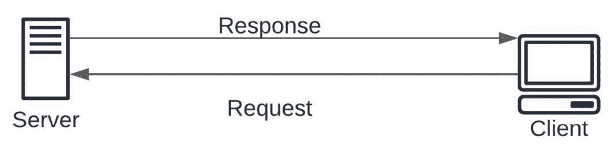
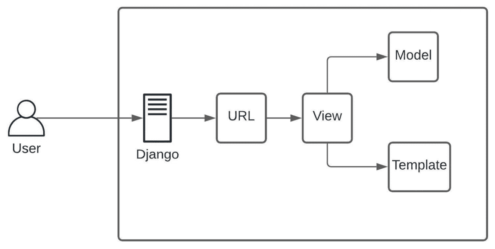
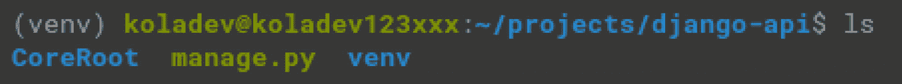
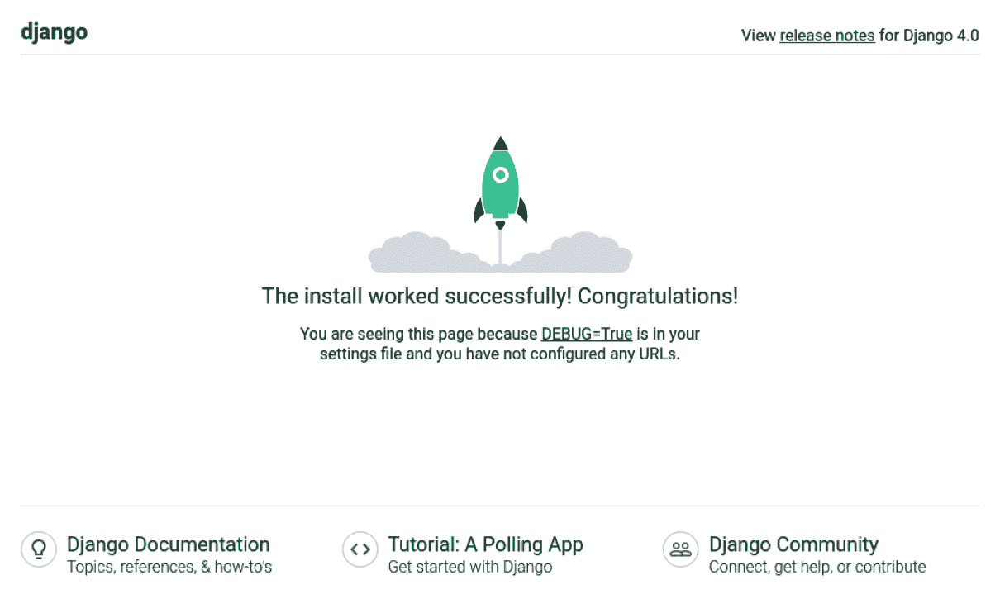

# 1

# 创建 Django 项目

**Django**是使用 Python 编写的最著名的后端框架之一，常用于构建简单或复杂的 Web 应用程序。至于**React**，它是创建反应性和强大用户界面的最广泛使用的 JavaScript 库之一。在本章中，我们将首先关注 Django。

在本章中，我们将简要介绍**软件开发**，特别是我们将在 Django 和 React 的背景下构建的社交网络 Web 应用程序中的**后端开发**。我们还将讨论在**Python**中用于后端开发的常见工具——在这里是 Django。然后，我们将创建一个 Django 项目，并解释 Django 项目最重要的部分。之后，我们将**PostgreSQL**连接到 Django 项目。

到本章结束时，你将理解软件开发、前端开发和后端开发的概念。你还将学习如何在 Django 中创建项目并启动服务器。

在本章中，我们将涵盖以下主题：

+   软件开发概述

+   理解后端开发

+   什么是 API？

+   什么是 Django？

+   设置工作环境

+   配置数据库

# 软件开发概述

软件开发是一个复杂的过程，包含许多步骤和许多组件。这些组件确保在构思、指定、设计、编程、文档化和测试应用程序、框架或软件时得到尊重并得到良好的应用。

通常，软件由以下两个组件组成：

+   **后端**：这代表用户看不到的部分；它由业务逻辑和从数据库中进行的数据操作组成

+   **前端**：这代表提供给用户与整个应用程序交互的界面

前端这个术语指的是用户在屏幕上看到的网站或应用程序的元素，以及他们将与它们交互的元素。例如，所有互联网用户都会在网站上看到 HTML、CSS 和 JavaScript 的组合。是这些前端编程语言将被浏览器解释。

通常，前端由 HTML、CSS、JavaScript 和 jQuery（或其他 UI 库或框架）组成，用于复制设计。设计是由网页设计师创建的，他们使用专门的工具，如 Photoshop 或 Figma，来创建图形模型。

在这里，我们将专注于 Web 开发。Web 开发是软件开发的一部分，专注于构建网站和 Web 应用程序，而 Web 开发的理念依赖于客户端-服务器架构。

客户端-服务器架构代表一个环境，其中运行在客户端机器上的应用程序可以与安装在服务器机器上的其他应用程序通信，这些应用程序提供来自数据库的服务或数据。

在网络上，客户端将只是一个浏览器，用于从服务器请求页面或资源。

这里有一个简单的图表来展示这一点：



图 1.1 – 客户端-服务器架构

现在我们对软件开发，尤其是 Web 开发有了更好的理解，让我们继续讨论其一个组成部分：后端开发。

# 理解后端开发

后端开发处理现代应用程序的后台部分。大多数时候，它由连接到数据库、管理用户连接以及为 Web 应用程序或**API**提供动力的代码组成。

后端开发代码的焦点更多地在于业务逻辑。它主要关注应用程序的工作方式以及支持应用程序的功能和逻辑。

例如，让我们讨论一个用于管理书籍的 Web 应用程序。假设该应用程序连接到一个 SQL 数据库。

无论使用什么语言构建应用程序和结构，以下是一些代表业务逻辑的要求，这些要求主要依赖于后端而不是前端：

+   **添加书籍（仅限管理员）**：这假设客户端（前端）应该能够向使用为后端构建的任何语言构建的 API 发出请求，包含在数据库中创建新条目所需的数据。此操作仅限于管理员。

+   **列出所有书籍**：这假设客户端也应该能够向 API 发出请求，并且这个 API 应该以 JSON/XML 格式作为响应发送所有书籍的列表。

只需看一下这两个要求，我们就可以快速理解，前端将只是请求这些操作的界面。然而，后端将（以第一个要求为例）确保传入的请求是可能的（检查权限，例如请求用户是否真的是管理员）以及请求中的数据是有效的——只有在这之后，数据才能安全地注册到数据库中。后端开发者使用 Python、PHP 和 Ruby 等编程语言来设置和配置服务器。这些工具将允许他们存储、处理和修改信息。为了使这些编程语言更加实用，开发者将通过框架如 Symfony、Ruby on Rails、CakePHP 或 CodeIgniter 来改进它们。这些工具将使开发更快、更安全。然后他们必须确保这些工具始终保持最新，并便于维护。

因此，后端开发者负责创建和管理所有对最终用户不可见元素。因此，他们负责网站或应用程序的所有功能。他们还负责创建数据库，这将允许用户提供的信息得到保留。例如，后端开发者将使用数据库来查找客户使用的用于连接的用户名和密码。可以通过学习网络开发或甚至学习 Python 来培养这一职业。

## 后端开发者的职责

后端通常由三个主要部分组成：

+   **服务器**：接收请求的机器或应用程序（NGINX）

+   **应用程序**：在服务器上运行的应用程序，它接收请求，验证这些请求，并发送适当的响应

+   **数据库**：用于存储数据

因此，后端程序员的职责可能很容易包括编写 API、编写与数据库交互的代码、创建模块或库、处理业务数据和架构，以及更多。

他们还必须做以下事情：

+   协调并与前端开发者沟通，以高效地将数据传输到应用程序的客户端

+   与质量保证工程师合作，优化服务器端流程，并通过一些安全检查

+   当请求数量或用户数量扩展时，优化应用程序

+   分析项目需求并创建一个简单的结构来处理错误和异常

+   提出高效的云托管解决方案，并构建 CI/CD 管道

后端架构实际上有助于构建软件行业中消费数据最常见接口之一：**应用程序编程接口**（**API**）。让我们更深入地了解这个术语。

# 什么是 API？

在这本书中，我们将主要构建一个 API——那么，什么是 API？

在回答这个问题之前，只需记住，互联网的大部分是由**表示状态转移**（**REST**）或**RESTful API**驱动的。API 简化了应用程序或机器之间数据交换的方式。它主要由两个组件组成：

+   技术规范，它描述了各方之间的数据交换选项，规范以数据交付协议和数据处理的请求形式制定

+   软件接口（编程代码），它是根据其表示的规范编写的

例如，如果你的应用程序客户端是用 JavaScript 编写的，而服务器端是用 PHP 编写的，你需要创建一个 PHP（因为数据来自数据库）的 Web API，这将帮助你编写用于访问数据的规则和路由。

Web API 相对常见，有不同的规范和协议。API 规范的目标是为了标准化——由于不同的编程语言和不同的 **操作系统**（**OSs**）——两个或多个 Web 服务之间的交换。例如，你会找到以下内容：

+   **远程过程调用**（**RPC**）：一种协议，程序可以使用它从网络上另一台计算机上的程序请求服务，而无需了解其细节。这有时被称为函数或子程序调用。

+   **简单对象访问协议**（**SOAP**）：一种基于 XML 的通信协议，允许应用程序通过 HTTP 交换信息。因此，它允许访问 Web 服务以及 Web 上应用程序的互操作性。SOAP 是一种简单且轻量级的协议，完全依赖于已建立的标准，如 HTTP 和 XML。它是可移植的，因此独立于任何操作系统和计算机类型。SOAP 是一种非专有规范。

+   **REST/RESTful**：一种用于构建应用程序（Web、内部网或 Web 服务）的架构风格。这是一组需要遵守的约定和最佳实践，而不是一种独立的技术。REST 架构使用 HTTP 协议的原始规范，而不是重新发明一个覆盖层（例如 SOAP 或 XML-RPC 所做的那样）：

    +   **规则 1**：URL 是资源标识符

    +   **规则 2**：HTTP 动词是操作的标识符

    +   **规则 3**：HTTP 响应是资源的表示

    +   **规则 4**：链接是资源之间的关系

    +   **规则 5**：参数是一个认证令牌

在这本书中，我们将使用 Django 和 **Django REST** 构建 REST API，因此让我们更好地了解 REST。

## 理解 REST API

当开发者想要构建一个 API 时，通常会选择 REST。REST 相比于 SOAP 和 RPC 是一个简单的替代方案，因为它使得编写访问资源的逻辑更加容易；这里的资源通过一个唯一的 URL 表示，通过对这个 URL 的一次请求即可获取。

RESTful API 使用 HTTP 请求（或方法）与资源进行交互：

+   `GET`：API 和网站中最常用的方法。此方法用于从服务器获取指定资源的数据。这个资源通常是一个端点，返回一个对象或对象列表，通常是 JSON 或 XML 格式。

+   `POST`：`POST` 方法是请求服务器进行信息处理的基本方法。这些请求应该激活服务器特定的机制，并导致与其他模块或甚至其他服务器的通信来处理这些数据。因此，两个相同的 `POST` 请求可能会收到不同甚至语义相反的响应。要处理的数据指定在请求体中。通过页面指定的请求文档是必须处理数据并生成响应的资源。

+   `HEAD`: `HEAD` 方法用于查询响应的头部，而无需立即将文件发送给您。这在需要传输大文件时很有用：由于 `HEAD` 请求，客户端可以先了解文件的大小，然后再决定是否接收文件。

+   `OPTIONS`: 这是一个诊断方法，主要用于调试等目的，它返回的消息基本上表明了在 Web 服务器上哪些 HTTP 方法是激活的。实际上，如今它很少用于合法目的，但它确实给潜在的攻击者提供了一些帮助——它可以被视为找到另一个漏洞的捷径。

+   `DELETE` 和 `PUT`: 这些方法本应允许上传（到服务器）或删除文档，而无需通过文件传输协议（**FTP**）服务器或类似的服务器。显然，这可能导致文件替换，因此可能导致服务器上非常大的安全漏洞。因此，大多数 Web 服务器都需要对资源或文档进行特殊配置，以处理这些请求。请求中引用的文档是要替换（或创建）的文档，而文档的内容在请求体中。理论上，服务器应禁止或忽略 URL 参数和片段标识符。在实践中，它们通常被传输到处理请求的资源。

+   `PATCH`: HTTP 请求的 `PATCH` 方法对资源应用部分更改。

+   `TRACE`: `TRACE` 方法可用于跟踪 HTTP 请求从服务器到客户端的路径。

+   `CONNECT`: 这个方法本应用于请求将服务器用作代理。并非所有服务器都必然实现它们。

一个有趣的好处是，RESTful 系统支持不同的数据格式，如纯文本、HTML、YAML、JSON 和 XML。

如前所述，在这本书中，我们将使用 Django 和 Django REST 构建 REST API。

# 什么是 Django？

Django 是一个高级 Web 框架，它首次于 2005 年发布。它用 Python 编写，并使用**模型-视图-控制器**（**MVC**）架构模式。这种模式通常被定义为如下：

+   **模型**: 对应所有与数据相关的逻辑。它与数据库深度连接，因为它提供了数据的形状，同时也提供了创建、读取、更新和删除（**CRUD**）操作的方法和函数。

+   **视图**: 处理应用程序的 UI 逻辑。

+   **控制器**: 代表模型和视图之间的一个层。大多数时候，控制器解释来自视图的传入请求，操作模型组件提供的数据，并与视图再次交互以渲染最终输出。

在 Django 中，这将被称为**模型-视图-模板**（**MVT**）架构，其中模板对应于视图，而在这里视图由控制器表示。以下是 MVT 架构的简单表示：



图 1.2 – MVT 架构

Django 是一个采用“包含电池”方法的 Web 框架。在开发自定义 Web 应用程序时，Django 提供了加快开发进程所需的工具。它提供了用于常见操作（如数据库操作、HTML 模板、URL 路由、会话管理和安全）的代码和工具。

Django 允许开发者使用所有必要的功能（如应用安全）从头开始构建各种类型的 Web 应用程序（社交网络、新闻网站和维基），从而让开发者能够专注于他们的项目的大部分工作。Django 提供了对常见攻击的保护——跨站脚本、SQL 注入等等。

在这里，我们还将使用**Django REST 框架**（**DRF**）。它是最成熟、可测试、文档完善且易于扩展的框架，与 Django 结合使用时，将有助于创建强大的 RESTful API。Django 和 DRF 的组合被 Instagram、Mozilla 甚至 Pinterest 等大型公司所采用。

当这个框架与 Django 结合使用时，视图将被路由或端点所取代。我们将在本书的后续部分讨论这个概念——但为什么要用 Django 构建 API？

诚然，传统的 Django 支持 HTML、CSS 和 JavaScript 等客户端语言。这有助于构建由服务器提供服务的用户界面，并且性能始终令人印象深刻。

然而，如果您有多个机器将访问 Django 服务器上的资源呢？如果这些机器运行基于 JavaScript 的应用程序，我们始终可以使用传统的 Django 方式。

如果它是一个移动应用程序呢？如果它是一个用 PHP 编写的服务呢？

这正是 API 真正有用之处。您可以使用任意数量的机器请求您的 API 数据，而不会出现问题，无论这些机器运行的应用程序使用的技术或语言如何。

既然您已经对 Django 有了了解，让我们设置工作环境并在 Django 中创建我们的第一个服务器。

# 设置工作环境

在开始使用 Django 之前，我们必须确保您现在使用的操作系统下有一个优秀的环境。

首先，请确保您已安装最新版本的 Python。对于本书，我们将使用 Python 3.10。

如果您使用的是 Windows 机器，请访问[`www.python.org/downloads/`](https://www.python.org/downloads/)的官方下载页面并下载相关版本。

对于 Linux 用户，您可以使用默认的仓库包下载管理器下载。

## 创建虚拟环境

现在我们已经安装了 Python，我们必须确保已经安装了 `virtualenv`：

```py
python3 -m pip install --user virtualenv
```

以下为 Windows 用户说明：

```py
py -m pip install --user virtualenv
```

完成这些后，我们现在可以创建一个虚拟环境——但为什么要这样做呢？

在使用 Python 进行开发时，有两种环境类型：全局环境和本地环境。

如果你只是在终端中随机输入 `pip install requests`，该包将被安装并可以在全局范围内访问：这意味着可以在你的机器上的任何地方访问。有时，你可能想要隔离工作环境以避免版本冲突。例如，全局上你可能正在使用支持 Django 2.x 版本的 Python 3.5。然而，对于这个项目，你希望使用 Python 3.10 和 Django 的最新版本——这里，4.0。创建一个 `virtualenv` 环境可以帮助你做到这一点。

现在我们已经安装了 `virutalenv`，我们可以创建并激活 `virtualenv` 环境——但在那之前，创建一个名为 `django-api` 的目录。我们将在这里构建 Python 项目。

以下为 Unix 或 macOS 的说明：

```py
python3 -m venv venv
```

以下为 Windows 的说明：

```py
py -m venv venv
```

前面的命令将创建包含已安装 Python 包和必要配置的 `venv` 目录，以便在激活虚拟环境时访问这些包。下一步是激活虚拟环境。这将帮助我们安装开始工作所需的包。

以下为 Unix 或 macOS 的说明：

```py
source venv/bin/activate
```

以下为 Windows 的说明：

```py
.\venv\Scripts\activate
```

太好了！接下来，让我们安装 Django 包。

## 安装 Django

在 Python 中安装包有两种方式。你可以简单地运行 `pip install package_name`。

或者，你可以将包名及其版本写入一个文本文件中。我将选择后者，但你可以自由选择对你来说适用的任何版本。

只需理解版本之间可能会有一些变化，这可能会影响你的项目。为了与这里将要使用的相似，你也可以使用后面的选项。

太好了——让我们在 `django-api` 目录的根目录下创建一个名为 `requirements.txt` 的文件，并添加 Django 包名：

```py
Django==4.0
```

太好了！现在，运行 `pip install -r requirements.txt` 来安装 Django。

为了确保一切正常工作，我们将快速创建一个简单的项目。

## 创建示例项目

要创建一个新的项目，我们将使用 `django-admin` 命令。它包含我们可以用来在 Django 中创建项目的选项：

```py
django-admin startproject CoreRoot .
```

不要忘记在这个命令的末尾添加 `.` 点。这实际上会在当前目录中生成所有文件，而不是创建另一个目录来放置所有文件。

你应该有一个类似以下的结构：



图 1.3 – 文件结构

在启动服务器之前，让我们运行迁移：

```py
python manage.py migrate
```

你将得到类似的输出：

```py
Operations to perform:
  Apply all migrations: admin, auth, contenttypes, sessions
Running migrations:
  Applying contenttypes.0001_initial... OK
  Applying auth.0001_initial... OK
  Applying admin.0001_initial... OK
  Applying admin.0002_logentry_remove_auto_add... OK
  Applying admin.0003_logentry_add_action_flag_choices... OK
  Applying contenttypes.0002_remove_content_type_name... OK
  Applying auth.0002_alter_permission_name_max_length... OK
  Applying auth.0003_alter_user_email_max_length... OK
  Applying auth.0004_alter_user_username_opts... OK
  Applying auth.0005_alter_user_last_login_null... OK
  Applying auth.0006_require_contenttypes_0002... OK
  Applying auth.0007_alter_validators_add_error_messages... OK
  Applying auth.0008_alter_user_username_max_length... OK
  Applying auth.0009_alter_user_last_name_max_length... OK
  Applying auth.0010_alter_group_name_max_length... OK
  Applying auth.0011_update_proxy_permissions... OK
  Applying auth.0012_alter_user_first_name_max_length... OK
  Applying sessions.0001_initial... OK
```

迁移只是将数据库模式中对模型所做的更改传播出去的一种方式。由于 Django 也自带一些模型（例如，你可以用于身份验证的 `User` 模型），我们需要应用这些迁移。当我们编写自己的模型时，我们也会创建迁移文件并将它们迁移。Django 有 **对象关系映射**（**ORM**），它可以自动为你处理与数据库的交互。

当你对 SQL 和编写自己的查询还不太熟悉时，学习 SQL 和编写自己的查询相当困难且要求很高。这需要很长时间，而且相当令人望而却步。幸运的是，Django 提供了一个系统，让你能够利用 SQL 数据库的好处，而无需编写哪怕一个 SQL 查询！

这种类型的系统被称为 ORM。在这个听起来有些野蛮的名字背后隐藏着一个简单而非常实用的操作。当你你在 Django 应用程序中创建一个模型时，框架会自动在数据库中创建一个合适的表来保存与模型相关的数据。

这里不需要编写 SQL 命令 – 我们将只编写 Python 代码，这些代码将被直接转换为 SQL。然后 `python manage.py migrate` 将将这些更改应用到数据库中。

现在，运行 `python manage.py runserver`。你会看到类似的输出，并且你的服务器也会在 [`localhost:8000`](https://localhost:8000) 上运行。

只需在你的浏览器中输入这个 URL，你将看到如下内容：



图 1.4 – Django 运行服务器的欢迎页面

太好了 – 我们刚刚安装了 Django 并启动了 Django 服务器。让我们谈谈项目的结构。

### 讨论示例项目

在最后一部分，我们简要地讨论了如何使用 Python 创建 `virtualenv` 环境。我们还创建了一个 Django 项目并使其运行。

让我们快速谈谈这个项目。

你可能已经注意到了 `django-api` 目录中的一些文件和目录。好吧，让我们快速谈谈这些：

+   `manage.py`：这是 Django 为许多不同需求提供的一个实用工具。它将帮助你创建项目和应用程序、运行迁移、启动服务器等等。

+   `CoreRoot`：这是使用 `django-admin` 命令创建的项目名称。它包含以下文件等：

    +   `urls.py`：这个文件包含了将用于访问项目中资源的所有 URL：

        ```py
        from django.contrib import admin
        ```

        ```py
        from django.urls import path
        ```

        ```py
        urlpatterns = [
        ```

        ```py
             path('admin/', admin.site.urls),
        ```

        ```py
        ]
        ```

    +   `wsgi.py`：这个文件基本上用于部署，但在 Django 中也用作默认的开发环境。

    +   `asgi.py`：Django 还支持以 ASGI 应用程序运行异步代码。

    +   `settings.py`：这个文件包含了你 Django 项目的所有配置。你可以找到 `SECRET_KEY`、`INSTALLED_APPS` 列表、`ALLOWED_HOST` 等等。

现在你已经熟悉了 Django 项目的结构，让我们看看如何配置项目以连接到数据库。

# 配置数据库

默认情况下，Django 使用 **sqlite3** 作为数据库，这是一个进程内库，实现了快速自包含、零配置、无服务器、事务性的 SQL 数据库引擎。它非常紧凑且易于使用和设置。如果你希望快速保存数据或进行测试，它非常理想。然而，它也有一些缺点。

首先，它没有多用户功能，这意味着它缺乏细粒度的访问控制和一些安全功能。这是由于 SQLite 直接读取和写入普通磁盘文件的事实。

例如，在我们的项目中，运行迁移后，你会注意到新文件的创建，名为 `db.sqlite3`。嗯，实际上这就是我们的数据库。

我们将用更强大的 SMDB，称为 **Postgres** 来替换它。

## Postgres 配置

PostgreSQL 是世界上最先进的企业级开源数据库管理系统之一，由 PostgreSQL 全球开发组开发和维护。它是一个功能强大且高度可扩展的对象关系型 SQL 数据库系统，具有以下有趣的功能：

+   用户定义的类型

+   表继承

+   异步复制

+   多用户功能

这些是在数据库中寻找的功能，尤其是在开发或生产环境中工作时。

根据你的操作系统，你可以在 [`www.postgresql.org/download/`](https://www.postgresql.org/download/) 下载 Postgres 版本。在这本书中，我们使用的是 PostgreSQL 14。

一旦完成，我们将为 Python 安装一个 PostgreSQL 适配器，**psycopg**：

```py
pip install psycopg2-binary
```

不要忘记将其添加到 `requirements.txt` 文件中：

```py
Django==4.0
psycopg2_binary==2.9.2
```

太好了——现在我们已经安装了适配器，让我们快速创建我们将用于此项目的数据库。

为了做到这一点，我们需要在终端中以 Postgres 用户身份连接，然后访问 `psql` 终端。在那个终端中，我们可以输入 SQL 命令。

对于 Linux 用户，你可以按以下方式登录：

```py
sudo su postgres
```

然后，输入 `psql`。

太好了——让我们创建数据库：

```py
CREATE DATABASE coredb;
```

要连接到数据库，我们需要 `USER` 和密码：

```py
CREATE USER core WITH PASSWORD 'wCh29&HE&T83';
```

总是使用强密码是一个好习惯。你可以在 https://passwordsgenerator.net/ 生成强密码——接下来的步骤是授予新用户对数据库的访问权限：

```py
GRANT ALL PRIVILEGES ON DATABASE coredb TO core;
```

我们几乎完成了。我们还需要确保这个用户可以创建数据库。当我们能够运行测试时，这将非常有帮助。要运行测试，Django 将配置完整的环境，但也会使用数据库：

```py
 ALTER USER core CREATEDB;
```

这样，我们就完成了数据库的创建。让我们将此数据库连接到我们的 Django 项目。

## 连接数据库

将数据库连接到 Django 需要进行一些配置。然后，我们必须打开 `settings.py` 文件，查找数据库配置，然后进行修改。

在 `settings.py` 文件中，你会找到一个类似的行：

```py
# Database
# https://docs.djangoproject.com/en/4.0/ref        /settings/#databases
DATABASES = {
    'default': {
        'ENGINE': 'django.db.backends.sqlite3',
        'NAME': BASE_DIR / 'db.sqlite3',
    }
}
```

太好了——正如你所见，项目仍在 SQLite3 引擎上运行。

删除此内容，并用以下内容替换：

```py
DATABASES = {
    'default': {
        'ENGINE': 'django.db.backends.postgresql_psycopg2',
        'NAME': coredb,
        'USER': 'core',
           'PASSWORD': 'wCh29&HE&T83',
        'HOST': 'localhost',
        'PORT': '5342',
    }
}
```

我们刚刚修改了数据库引擎，同时也填写了诸如数据库名称、用户、密码、主机和端口号等信息。

MySQL 数据库的`ENGINE`键可能不同。除此之外，还有一些额外的键，例如`USER`、`PASSWORD`、`HOST`和`PORT`：

+   `NAME`：此键存储您的 MySQL 数据库名称

+   `USER`：此键存储 MySQL 数据库将连接到的 MySQL 账户的用户名

+   `PASSWORD`：此键存储此 MySQL 账户的密码

+   `HOST`：此键存储您的 MySQL 数据库托管在其上的 IP 地址

+   `PORT`：此键存储您的 MySQL 数据库托管在其上的端口号

配置已完成。让我们运行迁移并查看一切是否正常工作：

```py
python manage.py migrate
```

您将在终端中获得类似的输出：

```py
Operations to perform:
  Apply all migrations: admin, auth, contenttypes, sessions
Running migrations:
  Applying contenttypes.0001_initial... OK
  Applying auth.0001_initial... OK
  Applying admin.0001_initial... OK
  Applying admin.0002_logentry_remove_auto_add... OK
  Applying admin.0003_logentry_add_action_flag_choices... OK
  Applying contenttypes.0002_remove_content_type_name... OK
  Applying auth.0002_alter_permission_name_max_length... OK
  Applying auth.0003_alter_user_email_max_length... OK
  Applying auth.0004_alter_user_username_opts... OK
  Applying auth.0005_alter_user_last_login_null... OK
  Applying auth.0006_require_contenttypes_0002... OK
  Applying auth.0007_alter_validators_add_error_messages... OK
  Applying auth.0008_alter_user_username_max_length... OK
  Applying auth.0009_alter_user_last_name_max_length... OK
  Applying auth.0010_alter_group_name_max_length... OK
  Applying auth.0011_update_proxy_permissions... OK
  Applying auth.0012_alter_user_first_name_max_length... OK
  Applying sessions.0001_initial... OK
```

太好了！我们刚刚用 PostgreSQL 配置了 Django。

# 安装 HTTP 请求客户端

当作为后端开发者开发 API 时，拥有一个 API 客户端来测试您的 API 并确保其按预期行为是一个好习惯。API 客户端是发送 HTTP 请求到 API 的包或库。绝大多数支持 SSL 检查、身份验证和头部修改等功能。在本章中，我们将使用 Insomnia。它轻量级，易于使用和定制。

要下载适合您操作系统的 Insomnia 版本，请访问以下页面：[`insomnia.rest/download`](https://insomnia.rest/download)。

# 摘要

在本章中，我们探索了后端开发的世界，以阐明后端开发者的角色和职责。我们还讨论了 API，主要是 REST API，这些 API 将在本书中构建。我们还简要介绍了 Django，该框架使用的 MVT 架构，以及将 PostgreSQL 数据库连接到 Django 项目。

在下一章中，我们将通过创建我们的第一个模型、测试和端点来深入了解 Django。

# 问题

1.  什么是 REST API？

1.  什么是 Django？

1.  如何创建 Django 项目？

1.  什么是迁移？

1.  Python 中的虚拟环境是什么？
