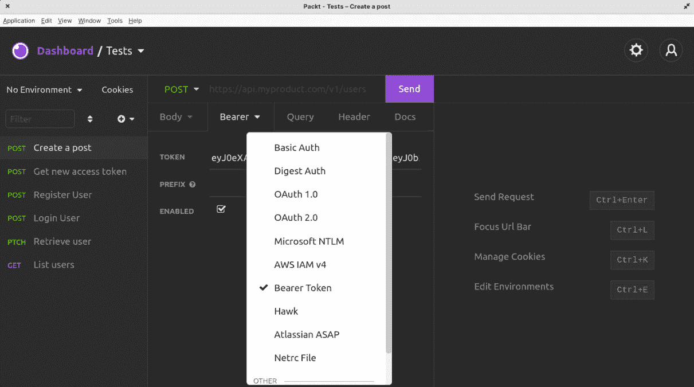
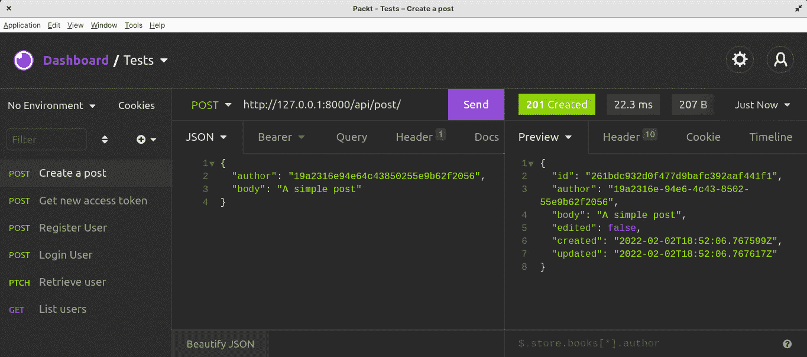
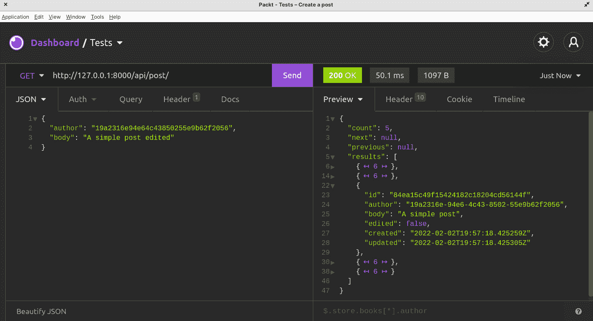
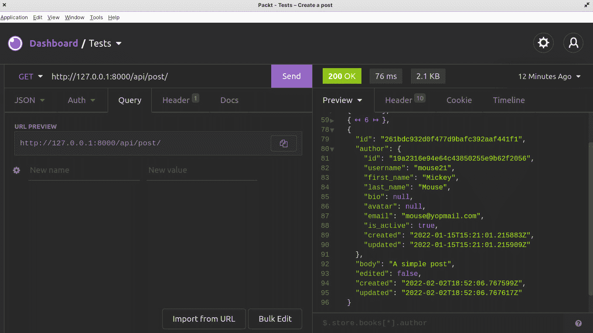
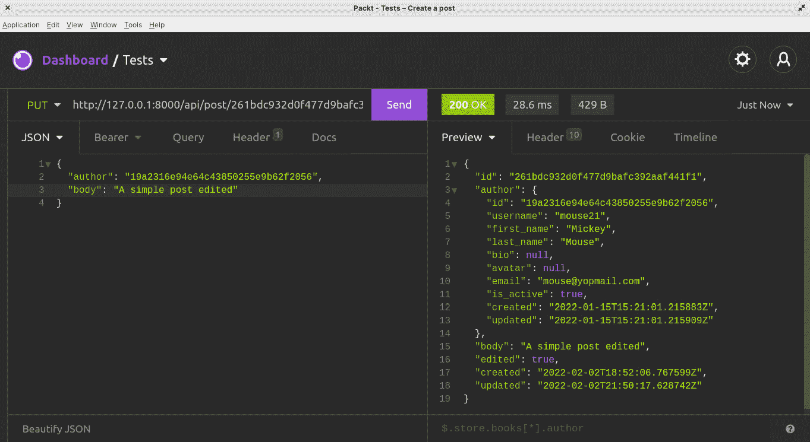
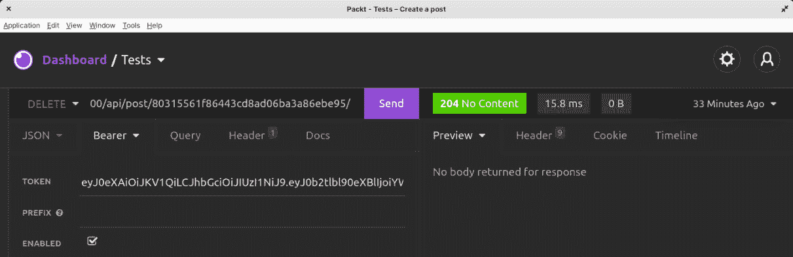

# 第三章：社交媒体帖子管理

在上一章中，我们介绍了模型、序列化器、视图集和路由来创建我们的第一个端点。在本章中，我们将使用相同的概念为我们的社交媒体项目创建帖子。这将通过将项目划分为数据库关系、过滤和权限等概念来完成。在本章结束时，你将能够使用 Django 模型处理数据库关系，编写自定义过滤和权限，以及删除和更新对象。

在本章中，我们将涵盖以下主题：

+   创建帖子模型

+   编写帖子模型

+   编写帖子序列化器

+   编写帖子视图集

+   添加权限

+   删除和更新帖子

+   添加点赞功能

# 技术要求

对于本章，你需要在你的机器上安装 Insomnia 来发送 HTTP 请求。

你可以在这里找到本章的代码：[`github.com/PacktPublishing/Full-stack-Django-and-React/tree/chap3`](https://github.com/PacktPublishing/Full-stack-Django-and-React/tree/chap3)。

# 创建帖子模型

在这个项目中，帖子是一篇长或短的文本，任何人都可以查看，无论用户是否与该帖子相关联。以下是帖子功能的要求数据：

+   认证用户应该能够创建帖子

+   认证用户应该能够点赞帖子

+   所有用户都应该能够阅读帖子，即使他们未认证

+   帖子的作者应该能够修改帖子

+   帖子的作者应该能够删除帖子

从后端的角度来看这些需求，我们可以理解我们将要处理数据库、模型和权限。首先，让我们从编写数据库中`帖子`模型的结构开始。

## 设计帖子模型

帖子由作者（在这里，是用户）撰写的字符组成的内容。它是如何在我们数据库中结构化的？

在创建`帖子`模型之前，让我们快速绘制一下数据库中模型结构的图示：


图 3.1 – 帖子表

如*图 3.1*所示，有一个`作者`字段，它是一个`用户`表。每次创建帖子时，都需要传递一个外键。

外键是**一对一**（或**多对一**）关系的一个特征。在这种关系中，表 A 中的一行可以在表 B 中有多个匹配行（*一对多*），但表 B 中的一行只能有一个匹配表 A 的行。

在我们的案例中，一个用户（来自`用户`表）可以有多个帖子（在`帖子`表中），但一个帖子只能有一个用户（*图 3.2*）：


图 3.2 – 用户和帖子关系

还有两种其他类型的数据库关系：

+   一对一：在这种关系类型中，表 A 中的一行只能对应表 B 中的一行，反之亦然。例如，工人 C 只有一个且仅有一个桌子 D。而这个桌子 D 只能由这个工人 C 使用（**图 3.3**.3）：


图 3.3 – 工人与桌子之间的一对一关系

+   多对多：在这种数据库关系类型中，表 A 中的一行可以对应表 B 中的多行，反之亦然。例如，在一个电子商务应用中，一个订单可以有多个商品，一个商品也可以出现在多个不同的订单中（**图 3.4**.4）：


图 3.4 – 订单与商品之间的多对多关系

在编写帖子的“点赞”功能时，将使用*多对多*关系。

很好，现在我们更好地了解了数据库关系，我们可以开始编写帖子功能，从`Post`模型开始。但在那之前，让我们快速重构代码以使开发更容易。

## 抽象

我们接下来要创建的下一个模型也将包含`public_id`、`created`和`updated`字段。为了遵循**不要重复自己**（**DRY**）原则，我们将使用抽象模型类。

一个**抽象类**可以被视为其他类的蓝图。它通常包含一组必须在从抽象类构建的任何子类中创建的方法或属性。

在`core`目录内，创建一个新的 Python 包，命名为`abstract`。完成后，创建一个`models.py`文件。在这个文件中，我们将编写两个类：`AbstractModel`和`AbstractManager`。

`AbstractModel`类将包含如`public_id`、`created`和`updated`等字段。另一方面，`AbstractManager`类将包含用于通过`public_id`字段检索对象的函数：

core/abstract/models.py

```py
from django.db import models
import uuid
from django.core.exceptions import ObjectDoesNotExist
from django.http import Http404
class AbstractManager(models.Manager):
   def get_object_by_public_id(self, public_id):
       try:
           instance = self.get(public_id=public_id)
           return instance
       except (ObjectDoesNotExist, ValueError, TypeError):
           return Http404
class AbstractModel(models.Model):
   public_id = models.UUIDField(db_index=True, unique=True,
     default=uuid.uuid4, editable=False)
   created = models.DateTimeField(auto_now_add=True)
   updated = models.DateTimeField(auto_now=True)
   objects = AbstractManager()
   class Meta:
       abstract = True
```

正如你在`AbstractModel`的`Meta`类中看到的，`abstract`属性被设置为`True`。Django 将忽略这个类模型，并且不会为这个模型生成迁移。

现在我们有了这个类，让我们对`User`模型进行快速重构：

首先，让我们移除用于通过`public_id`检索对象的`get_object_by_public_id`方法，并让`UserManager`成为子类：

core/user/models.py

```py
…
from core.abstract.models import AbstractModel, AbstractManager
class UserManager(BaseUserManager, AbstractManager):
…
class User(AbstractModel, AbstractBaseUser, PermissionsMixin):
…
```

在`User`模型上，移除`public_id`、`updated`和`created`字段，并且，使用`AbstractModel`类子类化`User`模型。这通常不会对数据库造成任何变化，因此，除非你已更改字段的属性，否则无需再次运行`makemigrations`。

让我们再添加一个`AbstractSerializer`，它将被我们在本项目中创建的所有序列化器使用。

## 编写抽象序列化器

我们 API 中返回的所有对象都将包含`id`、`created`和`updated`字段。在每一个`ModelSerializer`上再次编写这些字段将是重复的，所以让我们只创建一个`AbstractSerializer`类。在`abstract`目录中，创建一个名为`serializers.py`的文件，并添加以下内容：

core/abstract/serializers.py

```py
from rest_framework import serializers
class AbstractSerializer(serializers.ModelSerializer):
   id = serializers.UUIDField(source='public_id',
                              read_only=True, format='hex')
   created = serializers.DateTimeField(read_only=True)
   updated = serializers.DateTimeField(read_only=True)
```

完成后，你可以去子类化`UserSerializer`类，使用`AbstractSerializer`类：

core/user/serializers.py

```py
from core.abstract.serializers import AbstractSerializer
from core.user.models import User
class UserSerializer(AbstractSerializer):
…
```

完成后，删除`id`、`created`和`updated`字段的声明。

让我们对`ViewSets`进行最后一次抽象。

## 编写 AbstractViewSet

但为什么要写一个`ViewSet`的摘要呢？嗯，会有关于排序和过滤的重复声明。让我们创建一个包含默认值的类。

在`abstract`目录中，创建一个名为`viewsets.py`的文件，并添加以下内容：

core/abstract/viewsets.py

```py
from rest_framework import viewsets
from rest_framework import filters
class AbstractViewSet(viewsets.ModelViewSet):
   filter_backends = [filters.OrderingFilter]
   ordering_fields = ['updated', 'created']
   ordering = ['-updated']
```

如你所见，我们有以下属性：

+   `filter_backends`：这设置了默认的过滤器后端。

+   `ordering_fields`：这个列表包含在请求时可以作为排序参数使用的字段。

+   `ordering`：这将告诉 Django REST 以何种顺序发送多个对象作为响应。在这种情况下，所有响应都将按最近更新的顺序排序。

下一步是将`AbstractViewSet`类添加到代码中，实际上是在调用`ModelViewSets`的地方。转到`core/user/viewsets.py`，并使用`AbstractViewSet`类来子类化`UserViewSet`：

core/user/viewsets.py

```py
…
from core.abstract.viewsets import AbstractViewSet
from core.user.serializers import UserSerializer
from core.user.models import User
class UserViewSet(AbstractViewSet):
…
```

太好了，现在我们有了编写更好、更少代码所需的所有东西；让我们编写`Post`模型。

# 编写 Post 模型

我们已经建立了`Post`模型的结构。让我们编写代码和功能：

1.  创建一个名为`post`的新应用：

    ```py
    django-admin startapp post
    ```

1.  重新编写新创建的包的`apps.py`，以便在项目中轻松调用：

core/post/apps.py

```py
from django.apps import AppConfig
class PostConfig(AppConfig):
   default_auto_field =
     'django.db.models.BigAutoField'
   name = 'core.post'
   label = "core_label"
```

1.  完成后，我们现在可以编写`Post`模型。打开`models.py`文件，输入以下内容：

core/post/models.py

```py
from django.db import models
from core.abstract.models import AbstractModel, AbstractManager
class PostManager(AbstractManager):
   pass
class Post(AbstractModel):
   author = models.ForeignKey(to="core_user.User",
     on_delete=models.CASCADE)
   body = models.TextField()
   edited = models.BooleanField(default=False)
   objects = PostManager()
   def __str__(self):
       return f"{self.author.name}"
   class Meta:
       db_table = "'core.post'"
```

你可以在这里看到我们是如何创建`ForeignKey`关系的。Django 模型实际上提供了处理这种关系的工具，它也是对称的，这意味着我们不仅可以使用`Post.author`语法来访问用户对象，还可以使用`User.post_set`语法来访问用户创建的帖子。后者语法将返回一个包含用户创建的帖子的`queryset`对象，因为我们处于`ForeignKey`关系，这同样是一个一对多关系。你也会注意到`on_delete`属性具有`models.CASCADE`值。使用`CASCADE`，如果从数据库中删除用户，Django 也会删除与此用户相关的所有帖子记录。

除了`CASCADE`作为`ForeignKey`关系上`on_delete`属性值的选项之外，你还可以有如下选项：

+   `SET_NULL`：这将在删除时将子对象的外键设置为 null。例如，如果从数据库中删除用户，则与该用户相关的帖子的`author`字段值设置为**None**。

+   `SET_DEFAULT`：这将在写入模型时将子对象设置为给定的默认值。如果你确定默认值不会被删除，则它将工作。

+   `RESTRICT`：在特定条件下会引发`RestrictedError`。

+   `PROTECT`：这会阻止外键对象被删除，只要还有对象与外键对象相关联。

让我们通过创建一个对象并将其保存到数据库中来测试新添加的模型：

1.  将新创建的应用程序添加到`INSTALLED_APPS`列表中：

CoreRoot/settings.py

```py
…
'core.post'
…
```

1.  让我们为新增的应用程序创建迁移：

    ```py
    python manage makemigrations && python manage.py migrate
    ```

1.  然后，让我们使用`python manage.py` `shell`命令进行操作：

    ```py
    (venv) koladev@koladev123xxx:~/PycharmProjects/Full-stack-Django-and-React$ python manage.py shell
    ```

    ```py
    Python 3.10.2 (main, Jan 15 2022, 18:02:07) [GCC 9.3.0] on linux
    ```

    ```py
    Type "help", "copyright", "credits" or "license" for more information.
    ```

    ```py
    (InteractiveConsole)
    ```

    ```py
    >>>
    ```

重要提示

你可以使用**django_shell_plus**包来加速与 Django shell 的工作。你不需要自己输入所有导入，因为默认情况下所有模型都会被导入。你可以在以下网站上找到有关如何安装它的更多信息：[`django-extensions.readthedocs.io/en/latest/shell_plus.html`](https://django-extensions.readthedocs.io/en/latest/shell_plus.html)。

1.  让我们导入一个用户。这将是我们将要创建的帖子的作者：

    ```py
    >>> from core.post.models import Post
    ```

    ```py
    >>> from core.user.models import User
    ```

    ```py
    >>> user = User.objects.first()
    ```

    ```py
    >>> user
    ```

1.  接下来，让我们创建一个字典，它将包含创建帖子所需的所有字段：

    ```py
    >>> data = {"author": user, "body":"A simple test"}
    ```

1.  现在，让我们创建一个帖子：

    ```py
    >>> post = Post.objects.create(**data)
    ```

    ```py
    >>> post
    ```

    ```py
    <Post: John Hey>
    ```

    ```py
    >>>
    ```

    ```py
    Let's access the author field of this object.
    ```

    ```py
    >>> post.author
    ```

    ```py
    <User: testuser@yopmail.com>
    ```

如你所见，作者实际上是我们在数据库中检索到的用户。

让我们也尝试反向关系：

```py
>>> user.post_set.all()
<QuerySet [<Post: John Hey>]>
```

如你所见，`post_set`属性包含了与该用户相关联的所有帖子所需的所有交互指令。

现在你已经更好地理解了 Django 中数据库关系的工作方式，我们可以继续编写`Post`对象的序列化器。

# 编写 Post 序列化器

`Post`序列化器将包含在端点请求时创建帖子所需的字段。让我们首先添加帖子创建的功能。

在`post`目录下，创建一个名为`serializers.py`的文件。在这个文件中，添加以下内容：

core/post/serializers.py

```py
from rest_framework import serializers
from rest_framework.exceptions import ValidationError
from core.abstract.serializers import AbstractSerializer
from core.post.models import Post
from core.user.models import User
class PostSerializer(AbstractSerializer):
   author = serializers.SlugRelatedField(
     queryset=User.objects.all(), slug_field='public_id')
   def validate_author(self, value):
       if self.context["request"].user != value:
           raise ValidationError("You can't create a post
                                  for another user.")
       return value
   class Meta:
       model = Post
       # List of all the fields that can be included in a
       # request or a response
       fields = ['id', 'author', 'body', 'edited',
                 'created', 'updated']
       read_only_fields = ["edited"]
```

我们添加了一个新的序列化器字段类型，`SlugRelatedField`。由于我们正在使用`ModelSerializer`类，Django 会自动为我们处理字段和关系生成。定义我们想要使用的关联字段类型对于告诉 Django 确切要做什么也非常关键。

正是`SlugRelatedField`在这里发挥作用。它用于使用目标上的字段来表示关系的目标。因此，在创建帖子时，作者的`public_id`将通过请求体传递，以便用户可以被识别并关联到帖子。

`validate_author` 方法检查 `author` 字段的验证。在这里，我们想确保创建帖子的用户与 `author` 字段中的用户相同。每个序列化器都有一个上下文字典可用。它通常包含我们可以用来进行一些检查的请求对象。

这里没有硬性限制，因此我们可以轻松地进入这个功能的下一部分：编写 `Post` 视图集。

# 编写帖子视图集

对于以下端点，我们只允许 `POST` 和 `GET` 方法。这将帮助我们首先实现基本功能。

代码应遵循以下规则：

+   只有经过身份验证的用户才能创建帖子

+   只有经过身份验证的用户才能读取帖子

+   只允许使用 `GET` 和 `POST` 方法

在 `post` 目录中，创建一个名为 `viewsets.py` 的文件。在文件中，添加以下内容：

core/post/viewsets.py

```py
from rest_framework.permissions import IsAuthenticated
from core.abstract.viewsets import AbstractViewSet
from core.post.models import Post
from core.post.serializers import PostSerializer
class PostViewSet(AbstractViewSet):
   http_method_names = ('post', 'get')
   permission_classes = (IsAuthenticated,)
   serializer_class = PostSerializer
   def get_queryset(self):
       return Post.objects.all()
   def get_object(self):
       obj = Post.objects.get_object_by_public_id(
         self.kwargs['pk'])
       self.check_object_permissions(self.request, obj)
       return obj
   def create(self, request, *args, **kwargs):
       serializer = self.get_serializer(data=request.data)
       serializer.is_valid(raise_exception=True)
       self.perform_create(serializer)
       return Response(serializer.data,
                       status=status.HTTP_201_CREATED)
```

在前面的代码中，我们定义了三个有趣的方法：

+   `get_queryset` 方法返回所有帖子。我们实际上没有特定的获取帖子要求，因此我们可以返回数据库中的所有帖子。

+   `get_object` 方法使用 `public_id` 返回一个 `post` 对象，该 `public_id` 将出现在 URL 中。我们从 `self.kwargs` 目录中检索此参数。

+   `create` 方法，这是在 `ViewSet` 的 `POST` 请求端点执行的 `ViewSet` 动作。我们只需将数据传递给在 `ViewSet` 上声明的序列化器，验证数据，然后调用 `perform_create` 方法来创建 `post` 对象。此方法将自动通过调用 `Serializer.create` 方法来处理 `post` 对象的创建，这将触发在数据库中创建 `post` 对象。最后，我们返回一个包含新创建帖子的响应。

正在这里，你有 `ViewSet` 的代码。下一步是添加端点并开始测试 API。

## 添加帖子路由

在 `routers.py` 文件中，添加以下内容：

core/routers.py

```py
…
from core.post.viewsets import PostViewSet
# ##################################################################### #
# ################### POST                       ###################### #
# ##################################################################### #
router.register(r'post', PostViewSet, basename='post')
…
```

完成后，你将在 `/post/` 路径下获得一个新的端点。让我们用 Insomnia 来测试 API。

首先，尝试直接向 `/post/` 端点发送请求。你会收到一个 `/auth/login/` 端点，并使用注册用户复制令牌。

在 Insomnia 的 **Bearer** 选项卡中，选择 **Bearer Token**：



图 3.5 – 将 Bearer Token 添加到 Insomnia 请求中

现在，再次使用 `GET` 请求触发端点。你会看到没有结果，太好了！让我们在数据库中创建第一个帖子。

将请求类型更改为 `POST` 并将以下内容更改为 JSON 主体：

```py
{
    "author": "19a2316e94e64c43850255e9b62f2056",
    "body": "A simple posted"
}
```

请注意，我们将有一个不同的 `public_id`，请确保使用你刚刚登录的用户 `public_id` 并重新发送请求：



图 3.6 – 创建帖子

好的，帖子已创建！让我们看看在发送 `GET` 请求时它是否可用：



图 3.7 – 获取所有帖子

DRF 提供了一种分页响应的方式，并在 `settings.py` 文件中设置了一个全局默认分页限制大小。随着时间的推移，将显示很多对象，并且有效负载的大小也会变化。

为了防止这种情况，让我们添加一个默认大小和一个类来分页我们的结果。

在项目的 `settings.py` 文件中，向 `REST_FRAMEWORK` 字典添加新的设置：

CoreRoot/settings.py

```py
REST_FRAMEWORK = {
…
   'DEFAULT_PAGINATION_CLASS':
     'rest_framework.pagination.LimitOffsetPagination',
   'PAGE_SIZE': 15,
}
…
```

基本上在这里，所有结果每页限制为 15 个，但我们在请求时也可以通过 `limit` 参数增加这个大小，并使用 `offset` 参数精确到我们想要结果开始的精确位置：

```py
GET https://api.example.org/accounts/?limit=100&offset=400
```

太好了，现在再次进行 `GET` 请求，你会看到结果结构更清晰。

此外，在响应中包含作者的名字也会更实用。让我们重写一个序列化方法，以帮助修改响应对象。

## 重写帖子序列化对象

实际上，`author` 字段接受 `public_id` 并返回 `public_id`。虽然它完成了工作，但可能有点难以识别用户。这会导致它再次使用用户的 `public_id` 发起请求，以获取关于用户的信息片段。

`to_representation()` 方法接受需要序列化的对象实例，并返回一个原始表示。这通常意味着返回一个内置 Python 数据类型的结构。可以处理的确切类型取决于你为 API 配置的渲染类。

在 `post/serializers.py` 内，添加一个名为 `to_represenation()` 的新方法：

core/post/serializers.py

```py
class PostSerializer(AbstractSerializer):
   …
   def to_representation(self, instance):
       rep = super().to_representation(instance)
       author = User.objects.get_object_by_public_id(
         rep["author"])
       rep["author"] = UserSerializer(author).data
       return rep
…
```

如你所见，我们正在使用 `public_id` 字段来检索用户，然后使用 `UserSerializer` 序列化 `User` 对象。

让我们再次获取所有帖子，你会看到所有用户：



图 3.8 – 获取所有帖子

我们有一个工作的 `Post` 功能，但它也有一些问题。当为我们的功能编写写入权限时，让我们进一步探讨这个问题。

# 添加权限

如果认证是验证用户身份的行为，那么授权就是简单地检查用户是否有执行该行为的权利或特权。

在我们的项目中，我们有三种类型的用户：

+   **匿名用户**：此用户在 API 上没有账户，实际上无法被识别

+   **注册和活跃用户**：此用户在 API 上有账户，可以轻松执行一些操作

+   **管理员用户**：此用户拥有所有权利和特权

我们希望匿名用户能够在不必要认证的情况下读取 API 上的帖子。虽然确实存在 `AllowAny` 权限，但它肯定会与 `IsAuthenticated` 权限冲突。

因此，我们需要编写一个自定义权限。

在 `authentication` 目录内，创建一个名为 `permissions` 的文件，并添加以下内容：

core/post/viewsets.py

```py
from rest_framework.permissions import BasePermission, SAFE_METHODS
class UserPermission(BasePermission):
   def has_object_permission(self, request, view, obj):
       if request.user.is_anonymous:
           return request.method in SAFE_METHODS
       if view.basename in ["post"]:
           return bool(request.user and
                       request.user.is_authenticated)
    return False
   def has_permission(self, request, view):
       if view.basename in ["post"]:
           if request.user.is_anonymous:
               return request.method in SAFE_METHODS
           return bool(request.user and
                       request.user.is_authenticated)
       return False
```

Django 权限通常在两个级别上工作：在整体端点（`has_permission`）和对象级别（`has_object_permission`）。

编写权限的一个好方法是一直默认拒绝；这就是为什么我们总是在每个权限方法结束时返回`False`。然后你可以开始添加条件。在这里，在所有方法中，我们都在检查匿名用户只能进行`SAFE_METHODS`请求——`GET`、`OPTIONS`和`HEAD`。

对于其他用户，我们确保他们在继续之前总是经过认证。另一个重要功能是允许用户删除或更新帖子。让我们看看我们如何使用 Django 来实现这一点。

# 删除和更新帖子

删除和更新文章也是帖子功能的一部分。为了添加这些功能，我们不需要编写序列化器或视图集，因为删除（`destroy()`）和更新（`update()`）的方法默认已经在`ViewSet`类中可用。我们只需重写`PostSerializer`上的`update`方法，以确保在修改帖子时将`edited`字段设置为`True`。

让我们在`PostViewSet`的`http_methods`中添加`PUT`和`DELETE`方法：

core/post/viewsets.py

```py
…
class PostViewSet(AbstractViewSet):
   http_method_names = ('post', 'get', 'put', 'delete')
…
```

在进入之前，让我们重写`PostSerializer`中的`update`方法。实际上，我们在`Post`模型中有一个名为`edited`的字段。这个字段将告诉我们帖子是否被编辑过：

core/post/serializers.py

```py
…
class PostSerializer(AbstractSerializer):
…
   def update(self, instance, validated_data):
       if not instance.edited:
           validated_data['edited'] = True
       instance = super().update(instance, validated_data)
       return instance
…
```

让我们在 Insomnia 中尝试`PUT`和`DELETE`请求。以下是`PUT`请求的示例正文：

```py
{
    "author": "61c5a1ecb9f5439b810224d2af148a23",
    "body": "A simple post edited"
}
```



图 3.9 – 修改帖子

如您所见，响应中的`edited`字段被设置为`true`。

让我们尝试删除帖子，看看它是否工作：



图 3.10 – 删除帖子

重要提示

有一种方法可以在不必要从数据库中删除记录的情况下删除记录。这通常被称为软删除。记录将无法被用户访问，但它将始终存在于数据库中。您可以在[`dev.to/bikramjeetsingh/soft-deletes-in-django-a9j`](https://dev.to/bikramjeetsingh/soft-deletes-in-django-a9j)了解更多相关信息。

# 添加点赞功能

在社交媒体应用中拥有一个不错的功能就是点赞。就像 Facebook、Instagram 或 Twitter 一样，我们在这里将允许用户点赞帖子。

此外，我们还将添加数据来统计帖子的点赞数，并检查当前发起请求的用户是否点赞了帖子。

我们将分四个步骤来完成这项工作：

1.  向`User`模型添加新的`posts_liked`字段。

1.  在`User`模型上编写点赞和取消点赞帖子的方法。我们还将添加一个方法来检查用户是否点赞了帖子。

1.  将`likes_count`和`has_liked`添加到`PostSerializer`。

1.  添加点赞和踩帖子的端点。

太好了！让我们先向`User`模型添加新的字段。

## 向 User 模型添加 posts_liked 字段

`posts_liked` 字段将包含用户喜欢的所有帖子。关于点赞功能的 `User` 模型和 `Post` 模型之间的关系可以描述如下：

+   一个用户可以点赞多个帖子

+   一个帖子可以被多个用户点赞

这种关系听起来熟悉吗？这是一个 *多对多* 关系。

随着这个更改，以下是表的更新结构 – 我们也在预测我们将添加到模型中的方法：


图 3.11 – 新用户表结构

太好了！让我们将 `posts_liked` 字段添加到 `User` 模型中。打开 `/core/user/models.py` 文件，并在 `User` 模型中添加一个新字段：

```py
class User(AbstractModel, AbstractBaseUser, PermissionsMixin):
...
   posts_liked = models.ManyToManyField(
       "core_post.Post",
       related_name="liked_by"
   )
...
```

然后，运行以下命令以创建一个新的迁移文件并将此迁移应用到数据库中：

```py
python manage.py makemigrations
python manage.py migrate
```

下一步是将图 3.11 中显示的新方法添加到 `User` 模型中。

## 添加点赞、取消点赞和 has_liked 方法

在编写这些方法之前，让我们描述一下每个新方法的目的：

+   `like()` 方法：这个方法用于在尚未点赞的情况下点赞帖子。为此，我们将使用模型中的 `add()` 方法。我们将使用 `ManyToManyField` 来将帖子链接到用户。

+   `remove_like()` 方法：这个方法用于从帖子中移除点赞。为此，我们将使用模型中的 `remove` 方法。我们将使用 `ManyToManyField` 来解除帖子与用户的链接。

+   `has_liked()` 方法：这个方法用于返回用户是否喜欢了一个帖子，如果是则返回 `True`，否则返回 `False`。

让我们继续编写代码：

```py
class User(AbstractModel, AbstractBaseUser, PermissionsMixin):
   ...
   def like(self, post):
       """Like `post` if it hasn't been done yet"""
       return self.posts_liked.add(post)
   def remove_like(self, post):
       """Remove a like from a `post`"""
       return self.posts_liked.remove(post)
   def has_liked(self, post):
       """Return True if the user has liked a `post`; else
          False"""
       return self.posts_liked.filter(pk=post.pk).exists()
```

太好了！接下来，让我们将 `likes_count` 和 `has_liked` 字段添加到 `PostSerializer`。

## 将 likes_count 和 has_liked 字段添加到 PostSerializer

而不是在 `Post` 模型中添加如 `likes_count` 这样的字段并在数据库中生成更多字段，我们可以在 `PostSerializer` 上直接管理它。Django 中的 `Serializer` 类提供了创建将在响应中发送的 `write_only` 值的方法。

在 `core/post/serializers.py` 文件中，向 `PostSerializer` 添加新字段：

Core/post/serializers.py

```py
...
class PostSerializer(AbstractSerializer):
   ...
   liked = serializers.SerializerMethodField()
   likes_count = serializers.SerializerMethodField()
   def get_liked(self, instance):
       request = self.context.get('request', None)
       if request is None or request.user.is_anonymous:
           return False
       return request.user.has_liked(instance)
   def get_likes_count(self, instance):
       return instance.liked_by.count()
   class Meta:
       model = Post
       # List of all the fields that can be included in a
       # request or a response
       fields = ['id', 'author', 'body', 'edited', 'liked',
                 'likes_count', 'created', 'updated']
       read_only_fields = ["edited"]
```

在前面的代码中，我们使用了 `serializers.SerializerMethodField()` 字段，它允许我们编写一个自定义函数，该函数将返回我们想要分配给此字段的价值。方法的语法将是 `get_field`，其中 `field` 是在序列化器上声明的字段的名称。

因此，对于 `liked`，我们有 `get_liked` 方法，对于 `likes_count`，我们有 `get_likes_count` 方法。

在 `PostSerializer` 上的新字段允许我们添加到 `PostViewSet` 的端点，以点赞或踩踏文章。

## 将点赞和踩踏操作添加到 PostViewSet

DRF 提供了一个名为 `action` 的装饰器。这个装饰器有助于使 `ViewSet` 类上的方法可路由。`action` 装饰器接受两个参数：

+   `detail`：如果此参数设置为 `True`，则此操作的路径将需要一个资源查找字段；在大多数情况下，这将是指资源的 ID

+   `methods`：这是动作接受的方方法的列表

让我们在`PostViewSets`上编写动作：

core/post/viewsets.py

```py
 ...
class PostViewSet(AbstractViewSet):
   ...
   @action(methods=['post'], detail=True)
   def like(self, request, *args, **kwargs):
       post = self.get_object()
       user = self.request.user
       user.like(post)
       serializer = self.serializer_class(post)
       return Response(serializer.data,
                       status=status.HTTP_200_OK)
   @action(methods=['post'], detail=True)
   def remove_like(self, request, *args, **kwargs):
       post = self.get_object()
       user = self.request.user
       user.remove_like(post)
       serializer = self.serializer_class(post)
       return Response(serializer.data,
                       status=status.HTTP_200_OK)
```

对于每个添加的动作，我们按照以下步骤编写逻辑：

1.  首先，我们检索我们想要调用点赞或取消点赞动作的相关帖子。`self.get_object()`方法将自动返回相关的帖子，这是通过将`detail`属性设置为`True`，并使用传递给 URL 请求的 ID 来实现的。

1.  其次，我们还从`self.request`对象中检索发起请求的用户。这样做是为了我们可以调用添加到`User`模型中的`remove_like`或`like`方法。

1.  最后，我们使用在`self.serializer_class`上定义的`Serializer`类序列化帖子，并返回一个响应。

将此添加到`PostViewSets`后，Django Rest Framework 路由器将自动为该资源创建新的路由，然后，你可以做以下操作：

1.  使用以下端点点赞帖子：`api/post/post_pk/like/`。

1.  使用以下端点移除帖子的点赞：`api/post/post_pk/remove_like/`。

太棒了，这个功能运行得像魔法一样。在下一章，我们将向项目中添加*注释*功能。

# 摘要

在本章中，我们学习了如何使用数据库关系和编写权限。我们还学习了如何在视集合和序列化器上覆盖更新和创建方法。

我们通过创建一个`Abstract`类来遵循*DRY*规则，对代码进行了快速重构。在下一章，我们将添加注释功能到帖子中。用户将能够在帖子下创建评论，以及删除和更新它们。

# 问题

1.  一些数据库关系有哪些？

1.  Django 权限有哪些？

1.  你如何分页 API 响应的结果？

1.  你如何使用 Django shell？
