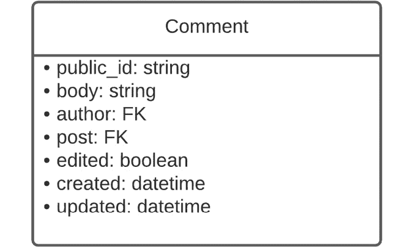
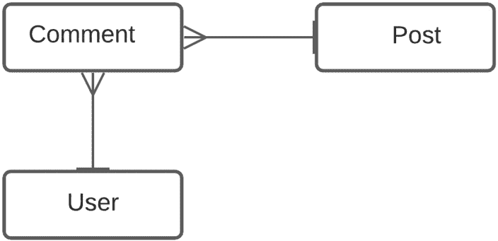
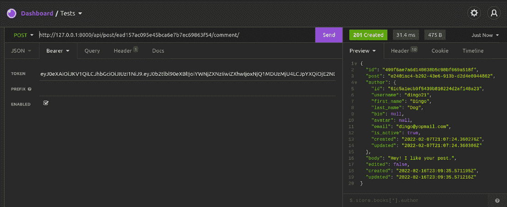
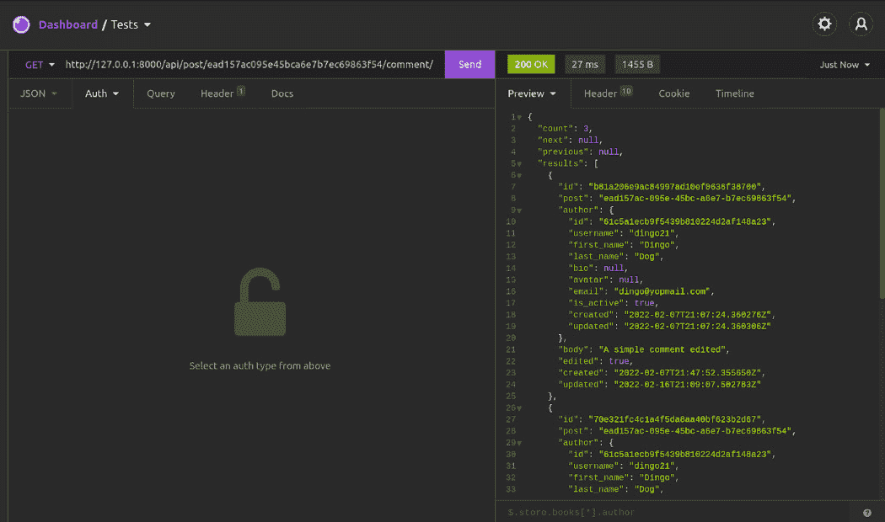
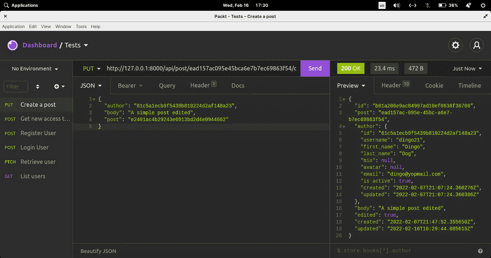
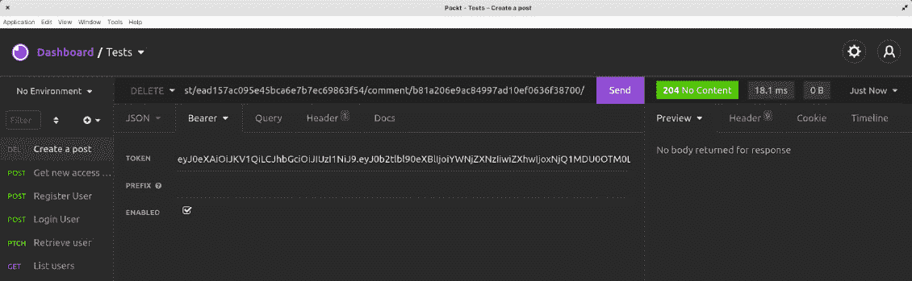

# 4

# 向社交媒体帖子添加评论

如果你的用户可以在其他帖子下评论甚至点赞，那么社交媒体应用会更有趣。在本章中，我们将首先学习如何向帖子添加评论。我们将看到如何再次使用数据库关系为每个帖子创建一个评论部分，并确保代码质量得到保持。

在本章中，我们将涵盖以下主题：

+   编写评论模型

+   编写评论序列化器

+   为评论资源嵌套路由

+   编写 CommentViewSet 类

+   更新评论

+   删除评论

到本章结束时，你将能够创建 Django 模型，编写 Django 序列化器和验证，编写嵌套视图集和路由，并对授权权限有更好的理解。

# 技术要求

对于本章，你需要安装 Insomnia 并了解一些关于模型、数据库关系和权限的知识。你还需要在你的机器上安装 Insomnia API 客户端。本章的代码可以在以下位置找到：[`github.com/PacktPublishing/Full-stack-Django-and-React/tree/chap4`](https://github.com/PacktPublishing/Full-stack-Django-and-React/tree/chap4)。

# 编写评论模型

在本项目的上下文中，一个评论将代表一个任何人都可以查看但只有认证用户可以创建或更新的简短文本。以下是该功能的需求：

+   任何用户都可以阅读评论

+   认证用户可以在帖子下创建评论

+   评论作者和帖子作者可以删除评论

+   评论作者可以更新帖子

观察这些需求，我们肯定可以从编写模型开始。但首先，让我们快速谈谈数据库中**评论**表的结构：



图 4.1 – 评论表结构

一个评论通常有四个重要的字段：评论的作者、评论所在的帖子、评论正文以及编辑字段，用于跟踪评论是否被编辑。

如*图 4*.1 所示，我们在表中有两个数据库关系：作者和帖子。那么，这个结构在数据库中是如何体现的呢？



图 4.2 – 评论、帖子与用户关系

如*图 4*.2 所示，作者（`User`）和帖子（`Post`）字段是**外键**类型。这关系到评论功能的某些规则：

+   一个用户可以有多个评论，但一个评论是由一个用户创建的

+   一个帖子可以有多个评论，但一个评论只与一个帖子相关联

现在我们已经有了表的结构和对需求的更好理解，让我们编写模型并对其进行测试。

## 添加评论模型

在`core/comment/models.py`中添加以下内容：

core/comment/models.py

```py
from django.db import models
from core.abstract.models import AbstractModel, AbstractManager
class CommentManager(AbstractManager):
    pass
class Comment(AbstractModel):
    post = models.ForeignKey("core_post.Post",
                              on_delete=models.PROTECT)
    author = models.ForeignKey("core_user.User",
                                on_delete=models.PROTECT)
    body = models.TextField()
    edited = models.BooleanField(default=False)
    objects = CommentManager()
    def __str__(self):
        return self.author.name
```

在前面的代码片段中，我们声明了一个名为`CommentManager`的类，它是`AbstractManager`类的子类。然后，我们声明了`Comment`模型类，其中包含`post`和`author`字段，这些字段分别与`Post`模型和`User`模型相关联，是`ForeignKey`字段。最后，我们声明了正文和编辑字段。其余的代码是基本的礼节，比如告诉 Django 使用 Manager 类来管理`Comment`模型，最后在 Django shell 中检查评论对象时返回作者的默认`__str__`方法。

现在已经编写了`Comment`模型，让我们在 Django shell 中玩一下这个模型。

## 在 Django shell 中创建评论

使用以下评论启动 Django shell：

python manage.py shell

```py
Python 3.10.2 (main, Jan 15 2022, 18:02:07) [GCC 9.3.0] on linux
Type "help", "copyright", "credits" or "license" for more information.
(InteractiveConsole)
>>> from core.comment.models import Comment
>>> from core.post.models import Post
>>> from core.user.models import User
```

首先，我们正在导入所需的模型以检索和创建一个评论。接下来，我们将检索一个用户和一个帖子，然后将创建评论所需的数据写入一个 Python 字典，如下所示：

```py
>>> user = User.objects.first()
>>> post = Post.objects.first()
>>> comment_data = {"post": post, "author": user, "body": "A comment."}
```

现在我们可以按照以下方式创建评论：

```py
>>> comment = Comment.objects.create(**comment_data)
>>> comment
<Comment: Dingo Dog>
>>> comment.body
'A comment.'
```

太好了，现在我们确信评论功能正常，我们可以编写评论功能的序列化器。

# 编写评论序列化器

评论序列化器将帮助进行验证和内容创建。在评论应用程序中，创建一个名为`serializers.py`的文件。我们将在这个文件中编写`CommentSerializer`。

首先，让我们导入创建序列化器所需的类和工具：

/core/comment/serializers.py

```py
from rest_framework import serializers
from rest_framework.exceptions import ValidationError
from core.abstract.serializers import AbstractSerializer
from core.user.models import User
from core.user.serializers import UserSerializer
from core.comment.models import Comment
from core.post.models import Post
```

一旦完成，我们现在可以编写`CommentSerializer`：

/core/comment/serializers.py

```py
...
class CommentSerializer(AbstractSerializer):
   author = serializers.SlugRelatedField(
     queryset=User.objects.all(), slug_field='public_id')
   post = serializers.SlugRelatedField(
     queryset=Post.objects.all(), slug_field='public_id')
   def to_representation(self, instance):
       rep = super().to_representation(instance)
       author =
        User.objects.get_object_by_public_id(rep["author"])
       rep["author"] = UserSerializer(author).data
       return rep
   class Meta:
       model = Comment
       # List of all the fields that can be included in a
       # request or a response
       fields = ['id', 'post', 'author', 'body', 'edited',
                 'created', 'updated']
       read_only_fields = ["edited"]
```

让我们解释与`CommentSerializer`类相关的代码。要创建一个评论，我们需要三个字段：作者的`public_id`、帖子的`public_id`以及最后的正文。我们还为`author`字段添加了验证方法。

在`validate_author`中，我们阻止用户为其他用户创建评论。

最后，`to_representation`方法通过添加有关作者的信息来修改最终对象。

评论序列化器现在已准备就绪。我们现在可以继续编写与评论功能相关的视图集。但在那之前，让我们谈谈资源的端点。

# 为评论资源嵌套路由

要创建、更新或删除评论，我们需要添加`ViewSet`。在`comment`目录中创建一个名为`viewsets.py`的文件。这个文件将包含`CommentViewSet`类的代码。我们不会为这个视图集编写完整的代码，因为我们需要清楚地了解端点的结构。

因此，暂时添加以下内容：

core/comment/viewsets.py

```py
from django.http.response import Http404
from rest_framework.response import Response
from rest_framework import status
from core.abstract.viewsets import AbstractViewSet
from core.comment.models import Comment
from core.comment.serializers import CommentSerializer
from core.auth.permissions import UserPermission
class CommentViewSet(AbstractViewSet):
   http_method_names = ('post', 'get', 'put', 'delete')
   permission_classes = (UserPermission,)
   serializer_class = CommentSerializer
...
```

太好了，现在让我们谈谈端点架构。以下表格显示了与评论相关的端点结构。您有方法、端点的 URL，以及最终在端点上调用时的结果：

| **方法** | **URL** | **结果** |
| --- | --- | --- |
| `GET` | `/api/comment/` | 列出与帖子相关的所有评论 |
| `GET` | `/api/comment/comment_pk/` | 获取特定的评论 |
| `POST` | `/api/comment/` | 创建一条评论 |
| `PUT` | `/api/comment/comment_pk/` | 修改一条评论 |
| `DELETE` | `/api/comment/comment_pk/` | 删除一条评论 |

然而，对于评论功能，我们正在处理帖子。如果评论直接与帖子相关，那绝对是一个好主意。因此，我们端点的一个很好的结构将如下所示：

| **方法** | **URL** | **操作** |
| --- | --- | --- |
| `GET` | `/api/post/post_pk/comment/` | 列出与帖子相关的所有评论 |
| `GET` | `/api/post/post_pk/comment/comment_pk/` | 获取特定的评论 |
| `POST` | `/api/post/post_pk/comment/` | 创建一条评论 |
| `PUT` | `/api/post/post_pk/comment/comment_pk/` | 修改一条评论 |
| `DELETE` | `/api/post/post_pk/comment/comment_pk/` | 删除一条评论 |

在这个结构中，端点是嵌套的，这意味着评论资源位于帖子资源之下。

但我们如何简单地实现这一点呢？

Django 生态系统有一个名为`drf-nested-routers`的库，它有助于在 Django 项目中编写路由器以创建嵌套资源。

您可以使用以下命令安装此软件包：

```py
pip install drf-nested-routers
```

不要忘记在`requirements.txt`文件中添加依赖项。

太好了！不需要在`settings.py`文件中注册它，因为它不包含信号、模型或应用程序。

在下一节中，让我们配置这个库以满足本项目的需求。

## 创建嵌套路由

按照以下步骤配置`drf-nested-routers`库：

1.  首件事是重写`routers.py`文件：

core/routers.py

```py
from rest_framework_nested import routers
...
router = routers.SimpleRouter()
…
```

`drf-nested-routers`附带一个扩展的`SimpleRouter`，这对于创建嵌套路由非常有用。

1.  然后，创建一个新的嵌套路由`POST`：

    ```py
    ...
    ```

    ```py
    # ##################################################################### #
    ```

    ```py
    # ################### POST                       ###################### #
    ```

    ```py
    # ##################################################################### #
    ```

    ```py
    router.register(r'post', PostViewSet, basename='post')
    ```

    ```py
    posts_router = routers.NestedSimpleRouter(router, r'post', lookup='post')
    ```

    ```py
    …
    ```

`NestedSimpleRouter`是`SimpleRouter`类的子类，它接受初始化参数，例如`parent_router` – `router` – `parent_prefix` – `r'post'` – 以及查找 – `post`。查找是匹配父资源实例（`PostViewSet`）的正则表达式变量。

在我们的案例中，查找正则表达式将是`post_pk`。

1.  下一步是在`post_router`上注册`comment`路由：

core/routers.py

```py
...
# ##################################################################### #
# ################### POST                       ###################### #
# ##################################################################### #
router.register(r'post', PostViewSet, basename='post')
posts_router = routers.NestedSimpleRouter(router, r'post', lookup='post')
posts_router.register(r'comment', CommentViewSet, basename='post-comment')
urlpatterns = [
   *router.urls,
   *posts_router.urls
]
...
```

太好了！评论资源现在可用，但我们必须在`CommentViewSet`类上重新编写`create`、`get_object`和`get_queryset`方法。让我们看看在下一节中如何使用嵌套路由来修改获取对象的逻辑。

## 编写 CommentViewSet 类

我们现在对端点的工作方式有了清晰的认识。

按照以下步骤在`core/comment/viewsets.py`文件中完成`CommentViewSet`类的编写：

1.  重新编写`CommentViewSet`类的`get_queryset`方法以适应端点的新架构：

core/comment/viewsets.py

```py
...
class CommentViewSet(AbstractViewSet):
...
   def get_queryset(self):
       if self.request.user.is_superuser:
           return Comment.objects.all()
       post_pk = self.kwargs['post_pk']
       if post_pk is None:
           return Http404
       queryset = Comment.objects.filter(
         post__public_id=post_pk)
       return queryset
```

在前面的代码中，`get_queryset` 是当用户点击 `/api/post/post_pk/comment/` 端点时调用的方法。这里的第一个验证是检查用户是否是超级用户。如果是这样，我们将返回数据库中所有的评论对象。

如果用户不是超级用户，我们将返回与帖子相关的评论。通过嵌套路由的帖子，我们将 `lookup` 属性设置为 `post`。这意味着在每次请求的 `kwargs`（包含额外数据的字典）中，将传递一个具有字典键 `post_pk` 的 `post` 的公共 ID 值到端点的 URL 中。

如果不是这样，我们只返回一个 404 未找到响应。

我们通过过滤和检索只有 `post.public_id` 字段等于 `post_pk` 的评论来对数据库进行查询。这是通过 Django ORM 提供的过滤方法完成的。编写用于从数据库检索对象的条件的代码是有用的。

1.  接下来，让我们向同一个 `CommentViewSet` 添加 `get_object` 方法，这样我们就可以使用 `public_id` 来检索特定的评论：

core/comment/viewsets.py

```py
...
class CommentViewSet(AbstractViewSet):
...
   def get_object(self):
       obj = Comment.objects.get_object_by_public_id(
         self.kwargs['pk'])
       self.check_object_permissions(self.request,
                                     obj)
       return obj
...
```

与 `UserViewSet` 上的 `get_object` 方法类似，这个方法在每次向 `/api/post/post_pk/comment/comment_pk/` 端点发出的请求上被调用。在这里，`pk` 由 `comment_pk` 表示。

然后，我们检索对象并检查权限。如果一切正常，我们返回该对象。

1.  作为最后一步，让我们编写 `create` 方法：

core/comment/viewsets.py

```py
...
class CommentViewSet(AbstractViewSet):
...
   def create(self, request, *args, **kwargs):
       serializer =
         self.get_serializer(data=request.data)
       serializer.is_valid(raise_exception=True)
       self.perform_create(serializer)
       return Response(serializer.data,
                       status=status.HTTP_201_CREATED)
```

与 `PostViewSet` 上的 `create` 方法类似，我们将 `request.data` 传递给 `ViewSet` 序列化器 – `CommentSerialier` – 并尝试验证序列化器。

如果一切正常，我们将根据 `CommentSerializer` 创建一个新对象 – 一个新的评论。

太好了！我们现在有一个完全功能的 `ViewSet`。接下来，让我们使用 Insomnia 测试这些功能。

## 使用 Insomnia 测试评论功能

在尝试检索评论之前，让我们按照以下步骤在 `/api/post/post_id/comment/` URL 上使用 `POST` 创建一些评论：

1.  将 `post_id` 替换为你已经创建的帖子的 `public_id`。

这里是这个请求的负载示例：

```py
{
    "author": "61c5a1ecb9f5439b810224d2af148a23",
    "body": "Hey! I like your post.",
    "post": "e2401ac4b29243e6913bd2d4e0944862"
}
```

这里是向 Insomnia 发起创建评论请求的截图：



图 4.3 – 创建帖子

1.  太好了！现在，将请求类型从 `POST` 更改为 `GET`。你将获得所有关于帖子的评论：



图 4.4 – 列出所有评论

现在可以无问题地创建评论了，让我们添加更新评论和删除评论的功能。

# 更新评论

更新评论是一个只能由评论作者执行的操作。用户只能更新评论的正文字段，不能修改作者值。按照以下步骤添加更新功能：

1.  在 `core/comment/viewsets` 中，确保 `put` 包含在 `CommentViewSet` 类的 `http_method_names` 列表中：

core/comment/viewsets

```py
...
class CommentViewSet(AbstractViewSet):
   http_method_names = ('post', 'get', 'put',
                        'delete')
...
```

之后，让我们为 `post` 字段编写一个 `validate` 方法。我们想确保在 `PUT` 请求中此值不可编辑。

1.  在 `core/comment/serializers.py` 文件中，为 `CommentSerializer` 添加一个名为 `validate_post` 的新方法：

core/comment/serializers.py

```py
...
def validate_post(self, value):
   if self.instance:
       return self.instance.post
   return value
...
```

每个模型序列化器都提供了一个 `instance` 属性，该属性包含在 `delete`、`put` 或 `patch` 请求中将要修改的对象。如果是 `GET` 或 `POST` 请求，则此属性设置为 `None`。

1.  接下来，让我们重新编写 `CommentSerializer` 类上的 `update` 方法。我们将重写这个类，将编辑后的值传递给 `True`：

core/comment/serializers.py

```py
...
class CommentSerializer(AbstractSerializer):
   ...
   def update(self, instance, validated_data):
       if not instance.edited:
           validated_data['edited'] = True
       instance = super().update(instance,
                                 validated_data)
       return instance
…
```

1.  太好了！现在，让我们在 Insomnia 的 `/api/post/post_pk/comment/comment_pk/` 端点上尝试一个 `PUT` 请求。以下是请求的 JSON 体的一个示例：

    ```py
    {
    ```

    ```py
        "author": "61c5a1ecb9f5439b810224d2af148a23",
    ```

    ```py
        "body": "A simple comment edited",
    ```

    ```py
        "post": "e2401ac4b29243e6913bd2d4e0944862"
    ```

    ```py
    }
    ```

这里是 Insomnia 中 `PUT` 请求的截图：



图 4.5 – 修改帖子

你会在响应体中注意到 `edited` 字段被设置为 `true`，评论的内容也发生了变化。

现在可以修改评论了，让我们添加删除评论的功能。

# 删除评论

删除评论是只有帖子的作者、评论的作者和超级用户才能执行的操作。为了实现这个规则，我们将在 `UserPermission` 类中添加一些权限，按照以下步骤进行：

1.  确保在 `CommentViewSet` 类的 `http_method_names` 列表中包含 `delete`：

core/comment/viewsets

```py
...
class CommentViewSet(AbstractViewSet):
   http_method_names = ('post', 'get', 'put',
                        'delete')
…
```

1.  完成后，让我们在 `core/auth/permissions` 文件中 `UserPermission` 类的 `has_object_permission` 方法中添加更多验证：

core/auth/permissions

```py
...
def has_object_permission(self, request, view, obj):
...
   if view.basename in ["post-comment"]:
       if request.method in ['DELETE']:
           return bool(request.user.is_superuser or
                       request.user in [obj.author,
                       obj.post.author])
       return bool(request.user and
                   request.user.is_authenticated)
…
```

所有请求都可以在 `post-comment` 端点进行。然而，如果请求的方法是 `DELETE`，我们将检查用户是否是超级用户、评论的作者或帖子的作者。

1.  让我们在 Insomnia 的此端点 `/api/post/post_pk/comment/comment_pk/` 上尝试删除评论。确保你有帖子的作者或评论作者的访问令牌。

这里是一个删除帖子下评论的 `DELETE` 请求的截图：



图 4.6 – 删除帖子

太好了，功能运行得非常顺畅。我们刚刚学习了如何为 `DELETE` 请求编写权限。

# 摘要

在本章中，我们学习了如何在社交媒体项目中为帖子创建评论功能。这使我们进一步了解了如何使用嵌套路由更好地构建端点，以及如何编写自定义权限。

我们还深入研究了序列化器验证以及它们在不同 HTTP 请求上的工作方式。

在下一章中，我们将专注于为项目添加的每个功能编写单元和集成测试。

# 问题

1.  什么是嵌套路由？

1.  什么是 `drf-nested-routers`？

1.  模型序列化器上的哪个属性可以帮助你判断请求是 `PUT` 还是 `DELETE` 请求？
