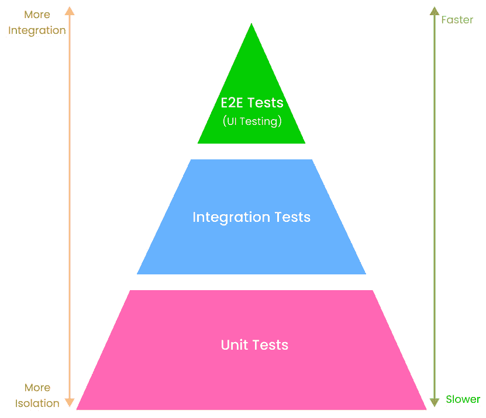
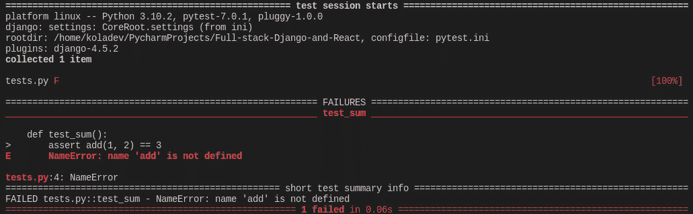
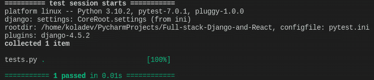

# 5

# 测试 REST API

在软件工程中，测试是一个检查实际软件产品是否按预期运行且无错误的过程。

有很多方法可以通过手动和自动测试来测试软件。但在本项目，我们将更多地关注**自动化测试**。然而，我们首先会深入了解软件测试的不同方式，包括它们的优缺点，以及讨论**测试金字塔**的概念。我们还将检查添加测试到 Django 应用程序所需的工具，以及如何为模型和视图集添加测试。本章将帮助您了解开发者的测试以及如何为 Django API 编写测试。

在本章中，我们将涵盖以下主题：

+   什么是测试？

+   Django 中的测试

+   配置测试环境

+   为 Django 模型编写测试

+   为 Django 视图集编写测试

# 技术要求

您可以在以下链接找到当前章节的代码：[`github.com/PacktPublishing/Full-stack-Django-and-React/tree/chap5`](https://github.com/PacktPublishing/Full-stack-Django-and-React/tree/chap5).

# 什么是测试？

简单来说，测试就是找出某物工作得有多好。

然而，这个过程包括一系列技术，用于确定在脚本或直接在用户界面上的手动测试下应用程序的正确性。目的是检测应用程序中的失败，包括错误和性能问题，以便它们可以被纠正。

大多数时候，测试是通过将软件需求与实际软件产品进行比较来完成的。如果其中一个需求是确保输入只接受数字而不是字符或文件，那么将进行一项测试来检查输入是否有验证系统以拒绝输入中的非数值。

然而，测试还涉及对代码的检查以及在各种环境和条件下执行代码。

## 什么是软件测试？

软件测试是检查软件在测试下的行为以进行验证或验证的过程。它考虑了可靠性、可伸缩性、可重用性和可用性等属性，以评估软件组件（服务器、数据库、应用程序等）的执行，并找出软件错误、错误或缺陷。

软件测试有很多好处，以下是一些：

+   **成本效益**：测试任何软件项目都有助于企业在长期内节省资金。因为这个过程有助于检测错误，并检查新添加的功能是否在系统中运行良好而不会破坏其他东西，所以它是一个很好的技术债务减少者。

+   **安全性**：如果测试做得好，它可以是一个快速检测在产品部署到整个世界之前早期阶段的安全风险和问题的方法。

+   **产品质量**：测试有助于性能测量，确保需求得到尊重。

## 为什么软件测试很重要？

测试你的软件很重要，因为它有助于通过漏洞识别和解决来减少错误的影响。一些错误可能非常危险，可能导致经济损失或危及人类生命。以下是一些历史例子：

来源：[`lexingtontechnologies.ng/software-testing/`](https://lexingtontechnologies.ng/software-testing/).

+   1999 年 4 月，由于一次军事卫星发射失败，损失了 12 亿美元。到目前为止，这是世界上成本最高的事故。

+   2014 年，由于安全气囊传感器中的软件故障，日产汽车召回了一百多万辆汽车。

+   2014 年，由于软件故障，亚马逊的一些第三方零售商损失了大量资金。该漏洞影响了产品的价格，将它们降至 1 便士。

+   2015 年，星巴克商店的销售点（POS）系统出现软件故障，导致其在美加的超过 60%的门店临时关闭。

+   2015 年，F-35 战斗机因软件漏洞而成为受害者，该漏洞阻止了它正确检测或识别目标。飞机上的传感器甚至无法识别来自它们自己的飞机的威胁。

+   2016 年，谷歌报告了一个影响 Windows 10 机器的漏洞。该漏洞允许用户通过 win32k 系统中的流程绕过安全沙箱。

## 有哪些不同的测试类型？

测试通常分为三类：

+   **功能性测试**：这种测试包括单元测试、集成测试、用户接受测试、全球化测试、国际化测试等

+   **非功能性测试**：这种测试检查性能、容量、可扩展性、可用性和负载等因素

+   **维护测试**：这种测试考虑了回归和维护

然而，这些测试也可以分为两种不同的类型：

+   自动化测试

+   手动测试

首先，让我们看看什么是手动测试。

## 理解手动测试

**手动测试**是指手动测试软件以发现缺陷或错误的过程。这是在没有自动化工具帮助的情况下测试应用程序功能的过程。

手动测试的一个例子是当测试用户被召集来测试一个应用程序或一个特殊功能。他们可能被要求测试一个特定的表单，在性能方面将应用程序推到极限，等等。

手动测试有很多优点：

+   它非常有助于测试用户界面设计和交互

+   对于新测试员来说更容易学习

+   它考虑了用户体验和可用性

+   它具有成本效益

然而，手动测试也有一些缺点：

+   这需要人力资源。

+   这很耗时。

+   测试员根据他们的技能和经验考虑测试用例。这意味着一个初级测试员可能无法覆盖所有功能。

即使手动测试听起来非常吸引人，它也可能是一项耗时且资源消耗很大的活动，而开发者绝对不是真正优秀的手动测试员。让我们看看自动化测试如何消除手动测试的缺点，并将更好的开发置于测试的中心。

## 理解自动化测试

**自动化测试**简单来说就是使用自动化工具测试软件以查找缺陷的过程。这些自动化工具可以是用于构建应用程序的语言编写的脚本，或者是一些软件或驱动程序（例如**Selenium**、**WinRunner**和**LoadRunner**），以使自动化测试更加容易和快速。

自动化测试解决了手动测试的缺点，并且它还具有更多优点，如下所示：

+   执行速度更快

+   从长远来看，比手动测试便宜

+   更可靠、强大和多功能

+   在回归测试中非常有用

+   能够提供更好的测试覆盖率

+   可能在没有人为干预的情况下运行

+   更便宜

然而，自动化测试在某些方面也存在不便：

+   初始成本较高

+   当需求发生变化时，维护成本非常高

+   自动化测试工具成本较高

自动化测试和手动测试的真实价值在于它们在正确环境中被使用时。

例如，手动测试在前端项目中非常有用，您想测试可用性和用户体验。自动化测试可以用来测试代码中的方法或函数，并且对于查找错误或安全问题非常有用。

在本章中，我们将专注于用 Python 编写自动化测试。由于我们正在开发一个 API，我们想确保系统是可靠的，并且按照我们的期望运行，但它也应该能够抵御下一个添加的功能可能带来的问题。

说了这么多，让我们来谈谈 Django 中的测试，并介绍**测试驱动开发**（**TDD**）的概念。

# Django 中的测试

在 Python 中进行测试，尤其是在 Django 中，非常简单和容易。实际上，该框架提供了许多工具和实用程序，您可以使用它们来编写应用程序中模型、序列化器或视图的测试。

然而，Python 的测试生态系统在很大程度上依赖于一个工具来编写测试，这个工具与 Django 有深度集成。这个工具叫做**Pytest**([`docs.pytest.org`](https://docs.pytest.org))，是一个用于编写小型和可读性测试的框架。与 Django 一起使用时，Pytest 主要用于通过编写代码来测试 API 端点、数据库和用户界面进行 API 测试。

但为什么使用 Pytest？嗯，它有以下优点：

+   它是免费和开源的

+   语法简单，易于上手

+   它自动检测测试文件、函数和类

+   它可以并行运行多个测试，提高性能和测试运行速度

我们将在本项目中使用 Pytest 编写两种类型的测试：**集成测试**和**单元测试**。

在开始编码之前，让我们通过考虑 TDD 和测试金字塔的概念来学习集成测试和单元测试。

## 测试金字塔

测试金字塔是一个可以帮助开发者从测试开始创建高质量软件的框架。基本上，测试金字塔指定了应该包含在自动化测试套件中的测试类型。

首先，记住测试金字塔在三个层面上运作：

+   单元测试

+   集成测试

+   端到端测试

下图显示了金字塔中每个层面的位置以及它们在速度性能和集成或隔离程度方面的优先级：



图 5.1 – 测试金字塔

在前面的图中，底层被单元测试占据。单元测试针对单个组件或功能，以检查它们在隔离条件下是否按预期工作。在我们的后端项目中，一个例子是测试`User`类模型上的`like_post`方法是否真正按预期执行。我们不是在测试整个`User`模型；我们是在测试`User`模型类的一个方法。

写很多单元测试绝对是一个好习惯。它们应该至少占你代码库中所有测试的 60%，因为它们速度快、短小，并且测试了很多组件。

在第二层，你有集成测试。如果单元测试验证代码库的小部分，集成测试则测试这段代码如何与其他代码或其他软件部分交互。集成测试的一个有用但具有争议的例子是编写一个针对视图集的测试。当测试视图集时，你也在测试权限、认证类、序列化器、模型，如果可能的话，还有数据库。这是一个测试 Django API 的不同部分如何协同工作的测试。

集成测试也可以是应用程序与外部服务之间的测试，例如支付 API。

在金字塔顶部的第三层，你有端到端测试。这类测试确保软件按预期工作。它们测试应用程序从开始到结束的工作方式。

在这本书中，我们将重点关注单元测试和集成测试。请注意，集成测试是某些误解的主题，一旦我们定义了它们，这些误解就会消除。根据我的个人经验，Django 中的单元测试更多地写在每个应用程序的模型和序列化器方面。它们可以用来测试在数据库中创建对象，以及检索、更新或删除。

关于视图集测试，我相信它们可以作为集成测试，因为运行它们会调用权限、认证、序列化器、验证，以及根据你执行的操作，还有模型。

返回到单元测试，当使用 TDD（测试驱动开发）时，它们更有效，TDD 是一种软件开发实践，它侧重于在开发功能之前编写单元测试用例。尽管听起来有些反直觉，但 TDD 有很多优点：

+   它确保代码优化

+   它确保了设计模式和更好架构的应用

+   它帮助开发者理解业务需求

+   它使代码更灵活且易于维护

然而，我们并没有特别遵守书中的 TDD 规则。我们依赖于 Django shell 和客户端来测试我们正在构建的 REST API 的功能。对于项目将要添加的下一个功能，测试将在编码功能之前编写。

在理解了 TDD、单元和集成测试以及测试金字塔等概念之后，我们现在可以配置测试环境。

# 配置测试环境

单独来看，Pytest 只是一个用于在 Python 程序中编写单元测试的 Python 框架。幸运的是，有一个 Pytest 插件可以用于 Django 项目和应用程序的测试。

使用以下命令安装和配置测试环境：

```py
pip install pytest-django
```

一旦安装了包，在 Django 项目的根目录下创建一个名为 `pytest.ini` 的新文件：

pytest.ini

```py
[pytest]
DJANGO_SETTINGS_MODULE=CoreRoot.settings
python_files=tests.py test_*.py *_tests.py
```

一旦完成，运行 `pytest` 命令：

```py
pytest
```

你将看到以下输出：

```py
======================== test session starts ============================
platform linux -- Python 3.10.2, pytest-7.0.1, pluggy-1.0.0
django: settings: CoreRoot.settings (from ini)
rootdir: /home/koladev/PycharmProjects/Full-stack-Django-and-React, configfile: pytest.ini
plugins: django-4.5.2
collected 0 items
```

太棒了！Pytest 已安装到项目中，我们可以编写项目中的第一个测试来测试配置。

## 编写你的第一个测试

Pytest 环境已配置，让我们看看如何使用 Pytest 编写一个简单的测试。

在项目根目录下创建一个名为 `tests.py` 的文件。我们将简单地编写一个测试来测试函数的求和。

遵循 TDD 概念，我们将首先编写测试并使其失败：

tests.py

```py
def test_sum():
   assert add(1, 2) == 3
```

这个函数是为了检查一个条件，从而证明使用 `assert` Python 关键字是合理的。如果 `assert` 后的条件为真，脚本将继续或停止执行。如果不是这种情况，将引发断言错误。

如果你运行 `pytest` 命令，你会收到以下输出：



图 5.2 – 失败的测试

从前面的输出中，我们可以确定测试失败了。现在让我们编写通过测试的功能。

在同一文件 `tests.py` 中，添加以下函数：

tests.py

```py
def add(a, b):
   return a + b
def test_sum():
   assert sum(1, 2) == 3
```

现在，在终端中再次运行 `pytest` 命令。现在一切应该都是绿色的：



图 5.3 – 测试成功通过

太棒了！你已经使用 Pytest 在项目中编写了第一个测试。在下一节中，我们将编写项目的模型测试。

# 为 Django 模型编写测试

当将测试应用于 Django 项目时，始终从编写模型测试开始是一个好主意。但为什么要测试模型呢？

嗯，这让你对自己的代码和数据库连接更有信心。它将确保模型上的方法或属性在数据库中得到良好表示，但也可以帮助你更好地构建代码结构、解决 bug 和编写文档。

不再拖延，让我们先为`User`模型编写测试。

## 为 User 模型编写测试

在`core/user`目录中，创建一个名为`tests.py`的新文件。我们将编写创建用户和简单用户的测试。

core/user/tests.py

```py
import pytest
from core.user.models import User
data_user = {
   "username": "test_user",
   "email": "test@gmail.com",
   "first_name": "Test",
   "last_name": "User",
   "password": "test_password"
}
```

一旦添加了导入和创建用户所需的数据，我们就可以编写测试函数：

core/user/tests.py

```py
@pytest.mark.django_db
def test_create_user():
   user = User.objects.create_user(**data_user)
   assert user.username == data_user["username"]
   assert user.email == data_user["email"]
   assert user.first_name == data_user["first_name"]
   assert user.last_name == data_user["last_name"]
```

在`test_create_user`函数上方，你可能注意到了一些语法。这被称为装饰器，它基本上是一个接受另一个函数作为参数并返回另一个函数的函数。

`@pytest.mark.django_db`为我们提供了访问 Django 数据库的权限。尝试移除此装饰器并运行测试。

你将在最后得到一个包含类似消息的错误输出：

```py
=================================================================== short test summary info ===================================================================
FAILED core/user/tests.py::test_create_user - RuntimeError: Database access not allowed, use the "django_db" mark, or the "db" or "transactional_db" fixture...
```

嗯，重新添加装饰器并运行`pytest`命令，所有测试应该都能正常通过。

让我们再进行一个测试，以确保`superuser`的创建工作完美无误。

添加一个新的字典，包含创建`superuser`所需的数据：

core/user/tests.py

```py
data_superuser = {
   "username": "test_superuser",
   "email": "testsuperuser@gmail.com",
   "first_name": "Test",
   "last_name": "Superuser",
   "password": "test_password"
}
```

这里是测试`superuser`创建功能的函数：

core/user/tests.py

```py
@pytest.mark.django_db
def test_create_superuser():
   user = User.objects.create_superuser(**data_superuser)
   assert user.username == data_superuser["username"]
   assert user.email == data_superuser["email"]
   assert user.first_name == data_superuser["first_name"]
   assert user.last_name == data_superuser["last_name"]
   assert user.is_superuser == True
   assert user.is_staff == True
```

再次运行测试，一切应该都是绿色的。

太棒了！现在我们更好地理解了`pytest`在测试中的作用，让我们为`Post`模型编写测试。

## 为 Post 模型编写测试

要创建一个模型，我们需要一个用户对象。对于`Comment`模型也是如此。为了避免重复，我们将简单地编写** fixtures**。

fixture 是一个函数，它将在应用到的每个测试函数之前运行。在这种情况下，fixture 将用于向测试提供一些数据。

要在项目中添加 fixture，请在`core`目录中创建一个新的 Python 包，名为`fixtures`。

在`core/fixtures`目录中，创建一个名为`user.py`的文件。该文件将包含一个用户 fixture：

core/fixtures/user.py

```py
import pytest
from core.user.models import User
data_user = {
   "username": "test_user",
   "email": "test@gmail.com",
   "first_name": "Test",
   "last_name": "User",
   "password": "test_password"
}
@pytest.fixture
def user(db) -> User:
   return User.objects.create_user(**data_user)
```

在前面的代码中，`@pytest.fixture`装饰器将函数标记为 fixture。现在我们可以在任何测试中导入`user`函数，并将其作为参数传递给`test`函数。

在`core/post`目录中，创建一个名为`tests.py`的新文件。然后该文件将测试创建帖子。

这里是代码：

core/post/tests.py

```py
import pytest
from core.fixtures.user import user
from core.post.models import Post
@pytest.mark.django_db
def test_create_post(user):
   post = Post.objects.create(author=user,
                              body="Test Post Body")
   assert post.body == "Test Post Body"
   assert post.author == user
```

正如你所见，我们在`fixtures`目录中从`user.py`导入`user`函数，并将其作为参数传递给`test_create_post`测试函数。

运行`pytest`命令，一切应该都是绿色的。

现在我们已经为`Post`模型编写了工作测试，让我们为`Comment`模型编写测试。

## 为 Comment 模型编写测试

为`Comment`模型编写测试需要与`Post`模型的测试相同的步骤。首先，在`core/fixtures`目录中创建一个名为`post.py`的新文件。

此文件将包含一个帖子固定设置，因为它需要创建一个评论。

但是`post`固定设置也需要一个`user`固定设置。幸运的是，使用 Pytest 可以将固定设置注入到其他固定设置中。

下面是`post`固定设置的代码：

core/fixtures/post.py

```py
import pytest
from core.fixtures.user import user
from core.post.models import Post
@pytest.fixture
def post(db, user):
   return Post.objects.create(author=user,
                              body="Test Post Body")
```

太好了！添加了固定设置后，我们现在可以编写评论创建的测试。

在`core/comment/`目录内，创建一个名为`tests.py`的新文件：

core/comment/tests.py

```py
import pytest
from core.fixtures.user import user
from core.fixtures.post import post
from core.comment.models import Comment
@pytest.mark.django_db
def test_create_comment(user, post):
   comment = Comment.objects.create(author=user, post=post,
     body="Test Comment Body")
   assert comment.author == user
   assert comment.post == post
   assert comment.body == "Test Comment Body"
```

使用`pytest`命令运行测试，一切应该都是绿色的。

太好了！我们刚刚为项目中的所有模型编写了测试。让我们继续编写视图集的测试。

# 为 Django 视图集编写测试

视图集或端点是外部客户端将用来获取数据以及创建、修改或删除数据的业务逻辑接口。始终有一个测试来确保整个系统从数据库请求开始按预期工作是一个很好的习惯。

在开始编写测试之前，让我们配置 Pytest 环境以使用 DRF 的 API 客户端。

API 客户端是一个类，它处理不同的 HTTP 方法，以及测试中的认证等特性，这可以直接认证而不需要用户名和密码来测试一些端点，非常有帮助。Pytest 提供了一种在测试环境中添加配置的方法。

在项目的根目录下创建一个名为`conftest.py`的文件。在文件内部，我们将为我们的自定义客户端创建一个固定设置函数：

conftest.py

```py
import pytest
from rest_framework.test import APIClient
@pytest.fixture
def client():
   return APIClient()
```

太好了！我们现在可以直接在下一个测试中调用这个客户端。

让我们从测试认证端点开始。

## 编写认证测试

在`core/auth`目录内，创建一个名为`tests.py`的文件。我们不是直接编写测试函数，而是编写一个包含测试方法的类，如下所示：

core/auth/tests.py

```py
import pytest
from rest_framework import status
from core.fixtures.user import user
class TestAuthenticationViewSet:
   endpoint = '/api/auth/'
```

让我们在`TestAuthenticationViewSet`类中添加`test_login`方法：

Core/auth/tests.py

```py
...
   def test_login(self, client, user):
       data = {
           "username": user.username,
           "password": "test_password"
       }
       response = client.post(self.endpoint + "login/",
                              data)
       assert response.status_code == status.HTTP_200_OK
       assert response.data['access']
       assert response.data['user']['id'] ==
         user.public_id.hex
       assert response.data['user']['username'] ==
         user.username
       assert response.data['user']['email'] == user.email
  ...
```

此方法基本上测试登录端点。我们使用在`conftest.py`文件中初始化的客户端固定设置来发出`post`请求。然后，我们测试响应的`status_code`值和返回的响应。

运行`pytest`命令，一切应该都是绿色的。

让我们为`register`和`refresh`端点添加测试：

core/auth/tests.py

```py
...
   @pytest.mark.django_db
   def test_register(self, client):
       data = {
           "username": "johndoe",
           "email": "johndoe@yopmail.com",
           "password": "test_password",
           "first_name": "John",
           "last_name": "Doe"
       }
       response = client.post(self.endpoint + "register/",
                              data)
       assert response.status_code ==
         status.HTTP_201_CREATED
   def test_refresh(self, client, user):
      data = {
           "username": user.username,
           "password": "test_password"
       }
       response = client.post(self.endpoint + "login/",
                                data)
       assert response.status_code == status.HTTP_200_OK
       data_refresh = {
           "refresh":  response.data['refresh']
       }
       response = client.post(self.endpoint + "refresh/",
                              data_refresh)
       assert response.status_code == status.HTTP_200_OK
       assert response.data['access']
```

在前面的代码中，在`test_refresh`方法内部，我们登录以获取刷新令牌，以便发出请求以获取新的访问令牌。

再次运行`pytest`命令来运行测试，一切应该都是绿色的。

让我们继续编写`PostViewSet`的测试。

## 编写 PostViewSet 的测试

在开始编写视图集测试之前，让我们快速重构代码以简化测试并遵循 DRY 规则。在`core/post`目录中，创建一个名为`tests`的 Python 包。完成后，将`core/post`目录中的`tests.py`文件重命名为`test_models.py`并将其移动到`core/post/tests/`目录。

在同一目录下，创建一个名为`test_viewsets.py`的新文件。此文件将包含对`PostViewSet`的测试：

core/post/tests/test_viewsets.py

```py
from rest_framework import status
from core.fixtures.user import user
from core.fixtures.post import post
class TestPostViewSet:
   endpoint = '/api/post/'
```

`PostViewSet`处理两种类型用户的请求：

+   认证用户

+   匿名用户

每种类型的用户对`post`资源有不同的权限。因此，让我们确保这些情况得到处理：

core/post/tests/test_viewsets.py

```py
...
   def test_list(self, client, user, post):
       client.force_authenticate(user=user)
       response = client.get(self.endpoint)
       assert response.status_code == status.HTTP_200_OK
       assert response.data["count"] == 1
   def test_retrieve(self, client, user, post):
       client.force_authenticate(user=user)
       response = client.get(self.endpoint +
                             str(post.public_id) + "/")
       assert response.status_code == status.HTTP_200_OK
       assert response.data['id'] == post.public_id.hex
       assert response.data['body'] == post.body
       assert response.data['author']['id'] ==
         post.author.public_id.hex
```

对于这些测试，我们正在强制进行认证。我们想确保认证用户可以访问帖子的资源。现在让我们为帖子创建、更新和删除编写一个测试方法：

core/post/tests/test_viewsets.py

```py
...
   def test_create(self, client, user):
       client.force_authenticate(user=user)
       data = {
           "body": "Test Post Body",
           "author": user.public_id.hex
       }
       response = client.post(self.endpoint, data)
       assert response.status_code ==
         status.HTTP_201_CREATED
       assert response.data['body'] == data['body']
       assert response.data['author']['id'] ==
         user.public_id.hex
   def test_update(self, client, user, post):
       client.force_authenticate(user=user)
       data = {
           "body": "Test Post Body",
           "author": user.public_id.hex
       }
       response = client.put(self.endpoint +
         str(post.public_id) + "/", data)
       assert response.status_code == status.HTTP_200_OK
       assert response.data['body'] == data['body']
   def test_delete(self, client, user, post):
       client.force_authenticate(user=user)
       response = client.delete(self.endpoint +
         str(post.public_id) + "/")
       assert response.status_code ==
         status.HTTP_204_NO_CONTENT
```

运行测试，结果应该是绿色的。现在，对于匿名用户，我们希望他们以只读模式访问资源，因此他们不能创建、修改或删除资源。让我们测试并验证这些功能：

core/post/tests/test_viewsets.py

```py
...
   def test_list_anonymous(self, client, post):
       response = client.get(self.endpoint)
       assert response.status_code == status.HTTP_200_OK
       assert response.data["count"] == 1
   def test_retrieve_anonymous(self, client, post):
       response = client.get(self.endpoint +
         str(post.public_id) + "/")
       assert response.status_code == status.HTTP_200_OK
       assert response.data['id'] == post.public_id.hex
       assert response.data['body'] == post.body
       assert response.data['author']['id'] ==
         post.author.public_id.hex
```

运行测试以确保一切正常。之后，让我们测试禁止的方法：

core/post/tests/test_viewsets.py

```py
...
def test_create_anonymous(self, client):
       data = {
           "body": "Test Post Body",
           "author": "test_user"
       }
       response = client.post(self.endpoint, data)
       assert response.status_code ==
         status.HTTP_401_UNAUTHORIZED
   def test_update_anonymous(self, client, post):
       data = {
           "body": "Test Post Body",
           "author": "test_user"
       }
       response = client.put(self.endpoint +
         str(post.public_id) + "/", data)
       assert response.status_code ==
         status.HTTP_401_UNAUTHORIZED
   def test_delete_anonymous(self, client, post):
       response = client.delete(self.endpoint +
         str(post.public_id) + "/")
       assert response.status_code ==
         status.HTTP_401_UNAUTHORIZED
```

再次运行测试。太好了！我们刚刚为帖子视图集编写了测试。你现在应该对使用视图集进行测试有了更好的理解。

让我们快速编写对`CommentViewSet`的测试。

## 为 CommentViewSet 编写测试

在开始编写视图集测试之前，让我们也快速重构编写测试的代码。在`core/comment`目录中，创建一个名为`tests`的 Python 包。完成后，将`core/post`目录中的`tests.py`文件重命名为`test_models.py`并将其移动到`core/comment/tests/`目录。

在同一目录下，创建一个名为`test_viewsets.py`的新文件。此文件将包含对`CommentViewSet`的测试。

就像在`PostViewSet`中一样，我们有两种类型的用户，我们想要为他们的每种权限编写测试用例。

然而，在创建评论之前，我们需要添加评论固定数据。在`core/fixtures`目录中，创建一个名为`comment.py`的新文件并添加以下内容：

core/fixtures/comment.py

```py
import pytest
from core.fixtures.user import user
from core.fixtures.post import post
from core.comment.models import Comment
@pytest.fixture
def comment(db, user, post):
   return Comment.objects.create(author=user, post=post,
                                 body="Test Comment Body")
```

然后，在`core/comment/tests/test_viewsets.py`内部，首先添加以下内容：

core/comment/tests/test_viewsets.py

```py
from rest_framework import status
from core.fixtures.user import user
from core.fixtures.post import post
from core.fixtures.comment import comment
class TestCommentViewSet:
   # The comment resource is nested under the post resource
   endpoint = '/api/post/'
```

接下来，让我们向列表中添加测试并作为认证用户检索评论：

core/comment/tests/test_viewsets.py

```py
...
def test_list(self, client, user, post, comment):
       client.force_authenticate(user=user)
       response = client.get(self.endpoint +
         str(post.public_id) + "/comment/")
       assert response.status_code == status.HTTP_200_OK
       assert response.data["count"] == 1
   def test_retrieve(self, client, user, post, comment):
       client.force_authenticate(user=user)
       response = client.get(self.endpoint +
                             str(post.public_id) +
                             "/comment/" +
                             str(comment.public_id) + "/")
       assert response.status_code == status.HTTP_200_OK
       assert response.data['id'] == comment.public_id.hex
       assert response.data['body'] == comment.body
       assert response.data['author']['id'] ==
         comment.author.public_id.hex
```

通过运行`pytest`命令确保这些测试通过。下一步是添加对评论创建、更新和删除的测试：

core/comment/tests/test_viewsets.py

```py
...
    def test_create(self, client, user, post):
       client.force_authenticate(user=user)
       data = {
           "body": "Test Comment Body",
           "author": user.public_id.hex,
           "post": post.public_id.hex
       }
       response = client.post(self.endpoint +
         str(post.public_id) + "/comment/", data)
       assert response.status_code ==
         status.HTTP_201_CREATED
       assert response.data['body'] == data['body']
       assert response.data['author']['id'] ==
         user.public_id.hex
   def test_update(self, client, user, post, comment):
       client.force_authenticate(user=user)
       data = {
           "body": "Test Comment Body Updated",
           "author": user.public_id.hex,
           "post": post.public_id.hex
       }
       response = client.put(self.endpoint +
                             str(post.public_id) +
                             "/comment/" +
                             str(comment.public_id) +
                             "/", data)
       assert response.status_code == status.HTTP_200_OK
       assert response.data['body'] == data['body']
   def test_delete(self, client, user, post, comment):
       client.force_authenticate(user=user)
       response = client.delete(self.endpoint +
         str(post.public_id) + "/comment/" +
         str(comment.public_id) + "/")
       assert response.status_code ==
         status.HTTP_204_NO_CONTENT
```

再次运行测试以确保一切正常。现在，让我们为匿名用户编写测试。

首先，我们需要确保他们可以使用`GET`方法访问资源：

core/comment/tests/test_viewsets.py

```py
...
   def test_list_anonymous(self, client, post, comment):
       response = client.get(self.endpoint +
                             str(post.public_id) +
                             "/comment/")
       assert response.status_code == status.HTTP_200_OK
       assert response.data["count"] == 1
   def test_retrieve_anonymous(self, client, post,
     comment):
       response = client.get(self.endpoint +
         str(post.public_id) + "/comment/" +
         str(comment.public_id) + "/")
       assert response.status_code == status.HTTP_200_OK
```

接下来，我们需要确保匿名用户不能创建、更新或删除评论：

core/comment/tests/test_viewsets.py

```py
   def test_create_anonymous(self, client, post):
       data = {}
       response = client.post(self.endpoint +
         str(post.public_id) + "/comment/", data)
       assert response.status_code ==
         status.HTTP_401_UNAUTHORIZED
   def test_update_anonymous(self, client, post, comment):
       data = {}
       response = client.put(self.endpoint +
         str(post.public_id) + "/comment/" +
         str(comment.public_id) + "/", data)
       assert response.status_code ==
         status.HTTP_401_UNAUTHORIZED
   def test_delete_anonymous(self, client, post, comment):
       response = client.delete(self.endpoint +
         str(post.public_id) + "/comment/" +
         str(comment.public_id) + "/")
       assert response.status_code ==
         status.HTTP_401_UNAUTHORIZED
```

在前面的例子中，数据 `dict` 是空的，因为我们期望错误状态。

再次运行测试以确保一切正常！

哇哦。我们刚刚为 `CommentViewSet` 编写了测试。我们还需要为 `UserViewSet` 类编写测试，但这将是一个小项目给你。

## 为 UserViewSet 类编写测试

在本节中，让我们进行一个快速的实际操作练习。你需要为 `UserViewSet` 类编写代码。它与我们已经为 `PostViewSet` 和 `CommentViewSet` 编写的其他测试非常相似。我已经为你提供了类的结构，你所要做的就是编写方法中的测试逻辑。以下是你需要构建的结构：

core/user/tests/test_viewsets.py

```py
from rest_framework import status
from core.fixtures.user import user
from core.fixtures.post import post
class TestUserViewSet:
   endpoint = '/api/user/'
   def test_list(self, client, user):
       pass
   def test_retrieve(self, client, user):
       pass
   def test_create(self, client, user):
       pass
   def test_update(self, client, user):
       pass
```

这里是关于测试的要求：

+   `test_list`：认证用户应该能够列出所有用户

+   `test_retrieve`：认证用户可以检索与用户相关的资源

+   `test_create`：用户不能通过 `POST` 请求直接创建用户

+   `test_update`：认证用户可以使用 `PATCH` 请求更新 `user` 对象

你可以在这里找到这个练习的解决方案：[`github.com/PacktPublishing/Full-stack-Django-and-React/blob/main/core/user/tests/test_viewsets.py`](https://github.com/PacktPublishing/Full-stack-Django-and-React/blob/main/core/user/tests/test_viewsets.py)。

# 概述

在本章中，我们学习了测试，不同类型的测试及其优势。我们还介绍了在 Django 中使用 Pytest 进行测试，并为模型和视图集编写了测试。使用 TDD 方法编写测试所获得的能力有助于你更好地设计代码，防止与代码架构相关的错误，并提高软件的质量。别忘了，它们还能在就业市场上给你带来竞争优势。

这是第一部分 *技术背景* 的最后一章。下一部分将专注于 React 以及将前端连接到我们刚刚构建的 REST API。在下一章中，我们将学习更多关于前端开发和 React 的知识，并创建一个 React 项目并运行它。

# 问题

1.  什么是测试？

1.  单元测试是什么？

1.  测试金字塔是什么？

1.  什么是 Pytest？

1.  什么是 Pytest 固定装置？

# 第二部分：使用 React 构建响应式 UI

在我们这本书的*第一部分*中，我们使用 Django 构建了 Postagram 应用程序的后端，包括身份验证功能和帖子及评论管理。在这一部分书中，你将构建一个代表 Postagram UI 界面的 React 应用程序，用户将看到帖子及评论，并能够点赞帖子或评论，上传个人头像，并访问其他用户的个人资料。在这一部分的最后，你将具备使用 React 从前端处理身份验证、从头开始构建 UI 组件、使用 React Hooks 如`useState`、`useContext`和`useMemo`以及向 REST API 发送请求并处理响应所需的知识。

本节包括以下章节：

+   *第六章*，*使用 React 创建项目*

+   *第七章*，*构建登录和注册表单*

+   *第八章*，*社交媒体帖子*

+   *第九章*，*帖子评论*

+   *第十章*，*用户个人资料*

+   *第十一章*，*针对 React 组件的有效 UI 测试*
