# 第六章：使用 React 创建项目

在本章中，我们将专注于理解前端开发，并使用 React 创建一个 Web 前端项目。在前面的章节中，我们主要关注 Django 和 Django Rest。在本章中，我们将解释前端开发的基础知识。接下来，我们将介绍 React 库，并为后续章节创建一个起始项目。最后，我们将学习如何配置我们的项目。

在本章中，我们将涵盖以下主题：

+   理解前端开发

+   创建 React 项目

+   配置项目

+   有用的 ES6 和 React 特性

# 技术要求

在这本书中，我们使用 Linux 操作系统，但您也可以在其他操作系统上找到此项目所需的所有工具。在本章中，我们将介绍如何在您的机器上安装 Node.js 和**Visual Studio Code**（**VS Code**）。

以下 GitHub 链接也将是必需的：[`github.com/PacktPublishing/Full-stack-Django-and-React/tree/chap6`](https://github.com/PacktPublishing/Full-stack-Django-and-React/tree/chap6)。

# 理解前端开发

前端开发是软件开发中专注于**用户界面**（**UI**）的部分。在 Web 开发中，前端开发是指为网站或 Web 应用程序生成**HTML**、**CSS**和**JavaScript**的实践。

**HTML**代表**超文本标记语言**。HTML 在页面上显示内容，如文本、按钮、链接、标题或列表。

**CSS**被定义为**层叠样式表**。CSS 用于美化网页。它处理诸如颜色、布局和动画等问题。它还帮助提高网站的可访问性，以便每个人都能轻松使用您的网站。

最后，**JavaScript**是一种客户端语言，它促进了用户交互并使页面动态化。它可以帮助进行复杂的动画、表单验证、从服务器获取数据以及将数据提交到服务器。

然而，与 Python 等语言一样，虽然从头开始使用 HTML、CSS 和 JavaScript 构建前端应用程序是完全可能的，但这相当困难。它需要良好的代码架构和组件重用性知识。最终，您将创建自己的开发框架。

但为什么不直接使用一些预构建的 CSS 或 JavaScript 框架呢？

如 Vue、Angular 或 React 之类的工具可以帮助您以种子和更平滑的方式编写前端应用程序。

在这本书中，我们将使用 React 的开源 JavaScript 库。让我们更多地了解 React 作为一个库。

## 什么是 React？

**React**是一个库，它帮助开发者通过称为组件的小型可重用部件的树状结构构建响应式 UI。

在前端开发中，组件是由 HTML、CSS 和 JavaScript 混合而成，用于捕获渲染小部分或较大 UI 所需的逻辑。让我们分析以下 HTML 表单，以更好地理解前端开发中的组件：

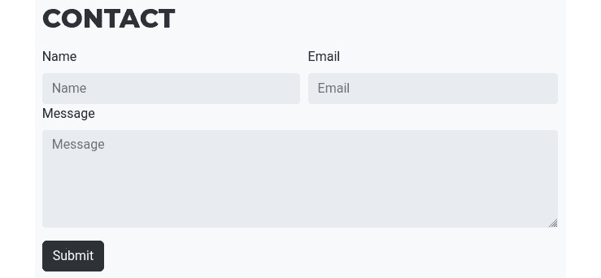

图 6.1 – HTML 表单

如 *图 6**.1 所示，在表单中，我们定义了四个组件：

+   名称输入

+   电子邮件输入

+   消息输入

+   **提交**按钮

这些组件中的每一个都有自己的逻辑。例如，**提交**按钮将验证表单并将消息保存或发送到远程源。

**React** 被定义为库而不是框架，因为它只处理 UI 渲染，并将许多其他在开发中很重要的事情留给开发者或其他工具。

要构建 React 应用程序，你需要以下堆栈：

+   **应用程序代码**：React、Redux、ESLint、Prettier 和 React Router

+   `npm`/`yarn`/`pnpm` 和 `babel`

+   **测试工具**：Jest 和 Enzyme

你需要将这些依赖项添加到你的 React 项目中，以优化和执行一些任务——这就是 React 与例如带有其自己的路由堆栈的 Angular 等工具不同的地方。

现在我们对 React 有更好的理解，让我们创建一个 React 项目。

# 创建 React 项目

在创建 React 项目之前，我们需要安装一些工具以获得更好的开发体验。这些工具基本上是驱动程序、编辑器和插件。让我们先安装 Node.js。

## 安装 Node.js

**Node.js** 是一个开源且功能强大的基于 JavaScript 的服务器端环境。它允许开发者即使在 JavaScript 本地是客户端语言的情况下，也能在服务器端运行 JavaScript 程序。

**Node.js** 可用于多个操作系统，如 Windows、macOS 和 Linux。在这本书中，我们正在使用 Linux 机器，Node.js 应该已经默认安装。

对于其他操作系统，你可以在 [`nodejs.org/en/download/`](https://nodejs.org/en/download/) 找到安装包。为你的操作系统下载最新的 **长期支持** (**LTS**) 版本。

当访问链接时，你将看到一个类似于以下截图的输出：

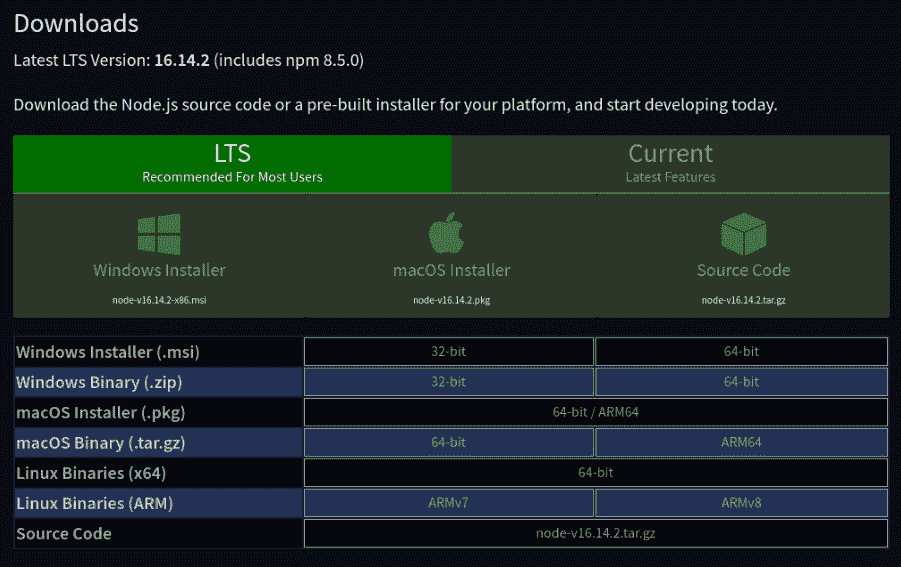

图 6.2 – Node.js 安装程序

要检查 Node.js 是否已安装在你的 Linux 机器上，打开终端并输入以下命令：

```py
node -v
yarn -v
```

这些命令应该会显示已安装的 Node.js 和 `yarn` 版本：


图 6.3 – node 和 yarn 版本

如果你机器上没有安装 `yarn`，你可以使用 `npm` 包来安装它：

```py
npm install -g yarn
```

`yarn` 和 `npm` 是 JavaScript 的包管理器。在接下来的章节中，我们将大量使用 `yarn` 包管理器来安装包、运行测试或构建前端的生产版本。然而，如果你愿意，也可以使用 `npm`。只是别忘了命令略有不同。

现在已经安装了用于 JavaScript 开发的基本工具。接下来，我们需要安装 VS Code 并配置它以使 JavaScript 开发更容易。

## 安装 VS Code

VS Code 是由微软开发和维护的开源代码编辑器。它支持多种编程语言，并且通过插件和扩展，你可以轻松地将其转换成一个强大的集成开发环境。然而，你也可以使用其他编辑器，例如**Atom**、**Brackets**或强大的**IDE WebStorm**。请随意使用你熟悉的工具。

VS Code 适用于 Windows、macOS 和 Linux，你可以在[`code.visualstudio.com/`](https://code.visualstudio.com/)下载适合你操作系统的版本。

安装并打开后，你会看到以下窗口：

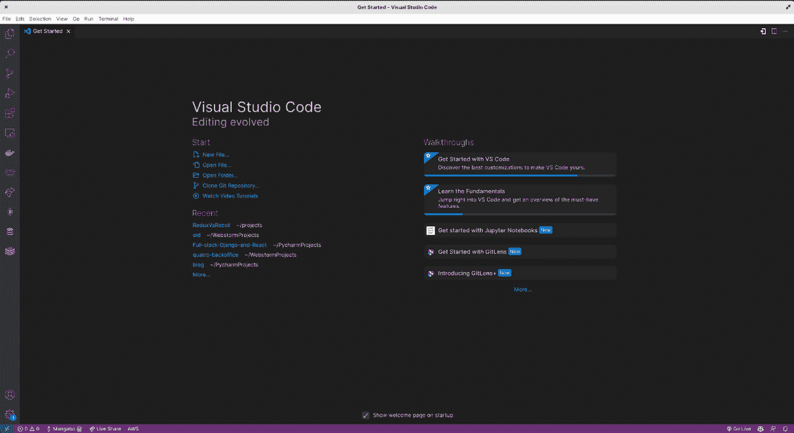

图 6.4 – VS Code 窗口

VS Code 内置了一个终端，你可以使用它来创建和运行 React 应用。注意，你还可以在项目目录的终端中使用以下命令打开项目：

```py
code .
```

你可以在**视图 | 集成** **终端**菜单中找到内置的终端。

在探索了 VS Code 的基础功能后，让我们添加所需的扩展，以使 React 开发更加愉快。

## 添加 VS Code 扩展

每种编程语言和框架都提供大量扩展，以使开发更加轻松和愉快。这些扩展包括代码片段、测试、项目环境配置和代码格式化。在 VS Code 中，如果你在活动栏（左侧的栏）中打开**扩展**，你可以找到一个搜索栏来查找不同的扩展。

对于 React 项目，让我们首先添加**ES7+ React/Redux/React-Native/JS**代码片段扩展。这个扩展会在编写 React 文件时建议代码片段。它看起来可能像这样：

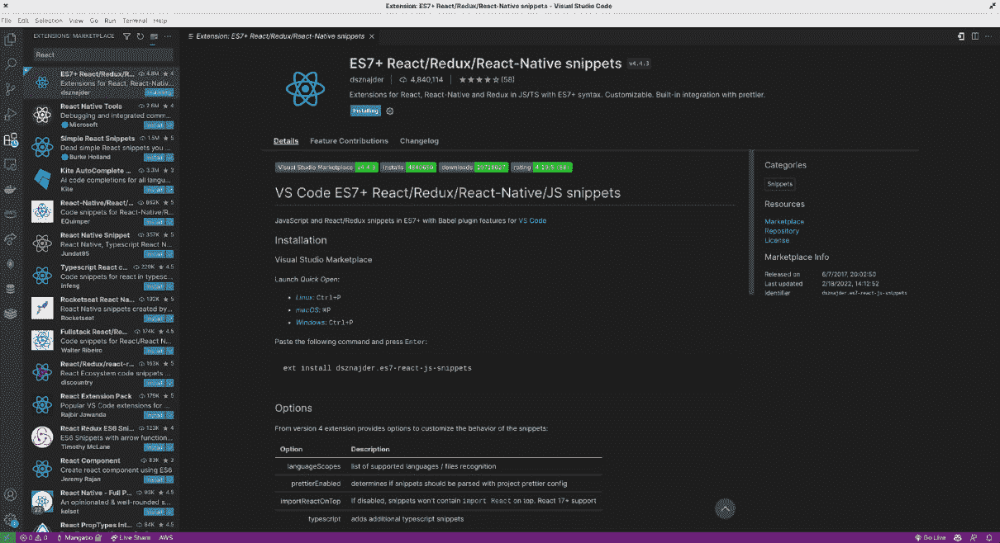

图 6.5 – ES7 + React/Redux/React-Native/JS 代码片段扩展

之后，让我们安装**ESLint**扩展。它将通过自动格式化代码并显示格式错误来帮助你快速找到拼写错误和语法错误。这使得 ES 代码格式化规则易于理解。ESLint 扩展看起来可能像这样：

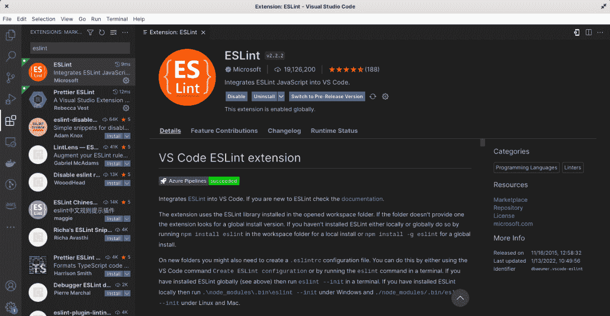

图 6.6 – ESLint 扩展

接下来，我们将添加另一个名为**Prettier**的 VS Code 扩展。Prettier 是一个代码格式化工具，它不仅使你的代码看起来更吸引人，而且结构更清晰，便于阅读。你可以在保存代码后找到 VS Code 扩展来自动格式化你的代码。这个扩展看起来可能像这样：

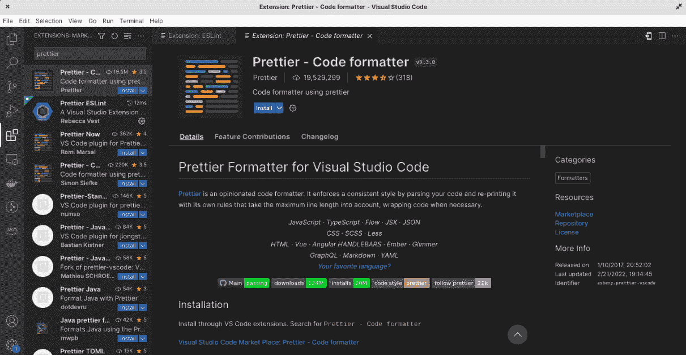

图 6.7 – 更漂亮的代码格式化工具

最后，但不是必须的，我们有**indent-rainbow**。如果你有很多带有父亲和子代的代码块，阅读可能会变得相当困难。这个扩展将使具有缩进的 JavaScript 代码更易于阅读。它看起来可能像这样：

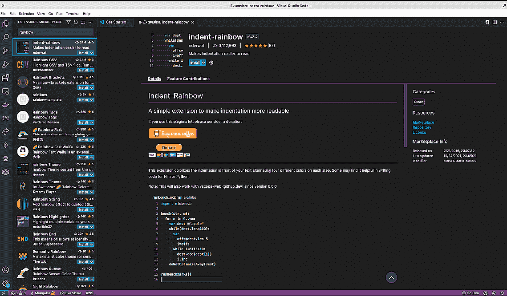

图 6.8 – indent-rainbow 扩展

太好了！在 VS Code 中安装了这些扩展后，我们现在可以继续创建 React 应用程序。

## 创建和运行一个 React 应用程序

在安装并配置了 Node.js 和 VS Code 之后，我们拥有了创建第一个 React.js 应用程序所需的一切。

要创建我们的 React 应用程序，我们将使用 `create-react-app` ([`github.com/facebook/create-react-app`](https://github.com/facebook/create-react-app))，这是一个用于创建现代 Web React 应用程序的简单命令。按照以下步骤创建您的第一个 React 应用程序并修改代码：

1.  运行以下命令以创建一个 React 应用程序：

    ```py
    yarn create react-app social-media-app
    ```

此命令将创建一个名为 `social-media-app` 的 React 应用程序。如果您使用的是 `npm`，则将 `yarn` 替换为 `npx`。安装后，您将得到类似于以下截图的输出：

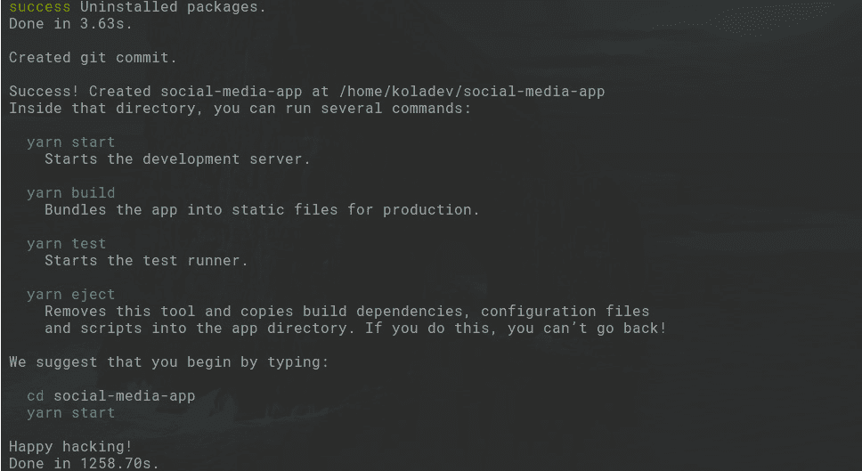

图 6.9 – React 项目创建终端输出

在 `social-media-app` 目录中，您会找到一个名为 `package.json` 的文件。此文件包含 JavaScript 项目的所有配置，从项目的基本信息，如名称、版本和开发者，到安装的包列表以及与启动服务器相关的脚本等。

1.  使用以下命令运行创建的 React 应用程序：

    ```py
    yarn start
    ```

1.  打开您的浏览器，并将 `localhost:3000` 指定为您网页链接。完成后，它将看起来像这样：


图 6.10 – 运行 React 应用程序

应用程序正在运行。现在，让我们修改 React 应用程序中的代码。

1.  在 VS Code 编辑器中打开 `src` 文件夹中的 `App.js` 文件。

1.  将 `App.js` 文件中的文本从 `Learn React` 修改为 `Hello World` 并保存文件：

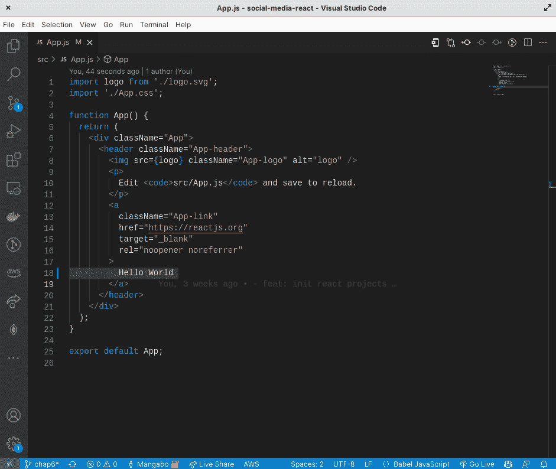

图 6.11 – App.js 代码

1.  再次检查浏览器，您将看到变化：


图 6.12 – 修改后的 React 应用程序

React 具有热重载功能，这意味着对项目中文件所做的任何更改都会反映在 Web 应用的渲染中。

太好了！我们刚刚安装了一个 React 应用程序并修改了代码。

让我们在浏览器中安装一些工具来调试 React 应用程序。

## 在浏览器中安装调试插件

要调试 React 应用程序，我们必须安装 React Developer Tools，这是一个在 Chrome、Firefox 和 Edge 浏览器上可用的插件。您可以在 Chrome 版本的插件地址为 [`chrome.google.com/webstore/category/extensions`](https://chrome.google.com/webstore/category/extensions)，Firefox 版本的插件地址为 [`addons.mozilla.org`](https://addons.mozilla.org)。插件看起来大致如下：

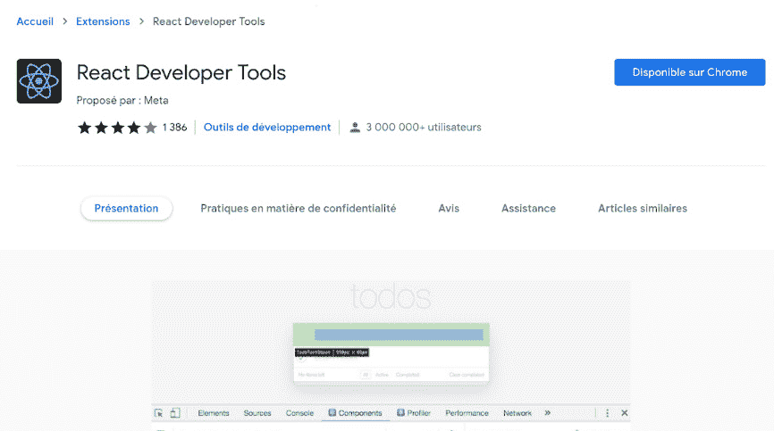

图 6.13 – React 浏览器插件

安装完成后，您可以通过在 Chrome 浏览器中按*Ctrl + Shift + I*（或*F12*）打开开发者工具。以下截图显示了 Firefox 浏览器中的开发者工具：

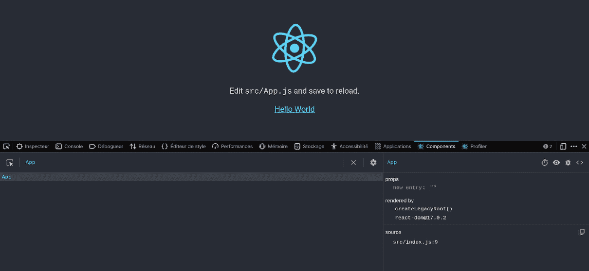

图 6.14 – 带有打开的 React 扩展的 React 应用程序

此工具在开发阶段查找错误和调试应用程序时将非常有用。

项目已创建，现在可以成功运行。在下一节中，我们将安装和配置一些用于路由和样式的包。

# 配置项目

在开始编写身份验证流程之前，让我们确保项目已准备好进行编码。在本节中，我们将配置样式和路由，并允许 API 上的请求。

让我们先从路由开始。

## 添加 React Router

前端应用程序中的路由表示处理从一个视图移动到另一个视图以及使用正确的 URL 加载正确页面的所有内容。

React 没有内置的路由包，因此我们将使用`react-router`包。

您可以使用以下命令安装包：

```py
yarn add react-router-dom@6
```

然后，按照如下方式编辑`index.js`文件：

src/index.js

```py
import React from "react";
import ReactDOM from "react-dom/client";
import { BrowserRouter } from "react-router-dom";
import "./index.css";
import App from "./App";
// Creating the root application component
const root = ReactDOM.createRoot(document.getElementById("root"));
root.render(
 <React.StrictMode>
   <BrowserRouter>
     <App />
   </BrowserRouter>
 </React.StrictMode>
);
```

在前面的代码块中，我们导入了`BrowserRouter`组件，并将其包裹在`React.StrictMode`组件中，这有助于我们在开发模式下接收警告，最后，`App`组件被包裹在`BrowserRouter`组件中。

配置了 React Router 后，我们可以自由地继续安装 React Bootstrap 进行样式设置。

## 添加 React Bootstrap

React 可以很容易地与 CSS 框架配置。对于此项目，为了简单和快速开发，我们将选择 Bootstrap。

幸运的是，React 生态系统提供了一个名为`react-bootstrap`的包，它独立于 JQuery。

运行以下命令安装包：

```py
yarn add react-bootstrap bootstrap
```

接下来，将`bootstrap` CSS 文件导入到`index.js`文件中，如下所示：

src/index.js

```py
...
import 'bootstrap/dist/css/bootstrap.min.css';
import App from "./App";
...
```

安装了`react-router`和`react-bootstrap`后，让我们在下一小节中创建一个使用这两个包的快速页面。

## 创建主页

使用 React Router 在 React 中创建页面通常遵循以下模式：

+   创建组件和页面

+   在`BrowserRouter`中注册页面并指定 URL

按照以下步骤创建`Home`页面：

1.  在`src`目录下创建一个名为`pages`的目录。

1.  在`pages`目录中，创建一个名为`Home.jsx`的新文件：


图 6.15 – 页面文件夹结构

此文件将包含`Profile`页面的 UI。

1.  将以下文本添加到`Home.jsx`文件中，以确保身份验证正常工作：

src/pages/Home.jsx

```py
import React from "react";
function Home() {
 return (
   <div>
     <h1>Profile</h1>
     <p>
       Welcome!
     </p>
   </div>
 );
}
export default Home;
```

1.  在`App.js`文件中注册此页面：

src/App.js

```py
import React from "react";
import { Route, Routes } from "react-router-dom";
import Home from "./pages/Home";
function App() {
  return (
    <Routes>
      <Route path="/" element={<Home />} />
    </Routes>
  );
}
export default App;
```

要使用 React Router 注册页面，您使用 `<Route />` 组件并传递两个属性：

+   路径

+   组件元素

1.  添加前面的代码后，确保 React 项目正在运行。您可以在 `http://127.0.0.1:3000` 的页面进行检查：


图 6.16 – 首页

太好了！添加这些后，让我们快速配置 Django 项目，以避免在下一节中遇到一些请求问题。

## 配置 CORS

**CORS** 代表 **跨源资源共享**。它是一种浏览器机制，允许对位于给定域之外的资源进行受控访问。

它有助于防止跨域攻击或不受欢迎的请求。在本项目中，React 项目运行在 `http://127.0.0.1:3000`。

如果我们尝试从浏览器发起一些请求，我们会收到一个错误。打开 `http://127.0.0.1:3000` 上的 React 应用并打开 **开发者工具**：

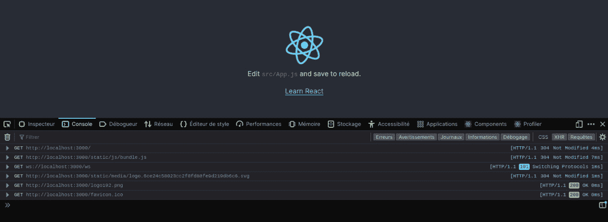

图 6.17 – 打开开发者工具

此外，请确保 Django 服务器正在运行。

在控制台中输入以下行：

```py
fetch("http://127.0.0.1:8000/api/post/")
```

您将收到一个错误：

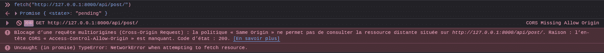

图 6.18 – 发起请求时的 CORS 错误

按照以下步骤快速配置 Django API：

1.  启用 `django-cors-headers`：

    ```py
    pip install django-cors-headers
    ```

1.  如果 `django-cors-headers` 包的安装完成，请转到您的 `settings.py` 文件并将包添加到 `INSTALLED_APPS` 和中间件中：

CoreRoot/settings.py

```py
INSTALLED_APPS = [
    ...
    'corsheaders',
    ...
]
MIDDLEWARE = [
    ...
    'corsheaders.middleware.CorsMiddleware',
    'django.middleware.common.CommonMiddleware',
    ...
]
```

1.  在 `settings.py` 文件的末尾添加以下行：

CoreRoot/settings.py

```py
CORS_ALLOWED_ORIGINS = [
    "http://localhost:3000",
    "http://127.0.0.1:3000"
]
```

1.  在 **开发者工具** 中再次发起请求。

您将看到请求已通过，我们现在一切正常。API 已准备好接受来自 React 应用的请求：

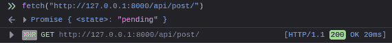

图 6.19 – 在开发者工具中尝试成功的请求

使用配置了后端的 React 项目以获得更好的开发体验后，我们现在可以探索在接下来的章节中会大量使用的 **ES6**（**ECMAScript 6**）和 React 功能。

# 有用的 ES6 和 React 功能

JavaScript 和 React 是不断进化的语言和技术，每年都会融入令人兴奋的新特性。**ES6**，也称为 **ECMAScript 2015**，是 JavaScript 语言中的一个重大增强，它允许开发者使用更好的技术和模式编写用于复杂应用的程序。

使用 React，我们已经从编写类转向使用函数和 React Hooks 编写组件。在本节中，我们将快速探索在接下来的章节中会使用的 ES6 语法、React 概念和 React Hooks。

## const 和 let

`const` 关键字是在 `const` 关键字中引入的，变量不能被重新声明或重新赋值。以下是其使用示例：


图 6.20 – const 关键字的用法

另一方面，`let` 用于声明一个可以重新赋值的新值的变量。当你想要创建一个可以随时间变化的变量时，例如计数器或迭代器，这很有用。以下是一个示例：

```py
let counter = 0;
// This is allowed because counter is not a constant
counter++;
```

通常，默认使用 `const` 是一个好习惯，只有在需要重新赋值变量时才使用 `let`。这可以帮助使你的代码更易读并防止意外的重新赋值。

现在我们已经了解了 `const` 和 `let` 关键字的用法，让我们继续了解 JavaScript 中的模板字符串。

## 模板字符串

在 JavaScript 中，模板字符串是一种定义包含占位符的字符串值的方式，这些占位符可以用于动态值。它们由反引号 (````) 字符表示，并使用美元符号 (`$`) 和大括号 (`{}`) 来在字符串中插入表达式。

这里是一个模板字符串的示例：

```py
const name = 'World;
const message = `Hello, ${name}!`;
console.log(message); // "Hello, World!"
```

在这个例子中，我们定义了一个名为 `message` 的模板字符串，其中包含一个用于 `name` 变量的占位符。当模板字符串被评估时，`name` 变量会被插入到字符串中，并且生成的字符串会被记录到控制台。

模板字符串提供了一种比使用传统的字符串连接运算符 (`+`) 更方便、更易读的方式来创建包含动态值的字符串。它们还支持 **字符串插值**，这意味着你可以将表达式插入到字符串中，以及多行字符串。以下是一个示例：

```py
const a = 10;
const b = 20;
const message = `The sum of ${a} and ${b} is ${a + b}.`;
console.log(message); // "The sum of 10 and 20 is 30."
```

在前面的例子中，我们定义了一个名为 `message` 的模板字符串，它包含多个表达式，当模板字符串被评估时，这些表达式会被插入到字符串中。这允许我们创建一个比使用字符串连接更易读、更简洁的包含动态值的字符串。

现在我们已经了解了模板字符串是什么，让我们来解释 React 中的 JSX 样式。

## JSX 样式

**JSX** 是 JavaScript 的语法扩展，允许你编写看起来像 HTML 的 JavaScript 代码。它由 Facebook 作为 React 库的一部分引入，但也可以与其他 JavaScript 库和框架一起使用。以下是一个如何在 React 组件中使用 JSX 的示例：

```py
import React from 'react';
function Component() {
  return (
    <div>
      <h1>Hello, world!</h1>
      <p>This is some text.</p>
    </div>
  );
}
```

在前面的例子中，我们定义了一个名为 `Component` 的 React 组件，它返回一些 JSX 代码。JSX 代码看起来像 HTML，但由 React 库转换成 JavaScript，生成 DOM 中的适当元素和属性。

当你编写 JSX 时，你可以在大括号 (`{}`) 内使用 JavaScript 表达式来将动态值插入到 JSX 代码中。这允许你使用 JSX 轻松创建动态和交互式的用户界面：

```py
import React from 'react';
function Component({ name }) {
  return (
    <div>
      <h1>Hello, {name}!</h1>
      <p>This is some text.</p>
    </div>
  );
}
```

在前面的例子中，我们定义了一个名为 `Component` 的 React 组件，它接受一个名为 `name` 的属性，并使用 JavaScript 表达式将其插入到 JSX 代码中。这允许我们为用户创建一个动态和个性化的问候语。

现在我们已经了解了 JSX 如何与 React 一起工作，让我们解释一下 props 和 states 的概念。

## Props 与 states 的比较

在 React 中，props 和 states 是管理组件数据的不同方式。

Props 是 **属性** 的简称，用于将数据从父组件传递到子组件。Props 是只读的，这意味着子组件不能修改父组件传递给它的 props：

```py
import React from 'react';
function ParentComponent() {
  return (
    <ChildComponent
      name="John Doe"
      age={25}
    />
  );
}
function ChildComponent({ name, age }) {
  return (
    <p>
      My name is {name} and I am {age} years old.
    </p>
  );
}
```

在前面的代码中，我们定义了一个名为 `ParentComponent` 的父组件，它渲染了一个名为 `ChildComponent` 的子组件，并将两个 props (`name` 和 `age`) 传递给子组件。子组件将这些 props 作为参数接收，并使用它们来渲染组件的内容。因为 props 是只读的，所以子组件不能修改父组件传递给它的 `name` 和 `age` props。

另一方面，状态是一种管理组件数据的方式，可以由组件本身修改。状态是私有的，只能使用特殊的 React 方法（如 `useState`）进行修改。

以下是一个在 React 组件中修改状态的示例：

```py
import React, { useState } from 'react';
function Counter() {
  // Use useState to manage the state of the counter
  const [count, setCount] = useState(0);
  // Function to increment the counter
  function handleIncrement() {
    setCount(count + 1);
  }
  return (
    <div>
      <p>The counter is at {count}.</p>
      <button onClick={handleIncrement}>Increment</button>
    </div>
  );
}
```

在前面的代码中，我们定义了一个名为 `Counter` 的组件，它使用 `useState` 钩子来管理计数器的状态。`useState` 钩子返回一个包含两个元素的数组，当前状态值（在本例中为 `count`）和一个用于更新状态的函数（在本例中为 `setCount`）。

在组件的渲染方法中，我们显示计数器状态的值，并定义一个按钮，当点击该按钮时，会调用 `handleIncrement` 函数来更新计数器状态。这会导致组件重新渲染并显示更新后的计数器状态值。

现在我们更好地理解了 props 和 state 之间的区别，让我们更深入地了解 `useState` 钩子。

重要提示

`useState` 是 React 中的一个 Hook，它允许您向函数组件添加状态。换句话说，`useState` 允许您管理组件的状态，这是一个包含有关组件信息并可用于在状态变化时重新渲染组件的对象。

## Context API

**Context API** 是在 React 应用程序中在不同组件之间共享数据的一种方式。它允许您通过组件树传递数据，而无需在每一级手动传递属性。以下是一个在 React 应用程序中使用 Context API 的示例：

```py
// Create a context for sharing data
const Context = React.createContext();
function App() {
  // Set some initial data in the context
  const data = {
    message: 'Hello, world!'
  };
  return (
    // Provide the data to the components inside the
    // Provider
    <Context.Provider value={data}>
      <Component />
    </Context.Provider>
  );
}
function Component() {
  // Use the useContext Hook to access the data in the
  // context
  const context = React.useContext(Context);
  return (
    <p>{context.message}</p>
  );
}
```

在前面的代码中，我们使用 `React.createContext` 方法创建一个新的上下文对象，我们称之为 `Context`。然后，我们通过将顶层组件包裹在一个 `Context.Provider` 组件中，并将数据作为值属性传递，向上下文中提供一些初始数据。最后，我们在 `Component` 中使用 `useContext` 钩子来访问上下文中的数据，并在组件中显示它。

在本书中，我们还将使用另一个 Hook。让我们在下一节解释 `useMemo` 钩子。

## useMemo

`useMemo` 是 React 中的一个 Hook，它允许你通过缓存昂贵的计算来优化组件的性能。它通过返回一个缓存的值来实现，只有当计算中的一个输入改变时，这个值才会重新计算。

重要提示

**记忆化** 是计算机编程中用于通过存储昂贵函数调用的结果并返回缓存结果的技巧。当再次给出相同的输入时，这可以用于优化执行许多重复计算的程序。

这里是一个如何使用 `useMemo` 来优化组件性能的例子：

```py
import React, { useMemo } from 'react';
function Component({ data }) {
  // Use useMemo to memoize the expensive calculation
  const processedData = useMemo(() => {
    // Do some expensive calculation with the data
    return expensiveCalculation(data);
  }, [data]);
  return (
    <div>
      {/* Use the processed data in the component */}
      <p>{processedData.message}</p>
    </div>
  );
}
```

在前面的代码中，我们使用 `useMemo` 来缓存我们使用传递给组件的数据属性进行的昂贵计算的结果。因为 `useMemo` 只在数据属性改变时重新计算值，我们可以避免每次组件重新渲染时都进行昂贵的计算，这可以提高我们应用程序的性能。

在下一章我们将构建的 React 项目中，我们将使用 React 和 React 库提供的 Hooks 来处理表单。让我们更多地了解受控和非受控组件。

## 处理表单 - 受控组件和非受控组件

受控组件是 React 中的一个组件，它由父组件的状态控制。这意味着输入字段的值由传递给组件的值属性决定，任何对输入的更改都由父组件处理。

这里是一个受控组件的例子：

```py
import React, { useState } from 'react';
function Form() {
  // Use useState to manage the state of the input field
  const [inputValue, setInputValue] = useState('');
  // Function to handle changes to the input field
  function handleChange(event) {
    setInputValue(event.target.value);
  }
  return (
    <form>
      <label htmlFor="name">Name:</label>
      <input
        type="text"
        id="name"
        value={inputValue}
        onChange={handleChange}
      />
    </form>
  );
}
```

在前面的代码中，我们使用 `useState` 来管理输入字段的州和 `handleChange` 函数来更新状态，当输入改变时。因为输入的值由 `inputValue` 状态变量决定，所以输入被视为一个受控组件。

另一方面，非受控组件是 React 中的一个组件，它内部管理自己的状态。这意味着输入字段的值由传递给组件的 `defaultValue` 属性决定，任何对输入的更改都由组件本身处理。

这里是一个非受控组件的例子：

```py
import React from 'react';
function Form() {
  // Use a ref to manage the state of the input field
  const inputRef = React.useRef();
  // Function to handle the form submission
  function handleSubmit(event) {
    event.preventDefault();
    // Do something with the input value here
    // For example, you might send the input value to an
    // API or save it to the database
    sendInputValue(inputRef.current.value);
    // Clear the input after submitting
    inputRef.current.value = '';
  }
  return (
    <form onSubmit={handleSubmit}>
      <label htmlFor="name">Name:</label>
      <input
        type="text"
        id="name"
        defaultValue=""
        ref={inputRef}
      />
    </form>
  );
}
```

在这个例子中，我们使用 `ref` 来管理输入字段的州和 `handleSubmit` 函数来处理表单提交。因为输入的值由 `defaultValue` 属性决定，并由组件内部管理，所以输入被视为一个非受控组件。

在本节中，我们探讨了大多数将在下一章中使用的 React 和 ES6 功能。我们将主要使用 React Hooks、JSX 以及有趣的 ES6 功能，如模板字符串和 `let`/`const` 关键字。

# 摘要

在本章中，我们解释了前端开发，并通过安装**Node.js**和**VS Code**创建了一个 React 应用程序。然后，我们使用**VS Code**对其进行配置，以实现更好的开发。React 也将运行在浏览器中，因此我们安装了一些插件，这将使调试更加容易。

然后，我们开始编写一些代码，为路由、样式和 CORS 配置进行基本配置，以允许对 Django API 进行请求。最后，我们探索了下一章中将使用的 React 和 ES6 功能。

在下一章中，我们将通过构建登录和注册页面来更熟悉 React，同时解释组件驱动开发。

# 问题

1.  Node.js 和`yarn`是什么？

1.  前端开发是什么？

1.  你如何安装 Node.js？

1.  VS Code 是什么？

1.  你如何在 VS Code 中安装扩展？

1.  热重载的目的是什么？

1.  你如何使用`create-react-app`创建一个 React 应用程序？
