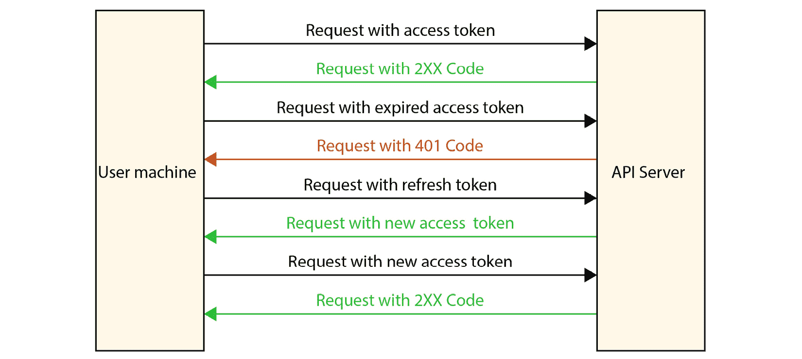
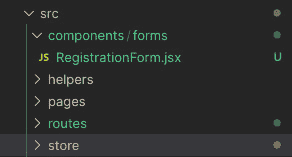
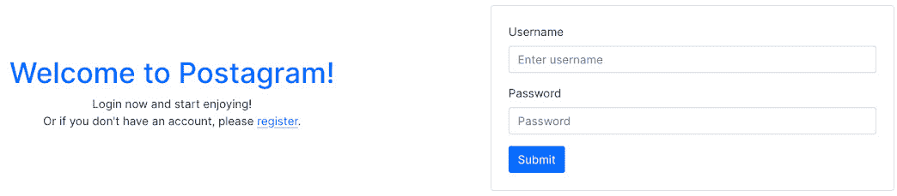
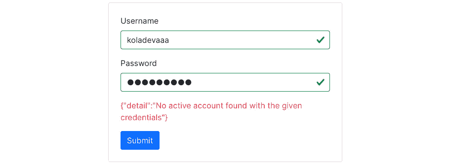

# 7

# 构建“登录”和“注册”表单

注册和登录是具有用户的 Web 应用程序的基本功能。即使身份验证流程可以直接通过简单的请求处理，也需要在 UI 背后有逻辑来管理身份验证和会话，尤其是如果我们使用的是**JSON Web Token**（JWT）。

在本章中，我们将使用 React 创建登录和注册表单。这里有很多事情要做和学习，以下是本章将涵盖的内容：

+   在 React 项目中配置 CSS 框架

+   向应用程序添加受保护和公开的页面

+   创建注册页面

+   创建登录页面

+   登录或注册成功后创建欢迎页面

到本章结束时，你将能够使用 React 构建注册和登录页面，并且将了解如何从前端管理 JWT 身份验证。

# 技术要求

确保你的机器上已安装并配置了 VS Code。

你可以在[`github.com/PacktPublishing/Full-stack-Django-and-React/tree/chap7`](https://github.com/PacktPublishing/Full-stack-Django-and-React/tree/chap7)找到本章的代码。

# 理解身份验证流程

我们已经在*第二章*“使用 JWT 进行身份验证和授权”中从后端的角度探讨了社交媒体项目上的身份验证。但在 React 应用程序中它是如何体现的呢？

好吧，事情会有一点不同。为了快速回顾，我们有一个注册和登录端点。这些端点返回包含两个令牌的用户对象：

+   **具有 5 分钟有效期的访问令牌**：此令牌有助于在服务器端进行请求时进行身份验证，无需再次登录。然后，我们可以访问资源并在这些资源上执行操作。

+   **刷新令牌**：此令牌可以帮助你在令牌已过期的情况下检索另一个访问令牌。

使用从服务器返回的数据，我们可以像这样从 React 应用程序端管理身份验证。当注册或登录成功时，我们将返回的响应存储在客户端的浏览器中；我们将使用`localStorage`来做这件事。

`localStorage`属性帮助我们与浏览器存储一起工作，使浏览器能够将键值对存储在浏览器中。我们将使用`localStorage`的两个方法：`setItem()`用于设置键值对，`getItem()`用于访问值。

然后，对于发送到服务器的每个请求，我们都会在请求中添加包含从`localStorage`检索到的访问令牌的“授权”头。如果请求返回`401`错误，这意味着令牌已过期。如果发生这种情况，我们将向刷新端点发送请求以获取新的访问令牌，同时使用也从`localStorage`检索到的刷新令牌。然后，我们使用这个访问令牌重新发送失败的请求。

如果我们再次收到`401`错误，这意味着刷新令牌已过期。然后，用户将被发送到登录页面重新登录，获取新的令牌，并将它们存储在`localStorage`中。

既然我们已经从前端方面理解了认证流程，那么让我们编写我们将用于数据获取和执行 CRUD 操作的请求服务。

# 编写请求服务

在 JavaScript 中发起请求相对简单。Node 环境和浏览器提供了原生的包，如`fetch`，允许你请求服务器。然而，本项目将使用`axios`包进行 HTTP 请求。

Axios 是一个流行的库，主要用于向 REST 端点发送异步 HTTP 请求。Axios 是 CRUD 操作的理想库。然而，我们还将安装`axios-auth-refresh`。这个简单的库通过`axios`拦截器帮助自动刷新令牌。要安装`axios`和`axios-auth-refresh`包，请按照以下步骤操作：

1.  在`social-media-app`目录中，通过运行以下命令添加`axios`和`axios-auth-refresh`包：

    ```py
    yarn add axios axios-auth-refresh
    ```

1.  安装完成后，在 React 项目的`src`文件夹中创建一个名为`helpers`的目录，完成后，添加一个名为`axios.js`的文件：


图 7.1 – helper.js 文件路径

现在，让我们进行导入并编写基本配置，例如 URL 和一些头部信息。看看以下代码块：

```py
import axios from "axios";
import createAuthRefreshInterceptor from "axios-auth-refresh";
const axiosService = axios.create({
 baseURL: "http://localhost:8000",
 headers: {
   "Content-Type": "application/json",
 },
});
```

在前面的代码块中，我们为`POST`请求添加了`Content-Type`头部。以下图显示了本书中我们将遵循的认证流程：



图 7.2 – 使用访问/刷新令牌的认证流程

在前面的图中，请注意以下要点：

+   每次我们使用`axiosService`进行请求时，我们从`localStorage`中检索访问令牌，并使用访问令牌创建一个新的授权头

+   访问令牌将在请求被发送且返回`400`状态码时过期

+   我们从`localStorage`中检索刷新令牌，并发送请求以获取新的访问令牌

+   完成后，我们在`localStorage`中注册新的访问令牌，并重新启动之前失败的请求

+   然而，如果刷新令牌请求也失败了，我们只需从`localStorage`中移除`auth`，并将用户发送到登录屏幕

让我们按照以下步骤在`axios.js`文件中实现之前描述的流程：

1.  首先，我们将编写一个请求拦截器来添加头部到请求：

    ```py
    axiosService.interceptors.request.use(async (config) => {
    ```

    ```py
     /**
    ```

    ```py
      * Retrieving the access token from the localStorage
    ```

    ```py
        and adding it to the headers of the request
    ```

    ```py
      */
    ```

    ```py
     const { access } =
    ```

    ```py
       JSON.parse(localStorage.getItem("auth"));
    ```

    ```py
     config.headers.Authorization = `Bearer ${access}`;
    ```

    ```py
     return config;
    ```

    ```py
    });
    ```

注意，我们可以在 JavaScript 中使用对象解构语法从对象中提取属性值。在 ES2015 之前的代码中，它可能看起来像这样：

```py
var fruit = {
 name: 'Banana',
 scientificName: 'Musa'
};
var name     = fruit.name;
var scientificName = fruit.scientificName;
```

如果你需要从一个对象中提取很多属性，它可能会很快变得很长。这就是对象解构派上用场的地方：

```py
var fruit = {
 name: 'Banana',
 scientificName: 'Musa'
};
var  { name, scientificName } = fruit;
```

你可以在[`developer.mozilla.org/en-US/docs/Web/JavaScript/Reference/Operators/Destructuring_assignment`](https://developer.mozilla.org/en-US/docs/Web/JavaScript/Reference/Operators/Destructuring_assignment)了解更多关于语法的知识。

1.  之后，我们将解析请求并返回解析或拒绝的承诺：

    ```py
    axiosService.interceptors.response.use(
    ```

    ```py
     (res) => Promise.resolve(res),
    ```

    ```py
     (err) => Promise.reject(err),
    ```

    ```py
    );
    ```

1.  最后这一步是锦上添花。创建一个包含刷新`auth`逻辑的函数。当失败的请求返回`401`错误时，这个函数将被调用：

    ```py
    const refreshAuthLogic = async (failedRequest) => {
    ```

    ```py
     const { refresh } =
    ```

    ```py
       JSON.parse(localStorage.getItem("auth"));
    ```

    ```py
     return axios
    ```

    ```py
       .post("/refresh/token/", null, {
    ```

    ```py
         baseURL: "http://localhost:8000",
    ```

    ```py
         headers: {
    ```

    ```py
           Authorization: `Bearer ${refresh}`,
    ```

    ```py
         },
    ```

    ```py
       })
    ```

    ```py
       .then((resp) => {
    ```

    ```py
         const { access, refresh } = resp.data;
    ```

    ```py
         failedRequest.response.config.headers[
    ```

    ```py
           "Authorization"] = "Bearer " + access;
    ```

    ```py
         localStorage.setItem("auth", JSON.stringify({
    ```

    ```py
                               access, refresh }));
    ```

    ```py
       })
    ```

    ```py
       .catch(() => {
    ```

    ```py
         localStorage.removeItem("auth");
    ```

    ```py
       });
    ```

    ```py
    };
    ```

1.  最后，初始化认证拦截器并创建一个自定义的 fetcher：

    ```py
    createAuthRefreshInterceptor(axiosService, refreshAuthLogic);
    ```

    ```py
    export function fetcher(url) {
    ```

    ```py
     return axiosService.get(url).then((res) => res.data);
    ```

    ```py
    }
    ```

    ```py
    export default axiosService;
    ```

将使用 fetcher 在 API 资源上执行`GET`请求。太好了！获取逻辑已实现，我们可以继续注册用户。但在那之前，我们需要在项目中定义受保护的路由。

# 受保护的路由

在前端应用程序上基于条件的路由是一个很大的优点，因为它有助于提升用户体验。例如，如果你没有登录 Twitter，想要查看个人资料或评论，你将被重定向到登录页面。这些是受保护页面或操作，因此你必须登录才能访问这些资源。在本节中，我们将使用`React-Router`组件编写一个`ProtectedRoute`组件。

## 创建受保护的路由包装器

要创建受保护的路由包装器，请按照以下步骤操作：

1.  在`src`目录中创建一个名为`routes`的新目录。

1.  在新建的目录中，创建一个名为`ProtectedRoute.jsx`的文件。

1.  文件创建完成后，导入所需的库：

src/routes/ProtectedRoute.jsx

```py
import React from "react";
import { Navigate } from "react-router-dom";
...
```

1.  为受保护的路由编写以下逻辑：

    ```py
    ...
    ```

    ```py
    function ProtectedRoute({ children }) {
    ```

    ```py
     const { user } =
    ```

    ```py
       JSON.parse(localStorage.getItem("auth"));
    ```

    ```py
     return auth.account ? <>{children}</> : <Navigate
    ```

    ```py
       to="/login/" />;
    ```

    ```py
    }
    ```

    ```py
    export default ProtectedRoute;
    ```

    ```py
    ...
    ```

在前面的代码片段中，我们从`localStorage`中检索用户属性。

我们然后使用这个属性来检查是否应该将用户重定向到登录页面或渲染页面（`children`）。如果`user`为 null 或 undefined，这意味着用户尚未登录，因此我们将用户重定向到登录页面，否则，我们允许访问请求的页面。

1.  然后，在`App.js`文件中，让我们重写内容：

src/App.js

```py
import React from "react";
import {
 Route,
 Routes
} from "react-router-dom";
import ProtectedRoute from "./routes/ProtectedRoute";
import Home from "./pages/Home";
function App() {
 return (
   <Routes>
     <Route path="/" element={
       <ProtectedRoute>
         <Home />
       </ProtectedRoute>
     } />
     <Route path="/login/" element={<div>Login</div>} />
   </Routes>
 );
}
export default App;
```

现在，默认位置将是个人资料页面。然而，由于存储中没有凭证，用户将被重定向到登录页面。

太好了！我们现在已经实现了认证流程的第一步。在下一节中，我们将编写注册页面，然后再编写登录页面。

# 创建注册页面

如果用户需要登录凭证，他们首先需要注册。在本节中，我们将创建一个注册表单，同时处理必要的请求。

## 添加注册页面

让我们从编写表单页面的代码开始。我们将从编写注册`form`组件开始：

1.  在`src`目录中，创建一个名为`components`的新目录，然后在新建的目录中创建一个名为`authentication`的新目录。

此目录将包含注册和登录表单。

1.  一旦完成，在 `authentication` 目录下创建一个名为 `RegistrationForm.jsx` 的文件：



图 7.3 – 注册文件

React Bootstrap 提供了 `form` 组件，我们可以快速使用它们创建表单并进行基本验证。在这个组件中，我们还需要向 API 发送请求，将用户详情和令牌注册到存储中，如果请求成功则将用户重定向到主页。

1.  接下来，我们将添加所需的导入：

`src/components/forms/RegistrationForm.js`

```py
import React, { useState } from "react";
import { Form, Button } from "react-bootstrap";
import axios from "axios";
import { useNavigate } from "react-router-dom";
...
```

1.  现在，声明我们在组件中使用的状态和函数：

`src/components/forms/RegistrationForm.js`

```py
...
function RegistrationForm() {
 const navigate = useNavigate();
 const [validated, setValidated] = useState(false);
 const [form, setForm] = useState({});
 const [error, setError] = useState(null);
...
```

让我们快速解释一下前面代码片段中我们在做什么。

`navigate` 钩子将帮助我们如果请求成功则导航到主页。

`validated`、`form` 和 `error` 状态分别用于检查表单是否有效，表单中每个字段的值，以及如果请求未通过要显示的错误信息。

1.  太好了！让我们编写处理表单提交的函数：

`src/components/forms/RegistrationForm.js`

```py
...
const handleSubmit = (event) => {
   event.preventDefault();
   const registrationForm = event.currentTarget;
   if (registrationForm.checkValidity() === false) {
     event.stopPropagation();
   }
   setValidated(true);
   const data = {
     username: form.username,
     password: form.password,
     email: form.email,
     first_name: form.first_name,
     last_name: form.last_name,
     bio: form.bio,
   };
 ...
```

1.  下一步是使用 `axios` 向 API 发送 `POST` 请求：

`src/components/forms/RegistrationForm.js`

```py
   axios
     .post("http://localhost:8000/api/auth/register/",
            data)
     .then((res) => {
       // Registering the account and tokens in the
       // store
       localStorage.setItem("auth", JSON.stringify({
         access: res.data.access,
         refresh: res.data.refresh,
         user: res.data.user,
       }));
       navigate("/");
     })
     .catch((err) => {
       if (err.message) {
         setError(err.request.response);
       }
     });
 };
```

在前面的代码块中，我们首先使用 `event.preventDefault()` 阻止默认的表单提交行为——即重新加载页面。接下来，我们检查字段的基本验证是否完成。验证成功后，我们可以轻松地使用 `axios` 发送请求，并将令牌和用户详情存储在 `localStorage` 中。

这样，用户就会被导航到主页。

1.  现在，让我们添加基本的 UI 组件：

`src/components/forms/RegistrationForm.js`

```py
...
return (
   <Form
     id="registration-form"
     className="border p-4 rounded"
     noValidate
     validated={validated}
     onSubmit={handleSubmit}
   >
     <Form.Group className="mb-3">
       <Form.Label>First Name</Form.Label>
       <Form.Control
         value={form.first_name}
         onChange={(e) => setForm({ ...form,
           first_name: e.target.value })}
         required
         type="text"
         placeholder="Enter first name"
       />
       <Form.Control.Feedback type="invalid">
         This file is required.
       </Form.Control.Feedback>
     </Form.Group>
...
```

此后有更多的代码，但让我们首先掌握这里的逻辑；其他部分将会容易得多。

React Bootstrap 提供了一个 `Form` 组件，我们可以用它来创建字段。

`Form.Control` 是一个组件输入，它接受任何输入都可以接受的属性（`name`、`type` 等）。`Form.Control.Feedback` 当字段无效时会显示错误。

1.  让我们对 `last_name` 和 `username` 字段做同样的处理：

`src/components/forms/RegistrationForm.js`

```py
...
     <Form.Group className="mb-3">
       <Form.Label>Last name</Form.Label>
       <Form.Control
         value={form.last_name}
         onChange={(e) => setForm({ ...form,
           last_name: e.target.value })}
         required
         type="text"
         placeholder="Enter last name"
       />
       <Form.Control.Feedback type="invalid">
         This file is required.
       </Form.Control.Feedback>
     </Form.Group>
     <Form.Group className="mb-3">
       <Form.Label>Username</Form.Label>
       <Form.Control
         value={form.username}
         onChange={(e) => setForm({ ...form, username:
           e.target.value })}
         required
         type="text"
         placeholder="Enter username"
       />
       <Form.Control.Feedback type="invalid">
         This file is required.
       </Form.Control.Feedback>
     </Form.Group>
...
```

1.  让我们再添加一个电子邮件字段：

`src/components/forms/RegistrationForm.js`

```py
...
     <Form.Group className="mb-3">
       <Form.Label>Email address</Form.Label>
       <Form.Control
         value={form.email}
         onChange={(e) => setForm({ ...form, email:
           e.target.value })}
         required
         type="email"
         placeholder="Enter email"
       />
       <Form.Control.Feedback type="invalid">
         Please provide a valid email.
       </Form.Control.Feedback>
     </Form.Group>
...
```

1.  让我们再添加一个密码字段：

    ```py
    ...
    ```

    ```py
         <Form.Group className="mb-3">
    ```

    ```py
           <Form.Label>Password</Form.Label>
    ```

    ```py
           <Form.Control
    ```

    ```py
             value={form.password}
    ```

    ```py
             minLength="8"
    ```

    ```py
             onChange={(e) => setForm({ ...form, password:
    ```

    ```py
               e.target.value })}
    ```

    ```py
             required
    ```

    ```py
             type="password"
    ```

    ```py
             placeholder="Password"
    ```

    ```py
           />
    ```

    ```py
           <Form.Control.Feedback type="invalid">
    ```

    ```py
             Please provide a valid password.
    ```

    ```py
           </Form.Control.Feedback>
    ```

    ```py
         </Form.Group>
    ```

    ```py
    ...
    ```

1.  让我们添加生物字段。在这里我们将使用 `Textarea` 字段类型：

`src/components/forms/RegistrationForm.js`

```py
...
     <Form.Group className="mb-3">
       <Form.Label>Bio</Form.Label>
       <Form.Control
         value={form.bio}
         onChange={(e) => setForm({ ...form, bio:
           e.target.value })}
         as="textarea"
         rows={3}
         placeholder="A simple bio ... (Optional)"
       />
     </Form.Group>
...
```

1.  最后，添加提交按钮并导出组件：

`src/components/forms/RegistrationForm.js`

```py
...
     <div className="text-content text-danger">
         {error && <p>{error}</p>}
     </div>
     <Button variant="primary" type="submit">
       Submit
     </Button>
   </Form>
 );
}
export default RegistrationForm;
```

`RegistrationForm` 现在已创建，包含所需的字段和处理表单提交的逻辑。

在下一节中，我们将把这个注册表单组件添加到一个页面中，并在我们的应用程序路由中注册这个页面。

## 注册注册页面路由

按照以下步骤注册注册页面路由：

1.  在 `src/pages` 目录下，创建一个名为 `Registration.jsx` 的文件：

`src/pages/Registration.js`

```py
import React from "react";
import { Link } from "react-router-dom";
import RegistrationForm from "../components/forms/RegistrationForm";
function Registration() {
 return (
   <div className="container">
     <div className="row">
       <div className="col-md-6 d-flex align-items-center">
         <div className="content text-center px-4">
           <h1 className="text-primary">
             Welcome to Postman!
           </h1>
           <p className="content">
             This is a new social media site that will
             allow you to share your thoughts and
             experiences with your friends. Register now
             and start enjoying! <br />
             Or if you already have an account, please{" "}
             <Link to="/login/">login</Link>.
           </p>
         </div>
       </div>
       <div className="col-md-6 p-5">
         <RegistrationForm />
       </div>
     </div>
   </div>
 );
}
export default Registration;
```

我们已经向页面添加了简单的介绍性文本，并导入了 `LoginForm` 组件。

1.  接下来，打开 `App.js` 并注册页面：

`src/App.js`

```py
...
import Registration from "./pages/Registration";
function App() {
 return (
   <Routes>
     ...
     <Route path="/register/" element={<Registration />} />
   </Routes>
 );
}
...
```

1.  太好了！现在，前往 `http://localhost:3000/register/`，你应该会有与此类似的结果：


`图 7.4 – 注册页面`

1.  测试它并使用一个账户注册。你将被重定向到主页：


图 7.5 – 主页

太好了！我们刚刚写完了注册页面。

在下一节中，我们将创建登录页面。

# 创建登录页面

由于我们已经创建了注册页面，登录逻辑将非常相似，但字段较少。

## 添加登录页面

按照以下步骤添加登录页面：

1.  在 `src/components/authentication` 目录内，添加一个名为 `LoginForm.jsx` 的新文件。此文件将包含用于登录用户的表单组件。

1.  接下来，添加导入：

`src/components/authentication/LoginForm.jsx`

```py
import React, { useState } from "react";
import { Form, Button } from "react-bootstrap";
import axios from "axios";
import { useNavigate } from "react-router-dom";
...
```

1.  编写处理登录的逻辑：

`src/components/authentication/LoginForm.jsx`

```py
...
function LoginForm() {
 const navigate = useNavigate();
 const [validated, setValidated] = useState(false);
 const [form, setForm] = useState({});
 const [error, setError] = useState(null);
 const handleSubmit = (event) => {
   event.preventDefault();
   const loginForm = event.currentTarget;
   if (loginForm.checkValidity() === false) {
     event.stopPropagation();
   }
   setValidated(true);
   const data = {
     username: form.username,
     password: form.password,
   };
...
```

1.  正如我们在注册过程中所做的那样，我们现在将对登录端点发起请求：

`src/components/authentication/LoginForm.jsx`

```py
...
   axios
     .post("http://localhost:8000/api/auth/login/",
            data)
     .then((res) => {
       // Registering the account and tokens in the
       // store
       localStorage.setItem("auth", JSON.stringify({
         access: res.data.access,
         refresh: res.data.refresh,
         user: res.data.user,
       }));
       navigate("/");
     })
     .catch((err) => {
       if (err.message) {
         setError(err.request.response);
       }
     });
...
```

这几乎与注册逻辑相同，但在这里，我们只处理用户名和密码。

1.  当准备好处理登录请求的逻辑后，让我们添加 UI：

`src/components/authentication/LoginForm.jsx`

```py
...
return (
   <Form
     id="registration-form"
     className="border p-4 rounded"
     noValidate
     validated={validated}
     onSubmit={handleSubmit}
   >
     <Form.Group className="mb-3">
       <Form.Label>Username</Form.Label>
       <Form.Control
         value={form.username}
         onChange={(e) => setForm({ ...form, username:
                    e.target.value })}
         required
         type="text"
         placeholder="Enter username"
       />
       <Form.Control.Feedback type="invalid">
         This file is required.
       </Form.Control.Feedback>
     </Form.Group>
     ...
```

在前面的代码中，我们正在创建表单并添加表单的第一个输入项，即用户名输入。

1.  让我们再添加密码表单输入和提交按钮：

    ```py
         ...
    ```

    ```py
         <Form.Group className="mb-3">
    ```

    ```py
           <Form.Label>Password</Form.Label>
    ```

    ```py
           <Form.Control
    ```

    ```py
             value={form.password}
    ```

    ```py
             minLength="8"
    ```

    ```py
             onChange={(e) => setForm({ ...form, password:
    ```

    ```py
                        e.target.value })}
    ```

    ```py
             required
    ```

    ```py
             type="password"
    ```

    ```py
             placeholder="Password"
    ```

    ```py
           />
    ```

    ```py
           <Form.Control.Feedback type="invalid">
    ```

    ```py
             Please provide a valid password.
    ```

    ```py
           </Form.Control.Feedback>
    ```

    ```py
         </Form.Group>
    ```

    ```py
         <div className="text-content text-danger">
    ```

    ```py
           {error && <p>{error}</p>}</div>
    ```

    ```py
         <Button variant="primary" type="submit">
    ```

    ```py
           Submit
    ```

    ```py
         </Button>
    ```

    ```py
       </Form>
    ```

    ```py
     );
    ```

    ```py
    }
    ```

    ```py
    export default LoginForm;
    ```

    ```py
    ...
    ```

我们已经创建了包含所需字段和处理数据提交逻辑的 `LoginForm` 组件。

在下一节中，我们将向页面添加 `LoginForm` 并在应用程序的路由中注册此页面。

## 注册登录页面

按照以下步骤注册登录页面：

1.  在 `src/pages` 目录内，创建一个名为 `Login.jsx` 的文件：

`src/pages/Login.jsx`

```py
import React from "react";
import { Link } from "react-router-dom";
import LoginForm from "../components/forms/LoginForm";
...
```

1.  接下来，让我们添加 UI：

`src/pages/Login.jsx`

```py
...
function Login() {
 return (
   <div className="container">
     <div className="row">
       <div className="col-md-6 d-flex
         align-items-center">
         <div className="content text-center px-4">
           <h1 className="text-primary">
             Welcome to Postagram!</h1>
           <p className="content">
             Login now and start enjoying! <br />
             Or if you don't have an account, please{" "}
             <Link to="/register/">register</Link>.
           </p>
         </div>
       </div>
       <div className="col-md-6 p-5">
         <LoginForm />
       </div>
     </div>
   </div>
 );
}
export default Login;
```

这也与注册页面非常相似。

1.  在 `App.js` 文件中，将页面注册到应用程序的路由中：

`src/App.js`

```py
...
     <Route path="/login/" element={<Login />} />
...
```

1.  访问 `http://localhost:3000/login/`，你应该会有与此类似的页面：



`图 7.6 – 登录页面`

1.  再次测试它，你应该会被重定向到主页。

认证流程正在顺利工作，但我们在项目中有一些重复的代码。让我们在下一节中通过一个小练习进行重构。

# 重构认证流程代码

为了避免在代码库中重复相同的代码，我们可以遵循 `LoginForm` 和 `RegistrationForm` 组件。在本节中，我们将编写一个自定义的 React Hook 来处理这个逻辑，但在做之前，让我们了解一下什么是 Hook。

## 什么是 Hook？

Hooks 首次在 React 16.8 中引入，允许开发者使用更多 React 功能而无需编写类。React Hook 的一个有趣示例是 `useState`。

`useState` 是 `setState` 的替代品，用于在函数组件内部管理组件的内部状态。在 `LoginForm` 中，我们使用 `useState` 来处理表单值。我们还使用 `useState` 来设置错误消息，如果登录请求返回错误。为了简单测试，请访问登录页面并输入错误的凭据，你可能会得到类似于以下错误：



图 7.7 – 登录表单

此逻辑来自以下 `LoginForm.jsx` 中的几行：

src/authentication/LoginForm.jsx

```py
 const [error, setError] = useState(null);
...
     .catch((err) => {
       if (err.message) {
         setError(err.request.response);
       }
     });
```

这是一个 `useState` Hook 的示例，并不是每个 Hook 都以相同的方式工作。例如，你可以在 `LoginForm` 组件中检查 `useNavigate` Hook 的用法。根据 React 文档，使用 Hooks 有一些规则：

+   **仅在最顶层调用 Hooks**：不要在循环、条件或嵌套路由中调用 Hooks

+   **仅从 React 函数中调用 Hooks**：从 React 函数组件和自定义 Hooks 中调用 Hooks

React 允许我们编写自定义 Hooks。让我们编写一个自定义 Hook 来处理用户身份验证。在一个新文件中，我们将编写使检索和操作 `localStorage` 中的 `auth` 对象更容易的函数。

## 编写自定义 Hook 的代码

按照以下步骤创建自定义 Hook：

1.  在 `src` 目录中，创建一个名为 `hooks` 的新目录。此目录将包含我们在本书中编写的所有 Hooks。

1.  在新创建的目录中，添加一个名为 `user.actions.js` 的文件。

1.  让我们添加所有必要的内容，从导入开始：

src/hooks/user.actions.js

```py
import axios from "axios";
import { useNavigate } from "react-router-dom";
```

1.  接下来，让我们添加一个名为 `useUserActions` 的函数。自定义 Hook 是一个以 `use` 开头的 JavaScript 函数：

src/hooks/user.actions.js

```py
function useUserActions() {
 const navigate = useNavigate();
 const baseURL = "http://localhost:8000/api";
 return {
   login,
   register,
   logout,
 };
}
```

我们现在可以添加 `login` 和 `logout` 函数。这些函数将返回 `Promise`，如果成功，将在 `localStorage` 中注册用户数据并将用户重定向到主页，或者允许我们捕获和处理错误。

1.  我们现在将编写 `register` 函数作为练习的一部分，但它与 `login` 函数没有太大区别：

src/hooks/user.actions.js

```py
...
 // Login the user
 function login(data) {
   return axios.post(`${baseURL}/auth/login/`,
                      data).then((res) => {
     // Registering the account and tokens in the
     // store
     setUserData(data);
     navigate("/");
   });
 }
...
```

1.  接下来，编写 `logout` 函数。此函数将从 `localStorage` 中删除 `auth` 项并将用户重定向到登录页面：

src/hooks/user.actions.js

```py
...
 // Logout the user
 function logout() {
   localStorage.removeItem("auth");
   navigate("/login");
 }
...
```

注意，我们正在使用一个名为 `setUserData` 的方法，我们尚未声明它。

1.  在 `useUserActions` 函数之后，让我们添加其他可以在整个项目中使用的实用函数。这些函数将帮助我们检索访问令牌、刷新令牌、用户信息或设置用户数据：

src/hooks/user.actions.js

```py
// Get the user
function getUser() {
 const auth =
   JSON.parse(localStorage.getItem("auth"));
 return auth.user;
}
// Get the access token
function getAccessToken() {
 const auth =
   JSON.parse(localStorage.getItem("auth"));
 return auth.access;
}
// Get the refresh token
function getRefreshToken() {
 const auth =
   JSON.parse(localStorage.getItem("auth"));
 return auth.refresh;
}
// Set the access, token and user property
function setUserData(data) {
 localStorage.setItem(
   "auth",
   JSON.stringify({
     access: res.data.access,
     refresh: res.data.refresh,
     user: res.data.user,
   })
 );
}
```

重要提示

你可能会觉得在调用函数之后声明函数很困惑。使用`function`关键字在 JavaScript 中编写函数允许提升，这意味着函数声明在代码执行之前被移动到其作用域的顶部。你可以在[`developer.mozilla.org/en-US/docs/Glossary/Hoisting`](https://developer.mozilla.org/en-US/docs/Glossary/Hoisting)了解更多信息。

通过获取用户、访问和刷新令牌以及设置用户数据在`localStorage`中的函数，我们现在可以在`LoginForm`和`RegisterForm`组件中调用该函数。

## 使用代码中的函数

在`user.actions.js`文件中，我们有一个有用的钩子`useUserActions`。我们将使用这个钩子来调用`login`方法，从而替换`LoginForm.js`文件中的旧登录逻辑。让我们从在`LoginForm`组件中使用新编写的自定义钩子开始。按照以下步骤操作：

1.  首先，导入钩子并声明一个新变量：

    ```py
    ...
    ```

    ```py
    import { useUserActions } from "../../hooks/user.actions";
    ```

    ```py
    function LoginForm() {
    ```

    ```py
     const [validated, setValidated] = useState(false);
    ```

    ```py
     const [form, setForm] = useState({});
    ```

    ```py
     const [error, setError] = useState(null);
    ```

    ```py
     const userActions = useUserActions();
    ```

    ```py
    ...
    ```

1.  现在，我们可以对 API 中关于登录请求的`handleSubmit`函数做一些修改：

src/hooks/user.actions.js

```py
const data = {
     username: form.username,
     password: form.password,
   };
   userActions.login(data)
     .catch((err) => {
       if (err.message) {
         setError(err.request.response);
       }
     });
 };
```

在前面的代码块中，我们通过移除旧的登录逻辑和在`localStorage`中设置用户数据来进行了一些快速重构。同样的逻辑也可以应用到`RegistrationForm`（`register`方法已经在`useUserActions`钩子中可用）。你可以作为一个小练习修改`RegistrationForm`组件。请随意检查[`github.com/PacktPublishing/Full-stack-Django-and-React/blob/chap7/social-media-react/src/components/authentication/RegistrationForm.jsx`](https://github.com/PacktPublishing/Full-stack-Django-and-React/blob/chap7/social-media-react/src/components/authentication/RegistrationForm.jsx)以确保你的解决方案是有效的。

1.  太好了！现在让我们使用`axios`助手和`ProtectedRoute`组件中的其他实用函数：

src/routes/ProtectedRoute.jsx

```py
...
function ProtectedRoute({ children }) {
 const user = getUser();
 return user ? <>{children}</> : <Navigate
   to="/login/" />;
...
```

1.  接下来，让我们对`axios`助手做一些调整：

    ```py
    ...
    ```

    ```py
    import { getAccessToken, getRefreshToken } from "../hooks/user.actions";
    ```

    ```py
    ...
    ```

    ```py
     config.headers.Authorization = `Bearer ${getAccessToken()}`;
    ```

    ```py
    ...
    ```

    ```py
       .post("/refresh/token/", null, {
    ```

    ```py
         baseURL: "http://localhost:8000",
    ```

    ```py
         headers: {
    ```

    ```py
           Authorization: `Bearer ${getRefreshToken()}`,
    ```

    ```py
    ...
    ```

    ```py
         const { access, refresh, user } = resp.data;
    ```

    ```py
         failedRequest.response.config.headers[
    ```

    ```py
           "Authorization"] =
    ```

    ```py
           "Bearer " + access;
    ```

    ```py
         localStorage.setItem("auth", JSON.stringify({
    ```

    ```py
           access, refresh, user }));
    ```

    ```py
       })
    ```

    ```py
       .catch(() => {
    ```

    ```py
         localStorage.removeItem("auth");
    ```

    ```py
       });
    ```

    ```py
    ...
    ```

在前面的代码块中，我们使用了`getAccessToken`和`getRefreshToken`函数从`localStorage`中检索请求的访问令牌和刷新令牌。我们只是替换了旧的检索访问和刷新令牌的逻辑。

完成了。我们有了纯 React 逻辑的认证流程，这将帮助我们管理以下章节中帖子评论的 CRUD 操作。

# 摘要

在本章中，我们深入探讨了更多概念，例如在 React 应用程序中的身份验证。我们使用访问令牌在 Django API 上实现了请求的清晰逻辑，并在访问令牌过期时实现了刷新逻辑。我们还有机会使用更多的 Bootstrap 组件来不仅美化登录和注册表单，还创建登录和注册页面。最后，我们实现了一个自定义的 React Hook 来处理前端的所有身份验证相关事宜，包括注册和登录的方法，以及一些从 `localStorage` 获取令牌的实用工具，并将令牌和用户数据设置在 `localStorage` 中。自定义 Hook 的创建帮助我们根据 DRY 原则对代码库进行了一些重构。

在下一章中，我们将允许用户从 React 应用程序中创建帖子。我们将学习如何使用自定义编写的 `axiosService` 向后端发送请求，显示模态框，处理更复杂的 React 状态，并使用 `useContext` React Hook 来处理弹出显示。

# 问题

1.  `localStorage` 是什么？

1.  React-Router 是什么？

1.  你如何在 React 中配置受保护的路由？

1.  什么是 React Hook？

1.  请列举三个 React Hooks 的例子。

1.  React Hooks 有哪两条规则？
