# 第八章：社交媒体帖子

社交媒体已经在前端添加了认证。我们现在可以通过注册或登录来认证用户，获取用户数据，并显示它们。现在我们可以存储 JWT 令牌，我们可以向 API 发送请求以获取任何受保护的资源，我们将从`post`资源开始。

在本章中，我们将关注对帖子的**CRUD**操作。我们将实现列出、创建、更新和删除帖子功能。您将学习如何在 React 中创建和管理模态框，如何处理从验证到提交的表单，以及如何设计和集成组件到 React 页面中。

本章将涵盖以下主题：

+   在 Feed 中列出帖子

+   使用表单创建帖子

+   编辑和删除帖子

+   点赞帖子

# 技术要求

确保您的机器上已安装并配置了 VS Code 和更新的浏览器。您可以在[`github.com/PacktPublishing/Full-stack-Django-and-React/tree/chap8`](https://github.com/PacktPublishing/Full-stack-Django-and-React/tree/chap8)找到本章的代码。

# 创建 UI

REST API 已准备好接受请求并列出 API。对于下一步，请确保 Django 服务器在机器上的`localhost:8000`端口运行。第一步是实现一个带有现成设计和 UI 的帖子流。在编写读取、创建、更新和删除组件的代码之前，我们需要分析 UI，并确保我们有正确的配置和组件来简化使用 React 的开发。我们将主要构建导航栏和布局。

这是主页的 Feed UI：

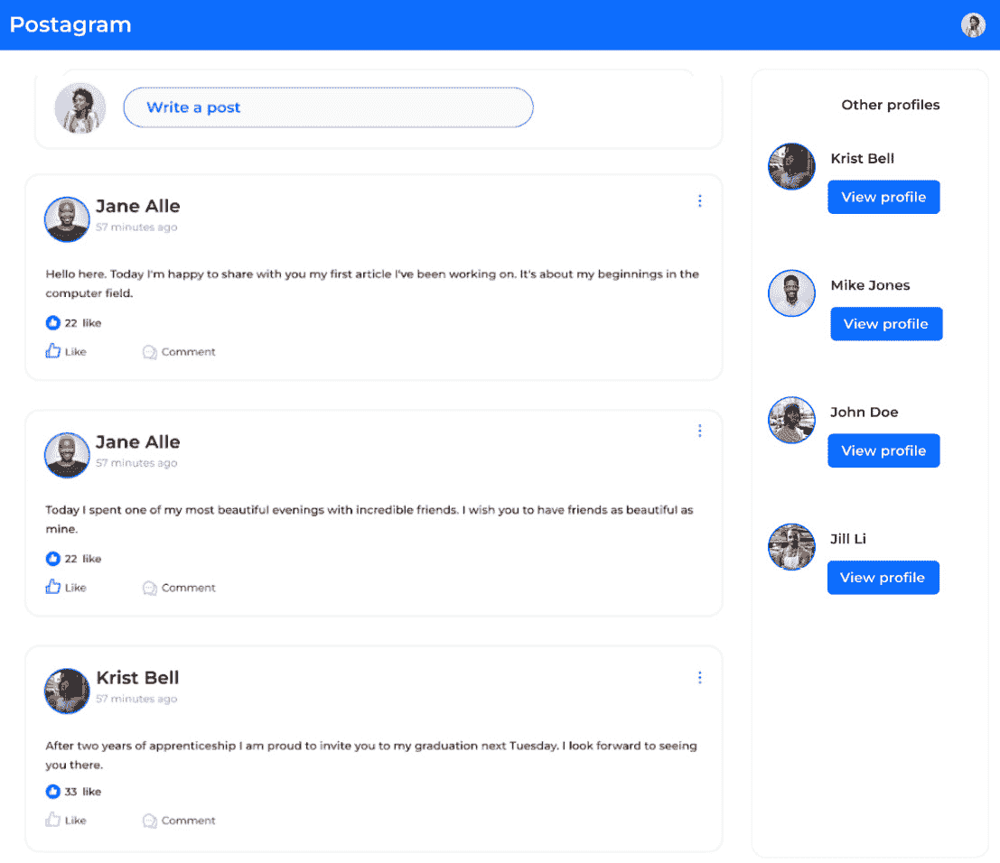

图 8.1 – Feed UI 线框图

在以下图中，我们有一个表示 UI 和页面结构的另一个插图。我们使用 flex 列，我们将使用 Bootstrap flex 组件来设计页面：

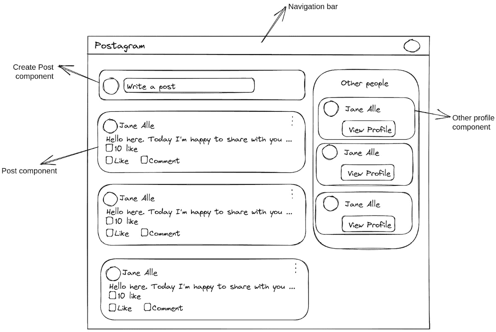

图 8.2 – 线框图

导航栏将在 React 应用的其它页面上可用，通过将导航栏做成组件，它可以被复用。我们可以通过拥有一个`Layout`组件来简化导航栏的集成，这个组件在构建页面时将被使用。让我们先添加导航栏组件。

## 添加 NavBar 组件

`NavBar`组件，或导航栏组件，应该有助于快速导航 UI。以下是`NavBar`组件的截图：

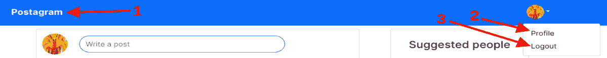

图 8.3 – Navbar

`NavBar`将包含三个链接：

+   一个重定向到 Feed 页面的链接（**1**）

+   一个重定向到个人资料页面的链接（**2**）

+   一个注销链接（**3**）

这里有一个简单的线框图，以更好地说明链接将放置的位置。

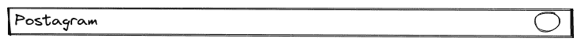

图 8.4 – Navbar 线框图

让我们添加这个组件。按照以下步骤操作：

1.  在`src/components/`目录内，添加一个名为`Navbar.jsx`的新文件。此文件将包含`NavBar`组件的代码。Bootstrap 已经提供了一个我们可以使用的`NavBar`组件。让我们从组件定义和必要的导入开始：

src/components/Navbar.jsx

```py
import React from "react";
import { randomAvatar } from "../utils";
import { Navbar, Container, Image, NavDropdown, Nav } from "react-bootstrap";
import { useNavigate } from "react-router-dom";
...
```

1.  使用已经编写的函数，我们可以添加`NavBar`组件并对其进行样式化。`react-bootstrap`提供了我们可以使用的组件，可以使我们组件的编码更快。组件所需的 props 使得这些组件的定制更加容易：

src/components/Navbar.jsx

```py
...
function Navigationbar() {
 return (
   <Navbar bg="primary" variant="dark">
     <Container>
       <Navbar.Brand className="fw-bold" href="#home">
         Postagram
       </Navbar.Brand>
       <Navbar.Collapse
         className="justify-content-end">
         <Nav>
           <NavDropdown
             title={
               <Image
                 src={randomAvatar()}
                 roundedCircle
                 width={36}
                 height={36}
               />
             }
           >
             <NavDropdown.Item href="#">Profile
             </NavDropdown.Item>
             <NavDropdown.Item onClick={handleLogout}>
               Logout</NavDropdown.Item>
           </NavDropdown>
         </Nav>
       </Navbar.Collapse>
     </Container>
   </Navbar>
 );
}
export default Navigationbar;
```

1.  让我们添加处理登出的函数：

src/components/Navbar.jsx

```py
...
function Navigationbar() {
 const navigate = useNavigate();
 const handleLogout = () => {
   localStorage.removeItem("auth");
   navigate("/login/");
 };
...
```

我将使用一个生成随机头像的网站。在下一章中，我们将进行一个小练习来添加上传个人头像的功能，但此刻图像生成器将完成这项工作。

1.  在`src`目录下，添加一个名为`utils.js`的新文件。此文件将包含我们在 React 应用程序中会重用的函数：

src/utils.js

```py
export const randomAvatar = () =>
 `https://i.pravatar.cc/300?img=${Math.floor(Math.random() * 60) + 1}`;
```

`pravatar`服务支持 URL 中的参数，并且有超过 60 个图像。我们正在使用 Math 库生成一个代表图像 ID 的随机数。现在我们可以编写`Layout`组件。

## 添加 Layout 组件

一个好的 React 项目应该具有视觉一致性，但也应该减少代码的重复。例如，这个 React 项目的导航栏将出现在主页上，也会出现在个人资料页上。如果我们直接在 HTML 和 CSS 中开发，我们会重复相同的代码来创建导航栏，但我们可以通过创建`Layout`组件来避免重复。

在`src/components`目录下，添加一个名为`Layout.jsx`的文件。此文件将包含`Layout`组件的代码：

src/components/Layout.jsx

```py
import React from "react";
import Navigationbar from "./Navbar";
function Layout(props) {
 return (
   <div>
     <Navigationbar />
     <div className="container m-5">{props.children}</div>
   </div>
 );
}
export default Layout;
```

在这里我们有一个新的语法：`children`。在 React 中，`children`用于显示在调用组件时在打开和关闭标签之间包含的内容。以下是一个使用图像组件的简单示例：

```py
const Picture = (props) => {
  return (
    <div>
      
      {props.children}
    </div>
  )
}
```

该组件可以被使用，并且我们可以添加内容或其他组件：

```py
render () {
  return (
    <div className='container'>
      <Picture>
          <p>This a children element.</p>
      </Picture>
    </div>
  )
}
```

每当调用`Picture`组件时，`props.children`也会显示，这只是一个对组件打开和关闭标签的引用。在我们的上下文中，`props.children`将包含 React 应用程序页面的大部分内容。

例如，在主页上，我们有帖子和个人资料列表；这些元素将是`Layout`组件的子元素。现在就让我们使用`Layout`组件。

## 在主页上使用 Layout 组件

在`Home.jsx`内部，我们将重写代码以使用`Layout`组件。以下是新代码：

src/pages/Home.jsx

```py
import React from "react";
import Layout from "../components/Layout";
function Home() {
 return (
   <Layout>
   </Layout>
 );
}
export default Home;
```

太好了。让我们首先添加输入以创建一个新的帖子，如图*图 8**.2*所示。

## 创建帖子

要创建和添加帖子，请按照以下步骤操作：

1.  在 `src/components` 中添加一个名为 `posts` 的新目录。此目录将包含用于帖子功能的所有组件。我们将有创建帖子、显示帖子和更新帖子的组件。

1.  在新创建的目录中，添加一个名为 `CreatePost.jsx` 的文件。此文件将包含创建帖子所需逻辑和 UI 的代码。

1.  我们这里有一个名为 `Modal` 的 UI 组件。`react-bootstrap` 提供了一个为模态准备的元素，我们可以轻松地根据我们的需求进行定制。让我们首先添加所需的导入并定义组件函数：

src/components/post/CreatePost.jsx

```py
import React, { useState } from "react";
import { Button, Modal, Form } from "react-bootstrap";
import axiosService from "../../helpers/axios";
import { getUser } from "../../hooks/user.actions";
function CreatePost()
  return ()
};
export default CreatePost;
```

1.  帖子创建的输入将在 `Modal` 组件内。正如我们之前所做的那样，我们还将添加方法和状态管理以处理表单。但首先，让我们编写模态和可点击的输入：

src/components/post/CreatePost.jsx

```py
…
function CreatePost() {
 const [show, setShow] = useState(false);
 const handleClose = () => setShow(false);
 const handleShow = () => setShow(true);
 return (
   <>
     <Form.Group className="my-3 w-75">
       <Form.Control
         className="py-2 rounded-pill border-primary
                    text-primary"
         type="text"
         placeholder="Write a post"
         onClick={handleShow}
       />
     </Form.Group>
     {/*Add modal code here*/}
   </>
 );
}
export default CreatePost;
```

1.  我们首先添加将触发模态显示的输入。点击模态将 `show` 状态设置为 `True`，这是用于打开模态的状态。让我们添加模态的代码：

src/components/post/CreatePost.jsx

```py
...
     <Modal show={show} onHide={handleClose}>
       <Modal.Header closeButton className="border-0">
         <Modal.Title>Create Post</Modal.Title>
       </Modal.Header>
       <Modal.Body className="border-0">
         <Form noValidate validated={validated}
           onSubmit={handleSubmit}>
           <Form.Group className="mb-3">
             <Form.Control
               name="body"
               value={form.body}
               onChange={(e) => setForm({ ...form,
                 body: e.target.value })}
               as="textarea"
               rows={3}
             />
           </Form.Group>
         </Form>
       </Modal.Body>
       <Modal.Footer>
         <Button variant="primary"
           onClick={handleSubmit}
           disabled={form.body === undefined}>
           Post
         </Button>
       </Modal.Footer>
     </Modal>
...
```

1.  模态的 UI 已创建。我们现在需要添加 `handleSubmit` 函数和其他表单处理逻辑：

src/components/post/CreatePost.jsx

```py
function CreatePost() {
...
 const [validated, setValidated] = useState(false);
 const [form, setForm] = useState({});
 const user = getUser();
...
 const handleSubmit = (event) => {
   event.preventDefault();
   const createPostForm = event.currentTarget;
   if (createPostForm.checkValidity() === false) {
     event.stopPropagation();
   }
   setValidated(true);
   const data = {
     author: user.id,
     body: form.body,
   };
   axiosService
     .post("/post/", data)
     .then(() => {
       handleClose();
       setForm({});
     })
     .catch((error) => {
       console.log(error);
     });
 };
...
```

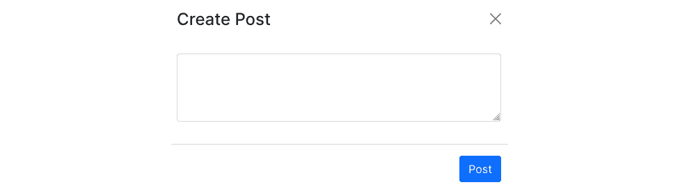

图 8.5 – 创建帖子组件

我们几乎完成了，但我们需要每个动作的一个基本功能，例如表单处理。我们需要向用户发送反馈，告诉他们他们的请求是否成功。在我们的上下文中，当用户创建帖子时，我们将显示成功吐司或错误吐司：

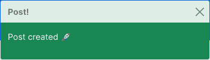

图 8.6 – 成功的吐司

吐司将被用于帖子删除和更新。它还将用于评论创建、修改和删除，以及我们稍后将要添加的配置文件修改。我们将在下一节中添加 `Toast` 组件。

## 添加吐司组件

让我们快速创建一个名为 `Toaster` 的组件，我们将在 React 应用程序中使用它来显示吐司。

在 `src/components` 中创建一个名为 `Toaster.jsx` 的新文件。此文件将包含 `Toaster` 组件的代码：

src/components/Toaster.jsx

```py
import React from "react";
import { Toast, ToastContainer } from "react-bootstrap";
function Toaster(props) {
 const { showToast, title, message, onClose, type } =
   props;
 return (
   <ToastContainer position="top-center">
     <Toast onClose={onClose} show={showToast} delay={3000}
       autohide bg={type}>
       <Toast.Header>
         <strong className="me-auto">{title}</strong>
       </Toast.Header>
       <Toast.Body>
         <p className="text-white">{message}</p>
       </Toast.Body>
     </Toast>
   </ToastContainer>
 );
}
export default Toaster;
```

`Toaster` 组件接受一些属性：

+   `showToast`: 用于显示吐司或隐藏的布尔值。理想情况下，根据我们从服务器请求中收到的输出，我们将状态设置为 `true`，这将显示吐司。

+   `title`: 这表示吐司的标题。

+   `message`: 这传达了我们将要在吐司中显示的消息。

+   `onClose`: 处理吐司关闭功能的函数。此函数是必需的；否则，吐司将永远不会消失。

+   `type`: 这表示要显示的吐司类型。在我们的上下文中，我们将使用 `success` 或 `danger`。

让我们在 `CreatePost.jsx` 中导入此组件并使用它。

## 在创建帖子时添加吐司

在`CreatePost.jsx`文件中，我们将添加新的状态，并将这些状态作为 props 传递给`Toaster`组件：

src/components/post/CreatePost.jsx

```py
…
import Toaster from "../Toaster";
function CreatePost() {
...
 const [showToast, setShowToast] = useState(false);
 const [toastMessage, setToastMessage] = useState("");
 const [toastType, setToastType] = useState("");
...
 const handleSubmit = (event) => {
   ...
   axiosService
     .post("/post/", data)
     .then(() => {
       handleClose();
       setToastMessage("Post created 🚀");
       setToastType("success");
       setForm({});
       setShowToast(true);
     })
     .catch(() => {
       setToastMessage("An error occurred.");
       setToastType("danger");
     });
 };
```

我们可以导入`Toaster`组件，并将新添加的状态作为 props 传递：

src/components/post/CreatePost.jsx

```py
...
   </Modal>
     <Toaster
       title="Post!"
       message={toastMessage}
       showToast={showToast}
       type={toastType}
       onClose={() => setShowToast(false)}
     />
   </>
...
```

我们已经完成了`CreatePost`组件的编写。对于下一步，我们需要将其集成到主页上。

## 将 CreatePost 组件添加到主页

`CreatePost`组件现在已准备好，我们可以使用它。首先，将其导入到`Home.jsx`文件中，并修改 UI。

主页将分为两部分：

+   第一部分将包含帖子列表（**1**见*图 8**.7*）

+   第二部分将包括五个配置文件列表（**2**见*图 8**.7*）

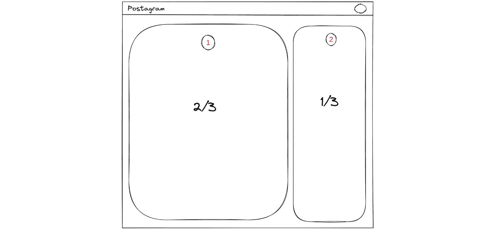

图 8.7 – 主页结构

我们可以通过使用`react-bootstrap`提供的行和列组件快速实现结果。目前我们不会关注第二部分（列出配置文件）。让我们确保我们为帖子功能有所有**CRUD**操作：

1.  在`Home.jsx`文件内部，添加以下内容。我们将首先导入并添加行：

src/pages/Home.jsx

```py
import React from "react";
import Layout from "../components/Layout";
import { Row, Col, Image } from "react-bootstrap";
import { randomAvatar } from "../utils";
import useSWR from "swr";
import { fetcher } from "../helpers/axios";
import { getUser } from "../hooks/user.actions";
import CreatePost from "../components/posts/CreatePost";
function Home() {
 const user = getUser();
 if (!user) {
   return <div>Loading!</div>;
 }
 return (
   <Layout>
     <Row className="justify-content-evenly">
       <Col sm={7}>
         <Row className="border rounded
           align-items-center">
           <Col className="flex-shrink-1">
             <Image
               src={randomAvatar()}
               roundedCircle
               width={52}
               height={52}
               className="my-2"
             />
           </Col>
           <Col sm={10} className="flex-grow-1">
             <CreatePost />
           </Col>
         </Row>
       </Col>
     </Row>
   </Layout>
 );
}
export default Home;
```

1.  太好了！确保保存更改，启动服务器，然后转到主页。你将看到类似以下内容：


图 8.8 – 创建帖子 UI

1.  点击输入框，将弹出一个模态框。在输入框中输入任何内容并提交。模态框将关闭，你将在页面顶部中央看到一个提示：


图 8.9 – 成功创建帖子后的提示

太好了！我们现在可以使用我们的 React 应用程序创建帖子。为了使其成为可能，我们创建了一个`Modal`组件和一个带有 React Bootstrap 的表单来处理数据验证和提交。并且因为反馈是用户体验的重要方面，我们添加了一个使用 React Bootstrap 的 toaster，并将其与`useContext`钩子集成，以通知用户请求的结果。

下一步是列出所有帖子并添加如删除和修改等操作。

# 在主页上列出帖子

现在用户可以创建帖子，我们需要在主页上列出帖子，同时也允许用户访问它们。这需要创建一个组件来显示帖子的信息。如图*图 8**.1*所示，在**写帖子**输入框下方，我们有一个帖子列表。主页结构已经添加，因此我们需要添加一个组件来处理显示帖子信息背后的逻辑。

这是列出主页上帖子的流程：

+   我们使用`swr`库获取帖子列表

+   我们遍历帖子列表，然后将帖子作为 props 传递给一个名为`Post`的组件，该组件将显示帖子的数据

在开始获取数据之前，让我们创建`Post`组件。

## 编写帖子组件

要创建一个`Post`组件，请按照以下步骤操作：

1.  在`src/components/post/`目录内，创建一个名为`Post.jsx`的新文件。这个文件将包含显示帖子数据和如点赞或取消点赞、删除和修改等逻辑。以下是`Post`组件的线框图：


图 8.10 – 帖子组件

1.  为了使事情更快，我们将使用`react-bootstrap`提供的`Card`组件。`Card`组件包含一个包含标题、正文和页脚的结构：

src/components/post/Post.jsx

```py
import React, { useState } from "react";
import { format } from "timeago.js";
import {
 LikeFilled,
 CommentOutlined,
 LikeOutlined,
} from "@ant-design/icons";
import { Image, Card, Dropdown } from "react-bootstrap";
import { randomAvatar } from "../../utils";
function Post(props) {
 const { post, refresh } = props;
 const handleLikeClick = (action) => {
   axiosService
     .post(`/post/${post.id}/${action}/`)
     .then(() => {
       refresh();
     })
     .catch((err) => console.error(err));
 };
 return (
   <>
     <Card className="rounded-3 my-4">
      {/* Add card body here*/}
     </Card>
   </>
 );
}
export default Post;
```

`Post`组件接受两个属性：

+   包含帖子数据的`post`对象。

+   `refresh`函数。这个函数将来自 SWR 的`posts`对象，SWR 返回一个包含`mutate`方法的对象，可以用来触发数据的获取。

1.  我们还从添加`handleLikeClick`函数中受益。可以将两个操作传递给该函数：要么是`like`，要么是`remove_like`。如果请求成功，我们可以刷新帖子。太好了！让我们先添加`Card`的正文。它将包含帖子的作者头像、姓名和帖子创建以来的时间：

src/components/post/Post.jsx

```py
…
<Card.Body>
         <Card.Title className="d-flex flex-row
           justify-content-between">
           <div className="d-flex flex-row">
             <Image
               src={randomAvatar()}
               roundedCircle
               width={48}
               height={48}
               className="me-2 border border-primary
                          border-2"
             />
             <div className="d-flex flex-column
               justify-content-start
               align-self-center mt-2">
               <p className="fs-6 m-0">
                 {post.author.name}</p>
               <p className="fs-6 fw-lighter">
                 <small>{format(post.created)}</small>
               </p>
             </div>
           </div>
         </Card.Title>
       </Card.Body>
...
```

1.  继续添加帖子的正文和点赞数：

src/components/post/Post.jsx

```py
…
         </Card.Title>
         <Card.Text>{post.body}</Card.Text>
         <div className="d-flex flex-row">
           <LikeFilled
             style={{
               color: "#fff",
               backgroundColor: "#0D6EFD",
               borderRadius: "50%",
               width: "18px",
               height: "18px",
               fontSize: "75%",
               padding: "2px",
               margin: "3px",
             }}
           />
           <p className="ms-1 fs-6">
             <small>{post.likes_count} like</small>
           </p>
         </div>
       </Card.Body>
...
```

1.  我们现在可以移动到包含点赞和评论 UI 的`Card`页脚。让我们先添加**点赞**图标，然后是文本：

src/components/post/Post.jsx

```py
...
       </Card.Body>
       <Card.Footer className="d-flex bg-white w-50
         justify-content-between border-0">
         <div className="d-flex flex-row">
           <LikeOutlined
             style={{
               width: "24px",
               height: "24px",
               padding: "2px",
               fontSize: "20px",
               color: post.liked ? "#0D6EFD" :
                 "#C4C4C4",
             }}
             onClick={() => {
               if (post.liked) {
                 handleLikeClick("remove_like");
               } else {
                 handleLikeClick("like");
               }
             }}
           />
           <p className="ms-1">
             <small>Like</small>
           </p>
         </div>
 {/* Add comment icon here*/}
       </Card.Footer>
     </Card>
...
```

1.  现在继续添加**评论**图标，然后是文本：

src/components/post/Post.jsx

```py
...
         <div className="d-flex flex-row">
           <CommentOutlined
             style={{
               width: "24px",
               height: "24px",
               padding: "2px",
               fontSize: "20px",
               color: "#C4C4C4",
             }}
           />
           <p className="ms-1 mb-0">
             <small>Comment</small>
           </p>
         </div>
       </Card.Footer>
...
```

`Post`组件已经完全编写完成；我们现在可以在主页上使用它了。

## 将`Post`组件添加到主页

现在我们将把我们的`Post`组件添加到主页上。

在`Home.jsx`文件中，导入`Post`组件：

src/pages/Home.jsx

```py
...
import { Post } from "../components/posts";
...
```

我们现在可以通过首先从服务器获取帖子来在代码中使用这些组件：

src/pages/Home.jsx

```py
...
function Home() {
 const posts = useSWR("/post/", fetcher, {
   refreshInterval: 10000,
 });
...
```

`useSWR`钩子可以接受一些参数，例如`refreshInterval`。在这里，返回的数据每 10 秒刷新一次。我们现在可以在 UI 中使用这些对象：

src/pages/Home.jsx

```py
...
           <Col sm={10} className="flex-grow-1">
             <CreatePost />
           </Col>
         </Row>
         <Row className="my-4">
           {posts.data?.results.map((post, index) => (
             <Post key={index} post={post}
               refresh={posts.mutate} />
           ))}
         </Row>
       </Col>
...
```

太好了！在主页上添加了`Post`组件后，你应该会有类似这样的结果：

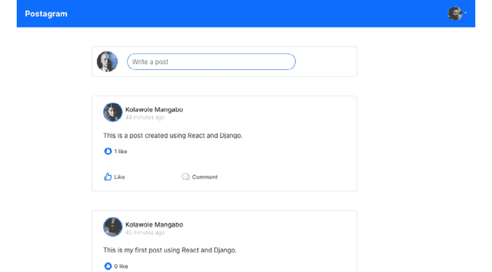

图 8.11 – 帖子列表

你可以点击右上角的`Post`组件的**更多**下拉菜单：

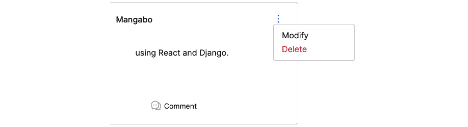

图 8.12 – 添加更多下拉菜单

`react-bootstrap`提供了一个我们可以使用的`Dropdown`组件，我们可以用它达到相同的效果。在`Post.jsx`文件中，从`react-bootstrap`导入`Dropdown`组件。由于我们将添加帖子删除的逻辑，让我们也导入`Toaster`组件：

src/components/post/Post.jsx

```py
import { Button, Modal, Form, Dropdown } from "react-bootstrap";
import Toaster from "../Toaster";
...
```

然后我们必须编写我们将传递给`Dropdown`组件作为标题的组件：

src/components/post/Post.jsx

```py
…
const MoreToggleIcon = React.forwardRef(({ onClick }, ref) => (
 <Link
   to="#"
   ref={ref}
   onClick={(e) => {
     e.preventDefault();
     onClick(e);
   }}
 >
   <MoreOutlined />
 </Link>
));
function Post(props) {
...
```

我们现在可以将`Dropdown`组件添加到 UI 中。我们需要使其有条件，以便只有帖子的作者可以访问这些选项。我们只需从`localStorage`检索用户，并将`user.id`与`author.id`进行比较：

src/components/post/Post.jsx

```py
...
function Post(props) {
...
 const [showToast, setShowToast] = useState(false);
 const user = getUser();
...
 const handleDelete = () => {
   axiosService
     .delete(`/post/${post.id}/`)
     .then(() => {
       setShowToast(true);
       refresh();
     })
     .catch((err) => console.error(err));
 };
 return (
 ...
```

让我们添加组件 UI 和`Toaster`组件：

src/components/post/Post.jsx

```py
...
     <Card className="rounded-3 my-4">
       <Card.Body>
         <Card.Title className="d-flex flex-row
           justify-content-between">
           ...
           {user.name === post.author.name && (
             <div>
               <Dropdown>
                 <Dropdown.Toggle as={MoreToggleIcon}>
                 </Dropdown.Toggle>
                 <Dropdown.Menu>
                   <Dropdown.Item>Update</>
                   <Dropdown.Item
                     onClick={handleDelete}
                     className="text-danger"
                   >
                     Delete
                   </Dropdown.Item>
                 </Dropdown.Menu>
               </Dropdown>
             </div>
           )}
         </Card.Title>
         ...
     </Card>
     <Toaster
       title="Post!"
       message="Post deleted"
       type="danger"
       showToast={showToast}
       onClose={() => setShowToast(false)}
     />
   </>
 );
}
export default Post;
```

`Dropdown`组件也被添加到提示器中。每次删除帖子时，页面上方中央都会弹出一个红色的提示器：

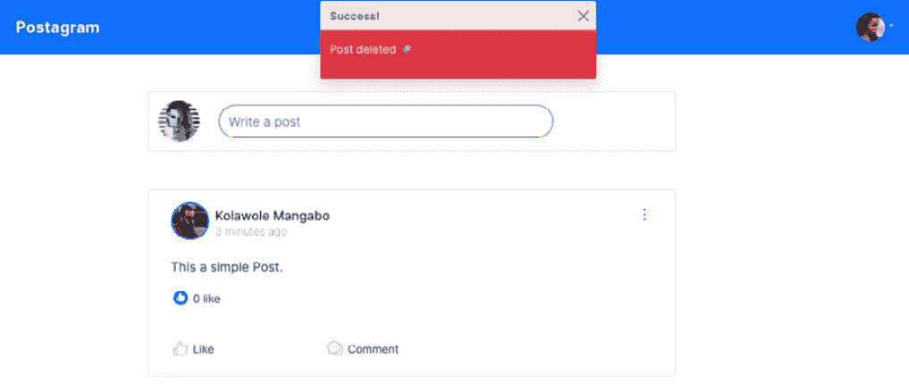

图 8.13 – 删除帖子

用户现在可以删除自己的帖子，并且这个功能可以直接从`Post`组件中访问。我们已经探讨了如何再次使用`UseContex`钩子，以及如何使用`react-bootstrap`创建下拉菜单。

帖子功能的**CRUD**操作几乎完成，只剩下更新功能。这很简单，你将作为一个小练习来实现它，但我将添加必要的代码和说明。

# 更新帖子

如前所述，这个功能的实现是一个简单的练习。以下是用户在修改帖子时通常会遵循的流程：

1.  点击**更多**下拉菜单。

1.  选择**修改**选项。

1.  将显示一个包含帖子内容的模态框，用户可以对其进行修改。

1.  完成后，用户保存，模态框关闭。

1.  将弹出一个包含**帖子** **更新** **🚀**内容的提示框。

这个功能与`CreatePost.jsx`类似；区别在于`UpdatePost`组件将接收一个`post`对象作为属性。以下是代码的框架：

src/components/post/UpdatePost.jsx

```py
import React, { useState } from "react";
import { Button, Modal, Form, Dropdown } from "react-bootstrap";
import axiosService from "../../helpers/axios";
import Toaster from "../Toaster";
function UpdatePost(props) {
 const { post, refresh } = props;
 const [show, setShow] = useState(false);
 const handleClose = () => setShow(false);
 const handleShow = () => setShow(true);
 // Add form handling logic here
 return (
   <>
     <Dropdown.Item onClick={handleShow}>Modify
     </Dropdown.Item>
     <Modal show={show} onHide={handleClose}>
     {/*Add UI code here*/}
     </Modal>
   </>
 );
}
export default UpdatePost;
```

该组件在`Post.jsx`文件中被调用，并像这样使用：

src/components/post/Post.jsx

```py
...
import UpdatePost from "./UpdatePost";
...
           </div>
           {user.name === post.author.name && (
             <div>
               <Dropdown>
                 <Dropdown.Toggle as={MoreToggleIcon}>
                 </Dropdown.Toggle>
                 <Dropdown.Menu>
                   <UpdatePost post={post}
                     refresh={refresh} />
                   <Dropdown.Item
                     onClick={handleDelete}
                     className="text-danger"
                   >
                     Delete
                   </Dropdown.Item>
                 </Dropdown.Menu>
               </Dropdown>
             </div>
           )}
...
```

祝你练习顺利。你可以在[`github.com/PacktPublishing/Full-stack-Django-and-React/blob/main/social-media-react/src/components/posts/UpdatePost.jsx`](https://github.com/PacktPublishing/Full-stack-Django-and-React/blob/main/social-media-react/src/components/posts/UpdatePost.jsx)找到解决方案。

# 小型重构

首先，创建新帖子时不会进行刷新。正如我们在`UpdatePost.jsx`组件中所做的那样，我们也可以向`CreatePost`组件传递一些属性：

src/pages/Home.jsx

```py
...
           <Col sm={10} className="flex-grow-1">
             <CreatePost refresh={posts.mutate} />
           </Col>
...
```

此外，当帖子成功创建时，我们可以调用`refresh`方法：

src/components/posts/CreatePost.jsx

```py
function CreatePost(props) {
  const { refresh } = props;
  ...
    axiosService
      .post("/post/", data)
      .then(() => {
     ...
        setForm({});
        setShowToast(true);
        refresh();
      })
...
```

现在，每次用户添加帖子时，他都会在主页上看到新创建的帖子，而无需重新加载页面。

其次，`Toaster`组件已创建，但我们需要考虑如何在项目中调用该组件。让我们不要忘记，这个组件是为了向用户返回关于成功或失败的请求的反馈而创建的，因此该组件应该在整个项目中可重用，这正是我们实际所做的事情，对吧？

嗯，不是的，这并不理想，因为它将违反组件层次结构中更高的`Toaster`组件，然后能够从任何子组件中调用或显示吐司？

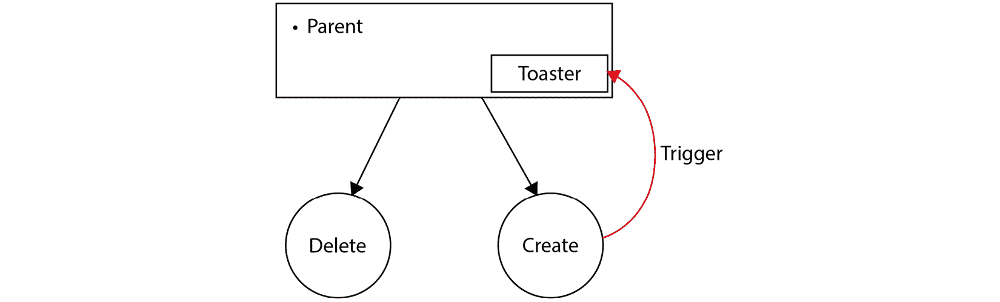

图 8.14 – 父组件和子组件

在前面的图中，我们将能够从子组件（`CreatePost`）直接在父组件中触发项目中吐司的显示。React 提供了一种有趣的方式来管理父组件和子组件之间的状态，这被称为上下文。在`Layout.jsx`文件中，使用`createContext`方法创建一个新的上下文：

src/components/Layout.jsx

```py
import React, { createContext, useMemo, useState } from "react";
export const Context = createContext("unknown");
function Layout(props) {
```

然后在`Layout`组件的作用域内，让我们定义包含吐司将用于显示信息的数据的状态。我们还将将组件 JSX 内容包裹在`Context`组件内部，并添加一个方法来从`Layout`组件的任何子组件中修改状态：

src/components/Layout.jsx

```py
function Layout(props) {
  ...
  const [toaster, setToaster] = useState({
   title: "",
   show: false,
   message: "",
   type: "",
 });
 const value = useMemo(() => ({ toaster, setToaster }),
                                [toaster]);
 ...
 return (
   <Context.Provider value={value}>
     <div>
       <NavigationBar />
       {hasNavigationBack && (
         <ArrowLeftOutlined
           style={{
             color: "#0D6EFD",
             fontSize: "24px",
             marginLeft: "5%",
             marginTop: "1%",
           }}
           onClick={() => navigate(-1)}
         />
       )}
       <div className="container my-2">
         {props.children}</div>
     </div>
     <Toaster
       title={toaster.title}
       message={toaster.message}
       type={toaster.type}
       showToast={toaster.show}
       onClose={() => setToaster({ ...toaster, show: false
         })}
     />
   </Context.Provider>
 );
}
export default Layout;
```

在前面的代码中，我们介绍了一个新的函数 Hook，称为`useMemo`，它有助于记住上下文值（缓存上下文的值）并避免每次`Layout`组件重新渲染时创建新对象。

然后，我们将能够访问`toaster`状态并从任何子组件中调用`setToaster`函数：

```py
 const { toaster, setToaster } = useContext(Context);
```

# 摘要

在本章中，我们通过创建用于帖子功能的 CRUD 操作所需的组件，更深入地了解了 React 编程。我们涵盖了诸如属性传递、父-子组件创建、UI 组件定制和模态框创建等概念。这导致了`Postagram`项目主页的部分完成。我们还学习了更多关于`useState`和`useContext`Hooks 以及它们如何影响 React 中的状态的知识。我们还学习了如何创建`Dropdown`组件，如何创建自定义吐司，以及在 React 项目中布局的重要性。

在下一章中，我们将专注于评论功能的 CRUD 操作。这将导致我们添加一个**个人资料**页面和一个**帖子**页面来显示评论。我们还将进行简单快速的评估，以添加到评论中的点赞功能。

# 问题

1.  什么是模态框？

1.  什么是属性？

1.  React 中的子元素是什么？

1.  什么是线框图？

1.  JSX 中使用的`map`方法是什么？

1.  SWR 对象上`mutate`方法的用法是什么？
