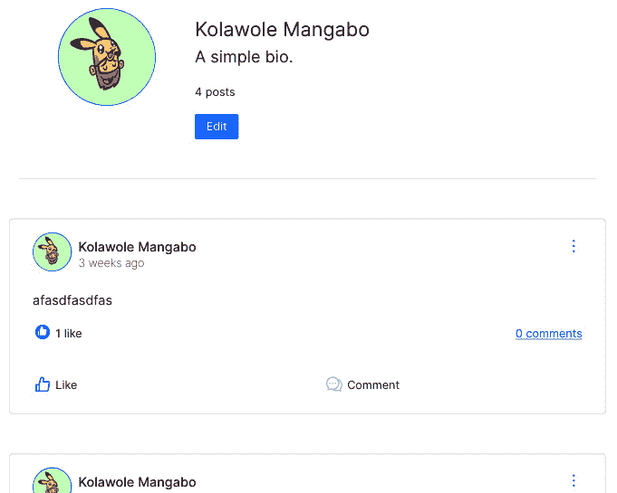

# 10

# 用户个人资料

一个社交媒体应用应允许用户查看其他用户的个人资料。从另一个角度来看，它还应允许认证用户编辑他们的信息，例如他们的姓氏、名字和头像。

在本章中，我们将专注于在用户端添加 CRUD 功能。我们将构建一个页面来可视化用户个人资料，并构建一个允许用户编辑他们信息的页面。本章将涵盖以下主题：

+   在主页上列出个人资料

+   在个人资料页面上显示用户信息

+   编辑用户信息

# 技术要求

确保您的机器上已安装并配置了 VS Code 和更新的浏览器。您可以在[`github.com/PacktPublishing/Full-stack-Django-and-React/tree/chap10`](https://github.com/PacktPublishing/Full-stack-Django-and-React/tree/chap10)找到本章中使用的所有代码文件。

# 在主页上列出个人资料

在构建显示用户信息和允许修改用户信息的页面和组件之前，我们需要在主页上添加一个组件来列出一些个人资料，如下所示：


图 10.1 – 列出个人资料

按照以下步骤添加主页上列出个人资料的组件：

1.  在`src/components`文件中，创建一个名为`profile`的新目录。这个目录将包含所有与用户或个人资料相关的组件代码。

1.  在新创建的目录中，创建一个名为`ProfileCard.jsx`的文件，并添加以下内容：

src/components/profile/ProfileCard.jsx

```py
import React from "react";
import { Card, Button, Image } from "react-bootstrap";
import { useNavigate } from "react-router-dom";
function ProfileCard(props) {
 return (
    // JSX code here
 );
}
export default ProfileCard;
```

`ProfileCard`组件将被用来显示个人资料信息并重定向用户到个人资料页面。

1.  接下来，我们将添加有关导航到个人资料页面和 props 对象解构的代码逻辑：

src/components/profile/ProfileCard.jsx

```py
...
function ProfileCard(props) {
 const navigate = useNavigate();
 const { user } = props;
 const handleNavigateToProfile = () => {
   navigate(`/profile/${user.id}/`)
 };
 return (
    // JSX Code
 );
}
export default ProfileCard;
```

在前面的代码中，我们从 props 中检索了用户对象，并添加了一个处理导航到用户个人资料页面的函数。

1.  接下来，让我们编写将向用户显示信息的 JSX：

src/components/profile/ProfileCard.jsx

```py
...
 return (
   <Card className="border-0 p-2">
     <div className="d-flex ">
       <Image
         src={user.avatar}
         roundedCircle
         width={48}
         height={48}
         className=
           "my-3 border border-primary border-2"
       />
       <Card.Body>
         <Card.Title
           className="fs-6">{user.name}</Card.Title>
         <Button variant="primary"
           onClick={handleNavigateToProfile}>
           See profile
         </Button>
       </Card.Body>
     </div>
   </Card>
 );
}
export default ProfileCard;
```

`ProfileCard`组件已经编写完成。我们现在可以将其导入到`Home.jsx`页面并使用它。但在那之前，我们需要从 API 中检索五个个人资料，并遍历结果以实现所需的显示：

src/pages/Home.jsx

```py
...
import CreatePost from "../components/posts/CreatePost";
import ProfileCard from "../components/profile/ProfileCard";
function Home() {
...
 const profiles = useSWR("/user/?limit=5", fetcher);
...
 return (
   <Layout>
     <Row className="justify-content-evenly">
       ...
       <Col sm={3} className="border rounded py-4
           h-50">
         <h4 className="font-weight-bold text-center">
           Suggested people</h4>
         <div className="d-flex flex-column">
           {profiles.data &&
             profiles.data.results.map((profile,
                                        index) => (
               <ProfileCard key={index} user={profile}
               />
             ))}
         </div>
       </Col>
     </Row>
   </Layout>
 );
}
export default Home;
```

在前面的代码中，只有当`profiles.data`对象不为 null 或 undefined 时，才会显示个人资料。这就是为什么我们编写了`profiles.data && profiles.data.results.map()`内联 JSX 条件。

1.  完成后，重新加载主页，您将有一个新的组件可用，最多列出五个个人资料。

尝试点击**查看个人资料**按钮。您将被重定向到一个空白页面。这是正常的，因为我们还没有为**个人资料**页面编写路由。

在下一节中，我们将创建用于显示个人资料信息的组件，如下所示：


图 10.2 – 用户资料页面

我们也将允许用户编辑他们的信息，如下所示：


图 10.3 – 用户编辑表单和页面

# 在他们的资料页面上显示用户信息

在本节中，我们将创建一个资料页面来显示用户信息。我们将构建一个组件来显示用户详情和与该用户相关的帖子，同时我们还将创建一个显示编辑用户信息表单的页面。

在开始构建用户资料页面之前，我们必须创建一些组件。在资料页面上，我们不仅显示信息，还显示用户创建的帖子列表。让我们先编写`ProfileDetails.jsx`组件（*图 10*.4）：


图 10.4 – ProfileDetails 组件

这里是帮助您了解组件结构的线框图：


图 10.5 – ProfileDetails 组件的线框图

在`ProfileDetails`组件中，我们正在显示一些头像。在这个项目阶段，是时候摆脱`randomAvatar`函数了。它在这个项目阶段一直很有用，但我们正在发出很多请求，应用程序中的某些状态变化只是再次调用该函数，返回另一个随机图像，这不是应用程序用户可能希望看到的。

让我们开始使用用户对象上的头像字段值，但在那之前，我们必须配置 Django 以处理媒体上传和用户对象上的头像字段。

社交媒体应用程序使用`avatar`字段，它代表一个浏览器可以发出请求并接收图像的文件链接。Django 支持文件上传；我们只需添加一些配置使其生效。

在项目的`settings.py`文件中，在项目末尾添加以下行：

CoreRoot/settings.py

```py
…
MEDIA_URL'= '/med'a/'
MEDIA_ROOT = BASE_DIR'/ 'uplo'ds'
```

`MEDIA_URL`设置允许我们编写用于检索上传文件的 URL。`MEDIA_ROOT`设置告诉 Django 在哪里存储文件，并在返回文件 URL 时检查上传文件。在本项目中，头像字段将具有此 URL，例如：`http://localhost:8000/media/user_8380ca50-ad0f-4141-88ef-69dc9b0707ad/avatar-rogemon.png`。

为了使此配置生效，您需要在 Django 项目的根目录下创建一个名为`uploads`的目录。您还需要安装 Pillow 库，它包含所有基本的图像处理功能工具：

```py
pip install pillow
```

之后，让我们稍微修改一下用户模型中的头像字段。在`core/user/models.py`文件中，在`UserManager`管理类之前添加一个函数：

core/user/models.py

```py
...
def user_directory_path(instance, filename):
    # file will be uploaded to
       MEDIA_ROOT/user_<id>/<filename>
    return 'user_{0}/{1}'.format(instance.public_id,
                                 filename)
...
```

此函数将帮助重写文件上传的路径。而不是直接进入 `uploads` 目录，头像将根据用户存储。这可以帮助更好地组织系统中的文件。在添加此函数后，我们可以告诉 Django 使用它作为默认上传路径：

core/user/models.py

```py
...
class User(AbstractModel, AbstractBaseUser, PermissionsMixin):
...
    avatar = models.ImageField(
        null=True, blank=True,
             upload_to=user_directory_path)
...
```

在 Django 中，`ImageField` 字段用于在数据库中存储图像文件。它是 `FileField` 的子类，`FileField` 是用于存储文件的通用字段，因此它具有 `FileField` 的所有属性以及一些特定于图像的附加属性。`upload_to` 属性指定了图像文件将存储的目录。

现在，运行 `makemigrations` 命令，并确保将更改迁移到数据库中：

```py
python manage.py makemigrations
python manage.py migrate
```

完成此配置后，我们的 API 可以接受用户上传头像。然而，一些用户可能没有头像，而我们从前端处理这个问题的方式相当糟糕。让我们设置一个默认头像，用于没有头像的用户。

## 配置默认头像

要配置默认头像，请按照以下步骤操作：

1.  在 Django 项目的 `settings.py` 文件中，在文件末尾添加以下行：

CoreRoot/settings.py

```py
...
DEFAULT_AVATAR_URL = "https://avatars.dicebear.com/api/identicon/.svg"
```

头像图片如下所示：


图像 10.6：默认图片

1.  一旦你将 `DEFAULT_AVATAR_URL` 添加到 `settings.py` 文件中，我们将稍微修改 `UserSerializer` 的表示方法，以便在头像字段为空时默认返回 `DEFAULT_AVATAR_URL` 值：

Core/user/serializers.py

```py
...
from django.conf import settings
class UserSerializer(AbstractSerializer):
...
    def to_representation(self, instance):
        representation =
          super().to_representation(instance)
        if not representation['avatar']:
            representation['avatar'] =
              settings.DEFAULT_AUTO_FIELD
            return representation
        if settings.DEBUG:  # debug enabled for dev
            request = self.context.get('request')
            representation['avatar'] =
              request.build_absolute_uri(
                representation['avatar'])
        return representation
```

让我们解释一下前面代码块中我们在做什么。首先，我们需要检查头像值是否存在。如果不存在，我们将返回默认头像。默认情况下，Django 不返回带有域的实际文件路径。这就是为什么在这种情况下，如果我们处于开发环境，我们将返回头像的绝对 URL。在本书的最后一部分，我们将部署应用程序到生产服务器，然后我们将使用 **AWS S3** 进行文件存储。

在后端完成修复后，我们现在可以放心地修改前端应用程序，包括头像字段。这相当简单，只需要一点重构。从 React 应用程序中删除 `randomAvatar` 函数代码，并用 `user.avatar`、`post.author.avatar` 或 `comment.author.avatar` 替换值，具体取决于文件和组件。

1.  完成那些小配置后，检查**主页**；你应该会有一个类似的结果。


图像 10.7 – 带有默认头像的主页

太好了！让我们继续创建**个人资料**页面，以便我们的 Django 应用程序准备好接受文件上传。

## 编写 ProfileDetails 组件

要创建`ProfileDetails`组件，我们必须创建包含此组件代码的文件，添加导航逻辑，编写 UI（JSX），并在**个人资料**页面上导入组件：

1.  在`src/components/profile`目录下，创建一个名为`ProfileDetail.jsx`的新文件。这个文件将包含`ProfileDetails`组件的代码：

src/components/profile/ProfileDetails.jsx

```py
import React from "react";
import { Button, Image } from "react-bootstrap";
import { useNavigate } from "react-router-dom";
function ProfileDetails(props) {
 return (
// JSX code here
 );
}
export default ProfileDetails;
```

1.  在这里，我们只需要解构 props 对象来检索用户对象，声明 navigate 变量以使用`useNagivate`钩子，并最终处理用户对象为 undefined 或 null 的情况：

src/components/profile/ProfileDetaisl.jsx

```py
...
function ProfileDetails(props) {
 const { user } = props;
 const navigate = useNavigate();
 if (!user) {
   return <div>Loading...</div>;
 }
 return (
   // JSX Code here
 );
}
export default ProfileDetails;
```

1.  现在我们可以自信地编写 JSX 逻辑：

src/components/profile/ProfileDetails.jsx

```py
...
 return (
   <div>
     <div className="d-flex flex-row border-bottom
       p-5">
       <Image
         src={user.avatar}
         roundedCircle
         width={120}
         height={120}
         className="me-5 border border-primary
                    border-2"
       />
       <div className="d-flex flex-column
        justify-content-start align-self-center mt-2">
         <p className="fs-4 m-0">{user.name}</p>
         <p className="fs-5">{user.bio ? user.bio :
           "(No bio.)"}</p>
         <p className="fs-6">
           <small>{user.posts_count} posts</small>
         </p>
         <Button
           variant="primary"
           size="sm"
           className="w-25"
           onClick={() =>
             navigate(`/profile/${user.id}/edit/`)}
         >
           Edit
         </Button>
       </div>
     </div>
   </div>
 );
```

1.  现在组件编写完毕，请在`src/pages`目录下创建一个名为`Profile.jsx`的新文件。这个文件将包含**个人资料**页面的代码和逻辑：

src/pages/Profile.jsx

```py
import React from "react";
import { useParams } from "react-router-dom";
import Layout from "../components/Layout";
import ProfileDetails from "../components/profile/ProfileDetails";
import useSWR from "swr";
import { fetcher } from "../helpers/axios";
import { Post } from "../components/posts";
import { Row, Col } from "react-bootstrap";
function Profile() {
  return (
    // JSX CODE
  );
}
export default Profile;
```

1.  让我们添加获取用户和用户帖子的逻辑。不需要创建另一个`Post`组件，因为`src/components/Post.jsx`中的相同`Post`组件将被用来列出由个人资料创建的帖子：

src/pages/Profile.jsx

```py
...
function Profile() {
  const { profileId } = useParams();
  const user = useSWR(`/user/${profileId}/`, fetcher);
  const posts = useSWR(`/post/?author__public_id=${profileId}`, fetcher, {
       refreshInterval: 20000
   });
...
```

1.  完成后，我们现在可以编写 UI 逻辑：

src/pages/Profile.jsx

```py
...
  return (
    <Layout hasNavigationBack>
      <Row className="justify-content-evenly">
        <Col sm={9}>
          <ProfileDetails user={user.data}/>
          <div>
            <Row className="my-4">
              {posts.data?.results.map((post, index)
                => (
                <Post key={index} post={post}
                  refresh={posts.mutate} />
              ))}
            </Row>
          </div>
        </Col>
      </Row>
    </Layout>
  );
}
...
```

1.  太好了！现在让我们在`App.js`文件中注册这个页面：

src/App.js

```py
…
<Route
  path="/profile/:profileId/"
  element={
    <ProtectedRoute>
      <Profile />
    </ProtectedRoute>
  }
/>
…
```

1.  不要忘记在`Navbar.jsx`文件中添加`链接`：

src/components/Navbar.jsx

```py
...
    <NavDropdown.Item as={Link} to=
      {`/profile/${user.id}/`}>Profile
    </NavDropdown.Item>
    <NavDropdown.Item onClick={handleLogout}>Logout
    </NavDropdown.Item>
  </NavDropdown>
</Nav>
...
```

1.  太好了！你现在可以点击**查看个人资料**按钮或直接点击导航栏的下拉菜单来访问个人资料页面：



图 10.8 – 一个随机的个人资料页面

在个人资料页面准备就绪后，我们可以继续创建包含编辑用户信息表单的页面。

# 编辑用户信息

通过为`useUserActions`钩子添加一个新方法来编辑用户信息通过 API。然后，我们将创建一个用于编辑用户信息的表单。最后，我们将编辑表单组件集成到`EditUser`页面上。

让我们从向`useUserActions`钩子添加一个新方法开始。

## 向 useUserActions 添加编辑方法

在`src/hooks/user.actions.js`文件中，我们将向`useUserActions`钩子添加另一个方法。这个函数将处理对 API 的`patch`请求。由于我们在`localStorage`中保存用户对象，如果请求成功，我们将更新对象的值：

src/hooks/user.actions.js

```py
function useUserActions() {
  const navigate = useNavigate();
  const baseURL = "http://localhost:8000/api";
  return {
    login,
    register,
    logout,
    edit
  };
...
  // Edit the user
  function edit(data, userId) {
    return axiosService.patch(`${baseURL}/user/${userId}/`,
                               data).then((res) => {
      // Registering the account in the store
      localStorage.setItem(
        "auth",
        JSON.stringify({
          access: getAccessToken(),
          refresh: getRefreshToken(),
          user: res.data,
        })
      );
    });
  }
...
}
```

在编写了`edit`函数之后，我们可以自信地开始创建用于编辑用户信息的表单。

## UpdateProfileForm 组件

在`src/components/UpdateProfileForm.jsx`中，创建一个名为`UpdateProfileForm.jsx`的文件。这个文件将包含用于编辑用户信息的组件的代码：

src/components/UpdateProfileForm.jsx

```py
import React, { useState, useContext } from "react";
import { Form, Button, Image } from "react-bootstrap";
import { useNavigate } from "react-router-dom";
import { useUserActions } from "../../hooks/user.actions";
import { Context } from "../Layout";
function UpdateProfileForm(props) {
  return (
    // JSX Code
  );
}
export default UpdateProfileForm;
```

让我们从从 props 中检索用户对象并添加处理表单所需的钩子开始：

src/components/UpdateProfileForm.jsx

```py
...
function UpdateProfileForm(props) {
  const { profile } = props;
  const navigate = useNavigate();
  const [validated, setValidated] = useState(false);
  const [form, setForm] = useState(profile);
  const [error, setError] = useState(null);
  const userActions = useUserActions();
  const [avatar, setAvatar] = useState();
  const { toaster, setToaster } = useContext(Context);
...
```

下一步是编写`handleSubmit`方法。此方法应处理表单的有效性、更新信息的请求以及根据结果显示的内容：

src/components/UpdateProfileForm.jsx

```py
...
const handleSubmit = (event) => {
  event.preventDefault();
  const updateProfileForm = event.currentTarget;
  if (updateProfileForm.checkValidity() === false) {
    event.stopPropagation();
  }
  setValidated(true);
  const data = {
    first_name: form.first_name,
    last_name: form.last_name,
    bio: form.bio,
  };
  const formData = new FormData();
}
...
```

由于我们将在发送到服务器的数据中包含一个文件，我们正在使用`FormData`对象。`FormData`对象是创建将发送到服务器的数据包的常用方式。它提供了一个简单且易于构造一组**键/值**对的方法，代表表单字段的名称及其值。

在我们项目的案例中，我们需要将数据变量中的数据传递给`formData`对象：

src/components/UpdateProfileForm.jsx

```py
...
const formData = new FormData();
Object.keys(data).forEach((key) => {
    if (data[key]) {
      formData.append(key, data[key]);
    }
});
...
```

`Object`构造函数提供了一个`keys`方法，它返回 JavaScript 对象中的键列表。然后我们使用`forEach`方法遍历`keys`数组，检查`data[key]`的值是否不为 null，然后将数据对象中的值追加到`formData`对象中。我们还需要为头像字段添加一个情况：

src/components/UpdateProfileForm.jsx

```py
...
const formData = new FormData();
// Checking for null values in the form and removing them.
Object.keys(data).forEach((key) => {
    if (data[key]) {
      formData.append(key, data[key]);
    }
});
if (avatar) {
  formData.append("avatar", avatar);
}
...
```

我们现在可以转到编辑操作：

src/components/UpdateProfileForm.jsx

```py
...
userActions
  .edit(formData, profile.id)
  .then(() => {
    setToaster({
      type: "success",
      message: "Profile updated successfully 🚀",
      show: true,
      title: "Profile updated",
    });
    navigate(-1);
  })
  .catch((err) => {
    if (err.message) {
      setError(err.request.response);
    }
  });
...
```

这里没有什么复杂的。就像我们以前在 API 上的其他请求中所做的那样。现在让我们转到表单。表单将包含头像字段，如名字、姓氏和个人简介。这些字段是用户唯一需要更新的信息。让我们先编写头像字段：

src/components/UpdateProfileForm.jsx

```py
...
return (
  <Form
    id="registration-form"
    className="border p-4 rounded"
    noValidate
    validated={validated}
    onSubmit={handleSubmit}
  >
    <Form.Group className="mb-3 d-flex flex-column">
      <Form.Label className="text-center">Avatar
      </Form.Label>
      <Image
        src={form.avatar}
        roundedCircle
        width={120}
        height={120}
        className="m-2 border border-primary border-2
                   align-self-center"
      />
      <Form.Control
        onChange={(e) => setAvatar(e.target.files[0])}
        className="w-50 align-self-center"
        type="file"
        size="sm"
      />
      <Form.Control.Feedback type="invalid">
        This file is required.
      </Form.Control.Feedback>
    </Form.Group>
    ...
  </Form>
);
```

太好了！让我们添加姓氏和名字的字段：

src/components/UpdateProfileForm.jsx

```py
...
<Form.Group className="mb-3">
  <Form.Label>First Name</Form.Label>
  <Form.Control
    value={form.first_name}
    onChange={(e) => setForm({ ...form, first_name:
                              e.target.value })}
    required
    type="text"
    placeholder="Enter first name"
  />
  <Form.Control.Feedback type="invalid">
    This file is required.
  </Form.Control.Feedback>
</Form.Group>
<Form.Group className="mb-3">
  <Form.Label>Last name</Form.Label>
  <Form.Control
    value={form.last_name}
    onChange={(e) => setForm({ ...form, last_name:
                              e.target.value })}
    required
    type="text"
    placeholder="Enter last name"
  />
  <Form.Control.Feedback type="invalid">
    This file is required.
  </Form.Control.Feedback>
</Form.Group>
...
```

最后，让我们添加个人简介字段和提交按钮：

src/components/UpdateProfileForm.jsx

```py
...
<Form.Group className="mb-3">
  <Form.Label>Bio</Form.Label>
  <Form.Control
    value={form.bio}
    onChange={(e) => setForm({ ...form, bio: e.target.value })}
    as="textarea"
    rows={3}
    placeholder="A simple bio ... (Optional)"
  />
</Form.Group>
<div className="text-content text-danger">{error && <p>{error}</p>}</div>
<Button variant="primary" type="submit">
  Save changes
</Button>
...
```

太好了！`UpdateProfileForm`组件已经编写完成，我们可以使用它来创建`EditProfile.jsx`页面。

## 创建编辑个人资料页面

在`src/pages/`目录下，创建一个名为`EditProfile.jsx`的新文件。此文件将包含显示编辑用户信息的表单的页面代码：

src/pages/EditProfile.jsx

```py
import React from "react";
import { useParams } from "react-router-dom";
import useSWR from "swr";
import Layout from "../components/Layout";
import UpdateProfileForm from "../components/profile/UpdateProfileForm";
import { fetcher } from "../helpers/axios";
import { Row, Col } from "react-bootstrap";
function EditProfile() {
  return (
    //JSX code
  );
}
export default EditProfile;
```

添加了所需的导入后，我们现在可以添加获取逻辑和 UI：

src/pages/EditProfile.jsx

```py
...
function EditProfile() {
  const { profileId } = useParams();
  const profile = useSWR(`/user/${profileId}/`, fetcher);
  return (
    <Layout hasNavigationBack>
      {profile.data ? (
        <Row className="justify-content-evenly">
          <Col sm={9}>
            <UpdateProfileForm profile={profile.data} />
          </Col>
        </Row>
      ) : (
        <div>Loading...</div>
      )}
    </Layout>
  );
}
...
```

在`EditProfile`函数中，我们计划检索将用于获取最新用户信息的`profileId`，并将响应传递给`UpdateProfileForm`组件。自然地，我们返回`App.js`文件：

src/App.jsx

```py
...
<Route
  path="/profile/:profileId/edit/"
  element={
    <ProtectedRoute>
      <EditProfile />
    </ProtectedRoute>
  }
/>
...
```

现在，前往您的个人资料并点击**编辑**按钮。更改信息并添加头像图片以确保一切正常工作。

React 应用程序几乎完成了。我们已经实现了认证、帖子、评论和新用户的 CRUD 操作。现在，是时候关注我们组件的质量和可维护性了。

# 摘要

在本章中，我们在 React 应用程序中为用户添加了 CRUD 操作。我们探讨了在 Django 中处理媒体上传的强大和简单性，以及如何创建一个可以接受文件上传到远程服务器的表单。我们还为 React 应用程序添加了新的组件，以实现更好的导航和探索其他个人资料。我们已完成应用程序大多数功能的实现。

在下一章中，我们将学习如何为 React 前端应用程序编写测试。

# 问题

1.  什么是 `formData` 对象？

1.  Django 中的 `MEDIA_URL` 设置用途是什么？

1.  Django 中的 `MEDIA_ROOT` 设置用途是什么？
