# 第十二章：部署基础 – Git、GitHub 和 AWS

在您的机器上开发一个具有功能后端和良好、灵活前端的程序是件好事。然而，如果您想公开使用您的应用程序，您需要将应用程序部署到生产环境。从本章到最后，您将学习如何为部署准备我们构建的应用程序，在 **亚马逊网络服务**（**AWS**）上部署后端，在 Vercel 上部署前端，并最终进行一些安全和性能优化。

在本章中，我们将学习部署基础，如术语和概念，以便在进一步学习之前理解。我们将学习以下主题：

+   软件部署基础

+   网络应用程序部署的工具和方法

+   网络应用程序部署平台

# 技术要求

对于本章，您需要在您的机器上安装 Git。如果您使用的是 Linux 或 macOS，它将默认安装。您可以在终端中使用以下命令检查其存在性：

```py
git –version
```

否则，您可以自由地下载正确的版本，请访问 [`git-scm.com/downloads`](https://git-scm.com/downloads)。

安装完成后，如果尚未完成，让我们配置 Git。在终端中，输入以下配置命令以设置用户名（通常是您的 GitHub 账户上的用户名）和电子邮件地址（通常是您的 GitHub 账户上的电子邮件地址）：

```py
git config --global user.name "username"
git config --global user.email "email@address.com"
```

您还需要一个活跃的 GitHub 账户。您可以在官方网站 [`github.com/`](https://github.com/) 上注册。由于我们还将应用程序部署到远程 AWS 服务器，您需要一个可以在 [`portal.aws.amazon.com/billing/signup`](https://portal.aws.amazon.com/billing/signup) 创建的 AWS 账户。如果您没有 AWS 账户，您仍然可以使用您在线的任何 **虚拟专用服务器**（**VPS**）或 **虚拟专用云**（**VPC**）。然而，本章还将记录如何使用 AWS 创建 VPC 实例以及如何上传代码和提供 Django API。

# 软件部署基础

**软件部署**涉及使软件系统可供消费者使用的所有活动。术语 *软件部署* 也通常描述为应用程序部署。遵循最佳软件部署实践将确保所有部署的应用程序都能平稳运行并按预期工作。

软件部署有几种好处，例如：

+   **节省时间**：良好的软件部署流程可以配置为只需几分钟即可完成。这节省了编译和分发给用户的时间。

+   **增强安全性**：以结构化的方式部署您的应用程序，而不是手动部署或为单个用户部署，这意味着您确保了应用程序的安全性，而不仅仅是每个用户设备上的应用程序安全性。

+   **更好的监控**：在生产服务器上部署应用程序有助于提供更多关于用户端工作情况的控制和数据。

软件部署定义后，我们将更深入地探讨用于 Web 应用程序部署的工具和方法。

# Web 应用程序部署的工具和方法

部署 Web 应用程序到生产环境在近年来经历了巨大的演变。从手动部署到自动化部署技术，Web 应用程序部署已经进步，使过程更加安全、顺畅，尽可能快。有许多 Web 应用程序部署工具，但在这本书中，我们将专注于自动化工具，并在代码的远程仓库上推送时配置 Django 项目和 React 项目以进行自动化部署。

但代码首先会被推送到哪里呢？让我们开始描述和学习如何使用工具来部署我们的全栈应用程序，从 Git 和 GitHub 开始。

## 使用 Git 和 GitHub

Git 是一个流行的源代码版本控制和协作工具。它不仅帮助用户跟踪代码的更改，还允许开发者通过小型或大型代码库进行工作，使协作更加容易。在以下小节中，我们将在后端项目中初始化 Git 仓库，提交更改，然后将更改推送到 GitHub 上的远程仓库。

### 创建 Git 仓库

在你创建 Django 项目的目录中打开一个新的终端，并输入以下命令：

```py
git init
```

此命令将在当前目录中创建一个空的`.git/`目录：这是一个 Git 仓库。此仓库跟踪项目中文件的所有更改，帮助构建更改的历史，包括更改的文件、更改人员的姓名以及更多信息。

初始化后，我们需要在项目中忽略一些文件。我们谈论的是像`.pycache`、`.env`和虚拟环境目录这样的文件。毕竟，我们不希望重要的信息，如秘密环境变量，在项目中可用，或者无用的缓存文件出现在更改中。

在 Django API 的目录内创建一个名为`.gitignore`的新文件。此文件告诉 Git 在跟踪更改时应忽略哪些文件和目录：

.gitignore

```py
__pycache__
venv
env
.env
```

上述代码中的这些文件和目录将被忽略。接下来，我们将目录中的更改添加到暂存区。暂存区允许你在提交到项目历史之前将相关更改分组。由于我们已经成功添加了`.gitignore`文件，我们可以自由运行`git add`命令：

```py
git add .
```

命令末尾的点（`.`）告诉 Git 只在该当前目录中查找已更改的文件。要查看要提交到 Git 历史的更改，请运行以下命令：

```py
git status
```

`git status`命令用于显示工作目录和暂存区的状态。使用该命令，你可以看到被跟踪或未被跟踪的更改。以下图示展示了你应该得到的输出示例：

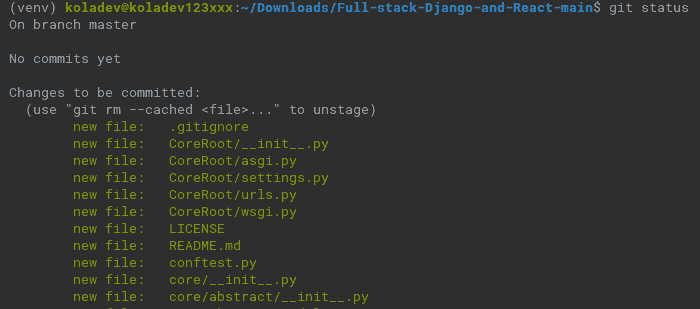

图 12.1 – 运行 git status 命令

我们现在可以运行`git commit`命令。提交是将源代码的最新更改写入版本控制系统历史记录的操作。在我们的例子中，使用`git commit`命令将保存更改到本地仓库：

```py
git commit
```

上述命令将提示您在终端或应用程序中的文本编辑器中输入消息。无论哪种方式，您都需要输入一条消息。输入有意义的消息很重要，因为这条消息将显示在源代码更改的历史记录中。如果您想输入以下行：

```py
Initialize git in API project
```

保存消息后，您可以使用`git log`命令检查 Git 历史记录：

```py
git log
```

您将看到以下类似图示：

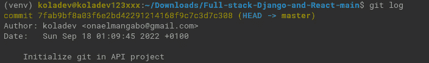

图 12.2 – 编写提交信息

重要提示

编写有意义的提交信息很重要，尤其是在团队或协作环境中。您可以在[`www.conventionalcommits.org/en/v1.0.0/`](https://www.conventionalcommits.org/en/v1.0.0/)了解更多关于提交信息的内容。

项目仓库已在本地初始化；然而，我们希望代码在 GitHub 上。下一节将向您展示如何上传您的代码到 GitHub。

### 上传代码到 GitHub

GitHub 是一个用于协作和版本控制的代码托管平台。它帮助世界各地的开发者共同工作，实际上是大多数流行开源项目的代码托管平台。

在您的 GitHub 账户仪表板上，在导航栏中，创建一个新的仓库：


图 12.3 – 在 GitHub 上创建仓库

完成后，您将被重定向到一个新页面，以输入有关仓库的基本信息，例如仓库名称和描述，说明仓库是公开的还是私有的，以及添加许可证或`.gitignore`文件。仓库名称是必需的，其他信息是可选的。

您现在可以创建仓库，您将看到类似以下页面：

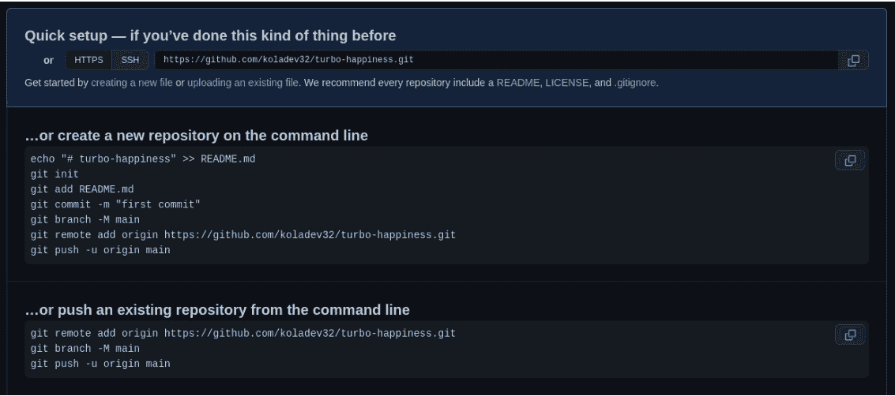

图 12.4 – 创建的仓库

我们有一个现有的仓库，我们希望将其推送到 GitHub 平台。让我们按照**…或从命令行推送现有仓库**的步骤进行。在您的后端项目目录中，打开一个新的终端，让我们输入 shell 命令：

```py
git remote add origin your_repository_git_url
```

`git remote`命令允许您创建、查看和删除连接到互联网或另一个网络上的 Git 仓库。在上面的命令中，我们正在添加 GitHub 仓库的远程仓库 URL。让我们更改我们正在工作的分支名称：

```py
git branch -M main
```

默认情况下，当在本地机器上使用 Git 创建仓库时，工作分支被称作 master。Git 中的分支是什么？

嗯，这只是主仓库的一个独立版本。这允许多个开发者共同工作在同一个项目上。例如，如果你与一个想要在帖子及评论中添加文件上传支持的后端开发者合作，开发者可以直接在主分支上创建一个新的分支（`feature/images-post`），而不是直接在主分支上工作。在这个分支上的工作完成后，`feature/images-post` 分支可以与主分支合并。

主分支创建后，我们现在可以将更改推送到 GitHub：

```py
git push -u origin main
```

`git push` 命令用于将本地仓库的源代码更改上传到远程仓库。在你的情况下，该命令将把当前代码推送到你的 GitHub 仓库 URL。

在 GitHub 上重新加载仓库页面，你会看到类似以下内容：

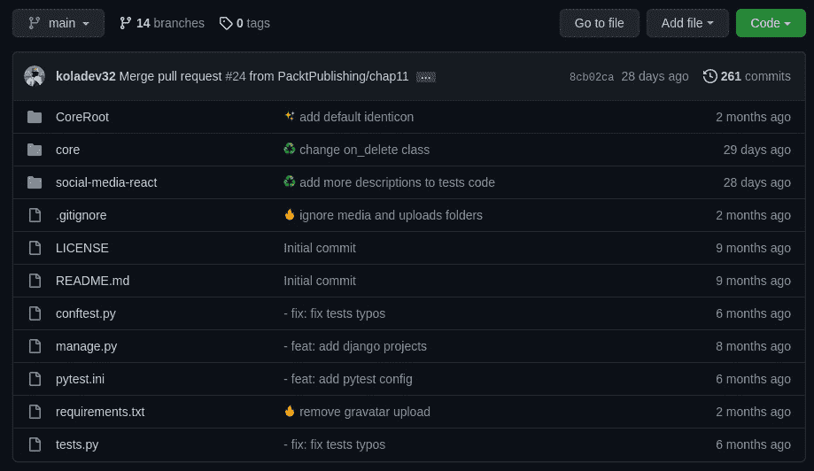

图 12.5 – 代码推送到仓库

哇！我们已经将代码上传到 GitHub。但这只是代码。如果你能在任何地方访问的远程服务器上运行它怎么办？

让我们谈谈网络应用程序部署的平台，并在 AWS 上部署 Django 后端。

## 网络应用程序部署平台

随着软件开发复杂性的增加和每年更多创新和数据处理密集型应用的演变或创建，出现了大量服务，允许团队轻松地将他们的产品部署到互联网上并进行扩展。这创造了一种新的服务类型：云计算：通过互联网按需交付 IT 资源，采用按使用付费的定价模式。

在这本书中，我们将部署 AWS 上的后端，主要是在一个 **弹性计算云**（**EC2**）实例上，这只是一个 VPS 的花哨名称。实际上，AWS EC2 实例是亚马逊 EC2 中的一个虚拟服务器，用于运行网络应用程序。让我们先创建 AWS 服务器。

重要提示

以下步骤适用于任何 VPS，而不仅仅是 AWS VPS。如果你在 AWS 上无法创建 VPS，你可以查看其他解决方案，如 Linode、**谷歌云平台**（**GCP**）、Azure 或 IBM。它们提供免费信用额度，你可以用来了解它们的服务。

## 创建 EC2 实例

按照以下步骤创建 EC2 实例：

1.  确保你已经登录到你的 AWS 账户。在仪表板上，打开 EC2 控制台：

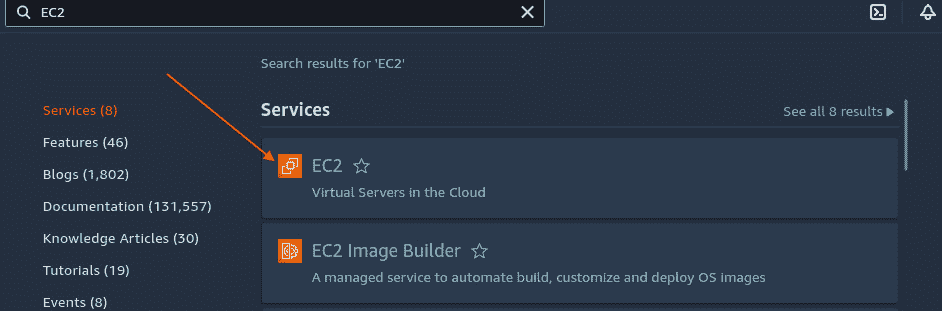

图 12.6 – 访问 EC2 控制台

1.  在 EC2 控制台中，启动一个新的实例：

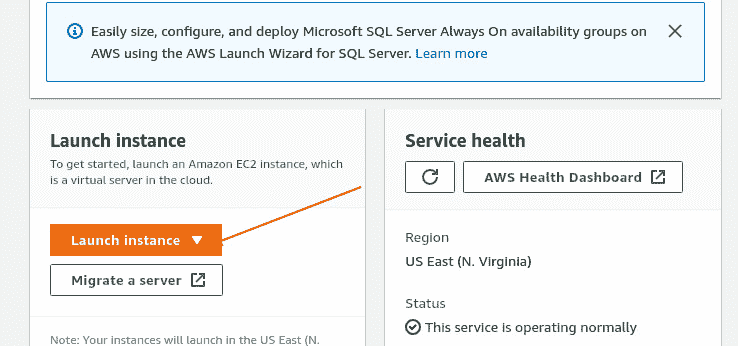

图 12.7 – 创建 EC2 实例

你将看到一个页面，你需要配置实例。

1.  输入实例名称：

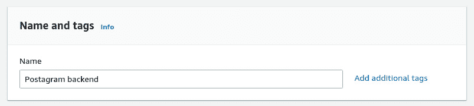

图 12.8 – 命名 EC2 实例

1.  下一步是选择操作系统。我们将使用**Ubuntu Server 22.04 LTS**作为**亚马逊机器****镜像**（**AMI**）：

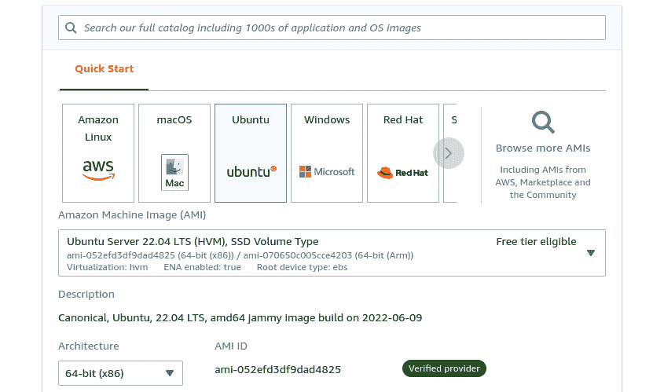

图 12.9 – 在 EC2 实例上选择操作系统

我们在这里使用 Ubuntu，因为它具有安全性、多功能性和定期更新的政策。然而，您也可以自由使用您熟悉的任何其他 Linux 发行版。

1.  最后，您需要设置实例类型并为**Secure Shell**（**SSH**）登录创建一对密钥。之后，您可以启动实例：

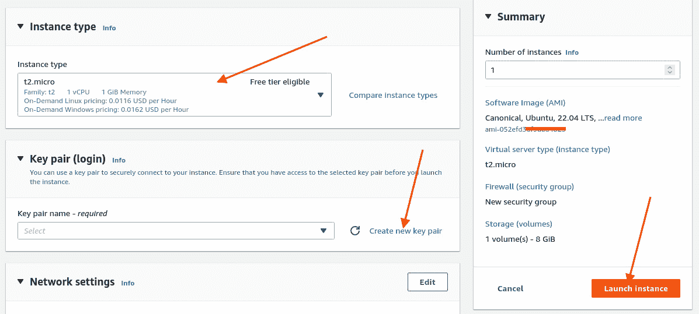

图 12.10 – 启动实例

1.  稍等片刻，实例将被创建：

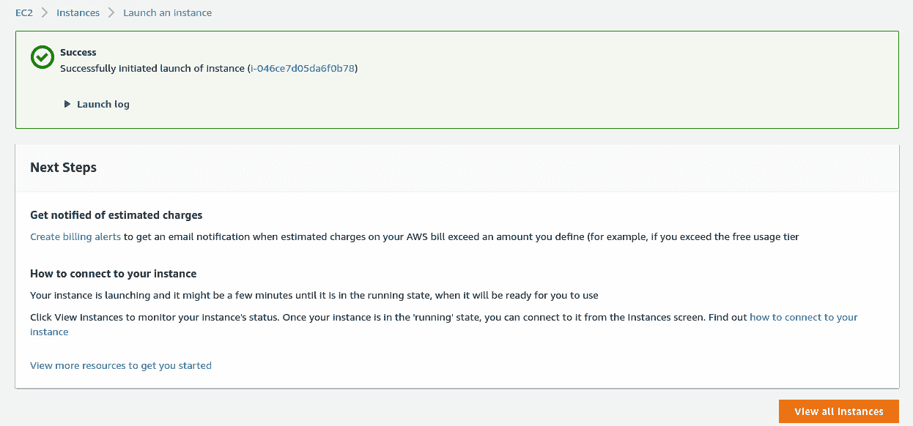

图 12.11 – 实例已创建

1.  点击**查看所有实例**按钮，您将看到创建的 Postagram 实例。

1.  点击实例名称旁边的复选框，然后点击**连接**按钮：

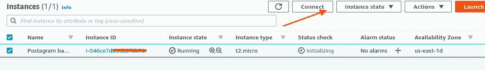

图 12.12 – 连接到 EC2 实例

这将带您到一个页面，其中包含通过 SSH 连接所需的信息和步骤

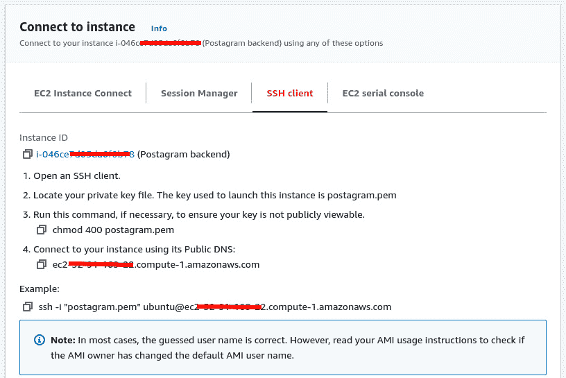

图 12.13 – 通过 SSH 连接到 EC2 实例

1.  在您的终端中，键入以下命令通过 SSH 连接：

    ```py
    ssh -i path/to/your_keypair.pem ec2-user@ipaddress
    ```

1.  一旦连接到服务器，我们将配置它以在机器上运行 Django 后端，并可以从互联网访问：

    ```py
    sudo apt update
    ```

    ```py
    sudo apt upgrade
    ```

前面的命令更新了 Ubuntu 软件包的`apt`索引，并升级了服务器上的所有软件包。

Django 项目将在机器的`8000`端口上运行，因此我们必须允许对此端口的连接。默认情况下，EC2 实例将只允许通过`80`端口进行 HTTP 请求的连接，`22`端口进行 SSH 连接，有时通过`443`端口进行**Secure Sockets Layer**（**SSL**）连接。

您可以直接在创建的 EC2 实例的**详情**页面允许端口`8000`的连接，以访问页面底部选项卡列表中的**安全**设置组：

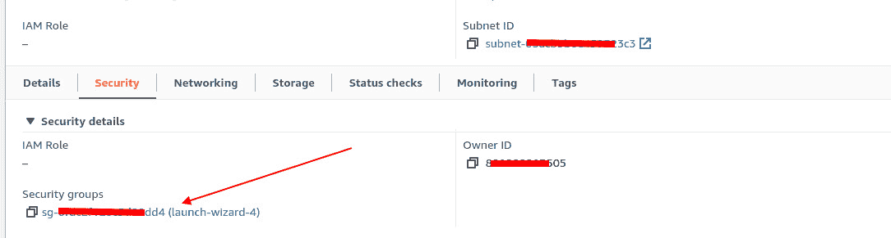

图 12.14 – 安全选项卡

在安全组设置中，访问**操作**菜单并点击**编辑入站****规则**。您将可以访问一个页面，您可以在此添加一条新规则，如下所示：

+   连接类型设置为**自定义 TCP**

+   端口范围设置为`8000`

+   源设置为`0.0.0.0`，表示所有请求应重定向到端口`8000`上的机器

+   最后，添加一个默认描述，以免忘记我们添加此规则的原因

点击`8000`：

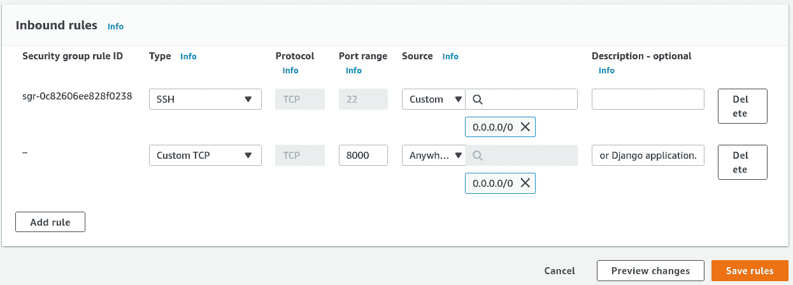

图 12.15 – 添加新的安全规则

服务器现在已准备好工作，我们可以现在运行 Django 后端应用程序。让我们在以下部分中查看下一步。

## 配置 Django 项目的服务器

Django 项目的源代码托管在 GitHub 上。直接使用 `scp` 从您的机器复制代码到远程机器是完全可能的，但让我们使用 Git，因为这将是我们工作流程中的重要命令。在远程实例的终端中，输入以下命令：

```py
git clone your_repository_git_url
```

在我的情况下，我正在使用以下存储库进行此项目：

```py
git clone https://github.com/PacktPublishing/Full-stack-Django-and-React.git –branch chap12
```

`git clone` 命令用于从互联网上的远程机器或另一个网络上的远程机器获取现有存储库的副本。`–branch` 标志用于指定您想要克隆的特定分支。

重要提示

由于我正在使用本书项目的存储库进行工作，当前的代码和操作都是在 `chap12` 分支上。在您的案例中，如果您正在使用自己的存储库，您可能不需要使用 `–branch` 标志。此外，根据 GitHub 存储库是私有还是公共，如果存储库是私有的，您才需要输入您的 GitHub 凭据。

`git clone` 命令将在新目录中克隆项目的所有内容。进入新创建的目录，让我们开始配置项目。我们将遵循在 *第一章* 中完成的步骤，即 *创建 Django 项目*，直到创建 Django 项目：

1.  首先，使用以下命令创建一个虚拟环境：

    ```py
    python3 -m venv venv
    ```

1.  使用以下命令激活虚拟环境：

    ```py
    source venv/bin/activate
    ```

1.  让我们安装 `requirements.txt` 文件中的包：

    ```py
    pip install -r requirements.txt
    ```

太好了！项目已准备就绪，但我们需要配置一个 Postgres 服务器，以便 Django 项目可以运行。

## Postgres 配置和部署

在本书的 *创建 Django 项目* 的 *第一章* 中，我们通过直接安装可执行文件或构建源代码来配置 Postgres。在 EC2 实例上，我们将直接使用 `apt` 工具安装 Postgres 服务器。您可以根据以下步骤在 EC2 机器上安装 Postgres 服务器：

1.  输入以下命令安装 Postgres 服务器：

    ```py
    sudo apt install postgresql-14
    ```

1.  让我们连接到 `psql` 控制台并创建一个数据库：

    ```py
    sudo su postgres 
    ```

    ```py
    psql
    ```

1.  太好了！让我们在 `CoreRoot/settings.py` 文件中的 `DATABASES` 设置上创建具有相同信息的数据库：

CoreRoot/settings.py

```py
...
DATABASES = {
    'default': {
        'ENGINE':
          'django.db.backends.postgresql_psycopg2',
        'NAME': coredb,
        'USER': 'core',
        'PASSWORD': 'wCh29&HE&T83',
        'HOST': 'localhost',
        'PORT': '5342',
    }
}
...
```

1.  在 `psql` 控制台上输入以下命令以创建 `coredb` 数据库：

    ```py
    CREATE DATABASE coredb;
    ```

1.  要连接到数据库，我们需要一个带有密码的用户。执行以下命令：

    ```py
    CREATE USER core WITH PASSWORD 'wCh29&HE&T83';
    ```

1.  下一步是授予新用户对数据库的访问权限：

    ```py
    GRANT ALL PRIVILEGES ON DATABASE coredb TO core;
    ```

1.  我们几乎完成了。我们还需要确保此用户可以创建数据库。当我们运行测试时，这将非常有用。要运行测试，Django 将配置一个完整的环境，但也会使用数据库：

    ```py
    GRANT CREATE PRIVILEGE TO core;
    ```

我们已经完成了数据库的创建。接下来，让我们将此数据库连接到我们的 Django 项目：

1.  在项目目录中运行`migrate`命令：

    ```py
    python manage.py migrate.
    ```

1.  `migrate`命令应该通过，现在我们可以通过运行以下命令来启动 Django 服务器：

    ```py
    python manage.py runserver 0.0.0.0:8000
    ```

1.  Django 服务器运行后，在你的网页浏览器中访问`http://public_ip:8000`以访问你的 Django 项目。你将看到一个类似于以下图所示的页面：

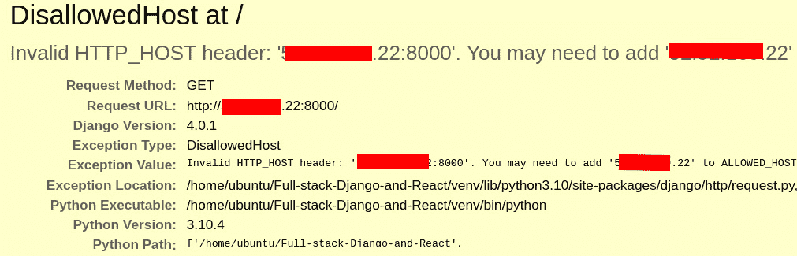

图 12.16 – 不允许的主机错误

这实际上是一个错误。这是由于`ALLOWED_HOSTS`设置为空导致的。这是 Django 为了防止诸如 HTTP 主机头攻击等安全漏洞而实现的。`ALLOWED_HOSTS`设置包含 Django 可以服务的主机名或域名列表：

CoreRoot/settings.py

```py
...
ALLOWED_HOSTS = []
...
```

1.  由于我们是从终端运行项目，让我们直接在服务器上修改设置文件：

    ```py
    vim CoreRoot/settings.py
    ```

或者，你可以使用`emacs`或`nano`命令。由你决定。以下行告诉 Django 接受来自任何主机名的请求：

CoreRoot/settings.py

```py
...
ALLOWED_HOSTS = ["*"]
...
```

1.  保存文件并再次启动服务器：

    ```py
    python manage.py runserver 0.0.0.0:8000
    ```

1.  然后，再次，在你的网页浏览器中访问`http://public_ip:8000`。你会看到以下内容：

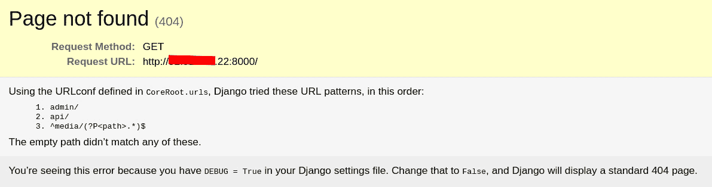

图 12.17 – DisallowedHost 问题已解决

太好了！项目在互联网上运行良好，你甚至可以使用 Postman 或 Insomnia 等 API 客户端来玩转 API。恭喜！你已经在 AWS EC2 机器上成功部署了你的 Django 应用程序。

然而，我们遇到了很多问题（我们可以在互联网上直接访问调试信息，就像*图 12.17*所示），我们做出了一些危险的决定，例如不通过 HTTPS 提供服务 API 或在整个部署过程中没有正确设置允许的主机。让我们在下一节中探讨这些问题。

## 在 EC2 上部署时犯的错误

我们已经在 AWS 上成功部署了 Django 后端。然而，我决定忽略一些重要的和最佳实践部署，以便我们可以尽快运行 Django 服务器。让我们纠正这一点。让我们从 Django 可以显示给我们的错误开始。在远程服务器的项目终端中，运行以下命令：

```py
python manage.py check –deploy
```

这是前面命令的输出：

```py
System check identified some issues:
WARNINGS:
?: (security.W004) You have not set a value for the SECURE_HSTS_SECONDS setting. If your entire site is served only over SSL, you may want to consider setting a value and enabling HTTP Strict Transport Security. Be sure to read the documentation first; enabling HSTS carelessly can cause serious, irreversible problems.
?: (security.W008) Your SECURE_SSL_REDIRECT setting is not set to True. Unless your site should be available over both SSL and non-SSL connections, you may want to either set this setting True or configure a load balancer or reverse-proxy server to redirect all connections to HTTPS.
?: (security.W009) Your SECRET_KEY has less than 50 characters, less than 5 unique characters, or it's prefixed with 'django-insecure-' indicating that it was generated automatically by Django. Please generate a long and random SECRET_KEY, otherwise many of Django's security-critical features will be vulnerable to attack.
?: (security.W012) SESSION_COOKIE_SECURE is not set to True. Using a secure-only session cookie makes it more difficult for network traffic sniffers to hijack user sessions.
?: (security.W016) You have 'django.middleware.csrf.CsrfViewMiddleware' in your MIDDLEWARE, but you have not set CSRF_COOKIE_SECURE to True. Using a secure-only CSRF cookie makes it more difficult for network traffic sniffers to steal the CSRF token.
?: (security.W018) You should not have DEBUG set to True in deployment.
System check identified 6 issues (0 silenced).
```

这有很多东西。由于我们正在构建一个 API，让我们关注与我们的 API 相关的安全问题：

+   `SECRET_KEY`：这是 Django 中的一个重要设置。它用于所有会话、加密签名甚至`PasswordReset`令牌。为`SECRET_KEY`设置一个已存在的值可能会导致危险的安全问题，如权限提升和远程代码执行。

+   `DEBUG`，设置为`True`。这就是我们能够看到`DisallowedHost`错误的原因。想象一下，一个攻击者遍历你的 API，导致`500`错误，然后能够读取一切。这将非常糟糕。

这些大多是 Django 检测到的错误。在最后一节“Postgres 配置和部署”中，我们通过让 Django 允许 Host 头中出现的任何主机名来解决 `DisallowedHost` 错误。嗯，这实际上是不好的，因为它可能导致 HTTP 主机头攻击，这是一种用于网络缓存投毒、邮件链接投毒以及修改敏感操作（如密码重置）的技术。

重要注意事项

你可以在 [`www.invicti.com/web-vulnerability-scanner/vulnerabilities/http-header-injection/`](https://www.invicti.com/web-vulnerability-scanner/vulnerabilities/http-header-injection/) 上了解更多关于 HTTP 主机头攻击的信息。

还有一些与开发者体验相关的问题。确实，我们已经看到了如何使用 Git 和 GitHub 在线托管源代码，将其克隆到远程服务器上，然后配置它以进行部署。你可以重复同样的过程，对吧？但是，当你每天需要多次更新功能或修复代码时会发生什么呢？这可能会很快变得令人疲惫，因此我们需要在我们的 EC2 服务器上实现自动化部署的解决方案。

此外，我们还有 Postgres，最后，Django 项目是独立运行的。有时，可能会有需要将另一个服务添加到机器上的时刻。这可以手动完成，但会引发一个问题：生产环境开始与开发环境不同。

确保开发环境和生产环境尽可能相似是一个重要的习惯；这可以使错误的重现更容易，同时也有助于功能的开发可预测。

所有这些问题都将在下一章中解决。你将了解环境变量、Docker、NGINX 以及 GitHub Actions 中的持续集成/持续部署（CI/CD）概念。

# 摘要

在本章中，我们已经在 EC2 实例上成功部署了一个 Django 应用程序。在部署 Django 应用程序之前，我们使用 Git 在本地机器上创建了一个仓库，然后在 GitHub 上创建了一个远程仓库并将更改推送到线上。

我们还学习了如何通过安装如 Postgres 服务器等基本和有趣的工具手动配置服务器以进行部署。我们还探讨了在部署应用程序时出现的错误以及我们将在以下章节中如何解决这些错误。

这些错误将在下一章中解决，但首先，我们将在下一章中学习更多关于环境变量和 Docker 的知识。

# 问题

1.  Git 分支的用途是什么？

1.  Git 和 GitHub 之间有什么区别？

1.  什么是 HTTP 主机头攻击？

1.  Django 中的 `SECRET_KEY` 有什么用途？
