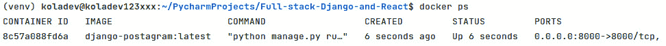
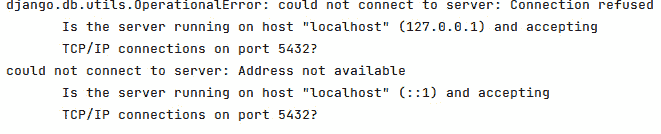
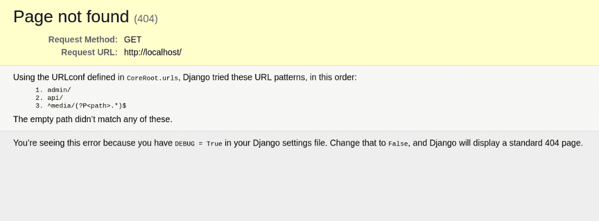

# 第十三章：将 Django 项目 Docker 化

在上一章中，我们学习了更多关于软件部署的知识，并在 AWS 服务器上部署了 Django 应用程序。然而，我们遇到了一些问题，比如项目部署准备不足、违反了一些安全问题和部署及开发配置。

在本章中，我们将学习如何在 Django 后端使用 Docker 并配置环境变量。我们还将使用 **Docker** 在名为 **NGINX** 的 Web 服务器上配置数据库。以下是本章的主要部分：

+   什么是 Docker？

+   将 Django 应用程序 Docker 化

+   使用 Docker Compose 对多个容器进行操作

+   在 Django 中配置环境变量

+   编写 NGINX 配置

# 技术要求

对于本章，您需要在您的机器上安装 Docker 和 Docker Compose。Docker 官方文档对任何操作系统平台的安装过程都有详细的说明。您可以在[`docs.docker.com/engine/install/`](https://docs.docker.com/engine/install/)查看。

本章中编写的代码也可以在[`github.com/PacktPublishing/Full-stack-Django-and-React/tree/chap13`](https://github.com/PacktPublishing/Full-stack-Django-and-React/tree/chap13)找到。

# 什么是 Docker？

在定义 **Docker** 之前，我们必须了解容器是什么以及它在当今技术生态系统中的重要性。为了简单起见，容器是一个标准的软件单元，它将软件及其所有必需的依赖项打包起来，以便软件或应用程序可以从一台机器快速且可靠地运行到另一台机器，无论环境或操作系统如何。

来自 2013 年 *PyCon* 谈话的所罗门·海克斯的一个有趣的定义是：容器是“*你可以从服务器那里发送到服务器那里的自包含的软件单元，从你的笔记本电脑到 EC2 到裸机巨型服务器，它将以相同的方式运行，因为它在进程级别上是隔离的，并且拥有自己的* *文件系统*。”

重要提示

容器化与虚拟化不同。虚拟化使团队能够在同一硬件上运行多个操作系统，而容器化允许团队在单个硬件上使用自己的镜像和依赖项，在相同的操作系统上部署多个应用程序。

太好了，对吧？记得这本书的开头，我们不得不根据操作系统进行配置和安装，主要是针对 Python 可执行文件、Postgres 服务器以及创建和激活虚拟环境的各种命令吗？使用 Docker，我们可以为容器设置一个单一的配置，并且这个配置可以在任何机器上运行。Docker 确保您的应用程序可以在任何环境中执行。然后，我们可以说 Docker 是一个用于在容器内构建、开发和部署应用程序的软件平台。它有以下优点：

+   **简约且便携**：与需要完整操作系统、应用程序和依赖项副本的虚拟机（VMs）相比，这些可以占用大量空间，而 Docker 容器由于使用的镜像大小仅为 **兆字节（MB**），因此所需的存储空间更少。这使得它们启动速度快，易于在小型设备（如树莓派嵌入式计算机）上便携。

+   **Docker 容器可扩展**：因为它们轻量级，开发人员或 DevOps 可以基于容器启动大量服务，并使用 Kubernetes 等工具轻松控制扩展。

+   **Docker 容器安全**：Docker 容器中的应用程序是相互隔离运行的。因此，一个容器无法检查另一个容器中正在运行的过程。

在更好地理解了 Docker 是什么之后，我们现在可以继续将 Docker 集成到 Django 应用程序中。

# 将 Django 应用程序 Docker 化

在上一节中，我们定义了 Docker 及其优势。在本节中，我们将配置 Docker 以与 Django 应用程序一起使用。这将帮助你更好地理解 Docker 在底层是如何工作的。

## 添加 Docker 镜像

使用 Docker 的项目的一个特点是项目中存在名为 **Dockerfile** 的文件。Dockerfile 是一个包含构建 Docker 镜像所需所有命令的文本文件。Docker 镜像是一个只读模板，包含创建 Docker 容器的指令。

使用 Dockerfile 创建镜像是最流行的方法，因为你只需输入设置环境、安装包、执行迁移等所需的指令。这就是 Docker 非常便携的原因。例如，在我们的 Django 应用程序的情况下，我们将基于基于 Python `3.10` 的现有镜像编写 Dockerfile，该镜像基于流行的 Alpine Linux 项目 ([`alpinelinux.org/`](https://alpinelinux.org/))。选择这个镜像是因为它的大小很小，仅等于 5 MB。在 Dockerfile 中，我们还将添加安装 Python 和 Postgres 依赖项的命令，并进一步添加安装包的命令。让我们从以下步骤开始：

1.  首先，在 Django 项目的根目录下创建一个名为 `Dockerfile` 的新文件，并添加第一行：

Dockerfile

```py
FROM python:3.10-alpine
# pull official base image
```

大多数 `Dockerfile` 都以这一行开始。在这里，我们告诉 Docker 使用哪个镜像来构建我们的镜像。`python:3.10-alpine` 镜像存储在称为 Docker 仓库的地方。这是一个 Docker 镜像的存储和分发系统，你可以在网上找到最受欢迎的一个，称为 Docker Hub，网址为 [`hub.docker.com/`](https://hub.docker.com/)。

1.  接下来，让我们设置工作目录。这个目录将包含运行中的 Django 项目的代码：

Dockerfile

```py
WORKDIR /app
```

1.  由于 Django 应用程序使用 Postgres 作为数据库，我们将 Postgres 和 Pillow 的所需依赖项添加到我们的 Docker 镜像中：

Dockerfile

```py
# install psycopg2 dependencies
RUN apk update \
    && apk add postgresql-dev gcc python3-dev musl-dev
    jpeg-dev zlib-dev
```

1.  然后，在 `/app` 工作目录中复制 `requirements.txt` 文件后，安装 Python 依赖项：

Dockerfile

```py
# install python dependencies
COPY requirements.txt /app/requirements.txt
RUN pip install --upgrade pip
RUN pip install --no-cache-dir -r requirements.txt
```

1.  之后，复制整个项目：

Dockerfile

```py
# add app
COPY . .
```

1.  最后，将容器的 `8000` 端口暴露出来，以便其他应用程序或机器可以访问，运行迁移，并启动 Django 服务器：

Dockerfile

```py
EXPOSE 8000
CMD ["python", "manage.py", "migrate"]
CMD ["python", "manage.py", "runserver", "0.0.0.0:8000"]
```

`Dockerfile` 文件将包含以下最终代码：

Dockerfile

```py
# pull official base image
FROM python:3.10-alpine
# set work directory
WORKDIR /app
# set environment variables
ENV PYTHONDONTWRITEBYTECODE 1
ENV PYTHONUNBUFFERED 1
# install psycopg2 dependencies
RUN apk update \
   && apk add postgresql-dev gcc python3-dev musl-dev
# install python dependencies
COPY requirements.txt /app/requirements.txt
RUN pip install --upgrade pip
RUN pip install --no-cache-dir -r requirements.txt
# copy project
COPY . .
EXPOSE 8000
CMD ["python", "manage.py", "migrate"]
CMD ["python", "manage.py", "runserver", "0.0.0.0:8000"]
```

我们刚刚写下了构建 Django 应用程序镜像的步骤。让我们使用以下命令构建镜像。

```py
docker build -t django-postagram .
```

前面的命令使用 `Dockerfile` 构建一个新的容器镜像——这就是为什么命令末尾有一个点（`.`）的原因。它告诉 Docker 在当前目录中查找 `Dockerfile`。`-t` 标志用于标记容器镜像。然后，我们使用我们编写的 `Dockerfile` 构建了一个带有 `django-backend` 标签的镜像。一旦镜像构建完成，我们现在可以通过运行以下命令在容器中运行应用程序：

```py
docker run --name django-postagram -d -p 8000:8000 django-postagram:latest
```

让我们描述一下前面的命令：

+   `--name` 将设置 Docker 容器的名称

+   `-d` 使镜像以分离模式运行，这意味着它可以在后台运行

+   `django-postagram` 指定了要使用的镜像名称

在输入前面的命令后，你可以使用以下命令检查正在运行的容器：

```py
docker container ps
```

你将得到类似的输出：



图 13.1 – 列出机器上的 Docker 容器

容器已创建，但看起来它运行得不太好。在你的浏览器中，访问 `http://localhost:8000`，你会注意到浏览器返回了一个错误页面。让我们检查 `django-postagram` 容器的日志：

```py
docker logs --details django-postagram
```

命令将在终端中输出容器内部正在发生的事情。你将得到类似的输出：



图 13.2 – django-postagram 容器的日志

嗯，这是很正常的。容器正在自己的网络上运行，并且无法直接访问主机机器的网络。

在上一章中，我们为 NGINX 和 Postgres 添加了服务并进行了配置。我们还需要为 NGINX 和 Postgres 的 `Dockerfile` 做同样的事情。坦白说：这开始变得有点多了。想象一下添加一个 Flask 服务、一个 Celery 服务，甚至是另一个数据库。根据你系统组件的**数量 n**，你需要 `n` 个 Dockerfile。这并不有趣，但幸运的是，Docker 提供了一个简单的解决方案，称为 Docker Compose。让我们更深入地了解一下。

# 使用 Docker Compose 进行多个容器

Docker Compose 是 Docker 团队开发和创建的工具，用于帮助定义多容器应用程序的配置。使用 Docker Compose，我们只需创建一个 YAML 文件来定义服务和启动每个服务的命令。它还支持容器名称、环境设置、卷等配置，一旦编写了 YAML 文件，您只需一个命令来构建镜像并启动所有服务。

让我们了解 Dockerfile 和 Docker Compose 之间的关键区别：Dockerfile 描述了如何构建镜像和运行容器，而 Docker Compose 用于运行 Docker 容器。最终，Docker Compose 仍然在底层使用 Docker，您通常至少需要一个 Dockerfile。让我们将 Docker Compose 集成到我们的工作流程中。

## 编写 docker-compose.yaml 文件

在编写 YAML 文件之前，我们不得不对 `Dockerfile` 进行一些修改。由于我们将从 `docker-compose` 文件中启动 Django 服务器，我们可以删除暴露端口、运行迁移和启动服务的那几行代码。在 `Dockerfile` 中删除以下代码行：

Dockerfile

```py
EXPOSE 8000
CMD ["python", "manage.py", "migrate"]
CMD ["python", "manage.py", "runserver", "0.0.0.0:8000"]
```

一旦完成，请在项目的根目录下创建一个名为 `docker-compose.yaml` 的新文件。确保 `docker-compose.yaml` 文件和 `Dockerfile` 在同一目录下。`docker-compose.yaml` 文件将描述后端应用程序的服务。我们需要编写三个服务：

+   **NGINX**: 我们正在使用 NGINX 作为 Web 服务器。幸运的是，有一个官方镜像可供我们使用，以便快速编写配置。

+   **Postgres**: 对于 Postgres，也有一个官方镜像可用。我们只需添加数据库用户的环境变量即可。

+   `django-backend`: 这是我们所创建的后端应用程序。我们将使用 `Dockerfile`，这样 Docker Compose 就会为这个服务构建镜像。

让我们从添加 NGINX 服务开始编写 `docker-compose.yaml` 文件：

docker-compose.yaml

```py
version: '3.8'
services:
 nginx:
   container_name: postagram_web
   restart: always
   image: nginx:latest
   volumes:
     - ./nginx.conf:/etc/nginx/conf.d/default.conf
     - uploads_volume:/app/uploads
   ports:
     - "80:80"
   depends_on:
     - api
```

让我们看看前面的代码中发生了什么，因为其他服务将遵循类似的配置。第一行设置了我们使用的文件格式，因此它与 Docker Compose 无关，只是与 YAML 相关。

之后，我们添加一个名为 `nginx` 的服务：

+   `container_name` 表示，嗯，容器的名称。

+   `restart` 定义了容器重启策略。在这种情况下，如果容器失败，则始终重启。

关于容器的重启策略，您还可以有：

+   `no`: 容器不会自动重启

+   `on-failure[:max-retries]`: 如果容器以非零退出代码退出，则重启容器，并为 Docker 守护进程重启容器提供最大尝试次数

+   `unless-stopped`: 如果容器不是被任意停止或由 Docker 守护进程停止，则始终重启容器

+   `image`: 这告诉 Docker Compose 使用 Docker Hub 上可用的最新 NGINX 镜像。

+   `volumes` 是一种持久化 Docker 容器生成和使用的数据的手段。如果删除或移除 Docker 容器，其所有内容将永远消失。如果你有日志、图像、视频或任何希望持久化到某处的文件，这并不是一个好的选择，因为每次你移除一个容器，这些数据都会消失。以下是语法：`/host/path:/container/path`。

+   `ports`: 来自主机端口 `80` 的连接请求被重定向到容器端口 `80`。以下是语法：`host_port:container_port`。

+   `depends_on`: 这告诉 Docker Compose 在启动服务之前等待某些服务启动。在我们的例子中，我们正在等待 Django API 启动后再启动 NGINX 服务器。

太好了！接下来，让我们添加 Postgres 服务的服务配置：

docker-compose.yaml

```py
db:
 container_name: postagram_db
 image: postgres:14.3-alpine
 env_file: .env
 volumes:
   - postgres_data:/var/lib/postgresql/data/
```

我们这里有一些新的参数，称为 `env_file`，它指定了用于创建数据库和用户以及设置密码的环境文件的路径。让我们最后添加 Django API 服务：

docker-compose.yaml

```py
api:
 container_name: postagram_api
 build: .
 restart: always
 env_file: .env
 ports:
   - "8000:8000"
 command: >
   sh -c "python manage.py migrate --no-input && gunicorn
          CoreRoot.wsgi:application --bind 0.0.0.0:8000"
 volumes:
  - .:/app
  - uploads_volume:/app/uploads
 depends_on:
  - db
```

Docker Compose 文件中的构建参数告诉 Docker Compose 在哪里查找 `Dockerfile`。在我们的例子中，`Dockerfile` 在当前目录中。Docker Compose 允许你有一个 `command` 参数。在这里，我们正在运行迁移并使用 Gunicorn 启动 Django 服务器，这是新的。`gunicorn` 是一个 Python `gunicorn`？大多数网络应用程序都使用 Apache 服务器，所以 `gunicorn` 主要是为了运行用 Python 构建的 Web 应用程序。

你可以通过运行以下命令在你的当前 Python 环境中安装包：

```py
pip install gunicorn
```

但是，你需要将依赖项放入 `requirements.txt` 文件中，以便在 Docker 镜像中预先设置：

requirements.txt

```py
gunicorn==20.1.0
```

最后，我们需要在文件末尾声明使用的卷：

docker-compose.yaml

```py
volumes:
 uploads_volume:
 postgres_data:
```

我们刚刚编写了一个 `docker-compose.yaml` 文件。由于我们将在项目中使用环境变量，让我们在 `settings.py` 文件中更新一些变量。

# 在 Django 中配置环境变量

在代码中保留关于你的应用程序的敏感信息是一个坏习惯。对于项目中的 `settings.py` 文件中的 `SECRET_KEY` 设置和数据库设置来说，情况就是这样。这相当糟糕，因为我们已经把代码推送到 GitHub 上了。让我们纠正这个错误。

环境变量是一个其值在程序运行代码之外设置的变量。使用 Python，你可以从 `.env` 文件中读取文件。我们将使用 `os` 库来编写配置。所以，首先，在 Django 项目的根目录下创建一个 `.env` 文件，并添加以下内容：

.env

```py
SECRET_KEY=foo
DATABASE_NAME=coredb
DATABASE_USER=core
DATABASE_PASSWORD=wCh29&HE&T83
DATABASE_HOST=postagram_db
DATABASE_PORT=5432
POSTGRES_USER=core
POSTGRES_PASSWORD=wCh29&HE&T83
POSTGRES_DB=coredb
ENV=DEV
DJANGO_ALLOWED_HOSTS=127.0.0.1,localhost
```

重要提示

`SECRET_KEY` 是你的 Django 项目中的一个重要变量，所以你需要确保你有一个长且复杂的字符链作为其值。你可以访问 [`djecrety.ir/`](https://djecrety.ir/) 生成一个新的字符链。

下一步是安装一个用于帮助您管理环境变量的包。这个包叫做 `python-dotenv`，它可以帮助 Python 开发者从 `.env` 文件中读取环境变量并将它们设置为环境变量。如果您打算在您的机器上再次运行项目，那么请使用以下命令将该包添加到您的实际 Python 环境中：

```py
pip install python-dotenv
```

最后，将包添加到 `requirements.txt` 文件中，以便它可以在 Docker 镜像中安装。下面是 `requirements.txt` 文件的内容：

```py
Django==4.0.1
psycopg2-binary==2.9.3
djangorestframework==3.13.1
django-filter==21.1
pillow==9.0.0
djangorestframework-simplejwt==5.0.0
drf-nested-routers==0.93.4
pytest-django==4.5.2
django-cors-headers==3.11.0
python-dotenv==0.20.0
gunicorn==20.1.0
```

一旦安装了 `python-dotenv` 包，我们就需要在 `CoreRoot/settings.py` 文件中编写一些代码。在这个文件中，我们将导入 `python-dotenv` 包并修改一些设置的语法，以便它能够支持读取环境变量：

CoreRoot/settings.py

```py
from dotenv import load_dotenv
load_dotenv()
```

让我们重写 `SECRET_KEY`、`DEBUG`、`ALLOWED_HOSTS` 和 `ENV` 等变量的值：

CoreRoot/settings.py

```py
ENV = os.environ.get("ENV")
# SECURITY WARNING: keep the secret key used in production secret!
SECRET_KEY = os.environ.get(
   "SECRET_KEY", default=
     "qkl+xdr8aimpf-&x(mi7)dwt^-q77aji#j*d#02-5usa32r9!y"
)
# SECURITY WARNING: don't run with debug turned on in production!
DEBUG = False if ENV == "PROD" else True
ALLOWED_HOSTS = os.environ.get("DJANGO_ALLOWED_HOSTS", default="*").split(",")
```

`os` 包提供了一个对象来从用户机器检索环境变量。在 `python-dotenv` 强制加载环境变量之后，我们使用 `os.environ` 从 `.env` 文件中读取值。最后，让我们添加 `DATABASES` 设置的配置：

CoreRoot/settings.py

```py
DATABASES = {
   "default": {
       "ENGINE": "django.db.backends.postgresql_psycopg2",
       "NAME": os.getenv("DATABASE_NAME", "coredb"),
       "USER": os.getenv("DATABASE_USER", "core"),
       "PASSWORD": os.getenv("DATABASE_PASSWORD",
                             "wCh29&HE&T83"),
       "HOST": os.environ.get("DATABASE_HOST",
                              "localhost"),
       "PORT": os.getenv("DATABASE_PORT", "5432"),
   }
}
```

太好了！我们在 `settings.py` 文件中配置环境变量已经完成。现在我们可以继续编写 NGINX 的配置。

# 编写 NGINX 配置

NGINX 需要我们从侧面提供一些配置。如果机器的 HTTP 端口（默认为 `80`）上有请求，它应该将请求重定向到正在运行的 Django 应用的端口 `8000`。简单来说，我们将编写一个反向代理。代理是一个中介过程，它从客户端接收 HTTP 请求，将请求传递给一个或多个其他服务器，等待这些服务器的响应，然后将响应发送回客户端。

通过使用此过程，我们可以将 HTTP 端口 `80` 上的请求转发到 Django 服务器的端口 `8000`。

在项目的根目录下创建一个名为 `nginx.conf` 的新文件。然后，让我们定义 HTTP 请求将被重定向到的上游服务器：

nginx.conf

```py
upstream webapp {
   server postagram_api:8000;
}
```

上述代码遵循以下简单语法：

```py
upstream upstream_name {
   server host:PORT;
}
```

重要提示

Docker 允许您使用 `defined` 的容器名称来引用容器的宿主机。在 NGINX 文件中，我们使用 `postagram_api` 而不是容器的 IP 地址（它可能会变化），对于数据库，我们使用 `postagram_db`。

下一步是声明 HTTP 服务器的配置：

nginx.conf

```py
server {
   listen 80;
   server_name localhost;
   location / {
       proxy_pass http://webapp;
       proxy_set_header X-Forwarded-For
         $proxy_add_x_forwarded_for;
       proxy_set_header Host $host;
       proxy_redirect off;
   }
   location /media/ {
    alias /app/uploads/;
   }
}
```

在服务器配置中，我们首先设置服务器的端口。在前面的代码中，我们使用端口 `80`。接下来，我们定义位置。在 NGINX 中，位置是一个块，它告诉 NGINX 如何处理来自特定 URL 的请求：

+   `/` URL 上的请求被重定向到 web 应用上游

+   `/media/` URL 上的请求被重定向到 `uploads` 文件夹以提供文件

在 NGINX 配置就绪后，我们现在可以启动容器了。

## 启动 Docker 容器

让我们启动 Docker 容器。由于我们现在使用 Docker Compose 来编排容器，所以让我们使用以下命令来构建和启动容器：

```py
docker compose up -d –build
```

此命令将启动 `docker-compose.yaml` 文件中定义的所有容器。让我们描述一下命令选项：

+   `up`：此选项构建、重新创建并启动容器

+   `-d`：此选项用于分离，意味着我们在后台运行容器

+   `—build`：此标志告诉 Docker Compose 在启动容器之前构建镜像

构建完成后，打开您的浏览器到 `http://localhost`，您应该看到以下内容：



图 13.3 – Docker 化的 Django 应用程序

我们已成功使用 Docker 容器化了 Django 应用程序。在容器内执行命令也是可能的，目前我们可以从在 `postagram_api` 容器中运行测试套件开始：

```py
docker compose exec -T api pytest
```

在 Docker 容器中执行命令的语法是首先调用 `exec` 命令，然后跟 `–T` 参数以禁用 `pseudo-tty` 分配。这意味着在容器内运行的命令将不会连接到终端。最后，您可以添加容器服务名称，然后跟在容器中要执行的命令。

我们离使用 **Docker** 在 AWS 上部署又近了一步，但我们需要自动化它。在下一章中，我们将配置项目以使用 GitHub Actions 自动化 AWS 服务器上的部署。

# 摘要

在本章中，我们学习了如何将 Django 应用程序 Docker 化。我们首先了解了 Docker 以及其在现代应用程序开发中的应用。我们还学习了如何构建 Docker 镜像并使用此镜像运行容器——这使我们了解了使用 Dockerfile 进行 Docker 化的一些限制。这使我们进一步学习了 Docker Compose 以及它如何帮助我们通过一个配置文件管理多个容器。这反过来又引导我们使用 Docker 配置数据库和 NGINX 网络服务器以启动 Postagram API。

在下一章中，我们将为项目配置自动部署到 AWS，并使用我们编写的测试执行回归检查。

# 问题

1.  什么是 Docker？

1.  什么是 Docker Compose？

1.  什么是 Docker 和 Docker Compose 之间的区别？

1.  容器化和虚拟化之间的区别是什么？

1.  什么是环境变量？
