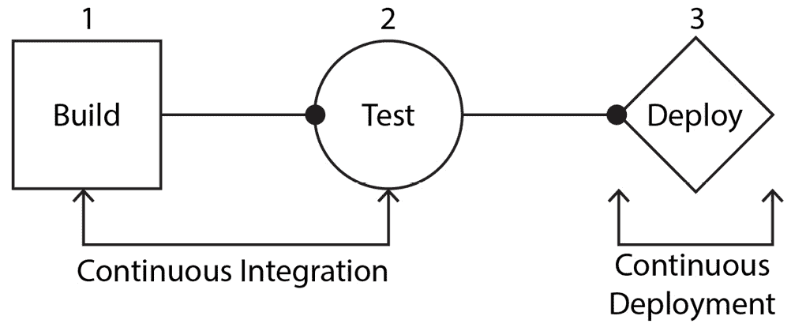
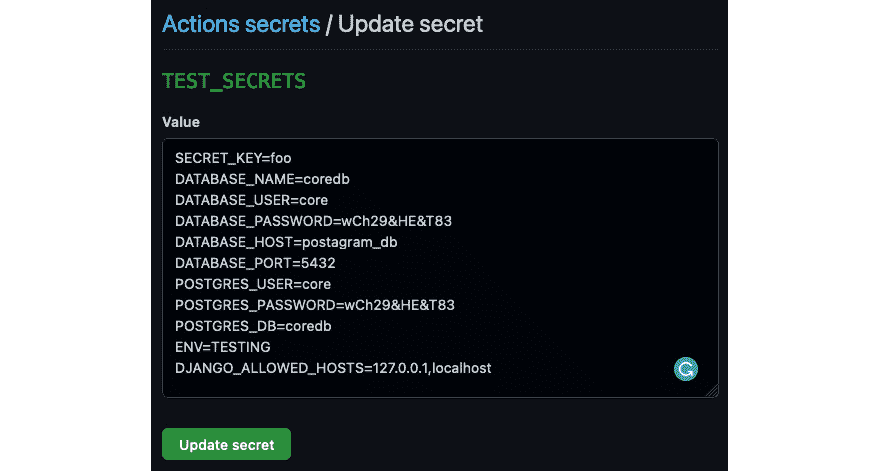
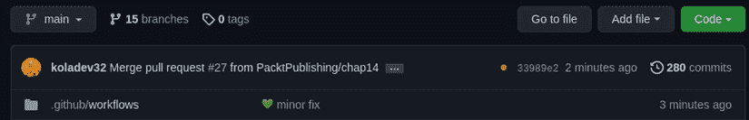
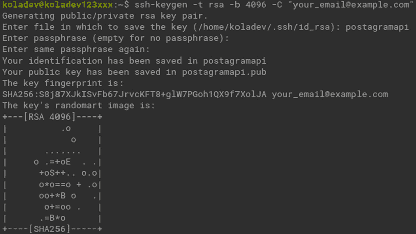
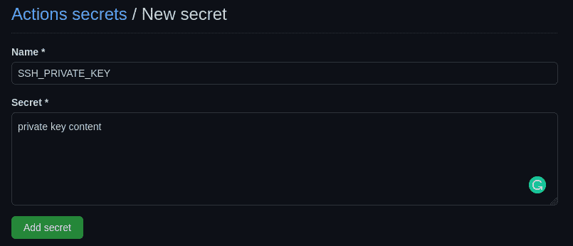
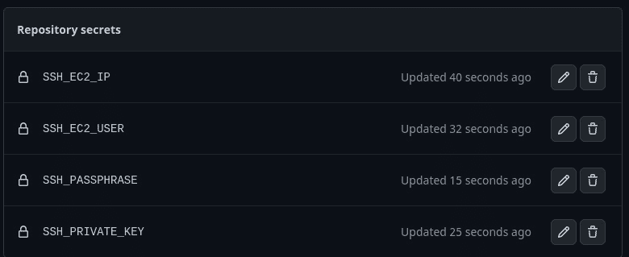
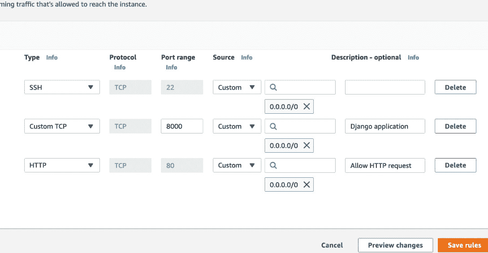

# 14

# 自动化 AWS 部署

在上一章中，我们成功地将 Django 应用部署到了一个 EC2 实例上。然而，大多数部署都是手动完成的，我们在推送应用的新版本时并没有检查回归。有趣的是，所有部署都可以使用 GitHub Actions 自动化。

在本章中，我们将使用 GitHub Actions 自动部署到 AWS EC2 实例上，这样你就不必手动操作了。我们将探讨如何编写一个配置文件，该文件将在代码上运行测试以避免回归，并最终通过 **安全套接字外壳** (**SSH**) 连接到服务器并执行脚本以拉取和构建代码的最新版本以及更新容器。为了回顾，我们将涵盖以下主题：

+   解释 **持续集成和持续** **部署** (**CI/CD**)

+   定义 CI/CD 工作流程

+   什么是 GitHub Actions？

+   配置后端以实现自动化部署

# 技术要求

本章的代码可以在 [`github.com/PacktPublishing/Full-stack-Django-and-React/tree/chap14`](https://github.com/PacktPublishing/Full-stack-Django-and-React/tree/chap14) 找到。如果你使用的是 Windows 机器，请确保你的机器上安装了 OpenSSH 客户端，因为我们将生成 SSH 密钥对。

# 解释 CI/CD

在深入研究 GitHub Actions 之前，我们必须了解 *CI* 和 *CD* 这两个术语。在本节中，我们将了解每个术语并解释它们之间的区别。

## CI

**CI** 是一种自动化将多个协作者的代码更改集成到单个项目中的实践。它还涉及到在任何时候可靠地发布对应用程序所做的更改的能力。没有 CI，我们就需要手动协调部署、将更改集成到应用程序中以及进行安全和回归检查。

这是一个典型的 CI 工作流程：

1.  开发者从主分支创建一个新的分支，进行更改，提交，然后将它推送到分支。

1.  推送完成后，代码会被构建，然后运行自动化测试。

1.  如果自动化测试失败，开发团队会收到通知，并且下一步（通常是部署）会被取消。如果测试成功，那么代码就准备好在预发布或生产环境中部署了。

你可以找到许多用于 CI 管道配置的工具。你拥有 GitHub Actions、Semaphore、Travis CI 等工具。在这本书中，我们将使用 GitHub Actions 来构建 CI 管道，如果 CI 管道通过，我们就可以在 AWS 上部署它。现在让我们更深入地了解 CD。

## CD

**CD** 与 CI 相关，但大多数时候代表 CI 管道成功通过后的下一步。CI 管道的质量（构建和测试）将决定发布的质量。有了 CD，一旦通过了 CI 步骤，软件就会自动部署到预发布或生产环境。

CD 管道的一个例子可能看起来像这样：

1.  开发者创建一个分支，进行修改并推送更改，然后创建一个合并请求。

1.  进行测试和构建以确保没有回归。

1.  代码由另一位开发者进行审查，如果审查完成，则合并请求得到验证，然后进行另一套测试和构建。

1.  之后，更改被部署到预发布或生产环境。

GitHub Actions 以及提到的其他 CI 工具也支持 CD。在更好地理解 CI 和 CD 之后，让我们定义我们将要配置的后端工作流程。

重要提示

如果您更深入地了解 CI/CD，您还会听到 *持续交付* 的概念；它是 *持续部署* 的进一步扩展。持续部署侧重于服务器的部署，而持续交付侧重于发布和发布策略。

# 定义 CI/CD 工作流程

在我们像上一章那样部署应用程序之前，我们需要写下我们将遵循的步骤，以及部署所需的工具。在本章中，我们将自动化 AWS 上的后端部署。基本上，每次我们在存储库的主分支上进行推送时，代码都应该在服务器上更新，并且容器应该更新并重新启动。

再次，让我们定义以下流程：

1.  在服务器的主分支上进行了推送。

1.  构建并启动 Docker 容器以运行测试。如果测试失败，则忽略以下步骤。

1.  我们通过 SSH 连接到服务器，并运行一个脚本来从远程仓库拉取新的更改，构建容器，并使用 `docker-compose` 重新启动服务。

以下图表说明了典型的 CI/CD 工作流程：



图 14.1 – CI/CD 工作流程

这需要手动完成很多事情，幸运的是，GitHub 提供了一个有趣的功能，称为 GitHub Actions。现在我们已经对部署策略有了更好的了解，让我们更深入地探索这个功能。

# 什么是 GitHub Actions？

GitHub Actions 是由 GitHub 构建和开发的服务，用于自动化构建、测试和部署管道。使用 GitHub Actions，我们可以轻松实现如图 14.1 所示的 CI/CD 工作流程。在继续之前，请确保您的项目托管在 GitHub 上。

GitHub Actions 配置在一个文件中，必须存储在存储库中名为 `.github/workflows` 的专用目录中。为了更好的工作流程，我们还将使用 GitHub secrets 来存储部署信息，例如服务器的 IP 地址、SSH 密码短语和服务器用户名。让我们首先了解如何编写 GitHub Actions 工作流程文件。

## 如何编写 GitHub Actions 工作流程文件

工作流程文件存储在名为 `.github/workflows` 的专用目录中。这些文件使用的语法是 YAML 语法，因此工作流程文件具有 `.yml` 扩展名。

让我们更深入地了解工作流程文件的语法：

+   `name`: 这代表工作流程的名称。此名称通过在文件开头放置以下行来设置：

    ```py
    name: Name of the Workflow
    ```

+   `on`: 这指定了将自动触发工作流程的事件。一个事件示例是推送、拉取请求或分支：

    ```py
    on: push
    ```

+   `jobs`: 这指定了工作流程将执行的操作。您可以有多个任务，甚至可以有一些任务相互依赖：

    ```py
    jobs:
    ```

    ```py
     build-test:
    ```

    ```py
       runs-on: ubuntu-latest
    ```

    ```py
       steps:
    ```

    ```py
       - uses: actions/checkout@v2
    ```

    ```py
       - name: Listing files in a directory
    ```

    ```py
         run: ls -a
    ```

在我们的 GitHub Actions 工作流程中，我们将有两个任务：

+   一个名为`build-test`的任务，用于构建 Docker 容器并在其中运行测试

+   一个名为`deploy`的任务，用于将应用程序部署到 AWS 服务器

应用程序的部署将取决于`build-test`任务的失败或成功。这是一种防止代码在生产环境中失败和崩溃的好方法。既然我们已经了解了 GitHub Actions 工作流程、YAML 语法以及我们想要为工作流程编写的任务，那么让我们编写 GitHub Actions 文件并配置服务器以实现自动部署。

# 配置后端以实现自动化部署

在前面的章节中，我们讨论了更多关于 GitHub Actions 文件语法以及我们必须编写的任务，以便为 Django 应用程序添加 CI 和 CD。让我们编写 GitHub Action 文件并配置后端以实现自动部署。

## 添加 GitHub Actions 文件

在项目的根目录下，创建一个名为`.github`的目录，并在该目录内创建另一个名为`workflows`的目录。在`workflows`目录内，创建一个名为`ci-cd.yml`的文件。此文件将包含 GitHub 动作的 YAML 配置。让我们首先定义工作流程的名称和将触发工作流程运行的事件：

.github/workflows/ci-cd.yml

```py
name: Build, Test and Deploy Postagram
on:
 push:
   branches: [ main ]
```

每当主分支上有推送时，工作流程都会运行。让我们继续编写`build-test`任务。对于这个任务，我们将遵循三个步骤：

1.  将环境变量注入到文件中。Docker 需要`.env`文件来构建镜像并启动容器。我们将向 Ubuntu 环境注入虚拟环境变量。

1.  之后，我们将构建容器。

1.  最后，我们在`api`容器上运行测试。

让我们从步骤开始：

1.  让我们从编写任务和注入环境变量开始：

.github/workflows/ci-cd.yml

```py
build-test:
 runs-on: ubuntu-latest
 steps:
 - uses: actions/checkout@v2
 - name: Injecting env vars
   run: |
     echo "SECRET_KEY=test_foo
           DATABASE_NAME=test_coredb
           DATABASE_USER=test_core
           DATABASE_PASSWORD=12345678
           DATABASE_HOST=test_postagram_db
           DATABASE_PORT=5432
           POSTGRES_USER=test_core
           POSTGRES_PASSWORD=12345678
           POSTGRES_DB=test_coredb
           ENV=TESTING
           DJANGO_ALLOWED_HOSTS=127.0.0.1,localhost
            " >> .env
```

测试可能会失败，因为我们还没有定义名为`TEST_SECRETS`的 GitHub 密钥。



图 14.2 – 测试 Github 密钥

1.  接下来，让我们添加构建容器的命令：

.github/workflows/ci-cd.yml

```py
- name: Building containers
 run: |
   docker-compose up -d --build
```

1.  最后，让我们在`api`容器中运行`pytest`命令：

.github/workflows/ci-cd.yml

```py
- name: Running Tests
 run: |
   docker-compose exec -T api pytest
```

太好了！我们已经完全编写了工作流程的第一个任务。

1.  通过运行以下命令来推送代码，并查看它在 GitHub 上的运行情况：

    ```py
    git push
    ```

1.  前往 GitHub 检查您的仓库。您将在仓库详情中看到一个橙色徽章，表示工作流程正在运行：



图 14.3 – 运行 GitHub Actions

1.  点击橙色徽章以获取有关正在运行的流程的更多详细信息。流程应该通过，你将看到一个绿色的状态：


图 14.4 – 成功的 GitHub Action 任务

太好了！我们的 `build-test` 任务已成功运行，这意味着我们的代码可以在生产环境中部署。在编写 `deploy` 任务之前，让我们先为自动部署配置服务器。

## 配置 EC2 实例

是时候回到 EC2 实例并做一些配置，以便简化自动部署。以下是需要完成的任务列表，以便 GitHub Actions 可以自动为我们处理部署：

+   使用密码短语生成一对 SSH 密钥（私钥和公钥）。

+   将公钥添加到服务器的 `authorized_keys`。

+   将私钥添加到 GitHub Secrets 以供 SSH 连接重用。

+   将 EC2 机器操作系统的用户名、IP 地址和 SSH 密码短语注册到 GitHub Secrets。

+   在服务器上添加部署脚本。基本上，该脚本将从 GitHub 拉取代码，检查更改，并最终构建和重新运行容器。

+   将所有内容封装起来并添加 `deploy` 任务。

这看起来有很多步骤，但这里有个好消息：你只需要做一次。让我们先从生成 SSH 凭据开始。

### 生成 SSH 凭据

生成 SSH 密钥的最佳实践是在本地机器上生成，而不是在远程机器上。在接下来的几行中，我们将使用终端命令。如果你在 Windows 机器上工作，请确保已经安装了 OpenSSH 客户端。以下命令是在 Linux 机器上执行的。让我们开始以下步骤：

1.  打开终端并输入以下命令以生成 RSA 密钥对：

    ```py
    ssh-keygen -t rsa -b 4096 -C "your_email@example.com"
    ```



图 14.5 – 生成 SSH 密钥

1.  接下来，复制公钥的内容并将其添加到远程 EC2 实例的 `.ssh/authorized_keys` 文件中。你可以使用鼠标进行复制粘贴，或者你可以输入以下命令：

    ```py
    cat .ssh/postagramapi.pub | ssh username@hostname_or_ipaddress 'cat >> .ssh/authorized_keys'
    ```

1.  然后，复制私钥的内容并将其添加到 GitHub Secrets：



图 14.6 – 将私钥注册到 GitHub Secrets

你还需要为密码短语、EC2 服务器 IP 地址和 EC2 机器的操作系统用户名执行相同的操作：



图 14.7 – 存储库密钥

太好了！我们已经配置了存储库中的密钥；现在我们可以在 GitHub Action 上编写 `deploy` 任务了。

### 添加部署脚本

使用 GitHub Actions 的好处是您可以在 GitHub Marketplace 上找到预配置的 GitHub Actions，并直接使用它们，而不是重新发明轮子。对于部署，我们将使用`ssh-action` GitHub 动作，该动作是为了允许开发者通过 SSH 执行远程命令而开发的。这完美符合我们的需求。

让我们在 GitHub 动作工作流程中编写`deploy`作业，并在 EC2 实例上编写部署脚本：

1.  在`.github/workflows/ci-cd.yml`文件中，在文件末尾添加以下代码：

`.github/workflows/ci-cd.yml`

```py
deploy:
  name: Deploying on EC2 via SSH
  if: ${{ github.event_name == 'push' }}
  needs: [build-test]
  runs-on: ubuntu-latest
  steps:
  - name: Deploying Application on EC2
    uses: appleboy/ssh-action@master
    with:
      host: ${{ secrets.SSH_EC2_IP }}
      username: ${{ secrets.SSH_EC2_USER }}
      key: ${{ secrets.SSH_PRIVATE_KEY }}
      passphrase: ${{ secrets.SSH_PASSPHRASE }}
      script: |
        cd ~/.scripts
        ./docker-ec2-deploy.sh
```

在 EC2 实例上运行的脚本是对一个名为`docker-ec2-deploy.sh`的文件的执行。该文件将包含从 GitHub 仓库拉取代码并构建容器的 Bash 代码。

让我们连接到 EC2 实例并添加`docker-ec2-deploy.sh`代码。

1.  在主目录下，创建一个名为`docker-ec2-deploy.sh`的文件。使用 Git 和 Docker 进行部署的过程将遵循以下步骤：

    1.  我们必须确保 GitHub 仓库中有有效的更改，以便继续构建和运行容器。如果 Git 拉取没有带来新更改，重新构建容器将是资源内存的浪费。以下是我们可以如何检查这一点的方法：

    ```py
    #!/usr/bin/env bash
    ```

    ```py
    TARGET='main'
    ```

    ```py
    cd ~/api || exit
    ```

    ```py
    ACTION_COLOR='\033[1;90m'
    ```

    ```py
    NO_COLOR='\033[0m'
    ```

    ```py
    echo -e ${ACTION_COLOR} Checking if we are on the target branch
    ```

    ```py
    BRANCH=$(git rev-parse --abbrev-ref HEAD)
    ```

    ```py
    if [ "$BRANCH" != ${TARGET} ]
    ```

    ```py
    then
    ```

    ```py
       exit 0
    ```

    ```py
    fi
    ```

    1.  下一步，我们将执行`git fetch`命令以从 GitHub 仓库下载内容：

    ```py
    # Checking if the repository is up to date.
    ```

    ```py
    git fetch
    ```

    ```py
    HEAD_HASH=$(git rev-parse HEAD)
    ```

    ```py
    UPSTREAM_HASH=$(git rev-parse ${TARGET}@{upstream})
    ```

    ```py
    if [ "$HEAD_HASH" == "$UPSTREAM_HASH" ]
    ```

    ```py
    then
    ```

    ```py
       echo -e "${FINISHED}"The current branch is up to date with origin/${TARGET}."${NO_COLOR}"
    ```

    ```py
         exit 0
    ```

    ```py
    fi
    ```

完成这些后，我们将通过比较`HEAD`哈希值和`UPSTREAM`哈希值来检查仓库是否是最新的。如果它们相同，则仓库是最新的。

1.  如果`HEAD`和`UPSTREAM`哈希值不相同，我们将拉取最新更改，构建容器，并运行容器：

```py
# If there are new changes, we pull these changes.
git pull origin main;
# We can now build and start the containers
docker compose up -d --build
exit 0;
```

太好了！我们现在可以给脚本执行权限：

```py
chmod +x docker-ec2-deploy.sh
```

我们已经完成了。您可以将 GitHub 工作流程中做出的更改推送到 GitHub，自动部署作业将开始。

重要提示

根据仓库的类型（私有或公共），您可能需要在执行每个远程 git 命令时输入您的 GitHub 凭据，例如`git push`或`git pull`等。确保您已使用 SSH 或 HTTPS 配置了凭据。您可以检查如何操作[`docs.github.com/en/authentication/keeping-your-account-and-data-secure/creating-a-personal-access-token`](https://docs.github.com/en/authentication/keeping-your-account-and-data-secure/creating-a-personal-access-token)

确保在 AWS 服务器项目的根目录下有一个`.env`文件。以下是一个您可以使用进行部署的`.env`文件示例。别忘了更改数据库凭据或密钥的值：

```py
SECRET_KEY=foo
DATABASE_NAME=coredb
DATABASE_USER=core
DATABASE_PASSWORD=wCh29&HE&T83
DATABASE_HOST=localhost
DATABASE_PORT=5432
POSTGRES_USER=core
POSTGRES_PASSWORD=wCh29&HE&T83
POSTGRES_DB=coredb
ENV=PROD
DJANGO_ALLOWED_HOSTS=EC2_IP_ADDRESS,EC2_INSTANCE_URL
```

确保将`EC2_IP_ADDRESS`和`EC2_INSTANCE_URL`替换为您的 EC2 实例的值。您还需要在端口**80**上允许 TCP 连接，以便在整个配置中允许 EC2 实例上的 HTTP 请求。



图 14.8 – 允许 HTTP 请求

你也可以移除**8000**个配置，因为 NGINX 会自动处理将 HTTP 请求重定向到**0.0.0.0:8000**。

在理解了 CI/CD 的概念，并解释和编写了 GitHub Actions 之后，你现在拥有了所有需要的工具，可以自动化在 EC2 实例和任何服务器上的部署。现在后端已经部署完成，我们可以继续部署 React 前端，不是在 EC2 实例上，而是在 AWS 的**简单存储服务**（**S3**）上。

# 摘要

在本章中，我们最终使用 GitHub Actions 自动化了 Django 应用程序在 AWS 上的部署。我们探讨了 CI 和 CD 的概念，以及 GitHub Actions 如何允许配置这些概念。

我们编写了一个 GitHub 动作文件，其中包含构建和运行测试套件的作业，如果这些步骤成功，我们运行`deploy`作业，这仅仅是连接到 EC2 实例，并运行一个脚本来拉取更改，构建新镜像，并运行容器。

在下一章中，我们将学习如何使用像 AWS S3 这样的服务来部署 React 应用程序。

# 问题

1.  CI 和 CD 之间的区别是什么？

1.  什么是 GitHub Actions？

1.  什么是持续交付？
