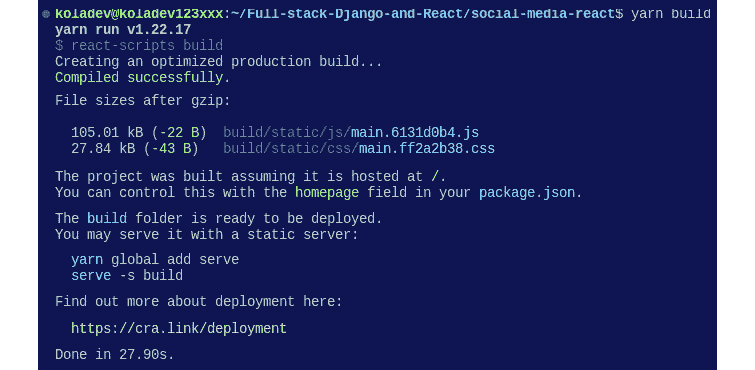
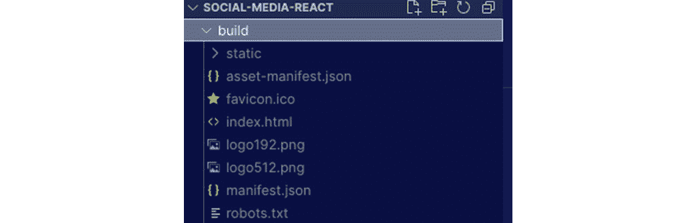
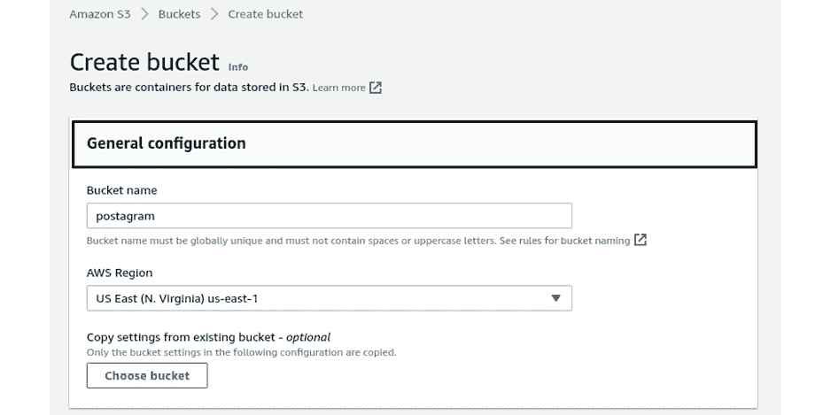
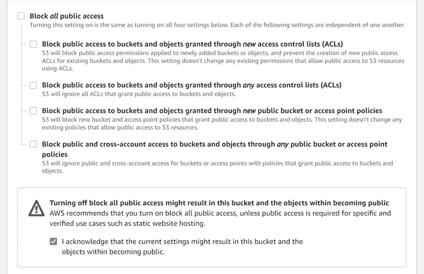
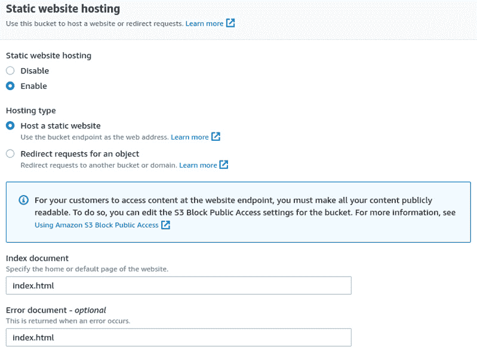
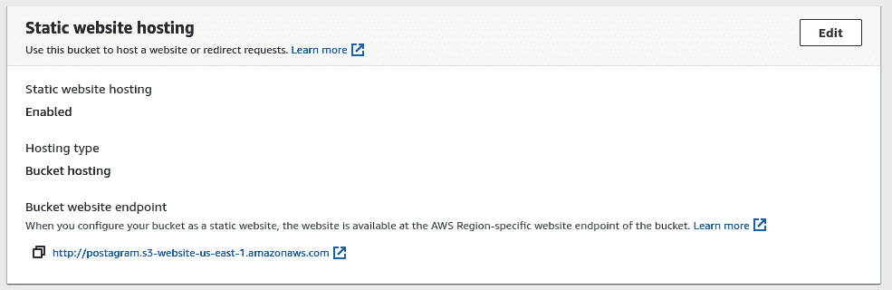
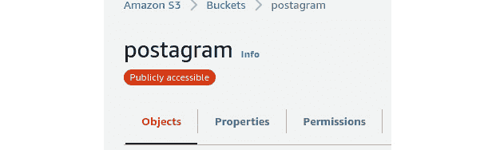
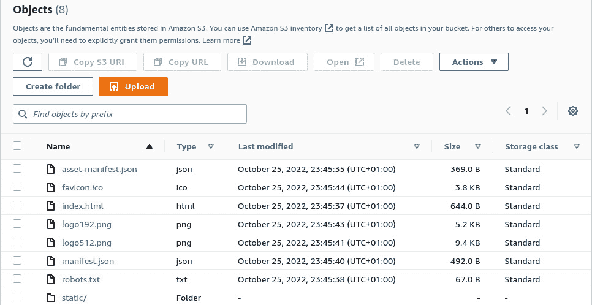
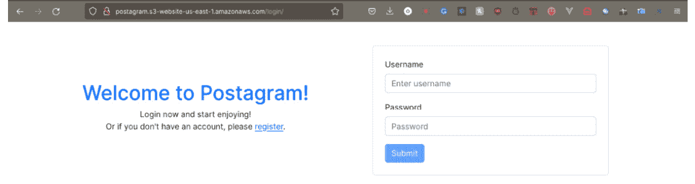

# 15

# 在 AWS 上部署我们的 React 应用程序

在上一章中，我们使用 GitHub Actions 和 AWS EC2 实例的一些配置自动化了 Django 应用程序的部署。Postagram API 现在是实时状态，现在我们必须部署 React 应用程序，以便在互联网上提供完整的 Postagram 应用程序。

在本章中，我们将使用 AWS **简单存储服务**（**S3**）部署 React 应用程序，并使用 GitHub Actions 自动化部署。我们将涵盖以下主题：

+   React 应用程序的部署

+   在 AWS S3 上部署

+   使用 GitHub Actions 自动化部署

# 技术要求

对于本章，您需要在 AWS 上有一个账户。您还需要创建一个**身份和访问管理**（**IAM**）用户并保存凭证。您可以通过遵循官方文档[`docs.aws.amazon.com/IAM/latest/UserGuide/id_users_create.html#id_users_create_cliwpsapi`](https://docs.aws.amazon.com/IAM/latest/UserGuide/id_users_create.html#id_users_create_cliwpsapi)来完成此操作。您可以在[`github.com/PacktPublishing/Full-stack-Django-and-React/tree/chap15`](https://github.com/PacktPublishing/Full-stack-Django-and-React/tree/chap15)找到本章的代码。

# React 应用程序的部署

使用 JavaScript 和 JSX 构建 React 应用程序。然而，为了让应用程序在互联网上可访问，我们需要一个浏览器可以解释和理解的应用程序版本，基本上是一个具有 HTML、CSS 和 JavaScript 的应用程序。

在开发模式下，React 提供了一个环境来检测警告，并提供检测和修复应用程序中问题的工具，以消除潜在的问题。这会给项目添加额外的代码，增加包的大小，导致应用程序更大、更慢。

由于用户体验（**UX**）的原因，仅在互联网上部署生产构建的应用程序至关重要。根据谷歌的研究，*53%的用户如果网站加载时间超过 3 秒就会离开网站*。因此，我们必须构建我们创建的 React 应用程序并部署生产版本。

## 什么是生产构建？

在开发过程中，React 应用程序以开发模式或本地模式运行。这是您可以查看所有警告和跟踪记录的地方，以防您的代码崩溃。生产模式要求开发者构建应用程序。此构建会压缩代码，优化资源（图像、CSS 文件等），生成更轻的源映射，并抑制开发模式中显示的警告消息。

因此，应用程序的包大小大幅减少，这提高了页面加载速度。在本章中，我们将构建一个可用于生产的应用程序，并将其部署到 AWS S3 作为静态网站。

# 在 AWS S3 上部署

**AWS S3** 是 AWS 最受欢迎的服务之一。它是一个基于云的存储服务，提供高性能、可用性、可靠性、安全性和令人难以置信的可扩展性潜力。AWS S3 主要用于存储静态资产，以便它们能够有效地分发到互联网上，由于其分发特性，AWS S3 适合托管静态网站。

在本章中，我们将创建一个 S3 存储桶，上传构建好的 React 应用程序的内容，并允许从互联网上公开访问。**S3 存储桶**是 AWS 中可用的一个公共存储资源，就像一个在线文件夹，你可以在这里存储对象（就像 Google Drive 上的文件夹一样）。在下一节中，我们将创建一个生产就绪版本的 React 应用程序。

## 创建 Postagram 的构建版本

我们可以使用一条命令创建 React 应用的构建版本：

```py
Yarn build
```

`yarn build` 命令创建了一个 React 应用程序的静态文件包。这个包已经足够优化，可以用于生产。生产版本的 Postagram 应用程序将使用在线版本的 API。这意味着我们需要在 React 代码中进行一些调整，主要涉及代码中使用的 API URL。

在本书的 *第二部分*，即 *使用 React 构建响应式 UI* 中，我们使用本地主机服务器在端口 `8000` 上的数据构建了 React 应用程序。在本章中，情况将有所不同，我们将借此机会向 React 应用程序添加环境变量。将环境变量集成到 React 应用程序中非常简单。让我们在 Postagram React 应用程序中配置环境变量。

## 添加环境变量并构建应用程序

根据 *Create React App* 的文档关于环境变量的说明 ([`create-react-app.dev/docs/adding-custom-environment-variables/`](https://create-react-app.dev/docs/adding-custom-environment-variables/))，

“你的项目可以消费在环境中声明的变量，就像它们在本地 JS 文件中声明一样。默认情况下，你将有一个 NODE_ENV 被定义，以及任何以 REACT_APP_ 开头的其他环境变量”。

要访问环境变量的值，我们将使用 `process.env.REACT_APP_VALUE` 语法，因为这些环境变量是在 `process.env` 上定义的。

在 React 项目的根目录下创建一个名为 `.env` 的文件。在这个文件中，添加以下内容以及你在 EC2 AWS 服务器上部署的 API URL 的名称：

```py
REACT_APP_API_URL=https://name_of_EC2_instance.compute-1.amazonaws.com/api
```

然后，你需要修改 `src/helpers/axios.js` 和 `src/hooks/user.actions.js` 中的某些代码片段。我们必须更新 `baseURL` 变量，使其从 `.env` 文件中读取值：

src/hooks/user.actions.js

```py
function useUserActions() {
 const navigate = useNavigate();
 const baseURL = process.env.REACT_APP_API_URL;
 return {
   login,
   register,
   logout,
   edit,
 };
```

我们同样在 `axios.js` 文件上执行相同的操作：

src/helpers/axios.js

```py
const axiosService = axios.create({
 baseURL: process.env.REACT_APP_API_URL,
 headers: {
   "Content-Type": "application/json",
 },
});
…
const refreshAuthLogic = async (failedRequest) => {
 return axios
   .post(
     "/auth/refresh/",
     {
       refresh: getRefreshToken(),
     },
     {
       baseURL: process.env.REACT_APP_API_URL,
...
```

太好了！现在可以构建应用程序了。运行以下命令：

```py
yarn build
```

你将得到类似的结果：



图 15.1 – yarn build 命令的输出

构建可用在新创建的`build`目录中，您将找到以下内容：



图 15.2 – build 目录

使用生产就绪的 React 应用程序，我们可以在 S3 上部署应用程序。接下来，让我们创建一个 S3 存储桶并上传文件和文件夹。

## 在 S3 上部署 React 应用程序

我们有一个构建就绪的应用程序版本和一个针对生产优化的版本。在 S3 上部署之前，我们需要通过创建存储桶并在 AWS 上告知我们将托管静态网站来对 AWS S3 进行一些配置。在 AWS 控制台菜单中，选择 S3 服务并创建一个存储桶。按照以下步骤使用 S3 服务在 AWS 上部署 React 应用程序：

1.  您需要输入一些配置，例如**存储桶名称**值等，如图所示：



图 15.3 – AWS S3 存储桶的常规配置

1.  之后，您需要禁用**阻止所有公共访问**设置，以便 React 应用程序对公众可见：



图 15.4 – 公共访问配置

1.  基本配置完成后，您可以继续创建 S3 存储桶。访问新创建的存储桶，选择**属性**选项卡，转到**静态网站托管**。在页面上，启用**静态****网站托管**：



图 15.5 – 静态网站托管配置

1.  您还应该填写**索引文档**和**错误文档**字段。这将有助于 React 应用程序的路由。保存更改，您将看到存储桶网站端点，这将是您网站的 URL：



图 15.6 – 静态网站托管配置完成

1.  最后，选择**权限**选项卡并选择**存储桶策略**。我们将添加一个策略以授予对存储桶的公共访问权限，如下所示：

    ```py
    {
    ```

    ```py
        "Version": "2012-10-17",
    ```

    ```py
        "Statement": [
    ```

    ```py
            {
    ```

    ```py
                "Sid": "Statement1",
    ```

    ```py
                "Effect": "Allow",
    ```

    ```py
                "Principal": {
    ```

    ```py
                    "AWS": "*"
    ```

    ```py
                },
    ```

    ```py
                "Action": "s3:GetObject",
    ```

    ```py
                "Resource": "arn:aws:s3:::postagram/*"
    ```

    ```py
            }
    ```

    ```py
        ]
    ```

    ```py
    }
    ```

在您的案例中，将 Postagram 替换为您的 React 应用程序的名称。

1.  保存更改。您会注意到在存储桶名称旁边将出现一些新信息：



图 15.7 – 公开可访问徽章

1.  现在，点击 React 应用程序的`build`目录。上传完成后，您将得到类似的结果：



图 15.8 – 存储桶内容

1.  点击存储桶网站端点，您将在浏览器中访问 Postagram React 应用程序：




图 15.9 – 部署的 React 应用程序

太好了！我们已经使用 S3 服务在 AWS 上部署了一个 React 应用程序。你肯定会在 AWS EC2 实例上 Django 应用程序的 `.env` 文件中遇到 `CORS_ALLOW_ORIGINS` 环境变量。以下是如何定义环境变量的示例：

.env

```py
CORS_ALLOW_ORIGINS="S3_WEBSITE_URL"
```

然后，在 Django 项目的 `settings.py` 文件中，将定义 `CORS_ALLOW_ORIGINS` 的行替换为以下内容：

CoreRoot/settings.py

```py
...
CORS_ALLOWED_ORIGINS = os.getenv("CORS_ALLOWED_ORIGINS", "").split(",")
...
```

我们已经学习了如何配置存储桶，更改公共访问策略，并激活 AWS S3 的网站托管功能。然而，部署是手动完成的，并且在未来，如果您经常推送，每次手动上传更改可能会很麻烦。在下一节中，我们将探讨如何使用 GitHub Actions 自动化 React 应用程序的部署。

# 使用 GitHub Actions 自动化部署

在上一章中，我们探讨了 GitHub Actions 如何使部署流程对开发者来说更容易、更安全、更可靠。这就是为什么在本章中，我们也在使用 GitHub Actions 来自动化 React 应用程序的部署。

有一个名为 `configure-aws-credentials` 的 GitHub Action，用于 AWS。我们将使用此操作在工作流程中配置 AWS 凭据，以执行命令将 `build` 文件夹的内容上传到之前创建的 S3 桶。但在那之前，我们将遵循相同的 CI/CD 工作流程：

1.  安装项目的依赖项。

1.  运行测试以确保应用程序在生产环境中不会崩溃，并确保没有回归。

1.  运行 `build` 命令以获得一个生产就绪的应用程序。

1.  在 AWS S3 上部署。

让我们在存储库中添加一个新的工作流程文件，用于部署 React 应用程序。

重要提示

对于这本书，Django 应用程序和 React 应用程序位于同一个存储库中。这个选择是为了让您更容易地浏览代码和项目。因此，您将在 `.github/workflows` 目录中找到两个工作流程。如果您已经将 Django 应用程序的代码和 React 项目的代码拆分到不同的存储库中，请确保不要混合 GitHub Actions 文件。

## 编写工作流程文件

在 `.github/workflows` 目录中，创建一个名为 `deploy-frontend.yml` 的文件。像往常一样，编写 GitHub Actions 文件的第一步是定义工作流程的名称和将触发此工作流程的条件：

.github/workflows/deploy-frontend.yml

```py
name: Build and deploy frontend
on:
 push:
   branches: [ main ]
```

然后我们创建一个名为 `build-test-deploy` 的工作任务。在这个工作任务中，我们将编写命令来安装 React 依赖项，运行测试，构建项目，并将应用程序部署到 S3。让我们首先注入环境变量：

.github/workflows/deploy-frontend.yml

```py
jobs:
 build-test-deploy:
   name: Tests
   runs-on: ubuntu-latest
   defaults:
     run:
       working-directory: ./social-media-react
   steps:
     - uses: actions/checkout@v2
     - name: Injecting environment variables
       run: echo "REACT_APP_API_URL=${{ secrets.API_URL }}"
            >> .env
```

我们现在可以添加安装依赖项、运行测试和构建应用程序的命令：

.github/workflows/deploy-frontend.yml

```py
     - name: Installing dependencies
       run: yarn install
     - name: Running tests
       run: yarn test
     - name: Building project
       run: yarn build
```

我们还可以添加 AWS 凭证操作来配置工作流程中的 AWS 凭证并运行命令以部署到 S3：

.github/workflows/deploy-frontend.yml

```py
     - name: Configure AWS Credentials
       uses: aws-actions/configure-aws-credentials@v1
       with:
         aws-access-key-id: ${{ secrets.AWS_ACCESS_KEY_ID
                             }}
         aws-secret-access-key:
           ${{ secrets.AWS_SECRET_ACCESS_KEY }}
         aws-region: us-west-1
     - name: Deploy to S3 bucket
       run: aws s3 sync ./build/ s3://postagram --delete
```

在最后一个命令中，我们正在将`build`目录的内容上传到 Postagram 存储桶。在使用此配置时，请确保使用您自己的 S3 存储桶名称。GitHub 操作文件已编写并可部署。提交更改并将它们推送到 GitHub 仓库。

恭喜！您已使用 GitHub Actions 将 React 应用程序部署到 AWS S3。

我们已成功部署了在本书中构建的全栈应用程序。我们在 AWS 实例上部署了 Django API 应用程序，在 AWS S3 上部署了 React 前端，并使用 GitHub Actions 自动化了 CI/CD 管道。然而，在完全上线之前，我们需要对后端和前端进行一些优化，使用 HTTPS 确保在 AWS 上部署的应用程序版本的安全，并更多讨论缓存和 SQL 查询优化。

# 摘要

在本章中，我们已在 AWS 上部署了前端 React 应用程序。我们探讨了 AWS S3 服务，这是 AWS 为在互联网上存储对象而创建和开发的。我们学习了如何向 React 应用程序添加环境变量，以及如何通过构建应用程序来拥有一个生产就绪的捆绑包。

生产捆绑包已用于在 AWS S3 上部署，使用存储桶并配置存储桶以进行静态网站托管。为了使部署过程顺利，我们已创建 GitHub 操作来自动化 React 前端项目的 CI/CD 管道，从构建和测试到在 AWS S3 上部署应用程序。

在下一章中，我们将专注于通过优化查询、添加缓存、添加登出端点以及使用 HTTPS 确保服务器与客户端之间的通信来优化 Django API 和 React 前端。

# 问题

1.  什么是 AWS S3？

1.  如何在 AWS 上创建 IAM 用户？

1.  构建 React 应用程序使用的命令是什么？

1.  Node.js 项目中的环境变量是从哪里检索的？
