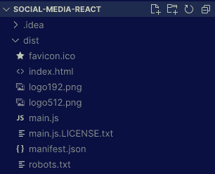
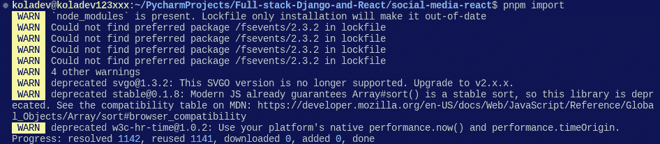
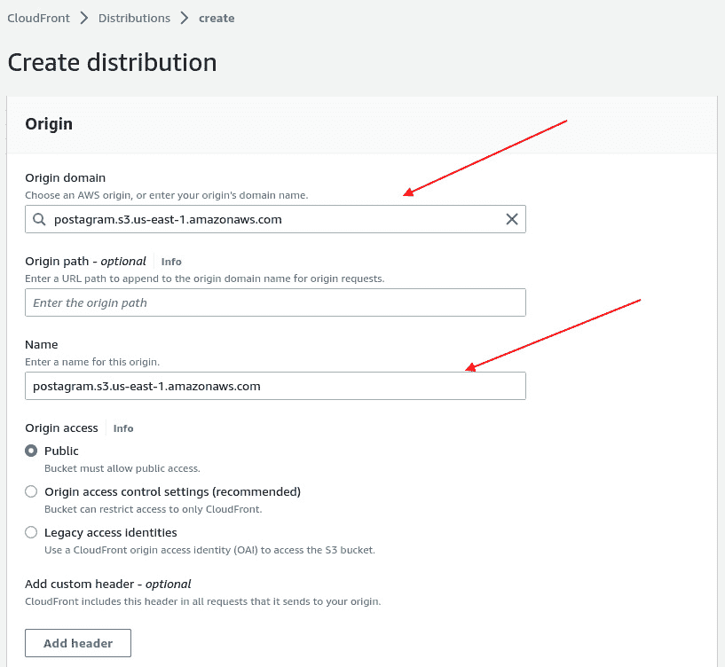
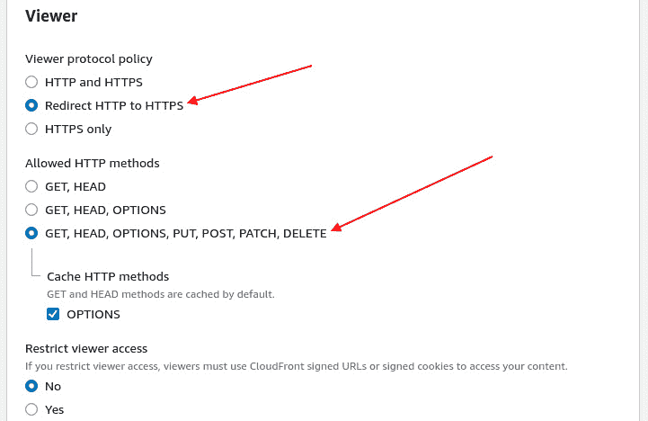
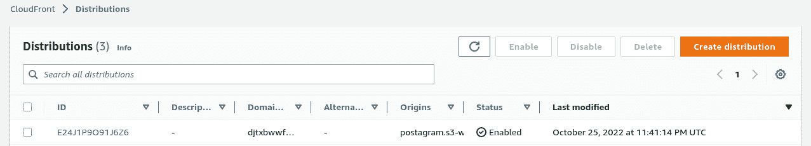
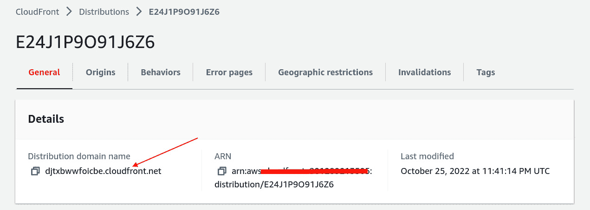

# 16

# 性能、优化和安全

在本书的前几章中，我们从零开始创建了一个全栈应用程序，首先使用 Django 和 Django REST Framework 构建和创建了一个 REST API，然后使用 React 创建了一个与 API 通信的 Web 界面。我们还已经在 AWS EC2 和 AWS S3 等服务上部署了应用程序。然而，我们需要进一步调查在互联网上部署应用程序的一些重要方面，例如性能检查、查询优化、前端优化，以及最终的安全方面。

在本章中，我们将学习如何通过减少 SQL 查询和使用更快的 API 响应来创建一个高性能的 API，如何使用 AWS CloudFront 通过 HTTPS 提供 API 和 React 前端，以及如何使用 API 登出用户。在本章中，我们将涵盖以下内容：

+   撤销 JWT 令牌

+   添加缓存

+   优化 React 应用程序的部署

+   使用 AWS CloudFront 通过 HTTPS 保护已部署的应用程序

# 技术要求

对于本章，你需要有一个活跃的 AWS 账户，可以访问 S3、EC2 和 CloudFront 等服务。你还可以在本章的代码：[`github.com/PacktPublishing/Full-stack-Django-and-React/tree/chap16`](https://github.com/PacktPublishing/Full-stack-Django-and-React/tree/chap16)中找到代码。

# 撤销 JWT 令牌

在本书中，我们使用**JSON Web Tokens**（JWTs）实现了一个身份验证系统，因为它是一个无状态的身份验证系统，所以大部分的身份验证流程都是由前端处理的。如果我们想从 Postagram React 应用程序中登出用户，我们必须从浏览器的本地存储中清除令牌，用户将自动重定向到登录页面。但是即使令牌从浏览器中删除，它们仍然有效。

刷新令牌的有效期更长，因此如果黑客获得了刷新令牌，他们仍然可以请求访问令牌并使用他人的身份进行 HTTP 请求。为了避免这种情况，我们将添加一个登出功能，从服务器端使访问和刷新令牌失效。

用于在 Django REST API 上添加 JWT 身份验证的包（`djangorestframework-simplejwt`）支持黑名单令牌，这正是我们需要的完美功能。让我们设置登出功能所需的配置，并将该功能添加到 Django REST API 中。

## 添加登出端点

在本节中，我们将为 Django 应用程序编写一些代码以添加一个登出端点：

1.  在项目的`settings.py`文件中，将以下条目添加到`INSTALLED_APPS`列表中：

CoreRoot/settings.py

```py
...
"corsheaders",
"rest_framework_simplejwt.token_blacklist",
...
```

1.  然后，在`core/auth/viewsets`目录中创建一个名为`logout.py`的文件。此文件将包含`viewsets`的代码以及黑名单令牌的逻辑。

1.  在此文件中，添加所需的导入并定义`LogoutViewSet`类：

core/auth/viewsets/logout.py

```py
from rest_framework_simplejwt.tokens import RefreshToken, TokenError
from rest_framework import viewsets, status, permissions
from rest_framework.exceptions import ValidationError
from rest_framework.response import Response
class LogoutViewSet(viewsets.ViewSet):
   authentication_classes = ()
   permission_classes = (permissions.IsAuthenticated,)
   http_method_names = ["post"]
```

注销端点将只接受`POST`请求，因为客户端需要在`POST`请求体中传递刷新令牌。我们还指定只有经过认证的用户才有权访问此端点。

1.  让我们来编写`LogoutViewSet`类的`create`方法：

core/auth/viewsets/logout.py

```py
...
class LogoutViewSet(viewsets.ViewSet):
...
   def create(self, request, *args, **kwargs):
       refresh = request.data.get("refresh")
       if refresh is None:
           raise ValidationError({"detail":
             "A refresh token is required."})
       try:
           token = RefreshToken(request.data.get(
             "refresh"))
           token.blacklist()
           return Response(
             status=status.HTTP_204_NO_CONTENT)
       except TokenError:
           raise ValidationError({"detail":
             "The refresh token is invalid."})
```

在前面的代码中，我们确保请求体中存在刷新令牌。否则，我们将引发错误。一旦完成验证，我们将黑名单逻辑封装在`try/except`块中：

+   如果令牌有效，则将令牌加入黑名单，并返回一个带有`204 HTTP`状态码的响应。

+   如果存在与令牌相关的错误，则令牌无效，我们将返回一个验证错误。

1.  让我们别忘了在`routers.py`文件中添加新创建的`ViewSet`并注册一个新的路由：

core/routers.py

```py
...
from core.auth.viewsets import (
   RegisterViewSet,
   LoginViewSet,
   RefreshViewSet,
   LogoutViewSet,
)
...
router.register(r"auth/logout", LogoutViewSet, basename="auth-logout")
```

1.  太好了！为了遵循构建软件的最佳实践，我们必须在`core/auth/tests.py`文件中为新增的路由添加一个测试：

core/auth/tests.py

```py
...
def test_logout(self, client, user):
   data = {"username": user.username,
           "password": "test_password"}
   response = client.post(self.endpoint + "login/",
                          data)
   assert response.status_code == status.HTTP_200_OK
   client.force_authenticate(user=user)
   data_refresh = {"refresh":
     response.data["refresh"]}
   response = client.post(self.endpoint + "logout/",
     data_refresh)
   assert response.status_code ==
     status.HTTP_204_NO_CONTENT
```

在前面的代码中，我们登录以获取刷新令牌并强制用户进行认证，以便我们可以访问注销端点。之后，我们确保在注销成功时返回了正确的状态码。

1.  使用`pytest`命令运行测试。如果你使用 Docker，则可以使用此命令运行测试：

    ```py
     docker-compose exec -T api pytest
    ```

当注销端点准备就绪后，我们现在可以对 React 应用程序中的认证逻辑（主要是注销逻辑）进行一些修改。

## 使用 React 处理注销

我们已经在 React 应用程序中对注销进行了一定程度的处理，只是从本地存储中删除了令牌。这里没有太多需要修改的，我们只需添加一个函数来向 API 发起请求，如果这个请求成功，我们将删除令牌和用户从浏览器的本地存储中。React 应用程序上当前的注销逻辑在`NavigationBar`组件中处理：

src/components/NavBar.jsx

```py
...
             <NavDropdown.Item
               onClick={userActions.logout}>
               Logout
             </NavDropdown.Item>
...
```

在`useActions`钩子函数内部，让我们调整`logout`方法，在删除用户之前发起 API 调用：

src/hooks/user.actions.js

```py
...
 // Logout the user
 function logout() {
   return axiosService
     .post(`${baseURL}/auth/logout/`,
           { refresh: getRefreshToken() })
     .then(() => {
       localStorage.removeItem("auth");
       navigate("/login");
     });
 }
```

一旦完成，让我们在`NavigationBar`组件中创建一个函数来处理 API 错误的情况。我们将在页面上显示一个带有错误信息的 toast HTML 块：

src/components/NavBar.jsx

```py
import React, { useContext } from "react";
import { Context } from "./Layout";
...
function NavigationBar() {
 const { setToaster } = useContext(Context);
 const userActions = useUserActions();
 const user = getUser();
 const handleLogout = () => {
   userActions.logout().catch((e) =>
     setToaster({
       type: "danger",
       message: "Logout failed",
       show: true,
       title: e.data?.detail | "An error occurred.",
     })
   );
 };
...
```

太好了！我们的全栈应用程序现在支持注销。在下一节中，我们将讨论在线部署项目时的一个常见话题，缓存。

# 添加缓存

在软件计算中，缓存是将文件的副本存储在缓存中以便更快访问的过程。**缓存**是一个临时存储位置，用于存储数据、文件以及有关经常请求的软件的信息。

缓存的优秀示例和解释来自彼得·切斯特，他在一次演讲中向听众提出了一个问题：“3,485,250 除以 23,235 等于多少？”大家沉默了一会儿，但有人拿出计算器喊出了答案“150！”然后，彼得·切斯特再次提出了相同的问题，这一次，大家都能立即回答这个问题。

这是对缓存概念的一个很好的演示：*计算只由机器执行一次，然后将其保存在快速内存中以* *加快访问速度*。

这是一个被公司和主要社交媒体网站广泛使用的一个概念，其中数百万用户访问相同的帖子、视频和文件。每当数百万人都想访问相同的信息时，直接击中数据库将会非常原始。例如，如果一条推文在 Twitter 上开始流行，它会被自动移动到缓存存储中以便快速访问。而且，如果你有一个像金·卡戴珊这样的影响者将图片发布在 Instagram 上，你应该预期会有很多对这个图片的请求。因此，缓存在这里可以很有用，以避免对数据库进行数千次查询。

总结一下，缓存带来的以下好处：

+   减少加载时间

+   减少带宽使用

+   减少数据库上的 SQL 查询

+   减少停机时间

既然我们已经对缓存及其好处有了了解，我们可以使用 Django 甚至 Docker 来实现这一概念。但在那之前，让我们快速讨论一下缓存给应用程序带来的复杂性。

## 缓存的缺点

你已经知道使用缓存的优点，尤其是如果你的应用程序正在扩展或者你想要提高加载时间并减少成本。然而，缓存会给你的系统带来一些复杂性（它也可能取决于你正在开发的应用程序类型）。如果你的应用程序基于新闻或动态，你可能会遇到麻烦，因为你将需要定义一个良好的缓存架构。

一方面，你可以通过在一段时间内向用户展示相同的内容来减少加载时间，但与此同时，你的用户可能会错过更新，也许是一些重要的更新。在这里，缓存失效就派上用场了。

缓存失效是声明缓存内容无效或过时的过程。内容被失效，因为它不再被标记为文件的最新版本。有一些方法可以用来使缓存失效，如下所示：

+   **清除（刷新）**：缓存清除会立即从缓存中移除内容。当内容再次被请求时，它会在返回给客户端之前存储在内存缓存中。

+   **刷新**：缓存刷新包括从服务器刷新相同的内容，并用从服务器获取的新版本替换缓存中存储的内容。这是在 React 应用程序中使用**state-while-revalidate**（**SWR**）完成的。每次创建帖子时，我们都会调用一个刷新函数来再次从服务器获取数据。

+   **禁止**：缓存禁止不会立即从缓存中删除内容。相反，内容会被标记为黑名单。然后，当客户端发起请求时，它会与黑名单内容进行匹配，如果找到匹配项，则会再次获取新内容并在内存缓存中更新，然后再返回给客户端。

在理解了缓存的缺点以及如何使缓存失效之后，你已经为将缓存添加到 Django 应用程序做好了充分的准备。在下一节中，让我们将缓存添加到 Postagram 的 Django API 中。

## 将缓存添加到 Django API

在前面的段落中，我们已经探讨了缓存、其优点以及该概念的缺点。现在，是时候在我们的 Django 应用程序中实现缓存了。Django 为缓存提供了有用的支持，使得在 Django 中配置缓存变得简单直接。让我们根据你的环境开始进行必要的配置。

### 配置 Django 以进行缓存

在 Django 中使用缓存需要配置一个内存缓存。为了实现最快的读写访问，最好使用不同于 SQL 数据库的数据存储解决方案，因为众所周知，SQL 数据库比内存数据库慢（当然，这也取决于你的需求）。在这本书中，我们将使用 Redis。Redis 是一个开源的内存数据存储，用作数据库、缓存、流引擎和消息代理。

我们将回顾你需要进行的配置，以便在你的 Django 项目中开始使用 Redis，无论你是否使用 Docker。然而，对于部署，我们将使用 Docker 来配置 Redis。

因此，如果你不打算使用 Docker，你可以通过以下链接安装 Redis：[`redis.io/download/`](https://redis.io/download/)。

重要提示

如果你在一个 Linux 环境中工作，你可以使用`sudo service redis-server status`命令来检查服务是否正在运行。如果服务未激活，请使用`sudo service redis-server start`命令来启动 Redis 服务器。如果你使用 Windows，你需要安装或启用 WSL2。你可以在此处了解更多信息：[`redis.io/docs/getting-started/installation/install-redis-on-windows/`](https://redis.io/docs/getting-started/installation/install-redis-on-windows/)。

在你的机器上安装完成后，你可以通过 Django 项目的`settings.py`文件中的`CACHES`设置来配置缓存：

CoreRoot/settings.py

```py
...
CACHES = {
    'default': {
        'BACKEND': 'django_redis.cache.RedisCache',
        'LOCATION': 'redis://127.0.0.1:6379/1',
        'OPTIONS': {
            'CLIENT_CLASS':
              'django_redis.client.DefaultClient',
        }
    }
}
```

此配置将需要安装一个名为`django-redis`的 Python 包。通过运行以下命令来安装它：

```py
pip install django-redis
```

如果你使用 Docker，你只需要添加以下配置：

1.  将`django-redis`包添加到`requirements.txt`文件中：

requirements.txt

```py
django-redis==5.2.0
```

1.  添加`docker-compose.yaml`配置。我们将在 Docker 配置中添加一个新的镜像，以确保 Django 应用程序在 API 服务开始运行之前需要`redis-server`已准备好：

docker-compose.yaml

```py
services:
 redis:
   image: redis:alpine
…
api:
...
 depends_on:
  - db
  - redis
...
```

1.  太好了！在 Django 项目的`settings.py`文件中添加以下自定义后端：

CoreRoot/settings.py

```py
CACHES = {
   "default": {
       "BACKEND": "django_redis.cache.RedisCache",
       "LOCATION": "redis://redis:6379",
       "OPTIONS": {
           "CLIENT_CLASS":
             "django_redis.client.DefaultClient",
       },
   }
}
```

您会注意到这里我们使用`redis`作为主机而不是`127.0.0.1`。这是因为，在使用 Docker 时，您可以使用服务名称作为主机。这是一个更好的解决方案；否则，您将不得不为服务配置静态 IP 地址。

重要提示

如果您想了解如何使用 Docker 为容器分配静态 IP 地址的更多信息，您可以阅读以下资源：[`www.howtogeek.com/devops/how-to-assign-a-static-ip-to-a-docker-container/`](https://www.howtogeek.com/devops/how-to-assign-a-static-ip-to-a-docker-container/)。

太好了！现在我们已经为 Django 配置了缓存，让我们为 Postagram 应用程序构建缓存系统。

## 在端点上使用缓存

缓存很大程度上取决于您希望缓存数据多长时间的业务需求。嗯，Django 提供了许多缓存级别：

+   **按站点缓存**：这使您能够缓存整个网站。

+   **模板片段缓存**：这使您能够缓存网站的一些组件。例如，您可以决定只缓存页脚。

+   **按视图缓存**：这使您能够缓存单个视图的输出。

+   **低级缓存**：Django 提供了一个 API，您可以使用它直接与缓存进行交互。如果您想根据一系列操作产生某种行为，这很有用。例如，在这本书中，如果帖子被更新或删除，我们将更新缓存。

现在我们对 Django 提供的缓存级别有了更好的了解，让我们为 Postagram API 定义缓存需求。

我们的要求是，如果对评论或帖子进行了删除或更新，缓存将被更新。否则，我们将返回缓存中的相同信息给用户。

这可以通过多种方式实现。我们可以使用 Django 信号或直接向`Post`和`Comment`类的管理器添加自定义方法。让我们选择后者。我们将覆盖`AbstractModel`类的`save`和`delete`方法，这样如果`Post`或`Comment`对象有更新，我们将更新缓存。

在`core/abstract/models.py`文件中，在导入之后在文件顶部添加以下方法：

core/abstract/models.py

```py
from django.core.cache import cache
...
def _delete_cached_objects(app_label):
   if app_label == "core_post":
       cache.delete("post_objects")
   elif app_label == "core_comment":
       cache.delete("comment_objects")
   else:
       raise NotImplementedError
```

上一段代码中的函数接受一个应用程序标签，并根据此`app_label`的值，我们使相应的缓存失效。目前，我们只支持对帖子或评论进行缓存。注意函数名称前有一个下划线`_`。这是一个编码约定，表示此方法为私有，不应在声明它的文件外部使用。

在`AbstractModel`类中，我们可以覆盖`save`方法。在`save`方法执行之前，我们将使缓存失效。这意味着在`create`和`update`等操作中，缓存将被重置：

core/abstract/models.py

```py
class AbstractModel(models.Model):
...
   def save(
       self, force_insert=False, force_update=False,
       using=None, update_fields=None
   ):
       app_label = self._meta.app_label
       if app_label in ["core_post", "core_comment"]:
           _delete_cached_objects(app_label)
       return super(AbstractModel, self).save(
           force_insert=force_insert,
           force_update=force_update,
           using=using,
           update_fields=update_fields,
       )
```

在前面的代码中，我们从模型的`_meta`属性中检索`app_label`。如果它对应于`core_post`或`core_comment`，则失效缓存，其余指令可以继续。让我们为`delete`方法做同样的事情：

Core/abstract/models.py

```py
class AbstractModel(models.Model):
…
   def delete(self, using=None, keep_parents=False):
       app_label = self._meta.app_label
       if app_label i" ["core_p"st", "core_comm"nt"]:
           _delete_cached_objects(app_label)
       return super(AbstractModel, self).delete(
         using=using, keep_parents=keep_parents)
```

太好了。模型上的缓存失效逻辑已经实现。让我们为`core_post`应用程序和`core_comment`应用程序的视图集添加缓存数据检索的逻辑。

### 从缓存中检索数据

缓存失效已经就绪，因此我们可以自由地从帖子端点和评论端点的缓存中检索数据。让我们从`PostViewSet`的部分代码开始写起，而`CommentViewSet`的代码将是相同的。作为一个小练习，您可以编写检索评论缓存的逻辑。

在`PostViewSet`类内部，我们将重写`list()`方法。在**Django REST framework**（**DRF**）开源仓库中，代码看起来是这样的：

```py
"""List a queryset"""
def list(self, request, *args, **kwargs):
   queryset = self.filter_queryset(self.get_queryset())
   page = self.paginate_queryset(queryset)
   if page is not None:
       serializer = self.get_serializer(page, many=True)
       return self.get_paginated_response(serializer.data)
   serializer = self.get_serializer(queryset, many=True)
   return Response(serializer.data)
```

在前面的代码中，调用`queryset`以检索数据，然后对这个`queryset`调用进行分页、序列化，并在`Response`对象中返回。让我们稍微调整一下这个方法：

core/post/viewsets.py

```py
class PostViewSet(AbstractViewSet):
...
   def list(self, request, *args, **kwargs):
       post_objects = cache.get("post_objects")
       if post_objects is None:
           post_objects =
             self.filter_queryset(self.get_queryset())
           cache.set("post_objects", post_objects)
       page = self.paginate_queryset(post_objects)
       if page is not None:
           serializer = self.get_serializer(page,
                                            many=True)
           return self.get_paginated_response(
             serializer.data)
       serializer = self.get_serializer(post_objects,
                                        many=True)
       return Response(serializer.data)
```

在前面的代码中，我们不是直接在数据库上查找，而是检查缓存。如果对数据库的查询中`post_objects`为`None`，则在缓存中保存`queryset`，并最终返回给用户缓存对象。

如您所见，这个过程非常简单。您只需要有一个健壮的缓存策略。您可以作为一个练习对`CommentViewSet`做同样的事情。您可以通过这个链接检查代码以比较您的结果：[`github.com/PacktPublishing/Full-stack-Django-and-React/blob/chap16/core/comment/viewsets.py`](https://github.com/PacktPublishing/Full-stack-Django-and-React/blob/chap16/core/comment/viewsets.py).

在本节中，我们探讨了缓存的优点，并在 Django 应用程序中实现了缓存。在下一节中，我们将看到如何使用如`webpack`等工具优化 React 构建。

# 优化 React 应用程序构建

在上一章中，我们成功构建了 React 应用程序并在 AWS S3 上进行了部署。然而，在优化和性能方面，我们本可以做得更好。在本节中，我们将使用著名的 webpack 模块构建器来优化 Postagram 的 React 构建。

在 React 中使用 webpack 有很多优点：

+   **它加快了开发和构建时间**：在开发中使用 webpack 可以提高 React 快速重新加载的速度。

+   **它提供了代码压缩**：Webpack 自动最小化代码而不改变其功能。这导致浏览器端的加载速度更快。

+   **代码分割**：Webpack 将 JavaScript 文件转换为模块。

+   **它消除了无效资产**：Webpack 只构建您的代码使用和需要的图片和 CSS。

让我们从将 webpack 集成到项目中开始。

## 集成 webpack

按照以下步骤将 webpack 集成到你的项目中：

1.  在 React 项目内部，运行以下命令以添加 `webpack` 和 `webpack-cli` 包：

    ```py
    yarn add -D webpack webpack-cli
    ```

1.  安装完成后，修改 `package.json` 脚本：

package.json

```py
...
"scripts": {
    "start": "react-scripts start",
    "build": "webpack --mode production",
    "test": "react-scripts test",
    "eject": "react-scripts eject"
  },
...
```

此外，我们还需要安装 Babel，这是一个 JavaScript 编译器，它将下一代 JavaScript 代码转换为浏览器兼容的 JavaScript。

1.  在 React 项目中，Babel 将将 React 组件、ES6 变量和 JSX 代码转换为常规 JavaScript，以便旧浏览器可以正确渲染组件：

    ```py
    yarn add -D @babel/core babel-loader @babel/preset-env @babel/preset-react
    ```

`babel-loader` 是 Babel 的 webpack 加载器，`babel/preset-env` 将 JavaScript 编译为 ES5，而 `babel/preset-react` 用于将 JSX 编译为 JS。

1.  然后创建一个名为 `.babelrc` 的新文件：

    ```py
    {
    ```

    ```py
      "presets": ["@babel/preset-env",
    ```

    ```py
                  "@babel/preset-react"]
    ```

    ```py
    }
    ```

1.  然后创建一个名为 `webpack.config.js` 的新文件。此文件将包含 webpack 的配置。在编写配置之前，添加一些用于优化 HTML、CSS 和复制文件的插件：

    ```py
    yarn add -D html-webpack-plugin html-loader copy-webpack-plugin
    ```

1.  然后在 `webpack.config.js` 上添加以下配置：

webpack.config.js

```py
const path = require("path");
const HtmlWebPackPlugin = require("html-webpack-plugin");
const CopyPlugin = require("copy-webpack-plugin");
const webpack = require("webpack");
module.exports = {
 module: {
   rules: [
     {
       test: /\.(js|jsx)$/,
       exclude: /node_modules/,
       use: {
         loader: "babel-loader",
       },
     },
     {
       test: /\.css$/i,
       use: ["style-loader", "css-loader"],
     },
   ],
 },
};
```

上面的代码告诉 webpack 将所有 `.js` 和 `.jsx` 文件通过 `babel-loader` 传递。

1.  让我们添加另一个名为 `resolve` 的配置，以生成所有可能的模块路径。例如，webpack 将继续查找这些路径，直到找到文件：

webpack.config.js

```py
...
 resolve: {
   modules: [path.resolve(__dirname, "src"),
             "node_modules"],
   extensions: ["", ".js", ".jsx"],
 },
};
```

1.  让我们添加我们将在这个项目中使用的插件的配置：

webpack.config.js

```py
...
 plugins: [
   new HtmlWebPackPlugin({
     template: "./public/index.html",
     filename: "./index.html",
   }),
   new CopyPlugin({
     patterns: [
       {
         from: "public",
         globOptions: {
           ignore: ["**/*.html"],
         },
       },
     ],
   }),
   new webpack.DefinePlugin({ process: {env: {}} }),
 ],
 output: {
   publicPath: '.',
 },
};
```

在前面的代码中，我们为以下插件添加了配置：

+   `html-loader`：这将通过 `html-loader` 传递 HTML 文件

+   `copy`：这将把公共文件的内容复制到 `dist` 文件中

+   `define`：此插件声明 `process` 对象，这样我们就可以在生产环境中访问环境变量

1.  完成后，运行 `build` 命令：

    ```py
    yarn build
    ```

Webpack 将接管并在 `dist` 目录中构建 React 应用程序：



图 16.1 – dist 目录的内容

太好了！你可以将所做的更改推送到 GitHub，代码将在 AWS S3 上部署。为了使测试和构建更快，我们将包管理器从 `yarn` 更改为 `pnpm`。下一节是可选的，但它将帮助你为你的 React 应用程序实现更快的构建。

## 使用 pnpm

`pnpm` 是 `npm` JavaScript 包管理器的替代品，它建立在 `npm` 之上，并且更快、更高效。它提供了诸如磁盘空间效率、改进的速度和更好的安全性等优势。如果你想要在构建和 GitHub Actions 上节省时间，`pnpm` 包管理器是你要使用的。

让我们在我们的机器上安装 `pnpm`：

```py
npm install -g pnpm
```

之后，我们可以生成一个 `pnpm-lock.yaml` 文件。我们可以从另一个管理器的锁文件中生成此文件，在我们的例子中，是从 `yarn.lock` 文件中：

```py
pnpm import
```



图 16.2 – pnpm 导入的结果

在 React 项目的目录中会生成一个新文件。然后，修改 `deploy-frontend.yml` 文件以配置 `pnpm` 的使用：

.github/workflows/deploy-frontend.yml

```py
jobs:
 test:
   name: Tests
   runs-on: ubuntu-latest
   defaults:
     run:
       working-directory: ./social-media-react
   steps:
     - uses: actions/checkout@v3
     - uses: pnpm/action-setup@v2.2.4
       with:
         version: 7
     - name: Use Node.js 16
       uses: actions/setup-node@v3
       with:
         node-version: 16
         cache: 'pnpm'
         cache-dependency-path:
           ./social-media-react/pnpm-lock.yaml
```

之后，只需在 `deploy-frontend.yml` 文件中将 `yarn` 替换为 `pnpm`。您将注意到 React 应用程序的构建速度更快。

在本节中，我们介绍了 pnpm 和 webpack 以及它们如何提高 React 应用程序的性能。在下一节中，我们将学习如何使用 AWS CloudFront 保护 HTTP 请求。

# 使用 AWS CloudFront 通过 HTTPS 保护已部署的应用程序

当我们在 AWS S3 上部署了后端和前端后，应用程序通过 HTTP 提供服务。基本上，我们的全栈应用程序在互联网上没有安全措施，我们容易受到攻击。根据 **Open Web 应用安全项目**（**OWASP**）对不安全传输的描述（[`owasp.org/www-community/vulnerabilities/Insecure_Transport`](https://owasp.org/www-community/vulnerabilities/Insecure_Transport)），我们的应用程序容易受到以下攻击：

+   针对登录凭证、会话 ID 和其他敏感信息的攻击

+   通过在浏览器中 URL 的开头输入 HTTP 而不是 HTTPS 来绕过 **安全套接字层**（**SSL**）协议

+   向用户发送未经保护的认证页面 URL，诱使他们通过 HTTP 进行认证

AWS EC2 和 AWS S3 默认不通过 HTTPS 提供内容。但 AWS 还有一个名为 CloudFront 的服务，可以帮助您通过 HTTPS 提供应用程序，同时它还使内容在全球范围内可用。

**AWS CloudFront** 是一个内容分发网络服务，在下一节中，我们将配置 AWS S3 存储桶以使用 AWS CloudFront。

## 配置 React 项目以使用 CloudFront

按照以下步骤配置我们的 React 项目以使用 CloudFront：

1.  在 AWS 控制台中，选择 AWS 控制面板中的 **CloudFront** 服务并点击 **创建分发**。

1.  将托管在 AWS 上的网站的原点复制并粘贴到 **原点域名** 字段中：



图 16.3 – CloudFront 分发的原始配置

1.  接下来，配置默认的缓存行为：



图 16.4 – CloudFront 分发的查看器配置

1.  一旦完成缓存配置，创建分发。AWS 将花费一些时间来创建分发，一旦完成，点击分发 **ID** 字段以复制 URL：



图 16.5 – CloudFront 分发的列表

1.  一旦**状态**变为**启用**，点击**分布 ID**字段以访问有关分布的更多详细信息并复制分布域名：



图 16.6 – 关于创建的 CloudFront 分布的详细信息

CloudFront 分布的 URL 将返回通过 HTTPS 的 React 应用程序。太好了，React 应用程序在互联网上得到了保护，并且在全球范围内得到了良好的分发。太棒了！我们已经成功使用 AWS CloudFront 在 HTTPS 上保护了我们的应用程序。从现在起，你可以使用 Django 和 React 构建全栈应用程序，通过测试和 linting 确保代码质量，使用 GitHub Actions 自动化**持续集成**和**持续交付**（**CI/CD**）管道，并使用 AWS 服务如 S3、EC2 和 CloudFront 在全球范围内部署和托管你的 Web 应用程序。

# 摘要

在本章中，我们介绍了一些关于优化和安全的要点。我们实现了一个登出端点来黑名单令牌，使用 Redis 添加了 Django 应用程序的缓存，优化了使用 webpack 的后端构建，并使用 AWS CloudFront 通过 HTTPS 保护了全栈应用程序。这就是这本书的最后一笔。

我们已经介绍了如何使用 Django 和 React 构建一个强大且健壮的全栈应用程序。我们已经介绍了如何从头开始创建项目，构建使用 JWT 令牌进行安全保护的 API，使用 React 和 Bootstrap 构建前端应用程序，并在 AWS 上部署应用程序。我们已经探讨了 Docker 和 GitHub Actions 等工具，以使开发和部署过程更加安全、快速和自动化。现在，你可以使用 Django 和 React 构建和部署全栈应用程序了！

我们现在到了这本书的结尾，如果你在寻找最佳实践和下一步要学习的内容，请随意直接在本章之后查看*附录*。

# 问题

1.  什么是 AWS CloudFront？

1.  缓存失效策略有哪些？

1.  为什么日志记录很重要？

# 附录

每个成功的应用程序最终都需要进行扩展，这个过程可能会引起资源问题和更多的优化问题。在这个附录中，我将列出你在阅读完这本书之后可以阅读的内容，以便你成为一个更好的全栈开发者。

## 日志记录

日志记录是在应用程序执行不同任务或事件时收集有关应用程序信息的行为。在应用程序的开发过程中，如果您遇到错误，可以使用`print()`或`console.log()`来识别问题。更好的是，当 Django 中的`DEBUG`设置为`true`时，您可以访问`500`错误的整个跟踪信息。一旦您的项目部署到生产环境，这种情况就不再适用了。您可以使用 Python 提供的默认日志包在文件中实现日志记录；Django 提供了全面的支持，您可以在官方文档中探索，链接为[`docs.djangoproject.com/en/4.1/topics/logging/`](https://docs.djangoproject.com/en/4.1/topics/logging/)。如果您希望在出现`500`错误时获得实时通知，可以将您的后端连接到 Sentry、Datadog 或 Bugsnag 等服务。

## 数据库查询优化

Django ORM 是一个非常灵活且强大的工具，它可以被很好地使用，也可以被糟糕地使用。数据库在您的全栈应用程序中非常重要，您执行的查询越少，对 SQL 数据库的高可用性就越好。Django 提供了许多您可以学习和探索的方法，如果您需要优化数据库查询。您可以在[`docs.djangoproject.com/en/4.1/topics/db/optimization/`](https://docs.djangoproject.com/en/4.1/topics/db/optimization/)中了解更多。

## 安全性

如果您要将 Web 应用程序部署到互联网上，确保您有一个安全的应用程序非常重要。一开始，您可能不需要很多，但您确实需要确保您的系统能够抵御 OWASP 列出的前 10 大威胁。您可以在以下链接中了解更多信息：[`owasp.org/www-project-top-ten/`](https://owasp.org/www-project-top-ten/)。

# 答案

# 第一章

1.  **表示状态转移**（**REST**）API 是一种 Web 架构和一组约束，它提供简单的接口来与资源交互，允许客户端使用标准的 HTTP 请求检索或操作它们。

1.  Django 是一个 Python Web 框架，它能够快速开发安全且易于维护的网站。它遵循**模型-视图-控制器**（**MVC**）的架构模式，并强调可重用性和可插拔性。

1.  要创建一个 Django 项目，您需要在您的操作系统上安装 Django。一旦安装完成，您可以使用以下命令创建一个新的 Django 项目：

    **django-admin startproject DjangoProject**

上述命令将创建一个名为`DjangoProject`的 Django 项目

1.  迁移是 Django 将您对模型所做的更改（添加字段、删除模型等）同步到数据库中的方式。

1.  Python 中的虚拟环境是一个工具，通过为不同的项目创建隔离的 Python 虚拟环境来将它们所需的依赖项保存在不同的位置。这在处理不同项目时非常有用，并且当您想要避免冲突的依赖项时也很有用。

# 第二章

1.  **JSON Web Token**（**JWT**）是一个用于在双方之间表示声明的 JSON 对象。JWT 常用于在 REST API 中验证用户。

1.  **Django Rest Framework**（**DRF**）是 Django 的一个第三方包，它使得使用 Django 框架编写 RESTful API 变得简单，包括构建、测试、调试和维护。

1.  Django 模型是一个 Python 类，它代表一个数据库表，并定义了存储数据的字段和行为。

1.  DRF 中的序列化器用于将复杂的数据类型，如 Django 模型实例或 QuerySets，转换为 JSON、XML 或其他内容类型。序列化器还提供反序列化，允许解析的数据被转换回复杂类型。

1.  DRF 中的 Viewsets 是提供对基于模型资源操作的类。Viewsets 建立在 Django 的基于类的视图之上，并提供如`list`、`create`、`update`和`delete`等操作。

1.  DRF 路由器提供了一种简单、快速且一致的方法来将视图集连接到 URL。它允许你自动生成 API 视图的 URL 配置。

1.  刷新令牌是由认证服务器签发的令牌，用于获取新的访问令牌。刷新令牌通过定期获取新的访问令牌来保持用户无限期地认证。

# 第三章

1.  关系型数据库中一些常见的数据库关系包括：

    +   **一对一**：当表中的一条记录只与另一表中的一条记录相关联时，使用这种关系。

    +   **一对多**：当表中的一条记录与另一表中的多条记录相关联时，使用这种关系。

    +   **多对多**：当一张表中的多条记录与另一张表中的多条记录相关联时，使用这种关系。

1.  Django REST 权限用于控制对特定视图集的特定操作的访问。它们可以用来限制谁可以查看、添加、更改或删除 REST API 中的数据。

1.  在 DRF 中，你可以使用`LimitOffsetPagination`类来分页 API 响应的结果。要使用这个类，你可以在项目的`settings.py`文件中包含它到`REST_FRAMEWORK`。

1.  要使用 Django shell，你需要打开 Django 项目的根目录下的命令行，然后运行以下命令：

    **python manage.py shell**

# 第四章

1.  嵌套路由是一个表示两个或多个资源之间关系的 URL 端点。例如，在一个社交媒体应用程序中，你可能有一个所有帖子的路由和另一个特定帖子评论的路由。评论路由将嵌套在帖子路由中，允许你访问特定帖子的评论。

1.  `drf-nested-routers`是 DRF 的一个包，它允许你轻松地为你的 API 创建嵌套路由。它自动为相关资源创建适当的 URL，并允许你在其他视图内嵌套视图。

1.  `ModelSerializer`上的`partial`属性可以帮助你确定用户是否在 HTTP 请求中提交了资源的所有字段，用于修改操作，如`PUT`、`PATCH`或`DELETE`。

# 第五章

1.  测试是一个验证系统或软件是否按预期行为的过程。测试可以是手动或自动进行的。

1.  单元测试是一种验证小型和独立代码片段功能性的测试，通常是一个单独的函数或方法。

1.  测试金字塔是一个描述软件项目中不同类型测试之间平衡的概念。它建议大多数测试应该是单元测试，这些测试快速且独立，然后是较少的集成测试，这些测试检查不同代码单元之间的交互，以及少量端到端测试，这些测试检查整个系统。

1.  Pytest 是一个流行的 Python 测试框架，它使得编写小型、专注的单元测试变得容易，并提供了许多有用的功能，如测试发现、测试参数化、固定值和强大的表达式断言语法。

1.  Pytest 固定值是一种提供测试所需数据或设置资源的方法。固定值使用`@pytest.fixture`装饰器定义，并可以作为参数传递给测试函数，使您能够编写更具有表达性和可维护性的测试。

# 第六章

1.  Node.js 是一个基于 Chrome 的 V8 JavaScript 引擎构建的 JavaScript 运行时。它允许开发者将 JavaScript 运行在服务器端，以构建快速和可扩展的网络应用程序。Yarn 是一个 Node.js 的包管理器，类似于 npm，但它更快、更安全，并在不同环境中提供更一致的经验。

1.  前端开发是构建软件应用程序用户界面的过程。在 Web 开发中，它涉及使用**HTML**、**CSS**和**JavaScript**等语言来创建网站的视觉元素、布局和功能。

1.  要安装 Node.js，您可以从官方 Node.js 网站（[`nodejs.org/`](https://nodejs.org/)）下载安装程序包，然后运行它。

1.  **Visual Studio Code**（**VS Code**）是由微软开发和维护的一个免费、开源的代码编辑器。它因其对多种语言的支持、调试和集成 Git 控制而成为开发者的热门选择。

1.  在 VS Code 中，您可以通过点击编辑器侧边的**活动栏**中的**扩展**图标，或者通过按*Ctrl* + *Shift* + *X*（在 macOS 上为*Cmd* + *Shift* + *X*）来打开**扩展**面板来安装扩展。然后，您可以搜索并安装所需的任何扩展。

1.  热重载是一个允许您立即在浏览器中看到对代码所做的更改的功能，而无需手动刷新页面。这使得开发更快、更高效，因为您可以在实时中看到更改的效果。

1.  要使用 `create-react-app` 创建一个 React 应用程序，你首先需要在你的操作系统上安装 Node.js 和 yarn。然后，你可以在终端中运行以下命令来使用 `yarn` 创建一个新的 React 应用程序：

    **yarn create react-app my-app**

# 第七章

1.  `localStorage` 是由网络浏览器提供的 API，允许开发者存储数据，即使浏览器关闭或计算机重启，`localStorage` 中的数据也会持续存在。

1.  `React-Router` 是一个流行的 React 客户端路由库。它允许你声明性地将应用程序的组件结构映射到特定的 URL，这使得在页面之间导航和管理浏览器历史记录变得容易

1.  要在 React 中配置受保护的路由，你可以使用 React-Router 的 `<Route>` 组件以及一个**高阶组件**（**HOC**）或自定义 Hook，在渲染受保护组件之前检查用户是否已认证。例如：

    ```py
    function ProtectedRoute({ children }) {
    ```

    ```py
      const user = getUser();
    ```

    ```py
      return user ? <>{children}</> : <Navigate to=»/login/» />;
    ```

    ```py
    }
    ```

1.  React Hook 是一个特殊的函数，它允许你在函数组件中使用状态和其他 React 功能。Hooks 在 React 16.8 中引入，以使在函数组件中编写和管理状态逻辑变得更加容易。

1.  React Hooks 的例子包括：

    +   `useState`：允许你在函数组件中添加状态。

    +   `useEffect`：允许你在函数组件中运行副作用，如获取数据或订阅事件。

    +   `useContext`：允许你从函数组件中访问上下文值。

1.  React Hooks 的两条规则是：

    +   只在顶层调用 Hooks。不要在循环、条件或嵌套函数内部调用 Hooks。

    +   只能在 React 函数组件中调用 Hooks。不要从常规 JavaScript 函数中调用 Hooks。

# 第八章

1.  模态对话框是一个显示在当前页面之上的对话框/弹出窗口。模态对话框用于显示需要用户注意或输入的内容，例如表单、图片、视频或警报。

1.  在 React 中，一个 `props` 对象。

1.  React 中的 `children` 元素是一个特殊的属性，用于在元素之间传递内容。它用于在元素内部嵌套 UI 元素，并且可以在父组件中使用 `props.children` 属性访问。

1.  线框是一个简化的网页或应用的视觉表示，用于传达用户界面的布局、结构和功能。

1.  `map` 方法是 JavaScript 中的一个数组方法，用于遍历数组并创建一个新的数组，该数组包含对原始数组中每个元素应用函数的结果。它也可以在 JSX 中使用，以遍历数组并创建一组新的元素。

1.  SWR 对象上的 `mutate` 方法允许你以编程方式更新缓存中的数据，而无需等待重新验证发生。`mutate` 方法会在使用缓存数据的组件上触发重新渲染，更新 UI 以反映新数据。

# 第九章

1.  `useParams`钩子是 React Router 内置的钩子，允许你访问路由 URL 中传递的动态参数。它返回一个包含参数**键值对**的对象。

1.  在 React 中，你可以使用路由的路径中的`:`语法来编写支持参数传递的路由。例如，你可以有`post/:postId`，其中`postId`是一个 URL 参数。

1.  `useContext`钩子是 React 内置的钩子，允许你在功能组件中访问上下文值。这可以在不通过组件树的多级传递 props 的情况下，在多个组件之间共享数据。

# 第十章

1.  `FormData`对象是一个内置的 JavaScript 对象，允许你构建并发送`multipart/form-data`请求。它可以用来上传文件或其他二进制数据形式，以及将`FormData`对象作为`XMLHttpRequest`或`fetch`请求的主体，它将自动设置适当的`Content-Type`头。

1.  在 Django 中，`MEDIA_URL`设置用于指定用户上传的媒体文件将被服务的 URL。

1.  Django 中的`MEDIA_ROOT`设置用于指定用户上传的媒体文件将被存储的文件系统路径。

# 第十一章

1.  `render`方法的`render`方法可以用来测试组件在类似真实环境中的行为和输出。

1.  Jest 是一个 JavaScript 测试框架，允许你为 JavaScript 代码（包括 React 组件）编写和运行单元测试。

1.  `data-testid`属性是一个特殊属性，允许你为测试目的向元素添加标识符。这个属性可以在测试中查询元素，并对它的状态或行为进行断言。

1.  快照测试的一些缺点包括：

    +   随着组件的变化，快照可能会过时，需要手动更新。

    +   快照测试可能难以理解，因为它们通常会显示整个组件树，这可能很大且复杂。

1.  在 React 测试套件中触发用户事件，你可以使用 React Testing Library 的`fireEvent`和`userEvent`方法。

# 第十二章

1.  在 Git 中，分支是一条独立的开发线，允许一个或多个开发者同时在不干扰彼此工作的情况下工作在不同的功能或错误修复上。分支还用于隔离更改，并使其易于合并回主代码库或分支。

1.  Git 是一个**版本控制系统**（**VCS**），允许开发者跟踪代码随时间的变化，与他人协作，并在需要时回滚到以前的版本。GitHub 是一个基于 Web 的 Git 仓库托管服务。

1.  HTTP 主机头攻击是一种利用某些 Web 服务器处理 HTTP 主机头方式中的漏洞的 Web 应用程序攻击。HTTP 主机头用于指定用户试图访问的网站域名。通过操纵主机头，攻击者可以欺骗一个易受攻击的 Web 服务器从不同的域名提供内容，可能暴露敏感信息，或者允许攻击者代表用户执行操作。

1.  在 Django 中，`SECRET_KEY`设置用于提供用于保护 Django 框架某些方面的密钥，例如会话管理、密码散列和生成加密签名。由于这是一条合理的信息，其值应使用环境变量存储。

# 第十三章

1.  Docker 是一个用于开发、运输和运行应用程序的平台，它使用容器化技术将应用程序及其依赖项打包成一个单一、可移植的容器，该容器可以在支持 Docker 的任何平台上运行。容器为运行应用程序提供了一个轻量级、隔离的环境，这使得它们在开发、预演和生产环境之间移动变得容易。

1.  Docker Compose 是一个用于定义和运行多容器 Docker 应用程序的工具。它允许您使用单个`docker-compose.yml`文件来配置和启动构成您应用程序的多个服务（容器）。这使得管理复杂应用程序的依赖项和配置变得容易。

1.  Docker 与 Docker Compose 之间的主要区别在于，Docker 是一个用于创建、运输和运行容器的平台，而 Docker Compose 是一个用于定义和运行多容器应用程序的工具。此外，Docker Compose 依赖于 Docker 来创建和运行容器。

1.  虚拟化是一种技术，允许您通过创建模拟物理计算机硬件的虚拟机，在单个物理机器上运行多个操作系统。每个虚拟机运行其操作系统，运行在虚拟机内的应用程序彼此隔离。容器化是一种技术，允许您将应用程序及其依赖项打包成一个单一、可移植的容器，该容器可以在任何平台上运行。容器是轻量级、隔离的环境，它们共享宿主操作系统的内核，这使得它们比虚拟机更快、更高效。

1.  环境变量是在运行时可以传递给操作系统或应用程序的值。它允许您配置系统范围的设置或将信息传递给应用程序，而无需在源代码中硬编码。环境变量可以用于设置配置选项，例如文件的位置或密钥的值，并且可以轻松更改而无需修改应用程序的代码。

# 第十四章

1.  **持续集成**（**CI**）和**持续部署**（**CD**）之间的区别是：

    +   CI 是一种软件开发实践，开发者每天多次将代码集成到共享仓库中。每次集成都会通过自动构建和测试过程进行验证，以尽早捕捉错误。

    +   CD 是 CI 的扩展，在代码通过自动构建和测试过程后，进一步自动将代码更改部署到生产环境。CD 的目标是确保代码始终处于可发布状态，并缩短代码编写和提供给最终用户之间的时间。

1.  GitHub Actions 是 GitHub 提供的一项功能，允许开发者自动化他们的软件开发工作流程，如构建、测试和部署代码。这些工作流程定义在 YAML 文件中，可以由各种事件触发，例如向分支推送、拉取请求或计划的时间。开发者可以使用 GitHub Actions 来自动化他们的 CI/CD 工作流程。

1.  CD 是一种实践，在代码通过自动构建和测试过程后，自动构建、测试和部署代码更改到不同的环境。它是 CI 的扩展，目标是确保代码更改始终处于可发布状态，以便可以随时部署到生产环境。

# 第十五章

1.  **Amazon Simple Storage Service**（**S3**）是由**Amazon Web Services**（**AWS**）提供的一种对象存储服务，允许您存储和检索大量数据。

1.  要在 AWS 上创建一个**身份和访问管理**（**IAM**）用户，您可以使用 AWS 管理控制台。以下是如何使用 AWS 管理控制台创建 IAM 用户的示例：

    1.  登录 AWS 管理控制台

    1.  打开 IAM 控制台。

    1.  在**导航**面板中，选择**用户**然后选择**添加用户**。

    1.  输入用户名并选择**AWS** **访问类型**。

    1.  选择**权限**。

    1.  根据需要选择**添加用户到组**、创建组或**添加现有组**。

    1.  选择**标签**。

    1.  选择**审查**。

    1.  选择**创建用户**。

1.  构建 React 应用的命令是`react-scripts build`。此命令将应用中的所有代码和资源打包成一个可用于部署到 Web 服务器的生产就绪构建。

1.  在 Node.js 或更具体地说在 React 项目中，环境变量通常使用`process.env`对象检索。例如，您可以使用`process.env.VARIABLE`访问名为`VARIABLE`的环境变量的值。

# 第十六章

1.  Amazon CloudFront 是由 AWS 提供的**内容分发网络**（**CDN**）。它允许您通过在位于不同地理位置的服务器上缓存内容，将网页、图片、视频等内容分发到全球用户。CloudFront 可以从多种来源交付内容，例如 S3 存储桶或自定义来源。

1.  Django 中缓存失效的策略有几种：

    +   **站点级缓存**：这使您能够缓存整个网站。

    +   **模板片段缓存**：这使您能够缓存网站的一些组件。例如，您可以选择只缓存页脚。

    +   **视图级缓存**：这使您能够缓存单个视图的输出。

    +   **低级缓存**：Django 提供了一个 API，您可以使用它直接与缓存进行交互。如果您想根据一系列操作产生特定的行为，这将非常有用。

1.  记录日志非常重要，因为它允许您跟踪系统的活动，解决问题，并收集用于分析的数据。日志提供了系统发生事件的详细历史记录，包括用户操作、系统故障和性能指标等事件。这些信息可用于识别趋势、检测模式并解决问题。
