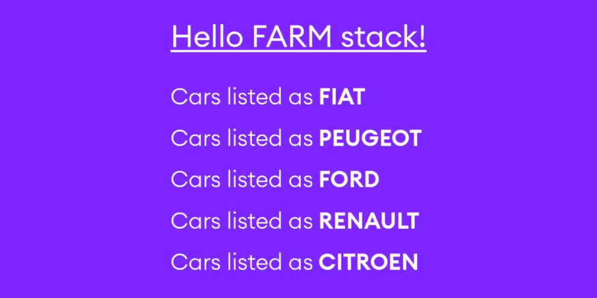
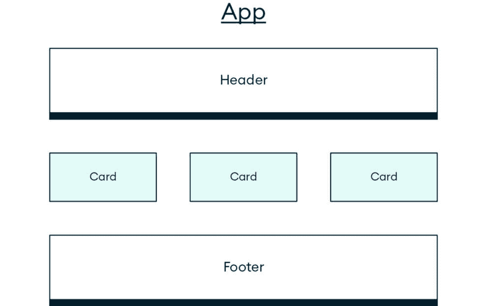
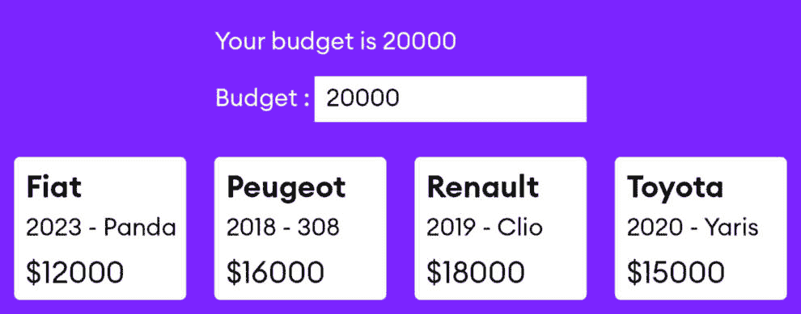

# 第五章：设置 React 工作流程

本章重点介绍 React 库，并讨论了您应该了解的重要主题和功能，以便您能够创建一个非常简单的 React 应用，实际上只是一个前端。在本章中，您将了解 React 的主要功能和最显著的概念。

您将从先决条件和工具开始，例如 Node.js、一些 Visual Studio Code 扩展等。您还将学习如何使用名为**Vite**的新标准和推荐构建工具。与**Create React App**相比，Vite 更高效，允许快速**热模块替换**（**HMR**）和按需文件服务，无需捆绑。捆绑是将多个 JavaScript 文件组合并连接成一个文件的过程，减少了加载页面所需的 HTTP 请求数量。另一方面，**HMR**允许在应用程序运行时实时更新单个模块。

您将设计一个包含几个组件的简单应用，并了解解耦如何帮助您编写模块化和可维护的代码。本章涵盖了两个最重要的 React 钩子以及它们如何解决一些常见的 Web 开发问题。然而，本章的主要目标是讨论探索 React 及其各种功能所需的工具。

到本章结束时，您将拥有一个简单但功能齐全的 React 网络应用。本章中的概念将使您准备好成为一个重视相对简单工具以实现复杂功能，而不受严格框架限制的前端开发者。

本章将涵盖以下主题：

+   React 简介以及如何使用 Vite 创建 React 应用

+   使用 Tailwind CSS 进行样式技术

+   函数组件和 JSX，React 的语言

+   如何使用`useState`和`useEffect`钩子进行状态管理和 API 通信

+   React Router 和其他 React 生态系统内包的功能

# 技术要求

创建基于 React 的应用涉及多个步骤，包括设置构建系统和转换器、创建目录结构等。在您开始开发应用程序之前，您必须安装以下工具：

+   **Vite**：Vite 需要 Node.js 版本 18+或 20+才能运行，但您始终可以查看[`vitejs.dev`](https://vitejs.dev)上的文档以获取更新。

+   **Node.js**：您可以从[`nodejs.org/en/download/`](https://nodejs.org/en/download/)下载适用于您操作系统的 Node.js。在安装时，请勾选所有选项——如果您使用的是 Windows 机器，您希望安装**npm**（**Node.js 的包管理器**）以及可选的额外命令行工具。

+   **Visual Studio Code**：安装一个名为**ES7+ React/Redux/React-Native snippets**的 React 扩展，以帮助加快 React 应用组件的创建。

+   **React 开发者工具**：安装 React 开发者工具浏览器扩展（[`react.dev/learn/react-developer-tools`](https://react.dev/learn/react-developer-tools)）。这使你能够更快地调试你的 React 应用程序并轻松发现潜在问题。

# 使用 Vite 创建 React 应用程序

React 是一个用于构建 **用户界面** (**UI**) 的 JavaScript 库，尤其是用于 **单页应用程序** (**SPAs**)，但也适用于传统的服务器端渲染应用程序。它提供了可重用的 UI 组件，能够管理自己的状态，允许以简单和高可扩展性的方式创建复杂和动态的 Web 应用程序。

React 是基于虚拟 **文档对象模型** (**DOM**) 的。它最小化了实际 DOM 的操作，从而提高了性能。正如介绍中所述，React 的强大生态系统包括 **Next.js**、**Remix.js**、以移动为中心的 **React Native** 以及众多 Hooks。这些功能使开发者能够构建灵活且高性能的应用程序。

Vite 是一个现代构建工具，旨在简化并加快使用 React（以及 Vue.js、Svelte 和其他框架和库）开发 Web 应用程序的速度。它提供了一个快速的开发服务器，支持热模块替换等特性，确保快速更新而不会丢失应用程序的当前状态。与传统设置不同，Vite 将应用程序模块分离为依赖项和源代码，使用 `esbuild` 进行快速依赖项捆绑，并使用原生 **ECMAScript 模块** (**ESMs**) 提供源代码。这种方法导致服务器启动和更新时间更快，从而提高了开发过程中的生产力。

注意

Vite 支持多种类型项目的脚手架搭建，如 Svelte、Preact、Solid.js 等。

让我们从创建一个简单的应用程序开始，你将在本介绍中在此基础上构建：

1.  选择一个你喜欢的文件夹，例如 `chapter5`。使用 `cd` 将其设置为工作目录，然后从你选择的终端运行以下命令以创建一个 React 模板：

    ```py
    npm create vite@latest frontend -- --template react
    ```

1.  与 Create React App 工具不同，Vite 需要手动安装所有 Node.js 依赖项。将工作目录更改为你的 `/frontend` 目录：

    ```py
    cd frontend
    ```

1.  接下来，你可以通过运行以下命令来安装依赖项：

    ```py
    npm install
    ```

    一旦这个过程完成，你将拥有一个正确初始化的 React 项目，准备进行开发。

1.  虽然你可以通过简单的命令 (`npm run dev`) 开始你的项目，但这正是安装你的 CSS 框架 **Tailwind CSS** 的机会，因为它使用 Tailwind CSS 设置更容易开始，而且不需要处理少量捆绑的 Vite 特定的 CSS 样式。运行以下命令以安装 CSS 框架，以便安装 Tailwind 框架并初始化其配置文件：

    ```py
    npm install -D tailwindcss postcss autoprefixer
    npx tailwindcss init -p
    ```

    虽然第一个命令安装了 Tailwind 本身以及一些需要的开发依赖包，但第二个命令创建了一个 `tailwind.config.js` 文件，这是你将用于微调和配置 Tailwind 实例的文件。

1.  设置一个简单的项目来展示基本的 React 概念是有用的。通过替换文件内容来配置你新创建的 `tailwind.config.js` 文件，如下所示。Tailwind 为 React 的配置如下：

    ```py
    /** @type {import('tailwindcss').Config} */
    export default {
      content: [
        "./index.html",
        "./src/**/*.{js,ts,jsx,tsx}",
      ],
      theme: {
        extend: {},
      },
      plugins: [],
    }
    ```

1.  最后，编辑 Vite 创建并填充了一些默认样式的 `src/index.css` 文件。删除所有内容，并插入 `tailwind` 指令：

    ```py
    @tailwind base;
    @tailwind components;
    @tailwind utilities;
    ```

    现在，你有一个基本的 React 应用程序，并已设置 Tailwind。

    这个过程的最新文档通常可以在优秀的 Tailwind CSS 网站上找到（[`tailwindcss.com/docs/guides/vite`](https://tailwindcss.com/docs/guides/vite)），以及 Next.js、Remix.js 和其他框架的类似文档。

    删除 `App.css` 文件，因为你不会使用它，然后按照以下步骤填充你应用程序的着陆页。

1.  用以下代码替换 `App.jsx` 的内容：

    ```py
    export default function App() {
      return (
        <div className="bg-purple-800 text-white min-h-screen p-4 flex flex-col justify-center  items-center">
          <h1 className="text-3xl font-thin">
            Hello FARM stack!
          </h1>
        </div>
      )
    }
    ```

1.  回到终端，使用以下命令启动你的 React 项目：

    ```py
    npm run dev
    ```

如果你打开端口 `5173`（`http://localhost:5173/`）的浏览器标签页，这是 Vite 的默认端口，你会看到一个紫色的屏幕，页面中间有标题 *Hello FARM stack!*。然而，在这个页面背后，有一些代码和许多包，你可以通过查看 Vite 为你构建的前端文件夹来检查这个生成的代码。

注意

在你的项目中，有一个包含所有项目依赖项的 `node_modules` 目录。除非进行极端的调试操作，否则你不需要触摸这个文件夹。

在 `public` 文件夹中，有一些你在这个项目中不会使用的通用文件，例如 png 标志和 `favicon.ico` 文件。这个文件夹将包含 Vite 不会处理的静态资产，例如图片、字体等。你可以保持原样，或者稍后用于需要用户接收且未经 Vite 修改的文件。

在 `/src` 目录中有一个重要的 HTML 文件，名为 `index.html`。这个裸骨文件包含一个具有 `id` 参数的 `div` 元素，这是 React 加载你整个应用程序的地方。

你将在 `/src` 目录下创建大部分应用程序。代表你整个应用程序的 `App.jsx` 文件将位于此文件中，而这个文件反过来将在 `index.html` 文件中根元素的 `id` 参数指定的单个 `div` 元素中渲染。这种复杂性对于 React 在开发过程中仅通过几个额外步骤就能提供的声明式方法来说是必要的。在这个阶段，不同的方法取决于你的用例，因此你可能需要为组件或页面创建额外的文件夹，或者按功能分组功能。

React 允许你以无数种方式为应用程序设置样式。你可以使用经典的 CSS 样式表或 **语法优美的样式表**（**SASS**），你可以选择 JavaScript 风格的对象，或者你可以选择一个现代且高效的解决方案，如 **styled-components**。此外，所有主要的 UI/CSS 框架都有 React 版本，例如 Material UI、Bootstrap 和 Semantic UI。

在整本书中，你将使用 Tailwind CSS，它采用了一种典型的开发者喜欢的非典型方法，因为它不会妨碍你。它非常适合定义基本的简单样式，使页面看起来简单整洁，但如果有需要，它也能很好地实现来自 Figma 或 Adobe XD 文件的像素级设计。

## Tailwind CSS 和安装

Tailwind CSS 是一个以实用工具为首要的框架，它将 CSS 转换为可以直接在标记中使用的类，并使你能够实现复杂的设计。只需向你的 HTML 元素添加类，你就能创建完全样式的文档。查看 Tailwind 文档 [`tailwindcss.com/`](https://tailwindcss.com/)，因为你会用它来满足所有你的 React 样式需求。

你的 `App.jsx` 文件有一个具有以下类列表的 `div` 元素：

+   `bg-purple-800`：使背景为紫色

+   `text-white`：使文本为白色

+   `min-h-screen`：使高度全屏

+   `p-4`：添加填充

+   `flex`：显示一个 flex 容器

+   `flex-col`：将 flex 方向设置为垂直

+   `justify-center`：使项目居中

+   `items-center`：在次轴上居中项目

`className` 来自 **JavaScript 语法扩展**（**JSX**），这是 React 创建 HTML 的语言。Visual Studio Code 会在你输入第一个引号时提供一些自动完成。

这是一个基本的 **React + Tailwind** 设置。如果你想练习 Tailwind CSS，尝试创建一个全高页面，带有一些虚线边框和一些标题。

下一个部分将通过使用 JSX 来探讨 React 最基本的部分。

# JSX 的组件和构建块

根据 2023 年最新的 Stack Overflow 开发者调查 1，React 是开发者的首选，并且仍然是最受欢迎的前端 JavaScript 库。像 FastAPI 一样，React 拥有一个写得非常好且结构化的文档网站 ([`react.dev/`](https://react.dev/))，因此从那里开始并一路向上是你在开始 React 之旅时以及成为资深开发者时能做的最好的事情之一。

1 [`survey.stackoverflow.co/2023/#most-popular-technologies-webframe`](https://survey.stackoverflow.co/2023/#most-popular-technologies-webframe)

简单来说，React 允许你以一种比纯 JavaScript 或第一代 JavaScript 库（如 jQuery）更简单、更高效的方式构建 UI，因为它处理了如果用纯 JavaScript 执行将会非常繁琐且容易出错的操作。React 通过 JSX 实现这一点，JSX 是一种增强的 JavaScript 和 HTML 混合，React 会将其编译成 JavaScript。

更精确地说，JSX 是 React 中用于以直观方式构建交互功能和 UI 的 JavaScript 扩展。它允许你在 JavaScript 中编写类似 HTML 的代码，使代码更容易理解和维护。

React 执行两个基本功能，这在你的新创建的 Vite 项目的 `main.jsx` 文件中是可见的。如果你打开并检查该文件，你会看到导入了两个包。React 负责使用 JSX 等功能，而 ReactDOM 则在 DOM 上执行操作。

每个 React 描述中的关键词是 **声明式**，因此作为开发者，你可以描述（声明）UI 以及相关的数据流和操作。然后，React 将通过其机制和优化来确定如何实现所需的功能。

JSX 是将整个 React 概念粘合在一起的内聚力。React 页面或应用的最小构建块是 **React 元素**。一个简单的元素可能如下所示：

```py
const title = <h1>The Car Sales App</h1>
```

这段代码看起来像 `h1 HTML` 元素，但它也看起来像 JavaScript。这两个观察都是有效的，因为 JSX 允许你创建可以插入到 React 的虚拟 DOM 树中的 React 元素，这与实际的 HTML 不同。React 通过一个称为 **diffing** 的过程来处理更新 DOM 以匹配虚拟 DOM 的繁琐工作，然后通过一个名为 Babel 的工具将 JSX 元素编译成实际的 HTML 元素。

React 元素是不可变的，这意味着一旦你创建了它们，就无法更改它们，正如 React 网站所述，它们就像电影中的单个帧。然而，它们可以被新的元素或帧所替换。

需要注意的是，每个 React 组件，包括你当前的唯一组件`App.jsx`文件，都必须只返回一个元素——一个`div`元素或一个片段（本质上，一个空标签`<>`）以及其中包含的所有 React 元素。以下示例将展示如何构建一些组件：

在你的`App.jsx`文件中创建一些简单的元素，通过粘贴以下代码：

```py
export default function App() {
    const data = [{
            id: 1,
            name: "Fiat"
        },
        {
            id: 2,
            name: "Peugeot"
        },
        {
            id: 3,
            name: "Ford"
        },
        {
            id: 4,
            name: "Renault"
        },
        {
            id: 5,
            name: "Citroen"
        }
    ]
    return (
        <div className="bg-purple-800 text-white min-h-screen p-4 flex flex-col items-center">
            <div className="mb-4 space-y-5">
                <h2>Your budget is {budget}</h2>
                <label htmlFor="budget">Budget : </label>
                <input type="number" className="text-black" step={1000} id="budget" value={budget} onChange={(e) => setBudget(e.target.value)} />
            </div>
            <div className="grid grid-cols-3 gap-4">
                {data.filter((el) => el.price <= budget).map((el) => {
                    return (
                        <Card car={el} key={el.id} />
                    )
                }
                )}
            </div>
        </div >
    );
}
```

当你运行你的 Web 应用时，你应该看到以下页面被渲染：



图 4.1：使用 React 生成的简单页面

## 概述

让我们回顾一下你在 React 应用中创建的内容：

1.  首先，你声明了一些数据，一个简单的汽车品牌列表数组。目前，这些数据是硬编码的，但这个数据可能来自外部 API。

1.  然后，在`return`语句中，你通过使用 JavaScript 的`map`函数映射这个数组，通过引用数组的每个元素作为`el`来迭代。

最后，你需要返回这些元素。在这种情况下，它们是字符串，并且你将它们包裹在`div`元素中。由于`className`关键字，你可以看到 Tailwind 非常详尽地使用了它。最后，在`App.jsx`文件中添加了一些小的改动，这样 React 就不会在控制台抱怨——这是一个关键属性，这样 React 才能处理我们的列表，即使它发生变化。你可以在文档中阅读有关此键的用途和需求：[`react.dev/learn/rendering-lists#keeping-list-items-in-order-with-key`](https://react.dev/learn/rendering-lists#keeping-list-items-in-order-with-key)。

键是一个 React 在创建 DOM 元素数组时需要的唯一标识符，这样它就知道哪个要替换、保留或删除。这是一个相当简单的例子，但它展示了 JSX 的基本功能。需要记住的一个重要事情是，你必须返回*恰好一个元素*，例如一个`div`元素、一个标题或一个 React 片段。毕竟，函数组件是函数（你将只使用函数组件）。

React 没有为遍历对象数组或`if-else`结构提供专门的模板语言和特殊语法。相反，你可以依赖 JavaScript 的全部功能，并使用标准语言特性，如`map`用于遍历数组，`filter`用于过滤数据，三元运算符用于`if-else`结构，模板字符串用于字符串插值，等等。

下一个部分将讨论 React 组件。

## 组件

组件是 UI 的可重用部分。它们是返回 UI 片段或单元的函数，这些片段或单元是用 JSX 编写的。它们是 React 中 UI 的构建块，允许你创建模块化、可重用的代码片段，这些代码片段可以组合成用户界面的所需输出。

*图 4.2* 展示了一个用户界面应用，该界面在视觉上被拆分为独立的组件。每个矩形代表一个导入到主应用组件中的独立组件。有些可能被重复多次，而其他组件，如页眉和页脚，可能只有一个实例：



图 4.2：将应用拆分为组件

规划 React 网站开发的第一阶段之一是识别可以抽象为组件并以某种方式重用或至少抽象为单独单元的区域或部分。

接下来，我们将创建一个用于在页面上显示页眉的最小组件。该组件的任务很简单：显示页眉，在你的情况下，是页面的标题。

在 React.js 中的函数组件定义为具有 `.jsx` 或 `.js` 扩展名的文件，并且像你的 `App.jsx` 文件（根组件）一样，它们必须返回一个单一的 JSX 元素。文件名应该大写。这是一个使用你之前安装的 Visual Studio Code React 扩展的绝佳时刻，因为它提供了创建标准组件的有用代码片段。按照以下步骤操作：

1.  在 `/src` 文件夹中创建一个文件夹，命名为 `components`，并在其中创建一个名为 `Header.jsx` 的新文件。

1.  现在，打开新创建的文件，输入 `rafce`。编辑器应该建议创建一个名为 `reactArrowFunctionExportComponent` 的组件外壳。

1.  从建议列表中选择此条目，你会看到你的文件被填充了一个典型的 ES6 箭头函数组件导出：

    ```py
    const Header = () => {
        return (
            <div>Header</div>
        )
    }
    export default Header
    ```

    此文件定义了一个单一的 JSX 最顶层元素——称为 `Header`——并在底部导出它。

1.  对此文件进行一些编辑，使用我们的 Tailwind CSS 框架类来创建一个 `div` 元素。在此阶段，不必担心响应式或花哨的配色。用以下代码替换 `Header` 元素：

    ```py
    const Header = () => {
      return <div className="text-3xl border-yellow-500 border-4 p-4">Header</div>;
    };
    export default Header;
    ```

1.  在这些编辑（纯粹与 Tailwind 相关）之后，将第一个组件导入到我们的 `App.jsx` 文件中。导入以相对路径处理——记住，点表示文件的当前目录（在你的情况下是 `/src`），而 `/components` 是你存放组件的文件夹。`App.jsx` 文件还应包含一个 `Header` 组件的实例。用以下代码替换 `App.jsx` 文件的内容：

    ```py
    import Header from "./components/Header";
    export default function App() {
      const data = [
        { id: 1, name: "Fiat" },
        { id: 2, name: "Peugeot" },
        { id: 3, name: "Ford" },
        { id: 4, name: "Renault" },
        { id: 5, name: "Citroen" },
      ];
      return (
        <div className="bg-purple-800 text-white min-h-screen p-4 flex flex-col justify-between items-center">
          <Header/>
          <h1 className="text-3xl font-thin border-b-white border-b m-3">
            Hello FARM stack!
          </h1>
          <div>
            {data.map((el) => {
              return (
                <div key={el.id}>
                  Cars listed as{" "}
                  <span className="font-bold">{el.name.toUpperCase()}</span>
                </div>
              );
            })}
          </div>
        </div>
      );
    ```

1.  如果你没有停止 `npm run dev` 进程，Vite 应该会自动为你重新加载应用。

你会看到你的简单网页现在有一个简单的页眉组件。它是一个 `H1` 元素，并有一些基本的格式化，因为它呈紫色，居中，并带有黄色边框。你以自闭合标签的形式导入了组件。值得注意的是，组件可以是自闭合的，或者（例如，`H1` 标签）可以包含通过子元素提供的数据。

你刚刚制作了第一个非常简单的 React 函数组件。通过这种方式，你可以将整个网站的功能分解开来。你可以添加页脚、一些导航等。将应用程序分解成组件并决定什么应该构成一个单独的组件的过程非常重要，React 文档有一个专门的页面介绍了这个过程：[`reactjs.org/docs/thinking-in-react.html`](https://reactjs.org/docs/thinking-in-react.html)。

## 创建动态组件

制作这样的组件既方便又快捷，但如果输出是固定的，可能会变得繁琐。幸运的是，React 组件是函数，函数可以接受参数，然后对这些参数进行有用的操作。假设你想创建一个组件，用它来替换你的普通汽车品牌列表，并以更令人愉悦和更有信息量的方式显示信息。你可以传递数据数组中每个汽车的数据（一个对象），并按指定方式格式化。

要重新执行显示列表的流程，请按照以下步骤操作：

1.  在`components`文件夹中创建一个新文件，命名为`Card.jsx`，并输入`rafce`以获取正确的组件模板。用以下代码替换`Card`组件：

    ```py
    const Card = ({ car: { name, year, model, price } }) => {
        return (
            <div className="bg-white rounded m-4 p-4 shadow-lg">
                <h1 className="text-2xl text-gray-600">{name}</h1>
                <p className="text-sm text-gray-600">{year} - {model}</p>
                <p className="text-lg text-right text-gray-600 align-text-bottom">${price}</p>
            </div>
        )
    }
    export default Card
    ```

    与你之前制作的`Header`组件不同，这个组件接受 props，即定义组件行为的属性。`Card`组件是一个简单的可重复使用的抽象，在需要的地方重复出现在页面上。你还使用了 ES7 对象*解构*，使组件看起来更易于阅读，并且不必重复`props.name`、`props.model`等。

1.  更新`App.jsx`主文件，以正确使用`Card`。用以下代码替换`App.jsx`的内容：

    ```py
    import { useState } from "react";
    import Card from "./components/Card";
    export default function App() {
        const data = [
            { id: 1, name: "Fiat", year: 2023, model: "Panda", price: 12000 },
            { id: 2, name: "Peugeot", year: 2018, model: "308", price: 16000 },
            { id: 3, name: "Ford", year: 2022, model: "Mustang", price: 25000 },
            { id: 4, name: "Renault", year: 2019, model: "Clio", price: 18000 },
            { id: 5, name: "Citroen", year: 2021, model: "C3 Aircross", price: 22000 },
            { id: 6, name: "Toyota", year: 2020, model: "Yaris", price: 15000 },
            { id: 7, name: "Volkswagen", year: 2021, model: "Golf", price: 28000 },
            { id: 8, name: "BMW", year: 2022, model: "M3", price: 45000 },
            { id: 9, name: "Mercedes", year: 2021, model: "A-Class", price: 35000 },
            { id: 10, name: "Audi", year: 2022, model: "A6", price: 40000 }
        ]
        const [budget, setBudget] = useState(20000)
        return (
            <div className="bg-purple-800 text-white min-h-screen p-4 flex flex-col items-center">
                <div className="mb-4 space-y-5">
                    <h2>Your budget is {budget}</h2>
                    <label htmlFor="budget">Budget : </label>
                    <input type="number" className="text-black" step={1000} id="budget" value={budget} onChange={(e) => setBudget(e.target.value)} />
                </div>
                <div className="grid grid-cols-3 gap-4">
                    {data.map((el) => {
                        return (
                            <Card car={el} key={el.id} />
                        )
                    }
                    )}
                </div>
            </div>
        );
    }
    ```

1.  接下来，目标是使用新创建的`Card`组件，并传递所有所需的数据。用以下代码更新`Card.jsx`：

    ```py
    const Card = ({ car: { name, year, model, price } }) => {
        return (
            <div className="bg-white rounded m-4 p-4 shadow-lg">
                <h1 className="text-2xl text-gray-600">{name}</h1>
                <p className="text-sm text-gray-600">{year} - {model}</p>
                <p className="text-lg text-right text-gray-600 align-text-bottom">${price}</p>
            </div>
        )
    }
    export default Card;
    ```

现在，在通过数据映射时，你不再返回`div`元素，而是返回你的`Card`组件，并传递给它键——即`car`对象的 ID。请注意，ID 必须是唯一的，否则 React 将在控制台抛出警告，表明我们没有指定它。此外，你传递了一个可以称为`el`的东西，并将其设置为元素——即来自你的数据数组的`car`对象。

你的`Card`组件现在能够显示与汽车相关的数据——每张卡片都包含一辆汽车的数据。你通过 props（简称属性）将数据传递给每张卡片。你只需在组件中接受它即可。

向组件传递 props 很容易，但由于 props 提供单向通信，在大多数应用程序中，你还将不得不处理**状态**，这将在下一节讨论。

## 事件和状态

React 提供并包装了所有标准的 DOM 事件——按钮和链接点击、表单提交、鼠标悬停、按键和键释放，等等。在 React 中处理这些事件相对直观。一个点击事件将由一个名为 `onClick` 的合成事件来处理；事件命名使用 **驼峰命名法**。在 React 中，**事件处理程序**是在发生交互时被触发的函数。这些函数接受函数处理程序作为属性，这些处理程序是其他函数。最简单的情况是点击一个按钮（尽管它可以是任何 DOM 元素）。

在 `/components` 目录中创建一个名为 `Button.jsx` 的文件，其中包含一个按钮，当点击时，会在控制台中显示一条消息：

1.  在执行 `racfe` 操作后，将以下代码粘贴到你的 `Button.jsx` 文件中：

    ```py
    const Button = () => {
        const handleClick = () => {
            console.log("click")
        }
        return ( <
            button className = "bg-white text-purple-800 hover:bg-gray-300 p-3 rounded-md"
            onClick = {
                handleClick
            } > Button < /button>
        )
    }
    export default Button
    ```

    这是一个简单的示例，它展示了底层机制；`onClick` 是 React 知道它应该监听什么事件的反应方式，而 `handleClick` 函数执行你的（相当简单）业务逻辑。如果你将按钮导入 `App.jsx` 文件并点击按钮，你应该在控制台中看到消息。

1.  实现非常简单；更新 `App.jsx` 组件，如下所示：

    ```py
    import { useState } from "react";
    import Card from "./components/Card";
    import Button from "./components/Card";
    export default function App() {
      const data = [
        { id: 1, name: "Fiat", year: 2023, model: "Panda", price: 12000 },
        // continued
      ];
      const [budget, setBudget] = useState(20000);
      return (
        <div className="bg-purple-800 text-white min-h-screen p-4 flex flex-col items-center">
          <div className="mb-4 space-y-5">
            <h2>Your budget is {budget}</h2>
            <Button />
            <label htmlFor="budget">Budget : </label>
            <input
              type="number"
              className="text-black"
              step={1000}
              id="budget"
              value={budget}
              onChange={(e) => setBudget(e.target.value)}
            />
          </div>
          <div className="grid grid-cols-3 gap-4">
            {data.map((el) => {
              return <Card car={el} key={el.id} />;
            })}
          </div>
        </div>
      );
    ```

## 带有事件和状态的 React 钩子

React 的组件本质上是将状态转换为用户界面的函数。一个 React 组件是一个接受 props 作为参数的函数。它可以被视为一个可更新的数据结构，负责组件的行为。函数的输出，即组件，是一个 JSX 元素。本质上，React 钩子是功能结构，它使你能够访问组件的生命周期并改变其状态。

虽然有许多标准的 React 钩子和许多外部的钩子，但你将只使用两个，这两个是最基本的 React 理解：`useState` 和 `useEffect`。这两个钩子将保留在即将到来的 React 版本 19 中，而其他如 `useMemo`、`useCallback` 以及一些其他钩子将被逐渐弃用。同样，掌握 React 需要一些时间，但许多标准的 UI 功能可以通过这两个钩子的巧妙组合来实现。

### 使用 `useState` 创建有状态变量

`useState` 钩子允许你在组件中维护某种状态。例如，你可能想在你的单页应用（SPA）中维护某种状态，这样网站就不会根据你指定的预算显示任何太贵的汽车。你可以创建一个简单的文本框，将其设置为仅显示数值，并将其与名为 `budget` 的状态变量连接起来。

将 `App.jsx` 文件的内容替换为以下代码：

```py
import { useState } from "react";
import Card from "./components/Card";
export default function App() {
  const data = [
    { id: 1, name: "Fiat", year: 2023, model: "Panda", price: 12000 },
    { id: 2, name: "Peugeot", year: 2018, model: "308", price: 16000 },
    { id: 3, name: "Ford", year: 2022, model: "Mustang", price: 25000 },
    { id: 4, name: "Renault", year: 2019, model: "Clio", price: 18000 },
    { id: 5, name: "Citroen", year: 2021, model: "C3 Aircross", price: 22000 },
    { id: 6, name: "Toyota", year: 2020, model: "Yaris", price: 15000 },
    { id: 7, name: "Volkswagen", year: 2021, model: "Golf", price: 28000 },
    { id: 8, name: "BMW", year: 2022, model: "M3", price: 45000 },
    { id: 9, name: "Mercedes", year: 2021, model: "A-Class", price: 35000 },
    { id: 10, name: "Audi", year: 2022, model: "A6", price: 40000 }
  ]
  const [budget, setBudget] = useState(20000)
  return (
    <div className="bg-purple-800 text-white min-h-screen p-4 flex flex-col items-center">
      <div className="mb-4 space-y-5">
        <h2>Your budget is {budget}</h2>
        <label htmlFor="budget">Budget : </label>
        <input type="number" className="text-black" step={1000} id="budget" value={budget} onChange={(e) => setBudget(e.target.value)} />
      </div>
      <div className="grid grid-cols-3 gap-4">
        {data.filter((el) => el.price <= budget).map((el) => {
          return (
            <Card car={el} key={el.id} />
          )
        }
        )}
      </div>
    </div >
  );
}
```

在前面的示例中，你首先从 React 中导入 `useState` 钩子。`useState` 钩子返回两个值：

+   一个变量，可以是任何你想要的东西——一个数组或一个对象，一个简单的数字，或一个字符串

+   一个设置此状态变量值的函数

虽然你可以使用任何合法的 JavaScript 名称，但使用变量的名称——在你的情况下，`budget`——以及以相同名称前缀的名称是一个好习惯：`setBudget`。通过这一行简单的代码，你已经告诉 React 设置一个名为`budget`的状态单元，并设置一个设置器。`useState()`调用的参数是初始值。在以下情况下，你将其设置为 20,000 美元。

以下图像显示了带有可更新预算框的更新后的 Web 应用：



图 4.3：列出汽车

现在，你可以在整个页面上自由使用这个状态变量。在这里，你将`useState`调用放在了`App`函数组件内部——如果你尝试将其放在其他地方，它将不会工作：钩子从定义组件本身的函数体内部访问组件的生命周期！

一直向下到组件的底部，你添加了一个简单的文本框。你可以使用 HTML 将其设置为仅显示数值，步长为`1000`，并添加一个`onChange`处理程序。

这是一个再次强调的好时机，即 React 使用所谓的**合成事件**，它是浏览器原生事件的一个包装器，使 React 能够实现跨浏览器兼容性。一旦你记住了几个差异（事件使用的是 camelCase 而不是小写，你必须将它们传递给 JSX 中的函数），你将很快就能编写事件处理程序。

在你的应用中，你向文本框添加了一个`onChange`事件，并设置它来处理状态，然后你设置了预算的新值。每次你更改值时，`setBudget`函数都会触发，因此预算更新，并显示符合你的预算约束条件的不同`Card`实例。

这个`onChange`事件获取文本框的当前值（`target.value`，就像原始 DOM 事件一样，因为它只是一个包装器），并使用我们定义在函数上方刚刚的`useState`调用将你的预算状态设置为这个值。

最后，你添加了一个使用此预算值并显示它的`div`元素组件。你已经在你的应用根组件中添加了一个状态变量。你可以设置它、获取它，并在页面上显示它。

现在，你已经完成了开发 React 应用时典型的另一个任务。你允许用户输入他们的预算，并在页面上显示它。如果你想区分符合该预算的汽车和不符合的汽车，你可以使用一些简单的 JavaScript 和组件状态。为了使这生效，将当前硬编码的小数据样本设置为状态变量本身，这样用户就可以过滤它并仅显示那些在价格范围内的汽车。

这个过程很简单，涉及到纯 JavaScript 来完成显示满足价格小于或等于你的预算条件的汽车数组的任务。提示：使用以下代码示例中加粗显示的 JavaScript 过滤数组：

```py
{data.filter((el) => el.price <= budget).map((el) => {
    return (
        <Card car={el} key={el.id} />
        )
    }
)}
```

到目前为止，你可以深入研究优秀的 React.js 文档，了解更多关于`useState`Hook 及其兄弟 Hook `useReducer`的信息（[`react.dev/reference/react/useState`](https://react.dev/reference/react/useState)）。这是一个可能被视为`useState`Hook 泛化的 Hook。它最适合当你必须处理多个相互关联的状态时，使用多个简单的`useState`Hook 来管理它们可能会变得繁琐且难以维护。

在本节中，你看到了如何通过`useState`Hook 以非常简单直接的方式添加一个有状态的变量，以及如何通过常规事件来操作状态。

接下来，你将学习如何将你的数据从高效的 FastAPI 后端传输到你的 React.js 前端。你将了解另一个名为`useEffect`的 Hook。

# 使用`useEffect`与 API 和外部世界进行通信

在这里，你可以使用免费的模拟 REST API。然而，你确实需要解决访问外部数据以及管理外部事件的问题。外部指的是什么，你可能想知道？

你已经看到，React 及其强大的 Hooks 围绕着同步 UI 到状态和数据这一任务。组件可以包含其他组件，它们共同构成了所谓的**组件树**，然后这个组件树会不断与当前状态进行比较。React 负责所有这些协调工作，以确定应该渲染、更新以及更多。

在 React 数据流过程之外的事件被称为**副作用**。以下是一些显著的 React 副作用示例：

+   执行 API 调用——从外部服务器发送或接收数据

+   通过 WebSockets 或流订阅外部数据源

+   在本地存储或会话存储中设置或获取数据值

+   事件监听器和它们的清理函数

记住，React 在一个持续的数据流中工作，其底层系统不断扫描更新，并准备好重新渲染它认为需要更新的组件。以下示例将说明这一点。

假设你正在开发你的*汽车销售*应用程序，并且你需要列出所有注册了账户的用户。当前的任务既简单又常见。你有一个专门的页面——它将存在于一个名为`/users`或类似 URL 上，并且应该用来自外部 API 的数据（想象一下一个包含对象的 JavaScript 数组）填充。这个 API 将由 FastAPI 提供支持，但就目前而言，你将使用一个现成的模拟解决方案，称为 Jsonplaceholder。

你需要发出的`GET`请求应指向 URL [`jsonplaceholder.typicode.com/users/`](https://jsonplaceholder.typicode.com/users/)。

你已经了解了如何创建组件，为它们提供 props 并设置状态，所以这不应该是个问题。当涉及到从外部 API 加载数据时，你可能只是使用像 `Fetch` 或 `Axios` 这样的工具，就像你在使用一个普通的纯 JavaScript 应用程序一样。`Fetch` 和 `Axios` 是用于向服务器发起 HTTP 请求的最流行的两个 JavaScript 库。

尝试在 React 组件中获取数据并将状态设置为结果 JSON 将会启动一个**无限循环**。记住，React 在异步代码存在的服务器组件之前就已经存在了。

每当组件的状态发生变化并且组件被重新渲染时，新的渲染会再次触发对 API 的 `fetch` 调用，状态再次改变以设置为用户列表，等等。

在这个组件的数据流中，数据的获取被认为是外部的——不是主组件生命周期的一部分。它是在组件执行之后执行的。

为了处理这个问题，React 有一个非常优雅的解决方案——`useEffect` 钩子。你可以通过编辑 `App.jsx` 主组件来创建一个新的应用程序，然后从你的 API 端点显示用户列表。

你可以使用 `useEffect` 钩子实现一个可能的解决方案。将以下代码粘贴到你的 `App.jsx` 文件中（参考 `App3.jsx`）：

```py
import { useState, useEffect } from "react";
export default function App() {
    const [users, setUsers] = useState([]);
    useEffect(() => {
        fetchUsers();
    }, []);
    const fetchUsers = () => {
        fetch("https://jsonplaceholder.typicode.com/users")
            .then((res) => res.json())
            .then((data) => setUsers(data));
    };
    return (
        <div className="bg-purple-800 text-white min-h-screen p-4 flex flex-col items-center">
            <h2 className="mb-4">List of users</h2>
            <div className="grid grid-cols-3 gap-4">
                <ol>
                    {users.map((user) => (
                        <li key={user.id}>{user.name}</li>
                    ))}
                </ol>
            </div>
        </div>
    );
}
```

在 `App.jsx` 文件顶部，导入 `useState` 和 `useEffect`，然后你可以开始创建你的唯一状态变量——`users` 数组，将其初始化为空数组。

`fetchUsers` 函数很简单——它调用 API 并使用承诺返回 JSON 格式的数据，也可以是一个 `async`/`await` 函数。

`useEffect` 钩子，就像所有钩子一样，是在组件函数内部执行的。然而，它不返回任何值，它接受两个参数：要执行的功能（在这种情况下，`fetchUsers`），以及一个依赖数组，一个值数组的改变将触发效果的重新执行。如果函数应该只触发一次，则数组应为空。如果你想从下一个 API URL 获取其他用户，你必须将 URL 添加到数组中。

与 `useState` 一样，其中还涉及许多细微之处。例如，你可以在 `useEffect` 体的底部提供一个清理函数，以确保任何长期效果都被移除，但这应该能给你一个如何处理调用外部 API 的动作的基本概念。

此外，`useContext` 允许 React 覆盖整个组件区域并直接传递值，而无需通过可能实际上不需要它的几个组件传递，这个过程被称为属性钻取。你甚至可以创建自己的钩子并抽象出可以在应用程序的多个地方重用的功能，确保更好的可维护性和减少重复。

随着 Hooks 的引入，整个生态系统变得更加清晰和简洁，将业务逻辑映射到 UI 的过程也变得更加流畅和逻辑化。

你现在拥有了在组件或应用中设置和获取状态，以及以可预测和可控的方式与外部 API 服务通信所需的知识，同时编写干净和简单的代码。仅仅使用 React 和其 Hooks 就可以让你获得网络开发的专业技能，但围绕 React 构建的整个生态系统中的包和模块同样重要和有用，就像核心库一样。

# 探索 React Router 和其他有用的包

到目前为止，你只创建了一些单页应用，但还没有接触一些高级功能。然而，单页应用并不局限于单个 URL。例如，当你导航到你的 Gmail 账户时，你会看到 URL 会随着你可能采取的每个动作而改变。

虽然有几种解决方案可以实现单页应用中的路由，但 React Router 是标准解决方案，它是一个经过充分测试的成熟包。

前端页面路由的底层理念是它应该能够根据加载的路由在同一个页面上渲染不同的组件。例如，`/about` 路由会导致应用在主 `App` 组件中加载一个名为 `About.jsx` 的组件，移除之前加载的其他组件。该包提供了一个基本结构，在 `BrowserRouter` 类中，可以用来包装整个根 `App` 组件。

React 是如此受欢迎的框架，以至于有一个多样化的工具和集成生态系统，你可以了解。正如你之前已经看到的，除了 Tailwind，你几乎可以使用任何 UI 或 CSS 框架，无论是直接使用还是通过一些优化的 React 版本，如 Bootstrap，或者更紧密地与 React 结合，如 Ant Design。你可以通过 Framer Motion 的微妙动画来增强用户体验，也可以通过一些优秀的表单库如 React Hook Form 来加速表单的开发。对于复杂的状态问题，Redux 是最受欢迎和最广泛采用的行业标准，但还有许多针对本地和全局状态管理的较小或专用库，如 **Recoil**、**Zustand** 或 **React Query**。

# 摘要

本章简要介绍了世界上最受欢迎的用户界面库——React.js。

本章还详细介绍了 JSX 是什么以及为什么它对开发者来说如此方便。它探讨了 React 的基本构建块——函数组件，以及在设计它们时必须遵循的基本规则。它还介绍了两个基本的 React Hooks，当结合使用时，允许你开始构建基本的用户界面，维护和更改组件的状态，以及与外部 API 交互。

最后，本章介绍了实现一些可以使开发自定义应用时生活更轻松的 React 库。这些库都拥有优秀的文档，并且经常更新。

下一章将利用这些基础知识以及 React 来创建一个简单但功能齐全且动态的应用程序。
