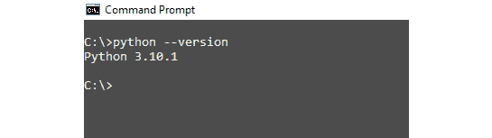

# 1

# 使用 React 和 Flask 准备全栈开发

首个网站创造者，蒂姆·伯纳斯-李爵士，设想了互联网作为一个开放平台，将允许互联网用户在没有地理和文化限制的情况下共享信息、获取机会和协作。有趣的是，软件开发者正在创新地推动这一使命的实现。

作为开发者，我们使功能丰富的 Web 应用程序成为可能，对全球的个人和企业产生积极影响。除了共享信息外，互联网已经从单纯的静态网页转变为动态和数据库驱动的 Web 应用程序。Web 技术专家正在提出新的工具和技术，使互联网上信息的访问变得无烦恼且方便。

到本章结束时，你将更好地理解在客户端-服务器架构背景下全栈 Web 开发。我们将讨论 Web 应用程序的前端与数据库驱动的后端之间存在的重大交互。

拥有这些技能集将使你进入全栈 Web 开发者的名人堂。这包括从零开始启动 Web 应用程序开发项目并将其转变为完整 Web 应用程序所需的所有知识。无论你是独立开发者还是在协作团队中担任开发者角色，全栈 Web 开发的知识将增强你高效执行的能力。此外，你将拥有灵活性，以适应团队设置中分配的任何角色。

此外，我们将深入了解使用 React 的原因，这是一个用于构建 Web 应用程序用户界面的 UI 库。你将简要了解 React 的世界以及为什么 React 对于构建复杂的现代 Web 应用程序界面组件至关重要，这些组件使用户能够拥有流畅的体验。

开发 Web 应用程序需要设置开发环境。在全栈 Web 应用程序开发中，前端和后端有各自独立的开发环境。我们将讨论如何设置 React 作为前端以及 Flask 作为后端技术，以支持基于服务器的处理和数据库交互。

此外，我们还将深入了解如何准备使用**Git**，这是一个源代码版本控制工具，帮助开发者跟踪代码库的变化。你应掌握足够的基本知识，以便启动将代码部署到**GitHub**，一个在线版本控制平台。

在这个技术创新和创意软件开发盛行的时代，源代码版本控制是开发的一个基本组成部分。它促进了软件开发者之间的协作，以解决开源或商业项目中的问题。

我们将以讨论本书中将要构建的实战项目*Bizza*来结束本章。该项目将带你从前端 Web 应用的角度，到数据库驱动的后端，连接到 REST API 层以促进通信。

因此，无需多言，让我们开始体验使用两个热门技术栈——**React**和**Flask**——的全栈 Web 应用开发世界。到本书结束时，你将能够开发全栈应用。

在本章中，我们将涵盖以下主要主题：

+   全栈 Web 开发的介绍

+   我们为什么选择 React？

+   我们为什么选择 Flask？

+   准备使用 Git

+   我们在构建什么？

# 技术要求

本章的完整代码可在 GitHub 上找到：

[`github.com/PacktPublishing/Full-Stack-Flask-and-React/tree/main/Chapter01`](https://github.com/PacktPublishing/Full-Stack-Flask-and-React/tree/main/Chapter01)

# 全栈 Web 开发的介绍

现代 Web 应用复杂且快速演变。商业社区的需求和系统要求正在推动软件开发者超越仅作为前端或后端开发者的能力。Web 开发者开发全栈应用的能力现在比以往任何时候都更加重要，并且正在上升。

在本书中，我们将专注于全栈 Web 开发，这指的是 Web 开发的客户端和后端部分。前端，有时被称为*客户端*，是用户可以看到并与之交互的任何 Web 应用的可见部分。后端，有时被称为*服务器端*，是程序员代码所在的部分，与数据库和其他服务器基础设施相结合。

精通客户端（前端开发）和服务器端（后端开发）的 Web 开发者通常被称为*全栈*开发者。

在本书中，我们将使用 React 作为库来开发直观的**用户界面**（**UI**）或前端，以及使用**微框架**Flask 来构建后端业务逻辑组件。

让我们更仔细地看看这些工具以及我们选择它们的原因。

# 我们为什么选择 React？

为 Web 应用构建用户界面是 Web 开发的一个基本部分。有趣的是，大多数 Web 开发者发现很难选择最合适的 JavaScript 前端库或框架来构建用户界面。稍后我们将看到为什么选择 React 将有助于你的职业发展和项目。

**React** 是一个流行的开源库，Meta Platforms（前身为 Facebook）的出色开发者社区正在积极维护它。根据 *Stack Overflow 2021 开发者调查* 报告，React 是最常用的库，其中 41.4% 的专业开发者表示他们在过去一年中使用了 React ([`insights.stackoverflow.com/survey/2021#section-most-popular-technologies-web-framewors`](https://insights.stackoverflow.com/survey/2021#section-most-popular-technologies-web-framewors))。那么，React 的争议在哪里呢？

React 简单易用，可以开发丰富的交互式用户界面。你可以立即开始为你的网络项目构建可重用的界面组件。它也易于学习，正如你在本书中将要开始的 frontend 项目实现中将会看到的那样。如果你已经熟悉 JavaScript，学习 React 真的非常简单，因为 React 以 JavaScript 为中心。

React 能够与互联网共存这么长时间的主要原因是它在像 *Facebook*、*Uber Eats*、*Skype* 和 *Netflix* 这样的技术巨头中的使用。此外，作为一个库，React 专注于构建 UI 组件——仅此而已。它以组件为基础的方法开发 Web 和移动应用程序，使其在开发者中非常受欢迎。

React 中对 **文档对象模型**（**DOM**）的进一步抽象化，称为虚拟 DOM，提高了 React 应用程序中的效率和性能。React 使用一种特殊的语法，称为 **JavaScript XML**（**JSX**），允许你在 JavaScript 中编写 HTML 元素，这与在 HTML 元素中放置 JavaScript 的传统做法相反。

你不必学习像 Handlebars、EJS 和 Pug 这样的复杂模板语言。JSX 帮助你使用熟悉的 HTML 语法编写 React 组件，这得益于一个名为 **Babel** 的转换器。一些 JavaScript 框架非常具有意见性——例如 Angular、Ember.js 和 Vue。这些框架有严格的构建 Web 应用程序的结构方式，与 React 不同，React 给你选择库、架构和工具的自由和灵活性。

此外，如果你对开发移动应用程序感兴趣，React Native 可以是一个非常有价值的工具。你对 React 及其组件的了解，这些组件可以无缝地与原生视图集成，使你能够高效地创建 Android 和 iOS 应用程序。

现在，让我们动手设置 React 环境。

## 使用 React 设置开发环境

在本节中，你将为本书中我们将构建的 React 应用程序项目设置开发环境。

要在你的本地机器上编码和测试 React 应用程序，你需要采取以下几步：

1.  安装 Node.js：

    1.  要下载和安装 Node.js 的稳定版本，请访问 [`nodejs.org/en/`](https://nodejs.org/en/)。

    **Node.js** 是 JavaScript 及其扩展（如 React 应用程序）的运行时开发环境。Node.js 随附一个命令行实用工具和包管理器，称为 **Node 包管理器** （**NPM**）。Node.js 和 NPM 是成功构建和运行任何 React 应用程序所需的工具。

    1.  点击并下载为大多数用户推荐的版本。按照安装步骤进行安装。

    1.  要检查 Node.js 是否成功安装，请在您的命令提示符中输入以下内容：

        ```py
        $    node -v
        ```

    1.  要检查 NPM 的版本，请在终端或 Windows 的命令提示符 (`cmd`) 中输入以下内容：

        ```py
        $    npm -v
        ```

    以下截图显示 node 和 `npm` 正在运行。


图 1.1 – 显示 Node.js 和 NPM 正在工作的截图

1.  安装 **Visual Studio Code** （**VS Code**）。

    **VS Code** 是一个免费的代码编辑器，您可以使用它来构建和调试网络应用。VS Code 编辑器的即点即用的代码方法使其成为开发的一个优秀工具。VS Code 具有内置的 IntelliSense 代码补全和代码重构功能。VS Code 中的第三方扩展和数百种网络技术工具可以让您更高效地工作。

注意

开发者还有其他代码编辑器可供选择，但 VS Code 非常推荐。

1.  安装 Git 客户端。

    Git 客户端是用于与 Git 仓库交互的命令行界面。在本章的后面部分将有更多关于 Git 的内容。我们需要这个工具来跟踪项目文件中的更改。要安装 Git 客户端，从 [`git-scm.com/downloads`](https://git-scm.com/downloads) 下载它：

    1.  选择您的 **操作系统** （**OS**） 类型并安装软件。


图 1.2 – Git 下载页面的截图

1.  要测试您是否成功安装了 Git，请在您的系统命令提示符中输入以下内容：

```py
$    git --version
```


图 1.3 – 显示 Windows 中 Git 客户端版本的截图

我们现在已经为将要构建的 React 应用程序设置了开发环境。这完成了前端开发环境。让我们也为 Flask 做同样的事情，并深入探讨为什么你需要选择 Flask 来构建你的后端。

# 为什么我们应该选择 Flask？

**Flask** 是一个用于开发现代 Python 网络应用的简约框架。它是一个构建企业级、可扩展、可靠和可维护应用的优秀工具包。

此外，该框架易于学习。Flask 没有开发者必须使用的样板代码，与许多替代框架（如 Django）不同。它核心上绝对轻量。作为微框架的 Flask 只为开发者提供构建网络应用的起始组件，而 Django 则倾向于建议你使用其框架内完整的一套齿轮或组件以某种结构来构建你的网络应用。

使用 Flask，开发者有惊人的自由度来选择他们的数据库、模板引擎和部署流程；他们还可以决定如何管理用户、会话、网络应用和安全。

Flask 的可扩展性促使一些科技公司迁移到 Flask 以高效地实施他们的微服务基础设施。**微服务**是一个小型、独立且松散耦合的软件组件，专注于在更大的应用架构中执行特定功能。

微服务就像拥有一支由专家组成的团队，每个专家专注于特定任务，和谐地共同工作以创造惊人的成果。正如你可能会同意的，云计算已经不可逆转地改变了应用开发和部署。云计算中的规模科学正在使其成为初创公司和企业的常态。*Pinterest* 就是这样一个例子。

Pinterest 是世界上访问量最大的网站之一。它是一个图片分享和社交媒体服务平台。根据 Statista 的数据，截至 2021 年第四季度，Pinterest 平均每月有 4.31 亿活跃用户 ([`www.statista.com/statistics/463353/pinterest-global-mau/`](https://www.statista.com/statistics/463353/pinterest-global-mau/))。他们最初使用 Django 框架启动平台，后来选择了 Flask 来开发他们的 API 并构建一个更稳定的微服务架构。

Flask 仍然是 Pinterest，一个高流量社交网络应用的主要核心后端技术。总的来说，在 Flask 中开发 API 和集成各种数据库更容易。你可以凭借这样的简单性和灵活性保证来信赖它。如果你精通 Python，那么你应该能够轻松地为 Flask 应用做出贡献。

Flask 更少地强加观点，因此需要学习的标准更少。相反，Django 提供了你开发网络应用所需的一切——一个盒子里的完整解决方案。然而，扩展问题是最有经验的 Python 开发者在他们的 Django 项目中必须处理的问题。

当你在项目中实施现成的解决方案时，你将不得不处理一个庞大的 Django 框架，这可能会对你的项目上市时间和性能产生负面影响。

当你在项目中结合这些经过实战考验的技术栈，React 和 Flask，你可以确信在可扩展性、可靠性、可重用性、可维护性以及安全的网页和移动应用开发方面将获得开发上的收益。

在本节中，我们讨论了为什么你应该将 React 和 Flask 添加到你的网络应用程序开发工具包中。

## 使用 Flask 设置开发环境

如果你想在本地计算机上使用 Flask 作为后端框架来开发网络应用程序，你需要安装 Python 和一些其他包。在本节中，我们将设置 Flask 开发环境。为此，请按照以下步骤操作：

1.  安装 Python。

    ```py
    $    python –version
    ```

    你将得到以下输出：



图 1.4 – 显示 Python 版本的截图

或者，你可以使用以下命令：

```py
$    python -c "import sys; print(sys.version)"
```

注意

在 macOS 或 Linux 中，`Python3 —version` 命令也可以用来检查 Python 版本号，以及扩展到 Python 安装。

如果你的计算机系统上尚未安装 Python，请访问 [`www.python.org/downloads/`](https://www.python.org/downloads/)，选择适合你操作系统的最新版本，并在你的系统上下载和安装它。

1.  更新 `pip`。

    `pip`，在你的终端中输入此命令：

    ```py
    $      python -m pip install --upgrade pip
    ```

1.  创建虚拟环境。

```py
python3 -m venv venv to explicitly specify Python 3 to create the virtual environment.
```

对于 Windows 用户，如果你遇到问题，请尝试输入以下内容：

```py
$      py -m venv venv
```

注意

根据你本地机器上的 Python 版本，使用 `venv` 用于 Python 3，使用 `virtualenv` 用于 Python 2。

1.  在 Windows 中激活虚拟环境：

    ```py
    $    venv\Scripts\activate
    ```

注意：

如果执行命令 `$ venv\Scripts\activate` 没有按预期工作，我建议读者尝试使用 `$` `venv\Scripts\activate.bat`。

在 macOS 或 Linux 上激活虚拟环境：

```py
$    source venv/bin/activate
```

1.  安装 Flask:

    ```py
    $    pip install flask
    ```

    以下截图显示了 Flask 安装命令的操作。


图 1.5 – 显示 Flask 安装终端命令的截图

1.  要测试 Flask 开发环境，在你的项目目录中创建一个名为 `app.py` 的文件。在 VS 代码编辑器中打开 `app.py` 文件，并粘贴以下内容：

    ```py
    from flask import Flaskapp = Flask(__name__)@app.route('/')def index():    return 'Welcome to Bizza Platform!'if __name__ == '__main__':    app.run()
    ```

1.  打开终端并设置你的环境变量：

    使用 `.env` 或 `.flaskenv` 来存储你的环境变量和秘密。在 `.flaskenv` 中，添加以下内容：

    ```py
    FLASK_APP=app.pyFLASK_ENV=developmentFLASK_DEBUG=true
    ```

1.  然后，在终端中输入 `pip install python-dotenv` 命令来安装 `Python-dotenv`。使用 `python-dotenv`，你可以将 `.env` 或 `.flaskenv` 文件中的变量加载到你的应用程序环境中，使它们像直接设置系统环境变量一样可访问。

1.  要运行 Flask 应用程序，使用以下命令，你将得到类似于 *图 1**.6* 的输出：

    ```py
    $    flask run
    ```


图 1.6 – 显示如何运行 Flask 应用程序的截图

注意

要取消激活虚拟环境，只需运行 `$` `deactivate`。

在为 Flask 设置并测试了开发环境之后，我们将简要讨论 Git，以了解源代码版本控制在 Web 应用开发中的位置以及 GitHub 如何提供了一个在线协作平台来处理源代码并鼓励团队合作。

# 准备使用 Git

**Git**是软件开发中的版本控制工具。那么，版本控制是什么意思呢？

作为一名专业开发者，你需要尽可能多地编写代码。假设你正在处理一个项目，并且已经完成了 80%。项目负责人要求你向代码库添加一个新功能，这是紧急的，因为客户希望你的团队将此作为将在几天内展示的最小可行产品所需的功能之一。

你迅速放弃了之前正在处理的工作，开始着手这个新功能。你更改了一个或两个文件以整合新功能。在尽可能短的时间内，你使新功能工作。不幸的是，在尝试添加新功能时，你不小心修改了其他文件中的代码，甚至不知道哪个文件受到了影响。

现在想象一下，你有一个可以告诉你代码中更改了什么以及确切更改的代码行的神灯。那不是太棒了吗？生活将变得超级简单，节省你大量的开发时间。这就是版本控制的魔力！

版本控制帮助您跟踪软件项目中代码库的变化。这是帮助开发者监控其源代码变化的一种很好的方式。此外，它简化了开发团队的协作工作。有了版本控制，您可以跟踪代码库的变化、谁在更改代码库以及何时发生更改。而且，如果更改不可取，您可以快速撤销它们。

开发者多年来使用了许多不同的版本控制工具。Git 恰好是当前的市场领导者。

## Git 是如何工作的？

Git 被称为**分布式版本控制软件**。在一个需要团队成员之间协作的工作环境中，整个源代码的完整副本将存储在每个贡献者的本地计算机系统上；我们可以称之为本地仓库。

Git 跟踪本地仓库，记录本地仓库中发生的所有更改。它节省了你将多个项目版本保存在计算机上不同本地目录中的时间和精力。这使得在协作者之间共享源代码更改变得轻而易举。

Git 中有三个主要的状态，你应该了解：

+   **修改状态**：在这个状态下，文件已经更改，但这些更改尚未被 Git 添加到本地数据库中。这些更改是自上次提交到文件以来的更改。

+   **暂存状态**：在这个状态下，Git 已经跟踪了这些更改，将在下一次提交中将这些更改添加到 Git 本地数据库中。

+   **已提交**：在此状态下，更改的文件已成功添加到 git 本地数据库中。

让我们深入了解版本控制概念，并学习如何创建本地和远程仓库。在此之前，了解 Git 和 GitHub 之间的区别将很有帮助。

## Git 与 GitHub 的区别

如前所述，Git 是一个开源的版本控制工具。它简单用于跟踪代码库中的更改，跟踪更改的人的身份，并允许开发者之间的团队编码协作。当你将项目设置在本地机器上时，Git 用于跟踪所有活动的更改 – 添加文件、更新现有文件或创建新文件夹。

它基本上保存了你的源代码的历史记录。相反，GitHub 是一个基于云的源代码托管和项目管理服务。它简单允许你使用 Git 作为工具，将你的代码库保存在远程托管环境中以跟踪代码库中的更改，或允许开发者协作工作在项目上。

### 设置本地仓库

从 [`git-scm.com/download/`](https://git-scm.com/download/) 安装 Git 客户端。如果你已经在你的机器上安装了它，则忽略此步骤：

1.  让我们在终端中创建一个名为 `local_repository` 的工作目录：

    ```py
    $      mkdir local_repository
    ```

1.  将目录设置为工作目录：

    ```py
    $      cd local_repository
    $      touch index.html
    ```

    你将得到以下输出：


图 1.7 – 创建 index.html 的屏幕截图

注意

如果你遇到错误，`'touch'` 不是一个内部或外部命令，不是一个可操作的程序或批处理文件，使用 `touch index.html`，如果你的终端上安装了 Node.js，请输入 `npm install -g touch-cli`。

1.  设置你的全局凭据：

    ```py
    $    git config --global user.name "Name of User"$    git config --global user.email "test@test.com"
    ```

    使用前面的命令，你设置了全局用户名和电子邮件地址作为凭据，以跟踪你在项目源代码中的贡献。

1.  你的工作目录现在有一个新文件，`index.html`。在终端中输入此命令，你将得到类似于 *图 1.8* 的输出：

    ```py
    $    git init
    ```


图 1.8 – 显示创建空 Git 仓库的屏幕截图

使用 `git init`，你创建了一个空的本地 Git 仓库。Git 现在有一个本地数据库或目录，其中包含跟踪工作目录中更改的所有元数据。`.git` 文件夹通常隐藏在你的工作目录中。

1.  要将工作目录的内容添加到你的仓库中，请输入以下命令：

    ```py
    $    git add index.html
    ```

    这代表了 Git 中的暂存状态。更改将由 Git 跟踪，并在下一次提交时添加到 Git 本地数据库中。

1.  为了验证这一点，输入以下命令，你将得到类似于 *图 1.9* 的输出：

    ```py
    $    git status
    ```


图 1.9 – 显示 Git 暂存状态的屏幕截图

注意

要添加多个内容，请输入 `git add`。

1.  现在，你需要将本地仓库提交。这个提交阶段可以帮助你通过友好的消息跟踪代码库中的更改。要使用消息标志进行提交，请输入以下命令，你将得到类似于 *图 1**.10* 的输出：

    ```py
    $    git commit -m "first commit"
    ```


图 1.10 – 展示 Git 提交状态的截图

注意

在提交命令中包含消息始终是最好的实践。这有助于跟踪更改，如果你需要回滚，你可以使用提交消息作为你的保存点。

现在你已经了解了如何创建本地仓库，向其中添加文件，以及将文件从暂存区过渡到提交状态。让我们简要讨论如何你在 GitHub 上创建远程仓库，以在云端存储你的源代码，以便可能的协作。

### 使用 GitHub 设置远程仓库

在当今的数字时代，GitHub 已经成为软件开发项目中无缝协作和版本控制的一项基本技能。让我们深入了解如何使用 GitHub 设置远程仓库：

1.  在 GitHub 网站上创建一个开发者账户：[`github.com/`](https://github.com/)。


图 1.11 – 展示 GitHub 注册页面的截图

1.  登录并点击 **新建**，你将看到以下屏幕：


图 1.12 – 展示 Git 预发布状态的截图

1.  一旦你创建了新的仓库，请在当前工作目录中输入以下命令：

    ```py
    $    git remote add origin https://github.com/your-git-username/your-repository-name.git$    git branch -M main$    git push-u origin main
    ```

    前面的命令将你的本地仓库移动到一个远程云端仓库，以跟踪你的代码库更改。

总结来说，我们讨论了 Git 作为现代网络开发者所需的一项工具。你现在知道了 Git 和 GitHub 之间的区别。我们还讨论了用于版本控制操作的基本、有用的命令，无论是在本地还是远程仓库中。接下来，我们将深入探讨本书中我们将使用 React 和 Flask 构建的实际项目。

# 我们将构建什么？

在本书中，我们将构建一个全栈、数据库驱动的网络应用程序，用于会议演讲者。它被称为 *Bizza*。用户将能够查看他们感兴趣的活动演讲者目录、活动、日程以及演讲者所展示的论文标题。解决方案将包括使用 React 进行前端开发、身份验证、授权以及使用 Flask 设计 REST API。

我们将首先在本书的前几章中实现前端，然后在后面的章节中实现后端。

# 摘要

在本章中，我们简要介绍了现代全栈 Web 开发，重点介绍了前端和后端开发者的区别。我们讨论了 React 在构建 Web 应用程序用户界面中的重要性，并解释了为什么 React 和 Flask 是开发全栈 Web 应用程序的完美工具，因为与行业中的竞争对手相比，它们具有简单、高效和高性能的特点。同时，我们也涵盖了 React 和 Flask 的开发环境。

最后，我们讨论了 Git 作为版本控制工具的重要性以及本书中将要构建的项目*Bizza*。

在下一章中，我们将更深入地解释 React 中的组件、属性和状态，以便更好地理解 React 应用程序是如何构建的。我们将讨论典型的 React 项目结构，目的是学习文件和目录的功能。
