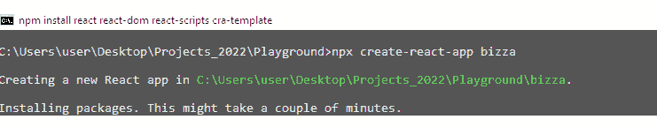
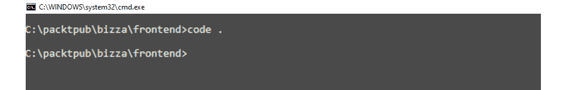
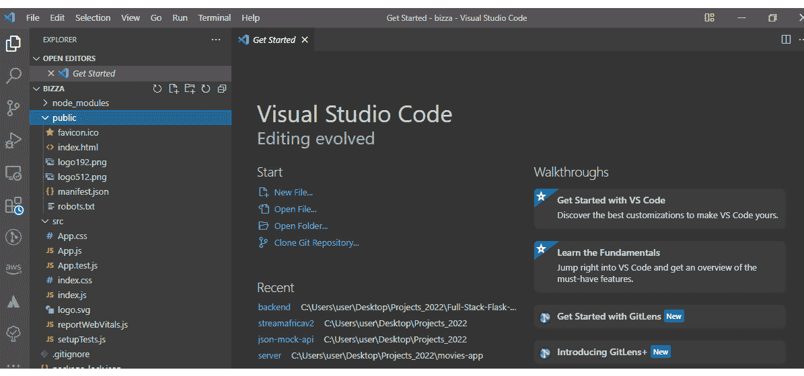
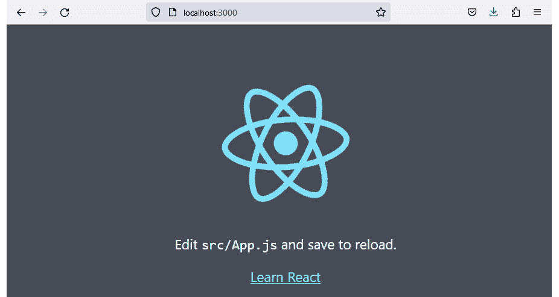
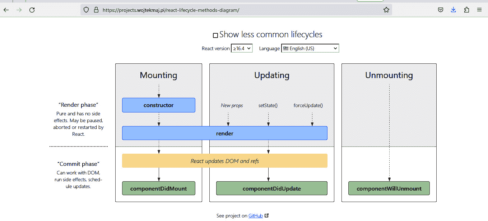

# 第二章：React 入门

到目前为止，我们已经为使用现代软件栈理解全栈 Web 开发奠定了坚实的基础。希望您已经在本地机器上设置了 React 开发环境。如果没有，您可以回到*第一章*，*使用 React 和 Flask 准备全栈开发*，并重新阅读*使用 React 设置开发环境*部分。

在本章中，我们将系统地以微妙的方式开始向您介绍 React 的世界。您将学习许多酷炫的概念和技术，这将帮助您开发直观的用户界面，使用户能够与您的 Web 应用程序进行交互。您将学习如何在无需复杂配置的麻烦下启动您的第一个 React 项目，并了解每个 React 项目所需的基本目录结构。然后，您将学习如何在 React 中使用 ES6 特性。

**组件**是任何 React 应用程序的构建块。在本章中，您将了解组件的概念以及如何使用它们在 React 中构建用户界面。这些知识对于在项目中构建现代前端技术至关重要。通过详细的使用案例，您将了解 React 中 props 的使用，用于在组件之间传递信息，以及状态如何为 React 应用程序添加交互性。

到本章结束时，您将以实际的方式掌握开始任何 React 项目所需的技能集。您还将对 React 的核心功能（组件、props 和状态）有更深入的理解，以开发任何 Web 应用程序的交互性。

在本章中，我们将涵盖以下主要内容：

+   探索 React 项目目录结构

+   React 中的箭头函数

+   理解解构是什么

+   默认和命名导出

+   什么是 React 组件？

+   什么是 props？

+   React 状态

# 技术要求

本章的完整代码可在 GitHub 上找到：[`github.com/PacktPublishing/Full-Stack-Flask-and-React/tree/main/Chapter02`](https://github.com/PacktPublishing/Full-Stack-Flask-and-React/tree/main/Chapter02)。

# 探索 React 项目目录结构

稍后，我们将设置一个 React 应用程序项目。创建 React 应用程序有许多方法。您可以使用**Create React App**工具生成一个没有构建配置的样板应用程序。这不需要您具备复杂的配置知识。

您可以直接关注应用程序的实现。这正是本书将要使用的。如果您愿意探索**Vite**([`vitejs.dev/`](https://vitejs.dev/))，它也是另一个用于快速设置 React 应用程序的下一代前端工具。

创建 React 应用程序的另一种方式需要了解 Webpack 和 Babel 配置。现在，不再拖延，让我们深入了解创建我们的 React 项目应用程序。你被期望跟随操作。

打开你的终端并输入以下命令：

```py
npx create-react-app frontend
```

你将得到以下输出：



图 2.1 – create-react-app 命令的截图

设置完成后，导航到`frontend`文件夹：

```py
$ cd frontend
```

现在，我们可以在命令行中使用`code .`打开应用程序：



图 2.2 – create-react-app 的截图，显示在项目根目录中打开 VS Code 编辑器的代码

在 VS Code 编辑器中会出现以下提取的文件夹和文件结构：

```py
frontend/--node_modules/
--public/
----index.html
----manifest.json
--src/
----App.css
----App.js
----App.test.js
----index.css
----index.js
--.gitignore
--package-lock.json
--package.json
--README.md
```

以下截图显示了 VS Code 项目目录结构的截图：



图 2.3 – 显示项目目录结构的截图

因此，让我们快速浏览一下前面的文件和文件夹列表，以了解它们的各自用途：

+   `node_modules/`：这个文件夹包含使用 Create React App 工具安装的所有 node 包。所有的`dependencies`和`devdependencies`都存储在这里。值得注意的是，我们将来安装的所有后续包也将保存在这个文件夹中。

+   `public/`：这个文件夹包含重要的公共文件，如`public/index.html`和`public/manifest.json`：

    +   `index`文件在开发环境或托管域名中显示在`localhost:3000`上。本质上，这个文件将 React 组件的执行结果放在公共视图的`index`文件根`div`容器中。

    +   该文件夹还包含`manifest.json`文件，其中包含应用程序元数据和响应式屏幕显示的详细信息。

+   `src/`：这是 React 应用程序开发中最关键的文件夹。你超过 80%的编码活动时间都将在这里度过。因此，了解你在这个文件夹内确切地做什么非常重要。这个文件夹包含组件和一些其他文件，例如`src/App.js`、`src/App.css`、`src/index.css`、`src/App.test.js`和`src/index.js`：

    +   `src/App.js`文件用于实现 React 组件。如果你正在处理一个小项目，你可以用它来实现你的应用程序，而无需创建其他组件文件。你所有的组件代码都将放在一个单独的文件中。随着你的应用程序的增长，你可能会考虑将组件拆分成多个组件文件。通过这种拆分，每个文件将维护一个或多个组件。

    +   `src/App.css`文件用于设置组件的样式。同样，`src/index.css`文件也用于设置整个应用程序的样式。这两个文件都可以编辑以满足您的样式要求。

    +   `src/App.test.js`文件用于编写 React 应用的单元测试。

    +   `index.js`文件是您的 React 应用的入口点。

+   `.gitignore`: 此文件包含不应跟踪和添加到项目中 Git 仓库的文件和文件夹列表。例如，`node_modules`总是列在文件中，因为它仅在开发环境中需要。

+   `package.json`: 此文件包含项目中使用的节点包依赖和其他元数据。这使得使用**Node 包管理器**（**npm**）在另一台计算机系统上设置相同内容变得非常容易，无需太多麻烦。

+   `package-lock.json`: 此文件存储了您通过`npm`安装的包的版本号。这确保了从`npm`到其他开发者的本地计算机系统安装包的一致性。

+   `README.md`: 这是一个 Markdown 文件。`README.md`文件帮助开发者提供有关他们项目的说明和必要信息。在 GitHub 上，您可以使用`README.md`文件显示项目存储库中包含的内容。Create React App 工具会为我们自动生成此文件。

现在您已经了解了 React 项目中文件夹和文件结构的一些用途，让我们在终端中运行`npm start`命令，以查看默认的 React 应用：



图 2.4 – 本地 host:3000 上 React 应用主页的截图

注意

以下显示了某些消息，例如成功消息、可用脚本以及安装 React 后如何启动开发服务器：

+   `npm start`: 启动开发服务器

+   `npm run build`: 将应用打包成用于生产的静态文件

+   `npm test`: 启动测试运行器

总结来说，我们讨论了如何使用 create-react-app 工具来增强您的 React 应用。现在您已经详细了解了每个文件夹和文件的含义。有了这些，您可以有信心知道如何设置 React 应用。让我们通过讨论箭头函数来开始下一节。箭头函数是**ECMAScript 2015**（**ES6**）的一个特性。它们是 JavaScript 中编写函数的一个便捷的补充，使得编写函数变得轻而易举！

# React 中的箭头函数

**箭头函数**为 JavaScript 中定义函数提供了更简洁、更易读的语法。箭头函数因其简洁的语法和隐式返回而成为 React 开发中广泛使用的一个特性：您将在稍后更好地理解这些含义。

在传统的 JavaScript 中，您必须定义一个常规函数来将两个数字相加，如下所示：

```py
function addNumbers(a, b) {    return a + b;
}
```

不错，对吧？但箭头函数可以使这更加简单和优雅。看看这个：

```py
const addNumbers = (a, b) => {    return a + b;
};
```

非常酷？将 `function` 关键字替换为看起来很酷的箭头 `=>`，如果你的函数只是一行代码，你可以省略花括号和 `return` 语句：

```py
const addNumbers = (a, b) => a + b;
```

基本上，你通过遵循以下语法规则来定义箭头函数：

```py
const functionName = (parameters) => {    return returnValue;
};
```

或者，对于函数体仅由一个表达式组成时的更短函数定义和隐式返回，可以使用这个规则：

```py
const functionName = (parameters) => returnValue;
```

箭头函数由于其简洁的语法和好处，常在 React 应用中使用，尤其是在定义函数组件、处理事件回调和映射数组时。在这本书的学习过程中，我们将看到更多箭头函数的使用。

然而，需要注意的是，箭头函数并不是常规函数的完全替代品。它们有一些限制，例如没有自己的 `this` 上下文，这使得它们不适合某些用例，例如定义对象方法。

当在定义对象方法时使用箭头函数，它们没有自己的上下文，因此无法正确访问对象内的名称属性。让我们通过以下代码示例来更好地说明这一点。

```py
const speaker = {    name: 'Alice Andrew',
    sayHi: function () {
        console.log(`Hi, I'm ${this.name}!`);
    },
};
speaker.sayHi(); // Output: Hi, I'm Alice Andrew!
```

现在，让我们使用箭头函数来定义对象方法：

```py
const speaker = {    name: 'Alice Andrew',
    sayHi: () => {
        console.log(`Hi, I'm ${this.name}!`);
    },
};
speaker.sayHi(); // Output: Hi, I'm undefined!
```

总结来说，箭头函数是 ES6 中的一个绝佳特性，可以使你的代码更简洁、更易于工作。它们非常适合短函数，并且可以使 React 开发者的生活变得更加轻松。

接下来，我们将探讨另一个酷炫的 ES6 功能：**解构**。你需要解构技术来能够以更简洁和可读的方式从数组或对象中提取值。

# 理解解构是什么

**解构**是一种简单的 JavaScript 表达式，确保你能够从数组中提取多个值或从对象中提取属性到单独的独特变量中。解构是 React 中用于管理数据的一些令人惊叹的 JavaScript ES6 功能之一。

ES6 是改进 JavaScript 语言标准过程中的一个重要里程碑。解构将从数组和对对象提取数据提升到一个新的简洁水平。在 ES6 之前，你可以这样声明并从数组中提取数据：

```py
const speakers = ["John", "Walke", "Dan", "Sophie"];const firstspeakerName = speakers[0];
const secondspeakerName = speakers[1];
const thirdspeakerName = speakers[2];
const fourthspeakerName = speakers[3];
console.log(firstspeakerName); // "John"
console.log(secondspeakerName); // "Walke"
console.log(thirdspeakerName); // "Dan"
console.log(fourthspeakerName); // "Sophie"
```

使用解构，代码看起来是这样的：

```py
const speakers = ["John", "Walke", "Dan", "Sophie"];const [firstspeakerName, secondspeakerName,
    thirdspeakerName,fourthspeakerName] = speakers
console.log(firstspeakerName) // "John"
console.log(secondspeakerName) // "Walke"
console.log(thirdspeakerName) // "Dan"
console.log(fourthspeakerName) // "Sophie"
```

如果我们想在数组中跳过 `"John"` 并将数组中剩余的项输出到控制台，我们可以这样做：

```py
const speakers = ["John", "Walke", "Dan", "Sophie"];const [, ...rest] = speakers // the … used is called the
                                spread operator
console.log(rest)// output: "Walke", "Dan", "Sophie" John
                    will be skipped
```

此外，不仅数组可以进行解构；你还可以在对象中进行解构。例如，以下代码展示了如何解构对象属性：

```py
const speakers = {    id: 1,
    name: "Juliet Runolf",
    jobTitle: "Director, Marketing",
    company: "Abernatny Group",
    address: {
    street: "Okaland Dtuse",
    city: "Greenland",
    state: "Houston",
    country: "USA",
    }
}
function App()
{
    const {name, jobTitle, company} = speakers;
    //destructuring of object properties
    return (
        <>
            <div>
                <h2>Name: {name}</h2>
                <h4>Position: {jobTitle}</h4>
                <h4>Company: {company}</h4>
            </div>
        </>
    );
}
```

你可以看到我们如何在前面的代码片段中提取属性值。甚至可以解构对象中的嵌套 `address` 属性：

```py
const {name, jobTitle, company, address} = speakers;// destructuring of object properties
const {street, city, state, country} = address;
// destructuring of nested address property
    return (
    <div> <h2>Name: {name}</h2>
        <h4>Position: {jobTitle}</h4>
        <h4>Company: {company}</h4>
        <h4>Street: {street}</h4>
        <h4>City: {city}</h4>
        <h4>State: {state}</h4>
        <h4>Country: {country}</h4>
    </div>
  );
}
```

那么，在 React 应用中使用解构赋值有哪些好处？解构赋值使你的代码更加紧凑且易于理解。它允许你直接从对象中提取特定属性或从数组中提取元素，减少了重复使用点符号或数组索引的需求。

此外，解构赋值允许你为属性设置默认值 - 例如，看看以下代码行：

```py
const { name = 'Anonymous', age = 0} = speaker
```

上述代码在处理可选或可能未定义的数据时非常有用，并且需要默认值。解构赋值在访问组件中的`props`和`state`时被使用。哦，你不知道`components`、`props`和`state`是什么？别担心，我们将在本章稍后讨论这些概念。

总结来说，解构赋值允许程序员以简单的方式访问数据，即使在数组和对象中的复杂嵌套数据。它显著提高了代码的可读性和访问质量。如果你想在 React 应用中缩短代码行数，解构赋值显然有帮助。它有助于减少应用中使用的代码量。

在 React 应用开发中，接下来需要理解的两个酷炫概念是默认导出和命名导出。让我们深入探讨并理解这些 React 概念。

# 默认导出和命名导出

如前所述，ECMAScript 2015，也称为 ES6，是提高 JavaScript 语言标准的重要里程碑。其中添加的新特性包括模块和能够使用`import`表达式。模块使我们能够更好地将代码库组织成逻辑单元。基本上，模块可以是执行特定任务的一个或多个相关函数。它们使得在项目间重用代码变得更加容易。

在 React 中，我们使用默认导出来使组件函数、变量、类或对象对其他组件文件可用。每个文件只允许有一个默认导出。

例如，以下代码使得从`Speaker`组件导入文件成为可能：

```py
import Speaker from './Speaker';
```

以下代码使得将文件导出到另一个组件文件成为可能：

```py
function App(){
    return (
    <div>  …   </div>
    );
}
    export default App; // Specifically, this code line
                           makes it possible to export the
                           file to another component file
```

在命名导出中，每个文件可以有多个命名导出。当你想要导入时，你可以用大括号命名特定的导入，如下所示：

```py
import { FirstComponent, SecondComponent } from "./ThirdComponent";
```

总结来说，默认导出和命名导出是使特定函数在 React 项目的任何组件间可用的一种方式。

接下来，我们将深入探讨 React 组件的核心本质，并对其目的和功能有一个清晰的理解。

# 什么是 React 组件？

**组件**是任何 React 应用的核心构建块。有时，你可以把 React 看作是加了点巧克力的 JavaScript。我想巧克力是甜的，React 也是。说真的，用纯 JavaScript 构建 UI 可能会很繁琐。你可能会在昂贵的 DOM 困境中挣扎！

问题是，当使用纯 JavaScript 处理 **文档对象模型**（**DOM**）时，这可能会相当昂贵——无论是时间还是精力。在非 React 应用程序中，频繁的 DOM 操作很高，这最终导致网站元素更新的缓慢。

**虚拟 DOM** 在 React 中解决了这个问题。DOM 只更新更改的部分，而不是整个 DOM 树。然而，如果您记得您是如何在纯 JavaScript 中使用函数的，编写组件不会是一个挑战。JavaScript 中的函数本质上是一个代码块，用于执行某些任务。

这同样适用于 React 组件，它们是可重用、可维护且自包含的代码块，用于返回 UI。在 React 中，组件返回混合了 JavaScript 的 HTML 元素。

React 有两种类型的组件：**类组件**和**函数组件**。在这本书中，我们将采用函数组件编码模式来开发我们的 React 应用程序。

函数组件是 React 的现在和未来，所以如果您刚开始学习 React，函数组件比编写类组件所涉及的额外内容更容易学习。如果您已经熟悉 React 中的类组件，您仍然可以使用函数组件与类组件一起使用。如果您发现自己正在使用遗留的 React 代码库，逐步迁移到函数组件绝对值得考虑。

通过以下步骤，让我们学习如何定义一个函数组件并在 React 应用程序中使用它：

1.  在 React 项目的 `src/` 文件夹中打开 `App.js` 文件。`src/App.js` 文件包含以下代码：

    ```py
    import logo from './logo.svg';import './App.css';function App() {    return (        <div className="App">            <header className="App-header">                                <p>                    Edit <code>src/App.js</code> and                        save to reload.                </p>                <a                    className="App-link"                    href="https://reactjs.org"                    target="_blank"                    rel="noopener noreferrer">                    Learn React                </a>            </header>        </div>    );}export default App;
    ```

1.  让我们删除文件中的所有样板代码，以便更容易理解代码结构。用以下代码片段替换前面的代码片段：

    ```py
    function App() {    return (        <div>            <h1>Welcome to Bizza Platform</h1>        </div>    );}export default App;
    ```

注意

您的 `src/App.js` 文件现在应该看起来像前面的代码片段。

1.  保存文件，在命令行中使用 `npm start` 启动您的应用程序，您将得到以下输出：


图 2.5 – 展示 npm start 命令输出的截图

1.  检查 **Welcome to Bizza Platform** 是否显示在您的浏览器上。如果是，您仍然走在正确的道路上。


图 2.6 – 本地主机 3000 上的 React 应用程序主页截图

那么，让我们更深入地研究代码块中的每个元素，以更好地理解函数组件。

## 函数组件

如前所述，函数组件在概念上是一个典型的 JavaScript 函数，具有接收数据作为 props 并以 JavaScript XML 形式返回 HTML 元素的能力。

在前面的代码中，`App` 组件在其函数定义中还没有任何参数。

这就是您在 React 应用程序中定义 `App` 组件的方式：

```py
    function App() {.....}
```

代码返回以下 HTML 元素：

```py
    return (        <div>
            <h1>....</h1>
        </div>
    );
```

`App` 组件返回 HTML 代码。返回的 HTML 代码是 HTML 和 JavaScript 的混合体。这被称为**JavaScript XML**（**JSX**）。JSX 是 React 中用于在 JavaScript 中直接编写类似 HTML 代码的语法扩展。JSX 使得在 React 组件中描述用户界面结构变得更加容易。在*第五章* *React 中的 JSX 和显示列表*中，我们将深入讨论 JSX。

如前所述，我们将在这本书中更多地关注函数组件。如果你熟悉用纯 JavaScript 编写函数，React 中的函数组件肯定会让你感到熟悉。在 React 函数组件中，你可以在函数定义和 `return` 语句之间有实现细节。

例如，让我们检查 `src/App.js` 中的 `App` 组件：

```py
function App() {    // you can perform some operations here.
    return (
        <div>
            <h1>Welcome to Bizza Platform</h1>
        </div>
    );
}
export default App;
```

在函数体中定义的任何变量都会在每次函数运行时重新定义：

```py
function App() {    const speakerName = 'John Wilson';
    // variable declared inside function component body
    return (
        <div>
            <h1>Welcome to Bizza Platform, {speakerName}
                </h1>
        </div>
    );
}
export default App;
```

使用 `npm start` 启动浏览器并检查浏览器中的更新内容。

如果你的服务器仍在运行，你不需要再次使用 `npm start`。每次你保存文件时，你的应用程序都会重新编译并显示更新后的视图：


图 2.7 – 展示前一个代码片段输出的截图

此外，你可以在组件体外部定义你的变量：

```py
const speakerName = 'John  Wilson';// variable declared outside function component body
function App() {
    return (
        <div>
            <h1>Welcome to Bizza Platform, {speakerName}
                </h1>
        </div>
    );
}
export default App;
```

在函数组件中，函数操作的结果可以是*第一次运行*或*在更新时重新渲染*。然而，如果你不需要函数组件体内的任何内容，你可以在函数组件外部定义你的变量；否则，考虑在函数组件体内定义它。

总结来说，我们已经能够讨论 React 中的函数组件以及如何编写和显示函数组件的内容。接下来，我们将讨论类组件以及为什么它们被称为**有状态组件**。

## 类组件

React 提供了使用函数或类来构建 UI 组件的灵活性。类组件是扩展 `React.Component` 的 JavaScript 类，并调用返回 HTML 元素的 `render` 方法。类是有状态的，在 React 团队提出 Hooks 之前，这是 React 中管理状态的唯一方式。关于 Hooks 的更多内容将在*第三章* *使用 React Hooks 管理状态*中讨论。让我们看看编写最小化 React 类组件的类代码语法。

在 `src/` 中创建一个 `SpeakerProfile.js` 文件，并在 `src/SpeakerProfile.js` 中输入以下代码：

```py
import React from 'react';class SpeakerProfile extends React.Component {
    render() {
        return <h1>This is the class component expression
            from Speaker Profile!</h1>;
    }
}
export default SpeakerProfile;
```

让我们逐行分析代码以了解它们的功能：

+   `import React from 'react'`：这允许我们在代码文件中使用 React 的核心功能

+   `class SpeakerProfile extends React.Component { }`：这允许我们创建继承自 `React.Component` 基类 `SpeakerProfile` 类组件

+   `render() { return <h1>...</h1>;}`：每个类组件都必须有一个返回 HTML 元素的`render`函数

上述代码行解释了 React 类组件的基本结构。

在`src/App.js`中添加以下内容：

```py
import React from 'react';import SpeakerProfile from './SpeakerProfile';
function App(){
    return (
        <div style={{backgroundColor: 'gray', margin:20,
            color:'white'}}>
        <SpeakerProfile  />
        </div>
    );
}
export default App;
```

如果你的`http://localhost:3000/`服务器仍在运行，你将看到以下屏幕。如果没有，请打开你的终端并转到你的工作目录，然后输入`npm start`命令：


图 2.8 – 展示类组件输出的截图

注意

`<SpeakerProfile` `/>`组件被添加到`src/App.js`中，用于渲染`SpeakerProfile`组件的内容。

让我们比较一下我们在`src/SpeakerProfile.js`中编写的类组件的函数组件等价物：

```py
import React from 'react';const SpeakerProfile =()=> {
return <h1>This is a function component equivalent to a
    class component !</h1>;
}
export default SpeakerProfile;
```

因此，你可以看到函数组件的代码行数更少——这意味着它们可以更加优雅、简洁和易于阅读。当使用函数组件时，你不需要定义一个`render()`方法，组件本身就是一个返回 JSX 的函数，这使得代码更加简单和易于阅读。

让我们简要讨论一下类组件和函数组件之间的细微差别。

### 类组件与函数组件

创建类组件时，你必须使用`extend`关键字从`React.Component`继承，并创建一个负责返回 React 元素的`render`方法。在函数组件中，没有`render`函数。它接受`props`作为参数并返回 HTML 元素。

与无状态的函数组件相比，类组件是有状态的。在 Hooks 出现之前，使函数组件有状态的唯一方法是将其重写为类组件。现在，随着 React 16.8 版本的推出，Hooks 的出现使得函数组件也可以有状态。

在类组件中，你可以利用 React 的生命周期方法，如`componentDidMount()`、`componentDidUpdate()`和`componentWillUnmount()`。然而，在 React 函数组件中，你不能使用这些生命周期方法。

总结来说，我们讨论了 React 中的类组件以及如何编写和显示类组件的内容。接下来，我们将讨论组件生命周期，以便更好地设计可重用和可维护的 React 组件。

## 组件生命周期

到目前为止，我们已经看到了每个 React 应用程序的组件化特性。组件之间相互交互，为 Web 应用程序提供用户交互的界面。然而，组件——我们与之交互的每个 UI 的构建块——也有生命周期。

就像生活一样，涉及不同的阶段；我们出生，然后成长，然后死亡。React 组件也会经历阶段。它们经历三个阶段：挂载、更新和卸载。每个阶段都将简要讨论。

### 挂载阶段

这代表了 React 组件的出生阶段。这是组件实例被创建并插入到 DOM 中的阶段。在这个阶段有四个方法，按照顺序如下列出：

1.  `constructor()`: 这个方法在挂载阶段被调用，实际上是在组件挂载之前。调用 `constructor()` 方法接受 `props` 作为参数。这之后会调用 `super(props)`。然而，`constructor()` 方法有两个主要目的：

    +   通过将对象赋值给 `this.state` 在类组件中初始化本地状态

    +   绑定事件处理方法

1.  `static getDerivedStateFromProps()`: 这个方法在渲染 DOM 中的元素之前立即被调用。

1.  `render()`: 这个方法是最重要的，它总是需要用于输出 React HTML 元素。它通常将 HTML 注入到 DOM 中。你界面上看到的内容取决于这个 `render` 方法以 JSX 形式返回的内容。

1.  `componentDidMount()`: 这个方法在 React 组件渲染到 DOM 树后启动，基本上是在第一次 `render()` 调用之后。`componentDidMount()` 方法允许你在组件挂载后执行用户操作和其他副作用。例如，`componentDidMount()` 方法可以运行需要从外部源加载数据的语句。此外，当组件渲染后，你可以触发用户或系统事件。

### 更新阶段

这是 React 组件的假设成长阶段。这个阶段发生在组件生命周期挂载阶段之后。在这个阶段通常使用 `componentDidUpdate()` 方法。每当数据状态或属性发生变化时，React 组件都会被更新。使用 `render()` 方法重新渲染状态，并将更新的状态返回到 UI。

### 卸载阶段

这个阶段被认为是组件生命周期过程的死亡阶段。在组件从 DOM 树卸载之前，立即调用 `componentWillUnmount()` 方法。

通常，Web 应用程序有许多用户界面，例如按钮、表单输入、手风琴标签页，甚至在我们的应用程序中还有导航栏。用户倾向于从一个组件交互移动到另一个组件，总体上有一个反应性的体验。

因此，当用户停止与组件交互时——比如说，从我们的应用程序主页上的 *联系* 组件移动到 *手风琴标签页*——从 *联系* 页面切换到主页上的 *手风琴标签页* 意味着 *联系* 页面组件生命周期的结束。

在用户交互周期的每一个点上，React 组件要么被插入到 DOM 树中，要么是状态变化，或者是组件生命周期的完成。

下图显示了 React 生命周期方法：



图 2.9 – React 生命周期方法（来源：https://projects.wojtekmaj.pl/react-lifecycle-methods-diagram/）

总结一下，我们简要讨论了 React 类组件中的各种生命周期方法以及它们在渲染 React 组件中存在的原因。在本书的后面，我们将探讨函数组件中如何处理生命周期。同时，我们将讨论**属性**（**props**）。Props 是允许 React 组件与其他组件通信的关键特性之一，使得 React 应用如此可重用。

# props 是什么？

**Props**是传递给 React 函数和类组件的参数。如果这听起来太技术化，让我们稍微解释一下。基本上，你使用 props 从一个组件传递数据到另一个组件。所以，props 指的是存储属性值的对象。这类似于 HTML，当你将值传递给标签的属性时。

在 React 的世界里，props 用于自定义和配置组件，并且从父组件传递到子组件，沿着组件树向下传递。这意味着父组件只能将信息传递给子组件。这是 React 中单向数据流的概念。本质上，props 是只读的，这意味着接收它们的组件不能直接修改它们的值。

## 将数据作为 props 传递

让我们看看一个 props 在 React 组件中使用的例子。正如我们讨论过的，props 在 React 中用于从一个组件传递信息到另一个组件。在下面的片段中，我们将解释如何在 React 中将数据作为 props 传递。

在`src/App.js`中添加以下内容：

```py
import React from 'react';function SpeakerProfile(props) {
    return(
        <>
            <h3>{props.name}</h3>
            <p>Position: {props.jobTitle}</p>
            <p>Company: {props.company}</p>
        </>
    );
}
//Parent component
function App() {
    return (
        <>
            <h1>Speaker Profile</h1>
            // Child component with attributes
               name,jobTitle and company inside parent
               component
            <SpeakerProfile
                name='Juliet Runolf'
                jobTitle='Director,
                Marketing' company='Abernathy Group'
            />
        </>
    );
}
export default App;
```

在前面的代码中，我们向父函数组件`App.js`中添加了一个子组件`<SpeakerProfile />`，并将一些 props 传递给了`<SpeakerProfile/>`组件。

现在，让我们深入了解`SpeakerProfile`片段的内部结构：

```py
const SpeakerProfile = (props)=>{    return(
        <>
            <h3>{props.name}</h3>
            <p>Position: {props.jobTitle}</p>
            <p>Company: {props.company}</p>
        </>
    );
}
```

`SpeakerProfile`是一个子组件。我们在父组件中定义一个`SpeakerProfile`函数，并将数据 props 传递给它。在`SpeakerProfile`组件体中，我们返回 HTML 元素，`<h3>{props.name}</h3>`。

我们然后将属性值传递给这些属性（props），从`App`父组件传递到`SpeakerProfile`子组件：

```py
    <p>Position: {props.jobTitle}</p>    <p>Company: {props.company}</p>
```

下面的屏幕输出显示了传递给`SpeakerProfile`组件的 props：


图 2.10 – 展示组件中 props 的屏幕截图

总结一下，我们学习了如何在函数组件中从一个组件传递信息到另一个组件。在 React 中，从父组件到子组件的信息流按照规则应该是单向的：从父组件到子组件。

属性是只读的。子组件不能直接修改。在本章的后面部分，我们将讨论如何通过从子组件传递属性到父组件来覆盖此规则。

现在，我们将讨论 React 中的状态，作为使 React 组件动态和交互式的一种方式。

# React 状态

**状态** 是 React 中的一个内置对象，用于存储有关组件的信息。它是组件交互性的责任所在。在 React 应用程序中，状态会发生变化。当组件状态发生变化时，React 会重新渲染组件。

这种变化也影响了组件在屏幕上的行为和渲染方式。有一些因素可以导致状态变化 – 例如，对用户操作的响应或系统生成的事件。属性和状态是 React 的双胞胎特性。虽然属性本质上是从父组件传递信息到子组件，但状态改变组件的内部数据。

让我们看看组件中状态实现的搜索用例。任何时候用户在 HTML 搜索输入字段中输入某些内容，用户都希望看到这些输入的信息，这代表了一种新的状态，在应用程序的其他地方显示。

默认状态是空白的搜索输入字段。因此，我们需要一种方法来更改输入字段中的信息并通知 React 重新渲染其组件。这意味着显示组件的新状态。

让我们在 `src/SearchSpeaker/` 目录下添加一个名为 `SearchSpeaker.js` 的新组件：

```py
import React,{useState} from "react";const SearchSpeaker = () =>{
    const [searchText, setSearchText] = useState('');
    return (
        <div>
             <label htmlFor="search">Search speaker:
                 </label>
             <input id="search" type="text" onChange={e =>
                 setSearchText(e.target.value)} />
             <p>
                 Searching for <strong>{searchText}
                     </strong>
             </p>
        </div>
    );
}
export default SearchSpeaker;
```

在前面的代码片段中，`SearchSpeaker` 组件有两个变量：

```py
const [searchText, setSearchText] = useState('');
```

`searchText` 和 `setSearchText` 变量管理 `searchSpeaker` 组件在状态变化时如何更新其状态。此行代码是我们之前讨论过的数组解构的例子，其中我们将 `useState` 钩子返回的值分配给两个变量一行。在 *第三章*，*使用 React Hooks 管理状态*，我们将详细讨论 `useState`。

`searchText` 变量用于设置当前状态，并告诉 React 在事件处理程序通知状态发生更改并带有新值或由 `setSearchText` 设置的状态时重新渲染其 `searchSpeaker` 组件。

在 React 中，`useState` 是一个接受初始状态作为参数的实用函数。在这种情况下，初始状态是空的：`useState('')`。空的初始状态通知 React 状态将随时间变化。因此，`useState` 包含一个两元素数组。第一个元素 `searchText` 代表当前状态；第二个元素是一个函数，用于使用 `setSearchText` 来更改状态。

这些是我们用来在 React 组件内部显示当前状态或更改状态的机制。

在 `App.js` 中添加以下代码：

```py
…import SearchSpeaker from './SearchSpeaker';
function App()
{
    return (
        <div style={{backgroundColor: 'blue', margin:20,
            color:'white'}}>
            <h1>...</h1>
            …..
            <SearchSpeaker   />
        </div>
    );
}
export default App;
```

以下截图显示了 React 组件中状态的变化：


图 2.11 – 展示表单字段 onChange 状态的截图

通过理解状态作为 React 组件用来持有和管理随时间变化的数据的对象，开发者可以创建交互式和动态的用户界面，这些界面能够响应用户操作，并提供更好的用户体验。

# 摘要

在本章中，我们讨论了 React 应用程序中的某些核心概念。我们从 Create React App 工具生成的 React 项目结构的基本结构开始。解释了文件和文件夹的一些用途。我们讨论了一些 ES6 特性，例如使用箭头函数、解构和默认及命名导出。

我们还定义了组件作为任何 React 应用程序的核心构建块。讨论了两种类型的组件：`类`组件和`函数`组件。此外，我们讨论了 props 以及如何在 props 中传递信息。在 React 中明确了单向信息流。最后，我们讨论了状态作为 React 管理内部数据的方式。

在下一章中，我们将通过讨论 React 中可用的一些 hooks 来深入探讨 React 应用程序的开发。这将使我们接触到 React 的一些高级主题。
