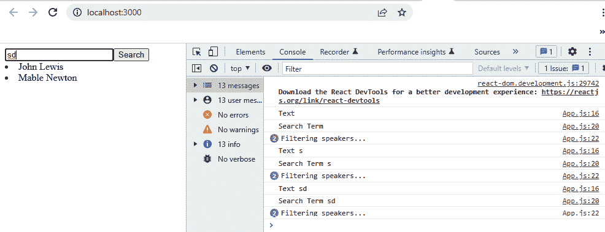
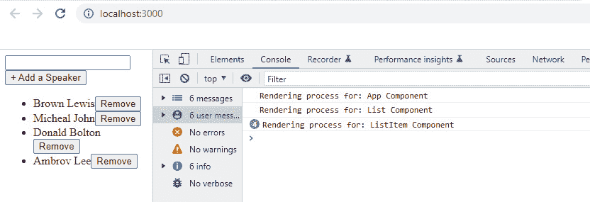

# 3

# 使用 React Hooks 管理状态

*第二章*，*React 入门*，是启动 React 前端开发的好方法。到目前为止，你应该熟悉项目目录结构和 React 中的几个其他概念。在本章中，我们将进一步深化你对 React 核心概念的理解。

这为什么重要？简单来说，如果你没有掌握 React 核心功能和它们的使用方法，就无法在 React 开发中成为你想要的光芒。本章重点介绍使用 React **Hooks** 管理状态。

React 中的状态是我们添加用户界面交互的媒介。在 React v16.8 之前，开发类组件是唯一能够为你的组件添加状态和状态转换的方法。

函数组件最初是无状态的；它们只能显示 **JavaScript XML** （**JSX**）元素，即仅作为展示组件。但通过 Hooks API，你可以为你的函数组件添加状态和状态转换。

在本章中，你将了解各种 React Hooks 以及我们如何使用它们为函数组件添加状态。任何 React 应用程序的构建块都是组件，而使它们具有状态性是提升 Web 应用程序用户体验的关键。

到本章结束时，你将能够使用如 `useState`、`useEffect`、`useContext`、`useMemo` 和 `useReducer` 等 Hooks 构建有状态的函数组件，甚至能够开发你自己的自定义 Hooks。

在本章中，我们将涵盖以下主题：

+   React 中的 Hook 是什么？

+   为什么要在 React 中使用 Hooks？

+   使用 `useState` 开发有状态的组件

+   使用 `useEffect` 创建有用的副作用

+   使用 `useContext` 管理 React 应用程序的全局状态

+   使用 `useRef` 直接访问 DOM 元素并持久化状态值

+   使用 `useReducer` 进行状态管理

+   使用 `useMemo` 提高性能

+   使用 `useCallback` 避免函数重新渲染

+   使用自定义 Hooks 实现代码复用

# 技术要求

本章的完整代码可在 GitHub 上找到：[`github.com/PacktPublishing/Full-Stack-Flask-and-React/tree/main/Chapter03`](https://github.com/PacktPublishing/Full-Stack-Flask-and-React/tree/main/Chapter03).

由于页面数量限制，代码块已被截断。请参阅 GitHub 以获取完整源代码。

# React 中的 Hook 是什么？

**Hook** 是 React 提供的一个特殊函数，它允许你在函数组件中使用 React 核心功能——状态和组件生命周期方法。虽然状态是 React 中内置的对象，它为组件添加了交互性和动态机制，但生命周期跟踪组件经历的各个阶段，从它们的初始化到最终消亡（当用户离开或退出应用程序 UI 时）。

React 组件经历三个主要的循环阶段，如在第 *2 章* *React 入门* 中所述：挂载、更新和卸载。每个阶段都有我们所说的生命周期方法，可以在 React 组件的渲染过程中使用。

我们在类组件的生命周期中观察到某些方法的存在，例如 `componentWillMount()`、`componentDidMount()`、`componentWillUpdate()` 和 `componentDidUpdate()`。React Hooks 用于使函数组件具有状态，而无需使用类组件的生命周期方法。

在 React 版本 16.8 之前，如果你在使用具有状态的组件，你除了使用类组件作为将状态性引入组件的唯一方式外别无选择。

让我们看看一个在按钮点击时将名字从首字母更改为全名的组件：

```py
import React from 'react';class App extends React.Component{
  constructor(props) {
    super(props);
    this.state = {
      name: "Andrew",
    }
    this.updateNameState = this.updateNameState.bind(this);
  }
  updateNameState(){
    this.setState({
      name: "Andrew Peter"}
);
  }
  render() {
    return(
      <div>
        <p>{this.state.name}</p>
        <button onClick={this.updateNameState}>Display Full
          Name</button>
      </div>
    );
  }
}
export default App;
```

让我们详细理解前面的代码：

+   `import React from 'react'`：这一行将 React 库的核心功能引入作用域。

+   `class App extends React.Component`：这声明了我们的 `class App`，它扩展了 React 组件的基本类。

+   以下代码片段定义了一个接受 `props` 作为参数的构造函数：

    ```py
    constructor(prop) {  super(props);  this.state = {    name: "Andrew",}
    ```

    这是一个普通的 JavaScript 类构造。任何扩展基本类的类都必须定义一个 `super()` 方法。`this.state={name:"Andrew",}` 这部分将初始状态设置为 `Andrew`。这是我们想要在代码中稍后更新的状态。

+   以下代码片段确保当函数被调用时，函数的 `this` 上下文将指向组件的正确实例：

    ```py
    this.updateNameState = this.updateNameState.bind(this);
    ```

    `updateNameState` 函数使用 `.bind(this)` 绑定到组件实例上。

+   以下代码片段演示了状态更新方法：

    ```py
            updateNameState(){          this.setState({            name:"Andrew Peter"          });        }
    ```

    它在按钮中被调用，将状态从 `name:"Andrew"` 更改为 `name: "Andrew Peter"`。

+   `render()`：这是 React 中每个类组件的强制方法。

+   `<p>{this.state.name}</p>`：这设置了我们的初始状态，即 `Andrew`，并以 JSX 的形式返回它供我们查看。

+   根据以下代码片段，当按钮被点击时，`updateNameState()` 类方法被调用，并设置为更新后的状态，即 `Andrew Peter`。

    ```py
    <button onClick={this.updateNameState}>  ChangeToFullName</button>
    ```

在本章中，我们将使用 Hook 将前面的代码片段重构为函数组件。但在深入探讨之前，让我们看看指导我们在 React 函数组件中编写 Hooks 的两个规则：

+   **规则 1**：*Hooks 只能在* *顶层调用。*

    你不能在条件语句、循环或嵌套函数内部调用 Hooks。相反，你应该始终在 React 函数的顶层调用 Hooks。

+   **规则 2**：*Hooks 只能从 React* *组件函数中调用。*

    你不能在常规的 JavaScript 函数中调用 Hooks，同样，你也不能在 React 的类组件中调用 Hooks。你只能从函数组件中调用 Hooks。你也可以从自定义 Hooks 中调用 Hooks。

# 为什么要在 React 中使用 Hooks？

在 React 的历史中，Hooks 代表了我们在处理状态组件和管理副作用方面的方法上的重大转变。在 Hooks 之前，编写或重构类组件是使组件能够表现出交互性和处理其他副作用的主要方法。组件是 React 应用程序 UI 的构建块，创建交互式界面需要使用类组件。

然而，对于初学者来说，类的语法和结构可能难以理解。Facebook React 团队前经理 Sophie Alpert 在 *2018 React* *大会* 的主题演讲 (*React 今天和明天*) 中说：

“我声称类对人类来说很难……但不仅人类，我还声称类对机器来说也很困难”

– Sophie Alpert (https://bit.ly/37MQjBD)

在类组件中使用 `this` 和 `bind` 增加了困惑的清单。虽然 JavaScript 提供了面向对象编程（**OOP**）和函数编程的世界，但在 React 类组件中，如果不理解面向对象范式，就无法编写代码。

这严重强调了 React 新手面临的挑战。至少在 React Hooks 出现之前是这样的。有了 Hooks，你只需编写常规的 JavaScript 函数，这些函数更容易编写，并且你只需将 React Hooks 钩入即可实现状态化。

你可能选择 React Hooks 的另一个原因是跨多个组件重用状态逻辑。Hooks 允许你将状态逻辑与组件渲染逻辑分离，这使得在不同组件中重用逻辑变得更加容易。

这种分离确保了更好的模块化和可重用性，因为您可以将包含状态逻辑的自定义 Hooks 在不同的 React 应用程序以及更广泛的 React 社区中共享。另一方面，在基于类的组件中，状态逻辑和 UI 往往交织在一起，这可能会使有效地提取和重用逻辑变得更加困难。

总的来说，React Hooks 引发了一种关于 React 组件设计的新思考方式。在现有的代码库中逐步采用的可能性（如果你仍在运行遗留的 React 源代码），使得坚定的类组件 React 开发者能够继续编写他们的状态类组件，同时系统地将其代码库迁移到面向功能的方案。

React 的未来指向了函数组件架构。我无法想象在这个阶段，任何合理的人还会追求类组件。通过了解和编写函数组件，开发者可以更有效地利用 React 的优势。

在下一节中，我们将开始使用 Hooks 开发状态组件的过程。我们将从最受欢迎的 React Hook `useState` 开始，它将状态引入函数组件。

# 使用 useState 开发状态组件

`useState` Hook 允许你在 React 应用程序中管理状态。函数组件依赖于`useState` Hook 来向它们添加状态变量。状态是 React 中的一个对象，可以存储用于 React 组件的数据信息。当你对现有数据进行更改时，该更改被存储为状态。

这就是这样工作的：你将初始状态属性传递给`useState()`，然后它返回一个包含当前状态值的变量和一个用于更新此值的函数。以下是`useState` Hook 的语法：

```py
const [state, stateUpdater] = useState(initialState);
```

让我们看看`useState`的一个简单用法示例：

```py
import React, {useState} from 'react';const App = () => {
  const [count, setCount] = useState(0);
  const handleIncrementByTen = () => {
    setCount(count + 10);
  };
  const handleDecrementByTen = () => {
    setCount(count - 10);
  };
  const resetCountHandler = () => {
    setCount(0)
  };
```

前面的代码片段展示了如何开发一个具有增加、减少和重置状态的组件。当点击`IncrementByTen`按钮时，计数器将数字增加`10`，而当点击`DecrementByTen`按钮时，减少状态被激活，数字减少`10`。

重置到初始状态做了它应该做的事情——将值重置为其初始值。以下完成了代码片段：

```py
  return (    <div>
      Initial Count: {count}
      <hr />
      <div>
        <button type="button"
          onClick={handleIncrementByTen}>
          Increment by 10
        </button>
        <button type="button"
          onClick={handleDecrementByTen}>
          Decrement by 10
        </button>
        <button type="button" onClick={resetCountHandler}>
          Reset to Initial State
        </button>
      </div>
    </div>
  );
};
export default App;
```

让我们更详细地了解前面的代码：

+   导入`useState`：要使用`useState` Hook 函数，我们首先需要从`Import React, { useState } from 'react'` React 对象中将其导入到我们的组件中。

+   初始化`useState`：我们通过在组件中调用`useState`来初始化我们的状态，如下所示：

    ```py
    const [count, setCount] = useState(0);//using destructuring array to write a concise code.
    ```

    `useState<number>`接受一个初始状态为零（`useState(0)`）并返回两个值：`count`和`setCount`：

    +   `count`：当前状态

    +   `setCount`：状态更新函数（此函数负责初始状态的新状态）

+   `useState(0)`：具有初始值`0`的`useState <number>`

    在`useState`中，你一次只能声明一个状态属性。然而，数据可以是任何类型：原始数据类型、数组，甚至是对象。

+   `onClick`事件函数被添加以帮助发出按钮的事件操作。当按钮被点击时，将根据预期的操作调用不同的事件函数。

+   `handleIncrementByTen()`、`handleDecrementByTen()`和`resetCountHandler()`函数用于更改状态值，如下面的代码片段所示：

    ```py
      const handleIncrementByTen = () => {    setCount(count + 10);  };  const handleDecrementByTen = () => {    setCount(count - 10);  };  const resetCountHandler = () => {    setCount(0)  };
    ```

`useState<number>`可以包含原始数据和对象数据，这些数据可以在 React 组件之间访问。在此阶段，建议你启动你的 VS code 或你喜欢的 IDE，并在开发有状态的组件时实验`useState`。

## 将状态作为 props 传递

状态不仅限于在定义它的组件内使用。你可以将状态作为 props 传递给子组件，允许它们显示或使用父组件的状态数据。

让我们考虑以下示例：

```py
import React, { useState } from 'react';const ParentComponent = () => {
  const [count, setCount] = useState(0);
  const handleIncrementByTen = () => {
    setCount(count + 10);
  };
  return (
    <div>
      <p>Parent Count: {count}</p>
      <ChildComponent count={count} />
      <button onClick={handleIncrementByTen}>Increment
      </button>
    </div>
  );
};
const ChildComponent = ({ count }) => {
  return <p>Child Count: {count}</p>;
};
```

前面的代码展示了使用`useState` Hook 的 React 函数组件。它由两个组件组成，`ParentComponent`和`ChildComponent`，并演示了如何从父组件传递状态数据到子组件。

当你在应用程序中使用 `ParentComponent` 时，它将以初始的 `count: number` 值 `0` 渲染。`count: number`，并且 `ChildComponent`）也会显示它通过 `count` 属性接收到的相同值。当你点击按钮时，`count` 状态会增加 `10`，并且两个计数都会反映相同的更新值。

## 条件渲染与状态

**使用状态进行条件渲染** 在 React 中允许您根据状态变量的值显示或隐藏用户界面的特定部分。通过使用条件语句，您可以控制根据应用程序的当前状态显示哪些内容或组件。

这种技术对于创建动态和交互式用户界面非常有用。想象一下，有一个 **登录** 按钮一旦用户登录就会变成 **注销** 按钮。这是一个经典的条件渲染例子！当你点击按钮时，React 会自动更新 UI 以反映新的状态，使其非常响应。哦，还有更多！

你甚至可以使用这种魔法来切换不同元素的可见性，例如根据用户操作显示或隐藏一个酷炫的模态框或下拉菜单。例如，假设你有 `isLoggedIn` 状态变量，并且你想根据用户是否登录显示不同的内容。

以下代码演示了如何使用 `useState` 钩子实现这一点：

```py
import React, { useState } from 'react';const Dashboard = () => {
  const [isLoggedIn, setIsLoggedIn] = useState(false);
  const handleLogin = () => {
    setIsLoggedIn(true);
  };
  const handleLogout = () => {
    setIsLoggedIn(false);
  };
  return (
    <div>
      {isLoggedIn ? (
        <button onClick={handleLogout}>Logout</button>
      ) : (
        <button onClick={handleLogin}>Login</button>
      )}
      {isLoggedIn && <p>Hey friend, welcome!</p>}
      {!isLoggedIn && <p>Please log in to continue.</p>}
    </div>
  );
};
```

以下代码演示了一个名为 `Dashboard` 的 React 组件。它主要关于处理用户身份验证并向用户显示个性化消息。

在 `Dashboard` 组件内部，我们有 `isLoggedIn` 状态变量，该变量使用 `useState` 钩子进行管理。该变量跟踪用户是否当前已登录。当组件首次渲染时，`isLoggedIn` 的初始状态设置为 `false`，表示用户尚未登录。

现在，让我们深入探索条件渲染的魔法！当你查看 `return` 语句内部的 JSX 时，你会看到一些有趣的事情发生。我们使用 `{}` 括号来包裹我们的条件语句。

如果 `isLoggedIn` 为 `true`，我们将显示一个触发相应 `handleLogin` 或 `handleLogout` 函数的 `onClick` 事件。乐趣还没有结束！

我们还使用更多的 `isLoggedIn` 条件渲染来显示针对用户的个性化消息。当 `isLoggedIn` 为 `true` 时，我们显示一个温馨的问候，例如 `handleLogin` 函数被调用，而且你知道吗？

它将 `isLoggedIn` 设置为 `true`，表示用户现在已登录！同样，当用户点击 `handleLogout` 函数被触发时，它将 `isLoggedIn` 返回到 `false`，意味着用户现在已注销。

在下一节中，我们将检查 React 中的另一个钩子 `useEffect`。它广泛用于操作 DOM 和从外部源获取数据。

# 使用 useEffect 创建副作用

`useEffect` 钩子允许您从外部源获取数据，更新 DOM 树，并设置数据订阅。这些操作被称为副作用。在类组件中，您有我们所说的生命周期方法，可以根据组件渲染过程的阶段执行操作。`useEffect` 接受两个参数：一个函数和一个可选的依赖项。

重要的是要注意，`useEffect` 在一个地方完成了旧 `componentDidMount`、`componentDidUpdate` 和 `componentWillUnmount` 的工作。使用 `useEffect` 钩子可以缩短函数组件中编写以实现相同副作用的代码量。

以下是对 `useEffects` 钩子的语法：

```py
- useEffect(<function>, <dependency>)useEffect(() => {
  // This callback function implementation is either to
     update DOM, fetch data from external sources, or to
     manage subscription that happens here.
}, [dependency]);
```

让我们深入一个使用 `useEffect` 钩子的例子：

```py
import React, { useEffect, useState } from 'react';const App = () => {
const [data, setData] = useState([]);
    const API_URL = "https://dummyjson.com/users";
      useEffect(() => {
        fetchSpeakers();
    }, []);
     return (
        <ul>
      {data.map(item => (
        <li key={item.id}>
          {item.firstName} {item.lastName}
        </li>
      ))}
    </ul>);
};
export default App;
```

在前面的代码中，我们正在使用 `useEffect` 从外部 API 源获取数据。对于这个例子，我们使用了来自 `https://dummyjson.com/users` 的模拟 API 数据。当我们到达这本书的“后端开发”部分（第九章，*API 开发和文档*）时，我们将开发自定义 API 端点。接下来，我们将使用 `useEffect()` 钩子调用 `fetchSpeakers` 函数。

请参考 GitHub 以获取完整代码，并查看以下要点：

+   `import React, { useEffect, useState } from 'react';`: 这行代码允许我们使用来自 React 库的 `useEffect` 和 `useState` API。

+   `const [data, setData] = useState([]);`: 在这一行中，我们声明了一个以空数组作为初始数据的对象状态。

+   `useEffect(()=>{...}, [])`: 这部分代码代表一个签名集，用于从指定的外部源获取数据。`useEffect` 函数中的第二个参数，依赖项 `[]`，被设置为空数组。空数组确保 `useEffect()` 只渲染一次，即在组件挂载时第一次渲染。

    要使其根据状态变化进行渲染，您必须通过依赖数组传递状态。这样，您就可以防止组件在没有依赖状态变化的情况下不断进行不必要的重新渲染。

+   `fetchSpeakers():Promise<Speaker[]>` 在 `useEffect` 钩子内是对 `fetchSpeakers` 函数的调用。这个函数是一个异步函数，它从模拟的远程 API 获取数据，并使用 `setData` 函数将数据设置在组件的状态中。作为 `useEffect` 的第二个参数传递的空依赖数组 `[]` 指示，该副作用仅在组件挂载时运行一次，之后不再运行。

    由于没有列出依赖项，副作用不会由任何属性或状态变量的变化触发。这就是为什么它表现得像 `componentDidMount` 生命周期方法一样，因为它只在组件首次渲染时运行一次。

+   `const API_URL = "https://dummyjson.com/users";`: `API_URL` 变量被设置为保存外部源端点信息。

+   `try… catch` 代码块被设置为执行代码，并在从端点获取数据出错时在控制台显示错误：

    ```py
      const fetchSpeakers = async () => {    try {      const response = await           fetch(API_URL);      const data = await response.json();      setData(data.users);    } catch (error) {      console.log("error", error);    }  };
    fetch() API to fetch the data from the API_URL endpoint. The try… catch code block is set to execute the code and console error if there is an error fetching data from the endpoint.
    ```

+   `map()` 被设置在数据上，用于遍历对象数组数据，并在每个数组元素 `item: Speaker` 上调用函数时显示新创建的数组：

    ```py
    {data.map(item => (        <li key={item.id}>          {item.firstName} {item.lastName}        </li>      ))}
    ```

让我们更新前面代码的 `useEffect` 钩子函数，并为其依赖项添加一个状态和一个 `Cleanup` 函数。在 React 应用程序中，在 `useEffect` 钩子内添加一个 `Cleanup` 函数起着至关重要的作用。

`cleanup` 函数在组件卸载时或在 `useEffect` 钩子中列出的依赖项更改时执行。其主要用途是执行清理任务，释放资源，并防止应用程序中的潜在内存泄漏或意外行为。

现在，按照以下方式更新前面的 `useEffect()`：

```py
useEffect(() => {    const fetchData = async () => {
      const fetchedData = await fetchSpeakers();
      if (isMounted) {
        setData(fetchedData);
      }
    };
    fetchData();
    // Cleanup function
    return () => {
      isMounted = false;
    };
  }, [data]) ;// Adding data state as a dependency
```

前面的代码使用 `useEffect` 钩子从 API (`fetchSpeakers`) 获取数据，并使用获取的结果更新数据状态。它使用一个 `isMounted` 标志来防止在组件卸载后设置状态，从而有效地避免潜在的问题。数据获取效果在 `data` 状态更改时运行，并且当组件卸载时，`Cleanup` 函数将 `isMounted` 标志设置为 false。

总结一下，我们已经看到了如何通过从外部源获取数据来使用 `useEffect` 在函数组件中进行副作用操作。接下来，我们将探讨如何使用 `useContext` 钩子更好地管理 React 应用程序中的全局状态。

# 在 React 应用程序中使用 useContext 管理全局状态

`useContext` 钩子用于在组件树中共享应用程序状态数据，而无需在每一层组件级别上显式传递 props。简单来说，`useContext` 是管理 React 应用程序全局状态的一种方式。记住，我们在 *使用 useState 开发有状态组件* 部分使用了 `useState` 钩子来管理局部状态。

然而，随着 React 项目要求的范围扩大，仅使用 `useState` 钩子来在深层嵌套组件中传递状态数据将变得无效。以下为 `useContext` 钩子的语法：

```py
const Context = useContext(initialValue);
```

简要来说，我们将讨论 *属性钻取* 以了解它带来的挑战。之后，我们将深入探讨上下文 API 的实现，该 API 解决了这些问题。

## 理解属性钻取

让我们考察一下在不使用 `useContext` 的情况下，你如何将数据作为 props 传递到组件层次结构中。以下代码片段展示了在不使用 `useContext` 的情况下如何将数据传递到深层嵌套的内部组件：

```py
  import React, {useState } from 'react';const App = () => {
  const [speakerName]= useState("Fred Morris");
  return (
    <div>
      <h2>This is Parent Component</h2>
      <ImmediateChildComponent speakerName={speakerName} />
    </div>
    );
    }
    function ImmediateChildComponent({speakerName}) {
      return (
        <div>
          <h2>This is an immediate Child
            Component</h2><hr/>
          <GrandChildComponent speakerName={speakerName} />
        </div>
      );
    }
  }
export default App;
```

前面的代码在一个包含嵌套组件的函数中显示了演讲者的名字。完整的源代码在 GitHub 上。

让我们更详细地理解这段代码：

+   `const [speakerName]= useState`：这一行用于设置 `speakerName` 的默认状态。

+   `<App />` 是一个父组件，它使用 `{speakerName}` 作为 props 传递状态，该状态用于 `<GrandChildComponent />`：

    ```py
      return (    <div>      <h2>This is Parent Component</h2>      <ImmediateChildComponent        speakerName={speakerName}    </div>    );
    ```

    父组件必须通过 `<ImmediateChildComponent />` 组件来达到嵌套在层级中更低的 `<GrandChildComponent />`。当你有五个或更多中间组件时，这变得更加繁琐，直到我们到达需要状态信息的实际组件。

    这正是 `useContext` 尝试解决的问题。以下代码显示了中间组件和最终的 `GrandChildComponent: React.FC<Props>`，其中需要状态：

    ```py
    function ImmediateChildComponent({speakerName}) {      return (        <div>          <h2>This is an immediate Child            Component</h2><hr/>          <GrandChildComponent            speakerName={speakerName}   />        </div>      );    }    function GrandChildComponent({speakerName}) {      return (        <div>          <h3>This is a Grand Child Component</h3>          <h4>Speakers Name: {speakerName}</h4>        </div>      );}
    ```

现在我们来看一下 `useContext` 如何通过维护一个全局状态来解决前面的问题，这样不同的组件可以通信而不会在 React 中引起 prop 钻孔问题。

## 使用 `useContext` 解决 prop 钻孔问题

使用 `useContext`，你会了解如何在不手动使用 props 的情况下跨组件传递状态数据。以下代码显示了 `useContext` 的使用方法：

```py
import React, {useState, useContext,createContext } from  'react';
const context = createContext(null);
const App = () => {
const [speakerName]= useState("Fred Morris");
  return (
    <context.Provider value={{ speakerName}}>
            <h1>This is Parent Component</h1>
            <ImmediateChildComponent  />
      </context.Provider>
        );}
function ImmediateChildComponent() {
    return (
      <div>
        <h2>This is an immediate Child Component</h2>
        <hr/>
        <GrandChildComponent  />
      </div>);
}
}
  export default App;
```

让我们详细理解前面的代码。请参考 GitHub 以获取完整的源代码：

+   `import React, {useState, useContext, createContext } from 'react';`：这行代码允许我们使用 React 库中的 `useState`、`useContext` 和 `createContext`。

+   `const context = createContext(null);`：这行代码创建 `Context<ContextType>` 并允许我们使用 `Provider:` `React.FC<ProviderProps|null>`，其中 `null` 作为初始值。请注意，`null` 默认值也可以是 `createContext` 函数提供的任何值。

+   Context 提供者包围了子组件，并使状态值可用，如下所示：

    ```py
            return (          <context.Provider value={{ speakerName }}>            <h1>This is Parent Component</h1>            <ImmediateChildComponent  />          </context.Provider>        );
    ```

+   `const {speakerName} = useContext(context);`：在这行代码中，我们使用 `useContext` 钩子来访问 `<GrandChildComponent />` 中的 `context`：

    ```py
    function GrandChildComponent():React.FC<Props> {  const {speakerName} = useContext(context);      return (        <div>          <h3>This is a Grand Child Component</h3>          <h4>Speaker's Name: {speakerName}</h4>        </div>      );
    ```

总结来说，`useContext` 钩子使我们能够在函数组件中使用 `context`，无论组件层级有多深。这在复杂的 React 应用程序中总是必要的，在这些应用程序中，可能需要在全局应用程序状态中跨状态使用状态数据。使用 `useContext`，我们能够共享作为 props 传递的信息状态，而无需中间组件的直接干扰。

接下来，我们将深入探讨 `useRef` 钩子，并探讨如何在 React 组件中有效地利用它。

# 使用 `useRef` 直接访问 DOM 元素并持久化状态值

`useRef` 钩子允许你在 React 中直接访问 DOM 元素，并用于在重新渲染之间持久化状态值。React 作为强大的 UI 库，有很多新颖的概念（虚拟 DOM 设计模式、事件处理、属性操作），我们可以使用这些概念来访问和操作 DOM 元素，而无需使用传统的 DOM 方法。

这种声明式 DOM 方法是 React 非常受欢迎的原因之一。然而，使用 `useRef`，我们可以直接访问 DOM 元素并自由地操作它们，而不会产生后果。React 团队认为，尽管 React 在 DOM 之上提供了抽象，但使用 `useRef` 可以满足开发人员现在和未来对直接 DOM 访问的需求。

`useRef` 有两个核心用途：

+   直接访问 DOM 元素

+   持久化状态值，当更新时不会触发 React 组件的重新渲染

如果你感兴趣，想知道组件在更新时重新渲染的次数，我们可以使用 `useState` 或 `useRef`。但使用 `useState` 可能不是一个好主意。使用它可能会让用户陷入无限循环的重新渲染，因为 `useState` 在其值每次更新时都会重新渲染。

然而，`useRef` 钩子在当前场景中非常出色，因为它可以在组件重新渲染之间存储状态值，而不会触发重新渲染机制。

让我们通过自动聚焦渲染组件上的输入字段来深入了解 `useRef` 的一个用例：

```py
import React, {useRef} from 'react';const App = () => {
    const inputRef = useRef(null);
    const clickButton = () => {
      inputRef.current.focus();
    };
    return (
      <>
        <input ref={inputRef} type="text" />
        <button onClick={clickButton}>click to Focus on
          input</button>
      </>
    );
  }
export default App
```

让我们详细理解前面的代码：

+   `const inputRef = useRef(null);`: 这行代码为 `useRef` 函数创建了一个引用

+   `<input ref={inputRef} type="text" />`: 在这行代码中，`ref` 被添加到 `input` 元素上，以便使用 `useRef()` 钩子

+   将 `onClick` 事件添加到按钮上，该按钮使用 `inputRef <button onClick={clickButton}>click</button>` 来聚焦到 `input`

`useState` 和 `useRef` 在持有状态值方面非常相似。然而，`useState` 在其值每次变化时都会重新渲染，而 `useRef` 不会触发重新渲染。

让我们继续到下一个钩子，`useReducer`。它是另一个用于在 React 应用程序中管理复杂状态的钩子。

# 使用 `useReducer` 进行状态管理

`useReducer` 钩子是 React 应用程序中的状态管理钩子。它比我们在本章前面讨论的 `useState` 钩子更健壮，因为它将函数组件中的状态管理逻辑与组件渲染逻辑分开。

`useState` 钩子封装了状态管理函数和组件渲染逻辑，这在需要复杂状态管理的大型 React 项目中可能变得难以处理。以下为 `useReducer` 的语法：

```py
`const [state, dispatch] = useReducer(reducer, initialState)
```

`useReducer` 钩子接受两个参数——reducer，它是一个函数，以及初始应用程序状态。然后，钩子返回两个数组值——当前状态和 `Dispatch` 函数。

基本上，我们需要理解 `useReducer` 中的这些核心概念：

+   `State`: 这指的是随时间变化可以更改的可变数据。`State` 不一定是对象；它也可以是数组或数字。

+   `Dispatch`: 这是一个允许我们修改状态的函数。`Dispatch` 用于触发改变状态的动作。

+   `Reducer`: 这是一个处理状态如何修改的业务逻辑的函数。

+   `IntialState`：这指的是应用程序的初始状态。

+   `Action`：这是一个具有一组属性的对象。类型是一个必需的属性。

+   `Payload`：这指的是网络数据块中感兴趣的数据。

在解释了这些核心概念之后，我们还需要了解一件事：`useReducer` 的主要目的是以这种方式管理复杂的多状态，即状态管理的逻辑与组件视图功能分离。我们将通过一个实际例子来详细阐述这一点。

让我们深入探讨 `useReducer` 的用例：

以下代码片段将展示如何使用 `useReducer` 来管理不同的状态属性。我们将使用一个事件调度组件。在以下代码片段中，我们从伪造的 JSON API 数据中获取数据。

在 `src` 目录中创建 `src/db.json` 并粘贴此数据对象：

```py
{    "schedules":    [
        {
            "id":1,
            "time":"10.00 AM",
            "speaker": "Juliet Abert",
            "subjectTitle":"Intro to React Hooks",
            "venue":"Auditorium C"
        },
        {
            "id":2,
            "time":"12.00 AM",
            "speaker": "Andrew Wilson",
            "subjectTitle":"React Performance Optimization"
            ,"venue":"Auditorium A"
        },
        {
            "id":3,
            "time":"2.00 PM",
            "speaker": "Lewis Hooper",
            "subjectTitle":"Intro to JavaScript",
            "venue":"Auditorium B"
        }
    ]
}
```

要安装 JSON 服务器以模拟后端服务，请在终端中输入以下命令：

```py
npm i –g json-server
```

使用以下命令在端口 `8000` 上启动服务器：

```py
json-server --watch db.json --port=8000
```

一旦 JSON 服务器启动，以下内容将在您的终端中显示：

```py
Loading db.json  Done 
  Resources
  http://localhost:8000/schedules 
  Home
  http://localhost:8000
```

将以下代码片段添加到 `App.js` 中：

```py
import { useReducer, useEffect } from 'react';import axios from "axios";
const initialState = {
  isLoading: false,
  error: null,
  data: null,
};
const reducer = (state, action) => {
  switch (action.type) {
    case "getEventSchedule":
      return {
        ...state,
        isLoading: true,
        error: null,
      };
              </ul>
    </div>
  );
};
export default App;
```

完整的源代码可以在 GitHub 上找到。让我们检查代码片段：

+   组件的初始状态属性首先被指定：

    ```py
    const initialState = {isLoading: false,error: null,data: null,};
    ```

+   然后，我们定义 `Reducer` 函数为 `const reducer = (state, action) => {}`。

    `Reducer` 函数接受两个参数：`state` 和 `action`。然后通过 `type` 属性定义动作的状态逻辑。在这种情况下，switch 通过一系列基于动作的条件操作运行，并返回一个特定的动作类型。

    在 `reducer` 函数中指定的动作类型属性，例如，`getEventSchedule`、`getEventScheduleSuccess` 和 `getEventScheduleFailure`，允许我们根据动作类型的当前状态修改组件的状态。

+   `getEventSchedule<EventSchedule[]>` 接受 `initialState` 的所有属性，并且 `isLoading` 属性被设置为 `true`，因为我们正在获取这个状态数据：

    ```py
    case "getEventSchedule":      return {        ...state,{/*accepts other initial State          properties*/}        isLoading: true, {/*change the initial state          of isLoading*/}      };
    ```

+   当通过 `action.payload: EventSchedule[]` 返回的数据修改 `data` 属性时，将调用 `getEventScheduleSuccess`，并且将 `isLoading` 属性设置回 `false`：

    ```py
        case "getEventScheduleSuccess":      return {        ...state,        isLoading: false,        data: action.payload,{/*we have useful          returned data at this state*/}      };
    ```

    如果没有返回数据，将调用 `getEventScheduleFailure` `:Action` 并显示错误：

    ```py
    .catch(() => {  dispatch({ type: "getEventScheduleFailure" });});
    ```

+   `App()` 组件处理 `useReducer()` 定义和执行的组件状态视图部分：

    ```py
    const [state, dispatch] = useReducer(reducer, initialState);
    ```

    `useReducer()` 接受两个参数——`reducer` 和 `initialState`——并返回两个数组变量：`state` 和 `dispatch`。`state` 变量包含状态对象，`dispatch` 是一个函数，允许根据在 `reducer` 函数中调用的动作类型更新状态。

+   使用 `useEffect()` 从指定的端点获取调度数据：

    ```py
    useEffect(() => {  dispatch({ type:"getEventSchedule" });  axios.get("http://localhost:8000/schedules/")    .then((response) => {      console.log("response", response);      dispatch({ type: "getEventScheduleSuccess",        payload: response.data });    })
    ```

    在 `useEffect()` 函数体内部，根据动作类型触发 `dispatch()`。指定了对象类型：`dispatch({ type:"getEventSchedule" });`。

+   使用 `axios()` 调用 `axios.get("http://localhost:8000/schedules/")` 来获取端点数据。

当动作类型为 `getEventScheduleSuccess` 时，我们期望返回数据，因此有效载荷属性 – `dispatch({ type: "getEventScheduleSuccess", payload: response.data })`。

以下代码片段处理了可能由此承诺请求引发的错误：

```py
.catch(() => {  dispatch({ type: "getEventScheduleFailure" });
});
```

在 `App()` 组件的 `return` 结构中，我们使用以下代码片段将日程安排渲染到屏幕上：

```py
            <h2>Event Schedules</h2>            {state.isLoading && <div>Loading...</div>}
            {state.error && <div>{state.error}</div>}
            {state.data && state.data.length === 0
              &&   <div>No schedules available.</div>}
            <ul>
              {state.data && state.data.map(({ id, time,
                speaker, subjectTitle, venue }) => (
                <li key={id}>
                  Time: {time} <br />
                  Speaker: {speaker}<br />
                  Subject: {subjectTitle}<br />
                  Venue: {venue}
                </li>
              ))}
            </ul>
```

我们检查 `initialState :State` 是否处于加载状态，并显示 `<div>Loading…</div>`。如果错误状态为 `true`，则显示错误。如果没有要获取的数据，则显示适当的消息。我们还检查数据状态，并确保我们有数据可以显示。现在，如果服务器没有运行，请使用 `npm start` 启动服务器：

以下截图显示了 `useReducer` 的一个示例实现：


图 3.1 – 展示使用 `useReducer` 钩子效果的截图

我们已经看到如何使用 `useReducer` 钩子来管理 React 中的高级多状态。在下一节中，我们将探讨 `useMemo` 是什么以及我们如何使用它来提高 React 应用程序的性能。

# 使用 `useMemo` 提高性能

`useMemo` 钩子是 React 核心 API 的一部分，旨在提高 React 应用程序的性能。它使用软件开发中已知的技术**记忆化**。

这是一种优化技术，通过在内存中保留资源密集型计算函数调用的结果，并在后续使用相同输入时发送回缓存的输出，来提高软件的性能。那么，为什么 `useMemo` 在 React 应用程序开发中很重要？`useMemo` 为 React 开发者解决了两个性能问题。

## 防止不必要的组件重新渲染

它通过在后续请求（无需状态更新）时发送缓存的函数结果，来对消耗大量资源的计算函数的返回值进行记忆化。

让我们深入一个 `useMemo` 的用例，以更好地理解它如何在 React 中使用。此代码片段显示了组件在每次字符搜索时如何重新渲染。在一个拥有超过 20,000 用户的庞大应用中，这可能会导致性能问题。

首先，我们来看看没有使用 `useMemo` 的代码是什么样子：

```py
import React, { useState} from 'react';const speakers = [
  {id: 10, name: "John Lewis"},
  { id: 11, name: "Mable Newton"},
];
const App = () => {
  const [text, setText] = useState("");
  const [searchTerm, setSearchTerm] = useState("");
  const onChangeText = (e) => {
    setText(e.target.value);
  };
  console.log("Text", text);
  const handleClick = (e) => {
    setSearchTerm(e.target.value);
  };
  console.log("Search Term", text);
  ));
  });
  return (
      <div>
        ---
    </div>
  );
};
export default App;
```

以下截图显示了 `list` 组件在每次字符搜索时重新渲染：



图 3.2 – 显示组件重新渲染的控制台截图

让我们通过 `useMemo` 钩子的实现来深入了解，以获得开发者如何显著提高性能和优化 React 应用程序资源使用的见解，确保仅在必要时执行昂贵的计算：

+   `speakers` 被声明为包含对象数据数组的持有者：

    ```py
    const speakers = [  {id: 10, name: "John Lewis"},  { id: 11, name: "Mable Newton"},];
    ```

+   `text` 和 `searchTerm` 被声明为具有它们的设置方法作为状态变量：

    ```py
    const [text, setText] = useState("");const [searchTerm, setSearchTerm] = useState("");
    ```

+   `onChange` 处理器：此事件处理器将初始状态更新为当前状态：

    ```py
    const handleClick = (e) => {    setSearchTerm(e.target.value);  };
    ```

+   `filteredSpeakers` 函数用于根据 `searchTerm` 使用不区分大小写的搜索过滤演讲者数组。通过这种过滤，您能够通过记忆化过滤结果来优化过滤性能：

    ```py
    const filteredSpeakers = speakers.filter((speaker) => {  console.log("Filtering speakers...");  return speaker.name.toLowerCase()    .includes(searchTerm.toLowerCase());}
    ```

+   `useMemo`：

    ```py
    <div>  <input type="text" onChange={onChangeText} />  <button onClick={handleClick}>Search</button></div>{filteredSpeakers.map((filteredSpeaker) => (  <li key={filteredSpeaker.id}>    {filteredSpeaker.name}</li>))}</div>
    ```

如您在前面的代码片段中所见，`speaker` 组件的依赖属性并未改变。无需重新渲染，但控制台显示存在重新渲染的情况。

现在让我们看看使用 `useMemo` 的代码是什么样的。将前面代码中的 `filteredSpeakers` 函数更新为以下代码片段：

```py
  const filteredSpeakers = useMemo( () =>    speakers.filter((speaker) => {
    console.log("Filtering speakers...");
    return speaker.name.toLowerCase()
      .includes(searchTerm.toLowerCase());
  },[searchTerm]));
```

前面的代码片段显示了在 `filteredSpeakers` 函数上使用 `useMemo`。此函数仅在 `searchTerm` 状态改变时执行。`filteredSpeakers` 函数在 `text` 状态改变时不应该运行，因为显然这不是 `useMemo` 钩子依赖项数组中的依赖项。

接下来，我们将探索 `useCallback`。`useCallback` 钩子与 `useMemo` 钩子类似，旨在使 React 应用程序性能更优。`useCallback` 和 `useMemo` 都优化了 React 应用程序。让我们深入了解 `useCallback`，以避免组件函数的重新渲染。

# 使用 `useCallback` 来避免函数重新渲染

在 React 函数组件中，还有一个额外的优化钩子，称为 `useCallback`。它与 `useMemo` 具有相似的功能，但在输出行为上略有不同。在 `useCallback` 中，返回一个记忆化的函数，而 `useMemo` 返回函数的记忆化返回值。

与 `useMemo` 类似，`useCallback` 在函数组件内部更新其依赖项时会被调用。这确保了函数组件不一定会不断重新渲染。`useCallback` 的关键亮点包括：

+   在 `useCallback` 中返回一个记忆化的回调函数。这通过记忆化技术提高了 React 应用的性能。

+   `useCallback` 钩子的依赖项变化决定了它是否会更新。

现在，让我们深入一个简单的 `useCallback` 用例，以加深理解。

以下代码片段显示了一个演讲者列表，以模拟高计算需求，考虑使用 `useCallback` 进行性能优化。同时，需要注意的是，这种说明绝对不足以作为用例来展示现实生活中的性能瓶颈场景，但它对于解释这种场景很有帮助。

假设我们有一个包含大量 `speakers` 组件的列表，用于处理显示和搜索演讲者，如果没有使用 `useCallback`，那么在输入字段中的每次字符搜索都会导致 `App`、`List` 和 `ListItem` 无需重新渲染。

完整的代码片段可以在本书的 GitHub 仓库中找到：[`github.com/PacktPublishing/Full-Stack-Flask-and-React/blob/main/Chapter03/08`](https://github.com/PacktPublishing/Full-Stack-Flask-and-React/blob/main/Chapter03/08)。

```py
import React, {useState,useCallback} from 'react';  const handleRemoveSpeaker = useCallback(
    (id) => setSpeakers(speakers.filter((user) =>
      user.id !== id)),
    [speakers]
  );
```

之前的代码片段展示了 `useCallback` 的使用。代码结构基本上与 `useMemo` 相似，只是 `useCallback` 将要缓存或记忆化的函数包裹起来。

在下面的图中，我们可以看到 `App`、`List` 和 `ListItem` 组件在搜索输入框中的每次字符搜索后都会重新渲染。



图 3.3 – 展示 useCallback 使用截图

`handleRemoveSpeaker: React.FC<ButtonProps>` 通过 `useCallback` 优化，以防止由于搜索输入状态的变化而重新渲染 `List` 和 `ListItem` 组件。如果应用程序的用户点击 **添加演讲者** 或 **删除** 按钮，组件的重新渲染是预期的。

`useCallback` Hook 在 React 中解决了一个主要问题：防止由于引用相等性检查而导致组件不必要的重新渲染。

接下来，我们将剖析自定义 Hooks 的使用，以将组件的业务逻辑与渲染函数分离。这允许函数的可重用性，并在 React 应用程序中更好地组织代码。

# 使用自定义 Hooks 进行代码复用

我们已经广泛讨论了 React 中的一些内置 Hooks。Hooks 自 v16.8 版本以来一直是 React 核心库的一部分，它允许 React 组件在不使用类方法的情况下表现出状态性。例如，`useState`、`useEffect`、`UseMemo`、`useRef`、`useContext` 和 `useCallback` 是用于管理状态、共享状态逻辑以及允许与 React 核心 API 进行其他交互的特定函数。

现在我们来了解什么是自定义 Hook 以及使用它们可以获得的益处。

`use` 和通常调用一个或多个内置 React Hooks。例如，自定义 Hooks 可以命名为任何东西，只要它以 *use* 开头，例如 `useCustomHook`、`useFetchSpeakers` 或 `useUpdateDatabase`。传统上，自定义 Hook 名称前必须包含 `use`。

那么，为什么你想构建自己的自定义 Hooks 呢？让我们来看看经验丰富的 React 开发者构建自定义 Hooks 的原因：

+   作为一名 React 开发者，你将编写大量的函数来解决你在 React 项目中的问题。如果不遵循最佳 React 实践，一些函数将在你的项目中的许多组件中频繁重复。使用自定义 Hook，你可以在项目的多个组件之间重用状态性逻辑。

+   自定义 Hooks 鼓励在状态逻辑函数和组件视图层之间分离关注点。

+   调试简单。

让我们看看自定义 Hook 的实现示例：

在 `App.js` 中，输入以下内容：

```py
import React from 'react';import useFetchSpeakers from "./useFetchSpeakers";
const App = () => {
  const API_URL = "https://dummyjson.com/users";
  const [data] = useFetchSpeakers(API_URL);
  return (
    <>
      <ul>
        {data.map((item) => (
          <li key={item.id}>
            {item.firstName} {item.lastName}
          </li>
        ))}
      </ul>
    </>
  );
};
export default App;
```

现在，让我们分解前面的代码片段：

+   `import useFetchSpeakers from "./useFetchSpeakers"` 将自定义 Hook 带入此应用程序的作用域。像任何其他 Hook 一样，我们在命名约定中使用 *use*。

+   `useFetchSpeakers` Hook 根据作为端点的 `API_URL : string` 返回数据变量状态。这个端点作为参数传递给自定义 `useFetchSpeakers` Hook。

+   我们随后使用 `map()` 迭代数据对象，以显示返回的 `firstName:string` 和 `lastName:string`。

在 `useFetchSpeakers.js` 中，我们定义了具有其本地管理状态的自定义 Hook 函数：

```py
import { useEffect, useState } from 'react';const useFetchSpeakers = (url) => {
  const [data, setData] = useState([]);
  useEffect(() => {
    const fetchSpeakers = async () => {
      try {
        const response = await fetch(url);
        const data = await response.json();
        setData(data.users);
      } catch (error) {
        console.log("error", error);
      }
    };
    fetchSpeakers();
  }, [url]);
  return [data];
};
export default useFetchSpeakers;
```

在前面的代码片段中，涉及以下步骤：

1.  `useFetchSpeakers` 自定义 Hook 签名被定义。它接受 `url` 作为参数。

1.  `useFetchSpeakers` Hook 使用 `useEffect()` 从端点异步获取数据——传递给自定义 Hook 的 `url` 参数。

1.  返回一个包含 *jsonified* 结果数据的承诺，该数据可通过 `setData(data.users)` 状态提供。

1.  它有一个依赖项（`url`），当数据发生任何变化时，都会导致组件重新渲染组件状态。

通过这种方式，你可以看到自定义 Hook 如何使组件的逻辑部分与渲染部分分离，以及代码重用是如何被鼓励和实现的。

# 摘要

在本章中，我们已经能够理解 Hooks 作为我们在 React 中添加状态性组件的新思维转变。在 Hooks 之前，只有类组件可以提供状态性功能。从 React 16.8 开始，我们现在能够在 React 应用程序中开发出更优雅、更简洁的状态性功能组件。

学习曲线很平缓，因为我们可以利用我们对常规 JavaScript 函数的理解来开发功能组件，为我们的 Web 应用程序提供用户界面。在 React 中使用 Hooks，用户和开发者的体验得到了极大的提升。

在下一章中，我们将重点介绍如何利用 React API 从外部源将数据提取到我们的 Web 应用程序中。我们今天使用的应用程序大多严重依赖外部数据。毫无疑问，React 在这个领域表现出色。
