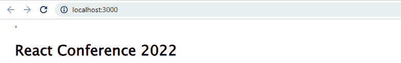
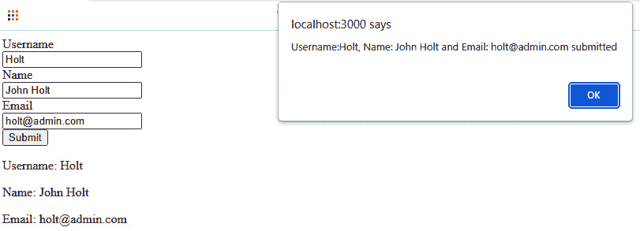
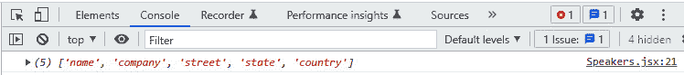
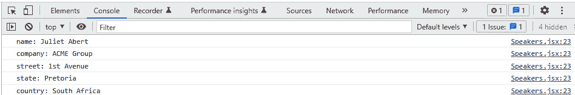
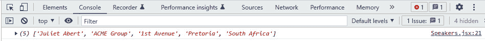
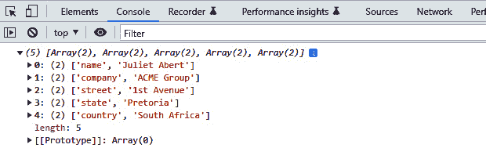

# 5

# JSX 和在 React 中显示列表

**组件化**是 React 应用程序开发中的设计范式。作为一名开发者和 React 热衷者，你将开发大量有用的组件。你需要一组单元的组合来提供用户可以无缝交互的界面。

**JavaScript 语法扩展**（**JSX**）是描述现代网络应用程序用户界面（**UI**）的一种创新方法。在本章中，我们将深入探讨为什么 JSX 是开发生产就绪的 React 应用程序的核心要求之一。此外，你还将学习如何在 React 中显示列表。

我们在几乎每一个网络应用程序开发项目中都会使用列表，了解如何渲染列表是网络开发者所需技能集的一部分。HTML 和 JavaScript 作为网络的语言，从一开始就伴随着我们，帮助网络开发者构建网络应用程序。

然而，在最近一段时间，对复杂且高度丰富的交互式网络应用程序的需求促使使用 JSX 作为构建用户界面组件的一种创新方法。

在本章中，我们将了解 JSX 是什么以及它与 HTML 的不同之处。我们将使用 JSX 来描述本章中将要构建的用户界面。然后，我们将检查我们在 React 中如何处理事件操作。

作为一名 React 开发者，你将为用户消费内部和外部 API 数据。到本章结束时，你将能够向用户显示列表对象，处理 React 中的常见事件，并使用循环函数渲染列表。

在本章中，我们将涵盖以下主题：

+   JSX 是什么？

+   JSX 与 HTML 的比较

+   JSX 如何抽象 JavaScript

+   React 中的事件处理

+   在 React 中显示列表

+   JSX 中的嵌套列表

+   在 JSX 中遍历对象

# 技术要求

本章的完整代码可在 GitHub 上找到：[`github.com/PacktPublishing/Full-Stack-Flask-and-React/tree/main/Chapter05`](https://github.com/PacktPublishing/Full-Stack-Flask-and-React/tree/main/Chapter05)。

# JSX 是什么？

你已经接触并看到了一些 JSX。让我们更深入地讨论 JSX 作为一种新方法，在设计和用户界面时将 HTML 添加到 JavaScript 中意味着什么。

JSX 简单来说是一种类似于 XML 的 JavaScript 语法扩展。JSX 允许前端开发者将 HTML 元素与 JavaScript 结合使用。这种混合的效果通常是一个令人印象深刻的用户友好界面。正如我们所知，React 的主要目的是为我们提供一组用于构建用户界面的 API。

几乎没有争议，React 已经接受了这一挑战，成为前端 JavaScript 库和框架丛林中的领先璀璨宝石。React 通过改进的用户体验，为大规模、生产级别的网络和移动应用程序提供动力。

有趣的是，React 正在使用我们已熟悉的相同工具、语言和技术（HTML 和 JavaScript）来实现这种改进的效率和性能：React 利用 HTML 元素和 JavaScript 函数来构建可重用的 UI 组件。JSX 作为一个允许我们混合标记和显示逻辑以构建 React 组件的方法而发展起来。

您可以安全地将 JavaScript 代码作为 JSX 表达式运行。考虑以下简单的 React 组件片段，以了解您可以在 React 中使用 JSX 的几种方式：

```py
import React from 'react';export function App() {
    const speakerName = "John Holt"
    return (
        <div className='App'>
            <h2>{speakerName}</h2>/* This outputs  John
                Holt */
            <h2>{5 + 5 }</h2>/* This outputs the sum of 5 +
                5 = 10 */
        </div>
    );
}
```

让我们检查这段代码片段中正在发生的事情。

以下代码解释了如何在 React 中使用 JSX：

+   `import React from 'react'` 用于将 React 引入作用域

+   `export function App()` 描述了一个名为 `App()` 的函数组件，该组件可以被其他组件访问

+   声明并赋值了 `const speakerName` 变量，其值为 `John Holt`

+   以下代码片段的前一部分描绘了 `component` `App()` 代码的 JSX 部分：

    ```py
    return (    <div className='App'>        <h1>Displaying name of a conference            speaker:</h1>        <h2>{speakerName}</h2>   /* This outputs John                                   Holt */        <h2>{5 + 5 }</h2>   /* This outputs number 10                           */    </div>);
    ```

以下代码是 HTML 元素（`h2` 和 `div`）和花括号内的 JavaScript 表达式（`{speakerName}`）的混合。这显示了文本 `John Holt`，而 `{5 + 5}` 显示了 5 + 5 的和。

无论您有什么 JavaScript 表达式，都可以将其放在 JSX 中的花括号内，它将返回预期的有效 JavaScript 输出。然而，浏览器默认情况下不知道如何处理 JSX 语法；但借助 Babel 编译器的帮助，JSX 代码被转换成浏览器原生理解的等效 JavaScript 语法。

Babel 的 JSX 转译对使 React 应用程序如此快速的因素做出了重大贡献。它不仅将 JSX 代码转译成浏览器 JavaScript，而且还进行了优化。

您还可以看到 `<div className='App'>` 属性在 JSX 中的使用；类属性的命名约定很重要。我们以驼峰式格式编写它 – React 中的 `className`。`className` 属性被分配了一个值为 `App` 的值，该值在 CSS 文件中使用，以向组件添加样式。

此外，我们还需要理解 JSX 和 **文档对象模型** (**DOM**) 之间存在高级连接。DOM 是一个面向对象的网络文档表示。它是一组用于操作可以在网络浏览器上加载的 Web 文档的 API。典型的 Web 应用程序页面代表一个 Web 文档，DOM API 使用它来维护 DOM 结构和内容。

DOM 操作通常由 JavaScript – 一种脚本语言来完成。您可以使用 JavaScript 对象来创建、更新和删除 HTML 元素。DOM 操作是大多数网络应用程序中交互性的基石。但 React 对 DOM 的处理方式不同，并且具有一些创新性。

React 团队能够识别出在每次 HTML 元素操作（创建、更新和删除）中对 DOM 树重新渲染的挑战，并决定开发一个**虚拟 DOM**（**VDOM**）。VDOM 是原生浏览器 DOM 的抽象，使得 React 应用程序能够快速高效，并表现出跨浏览器的兼容性。

React 组件只重新渲染 DOM 中变化的节点（`h1`、`div`和`p` – 所有这些在 HTML 中代表节点）而不是在单个节点变化时重新渲染整个 Web 文档。

接下来，我们将讨论如何使用 JSX 和 HTML 元素来设计 UI 组件，以及 JSX 和 HTML 之间的固有差异。

# JSX 与 HTML 的比较

`React.createElement()`的底层实现。JSX 使得组件接口开发变得轻松，同时优化了效率。

HTML 是构建 Web 的标准语言。HTML 元素为你在互联网上看到的每个网页提供动力。HTML 语法易于理解，它是浏览器原生理解的语言。

下表清楚地说明了 JSX 和 HTML 之间存在的细微差异，以便更好地理解和在 React 应用程序中使用：

|  | **HTML** | **JSX** |
| --- | --- | --- |
| 原生于浏览器 | HTML 元素是浏览器原生的。 | JSX 在使用 Babel 将其转换为 JavaScript 之前，浏览器才能理解其语法。 |
| 属性使用 | 你在命名 HTML 属性方面有灵活性，尽管这通常是小写，如`onmouseover`、`onclick`、`onsubmit`、`onload`、`onfocus`等等。 | 在 JSX 中命名属性和事件引用（如`onClick`、`onChange`、`onMouseOver`等）时，你必须遵循驼峰命名法规则。 |
| `class`和`for`属性命名 | 在 HTML 中命名 CSS 类时必须使用小写`class`，在命名输入标签时使用`for`。 | 在 JSX 中，你必须使用`className`（驼峰命名法）和`htmlFor`为输入标签。 |
| 处理 JavaScript 代码 | 你必须使用`<script>...</script>`脚本标签或外部 JS 文件来向 HTML 添加 JavaScript。 | 在 JSX 中，你可以在花括号内编写 JS 表达式；例如，`{ new Date().toString }`。 |
| 返回单个父元素 | 在 HTML 中，你可以返回 HTML 元素而不将其包含在单个父元素中；例如：`<div > </div><p>...</p><ul>...</ul><span>...</span>`。所有这些标签都可以独立地存在于网页上，带有封装标签。 | 在 JSX 中，你必须返回一个单个父元素；否则，你会得到 JSX 错误；例如：`<div></div>`或一个片段标签`<> </>`必须包含你所有的 HTML 元素：`<div><p>...</p><ul>...</ul></div>`或`<> <p>...</p><ul>...</ul> </>` |
| 自闭合标签 | 在 HTML 中，你可以有一个不带斜杠的自闭合标签；例如，`<br>`。 | 在 JSX 中，你必须给任何自闭合标签添加一个斜杠；例如，`<br />`。 |

表 5.1 – JSX 与 HTML 之间的差异

JSX 和 HTML 允许你结构化网络内容，并使用户能够与网络应用程序界面进行交互。作为一名 React 开发者，你必须熟悉 HTML 和 JSX 元素之间的固有差异，以避免被 JSX 编译器标记为红旗。

接下来，我们将讨论 JSX 如何允许我们使用类似 HTML 的标签来描述 UI，同时它利用了底层 JavaScript 的强大功能。

# JSX 如何抽象 JavaScript

现在，不使用 JSX 编写 React 应用程序不被推荐，尽管这是可能的。例如，你可以编写一个`React.createElement(component, props, ...children)`函数来描述 UI。

然而，你可以使用以下代码轻松地在 JSX 中描述一个按钮 UI：

```py
<Button color="wine">    Click a Wine Button
</Button>
```

如果不使用 JSX 编写前面的代码，你需要使用以下代码来描述一个按钮 UI：

```py
React.createElement(Button,
    {color: 'wine'},
    ' Click a Wine Button')
```

在大型 React 项目中这样做可能会导致多个问题，例如需要处理代码库中的更多错误，并且需要面对更陡峭的学习曲线，以成为能够优化编写此底层代码来描述 UI 的熟练开发者。然而，尽管意见分歧很少，你可能会同意 JSX 是描述 UI 组件的更好途径，而不是使用纯 React 修改后的 JavaScript。

让我们通过在低级 React 函数`React.createElement()`之上提供语法糖来检查 JSX 如何在其数据表示中抽象 JavaScript。这暗示了 React 如何通过 Babel 将 JSX 转换为 JavaScript，以实现无缝的 DOM 交互。

在`src/index.js`中，使用以下代码片段更新文件，以了解如何在不使用 JSX 的情况下将`React Conference 2024`写入屏幕：

```py
import React from 'react';import ReactDOM from 'react-dom/client';
const root = ReactDOM.createRoot(document.getElementById('root'));
root.render(React.createElement('div', {}, 'React Conference 2024'));
```

在前面的代码片段中，`React.createElement()`是一个带有三个参数的函数调用：`div`、`{}`和预期的输出文本`React` `Conference 2024`：

+   在`React.createElement`函数中的`div`参数代表我们正在创建的 HTML 元素的类型。这可以是任何 HTML 元素或标签（`h1`、`p`、`ul`、`li`等等）。你甚至可以将组件作为第一个参数添加。

+   空的括号参数`{}`代表 props。它可以是对象或 null。

+   第三个参数代表我们希望在屏幕上看到的内容。这可以是普通文本或子组件。

在`src/app.js`中，使用以下代码片段更新文件，以解释 JSX 的使用：

```py
import React from 'react';export function App() {
    return (
        <div className='App'>
            <h1>React Conference 2024</h1>
        </div>
    );
}
```

前面的代码片段显示了显示`React Conference 2024`的 JSX 代码结构，即`<div className='App'>`、`<h1>React Conference 2024</h1>`和`</div>`。

虽然这些看起来像常规的 HTML 元素，但它们是 JSX 表达式。现在，按照以下方式重置`index.js`以使用 JSX 描述 UI：

```py
import React from 'react';import ReactDOM from 'react-dom/client';
import { App } from './App.jsx'
ReactDOM.createRoot(document.querySelector('#root'))
    .render(<App />)
```

使用`npm start`运行代码；你将在浏览器屏幕上看到**React Conference 2024**文本：



图 5.1 – 展示 JSX 输出的截图

总结来说，JSX 是 React 社区中的一个有用工具，它允许开发者在不进行严格的 DOM 操作的情况下满足组件的展示需求。它促进了用户界面的流畅体验和丰富的交互性。有了这个，我们就有了一个快速、高效且独立的广泛兼容浏览器的 Web 应用程序。

接下来，我们将讨论 React 中的事件处理。传统的事件方法，如`onclick`、`onfocus`、`onblur`等，与 React 中的一些细微命名差异密切相关。

我们将讨论这一点以及更多内容，以了解我们如何利用本章涵盖的知识，并将其添加到构建本书互动会议 Web 应用程序项目所需的技能集中。

# React 中的事件处理

React 的事件系统是 React 核心 API 提供的一个强大功能。它被称为`SyntheticEvent`。作为 React 开发者，我们在 React 应用程序开发项目中会每天遇到事件处理。如果你熟悉 JavaScript 的基础知识，处理事件对你来说不应该陌生。你可以使用浏览器原生方法向 HTML DOM 添加事件。

让我们看一下这个代码片段：

```py
<html><body>
<h1>HTML DOM Operations</h1>
<p><strong>Click here to see my message.</strong></p>
<div id="root"></div>
<script>
document.addEventListener("click", function(){
document.getElementById("root").innerHTML =
    "This is a text added to the DOM tree!";
});
</script>
</body>
</html>
```

`<div id="root"> </div>`表示 DOM 将注入我们创建的文本的位置。`div`元素有一个`id`属性，其值为`root`。这有助于事件对象知道文本应该出现在哪里。`document.addEventListener()`方法使用两个参数添加一个事件监听器：`click`和一个回调函数。

当我们点击一个按钮时，我们会触发一个事件。这个事件被称为点击事件。在这种情况下，有一个点击以触发事件的`Post`消息：`<p><strong>点击这里查看我的消息。</strong></p>`。一旦这个消息被点击，回调函数（第二个参数）就会被触发，并导致`getElementById`窗口方法使用`div`元素的`id`属性值`root`来传递`innerHTML`新分配的文本 – 那就是添加到`DOM 树中的文本！`

在 React 中，我们有各种遵循驼峰命名约定的事件：`onClick`、`onChange`、`onInput`、`onInvalid`、`onReset`、`onSubmit`、`onFocus`、`onBlur`、`onToggle`等。你可以在 React 文档中找到整个事件列表 – **React** **合成事件**（https://reactjs.org/docs/events.html）

让我们深入以下代码片段，看看我们如何在 React 中处理表单事件。此代码片段展示了`onChange`表单事件：

```py
import React,{useState} from 'react';const App = ()=> {
const [username,setUsername]= useState("");
const [name,setName]=useState("");
const [email,setEmail]=useState("");
const handleSubmit=(e)=>{
    e.preventDefault()
    alert(`Username:${username}, Name: ${name} and Email:
        ${email} submitted`)
  }
    return (
        <div>
            <form onSubmit={handleSubmit}>
                <label htmlFor="username"> Username</label>
                    <br />
                <input type="text" placeholder="Username"
                    onChange={(e)=>setUsername(
                        e.target.value)} /><br />
                <label htmlFor="name">Name</label><br />
                <input type="text" placeholder="Name"
                    onChange={(e)=>setName(e.target.value)}
                        /><br />
                <label htmlFor="email"> Email</label><br />
                <input type="email" placeholder="Email"
                     onChange={ (e)=>setEmail(
                         e.target.value)}/><br />
                <button>Submit</button>
            </form>
            <div>
                <p>Username: {username}</p>
                <p>Name: {name}</p>
                <p>Email: {email}</p>
            </div>
        </div>
    );
}
export default App;
```

让我们仔细检查这个片段：

+   `import React, {useState} from 'react'`使`useState`钩子在`App()`组件中可用于状态跟踪。

+   `const [username,setUsername]=useState("")` `const name,` **setName]=useState("")** 和 `const [email,setEmail]=useState("")` 这段代码片段使我们能够访问用户名、邮箱和姓名的状态。通过 `setUsername`、`setName` 和 `setEmail`，我们可以跟踪变量的新状态。所有变量的初始状态都设置为空字符串。

    ```py
    const handleSubmit=(e)=>{  e.preventDefault()    alert(`Username:${username}, Name: ${name} and        Email: ${email} submitted`)}
    ```

    在前面的代码片段中，`handleSubmit()` 是一个接受 `e` 作为事件对象的处理器。`e.preventDefault` 阻止表单字段提交时的浏览器默认行为。表单提交时不会刷新页面。`handleSubmit` 被添加到表单中作为属性以执行 `alert()`，在屏幕上显示 `username`、`name` 和 `email` 的状态。

+   在输入标签 `<input type="text" placeholder="用户名"onChange={`(e)=>setUsername(e.target.value)} />` 中，向输入元素添加了 `onChange` 事件属性。`onChange` 事件有一个接受 `e` 作为参数的回调函数。`setUsername(e.target.values)` 监听输入字段中的变化事件。同样，为姓名和邮箱的输入标签添加了相同的 `onChange` 事件回调。

+   `<p>用户名: {username}</p>，<p>姓名: {name}</p>，<p>邮箱: {email}</p>` 这段代码片段显示了输入表单字段中的当前输入文本。

    以下屏幕截图显示了表单中事件处理的效果：



图 5.2 – 屏幕截图显示事件处理器对表单字段的影响

总结来说，React 中的事件处理由一个跨浏览器的包装器 `SyntheticEvent` 管理。我们在 React 应用程序中将事件处理器作为实例传递给 `SyntheticEvent`。最佳实践是使用 `preventDefault()` 来防止默认的浏览器行为。

接下来，我们将讨论如何在 React 应用程序中使用列表。列表是任何企业级网络应用程序中的常见功能。让我们看看 React 如何通过精心设计的 UI 列表来提升用户体验。

# 在 React 中显示列表

我们今天看到的绝大多数网络应用程序在描述用户界面时都会使用列表组件。在任何复杂的网络应用程序项目或生产级应用程序中，你都会看到列表功能，通常用于数据展示。在 React 中，你可以使用列表来展示你的组件数据。

我们将使用模拟数据来展示如何使用 `map()` 获取数据项列表。我们还将讨论 React 列表管理中 `key` 和 `id` 属性的本质。本书项目的 GitHub 仓库（https://github.com/PacktPublishing/Full-Stack-Flask-Web-Development-with-React/tree/main/Chapter-05/06/frontend）包含模拟的会议演讲者 `data` 源；你可以在公共文件夹中找到 `images`，在 `src` 文件夹内找到 `css` (`index.css`)。

然而，本书的后端部分（*第九章*，*API 开发和文档*)将解释我们如何从 Flask 开发的 API 端点中拉取这些数据。

此 `url` 将您带到演讲者页面 – `http://localhost:3000/speakers`：


图 5.3 – 屏幕截图显示从数据源拉取的会议演讲者列表

让我们检查显示演讲者列表的代码片段，使用几个组件：

在 `src/components` 目录内创建 `SpeakersCard/SpeakersCard.jsx` 并添加以下代码片段：

```py
import React from 'react'const SpeakersCard= ({name, jobTitle, company, profileImg}) => {
    return (
        <>
            <div className="card">
                <div className="speaker-card">
                    <div className="speaker-info">
                        
                        <span>
                            <h3>{name}</h3>
                        </span>
                        <p>{jobTitle}</p>
                        <p>{company}</p>
                    </div>
                </div>
            </div>
        </>)
}
export default SpeakersCard;
```

在前面的代码片段中，我们创建了一个 `SpeakersCard` 组件，该组件接受一个包含四个属性的对象：`name`、`jobTitle`、`company` 和 `profileImg`。这些属性将通过即将创建的 `SpeakersPage` 组件（父组件）作为 props 传递给组件。

`SpeakersCard` 组件的返回语句包含 JSX，它表示渲染输出的结构。

我们需要这个 `SpeakersCard` 组件来封装和表示会议网页应用中演讲者实体的视觉外观和信息显示。通过创建这个组件，我们可以在需要显示演讲者信息时，在整个应用程序中重用它。

现在，在 `src/pages` 目录内创建 `SpeakersPage/SpeakersPage.js`。`SpeakersPage` 组件将用于通过为 `speakerList` 中的每个演讲者渲染 `SpeakersCard` 组件来显示演讲者列表。

将以下代码添加到 `SpeakersPage.js`：

```py
import React from 'react';import SpeakersCard from
    '../../components/SpeakersCard/SpeakersCard';
import speakerList from '../../data/SpeakerList';
import Breadcrumb from
    '../../components/Common/Breadcrumb/Breadcrumb'
import Header from '../../components/Header/Header';
import Footer from '../../components/Footer/Footer';
const SpeakersPage = () => {
    return (
        <>
            <Header/>
            <Breadcrumb title={"Speakers"}/>
            <div className="speakers-container">
                <div className="section-heading" >
                    <h1>Meet Our Speakers</h1>
                </div>
                <div className="card">
                    {speakerList.map((speaker) => (
                        <SpeakersCard
                            key={speaker.id}
                            name={speaker.name}
                            jobTitle={speaker.jobTitle}
                            company={speaker.company}
                            profileImg={speaker.profileImg}
                        />
                    ))}
                </div>
            </div>
            <Footer/>
        </>
    )
}
export default SpeakersPage;
```

在前面的代码片段中，我们导入依赖项以使页面功能正常工作：

+   `import SpeakersCard from '../../components/SpeakersCard/SpeakersCard'`：此代码行从组件目录中的 `SpeakersCard` 目录导入 `SpeakersCard` 组件。使用 `../../` 符号导航到适当的目录级别。

+   `import speakerList from '../../data/SpeakerList'`：此代码行从位于数据目录中的 `SpeakerList.js` 文件导入 `speakerList` 数据。您可以在本章的 GitHub 仓库中找到数据文件。此数据包含一个对象数组，每个对象代表一个演讲者，具有 `name`、`jobTitle`、`company` 和 `profileImg` 等属性。

然后，我们添加 `<SpeakersCard ... />`。此代码行渲染 `SpeakersCard` 组件，并将每个演讲者从 `speakerList` 中的必要 props (`name`、`jobTitle`、`company` 和 `profileImg`) 传递。每个 `SpeakersCard` 组件都添加了 `key={speaker.id}` props。`key` props 帮助 React 在列表更改时高效地更新和重新渲染组件。

`SpeakersPage` 还包括 `header`、`面包屑导航` 和 `footer` 组件，为演讲者部分提供完整的布局。`Header`、`Breadcrumb` 和 `Footer` 组件的代码可以在本章的 GitHub 仓库中找到。

接下来，我们将检查如何通过使用键唯一标识列表中的项目来遵循 React 的最佳实践处理列表项。

## 在 JSX 中使用键和 id

React 列表项中的 **key** 是列表中项目状态的唯一标识符。我们使用键来跟踪列表中已更改、已添加或已删除的项目。通常期望它是一个列表中的唯一项。

看看我们前面示例中使用到的对象数组：

```py
    const speakerList = [        {
        id: 1,
        name: 'Advon Hunt',
        jobTitle:'CEO',
        company:'Robel-Corkery',
        profileImg: 'https://images.unsplash.com/photo-
            1500648767791' },
]
```

此数组中的 `id` 属性应该是一个唯一的数字。这使我们能够适当地跟踪对象数据状态。我们在前面的 `speakersList` 示例中使用了 `{speaker.id}` ID 作为 `key` 属性的值。

现在，我们将深入 JSX 中的嵌套列表，并学习如何在 React 中使用嵌套列表来处理复杂的数据结构。

# JSX 中的嵌套列表

如前所述，列表是大多数 Web 应用程序的关键组件。列表通常用于结构化数据和整齐地组织信息。我们对 Web 开发中的一些列表陈词滥调很熟悉：*待办事项列表*、*任务列表*，甚至是 *菜单列表*。所有这些列表都可能变得复杂，这取决于数据结构和您期望如何向最终用户展示列表项。在 React 应用程序中处理列表需要理解如何处理以对象数组形式出现的数据。

在本节中，我们将学习如何在 React 应用程序中渲染 JSX 中的嵌套项目列表。您将看到这样的复杂嵌套数据结构，以及更多来自您的 API 数据源的结构，因此了解嵌套列表将使包含复杂数据的 React 应用程序更容易处理。

以下代码片段显示了一个组件中嵌套的 Web 技术栈项目列表。

在 `src/App.js` 内编辑 `App.js`：

```py
import React from "react";import {webStacksData} from "./data/webStacksData";
import WebStacks from "./components/WebStacks/WebStacks";
const App = () => {
    return (
        <ul>
            {webStacksData.map(i => (
                <WebStacks item={i} key={i.id} />
            ))}
        </ul>
    );
}
export default App;
```

那么，这段代码中发生了什么？我们正在处理一个名为 `webStacksData` 的命名嵌套对象数据列表，该列表可以在本书的 GitHub 仓库中找到：

+   数据通过 `import {webStacksData}` from `"./data/webStacksData";` 引入作用域。

+   我们还引入了 `WebStacks` 组件到作用域中。

+   `webStacksData.map` 函数遍历 `webStacksData` 数组中的每个项目，为每个项目创建一个新的 `WebStacks` 组件。`key` 属性设置为每个项目的 `id` 属性，以帮助 React 在需要时高效地更新列表。对于 `webStacksData` 数组中的每个项目，都会渲染一个 `WebStacks` 组件，并将 `item` 属性设置为来自数组的当前 `item`。

让我们创建一个名为 `WebStacks` 的组件来查看组件的内部工作原理：

```py
import React from "react";const  WebStacks = ({ item })=> {
let children = null;
if (item.values && item.values.length) {
    children = (
        <ul>
            {item.values.map(i => (
                <WebStacks item={i} key={i.id} />
            ))}
        </ul>
    );
}
return (
    <li>
        {item.name}
        {children}
    </li>
);
}
export default WebStacks;
```

`WebStacks` 组件接收 props 项目。在组件体函数中，我们检查父列表项是否存在以及是否有子项。然后我们调用 `map()` 递归遍历具有有效子列表项的列表项。

这个 `<li>{item.name}{children}</li>` 返回列表项的名称及其所有子项。接下来，我们将看到如何在 React 中遍历对象并在 JSX 中显示输出。

# 在 JSX 中遍历对象

遍历复杂的数据对象是经验丰富的 React 开发者需要轻松处理的一部分。你无疑会遇到需要处理来自你的 API 端点的简单和嵌套对象数据的情况，以提取对应用程序有用的数据。在本节中，我们将了解如何在应用程序中无缝地遍历数据对象。

在 JavaScript 中，对象是不可迭代的。你无法使用 `for ... of` 语法遍历对象属性。`Object.Keys()` 是 JavaScript 中用于遍历对象数据的一个内置标准对象方法。然而，在 ES2017 中，添加了新的对象方法，可以用来遍历对象属性：`Object.values()` 和 `Object.entries()`。

让我们简要地检查这些方法，并学习如何使用对象数据来使用它们。

创建用于遍历的对象数据，并将其命名为 `speakersData`：

```py
const speakersData = {name:"Juliet Abert",
company:"ACME Group",
street:"1st Avenue",
state:"Pretoria",
country:"South Africa"
}
```

接下来，我们将检查用于高效遍历对象属性的各种技术，这些技术允许你使用 `Object.keys()`、`Object.values()` 和 `Object.entries()` 等方法访问和操作对象中的数据。我们将简要探讨这些技术，从 `Object.keys()` 开始。

## 使用 Object.keys()

`Object.keys` 方法返回一个包含对象键的数组。正如你所知，对象包含键和值对，因此 `Object.keys()` 将返回键/属性的数组。

让我们在以下代码片段中将我们的数据对象作为参数传递：

```py
console.log(Object.keys(speakersData));
```

我们将得到以下输出：



图 5.4 – 展示使用 Objects.keys() 方法效果的截图

在这里，你可以看到键的数组。你可以使用循环函数检索键的值：

```py
for (const key in speakersData){  console.log(`${key}: ${speakersData[key]}`);
}
```

以下截图显示了对象数据的键和值：



图 5.5 – 展示对象键和值的截图

之后，你可以调用 `map()` 来检索 React 组件中键的值。这将在本节后面进行解释。

现在，让我们学习如何使用 `Object.values()`。

## 使用 Object.values()

`Object.values()` 方法返回一个包含对象属性值的数组：

```py
console.log(Object.values(speakersData));
```

这只返回没有键的属性值，因此在需要键和值的情况下，它的实用性较低。



图 5.6 – 显示使用 Objects.values()方法效果的截图

让我们看看我们可以用来遍历对象数据的最后一种技术。

## 使用`Object.entries()`

`Object.entries()`方法返回一个包含对象键值对的数组 – `[key, value]`。使用`Object.entries()`遍历对象更容易，因为有一个`[key, value]`对。例如，考虑以下代码：

```py
for (const  key of Object.entries(speakersData) ){    console.log(`${key[0]} : ${key[1]}`)  }
```

以下截图显示了在对象数据上使用`Object.entries()`的输出：



图 5.7 – 显示使用 Objects.entries()方法效果的截图

我们可以看到返回了包含对象属性键和值的二维数组。

## 使用 Object.keys 的循环示例

现在，我们将处理一个包含有用演讲者信息的对象数据，其数据格式为对象。它可以在本书的项目 GitHub 仓库中找到（https://github.com/PacktPublishing/Full-Stack-Flask-Web-Development-with-React/blob/main/Chapter-05/data/objSpeakersData.js），并在 React 组件中显示输出。

以下代码遍历`speakers`对象数据，并在 JSX 中显示输出：

```py
import React from 'react';import {simpleSpeakerData} from
    '../../data/objSpeakersData';
const Speakers = () => {
    return (
        <>
            <h1>Speakers</h1>
            <div>
                <ul>
                    {Object.keys(s).map(key => (
                        <li key=
                           {key}>{simpleSpeakerData[key]
                               .name}
                           {simpleSpeakerData[key].company}
                           {simpleSpeakerData[key].street}
                           {simpleSpeakerData[key].state}
                           {simpleSpeakerData[key].country}
                        </li>
                    ))}
                </ul>
            </div>
        </>
    );
}
export default Speakers;
```

以下代码的解释如下：

+   `import {simpleSpeakerData} from '../../data/objSpeakersData'`将数据引入作用域，以便可以在代码中使用。

+   然后，我们声明一个`Speakers`组件，它返回一个对象数据列表。

+   `simpleSpeakerData`被传递给`Object.keys(simpleSpeakerData)`。

+   `map()`函数随后被调用在`Object.keys()`返回的键上。这会遍历返回的键数组。

    现在，我们可以访问对象的各个键和值。

+   `{simpleSpeakerData[key].name}`指向对象数据的 name 属性值。

以下图显示了在 React 中使用 JSX 遍历复杂对象数据的输出：


图 5.8 – 显示对象数据的截图

在 JSX 中使用`Object.keys()`、`Object.values()`和`Object.entries()`遍历对象是基本且涉及遍历对象的属性以动态渲染 JSX 元素。这种方法允许你生成列表、表格或其他 UI 组件，以结构化的方式显示对象中的数据。

# 概述

在本章中，我们广泛讨论了 React 中的 JSX。我们深入解释了 JSX 是什么以及指导在 React 中使用 JSX 的规则。然后，我们讨论了 DOM 以及 React 中的 VDOM 如何抽象原生的浏览器 DOM，以便 React 开发者构建更高效、跨浏览器的用户界面。JSX 提高了 React 应用中的 DOM 交互，并优化了 React 组件中元素的渲染速度。

我们还检查了 React 中的事件处理以及如何使用 `SyntheticEvent` 事件包装器来处理 React 中的事件操作。我们讨论了 JSX 和 HTML 之间的细微差别以及指导 React 中使用的规则。

最后，我们通过实际案例讨论了如何在 React 项目中显示列表，以及如何使用 `key` 和 `id` 来唯一管理列表项。我们还探讨了如何在 React 中遍历对象以及显示复杂的嵌套对象。

在下一章中，我们将深入讨论如何在 React 网络应用程序中处理表单操作和路由。
