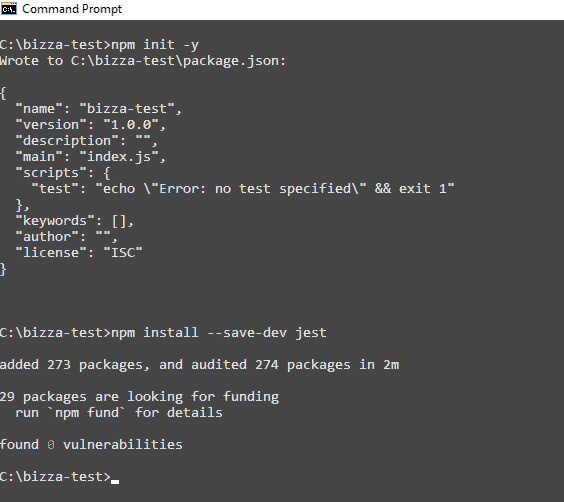
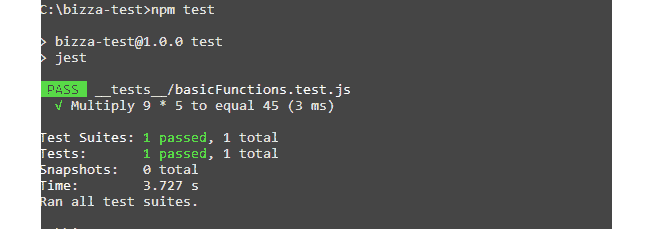
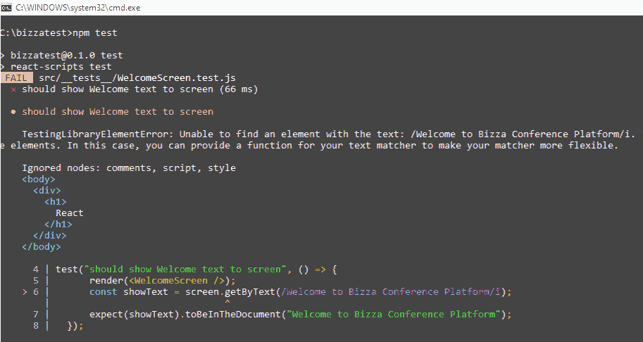
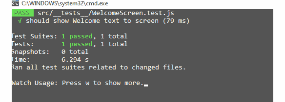
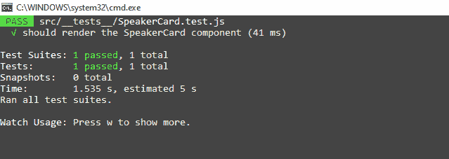
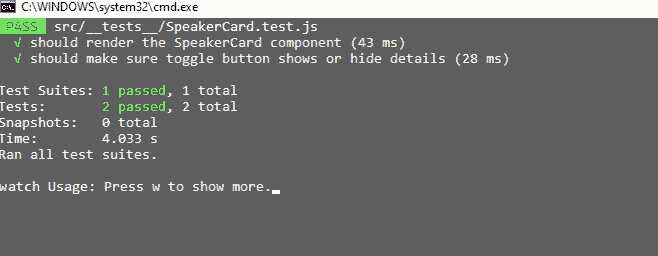
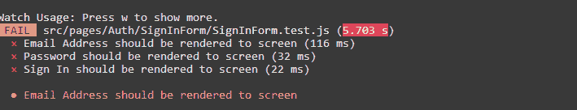
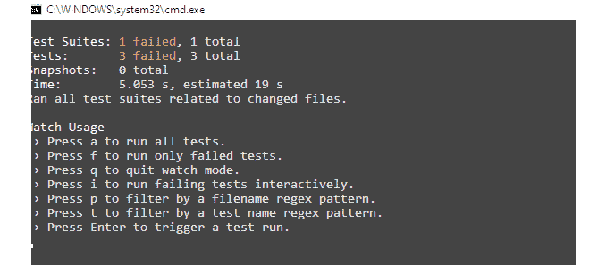
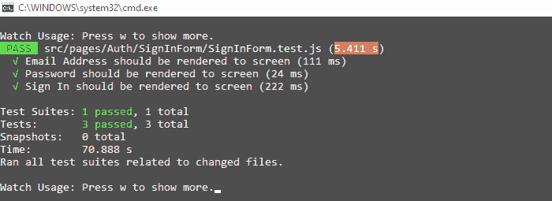
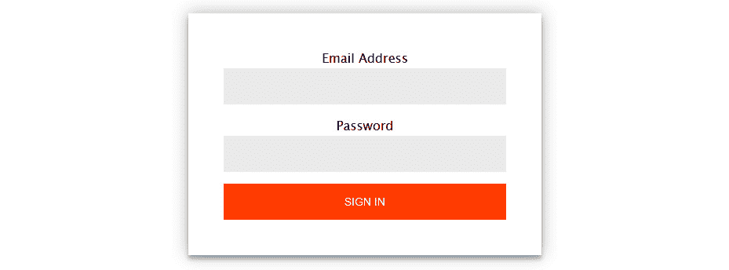

# 7

# React 单元测试

我们在前面的章节中充分讨论了 React 的基础知识。你已经接触到了 React 工具和资源，以便在完整的全栈开发旅程中掌握现代前端技术。我们深入探讨了构建丰富交互式界面所需的 React 的有用信息。我们讨论了 React 中的组件、属性和状态、JSX、事件处理、表单和路由等主题。

在本章中，我们将专注于 React 应用程序中的单元测试，这是一种专注于隔离代码片段的软件测试类型。我们还将探索基于 Node 的测试运行器 **Jest**。测试运行器允许你发现测试文件、运行测试，并自动找出测试是否通过或失败。你将以一个非常清晰、表达丰富且易于阅读的格式结束报告。

Jest 是一个针对 React 开发的流行测试框架。该项目最初由 *Meta* 公司拥有，该公司也是 React 的背后公司。然而，随着 Jest 从 Meta 转移到 *OpenJs Foundation*，Jest 现在有一个独立的内核团队正在积极工作，以确保其稳定性、安全性和经得起时间考验的代码库。

此外，我们还将简要探讨 React 生态系统中的一个有用的测试工具——**React 测试库**（**RTL**）。这个库为我们提供了一系列方法，可以在虚拟环境中对 React 组件进行测试。

最后，在本章中，我们将深入探讨**测试驱动开发**（**TDD**），这是一种软件开发范式，它将测试实现放在实际编码之前。编码和测试是交织在一起的。测试始终是第一位的，尽管它显然不是软件开发过程中的有趣部分。

即使是经验丰富的开发者，在测试方面仍然会像初学者一样遇到困难。公司对测试有不同的政策，但在现实世界的开发中，没有测试就无法拥有工业级的 Web 应用程序。

测试确保你遵循软件开发生命周期的最佳实践，并且你和你的应用程序最终用户对你的 Web 应用程序功能有信心。通过适当的测试，你的 Web 应用程序的功能将像预期的那样高效运行。

在本章中，我们将涵盖以下主题：

+   什么是软件测试？

+   Jest 简介

+   在 Jest 中编写测试

+   单元测试 React 组件

+   TDD

# 技术要求

本章的完整代码可在 GitHub 上找到：[`github.com/PacktPublishing/Full-Stack-Flask-and-React/tree/main/Chapter07`](https://github.com/PacktPublishing/Full-Stack-Flask-and-React/tree/main/Chapter07)

# 什么是软件测试？

**软件测试**是一个确保软件或应用开发中的所有代码片段都能按照所有利益相关者的预期工作的过程。测试过程是软件开发生命周期中的关键阶段之一，它解释了设计和开发应用程序的标准方法论。

软件测试确保网络应用程序具有更少的错误，技术需求被高效地按预期实现，开发成本降低，最终满足业务需求。

有趣的是，如果有效地执行，测试通常会给软件工程师足够的信心，使他们确信他们向生产环境推出的产品是可维护的、可读的、可靠的，并且结构良好。

这减少了关于应用程序中可能出现的昂贵错误所带来的恐慌，这些错误可能使公司蒙羞或损害客户信心。有许多值得注意的软件测试类型——单元测试、集成测试、性能测试、可用性测试、验收测试和回归测试。

让我们简要讨论一下我们在软件开发中拥有的测试类型，以刷新我们的思维，并为后续章节提供一个坚实的基础。

+   **单元测试**：在这种测试中，软件或应用开发中最小的代码片段或单元被测试。在单元测试中，你系统地经过三个阶段——规划、用例脚本编写和测试。你主要关注你应用程序中独立单元的功能。在“单元测试 React 组件”部分，我们将深入探讨单元测试以及如何在你的 React 应用程序中实现单元测试。

+   **集成测试**：在这种测试中，将代码的各个独立单元组合起来，并测试它们之间的有效交互。

+   **性能测试**：在这种测试中，你的应用程序的速度和效率与给定的负载进行测试。这种方法用于识别软件应用程序平稳运行中的早期瓶颈。

+   **可用性测试**：在这种测试中，你的应用程序的预期用户被允许体验你的产品。通过可用性测试对应用程序设计进行直接评估的反馈确保你能够尽早捕捉到用户在使用应用程序时的挫败感。可用性测试的报告还可以提供其他可能改进产品的有用见解。

+   **验收测试**：在这种测试中，客户满意度被衡量——客户需求与开发的软件或应用程序进行比较。客户能够检查这些需求是否被正确捕捉并按预期工作。

+   **回归测试**：在这种测试中，我们检查将新功能添加到你的软件或应用程序中引起的代码更改是否破坏了之前测试过的正常功能。回归测试可以防止在修改应用程序代码库时引入错误或意外的副作用。通过回归测试，所有测试用例都会重新运行，以确保不会引入新的错误。

接下来，我们将探索你可以在测试前端应用程序的功能时，有信心与之合作的领先测试框架之一。

# 介绍 Jest

**Jest**是一个开源的、健壮的、文档齐全的、快速且安全的 JavaScript 测试框架。Jest 提供了你需要的工具和资源，让你对你的 JavaScript 代码库有绝对的信心。测试是编写高质量代码的基础，而 Jest 几乎无需配置，就能愉快地处理测试实现。

Jest 在 JavaScript 社区中非常受欢迎。你可以利用 Jest 丰富的 API 集编写测试，例如匹配器、模拟函数、代码覆盖率以及快照测试。Jest 可以用来测试 React 组件，实际上 React 团队也推荐使用 Jest 来测试 React 项目。

Jest 是一个 Node.js 测试运行器，这意味着测试总是在 Node 环境中运行。Jest 在构建时考虑了性能。你可以有效地并行运行一系列测试。Jest 工具包附带代码覆盖率，它使你能够了解项目中已测试和未测试的文件。并且当你的测试失败时，你会得到关于为什么它们失败的有见地的信息。

让我们为测试设置一个 Jest 环境。

## 设置 Jest 环境

Jest 运行需要 Node.js。Jest 附带了我们用于*第二章*，“*使用 React*入门”中`create-react-app`脚手架代码的`npx create-react-app`命令。

在本节中，我们将创建一个名为`bizza-test`的新工作文件夹，以便在继续使用它进行 React 组件的单元测试之前，更好地探索 Jest 如何与 JavaScript 函数协同工作：

1.  在`path/to/bizza-test/`目录下，让我们在终端中执行以下命令：

    1.  在命令终端中运行`npm init -y`。

    1.  使用`npm install --save-dev jest`在工作文件夹（`bizza-test`）中安装 Jest 作为依赖项。

1.  更新`package.json`以能够通过`npm test`运行 Jest：

    ```py
    "scripts": {              "test": "jest"}
    ```

    完整的`package.json`应如下所示：

    ```py
    {  "name": "bizza-test",  "version": "1.0.0",  "description": "",  "main": "index.js",  "scripts": {    "test": "jest"  },  "keywords": [],  "author": "",  "license": "ISC",  "devDependencies": {    "jest": "²⁹.2.1"  }}
    ```

下面的截图显示了在终端中安装 Jest 的过程。



图 7.1 – Jest 库设置截图

配置完成后，你就可以正确地运行测试了。接下来，我们将探讨一些关键的测试术语，并编写实际的测试。

## 在 Jest 中编写测试

现在我们已经设置了测试运行环境，让我们简要了解一下在这个部分我们将遇到的一些关键字。在 Jest 中，你有一些来自 Jest API 的测试关键字和函数来构建你的测试；让我们来检查它们：

+   `test()` 或 `it()`: 这是一个描述性的单元测试或测试用例。它包含三个参数——一个描述性的测试用例字符串、一个包含要测试的期望值的函数，以及一个可选的超时参数，指定在终止测试用例之前要等待多长时间。默认超时时间为五秒：

    ```py
    test(name, fn, timeout)test("<test case name>", ()=>{              ...    })
    ```

+   `describe()`: 这将相关测试用例组合在一起。它用于组合几个相关的测试并描述它们的行为。`describe()` 接受两个参数——一个描述你的测试组的字符串和一个包含测试用例的回调函数：

    ```py
    describe(name, fn)describe("<your test group name>", ()=>{    test("<test case name>",()=>{      ...    });    ...    test("<test case name>",()=>{      ...    });})
    ```

+   `beforeAll()`: 这个函数在测试文件中的任何测试运行之前执行。当你从函数中返回一个 promise 或 generator 时，Jest 会等待该 promise 解决后再运行测试：

    ```py
    beforeAll(fn, timeout)
    ```

+   `beforeEach()`: 这个函数在测试文件中的每个测试运行之前执行。当你从函数中返回一个 promise 或 generator 时，Jest 也会等待该 promise 解决后再运行测试。

+   `expect()`: 在编写测试时，你至少需要检查一个值是否符合某些条件。`expect()` 允许你使用匹配器有条件地检查一个值，我们稍后会讨论匹配器。值得注意的是，存在这样的情况，一个单独的测试用例可能有多个 `expect()` 函数：

    ```py
    test("<test case name>",()=>{    ...    expect(value);    ...})
    ```

+   `Matchers`: Jest 使用匹配器来测试值验证。匹配器让你以不同的方式测试值，以便做出正确的断言。

+   `Assertion`: 断言被定义为包含可测试逻辑的表达式，用于验证程序员对特定代码块所做的假设。这允许你识别应用程序中的错误和其他缺陷。

因此，在所有这些函数和术语都定义清楚之后，让我们编写我们的第一个测试套件：

1.  在 `bizza-test` 工作目录中，创建一个 `__tests__` 文件夹。Jest 会搜索你的工作目录中的 `__tests__` 或以 `.test.js` 或 `.spec.js` 结尾的测试套件文件，然后运行该文件或 `__tests__` 文件夹中的所有文件。`__tests__`、`.test.js` 和 `.spec.js` 这三个是测试命名约定。

    为了命名本书中的测试目录，我们将采用 `__tests__` 的命名约定；在 `path/to/bizza-test/` 内创建一个 `__tests__` 目录。这是我们存放测试文件的地方。

1.  现在，在 `bizza-test` 目录中创建 `basicFunctions.js` 并将以下片段添加到 `basicFunctions.js` 中：

    ```py
    const basicFunctions = {    multiply:(number1, number2) => number1 * number2}Module.exports = basicFunctions;
    ```

    这个片段描述了一个简单的 JS 函数，用于将两个数字相乘。

1.  在 `__tests__` 中创建一个测试套件文件，`basicFunctions.test.js`，并粘贴以下代码片段：

    ```py
    const basicFunctions = require ('../basicFunctions');test ('Multiply 9 * 5 to equal 45', () => {    expect (basicFunctions.multiply(9, 5)).toBe(45);});
    ```

    让我们简要解释一下前面的测试文件代码的工作原理：

    +   第一行将我们要测试的`basicFunctions.js`模块导入到作用域中。

    +   `Test()`函数设置测试用例描述，并使用其功能来验证`9`乘以`5`等于`45`。

    +   `toBe(45)`让我们知道我们期望得到`45`作为预期结果。如果结果不是`45`，测试将失败。

    +   然后，在终端中运行`npm test`命令。

    下面的截图显示了运行`npm test`命令后的输出：



图 7.2 – 显示测试用例输出的截图

上述内容展示了 Jest 中测试是如何工作的。

现在，有了这些关于如何测试简单 JS 函数的坚实基础，让我们深入了解 React 组件的单元测试。

注意

可以在这里找到 Jest 的有用函数列表：[`jestjs.io/docs/api`](https://jestjs.io/docs/api)。

可以在这里找到常用匹配器的列表：[`jestjs.io/docs/expect`](https://jestjs.io/docs/expect)。

# 单元测试 React 组件

React 依赖于组件驱动的开发哲学，测试 React 组件的单元进一步使我们接近构成 React 组件的基本元素。单元测试的本质是测试单个代码块，以确保其功能符合用户的预期。

如前所述，在单元测试中，你需要系统地经历三个阶段——规划、用例脚本编写和测试。编写单元测试应该进行彻底的规划，应该实现描述性的测试用例，并且断言应该足够清晰，以便团队中的每个人都能理解。

然而，在我们深入探讨 React 组件的单元测试之前，我们如何知道在 React 应用程序中要测试什么？很简单。每个 React 应用程序都有一个或多个具有特定功能的组件。因此，在 React 应用程序中要测试的内容是主观的。每个项目都是不同的，应用程序的功能也是如此。在电子商务 Web 应用程序中要测试的应用程序功能将不同于在社交媒体应用程序中要测试的感兴趣的功能。

然而，在选择要测试的功能时有一些一般性的经验法则。在应用程序开发中，测试为我们提供了信心和保证，即我们的软件产品仍然按预期工作，即使在代码重构之后也是如此。这基本上归结为那些函数的商业价值，以及那些对最终用户使用应用程序的体验有显著影响的功能。

要测试 React 组件，还有一个简单而有用的测试工具，称为 RTL。RTL 可以与 Jest 一起使用，以实现 React 组件测试目标。RTL 允许你像你的应用程序的实际用户一样测试你的组件单元，与你的应用程序 UI 交互。

虽然 Jest 是一个测试运行器，用于在测试环境中查找测试、运行测试并确认测试是否失败或通过，但 RTL 在 VDOM 上提供了实用函数。你将遇到如 `render()` 这样的方法来模拟组件的渲染，`fireEvent` 来派发用户与浏览器交互时希望触发的事件，以及一个用于查询渲染元素的 `screen`。

RTL 还使用 `waitFor()` 方法等待异步代码，以及 `expect()`，这是一个用于进行断言的函数，用于确定预期的结果是否与实际结果匹配，并指示成功或失败。使用 `npx create-react-app` 设置的 React 项目，你不需要显式安装 RTL。在实际的应用程序开发环境中，你希望测试你的组件是否按预期工作。RTL 促进了模拟用户如何与你的组件交互。 

这可以通过 RTL 内置的实用工具实现，它允许你编写直接与 DOM 节点交互的测试，而无需实际渲染 React 组件。简而言之，我们很快将深入了解 RTL 如何在无状态和有状态组件中模拟人类与 React 应用程序 UI 的交互。

让我们从编写一个简单的单元测试来检查组件是否渲染开始。

## 为无状态组件编写单元测试

为了测试目的，让我们使用 `npx create-react-app bizzatest` 创建一个新的 React 测试项目。删除一些样板文件，让目录结构如下所示：

```py
    /bizzatest        /.git
        /node_modules
        /public
        /src
        /App.js
        /index.js
        /setupTests.js
          .gitignore
            package.json
        package-lock.json
        README.md
```

`App.js` 文件应包含以下代码：

```py
function App() {    return (
        <div>
            <h1>Bizza Tests</h1>
        </div>
    );
}export default App;
```

`Index.js` 文件应包含以下代码：

```py
import React from 'react';import ReactDOM from 'react-dom/client';
import App from './App';
const root =
    ReactDOM.createRoot(document.getElementById('root'));
root.render(
    <React.StrictMode>
        <App />
    </React.StrictMode>
);
```

现在我们已经设置了测试环境，让我们创建一个无状态组件，并编写一个单元测试来检查 `WelcomeScreen.js` 是否渲染了预期的文本段落。

按照以下步骤创建组件，并对其是否存在指定的段落文本进行单元测试。

### 创建一个 WelcomeScreen.jsx 组件

让我们创建一个 `src/WelcomeScreen.jsx` 组件，并添加以下代码片段。此组件显示 `<h1>React</h1>` 元素：

```py
import React from "react";const WelcomeScreen = () => {
    return  <h1>React</h1>
};
export default WelcomeScreen;
```

### 创建测试用例文件

在 `src/__tests__` 文件夹内，创建一个测试用例文件，并将其命名为 `WelcomeScreen.test.js`。使用它来存储所有的测试用例。你也可以在每个组件的文件夹中编写测试。然而，在这种情况下，我们将将其存储在 `src/__tests__` 文件夹中。添加以下代码片段：

```py
import {render,screen,cleanup} from    "@testing-library/react";
import WelcomeScreen from "../WelcomeScreen";
afterEach(() => {
    return cleanup();
});
test("should show Welcome text to screen", () => {
    render(<WelcomeScreen />);
    const showText = screen.getByText(/Welcome to Bizza
        Conference Platform/i);
    expect(showText).toBeInTheDocument();
});
```

让我们简要讨论一下前面代码片段中发生的事情。

+   `render`、`screen` 和 `cleanup` 工具是从 `@testing-library/react` 导入的。`render` 帮助你在 HTML 文档（DOM）的 body 中附加一个容器中虚拟渲染一个组件。

    RTL 提供的 `screen` 对象为您提供了查找渲染 DOM 元素的方法，以便进行必要的断言。本质上，`screen` 用于与渲染组件交互，而 `cleanup` 函数用于在每个测试后清理渲染组件。

+   `WelcomeScreen` 组件作为测试所需的文件被导入。这是要测试的组件。

+   `afterEach()` 方法被添加到卸载每个渲染的组件测试之前，以便在渲染下一个组件之前防止内存泄漏。`afterEach()` 块是 Jest 生命周期方法，在每个测试之后运行。在这种情况下，它调用 `cleanup` 函数来清理每个测试后渲染的任何组件。使用来自 TRL 的此清理实用工具被视为 React 组件测试的最佳实践。

+   `test()` 函数定义了实际的测试，命名为 `"should show Welcome text to screen"`，以及一个回调函数来包含测试用例。测试首先调用 `render` 函数来渲染 `WelcomeScreen` 组件。然后，它使用 `screen.getByText` 函数获取包含文本的 DOM 元素，使用 `expect()` 函数来验证文本是否在文档中，使用 `toBeInTheDocument` 匹配器。

+   当 `WelcomeScreen` 组件被渲染时，我们期望它包含 **Welcome to Bizza** **Conference Platform**。

现在，使用 `npm test` 运行测试。

以下截图显示了输出：



图 7.3 – 展示失败的测试用例输出

如预期的那样，测试失败了。在 `WelcomeScreen.jsx` 中 RTL 模拟的渲染容器中的段落文本是 `<h1>React</h1>`，而不是 `<h1>Welcome to Bizza` `Conference Platform</h1>`。

### 更新 WelcomeScreen 组件

现在让我们更新 `WelcomeScreen.jsx`，以包含要在屏幕上渲染的预期文本：

```py
import React from "react";const WelcomeScreen = () => {
    return <h1>Welcome to Bizza Conference Platform</h1>
};
export default WelcomeScreen;
```

太棒了，测试通过了！更新的测试报告现在显示一个通过测试：



图 7.4 – 展示通过测试用例输出的截图

您可以为您的各种组件的元素编写单元测试，并使用 RTL 的适当查询。这些 RTL 查询允许您以用户与应用程序 UI 交互相同的方式查找元素：

+   `getByRole()`: 此函数用于通过其角色属性定位元素，例如按钮、链接、复选框、单选按钮和标题。`getByRole()` 函数对于测试组件的可访问性以及一般测试目的都很有用。

+   `getByLabelText()`: 此函数用于通过 `for` 属性定位与标签元素关联的表单元素。`getByLabelText()` 对于测试表单组件及其可访问性非常有用。

+   `getByPlaceholderText()`: 此函数用于通过其占位符属性定位输入元素。`getByPlaceholderText()`对于测试输入字段及其行为非常有用。

+   `getByText()`: 此函数用于通过其文本内容定位元素。`getByText()`对于测试特定文本的渲染或定位通过其文本识别的按钮或链接非常有用。

+   `getByDisplayValue()`: 此函数用于通过其显示值定位表单元素，例如具有预填充值的输入或选择元素。`getByDisplayValue()`对于测试表单组件及其行为非常有用。

+   `getByAltText()`: 此函数用于通过其`alt`属性定位图像元素，该属性提供了图像的文本描述。`getByAltText()`对于测试组件中图像的可用性非常有用。

+   `getByTitle()`: 此函数用于通过其`title`属性定位元素。`getByTitle()`对于测试具有`title`属性的元素的可用性和行为非常有用。

+   `getByTestId()`: 此函数用于通过其`data-testid`属性定位元素。`getByTestId()`对于测试通过唯一测试 ID 识别的特定元素非常有用，而不依赖于其他属性，如 class 或 ID。

让我们来看看如何编写有状态组件的单元测试。我们将使用演讲者卡片并测试其单元，直到我们满意。

## 编写有状态组件的单元测试

在`components`文件夹中，创建一个名为`SpeakerCard`的有状态组件。`SpeakerCard`组件是一个函数组件，它渲染一个包含演讲者信息的卡片。该组件接受一个`speaker`对象作为属性，该对象包含诸如演讲者的姓名、职业、公司、电话号码和电子邮件地址等属性。

现在，以下代码片段显示了`SpeakerCard`组件的测试片段：

```py
import {useState} from 'react'const SpeakerCard=speaker=>{
const {name, occupation, company, phone, email}= speaker;
const [showDetails, setShowDetails]= useState(false);
const toggleDetails = () => setShowDetails(!showDetails);
return(
<div className="card" data-testid="card">
<span><h2>Name:{name}</h2></span>
<span><h2>Occupation:{occupation}</h2></span>
<span><h2>Company:{company}</h2></span>
<button data-testid="toggle-test" onClick={toggleDetails}>
{showDetails? "Hide Details":"Show Details"}
</button>
{showDetails && (<div data-testid="test-details">
<h2>Email:{email}</h2>
<h2>Phone:{phone}</h2>
</div>
)}
</div>
)
}
export default SpeakerCard;
```

之前提供的代码片段在此处解释：

+   组件接受一个`speaker`对象作为属性，该对象包含诸如演讲者的`name`、`occupation`、`company`、`phone number`和`email address`等属性。

+   组件使用`useState`钩子来管理一个名为`showDetails`的布尔状态变量，该变量控制是否显示关于演讲者的额外详细信息。当切换按钮被点击时，`toggleDetails`函数会切换`showDetails`变量的值。

    如果`showDetails`变量为`true`，组件将在具有`data-testid`属性为`test-details`的嵌套`div`元素中渲染关于演讲者的额外详细信息，包括他们的电子邮件和电话号码。

+   `toggleDetails()`函数的初始状态是`false`；当点击切换按钮时，状态变为`true`。在`<div data-testid="card">`中的`data-testid`属性用于识别测试的 DOM 节点。`data-testid`属性具有`card`作为其值。这个值允许`expect()`，一个 Jest 实用工具，对测试是否失败或通过进行断言。

+   使用切换按钮，我们将`data-testid`属性设置为`toggle-test`以断言尚未点击任何按钮。

+   使用`data-testid="test-details"`来断言切换按钮被点击并且详细信息在屏幕上显示。

+   条件性，当`showDetails`设置为`true`时，电子邮件和电话详情将在屏幕上显示；否则，它们将被隐藏。

现在，让我们编写单元测试来显示`<SpeakerCard/>`可以在屏幕上渲染，并且当点击切换按钮时，我们可以看到关于`speaker`对象的更多详细信息。

在`/src/__tests__/`内部，创建一个测试文件，`SpeakerCard.test.js`：

```py
import {render,screen, fireEvent,cleanup} from    "@testing-library/react";
import SpeakerCard from
    '../components/SpeakerCard/SpeakerCard'
const speaker= {
    name: "Olatunde Adedeji",
    occupation: "Software Engineer",
    company: "Mowebsite",
    email:"admin@admin.com",
    phone: "01-333333",
}
afterEach(() => {
    return cleanup();
});
test("should render the SpeakerCard component", ()=>{
    render(<SpeakerCard/>);
    const card = screen.getByTestId("card");
    expect(card).toBeDefined()
});
test("should make sure the toggle button shows or hides
    details", ()=>{
    render(<SpeakerCard speaker={speaker}/>);
    const toggleButton = screen.getByTestId("toggle-test");
    expect(screen.queryByTestId(
        "test-details")).toBeNull();
    fireEvent.click(toggleButton);
    expect(screen.getByTestId(
        "test-details")).toBeInTheDocument();
});
```

让我们回顾一下前面的代码片段：

+   `SpeakerCard`组件。

    1.  将`SpeakerCard.jsx`作为测试所需的文件导入。

    1.  使用来自`@testing-library/react`库的`test()`函数定义`test()`函数，其中包含一个描述测试应执行什么的`test`字符串，在这个测试用例中是`"should render the SpeakerCard component"`，以及一个包含测试代码的函数。

    1.  然后，导入并使用`render`和`screen`实用工具来模拟`<SpeakerCard/>`组件的渲染。

    1.  `SpeakerCard`组件接受定义的`speaker`对象属性。

    1.  使用`.getByTestId("card")`查询节点并将其值分配给`card`。这允许你访问进行断言所需的 DOM 节点。然后，你可以使用 Jest 实用工具中的`expect()`来确认`<SpeakerCard/>`已被渲染。期望它被定义！

    以下屏幕截图显示了通过渲染 React 组件的测试：



图 7.5 – 展示通过渲染组件测试的屏幕截图

+   `test()`函数来自`@testing-library/react`库，其中包含一个描述测试应执行什么的`test`字符串，在这个测试用例中是`"should make sure the toggle button shows or hides details"`，以及一个包含测试代码的函数。

+   渲染`SpeakerCard`组件。

+   当没有按钮被点击时，我们期望`data-testid`属性值`toggle-test`为`n`。第一个断言检查详情部分最初没有显示，通过检查具有`test-details data-testid`的元素不在文档中。这是通过使用`screen.queryByTestId()`函数完成的，如果找不到元素，它将返回`null`。

+   然后，导入并使用`fireEvent`函数。`fireEvent.click(toggleButton)`模拟用户在`SpeakerCard`组件中点击切换按钮。`fireEvent`实用工具是`@testing-library/react`包的一部分，它提供了一种在测试环境中模拟用户交互的方法。`fireEvent.click()`函数用于模拟点击切换按钮。这将触发组件中的`toggleDetails`函数，该函数应根据`showDetails`状态显示或隐藏详细信息部分。

+   使用`getByTestId`查询节点并将其值分配给`toggleButton`。`SpeakerCard`组件中的`data-testid`属性通过使用`screen.getByTestId`搜索`test-details`元素来检查是否显示详细信息。

+   我们期望`data-testid`中的`test-details`在屏幕上显示。如果文档中存在`test-details`，则测试通过；否则，测试失败。

以下截图显示了切换按钮的测试：



图 7.6 – 展示通过切换按钮测试的截图

接下来，我们将讨论 TDD。这是一种软件开发实践，它鼓励在编码之前首先测试应用程序的每个功能单元。

# TDD

TDD 是一种将编写测试放在首位的开发范式。你先写测试，然后编写代码来验证。TDD 的主要目的是快速反馈。你写一个测试，运行它，然后它失败。然后你编写最小的代码来通过测试。一旦测试通过，你然后适当地重构你的代码。

这些过程是迭代重复的。在代码实现之前专注于编写测试，使开发者能够从用户的角度看待产品，从而确保一个符合用户需求的工作功能。

TDD 使软件开发者能够创建具有单一职责的代码库单元 – 允许代码只做一件正确的事情。然而，传统的做法是先编码再测试。在开发过程结束时测试代码库的想法已被证明是错误的，并且伴随着高昂的代码维护成本。

大多数软件开发者比测试驱动更敏捷。将产品推向市场并经常面临不切实际的截止日期的迫切需求，使得对支撑这些软件产品的代码单元的质量关注较少。使用传统的开发方法，错误会悄悄地进入生产环境。

如我们所知，基于业务需求，生产中的 Web 应用程序确实会不时添加额外的功能。然而，如果没有质量测试，新功能添加或修复可能会带来更多问题。

传统方法另一个问题是产品开发团队与测试团队不同。这种团队分离可能会使代码库的长期维护变得困难，并可能导致代码质量严重下降，这是由于意图混乱的冲突。

使用 TDD，你和其他利益相关者有证据证明你的代码确实工作并且质量很高。现在，我们将扮演一个敏捷且同时是测试驱动的网络开发者的角色。我们将研究一个案例研究，其中我们使用 TDD 方法在我们的*Bizza*项目中构建登录组件。

组件开发将遵循 TDD 原则：

1.  编写单个测试用例。这个测试预计会失败。

1.  编写满足测试并使其通过的最小代码。

1.  然后，重构你的代码并运行它以通过/失败。

这些步骤会重复进行。

因此，现在让我们编写我们的初始测试。我们预计它们无论如何都会失败。这就是 TDD 的本质。

## 编写单个测试用例

在测试目录`bizzatest`下的`bizzatest/src/components/Auth/SignInForm/SignInForm.jsx`创建`SignInForm`组件，并按以下方式更新文件。这是一个没有标签和功能的`SignInForm`组件：

```py
import React from 'react';const SignInForm = () => {
    return (
        <div className="signInContainer">
            <form>
                <div className="signInForm">
                    <label htmlFor="email"></label>
                    <input
                        type="email"
                    />
                    <label htmlFor="password"></label>
                    <input
                        type="password"
                    />
                    <button></button>
                </div>
            </form>
        </div>
    );
};
export default SignInForm;
```

在`App.js`内部添加以下代码片段：

```py
import React from "react";import "./App.css";
import SignInForm from
    "./pages/Auth/SignInForm/SignInForm";
const App = () => {
    return <SignInForm />;
};
export default App;
```

然后，运行`npm s`以渲染以下组件：


图 7.7 – 展示渲染后的 SignInForm 组件的屏幕截图

在 TDD（测试驱动开发）中，你希望从一个将失败的组件单元测试开始，然后在组件功能实际开发之后，围绕它来使其通过。

注意

检查本章的*技术要求*部分以获取此表单组件的样式（[`github.com/PacktPublishing/Full-Stack-Flask-and-React/tree/main/Chapter07/05`](https://github.com/PacktPublishing/Full-Stack-Flask-and-React/tree/main/Chapter07/05)）。

现在，让我们编写并运行`SignInForm`组件的测试。

在`bizzatest/src/__tests__`目录内创建`SignInForm.test.js`的`test`文件。

按以下方式更新文件：

```py
import { render, screen,cleanup } from    '@testing-library/react';
import  SignInForm from
    '../components/Auth/SignInForm/SignInForm';
afterEach(() => {
    return cleanup();
  });
test("Email Address should be rendered to screen", () => {
    render(<SignInForm />);
    const linkElEmailInput =
        screen.getByText(/Email Address/i);
    expect(linkElEmailInput).toBeInTheDocument();
});
test("Password should be rendered to screen", () => {
    render(<SignInForm />);
    const linkElPasswordInput =
        screen.getByText(/Password/i);
    expect(linkElPasswordInput).toBeInTheDocument();  });
test("Sign In should be rendered to screen", () => {
    render(<SignInForm />);
    const linkElSignInBtn = screen.getByTest(/SignIn/i);
    expect(linkElSignInBtn).toBeInTheDocument();
});
```

让我们解释前面代码片段的工作原理：

`Import { render, screen } from '@testing-library/react'` 将 RTL（React Testing Library）中的`render`和`screen`函数引入作用域。这允许我们在测试环境中使用 VDOM 渲染组件。

然后导入测试下的所需`SignInForm`组件文件。

`test("Email Address should be rendered to screen", () => {render(<SignInForm />)`定义了一个带有描述的测试用例并渲染了`SignInForm-component`。`render()`方法来自 RTL。同样，对于`Password`和`Sign In`按钮，使用单独的测试用例描述重复此操作。

在第一个测试中，测试使用`@testing-library/react`中的`getByText()`方法检查屏幕上是否渲染了`Email Address`标签。如果标签在屏幕上找到，则测试通过。

在第二个测试中，测试通过使用`getByText()`方法检查屏幕上是否渲染了`Password`标签。如果标签在屏幕上找到，则测试通过。

第三个测试通过使用`getByTestId()`方法检查屏幕上是否渲染了带有文本`SignIn`的按钮。如果按钮在屏幕上找到，则测试通过。

`expect(linkElEmailInput).toBeInTheDocument()`用于断言。这是为了验证声明的变量值是否存在于`SignInForm`组件中。

现在，在终端中运行`npm test`命令。测试用例描述显示为失败状态。



图 7.8 – 失败的 SignInForm 测试截图

以下截图显示了 Jest 测试运行器的详细报告。它显示了一个测试套件和三个失败的测试。



图 7.9 – 失败的 SignInForm 组件测试截图

## 编写满足测试的最小代码并使其通过

现在，更新`SignInForm`组件以满足测试套件中测试用例的期望：

```py
import React from 'react';const SignInForm = () => {
    return (
        <>
            <div className="signInContainer">
                <form>
                    <div className="signInForm">
                        <label htmlFor="email">
                            Email Address</label>
                        <input
                            type="email"
                        />
                        <label htmlFor="password">
                            Password</label>
                        <input
                            type="password"
                        />
                        <button>Sign In</button>
                    </div>
                </form>
            </div>
        </>
    );
};
export default SignInForm;
```

在前面的代码片段中，我们重构了代码，以期望的方式通过测试并完成 TDD 的原则。Jest 测试运行器会自动运行并根据`SignInForm`组件的重构通过测试。

在下面的图中，我们有我们测试驱动组件开发的详细 Jest 成功报告。



图 7.10 – SignInForm 组件测试成功通过截图

`SignInForm`组件现在如图*图 7.11*所示：



图 7.11 – 测试通过后渲染的 SignInForm 组件截图

## 代码重构

**代码重构**是指修改现有代码以提高其质量、可维护性和效率，同时不改变其行为的过程。代码重构涉及分析并改进代码结构、设计和实现，使其更容易理解、修改和维护。重构通常是为了提高代码可读性、消除代码重复并提高性能。

在代码重构过程中，测试你的代码以确保所做的任何更改都不会影响系统的行为非常重要。在每次重构步骤之后，代码都会运行多次，以确保它仍然通过所有正面测试或失败所有负面测试。

如果你期望测试通过但测试失败了，这意味着重构步骤引入了一个错误，代码需要恢复到其之前的状态，或者需要做出额外的更改来修复问题。重构可以手动完成，但也有一些自动化工具，如 Jest、RTL、Enzyme 和 React 测试工具，可以帮助识别需要重构的代码区域。

作为 TDD 方法的一部分的重构允许你重构代码并运行它，直到你对测试结果有信心。这些代码重构步骤可以重复多次。

让我们重构`SignForm.test.js`并检查你可以重构测试代码的一种方法。

在`bizzatest/src/__tests__/ RefactorSignInForm.test.js`内部创建`test`文件：

按照以下方式更新文件：

```py
import { render, screen, cleanup } from    '@testing-library/react';
import SignInForm from
    '../components/Auth/SignInForm/SignInForm';
describe('SignInForm component', () => {
    afterEach(() => {
        cleanup();
    });
    it('should render the email address input', () => {
        render(<SignInForm />);
        const emailInput =
            screen.getByLabelText(/Email Address/i);
        expect(emailInput).toBeInTheDocument();
    });
    it('should render the password input', () => {
        render(<SignInForm />);
        const passwordInput =
            screen.getByLabelText(/Password/i);
        expect(passwordInput).toBeInTheDocument();
    });
    it('should render the sign in button', () => {
        render(<SignInForm />);
        const signInButton =
            screen.getByRole('button', { name: /Sign In/i
            });
        expect(signInButton).toBeInTheDocument();
    });
});
```

这里是一些在重构的测试代码中所做的更改：

+   测试被包裹在一个`describe`块中，以便将它们分组在同一个标题下

+   将`test()`替换为`it()`以保持一致性

+   文本匹配从`getByText`更改为`getByLabelText`，用于电子邮件和密码输入，因为这是一种更合适的方式来定位表单输入

+   将`Signin`按钮的`getByTest`查询替换为`getByRole`和名称选项

# 摘要

测试对于将应用程序产品成功部署到生产至关重要。在本章中，我们探讨了各种测试类型，特别是单元测试对于代码库质量和易于维护性的重要性。这确保了以自信的方式生产软件的成本较低。

我们还探讨了 Jest，这是一个令人愉快的 Node 测试运行器，它可以测试 JavaScript 代码，以及由此扩展的 React 应用程序。Jest 测试框架确保你在集成的测试环境中工作，几乎所有测试工具都在一个地方，而且触手可及。

我们讨论了 RTL 及其实现，然后深入探讨了使用 Jest 和 RTL 对 React 组件进行单元测试，这些测试包含在**Create React App**（**CRA**）模板代码中。

我们编写了有用的组件测试来展示 Jest 和 TLR 结合工具的能力。最后，我们讨论了软件开发中的测试方法 TDD，以及它如何在基于 React 的应用程序中使用示例。

接下来，我们将暂时转移本书的焦点，深入探讨全栈 Web 开发的后端开发方面，这正是本书的主题。我们将在下一章开始一个后端应用程序，讨论 SQL 和数据建模。

# 第二部分 – 使用 Flask 进行后端开发

欢迎来到我们书籍的第二部分，我们将深入探讨使用 Flask 进行后端开发的动态。在本节中，我们将探讨使用 Flask 框架在现代 Web 开发中使用的根本概念和技术。

你将获得解决后端开发复杂性的知识和工具。从设置你的 Flask 环境到设计高效的 RESTful API，实现数据库集成，以及将 React 前端与 Flask 集成，我们将涵盖所有内容。

到这部分结束时，你将牢固掌握 Flask 的核心概念，并朝着成为一名熟练的全栈 Web 开发者迈进。让我们共同踏上这段激动人心的旅程吧！

本部分包含以下章节：

+   *第八章*, *SQL 和数据建模*

+   *第九章*, *API 开发与文档*

+   *第十章*, *整合 React 前端与 Flask 后端*

+   *第十一章*, *在 React-Flask 应用程序中获取和显示数据*

+   *第十二章*, *身份验证和授权*

+   *第十三章*, *错误处理*

+   *第十四章*, *模块化架构 – 蓝图的威力*

+   *第十五章*, *Flask 单元测试*

+   *第十六章*, *容器化与 Flask 应用程序部署*
