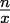
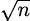
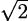
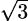
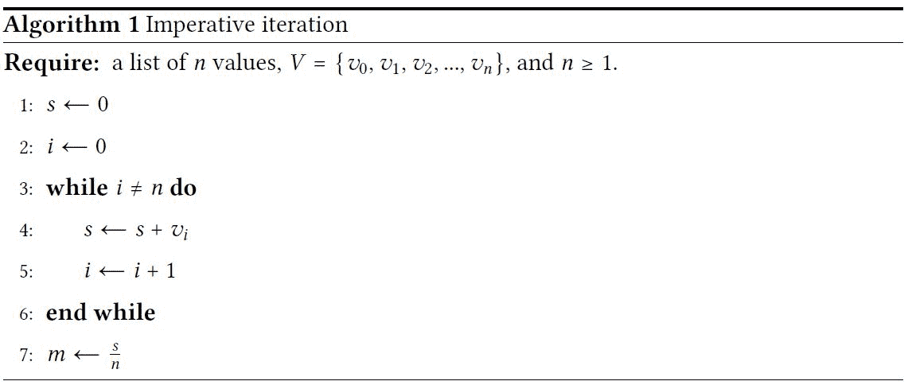
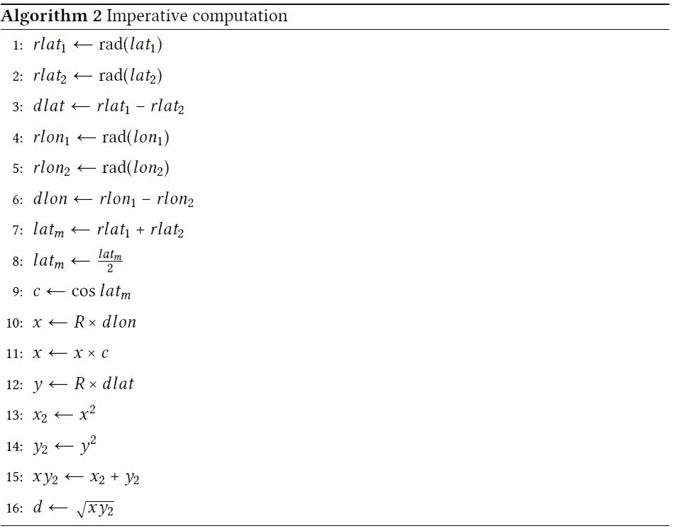
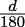
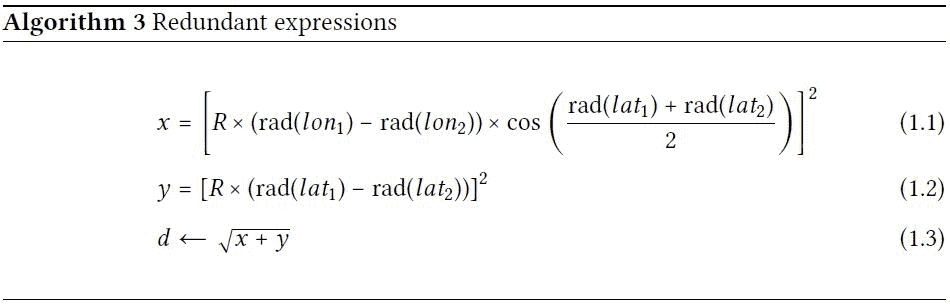
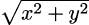

## 1

理解函数式编程

函数式编程使用表达式和评估来定义计算；通常，它们封装在函数定义中。它弱化或避免状态变化和可变对象的复杂性。这往往会产生更简洁、更易于表达的程序。在本章中，我们将介绍一些表征函数式编程的技术。我们将确定一些将这些特性映射到 Python 的方法。最后，我们还将讨论使用这些设计模式构建 Python 应用程序时，函数式编程的好处是如何积累的。

这本书不包含 Python 语言的教程介绍。我们假设读者已经了解一些 Python。在许多情况下，如果读者了解函数式编程语言，那么这些知识可以通过本书中的示例应用到 Python 上。有关 Python 的背景信息，请参阅《Python 速查手册》第 4 版或 Packt Publishing 出版的任何 Python 入门书籍。

Python 拥有广泛的编程特性，包括许多支持函数式编程的方法。正如我们将在本书中看到的那样，Python 不是一种纯粹的函数式编程语言；相反，它依赖于一系列特性的混合。我们将看到，该语言提供了足够正确的特性来提供函数式编程的好处。它还保留了命令式编程语言的全部优化能力。此外，我们可以混合面向对象和函数式特性，以利用两种范例的最佳方面。

我们还将探讨一个我们将用于本书许多示例的问题域。我们将尽量紧密地遵循探索性数据分析（EDA）。有关更多信息，请参阅[`www.itl.nist.gov/div898/handbook/eda/eda.htm`](https://www.itl.nist.gov/div898/handbook/eda/eda.htm)。"探索"这一概念意味着在数据收集之后进行数据分析，目标是推断出描述数据的适当模型。这是一个有用的领域，因为许多算法都是函数式编程的良好示例。此外，在探索数据以定位趋势和关系时，函数式编程的好处会迅速积累。

我们的目标是确立函数式编程的一些基本原理。更严肃的 Python 代码将从第二章，介绍基本函数式概念开始。

在本章中，我们将关注以下主题：

+   比较和对比函数范式与其他软件设计方法。我们将探讨 Python 的方法如何被称为函数式编程和面向对象编程之间的“混合”。

+   我们将深入探讨一个从函数式编程文献中提取的具体示例。

+   我们将以 EDA 的概述和为什么这个学科似乎提供了许多函数式编程的示例作为结束。

本书将重点关注 Python 3.10 的特性。这包括新的`match`语句。

在本书的整个过程中，我们将在示例中包含 Python 3 类型提示。类型提示可以帮助读者可视化函数定义背后的基本目的。类型提示通过 mypy 工具进行分析。与单元测试一样，mypy 可以是工具链的一部分，以产生高质量的软件。

### 1.1 编程的函数式风格

我们将通过一系列示例来定义函数式编程。这些示例之间的区别特征是状态的概念，特别是计算的状态。

Python 的强命令式特性意味着计算的状状态由各个命名空间中变量的值定义。某些类型的语句通过添加、更改或删除变量来对状态进行明确的更改。我们称之为命令式，因为特定类型的语句会改变状态。

在 Python 中，赋值语句是改变状态的主要方式。Python 还有其他语句，如`global`或`nonlocal`，它们修改特定命名空间中变量的规则。`def`、`class`和`import`等语句改变处理上下文。剩余的大部分语句提供了选择哪些赋值语句被执行的方法。然而，所有这些不同类型的语句的焦点都是改变变量的状态。

在函数式语言中，我们用评估函数的更简单概念来替换状态——变量的变化值。每次函数评估都从现有对象创建新的对象或对象。由于函数式程序是函数的组合，我们可以设计易于理解的底层函数，然后创建函数的组合，这些组合比复杂的语句序列更容易可视化。

函数评估更接近数学形式化。正因为如此，我们通常可以使用简单的代数来设计一个算法，该算法可以清楚地处理边缘情况和边界条件。这使得我们更有信心函数是有效的。这也使得定位形式化单元测试的测试用例变得容易。

重要的是要注意，与命令式（面向对象或过程式）程序相比，函数式程序通常相对简洁、表达性强且效率高。这种好处不是自动的；它需要仔细的设计。对于函数式编程的设计工作通常比过程式编程小。一些有命令式和面向对象风格经验的开发者可能发现，从有状态的设计转向函数式设计是一个挑战。

### 1.2 比较和对比过程式和函数式风格

我们将使用一个小型示例程序来展示非函数式，或过程式，的编程风格。此示例计算一系列数字的总和。每个数字都有特定的属性，使其成为序列的一部分。

```py
def sum_numeric(limit: int = 10) -> int: 
    s = 0 
    for n in range(1, limit): 
        if n % 3 == 0 or n % 5 == 0: 
            s += n 
    return s
```

这个函数计算的总和只包括 3 或 5 的倍数。我们使这个程序严格遵循过程式，避免任何显式使用 Python 的对象特性。函数的状态由变量`s`和`n`的值定义。变量`n`取值范围为 1 ≤ n < 10。由于迭代涉及对`n`变量值的有序探索，我们可以证明当`n`的值等于`limit`的值时，迭代将终止。

有两个显式赋值语句，都用于设置`s`变量的值。这些状态变化是可见的。`n`的值由`for`语句隐式设置。`s`变量中的状态变化是计算状态的一个基本元素。

现在，让我们从纯粹的功能角度再次审视这个问题。然后，我们将从更 Pythonic 的角度来审视，它保留了函数式方法的核心，同时利用了 Python 的一些特性。

#### 1.2.1 使用函数式范式

在函数式意义上，3 和 5 的倍数之和可以分解为两部分：

+   数字序列的总和

+   一系列通过简单测试条件的值，例如，是 3 和 5 的倍数

为了非常正式，我们可以使用更简单的语言组件定义总和作为一个函数。序列的总和有一个递归定义：

```py
from collections.abc import Sequence 
def sumr(seq : Sequence[int]) -> int: 
    if len(seq) == 0: 
        return 0 
    return seq[0] + sumr(seq[1:])
```

我们在两种情况下定义了总和。基本案例指出，零长度序列的总和是 0。递归案例指出，序列的总和是第一个值加上序列剩余部分的总和。由于递归定义依赖于较短的序列，我们可以确信它最终会退化到基本案例。

下面是此函数工作的一些示例：

```py
>>> sumr([7, 11]) 
18 
>>> sumr([11]) 
11 
>>> sumr([]) 
0
```

第一个例子计算了一个包含多个项目的列表的总和。第二个例子通过将第一个项目`seq[0]`加到剩余项目的总和`sumr(seq[1:])`来展示递归规则的工作方式。最终，结果的计算涉及到一个空列表的总和，它被定义为 0。

`sumr`函数最后一行的`+`运算符和基本案例中的初始值 0 将方程定义为总和。考虑如果我们把运算符改为`*`并将初始值改为 1 会发生什么：这个新表达式将计算乘积。我们将在接下来的章节中回到这个简单的泛化思想。

类似地，生成具有给定属性的值序列可以有一个递归定义，如下所示：

```py
from collections.abc import Sequence, Callable 
def until( 
        limit: int, 
        filter_func: Callable[[int], bool], 
        v: int 
) -> list[int]: 
    if v == limit: 
        return [] 
    elif filter_func(v): 
        return [v] + until(limit, filter_func, v + 1) 
    else: 
        return until(limit, filter_func, v + 1)
```

在这个函数中，我们比较了给定的值`v`与上限`limit`。如果`v`达到了上限，那么结果列表必须是空的。这是给定递归的基本案例。

有两个更多的情况是由一个外部定义的`filter_func()`函数定义的。`v`的值是通过`filter_func()`函数传递的；如果这个函数返回一个非常短的列表，包含一个元素，这个元素可以与`until()`函数计算出的任何剩余值连接起来。

如果`v`的值被`filter_func()`函数拒绝，这个值将被忽略，结果简单地由`until()`函数计算出的任何剩余值定义。

我们可以看到，`v`的值将从初始值增加到`limit`，这确保我们将达到基本情况。

在我们能够看到如何使用`until()`函数之前，我们将定义一个小函数来过滤出 3 或 5 的倍数：

```py
def mult_3_5(x: int) -> bool: 
    return x % 3 == 0 or x % 5 == 0
```

我们也可以将其定义为 lambda 对象，以强调简单函数的简洁定义。任何超过一行表达式的复杂度都需要`def`语句。

这个函数可以与`until()`函数结合生成一个值序列，这些值是 3 和 5 的倍数。以下是一个示例：

```py
>>> until(10, mult_3_5, 0) 
[0, 3, 5, 6, 9]
```

回顾本节顶部的分解，我们现在有了一种计算总和的方法，也有了一种计算值序列的方法。

我们可以将`sumr()`和`until()`函数结合起来计算值的总和。以下是生成的代码：

```py
def sum_functional(limit: int = 10) -> int: 
    return sumr(until(limit, mult_3_5, 0))
```

这个用于计算总和的小程序没有使用赋值语句来设置变量的值。这是一个纯粹的函数式、递归定义，与数学抽象相匹配，这使得推理更容易。我们可以确信每个部分都能单独工作，从而对整体有信心。

作为实际操作，我们将使用许多 Python 特性来简化创建函数式程序。我们将在本例的下一个版本中查看这些优化的一些例子。

#### 1.2.2 使用函数式混合

我们将继续使用前一个例子的一个主要函数式版本来计算 3 和 5 的倍数的和。我们的混合函数式版本可能看起来像以下这样：

```py
def sum_hybrid(limit: int = 10) -> int: 
    return sum( 
        n for n in range(1, limit) 
        if n % 3 == 0 or n % 5 == 0 
    )
```

我们已经使用生成器表达式遍历值集合并计算这些值的总和。`range(1, 10)`对象是一个可迭代对象；它生成一个值序列{n∣1 ≤ n < 10}，通常总结为“n 的值，其中 1 小于或等于 n 且 n 小于 10。”更复杂的表达式`n for n in range(1, 10) if n % 3 == 0 or n % 5 == 0`也是一个生成器。它生成一组值，{n∣1 ≤ n < 10 ∧ (n ≡ 0 mod 3 ∨ n ≡ 0 mod 5)}；我们可以描述为“n 的值，其中 1 小于或等于 n 且 n 小于 10，且 n 与 3 同余 0 或 n 与 5 同余 0。”这些是从 1 到 10 的集合中取出的 3 和 5 的倍数。变量`n`依次绑定到`range`对象提供的每个值。`sum()`函数消耗可迭代的值，创建一个最终对象，23。

绑定的变量`n`在生成器表达式之外不存在。变量`n`在程序的其他地方是不可见的。

在这个示例中，变量`n`与前面两个命令式示例中的变量`n`并不直接可比。一个`for`语句（在生成器表达式之外）在局部命名空间中创建了一个正确的变量。生成器表达式不会以与`for`语句相同的方式创建变量：

```py
>>> sum( 
...     n for n in range(1, 10) 
...     if n % 3 == 0 or n % 5 == 0 
... ) 
23 
>>> n 
Traceback (most recent call last): 
   File "<stdin>", line 1, in <module> 
NameError: name ’n’ is not defined
```

生成器表达式不会像变量`n`那样污染命名空间，因为`n`在表达式的非常狭窄的上下文中之外没有相关性。这是一个令人愉快的特性，确保我们不会因为那些在单个表达式之外没有意义的变量的值而感到困惑。

#### 1.2.3 乌龟堆栈

当我们使用 Python 进行函数式编程时，我们将踏上一条涉及非严格函数式混合的道路。Python 不是 Haskell、OCaml 或 Erlang。就底层处理器硬件而言，它也不是函数式的；它甚至不是严格面向对象的，因为 CPU 通常是过程式的。

> *所有编程语言都建立在抽象、库、框架和虚拟机之上。这些抽象反过来可能依赖于其他抽象、库、框架和虚拟机。最恰当的隐喻是这样的：世界是建立在一只巨大的乌龟背上的。这只乌龟站在另一只巨大的乌龟背上。而这只乌龟，又站在另一只乌龟的背上.*
> 
> *一切皆由乌龟组成。*
> 
> *—— 匿名*

层层抽象没有实际的上限。即使是像电路和电子这样的具体事物，也可能是为了帮助设计者总结量子电动力学的细节而进行的抽象。

更重要的是，抽象和虚拟机的存在并没有实质性地改变我们设计软件以利用 Python 函数式编程特性的方法。

即使在函数式编程社区内部，也存在更纯粹和不太纯粹的函数式编程语言。有些语言广泛使用单子来处理诸如文件系统输入输出这样的有状态事物。其他语言则依赖于类似于我们使用 Python 的混合环境。在 Python 中，软件可以一般是函数式的，同时精心选择过程式异常。

我们的函数式 Python 程序将依赖于以下三个抽象堆栈：

+   我们的应用程序将一直是以函数的形式存在，直到我们触及到对象；

+   支持我们函数式编程的底层 Python 运行时环境也是以对象的形式存在，直到我们触及到库；

+   支持 Python 的库就像是 Python 站立在上的乌龟。

操作系统和硬件形成它们自己的乌龟堆栈。这些细节与我们即将解决的问题无关。

### 1.3 函数式编程的经典示例

作为我们介绍的一部分，我们将查看一个函数式编程的经典示例。这是基于 John Hughes 的论文《Why Functional Programming Matters》。这篇文章发表在由 D. Turner 编辑的《Research Topics in Functional Programming》论文集中，由 Addison-Wesley 于 1990 年出版。

这里有一个链接到《Research Topics in Functional Programming》中的一篇论文，“Why Functional Programming Matters”：[`www.cs.kent.ac.uk/people/staff/dat/miranda/whyfp90.pdf`](http://www.cs.kent.ac.uk/people/staff/dat/miranda/whyfp90.pdf)

这篇论文对函数式编程进行了深刻的讨论。给出了几个示例。我们将只看其中一个：用于寻找函数任何根的牛顿-拉夫森算法。在这种情况下，我们将定义一个计算数字平方根的函数。

这很重要，因为许多这个算法的版本依赖于通过循环显式管理的状态。确实，休斯论文提供了一个 Fortran 代码片段，强调了有状态、命令式的处理。

这个近似的骨架是从当前近似计算下一个近似值。`next_()`函数接受`x`，即`sqrt(n)`值的近似，并计算一个包围正确根的下一个值。请看以下示例：

```py
def next_(n: float, x: float) -> float: 
    return (x + n / x) / 2
```

此函数计算一系列值，这些值将迅速收敛到某个值 x，使得 x = ，这意味着 x = 。

注意，`next()`这个名字会与内置函数冲突。将其命名为`next_()`让我们尽可能接近原始演示，使用 Pythonic 的名字。

这里是如何在 Python 的交互式 REPL 中使用该函数的示例：

```py
>>> n = 2 
>>> f = lambda x: next_(n, x) 
>>> a0 = 1.0 
>>> [round(x, 4) 
... for x in (a0, f(a0), f(f(a0)), f(f(f(a0))),) 
... ] 
[1.0, 1.5, 1.4167, 1.4142]
```

我们将`f()`函数定义为 lambda，它将收敛到（其中 n = 2）。我们以 1.0 作为 a[0]的初始值。然后我们评估了一系列递归评估：a[1] = f(a[0])，a[2] = f(f(a[0]))，依此类推。我们使用生成器表达式评估这些函数，以便将每个值四舍五入到四位小数。这使得输出更容易阅读，并且更容易与`doctest`一起使用。这个序列似乎迅速收敛到。为了得到更精确的答案，我们必须继续执行上述四个步骤之后的步骤。

我们可以编写一个函数，理论上可以生成一个无限序列的 a[i]值。这个序列将收敛到正确的平方根：

```py
from collections.abc import Iterator, Callable 
def repeat( 
        f: Callable[[float], float], 
        a: float 
) -> Iterator[float]: 
    yield a 
    yield from repeat(f, f(a))
```

此函数将使用函数`f()`和一个初始值`a`生成一系列近似值。如果我们提供前面定义的`next_()`函数，我们将得到一系列对`n`参数平方根的近似值。

`repeat()`函数期望`f()`函数有一个参数；然而，我们的`next_()`函数有两个参数。我们使用 lambda 对象`lambda x: next_(n, x)`创建了一个部分版本的`next_()`函数，其中一个变量被绑定。

Python 的生成器函数不能简单地递归；它们必须显式地迭代递归结果，并单独产生它们。

尝试使用简单的`return` `repeat(f, f(a))`将结束迭代，返回一个生成器表达式而不是产生值。

有两种方法可以返回所有值而不是返回一个生成器表达式，如下所示：

+   我们可以编写一个显式的`for`语句来产生值，如下所示：

    ```py
    for x in some_iter: yield x
    ```

+   我们可以使用以下方式使用`yield from`表达式：

    ```py
    yield from some_iter
    ```

这两种产生递归生成函数值的技巧将会有类似的结果。我们将尝试强调`yield from`。

结果表明`yield`和`yield from`比我们在这里展示的要复杂一些。为了我们的目的，我们将限制自己处理递归结果。有关`yield`和`yield from`的完整功能集的更多信息，请参阅 PEP 342 和 PEP 380：[`peps.python.org/pep-0342/`](https://peps.python.org/pep-0342/) 和 [`peps.python.org/pep-0380/`](https://peps.python.org/pep-0380/)。

当然，我们不想创建由`repeat()`函数生成的整个无限序列。当我们找到所需的平方根时，停止生成值是至关重要的。我们可以考虑的“足够接近”的极限的常见符号是希腊字母 epsilon，𝜖。

在 Python 中，当我们一次从无限序列中取出一个元素时，我们必须稍微聪明一点。使用一个简单的接口函数来包装稍微复杂一些的递归是一个很好的解决方案。请看以下代码片段：

```py
from collections.abc import Iterator 
def within( 
        𝜖: float, 
        iterable: Iterator[float] 
) -> float: 
    def head_tail( 
            𝜖: float, 
            a: float, 
            iterable: Iterator[float] 
    ) -> float: 
        b = next(iterable) 
        if abs(a-b) <= 𝜖: 
            return b 
        return head_tail(𝜖, b, iterable) 

    return head_tail(𝜖, next(iterable), iterable)
```

我们定义了一个内部函数`head_tail()`，它接受容差值𝜖、可迭代序列中的一个元素`a`以及可迭代序列的其余部分`iterable`。使用`next()`函数从可迭代序列中提取的第一个元素绑定到名称`b`。如果|a − b|≤ 𝜖，则`a`和`b`的值足够接近，可以将`b`的值称为平方根；差异小于或等于非常小的值𝜖。否则，我们使用`b`值在`head_tail()`函数的递归调用中检查下一对值。

我们的`within()`函数正确地初始化了内部`head_tail()`函数，使用`iterable`参数的第一个值。

我们可以使用三个函数`next_()`、`repeat()`和`within()`来创建一个平方根函数，如下所示：

```py
def sqrt(n: float) -> float: 
    return within( 
        𝜖=0.0001, 
        iterable=repeat( 
            lambda x: next_(n, x), 
            1.0 
        ) 
    )
```

我们使用`repeat()`函数根据`next_(n,x)`函数生成一个（可能）无限值的序列。我们的`within()`函数将在找到两个差异小于𝜖的值时停止生成序列中的值。

这个 `sqrt()` 函数的定义为底层的 `within()` 函数提供了有用的默认值。它提供了一个 𝜖 值为 0.0001 和一个初始 a[0] 值为 1.0。

更高级的版本可以使用默认参数值来使更改成为可能。作为一个练习，`sqrt()` 的定义可以被重写，以便像 `sqrt(1.0, 0.000_01, 3)` 这样的表达式将以 1.0 的近似值开始，并计算  的值，精确到 0.00001。对于大多数应用，初始 a[0] 值可以是 1.0。然而，它越接近实际的平方根，这个算法的收敛速度就越快。

这个近似算法的原始示例是在 Miranda 语言中展示的。很容易看出 Miranda 和 Python 之间存在一些深刻的差异。尽管有差异，但相似之处让我们有信心认为许多类型的函数式编程可以很容易地在 Python 中实现。

这里展示的 `within` 函数是按照原始文章的函数定义编写的。Python 的 `itertools` 库提供了一个 `takewhile()` 函数，可能比这里的 `within()` 函数更适合这个应用。同样，`math.isclose()` 函数可能比这里使用的 `abs(a-b) <= 𝜖` 表达式更好。Python 提供了大量的预构建函数式编程特性；我们将在第八章（Chapter 08.xhtml#x1-1700008）、The Itertools Module 和第九章（Chapter_09.xhtml#x1-1990009）、Itertools for Combinatorics – Permutations and Combinations 中仔细研究这些函数。

### 1.4 探索性数据分析

在本书的后面部分，我们将使用探索性数据分析领域作为函数式编程具体示例的来源。这个领域充满了处理复杂数据集的算法和方法；函数式编程通常在问题域和自动化解决方案之间非常匹配。

虽然细节因作者而异，但 EDA（探索性数据分析）有几个被广泛接受的阶段。这些包括以下内容：

+   数据准备：这可能涉及源应用程序的提取和转换。它可能涉及解析源数据格式，并进行某种数据清理以删除不可用或无效的数据。这是功能设计技术的优秀应用。

David Mertz 的杰出著作《为高效数据科学清理数据》（[`www.packtpub.com/product/cleaning-data-for-effective-data-science/9781801071291`](https://www.packtpub.com/product/cleaning-data-for-effective-data-science/9781801071291)）提供了有关数据清理的更多信息。这对于所有数据科学和分析工作都是一个关键主题。

+   数据探索：这是对可用数据的描述。这通常涉及基本统计函数。这是探索函数式编程的另一个绝佳场所。我们可以将我们的重点描述为单变量和双变量统计，但这听起来过于令人畏惧和复杂。这实际上意味着我们将关注均值、中位数、众数和其他相关描述性统计。数据探索还可能涉及数据可视化。我们将绕过这个问题，因为它不涉及很多函数式编程。

有关 Python 可视化的更多信息，请参阅《Python 交互式数据可视化》，[`www.packtpub.com/product/interactive-data-visualization-with-python-second-edition/9781800200944`](https://www.packtpub.com/product/interactive-data-visualization-with-python-second-edition/9781800200944)。有关一些额外的可视化库，请参阅[`www.projectpro.io/article/python-data-visualization-libraries/543`](https://www.projectpro.io/article/python-data-visualization-libraries/543)。

+   数据建模和机器学习：这通常具有规范性，因为它涉及将模型扩展到新数据。我们将绕过这个问题，因为一些模型可能会变得数学上复杂。如果我们在这上面花费太多时间，我们就无法专注于函数式编程。

+   评估和比较：当存在替代模型时，每个模型都必须被评估以确定哪个更适合现有数据。这可能涉及模型输出的普通描述性统计，这些统计可以受益于功能设计技术。

EDA 的一个目标通常是创建一个可以作为决策支持应用程序部署的模型。在许多情况下，模型可能是一个简单的函数。函数式编程方法可以将模型应用于新数据，并显示供人类消费的结果。

### 1.5 摘要

在本章中，我们着眼于区分函数式范式和命令式范式，以探讨编程范式。就我们的目的而言，面向对象编程是一种命令式编程；它依赖于显式的状态变化。本书的目标是探索 Python 的函数式编程特性。我们注意到 Python 的一些部分不允许纯函数式编程；我们将使用一些混合技术，这些技术将简洁、表达性强的函数式编程的优点与 Python 中的一些高性能优化相结合。

在下一章中，我们将详细探讨五种特定的函数式编程技术。这些技术将构成我们 Python 混合函数式编程的基础。

### 1.6 练习

本书中的练习基于 GitHub 上 Packt Publishing 提供的代码。请参阅[`github.com/PacktPublishing/Functional-Python-Programming-3rd-Edition`](https://github.com/PacktPublishing/Functional-Python-Programming-3rd-Edition)。

在某些情况下，读者会注意到 GitHub 上提供的代码包含了一些练习的部分解决方案。这些作为提示，允许读者探索其他解决方案。

在许多情况下，练习将需要单元测试用例来确认它们确实解决了问题。这些通常与 GitHub 仓库中已提供的单元测试用例相同。读者需要将书籍中的示例函数名替换为自己的解决方案以确认其工作。

#### 1.6.1 将命令式算法转换为函数式代码

以下算法被表述为命令式赋值语句和 while 构造来指示迭代处理。



算法 1：命令式迭代

这看起来是在计算什么？给定像 `sum` 这样的 Python 内置函数，这能简化吗？

将其用 Python 编写并重构代码以确保生成正确答案。

一个测试用例如下：


m 的计算值大约为 `7.5`。

#### 1.6.2 将逐步计算转换为函数式代码

以下算法被表述为一系列的单个赋值语句。`rad(x)` 函数将度转换为弧度，`rad(d) = π × `。请参阅 `math` 模块以获取实现。



算法 2：命令式计算

这段代码是否容易理解？你能将这个计算总结为一个简短的类似数学公式的表达式吗？

将其分解为部分，第 1 到 8 行似乎专注于一些转换、差异和中点计算。第 9 到 12 行计算两个值，x 和 y。这些能否总结或简化？最后的四行进行相对直接的 d 的计算。这些能否总结或简化？作为一个提示，看看 `math.hypot()` 函数，这个函数可能适用于这种情况。

将其用 Python 编写并重构代码会有所帮助。

一个测试用例如下：

lat[1] ← 32.82950

lon[1] ←−79.93021

lat[2] ← 32.74412

lon[2] ←−79.85226

d 的计算值大约为 `6.4577`。

重构代码可以帮助你确认你的理解。

#### 1.6.3 修改 sqrt() 函数

在“经典函数式编程示例”中定义的 `sqrt()` 函数只有一个参数值，`n`。重写它以创建一个更高级的版本，使用默认参数值来使更改成为可能。例如，表达式 `sqrt(1.0, `` 0.000_01, `` 3)` 将从 1.0 的近似值开始，并计算到 0.00001 的精度。最后一个参数值 `3` 是 n 的值，我们需要计算其平方根的数字。

#### 1.6.4 数据清洗步骤

源数据文件包含各种格式的美国 ZIP 码。当使用电子表格软件收集或转换数据时，这个问题经常出现。

+   一些 ZIP 代码被处理为数字。这对于新英格兰地区来说并不理想，因为那里的 ZIP 代码以零开头。例如，新罕布什尔州朴次茅斯的代码应该是`03801`。在源文件中，它是`3801`。大多数情况下，这些数字将具有五位或九位数字，但新英格兰的一些代码在去掉单个前导零后将是四位或八位数字。对于波多黎各，可能会有两个前导零。

+   一些 ZIP 代码以字符串形式存储，例如 12345−0100，其中附加了一个四位邮政信箱扩展到基本五位代码。

CSV 格式的文件只有文本值。然而，当文件中的数据经过电子表格处理时，可能会出现问题。因为 ZIP 代码只有数字，它可以被视为数值数据。这意味着原始数据值已经被转换为数字，然后再转换回文本表示。这些转换将删除前导零。在各种电子表格应用程序中存在许多解决方案来防止这个问题。如果不使用它们，数据可能会出现异常值，这些异常值可以被清理以恢复原始表示。

练习的目标是计算源数据文件中最受欢迎的 ZIP 代码的直方图。数据必须经过清理，以具有以下两种 ZIP 格式：

+   没有邮政信箱的五位字符，例如`03801`

+   例如，带有连字符的十个字符，例如`03899-9876`

基本的直方图可以使用`collections.Counter`对象完成如下。

```py
from collections import Counter 
import csv 
from pathlib import Path 

DEFAULT_PATH = Path.cwd() / "address.csv" 

def main(source_path: Path = DEFAULT_PATH) -> None: 
    frequency: Counter[str] = Counter() 
    with source_path.open() as source: 
        rdr = csv.DictReader(source) 
        for row in rdr: 
            if "-" in row[’ZIP’]: 
                text_zip = row[’ZIP’] 
                missing_zeroes = 10 - len(text_zip) 
                if missing_zeroes: 
                    text_zip = missing_zeroes*’0’ + text_zip 
            else: 
                text_zip = row[’ZIP’] 
                if 5 < len(row[’ZIP’]) < 9: 
                    missing_zeroes = 9 - len(text_zip) 
                else: 
                    missing_zeroes = 5 - len(text_zip) 
                if missing_zeroes: 
                    text_zip = missing_zeroes*’0’ + text_zip 
            frequency[text_zip] += 1 
    print(frequency) 

if __name__ == "__main__": 
    main()
```

这利用了命令式处理功能来读取文件。使用`for`语句处理文件行，这种整体设计是 Python 的一个基本特性，我们可以保留它。

另一方面，通过一系列状态变化处理`text_zip`和`missing_zeroes`变量似乎是一个潜在的混淆来源。

这可以通过几次重写进行重构：

1.  将`main()`函数分解为两部分。应该编写一个新的`zip_histogram()`函数来包含大部分处理细节。这个函数将处理打开的文件，并返回一个`Counter`对象。建议的签名如下：

    ```py
        def zip_histogram( 
                reader: csv.DictReader[str]) -> Counter[str]: 
            pass
    ```

    `main()`函数负责打开文件，创建`csv.DictReader`实例，评估`zip_histogram()`，并打印直方图。

1.  一旦定义了`zip_histogram()`函数，`ZIP`属性的清理可以重构为一个单独的函数，例如命名为`zip_cleanse()`。这个函数而不是设置`text_zip`变量的值，可以返回清理后的结果。这可以单独测试以确保各种情况都能优雅地处理。

1.  带有连字符和不带连字符的长 ZIP 码之间的区别是应该修复的问题。一旦 `zip_cleanse()` 在一般情况下工作，添加一个新函数来在只有数字的 ZIP 码中注入连字符。这应该将 `38011234` 转换为 `03801-1234`。注意，短的五位 ZIP 码不需要添加连字符；这种额外的转换仅适用于九位代码，使其成为十位字符串。

最终的 `zip_histogram()` 函数应该看起来像以下这样：

```py
def zip_histogram( 
        reader: csv.DictReader[str]) -> Counter[str]: 
    return Counter( 
        zip_cleanse( 
            row[’ZIP’] 
        ) for row in reader 
    )
```

这为在给定列中进行专注的数据清理提供了一个框架。它使我们能够区分 CSV 和文件处理功能，以及如何清理特定列数据的细节。

#### 1.6.5（高级）优化此功能代码

以下算法被表述为一个单独的“步骤”，该步骤已被分解为三个独立的公式。这种分解更多的是为了满足将表达式放入印刷页面限制的需要，而不是一种有用的优化。rad(x) 函数将度转换为弧度，rad(d) = π ×。



算法 3：冗余表达式

存在许多冗余表达式，例如 rad(lat[1]) 和 rad(lat[2])。如果这些被分配给局部变量，表达式能否简化？

d 的最终计算结果与计算斜边传统的理解不符，。代码应该重构以匹配 `math.hypot` 中的定义吗？

从用 Python 编写这个开始，然后重构代码是一个好方法。

以下是一个测试用例：

lat[1] ← 32.82950

lon[1] ←−79.93021

lat[2] ← 32.74412

lon[2] ←−79.85226

d 的计算值大约为 `6.4577`。

代码重构可以帮助你确认你对这段代码真正功能的理解。

### 加入我们的 Discord 社区空间

加入我们的 Python Discord 工作空间，讨论并了解更多关于这本书的信息：[`packt.link/dHrHU`](https://packt.link/dHrHU)


