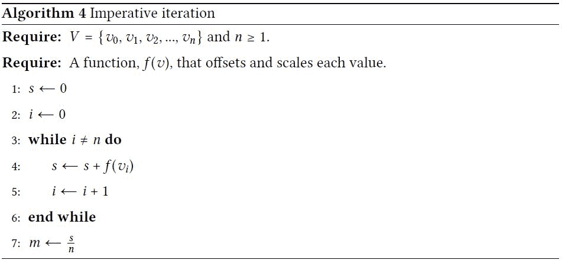
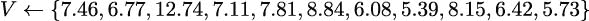
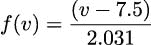
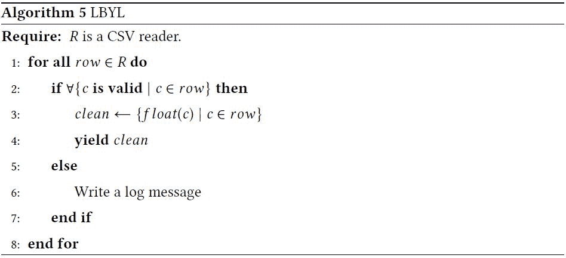
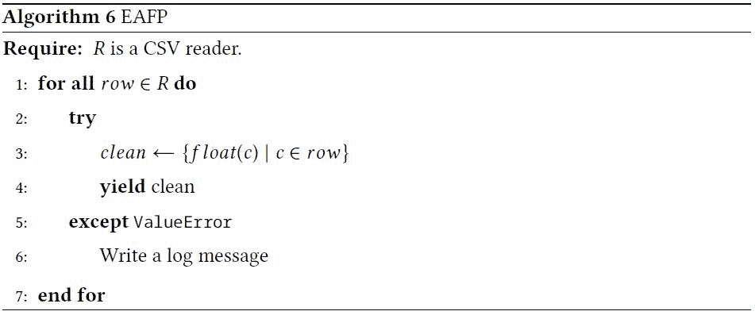

## 3

函数、迭代器和生成器

函数式编程的核心是使用纯函数将输入域的值映射到输出范围。避免副作用可以减少对变量赋值以维护计算状态的任何依赖。我们无法从 Python 语言中删除赋值语句，但我们可以减少对有状态对象的依赖。这意味着在可用的 Python 内置函数和数据结构中选择那些不需要有状态操作的选择。

本章将从函数式视角介绍几个 Python 特性，如下所示：

+   纯函数，无副作用

+   函数作为可以作为参数传递或作为结果返回的对象

+   使用 Python 的面向对象后缀和前缀表示法

+   使用元组作为创建不可变对象的方法，从而避免状态变化的混淆

+   使用可迭代集合作为我们进行函数式编程的主要设计工具

我们将探讨生成器和生成器表达式，因为这些都是处理对象集合的方法。正如我们在第二章，介绍基本函数式概念中提到的，在尝试用递归替换所有生成器表达式时，存在一些边界问题。Python 强制执行递归限制，并且不会自动处理尾调用优化（TCO）：我们必须使用生成器表达式手动优化递归。

我们将编写生成器表达式，以执行以下任务：

+   转换

+   重组

+   复杂计算

我们将快速浏览许多内置的 Python 集合以及如何在追求函数式范式的同时处理集合。这可能会改变我们处理列表、字典和集合的方法。编写函数式 Python 鼓励我们关注元组和不可变集合。在下一章中，我们将强调更多与特定类型集合一起工作的函数式方法。

### 3.1 编写纯函数

在第二章，介绍基本函数式概念中，我们探讨了纯函数。在本节中，我们将探讨非函数式编程中常见的一个问题：一个引用全局变量的函数。当全局变量被赋值时，将使用`global`语句。然而，当全局变量被读取时，这被称为自由变量，Python 代码中没有任何明显的标记。

任何对 Python 全局命名空间中值的引用（使用自由变量）都可以重新设计为一个合适的参数。在大多数情况下，这相当简单。以下是一个依赖于自由变量的示例：

```py
global_adjustment: float 

def some_function(a: float, b: float, t: float) -> float: 
    return a+b*t+global_adjustment
```

在重构函数后，我们需要更改对这个函数的每个引用。这可能会在复杂的应用程序中产生连锁反应。我们将重构作为练习留给读者。

Python 中有许多内部对象是具有状态的。用于输入和输出的对象通常被称为文件对象或类似文件的对象；这些是常用状态对象的例子。有关文件对象的更多信息，请参阅`io`模块。我们观察到 Python 中一些常用的状态对象通常表现为上下文管理器。在少数情况下，状态对象并没有完全实现上下文管理器接口；在这些情况下，通常有一个`close()`方法。我们可以使用`contextlib.closing()`函数为这些对象提供适当的上下文管理器接口。

上下文管理器提供了一种在代码块进入和退出时执行操作的方法。`with`语句使用上下文管理器执行进入操作，执行缩进的代码块，并执行退出操作。需要注意的是，退出操作总是执行，即使缩进的代码块中抛出了异常。这为执行状态改变操作提供了一种整洁的方式，使代码更容易推理。在实践中，它看起来像以下示例：

```py
from pathlib import Path 

def write_file(some_path: Path) -> None: 
    result = "Hello, world!" 
    with some_path.open(’w’) as output_file: 
        output_file.write(result + "\n")
```

文件仅在`with`语句内部打开用于写入。这使得更容易看到状态改变操作在哪里执行。

我们不能轻易消除所有具有状态的 Python 对象。因此，我们必须在管理状态的同时，仍然利用函数式设计的优势。为此，我们应该始终使用`with`语句将具有状态的文件对象封装到定义良好的作用域中。

总是在`with`上下文中使用文件对象。这定义了一个在此上下文中将执行状态改变操作的环境。

我们应该始终避免使用全局文件对象、全局数据库连接以及相关的状态对象问题。全局文件对象是处理打开文件或数据库的常见模式。我们可能有一个如下所示的函数：

```py
from typing import TextIO 
ifile: TextIO 
ofile: TextIO 

def open_files(iname: str, oname: str) -> None: 
    """A bad idea...""" 
    global ifile, ofile 
    ifile = open(iname, "r") 
    ofile = open(oname, "w")
```

这个函数创建了一对容易被忽视的全局变量。其他函数可以使用`ifile`和`ofile`变量，希望它们正确地引用了全局文件，这些文件被保留打开状态，并将经历一系列难以理解的状态变化。

这不是一个很好的函数式设计，我们需要避免它。文件应该是函数的适当参数，打开的文件应该嵌套在`with`语句中，以确保它们的状态行为得到适当处理。将变量从全局变量更改为正式参数是一个重要的重写：这使得文件操作更易于可见。

重写将涉及定位每个使用`ifile`或`ofile`作为自由变量的函数。例如，我们可能有一个如下所示的函数：

```py
def next_line_with(prefix: str) -> str | None: 
    """Also a bad idea...""" 
    line = ifile.readline() 
    while (line is not None and not line.startswith(prefix)): 
        line = ifile.readline() 
    return line
```

我们需要将`ifile`全局变量引用转换为该函数的参数。这将给调用`next_line_with()`的函数带来一系列的变化。这可能需要对识别和定位状态变化进行广泛的修改。这可能导致重新思考设计，以替换像`next_line_with()`这样的函数。

此上下文管理器设计模式也适用于数据库。数据库连接对象通常应作为正式参数提供给应用程序的函数。这与一些流行的 Web 框架的工作方式相反：一些框架依赖于全局数据库连接，试图使数据库成为应用程序的一个透明特性。这种透明性掩盖了 Web 操作与数据库之间的依赖关系；它可以使单元测试比必要的更复杂。此外，多线程 Web 服务器可能不会从共享单个数据库连接中受益：连接池通常更好。这表明，使用功能设计结合少量隔离的有状态特性的混合方法有一些好处。

### 3.2 函数作为一等对象

在第二章，介绍基本功能概念中，我们探讨了 Python 函数作为一等对象的方式。在 Python 中，函数对象具有许多属性。参考手册列出了适用于函数的许多特殊成员名称。由于函数是具有属性的对象，我们可以使用特殊属性如`__doc__`或`__name__`来提取函数的文档字符串或名称。我们还可以通过`__code__`属性提取函数体。在编译型语言中，这种内省可能是无法实现的，或者相当复杂。

此外，可调用对象帮助我们创建函数。我们可以将可调用类定义视为高阶函数。我们确实需要在如何使用可调用对象的`__init__()`方法上谨慎行事；我们应该避免设置有状态的类变量。一个常见应用是使用`__init__()`方法创建符合策略设计模式的对象。

遵循策略设计模式的类依赖于其他对象来提供算法或算法的一部分。这允许我们在运行时注入算法细节，而不是将细节编译到类中。

为了专注于整体设计原则，我们将查看一个执行微小计算的函数。这个函数计算梅森素数中的一个。有关此主题的持续研究，请参阅[`www.mersenne.org/primes/`](https://www.mersenne.org/primes/)。

下面是一个具有嵌入策略对象的可调用对象类的定义示例：

```py
from collections.abc import Callable 

class Mersenne1: 

    def __init__( 
            self, 
            algorithm : Callable[[int], int] 
    ) -> None: 
        self.pow2 = algorithm 

    def __call__(self, arg: int) -> int: 
        return self.pow2(arg) - 1
```

此类使用`__init__()`来保存对另一个函数的引用，即`algorithm`作为`self.pow2`。我们不是创建任何有状态的实例变量；`self.pow2`的值预计不会改变。使用像`_pow2`这样的名称是常见的做法，以表明这个属性不应该被此类客户端使用。`algorithm`参数的类型提示为`Callable[[int], int]`，它描述了一个接受整数参数并返回整数值的函数。

我们使用了`collections.abc`模块中的`Callable`类型提示，其中它被定义。在`typing`模块中有一个别名，但由于 PEP 585 的实施，`typing.Callable`的使用已被弃用。我们将在本章中使用`collections.abc`模块中的多个泛型类型。

给定的作为策略对象的函数必须将 2 提升到指定的幂。我们可以插入任何执行此计算的函数。可以插入此类的三个候选对象如下：

```py
def shifty(b: int) -> int: 
    return 1 << b 

def multy(b: int) -> int: 
    if b == 0: return 1 
    return 2 * multy(b - 1) 

def faster(b: int) -> int: 
    if b == 0: return 1 
    if b % 2 == 1: return 2 * faster(b-1) 
    t = faster(b // 2) 
    return t * t
```

`shifty()`函数通过位左移来将 2 提升到所需的幂。`multy()`函数使用简单的递归乘法。`faster()`函数使用分治策略，将执行 log 2 次乘法而不是 b 次乘法。

这三个函数具有相同的函数签名。每个都可以总结为`Callable[[int], int]`，这与`Mersenne1.__init__()`方法的参数`algorithm`相匹配。

我们可以用嵌入的策略算法创建`Mersenne1`类的实例，如下所示：

```py
m1s = Mersenne1(shifty) 

m1m = Mersenne1(multy) 

m1f = Mersenne1(faster)
```

结果中的每个函数，`m1s()`、`m1m()`和`m1f()`，都是由另一个函数构建的。函数`shifty()`、`multy()`和`faster()`被纳入结果函数中。这展示了我们可以定义产生相同结果但使用不同算法的替代函数。

由此类创建的可调用对象表现得像普通的 Python 函数，如下例所示：

```py
>>> m1s(17) 
131071 
>>> m1f(89) 
618970019642690137449562111
```

Python 允许我们计算 M[89] = 2⁸⁹ − 1，因为这个值甚至接近 Python 的递归限制。这是一个相当大的质数，因为它有 27 位。为了超过`multy()`函数的限制，我们需要请求 M[1,279]的值，这是一个有 386 位的数字。

### 3.3 使用字符串

由于 Python 字符串是不可变的，它们是函数式编程对象的绝佳例子。Python 的`str`对象有多个方法，所有这些方法都会产生一个新的字符串作为结果。这些方法是纯函数，没有副作用。

方法的语法是后缀的，而大多数函数是前缀的。这种语法风格的混合意味着当与常规函数混合时，复杂的字符串操作可能难以阅读。例如，在这个表达式 `len(variable.title())` 中，`title()` 方法是后缀表示法，而 `len()` 函数是前缀表示法。（我们在第二章，介绍基本功能概念，熟悉领域部分中提到了这一点。）

当从网页抓取数据时，我们可能有一个用于清理数据的函数。这可能将一系列转换应用于字符串以清理标点，并返回一个 `Decimal` 对象供应用程序的其他部分使用。这将涉及前缀和后缀语法的混合使用。

它可能看起来像以下代码片段：

```py
from decimal import Decimal 

def clean_decimal(text: str | None) -> Decimal | None: 
    if text is None: return None 
    return Decimal( 
        text.replace("$", "").replace(",", "") 
    )
```

此函数对字符串进行两次替换以移除 `$` 和 `,` 字符串值。得到的字符串用作 `Decimal` 类构造函数的参数，该构造函数返回所需的对象。如果输入值为 `None`，则将其保留；这就是为什么使用 `str` | `None` 类型提示的原因。

为了使语法看起来更一致，我们可以考虑为字符串方法定义我们自己的前缀函数，如下所示：

```py
def replace(text: str, a: str, b: str) -> str: 
    return text.replace(a, b)
```

这可以让我们使用 `Decimal(replace(replace(text, "$", ""), ",", ""))`，具有一致的看起来像前缀语法的样式。这种一致性是否比混合前缀和后缀表示法有显著改进还不清楚。这可能是愚蠢的一致性的一个例子。

一种稍微更好的方法可能是定义一个更有意义的用于去除标点的函数，如下面的代码片段所示：

```py
def remove(str: str, chars: str) -> str: 
    if chars: 
        return remove( 
            str.replace(chars[0], ""), 
            chars[1:] 
        ) 
    return str
```

此函数将递归地移除 `chars` 变量中的每个字符。我们可以使用它作为 `Decimal(remove(text, "$,"))`，以使我们的字符串清理意图更清晰。

### 3.4 使用元组和命名元组

由于 Python 元组是不可变对象，它们是适合函数式编程的对象的另一个极好例子。Python 元组方法很少，所以几乎所有的事情都是使用前缀语法完成的。元组有许多用途，尤其是在处理列表-元组、元组-元组和元组生成器结构时。

`typing.NamedTuple` 类为元组添加了一个基本特性：使用名称而不是神秘的索引数字。我们可以利用命名元组来创建数据累积的对象。这允许我们编写基于无状态对象的纯函数，同时将数据绑定到整洁的对象包中。`collections.namedtuple()` 也可以用来定义不可变对象类。这缺少提供类型提示的机制，使其不如 `typing.NamedTuple` 类受欢迎。

使用元组或`typing.NamedTuple`对象的决定完全是出于方便。例如，考虑将颜色值序列作为一个形式为`(number, number, number)`的三重元组处理。这些是否按红、绿、蓝的顺序排列并不明确。我们有几种方法可以使元组结构更明确。

一种纯粹函数式的方法来暴露三元结构是通过创建函数来分解三重元组，如下面的代码片段所示：

```py
from collections.abc import Callable 
from typing import TypeAlias 

Extractor: TypeAlias = Callable[[tuple[int, int, int, str]], int] 

red: Extractor = lambda color: color[0] 

green: Extractor = lambda color: color[1] 

blue: Extractor = lambda color: color[2]
```

给定一个元组`item`，我们可以使用`red(item)`来选择具有红色成分的项。这种风格在许多纯粹函数式语言中使用；它具有与数学抽象相匹配的结构。

在 Python 中，有时为每个变量提供更正式的类型提示可能会有所帮助，如下所示：

```py
from collections.abc import Callable 
from typing import TypeAlias 

RGB: TypeAlias = tuple[int, int, int, str] 

redt: Callable[[RGB], int] = lambda color: color[0]
```

这定义了一个新的类型别名`RGB`，作为一个四重元组。`redt()`函数提供了一个类型提示`Callable[[RGB], int]`，表示它应该被视为一个接受`RGB`类参数值并产生整数结果的函数。这遵循了其他函数式编程风格，并添加了可以被 mypy 检查的类型提示。

一种稍微更好的技术是使用 Python 的`typing.NamedTuple`类。它使用类定义而不是函数定义，看起来如下所示：

```py
from typing import NamedTuple 
class Color(NamedTuple): 
    """An RGB color.""" 
    red: int 
    green: int 
    blue: int 
    name: str
```

`Color`类定义了一个具有特定名称和类型提示的元组，这些提示针对元组中的每个位置。这保留了性能和不可变性的优势。它还增加了 mypy 程序确认元组被正确使用的功能。

这也意味着我们将使用`color.red`而不是`red(color)`。使用属性名来访问元组的成员似乎增加了清晰度。

在处理不可变元组方面，还有一些额外的处理方法。我们将在第七章，复杂无状态对象中查看所有这些不可变类技术。

### 3.5 使用生成器表达式

我们已经在第二章，介绍基本函数式概念的懒加载和急加载评估部分展示了生成器表达式的几个例子。在本章中我们还将展示更多。在本节中，我们将介绍一些更多的生成器技术。

Python 集合被描述为可迭代的。我们可以使用`for`语句遍历值。关键机制是集合能够创建一个迭代器对象，该对象由`for`语句使用。这个概念可以推广到包括一个作为值迭代器的函数。我们称这些为生成器函数。我们也可以编写生成器表达式。

常常看到生成器表达式用于通过列表推导式或字典推导式语法创建`list`或`dict`字面量。这是一个列表推导式示例，`[x**2 for x in range(10)]`，一种列表展示。列表推导式是 Python 中使用生成器表达式的好几个地方之一。在这个例子中，列表字面量`[]`字符包围了生成器表达式`x**2 for x in range(10)`。这个列表推导式从包含的生成器表达式创建了一个列表对象。

基础的`x**2 for x in range(10)`表达式产生一系列值。这些值必须由客户端函数消费。`list()`函数可以消费这些值。这意味着我们有两种方式从生成器表达式创建列表对象，如下面的示例所示：

```py
>>> list(x**2 for x in range(10)) == [x**2 for x in range(10)] 
True
```

还有其他类型的推导式可以创建字典和集合。当包围字符是`{}`时，这是一个集合推导式。当包围字符是`{}`，并且有`:`来分隔键和值时，这是一个字典推导式。在本节中，我们将专注于生成器表达式，而不管它们可能创建的具体集合对象类型。

集合对象和生成器表达式有一些相似的行为，因为两者都是可迭代的。但它们并不相同，正如我们将在下面的代码中看到的那样。使用显示对象的一个缺点是会创建一个（可能很大的）对象集合。生成器表达式是懒惰的，并且仅在需要时创建对象；这可以提高性能。

我们必须对生成器表达式提供以下两个重要注意事项：

+   生成器有一些与列表相同的方法。这意味着我们可以将`sorted()`和`iter()`等函数应用于生成器或列表。一个例外是`len()`函数，它需要知道集合的大小，因此对生成器不起作用。

+   生成器只能使用一次。之后，它们看起来是空的。

生成器函数是一个包含`yield`表达式的函数。这使得函数表现得像一个迭代器。每个单独的`yield`值必须由客户端函数单独消费。有关教程介绍，请参阅[`wiki.python.org/moin/Generators`](https://wiki.python.org/moin/Generators)。

还请参阅[`docs.python.org/3/howto/functional.html#generator-expressions-and-list-comprehensions`](https://docs.python.org/3/howto/functional.html#generator-expressions-and-list-comprehensions)。

我们可以使用类似以下的方法来创建可能的素数序列：

```py
from collections.abc import Iterator 

def candidates() -> Iterator[int]: 
    for i in range(2, 1024): 
        yield m1f(i)
```

这个函数遍历 1,024 个结果值。然而，它不会急于计算它们。它是懒惰的，只在需要时计算值。内置的`next()`函数是消费值的一种方式。以下是从生成器函数中消费值的示例：

```py
>>> c = candidates() 
>>> next(c) 
3 
>>> next(c) 
7 
>>> next(c) 
15 
>>> next(c) 
31
```

当 `candidates()` 函数被评估时，它创建了一个生成器对象，该对象被保存在变量 `c` 中。每次我们使用 `next(c)`，生成器函数计算一个额外的值并产生它。在这个例子中，它将从 `range` 对象中获取一个新的值，并评估 `m1f()` 函数来计算一个新的值。

`yield` 表达式扩展了 `yield` 表达式。这将消耗来自某个迭代器的值，并为它消耗的每个值产生。作为一个小的例子，考虑以下函数：

```py
from collections.abc import Iterator 

def bunch_of_numbers() -> Iterator[int]: 
    for i in range(5): 
        yield from range(i)
```

每次请求一个值时，它将由嵌套在 `for` 语句中的 `yield` 产生。这将产生 `i` 个不同的值，每个请求一个。由于 `i` 是由包含的 `for` 语句设置的，这将用于产生越来越长的数字序列。

这就是结果看起来像什么：

```py
>>> list(bunch_of_numbers()) 
[0, 0, 1, 0, 1, 2, 0, 1, 2, 3]
```

这里是一个我们将用于更多示例的生成器函数：

```py
from collections.abc import Iterator 
import math 

def pfactorsl(x: int) -> Iterator[int]: 
    if x % 2 == 0: 
        yield 2 
        if x // 2 > 1: 
            yield from pfactorsl(x // 2) 
        return 
    for i in range(3, int(math.sqrt(x) + .5) + 1, 2): 
        if x % i == 0: 
            yield i 
            if x // i > 1: 
                yield from pfactorsl(x // i) 
            return 
    yield x
```

我们正在寻找一个数字的质因子。如果数字 `x` 是偶数，我们将产生 2，然后递归地产生 `x` 除以 2 的所有质因子。

对于奇数，我们将遍历大于或等于 3 的奇数值以找到该数的候选因子。当我们找到因子 `i` 时，我们将产生该因子，然后递归地产生 `x` 除以 `i` 的所有质因子。

如果我们找不到因子，那么数字 `x` 必须是质数，因此我们可以产生该数字。

我们将 2 视为一个特殊情况以减少迭代次数的一半。除了 2 以外的所有质数都是奇数。

我们除了递归之外还使用了一个重要的 `for` 语句。这是一个优化，也是对 第六章，递归和归约 内容的一个预告。这个优化使我们能够轻松地处理具有多达 1,000 个因子的数字。（例如，2^(1,000)，一个有 300 位数的数字，将有 1,000 个因子。）由于 `for` 变量 `i` 不会在语句缩进体外部使用，因此如果我们对 `for` 语句体进行任何更改，`i` 变量的有状态性质不会导致混淆。

因为整个函数是一个生成器，所以使用 `yield` 表达式从递归调用中消耗值并将它们产生给调用者。它提供了一个值的可迭代序列作为结果。

在递归生成器函数中，请注意 `return` 语句。

不要使用以下语句：`return recursive_iter(args)`。它只返回一个生成器对象；它不会评估 `recursive_iter()` 函数以返回产生的值。使用以下任何一种替代方案：

+   `yield` 表达式：

    ```py
    for result in recursive_iter(args): 
        yield result
    ```

+   `yield` 表达式：

    ```py
    yield from recursive_iter(args)
    ```

实现了 `Iterator` 协议的函数通常被称为生成器函数。还有一个独立的 `Generator` 协议，它扩展了基本的 `Iterator` 定义。我们经常发现，函数式 Python 程序可以围绕生成器表达式结构来构建。这往往使设计工作集中在函数和无状态对象上。

#### 3.5.1 探索生成器的限制

我们注意到生成器表达式和生成器函数有一些限制。这些限制可以通过执行以下命令片段来观察到：

```py
>>> pfactorsl(1560) 
<generator object pfactorsl at ...> 

>>> list(pfactorsl(1560)) 
[2, 2, 2, 3, 5, 13] 

>>> len(pfactorsl(1560)) 
Traceback (most recent call last): 
    File "<stdin>", line 1, in <module> 
TypeError: object of type ’generator’ has no len()
```

在第一个例子中，我们看到了生成器函数 `pfactors1()` 创建了一个生成器。生成器是惰性的，直到我们消耗生成器产生的结果之前，它没有正确的值。本身这并不是一个限制；惰性评估是生成器表达式适合 Python 函数式编程的重要原因之一。

在第二个例子中，我们从生成器函数产生的结果中实例化了一个列表对象。这对于查看输出和编写单元测试用例非常有用。

在第三个例子中，我们看到了生成器函数的一个限制：没有 `len()`。因为生成器是惰性的，大小只能在所有值都被消耗后才能知道。

生成器对象的其他限制是它们只能使用一次。例如，看看下面的命令片段：

```py
>>> result = pfactorsl(1560) 
>>> sum(result) 
27 

>>> sum(result) 
0
```

`sum()` 函数的第一次评估执行了对生成器对象 `result` 的评估，所有值都被消耗了。`sum()` 函数的第二次评估发现生成器对象现在是空的。我们只能消耗一次生成器对象的值。

生成器函数 `pfactorsl()` 可以产生不定数量的生成器对象。在许多情况下，我们将定义消耗其他生成器产生的结果的生成器函数。在这些情况下，我们可能不能简单地创建生成器，而必须创建一个完整的生成器管道。

生成器在 Python 中具有有状态的生命周期。虽然它们在函数式编程的一些方面非常出色，但它们并不完美。

我们可以尝试使用 `itertools.tee()` 函数来克服只能使用一次的限制。我们将在第八章 《迭代工具模块》 中深入探讨这一点。这不是一个好主意，因为它可能会消耗大量的内存。

下面是一个快速使用示例：

```py
import itertools 
from typing import Any 
from collections.abc import Iterable 

def limits(iterable: Iterable[Any]) -> Any: 
    max_tee, min_tee = itertools.tee(iterable, 2) 
    return max(max_tee), min(min_tee)
```

我们创建了参数生成器表达式的两个克隆，`max_tee` 和 `min_tee`。我们可以消耗这两个克隆来从可迭代对象中获取最大和最小值。有趣的是，由于这两个克隆是串行使用的，这导致消耗大量内存来缓存项。这个特定的例子通常使用列表对象而不是使用 `tee()` 来克隆迭代器会更好。

一旦消耗完毕，生成器对象将不再提供任何值。当我们想要计算多种类型的简化——例如，总和和计数，或最小值和最大值——时，我们需要考虑到这个单次遍历的限制。

#### 3.5.2 组合生成器表达式

函数式编程的本质在于我们能够轻松地组合生成器表达式和生成器函数，以创建非常复杂的复合处理序列。当与生成器表达式一起工作时，我们可以以几种方式组合生成器。

将生成器函数组合在一起的一个常见方式是在创建复合函数时。我们可能有一个生成器，它计算`(f(x) for x in some_iterable)`。如果我们想计算`g(f(x))`，我们有几种方法可以组合两个生成器。

我们可以调整原始生成器表达式，如下所示：

```py
g_f_x = (g(f(x)) for x in some_iterable)
```

虽然技术上正确，但这却违背了重用的任何想法。我们不是重用表达式，而是重新编写了它。

我们也可以在另一个表达式中替换一个表达式，如下所示：

```py
g_f_x = (g(y) for y in (f(x) for x in some_iterable))
```

这有一个优点，即允许我们使用简单的替换。我们可以稍微修改一下，以强调重用，使用以下命令：

```py
f_x = (f(x) for x in some_iterable) 
g_f_x = (g(y) for y in f_x)
```

这有一个优点，即初始表达式`(f(x) for x in some_iterable)`基本上保持不变。我们所做的只是将表达式赋给一个变量，而没有改变语法。

结果的复合函数也是一个生成器表达式，它也是惰性的。这意味着从`g_f_x`中提取下一个值将从一个`f_x`中提取一个值，而`f_x`将从一个源`some_iterable`对象中提取一个值。

### 3.6 使用生成器函数清理原始数据

在探索性数据分析中出现的任务之一是清理原始源数据。这通常是通过将几个标量函数应用于每条输入数据来创建一个可用的数据集的复合操作来完成的。

让我们看看一组简化的数据。这些数据通常用于展示探索性数据分析中的技术。它被称为安斯康姆四重奏，它来自 F. J. 安斯康姆在 1973 年发表在《美国统计学家》上的文章《统计分析中的图表》。以下是从下载的包含此数据集的文件中的前几行：

```py
Anscombe’s quartet 
I II III IV 
x y x y x y x y 
10.0 8.04 10.0 9.14 10.0 7.46 8.0 6.58 
8.0 6.95 8.0 8.14 8.0 6.77 8.0 5.76 
13.0 7.58 13.0 8.74 13.0 12.74 8.0 7.71
```

由于数据是正确制表的，我们可以使用`csv.reader()`函数遍历各种行。遗憾的是，我们无法用`csv`模块简单地处理这个问题。我们必须进行一些解析以从该文件中提取有用的信息。我们可以定义一个函数来遍历原始数据，如下所示：

```py
import csv 
from typing import TextIO 
from collections.abc import Iterator, Iterable 

def row_iter(source: TextIO) -> Iterator[list[str]]: 
    return csv.reader(source, delimiter="\t")
```

我们将一个文件包裹在`csv.reader()`函数中，以创建对原始数据行的迭代器。`typing`模块为读取（或写入）字符串值的文件对象提供了一个方便的定义，`TextIO`。每一行是一个文本值的列表。定义一个额外的类型`Row = list[str]`可以使这一点更加明确。

我们可以在以下上下文中使用这个`row_iter()`函数：

```py
>>> from pathlib import Path 
>>> source_path = Path("Anscombe.txt") 
>>> with source_path.open() as source: 
...     print(list(row_iter(source)))
```

虽然这将显示有用的信息，但问题是结果的可迭代对象中的前三个项目不是数据。Anscombe 的四重奏文件以以下标题行开始：

```py
[["Anscombe’s quartet"], 
 [’I’, ’II’, ’III’, ’IV’], 
 [’x’, ’y’, ’x’, ’y’, ’x’, ’y’, ’x’, ’y’],
```

我们需要从可迭代对象中过滤掉这三行非数据行。有几种可能的方法。以下是一个函数，它将移除预期的三个标题行，验证它们是预期的标题，并返回剩余行的迭代器：

```py
from collections.abc import Iterator 

def head_split_fixed( 
        row_iter: Iterator[list[str]] 
) -> Iterator[list[str]]: 
    title = next(row_iter) 
    assert (len(title) == 1 
        and title[0] == "Anscombe’s quartet") 
    heading = next(row_iter) 
    assert (len(heading) == 4 
        and heading == [’I’, ’II’, ’III’, ’IV’]) 

    columns = next(row_iter) 
    assert (len(columns) == 8 
        and columns == [’x’,’y’, ’x’,’y’, ’x’,’y’, ’x’,’y’]) 
    return row_iter
```

此函数从源数据中提取三行，一个迭代器。它断言每一行都有一个预期的值。如果文件不符合这些基本预期，这可能是一个信号，表明文件已损坏，或者我们的分析可能集中在错误的文件上。

由于`row_iter()`和`head_split_fixed()`函数都期望一个迭代器作为参数值，因此它们可以组合，如下所示：

```py
from pathlib import Path 
from collections.abc import Iterator 

def get_rows(path: Path) -> Iterator[list[str]]: 
    with path.open() as source: 
        yield from head_split_fixed(row_iter(source))
```

我们已经将一个迭代器应用于另一个迭代器的结果。实际上，这定义了一个复合函数。当然，我们还没有完成；我们仍然需要将字符串值转换为浮点值，并且我们还需要拆分每行中的四个并行数据系列。

最终的转换和数据提取使用高阶函数，如`map()`和`filter()`，会更加容易。我们将在第五章，高阶函数中再次回到这些内容。

### 3.7 将生成器应用于内置集合

我们现在将探讨如何将生成器表达式应用于 Python 的许多内置集合。本节将涵盖以下主题：

+   列表、字典和集合的生成器

+   使用有状态集合

+   使用`bisect`模块创建映射

+   使用有状态的集合

这些内容都关注 Python 集合和生成器函数的一些特定案例。特别是，我们将探讨如何生成一个集合，并在后续处理中消费这个集合。

这是为下一章第四章，处理集合的引入，该章节详细介绍了 Python 集合。

#### 3.7.1 列表、字典和集合的生成器

一个 Python 序列对象，如列表，是可迭代的。然而，它还有一些额外的特性。我们可以将列表视为一个具体化的可迭代对象。我们在几个示例中使用了`tuple()`函数来收集生成器表达式或生成器函数的输出到一个单一的元组对象中。我们可以使用`list()`函数将序列具体化以创建列表对象。

在 Python 中，列表显示或列表推导提供了简单的语法来具体化生成器：我们添加`[]`括号。这一点非常普遍，以至于生成器表达式和列表推导之间的区别可能会消失。我们需要将生成器表达式的概念与使用生成器表达式的列表显示区分开来。

以下是一个枚举案例的示例：

```py
>>> range(10) 
range(0, 10) 

>>> [range(10)] 
[range(0, 10)] 

>>> [x for x in range(10)] 
[0, 1, 2, 3, 4, 5, 6, 7, 8, 9] 

>>> list(range(10)) 
[0, 1, 2, 3, 4, 5, 6, 7, 8, 9]
```

第一个示例是`range`对象，它是一种生成函数类型。它不产生任何值，因为它懒惰。

第二个示例显示了一个由生成函数的单个实例组成的列表。`[]`语法创建了一个不消耗迭代器创建的任何值的`range()`对象的列表字面量。

第三个示例显示了一个由包含生成函数的生成器表达式构建的列表推导式。函数`range(10)`由生成器表达式`x for x in range(10)`评估。结果值被收集到一个列表对象中。

我们还可以使用`list()`函数从可迭代对象或生成器表达式构建列表。这也适用于`set()`、`tuple()`和`dict()`。

`list(range(10))`函数评估生成器对象。`[range(10)]`列表字面量不评估`range(10)`生成器对象。

虽然`list`、`dict`和`set`可以使用`[]`和`{}`的简写语法，但元组没有简写语法。为了实现元组，我们必须使用`tuple()`函数。因此，通常最一致的做法是使用`list()`、`tuple()`和`set()`函数作为首选语法。

在上一节的数据清洗代码中，我们使用一个复合函数创建了一个包含四个元组的列表。该函数看起来如下：

```py
>>> data = list(get_rows(Path("Anscombe.txt"))) 
>>> data[0] 
[’10.0’, ’8.04’, ’10.0’, ’9.14’, ’10.0’, ’7.46’, ’8.0’, ’6.58’] 
>>> data[1] 
[’8.0’, ’6.95’, ’8.0’, ’8.14’, ’8.0’, ’6.77’, ’8.0’, ’5.76’] 
>>> data[-1] 
[’5.0’, ’5.68’, ’5.0’, ’4.74’, ’5.0’, ’5.73’, ’8.0’, ’6.89’]
```

我们将`get_rows()`复合函数的结果分配给一个名称，`data`。每一行都是一个包含四个(x,y)对的集合。

要提取一个(x,y)对，我们需要进行一些额外的处理以使其变得有用。首先，我们需要从八元组中挑选出列对。由于这些对总是相邻的，我们可以通过以下形式的切片操作选择一列对：`row[2*n:2*n+2]`。其思路是，对 n 的配对位于 2×n 和 2×n+1 的位置。切片表达式`2*n:2*n+2`包括起始元素`2*n`，并在停止元素`2*n+2`之前停止。我们可以通过以下定义中的可重用函数来实现这一点：

```py
from typing import cast, TypeVar 
from collections.abc import Iterator, Iterable 

SrcT = TypeVar("SrcT") 

def series( 
        n: int, 
        row_iter: Iterable[list[SrcT]] 
) -> Iterator[tuple[SrcT, SrcT]]: 
    for row in row_iter: 
        yield cast(tuple[SrcT, SrcT], tuple(row[n * 2: n * 2 + 2]))
```

此函数根据 0 到 3 之间的数字选择两个相邻的列。它从这两列创建一个元组对象。`cast()`函数是一个类型提示，用于通知 mypy 工具结果将是一个包含两个字符串元素的二元组。这是必需的，因为 mypy 工具很难确定表达式`tuple(row[n*2:n*2+2])`将正好从行集合中选择两个元素。

此示例使用类型变量`SrcT`来对转换做出更深入的声明。具体来说，类型变量告诉阅读代码的人（以及像 mypy 这样的工具）输入对象类型将是结果对象类型。例如，如果源是一个包含`str`列表的可迭代对象，则`SrcT = str`，输出将是一个包含两个`str`值的元组的迭代器。

我们可以使用`series()`函数从源文件中提取集合，如下所示：

```py
>>> from pathlib import Path 
>>> source_path = Path("Anscombe.txt") 
>>> with source_path.open() as source: 
...     data = tuple(head_split_fixed(row_iter(source))) 
>>> series_I = tuple(series(0, data)) 
>>> series_II = tuple(series(1, data)) 
>>> series_III = tuple(series(2, data)) 
>>> series_IV = tuple(series(3, data))
```

我们将`tuple()`函数应用于基于`series()`、`head_split_fixed()`和`row_iter()`函数的复合函数。这些表达式中的每一个都将创建一个我们可以用于其他几个函数的对象。然后我们可以对源数据子集进行分析。

`series_I`序列如下所示：

```py
>>> series_I 
((’10.0’, ’8.04’), (’8.0’, ’6.95’), ... (’5.0’, ’5.68’))
```

其他三个序列在结构上相似。然而，值却相当不同。

我们需要做的最后一件事是从我们累积的字符串中创建适当的数值，以便我们可以计算一些统计摘要值。我们可以将`float()`函数转换作为最后一步。`float()`函数可以应用于许多不同的地方，我们将在第五章，高阶函数中探讨一些选择。

为了减少内存使用并提高性能，我们尽可能多地使用生成器表达式和函数。这些以懒方式遍历集合，仅在需要时计算值。由于迭代器只能使用一次，我们有时被迫将集合实体化为元组（或列表）对象。实体化集合会消耗内存和时间，所以我们很不情愿地这样做。

熟悉 Clojure 的程序员可以将 Python 的懒生成器与`lazy-seq`和`lazy-cat`函数相匹配。其思想是我们可以指定一个可能无限长的序列，但只在其需要时从中取值。

#### 3.7.2 使用状态映射

Python 提供了几个状态集合；各种映射包括`dict`类和定义在`collections`模块中的许多相关映射。我们需要强调这些映射的状态性质，并谨慎使用它们。

对于我们的目的，学习 Python 中的函数式编程技术，映射有两种用例：一个累积映射的状态字典和一个无法更新的冻结字典。Python 没有提供易于使用的不可变映射定义。我们可以使用来自`collections.abc`模块的抽象基类`Mapping`。我们还可以从一个可变映射创建不可变的`MappingProxyType`对象。更多信息，请参阅`types`模块。

状态字典可以进一步分解为以下两个典型用例：

+   一次性构建且从未更新的字典。在这种情况下，我们想利用`dict`类的哈希键特性来优化性能。我们可以使用表达式`dict(sequence)`从任何`(key, value)`二元组可迭序列创建字典。

+   逐步构建的字典。这是一种我们可以用来避免实例化和排序列表对象的优化。我们将在第六章，递归和归约 中探讨，那里我们将探讨 `collections.Counter` 类作为一个复杂归约。逐步构建对于记忆化特别有帮助。我们将把记忆化推迟到第十章，Functools 模块。

第一个例子，一次性构建字典，源于一个有三个操作阶段的应用程序：收集一些输入，创建一个 `dict` 对象，然后根据字典中的映射处理输入。作为这类应用的例子，我们可能在进行一些图像处理，并有一个特定的调色板颜色，由名称和 `(R, G, B)` 元组表示。如果我们使用 GNU 图像处理程序 (GIMP) 文件格式，调色板可能看起来像以下命令片段：

```py
GIMP Palette 
Name: Small 
Columns: 3 
# 
0 0 0 Black 
255 255 255 White 
238 32 77 Red 
28 172 120 Green 
31 117 254 Blue
```

解析此文件的详细信息是第六章，递归和归约 的主题。重要的是解析的结果。

首先，我们将定义一个 `typing.NamedTuple` 类 `Color`，如下所示：

```py
from typing import NamedTuple 

class Color(NamedTuple): 
    red: int 
    green: int 
    blue: int 
    name: str
```

第二，我们假设我们有一个生成 `Color` 对象的可迭代序列的解析器。如果我们将其实例化为一个元组，它将看起来像以下这样：

```py
>>> palette = [ 
...     Color(red=239, green=222, blue=205, name=’Almond’), 
...     Color(red=205, green=149, blue=117, name=’Antique Brass’), 
...     Color(red=253, green=217, blue=181, name=’Apricot’), 
...     Color(red=197, green=227, blue=132, name=’Yellow Green’), 
...     Color(red=255, green=174, blue=66, name=’Yellow Orange’) 
... ]
```

为了快速定位给定的颜色名称，我们将从这个序列创建一个冻结字典。这不是通过名称快速获取颜色查找的唯一方法。我们将在稍后探讨另一个选项。

要从一个元组的可迭代序列创建映射，我们将使用 `process(wrap(iterable))` 设计模式。以下命令显示了我们可以如何创建颜色名称映射：

```py
>>> name_map = dict((c.name, c) for c in palette)
```

设计模式有三个部分：

+   源可迭代序列是 `palette`。我们可以用提示 `Iterable[Color]` 来正式化这一点。

+   Wrap 是 `(c.name, c)` 表达式，用于将 `Color` 对象转换为 `tuple[str, Color]` 对。

+   该过程是使用 `dict()` 函数创建映射。

结果字典看起来如下：

```py
>>> name_map[’Antique Brass’] 
Color(red=205, green=149, blue=117, name=’Antique Brass’) 
>>> name_map[’Yellow Orange’] 
Color(red=255, green=174, blue=66, name=’Yellow Orange’)
```

这也可以通过字典推导来完成。我们将这个作为练习留给读者。

现在我们已经实例化了映射，我们可以使用这个 `dict()` 对象在后续处理中进行重复的颜色名称到 `(R, G, B)` 颜色数字的转换。查找将非常快，因为字典会快速从键到哈希值进行转换，然后在该字典中进行查找。

#### 3.7.3 使用 bisect 模块创建映射

在前面的例子中，我们创建了一个`dict`对象来实现从颜色名称到`Color`对象的快速映射。这并不是唯一的选择；我们可以使用`bisect`模块。使用`bisect`模块意味着我们必须创建一个排序序列，然后我们可以搜索它。为了与字典实现完全兼容，我们可以使用`collections.Mapping`作为基类。

`dict`类使用哈希计算来几乎立即定位项。然而，这需要分配相当大的内存块。`bisect`映射执行搜索，不需要那么多的内存，但性能不能描述为立即。性能从 O(1)下降到 O(log n)。虽然这很显著，但内存节省对于处理大量数据集合可能是关键的。

一个静态映射类看起来像以下命令片段：

```py
import bisect 
from collections.abc import Mapping, Iterable 
from typing import Any 

class StaticMapping(Mapping[str, Color]): 
    def __init__(self, 
            iterable: Iterable[tuple[str, Color]] 
    ) -> None: 
        self._data: tuple[tuple[str, Color], ...] = tuple(iterable) 
        self._keys: tuple[str, ...] = tuple(sorted(key for key, _ in self._data)) 

    def __getitem__(self, key: str) -> Color: 
        ix = bisect.bisect_left(self._keys, key) 
        if (ix != len(self._keys) and self._keys[ix] == key): 
            return self._data[ix][1] 
        raise ValueError(f"{key!r} not found") 

    def __iter__(self) -> Iterator[str]: 
        return iter(self._keys) 

    def __len__(self) -> int: 
        return len(self._keys)
```

这个类扩展了抽象超类`collections.Mapping`。它提供了初始化和三个抽象定义中缺失的函数的实现。`tuple[str, Color]`的类型定义了这个映射期望的特定类型的两个元组。

`__getitem__()`方法使用`bisect.bisect_left()`函数在键的集合中搜索。如果找到键，则返回相应的值。`__iter__()`方法返回一个迭代器，这是超类所要求的。同样，`__len__()`方法提供了集合所需的大小。

这个类可能看起来没有体现太多的函数式编程原则。我们的目标是支持一个更大的应用程序，该应用程序最小化了有状态变量的使用。这个类保存了一个静态的键值对集合。作为一个优化，它实现了两个对象。

应用程序将创建此类的一个实例以执行与键相关联的值的相对快速查找。超类不支持对象的更新。整个集合是无状态的。它不如内置的`dict`类快，但占用的内存更少，并且通过作为`Mapping`类的子类，我们可以确保这个对象不会被用来包含处理状态。

#### 3.7.4 使用有状态的集合

Python 提供了几个有状态的集合，包括`set`集合。对于我们的目的，集合有两个用例：

+   一个累积项目的有状态`set`

+   可以用来优化搜索项的`frozenset`

我们可以通过与从可迭代对象创建元组对象相同的方式从可迭代对象创建`frozenset`，即通过`frozenset(some_iterable)`表达式；这将创建一个具有非常快速的`in`操作符优势的结构。这可以在一个收集数据、创建集合，然后使用`frozenset`来匹配其他数据项与集合的应用中使用。

我们可能有一组颜色，我们将将其用作一种色键：我们将使用这种颜色来创建一个掩码，用于组合两个图像。从实用主义的角度来看，单个颜色并不合适，但一小组非常相似的颜色效果最好。在这种情况下，我们可以检查图像文件中的每个像素，看像素是否在色键集中。对于这种处理，色键颜色可以在处理目标图像之前加载到`frozenset`中。集合查找非常快。

就像映射一样——特别是`Counter`类——有一些算法可以从一个记忆化的值集中受益。一些函数从记忆化中受益，因为函数是域值和值域之间的映射，这是一个映射工作得很好的工作。一些算法从记忆化的集合中受益，这个集合是有状态的，并且随着数据处理而增长。

我们将在第十章《Functools 模块》中再次回到记忆化。

### 3.8 摘要

在本章中，我们再次探讨了编写无副作用的纯函数。我们探讨了生成器函数以及我们如何将它们用作函数式编程处理项目集合的骨干。我们还检查了几个内置的集合类，以展示它们在函数式范式中的使用。虽然函数式编程背后的总体思想是限制有状态变量的使用，但集合对象具有有状态实现。对于许多算法，它们通常是必不可少的。我们的目标是谨慎使用 Python 的非函数式特性。

在接下来的两章中，我们将探讨用于处理集合的函数。之后，我们将仔细研究高阶函数：接受函数作为参数并返回函数的函数。在后面的章节中，我们将探讨定义我们自己的高阶函数的技术。我们还将探讨`itertools`和`functools`模块及其高阶函数。

### 3.9 练习

本章的练习基于 Packt Publishing 在 GitHub 上提供的代码。请参阅[`github.com/PacktPublishing/Functional-Python-Programming-3rd-Edition`](https://github.com/PacktPublishing/Functional-Python-Programming-3rd-Edition)。

在某些情况下，读者会注意到 GitHub 上提供的代码包含了一些练习的部分解决方案。这些作为提示，允许读者探索替代解决方案。

在许多情况下，练习将需要单元测试用例来确认它们确实解决了问题。这些通常与 GitHub 存储库中已经提供的单元测试用例相同。读者应将书中的示例函数名称替换为自己的解决方案，以确认它是否有效。

#### 3.9.1 重写 some_function()函数

在编写纯函数部分，展示了一个依赖于全局变量的函数。

创建一个小应用程序，设置全局变量并调用函数。该应用程序可以基于以下示例进行扩展：

```py
def some_function ... 

def main(): 
    """ 
    >>> main() 
    some_function(2, 3, 5)=30 
    some_function(2, 3, 5)=34 
    """ 
    global global_adjustment 
    global_adjustment = 13 
    print(f"{some_function(2, 3, 5)=}") 
    global_adjustment = 17 
    print(f"{some_function(2, 3, 5)=}") 

    if __name__ == "__main__": 
        main()
```

首先，为`some_function()`和`main()`创建一个测试套件。示例中展示了嵌入在文档字符串中的`doctest`套件。

其次，将`some_function()`重写为将`global_adjustment`作为一个参数。这将导致修改`main()`和所有测试用例。

#### 3.9.2 替代梅森类定义

函数作为一等对象部分的示例显示了一个`Mersenne1`类，该类接受一个函数作为`__init__()`方法的参数。

另一个选择是在类定义中提供作为插件策略函数。

这将允许以下类型的对象定义：

```py

>>> class ShiftyMersenne(Mersenne2): 
...     pow2 = staticmethod(shifty) 

>>> m2s = ShiftyMersenne() 
>>> m2s(17) 
131071
```

使用`staticmethod()`是必不可少的，因为`shifty()`函数在评估时不需要`self`参数。确保这个函数被理解为一个“静态”函数——也就是说，不使用`self`参数。

#### 3.9.3 替代算法实现

考虑以下算法：



算法 4：命令式迭代

如本章所见，在 Python 中有三种方式来编写这个：

+   作为更新状态变量的`for`语句

+   作为生成器表达式

+   作为应用函数的`map()`操作

用 Python 编写所有三个版本。

测试用例如下数据：



以及以下缩放函数：



m 的值大约为零。

#### 3.9.4 `map()`和`filter()`

内置的`map()`和`filter()`函数始终有一个等效的生成器表达式。为了使代码看起来一致，项目团队正在努力坚持所有代码都使用生成器表达式，避免使用内置的`map()`和`filter()`函数。

1.  仅使用生成器表达式，并给出为什么这样做有优势的原因。

1.  仅使用内置的`map()`和`filter()`函数，并给出为什么这种替代方案可能具有优势的原因。

1.  在审视这个练习的前两部分的原因时，是否有明确阐述的关于哪种方法更好的决定？如果没有，为什么？如果有，团队应该使用什么规则？

#### 3.9.5 字典推导式

在使用状态映射部分，我们构建了一个从两个元组列表到映射。我们还可以使用字典推导式来构建映射。将表达式`dict((c.name,`` c)`` for`` c`` in`` palette)`重写为字典推导式。

#### 3.9.6 原始数据清理

一个文件，`Anscombe.txt`，几乎是一个有效的 CSV 格式文件。问题是文件开头有三行无用的文本。这些行很容易识别，因为将这些标题行中的值应用于`float()`函数将引发`ValueError`异常。

一些团队成员建议使用正则表达式来检查值是否有效数字。这可以称为“三思而后行”（LBYL）：



其他团队成员建议使用更简单的 `try:` 语句来揭示无效的非数字标题并丢弃它们。这可以称为“请求原谅比请求许可更容易”（EAFP）：



两个算法都有效。将每个算法用 Python 实现，以便进行比较是有教育意义的。以下是比较算法的几个起点：

+   LBYL 变体可以完全依赖于生成器表达式。然而，它需要编写一个能够识别所有可能的浮点值的正则表达式。这是否应该是这个应用程序的一部分责任？

+   EAFP 变体需要一个单独的函数来实现 `try:` 语句的处理。否则，它似乎也可以通过生成器表达式或 `map()` 函数来编写。

在构建了两种变体之后，哪一种似乎更能表达过滤和获取数据的目的？

### 加入我们的社区 Discord 空间

加入我们的 Python Discord 工作空间，讨论并了解更多关于这本书的信息：[`packt.link/dHrHU`](https://packt.link/dHrHU)


