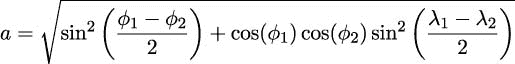
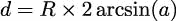
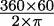
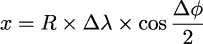
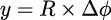
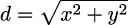
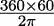
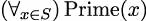
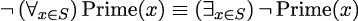
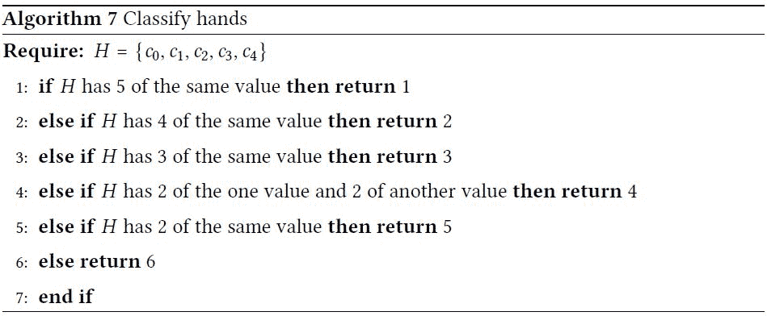

## 第四章：4

与集合一起工作

Python 提供了一些处理整个集合的函数。它们可以应用于序列（列表或元组）、集合、映射以及生成器表达式的可迭代结果。我们将从函数式编程的角度探讨 Python 的集合处理功能。

我们将首先查看可迭代对象和一些与可迭代对象一起工作的简单函数。我们将探讨一些设计模式来处理可迭代对象和序列，包括递归函数以及显式的`for`语句。我们还将探讨如何使用生成器表达式将标量函数应用于数据集合。

在本章中，我们将展示如何使用以下函数与集合一起使用：

+   `any()`和`all()`

+   `len()`、`sum()`以及与这些函数相关的一些高级统计处理

+   使用`zip()`和相关技术来结构化和展平数据列表

+   使用`sorted()`和`reversed()`对集合施加排序

+   `enumerate()`

前四个函数可以被称作归约函数：它们将一个集合归约为一个单一值。其他三个函数，`zip()`、`reversed()`和`enumerate()`，是映射函数；它们从现有的集合中产生新的集合。在下一章中，我们将探讨一些使用额外函数作为参数来自定义处理的更多映射和归约函数。

在本章中，我们将首先探讨使用生成器表达式处理数据的方法。然后，我们将应用不同类型的集合级函数来展示它们如何简化迭代处理的语法。我们还将探讨一些不同的数据重构方式。

在下一章中，我们将专注于使用高阶集合函数来完成类似类型的处理。

### 4.1 函数种类概述

我们需要区分两种广泛的功能种类，如下所示：

+   标量函数：这些应用于单个值并计算一个单独的结果。例如`abs()`、`pow()`以及整个`math`模块都是标量函数的例子。

+   集合函数：这些与可迭代集合一起工作。

我们可以将这些集合函数进一步细分为三种亚种：

+   归约：这使用一个函数将集合中的值折叠在一起，结果是一个单一最终值。例如，如果我们把加法操作折叠到一系列整数中，这将计算总和。这也可以被称为聚合函数，因为它为输入集合产生一个单一的聚合值。像`sum()`和`len()`这样的函数是归约集合到单一值的例子。

+   映射：这将对集合中的每个单独项目应用一个标量函数；结果是同样大小的集合。内置的`map()`函数就是这样做的；像`enumerate()`这样的函数可以被看作是从项目到值对的映射。

+   过滤器：这将对集合中的所有项目应用标量函数以拒绝某些项目并传递其他项目。结果是输入的子集。内置的`filter()`函数就是这样做的。

一些函数，例如`sorted()`和`reversed()`，并不能简单地、整洁地适应这个框架。因为这两个“重新排序”函数并不是从现有值计算出新值，所以将它们放在一边似乎是有道理的。

我们将使用这个概念框架来描述我们使用内置集合函数的方式。

### 4.2 与可迭代对象一起工作

如前几章所述，Python 的`for`语句与可迭代对象一起工作，包括 Python 丰富的集合类型。当处理如元组、列表、映射和集合等具体化的集合时，`for`语句涉及显式地管理状态。

虽然这偏离了纯函数式编程，但它反映了 Python 必要的优化。状态管理被局部化到一个迭代器对象，该对象是作为`for`语句评估的一部分创建的；我们可以利用这个特性，而不会偏离纯函数式编程太远。例如，如果我们使用`for`语句的变量在语句缩进体之外，我们就通过利用这个状态控制变量偏离了纯函数式编程。

我们将在第六章，递归和归约中回到这个话题。这是一个重要的话题，我们将在本节中通过一个处理生成器的快速示例来略过表面。

使用`for`语句进行可迭代处理的一个常见应用是`unwrap(process(wrap(iterable)))`设计模式。一个`wrap()`函数首先将可迭代中的每个项目转换为一个包含派生排序键和原始项目的二元组。然后我们可以将这些二元组项目作为一个单一、包装的值进行处理。最后，我们将使用一个`unwrap()`函数来丢弃用于包装的值，从而恢复原始项目。

在函数式编程的上下文中，这种情况经常发生，以至于有两个函数被大量用于此；它们如下：

```py
from collections.abc import Callable, Sequence 
from typing import Any, TypeAlias 

Extractor: TypeAlias = Callable[[Sequence[Any]], Any] 

fst: Extractor = lambda x: x[0] 
snd: Extractor = lambda x: x[1]
```

这两个函数从二元组中选取第一个和第二个值，并且它们在`process()`和`unwrap()`处理阶段都很有用。

另一个常见的模式是`wrap3(wrap2(wrap1()))`。在这种情况下，我们从一个简单的元组开始，然后通过添加额外的结果来包装它们，从而构建更大、更复杂的元组。我们在第二章，介绍基本函数式概念，不可变数据部分中看到了一个例子。这个主题的一个常见变体是从源对象构建新的、更复杂的命名元组实例。我们可能称之为累积设计模式——一个累积派生值的项。

例如，考虑使用累积模式来处理一系列纬度和经度值。第一步将路径上表示为`(lat, lon)`对的简单点转换为`(begin, end)`对的序列。结果中的每一对将表示为`((lat, lon), (lat, lon))`。`fst(item)`的值是起始位置；`snd(item)`的值是每个集合中每个项目的结束位置。我们将通过一系列示例来展示这种设计。

在接下来的章节中，我们将向您展示如何创建一个生成器函数，该函数将遍历源文件的内容。这个可迭代对象将包含我们将要处理的原始输入数据。一旦我们有了原始数据，后面的章节将展示如何在每个腿上装饰水平圆周距离。`wrap(wrap(iterable()))`设计的最终结果将是一个包含三个元组的序列：`((lat, lon), (lat, lon), distance)`。然后我们可以分析结果，以找到最长和最短距离、边界矩形和其他摘要。

水平圆周公式相对较长，但可以计算两个点在球面上之间的距离：





第一部分，a，是两点之间的角度。距离 d 是通过角度计算的，使用球体的半径 R，以所需的单位。对于海里距离，我们可以使用 R =  ≈ 3437.7。对于千米距离，我们可以使用 R = 6371。

#### 4.2.1 解析 XML 文件

我们首先通过解析可扩展标记语言（XML）文件来获取原始的纬度和经度对。这将展示我们如何封装 Python 的一些不太实用的功能来创建一个可迭代的值序列。

我们将使用`xml.etree`模块。在解析后，生成的`ElementTree`对象有一个`iterfind()`方法，它将遍历可用的值。

我们将寻找如下 XML 示例的结构：

```py
<Placemark><Point> 
<coordinates>-76.33029518659048, 37.54901619777347,0</coordinates> 
</Point></Placemark>
```

文件将包含多个`<Placemark>`标签，每个标签内部都有一个点和坐标结构。坐标标签的值是东西经度、南北纬度和平均海平面以上的高度。这意味着有两个解析级别：XML 级别和每个坐标的详细信息。这是典型的包含地理信息的 Keyhole Markup Language (KML)文件。（更多信息请参阅[`developers.google.com/kml/documentation`](https://developers.google.com/kml/documentation)。）

从 XML 文件中提取数据可以在两个抽象级别上进行：

+   在较低级别，我们需要在 XML 文件中定位各种标签、属性值和内容。

+   在较高级别，我们希望从文本和属性值中创建有用的对象。

可以以下方式处理更底层的处理：

```py
from collections.abc import Iterable 
from typing import TextIO 
import xml.etree.ElementTree as XML 

def row_iter_kml(file_obj: TextIO) -> Iterable[list[str]]: 
    ns_map = { 
        "ns0": "http://www.opengis.net/kml/2.2", 
        "ns1": "http://www.google.com/kml/ext/2.2" 
    } 
    path_to_points = ( 
      "./ns0:Document/ns0:Folder/ns0:Placemark/" 
      "ns0:Point/ns0:coordinates" 
    ) 
    doc = XML.parse(file_obj) 
    text_blocks = ( 
        coordinates.text 
        for coordinates in doc.iterfind(path_to_points, ns_map) 
    ) 
    return ( 
        comma_split(text) 
        for text in text_blocks 
        if text is not None 
    )
```

这个函数需要文本；通常这将从通过`with`语句打开的文件中获取。这个函数的结果是一个生成器，它从纬度/经度对创建列表对象。作为 XML 处理的一部分，这个函数使用一个简单的静态`dict`对象`ns_map`，它提供了正在解析的 XML 标签的命名空间映射信息。这个字典将由`ElementTree.iterfind()`方法使用，以在 XML 源文档中仅定位`<coordinates>`标签。

解析的本质是一个生成器函数，它使用`doc.iterfind()`找到的标签序列。然后，这个标签序列通过`comma_split()`函数被处理，将文本值分解成逗号分隔的各个部分。

`path_to_points`对象是一个字符串，它定义了如何通过 XML 结构进行导航。它描述了文档中`<coordinates>`标签相对于其他标签的位置。使用这个路径意味着生成器表达式将避免其他无关标签的值。

`if text is not None`子句反映了元素树标签的`text`属性的定义。如果没有标签体，文本值将是`None`。虽然看到空的`<coordinates/>`标签的可能性极低，但类型提示要求我们处理这种情况。

`comma_split()`函数比字符串的`split()`方法有更函数式的语法。这个函数定义如下：

```py
def comma_split(text: str) -> list[str]: 
    return text.split(",")
```

我们使用了一个包装器来强调稍微更统一的语法。我们还添加了显式的类型提示，以明确指出字符串被转换为`str`值的列表。没有类型提示，`split()`方法可能有两种潜在的用法。实际上，这种方法适用于`bytes`和`str`。我们使用了`str`类型名来缩小类型域。

`row_iter_kml()`函数的结果是一个可迭代的行数据序列。每一行将是一个包含三个字符串的列表：路径上某个航点的纬度、经度和高度。这目前还没有直接用处。我们还需要进行一些额外的处理，以获取纬度和经度，并将这两个字符串转换为有用的浮点值。

可迭代的元组（或列表）序列的想法允许我们以简单统一的方式处理某些类型的数据文件。在第三章，函数、迭代器和生成器中，我们探讨了如何轻松地将逗号分隔值（CSV）文件作为元组的行处理。在第六章，递归和归约中，我们将重新审视解析思想，以比较这些不同的示例。

`row_iter_kml()`函数的输出可以通过`list()`函数收集。以下交互式示例将读取文件并提取详细信息。`list()`函数将创建一个列表，每个`<coordinate>`标签对应一个列表。累积的结果对象如下所示：

```py
>>> from pprint import pprint 
>>> source_url = "file:./Winter%202012-2013.kml" 
>>> with urllib.request.urlopen(source_url) as source: 
...     v1 = list(row_iter_kml(source)) 
>>> pprint(v1) 
[[’-76.33029518659048’, ’37.54901619777347’, ’0’], 
 [’-76.27383399999999’, ’37.840832’, ’0’], 
 [’-76.459503’, ’38.331501’, ’0’], 
 ... 
 [’-76.47350299999999’, ’38.976334’, ’0’]]
```

这些都是字符串值。为了更有用，对函数的输出应用一些额外的函数来创建数据的一个可用子集非常重要。

#### 4.2.2 在更高层次解析文件

在将低级语法解析为将 XML 转换为 Python 之后，我们可以将原始数据重新结构化为我们 Python 程序中可用的形式。这种结构化适用于 XML、JavaScript 对象表示法（JSON）、CSV、YAML、TOML 以及数据序列化的各种物理格式。

我们的目标是编写一组小的生成器函数，将解析后的数据转换成我们应用程序可以使用的形式。生成器函数包括对由`row_iter_kml()`函数找到的文本进行的一些简单转换，具体如下：

+   丢弃海拔，也可以说成只保留纬度和经度

+   将顺序从`(longitude, latitude)`改为`(latitude, longitude)`

我们可以通过定义一个实用函数来使这两个转换具有更多的语法一致性，如下所示：

```py
def pick_lat_lon( 
        lon: str, lat: str, alt: str 
) -> tuple[str, str]: 
    return lat, lon
```

我们创建了一个函数，接受三个参数值并从其中两个创建一个元组。类型提示比函数本身更复杂。将源数据转换为可用数据通常涉及选择字段子集以及从字符串到数字的转换。我们分离了这两个问题，因为这些方面通常独立发展。

我们可以使用此函数如下：

```py
from collections.abc import Iterable 
from typing import TypeAlias 

Rows: TypeAlias = Iterable[list[str]] 
LL_Text: TypeAlias = tuple[str, str] 

def lat_lon_kml(row_iter: Rows) -> Iterable[LL_Text]: 
    return (pick_lat_lon(*row) for row in row_iter)
```

此函数将`pick_lat_lon()`函数应用于源迭代器中的每一行。我们使用了`*row`来将行的三个元组中的每个元素分配给`pick_lat_lon()`函数的单独参数。然后，该函数可以提取并重新排序每个三个元组中的两个相关值。

为了简化函数定义，我们定义了两个类型别名：`Rows`和`LL_Text`。这些类型别名可以简化函数定义。它们也可以被重用来确保几个相关函数都在使用相同类型的对象。这种功能设计允许我们自由地替换任何函数及其等效函数，这使得重构风险降低。

这些函数可以组合起来解析文件并构建我们可以使用的结构。以下是一些可用于此目的的代码示例：

```py
>>> import urllib 
>>> source_url = "file:./Winter%202012-2013.kml" 
>>> with urllib.request.urlopen(source_url) as source: 
...     v1 = tuple(lat_lon_kml(row_iter_kml(source))) 
>>> v1[0] 
(’37.54901619777347’, ’-76.33029518659048’) 
>>> v1[-1] 
(’38.976334’, ’-76.47350299999999’)
```

此脚本使用`request.urlopen()`函数打开一个源。在这种情况下，它是一个本地文件。然而，我们也可以在远程服务器上打开一个 KML 文件。我们使用这种文件打开方式的目标是确保无论数据源是什么，我们的处理都是统一的。

脚本围绕两个低级解析 KML 源的功能构建。`row_iter_kml(source)`表达式生成一系列文本列。`lat_lon_kml()`函数将提取并重新排序纬度和经度值。这创建了一个中间结果，为后续处理奠定了基础。后续处理可以设计为独立于原始格式。

最终函数使用几乎完全函数化的方法从复杂的 XML 文件中提供纬度和经度值。由于结果是可迭代的，我们可以继续使用函数式编程技术来处理我们从文件中检索到的每个点。

纯粹主义者有时会争论说，使用`for`语句引入了一个非函数性元素。为了保持纯粹，迭代应该通过递归定义。由于递归并不是 Python 语言特性的良好使用，我们宁愿牺牲一些纯粹性，以更 Python 化的方法为代价。

此设计明确地将低级 XML 解析与高级数据重组分开。XML 解析生成了一个通用的字符串结构元组。这与其他文件格式的解析器兼容。例如，结果值与 CSV 解析器的输出兼容。当与 SQL 数据库一起工作时，使用类似的元组结构迭代器可能会有所帮助。这允许设计一个可以处理来自各种数据源的高级处理方案。

我们将向您展示一系列转换，以重新排列这些数据，从字符串集合到路线上的航点集合。这将涉及许多转换。我们需要重构数据，以及将字符串转换为浮点值。我们还将探讨几种简化并澄清后续处理步骤的方法。我们将在后续章节中使用这个数据集，因为它相当复杂。

#### 4.2.3 从序列中配对项目

常见的重构需求是将序列中的点转换为起始-结束对。给定一个序列，S = {s[0],s[1],s[2],...,s[n]}，我们还想创建一个配对序列，S = {(s[0],s[1]),(s[1],s[2]),(s[2],s[3]),...,(s[n−1],s[n])}。第一和第二项形成一个对。第二和第三项形成下一个对。请注意，这些对是重叠的；每个点（除了第一个或最后一个）将是其中一个对的结束和下一个对的开始。

这些重叠的对用于通过应用哈夫曼函数来计算点与点之间的距离。这种技术也用于将点的路径转换为图形应用程序中的一系列线段。

为什么需要配对项目？为什么不在这个函数中插入几行额外的代码：

```py
begin = next(iterable) 
for end in iterable: 
    compute_something(begin, end) 
    begin = end
```

这个代码片段将处理数据中的每一段作为`begin, end`配对。然而，处理函数和重构数据的`for`语句紧密绑定，使得复用比必要的更复杂。当它是更复杂`compute_something()`函数的一部分时，配对算法很难单独测试。

创建一个组合函数也限制了我们的应用重构能力。没有简单的方法可以注入`compute_something()`函数的替代实现。此外，我们还有一个显式状态的部分，即`begin`变量，这可能会使生活变得复杂。如果我们尝试向`for`语句的主体添加功能，我们很容易在`iterable`源中的项被过滤出处理时未能正确设置`begin`变量。

通过将这个配对函数与其他处理分离，我们实现了更好的复用。从长远来看，简化是我们的目标之一。如果我们构建了一个包含此类配对函数在内的有用原语库，我们就可以更快、更有信心地解决更大的问题。

事实上，`itertools` 库（第八章，Itertools 模块的主题）中包含了一个`pairwise()`函数，我们也可以使用这个函数来从源迭代器中执行这种值的配对。虽然我们可以使用这个函数，但我们也会探讨如何设计我们自己的。

有许多方法可以将路线上的点配对，为每一段创建起始和终止信息。我们在这里将探讨几种方法，然后在第五章，高阶函数和再次在第八章，Itertools 模块中回顾这个问题。创建配对可以通过递归的纯函数方式完成：

![ ( |{ [] if |l| ≤ 1 pairs(l) = |( [(l0,l1)]+ pairs(l[1:]) if |l| > 1 ](img/file37.jpg)

虽然数学形式似乎很简单，但它没有考虑到项 l[1]既是第一个配对的一部分，也是 l[[1:]]中剩余项的头部。

函数理想是避免将此值分配给变量。变量——以及由此产生的有状态代码——当我们试图进行“小”更改并误用变量的值时，可能会变成一个问题。

另一个选择是 somehow “窥视”可迭代数据源中的下一个项。这在 Python 中效果不佳。一旦我们使用`next()`来检查值，它就不能再放回迭代器中。这使得创建重叠配对的递归、函数版本变得过于复杂，以至于没有实际价值。

我们执行尾调用优化的策略是将数学形式中的递归替换为`for`语句。在某些情况下，我们可以进一步将其优化为生成器表达式。因为它使用显式变量跟踪计算状态，所以它更适合 Python，同时它的函数式程度较低。

以下代码是一个优化版本的函数，用于将沿路线的点配对：

```py
from collections.abc import Iterator, Iterable 
from typing import Any, TypeVar 

LL_Type = TypeVar(’LL_Type’) 

def legs(lat_lon_iter: Iterator[LL_Type]) -> Iterator[tuple[LL_Type, LL_Type]]: 
    begin = next(lat_lon_iter) 
    for end in lat_lon_iter: 
        yield begin, end 
        begin = end
```

这个版本更简单，相当快，并且不受递归定义的栈限制。它不依赖于任何特定的序列类型，因为它将配对序列生成器发出的任何内容。由于循环中没有处理函数，我们可以根据需要重复使用`legs()`函数。我们还可以稍微重新设计这个函数，使其接受一个处理函数作为参数值，并将给定的函数应用于创建的每个`(begin, end)`对。

类型变量`LL_Type`用于明确说明`legs()`函数如何重构数据。提示说明输入类型在输出时被保留。输入类型是某种任意类型的`Iterator`，即`LL_Type`；输出将包括相同类型的元组，即`LL_Type`。该函数没有隐含其他转换。

`begin`和`end`变量维护计算状态。使用有状态的变量不符合使用不可变对象进行函数式编程的理想。然而，这种优化在 Python 中很重要。它对函数的用户来说是不可见的，使其成为一种 Pythonic-functional 混合体。

注意，此函数需要一个可迭代的单个值来源。这可以是一个可迭代的集合或一个生成器。

我们可以将这个函数视为产生以下类型的对序列：

```py
[items[0:2], items[1:3], items[2:4], ..., items[-2:]]
```

使用内置的`zip()`函数查看这个函数的另一种方式如下：

```py
list(zip(items, items[1:]))
```

虽然这个基于`zip()`的示例很有信息量，但它仅适用于序列对象。前面展示的`pairs()`函数适用于任何可迭代对象，包括序列对象。`legs()`函数仅适用于`Iterator`对象作为数据源。好消息是，我们可以使用内置的`iter()`函数将可迭代集合转换为迭代器对象。

#### 4.2.4 显式使用 iter()函数

从纯粹的功能角度来看，我们所有的可迭代对象都可以通过递归函数进行处理，其中状态由递归调用堆栈管理。在实践中，在 Python 中处理可迭代对象通常涉及`for`语句的评估。有两种常见的情况：集合对象和可迭代对象。当与集合对象一起工作时，`for`语句创建一个`Iterator`对象。当与生成器函数一起工作时，生成器函数是一个迭代器，并保持其自己的内部状态。通常，从 Python 编程的角度来看，它们是等效的。在罕见的情况下——通常是我们必须显式使用`next()`函数的情况——这两个不会完全等效。

之前显示的`legs()`函数有一个显式的`next()`评估，用于从可迭代对象中获取第一个值。这对于生成器函数、表达式和其他可迭代对象工作得非常好。它不适用于序列对象，如元组或列表。

以下代码包含三个示例，用于阐明`next()`和`iter()`函数的使用：

```py
# Iterator as input: 
>>> list(legs(x for x in range(3))) 
[(0, 1), (1, 2)] 

# List object as input: 
>>> list(legs([0, 1, 2])) 
Traceback (most recent call last): 
... 
TypeError: ’list’ object is not an iterator 

# Explicit iterator created from list object: 
>>> list(legs(iter([0,1,2]))) 
[(0, 1), (1, 2)]
```

在第一种情况下，我们将`legs()`函数应用于一个可迭代对象。在这种情况下，可迭代对象是一个生成器表达式。这是基于本章前面示例中我们期望的行为。项目被正确配对，从三个航点中创建出两条腿。

在第二种情况下，我们尝试将`legs()`函数应用于一个序列。这导致了一个错误。虽然列表对象和可迭代对象在`for`语句中使用时是等价的，但它们并不在所有地方都等价。序列不是一个迭代器；序列没有实现允许它被`next()`函数使用的`__next__()`特殊方法。然而，`for`语句通过自动从序列创建迭代器来优雅地处理这种情况。

要使第二种情况工作，我们需要从列表对象中显式创建一个迭代器。这允许`legs()`函数从列表项的迭代器中获取第一个项。`iter()`函数将从列表创建一个迭代器。

#### 4.2.5 扩展迭代

我们可以将两种类型的扩展因素化到一个`for`语句中，该语句处理可迭代数据。我们首先将查看一个过滤器扩展。在这种情况下，我们可能会拒绝进一步考虑的值。它们可能是数据异常值，或者可能是格式不正确的源数据。然后，我们将查看通过执行简单转换来创建新对象，从而将源数据映射到源数据。在我们的情况下，我们将把字符串转换为浮点数。然而，将映射扩展到简单`for`语句的想法适用于许多情况。我们将查看重构上述`legs()`函数。如果我们需要调整点序列以丢弃一个值怎么办？这将引入一个过滤器扩展，拒绝一些数据值。

我们正在设计的迭代过程返回成对的数据，而不执行任何额外的应用相关处理——复杂性最小。简单意味着我们不太可能混淆处理状态。

向此设计添加一个过滤器扩展可能看起来像以下代码片段：

```py
from collections.abc import Iterator, Iterable, Callable 
from typing import TypeAlias 

Waypoint: TypeAlias = tuple[float, float] 
Pairs_Iter: TypeAlias = Iterator[Waypoint] 
Leg: TypeAlias = tuple[Waypoint, Waypoint] 
Leg_Iter: TypeAlias = Iterable[Leg] 

def legs_filter( 
        lat_lon_iter: Pairs_Iter, 
        rejection_rule: Callable[[Waypoint, Waypoint], bool]) -> Leg_Iter: 
    begin = next(lat_lon_iter) 
    for end in lat_lon_iter: 
        if rejection_rule(begin, end): 
            pass 
        else: 
            yield begin, end 
        begin = end
```

我们已经插入了一个处理规则来拒绝某些值。由于 `for` 语句保持简洁和表达性强，我们相信处理将会被正确执行。另一方面，我们用一个相对简单的函数和两个单独的特征集合搞乱了代码。这种混乱并不是功能设计的理想方法。

我们并没有提供很多关于 `rejection_rule()` 函数的信息。这需要是一种适用于 `Leg` 元组的条件，以拒绝进一步考虑的点。例如，它可能会拒绝 `begin == end` 以避免零长度的腿。`rejection_rule` 的一个方便的默认值是 `lambda s, e: False`。这将保留所有的腿。

下一个重构将引入额外的映射到迭代中。在设计演变时添加映射是常见的。在我们的例子中，我们有一系列字符串值。我们需要将这些转换为浮点值以供以后使用。

以下是通过一个包装生成器函数的生成器表达式来处理这种数据映射的一种方法：

```py
>>> import urllib 
>>> source_url = "file:./Winter%202012-2013.kml" 
>>> with urllib.request.urlopen(source_url) as source: 
...     trip = list( 
...         legs( 
...            (float(lat), float(lon)) 
...            for lat, lon in lat_lon_kml(row_iter_kml(source)) 
...         ) 
...     )
```

我们已经将 `legs()` 函数应用于一个生成器表达式，该表达式从 `lat_lon_kml()` 函数的输出中创建浮点值。我们也可以按从内到外的顺序读取。`lat_lon_kml()` 函数的输出被转换成一对浮点值，然后转换成一系列腿。

这开始变得复杂了。这里有很多嵌套的函数。我们正在将 `float()`、`legs()` 和 `list()` 应用于一个数据生成器。重构复杂表达式的常见方法是将生成器表达式与任何具体化的集合分离。我们可以这样做来简化表达式：

```py
>>> import urllib 
>>> source_url = "file:./Winter%202012-2013.kml" 
>>> with urllib.request.urlopen(source_url) as source: 
...     ll_iter = ( 
...         (float(lat), float(lon)) 
...         for lat, lon in lat_lon_kml(row_iter_kml(source)) 
...     ) 
...     trip = list( 
...         legs(ll_iter) 
...     )
```

我们已经将生成器函数分配给一个名为 `ll_iter` 的变量。这个变量不是一个集合对象；它是一个包含项两元组的生成器。我们没有使用列表推导来创建一个对象。我们只是将生成器表达式分配给一个变量名。然后我们在后续表达式中使用了 `ll_iter` 变量。

`list()` 函数的评估实际上导致了一个正确的对象被构建，这样我们就可以打印输出。`ll_iter` 变量的项仅按需创建。

我们还可能想要进行另一种重构。一般来说，数据源是我们经常想要更改的东西。在我们的例子中，`lat_lon_kml()` 函数与其他表达式的绑定非常紧密。当我们有不同数据源时，这使重用变得困难。

在`float()`操作是我们希望参数化以便可以重用的情况下，我们可以在生成器表达式周围定义一个函数。我们将一些处理提取到一个单独的函数中，仅仅是为了分组操作。在我们的情况下，字符串对到浮点对的转换是特定源数据独有的。我们可以将复杂的从字符串到浮点数的表达式重写为一个更简单的函数，例如：

```py
from collections.abc import Iterator, Iterable 
from typing import TypeAlias 

Text_Iter: TypeAlias = Iterable[tuple[str, str]] 
LL_Iter: TypeAlias = Iterable[tuple[float, float]] 

def floats_from_pair(lat_lon_iter: Text_Iter) -> LL_Iter: 
    return ( 
        (float(lat), float(lon)) 
        for lat, lon in lat_lon_iter 
    )
```

`floats_from_pair()`函数将`float()`函数应用于可迭代中每个项目的第一个和第二个值，从而从输入值创建一个包含两个浮点数的元组。我们依赖于 Python 的`for`语句来分解这个元组。

类型提示详细说明了从`tuple[str, str]`项的可迭代序列到`tuple[float, float]`项的转换。然后，`LL_Iter`类型别名可以在复杂函数定义的其它地方使用，以展示浮点对是如何处理的。

我们可以在以下上下文中使用此函数：

```py
>>> import urllib 
>>> source_url = "file:./Winter%202012-2013.kml" 
>>> with urllib.request.urlopen(source_url) as source: 
...     trip = list( 
...         legs( 
...             floats_from_pair( 
...                 lat_lon_kml( 
...                     row_iter_kml(source)))) 
...     )
```

我们将创建由来自 KML 文件的浮点值构建的腿。可视化处理过程相当容易，因为过程中的每个阶段都是一个前缀函数。每个函数的输入是嵌套处理步骤中下一个函数的输出。这似乎是表达处理管道的自然方式。

在解析时，我们经常有字符串值的序列。对于数值应用，我们需要将字符串转换为浮点数、整数或`Decimal`值。这通常涉及到将`floats_from_pair()`函数等函数插入到清理源数据的表达式序列中。

我们之前的输出都是字符串；它看起来像以下代码片段：

```py
((’37.54901619777347’, ’-76.33029518659048’), 
 (’37.840832’, ’-76.27383399999999’), 
 ... 
 (’38.976334’, ’-76.47350299999999’))
```

我们希望得到如下代码片段所示的数据，其中包含浮点数：

```py
(((37.54901619777347, -76.33029518659048), 
(37.840832, -76.273834)), ((37.840832, -76.273834), 
... 
((38.330166, -76.458504), (38.976334, -76.473503)))
```

在构建了这个处理管道之后，有一些简化可用。我们将在第五章和高阶函数中查看一些重构。我们将在第六章和递归与归约中重新审视这个问题，看看如何将这些简化应用到文件解析问题中。

#### 4.2.6 将生成器表达式应用于标量函数

我们将探讨一种更复杂的生成器表达式，用于将一种数据类型的值映射到另一种数据类型。在这种情况下，我们将对一个由生成器创建的单独数据值应用一个相当复杂的函数。

我们将这些非生成器函数称为标量，因为它们与简单的原子值一起工作。要处理数据集合，标量函数将嵌入到生成器表达式中。

为了继续之前开始的例子，我们将提供一个 haversine 函数来计算纬度和经度值之间的距离。技术上，这些是角度，并且需要一些球面三角学来将角度转换为球面上的距离。我们可以使用生成器表达式将标量 `haversine()` 函数应用于从我们的 KML 文件中提取的一对序列。

`haversine()` 函数的重要部分是计算两个点之间的距离，遵循地球的正确球面几何。这可能涉及一些看起来很复杂的数学，但我们在这里提供了整个定义。我们还在 使用可迭代对象 部分的开头提到了这个函数。

`haversine()` 函数通过以下代码实现：

```py
from math import radians, sin, cos, sqrt, asin 
from typing import TypeAlias 

MI = 3959 
NM = 3440 
KM = 6371 

Point: TypeAlias = tuple[float, float] 

def haversine(p1: Point, p2: Point, R: float=NM) -> float: 
    lat_1, lon_1 = p1 
    lat_2, lon_2 = p2 
    Δ_lat = radians(lat_2 - lat_1) 
    Δ_lon = radians(lon_2 - lon_1) 
    lat_1 = radians(lat_1) 
    lat_2 = radians(lat_2) 

    a = sqrt( 
        sin(Δ_lat / 2) ** 2 + 
        cos(lat_1) * cos(lat_2) * sin(Δ_lon / 2) ** 2 
    ) 
    c = 2 * asin(a) 
    return R * c
```

起点和终点 `p1` 和 `p2` 有类型提示以显示其结构。返回值也提供了提示。显式使用 `Point` 的类型别名使得 mypy 工具能够确认此函数被正确使用。

对于沿海水手覆盖的短距离，等距圆柱距离计算更有用：







其中 R 是地球的平均半径，R =  海里。ϕ 值是南北纬度，λ 值是东西经度。这意味着 (ϕ[0],λ[0]) 和 (ϕ[1],λ[1]) 是我们正在导航的两个点。

更多信息请参阅 [`edwilliams.org/avform147.htm`](https://edwilliams.org/avform147.htm)。

以下代码展示了我们如何使用我们的函数集合来检查一些 KML 数据并生成一系列距离：

```py
>>> import urllib 
>>> source_url = "file:./Winter%202012-2013.kml" 
>>> with urllib.request.urlopen(source_url) as source: 
...     trip = ( 
...         (start, end, round(haversine(start, end), 4)) 
...         for start,end in 
...             legs( 
...                 floats_from_pair( 
...                     lat_lon_kml(row_iter_kml(source)) 
...                 ) 
...             ) 
...     ) 
...     for start, end, dist in trip: 
...         print(f"({start} to {end} is {dist:.1f}")
```

处理的本质是将生成器表达式分配给 `trip` 变量。我们已经组装了包含起点、终点和从起点到终点的距离的三元组。起点和终点对来自 `legs()` 函数。`legs()` 函数与从 KML 文件中提取的纬度-经度对构建的浮点数据一起工作。

输出看起来像以下命令片段：

```py
((37.54901619777347, -76.33029518659048) to (37.840832, -76.273834) is 17.7 
((37.840832, -76.273834) to (38.331501, -76.459503) is 30.7 
((38.331501, -76.459503) to (38.845501, -76.537331) is 31.1 
((38.845501, -76.537331) to (38.992832, -76.451332) is 9.7 
...
```

每个处理步骤都已被简洁地定义。概览同样可以简洁地表达为函数和生成器表达式的组合。

显然，我们可能希望对这个数据应用几个进一步的加工步骤。首先，当然是要使用字符串的 `format()` 方法来生成更美观的输出。

更重要的是，我们希望从这个数据中提取一些聚合值。我们将这些值称为可用数据的缩减。我们希望将数据缩减到获取最大和最小纬度，例如，以显示这条路线的极端南北端。我们还想将数据缩减到获取单段的最大距离以及所有段的总距离。

我们在使用 Python 时会遇到的问题是，`trip` 变量的输出生成器只能使用一次。我们无法轻松地对这些详细数据进行多次缩减。虽然我们可以使用 `itertools.tee()` 函数多次处理可迭代对象，但它需要相当多的内存。每次缩减都读取和解析 KML 文件也可能造成浪费。我们可以通过将中间结果物化为列表对象来提高我们的处理效率。

在下一节中，我们将探讨两种特定的缩减类型，它们从一组布尔值计算出一个单一的布尔结果。

### 4.3 使用 any() 和 all() 作为缩减

`any()` 和 `all()` 函数提供了布尔缩减功能。这两个函数将一组值缩减为一个单一的 `True` 或 `False`。`all()` 函数确保所有项都具有真值；`any()` 函数确保至少有一个项具有真值。在这两种情况下，这些函数依赖于 Python 的概念“truish”，或“truthy”：这些值在内置的 `bool()` 函数返回 `true`。一般来说，“falsish”值包括 `False` 和 `None`，以及零、空字符串和空集合。非假值即为真值。

这些函数与用于表达数学逻辑的全称量词和存在量词密切相关。例如，我们可能想要断言给定集合中的所有元素都具有某个属性。这种形式之一可能如下所示：



我们可以这样读它：对于 S 中的所有 x，Prime(x) 函数为真。我们在逻辑表达式前使用了全称量词“对于所有”，即 ∀。

在 Python 中，我们稍微调整了项的顺序，将逻辑表达式转录如下：

```py
all(isprime(x) for x in someset)
```

`all()` 函数将评估 `isprime(x)` 函数对每个不同的 `x` 值，并将值集合缩减为一个单一的 `True` 或 `False`。

`any()` 函数与存在量词相关。如果我们想要断言集合中没有值是素数，我们可以使用以下两个等价表达式之一：



左边表述的是 S 中所有元素都不是素数的情况。右边断言 S 中存在一个不是素数的元素。这两个是等价的；也就是说，如果所有元素都不是素数，那么必须有一个元素是非素数。

这个等价规则被称为德摩根定律。它可以一般地表述为 ∀xP(x) ≡ ¬∃x¬P(x)。如果某个命题 P(x) 对所有 x 都为真，那么不存在 x 使得 P(x) 为假。

在 Python 中，我们可以交换项的顺序，并将这些转换为以下两种形式中的任意一种有效代码：

```py
not_p_1 = not all(isprime(x) for x in someset)
```

```py
not_p_2 = any(not isprime(x) for x in someset)
```

由于这两行是等价的，选择其中一行而舍弃另一行的两个常见原因：性能和清晰度。性能几乎相同，所以归结为清晰度。哪个表述的条件最为清晰？

`all()` 函数可以被描述为一系列值的“与”归约。结果是类似于在给定的值序列之间折叠 `and` 操作符。类似地，`any()` 函数可以被描述为“或”归约。当我们查看第十章 The Functools Module 中的 `reduce()` 函数时，我们会回到这种通用归约。这里没有最佳答案；这是一个关于什么对目标读者来说最易读的问题。

我们还需要考虑这些函数的退化情况。如果序列没有元素，`all(())` 或 `all([])` 的值是什么？

考虑一个列表 `[1, 2, 3]`。表达式 `[] + [1, 2, 3] == [1, 2, 3]` 是正确的，因为空列表是列表连接的恒等值。这也适用于 `sum(())` 函数：`sum([]) + sum([1, 2, 3]) == sum([1, 2, 3])`。空列表的总和必须是加法的恒等值，即零。

`and` 的恒等值是 `True`。这是因为 `True` `and` `whatever` `==` `whatever`。同样，`or` 的恒等值是 `False`。以下代码演示了 Python 遵循这些规则：

```py
>>> all(()) 
True 
>>> any(()) 
False
```

Python 给我们一些非常棒的工具来执行涉及逻辑的处理。我们有内置的 `and`、`or` 和 `not` 操作符。然而，我们还有这些集合导向的 `any()` 和 `all()` 函数。

### 4.4 使用 len() 和 sum() 对集合进行操作

`len()` 和 `sum()` 函数提供了两种简单的归约——序列中元素的计数和元素的总和。这两个函数在数学上是相似的，但它们的 Python 实现却相当不同。

从数学上观察，我们可以看到这种酷炫的并行性：

+   `len()` 函数返回集合中每个值的“1”的总和，X：∑ [x∈X]1 = ∑ [x∈X]x⁰。

+   `sum()` 函数返回集合中每个值的总和，X：∑ [x∈X]x = ∑ [x∈X]x¹。

`sum()` 函数适用于任何可迭代对象。`len()` 函数不适用于可迭代对象；它只适用于序列。这些函数在实现上的这种微小不对称性在统计算法的边缘有点尴尬。

如上所述，对于空序列，这两个函数都返回适当的加法恒等值零：

```py
>>> sum(()) 
0 
>>> len(()) 
0
```

虽然 `sum(())` 返回整数零，但在处理浮点值时这不是问题。当使用其他数值类型时，可以与可用数据类型的值一起使用整数零。Python 的数值类型通常有与其他数值类型进行操作的规则。

#### 4.4.1 使用总和和计数进行统计

在本节中，我们将实现一些对统计有用的函数。目的是展示函数式编程如何应用于统计函数中常见的处理类型。

几个常见的函数被描述为“集中趋势的度量”。像算术平均值或标准差这样的函数提供了一组值的总结。一种称为“归一化”的转换将值移动和缩放到总体平均值和标准差周围。我们还将探讨如何计算相关系数，以显示两组数据相互关联的程度。

读者可能想查看[`towardsdatascience.com/descriptive-statistics-f2beeaf7a8df`](https://towardsdatascience.com/descriptive-statistics-f2beeaf7a8df)，以获取更多关于描述性统计的信息。

算术平均值似乎基于`sum()`和`len()`有一个吸引人的简单定义。看起来以下可能可行：

```py
def mean(items): 
    return sum(items) / len(items)
```

这个看起来简单的函数对`Iterable`对象不起作用。这个定义只适用于支持`len()`函数的集合。当尝试编写正确的类型注解时，这一点很容易发现。`mean(items: Iterable[float]) -> float`的定义将不起作用，因为更通用的`Iterable[float]`类型不支持`len()`。

事实上，我们很难根据可迭代对象执行像标准差这样的计算。在 Python 中，我们必须要么实例化一个序列对象，要么求助于相对复杂的处理，这种处理在单次遍历数据时计算多个总和。要使用更简单的函数，意味着使用`list()`创建一个具体的序列，该序列可以被多次处理。

为了通过 mypy 的审查，定义需要看起来像这样：

```py
from collections.abc import Sequence 

def mean(items: Sequence[float]) -> float: 
    return sum(items)/len(items)
```

这包括适当的类型提示，以确保`sum()`和`len()`都能为预期的数据类型工作。mypy 工具了解算术类型匹配规则：任何可以被视为浮点数的值都将被视为有效。这意味着`mean([1, 2, 3])`将由于值都是整数而被 mypy 工具接受。

在以下定义中，我们有关于平均值和标准差的替代和优雅的表达式：

```py
import math 
from collections.abc import Sequence 

def stdev(data: Sequence[float]) -> float: 

    s0 = len(data)  # sum(1 for x in data) 
    s1 = sum(data)  # sum(x for x in data) 
    s2 = sum(x**2 for x in data) 

    mean = s1 / s0 
    stdev = math.sqrt(s2 / s0 - mean ** 2) 
    return stdev
```

这三个总和`s0`、`s1`和`s2`具有整洁的并行结构。我们可以轻松地从两个总和计算平均值。标准差稍微复杂一些，但它基于三个可用的总和。

这种令人愉悦的对称性也适用于更复杂的统计函数，例如相关性和最小二乘线性回归。

两个样本集之间的相关矩可以从它们的标准化值计算得出。以下是一个计算标准化值的函数：

```py
def z(x: float, m_x: float, s_x: float) -> float: 
    return (x - m_x) / s_x
```

这种计算从每个样本 x 中减去平均值μ[x]，然后除以标准差σ[x]。这给我们一个以 sigma，σ为单位的值。对于正态分布的数据，大约三分之二的时间会期望一个±1σ的值。更极端的值应该更不常见。一个在±3σ之外的价值应该发生不到百分之一的时间。

我们可以这样使用这个标量函数：

```py
>>> d = [2, 4, 4, 4, 5, 5, 7, 9] 
>>> list(z(x, mean(d), stdev(d)) for x in d) 
[-1.5, -0.5, -0.5, -0.5, 0.0, 0.0, 1.0, 2.0]
```

我们构建了一个列表，其中包含基于变量 `d` 中一些原始数据的归一化分数。我们使用生成器表达式将标量函数 `z()` 应用到序列对象上。

`mean()` 和 `stdev()` 函数基于之前展示的示例：

```py
from math import sqrt 
from collections.abc import Sequence 

def mean(samples: Sequence[float]) -> float: 
    return s1(samples)/s0(samples) 

def stdev(samples: Sequence[float]) -> float: 
    N = s0(samples) 
    return sqrt((s2(samples) / N) - (s1(samples) / N) ** 2)
```

同样，三个求和函数可以定义为以下代码所示：

```py
def s0(samples: Sequence[float]) -> float: 
    return sum(1 for x in samples)  # or len(data) 

def s1(samples: Sequence[float]) -> float: 
    return sum(x for x in samples)  # or sum(data) 

def s2(samples: Sequence[float]) -> float: 
    return sum(x*x for x in samples)
```

虽然这非常简洁且表达力强，但有一点令人沮丧，因为我们不能在这里使用可迭代对象。例如，在评估 `mean()` 函数时，需要可迭代对象的和以及计数。对于标准差，需要两个和以及可迭代对象的计数。对于这种类型的统计处理，我们必须实际化一个序列对象（换句话说，创建一个 `list`），这样我们才能多次检查数据。

以下代码展示了我们如何计算两组样本之间的相关性：

```py
def corr(samples1: Sequence[float], samples2: Sequence[float]) -> float: 
    m_1, s_1 = mean(samples1), stdev(samples1) 
    m_2, s_2 = mean(samples2), stdev(samples2) 
    z_1 = (z( x, m_1, s_1 ) for x in samples1) 
    z_2 = (z( x, m_2, s_2 ) for x in samples2) 
    r = ( 
        sum(zx1 * zx2 for zx1, zx2 in zip(z_1, z_2)) 
        / len(samples1) 
    ) 
    return r
```

这个相关性函数 `corr()` 收集两组样本的基本统计摘要：平均值和标准差。有了这些摘要，我们定义了两个生成器函数，它们将为每组样本创建归一化值。然后我们可以使用 `zip()` 函数（参见下一个示例）将两个归一化值序列中的项目配对，并计算这两个归一化值的乘积。归一化分数乘积的平均值就是相关性。

以下代码是收集两组样本之间相关性的示例：

```py
>>> xi = [1.47, 1.50, 1.52, 1.55, 1.57, 1.60, 1.63, 1.65, 
... 1.68, 1.70, 1.73, 1.75, 1.78, 1.80, 1.83,] 

>>> yi = [52.21,53.12,54.48,55.84,57.20,58.57,59.93,61.29, 
... 63.11, 64.47, 66.28, 68.10, 69.92, 72.19, 74.46,] 

>>> round(corr(xi, yi), 5) 
0.99458
```

我们展示了两个数据点的序列，`xi` 和 `yi`。相关系数超过 `0.99`，这表明这两个序列之间存在非常强的关系。

这展示了函数式编程的一个优势。我们使用六个定义单一表达式的函数创建了一个方便的统计模块。有趣的是，`corr()` 函数不能轻易地简化为一个单一的表达式。（它可以简化为一个非常长的单一表达式，但阅读起来会非常困难。）在这个函数实现中的每个内部变量只使用一次。这表明 `corr()` 函数具有函数式设计，尽管它被写成六行独立的 Python 代码。

### 4.5 使用 zip() 结构化和展平序列

`zip()` 函数将来自几个迭代器或序列的值交织在一起。它将从每个 n 个输入迭代器或序列中的值创建 n 个元组。我们在上一节中使用它来交织两组样本的数据点，创建成对的元组。

`zip()` 函数是一个生成器。它不会实际生成一个结果集合。

以下是一个展示 `zip()` 函数如何工作的代码示例：

```py
>>> xi = [1.47, 1.50, 1.52, 1.55, 1.57, 1.60, 1.63, 1.65, 
... 1.68, 1.70, 1.73, 1.75, 1.78, 1.80, 1.83,] 
>>> yi = [52.21, 53.12, 54.48, 55.84, 57.20, 58.57, 59.93, 61.29, 
... 63.11, 64.47, 66.28, 68.10, 69.92, 72.19, 74.46,] 

>>> zip(xi, yi) 
<zip object at ...> 

>>> pairs = list(zip(xi, yi)) 
>>> pairs[:3] 
[(1.47, 52.21), (1.5, 53.12), (1.52, 54.48)] 
>>> pairs[-3:] 
[(1.78, 69.92), (1.8, 72.19), (1.83, 74.46)]
```

`zip()` 函数有一些边缘情况。我们必须询问以下关于其行为的问题：

+   当没有任何参数时会发生什么？

+   当只有一个参数时会发生什么？

+   当序列长度不同时会发生什么？

与其他函数一样，例如 `any()`、`all()`、`len()` 和 `sum()`，当我们对空序列应用归约时，我们希望得到一个身份值作为结果。例如，`sum(())` 应该是零。这个概念告诉我们 `zip()` 的身份值应该是什么。

显然，这些边缘情况必须产生某种可迭代输出。以下是一些澄清行为的代码示例。首先，空参数列表：

```py
>>> list(zip()) 
[]
```

空列表的生产符合列表身份值 `[]` 的概念。接下来，我们将尝试一个单一的迭代器：

```py
>>> list(zip((1,2,3))) 
[(1,), (2,), (3,)]
```

在这种情况下，`zip()` 函数从每个输入值中发出一个元组。这也很有道理。

最后，我们将探讨 `zip()` 函数使用的不同长度的列表方法：

```py
>>> list(zip((1, 2, 3), (’a’, ’b’))) 
[(1, ’a’), (2, ’b’)]
```

这个结果是有争议的。为什么截断较长的列表？为什么不使用 `None` 值填充较短的列表？这个 `zip()` 函数的替代定义在 `itertools` 模块中作为 `zip_longest()` 函数可用。我们将在第八章《迭代工具模块》中探讨这个问题。

#### 4.5.1 解包 zipped 序列

我们可以使用 `zip()` 函数来创建一系列元组。我们还需要查看几种将一系列元组解包到单独集合中的方法。

我们不能完全解包一个元组可迭代对象，因为我们可能想要多次遍历数据。根据我们的需求，我们可能需要将可迭代对象实体化以提取多个值。

解包元组的第一种方法是我们多次见过的：我们可以使用生成器函数来解包一系列元组。例如，假设以下对是一个包含两元组的序列对象：

```py
>>> p0 = list(x[0] for x in pairs) 
>>> p0[:3] 
[1.47, 1.5, 1.52] 
>>> p1 = list(x[1] for x in pairs) 
>>> p1[:3] 
[52.21, 53.12, 54.48]
```

这个片段创建了两个序列。`p0` 序列包含每个两元组的第一个元素；`p1` 序列包含每个两元组的第二个元素。

在某些情况下，我们可以使用 `for` 语句的多重赋值来分解元组。以下是一个计算乘积之和的例子：

```py
>>> round(sum(p0*p1 for p0, p1 in pairs), 3) 
1548.245
```

我们使用了 `for` 语句来分解每个两元组到 `p0` 和 `p1`。

#### 4.5.2 展平序列

有时，我们需要展平已经 zipped 的数据。也就是说，我们需要将子序列序列转换成一个单一的列表。例如，我们的输入可能是一个包含列数据的行文件的。它看起来像这样：

```py
2 3 5 7 11 13 17 19 23 29 
31 37 41 43 47 53 59 61 67 71 
...
```

我们可以使用 `(line.split() for line in file)` 来从源文件的行中创建一个序列。该序列中的每个项目都将是从单行上的值组成的嵌套 10 项元组。

这将在 10 个值的块中创建数据。它看起来如下：

```py
>>> blocked = list(line.split() for line in file) 
>>> from pprint import pprint 
>>> pprint(blocked) 
[[’2’, ’3’, ’5’, ’7’, ’11’, ’13’, ’17’, ’19’, ’23’, ’29’], 
 [’31’, ’37’, ’41’, ’43’, ’47’, ’53’, ’59’, ’61’, ’67’, ’71’], 
 ... 
 [’179’, ’181’, ’191’, ’193’, ’197’, ’199’, ’211’, ’223’, ’227’, ’229’]]
```

这是一个开始，但并不完整。我们希望将数字放入一个单一的、扁平的序列中。输入中的每个项目都是一个 10 元组；我们宁愿一次也不分解这个项目。

我们可以使用两层生成器表达式，如以下代码片段所示，来进行这种展平：

```py
>>> len(blocked) 
5 
>>> (x for line in blocked for x in line) 
<generator object <genexpr> at ...> 
>>> flat = list(x for line in blocked for x in line) 
>>> len(flat) 
50 
>>> flat[:10] 
[’2’, ’3’, ’5’, ’7’, ’11’, ’13’, ’17’, ’19’, ’23’, ’29’]
```

第一个`for`循环将阻塞列表中的每个项目——一个包含 10 个值的列表——分配给`line`变量。第二个`for`循环将`line`变量中的每个单独的字符串分配给`x`变量。最后的生成器是这个分配给`x`变量的值序列。

我们可以通过以下重写来理解这一点：

```py
from collections.abc import Iterable 
from typing import Any 

def flatten(data: Iterable[Iterable[Any]]) -> Iterable[Any]: 
    for line in data: 
        for x in line: 
            yield x
```

这种转换显示了生成器表达式的工作原理。第一个`for`循环（`for line in data`）遍历数据中的每个 10 元组。第二个`for`循环（`for x in line`）遍历第一个`for`循环中的每个项目。

这个表达式将序列序列结构扁平化为单个序列。更普遍地说，它将任何包含可迭代对象的可迭代对象扁平化为单个扁平可迭代对象。它适用于列表中的列表，以及列表中的集合或其他任何嵌套可迭代对象的组合。

#### 4.5.3 结构化扁平序列

有时，我们会有原始数据，它是一个我们希望将其组合成子组的扁平值列表。在本章前面的从序列中配对项目部分，我们查看重叠对。在本节中，我们查看非重叠对。

一种方法是使用`itertools`模块的`groupby()`函数来实现这一点。这需要等到第八章，迭代器模块。

假设我们有一个扁平列表，如下所示：

```py
>>> flat = [’2’, ’3’, ’5’, ’7’, ’11’, ’13’, ’17’, ’19’, ’23’, ’29’, 
... ’31’, ’37’, ’41’, ’43’, ’47’, ’53’, ’59’, ’61’, ’67’, ’71’, 
... ]
```

我们可以编写嵌套生成器函数，从扁平数据构建序列序列结构。为此，我们需要一个可以多次使用的单个迭代器。表达式看起来像以下代码片段：

```py
>>> flat_iter = iter(flat) 
>>> (tuple(next(flat_iter) for i in range(5)) 
...     for row in range(len(flat) // 5) 
... ) 
<generator object <genexpr> at ...> 

>>> grouped = list(_) 
>>> from pprint import pprint 
>>> pprint(grouped) 
[(’2’, ’3’, ’5’, ’7’, ’11’), 
 (’13’, ’17’, ’19’, ’23’, ’29’), 
 (’31’, ’37’, ’41’, ’43’, ’47’), 
 (’53’, ’59’, ’61’, ’67’, ’71’)]
```

首先，我们创建一个迭代器，它存在于我们用来创建序列序列的两个循环之外的任何地方。生成器表达式使用`tuple(next(flat_iter) for i in range(5))`从`flat_iter`变量中的可迭代值创建五个元素的元组。这个表达式嵌套在另一个生成器中，该生成器重复内部循环适当的次数以创建所需的值序列。

这仅在扁平列表均匀分割时才有效。如果最后一行有部分元素，我们需要单独处理它们。

我们可以使用这种类型的函数将数据分组为相同大小的元组，末尾有一个奇数大小的元组，使用以下定义：

```py
from collections.abc import Sequence 
from typing import TypeVar 

ItemType = TypeVar("ItemType") 
# Flat = Sequence[ItemType] 
# Grouped = list[tuple[ItemType, ...]] 

def group_by_seq(n: int, sequence: Sequence[ItemType]) -> list[tuple[ItemType,...]]: 
    flat_iter = iter(sequence) 
    full_sized_items = list( 
        tuple(next(flat_iter) for i in range(n)) 
        for row in range(len(sequence) // n) 
    ) 
    trailer = tuple(flat_iter) 
    if trailer: 
        return full_sized_items +  [trailer] 
    else: 
        return full_sized_items
```

在`group_by_seq()`函数中，构建一个初始列表并分配给变量`full_sized_items`。这个列表中的每个元组大小为`n`。如果有剩余项，则使用尾随项构建一个非零长度的元组，并将其追加到完整大小的项目列表中。如果`trailer`元组长度为零，则可以安全忽略。

类型提示包括对 `ItemType` 的泛型定义，作为一个类型变量。类型变量的意图是表明无论什么类型的输入传递给这个函数，都会从这个函数返回。字符串序列或浮点数序列都可以正常工作。

输入被总结为一个包含项目的 `Sequence`。输出是一个包含项目元组的 `List`。所有项目都是同一种类型，用 `ItemType` 类型变量描述。

这并不像我们之前看到的其他算法那样简单和功能性强。我们可以将其重构为一个更简单的生成器函数，该函数产生一个可迭代对象而不是列表。

以下代码使用 `while` 语句作为尾部递归优化的部分：

```py
from collections.abc import Iterator 
from typing import TypeVar 

ItemT = TypeVar("ItemT") 

def group_by_iter(n: int, iterable: Iterator[ItemT]) -> Iterator[tuple[ItemT, ...]]: 
    def group(n: int, iterable: Iterator[ItemT]) -> Iterator[ItemT]: 
        for i in range(n): 
            try: 
                yield next(iterable) 
            except StopIteration: 
                return 

    while row := tuple(group(n, iterable)): 
        yield row
```

我们已经从输入的可迭代对象中创建了一个所需长度的行。在输入可迭代对象的末尾，`tuple(next(iterable) for i in range(n))` 的值将是一个空元组。这可以是递归定义的基本情况。这被手动优化为 `while` 语句的终止条件。

狐狸操作符 `:=` 用于将 `tuple(group(n, iterable))` 表达式的结果赋值给变量 `row`。如果这是一个非空元组，它将是 `yield` 语句的输出。如果这是一个空元组，循环将终止。

类型提示已被修改以反映这种方式与迭代器的结合。这些迭代处理技术不仅限于序列。因为内部 `group()` 函数明确使用 `next()`，所以必须像这样使用：`group_by_iter(7, iter(flat))`。必须使用 `iter()` 函数从集合中创建迭代器。

我们可以作为一个替代方案，在 `group()` 函数内部使用 `iter()` 函数。当提供一个集合时，这将创建一个全新的迭代器。当提供一个迭代器时，它将不执行任何操作。这使得函数更容易使用。

#### 4.5.4 结构化扁平序列 - 一种替代方法

假设我们有一个简单的扁平列表，并希望从这个列表中创建非重叠的成对。以下是我们的数据：

```py
>>> flat = [’2’, ’3’, ’5’, ’7’, ’11’, ’13’, ’17’, ’19’, ’23’, ’29’, 
...     ’31’, ’37’, ’41’, ’43’, ’47’, ’53’, ’59’, ’61’, ’67’, ’71’, 
... ]
```

我们可以使用列表切片来创建成对，如下所示：

```py
>>> pairs = list(zip(flat[0::2], flat[1::2])) 
>>> pairs[:3] 
[(’2’, ’3’), (’5’, ’7’), (’11’, ’13’)] 
>>> pairs[-3:] 
[(’47’, ’53’), (’59’, ’61’), (’67’, ’71’)]
```

切片 `flat[0::2]` 包含所有偶数位置。切片 `flat[1::2]` 包含所有奇数位置。如果我们将这些一起压缩，我们将得到一个二元组。索引 `[0]` 的项目是第一个偶数位置的价值，然后索引 `[1]` 的项目是第一个奇数位置的价值。如果元素的数量是偶数，这将产生很好的成对。如果项目总数是奇数，最后一个项目将被丢弃。这是一个有便捷解决方案的问题。

`list(zip(...))` 表达式具有相当简洁的优点。我们可以遵循上一节中的方法，并定义我们自己的函数来解决相同的问题。

我们也可以使用 Python 的内置功能构建一个解决方案。具体来说，是使用`*(args)`方法来生成必须一起 zipped 的序列-of-sequences。它看起来像以下这样：

```py
>>> n = 2 
>>> pairs = list( 
...     zip(*(flat [i::n] for i in range(n))) 
... ) 
>>> pairs[:5] 
[(’2’, ’3’), (’5’, ’7’), (’11’, ’13’), (’17’, ’19’), (’23’, ’29’)]
```

这将生成 n 个切片：`flat[0::n], flat[1::n], flat[2::n]，以此类推，以及`flat[n-1::n]`。这个切片集合成为`zip()`函数的参数，然后它将每个切片中的值交错排列。

回想一下，`zip()`会在最短列表处截断序列。这意味着如果列表不是分组因子`n`的偶数倍，则将丢弃`n`个项。当列表的长度`len(flat)`不是`n`的倍数时，我们会看到`len(flat) % n`不为零；这将最终切片的大小。

如果我们切换到使用`itertools.zip_longest()`函数，那么我们会看到最终的元组将用足够的`None`值填充，使其长度为`n`。

我们有两种方法来将列表结构化为组。我们需要根据如果列表长度不是组大小的话将采取什么措施来选择方法。我们可以使用`zip()`来截断，或者使用`zip_longest()`来添加一个“填充”常数，使最终组达到期望的大小。

列表切片方法用于分组数据是解决将扁平数据序列结构化成块的问题的另一种方法。由于它是一个通用解决方案，它似乎不提供太多比上一节中的函数更多的优势。作为一个专门用于从扁平列表中制作双元组的解决方案，它简单而优雅。

### 4.6 使用 sorted()和 reversed()来改变顺序

Python 的`sorted()`函数通过重新排列列表中项的顺序来创建一个新的列表。这与`list.sort()`方法改变列表顺序的方式相似。

这里是`sorted(aList)`和`aList.sort()`之间的重要区别：

+   `aList.sort()`方法修改了`aList`对象。它只能有意义的应用于`list`对象。

+   `sorted(aList)`函数从一个现有的项目集合中创建一个新的列表。源对象不会被改变。此外，各种集合都可以排序。一个`set`或一个`dict`的键可以按顺序排列。

有时候我们需要一个反转的序列。Python 为我们提供了两种方法来实现这一点：`reversed()`函数和带有反转索引的切片。

例如，考虑执行基转换到十六进制或二进制。以下是一个简单的转换函数：

```py
from collections.abc import Iterator 

def digits(x: int, base: int) -> Iterator[int]: 
    if x == 0: return 
    yield x % base 
    yield from digits(x // base, base)
```

这个函数使用递归从最低有效位到最高有效位生成数字。`x % base`将是`x`在基`base`中的最低有效位。

我们可以将其形式化为以下内容：

![ (| {[] if x = 0 digits(x,b) = | x ([x mod b]+ digits(⌊b⌋,b) if x > 0 ](img/file44.jpg)

在 Python 中，我们可以使用像`base`这样的长名称。这在传统数学中是不常见的，所以通常使用单个字母，如 b。

在某些情况下，我们希望数字以相反的顺序产生；最重要的数字先产生。我们可以用 `reversed()` 函数包装这个函数来交换数字的顺序：

```py
def to_base(x: int, base: int) -> Iterator[int]: 
    return reversed(tuple(digits(x, base)))
```

`reversed()` 函数产生一个可迭代对象，但参数值必须是一个集合对象。然后该函数以相反的顺序从这个对象中产生项目。虽然字典可以被反转，但这个操作是字典键的迭代器。

我们可以用类似的方法使用切片，例如 `tuple(digits(x, base))[::-1]`。然而，切片不是一个迭代器。切片是由另一个已存在的对象构建的实体化对象。在这种情况下，对于如此小的值集合，为切片分配额外的内存是微不足道的。由于 `reversed()` 函数使用的内存比创建切片少，因此在处理更大的集合时可能更有优势。

“火星笑脸”，`[:]`，是切片的一个边缘情况。表达式 `some_list[:]` 是通过取一个包含所有项目的切片来制作的列表的副本。

### 4.7 使用 enumerate() 包含序列号

Python 提供了 `enumerate()` 函数，可以将索引信息应用于序列或可迭代对象中的值。它执行一种特殊的包装，可以用作 `unwrap(process(wrap(data)))` 设计模式的一部分。

以下代码片段看起来如下：

```py
>>> xi[:3] 
[1.47, 1.5, 1.52] 
>>> len(xi) 
15 

>>> id_values = list(enumerate(xi)) 
>>> id_values[:3] 
[(0, 1.47), (1, 1.5), (2, 1.52)] 
>>> len(id_values) 
15
```

`enumerate()` 函数将每个输入项转换成一个包含序列号和原始项的配对。它类似于以下内容：

```py
zip(range(len(source)), source)
```

`enumerate()` 的一个重要特性是结果是可迭代的，并且它与任何可迭代的输入一起工作。

当查看统计处理时，例如，`enumerate()` 函数在将单个值序列转换为一个更合适的时间序列时很有用，通过在每个样本前加上一个数字。

### 4.8 摘要

在本章中，我们看到了使用许多内置归约的详细方法。

我们使用了 `any()` 和 `all()` 来进行基本的逻辑处理。这些是使用简单运算符（如 `or` 或 `and`）进行归约的整洁示例。我们还查看了一些数值归约，如 `len()` 和 `sum()`。我们将这些函数应用于创建一些高级统计处理。我们将在第六章，递归和归约中回到这些归约。

我们还查看了一些内置映射。`zip()` 函数合并多个序列。这使我们开始考虑在结构化和展平更复杂的数据结构时使用它。正如我们将在后续章节的示例中看到的那样，嵌套数据在某些情况下很有帮助，而扁平数据在其他情况下很有帮助。`enumerate()` 函数将可迭代对象映射到一系列二元组。每个二元组在索引 `[0]` 处有序列号，在索引 `[1]` 处有原始值。

`reversed()`函数遍历序列对象中的项，并反转它们的原始顺序。某些算法在产生结果时更有效率，但我们希望以相反的顺序展示这些结果。`sorted()`函数基于对象的直接比较或使用键函数来比较每个对象的导出值来指定顺序。

在下一章中，我们将探讨使用附加函数作为参数来自定义其处理的映射和归约函数。接受函数作为参数的函数是我们更高阶函数的第一个例子。我们还将简要介绍返回函数作为结果的函数。

### 4.9 练习

本章的练习基于 Packt Publishing 在 GitHub 上提供的代码。请参阅[`github.com/PacktPublishing/Functional-Python-Programming-3rd-Edition`](https://github.com/PacktPublishing/Functional-Python-Programming-3rd-Edition)。

在某些情况下，读者会注意到 GitHub 上提供的代码包括一些练习的部分解决方案。这些作为提示，允许读者探索其他解决方案。

在许多情况下，练习需要单元测试用例来确认它们确实解决了问题。这些通常与 GitHub 仓库中提供的单元测试用例相同。读者应将书中的示例函数名替换为自己的解决方案以确认其有效性。

#### 4.9.1 回文数

请参阅 Project Euler 问题编号 4，[`projecteuler.net/problem=4`](https://projecteuler.net/problem=4)。这里的想法是找到一个具有特定属性的数字。在这个练习中，我们想要探讨一个数字是否是（或不是）回文数。

处理这个问题的一种方法是将数字分解为一系列十进制数字。然后我们可以检查这些十进制数字序列是否构成一个正确的回文。

请参阅使用 sorted()和 reversed()改变顺序部分，以获取从给定数字中提取十进制数字的代码片段。我们需要按照最显著数字在前的传统顺序来排列这些数字吗？如果生成的数字是反向顺序的，这有关系吗？

我们可以通过两种方式利用这个函数来检查回文：

+   比较数字序列中的位置，`d[0] == d[-1]`。我们只需要比较数字的前半部分与后半部分。确保你的算法正确处理奇数个数字。

+   使用`reversed()`创建第二个数字序列并比较这两个序列。这会浪费时间和内存，但可能更容易理解。

实现这两种替代方案，并比较产生的代码的清晰度和表达性。

#### 4.9.2 牌手的双手

给定五张牌，有几种方式可以将这五张牌分成组。像扑克这样的游戏的完整牌组相当复杂。然而，一个简化的牌组提供了一种判断数据是否随机的工具。以下是我们要关注的牌型：

1.  所有五张牌都匹配。

1.  五张牌中有四张匹配。

1.  五张牌中有三张匹配。与扑克不同，我们将忽略其他两张牌是否匹配。

1.  有两个独立的匹配对。

1.  两张牌匹配，形成一个单一的对。

1.  没有牌匹配。

对于真正随机的数据，可以使用一些巧妙的数学计算概率。一个好的随机数生成器允许我们构建一个提供期望值的模拟。

要开始，我们需要一个函数来区分在 1 到 13（包含）的域中由五个随机值表示的手牌类型。输入是一个包含五个值的列表。输出应该是找到一个六种手牌中哪一种的数值代码。

这个函数的大致轮廓如下：



提示：对于更通用的扑克手牌识别，将数值排序成升序可能会有所帮助。对于这个简化的算法，将列表转换为`Counter`对象并检查各种牌面的频率会有所帮助。`Counter`类在`collections`模块中定义，包含许多其他有用的集合类。

每种手牌都可以通过以下形式的函数来识别：

```py
    def hand_flavor(cards: Sequence[int]) -> bool: 
        examine the cards
```

这让我们可以单独编写每个手牌检测算法。然后我们可以单独测试它们。这让我们有信心整体的手牌分类器将工作。这意味着你需要为单个分类器编写测试用例，以确保它们正常工作。

#### 4.9.3 用 pairwise() 替换 legs()

在从序列中配对项目部分，我们探讨了设计一个`legs()`函数，从一系列航点中创建腿对的方案。

这个函数可以用`itertools.pairwise()`替换。在做出这个更改后，确定哪种实现更快。

#### 4.9.4 将 legs() 扩展以包含处理

在从序列中配对项目部分，我们探讨了设计一个`legs()`函数，从一系列航点中创建腿对的方案。

一种设计替代方案是将一个函数纳入`legs()`的处理中，对创建的每个对进行计算。

该函数可能看起来如下：

```py
RT = TypeVar("RT") 

def legs(transform: Callable[[LL_Type, LL_Type], RT], lat_lon_iter: Iterator[LL_Type]) -> Iterator[RT]: 
    begin = next(lat_lon_iter) 
    for end in lat_lon_iter: 
        yield transform(begin, end) 
        begin = end
```

这改变了后续示例的设计。通过后续示例中的设计变更，看看这是否会引导出更简单、更容易理解的 Python 函数定义。

### 加入我们的社区 Discord 空间

加入我们的 Python Discord 工作空间，讨论并了解更多关于这本书的信息：[`packt.link/dHrHU`](https://packt.link/dHrHU)


