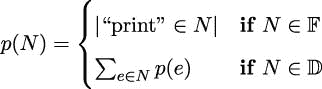

## 第六章：6

递归和归约

许多函数式编程语言编译器会将递归函数优化，将函数尾部的递归调用转换为迭代。这种尾调用优化将显著提高性能。Python 不进行这种自动尾调用优化。一个后果是纯递归受到限制。缺乏自动优化，我们需要手动进行尾调用优化。这意味着重写递归以使用显式迭代。有两种常见的方法来做这件事，我们将在本章中考虑它们。

在前面的章节中，我们探讨了多种相关的处理设计模式；其中一些如下：

+   映射和过滤，它们从集合创建集合

+   从集合创建标量值的归约

这种区别可以通过像 `map()` 和 `filter()` 这样的函数来体现，这些函数完成了第一种集合处理。还有一些更专业的归约函数，包括 `min()`、`max()`、`len()` 和 `sum()`。还有一个通用归约函数，`functools.reduce()`。

我们还将考虑创建一个 `collections.Counter()` 对象作为归约操作符的一种。它本身并不产生单个标量值，但它确实创建了一种新的数据组织方式，消除了原始结构的一些部分。本质上，它是一种计数分组操作，与计数归约比与映射有更多的共同点。

在本章中，我们将更详细地探讨归约函数。从纯函数的角度来看，归约可以递归地定义。Python 中可用的尾调用优化技术非常适合归约。

我们将回顾一些内置的归约算法，包括 `sum()`、`count()`、`max()` 和 `min()`。我们将探讨 `collections.Counter()` 的创建和相关 `itertools.groupby()` 归约。我们还将探讨解析（和词法扫描）是如何作为适当的归约的，因为它们将标记序列（或字符序列）转换为具有更复杂属性的更高阶集合。

### 6.1 简单数值递归

我们可以将所有数值运算都定义为递归。有关更多详细信息，请阅读定义数字基本特征的佩亚诺公理，见[`www.britannica.com/science/Peano-axioms`](https://www.britannica.com/science/Peano-axioms)。

从这些公理中，我们可以看到加法是通过使用更原始的下一个数的概念，即数 n 的后继，S(n) 来递归定义的。

为了简化说明，我们假设我们可以定义一个前驱函数，P(n)，使得 n = S(P(n)) = P(S(n))，只要 n≠0。这形式化了这样一个观点：一个数是它前驱数的后继。

两个自然数之间的加法可以递归地定义为如下：


如果我们使用更典型的 n + 1 和 n− 1 的表示法，而不是 S(n)和 P(n)，我们可以更容易地看到当 a≠0 时，add(a,b) = add(a − 1,b + 1)的规则是如何工作的。

这在以下函数定义中得到了很好的体现：

```py
def add(a: int, b: int) -> int: 
    if a == 0: 
        return b 
    else: 
        return add(a - 1, b + 1)
```

我们已经将抽象的数学符号重新排列成了具体的 Python 代码。

在 Python 中提供我们自己的函数来进行简单的加法没有很好的理由。我们依赖于 Python 的底层实现来正确处理各种算术运算。我们在这里的要点是，基本标量算术可以递归定义，并且定义可以翻译成 Python。

这表明更复杂的递归定义的操作也可以翻译成 Python。这种翻译可以通过手动优化来创建与抽象定义相匹配的运行代码，从而减少关于实现中可能出现的错误的问题。

递归定义必须至少包括两种情况：一个非递归（或基本）情况，其中函数的值直接定义，以及递归情况，其中函数的值是通过递归评估具有不同参数值的函数来计算的。

为了确保递归能够终止，重要的是要看到递归情况是如何计算接近定义的非递归基本情况的值的。从实用角度来看，我们通常省略了函数中的参数值约束。例如，前面命令片段中的`add()`函数可以扩展以包括`assert a>=0 and b>=0`，以建立对输入值的两个必要约束。

没有这些限制，从`a`等于-1 开始，当我们不断从`a`中减去 1 时，不会接近`a == 0`的非递归情况。

#### 6.1.1 实现手动尾调用优化

对于某些函数，递归定义是最简洁和表达性最强的。一个常见的例子是`factorial()`函数。

我们可以从以下公式中看到，这如何被重写为 Python 中的一个简单递归函数：


上述公式可以通过以下函数定义在 Python 中实现：

```py
def fact(n: int) -> int: 
    if n == 0: 
        return 1 
    else: 
        return n*fact(n-1)
```

这种实现具有简单性的优势。Python 中的递归限制人为地限制了我们的能力；我们无法进行大于约`fact(997)`的操作。1000!的值有 2,568 位数字，通常超过了我们的浮点数容量；在某些系统中，浮点数限制接近 10³⁰⁰。从实用角度来看，通常切换到对数伽马函数而不是处理巨大的数字。

有关对数伽马函数的更多信息，请参阅[`functions.wolfram.com/GammaBetaErf/LogGamma/introductions/Gammas/ShowAll.html`](https://functions.wolfram.com/GammaBetaErf/LogGamma/introductions/Gammas/ShowAll.html)。

我们可以将 Python 的调用栈限制扩展到内存的极限。然而，手动优化这些函数以消除递归是更好的选择。

这个函数演示了一个典型的尾递归。函数中的最后一个表达式是对具有新参数值的函数的调用。优化编译器可以用执行非常快的循环来替换函数调用栈管理。

在这个例子中，函数涉及从 n 到 n - 1 的增量变化。这意味着我们在生成一系列数字后，再进行归约以计算它们的乘积。

超出纯粹函数式处理，我们可以定义一个命令式的 `facti()` 计算如下：

```py
def facti(n: int) -> int: 
    if n == 0: 
        return 1 
    f = 1 
    for i in range(2, n+1): 
        f = f * i 
    return f
```

这个阶乘函数版本将计算超过 1000!（例如，2000!有 5,736 位）。这个例子并不纯粹是函数式的。我们将尾递归优化为一个依赖于 `i` 变量的状态 `for` 语句，以保持计算状态。

通常情况下，我们不得不在 Python 中这样做，因为 Python 无法自动进行尾调用优化。然而，在某些情况下，这种优化实际上并不 helpful。我们将探讨其中的一些情况。

#### 6.1.2 保持递归不变

在某些情况下，递归定义实际上是最佳的。一些递归涉及分治策略，这可以最小化工作量。其中一个例子是平方幂的指数算法。这适用于计算具有正整数指数的值，如 2⁶⁴。我们可以如下形式化地陈述它：


我们将过程分解为三个情况，可以很容易地用 Python 作为递归编写。看看以下函数定义：

```py
def fastexp(a: float, n: int) -> float: 
    if n == 0: 
        return 1 
    elif n % 2 == 1: 
        return a * fastexp(a, n - 1) 
    else: 
        t = fastexp(a, n // 2) 
        return t * t
```

对于奇数，`fastexp()` 方法定义为递归。指数 `n` 减少了 1。对于这种情况，简单的尾递归优化是可行的。然而，对于偶数情况，则不可行。

对于偶数，`fastexp()` 递归使用 `n // 2`，将问题规模减半。由于问题规模减少了 2 倍，这种情况会导致处理速度显著提升。

我们不能简单地重构这种函数为尾调用优化循环。由于它已经是最优的，我们实际上不需要进一步优化它。Python 中的递归限制将导致 n ≤ 2¹⁰⁰⁰，这是一个相当宽松的上限。

#### 6.1.3 处理困难的尾调用优化

我们可以递归地查看斐波那契数的定义。以下是对第 n 个斐波那契数 F[n] 的一个广泛使用的定义：


一个给定的斐波那契数 F[n]定义为前两个数的和，即 F[n−1] + F[n−2]。这是一个多次递归的例子：它不能简单地作为简单的尾递归进行优化。然而，如果我们不将其优化为尾递归，我们会发现它太慢而无法使用。

以下是一个简单的实现：

```py
def fib(n: int) -> int: 
    if n == 0: return 0 
    if n == 1: return 1 
    return fib(n-1) + fib(n-2)
```

这存在一个可怕的多次递归问题。在计算`fib(n)`值时，我们必须计算`fib(n-1)`和`fib(n-2)`的值。`fib(n-1)`值的计算涉及到`fib(n-2)`值的重复计算。`fib()`函数的两次递归使用将超过重复计算的工作量。

由于 Python 从左到右的评估规则，我们可以评估到大约`fib(1000)`的值。然而，我们必须有耐心。非常耐心。（尝试使用默认的栈大小找到实际的界限意味着在`RecursionError`被抛出之前要等待很长时间。）

以下是一个替代方案，它重新表述了整个算法，使用有状态变量而不是简单的递归：

```py
def fibi(n: int) -> int: 
    if n == 0: return 0 
    if n == 1: return 1 
    f_n2, f_n1 = 1, 1 
    for _ in range(2, n): 
        f_n2, f_n1 = f_n1, f_n2 + f_n1 
    return f_n1
```

我们这个有状态版本的函数从 0 开始计数，与递归从初始值`n`开始计数不同。这个版本比递归版本快得多。

这里重要的是，我们无法简单地通过明显的重写来优化`fib()`函数的递归。为了用命令式版本替换递归，我们必须仔细查看算法，以确定需要多少个有状态的中间变量。

作为对读者的练习，尝试使用`functools`模块中的`@cache`装饰器。这会产生什么影响？

#### 6.1.4 通过递归处理集合

当处理集合时，我们也可以递归地定义处理。例如，我们可以递归地定义`map()`函数。形式化可以表述如下：

![ ( |{ [] if len(C ) = 0 map (f,C ) = | ( map(f,C [:−1]) + [f (C −1)] if len(C ) > 0 ](img/file52.jpg)

我们将函数 f 映射到空集合定义为空序列`[]`。我们还指定了将函数应用于集合可以通过一个三步表达式递归定义。首先，递归地对函数应用于除最后一个元素之外的所有集合元素进行映射，创建一个序列对象。然后对最后一个元素应用函数。最后，将最后的计算结果追加到之前构建的序列中。

以下是这个`map()`函数的纯递归函数版本：

```py
from collections.abc import Callable, Sequence 
from typing import Any, TypeVar 

MapD = TypeVar("MapD") 
MapR = TypeVar("MapR") 

def mapr( 
        f: Callable[[MapD], MapR], 
        collection: Sequence[MapD] 
) -> list[MapR]: 
    if len(collection) == 0: return [] 
    return mapr(f, collection[:-1]) + [f(collection[-1])]
```

`mapr(f,[])`方法定义的值是一个空列表对象。对于非空列表的`mapr()`函数，将应用函数到列表的最后一个元素，并将其追加到由应用于列表头的`mapr()`函数递归构建的列表中。

我们必须强调，这个`mapr()`函数实际上创建了一个列表对象。内置的`map()`函数是一个迭代器；它不会创建列表对象。它按计算顺序产生结果值。此外，工作是在从右到左的顺序中完成的，这不是 Python 通常的工作方式。这只有在使用具有副作用的功能时才会观察到，这是我们希望避免做的事情。

虽然这是一个优雅的形式主义，但它仍然缺乏所需的尾调用优化。优化将使我们能够超过默认的递归限制 1,000，并且比这种原始递归快得多。

使用`Callable[[Any], Any]`是一种弱类型提示。为了更清楚，可以定义一个域类型变量和一个范围类型变量。我们将在优化示例中包含这个细节。

#### 6.1.5 集合的尾调用优化

我们有两种处理集合的一般方法：我们可以使用返回生成器表达式的高阶函数，或者我们可以创建一个使用`for`语句处理集合中每个项的函数。这两种模式非常相似。

以下是一个类似于内置`map()`函数的高阶函数：

```py
from collections.abc import Callable, Iterable, Iterator 
from typing import Any, TypeVar 

DomT = TypeVar("DomT") 
RngT = TypeVar("RngT") 

def mapf( 
        f: Callable[[DomT], RngT], 
        C: Iterable[DomT] 
) -> Iterator[RngT]: 
    return (f(x) for x in C)
```

我们返回了一个生成器表达式，它产生了所需的映射。这使用了生成器表达式中的显式`for`作为尾调用优化的一种形式。

数据源`C`有一个类型提示`Iterable[DomT]`，以强调某些类型`DomT`将形成映射的域。转换函数有一个提示`Callable[[DomT], RngT]`，以使其明确地从某个域类型转换到范围类型。例如，`float()`函数可以将值从字符串域转换为浮点数范围。结果有一个提示`Iterator[RngT]`，以表明它遍历范围类型`RngT`；可调用函数的结果类型。

以下是一个具有相同签名和结果的生成器函数：

```py
def mapg( 
        f: Callable[[DomT], RngT], 
        C: Iterable[DomT] 
) -> Iterator[RngT]: 
    for x in C: 
        yield f(x)
```

这使用了完整的`for`语句进行尾调用优化。结果相同。这个版本稍微慢一些，因为它涉及多个语句。

在这两种情况下，结果是对结果的一个迭代器。我们必须做些别的事情，才能从一个可迭代源中创建一个序列对象。例如，这里使用`list()`函数从迭代器创建序列：

```py
>>> list(mapg(lambda x: 2 ** x, [0, 1, 2, 3, 4])) 
[1, 2, 4, 8, 16]
```

为了性能和可扩展性，Python 程序中需要这种尾调用优化。这使得代码不如纯函数。然而，好处远远超过了纯度的缺乏。为了获得简洁和表达性强的函数式设计的益处，将这些非纯函数视为适当的递归是有帮助的。

这在实用意义上意味着我们必须避免在集合处理函数中添加额外的状态化处理。即使我们程序的一些元素不是完全函数式的，函数式编程的核心原则仍然有效。

#### 6.1.6 在递归中使用赋值（有时称为“walrus”）运算符

在某些情况下，递归涉及可以使用“walrus”或赋值运算符`:=`进行优化的条件处理。使用赋值意味着我们正在引入状态变量。如果我们小心这些变量的作用域，那么产生极其复杂算法的可能性就会降低。

我们在保留递归部分回顾了下面的`fast_exp()`函数。这个函数使用了三个不同的案例来实现分而治之的策略。在将数字`a`提升到偶数次幂的情况下，我们可以使用`t = a^`来计算`t × t = a^n`：

```py
def fastexp_w(a: float, n: int) -> float: 
    if n == 0: 
        return 1 
    else: 
        q, r = divmod(n, 2) 
        if r == 1: 
            return a * fastexp_w(a, n - 1) 
        else: 
            return (t := fastexp_w(a, q)) * t
```

这使用`:=` walrus 运算符来计算部分答案`fastexp_w(a, q)`并将其保存到临时变量`t`中。这将在同一语句的稍后部分用于计算`t * t`。

对于递归的大部分情况，当我们对递归进行尾调用优化时，`for`语句的主体将包含普通赋值语句。通常没有必要利用 walrus 运算符。

赋值运算符常用于正则表达式匹配等场景，我们希望保存匹配对象并做出决策。`if(match := pattern.match(text)):`作为尝试正则表达式匹配、保存结果匹配对象并确认它不是`None`对象的一种常见方式。

### 6.2 从多个项目折叠集合到单个项目

我们可以将`sum()`函数考虑为以下类型的定义。我们可以说，对于空集合，集合的和为 0。对于非空集合，和是第一个元素加上剩余元素的和：

![ (| { 0 if n = 0 sum ([c0,c1,c2,...,cn]) = | ( c0 + sum ([c1,c2,...,cn]) if n > 0 ](img/file54.jpg)

我们可以使用一种稍微简化的符号，称为 Bird-Meertens 形式主义。它使用⊕∕[c[0],c[1],...c[n]]来显示某些任意二元运算符⊕如何应用于一系列值。它如下所示，将递归定义总结为更容易处理的东西：

![sum ([c0,c1,c2,...,cn]) = + ∕[c0,c1,c2,...,cn] = 0+ c0 + c1 + ...+ cn ](img/file55.jpg)

我们有效地将序列中每个项目之间的加法运算符折叠起来。隐式地，处理将按从左到右的顺序进行。这可以称为将集合折叠为单个值的“fold left”方式。我们也可以想象从右到左分组运算符，称之为“fold right”。虽然一些编译型语言会执行这种优化，但 Python 在给定一系列具有相同优先级的运算符时，会严格从左到右工作。

在 Python 中，乘积函数可以递归地定义为以下内容：

```py
from collections.abc import Sequence 

def prodrc(collection: Sequence[float]) -> float: 
    if len(collection) == 0: return 1 
    return collection[0] * prodrc(collection[1:])
```

这是对数学符号到 Python 的微小重写。然而，它并不理想，因为所有的切片都会创建大量中间列表对象。它也仅限于与显式集合一起工作；它不能容易地与可迭代对象一起工作。

我们可以稍作修改以适应可迭代对象，这样可以避免创建任何中间集合对象。以下是一个正确递归的乘积函数，它可以与任何迭代器作为数据源一起工作：

```py
from collections.abc import Iterator 

def prodri(items: Iterator[float]) -> float: 
    try: 
        head = next(items) 
    except StopIteration: 
        return 1 
    return head * prodri(items)
```

这不适用于可迭代集合。我们无法使用`len()`函数来查询迭代器有多少元素。我们所能做的就是尝试提取迭代器的头部。如果没有元素在迭代器中，那么任何获取头部尝试都会引发`StopIteration`异常。如果有元素，那么我们可以将这个元素乘以序列中剩余元素的乘积。

注意，我们必须显式地使用`iter()`函数从一个具体化的序列对象创建一个迭代器。在其他上下文中，我们可能有一个可迭代的输出结果可以使用。以下是一个示例：

```py
>>> prodri(iter([1,2,3,4,5,6,7])) 
5040
```

这个递归定义不依赖于显式状态或 Python 的其他命令式特性。虽然它更纯粹是函数式的，但它仍然限制在处理小于 1,000 个项目的集合。（虽然我们可以扩展栈的大小，但正确优化这一点要好得多。）从实用主义的角度来看，我们可以使用以下类型的命令式结构来处理归约函数：

```py
from collections.abc import Iterable 

def prodi(items: Iterable[float]) -> float: 
    p: float = 1 
    for n in items: 
        p *= n 
    return p
```

这避免了任何递归限制。它包括所需的尾调用优化。此外，这将以相同的方式与任何可迭代对象一起工作。这意味着一个`Sequence`对象，或者一个迭代器。

#### 6.2.1 使用双端队列进行尾调用优化

递归的核心是函数调用的栈。例如，评估`fact(5)`是`5*fact(4)`。`fact(4)`的值是`5*fact(3)`。直到`fact(0)`的值为 1，才会有一系列待处理的计算。然后计算栈完成，揭示最终结果。

Python 为我们管理调用栈。它对栈强加了一个任意默认限制，即 1,000 次调用，以防止具有递归错误的程序无限期地运行。

我们也可以手动管理栈。这为我们提供了优化递归的另一种方法。我们可以——明确地——创建一个待处理工作的栈。然后我们可以对待处理工作进行最终总结，从栈中清空项目。

对于像计算阶乘值这样简单的事情，堆栈的压入和弹出可能看起来像是无用的开销。对于更复杂的应用，如检查分层文件系统，将文件处理与将目录放入堆栈以供以后考虑混合起来似乎更合适。

我们需要一个函数来遍历目录层次结构而不使用显式递归。核心概念是目录是一系列条目，每个条目要么是一个文件，要么是一个子目录，或者是我们不想接触的其他文件系统对象（例如，挂载点、符号链接等）。

我们可以说目录树中的一个节点是一系列条目：N = e[0],e[1],e[2],...,e[n]。每个条目要么是另一个目录，e ∈𝔻，要么是一个文件，e ∈𝔽。

我们可以在树中的每个文件上执行映射以处理每个文件的内容。我们可能执行一个过滤操作来创建具有特定属性的文件迭代器。我们还可以执行归约操作来计算具有属性的文件数量。在这个例子中，我们将计算目录树中文件内容中特定子字符串的出现次数。

形式上，我们希望有一个函数 p(f)，它将为目录树节点中的“打印”提供计数。它可以定义如下：



这显示了如何将 p(N)函数应用于目录树中的每个元素。当元素是文件，e ∈𝔽，时，我们可以计算“打印”的实例。当元素是目录，e ∈𝔻，时，我们需要递归地应用 p(N)函数到目录中的每个条目，e[x]。虽然目录树可能不够深以打破 Python 的栈大小限制，但这种算法揭示了尾调用优化的替代方案。这是一个使用显式栈的机会。

`collections.deque`类是构建栈和队列的奇妙方式。这个名字来自“双端队列”，有时拼写为 dequeue。这种数据结构可以用作后进先出（LIFO）栈或先进先出（FIFO）。在这个例子中，我们使用`append()`和`pop()`方法，这些方法强制执行 LIFO 栈行为。虽然这很像列表，但在`deque`实现中还有一些优化，可以使其比通用列表略快。

使用栈数据结构让我们能够在不遇到 Python 内部栈深度限制并引发`RecursionError`异常的情况下处理不定大小的层次结构。以下函数将遍历文件层次结构，查看 Python 源文件（后缀为`.py`）：

```py
from collections import deque 
from pathlib import Path 

def all_print(start: Path) -> int: 
    count = 0 
    pending: deque[Path] = deque([start]) 
    while pending: 
        dir_path = pending.pop() 
        for path in dir_path.iterdir(): 
            if path.is_file(): 
                if path.suffix == ’.py’: 
                    count += path.read_text().count("print") 
            elif path.is_dir(): 
                if not path.stem.startswith(’.’): 
                    pending.append(path) 
            else:  # Ignore other filesystem objects 
                pass 
    return count
```

我们用初始目录填充了待处理任务的栈。基本算法是从栈中弹出目录并访问目录中的每个条目。对于具有正确后缀的文件条目，执行处理：计算“打印”的出现次数。对于目录条目，将目录作为待处理任务放入栈中。注意，名称中带有点的目录需要被忽略。对于本书中的代码，这些目录包括 mypy、pytest 和 tox 等工具使用的缓存。我们希望跳过这些缓存目录。

对每个文件执行的处理是`all_print()`函数的一部分。这可以重构为一个单独的函数，作为减少的一部分应用于每个节点。将`all_print()`函数重写为适当的更高阶函数作为练习留给读者。

这里的想法是我们有两种将形式化递归转换为有用优化函数的策略。我们可以将递归重构成迭代，或者我们可以引入一个显式的栈。

在下一节中，我们将应用减少（以及相关的尾调用优化）的概念来创建项目组并计算组的减少。

### 6.3 从多个项目到较少项目的分组减少

减少的想法可以以多种方式应用。我们已经看到了减少的基本递归定义，它从值集合中生成单个值。这导致我们优化递归，以便我们能够在没有原始 Python 实现开销的情况下计算摘要。

在 Python 中创建子组并不困难，但了解支持它的形式化方法可能会有所帮助。这种理解可以帮助避免性能极差的实现。

一个非常常见的操作是按某些键或指标对值进行分组。原始数据按某些列的值进行分组，并将减少（有时称为聚合函数）应用于其他列。

在 SQL 中，这通常称为`SELECT`语句的`GROUP BY`子句。SQL 聚合函数包括`SUM`、`COUNT`、`MAX`和`MIN`，以及许多其他函数。

Python 为我们提供了多种在计算分组值的减少之前对数据进行分组的方法。我们将从查看获取分组数据的简单计数方法开始。然后我们将探讨计算分组数据不同摘要的方法。

我们将使用我们在第四章，处理集合中计算的三次数据。这些数据最初是一系列纬度-经度航点。我们将其重构为表示每条腿的起点、终点和距离的三元组。数据看起来如下：

```py
(((37.5490162, -76.330295), (37.840832, -76.273834), 17.7246), 
((37.840832, -76.273834), (38.331501, -76.459503), 30.7382), 
((38.331501, -76.459503), (38.845501, -76.537331), 31.0756), 
... 
((38.330166, -76.458504), (38.976334, -76.473503), 38.8019))
```

我们想知道最常见的距离。由于数据是实值且连续的，每个距离都是一个独特的值。我们需要将这些值从连续域约束到一组离散的距离。例如，将每条腿量化到最接近的五海里倍数。这创建了从 0 到 5 英里，超过 5 到 10 英里等的波段。一旦我们创建了离散的整数值，我们就可以计算每个波段中的腿的数量。

这些量子化的距离可以通过生成器表达式来生成：

```py
quantized = (5 * (dist // 5) for start, stop, dist in trip)
```

这将把每个距离除以 5——丢弃任何分数——然后将截断的结果乘以 5 来计算一个表示距离向下舍入到最接近 5 海里的数字。

我们没有使用分配给 `start` 和 `stop` 变量的值。将它们分配给 `_` 变量是一种常见的做法。这可能会导致一些混淆，因为这可能会掩盖三元组的结构。它看起来会是这样：

```py
quantized = (5 * (dist // 5) for _, _, dist in trip)
```

这种方法对于去除一些视觉杂乱是有帮助的。

#### 6.3.1 使用 Counter 构建映射

类似于 `collections.Counter` 类的映射是进行按集合中某些值创建计数的归约的优化。以下表达式创建了一个从距离到频率的映射：

```py
# See Chapter 4 for ways to parse "file:./Winter%202012-2013.kml" 
# We want to build a trip variable with the sequence of tuples 

>>> from collections import Counter 

>>> quantized = (5 * (dist // 5) for start, stop, dist in trip) 
>>> summary = Counter(quantized)
```

生成的 `summary` 对象是状态的；它可以被更新。创建组的表达式 `Counter()` 看起来像一个函数，这使得它非常适合基于函数编程思想的架构。

如果我们打印 `summary.most_common()` 的值，我们将看到以下结果：

```py
>>> summary.most_common()
[(30.0, 15), (15.0, 9), ...]

```

最常见的距离大约是 30 海里。我们还可以应用 `min()` 和 `max()` 等函数来找到记录的最短和最长的腿。

注意，你的输出可能与显示的略有不同。`most_common()` 函数的结果按频率排序；频率相等的桶可能以任何顺序排列。这五个长度不一定总是按显示的顺序排列：

```py
(35.0, 5), (5.0, 5), (10.0, 5), (20.0, 5), (25.0, 5)
```

这种轻微的变化使得使用 doctest 工具进行测试稍微复杂一些。对于计数器测试的一个有用技巧是使用字典来验证结果；实际值与预期值之间的比较不再依赖于内部哈希计算的随意性。

#### 6.3.2 通过排序构建映射

`Counter` 的一个替代方案是对原始集合进行排序，然后使用递归循环来识别每个组开始的位置。这涉及到将原始数据实体化，执行一个可能最坏情况下进行 O(nlog n) 操作的排序，然后进行归约以获取每个键的求和或计数。

为了以通用方式与可以排序的 Python 对象一起工作，我们需要定义排序所需的协议。我们将此协议称为 `SupportsRichComparisonT`，因为我们可以排序任何实现了丰富比较运算符 `<` 和 `>` 的对象。这不是一个特定的对象类；这是一个任何数量的类都可能实现的协议。我们使用 `typing.Protocol` 类型定义正式化类必须支持的协议概念。它也可以被称为一个类必须实现的接口。Python 的灵活性源于拥有相当多的协议，许多不同的类都支持这些协议。

以下是从排序数据创建组的一个常见算法：

```py
from collections.abc import Iterable 
from typing import Any, TypeVar, Protocol, TypeAlias 

class Comparable(Protocol): 
    def __lt__(self, __other: Any) -> bool: ... 
    def __gt__(self, __other: Any) -> bool: ... 
SupportsRichComparisonT = TypeVar("SupportsRichComparisonT", bound=Comparable) 

Leg: TypeAlias = tuple[Any, Any, float] 

def group_sort(trip: Iterable[Leg]) -> dict[int, int]: 

    def group( 
            data: Iterable[SupportsRichComparisonT] 
    ) -> Iterable[tuple[SupportsRichComparisonT, int]]: 
        sorted_data = iter(sorted(data)) 
        previous, count = next(sorted_data), 1 
        for d in sorted_data: 
            if d == previous: 
                count += 1 
            else: 
                yield previous, count 
                previous, count = d, 1 
        yield previous, count 

    quantized = (int(5 * (dist // 5)) for beg, end, dist in trip) 
    return dict(group(quantized))
```

内部 `group()` 函数遍历腿的排序序列。如果给定的项目键已经出现过——它与 `previous` 中的值匹配——则 `counter` 变量递增。如果给定的项目不匹配前一个值，那么值发生了变化：输出前一个值和计数，并开始为新值积累计数。

`group()` 函数的定义提供了两个重要的类型提示。源数据是一些类型的可迭代对象，用类型变量 `SupportsRichComparisonT` 表示。在这个特定的情况下，很明显，使用的值将是 `int` 类型；然而，算法对任何 Python 类型都适用。`group()` 函数的结果可迭代对象将保留源数据的类型，并且通过使用相同的类型变量 `SupportsRichComparisonT` 来明确这一点。

`group_sort()` 函数的最后一行从分组项创建一个字典。这个字典将与 `Counter` 字典类似。主要区别是 `Counter()` 函数将有一个 `most_common()` 方法函数，而默认字典没有。

我们也可以使用 `itertools.groupby()` 来做这件事。我们将在第八章，Itertools 模块中详细探讨这个函数。

#### 6.3.3 按键值分组或分区数据

我们可能想要应用于分组数据的归约类型没有限制。我们可能有具有多个独立和依赖变量的数据。我们可以考虑按独立变量分区数据，并计算每个分区中值的最大值、最小值、平均值和标准差等摘要。

进行更复杂归约的基本技巧是将所有数据值收集到每个组中。`Counter()` 函数仅收集相同项的计数。对于更深入的分析，我们希望创建包含组原始成员的序列。

回顾我们的行程数据，每个五英里区间可能包含该距离的所有腿的整个集合，而不仅仅是腿的数量。我们可以将分区视为递归或作为 `defaultdict(list)` 对象的状态化应用。我们将探讨 `groupby()` 函数的递归定义，因为它很容易设计。

显然，对于空集合 `[]` 的 `groupby(C,` `key)` 计算结果是空字典 `dict()`。或者更有用，空 `defaultdict(list)` 对象。

对于非空集合，我们需要处理项 `C[0]`，即头部，并递归地处理序列 `C[1:]`，即尾部。我们可以使用切片表达式，或者我们可以使用 `head,` `*tail`` =`` C` 语句来解析这个集合，如下所示：

```py
>>> C = [1,2,3,4,5] 
>>> head, *tail = C 
>>> head 
1 
>>> tail 
[2, 3, 4, 5]
```

如果我们有一个名为 `groups` 的 `defaultdict` 对象，我们需要使用表达式 `groups[key(head)].append(head)` 将头部元素包含在 `groups` 字典中。之后，我们需要评估 `groupby(tail, key)` 表达式来处理剩余的元素。

我们可以创建一个如下所示的函数：

```py
from collections import defaultdict 
from collections.abc import Callable, Sequence, Hashable 
from typing import TypeVar 

SeqItemT = TypeVar("SeqItemT") 
ItemKeyT = TypeVar("ItemKeyT", bound=Hashable) 

def group_by( 
        key: Callable[[SeqItemT], ItemKeyT], 
        data: Sequence[SeqItemT] 
) -> dict[ItemKeyT, list[SeqItemT]]: 

    def group_into( 
            key: Callable[[SeqItemT], ItemKeyT], 
            collection: Sequence[SeqItemT], 
            group_dict: dict[ItemKeyT, list[SeqItemT]] 
    ) -> dict[ItemKeyT, list[SeqItemT]]: 
        if len(collection) == 0: 
            return group_dict 
        head, *tail = collection 
        group_dict[key(head)].append(head) 
        return group_into(key, tail, group_dict) 

    return group_into(key, data, defaultdict(list))
```

内部函数 `group_into()` 处理基本的递归定义。对于 `collection` 的空值返回提供的字典 `group_dict`。非空集合被分割成头部和尾部。头部用于更新 `group_dict` 字典。然后递归地使用尾部更新字典中的所有剩余元素。

类型提示在源对象 `SeqItemT` 的类型和键 `ItemKeyT` 的类型之间做出了明确的区分。作为 `key` 参数提供的函数必须是一个可调用的函数，它返回一个键类型 `ItemKeyT` 的值，给定一个源类型 `SeqItemT` 的对象。在许多示例中，将展示一个从 `Leg` 对象中提取距离的函数。这是一个 `Callable[[SeqItemT], ItemKeyT]`，其中源类型 `SeqItemT` 是 `Leg` 对象，键类型 `ItemKeyT` 是浮点值。

`bound=Hashable` 是一个额外的约束。这定义了可能类型的“上限”，并提醒 mypy 任何可以分配给此类型变量的类型都必须实现 `Hashable` 协议。基本、不可变的 Python 类型，如数字、字符串和元组都满足这个限制。像字典、集合或列表这样的可变对象将不会满足上限，从而导致 mypy 发出警告。

我们不能轻易使用 Python 的默认值将此合并为一个单一函数。我们明确不能使用以下错误的命令片段：

```py
# Bad use of a mutable default value 

def group_by(key, data, dictionary=defaultdict(list)):
```

如果我们尝试这样做，`group_by()` 函数的所有使用都共享一个共同的 `defaultdict(list)` 对象。这不起作用，因为 Python 只构建一次默认值。作为默认值的可变对象很少能做我们想要的事情。常见的做法是提供一个 `None` 值，并使用显式的 `if` 语句根据需要创建每个唯一的空 `defaultdict(list)` 实例。我们已经展示了如何使用包装函数定义来避免 `if` 语句。

我们可以如下按距离对数据进行分组：

```py
>>> binned_distance = lambda leg: 5 * (leg[2] // 5) 
>>> by_distance = group_by(binned_distance, trip)
```

我们定义了一个可重用的 lambda，将我们的距离放入大小为 5 海里一个的箱子中。然后我们使用提供的 lambda 对数据进行分组。

我们可以如下检查分组后的数据：

```py
>>> import pprint 
>>> for distance in sorted(by_distance): 
...     print(distance) 
...     pprint.pprint(by_distance[distance])
```

以下就是输出看起来像什么：

```py
0.0 
[((35.505665, -76.653664), (35.508335, -76.654999), 0.1731), 
 ((35.028175, -76.682495), (35.031334, -76.682663), 0.1898), 
 ((25.4095, -77.910164), (25.425833, -77.832664), 4.3155), 
 ((25.0765, -77.308167), (25.080334, -77.334), 1.4235)] 
5.0 
[((38.845501, -76.537331), (38.992832, -76.451332), 9.7151), 
 ((34.972332, -76.585167), (35.028175, -76.682495), 5.8441), 
 ((30.717167, -81.552498), (30.766333, -81.471832), 5.103), 
 ((25.471333, -78.408165), (25.504833, -78.232834), 9.7128), 
 ((23.9555, -76.31633), (24.099667, -76.401833), 9.844)] 
... 
125.0 
[((27.154167, -80.195663), (29.195168, -81.002998), 129.7748)]
```

在查看递归定义之后，我们可以转向查看如何通过迭代来构建一个分组算法的尾调用优化。这将适用于更大的数据集，因为它可以超过内部栈大小限制。

我们将从对 `group_into()` 函数进行尾调用优化开始。我们将将其重命名为 `partition()`，因为分割是另一种看待分组的方式。

`partition()`函数可以写成如下迭代形式：

```py
from collections import defaultdict 
from collections.abc import Callable, Hashable, Iterable 
from typing import TypeVar 

SeqT = TypeVar("SeqT") 
KeyT = TypeVar("KeyT", bound=Hashable) 

def partition( 
        key: Callable[[SeqT], KeyT], 
        data: Iterable[SeqT] 
) -> dict[KeyT, list[SeqT]]: 
    group_dict = defaultdict(list) 
    for head in data: 
        group_dict[key(head)].append(head) 
        #--------------------------------- 
    return group_dict
```

在进行尾调用优化时，命令式版本中的关键代码行将与递归定义匹配。我们在更改的行下面添加了注释，以强调重写是为了达到相同的结果。其余的结构代表了作为绕过 Python 限制的常用方法所采用的尾调用优化。

类型提示强调了源类型`SeqT`和键类型`KeyT`之间的区别。源数据可以是任何东西，但键限于具有适当哈希值的类型。

#### 6.3.4 编写更通用的按组减少

一旦我们对原始数据进行分区，我们就可以对每个分区中的数据元素进行各种类型的减少计算。例如，我们可能想要距离 bin 中每一段的北部最远点。

我们将引入一些辅助函数来分解元组，如下所示：

```py
# Legs are (start, end, distance) tuples 

start = lambda s, e, d: s 

end = lambda s, e, d: e 

dist = lambda s, e, d: d 

# start and end of a Leg are (lat, lon) tuples 

latitude = lambda lat, lon: lat 

longitude = lambda lat, lon: lon
```

这些辅助函数中的每一个都期望提供一个使用`*`运算符提供的元组对象，将元组的每个元素映射到 lambda 的单独参数。一旦元组展开为`s`、`e`和`p`参数，通过名称返回适当的参数就相当明显了。这比尝试解释`tuple_arg[2]`值要清晰得多。

以下是我们如何使用这些辅助函数：

```py
>>> point = ((35.505665, -76.653664), (35.508335, -76.654999), 0.1731) 
>>> start(*point) 
(35.505665, -76.653664) 

>>> end(*point) 
(35.508335, -76.654999) 

>>> dist(*point) 
0.1731 

>>> latitude(*start(*point)) 
35.505665
```

我们最初的`point`对象是一个嵌套的三元组，包含（0）起始位置，（1）结束位置，和（2）距离。我们使用辅助函数提取了各种字段。

给定这些辅助函数，我们可以定位每个 bin 中路段的北部最起始位置：

```py
>>> binned_distance = lambda leg: 5 * (leg[2] // 5) 
>>> by_distance = partition(binned_distance, trip) 
>>> for distance in sorted(by_distance): 
...     print( 
...         distance, 
...         max(by_distance[distance], 
...         key=lambda pt: latitude(*start(*pt))) 
...     )
```

我们按距离分组的数据包括给定距离的每一段。我们将每个 bin 中的所有段都提供给`max()`函数。我们提供给`max()`函数的`key`函数仅提取路段起点的纬度。

这为我们提供了一个北部最远路段的简短列表，如下所示：

```py
0.0 ((35.505665, -76.653664), (35.508335, -76.654999), 0.1731) 
5.0 ((38.845501, -76.537331), (38.992832, -76.451332), 9.7151) 
10.0 ((36.444168, -76.3265), (36.297501, -76.217834), 10.2537) 
... 
125.0 ((27.154167, -80.195663), (29.195168, -81.002998), 129.7748)
```

#### 6.3.5 编写高阶减少

我们将在这里查看一个高阶减少算法的示例。这将引入一个相当复杂的话题。最简单的减少类型是从值集合中发展出一个单一值。Python 有几个内置的减少，包括`any()`、`all()`、`max()`、`min()`、`sum()`和`len()`。

如我们在第四章中提到的使用集合，如果我们从以下几种减少开始，我们可以进行大量的统计计算：

```py
from collections.abc import Sequence 

def sum_x0(data: Sequence[float]) -> float: 
    return sum(1 for x in data)  # or len(data) 

def sum_x1(data: Sequence[float]) -> float: 
    return sum(x for x in data)  # or sum(data) 

def sum_x2(data: Sequence[float]) -> float: 
    return sum(x*x for x in data)
```

这允许我们定义平均值、标准差、归一化值、校正，甚至最小二乘线性回归，基于这些基础减少函数。

我们最后的减少`sum_x2()`展示了我们如何应用现有的减少来创建高阶函数。我们可能会改变我们的方法，使其更接近以下内容：

```py
from collections.abc import Callable, Iterable 
from typing import Any 

def sum_f( 
        function: Callable[[Any], float], 
        data: Iterable[float] 
) -> float: 
    return sum(function(x) for x in data)
```

我们添加了一个函数，`function()`，作为参数；该函数可以转换数据。这个整体函数，`sum_f()`，计算转换值的总和。

现在，我们可以以三种不同的方式应用此函数来计算三个基本求和如下：

```py
>>> data = [7.46, 6.77, 12.74, 7.11, 7.81, 
...     8.84, 6.08, 5.39, 8.15, 6.42, 5.73] 

>>> N = sum_f(lambda x: 1, data)  # x**0 
>>> N 
11 
>>> S = sum_f(lambda x: x, data)  # x**1 
>>> round(S, 2) 
82.5 
>>> S2 = sum_f(lambda x: x*x, data)  # x**2 
>>> round(S2, 4) 
659.9762
```

我们插入了一个小的 lambda 来计算 ∑ [x∈X]x⁰ = ∑ [x∈X]1，这是计数，∑ [x∈X]x¹ = ∑ [x∈X]x，求和，以及 ∑ [x∈X]x²，平方和，我们可以使用这些来计算标准差。

对此的一个常见扩展包括一个过滤器来拒绝某些方式未知或不合适的原始数据。我们可能使用以下函数来拒绝不良数据：

```py
from collections.abc import Callable, Iterable 

def sum_filter_f( 
        filter_f: Callable[[float], bool], 
        function: Callable[[float], float], 
        data: Iterable[float] 
) -> float: 
    return sum(function(x) for x in data if filter_f(x))
```

以下用于计算平均值的函数定义将以简单的方式拒绝`None`值：

```py
valid = lambda x: x is not None 

def mean_f(predicate: Callable[[Any], bool], data: Sequence[float]) -> float: 
    count_ = lambda x: 1 
    sum_ = lambda x: x 
    N = sum_filter_f(valid, count_, data) 
    S = sum_filter_f(valid, sum_, data) 
    return S / N
```

这显示了我们可以向`sum_filter_f()`函数提供两种不同的 lambda 组合。过滤器参数是一个拒绝`None`值的 lambda；我们将其称为`valid`以强调其含义。函数参数是一个实现计数或求和操作的 lambda。我们可以轻松地添加一个 lambda 来计算平方和。

重复使用一个常见的`valid`规则确保在应用任何过滤器到源数据时，各种计算都是相同的。这可以与用户选择的过滤器标准相结合，提供一个整洁的插件来计算与用户请求的数据子集相关的多个统计数据。

#### 6.3.6 编写文件解析器

我们通常可以将文件解析器视为一种还原。许多语言有两个级别的定义：语言中的低级标记和由这些标记构建的高级结构。当我们查看 XML 文件时，标签、标签名称和属性名称形成这种低级语法；由 XML 描述的结构形成一个高级语法。

低级词法扫描是一种将单个字符分组为标记的还原过程。这与 Python 的生成器函数设计模式非常契合。我们经常可以编写如下所示的功能：

```py
from collections.abc import Iterator 
from enum import Enum 
import re 

class Token(Enum): 
    SPACE = 1 
    PARA = 2 
    EOF = 3 

def lexical_scan(some_source: str) -> Iterator[tuple[Token, str]]: 
    previous_end = 0 
    separator_pat = re.compile(r"\n\s*\n", re.M|re.S) 
    for sep in separator_pat.finditer(some_source): 
        start, end = sep.span() 
        yield Token.PARA, some_source[previous_end: start] 
        yield Token.SPACE, some_source[start: end] 
        previous_end = end 
    yield Token.PARA, some_source[previous_end:] 
    yield Token.EOF, ""
```

对于众所周知的文件格式，我们将使用现有的文件解析器。对于 CSV、JSON、XML 或 TOML 格式的数据，我们不需要编写文件解析器。这些模块中的大多数都有一个`load()`方法，该方法生成有用的 Python 对象。

在某些情况下，我们需要将此解析的结果组合成更高层次的对象，这些对象对我们特定的应用是有用的。虽然 CSV 解析器提供单个行，但这些可能需要用于创建`NamedTuple`实例，或者可能是其他不可变 Python 对象。我们的行程数据示例，从第四章 使用集合开始，通过将航点组合成对的一个算法组合成更高层次的对象，即旅程的段落。当我们引入更复杂的决策时，我们就从重构过渡到解析。

为了首先提供有用的航点，我们需要解析源文件。在这些示例中，输入是一个 KML 文件；KML 是地理信息的 XML 表示。解析器的基本功能看起来类似于以下定义：

```py
from collections.abc import Iterator 
from typing import TextIO, cast 

def comma_split(text: str) -> list[str]: 
    return text.split(",") 

def row_iter_kml(file_obj: TextIO) -> Iterator[list[str]]: 
    ns_map = { 
        "ns0": "http://www.opengis.net/kml/2.2", 
        "ns1": "http://www.google.com/kml/ext/2.2"} 
    xpath = ( 
        "./ns0:Document/ns0:Folder/" 
        "ns0:Placemark/ns0:Point/ns0:coordinates") 
    doc = XML.parse(file_obj) 
    return ( 
        comma_split(cast(str, coordinates.text)) 
        for coordinates in doc.findall(xpath, ns_map) 
    )
```

`row_iter_kml()` 函数的主体是 XML 解析，这使得我们可以使用 `doc.findall()` 函数遍历文档中的 `<ns0:coordinates>` 标签。我们使用了一个名为 `comma_split()` 的函数来解析这个标签的文本内容，将其解析为包含三个值的元组。

`cast()` 函数仅存在以向 mypy 提供证据，表明 `coordinates.text` 的值是一个 `str` 对象。文本属性的默认定义是 `Union[str, bytes]`；在此应用中，数据将是 `str` 独有的。`cast()` 函数不执行任何运行时处理。

此函数专注于与规范化的 XML 结构一起工作。文档接近数据库设计者对第一范式定义的描述：每个属性都是原子的（单个值），XML 数据中的每一行都具有相同的列，并且数据类型一致。然而，数据值并非完全原子：我们必须在逗号处拆分点，以将经度、纬度和海拔分离成原子的字符串值。然而，这些 XML 标签的文本值在内部是一致的，这使得它与第一范式非常契合。

大量的数据——XML 标签、属性和其他标点符号——被减少到相对较小的体积，包括仅包含浮点纬度和经度值。因此，我们可以将解析器视为一种简化。

我们需要一组高级转换来将文本元组映射到浮点数。此外，我们希望丢弃海拔，并重新排序经度和纬度。这将生成我们需要的特定于应用的元组。我们可以使用以下函数进行此转换：

```py
from collections.abc import Iterator 

def pick_lat_lon( 
        lon: str, lat: str, alt: str 
) -> tuple[str, str]: 
    return lat, lon 

def float_lat_lon( 
        row_iter: Iterator[list[str]] 
) -> Iterator[tuple[float, float]]: 
    lat_lon_iter = ( 
        pick_lat_lon(*row) 
        for row in row_iter 
    ) 
    return ( 
        (float(lat), float(lon)) 
        for lat, lon in lat_lon_iter 
    )
```

重要的工具是 `float_lat_lon()` 函数。这是一个高阶函数，它返回一个生成器表达式。生成器使用 `map()` 函数将 `float()` 函数转换应用于 `pick_lat_lon()` 函数的结果，并使用 `*row` 参数将行元组的每个成员分配给 `pick_lat_lon()` 函数的不同参数。这仅在每一行是三个元组时才有效。然后 `pick_lat_lon()` 函数返回一个所需顺序的选定项的两元组。

源文件包含如下所示的 XML：

```py
<Placemark><Point> 
<coordinates>-76.33029518659048, 37.54901619777347,0</coordinates> 
</Point></Placemark>
```

我们可以这样使用这个解析器：

```py
>>> import urllib.request 
>>> source_url = "file:./Winter%202012-2013.kml" 
>>> with urllib.request.urlopen(source_url) as source: 
...      flat = list(float_lat_lon(row_iter_kml(source)))
```

这将构建原始 KML 文件中每个航点的元组表示。结果将是一个看起来像这样的平坦序列对：

```py
>>> from pprint import pprint 
>>> pprint(flat)  # doctest: +ELLIPSIS 
[(37.54901619777347, -76.33029518659048), 
 ... 
 (38.976334, -76.473503)]
```

`float_lat_lon()` 函数使用低级 XML 解析器从原始表示中提取文本数据行。它使用高级解析器将文本项转换为更有用的浮点数值元组，这些值适用于目标应用。

##### 解析 CSV 文件

在第三章，函数、迭代器和生成器中，我们看到了另一个示例，其中我们解析了一个非规范化的 CSV 文件：我们必须丢弃标题行以使其有用。为此，我们使用了一个提取标题并返回剩余行迭代器的函数。

数据如下所示：

```py
Anscombe’s quartet 
I II III IV 
x y x y x y x y 
10.0 8.04 10.0 9.14 10.0 7.46 8.0 6.58 
8.0 6.95 8.0 8.14 8.0 6.77 8.0 5.76 
... 
5.0 5.68 5.0 4.74 5.0 5.73 8.0 6.89
```

列由制表符分隔。此外，还有三行标题，我们可以丢弃。

下面是这个基于 CSV 的解析器的另一个版本。我们将其分解为三个函数。第一个函数是`row_iter_csv()`，它返回一个制表符分隔的文件中行的迭代器。该函数如下所示：

```py
from collections.abc import Iterator 
import csv 
from typing import TextIO 

def row_iter_csv(source: TextIO) -> Iterator[list[str]]: 
    rdr = csv.reader(source, delimiter="\t") 
    return rdr
```

这是一个围绕 CSV 解析过程的小型包装器。当我们回顾之前的 XML 和纯文本解析器时，这就是那些解析器所缺少的东西。生成行元组的可迭代对象可以是规范化数据解析器的常见功能。

一旦我们有一行元组，我们就可以传递包含可用数据的行，并拒绝包含其他元数据（如标题和列名）的行。我们将介绍一个辅助函数，我们可以用它来进行一些解析，以及一个`filter()`函数来验证数据行。

下面是转换：

```py
from typing import cast 

def float_none(data: str) -> float | None: 
    try: 
        data_f = float(data) 
        return data_f 
    except ValueError: 
        return None
```

此函数处理将单个字符串转换为浮点值，将不良数据转换为`None`值。`float` | `None`的类型提示表达了具有给定类型值或具有与`None`相同类型的值的想法。这也可以表述为`Union[float, None]`，以显示结果是如何成为不同替代类型的联合。

我们可以将`float_none()`函数嵌入映射中，以便将行的所有列转换为浮点数或`None`值。这个 lambda 表达式如下所示：

```py
from collections.abc import Callable 
from typing import TypeAlias 

R_Float: TypeAlias = list[float | None] 

float_row: Callable[[list[str]], R_Float] = \ 
    lambda row: list(map(float_none, row))
```

在定义`float_row()`函数时使用了两个类型提示，以使其定义明确。`R_Float`提示定义了可能包含`None`值的行的浮点数版本。

下面是一个基于`all()`函数的行级验证器，用于确保所有值都是`float`（或者没有值是`None`）：

```py
all_numeric: Callable[[R_Float], bool] = \ 
    lambda row: all(row) and len(row) == 8
```

这个 lambda 表达式是一种归约，如果所有值都不是“假值”（即，既不是`None`也不是零）并且恰好有八个值，则将浮点值行转换为布尔值。

简单的`all_numeric()`函数将零和`None`混淆。一个更复杂的测试将依赖于类似`not any(item is None for item in row)`的东西。重写留给读者作为练习。

基本设计是创建基于行的元素，可以组合起来创建解析输入文件的更完整的算法。基础函数遍历文本元组。这些被组合起来以转换和验证转换后的数据。对于文件要么是第一范式（所有行都相同）或者简单验证器可以拒绝额外行的情况，这种设计模式运作得很好。

然而，并非所有解析问题都这么简单。一些文件在标题或尾部行中有重要数据必须保留，即使它不匹配文件其余部分的格式。这些非标准化文件将需要一个更复杂的解析器设计。

##### 解析带有标题的纯文本文件

在 第三章，函数、迭代器和生成器 中，`Crayola.GPL` 文件被展示出来，但没有显示解析器。这个文件看起来如下：

```py
GIMP Palette 
Name: Crayola 
Columns: 16 
# 
239 222 205 Almond 
205 149 117 Antique Brass
```

我们可以使用正则表达式解析文本文件。我们需要使用过滤器来读取（并解析）标题行。我们还希望返回一个数据行的可迭代序列。这个相当复杂的两步解析完全基于两步——头部和尾部——文件结构。

下面是一个低级解析器，它处理标题的四行和长尾：

```py
from collections.abc import Iterator 
from typing import TextIO, TypeAlias 

Head_Body: TypeAlias = tuple[tuple[str, str], Iterator[list[str]]] 

def row_iter_gpl(file_obj: TextIO) -> Head_Body: 
    header_pat = re.compile( 
        r"GIMP Palette\nName:\s*(.*?)\nColumns:\s*(.*?)\n#\n", 
        re.M) 

    def read_head(file_obj: TextIO) -> tuple[tuple[str, str], TextIO]: 
        if match := header_pat.match( 
            "".join(file_obj.readline() for _ in range(4)) 
        ): 
            return (match.group(1), match.group(2)), file_obj 
        else: 
            raise ValueError("invalid header") 

    def read_tail( 
            headers: tuple[str, str], 
            file_obj: TextIO) -> Head_Body: 
        return ( 
            headers, 
            (next_line.split() for next_line in file_obj) 
        ) 

    return read_tail(*read_head(file_obj))
```

`Head_Body` 类型定义总结了行迭代器的总体目标。结果是两个元组。第一个元素是一个包含文件标题详细信息的两个元组。第二个元素是一个迭代器，提供颜色定义的文本项。这个 `Head_Body` 类型提示在这个函数定义中使用了两个地方。

`header_pat` 正则表达式解析标题的所有四行。表达式中存在 `()` 的情况，用于从标题中提取名称和列信息。

文件解析有两个内部函数用于解析文件的不同部分。`read_head()` 函数解析标题行，并返回有趣的文本和一个可以用于其余解析的 `TextIO` 对象。它是通过读取四行并将它们合并成一个长字符串来做到这一点的。然后使用 `header_pat` 正则表达式进行解析。

从一个函数返回迭代器以在另一个函数中使用是一种将显式状态对象从一个函数传递到另一个函数的模式。确保 `read_tail()` 函数的所有参数都是 `read_head()` 函数的结果似乎是有帮助的。

`read_tail()` 函数解析剩余行的迭代器。这些行仅按空格分割，因为这与 GPL 文件格式的描述相符。

更多信息，请访问以下链接：[`code.google.com/p/grafx2/issues/detail?id=518`](https://code.google.com/p/grafx2/issues/detail?id=518)。

一旦我们将文件的每一行转换成规范化的字符串元组格式，我们就可以对这份数据应用高级解析。这涉及到转换（如果需要）和验证。

以下是一个高级解析器命令片段：

```py
from collections.abc import Iterator 
from typing import NamedTuple 

class Color(NamedTuple): 
    red: int 
    blue: int 
    green: int 
    name: str 

def color_palette( 
        headers: tuple[str, str], 
        row_iter: Iterator[list[str]] 
) -> tuple[str, str, tuple[Color, ...]]: 
    name, columns = headers 
    colors = tuple( 
        Color(int(r), int(g), int(b), " ".join(name)) 
        for r, g, b, *name in row_iter 
    ) 
    return name, columns, colors
```

此函数将与低级`row_iter_gpl()`解析器的输出一起工作：它需要标题和单个行的迭代器。此函数将使用生成器中`for`子句的多个赋值功能，将颜色数字和剩余的单词分别分配到四个变量`r`、`g`、`b`和`name`中。使用`*name`参数确保所有剩余的值都将作为一个元组分配给`name`变量。然后`"`` ".join(name)`表达式将单词连接成一个空格分隔的字符串。

以下是如何使用这个双层解析器的说明：

```py
>>> from pathlib import Path 
>>> source_path = Path("crayola.gpl") 
>>> with source_path.open() as source: 
...     name, cols, colors = color_palette( 
...         *row_iter_gpl(source) 
...     ) 
>>> name 
’Crayola’ 
>>> cols 
’16’ 
>>> len(colors) 
133
```

我们已经将高级解析器应用于低级解析器的结果。这将返回标题和一个由`Color`对象序列构建的元组。

### 6.4 摘要

在本章中，我们探讨了两个重要的函数式编程主题。我们详细研究了递归。许多函数式编程语言编译器会优化递归函数，将函数尾部的调用转换为循环。这有时被称为尾递归消除。更常见的是，它被称为尾调用优化。在 Python 中，我们必须通过使用显式的`for`语句手动进行尾调用优化，以替换纯函数式递归。

我们还研究了包括`sum()`、`count()`、`max()`和`min()`函数在内的简化算法。我们研究了`collections.Counter()`函数和相关`groupby()`简化。

我们还研究了解析（和词法扫描）如何与简化相似，因为它们将标记序列（或字符序列）转换为具有更复杂属性的更高阶集合。我们检查了一个将解析分解为低级并尝试生成原始字符串元组的模式，以及一个创建更有用应用对象的更高级模式。

在下一章中，我们将探讨适用于处理命名元组和其它不可变数据结构的技巧。我们将探讨使状态对象变得不必要的技巧。虽然状态对象不是纯函数式的，但类层次结构的概念可以用来封装相关的方法定义。

### 6.5 练习

本章的练习基于 GitHub 上 Packt Publishing 提供的代码。请参阅[`github.com/PacktPublishing/Functional-Python-Programming-3rd-Edition`](https://github.com/PacktPublishing/Functional-Python-Programming-3rd-Edition)。

在某些情况下，读者会注意到 GitHub 上提供的代码包含了一些练习的部分解决方案。这些解决方案作为提示，允许读者探索替代方案。

在许多情况下，练习需要单元测试用例来确认它们确实解决了问题。这些通常与 GitHub 仓库中已提供的单元测试用例相同。读者应将书籍中的示例函数名称替换为自己的解决方案以确认其工作。

#### 6.5.1 多重递归和缓存

在处理困难的尾调用优化中，我们查看了一个计算斐波那契数的函数的原始定义，即`fib()`函数。`functools.cache`装饰器可以对算法的性能产生深远的影响。

实现两种版本，并描述缓存对计算大斐波那契数所需时间的影响。

#### 6.5.2 重构 all_print()函数

在使用 deque 进行尾调用优化中，我们展示了一个使用`collections.deque`遍历目录树中所有节点并计算每个正确文件的值的函数。这也可以使用列表以及`deque`完成，只需进行一些小的代码更改。

此函数嵌入了一个特定的计算。这个计算（查找所有“print”的实例）实际上应该是一个单独的函数。`all_print()`函数的主体应该重构为两个函数：

+   一个通用的目录遍历，将一个函数应用于具有预期后缀的每个文本文件并汇总结果。

+   一个统计给定 Python 文件中“print”实例数量的函数。

#### 6.5.3 解析 CSV 文件

请参阅本章前面的解析 CSV 文件部分。在那个例子中，简单的`all_numeric()`函数将零和`None`混淆。

为此函数创建一个测试用例，以显示它没有正确处理零，将其视为`None`。一旦测试用例定义好，重新编写`all_numeric()`函数以区分零和`None`。

注意，在 Python 中，使用`is`运算符与`None`进行比较是一种常见做法。这特别避免了当类有一个不正确处理`None`作为独立对象的`__eq__()`实现时可能出现的微妙问题。

#### 6.5.4 状态分类，第三部分

请参阅第五章，高阶函数，状态分类练习。

消费状态详情并总结的第三种方法。

编写一个 reduce 计算。这从运行状态开始。随着每个服务的三元组折叠到结果中，状态与三元组之间进行比较。如果三元组包含一个无响应的服务，状态将前进到停止。如果三元组包含一个慢或无法工作的服务，状态将前进到降级。如果没有发现问题，初始值将成为整个系统的最终健康状态。

策略是提供一个 `status_add(previous, this_service)` 函数。这个函数可以在 `status = reduce(status_add, service_status_sequence, "Running")` 的上下文中使用，以计算服务序列的当前状态。

#### 6.5.5 柴油机数据

一台柴油发动机进行了一些维修，这引起了人们对转速表准确性的怀疑。经过一些英勇的努力，收集到了以下表格中的数据，显示了发动机转速表上的观察读数，以及使用发动机上的光学设备测量的实际 RPM 值。

| 样本 | 转速 | 发动机 |
| --- | --- | --- |
| 1 | 1000 | 883 |
| 2 | 1500 | 1242 |
| 3 | 1500 | 1217 |
| 4 | 1600 | 1306 |
| 5 | 1750 | 1534 |
| 6 | 2000 | 1805 |
| 7 | 2000 | 1720 |
|  |  |  |

如果需要，创建一个包含数据的 CSV 文件。如果您有访问本书 GitHub 仓库的权限，这些数据可以在 `engine.csv` 文件中找到。

为每个样本创建一个 `NamedTuple`，并编写一些函数以获取这些数据的有用形式。一旦数据可用，请参阅第四章，使用集合中的使用总和和计数进行统计部分，了解相关函数的定义。

目标是将此相关函数应用于发动机和转速值，以查看它们是否相关。如果它们相关，则表明发动机的仪表可以重新校准。如果不相关，则表明发动机存在其他问题。

注意，第四章，使用集合的相关示例可能对数据类型有一些假设，这些假设不一定适用于之前定义的 `NamedTuple`。如果需要，请重写类型提示或您的 `NamedTuple` 定义。请注意，编写完全通用的类型提示可能很困难，通常需要一些工作来解决差异。

### 加入我们的社区 Discord 空间

加入我们的 Python Discord 工作空间，讨论并了解更多关于本书的信息：[`packt.link/dHrHU`](https://packt.link/dHrHU)


