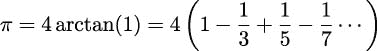
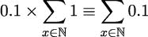
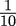
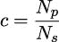
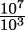
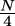
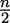

## 第八章：8

Itertools 模块

函数式编程强调无状态对象。在 Python 中，这让我们转向使用生成器表达式、生成器函数和可迭代对象，而不是大型可变集合对象。在本章中，我们将探讨`itertools`库的元素。这个库有众多函数帮助我们处理可迭代对象序列以及集合对象。

我们在第三章，函数、迭代器和生成器中介绍了迭代器函数。在本章中，我们将在此基础上进行扩展。我们在第五章，高阶函数中使用了相关函数。

`itertools`模块中有大量的迭代器函数。我们将在下一章中检查组合函数。在本章中，我们将查看以下三个广泛的迭代器函数分组：

+   与可能无限迭代器一起工作的函数。这些可以应用于任何可迭代对象或任何集合的迭代器。例如，`enumerate()`函数不需要可迭代对象中项目数量的上限。

+   与有限迭代器一起工作的函数。通常，这些函数用于创建源数据的简化。例如，将迭代器产生的项目分组可以简化源数据为具有共同键的项目组。

+   `tee()`迭代器函数可以将一个迭代器克隆成多个副本，每个副本都可以独立使用。这提供了一种克服 Python 迭代器主要限制的方法：它们只能使用一次。然而，这需要大量内存，并且通常需要重新设计。

我们需要强调我们在其他地方提到的重要限制：它们只能使用一次。

可迭代对象只能使用一次。

这可能令人惊讶，因为尝试重复使用已经完全消耗的迭代器不会引发错误异常。一旦耗尽，它们似乎没有元素，并且每次使用时都只会引发`StopIteration`异常。

迭代器还有一些不涉及如此深刻限制的特性。请注意，许多 Python 函数以及`for`语句都会使用内置的`iter()`函数从一个集合对象创建所需的迭代器数量。

迭代器的其他特性包括：

+   迭代器没有`len()`函数。

+   迭代器是可迭代子类，可以进行`next()`操作，与容器不同。我们通常会使用内置的`iter()`函数来创建一个具有`next()`操作的迭代器。

+   `for`语句通过评估内置的`iter()`函数，使得容器和其他可迭代对象之间的区别变得不可见。例如，一个容器对象，如列表，会通过产生一个迭代器来响应这个函数。一个不是集合的可迭代对象，例如生成器函数，会返回自身，因为它被设计成遵循`Iterator`协议。

这些要点将为本章提供一些必要的背景。`itertools`模块的思路是利用可迭代对象能做什么来创建简洁、表达力强的应用程序，而不需要与可迭代对象管理的细节相关的复杂开销。

### 8.1 使用无限迭代器

`itertools`模块提供了一些函数，我们可以使用这些函数来增强或丰富数据源的可迭代性。我们将查看以下三个函数：

+   `count()`: 这是`range()`函数的无限制版本。这个序列的消费者必须指定一个上限。

+   `cycle()`: 这个函数将重复一个值的循环。消费者必须决定何时产生足够多的值。

+   `repeat()`: 这个函数可以无限次地重复一个单一值。消费者必须结束重复。

我们的目标是理解如何使用这些不同的迭代器函数在生成器表达式中以及与生成器函数一起使用。

#### 8.1.1 使用`count()`进行计数

内置的`range()`函数由一个上限定义：下限和步长值是可选的。另一方面，`count()`函数有一个起始值和可选的步长，但没有上限。

这个函数可以被认为是类似内置的`enumerate()`函数的原生基础。我们可以用`zip()`和`count()`函数定义`enumerate()`函数，如下所示：

```py
>>> from itertools import count 
>>> enumerate = lambda x, start=0: zip(count(start), x)
```

`enumerate()`函数的行为就像是一个使用`count()`函数来生成与某些可迭代对象源相关值的`zip()`函数。

因此，以下两个表达式是等价的：

```py
>>> list(zip(count(), iter(’word’))) 
[(0, ’w’), (1, ’o’), (2, ’r’), (3, ’d’)] 
>>> list(enumerate(iter(’word’))) 
[(0, ’w’), (1, ’o’), (2, ’r’), (3, ’d’)]
```

这两个函数都会输出一个由二元组组成的序列。每个元组的第一个元素是一个整数计数器。第二个元素来自迭代器。在这个例子中，迭代器是由一个字符序列构建的。

下面是我们可以用`count()`函数做的一些用`enumerate()`函数难以做到的事情：

```py
>>> list(zip(count(1, 3), iter(’word’))) 
[(1, ’w’), (4, ’o’), (7, ’r’), (10, ’d’)]
```

`count(b, s)`的值是值序列 {b, b + s, b + 2s, b + 3s,...}。在这个例子中，它将提供 1, 4, 7, 10 等值作为枚举器每个值的标识符。`enumerate()`函数不提供改变步长的方法。

我们当然可以将生成器函数组合起来以实现这个结果。以下是使用`enumerate()`函数改变步长的方法：

```py
>>> source = iter(’word’) 
>>> gen3 = ((1+3*e, x) for e, x in enumerate(source)) 
>>> list(gen3) 
[(1, ’w’), (4, ’o’), (7, ’r’), (10, ’d’)]
```

这显示了如何从枚举值的源值 e 计算出一个新值 1 + 3e。这表现得像是从 1 开始的序列，每次增加 3。

#### 8.1.2 使用浮点数参数进行计数

`count()` 函数允许非整数值。我们可以使用 `count(0.5,`` 0.1)` 这样的表达式来提供浮点值。如果增量值没有精确表示，这将累积误差。通常，使用整数 `count()` 参数，如 `(0.5+x*.1`` for`` x`` in`` count())`，以确保表示错误不会累积。

这里有一种检查累积误差的方法。这种对浮点近似的探索展示了有趣的函数式编程技术。

我们将定义一个函数，该函数将评估迭代器中的项，直到满足某个条件。这是一种找到满足由函数定义的某些标准的第一项的方法。以下是如何定义一个 `find_first()` 函数的示例：

```py
from collections.abc import Callable, Iterator 
from typing import TypeVar 
T = TypeVar("T") 

def find_first( 
    terminate: Callable[[T], bool], 
    iterator: Iterator[T] 
) -> T: 
    i = next(iterator) 
    if terminate(i): 
        return i 
    return find_first(terminate, iterator)
```

这个函数首先从迭代器对象中获取下一个值。没有提供特定类型；类型变量 `T` 告诉 mypy 源迭代器和目标结果将是相同类型的。如果选定的项通过了测试，即这是期望的值，迭代将停止，返回值将是与类型变量 `T` 关联的给定类型。否则，我们将递归地评估这个函数以寻找通过测试的后续值。

因为尾调用递归没有被替换为优化的 `for` 语句，所以这限制在大约 1,000 个项的迭代器上。

如果我们有一个由生成器计算的一系列值，这将消耗迭代器中的项。以下是一个愚蠢的例子。假设我们有一个近似值，它是一系列值的和。一个例子是：



这个序列的项可以通过如下生成器函数创建：

```py

>>> def term_iter(): 
...     d = 1 
...     sgn = 1 
...     while True: 
...         yield Fraction(sgn, d) 
...         d += 2 
...         sgn = -1 if sgn == 1 else 1
```

这将产生类似 `Fraction(1,`` 1)`，`Fraction(-1,`` 3)`，`Fraction(1,`` 5)`，和 `Fraction(-1,`` 7)` 这样的值。它将产生无限多个这样的值。我们想要直到第一个满足某些标准的值。例如，我们可能想知道第一个将小于  的值（这用铅笔和纸很容易计算出结果）：

```py

>>> find_first(lambda v: abs(v) < 1E-2, term_iter()) 
Fraction(1, 101)
```

我们的目标是将使用浮点值计数与使用整数值计数进行比较，然后应用缩放因子。我们想要定义一个同时包含这两个序列对的源。作为对这个概念的一个介绍，我们将查看从两个并行源生成对。然后我们将回到上面的计算。

在以下示例中，`source` 对象是纯浮点值和整型到浮点值对的生成器：

```py
from itertools import count 
from collections.abc import Iterator 
from typing import NamedTuple, TypeAlias 

Pair = NamedTuple(’Pair’, [(’flt_count’, float), (’int_count’, float)]) 
Pair_Gen: TypeAlias = Iterator[Pair] 

source: Pair_Gen = ( 
  Pair(fc, ic) for fc, ic in 
  zip(count(0, 0.1), (.1*c for c in count())) 
) 

def not_equal(pair: Pair) -> bool: 
  return abs(pair.flt_count - pair.int_count) > 1.0E-12
```

`Pair` 元组将包含两个浮点值：一个是通过求和浮点值生成的，另一个是通过计数整数并乘以一个浮点缩放因子生成的。

生成器 `source` 在赋值语句中提供了一个类型提示，以表明它遍历对。

当我们评估`find_first(not_equal,` `source)`方法时，我们会反复比较十进制值的浮点近似，直到它们不同。一个是 0.1 值的总和：0.1 × ∑ [x∈ℕ]1\. 另一个是整数值的总和，乘以 0.1：∑ [x∈ℕ]0.1\. 作为抽象的数学定义，它们之间没有区别。

我们可以将其形式化为以下内容：



然而，当我们对抽象数字进行具体近似时，这两个值将会有所不同。结果如下：

```py
>>> find_first(not_equal, source)
Pair(flt_count=92.799999999999, int_count=92.80000000000001)

```

经过大约 928 次迭代后，错误位的总和累积到 10^(−12)。这两个值都没有确切的二进制表示。

`find_first()`函数示例接近 Python 的递归限制。我们需要重写该函数以使用尾调用优化来定位具有更大累积错误值的示例。

我们将此作为练习留给读者。

最小可检测的差异可以计算如下：

```py
>>> source: Pair_Gen = map(Pair, count(0, 0.1), (.1*c for c in count())) 

>>> find_first(lambda pair: pair.flt_count != pair.int_count, source) 
Pair(flt_count=0.6, int_count=0.6000000000000001)
```

这使用了一个简单的相等检查而不是错误范围。经过六步后，`count(0,` `0.1)`方法累积了一个微小但可测量的错误 10^(−16)。虽然很小，但这些错误值可能会累积并变得更重要和明显，尤其是在更长的计算中。当查看如何将表示为二进制值时，需要无限二进制展开。这被截断到大约 10^(−16) ≈ 2^(−53)的概念值。神奇的数字 53 是 IEEE 标准 64 位浮点值中可用的位数。

这就是为什么我们通常用普通整数计数，并应用权重来计算浮点值。

#### 8.1.3 使用 cycle() 重复周期

`cycle()`函数重复一系列值。这可以在通过在数据集标识符之间循环来划分数据子集时使用。

我们可以想象用它来解决愚蠢的 fizz-buzz 问题。访问[`rosettacode.org/wiki/FizzBuzz`](http://rosettacode.org/wiki/FizzBuzz)获取一个相当简单编程问题的综合解决方案集。还可以查看[`projecteuler.net/problem=1`](https://projecteuler.net/problem=1)了解这个主题的一个有趣变化。

我们可以使用`cycle()`函数来发出`True`和`False`值的序列，如下所示：

```py
>>> from itertools import cycle 

>>> m3 = (i == 0 for i in cycle(range(3))) 
>>> m5 = (i == 0 for i in cycle(range(5)))
```

这两个生成器表达式可以产生具有模式`[True, False, False, True, False, False, ...]`或`[True, False, False, False, False, True, False, False, False, False, False, ...]`的无限序列。这些是迭代器，只能消费一次。它们倾向于保持其内部状态。如果我们不精确消费 15 个值，即它们周期的最小公倍数，下一次我们消费值时，它们将处于一个意外的中间状态。

如果我们将有限集合的数字和这两个导出值一起压缩，我们将得到一个包含数字、三个真-假条件乘数和一个五个真-假条件乘数的三个元组集合。引入一个有限的迭代器来创建数据生成量的适当上限是很重要的。以下是一系列值及其乘数条件：

```py
>>> multipliers = zip(range(10), m3, m5)
```

这是一个生成器；我们可以使用 `list(multipliers)` 来查看结果对象。它看起来像这样：

```py
>>> list(multipliers)
[(0, True, True), (1, False, False), (2, False, False), ..., (9, True,
False)]

```

现在，我们可以分解三元组，并使用过滤器来传递是倍数的数字，拒绝所有其他数字：

```py
>>> multipliers = zip(range(10), m3, m5) 
>>> total = sum(i 
...     for i, *multipliers in multipliers 
...     if any(multipliers) 
... )
```

`for` 子句将每个三元组分解为两部分：值 `i` 和标志 `multipliers`。如果任何一个乘数是真实的，则值会被传递；否则，它会被拒绝。

`cycle()` 函数在探索性数据分析中还有另一个更有价值的用途。

##### 使用 cycle() 进行数据抽样

我们经常需要处理大量数据集的样本。清洗和模型创建的初始阶段最好用小数据集开发，并用越来越大的一组数据集进行测试。我们可以使用 `cycle()` 函数从更大的数据集中公平地选择行。这与随机选择并信任随机数生成器的公平性是不同的。因为这种方法是可重复的，并且不依赖于随机数生成器，所以它可以应用于由多台计算机处理的大型数据集。

给定一个种群大小，N[p]，和所需的样本大小，N[s]，这是将产生适当子集的周期大小，c：



我们将假设数据可以用像 `csv` 模块这样的通用库解析。这导致了一种创建子集的优雅方法。给定 `cycle_size` 的值和两个打开的文件，`source_file` 和 `target_file`，我们可以使用以下函数定义来创建子集：

```py
from collections.abc import Iterable, Iterator 
from itertools import cycle 
from typing import TypeVar 
DT = TypeVar("DT") 

def subset_iter( 
         source: Iterable[DT], cycle_size: int 
) -> Iterator[DT]: 
    chooser = (x == 0 for x in cycle(range(cycle_size))) 
    yield from ( 
        row 
        for keep, row in zip(chooser, source) 
        if keep 
    )
```

`subset_iter()` 函数使用基于选择因子 `cycle_size` 的 `cycle()` 函数。例如，我们可能有一个一千万条记录的种群；一个 1000 条记录的子集将通过将 `cycle_size` 设置为 c =  = 10,000 来构建。我们会保留每万条记录中的一条。

`subset_iter()` 函数可以被一个从源文件读取并写入目标文件的子集的函数使用。这种处理是以下函数定义的一部分：

```py
import csv 
from pathlib import Path 

def csv_subset( 
        source: Path, target: Path, cycle_size: int = 3 
) -> None: 
    with ( 
            source.open() as source_file, 
            target.open(’w’, newline=’’) as target_file 
    ): 
        rdr = csv.reader(source_file, delimiter=’\t’) 
        wtr = csv.writer(target_file) 
        wtr.writerows(subset_iter(rdr, cycle_size))
```

我们可以使用这个生成器函数通过 `cycle()` 函数和从 `csv` 读取器可用的源数据来过滤数据。由于选择表达式和用于写入行的表达式都不是严格的，这种处理几乎没有内存开销。

我们也可以将这种方法重写为使用 `compress()`、`filter()` 和 `islice()` 函数，正如我们将在本章后面看到的。

这种设计也可以用来将任何非标准的 CSV-like 格式重新格式化为标准化的 CSV 格式。只要我们定义一个解析函数，该函数返回一致定义的字符串元组，并编写将元组写入目标文件的消费者函数，我们就可以用相对简短、清晰的脚本进行大量的清洗和过滤。

#### 8.1.4 使用 repeat() 重复单一值

`repeat()` 函数看起来像是一个奇特的功能：它反复返回一个单一值。当需要单一值时，它可以作为 `cycle()` 函数的替代。

使用这个表达式可以表达选择所有数据与选择数据子集之间的差异。表达式 `(x==0 for x in cycle(range(size)))` 会发出 `[True, False, False, ...]` 的模式，适合用于选择子集。函数 `(x==0 for x in repeat(0))` 会发出 `[True, True, True, ...]` 的模式，适合选择所有数据。

我们可以思考以下类型的命令：

```py
from itertools import cycle, repeat 

def subset_rule_iter( 
        source: Iterable[DT], rule: Iterator[bool] 
) -> Iterator[DT]: 
    return ( 
        v 
        for v, keep in zip(source, rule) 
        if keep 
    ) 

all_rows = lambda: repeat(True) 
subset = lambda n: (i == 0 for i in cycle(range(n)))
```

这允许我们通过单次参数更改来选择所有数据或选择数据子集。我们还可以使用 `cycle([True])` 而不是 `repeat(True)`；结果相同。

这种模式可以扩展到随机化选择的子集。以下技术增加了一种额外的选择方式：

```py
import random 

def randomized(limit: int) -> Iterator[bool]: 
    while True: 
        yield random.randrange(limit) == 0
```

`randomized()` 函数在给定范围内生成一个可能无限长的随机数序列。这符合 `cycle()` 和 `repeat()` 的模式。

这允许代码如下：

```py
>>> import random 
>>> random.seed(42) 
>>> data = [random.randint(1, 12) for _ in range(12)] 
>>> data 
[11, 2, 1, 12, 5, 4, 4, 3, 12, 2, 11, 12] 

>>> list(subset_rule_iter(data, all_rows())) 
[11, 2, 1, 12, 5, 4, 4, 3, 12, 2, 11, 12] 
>>> list(subset_rule_iter(data, subset(3))) 
[11, 12, 4, 2] 

>>> random.seed(42) 
>>> list(subset_rule_iter(data, randomized(3))) 
[2, 1, 4, 4, 3, 2]
```

这为我们提供了使用各种技术选择子集的能力。在 `all()`、`subset()` 和 `randomized()` 等可用函数之间进行的小幅改动，让我们能够以简洁和表达清晰的方式改变我们的采样方法。

### 8.2 使用有限迭代器

`itertools` 模块提供了一些函数，我们可以使用这些函数来生成有限值的序列。我们将在这个模块中查看 10 个函数，以及一些相关的内置函数：

+   `enumerate()`: 这个函数实际上是 `__builtins__` 包的一部分，但它与迭代器一起工作，并且与 `itertools` 模块中的函数非常相似。

+   `accumulate()`: 这个函数返回输入可迭代对象的序列化简。它是一个高阶函数，可以进行各种巧妙的计算。

+   `chain()`: 这个函数将多个可迭代对象按顺序组合。

+   `groupby()`: 这个函数使用一个函数将单个可迭代对象分解成一系列的可迭代对象，这些对象覆盖输入数据的子集。

+   `zip_longest()`: 这个函数将多个可迭代对象中的元素组合起来。内置的 `zip()` 函数会在最短的可迭代对象长度处截断序列。`zip_longest()` 函数会用给定的填充值填充较短的序列。

+   `compress()`: 这个函数根据第二个布尔值并行可迭代的值过滤一个可迭代对象。

+   `islice()`: 当应用于可迭代对象时，这个函数等同于序列的切片。

+   `dropwhile()`和`takewhile()`：这两个函数都使用一个布尔函数来过滤可迭代对象中的项。与`filter()`或`filterfalse()`不同，这些函数依赖于单个`True`或`False`值来改变它们对所有后续值的过滤行为。

+   `filterfalse()`：这个函数将一个过滤函数应用于可迭代对象。这补充了内置的`filter()`函数。

+   `starmap()`：这个函数将一个函数映射到一个元组可迭代的序列，将每个可迭代序列作为给定函数的`*args`参数。`map()`函数以类似的方式使用多个并行可迭代序列。

我们将从可能被视为用于对`Iterator`中的项目进行分组或排列的函数开始。之后，我们将查看更适合过滤和映射项目的函数。

#### 8.2.1 使用 enumerate()分配数字

在第四章的使用 enumerate()包含序列号部分，我们在处理集合中使用了`enumerate()`函数对排序数据进行原始的排名分配。我们可以执行如下操作：将一个值与其在原始序列中的位置配对。

```py
>>> raw_values = [1.2, .8, 1.2, 2.3, 11, 18] 

>>> tuple(enumerate(sorted(raw_values))) 
((0, 0.8), (1, 1.2), (2, 1.2), (3, 2.3), (4, 11), (5, 18))
```

这将按顺序对`raw_values`中的项目进行排序，创建包含递增数字序列的二重元组，并具体化一个我们可以用于进一步计算的对象。

在第七章的复杂无状态对象中，我们实现了一种`enumerate()`函数的替代形式，即`rank()`函数，它以更统计上有用的方式处理平局。

对数据行进行枚举是添加到解析器中记录源数据行号的常见功能。在许多情况下，我们将创建某种`row_iter()`函数从源文件中提取字符串值。这可能遍历 XML 文件的标签中的字符串值或 CSV 文件的列中的字符串值。在某些情况下，我们甚至可能解析使用 Beautiful Soup 解析的 HTML 文件中的数据。

在第四章的处理集合中，我们解析了一个 XML 文件以创建一个简单的位置元组序列。然后我们创建了带有起始点、终点和距离的腿。然而，我们没有分配一个明确的腿号。如果我们对行程集合进行排序，我们将无法确定腿的原始顺序。

在第七章的复杂无状态对象中，我们扩展了基本解析器，为旅行的每一腿创建了命名元组。这个增强解析器的输出如下所示：

```py
>>> from textwrap import wrap 
>>> from pprint import pprint 

>>> trip[0] 
LegNT(start=PointNT(latitude=37.54901619777347, longitude=-76.33029518659048), ... 

>>> pprint(wrap(str(trip[0]))) 
[’LegNT(start=PointNT(latitude=37.54901619777347,’, 
 ’longitude=-76.33029518659048), end=PointNT(latitude=37.840832,’, 
 ’longitude=-76.273834), distance=17.7246)’] 
>>> pprint(wrap(str(trip[-1]))) 
[’LegNT(start=PointNT(latitude=38.330166, longitude=-76.458504),’, 
 ’end=PointNT(latitude=38.976334, longitude=-76.473503),’, 
 ’distance=38.8019)’]
```

`trip[0]`的值相当宽，对于这本书来说太宽了。为了保持输出形式适合这本书的页面，我们已将值的字符串表示形式包装起来，并使用`pprint`来显示单独的行。第一个`Leg`对象是在切萨皮克湾两点之间的一段短途旅行。

我们可以添加一个函数，该函数将构建一个更复杂的元组，其中输入顺序信息作为元组的一部分。首先，我们将定义 `Leg` 类的一个稍微复杂一些的版本：

```py
from typing import NamedTuple 

class Point(NamedTuple): 
    latitude: float 
    longitude: float 

class Leg(NamedTuple): 
    order: int 
    start: Point 
    end: Point 
    distance: float
```

`Leg` 的定义与 第七章 中展示的变体类似，复杂无状态对象，特别是 `LegNT` 的定义。我们将定义一个函数，该函数分解成对并创建 `Leg` 实例，如下所示：

```py
from typing import Iterator 
from Chapter04.ch04_ex1 import haversine 

def numbered_leg_iter( 
    pair_iter: Iterator[tuple[Point, Point]] 
) -> Iterator[Leg]: 
    for order, pair in enumerate(pair_iter): 
        start, end = pair 
        yield Leg( 
            order, 
            start, 
            end, 
            round(haversine(start, end), 4) 
        )
```

我们可以使用此函数来枚举每个起点和终点对。我们将分解这对，然后重新组装 `order`、`start` 和 `end` 参数以及 `haversine(start,end)` 参数的值作为一个单一的 `Leg` 实例。这个生成器函数将与成对的迭代序列一起工作。

在前面的解释背景下，它被如下使用：

```py
>>> from Chapter06.ch06_ex3 import row_iter_kml 
>>> from Chapter04.ch04_ex1 import legs, haversine 
>>> import urllib.request 

>>> source_url = "file:./Winter%202012-2013.kml" 
>>> with urllib.request.urlopen(source_url) as source: 
...     path_iter = float_lat_lon(row_iter_kml(source)) 
...     pair_iter = legs(path_iter) 
...     trip_iter = numbered_leg_iter(pair_iter) 
...     trip = list(trip_iter)
```

我们已将原始文件解析为路径点，创建了起点-终点对，然后创建了一个由单个 `Leg` 对象组成的行程。`enumerate()` 函数确保可迭代序列中的每个项目都被赋予一个唯一的数字，该数字从默认的起始值 0 开始递增。`enumerate()` 函数的第二个参数值可以提供不同的起始值。

#### 8.2.2 使用 accumulate() 计算累计总和

`accumulate()` 函数将给定的函数折叠到可迭代对象中，累积一系列的减少。这将遍历另一个迭代器的累计总和；默认函数是 `operator.add()`。我们可以提供替代函数来改变从总和到乘积的基本行为。Python 库文档显示了一个特别巧妙的使用 `max()` 函数来创建迄今为止的最大值序列。

累计总和的一个应用是四分位数数据。四分位数是许多位置度量之一。一般方法是乘以样本值乘以一个缩放因子，将其转换为四分位数。如果值范围从 0 ≤ v[i] < N，我们可以通过 ⌈⌉ 缩放，将任何值 v[i] 转换为 0 到 3 范围内的值，这些值映射到不同的四分位数。`math.ceil()` 函数用于将缩放分数向上舍入到下一个更高的整数。这将确保没有缩放值会产生缩放结果为 4，这是不可能的第五个四分位数。

如果 v[i] 的最小值不为零，我们需要在乘以缩放因子之前从每个值中减去这个值。

在 使用 enumerate() 分配数字 部分，我们介绍了一系列经纬度坐标，描述了航程上的连续腿。我们可以使用距离作为航点的四分位数的基础。这允许我们确定旅途中的中点。

有关 `trip` 变量的值，请参阅上一节。该值是一个 `Leg` 实例的序列。每个 `Leg` 对象都有一个起点、一个终点和一个距离。四分位数的计算如下代码所示：

```py
>>> from itertools import accumulate 
>>> import math 

>>> distances = (leg.distance for leg in trip) 
>>> distance_accum = list(accumulate(distances)) 
>>> scale = math.ceil(distance_accum[-1] / 4) 

>>> quartiles = list(int(scale*d) for d in distance_accum)
```

我们提取了距离值并计算了每条腿的累积距离。累积距离的最后一个值是总和。`quartiles`变量的值如下：

```py
[0, 0, 0, 0, 0, 0, 0, 0, 0, 0, 0, 0, 0, 0, 0, 0, 0, 0, 0, 0, 0, 0, 0, 
1, 1, 1, 1, 1, 1, 1, 1, 1, 1, 1, 1, 1, 1, 
2, 2, 2, 2, 2, 2, 2, 2, 2, 2, 2, 2, 2, 2, 2, 2, 2, 2, 2, 
3, 3, 3, 3, 3, 3, 3, 3, 3, 3, 3, 3, 3, 3, 3, 3, 3]
```

我们可以使用`zip()`函数将这个四分位数序列与原始数据点合并。我们还可以使用`groupby()`等函数来创建每个四分位数的腿的独立集合。

#### 8.2.3 使用`chain()`函数组合迭代器

可以通过`chain()`函数将一系列迭代器统一成一个单一的值序列。这有助于将通过`groupby()`函数分解的数据合并。我们可以使用它来处理多个集合，就像它们是一个单一的集合一样。

Python 的`contextlib`提供了一个巧妙的类`ExitStack()`，可以在`with`语句的末尾执行多个操作。这允许应用程序创建任意数量的子上下文，所有这些上下文都将正确评估`__enter__()`和`__exit__()`。这在我们需要打开不定数量的文件时特别有用。

在这个例子中，我们可以将`itertools.chain()`函数与`contextlib.ExitStack`对象结合使用，以处理并正确关闭一组文件。此外，所有这些文件的数据将作为一个单独的可迭代值序列进行处理。我们不需要在每个单独的文件操作中包裹`with`语句，而是可以将所有操作包裹在一个单一的`with`上下文中。

我们可以像这样为多个文件创建一个单一的上下文：

```py
import csv 
from collections.abc import Iterator 
from contextlib import ExitStack 
from pathlib import Path 
from typing import TextIO 

def row_iter_csv_tab(*filepaths: Path) -> Iterator[list[str]]: 
    with ExitStack() as stack: 
        files: list[TextIO] = [ 
            stack.enter_context(path.open()) 
            for path in filepaths 
        ] 
        readers = map( 
            lambda f: csv.reader(f, delimiter=’\t’), 
            files) 
        yield from chain(*readers)
```

我们创建了一个可以包含多个打开的独立上下文的`ExitStack`对象。当`with`语句结束时，`ExitStack`对象中的所有项目都将被正确关闭。在上面的函数中，一系列打开的文件对象被分配给`files`变量。`stack.enter_context()`方法将这些对象进入`ExitStack`对象以进行适当的关闭。

给定`files`变量中的文件序列，我们在`readers`变量中创建了一个 CSV 读取器的序列。在这种情况下，我们的所有文件都有共同的制表符分隔格式，这使得我们可以通过简单一致地对文件序列应用函数来愉快地打开它们。

最后，我们使用`chain(*readers)`将所有读取器链接到一个单一的迭代器中。这被用来产生来自所有文件的行序列。

重要的是要注意，我们不能返回`chain(*readers)`对象。如果我们这样做，这将退出`with`语句上下文，关闭所有源文件。相反，我们必须从生成器中产生单个行，以便`with`语句上下文保持活跃，直到所有行都被消耗。

#### 8.2.4 使用`groupby()`对迭代器进行分区

我们可以使用`groupby()`函数将迭代器划分为更小的迭代器。这是通过评估给定可迭代对象中每个项目的给定`key`函数来实现的。如果键值与上一个项目的键匹配，则这两个项目是同一划分的一部分。如果键不匹配上一个项目的键，则上一个划分结束，并开始一个新的划分。因为匹配是在可迭代对象的相邻项上进行的，所以值必须按键排序。

`groupby()`函数的输出是一个二元组的序列。每个元组包含组的键值和一个包含组中项目的可迭代器，类似于`[(key, iter(group)), (key, iter(group)), ...]`。然后可以处理每个组的迭代器以创建一个具体化的集合，或者可能将其缩减为某些汇总值。

在本章前面的使用 accumulate()计算累计总和部分，我们展示了如何计算输入序列的四分位数。我们将扩展这一点，根据距离四分位数创建组。每个组将是一个迭代器，包含适合距离范围的腿。

给定包含原始数据的`trip`变量和包含四分位数分配的`quartile`变量，我们可以使用以下命令来分组数据：

```py
>>> from itertools import groupby 
>>> from Chapter07.ch07_ex1 import get_trip 

>>> source_url = "file:./Winter%202012-2013.kml" 
>>> trip = get_trip(source_url) 
>>> quartile = quartiles(trip) 
>>> group_iter = groupby(zip(quartile, trip), key=lambda q_raw: q_raw[0]) 
>>> for group_key, group_iter in group_iter: 
...    print(f"Group {group_key+1}: {len(list(group_iter))} legs") 
Group 1: 23 legs 
Group 2: 14 legs 
Group 3: 19 legs 
Group 4: 17 legs
```

这将首先将四分位数与原始行程数据配对，创建一个包含四分位数和腿的二元组的迭代器。`groupby()`函数将使用给定的 lambda 对象按四分位数`q_raw[0]`对每个`q_raw`元组进行分组。我们使用`for`语句来检查`groupby()`函数的结果。这显示了如何获取组键值和每个单独组的成员迭代器。

`groupby()`函数的输入必须按键值排序。这将确保组内的所有项目都将相邻。对于非常大的数据集，这可能会迫使我们使用操作系统的排序，在文件太大而无法装入内存的罕见情况下。

注意，我们还可以使用`defaultdict(list)`对象来创建组。这避免了排序步骤，但可以构建一个大型、内存中的列表字典。函数可以定义为以下内容：

```py
from collections import defaultdict 
from collections.abc import Iterable, Callable, Hashable 

DT = TypeVar("DT") 
KT = TypeVar("KT", bound=Hashable) 

def groupby_2( 
    iterable: Iterable[DT], 
    key: Callable[[DT], KT] 
) -> Iterator[tuple[KT, Iterator[DT]]]: 
    groups: dict[KT, list[DT]] = defaultdict(list) 
    for item in iterable: 
        groups[key(item)].append(item) 
    for g in groups: 
        yield g, iter(groups[g])
```

我们创建了一个`defaultdict`对象，它将使用`list()`作为与每个新键关联的默认值。类型提示明确了`key`函数（它发出与类型变量`KT`相关的一些任意类型的对象）与字典之间的关系，该字典使用相同的类型`KT`作为键。

每个项目都将应用给定的`key()`函数以创建键值。项目将附加到具有给定键的`defaultdict`对象中的列表。

一旦所有项目都被分区，我们就可以返回每个分区作为共享公共键的项目的迭代器。这将保留所有原始值在内存中，并为每个唯一的键值引入一个字典和一个列表。对于非常大的数据集，这可能需要比处理器上可用的更多内存。

类型提示明确指出源是某种任意类型，与变量 `DT` 关联。结果将是一个包含类型为 `DT` 的迭代器的迭代器。这强烈表明没有发生转换：范围类型与输入域类型匹配。

#### 8.2.5 使用 zip_longest() 和 zip() 合并可迭代对象

我们在 第四章，处理集合 中看到了 `zip()` 函数。`zip_longest()` 函数与 `zip()` 函数在重要方面有所不同：而 `zip()` 函数在最短可迭代对象结束时停止，`zip_longest()` 函数使用给定值填充短可迭代对象，并在最长可迭代对象结束时停止。

`fillvalue=` 关键字参数允许使用除默认值 `None` 之外的其他值进行填充。

对于大多数探索性数据分析应用，使用默认值进行填充在统计学上很难证明其合理性。Python 标准库文档包括使用 `zip_longest()` 函数可以完成的 `grouper` 菜谱。在不远离我们数据分析重点的情况下很难进一步扩展这一点。

#### 8.2.6 使用 pairwise() 创建成对元素

`pairwise()` 函数消耗一个源迭代器，以对的形式发出项目。请参阅 第四章，处理集合 中的 `legs()` 函数，以了解从源可迭代对象创建对的一个示例。

下面是一个将字符序列转换为相邻字符对的简单示例：

```py
>>> from itertools import pairwise 

>>> text = "hello world" 
>>> list(pairwise(text)) 
[(’h’, ’e’), (’e’, ’l’), (’l’, ’l’), ...]
```

这种分析定位字母对，称为“二元组”或“二分图”。在尝试理解简单的字母替换密码时，这可能很有帮助。编码文本中二元组的频率可以暗示可能的解密方法。

在 Python 3.10 中，此函数从菜谱变为正确的 `itertools` 函数。

#### 8.2.7 使用 compress() 过滤

内置的 `filter()` 函数使用谓词来确定一个项目是否通过或被拒绝。我们不仅可以使用一个计算值的函数，还可以使用第二个并行可迭代对象来确定哪些项目通过，哪些被拒绝。

在本章的 使用 cycle() 重新迭代循环 部分，我们探讨了使用简单的生成器表达式进行数据选择。其本质如下：

```py
from typing import TypeVar 

DataT = TypeVar("DataT") 

def subset_gen( 
        data: Iterable[DataT], rule: Iterable[bool] 
) -> Iterator[DataT]: 
    return ( 
        v 
        for v, keep in zip(data, rule) 
        if keep 
    )
```

规则可迭代对象的每个值都必须是布尔值。为了选择所有项目，它可以重复 `True` 值。为了选择一个固定的子集，它可以循环一个 `True` 值后跟几个 `False` 值的副本。为了选择四分之一的项目，我们可以使用 `cycle([True] + 3*[False])`。

列表推导式可以修改为`compress(some_source, selectors)`，使用一个函数作为`selectors`参数值。如果我们做出这个改变，处理过程将简化：

```py
>>> import random 
>>> random.seed(1) 
>>> data = [random.randint(1, 12) for _ in range(12)] 

>>> from itertools import compress 

>>> copy = compress(data, all_rows()) 
>>> list(copy) 
[3, 10, 2, 5, 2, 8, 8, 8, 11, 7, 4, 2] 

>>> cycle_subset = compress(data, subset(3)) 
>>> list(cycle_subset) 
[3, 5, 8, 7] 

>>> random.seed(1) 
>>> random_subset = compress(data, randomized(3)) 
>>> list(random_subset) 
[3, 2, 2, 4, 2]
```

这些示例依赖于之前展示的替代选择规则`all_rows()`、`subset()`和`randomized()`。`subset()`和`randomized()`函数必须使用适当的参数定义，参数值为 c 来从源中选择行。`selectors`表达式必须基于某个选择规则函数构建一个包含`True`和`False`值的可迭代对象。要保留的行是通过将`source`可迭代对象应用于行选择可迭代对象来选择的。

由于所有这些都是在惰性评估中完成的，所以只有在需要时才会从源中读取行。这使我们能够高效地处理非常大的数据集。此外，Python 代码的相对简单性意味着我们实际上不需要复杂的配置文件和相关解析器来在选择规则之间做出选择。我们有选择使用这段 Python 代码作为更大数据采样应用程序配置的选项。

我们可以将`filter()`函数想象成具有以下定义：

```py
from itertools import compress, tee 
from collections.abc import Iterable, Iterator, Callable 
from typing import TypeVar 

SrcT = TypeVar("SrcT") 

def filter_concept( 
        function: Callable[[SrcT], bool], 
        source: Iterable[SrcT] 
) -> Iterator[SrcT]: 
    i1, i2 = tee(source, 2) 
    return compress(i1, map(function, i2))
```

我们使用`tee()`函数克隆了可迭代对象。我们稍后会详细探讨这个函数。`map()`函数将生成应用过滤器谓词函数`function()`到可迭代对象中的每个值的结果，产生一系列`True`和`False`值。这个布尔值序列用于压缩原始序列，只传递与`True`关联的项目。这从`compress()`函数构建了`filter()`函数的特征。

函数的提示可以扩展到`Callable[[SrcT], Any]`。这是因为`compress()`函数将利用返回值的真值或假值。强调这些值将被理解为布尔值似乎是有帮助的，因此在使用类型提示时使用了`bool`而不是`Any`。

#### 8.2.8 使用 islice()选择子集

在第四章，处理集合中，我们探讨了切片符号来从集合中选择子集。我们的例子是将从列表对象中切片的项目配对。以下是一个简单的列表：

```py
>>> from Chapter04.ch04_ex5 import parse_g 

>>> with open("1000.txt") as source: 
...    flat = list(parse_g(source)) 

>>> flat[:10] 
[2, 3, 5, 7, 11, 13, 17, 19, 23, 29] 

>>> flat[-10:] 
[7841, 7853, 7867, 7873, 7877, 7879, 7883, 7901, 7907, 7919]
```

我们可以使用以下方式使用列表切片创建对：

```py
>>> list(zip(flat[0::2], flat[1::2])) 
[(2, 3), (5, 7), (11, 13), ...]
```

`islice()`函数提供了类似的功能，但没有创建列表对象的开销。这将与任何大小的可迭代对象一起工作。`islice()`函数接受一个`Iterable`源，以及定义切片的三个参数：起始、停止和步长值。这意味着`islice(source, 1, None, 2)`类似于`source[1::2]`。与使用`:`的类似切片简写不同，可选参数值被使用；规则与内置的`range()`函数匹配。重要的区别是`source[1::2]`仅适用于列表或元组等`Sequence`对象。`islice(source, 1, None, 2)`函数适用于任何可迭代对象，包括迭代器对象或生成器表达式。

以下示例将使用`islice()`函数创建可迭代对象的值对：

```py
>>> flat_iter_1 = iter(flat)
>>> flat_iter_2 = iter(flat)
>>> pairs = list(zip(
... islice(flat_iter_1, 0, None, 2),
... islice(flat_iter_2, 1, None, 2)
... ))
>>> len(pairs)
500
>>> pairs[:3]
[(2, 3), (5, 7), (11, 13)]
>>> pairs[-3:]
[(7877, 7879), (7883, 7901), (7907, 7919)]

```

我们在`flat`变量上创建了两个独立的数据点集合的迭代器。这些可以是打开的文件或数据库结果集上的两个独立的迭代器。这两个迭代器需要是独立的，以确保一个`islice()`源的变化不会干扰另一个`islice()`源。

这将生成从原始序列中得到的二元组序列：

```py
[(2, 3), (5, 7), (11, 13), (17, 19), (23, 29), 
... 
(7883, 7901), (7907, 7919)]
```

由于`islice()`与可迭代对象一起工作，这种设计可以与极其大量的数据集一起工作。我们可以使用它从更大的数据集中选择子集。除了使用`filter()`或`compress()`函数外，我们还可以使用`islice(source, 0, None, c)`方法从更大的数据集中选择-大小的子集。

#### 8.2.9 使用 dropwhile()和 takewhile()进行状态性过滤

`dropwhile()`和`takewhile()`函数是状态性过滤器函数。它们从一个模式开始；给定的谓词函数是一种翻转开关，用于切换模式。`dropwhile()`函数从拒绝模式开始；当函数变为`False`时，它切换到传递模式。`takewhile()`函数从传递模式开始；当给定的函数变为`False`时，它切换到拒绝模式。由于这些是过滤器，它们将消耗整个可迭代参数值。

我们可以使用这些方法跳过输入文件中的标题或页脚行。我们使用`dropwhile()`函数来拒绝标题行并传递剩余的数据。我们使用`takewhile()`函数来传递数据并拒绝页脚行。我们将回到第三章中展示的简单 GPL 文件格式 Chapter 3，函数、迭代器和生成器。文件有一个如下所示的标题：

```py
GIMP Palette 
Name: Crayola 
Columns: 16 
#
```

接下来是类似以下示例数据的行：

```py
255 73 108 Radical Red
```

注意，RGB 颜色三元组和颜色名称之间有一个不可见的制表符字符，`\t`。为了使其更明显，我们可以将示例排版如下：

```py
255 73 108\tRadical Red
```

这种微妙的排版技术似乎有点误导，因为在大多数编程编辑器中看起来并不像这样。

我们可以使用基于 `dropwhile()` 函数的解析器来定位标题的最后一行（即 # 行），如下所示：

```py
>>> import csv 
>>> from pathlib import Path 

>>> source_path = Path("crayola.gpl") 
>>> with source_path.open() as source: 
...     rdr = csv.reader(source, delimiter=’\\t’) 
...     row_iter = dropwhile( 
...         lambda row: row[0] != ’#’, rdr 
...     ) 
...     color_rows = islice(row_iter, 1, None) 
...     colors = list( 
...         (color.split(), name) for color, name in color_rows 
...     )
```

我们创建了一个 CSV 读取器来根据制表符字符解析行。这将整洁地将 `color` 三元组与名称分开。三元组需要进一步解析。这将生成一个以 `#` 行开始并继续文件其余部分的迭代器。

我们可以使用 `islice()` 函数丢弃可迭代对象中的第一个元素。`islice(rows, 1, None)` 表达式类似于请求 `rows[1:]` 切片：第一个元素被悄悄丢弃。一旦丢弃了最后一行标题行，我们就可以解析颜色三元组并返回更有用的颜色对象。

对于这个特定的文件，我们还可以使用 CSV `reader()` 函数找到的列数。标题行只有一个列，允许使用 `dropwhile(lambda row: len(row) == 1, rdr)` 表达式来丢弃标题行。这通常不是一个好的方法，因为定位标题的最后一行通常比尝试定义一些可以区分所有标题（或尾注）行与有意义文件内容的通用模式要容易得多。在这种情况下，标题行可以通过列数来区分；这是一个罕见的情况。

#### 8.2.10 使用 filterfalse() 和 filter() 进行过滤的两种方法

在 第五章，高阶函数 中，我们探讨了内置的 `filter()` 函数。`itertools` 模块中的 `filterfalse()` 函数可以从 `filter()` 函数定义，如下所示：

```py
filterfalse_concept = ( 
    lambda pred, iterable: 
    filter(lambda x: not pred(x), iterable) 
)
```

与 `filter()` 函数一样，谓词函数可以是 `None` 值。`filter(None, iterable)` 方法的值是可迭代对象中的所有 `True` 值。`filterfalse(None, iterable)` 方法的值是可迭代对象中的所有 `False` 值：

```py
>>> from itertools import filterfalse 

>>> source = [0, False, 1, 2] 
>>> list(filter(None, source)) 
[1, 2] 

>>> filterfalse(None, source) 
<itertools.filterfalse object at ...> 
>>> list(_) 
[0, False]
```

`filterfalse()` 函数的目的是促进重用。如果我们有一个简洁的函数来做出过滤决策，我们应该能够使用该函数来分区输入，无论是传递还是拒绝组，而无需通过逻辑否定进行繁琐的操作。

理念是执行以下命令：

```py
>>> iter_1, iter_2 = tee(iter(raw_samples), 2) 

>>> rule_subset_iter = filter(rule, iter_1) 
>>> not_rule_subset_iter = filterfalse(rule, iter_2)
```

这种将处理分为两个子集的方法将包括源中的所有项。`rule()` 函数保持不变，我们无法通过不正确地否定此函数引入微妙的逻辑错误。

#### 8.2.11 通过 starmap() 和 map() 将函数应用于数据

内置的 `map()` 函数是一个高阶函数，它将函数应用于可迭代对象中的项。我们可以将 `map()` 函数的简单版本想象如下：

```py
map_concept = ( 
    lambda function, arg_iter: 
    (function(a) for a in arg_iter) 
)
```

当 `arg_iter` 参数是一个提供单个值的可迭代对象时，这效果很好。实际的 `map()` 函数比这复杂得多，也可以与多个可迭代对象一起工作。

`itertools` 模块中的 `starmap()` 函数是 `map()` 函数的 `*args` 版本。我们可以想象其定义如下：

```py
starmap_concept = ( 
    lambda function, arg_iter: 
    (function(*a) for a in arg_iter) 
             #^-- Adds this * to decompose tuples 
)
```

这反映了 `map()` 函数在语义上的微小变化，以正确处理元组可迭代结构。每个元组都被分解并应用于各种位置参数。

当我们查看行程数据时，根据前面的命令，我们可以基于 `starmap()` 函数重新定义 `Leg` 对象的构建。

我们可以使用 `starmap()` 函数来组装 `Leg` 对象，如下所示：

```py
from Chapter04.ch04_ex1 import legs, haversine 
from Chapter06.ch06_ex3 import row_iter_kml 
from Chapter07.ch07_ex1 import float_lat_lon, LegNT, PointNT 
import urllib.request 
from collections.abc import Callable 

def get_trip_starmap(url: str) -> List[LegNT]: 
    make_leg: Callable[[PointNT, PointNT], LegNT] = ( 
        lambda start, end: 
        LegNT(start, end, haversine(start, end)) 
    ) 
    with urllib.request.urlopen(url) as source: 
        path_iter = float_lat_lon( 
            row_iter_kml(source) 
        ) 
        pair_iter = legs(path_iter) 
        trip = list(starmap(make_leg, pair_iter)) 
                   #-------- Used here 
    return trip
```

当我们将这个 `get_trip_starmap()` 函数应用于读取源数据和遍历创建的 `Leg` 对象时，它看起来是这样的：

```py
>>> from pprint import pprint 
>>> source_url = "file:./Winter%202012-2013.kml" 
>>> trip = get_trip_starmap(source_url) 
>>> len(trip) 
73 
>>> pprint(trip[0]) 
LegNT(start=PointNT(latitude=37.54901619777347, longitude=-76.33029518659048), end=PointNT(latitude=37.840832, longitude=-76.273834), distance=17.724564798884984) 

>>> pprint(trip[-1]) 
LegNT(start=PointNT(latitude=38.330166, longitude=-76.458504), end=PointNT(latitude=38.976334, longitude=-76.473503), distance=38.801864781785845)
```

`make_leg()` 函数接受一对 `Point` 对象，并返回一个包含起点、终点和两点之间距离的 `Leg` 对象。来自 第四章，处理集合 的 `legs()` 函数创建反映航程一段起止的 `Point` 对象对。`legs()` 创建的这些对作为输入提供给 `make_leg()`，以创建适当的 `Leg` 对象。

`map()` 函数也可以接受多个可迭代对象。当我们使用 `map(f, iter1, iter2, ...)` 时，它表现得好像迭代器被压缩在一起，并应用了 `starmap()` 函数。

我们可以将 `map(function, iter1, iter2, iter3)` 函数视为 `starmap(function, zip(iter1, iter2, iter3))`。

`starmap(function, some_list)` 方法的优点是将可能冗长的 `(function(*args) for args in some_list)` 生成器表达式替换为避免对函数参数值应用可能被忽视的 `*` 操作符。

### 8.3 使用 tee() 克隆迭代器

`tee()` 函数为我们提供了一种绕过使用可迭代对象时的重要 Python 规则的方法。这个规则非常重要，所以我们在这里重复一遍：

迭代器只能使用一次。

`tee()` 函数允许我们克隆一个迭代器。这似乎让我们免于必须实现一个序列，以便我们可以多次遍历数据。因为 `tee()` 可能会使用很多内存，所以有时最好实现一个列表并多次处理它，而不是试图使用 `tee()` 函数的潜在简化。

例如，对于庞大的数据集，简单的平均值可以这样编写：

```py
from collections.abc import Iterable 

def mean_t(source: Iterable[float]) -> float: 
    it_0, it_1 = tee(iter(source), 2) 
    N = sum(1 for x in it_0) 
    sum_x = sum(x for x in it_1) 
    return sum_x/N
```

这样计算平均值时，看起来并没有在内存中完全实现整个数据集。注意，`float` 类型的类型提示并不排除整数。mypy 程序了解数值处理规则，这个定义提供了一种灵活的方式来指定 `int` 或 `float` 都可以工作。

### 8.4 itertools 菜谱

在 Python 库文档的 itertools 章节中，有一个名为 Itertools Recipes 的子章节，其中包含使用各种 `itertools` 函数的杰出示例。由于没有必要重新生成这些示例，我们在这里引用它们。它们应被视为 Python 函数式编程的必读内容。

更多信息，请访问 [`docs.python.org/3/library/itertools.html#itertools-recipes`](https://docs.python.org/3/library/itertools.html#itertools-recipes)。

重要的是要注意，这些不是 `itertools` 模块中的可导入函数。需要阅读和理解这些配方，然后可能复制或修改它们，才能将其包含在应用程序中。

一些配方涉及下一章中展示的一些更高级的技术；它们不在以下表中。我们保留了 Python 文档中项目的顺序，这不是按字母顺序排列的。以下表格总结了显示从 `itertools` 基础构建的函数式编程设计模式的配方：

|  |
| --- |
| 函数名称 | 参数 | 结果 |
|  |
|  |  |  |
|  |  |  |
| `take` | `(n, iterable)` | 生成可迭代对象的前 n 项作为列表。这封装了 `islice()` 的使用，并赋予了一个简单的名称。 |
| `tabulate` | `(function, start=0)` | 生成 `function(0)`，`function(1)` 等等。这是基于 `map(function, count())`。 |
| `consume` | `(iterator, n)` | 将迭代器向前推进 n 步。如果 n 为 `None`，则消耗迭代器中的所有值。 |
| `nth` | `(iterable, n, default=None)` | 仅返回第 n 项或默认值。这封装了 `islice()` 的使用，并赋予了一个简单的名称。 |
| `quantify` | `(iterable, pred=bool)` | 返回谓词为真的次数。这使用 `sum()` 和 `map()`，并依赖于布尔谓词在转换为整数值时实际上为 1 的方式。 |
| `padnone` | `(iterable)` | 生成可迭代对象的元素，然后无限期地生成 `None`。这可以创建类似于 `zip_longest()` 或 `map()` 的函数。 |
| `ncycles` | `(iterable, n)` | 生成序列元素 n 次。 |
| `dotproduct` | `(vec1, vec2)` | 点积将两个向量的值相乘，并找到结果的和。 |
| `flatten` | `(listOfLists)` | 此函数展开一层嵌套。将各种列表连接成一个单一的列表。 |
| `repeatfunc` | `(func, times=None, *args)` | 重复调用给定的函数 `func`，并使用指定的参数。 |
| `grouper` | `(iterable, n, fillvalue=None)` | 生成可迭代对象的元素，作为固定长度的块或序列。 |
| `roundrobin` | `(*iterables)` | 从每个可迭代对象中取出值。例如，`roundrobin(‘ABC’, ‘D’, ‘EF’)` 的结果是 `‘A’, ‘D’, ‘E’, ‘B’, ‘F’, ‘C’`。 |
| `partition` | `(pred,` `iterable)` | 这使用谓词将条目分为`False`条目和`True`条目。返回值是一对迭代器。 |
| `unique_everseen` | `(iterable,` `key=None)` | 产生源可迭代对象的唯一元素，保持顺序。它还记住所有曾经看到的元素。 |
| `unique_justseen` | `(iterable,` `key=None)` | 产生唯一元素，保持顺序。它只记住最近看到的元素。这在去重或对排序序列进行分组时很有用。 |
| `iter_except` | `(func,` `exception,` `first=None)` | 在引发异常时重复调用函数，直到引发异常。异常被抑制。这可以用来迭代直到`KeyError`或`IndexError`。 |
|  |
|  |  |  |
|  |  |  |
|  |  |  |
|  |  |  |
|  |  |  |

### 8.5 摘要

在本章中，我们研究了`itertools`模块中的许多函数。这个库模块帮助我们以复杂的方式处理迭代器。

我们已经研究了无限迭代器；它们会重复而不会终止。它们包括`count()`、`cycle()`和`repeat()`函数。由于它们不会终止，消费函数必须确定何时停止接受值。

我们还研究了多个有限迭代器。其中一些是内置的，还有一些是`itertools`模块的一部分。它们与源可迭代对象一起工作，因此当该可迭代对象耗尽时它们会终止。这些函数包括`enumerate()`、`accumulate()`、`chain()`、`groupby()`、`zip_longest()`、`zip()`、`pairwise()`、`compress()`、`islice()`、`dropwhile()`、`takewhile()`、`filterfalse()`、`filter()`、`starmap()`和`map()`。这些函数允许我们用看起来更简单的函数替换可能复杂的生成器表达式。

我们已经注意到像`tee()`这样的函数是可用的，并且可以创建一个有用的简化。它可能需要大量内存，需要仔细考虑。在某些情况下，将列表具体化可能比应用`tee()`函数更有效。

此外，我们还研究了文档中的配方，这些配方提供了更多我们可以研究和复制到我们自己的应用程序中的函数。配方列表显示了丰富的常见设计模式。

在第九章，组合学中的迭代器 – 排列和组合中，我们将继续研究`itertools`模块，重点关注排列和组合。这些操作可以产生大量结果。例如，从一副 52 张牌中枚举所有可能的 5 张牌手牌将产生超过 3.12 × 10⁸个排列。然而，对于小域来说，检查所有可能的排列顺序可以帮助我们了解观察到的样本与可能值的域匹配得有多好。

### 8.6 练习

本章的练习基于 Packt Publishing 在 GitHub 上提供的代码。请参阅[`github.com/PacktPublishing/Functional-Python-Programming-3rd-Edition`](https://github.com/PacktPublishing/Functional-Python-Programming-3rd-Edition)。

在某些情况下，读者会注意到 GitHub 上提供的代码包含了一些练习的部分解决方案。它们作为提示，允许读者探索其他解决方案。

在许多情况下，练习需要单元测试用例来确认它们确实解决了问题。这些通常与 GitHub 仓库中已提供的单元测试用例相同。读者应将书中的示例函数名称替换为自己的解决方案，以确认其工作正常。

#### 8.6.1 优化 find_first()函数

在使用浮点数参数计数中，我们定义了一个`find_first()`函数，用于定位通过给定测试标准的迭代器的第一个配对。在大多数示例中，测试是值之间的比较，以查看值之间的差异是否大于 10^(−12)。

`find_first()`函数的定义使用了更简单的递归。这限制了可以检查的可迭代对象的大小：在达到栈大小限制之前，只能消耗大约 1,000 个值。

首先，创建一个比较函数，该函数将消耗足够多的值以失败并抛出递归限制异常。

然后，重新编写`find_first()`函数，用`for`语句替换尾递归。

使用之前找到的比较函数，证明修改后的函数可以轻松通过 1,000 个元素，寻找第一个符合修改后的标准。

#### 8.6.2 将第四章与 itertools.pairwise()配方进行比较

在第四章，处理集合中，`legs()`函数从一个源可迭代对象中创建了重叠的配对。比较本书中提供的实现与`pairwise()`函数的实现。

创建一个非常大的可迭代对象，并比较`legs()`函数和`pairwise()`函数的性能。哪个更快？

#### 8.6.3 将第四章与 itertools.tee()配方进行比较

在第四章，处理集合的使用总和和计数进行统计部分，定义了一个`mean()`函数，该函数的限制是只能与序列一起使用。如果使用`itertools.tee()`，可以编写一个`mean()`函数，该函数将适用于所有迭代器，而不仅限于可以产生多个迭代器的集合对象。基于`itertools.tee()`函数定义一个`mean_i()`函数，该函数可以与任何迭代器一起工作。哪种均值计算变体更容易理解？

创建一个非常大的可迭代对象，并比较文本中显示的 `mean_i()` 函数和 `mean()` 函数的性能。哪个更快？探索需要一些时间，但找到一个既能打破 `itertools.tee()` 函数又能与具体化列表对象一起工作的集合是件有趣的事情。

#### 8.6.4 用于训练和测试目的的数据集拆分

给定一个样本池，有时有必要将数据分割成用于构建（或“训练”）模型的数据子集，以及用于测试模型预测能力的单独子集。使用源数据的 20%、25% 或甚至 33% 作为测试数据是常见的做法。开发一组函数，将数据分割成测试数据与训练数据比为 1:3、1:4 或 1:5 的子集。

#### 8.6.5 排序排名

在第七章，复杂无状态对象中，我们探讨了在数据集中对项目进行排名的方法。该章节中展示的方法是构建具有相同键值的项的字典。这使得创建一个平均各种项的排名成为可能。例如，序列 `[0.8,`` 1.2,`` 1.2,`` 2.3,`` 18]` 应该有排名值 1、2.5、2.5、4、5。序列中位置 1 和 2 的两个匹配键值应具有 2.5 的中间值作为它们的共同排名。

这可以通过使用 `itertools.groupby()` 来计算。每个组将包含一些成员，这些成员由 `groupby()` 函数提供。具有匹配键的 n 个项目的组排名值序列是 r[0]，r[0] + 1，r[0] + 2，...，r[0] + n。r[0] 的值是该组的起始排名。这个序列的平均值是 r[0] + 。这个处理过程需要创建一个临时值序列，以便从具有相同键的值组中按其匹配的排名发出每个项目。

编写这个 `rank()` 函数，使用 `itertools.groupby()` 函数。将代码与第七章，复杂无状态对象中的示例进行比较。`itertools` 变体提供了哪些优势？

### 加入我们的社区 Discord 空间

加入我们的 Python Discord 工作空间，讨论并了解更多关于这本书的信息：[`packt.link/dHrHU`](https://packt.link/dHrHU)


