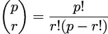
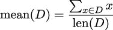
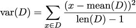
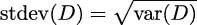

## 10

Functools 模块

函数式编程将函数视为一等对象。我们已经看到了几个高阶函数，这些函数接受函数作为参数或返回函数（或生成器表达式）作为结果。在本章中，我们将探讨`functools`库，它包含一些工具帮助我们实现一些常见的函数式设计模式。

我们将探讨一些高阶函数。这扩展了第五章，高阶函数中的材料。我们还将继续在第十二章，装饰器设计技术中探讨高阶函数技术。

我们将在本模块中探讨以下函数：

+   `@cache`和`@lru_cache`：这些装饰器可以极大地提高某些类型应用程序的性能。

+   `@total_ordering`: 这个装饰器可以帮助创建丰富的比较运算符。此外，它让我们可以探讨面向对象设计与函数式编程相结合的更一般性问题。

+   `partial()`: 这个函数可以从一个函数和一些参数值绑定中创建一个新的函数。

+   `reduce()`: 这是一个高阶函数，它泛化了如`sum()`之类的归约操作。

+   `singledispatch()`: 这个函数允许我们根据参数类型组装不同的实现。它使我们免于编写`match`语句来选择实现，从而保持实现干净地分离。

我们将推迟介绍这个库的另外两个成员到第十二章，装饰器设计技术：`update_wrapper()`和`wraps()`函数。我们还将更详细地探讨在下一章中编写我们自己的装饰器。

我们将完全忽略`cmp_to_key()`函数。它的目的是帮助将 Python 2 代码转换为在 Python 3 下运行。由于 Python 2 不再被积极维护，我们可以安全地忽略这个函数。

### 10.1 函数工具

我们在第五章，高阶函数中探讨了多个高阶函数。这些函数要么接受一个函数作为参数，要么返回一个函数（或生成器表达式）作为结果。所有这些高阶函数都有一个基本的算法，该算法通过注入另一个函数进行定制。例如`max()`、`min()`和`sorted()`函数接受一个`key=`函数来自定义其行为。例如`map()`和`filter()`函数接受一个函数和一个可迭代对象，并将给定的函数应用于参数可迭代对象。在`map()`函数的情况下，函数的结果简单地产生。在`filter()`函数的情况下，函数的布尔结果用于从可迭代源产生或拒绝值。

第五章，高阶函数中的所有函数都是 Python 的 `__builtins__` 包的一部分，这意味着这些函数无需使用 `import` 语句即可使用。它们之所以无处不在，是因为它们似乎普遍有用。本章中的函数必须使用 `import` 语句引入，因为它们并不那么普遍有用。

`reduce()` 函数跨越了这个界限。它最初是内置的。经过一些讨论后，它从 `__builtins__` 包移动到 `functools` 模块，因为性能可能非常糟糕。在本章的后面部分，我们将看到看似简单的操作可以表现得非常糟糕。

### 10.2 使用缓存存储先前结果

`@cache` 和 `@lru_cache` 装饰器将给定的函数转换为一个可能运行更快的函数。LRU 表示最近最少使用——保留一个有限池的最近使用项。未最近使用的项被丢弃以保持池的大小有限。`@cache` 没有存储管理，需要稍微考虑以确保它不会消耗所有可用内存。

由于这些是装饰器，我们可以将它们应用于任何可能从缓存先前结果中受益的函数。我们可以如下使用它：

```py
from functools import lru_cache 

@lru_cache(128) 
def fibc(n: int) -> int: 
    if n == 0: return 0 
    if n == 1: return 1 
    return fibc(n-1) + fibc(n-2)
```

这是一个基于 第六章，递归和归约 的例子。我们已将 `@lru_cache` 装饰器应用于天真斐波那契数计算。由于这个装饰，现在每次对 `fibc(n)` 函数的评估都将与装饰器维护的缓存进行检查。如果参数值 `n` 在缓存中，则使用之前计算的结果，而不是进行可能昂贵的重新计算。每次新的参数值集合和返回值更新缓存。

我们强调这个例子，因为在这种情况下，天真递归非常昂贵。计算任何给定斐波那契数 F[n] = F[n−1] + F[n−2] 的复杂性不仅涉及计算 F[n−1]，还涉及 F[n−2]。这个值树导致复杂度为 O(2^n)。

`128` 的参数值是缓存的大小。这用于限制缓存使用的内存量。当缓存满时，LRU 项将被替换。

我们可以使用 `timeit` 模块尝试从经验上确认这些好处。我们可以分别执行这两个实现 1,000 次，以查看时间比较。使用 `fib(20)` 和 `fibc(20)` 方法显示了没有缓存的好处，这个计算是多么昂贵。由于天真版本非常慢，`timeit` 的重复次数减少到只有 1,000 次。以下是结果（以秒为单位）：

+   天真：3.23

+   缓存：0.0779

注意，我们不能简单地使用`timeit`模块在`fibc()`函数上。缓存值将保持原位；我们只会评估一次完整的`fibc(20)`计算，这将填充缓存中的值。剩下的 999 次迭代将简单地从缓存中获取值。我们需要在`fibc()`函数的使用之间实际清除缓存，否则时间几乎会降到零。这是通过装饰器构建的`fibc.cache_clear()`方法来完成的。

缓存化的概念非常强大。有许多算法可以从结果缓存中受益。因为`@cache`装饰器适用于函数，这意味着使用函数式编程方法也可以导致高性能软件。具有副作用的功能很少是缓存的好候选；纯函数将工作得最好。

我们将再来看一个缓存好处的例子。这涉及到一个小计算，也有重复的值。从 p 个事物中取 r 个一组组合的数量通常表述如下：



这个二项式函数涉及到计算三个阶乘值。在阶乘函数上使用`@cache`装饰器可能是有意义的。计算多个二项式值的程序不需要重新计算所有这些阶乘。对于重复计算相似值的情况，速度提升可能会非常显著。对于缓存值很少被重用的情况，维护缓存值的开销可能会超过任何速度提升。

我们省略了实际二项式函数的细节。它只有一行代码。缓存内置函数的方式如下：

```py
from functools import cache 
from math import factorial 

factorial = cache(factorial)
```

这将装饰器应用于现有函数。有关这种装饰方法的信息，请参阅第十二章，装饰器设计技术。

当反复评估二项式函数时，我们会看到以下情况：

+   原始阶乘：0.174

+   缓存阶乘：0.046

重要的是要认识到缓存是一个有状态的对象。这种设计将纯函数式编程推向了极致。一个函数式理想是避免状态变化。这种避免有状态变量的概念通过递归函数得到了体现；当前状态包含在参数值中，而不是变量变化的值中。我们已经看到尾调用优化是如何确保这种理想化的递归实际上与可用的处理器硬件和有限的内存预算良好工作的必要性能改进。在 Python 中，我们可以通过将尾递归替换为`for`循环来手动进行尾调用优化。缓存是一种类似类型的优化；我们必须根据需要手动实现它，知道它不是纯函数式编程。

此外，如果我们的设计以纯函数为中心——没有副作用——那么引入缓存不会有问题。例如，将`@cache`装饰器应用于具有副作用的函数（例如`print()`函数），将产生混淆：我们会注意到具有相同参数值的`print()`评估不会产生任何输出，因为结果值`None`将是从缓存中检索的。

从原则上讲，对具有缓存的函数的每次调用都有两个结果：预期的结果和可用于函数未来评估的新`cache`对象。在实践中，在我们的例子中，`cache`对象封装在`fibc()`函数的装饰版本中，并且不可用于检查或操作。

缓存并非万能。与浮点值一起工作的应用程序可能不会从记忆化中获得太多好处，因为浮点值通常是近似值。浮点值的最低有效位应被视为随机噪声，这可能会阻止`@lru_cache`或`@cache`装饰器中的精确相等性测试。

### 10.3 定义具有完全排序的类

`@total_ordering`装饰器对于创建实现丰富比较运算符的新类定义很有帮助。这可能适用于子类`numbers.Number`的数值类。它也可能适用于半数值类。

作为半数值类的一个例子，考虑一副扑克牌。它有一个数值等级和一个符号花色。例如，花色对某些游戏可能并不重要。像普通整数一样，牌有顺序。我们经常将每张牌的点数相加，使它们像数字一样。然而，牌的乘法，即牌×牌，实际上并没有什么意义；牌并不完全像数字。

我们几乎可以用一个以`NamedTuple`为基类的`PlayingCard`来模拟一副扑克牌，如下所示：

```py
from typing import NamedTuple 

class Card1(NamedTuple): 
    rank: int 
    suit: str
```

这个模型存在一个深刻的局限性：所有牌的比较都将包括等级和花色。这导致当我们比较黑桃 2 和梅花 2 时出现以下尴尬的行为：

```py
>>> c2s = Card1(2, ’\u2660’) 
>>> c2h = Card1(2, ’\u2665’) 
>>> c2s 
Card1(rank=2, suit=’♠’) 
>>> c2h 
Card1(rank=2, suit=’♡’) 

# The following is undesirable for some games: 

>>> c2h == c2s 
False
```

默认比较规则对某些游戏来说很好。对于比较重点在等级而忽略花色的游戏，它不起作用。

对于某些游戏，默认的牌比较最好只基于它们的等级。

以下类定义适用于对花色不是主要关注的游戏：

```py
from functools import total_ordering 
from typing import NamedTuple 

@total_ordering 
class Card2(NamedTuple): 
    rank: int 
    suit: str 

    def __str__(self) -> str: 
        return f"{self.rank:2d}{self.suit}" 
    def __eq__(self, other: Any) -> bool: 
        match other: 
            case Card2(): 
                return self.rank == other.rank 
            case int(); 
                return self.rank == other 
            case _: 
                return NotImplemented 
    def __lt__(self, other: Any) -> bool: 
        match other: 
            case Card2(): 
                return self.rank < other.rank 
            case int(); 
                return self.rank < other 
            case _: 
                return NotImplemented
```

这个类扩展了`NamedTuple`类。我们提供了一个`__str__()`方法来打印`Card2`对象的字符串表示形式。

定义了两种比较——一种用于相等性，一种用于排序。可以定义各种比较，`@total_ordering`装饰器处理剩余比较的构建。在这种情况下，装饰器从这两个定义中创建了`__le__()`、`__gt__()`和`__ge__()`。`__ne__()`的默认实现使用`__eq__()`；这不需要使用装饰器也能工作。

本课程提供的两种方法允许两种比较类型——`Card2`对象之间的比较，以及`Card2`对象与整数的比较。类型提示必须是`Any`，以保持与`__eq__()`和`__lt__()`超类定义的兼容性。很明显，它可以缩小到`Union[Card2, int]`，但这与从超类继承的定义相冲突。

首先，这个类只提供对等级的比较，如下所示：

```py
>>> c2s = Card2(2, ’\u2660’) 
>>> c2h = Card2(2, ’\u2665’) 
>>> c2h == c2s 
True 

>>> c2h == 2 
True 
>>> 2 == c2h 
True
```

我们可以使用这个类进行许多具有简化语法的模拟，以比较牌的等级。此外，装饰器构建了一个丰富的比较操作符集，如下所示：

```py
>>> c2s = Card2(2, ’\u2660’) 
>>> c3h = Card2(3, ’\u2665’) 
>>> c4c = Card2(4, ’\u2663’) 
>>> c2s <= c3h < c4c 
True
```

我们不需要编写所有的比较方法函数；它们是由装饰器生成的。装饰器创建操作符并不完美。在我们的情况下，我们要求与整数以及`Card`实例之间的比较。这揭示了一些问题。

由于操作符解析的方式，`c4c > 3`和`3 < c4c`这样的比较会引发`TypeError`异常。这暴露了由`@total_ordering`装饰器创建的方法的局限性。具体来说，生成的方法不会有聪明的类型匹配规则。如果我们需要在所有比较中进行类型匹配，我们需要编写所有的方法。

### 10.4 使用 partial()应用部分参数

`partial()`函数导致一种称为部分应用的东西。部分应用函数是从旧函数和所需参数值的一个子集构建的新函数。它与柯里化概念密切相关。由于柯里化并不直接应用于 Python 函数的实现方式，因此大部分理论背景在这里并不相关。然而，这个概念可以引导我们进行一些实用的简化。

我们可以查看如下简单的例子：

```py
>>> exp2 = partial(pow, 2)
>>> exp2(12)
4096
>>> exp2(17)-1
131071

```

我们创建了函数`exp2(y)`，它是`pow(2, y)`函数。`partial()`函数将第一个位置参数绑定到`pow()`函数。当我们评估新创建的`exp2()`函数时，我们得到由`partial()`函数绑定的参数计算出的值，以及提供给`exp2()`函数的额外参数。

位置参数的绑定按照严格的从左到右的顺序处理。在构建部分应用函数时，也可以提供接受关键字参数的函数。

我们也可以用如下 lambda 形式创建这种部分应用函数：

```py
>>> exp2 = lambda y: pow(2, y)
```

两者都没有明显的优势。使用`partial()`可以帮助读者理解设计意图。使用 lambda 可能没有同样的解释力。

部分函数在需要避免向函数重复传递参数值的情况下非常有用。例如，我们可能在计算了平均值和标准差之后对数据进行归一化。这些归一化值有时被称为 Z 分数。虽然我们可以定义一个函数 `z(mean: float, stdev: float, score: float) -> float`，但这会有很多参数值，而这些参数值在平均值和标准差已知后不会改变。

我们更喜欢以下示例：

```py
>>> m = mean(some_data) 
>>> std = stdev(some_data) 
>>> z_value = partial(z, m, std) 
>>> normalized_some_data = [z_value(x) for x in some_data]
```

创建 `z_value()` 部分函数并不是——严格来说——必需的。拥有这个函数可以使创建 `normalized_some_data` 对象的表达式更加清晰。使用 `z_value(x)` 比使用 `z_value(m, std, x)` 稍微更易读。

我们将在第十三章《PyMonad 库》中回到 `partial()` 函数，并探讨如何使用柯里化实现这种类型的函数定义。

### 10.5 使用 reduce() 函数减少数据集

`sum()`、`len()`、`max()` 和 `min()` 函数在某种程度上都是 `reduce()` 函数表达的一个更通用算法的特殊化。参见第五章《高阶函数》了解更多关于这些函数的信息。`reduce()` 函数是一个高阶函数，它将二元操作折叠到可迭代对象的每一对元素中。

一个序列对象如下所示：

```py
>>> d = [2, 4, 4, 4, 5, 5, 7, 9]
```

表达式 `reduce(lambda x, y: x+y, d)` 将折叠 `+` 操作符到列表中，就像我们正在评估以下内容：

```py
>>> from functools import reduce 

>>> reduce(lambda x, y: x+y, d) 
40 
>>> 2+4+4+4+5+5+7+9 
40
```

包含 `()` 可以帮助显示有效的从左到右的分组，如下所示：

```py
>>> ((((((2+4)+4)+4)+5)+5)+7)+9 
40
```

Python 对表达式的标准解释涉及操作符的从左到右评估。因此，左折叠不涉及意义的改变。包括 Haskell 和 OCaml 在内的许多函数式编程语言都提供了折叠右的替代方案。当与递归结合使用时，编译器可以进行许多聪明的优化。这在 Python 中不可用；归约始终是从左到右的。

我们也可以提供初始值，如下所示：

```py
>>> reduce(lambda x, y: x+y**2, d, 0) 
232
```

如果我们不提供初始值，则使用序列的初始值作为初始化。当存在 `map()` 函数以及 `reduce()` 函数时，提供初始值是至关重要的。以下是如何使用显式的 `0` 初始化器计算正确答案的示例：

```py
>>> 0 + 2**2 + 4**2 + 4**2 + 4**2 + 5**2 + 5**2 + 7**2 + 9**2 
232
```

如果我们省略了 `0` 的初始化，`reduce()` 函数将使用第一个项目作为初始值。这个值没有应用转换函数，这会导致错误的答案。实际上，没有适当初始值的 `reduce()` 函数正在计算以下内容：

```py
>>> 2 + 4**2 + 4**2 + 4**2 + 5**2 + 5**2 + 7**2 + 9**2 
230
```

这种错误是为什么 `reduce()` 必须谨慎使用的原因之一。

我们可以使用 `reduce()` 高阶函数定义多个常见和内置的归约操作，如下所示：

```py
from collections.abc import Callable 
from functools import reduce 
from typing import cast, TypeAlias 

FloatFT: TypeAlias = Callable[[float, float], float] 

sum2 = lambda data: reduce(cast(FloatFT, lambda x, y: x+y**2), data, 0.0) 
sum = lambda data: reduce(cast(FloatFT, lambda x, y: x+y), data, 0.0) 
count = lambda data: reduce(cast(FloatFT, lambda x, y: x+1), data, 0.0) 
min = lambda data: reduce(cast(FloatFT, lambda x, y: x if x < y else y), data) 
max = lambda data: reduce(cast(FloatFT, lambda x, y: x if x > y else y), data)
```

`sum2()`归约函数是平方和，用于计算样本集的标准差。这个`sum()`归约函数模仿了内置的`sum()`函数。`count()`归约函数类似于`len()`函数，但它可以在可迭代对象上工作，而`len()`函数只能在工作集合对象上工作。

`cast()`函数通知 mypy lambda 对象的预期类型。如果没有这个，lambda 对象的默认类型提示是`Any`，这不是这些函数的意图。类型提示`FloatFT`描述了一个接受两个浮点参数值并返回浮点对象的浮点函数。

`min()`和`max()`函数模仿内置的归约。因为可迭代的第一个项用于初始化，所以这两个函数将正常工作。如果我们为这些`reduce()`函数提供了初始值，我们可能会错误地使用一个在原始可迭代中从未出现过的值。

类型提示的复杂性是 lambda 对象没有向工具如 mypy 传达足够信息的建议。虽然 lambda 是有效的 Python，但很难详细检查。这导致了以下提示：

一个好的设计使用小的函数定义。

一个完整的函数定义让我们能够提供默认值、文档和`doctest`测试用例。

#### 10.5.1 结合 map()和 reduce()

我们可以看到如何围绕这些基础定义构建高阶函数。我们可以定义一个 map-reduce 函数，如下结合`map()`和`reduce()`函数：

```py
from collections.abc import Callable, Iterable 
from functools import reduce 
from typing import TypeVar, cast 

ST = TypeVar("ST") 

def map_reduce( 
    map_fun: Callable[[ST], float], 
    reduce_fun: Callable[[float, float], float], 
    source: Iterable[ST], 
    initial: float = 0 
) -> float: 
    return reduce(reduce_fun, map(map_fun, source), initial)
```

这个定义有几个形式上的类型约束。首先，`source`迭代器产生一些类型一致的数据。我们将源类型绑定到`ST`类型变量，以显示在哪里需要一致的类型。其次，提供的`map_fun()`函数接受一个可以绑定到`ST`的任何类型的参数，并产生一个浮点对象。第三，提供的`reduce_fun()`函数将浮点对象归约，返回相同类型的结果。因为 mypy 了解 Python 运算符与整数以及浮点值的工作方式，这既适用于整数上下文也适用于浮点上下文。

我们可以使用`map_fun()`和`reduce_fun()`函数分别构建平方和归约，如下所示：

```py
from collections.abc import Iterable 

def sum2_mr(source_iter: Iterable[float]) -> float: 
    return map_reduce( 
        map_fun=lambda y: y**2, 
        reduce_fun=lambda x, y: x+y, 
        source=source_iter, 
        initial=0)
```

在这种情况下，我们使用了一个`lambda y: y**2`参数值作为映射，将每个值平方。归约是`lambda x, y: x+y`参数值。我们不需要显式提供初始值，因为初始值将是`map_fun()` lambda 平方后的可迭代中的第一个项。

`lambda x, y: x+y` 参数值是 `+` 操作符。Python 在 `operator` 模块中提供了所有算术运算符作为简短函数。（我们将在第十一章工具包中看到这一点。）以下是如何稍微简化我们的 map-reduce 操作：

```py
from collections.abc import Iterable 
import operator 

def sum2_mr2(source: Iterable[float]) -> float: 
    return map_reduce( 
        lambda y: y**2, 
        operator.add, 
        source, 
        0)
```

我们使用了 `operator.add` 函数来求和我们的值，而不是使用较长的 lambda 形式。

下面是我们在可迭代对象中计数值的方法：

```py
def count_mr(source: Iterable[float]) -> float: 
    return map_reduce( 
        lambda y: 1, 
        lambda x, y: x+y, 
        source, 
        0)
```

我们使用了 `lambda y: 1` 参数将每个值映射到值 `1`。然后使用 lambda 或 `operator.add` 函数进行归约计数。

通用 `reduce()` 函数允许我们从大量数据集中创建任何类型的归约到单个值。然而，在使用 `reduce()` 函数时，有一些限制。

#### 10.5.2 使用 reduce() 和 partial() 函数

如我们之前所看到的，`reduce()` 函数有一个初始值的选项。默认的初始值是零。这个初始值是归约的种子，如果源可迭代对象为空，它将是默认值。

在以下示例中，我们提供了一个荒谬的初始值：

```py
>>> import operator 
>>> from functools import reduce 
>>> d = [] 
>>> reduce(operator.add, d, "hello world") 
’hello world’
```

传递给 `reduce()` 函数的初始值是一个字符串。因为数据源 `d` 为空，没有执行任何操作，所以初始值是最终结果，尽管它荒谬地无效。

当我们尝试使用 `reduce()` 创建一个部分函数时，我们注意到这里有一个复杂的问题：没有合理的方法来提供初始值。这源于以下根本原因：`reduce()` 函数没有关键字参数。对于某些归约操作，我们需要为 `reduce()` 函数的前两个位置参数提供值。

下面是尝试组合 `partial()` 和 `reduce()` 的结果。以下部分函数的定义不正确：

```py
from functools import partial, reduce 

psum2 = partial(reduce, lambda x, y: x+y**2) 
pcount = partial(reduce, lambda x, y: x+1)
```

`psum2()` 函数应该计算值源的平方和。正如我们将看到的，这并没有按预期工作。以下是基于 `partial()` 函数尝试使用这些函数的示例：

```py
>>> d = [2, 4, 4, 4, 5, 5, 7, 9] 
>>> sum2(d) 
232.0 
>>> psum2(d) 
230 

>>> count(d) 
8.0 
>>> pcount(d) 
9
```

作为部分函数定义的平方和没有使用适当的值序列初始化。

归约应该从 0 开始。它将对每个值应用 lambda，并计算 `0 + 2**2`，`0 + 2**2 + 4**2` 等。实际上，它从第一个值开始，即 `2`。然后它将对剩余的值应用 lambda，计算 `2 + 4**2`，`2 + 4**2 + 4**2` 等。

使用 `partial()` 没有可行的解决方案。在这些情况下，如果我们想在应用 `reduce()` 时进行转换，必须使用 lambda 表达式。

部分函数是一种简化特别复杂计算的重要技术。当有众多参数，其中很少改变时，部分函数可能很有帮助。部分函数可以使将复杂计算重构为使用离散部分的替代实现变得更加容易。由于每个离散部分都是一个单独定义的函数，单元测试可以确认结果是否符合预期。

`reduce()`函数的限制是以下具有两个特性的函数的结果：

+   只有位置参数

+   提供的参数顺序很尴尬

在`reduce()`的情况下，初始值位于值源之后，这使得通过`partial()`提供变得困难。

#### 10.5.3 使用 map()和 reduce()函数清洗原始数据

在进行数据清洗时，我们经常会引入各种复杂程度的过滤器来排除无效值。我们还可以在有效但格式不正确的值可以被替换为有效且正确格式的值的情况下，包括一个映射来清洗值。

我们可能会产生以下输出：

```py
from collections.abc import Callable, Iterable 
from functools import reduce 

def comma_fix(data: str) -> float: 
    try: 
        return float(data) 
    except ValueError: 
        return float(data.replace(",", "")) 

def clean_sum( 
    cleaner: Callable[[str], float], 
    data: Iterable[str] 
) -> float: 
    return reduce(operator.add, map(cleaner, data))
```

我们定义了一个映射，即`comma_fix()`函数，它将数据从几乎正确的字符串格式转换为可用的浮点数值。这将移除逗号字符。另一种常见的变体可以移除美元符号并转换为`decimal.Decimal`。我们将这个作为练习留给读者。

我们还定义了一个 map-reduce 操作，它将给定的清洗函数（在这种情况下是`comma_fix()`函数）应用于`reduce()`函数之前的数据，使用`operator.add`方法。

我们可以按照以下方式应用之前描述的函数：

```py
>>> d = (’1,196’, ’1,176’, ’1,269’, ’1,240’, ’1,307’, 
... ’1,435’, ’1,601’, ’1,654’, ’1,803’, ’1,734’) 

>>> clean_sum(comma_fix, d) 
14415.0
```

我们通过修复逗号以及计算总和来清洗数据。这种语法对于结合这两个操作非常方便。

然而，我们必须小心不要多次使用清洗函数。如果我们还打算计算平方和，我们真的不应该执行以下类型的处理步骤：

```py
>>> sum = clean_sum(comma_fix, d)
>>> comma_fix_squared = lambda x: comma_fix(x)**2
>>> sum_2 = clean_sum(comma_fix_squared, d)

```

多次使用`clean_sum()`表达式意味着我们将在源数据上多次执行逗号修复操作。这是一个糟糕的设计。更好的做法是缓存`comma_fix()`函数的中间数值结果。使用`@cache`装饰器可以帮助。将清洗的中间值作为临时序列对象实体化会更好。比较不同缓存选项的性能作为练习留给读者。

#### 10.5.4 使用 groupby()和 reduce()函数

一个常见的需求是在将数据分组后总结数据。我们可以使用`defaultdict(list)`方法来分组数据。然后我们可以分别分析每个分组。在第四章，处理集合中，我们探讨了分组和分区的几种方法。在第八章，Itertools 模块中，我们探讨了其他方法。

以下是我们需要分析的一些样本数据：

```py
>>> data = [(’4’, 6.1), (’1’, 4.0), (’2’, 8.3), (’2’, 6.5), 
... (’1’, 4.6), (’2’, 6.8), (’3’, 9.3), (’2’, 7.8), 
... (’2’, 9.2), (’4’, 5.6), (’3’, 10.5), (’1’, 5.8), 
... (’4’, 3.8), (’3’, 8.1), (’3’, 8.0), (’1’, 6.9), 
... (’3’, 6.9), (’4’, 6.2), (’1’, 5.4), (’4’, 5.8)]
```

我们有一系列原始数据值，每个值都有一个键（一个简短字符串）和每个键的测量值（一个浮点值）。

从这些数据中产生可用的组的一种方法是为每个键到该组成员列表的映射构建一个字典，如下所示：

```py
from collections import defaultdict 
from collections.abc import Iterable, Callable, Iterator 
from typing import Any, TypeVar, Protocol, cast 
DT = TypeVar("DT") 

class Comparable(Protocol): 
    def __lt__(self, __other: Any) -> bool: ... 
    def __gt__(self, __other: Any) -> bool: ... 
    def __hash__(self) -> int: ... 
KT = TypeVar("KT", bound=Comparable) 

def partition( 
    source: Iterable[DT], 
    key: Callable[[DT], KT] = cast(Callable[[DT], KT], lambda x: x) 
) -> Iterator[tuple[KT, Iterator[DT]]]: 
    """Sorting deferred.""" 
    pd: dict[KT, list[DT]] = defaultdict(list) 
    for item in source: 
        pd[key(item)].append(item) 
    for k in sorted(pd): 
        yield k, iter(pd[k])
```

这将根据键将可迭代的每个项分离到组中。数据源的可迭代表述使用类型变量 `DT`，表示每个数据项的类型。`key()` 函数用于从每个项中提取键值。这个函数产生一个某种键类型的对象，`KT`，通常与原始数据项类型 `DT` 不同。在查看样本数据时，每个数据项的类型是元组。键的类型是 `str`。用于提取键的可调用函数将元组转换为字符串。

从每个数据项中提取的这个键值用于将每个项追加到 `pd` 字典中的列表中。`defaultdict` 对象被定义为将每个键 `KT` 映射到数据项列表 `list[DT]`。

这个函数的结果与 `itertools.groupby()` 函数的结果相匹配。它是一个可迭代的 `(group key, iterator)` 元组序列。组键值将是键函数产生的类型。迭代器将提供原始数据项的序列。

以下是用 `itertools.groupby()` 函数定义的相同功能：

```py
from itertools import groupby 
from collections.abc import Iterable, Callable, Iterator 

def partition_s( 
    source: Iterable[DT], 
    key: Callable[[DT], KT] = cast(Callable[[DT], KT], lambda x: x) 
) -> Iterable[tuple[KT, Iterator[DT]]]: 
    """Sort source data""" 
    return groupby(sorted(source, key=key), key)
```

每个函数输入的重要区别在于，`groupby()` 函数版本要求数据按键排序，而

`defaultdict` 版本不需要排序。对于非常大的数据集，排序可能非常昂贵，无论是从时间还是存储的角度来看。

这是核心分区操作。这可能在过滤出组之前使用，或者在使用每个组的统计数据之前使用：

```py
>>> for key, group_iter in partition(data, key=lambda x: x[0]): 
...     print(key, tuple(group_iter)) 
1 ((’1’, 4.0), (’1’, 4.6), (’1’, 5.8), (’1’, 6.9), (’1’, 5.4)) 
2 ((’2’, 8.3), (’2’, 6.5), (’2’, 6.8), (’2’, 7.8), (’2’, 9.2)) 
3 ((’3’, 9.3), (’3’, 10.5), (’3’, 8.1), (’3’, 8.0), (’3’, 6.9)) 
4 ((’4’, 6.1), (’4’, 5.6), (’4’, 3.8), (’4’, 6.2), (’4’, 5.8))
```

我们可以将这些分组数据总结如下：

```py
from collections.abc import Iterable, Sequence 

def summarize( 
    key: KT, 
    item_iter: Iterable[tuple[KT, float]] 
) -> tuple[KT, float, float]: 
    # mean = lambda seq: sum(seq) / len(seq) 
    def mean(seq: Sequence[float]) -> float: 
        return sum(seq) / len(seq) 
    # var = lambda mean, seq: sum(...) 
    def var(mean: float, seq: Sequence[float]) -> float: 
        return sum((x - mean) ** 2 / (len(seq)-1) for x in seq) 

    values = tuple(v for k, v in item_iter) 
    m = mean(values) 
    return key, m, var(m, values)
```

`partition()` 函数的结果将是一个包含 (key, iterator) 双元组的序列。`summarize()` 函数接受这个双元组，并将其分解为键和原始数据项的迭代器。在这个函数中，数据项被定义为 `tuple[KT, float]`，其中 `KT` 是某种类型的键，`float` 是数值。从 `item_iter` 迭代器中的每个双元组中，我们想要的是值部分，我们使用生成器表达式来创建只包含值的元组。

我们也可以使用表达式 `map(snd, item_iter)` 来从每个双元组中选取第二个元素。这需要一个 `snd = lambda x: x[1]` 或 `snd = operator.itemgetter(1)` 的定义。`snd` 是 second 的简称。

我们可以使用以下命令将 `summarize()` 函数应用于每个分区：

```py
>>> from itertools import starmap 
>>> partition1 = partition(data, key=lambda x: x[0]) 
>>> groups1 = starmap(summarize, partition1)
```

这使用了 `itertools` 模块中的 `starmap()` 函数。参见第八章，迭代工具模块。使用 `partition_s()` 函数的另一种定义如下：

```py
>>> partition2 = partition_s(data, key=lambda x: x[0]) 
>>> groups2 = starmap(summarize, partition2)
```

这两种方法都将为我们提供每个组的汇总值。结果分组统计如下：

```py
1 5.34 1.25 
2 7.72 1.22 
3 8.56 1.9 
4 5.5 0.96
```

方差可以作为 χ²（卡方）测试的一部分来使用，以确定对于这些数据，零假设是否成立。零假设断言没有东西可看：数据中的方差基本上是随机的。我们还可以比较四个组之间的数据，以查看各种均值是否与零假设一致，或者是否存在某种统计上显著的差异。

#### 10.5.5 避免 reduce()的问题

`reduce()` 函数存在一个阴暗面。我们必须避免以下类似的表达式：

```py
reduce(operator.add, list_of_strings, "")
```

这确实可行，因为 Python 将在两个操作数之间应用通用的 `add` 操作符，这两个操作数是字符串。然而，它将计算大量的中间字符串对象，这是一个相对昂贵的操作。一个替代方案是 `"".join(list_of_strings)` 表达式。通过 `timeit` 进行一点研究可以揭示，`string.join()` 方法比通用的 `reduce()` 版本更有效。我们将数据收集和分析留给读者作为练习。

通常，最好仔细审查由提供的函数创建或修改某种集合的 `reduce()` 操作。可能有一个表面上看起来很简单但会创建非常大的中间结果的表达式。例如，我们可能会写出 `reduce(accumulate_details, some_source, {})`，而没有考虑到 `accumulate_details()` 函数如何更新字典。我们可能更倾向于查看重写底层 `accumulate_details()` 函数的方法，使其接受一个序列而不是单个项。

### 10.6 使用 singledispatch 处理多种类型

我们经常会遇到具有相似语义但基于数据类型具有不同实现的函数。我们可能有一个适用于 `NamedTuple` 的子类或 `TypedDict` 的函数。处理这些对象的语法是不同的，我们无法使用单个通用的 Python 函数。

我们有以下几种选择来处理不同类型的数据：

+   使用带有每个不同类型的 `case` 子句的 `match` 语句。

+   使用 `@singledispatch` 装饰器定义多个密切相关函数。这将为我们创建必要的类型匹配 `match` 语句。

当处理美国邮政数据和电子表格时，会出现一个小例子。美国邮政的 ZIP 代码通常会被误解为整数（或浮点）值。例如，马萨诸塞州的安多弗镇有一个邮政编码为 01810。电子表格可能会将其误解为整数 1810，忽略了前面的零。

当处理美国邮政数据时，我们经常需要一个函数来将邮政编码作为字符串值标准化，恢复任何丢失的前导零值。这个函数至少有以下三种情况：

+   整数值需要转换为字符串，并恢复前导零。

+   类似地，浮点值也需要转换为字符串，并恢复前导零。

+   字符串值可能是一个五位数的邮政编码或一个九位数的邮政编码。根据应用，我们可能想要截断邮政编码以确保它们是一致的。

虽然我们可以使用`match`语句来处理这三种情况，但我们也可以定义几个密切相关函数。`@singledispatch`装饰器让我们定义一个“默认”函数，用于在无法进行类型匹配时使用。然后，我们可以通过为每个我们想要处理的数据类型添加额外的定义来重载这个函数。

这里是单个`zip_format()`函数的定义套件。我们将从基础定义开始，这是在没有其他定义可以工作的情况下使用的：

```py
from functools import singledispatch 
from typing import Any 

@singledispatch 
def zip_format(zip: Any) -> str: 
    raise NotImplementedError(f"unsupported {type(zip)} for zip_format()")
```

`@singledispatch`装饰器将创建一个新的装饰器，使用函数的名称`zip_format`。这个新的`@zip_format`装饰器可以用来创建替代的重载定义。这些定义隐含了一个`match`语句，根据类型匹配规则来区分这些替代方案。

这里是替代定义：

```py
@zip_format.register 
def _(zip: int) -> str: 
    return f"{zip:05d}" 

@zip_format.register 
def _(zip: float) -> str: 
    return f"{zip:05.0f}" 

@zip_format.register 
def _(zip: str) -> str: 
    if "-" in zip: 
        zip, box = zip.split("-") 
    return f"{zip:0>5s}"
```

注意，每个替代函数都使用一个将被忽略的名称`_`。这些函数将全部组合成一个单一的`zip_format()`函数，该函数将根据参数值的类型分派适当的实现。

还需要注意的是，这些函数不一定都需要定义在同一个模块中。我们可以提供一个包含基础定义的模块。然后，其他模块可以导入这些基础定义并注册它们独特的实现函数。这允许在模块级别通过添加替代实现来扩展。

### 10.7 摘要

在本章中，我们探讨了`functools`模块中的许多函数。这个库模块提供了一些函数，帮助我们创建复杂的函数和类。

我们已经探讨了`@cache`和`@lru_cache`装饰器作为提升某些类型应用的方法，这些应用经常需要重新计算相同的值。这两个装饰器对于某些接受整数或字符串参数值的函数非常有价值。它们可以通过实现记忆化来减少处理。`@lru_cache`有一个内存使用的上限；这对于一个未知大小的域来说是个优点。

我们将`@total_ordering`函数作为一个装饰器来查看，以帮助我们构建支持丰富排序比较的对象。这处于函数式编程的边缘，但在创建新类型的数字时非常有帮助。

`partial()`函数创建了一个具有部分应用参数值的新的函数。作为替代，我们也可以构建具有类似特征的 lambda 表达式。这种用例是不明确的。

我们还研究了`reduce()`函数作为高阶函数。它将像`sum()`函数这样的归约泛化。我们将在后续章节的几个示例中使用此函数。这与`filter()`和`map()`函数作为重要的高阶函数的逻辑相符。

`@singledispatch`装饰器可以帮助我们创建具有相似语义但不同数据类型参数值的多个函数。这避免了显式`match`语句的开销。随着软件的发展，我们可以向替代集合中添加定义。

在下一章中，我们将探讨一系列小主题。我们将检查`toolz`包，它提供了一些内置的`itertools`和`functools`模块的替代方案。这个替代方案有几个新特性。它还有一些重叠的特性，从不同的角度考虑，使它们在某些应用中更有用。

我们还将看到`operator`模块的一些额外用途。此模块使一些 Python 运算符作为函数可用，使我们能够简化自己的函数定义。

我们还将探讨一些设计灵活决策和允许表达式以非严格顺序评估的技术。

### 10.8 练习

本章的练习基于 Packt Publishing 在 GitHub 上提供的代码。请参阅[`github.com/PacktPublishing/Functional-Python-Programming-3rd-Edition`](https://github.com/PacktPublishing/Functional-Python-Programming-3rd-Edition)。

在某些情况下，读者会注意到 GitHub 上提供的代码包含一些练习的部分解决方案。这些作为提示，允许读者探索替代解决方案。

在许多情况下，练习需要单元测试用例来确认它们确实解决了问题。这些通常与 GitHub 存储库中已提供的单元测试用例相同。读者应将书中的示例函数名称替换为自己的解决方案以确认其工作。

#### 10.8.1 比较`string.join()`和`reduce()`

在本章的避免 reduce()问题部分，我们注意到我们可以以下两种方式将字符串值列表合并成一个字符串：

+   `reduce(operator.add, list_of_strings, "")`

+   `"".join(list_of_strings)`

其中之一比另一个效率高得多。使用`timeit`模块找出哪个更高效。效率提升是显著的，了解这两种方法之间的时间比可能很有帮助。

了解两种方法如何随着字符串集合的增大而扩展也很重要。为此，构建一个小模块，使用字符串集合来练习上述两个表达式。使用大小为 100、200、300、...、900 的集合，以查看工作如何随着连接字符串的数量而扩展。

#### 10.8.2 扩展 comma_fix() 函数

在 使用 map() 和 reduce() 函数清理原始数据 部分，我们定义了一个映射，即 `comma_fix()` 函数，它将数据从几乎正确的字符串格式转换为可用的浮点值。这将移除逗号字符。

这个函数的名称具有误导性。它实际上是一个可以容忍一些标点的字符串到浮点数的转换。一个更好的名称可能是 `tolerant_str_to_float()`。

定义并测试一个容忍字符串到十进制的转换函数。这应该移除美元符号以及逗号，并将剩余的字符串转换为 `decimal.Decimal`。

定义并测试一个容忍字符串到整数的转换函数。这应该与 `tolerant_str_to_float()` 平行，仅移除逗号字符。

#### 10.8.3 修改 clean_sum() 函数

在 使用 map() 和 reduce() 函数清理原始数据 部分，我们定义了一个 `clean_sum()` 函数来清理和求和一组原始字符串值。对于像计算均值这样的简单情况，这涉及到对数据进行转换和计算的单次遍历。

对于像方差或标准差这样的更复杂操作，多次遍历可能会很繁琐，因为字符串转换是重复进行的。这表明 `clean_sum()` 函数是一个糟糕的设计。

第一个要求是一个计算字符串数据的均值、方差和标准差的函数：







一种设计替代方案是缓存 `comma_fix()` 函数的中间数字结果。使用 `@cache` 装饰器定义一个 `comma_fix()` 函数。（这个函数应该重命名为更明确的名字，比如 `str_to_float()`。）

创建一个非常大的随机数字字符串集合，并查看哪种替代方案更快。

另一种设计替代方案是具体化清理后的中间值。创建一个只包含纯数字值的临时序列对象，然后在这些纯数字列表上计算各种统计度量。

在 第七章，复杂无状态对象 中，我们介绍了一种使用 `sys.getallocatedblocks()` 来了解 Python 使用了多少内存的方法。这个程序可以应用于此处，以查看哪种缓存替代方案使用的内存最少。

展示结果以显示哪种设计替代方案在性能和内存使用方面最佳。

### 加入我们的 Discord 社区空间

加入我们的 Python Discord 工作空间，讨论并了解更多关于这本书的信息：[`packt.link/dHrHU`](https://packt.link/dHrHU)


