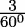
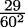
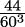
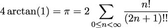
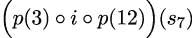

## 第十一章：11

工具包

GitHub 上 pytoolz 项目提供的 `toolz` 包包含许多函数式编程特性。具体来说，这些库提供了迭代工具、高阶函数工具，甚至在无状态函数应用中与状态字典一起工作的组件。

`toolz` 包与标准库的组件之间有一些重叠。`toolz` 项目分解为三个重要的部分：`itertoolz`、`functoolz` 和 `dicttoolz`。`itertoolz` 和 `functoolz` 模块被设计成与标准库模块 `itertools` 和 `functools` 相对应。

我们将在本章中查看以下主题列表：

+   我们将从星映射开始，其中使用 `f(*args)` 为映射提供多个参数。

+   我们还将使用 `operator` 模块查看一些额外的 `functools.reduce()` 主题。

+   我们将查看 `toolz` 包，它提供了类似于内置的 `itertools` 和 `functools` 包的功能，但提供了更高层次的函数纯度。

+   我们还将查看 `operator` 模块以及它如何有助于在定义高阶函数时简化并可能澄清某些内容。

我们将从 `itertools` 和 `functools.reduce()` 的更多高级用法开始。这两个主题将介绍 `toolz` 包的使用案例。

### 11.1 itertools 星映射函数

`itertools.starmap()` 函数是 `map()` 高阶函数的一种变体。`map()` 函数将函数应用于序列中的每个项目。`starmap(f, S)` 函数假设序列 `S` 中的每个项目 `i` 都是一个元组，并使用 `f(*i)`。每个元组中的项目数必须与给定函数中的参数数相匹配。

这里是一个使用 `starmap()` 函数多个特性的示例：

```py
>>> from itertools import starmap, zip_longest 
>>> d = starmap(pow, zip_longest([], range(4), fillvalue=60)) 
>>> list(d) 
[1, 60, 3600, 216000]
```

`itertools.zip_longest()` 函数将创建一个包含对的序列，`[(60, 0), (60, 1), (60, 2), (60, 3)]`。它这样做是因为我们提供了两个序列：空方括号和 `range(4)` 参数。当较短的序列数据耗尽时，使用 `fillvalue` 参数。

当我们使用 `starmap()` 函数时，每一对都成为给定函数的参数。在这种情况下，我们使用了内置的 `pow()` 函数，它就是 `**` 操作符（我们也可以从 `operator()` 模块中导入这个函数；定义在两个地方）。这个表达式计算 `[60**0, 60**1, 60**2, 60**3]` 的值。`d` 变量的值是 `[1, 60, 3600, 216000]`。

`starmap()` 函数期望一个元组的序列。我们在 `map(f, x, y)` 和 `starmap(f, zip(x, y))` 函数之间有一个整洁的等价性。

这里是 `itertools.starmap()` 函数先前示例的延续：

```py
>>> p = (3, 8, 29, 44) 
>>> pi = sum(starmap(truediv, zip(p, d))) 
>>> pi 
3.1415925925925925
```

我们将两个四个值的序列组合在一起。`d`变量的值是在上面使用`starmap()`计算的。`p`变量指的是一个简单的字面项列表。我们将这些项组合成对。我们使用`starmap()`函数与`operator.truediv()`函数（即`/`运算符）一起使用，这将计算一个分数序列，我们将对其进行求和。这个和是π ≈ +  +  + 的近似值。

这里有一个稍微简单一点的版本，它使用`map(f, x, y)`函数而不是`starmap(f, zip(x, y))`函数：

```py
>>> pi = sum(map(truediv, p, d)) 
>>> pi 
3.1415925925925925
```

在这个例子中，我们有效地将 60 进制的分数值转换为 10 进制。`d`变量中的值序列是适当的分母。可以使用本节之前解释的类似技术将其他进制转换。

一些近似涉及可能无限的和（或积）。这些可以使用本节之前解释的类似技术进行评估。我们可以利用`itertools`模块中的`count()`函数在近似中生成任意数量的项。然后我们可以使用`takewhile()`函数只累积对答案有有用精度水平的值。从另一个角度来看，`takewhile()`产生一系列显著值，并在找到不显著值时停止从流中消耗值。

在我们的下一个例子中，我们将利用第六章，递归和归约中定义的`fact()`函数。查看实现尾部调用优化部分以获取相关代码。

我们将介绍一个非常类似的功能，半阶乘，也称为双阶乘，用!!符号表示。半阶乘的定义与阶乘的定义类似。重要的区别是它是交替数的乘积，而不是所有数的乘积。例如，看看以下公式：

+   5!! = 5 × 3 × 1

+   7!! = 7 × 5 × 3 × 1

这里是基本函数定义：

```py
def semifact(n: int) -> int: 
    match n: 
        case 0 | 1: 
            return 1 
        case 2: 
            return 2 
        case _: 
            return semifact(n-2)*n
```

这里是使用`fact()`和`semifact()`函数从一个潜在无限序列的分数中计算总和的例子：

```py
>>> from Chapter06.ch06_ex1 import fact 
>>> from itertools import count, takewhile 
>>> num = map(fact, count()) 
>>> den = map(semifact, (2*n+1 for n in count())) 

>>> terms = takewhile( 
... lambda t: t > 1E-10, map(truediv, num, den)) 

>>> round(float(2*sum(terms)), 8) 
3.14159265
```

`num`变量是基于`fact()`函数的潜在无限序列的分子，`count()`函数返回从零开始的递增值，并无限期地继续。`den`变量也是基于半阶乘函数的潜在无限序列的分母。这个`den`计算也使用`count()`来创建一个潜在无限值的序列。

为了创建项，我们使用了 `map()` 函数来应用 `operator.truediv()` 函数，即 `/` 运算符，到每一对值。我们用 `takewhile()` 函数包装这个操作，这样我们只从 `map()` 输出中取值，直到值大于某个相对较小的值，在这个例子中是 10^(-10)。

这是一个基于此定义的级数展开：



级数展开主题的一个有趣的变化是将 `operator.truediv()` 函数替换为 `fractions.Fraction()` 函数。这将创建精确的有理数，不受浮点近似限制。我们将实现留给读者作为练习。

所有内置的 Python 运算符都在 `operator` 模块中可用。这包括所有位操作符以及比较运算符。在某些情况下，生成器表达式可能比看起来相当复杂的 `starmap()` 函数和表示运算符的函数更简洁或更易于表达。

`operator` 模块提供了比 lambda 更简洁的函数。我们可以使用 `operator.add` 方法而不是 `add=lambda a, b: a+b` 形式。如果我们有比单个运算符更复杂的表达式，那么 lambda 对象是唯一可以编写它们的途径。

### 11.2 使用运算符模块函数进行归约

我们将探讨另一种使用 `operator` 模块定义的方法：我们可以使用它们与内置的 `functools.reduce()` 函数一起。例如，`sum()` 函数可以如下实现：

```py
sum = functools.partial(functools.reduce, operator.add)
```

这创建了一个部分评估的 `reduce()` 函数版本，其中第一个参数已提供。在这种情况下，它是 `+` 运算符，通过 `operator.add()` 函数实现。

如果我们需要一个类似的函数来计算乘积，我们可以这样定义它：

```py
prod = functools.partial(functools.reduce, operator.mul)
```

这遵循了前面示例中显示的模式。我们有一个部分评估的 `reduce()` 函数，其第一个参数是 `*` 运算符，由 `operator.mul()` 函数实现。

是否可以用太多其他运算符做类似的事情还不清楚。我们可能能够找到 `operator.concat()` 函数的用途。

`and()` 和 `or()` 函数是位运算符 `&` 和 `|`。这些函数旨在生成整数结果。

如果我们要使用正确的布尔运算进行归约，我们应该使用 `all()` 和 `any()` 函数，而不是尝试使用 `reduce()` 函数来创建某些内容。

一旦我们有了 `prod()` 函数，这意味着阶乘可以如下定义：

```py
fact = lambda n: 1 if n < 2 else n * prod(range(1, n))
```

这具有简洁的优点：它提供了一个单行定义的阶乘。它还有不依赖于递归的优点，避免了任何与栈限制相关的问题。

这并不明显比我们拥有的许多 Python 替代方案有戏剧性的优势。然而，从 `partial()` 和 `reduce()` 函数以及 `operator` 模块等原始组件构建复杂函数的概念非常优雅。这是编写函数式程序的重要设计策略。

一些设计可以通过使用 `toolz` 包的功能来简化。我们将在下一节中查看一些 `toolz` 包的内容。

### 11.3 使用 toolz 包

`toolz` 包包含与内置的 `itertools` 和 `functools` 模块中的一些函数类似的功能。`toolz` 包添加了一些函数来对字典对象进行复杂的处理。这个包专注于可迭代对象、字典和函数。这与 JSON 和 CSV 文档中可用的数据结构很好地重叠。处理来自文件或数据库的可迭代对象的想法允许 Python 程序在不填充整个对象集合的情况下处理大量数据。

我们将查看 `toolz` 包各个子节中的几个示例函数。当前版本中包含六十多个单独的函数。此外，还有一个用 Cython 编写的 `cytoolz` 实现，它比纯 Python 的 `toolz` 包提供了更高的性能。

#### 11.3.1 一些 itertoolz 函数

我们将探讨一个常见的数据分析问题，即从多个数据集中清理和组织数据。在第九章中，组合学中的迭代工具 – 排列和组合，我们提到了一些可在[`www.tylervigen.com`](https://www.tylervigen.com)找到的数据集。

每个相关性都包含一个相关数据的表格。这些表格通常看起来像以下示例：

|

* * *

|

* * *

|

* * *

|

* * *

|

* * *

|

|  | 2000 | 2001 | 2002 | ... |
| --- | --- | --- | --- | --- |

|

* * *

|

* * *

|

* * *

|

* * *

|

* * *

|

| 每人奶酪消费量（美国） | 29.8 | 30.1 | 30.5 | ... |
| --- | --- | --- | --- | --- |

|

* * *

|

* * *

|

* * *

|

* * *

|

* * *

|

| 死于床上缠绵的人数 |  |  |  |  |
| --- | --- | --- | --- | --- |
| 在床上缠绵而死亡的人数 | 327 | 456 | 509 | ... |

|

* * *

|

* * *

|

* * *

|

* * *

|

* * *

|

|  |  |  |  |  |
| --- | --- | --- | --- | --- |

在虚假相关性的每个例子中，通常有三行数据。每行有 10 列数据，一个标题，以及一个用作方便分隔符的空列。一个小的解析函数，使用 Beautiful Soup，可以从中提取必要的数据。这个提取出来的数据并不立即有用；还需要更多的转换。

这是提取 HTML 中相关文本的核心函数：

```py
from bs4 import BeautifulSoup  # type: ignore[import] 
import urllib.request 
from collections.abc import Iterator 

def html_data_iter(url: str) -> Iterator[str]: 
    with urllib.request.urlopen(url) as page: 
        soup = BeautifulSoup(page.read(), ’html.parser’) 
        data = soup.html.body.table.table 
        for subtable in data.table: 
            for c in subtable.children: 
                yield c.text
```

这个`html_data_iter()`函数使用`urllib`读取 HTML 页面。它从原始数据创建一个`BeautifulSoup`实例。`soup.html.body.table.table`表达式提供了进入 HTML 结构的导航路径。这深入到嵌套的`<table>`标签中，以定位感兴趣的数据。在嵌套的表格中，将会有其他子表格，包含行和列。由于各种结构可能有些不一致，因此似乎最好分别提取文本并对文本施加有意义的结构。

这个`html_data_iter()`函数是这样用来从 HTML 页面获取数据的：

```py
>>> s7 = html_data_iter("http://www.tylervigen.com/view_correlation?id=7")
```

这个表达式的结果是文本字符串序列。许多例子有 37 个单独的字符串。这些字符串可以被分成 3 行，每行 12 个字符串，以及一个包含单个字符串值的第四行。我们可以这样理解这些行：

+   第一行有一个空字符串，十个年份值，以及一个额外的零长度字符串。

+   第二行有第一个数据序列的标题，十个值，以及一个额外的零长度字符串。

+   第三行，就像第二行一样，有第二个数据序列的标题，十个值，以及一个额外的字符串。

+   第四行包含一个字符串，其中包含两个序列之间的相关性值。

这需要一些重新组织，以创建我们可以工作的样本值集。

我们可以使用`toolz.itertoolz.partition`将值序列分成每组 12 个的组。如果我们使用`toolz.itertoolz.interleave`交错这三个集合，它将创建一个包含每个三行值的序列：年份、第一序列和第二序列。如果将其分成每组三的组，每个年份和两个样本值将是一个小的三元素元组。我们将默默地丢弃包含相关性值的额外行。

这不是数据的理想形式，但它使我们开始创建有用的对象。从长远来看，`toolz`框架鼓励我们创建字典来包含样本数据。我们将在稍后讨论字典。现在，我们将从重新排列前 36 个字符串的源数据开始，将其分为 3 组，每组 12 个字符串，然后是 12 组，每组 3 个字符串。这种初始重构看起来是这样的：

```py
>>> from toolz.itertoolz import partition, interleave 

>>> data_iter = partition(3, interleave(partition(12, s7))) 
>>> data = list(data_iter) 

>>> from pprint import pprint 
>>> pprint(data) 
[(’’, 
  ’Per capita consumption of cheese (US)Pounds (USDA)’, 
  ’Number of people who died by becoming tangled in their bedsheets Deaths (US) ’ 
  ’(CDC)’), 
 (’2000’, ’29.8’, ’327’), 
 (’2001’, ’30.1’, ’456’), 
 (’2002’, ’30.5’, ’509’), 
 (’2003’, ’30.6’, ’497’), 
 (’2004’, ’31.3’, ’596’), 
 (’2005’, ’31.7’, ’573’), 
 (’2006’, ’32.6’, ’661’), 
 (’2007’, ’33.1’, ’741’), 
 (’2008’, ’32.7’, ’809’), 
 (’2009’, ’32.8’, ’717’), 
 (’’, ’’, ’’)]
```

第一行尴尬的是，年份列没有标题。因为这是序列中的第一个项目，我们可以使用一对`itertoolz`函数来删除初始字符串，该字符串始终为`""`，并将其替换为更有用的内容，即`"year"`。结果序列将只在每行的末尾有空白单元格，这样我们就可以使用`partitionby()`将长字符串序列分解为四个单独的行。以下函数定义可以用来将源数据在空字符串上分割成并行序列：

```py
from toolz.itertoolz import cons, drop  # type: ignore[import] 
from toolz.recipes import partitionby  # type: ignore[import] 

ROW_COUNT = 0 

def row_counter(item: str) -> int: 
    global ROW_COUNT 
    rc = ROW_COUNT 
    if item == "": ROW_COUNT += 1 
    return rc
```

`row_counter()` 函数使用全局变量 `ROW_COUNT` 来维护行尾字符串的状态计数。一个稍微更好的设计会使用可调用对象将状态信息封装到类定义中。我们将这个变体留给了读者作为练习。在具有 `__call__()` 方法的类中使用实例变量比全局变量有诸多优势；重新设计这个函数是有帮助的，因为它展示了如何将副作用限制到对象的状态。我们还可以使用类级别变量和 `@classmethod` 来实现相同类型的隔离。

以下代码片段显示了如何使用此函数对输入进行分区：

```py
>>> year_fixup = cons("year", drop(1, s7)) 
>>> year, series_1, series_2, extra = list(partitionby(row_counter, year_fixup)) 
>>> data = list(zip(year, series_1, series_2)) 

>>> from pprint import pprint 
>>> pprint(data) 
[(’year’, 
  ’Per capita consumption of cheese (US)Pounds (USDA)’, 
  ’Number of people who died by becoming tangled in their bedsheets Deaths (US) ’ 
  ’(CDC)’), 
 (’2000’, ’29.8’, ’327’), 
 (’2001’, ’30.1’, ’456’), 
 (’2002’, ’30.5’, ’509’), 
 (’2003’, ’30.6’, ’497’), 
 (’2004’, ’31.3’, ’596’), 
 (’2005’, ’31.7’, ’573’), 
 (’2006’, ’32.6’, ’661’), 
 (’2007’, ’33.1’, ’741’), 
 (’2008’, ’32.7’, ’809’), 
 (’2009’, ’32.8’, ’717’), 
 (’’, ’’, ’’)]
```

`row_counter()` 函数对每个单独的字符串进行调用，其中只有少数是行尾。这使得每个行可以通过 `partitionby()` 函数分割成单独的序列。然后通过 `zip()` 将这三个序列组合起来，创建一个三个元组的序列。

此结果与前面的示例相同。然而，这个变体不依赖于恰好有三行 12 个值。这种变化依赖于能够检测到每行的末尾单元格。这提供了灵活性。

结果的更有用形式是每个样本的字典，其中包含 `year`、`series_1` 和 `series_2` 的键。我们可以使用生成器表达式将三个元组的序列转换为字典序列。以下示例构建了一个字典序列：

```py
from toolz.itertoolz import cons, drop 
from toolz.recipes import partitionby 

def make_samples(source: list[str]) -> list[dict[str, float]]: 
    # Drop the first "" and prepend "year" 
    year_fixup = cons("year", drop(1, source)) 
    # Restructure to 12 groups of 3 
    year, series_1, series_2, extra = list(partitionby(row_counter, year_fixup)) 
    # Drop the first and the (empty) last 
    samples = [ 
        {"year": int(year), "series_1": float(series_1), "series_2": float(series_2)} 
        for year, series_1, series_2 in drop(1, zip(year, series_1, series_2)) 
        if year 
    ] 
    return samples
```

`make_samples()` 函数创建了一个字典序列。这反过来又允许我们使用其他工具提取可以用来计算两个系列之间相关系数的序列。一些 `itertoolz` 函数的基本模式与内置的 `itertools` 相似。

在某些情况下，函数名称之间会发生冲突，其语义也各不相同。例如，`itertoolz.count()` 和 `itertools.count()` 具有根本不同的定义。`itertoolz` 函数类似于 `len()`，而标准库中的 `itertools` 函数是 `enumerate()` 的变体。

在设计应用程序时，同时打开这两个库的参考文档可能会有所帮助。这可以帮助您在 `itertoolz` 包和标准库 `itertools` 包之间选择最有用的选项。

注意，在这两个包之间完全自由混合并不容易。一般的方法是选择提供正确功能组合的一个，并始终如一地使用它。

#### 11.3.2 一些 dicttoolz 函数

`toolz` 模块中的 `dicttoolz` 模块背后的一个想法是将字典状态更改转换为具有副作用的函数。这使得像 `map()` 这样的高阶函数可以将多个更新应用到字典中，作为更大表达式的一部分。这使得管理值缓存或累积摘要等操作稍微容易一些。

例如，`get_in()` 函数使用一系列键值来导航到深层嵌套的字典对象中。当处理复杂的 JSON 文档时，使用 `get_in(["k1",`` "k2"])` 可能比编写 `["k1"]["k2"]` 表达式更容易。

在之前的例子中，我们创建了一个名为 `samples` 的样本字典序列。我们可以从每个字典中提取各种系列值，并使用这些值来计算相关系数，如下所示：

```py
>>> from toolz.dicttoolz import get_in 
>>> from Chapter04.ch04_ex4 import corr 

>>> samples = make_samples(s7) 
>>> s_1 = [get_in([’series_1’], s) for s in samples] 
>>> s_2 = [get_in([’series_2’], s) for s in samples] 
>>> round(corr(s_1, s_2), 6) 
0.947091
```

在这个例子中，我们的相对扁平的文档意味着我们可以使用 `s[’series_1’]` 而不是 `get_in([’series_1’],`` s)`。`get_in()` 函数并没有带来显著的优势。然而，使用 `get_in()` 允许在样本结构需要更深层次嵌套以反映问题领域变化的情况下，提供未来的灵活性。

数据 `s7` 在 Some itertoolz functions 中描述。它来自 Spurious Correlations 网站。

我们可以设置一个路径 `field`` =`` ["domain",`` "example",`` "series_1"]`，然后在 `get_in(path,`` document)` 表达式中使用这个路径。这通过数据结构隔离路径，使得更改更容易管理。这个到相关数据的路径甚至可以成为配置参数，如果数据结构经常变化的话。

#### 11.3.3 一些 functoolz 函数

`toolz` 的 `functoolz` 模块包含许多有助于函数式设计的函数。这些函数背后的一个想法是提供一些与 Clojure 语言匹配的名称，以便更容易地在两种语言之间进行转换。

例如，`@functoolz.memoize` 装饰器本质上与标准库 `functools.cache` 相同。单词 “memoize” 与 Clojure 语言相匹配，一些程序员认为这很有帮助。

`@functoolz` 模块的一个显著特性是能够组合多个函数。这可能是在 Python 中处理函数式组合的最灵活方法。

考虑到之前使用表达式 `partition``(3,` `interleave``(``partition``(12,` `s7``)``)``)` 来重构源数据，将 37 个值的序列重新组织成 12 个三元组。最后的字符串被静默地丢弃。

这实际上是由三个函数组成的组合。我们可以将其视为以下抽象公式：



在上述例子中，p(3) 是 `partition(3,`` x)`, i 是 `interleave(y)`, 而 p(12) 是 `partition(12,`` z)`. 这个函数序列被应用到源数据序列 s[7] 上。

我们可以使用`functoolz.compose()`更直接地实现抽象。在我们能够查看`functoolz.compose()`解决方案之前，我们需要查看`curry()`函数。在第十章 The Functools Module 中，我们看到了`functools.partial()`函数。这与`functoolz.curry()`函数背后的概念类似，但有一个小的区别。当一个柯里化函数用不完整的参数评估时，它返回一个新的柯里化函数，并提供了更多的参数值。当一个柯里化函数用所有必要的参数评估时，它计算一个结果：

```py
>>> from toolz.functoolz import curry 
>>> def some_model(a: float, b: float, x: float) -> float: 
...     return x**a * b 

>>> curried_model = curry(some_model) 
>>> cm_a = curried_model(1.0134) 
>>> cm_ab = cm_a(0.7724) 
>>> expected = cm_ab(1500) 
>>> round(expected, 2) 
1277.89
```

初始评估`curry(some_model)`创建了一个柯里化函数，我们将它赋值给`curried_model`变量。这个函数需要三个参数值。当我们评估`curried_model(1.0134)`时，我们提供了其中的一个。这次评估的结果是一个新的柯里化函数，其中`a`参数有了一个值。评估`cm_a(0.7724)`提供了第三个参数值；这导致了一个新的函数，其中`a`和`b`参数都有值。我们逐步提供参数以展示柯里化函数可以作为一个高阶函数并返回另一个柯里化函数，或者如果所有参数都有值，则计算预期的结果。

我们将在第十三章，PyMonad 库中再次回顾柯里化。这将提供对这个想法的另一个视角，即使用函数和参数值来创建一个新的函数。

常常可以看到像`model = curry(some_model, 1.0134, 0.7724)`这样的表达式来绑定两个参数。然后表达式`model(1500)`将提供一个结果，因为所有三个参数都有值。

以下示例展示了如何从三个单独的函数组合出一个更大的函数：

```py
>>> from toolz.itertoolz import interleave, partition, drop 
>>> from toolz.functoolz import compose, curry 
>>> steps = [ 
...     curry(partition, 3), 
...     interleave, 
...     curry(partition, 12), 
... ] 
>>> xform = compose(*steps) 
>>> data = list(xform(s7)) 

>>> from pprint import pprint 
>>> pprint(data)  # doctest+ ELLIPSIS 
[(’’, 
  ’Per capita consumption of cheese (US) Pounds (USDA)’, 
  ’Number of people who died by becoming tangled in their bedsheets Deaths (US) ’ 
  ’(CDC)’), 
 (’2000’, ’29.8’, ’327’), 
... 
 (’2009’, ’32.8’, ’717’), 
 (’’, ’’, ’’)]
```

因为`partition()`函数需要两个参数，我们使用了`curry()`函数来绑定一个参数值。另一方面，`interleave()`函数不需要多个参数，实际上也没有必要柯里化这个函数。虽然柯里化这个函数没有造成伤害，但也没有充分的理由去柯里化它。

整体`functoolz.compose()`函数将三个单独的步骤组合成一个单一函数，我们将它赋值给变量`xform`。字符串序列`s7`被提供给组合函数。这按照从右到左的顺序应用函数，遵循传统的数学规则。表达式(f ∘ g ∘ h)(x)意味着 f(g(h(x)))；组合中的最右边的函数首先应用。

有一个`functoolz.compose_left()`函数，它不遵循数学惯例。此外，还有一个`functoolz.pipe()`函数，许多人发现它更容易可视化。

下面是使用`functoolz.pipe()`函数的一个例子：

```py
>>> from toolz.itertoolz import interleave, partition, drop 
>>> from toolz.functoolz import pipe, curry 

>>> data_iter = pipe(s7, curry(partition, 12), interleave, curry(partition, 3)) 
>>> data = list(data_iter) 

>>> from pprint import pprint 
>>> pprint(data)  # doctext: +ELLIPSIS 
[(’’, 
  ’Per capita consumption of cheese (US Pounds (USDA)’, 
  ’Number of people who died by becoming tangled in their bedsheets Deaths (US) ’ 
  ’(CDC)’), 
 (’2000’, ’29.8’, ’327’), 
... 
 (’2009’, ’32.8’, ’717’), 
 (’’, ’’, ’’)]
```

这显示了管道中的处理步骤按从左到右的顺序。首先，`partition(12, "s7")`被评估。这些结果被呈现给`interleave()`。交错的结果被呈现给`curry(partition(3))`。这种管道概念可以是一个非常灵活的方式来使用`toolz.itertoolz`库转换大量数据。

在本节中，我们看到了`toolz`包中的许多函数。这些函数提供了广泛的复杂函数式编程支持。它们补充了标准`itertools`和`functools`库中的函数。通常，我们会使用这两个库中的函数来构建应用程序。

### 11.4 概述

我们快速浏览了一些与`toolz`包重叠的`itertools`和`functools`组件功能。许多设计决策涉及选择。了解通过 Python 标准库内置的内容很重要。这有助于看到扩展到另一个包可能带来的好处。

本章的核心主题是查看`toolz`包。它补充了内置的`itertools`和`functools`模块。`toolz`包使用对其他语言有经验的术语扩展了基本概念，同时也提供了对 JSON 和 CSV 使用的数据结构的关注。

在接下来的章节中，我们将探讨如何使用装饰器构建高阶函数。这些高阶函数可以导致略微简单和清晰的语法。我们可以使用装饰器来定义一个需要将其纳入多个其他函数或类中的独立方面。

### 11.5 练习

本章的练习基于 GitHub 上 Packt Publishing 提供的代码。请参阅[`github.com/PacktPublishing/Functional-Python-Programming-3rd-Edition`](https://github.com/PacktPublishing/Functional-Python-Programming-3rd-Edition)。

在某些情况下，读者会注意到 GitHub 上提供的代码包含了一些练习的部分解决方案。这些作为提示，允许读者探索其他解决方案。

在许多情况下，练习需要单元测试用例来确认它们确实解决了问题。这些通常与 GitHub 仓库中已经提供的单元测试用例相同。读者应将书籍中的示例函数名称替换为自己的解决方案以确认其是否有效。

#### 11.5.1 用分数替换真除法

在 The itertools star map function 部分，我们计算了使用`/`真除法运算符计算出的分数之和，该运算符作为`operator`模块中的`operator.truediv()`函数提供。

系列展开主题的一个有趣变化是，用`operator.truediv()`函数——它创建`float`对象——替换`fractions.Fraction()`函数，后者将创建`Fraction`对象。这样做将创建精确的有理数，不会受到浮点近似限制的困扰。

更改此运算符并确保求和仍然近似π。

#### 11.5.2 颜色文件解析

在第三章，函数、迭代器和生成器中，`Crayola.GPL`文件被展示出来，但没有显示解析器的详细信息。在第八章，Itertools 模块中，展示了一个将一系列转换应用于源文件的解析器。这可以被重写为使用`toolz.functoolz.pipe()`。

首先，编写并测试新的解析器。

比较这两个解析。特别是，寻找可能的扩展和解析更改。如果一个文件有多个命名的颜色集怎么办？在寻找要解析和提取的相关颜色集合时，是否可以跳过无关的集合？

#### 11.5.3 安斯康姆四重奏解析

该书的 Git 仓库包含一个文件，`Anscombe.txt`，其中包含四组(x, y)对。每个序列都有相同的知名平均值和标准差。由于每个序列都惊人地不同，需要四个不同的模型来计算给定 x 值的预期 y 值。

数据在一个表格中，如下例所示：

安斯康姆四重奏

I

II

III

IV

x

y

x

y

x

y

x

y

10.0

8.04

10.0

9.14

10.0

7.46

8.0

6.58

8.0

6.95

8.0

8.14

8.0

6.77

8.0

5.76

etc.

第一行是标题。第二行有系列名称。第三行有每个系列的两个列名。剩余的行都有每个系列的 x 和 y 值。

这需要分解为四个独立的序列。每个序列应包含具有`"x"`和`"y"`键的两个元素字典。

解析的基础是`csv`模块。这将把每一行转换为一个字符串序列。然而，每个序列中都有来自四个不同序列的八个样本。

将四个序列分解的剩余解析可以使用`toolz.itertoolz`或`itertools`来完成。编写这个解析器以分解来自 Anscombe 数据集的各个序列。确保将值从字符串转换为浮点值，以便为每个序列计算描述性统计。

#### 11.5.4 航点计算

该书的 Git 仓库包含一个文件，`Winter`` 2012-2013.kml`，其中包含一次长途旅行的多个航点。在第四章，与集合一起工作中，描述了基础的`row_iter_kml()`函数。这个函数为旅程中的每个航点发出一系列`list[str]`对象。

为了有用，途径点必须成对处理。`toolz.itertoolz.sliding` `_window()`函数是将简单序列分解成对的一种方法。`itertools` `.pairwise()`函数是另一个候选方案。

在第七章，复杂无状态对象中，提供了一个`distance()`函数，该函数计算两个途径点之间足够接近的距离。请注意，该函数被设计为与复杂的`NamedTuple`对象一起工作。重新设计和重新实现这个距离函数，使其能够与表示为具有“latitude”和“longitude”键的字典的点一起工作。

源数据解析的基础是`row_iter_kml()`函数，它依赖于底层的`xml.etree`模块。这个函数将每个途径点转换成一系列字符串。

重新设计源数据解析以使用`toolz`包。一般处理可以使用`tools.functoolz.pipe`将源字符串转换成更有用的结果字典。确保将纬度和经度值转换为正确符号的浮点值。

在重新设计后，比较和对比两种实现。哪一个看起来更清晰、简洁？使用`timeit`模块来比较性能，看看是否提供了特定的性能优势。

#### 11.5.5 途径点地理围栏

途径点计算练习消耗了一个包含多个途径点的文件。这些途径点被连接起来，形成从起点到终点的旅程。

也有必要将途径点作为具有纬度和经度的独立位置样本来检查。给定这些点，可以从最大和最小的纬度以及最大和最小的经度计算出一个简单的边界。

表面上，这描述了一个矩形。实际上，越接近北极，经度位置越接近。面积实际上是一种梯形，靠近极点时越窄。

需要一个类似于途径点计算练习中描述的解析管道。然而，途径点不需要组合成对。在每个轴上定位极值，以定义整个航行的边界框。

如下所述，有几种方法可以括号化航行：

+   给定航行的极边，可以定义四个点，分别对应于边界梯形的四个角。这四个点可以用来定位旅程的中点。

+   给定两个纬度和经度的序列，可以计算出一个平均纬度和一个平均经度。

+   给定两个纬度和经度的序列，可以计算出一个中纬度和一个中经度。

一旦知道了边界和中心选项，就可以使用等距圆距离计算（来自第七章，复杂无状态对象）来定位旅程中离中心最近的点。

#### 11.5.6 row_counter()函数的可调用对象

在本章的 Some itertoolz functions 部分，定义了一个 `row_counter()` 函数。它使用全局变量来维护结束输入行的源数据项的数量。

一个更好的设计是一个具有内部状态的调用对象。考虑以下类定义作为您解决方案的基类：

```py
class CountEndingItems: 
    def __init__(self, ending_test_function: Callable[[Any], bool]) -> None: 
      ... 
    def __call__(self, row: Any) -> int: 
      ... 
    def reset(self) -> None: 
      ...
```

策略是创建一个调用对象，`row_test` `=` `CountEndingItems``(``lambda` `item``:` `item` `==` `"")`。这个调用对象可以与 `toolz.itertoolz.partition_by()` 一起使用，作为根据匹配某些给定条件行数的输入进行分区的一种方式。

完成这个类定义。使用它与 `toolz.itertoolz.partition_by()` 解决方案进行分区。对比使用全局变量与使用具有状态的调用对象的使用方法。
