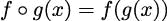
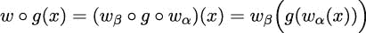
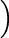

## 12

装饰器设计技巧

Python 为我们提供了许多创建高阶函数的方法。在第五章中，高阶函数，我们探讨了两种技术：定义一个接受函数作为参数的函数，以及定义一个`Callable`的子类，它要么用函数初始化，要么用函数作为参数调用。

装饰函数的一个好处是它可以创建复合函数。这些是包含来自多个来源的功能的单个函数。将装饰语法作为表达复杂处理的方式通常很有帮助。

我们还可以使用装饰器来识别类或函数，通常构建一个注册表——相关定义的集合。在构建注册表时，我们不一定需要创建复合函数。

在本章中，我们将探讨以下主题：

+   使用装饰器基于另一个函数构建函数

+   `functools` 模块中的 `wraps()` 函数；这可以帮助我们构建装饰器

+   `update_wrapper()` 函数，在罕见的情况下，当我们想要访问原始函数以及包装函数时可能很有帮助

### 12.1 装饰器作为高阶函数

装饰器的核心思想是将某个原始函数转换成一个新的函数。这样使用时，装饰器创建了一个基于装饰器和被装饰的原始函数的复合函数。

装饰器可以用以下两种方式之一使用：

+   作为前缀，它创建了一个与基本函数同名的新函数，如下所示：

    ```py
    @decorator 
    def base_function() -> None: 
        pass
    ```

+   作为一种显式操作，它返回一个新的函数，可能带有新的名称：

    ```py
    def base_function() -> None: 
        pass 

    base_function = decorator(base_function)
    ```

这是对同一操作的两种不同语法。前缀表示法具有整洁和简洁的优点。对于某些读者来说，前缀位置也更明显。后缀表示法是明确的，并且稍微灵活一些。

虽然前缀表示法很常见，但使用后缀表示法也有一个原因：我们可能不希望生成的函数替换原始函数。我们可能希望执行以下命令，这允许我们同时使用装饰过的和未装饰过的函数：

```py
new_function = decorator(base_function)
```

这将从一个原始函数构建一个新的函数，命名为`new_function()`。当使用`@decorator`语法时，原始函数就不再可用。实际上，一旦名称被重新分配给一个新的函数对象，原始对象可能就没有剩余的引用，它曾经占用的内存可能符合回收的条件。

装饰器是一个接受函数作为参数并返回函数作为结果的函数。这种基本描述显然是语言的内建特性。表面上，这似乎意味着我们可以更新或调整函数的内部代码结构。

Python 不是通过调整函数的内部结构来工作的。Python 不是通过篡改字节码来工作的，而是使用定义一个新函数来包装原始函数的更干净的方法。这样更容易处理参数值或结果，同时保持原始函数的核心处理不变。

在定义装饰器时，涉及两个阶段的高阶函数；它们如下：

+   在定义时间，装饰器函数将包装器应用于基础函数，并返回新的、包装过的函数。装饰过程可以在构建装饰函数的过程中执行一些一次性评估。例如，可以计算复杂的默认值。

+   在评估时间，包装函数可以（并且通常确实）评估基础函数。包装函数可以预先处理参数值或后处理返回值（或者两者都做）。也有可能包装函数可能避免调用基础函数。例如，在管理缓存的情况下，包装的主要原因是避免对基础函数进行昂贵的调用。

以下是一个装饰器的示例：

```py
from collections.abc import Callable 
from functools import wraps 

def nullable(function: Callable[[float], float]) -> Callable[[float | None], float | None]: 
    @wraps(function) 
    def null_wrapper(value: float | None) -> float | None: 
        return None if value is None else function(value) 
    return null_wrapper
```

我们几乎总是希望在创建自己的装饰器时使用`@wraps`装饰器，以确保装饰的函数保留了原始函数的属性。例如，复制`__name__`和`__doc__`属性，确保生成的装饰函数具有原始函数的名称和文档字符串。

结果的复合函数，定义为装饰器定义中的`null_wrapper()`函数，也是一种高阶函数，它将原始函数、`function`可调用对象组合在一个表达式中，同时保留`None`值。在生成的`null_wrapper()`函数内部，原始的`function`可调用对象不是一个显式的参数；它是一个自由变量，其值将从`null_wrapper()`函数定义的上下文中获取。

`@nullable`装饰器的返回值是新铸造的函数。它将被分配给原始函数的名称。重要的是装饰器只返回函数，并且它们不尝试处理数据。装饰器使用元编程：创建更多代码的代码。生成的`null_wrapper()`函数是打算处理应用程序数据的函数。

`typing`模块使得使用`Optional`类型定义或`|`类型运算符来描述 null 感知函数和 null 感知结果变得特别容易。定义`float|None`或`Optional[float]`意味着`Union[float, None]`；要么是一个`None`对象，要么是一个`float`对象，都符合类型提示的描述。

例如，我们假设我们有一个缩放函数，它将输入数据从海里转换为英里。这可以与在英里中进行计算的地理定位数据一起使用。从海里（n）到英里（s）的基本转换是一个乘法：s = 1.15078 × n。

我们可以将我们的`@nullable`装饰器应用于创建一个组合函数，如下所示：

```py
import math 

@nullable 
def st_miles(nm: float) -> float: 
    return 1.15078 * nm
```

这将创建一个函数`st_miles()`，它是小数学运算的空值感知版本。装饰过程返回一个调用原始`st_miles()`函数的`null_wrapper()`函数版本。这个结果将被命名为`st_miles()`，并将具有包装器和原始基本函数的复合行为。

我们可以使用这个组合的`st_miles()`函数如下所示：

```py
>>> some_data = [8.7, 86.9, None, 43.4, 60] 
>>> scaled = map(st_miles, some_data) 
>>> list(scaled) 
[10.011785999999999, 100.002782, None, 49.94385199999999, 69.04679999999999]
```

我们已经将函数应用于一组数据值。`None`值礼貌地导致`None`结果。没有涉及异常处理。

作为第二个例子，以下是使用相同的装饰器创建一个空值感知的四舍五入函数的方法：

```py
@nullable 
def nround4(x: float) -> float: 
    return round(x, 4)
```

这个函数是`round()`函数的部分应用，被包装成空值感知的形式。我们可以使用这个`nround4()`函数来为我们的`st_miles()`函数创建一个更好的测试用例，如下所示：

```py
>>> some_data = [8.7, 86.9, None, 43.4, 60] 
>>> scaled = map(st_miles, some_data) 
>>> [nround4(v) for v in scaled] 
[10.0118, 100.0028, None, 49.9439, 69.0468]
```

这个四舍五入的结果将不受任何平台考虑的影响。这对于`doctest`测试来说非常方便。

作为另一种实现方式，我们也可以使用以下代码创建这些空值感知函数：

```py
st_miles_2: Callable[[float | None], float | None] = ( 
    nullable(lambda nm: nm * 1.15078) 
) 
nround4_2: Callable[[float | None], float | None] = ( 
    nullable(lambda x: round(x, 4)) 
)
```

我们没有在函数定义`def`语句前使用`@nullable`装饰器。相反，我们将`nullable()`函数应用于另一个定义为 lambda 形式的函数。这些表达式与函数定义前使用装饰器具有相同的效果。

注意到将类型提示应用于 lambda 表达式是有挑战性的。变量`nround4_2`被赋予了一个`Callable`类型的提示，其参数列表为`float`或`None`，返回类型为`float`或`None`。`Callable`提示仅适用于位置参数。在存在关键字参数或其他复杂情况时，请参阅[`mypy.readthedocs.io/en/stable/additional_features.html?highlight=callable#extended-callable-types`](https://mypy.readthedocs.io/en/stable/additional_features.html?highlight=callable#extended-callable-types)。

`@nullable`装饰器假设被装饰的函数是一元函数。我们需要重新审视这个设计，以创建一个更通用的空值感知装饰器，它可以与任意参数集合一起工作。

在第十三章，PyMonad 库中，我们将探讨解决容忍`None`值问题的另一种方法。PyMonad 库定义了一个`Maybe`类，其对象可能具有适当的值或可能是`None`值。

#### 12.1.1 使用`functools.update_wrapper()`函数

`@wraps`装饰器将`update_wrapper()`函数应用于保留被包装函数的一些属性。通常，默认情况下它就完成了我们所需的所有事情。这个函数从原始函数复制一系列特定的属性到由装饰器创建的结果函数中。

`update_wrapper()`函数依赖于在`functools`模块中定义的全局变量来确定要保留哪些属性。`WRAPPER_ASSIGNMENTS`变量定义了默认情况下复制的属性。默认值是以下要复制的属性列表：

```py
(’__module__’, ’__name__’, ’__qualname__’, ’__doc__’, 
’__annotations__’)
```

对这个列表进行有意义的修改是困难的。`def`语句的内部结构不允许简单的修改或更改。这个细节主要作为参考信息是有趣的。

如果我们要创建可调用对象，那么我们可能有一个类，它作为定义的一部分提供一些额外的属性。这可能导致装饰器必须从原始包装的可调用对象复制这些额外的属性到正在创建的包装函数。然而，通过面向对象类设计进行这些类型的更改似乎更简单，而不是利用复杂的装饰器技术。

### 12.2 横切关注点

装饰器背后的一个基本原则是允许我们通过装饰器和应用装饰器的原始函数来构建一个组合函数。想法是拥有一个常见的装饰器库，它可以提供对常见问题的实现。

我们通常将这些横切关注点称为跨多个函数应用。这些是我们希望通过装饰器一次性设计，并在整个应用程序或框架中的相关类中应用的事情。

通常作为装饰器定义集中化的关注点包括以下内容：

+   日志

+   审计

+   安全性

+   处理不完整数据

例如，一个日志装饰器可能会将标准消息写入应用程序的日志文件。一个审计装饰器可能会写入数据库更新的详细信息。一个安全装饰器可能会检查一些运行时上下文，以确保登录用户具有必要的权限。

我们对函数的空值感知包装器的示例是一个横切关注点。在这种情况下，我们希望有多个函数处理`None`值，通过返回`None`值而不是抛出异常。在数据不完整的应用程序中，我们可能需要以简单、统一的方式处理行，而无需编写大量分散注意力的`if`语句来处理缺失值。

### 12.3 组合设计

组合函数的常见数学表示如下：



想法是我们可以定义一个新的函数，f ∘g(x)，它结合了两个其他函数，f(y)和 g(x)。

Python 可以通过以下代码实现组合函数的多行定义：

```py
@f_deco 
def g(x): 
    something
```

结果函数可以基本上等同于 f ∘ g(x)。`@f_deco`装饰器必须通过合并 f(y)的内部定义与提供的基函数 g(x)来定义并返回组合函数。

实现细节显示 Python 实际上提供了一种稍微复杂一点的组合类型。包装器的结构使得将 Python 装饰器组合视为以下内容是有帮助的：



应用到某个应用函数 g(x)的装饰器将包括一个包装函数 w(y)，它有两个部分。包装器的一部分，wα，应用于基本函数的参数；另一部分，wβ，应用于基本函数的结果。

这里有一个稍微更具体的概念，以`@stringify`装饰器定义的形式展示：

```py
def stringify(argument_function: Callable[[int, int], int]) -> Callable[[str], str]: 
    @wraps(argument_function) 
    def two_part_wrapper(text: str) -> str: 
        # The "before" part 
        arg1, arg2 = map(int, text.split(",")) 
        int_result = argument_function(arg1, arg2) 
        # The "after" part 
        return str(int_result) 
    return two_part_wrapper
```

这个装饰器插入从字符串到整数的转换，以及从整数回到字符串的转换。在处理 CSV 文件时，内容总是字符串数据，隐藏字符串处理的细节可能是有帮助的。

我们可以将这个装饰器应用于一个函数：

```py
>>> @stringify 
... def the_model(m: int, s: int) -> int: 
...     return m * 45 + s * 3 
... 
>>> the_model("5,6") 
’243’
```

这显示了在原始函数之前以及之后注入额外处理的两处地方。这强调了函数组合的抽象概念与 Python 实现之间的重要区别：装饰器可以创建 f(g(x))、g(f(x))或更复杂的 f[β]g(fα)。装饰语的语法没有描述将创建哪种组合。

装饰器的真正价值在于任何 Python 语句都可以用在包装函数中。装饰器可以使用`if`或`for`语句将一个函数转换成条件或迭代使用的函数。在下一节中，示例将利用`try:`语句执行带有标准错误恢复的操作。在这个通用框架内可以完成很多事情。

大量的函数式编程遵循 f ∘ g(x)的基本设计模式。从两个较小的函数定义一个组合可以帮助总结复杂的处理。在其他情况下，保持两个函数分开可能更有信息量。

创建常见的高阶函数的组合，如`map()`、`filter()`和`functools.reduce()`，很容易。因为这些函数相对简单，组合函数通常很容易描述，并且可以帮助使代码更具表达性。

例如，一个应用程序可能包括`map(f, map(g, x))`。创建一个组合函数并使用`map(f_g, x)`表达式来描述将组合应用于集合可能更清晰。我们可以使用`f_g = lambda x: f(g(x))`来帮助解释一个复杂的应用作为更简单函数的组合。为了确保类型提示正确，我们几乎总是想使用`def`语句定义单独的函数。

重要的是要注意，这两种技术都没有真正的性能优势。`map()` 函数是惰性的：使用两个 `map()` 函数时，一个项目将从源集合 `x` 中取出，由 `g()` 函数处理，然后由 `f()` 函数处理。使用单个 `map()` 函数时，一个项目将从源集合 `x` 中取出，然后由 `f_g()` 合成函数处理；内存使用相同。

在第十三章 《PyMonad 库》中，我们将探讨从单个柯里化函数创建复合函数的替代方法。

#### 12.3.1 坏数据处理预处理

在一些探索性数据分析应用中，一个跨领域的关注点是如何处理缺失或无法解析的数值。我们经常遇到混合了 `float`、`int`、`datetime.datetime` 和 `decimal.Decimal` 货币值，我们希望以某种一致性对这些值进行处理。

在其他情况下，我们用不可用或不可用的占位符代替数据值；这些不应该干扰计算的主线。允许不可用值在表达式通过而不引发异常通常是很有用的。我们将重点关注三个不良数据转换函数：`bd_int()`、`bd_float()` 和 `bd_decimal()`。我们将 `bd_datetime()` 留作读者的练习。

我们要添加的复合功能将首先定义。然后我们将使用这个功能来包装内置的转换函数。以下是一个简单的坏数据装饰器：

```py
from collections.abc import Callable 
import decimal 
from typing import Any, Union, TypeVar, TypeAlias 

Number: TypeAlias = Union[decimal.Decimal, float] 
NumT = TypeVar("NumT", bound=Number) 

def bad_data( 
         function: Callable[[str], NumT] 
) -> Callable[[str], NumT]: 
    @wraps(function) 
    def wrap_bad_data(source: str, **kwargs: Any) -> NumT: 
        try: 
            return function(source, **kwargs) 
        except (ValueError, decimal.InvalidOperation): 
            cleaned = source.replace(",", "") 
            return function(cleaned, **kwargs) 
    return wrap_bad_data
```

装饰器 `@bad_data` 包装了一个给定的转换函数，参数名为 `function`，以便在第一次转换失败时尝试第二次转换。`ValueError` 和 `decimal.InvalidOperation` 异常通常是数据格式无效的指标：不良数据。在移除 `","` 字符后，将尝试第二次转换。这个包装器将 `*args` 和 `**kwargs` 参数传递给包装的函数。这确保了包装的函数可以接受额外的参数值。

类型变量 `NumT` 绑定到被包装的基本函数的原返回类型，即 `function` 参数的值。装饰器被定义为返回具有相同类型 `NumT` 的函数。此类型有 `float` 和 `Decimal` 类型的并集作为上限。这个边界允许是 `float` 或 `Decimal` 的子类的对象。

复杂装饰器设计的类型提示正在迅速演变。特别是，PEP 612 ([`peps.python.org/pep-0612/`](https://peps.python.org/pep-0612/)) 定义了一些新的结构，这些结构可以允许更加灵活的类型提示。对于不进行任何类型更改的装饰器，我们可以使用泛型参数变量，如 `ParamSpec`，来捕获被装饰函数的实际参数。这使得我们能够编写泛型装饰器，而无需与被装饰函数的类型提示细节纠缠。我们将指出 PEP 612 的 `ParamSpec` 和 `Concatenate` 将在何处有用。在设计泛型装饰器时，务必查看 PEP 612 的示例。

我们可以使用这个包装器创建对不良数据敏感的函数，如下所示：

```py
from decimal import Decimal 

bd_int = bad_data(int) 
bd_float = bad_data(float) 
bd_decimal = bad_data(Decimal)
```

这将创建一系列函数，可以进行良好数据的转换，以及有限的数据清洗来处理特定类型的不良数据。

为某些类型的可调用对象编写类型提示可能很困难。例如，`int()` 函数有可选的关键字参数，它们有自己的复杂类型提示。我们的装饰器将这些关键字参数总结为 `**kwargs: Any`。理想情况下，可以使用 `ParamSpec` 来捕获被包装函数的参数细节。有关为可调用对象创建复杂类型签名的指导，请参阅 PEP 612 ([`peps.python.org/pep-0612/`](https://peps.python.org/pep-0612/))).

下面是使用 `bd_int()` 函数的一些示例：

```py
>>> bd_int("13") 
13 
>>> bd_int("1,371") 
1371 
>>> bd_int("1,371", base=16) 
4977
```

我们已经将 `bd_int()` 函数应用于转换整洁的字符串以及具有我们所能容忍的特定类型的标点符号的字符串。我们还展示了我们可以为这些转换函数中的每一个提供额外的参数。

我们可能希望有一个更灵活的装饰器。我们可能希望添加的一个特性是处理各种数据清理替代方案的能力。简单的 `","` 移除并不总是我们所需要的。我们可能还需要移除 `$` 或 ° 符号。我们将在下一节中查看更复杂、参数化的装饰器。

### 12.4 向装饰器添加参数

一个常见的需求是使用额外的参数自定义装饰器。而不是简单地创建一个复合函数 f ∘ g(x)，我们可以做点更复杂的事情。使用参数化装饰器，我们可以创建 f(c) ∘ g(x)。我们已将参数 c 作为创建包装器 f(c) 的一部分应用。然后，这个参数化复合函数 f(c) ∘ g 可以应用于实际数据 x。

在 Python 语法中，我们可以这样写：

```py
@deco(arg) 
def func(x): 
    base function processing...
```

这有两个步骤。第一步是将参数应用于一个抽象装饰器以创建一个具体装饰器。然后，将具体的参数化 `deco(arg)` 函数应用于基础函数定义以创建装饰函数。

其效果如下：

```py
concrete_deco = deco(arg) 

def func(x): 
    base function processing... 

func = concrete_deco(func)
```

参数化装饰器通过以下三个步骤工作：

1.  将抽象装饰器 `deco()` 应用于其参数 `arg`，以创建具体的装饰器 `concrete_deco()`。

1.  定义了基础函数，`func()`。

1.  将具体的装饰器 `concrete_deco()` 应用于基础函数以创建函数的装饰版本；实际上，它是 `deco(arg)(func)`。

带参数的装饰器涉及到最终函数的间接构造。我们似乎已经超越了仅仅是一阶函数，进入了一个更加抽象的领域：创建更高阶函数的一阶函数。

我们可以将我们的 bad-data-aware 装饰器扩展以创建一个稍微更灵活的转换。我们将定义一个 `@bad_char_remove` 装饰器，它可以接受要移除的字符参数。以下是一个参数化的装饰器：

```py
from collections.abc import Callable 
import decimal 
from typing import Any, TypeVar 

T = TypeVar(’T’) 

def bad_char_remove( 
    *bad_chars: str 
) -> Callable[[Callable[[str], T]], Callable[[str], T]]: 
    def cr_decorator( 
            function: Callable[[str], T] 
    ) -> Callable[[str], T]: 
        def clean_list(text: str, *, to_replace: tuple[str, ...]) -> str: 
            if to_replace: 
                return clean_list( 
                    text.replace(to_replace[0], ""), 
                    to_replace=to_replace[1:] 
                ) 
            return text 

        @wraps(function) 
        def wrap_char_remove(text: str, **kwargs: Any) -> T: 
            try: 
                return function(text, **kwargs) 
            except (ValueError, decimal.InvalidOperation): 
                cleaned = clean_list(text, to_replace=bad_chars) 
                return function(cleaned, **kwargs) 
        return wrap_char_remove 
    return cr_decorator
```

参数化装饰器有两个内部函数定义：

+   具体的装饰器；在这个例子中，是 `cr_decorator()` 函数。这将有一个名为 `bad_chars` 的自由变量绑定到正在构建的函数上。具体的装饰器随后被返回；它将被应用于基础函数。当应用时，装饰器将返回一个新函数，该函数被 `wrap_char_remove()` 函数包装。这个新的 `wrap_char_remove()` 函数具有类型提示，其中包含类型变量 `T`，它声称被包装的函数的类型将被新的 `wrap_char_remove()` 函数保留。

+   装饰包装器，在这个例子中是 `wrap_char_remove()` 函数，将替换原始函数为包装版本。由于 `@wraps` 装饰器，新函数的 `__name__`（和其他属性）将被替换为被包装的基础函数的名称。

整体装饰器，在这个例子中是 `@bad_char_remove` 函数，其任务是绑定参数 `bad_chars` 到一个函数，并返回具体的装饰器。类型提示澄清了返回值是一个 `Callable` 对象，它将一个 `Callable` 函数转换成另一个 `Callable` 函数。然后语言规则将具体装饰器应用于以下函数定义。

内部 `clean_list()` 函数被 `@bad_char_remove` 装饰器用来移除给定参数值中的所有字符。这被定义为递归以保持其非常简短。如果需要，它可以优化为迭代。我们将这个优化留作读者的练习。

我们可以使用 `@bad_char_remove` 装饰器创建转换函数，如下所示：

```py
from decimal import Decimal 
from typing import Any 

@bad_char_remove("$", ",") 
def currency(text: str, **kw: Any) -> Decimal: 
    return Decimal(text, **kw)
```

我们已经使用我们的 `@bad_char_remove` 装饰器包装了一个基础 `currency()` 函数。`currency()` 函数的基本特征是对 `decimal.Decimal` 构造函数的引用。

这个 `currency()` 函数现在将处理一些变体数据格式：

```py
>>> currency("13") 
Decimal(’13’) 
>>> currency("$3.14") 
Decimal(’3.14’) 
>>> currency("$1,701.00") 
Decimal(’1701.00’)
```

现在，我们可以使用相对简单的 `map(currency, row)` 表达式来处理输入数据，将源数据从字符串转换为可用的 `Decimal` 值。`try:`/`except:` 错误处理已被隔离到一个我们用来构建复合转换函数的函数中。

我们可以使用类似的设计来创建容错函数。这些函数将使用类似的 `try:`/`except:` 包装器，但会返回 `None` 值。这种设计变体留给读者作为练习。

此装饰器仅限于应用于单个字符串的转换函数，并且具有类似于 `Callable[[str], T]` 的类型提示。对于泛型装饰器，参考 PEP-612 中的示例，并使用 `ParamSpec` 和 `Concatenate` 类型提示来扩展装饰器的应用范围是有帮助的。因为我们感兴趣的是将内部 `clean_list()` 函数应用于第一个参数值，所以我们可以将转换函数视为 `Callable[Concatenate[str, P], T]`。我们将定义第一个参数为字符串，并使用 `ParamSpec`，`P` 来表示转换函数的所有其他参数。

### 12.5 实现更复杂的装饰器

要创建更复杂的组合，Python 允许以下类型的函数定义：

```py
@f_wrap 
@g_wrap 
def h(x): 
    return something...
```

Python 允许堆叠修改其他装饰器结果的装饰器。这有点像 f ∘g ∘h(x)。然而，结果名称将仅仅是 h(x)，隐藏了装饰器的堆栈。由于这种潜在的混淆，我们在创建涉及深度嵌套装饰器的函数时需要谨慎。如果我们的意图仅仅是处理一些横切关注点，那么每个装饰器都应该设计为处理一个单独的关注点，同时避免混淆。

虽然装饰器可以做很多事情，但使用装饰器创建清晰、简洁、表达性强的编程是至关重要的。当处理横切关注点时，装饰器的特性通常与被装饰的函数本质上不同。这可能是一种非常好的简化。通过装饰器添加日志记录、调试或安全检查是一种广泛遵循的做法。

过度复杂的设计的一个重要后果是难以提供适当的类型提示。当类型提示退化为简单地使用 `Callable[..., Any]` 时，设计可能已经变得难以清晰地推理。

### 12.6 复杂的设计考虑

在我们数据清理的情况下，简单的去除杂散字符可能不足以满足需求。当处理地理位置数据时，我们可能会遇到各种输入格式，包括简单的度数（`37.549016197`）、度分（`37`° `32.94097`′）和度分秒（`37`° `32`′ `56.46`′′）。当然，还可能有更微妙的数据清理问题：一些设备会创建带有 Unicode `U+00BA` 字符，º，即“男性序数指示符”，而不是类似的外观度数字符，°，它是 `U+00B0`。

因此，通常有必要提供一个单独的清洗函数，它与转换函数捆绑在一起。这个函数将处理输入所需的更复杂的转换，这些输入在格式上与经纬度一样不一致。

我们如何实现这一点？我们有多种选择。简单的更高阶函数是一个不错的选择。另一方面，装饰器并不奏效。我们将研究基于装饰器的设计，以了解装饰器中哪些是有意义的。

需求有以下两个正交的设计考虑：

+   从 `string` 到 `int`、`float` 或 `Decimal` 的输出转换，总结为 `Callable[str, T]`

+   输入清洗；移除多余的字符，重新格式化坐标；总结为 `Callable[str, str]`

理想情况下，可以将这些方面中的一个视为被封装的基本功能，而另一个方面则是通过装饰添加的。本质与封装的选择并不总是明确的。

考虑到之前的例子，这似乎应该被视为一个三部分的复合体：

+   从 `string` 到 `int`、`float` 或 `decimal` 的输出转换

+   输入清洗：简单的替换或更复杂的多个字符替换

+   一个整体处理函数，首先尝试转换，然后作为对异常的响应执行任何清洗，然后再次尝试转换

第三部分——尝试转换和重试——实际上是封装器，它也构成了复合函数的一部分。正如我们之前提到的，封装器包含一个参数阶段和一个返回值阶段，我们可以分别称之为 wα 和 wβ。

我们想使用这个封装器来创建两个附加函数的复合体。我们有两个设计选择。我们可以将清洗函数作为转换装饰器的参数包含，如下所示：

```py
@cleanse_before(cleanser) 
def convert(text: str) -> int: 
    # code to convert the text, trusting it was clean 
    return # an int value
```

第一种设计声称转换函数是核心的，清洗是一个辅助细节，它将修改行为但保留转换的原始意图。

或者，我们可以将转换函数作为清洗函数的参数包含在装饰器中，如下所示：

```py
@then_convert(converter) 
def cleanse(text: str) -> str: 
    # code to clean the text 
    return # the str value for later conversion
```

第二种设计声称清洗是核心的，而转换是一个辅助细节。这有点令人困惑，因为清洗的类型通常是 `Callable[[str], str]`，而转换的类型 `Callable[[str], some other type]` 是整体封装函数所要求的。

虽然这两种方法都可以创建一个可用的复合函数，但第一个版本有一个重要的优点：`conversion()` 函数的类型签名也是结果复合函数的类型签名。这突出了装饰器的一般设计模式：被装饰函数的类型注解——签名——是最容易保留的。

当面对定义复合函数的多个选择时，通常最容易保留被装饰函数的类型提示。这有助于识别核心概念。

因此，`@cleanse_before(cleaner)` 风格的装饰器更受欢迎。装饰器定义看起来如下示例：

```py
from collections.abc import Callable 
from typing import Any, TypeVar 

# Defined Earlier: 
# T = TypeVar(’T’) 

def cleanse_before( 
    cleanse_function: Callable[[str], Any] 
) -> Callable[[Callable[[str], T]], Callable[[str], T]]: 
    def concrete_decorator(converter: Callable[[str], T]) -> Callable[[str], T]: 
        @wraps(converter) 
        def cc_wrapper(text: str, **kwargs: Any) -> T: 
            try: 
                return converter(text, **kwargs) 
            except (ValueError, decimal.InvalidOperation): 
                cleaned = cleanse_function(text) 
                return converter(cleaned, **kwargs) 
        return cc_wrapper 
    return concrete_decorator
```

我们已经定义了以下多层装饰器：

+   核心是 `cc_wrapper()` 函数，它应用 `converter()` 函数。如果这失败了，它将使用给定的 `cleanse_function()` 函数，然后再次尝试 `converter()` 函数。

+   `cc_wrapper()` 函数是由 `concrete_decorator()` 装饰器围绕给定的 `cleanse_function()` 和一个 `converter()` 函数构建的。`converter()` 函数是被装饰的函数。

+   最外层是 `concrete_decorator()` 函数。这个装饰器将 `cleanse_function()` 函数作为一个自由变量。

+   当装饰器接口 `cleanse_before()` 被评估时，创建了具体的装饰器。接口通过提供 `cleanse_function` 作为参数值来定制。

类型提示强调了 `@cleanse_before` 装饰器的角色。它期望一个名为 `cleanse_function` 的 `Callable` 函数，并创建一个函数，显示为 `Callable[[str], T]`，它将转换一个函数为一个包装函数。这是一个关于参数化装饰器如何工作的有用提醒。

我们现在可以构建一个稍微更灵活的净化和转换函数 `to_int()`，如下所示：

```py
def drop_punct2(text: str) -> str: 
    return text.replace(",", "").replace("$", "") 

@cleanse_before(drop_punct2) 
def to_int(text: str, base: int = 10) -> int: 
    return int(text, base)
```

整数转换被装饰了一个净化函数。在这种情况下，净化函数移除了 `$` 和 `,` 字符。整数转换被这个净化所包装。

之前定义的 `to_int()` 函数利用了内置的 `int()` 函数。一个避免使用 `def` 语句的替代定义如下：

```py
to_int2 = cleanse_before(drop_punct2)(int)
```

这使用 `drop_punct2()` 来包装内置的 `int()` 转换函数。使用 mypy 工具的 `reveal_type()` 函数显示，`to_int()` 的类型签名与内置 `int()` 的类型签名相匹配。可以争论说，这种风格不如使用装饰器可读。

我们可以这样使用增强的整数转换：

```py
>>> to_int("1,701") 
1701 
>>> to_int("42") 
42
```

对于底层 `int()` 函数的类型提示已经被重写（并简化）以适用于装饰函数 `to_int()`。这是尝试使用装饰器包装内置函数的结果。

由于定义参数化装饰器的复杂性，这似乎是极限。装饰器模型似乎不适合这种设计。似乎复合函数的定义比构建装饰器所需的机制更清晰。

另一种选择是复制几行代码，这些代码对于所有转换函数都是相同的。我们可以使用：

```py
def to_int_flat(text: str, base: int = 10) -> int: 
    try: 
        return int(text, base) 
    except (ValueError, decimal.InvalidOperation): 
        cleaned = drop_punct2(text) 
        return int(cleaned, base)
```

每种数据类型转换都会重复 `try-except` 块。装饰器的使用以某种方式隔离了这种设计特性，可以应用于任何数量的转换函数，而无需明确重述代码。当使用这种替代方案进行设计更改时，可能需要编辑多个类似函数，而不是更改一个装饰器。

通常，当我们想要在给定的函数（或类）中包含多个相对简单且固定的方面时，装饰器工作得很好。当这些额外的方面可以被视为基础设施或支持，而不是应用程序代码含义的必要部分时，装饰器也非常重要。

对于涉及多个正交设计方面的内容，我们可能需要求助于具有各种插件策略对象的调用类定义。这可能比等效装饰器有更简单的类定义。装饰器的另一种替代方案是仔细研究创建高阶函数。在某些情况下，具有各种参数组合的偏函数可能比装饰器更简单。

跨切面关注点的典型例子包括日志记录或安全测试。这些功能可以被视为不是特定于问题域的背景处理。当我们拥有的处理像围绕我们的空气一样无处不在时，装饰器可能是一种适当的设计技术。

### 12.7 概述

在本章中，我们探讨了两种类型的装饰器：无参数的简单装饰器和参数化装饰器。我们看到了装饰器如何涉及函数之间的间接组合：装饰器将一个函数（在装饰器内部定义）围绕另一个函数包装。

使用 `functools.wraps()` 装饰器确保我们的装饰器能够正确地复制被包装函数的属性。这应该是我们编写的每个装饰器的一部分。

在下一章中，我们将探讨 PyMonad 库，以直接在 Python 中表达函数式编程概念。通常我们不需要 monads，因为 Python 本质上是一种命令式编程语言。

### 12.8 练习

本章的练习基于 Packt Publishing 在 GitHub 上提供的代码。请参阅[`github.com/PacktPublishing/Functional-Python-Programming-3rd-Edition`](https://github.com/PacktPublishing/Functional-Python-Programming-3rd-Edition)。

在某些情况下，读者会注意到 GitHub 上提供的代码包含了一些练习的部分解决方案。这些解决方案作为提示，允许读者探索替代方案。

在许多情况下，练习需要单元测试用例来确认它们确实解决了问题。这些通常与 GitHub 仓库中已提供的单元测试用例相同。读者应将书籍中的示例函数名称替换为自己的解决方案，以确认其工作。

#### 12.8.1 日期时间转换

在本章的预处理坏数据部分，我们介绍了数据转换函数的概念，这些函数包括特殊的不适用或不可用数据值。这些通常被称为空值；因此，数据库可能有一个通用的 `NULL` 文字面量。我们将它们称为“坏数据”，因为这是我们经常发现它们的方式。在第一次检查数据时，我们发现坏数据可能代表缺失或不适用的值。

这种类型的数据可能有以下可能的处理路径：

+   坏数据会被静默忽略；它们不会被计入总数和平均值。为了使这个过程有效，我们通常会想要用一致的值替换坏值。`None` 对象是一个很好的替换值。

+   坏数据会停止处理，引发异常。这相当容易实现，因为 Python 通常会自动这样做。在某些情况下，我们想要使用替代规则重试转换。我们将专注于这种方法进行练习。

+   坏数据被替换为插值或估计值。这通常意味着保留数据集合的两个版本：一个包含坏数据，另一个包含替换值，更有用。这不是一个简单的计算。

我们的核心 `bad_data()` 函数的想法是尝试转换，替换已知坏标点符号，然后再次尝试。例如，我们可能会从数值中删除“,”和“`$`”。

在本章的前面部分，我们描述了三个坏数据转换函数：`bd_int()`、`bd_float()` 和 `bd_decimal()`。每个都执行了一个相对直接的转换或替换算法。我们将 `bd_datetime()` 函数留作读者的练习。在这种情况下，替代日期格式可能会导致更多的复杂性。

我们假设日期必须采用以下三种格式之一：“yyyy-mon-dd”、“yyyy-mm-dd”或没有年份的“mon-dd”。在第一种和第三种格式中，月份名称是完整的。在第二种格式中，月份名称是数字的。这些由 `datetime.strptime()` 函数使用格式字符串如 `"%Y-%b-%d"`、`"%b-%d"` 和 `"%Y-%m-%d"` 处理。

编写一个 `bd_datetime()` 函数，尝试多种数据格式转换，寻找一个能生成有效日期的格式。在缺少年份的情况下，可以使用 `datetime.replace()` 方法结合当前年份构建最终的日期结果。

一旦基本实现完成，创建包含有效和无效日期的适当测试用例。

确保设计足够灵活，以便在不费太多力气的情况下添加另一个格式。

#### 12.8.2 优化装饰器

在本章的向装饰器添加参数部分，我们定义了一个装饰器，用于替换给定字段中的“坏”字符，并重试尝试的转换。

这个装饰器有一个内部函数 `clean_list()`，它提供了一个递归定义，用于从字符串中移除坏字符。

这里是 Python 函数的定义：

```py
    def clean_list(text: str, *, to_replace: tuple[str, ...]) -> str: 
        ...
```

这个递归有两个情况：

+   当 `to_replace` 参数值为空时，没有要替换的内容，`text` 参数的值将保持不变。

+   否则，将 `to_replace` 字符串分割，将第一个字符与剩余字符分开。从 `text` 参数的值中删除任何第一个字符的出现，并使用 `to_replace` 字符串的剩余字符再次应用此函数。

回顾 第六章，递归和归约，我们回忆起这种尾递归可以转换为一个 `for` 语句。重写 `clean_list()` 函数以消除递归。

#### 12.8.3 无容错函数

在本章的 向装饰器添加参数 部分，我们看到了使用 `try:`/`except:` 包装器来揭示带有虚假标点的数字的设计模式。类似的技巧可以用来检测 `None` 值并将它们通过一个函数传递，而不进行任何处理。

编写一个装饰器，可以用于 `Callable[[float], float]` 函数，该函数将优雅地处理 `None` 值。

如果无容错装饰器被命名为 `@none_tolerant`，这里是一个测试用例：

```py
@none_tolerant 
def x2(x: float) -> float: 
    return 2 * x 

def test_x2() -> None: 
    assert x2(42.) == 84.0 
    assert x2(None) == None 
    assert list(map(x2, [1, 2, None, 3])) == [2, 3, None, 6]
```

#### 12.8.4 记录日志

调试的一个常见需求是一组一致的日志消息。在许多紧密相关的函数中包含 `logger.debug()` 行可能会变得繁琐。如果函数具有一致的类型定义集，定义一个可以应用于多个相关函数的装饰器可能会有所帮助。

作为示例函数，我们将定义一组“模型”，这些模型从样本值计算期望结果。我们将从一个数据类开始，定义每个样本具有一个标识符、一个观察值和一个时间戳。它看起来像这样：

```py
from dataclasses import dataclass 
@dataclass(frozen=True) 
class Sample: 
    id: int 
    observation: float 
    date_time: datetime.datetime
```

我们有三个模型来计算期望值 e，从样本中的观察值 s[o] 中得到：

+   e = 0.7412 × s[o]

+   e = 0.9 × s[o] − 90

+   e = 0.7724 × s[o]^(1.0134)

首先，定义这三个函数以及适当的测试用例。

第二，定义一个 `@logging` 装饰器，使用 `logger.info()` 记录样本值和计算出的期望值。

第三，在每个函数定义前添加 `@logging` 装饰器。

创建一个整体应用程序，使用 `logging.basicConfig()` 将日志级别设置为 `logging.INFO`，以确保可以看到信息性消息。（默认日志级别仅显示警告和错误。）

这允许为三个“模型”函数创建一个一致的日志设置。这反映了应用程序的日志方面与从样本值计算期望值之间的完全分离。这种分离是否清晰且有助于理解？是否存在这种分离可能不理想的情况？

实际测量结果在此给出。其中一个模型比其他模型更准确：

|

* * *

|

* * *

|

* * *

|

| 样本编号 | 观察 | 实际 |
| --- | --- | --- |

|

* * *

|

* * *

|

* * *

|

| 1 | 1000 | 883 |
| --- | --- | --- |
| 2 | 1500 | 1242 |
| 3 | 1500 | 1217 |
| 4 | 1600 | 1306 |
| 5 | 1750 | 1534 |
| 6 | 2000 | 1805 |
| 7 | 2000 | 1720 |

|

* * *

|

* * *

|

* * *

|

|  |  |  |
| --- | --- | --- |

#### 12.8.5 干运行检查

可以修改文件系统的应用程序需要广泛的单元测试以及集成测试。为了进一步降低风险，这些应用程序通常会有一个“干运行”模式，其中文件系统修改被记录但不会执行；文件不会被移动，目录不会被删除，等等。

这里的想法是为文件系统状态变化编写小的函数。然后，每个函数都可以用 `@dry_run_check` 装饰器装饰。这个装饰器可以检查一个全局变量，`DRY_RUN`。装饰器会写入一条日志消息。如果 `DRY_RUN` 的值是 `True`，则不会执行其他操作。如果 `DRY_RUN` 的值是 `False`，则评估基础函数以执行底层状态变化，例如删除文件或删除目录。

首先，定义多个函数来复制目录。以下状态变化需要单独的函数：

+   创建一个新的空目录。

+   从源目录的某个位置复制一个文件到目标目录。我们可以使用表达式 `offset = source_path.relative_to(source_dir)` 来计算文件在源目录中的相对位置。我们可以使用 `target_dir / offset` 来计算目标目录中的新位置。`pathlib.Path` 对象提供了所有必需的功能。

`pathlib.Path.glob()` 方法提供了一个有用的目录内容的视图。这可以由一个总函数使用，该函数调用其他两个函数来创建子目录并将文件复制到其中。

第二，定义一个装饰器来在干运行时阻止操作。将装饰器应用于目录创建函数和文件复制函数。请注意，这两个函数的签名不同。一个函数使用单个路径，另一个函数使用两个路径。

第三，创建一个合适的单元测试来确认干运行模式只是走形式，但不会改变底层文件系统。`pytest.tmp_path` 修复提供了一个临时工作目录；使用这个可以防止在调试时不断需要删除和重新创建输出目录。
