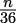

## 13

PyMonad 库

单子允许我们在一个本应宽容的语言中对表达式评估强加一个顺序。我们可以使用单子来坚持将表达式 `a + b + c` 按从左到右的顺序评估。这可能会干扰编译器优化表达式评估的能力。然而，当我们希望文件的内容以特定的顺序读取或写入时，这是必要的：单子是一种确保 `read()` 和 `write()` 函数以特定顺序评估的方法。

对宽容且具有优化编译器的语言来说，单子可以强加表达式评估的顺序，从而受益。Python 在很大程度上是严格的，并且不进行优化，这意味着在 Python 中对单子的实际需求很少。

虽然 PyMonad 包包含各种单子和其他函数式工具，但该包的大部分设计是为了帮助人们使用 Python 语法理解函数式编程。我们将关注一些功能来帮助阐明这一观点。

在本章中，我们将探讨以下内容：

+   下载和安装 PyMonad

+   柯里化的概念以及它如何应用于函数式组合

+   PyMonad 的星号操作符用于创建复合函数

+   用于使用更通用函数对数据项进行柯里化的函子和技术

+   使用 Python 的 `>>` 操作符的 `bind()` 操作来创建有序单子

+   我们还将解释如何使用 PyMonad 技术构建马尔可夫链模拟。

重要的是，Python 不要求使用单子。在许多情况下，读者将能够使用纯 Python 构造重写示例。进行此类重写可以帮助巩固对函数式编程的理解。

### 13.1 下载和安装

PyMonad 包可在 Python 包索引（PyPI）上找到。为了将 PyMonad 添加到您的环境中，您需要使用 `python -m pip pymonad` 命令来安装它。

本书使用版本 2.4.0 测试了所有示例。有关更多信息，请访问 [`pypi.python.org/pypi/PyMonad`](https://pypi.python.org/pypi/PyMonad)。

一旦安装了 PyMonad 包，您可以使用以下命令进行确认：

```py
>>> import pymonad 
>>> help(pymonad)
```

这将显示模块的文档字符串并确认一切确实已正确安装。

整个项目名称 PyMonad 使用混合大小写。我们导入的已安装 Python 包名称 `pymonad` 全部为小写。

### 13.2 函数式组合和柯里化

一些函数式语言通过将多参数函数语法转换为单个参数函数的集合来工作。这个过程称为柯里化：它以逻辑学家 Haskell Curry 命名，他开发了从早期概念的理论。我们已经在第十一章 The Toolz Package 中深入探讨了柯里化。在这里，我们将从 PyMonad 的角度重新审视它。

柯里化是将多参数函数转换为高阶单参数函数的技术。在简单的情况下，考虑一个函数 f(x,y) → z；给定两个参数 x 和 y；这将返回某个结果值，z。我们可以将函数 f(x,y)柯里化为两个函数：fc1 → fc2 和 fc2 → z。给定第一个参数值，x，评估函数 fc1 将返回一个新的单参数函数，fc2。这个第二个函数可以给第二个参数值，y，并返回所需的结果，z。

我们可以用具体的参数值评估一个柯里化函数，如下所示：`f_c1(2)(3)`。我们将柯里化函数应用于第一个参数值 2，创建一个新的函数。然后，我们将这个新函数应用于第二个参数值 3。

让我们看看一个具体的 Python 例子。例如，我们有一个如下所示的功能：

```py
from pymonad.tools import curry  # type: ignore[import] 

@curry(4)  # type: ignore[misc] 
def systolic_bp( 
    bmi: float, age: float, gender_male: float, treatment: float 
) -> float: 
    return ( 
        68.15 + 0.58 * bmi + 0.65 * age + 0.94 * gender_male + 6.44 * treatment 
    )
```

这是一个基于多重回归的收缩压简单模型。该模型从身体质量指数（BMI）、年龄、性别（值为 1 表示男性）和先前治疗史（值为 1 表示先前治疗过）预测血压。有关模型及其推导的更多信息，请访问[`sphweb.bumc.bu.edu/otlt/MPH-Modules/BS/BS704_Multivariable/BS704_Multivariable7.html`](http://sphweb.bumc.bu.edu/otlt/MPH-Modules/BS/BS704_Multivariable/BS704_Multivariable7.html)。

我们可以用所有四个参数使用`systolic_bp()`函数，如下所示：

```py
>>> systolic_bp(25, 50, 1, 0) 
116.09 

>>> systolic_bp(25, 50, 0, 1) 
121.59
```

一个 BMI 为 25、50 岁且没有先前治疗史的男性预测血压接近 116。第二个例子显示了一个有治疗史的类似女性，其血压可能为 121。

因为我们已经使用了`@curry`装饰器，我们可以创建类似于部分应用函数的中间结果。看看以下命令片段，它创建了一个新的函数`treated()`：

```py
>>> treated = systolic_bp(25, 50, 0)
>>> treated(0)
115.15
>>> treated(1)
121.59

```

在前面的例子中，我们评估了`systolic_bp(25, 50, 0)`表达式来创建一个柯里化函数，并将其分配给`treated`变量。这构建了一个新的函数`treated`，其中包含一些参数的值。BMI、年龄和性别值对于一个特定的病人通常不会改变。现在我们可以将新的`treated()`函数应用于剩余的参数值，以根据患者病史获得不同的血压预期值。

这里是一个创建一些额外柯里化函数的例子：

```py
>>> g_t = systolic_bp(25, 50) 
>>> g_t(1, 0) 
116.09 
>>> g_t(0, 1) 
121.59
```

这是一个基于我们初始模型的基于性别的处理函数。我们必须提供所需的性别和处理参数值，才能从模型中获得最终值。

在某些方面，这与`functools.partial()`函数类似。重要的区别在于柯里化创建了一个可以以多种方式工作的函数。`functools.partial()`函数创建了一个更专业的函数，它只能与给定的绑定值集一起使用。有关更多信息，请参阅第十章、Functools 模块。

#### 13.2.1 使用柯里化高阶函数

柯里化在应用于高阶函数时显示出其重要应用。例如，我们可以柯里化`reduce`函数，如下所示：

```py
>>> from pymonad.tools import curry 
>>> from functools import reduce 

>>> creduce = curry(2, reduce)
```

`creduce()`函数是一个柯里化函数；我们现在可以通过提供一些必需的参数值来使用它来创建函数。在下一个示例中，我们将使用`operator.add`作为两个参数值之一来进行归约。我们可以创建一个新的函数，并将其分配给`my_sum`。

我们可以创建并使用这个新的`my_sum()`函数，如下例所示：

```py
>>> from operator import add 

>>> my_sum = creduce(add) 
>>> my_sum([1,2,3]) 
6
```

我们还可以使用我们的柯里化`creduce()`函数与其他二元运算符一起创建其他归约。以下是如何创建一个查找序列中最大值的归约函数的示例：

```py
>>> my_max = creduce(lambda x,y: x if x > y else y) 
>>> my_max([2,5,3]) 
5
```

我们使用一个 lambda 对象来定义了自己的`max()`函数版本，该对象选择两个值中较大的一个。我们可以使用内置的`max()`函数来完成这个任务。更有用的一点是，我们可以使用更复杂的比较来定位局部最大值。对于地理围栏应用，我们可能有一个东西方向的函数和一个南北方向的函数是分开的。

我们不能轻易地使用 PyMonad 的`curry()`函数来创建`max()`函数的更通用形式。这个实现专注于位置参数。尝试使用`key=`关键字参数会添加太多的复杂性，使得这项技术无法实现我们的目标，即简洁和表达性的函数程序。

内置的归约包括`max()`、`min()`和`sorted()`函数都依赖于一个可选的`key=`关键字参数范式。创建柯里化版本意味着我们需要这些函数的变体，它们接受一个函数作为第一个参数，就像`filter()`、`map()`和`reduce()`函数一样。我们还可以创建自己的更一致的更高阶柯里化函数库。这些函数将仅依赖于位置参数，并遵循首先提供函数然后提供值的模式。

#### 13.2.2 使用 PyMonad 进行函数组合

使用柯里化函数的一个重要好处是能够通过函数组合来组合它们。我们在第五章、高阶函数和第十二章、装饰器设计技术中探讨了函数组合。

当我们创建了一个咖喱函数后，我们可以更容易地进行函数组合，以创建一个新的、更复杂的咖喱函数。在这种情况下，PyMonad 包定义了用于组合两个函数的 `*` 操作符。为了解释它是如何工作的，我们将定义两个可以组合的咖喱函数。首先，我们将定义一个计算乘积的函数，然后我们将定义一个计算特定范围值的函数。

这是我们的第一个函数，它计算乘积：

```py
import operator 

prod = creduce(operator.mul)
```

这基于我们之前定义的咖喱 `creduce()` 函数。它使用 `operator.mul()` 函数来计算可迭代对象的乘法降维：我们可以将乘积称为序列的乘法降维。

这是我们的第二个咖喱函数，它将生成一系列偶数或奇数值：

```py
from collections.abc import Iterable 

@curry(1)  # type: ignore[misc] 
def alt_range(n: int) -> Iterable[int]: 
    if n == 0: 
        return range(1, 2)  # Only the value [1] 
    elif n % 2 == 0: 
        return range(2, n+1, 2)  # Even 
    else: 
        return range(1, n+1, 2)  # Odd
```

`alt_range()` 函数的结果将是偶数或奇数值。如果 `n` 是奇数，它将只包含（包括）`n` 以上的奇数。如果 `n` 是偶数，它将只包含 `n` 以上的偶数。这些序列对于实现半阶乘或双阶乘函数 n!! 是重要的。

这是我们将 `prod()` 和 `alt_range()` 函数组合起来计算结果的方法：

```py
>>> prod(alt_range(9)) 
945
```

咖喱函数的一个非常有趣的应用是创建可以应用于参数值的函数组合。PyMonad 包提供了这样的操作符，但它们可能会令人困惑。更好的做法是利用 `Monad` 的 `Compose` 子类。

我们可以直接使用 `Compose` 来实现函数组合。以下示例展示了我们如何组合 `alt_range()` 和 `prod()` 函数来计算半阶乘：

```py
>>> from pymonad.reader import Compose 
>>> semi_fact = Compose(alt_range).then(prod) 
>>> semi_fact(9) 
945
```

我们从 `alt_range()` 函数与 `prod()` 函数的组合中构建了一个 `Compose` 单子。这个函数可以应用于一个参数值，从两个函数的组合中计算结果。

使用咖喱函数可以帮助通过省略一些参数传递的细节来澄清复杂的计算。

注意，`then()` 方法强加了一个严格的顺序：首先，计算范围。一旦完成，就使用结果来计算最终乘积。

### 13.3 函子 – 将一切变为函数

函子的概念是对简单数据的一个函数表示。3.14 的函子版本是一个零参数函数，返回这个值。考虑以下示例：

```py
>>> pi = lambda: 3.14 
>>> pi() 
3.14
```

我们创建了一个零参数的 lambda 对象，它返回一个 Python 浮点对象。

当我们将咖喱函数应用于函子时，我们正在创建一个新的咖喱函子。这通过使用函数来表示参数、值以及函数本身，将应用函数到参数以获取值的概念进行了推广。

一旦我们程序中的所有内容都是函数，那么所有处理就变成了函数组合主题的变体。为了恢复底层的 Python 对象，我们可以使用函子对象的 `value` 属性来获取一个适合 Python 的简单类型，我们可以在未柯里化的代码中使用它。

由于这种编程基于函数组合，直到我们实际使用 `value` 属性要求一个值之前，不需要进行任何计算。而不是执行大量的中间计算，我们的程序定义了可以在请求时产生值的中间复杂对象。原则上，这种组合可以通过一个聪明的编译器或运行时系统进行优化。

为了礼貌地与具有多个参数的函数一起工作，PyMonad 提供了一个 `to_arguments()` 方法。这是一个澄清提供给柯里化函数的参数值的好方法。我们将在介绍 `Maybe` 和 `Just` 单子之后看到这个示例。

我们可以用 `Maybe` 单子的子类包装一个 Python 对象。`Maybe` 单子很有趣，因为它为我们提供了一种优雅地处理缺失数据的方法。我们在第十二章装饰器设计技术中使用的方法是装饰内置函数以使它们对 `None` 有意识。PyMonad 库采用的方法是装饰数据以区分只是一个对象和什么都没有。

`Maybe` 单子有两种子类：

+   `Nothing`

+   `Just(` 一些 Python 对象 `)`

我们使用 `Nothing` 类似于 Python 的 `None` 值。这是我们表示缺失数据的方式。我们使用 `Just()` 来包装所有其他 Python 对象。这些也是函子，提供了类似函数的常量值的表示。

我们可以使用柯里化函数与这些 `Maybe` 对象一起使用，以优雅地容忍缺失的数据。以下是一个简短的例子：

```py
>>> from pymonad.maybe import Maybe, Just, Nothing 

>>> x1 = Maybe.apply(systolic_bp).to_arguments(Just(25), Just(50), Just(1), Just(0)) 
>>> x1.value 
116.09 

>>> x2 = Maybe.apply(systolic_bp).to_arguments(Just(25), Just(50), Just(1), Nothing) 
>>> x2 
Nothing 
>>> x2.value is None 
True
```

这表明了单子如何提供答案而不是引发 `TypeError` 异常。当与可能缺失或无效的大型、复杂数据集一起工作时，这可以非常方便。

我们必须使用 `value` 属性来提取未柯里化的 Python 代码的简单 Python 值。

#### 13.3.1 使用懒的 `ListMonad()` 单子

`ListMonad()` 单子一开始可能会让人困惑。它极其懒惰，与 Python 内置的列表类型不同。当我们评估 `list(range(10))` 表达式时，`list()` 函数将评估 `range()` 对象以创建一个包含 10 个项目的列表。然而，PyMonad 的 `ListMonad()` 单子懒惰到甚至不进行这种评估。

这里是对比：

```py
>>> list(range(10)) 
[0, 1, 2, 3, 4, 5, 6, 7, 8, 9] 

>>> from pymonad.list import ListMonad 
>>> ListMonad(range(10)) 
[range(0, 10)]
```

`ListMonad()` 单子没有评估 `range()` 对象的值序列的可迭代序列；它保留它而不进行评估。`ListMonad()` 单子对于收集函数而不评估它们非常有用。

我们可以在需要时评估 `ListMonad()` 单子：

```py
>>> from pymonad.list import ListMonad 

>>> x = ListMonad(range(10)) 
>>> x 
[range(0, 10)] 
>>> x[0] 
range(0, 10) 
>>> list(x[0]) 
[0, 1, 2, 3, 4, 5, 6, 7, 8, 9]
```

我们创建了一个懒加载的 `ListMonad()` 对象，其中包含一个 `range()` 对象。然后我们在该列表的位置 0 提取并评估了一个 `range()` 对象。

`ListMonad()` 对象不会评估生成器函数。它将任何可迭代参数视为一个单一的迭代器对象。我们可以在以后应用被函子包含的函数。

这是 `range()` 函数的柯里化版本。它的下限是 1 而不是 0。这对于某些数学工作很有用，因为它允许我们避免内置 `range()` 函数中位置参数的复杂性：

```py
from collections.abc import Iterator 
from pymonad.tools import curry 

@curry(1)  # type: ignore[misc] 
def range1n(n: int) -> range: 
    if n == 0: return range(1, 2)  # Only the value 1 
    return range(1, n+1)
```

我们使用 PyMonad 包将内置的 `range()` 函数包装起来，使其可柯里化。

由于 `ListMonad` 对象是一个函子，我们可以将函数映射到 `ListMonad` 对象。该函数应用于 `ListMonad` 对象中的每个项目。

这是另一个例子：

```py
>>> from pymonad.reader import Compose 
>>> from pymonad.list import ListMonad 

>>> fact = Compose(range1n).then(prod) 
>>> seq1 = ListMonad(*range(20)) 

>>> f1 = seq1.map(fact) 
>>> f1[:10] 
[1, 1, 2, 6, 24, 120, 720, 5040, 40320, 362880]
```

我们定义了一个复合函数，`fact()`，它是由之前展示的 `prod()` 和 `range1n()` 函数构建的。这是阶乘函数。我们创建了一个 `ListMonad()` 函子，`seq1`，它是一个包含 20 个值的序列。我们将 `fact()` 函数映射到 `seq1` 函子，从而创建了一个阶乘值的序列，`f1`。最后，我们提取了这些值中的前 10 个。

这是我们将用于扩展这个示例的另一个小函数：

```py
from pymonad.tools import curry 

@curry(1)  # type: ignore[misc] 
def n21(n: int) -> int: 
    return 2*n+1
```

这个小小的 `n21()` 函数执行一个简单的计算。然而，它是柯里化的，因此我们可以将其应用于一个函子，如 `ListMonad()` 对象。以下是前面示例的下一部分：

```py
>>> semi_fact = Compose(alt_range).then(prod) 
>>> f2 = seq1.map(n21).then(semi_fact) 
>>> f2[:10] 
[1, 3, 15, 105, 945, 10395, 135135, 2027025, 34459425, 654729075]
```

我们定义了一个复合函数，由之前展示的 `prod()` 和 `alt_range()` 函数组成。`f2` 对象的值是通过将我们的小 `n21()` 函数应用于 `seq1` 序列来构建的。这创建了一个新的序列。然后我们对这个新序列中的每个对象应用了 `semi_fact()` 函数，以创建一个与 `f1` 值序列平行的值序列。

我们现在可以将 `/` 操作符，`operator.truediv`，映射到这两个平行的值序列，`f1` 和 `f2`：

```py
>>> import operator 
>>> 2 * sum(map(operator.truediv, f1, f2)) 
3.1415919276751456
```

内置的 `map()` 函数将给定的操作符应用于两个函子，得到一个可以相加的分数序列。

我们使用一些函数组合技术和一个函子类定义定义了一个相当复杂的计算。这是基于反正切的计算。以下是这个计算的完整定义：


理想情况下，我们更倾向于不使用只有 20 个值的固定大小的 `ListMonad` 对象。我们更希望有一个懒加载的、可能无限的整数值序列，这样我们可以得到任意精度的近似。然后我们可以使用 `sum()` 和 `takewhile()` 函数的柯里化版本来找到序列中值的和，直到这些值太小，无法对结果产生影响。

这个使用 `takewhile()` 函数的重写留给读者作为练习。

### 13.4 Monad bind() 函数

PyMonad 库的名字来源于函数式编程中的单子概念，即具有严格顺序的函数。许多函数式编程背后的基本假设是函数式评估是自由的：它可以按需优化或重新排序。单子提供了一个例外，强制执行从左到右的严格顺序。

正如我们所见，Python 已经是严格的。它不需要单子。然而，我们仍然可以在有助于澄清复杂算法的地方应用这个概念。下面我们将通过一个例子来看使用基于单子的方法来设计基于马尔可夫链的模拟。

强制严格评估的技术是连接一个单子（monad）和一个将返回单子的函数的绑定。一个平坦的表达式将变成嵌套的绑定，优化编译器无法重新排序。单子的`then()`方法强制这种严格的顺序。

在其他语言中，如 Haskell，单子对于需要严格顺序的文件输入和输出至关重要。Python 的命令式模式与 Haskell 的`do`块非常相似，它有一个隐式的 Haskell `>>=`运算符，用于强制按顺序评估语句。PyMonad 使用`then()`方法进行这种绑定。

### 13.5 使用单子实现模拟

预期单子将通过一种管道：单子将被作为参数传递给一个函数，并且将返回一个类似的单子作为函数的值。函数必须设计成可以接受和返回类似的结构。

我们将研究一个可以用于过程模拟的单子基础管道。这种模拟有时被称为蒙特卡洛模拟。在这种情况下，模拟将创建一个马尔可夫链。

马尔可夫链是一系列潜在事件的模型。每个事件发生的概率只取决于前一个事件中达到的状态。整个系统的每个状态都有一个概率集，这些概率定义了事件和相关状态变化。它非常适合涉及随机机会的游戏，如骰子或牌戏。它也适合于工业流程，其中小的随机效应可以“波及”整个系统，导致可能看似与微小初始问题直接无关的效果。

我们的例子涉及一些相当复杂模拟的规则。我们可以将图 13.1 中显示的以下状态变化可视化为创建一个以通过或失败事件结束的事件链。事件的数量有一个下限为 1。


图 13.1：马尔可夫链生成器

状态转换概率以分数形式表示，，因为这个特定的马尔可夫链生成器来自使用两个骰子的游戏。掷骰子有 36 种可能的结果。当考虑两个骰子的和时，10 个不同的值有不同的概率，从值为 2 和 12 的到值为 7 的。

因为这是基于游戏的，所以实际算法比状态转换图要简单一些。简化算法描述的技巧是将多个类似行为组合成一个由参数 p 定义的单个状态。

算法使用内部状态。对于刚开始接触函数式编程的设计师来说，这是一个问题。我们在其他示例中展示的解决方案是将状态作为函数的参数公开。

我们将从一个具有显式状态的算法展示开始。


算法 9：马尔可夫链生成器

该算法可以看作是要求状态改变。或者，我们可以将其视为要附加到马尔可夫链上的操作序列，而不是状态改变。有一个必须首先使用的函数来创建初始结果或确定 p 的值。之后，另一个递归函数用于迭代，直到确定结果。这样，这种函数对的方法非常适合单子设计模式。

要构建马尔可夫链，我们需要一个随机数源：

```py
import random 

def rng() -> tuple[int, int]: 
    return (random.randint(1,6), random.randint(1,6)) 

from collections.abc import Callable 
from typing import TypeAlias 

DiceT: TypeAlias = Callable[[], tuple[int, int]]
```

上述函数将为我们生成一对骰子。我们还包含了一个类型提示`DiceT`，它可以用来描述任何返回包含两个整数的元组的类似函数。类型提示将在后续函数中用作任何类似随机数生成器的简称。

这是基于游戏算法的总体链生成器的预期：

```py
from pymonad.maybe import Maybe, Just 

def game_chain(dice: DiceT) -> Maybe: 
    outcome = ( 
        Just(("", 0, [])) 
        .then(initial_roll(dice)) 
        .then(point_roll(dice)) 
    ) 
    return outcome
```

我们创建一个初始单子`Just(("",`` 0,`` []))`来定义我们将要工作的基本类型。一个游戏将产生一个包含结果文本、得分值和一系列掷骰子的三重元组。在每场游戏的开始，一个默认的三重元组建立了三重元组类型。

我们将这个单子传递给另外两个函数。这将创建一个包含游戏结果的最终单子`outcome`。我们使用`then()`方法以特定的顺序连接函数，在具有优化编译器的语言中，这将防止表达式被重新排列。

我们将使用`value`属性在末尾获取单子的值。由于单子对象是惰性的，这个请求将触发对各种单子的评估，以创建所需输出。

每个由三元组组成的序列结果是一个我们可以分析的马尔可夫链，以确定整体统计特性。我们通常对链的预期长度感兴趣。这可能很难从初始模型或算法中预测。

`initial_roll()` 函数也将 `rng()` 函数作为第一个参数进行柯里化。单子将成为这个函数的第二个参数。`initial_roll()` 函数可以掷骰子并应用出局规则以确定我们是否有通过、失败或确定点。

`point_roll()` 函数也将 `rng()` 函数作为第一个参数进行柯里化。单子将成为这个函数的第二个参数。`point_roll()` 函数可以掷骰子以查看游戏是否已解决。如果游戏未解决，这个函数将递归地操作以继续寻找解决方案。

`initial_roll()` 函数看起来像这样：

```py
from pymonad.tools import curry 
from pymonad.maybe import Maybe, Just 

@curry(2)  # type: ignore[misc] 
def initial_roll(dice: DiceT, status: Maybe) -> Maybe: 
    d = dice() 
    if sum(d) in (7, 11): 
        return Just(("pass", sum(d), [d])) 
    elif sum(d) in (2, 3, 12): 
        return Just(("fail", sum(d), [d])) 
    else: 
        return Just(("point", sum(d), [d]))
```

一次掷骰子以确定初始结果是通过、失败还是建立点。我们返回一个适当的单子值，该值包括结果、点值和导致此状态的掷骰结果。立即通过和立即失败的点值实际上并不真正有意义。我们可以合理地在这里返回一个 0 值，因为没有真正建立点。

对于使用像 pylint 这样的工具的开发者来说，`status` 参数没有被使用。这会产生一个需要关闭的警告。添加 `#`` pylint:`` disable=` 可以关闭这个警告。

`unused-argument` 注释将关闭警告。

`point_roll()` 函数看起来像这样：

```py
from pymonad.tools import curry 
from pymonad.maybe import Maybe, Just 

@curry(2)  # type: ignore[misc] 
def point_roll(dice: DiceT, status: Maybe) -> Maybe: 
    prev, point, so_far = status 
    if prev != "point": 
        # won or lost on a previous throw 
        return Just(status) 

    d = dice() 
    if sum(d) == 7: 
        return Just(("fail", point, so_far+[d])) 
    elif sum(d) == point: 
        return Just(("pass", point, so_far+[d])) 
    else: 
        return ( 
            Just(("point", point, so_far+[d])) 
            .then(point_roll(dice)) 
        )
```

我们将状态单子分解为元组的三个单独的值。我们可以使用小的 lambda 对象来提取第一个、第二个和第三个值。我们也可以使用 `operator.itemgetter()` 函数来提取元组的项。相反，我们使用了多重赋值。

如果没有确定点，之前的状态将是通过或失败。游戏在 `initial_roll()` 函数中解决，这个函数只是简单地返回状态单子。

如果已经确定了一个点，状态将是点。掷骰子并应用规则到这个新的掷骰结果上。如果掷出 7，游戏结束，并返回一个最终单子。如果掷出的是点，游戏胜利并返回适当的单子。否则，将稍微修改后的单子传递给 `point_roll()` 函数。修改后的状态单子包括这个掷骰结果在掷骰历史中。

典型的输出看起来像这样：

```py
>>> game_chain() 
(’fail’, 5, [(2, 3), (1, 3), (1, 5), (1, 6)])
```

最终的单子有一个显示结果的字符串。它有已建立的点以及导致最终结果的一系列掷骰。

我们可以使用模拟来检查不同的结果，以收集关于这个复杂、状态化的过程的统计数据。这种马尔可夫链模型可以反映许多奇怪的边缘情况，这些情况会导致结果分布的惊人变化。

通过一些简单且功能性的编程设计技术，可以构建大量的巧妙蒙特卡洛模拟。特别是，幺半群可以帮助在存在复杂顺序或内部状态时结构化这些计算。

### 13.6 PyMonad 的附加功能

PyMonad 的另一个特性是名为幺半群的令人困惑的特性。这直接来自数学，它指的是具有运算符和单位元素的数据元素组，并且该组在该运算符下是封闭的。以下是一个例子：当我们想到自然数、加法运算符和单位元素 0 时，这是一个正确的幺半群。对于正整数，使用运算符 `*` 和单位值 1，我们也有一个幺半群；使用 `+` 作为运算符和空字符串作为单位元素的字符串也符合条件。

PyMonad 包含了多个预定义的幺半群类。我们可以扩展这个功能来添加我们自己的幺半群类。目的是限制编译器只能进行某些类型的优化。我们还可以使用幺半群类来创建累积复杂值的数据结构，可能包括之前操作的历史记录。

`pymonad.list` 是一个幺半群的例子。单位元素是一个空列表，由 `ListMonad()` 定义。加法操作定义了列表连接。幺半群是 `ListMonad()` 类的一个方面。

该包的大部分内容有助于更深入地了解函数式编程。用文档中的话来说，这是一个在可能稍微宽容一些的环境中学习函数式编程的简单方法。我们不必学习整个语言和工具集来编译和运行函数式程序，我们只需通过交互式 Python 进行实验。

实际上，我们不需要太多这些功能，因为 Python 已经是状态性的，并且提供了严格的表达式评估。在 Python 中引入状态性对象或严格顺序评估没有实际的理由。我们可以通过将函数概念与 Python 的命令式实现混合来编写有用的程序。因此，我们不会更深入地探讨 PyMonad。

### 13.7 概述

在本章中，我们探讨了如何使用 PyMonad 库直接在 Python 中表达一些函数式编程概念。该模块包含了许多重要的函数式编程技术。

我们探讨了柯里化的概念，这是一种允许将参数组合应用于创建新函数的函数。柯里化函数还允许我们使用函数组合来从更简单的部分创建更复杂的函数。我们探讨了将简单数据对象包装成函数的函子，这些函数也可以用于函数组合。

单子是在使用优化编译器和懒加载规则时强加严格评估顺序的一种方式。在 Python 中，我们没有很好的单子用例，因为 Python 底层是一种命令式编程语言。在某些情况下，命令式 Python 可能比单子构造更具有表现力和简洁性。

在下一章中，我们将探讨我们可用的多进程和多线程技术。这些包在函数式编程环境中尤其有用。当我们消除复杂的共享状态并围绕非严格处理进行设计时，我们可以利用并行性来提高性能。

### 13.8 练习

本章的练习基于 GitHub 上 Packt Publishing 提供的代码。请参阅[`github.com/PacktPublishing/Functional-Python-Programming-3rd-Edition`](https://github.com/PacktPublishing/Functional-Python-Programming-3rd-Edition)。

在某些情况下，读者会注意到 GitHub 上提供的代码包含一些练习的部分解决方案。这些作为提示，允许读者探索替代解决方案。

在许多情况下，练习需要单元测试用例来确认它们确实解决了问题。它们通常与 GitHub 仓库中提供的单元测试用例相同。读者应将书中的示例函数名替换为自己的解决方案以确认其正确性。

#### 13.8.1 修订反正切级数

在使用 lazy ListMonad()单子中，我们展示了涉及从使用阶乘 n!和双阶乘(2n + 1)!!的级数中求和的π的计算。

示例使用了一个只有 20 个值的序列`seq1 = ListMonad(*range(20))`。这个 20 的选择是随机的，目的是保持中间结果足够小，以便可视化。

更好的选择是使用`sum()`和`takewhile()`函数的柯里化版本来找到序列中值的和，直到这些值太小，无法对结果产生影响。

将计算π的近似值重写为精度为 10^(-15)。这接近 64 位浮点数能表示的极限。

#### 13.8.2 统计计算

给定一个值列表`v`，我们可以使用`Just(v)`创建一个有用的单子。我们可以使用内置函数如`sum()`和`len()`与`Just.map()`方法来计算均值、方差和标准差所需的值。


使用 PyMonad 实现这些函数后，将这些定义与更传统的 Python 语言技术进行比较。单子结构对这些相对简单的计算有帮助吗？

#### 13.8.3 数据验证

PyMonad 库包含一个名为 `Either` 的单子类。这与单子类中的 `Maybe` 类相似。`Maybe` 单子可以有一个值，或者没有值，提供一个类似 `None` 的对象。`Either` 单子有两个子类，`Left` 和 `Right`。如果我们使用 `Right` 实例来表示有效数据，那么我们可以使用 `Left` 实例来表示标识无效数据的错误信息。

上述概念表明可以使用 `try:/except:` 语句。如果没有抛出 Python 异常，结果将是 `Right(v)`。如果抛出异常，可以返回带有异常错误信息的 `Left`。

这允许 `Compose` 或 `Pipe` 处理数据，发出所有错误行作为 `Left` 单子。这可以导致一个有用的数据验证应用程序，因为它发现了数据中的所有问题。

首先，定义一个简单的验证规则，例如“值必须是 3 或 5 的倍数。”这意味着它们必须转换为整数值，并且整数除以 3 的余数为零或整数除以 5 的余数为零。其次，编写返回 `Right` 或 `Left` 对象的验证函数。

虽然 `pymonad.io.IO` 对象可以用来解析文件，但我们将从将验证函数应用于列表并检查结果开始。将验证函数应用于一系列值，保存结果序列的 `Either` 对象。

`Either` 对象有一个 `.either()` 方法，可以处理 `Left` 或 `Right` 实例。例如，`e.either(lambda x: True, lambda x: False)` 如果 `e` 单子的值是 `Left` 实例，将返回 `True`。

#### 13.8.4 多个模型

给定的过程有几个备选模型，它们从观察样本值计算预期值。

每个模型都从样本中的观察值计算一个预期值 e：

+   e = 0.7412 × s[o]

+   e = 0.9 × s[o] − 90

+   e = 0.7724 × s[o]^(1.0134)

首先，我们需要将这些模型作为柯里化函数实现。这将使我们能够使用这些模型中的任何一个来计算预测值。

给定一个模型函数，我们接下来需要创建一个比较函数。我们可以使用通用的 PyMonad `Composition` 或 `Pipe` 来计算使用其中一个模型预测的值，并将预测值与观察值进行比较。

这个比较函数的结果可以用作 χ²（卡方）测试的一部分，以判断模型与观察结果拟合得如何。实际的卡方指标是第十六章《卡方案例研究》的主题。

现在，创建柯里化模型函数和 `Composition` 或 `Pipe`，以比较模型的预测与实际结果。

对于实际值和观察值，请参阅第十二章中的日志记录练习，装饰器设计技术。

### 加入我们的社区 Discord 空间

加入我们的 Python Discord 工作空间，讨论并了解更多关于这本书的信息：[`packt.link/dHrHU`](https://packt.link/dHrHU)


