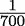

## 14

多进程、多线程和 Concurrent.Futures 模块

当我们消除共享状态的复杂性，并围绕非严格处理的纯函数进行设计时，我们可以利用并发和并行来提高性能。在本章中，我们将探讨一些可用的多进程和多线程技术。当应用于从函数式视角设计的算法时，Python 库包变得特别有帮助。

这里的核心思想是将函数式程序分布在进程内的几个线程或 CPU 内的几个进程之间。如果我们创建了一个合理的函数式设计，我们可以避免应用程序组件之间的复杂交互；我们有接受参数值并产生结果的函数。这对于进程或线程来说是一个理想的结构。

在本章中，我们将关注几个主题：

+   函数式编程和并发的一般概念。

+   当我们考虑核心、CPU 和操作系统级别的并发与并行时，并发真正意味着什么。需要注意的是，并发并不能神奇地让一个糟糕的算法变快。

+   使用内置的`multiprocessing`和`concurrent.futures`模块。这些模块允许多种并行执行技术。外部的`dask`包也能做很多这方面的工作。

我们将更多地关注进程级别的并行性，而不是多线程。使用进程并行性允许我们完全忽略 Python 的全局解释器锁（GIL）。

有关 Python 的全局解释器锁（GIL）的更多信息，请参阅[`docs.python.org/3/glossary.html#term-global-interpreter-lock`](https://docs.python.org/3/glossary.html#term-global-interpreter-lock)。有关修改 GIL 操作方式的提案，请参阅[`peps.python.org/pep-0684/`](https://peps.python.org/pep-0684/)。此外，请参阅[`github.com/colesbury/nogil`](https://github.com/colesbury/nogil)以了解一个提出完全移除 GIL 的项目。

GIL 在 Python 3.10 中是不可或缺的一部分，这意味着某些类型的计算密集型多线程不会显示出明显的速度提升。

我们将在本章中关注并发。并发工作交织在一起，与需要多个核心或多个处理器的并行工作不同。我们不想深入探讨并发和并行之间的细微差别。我们的重点是利用函数式方法，而不是探索在现代多进程操作系统上完成工作所有可能的方式。

### 14.1 函数式编程和并发

当执行的任务之间没有依赖关系时，最有效的并发处理才会发生。在开发并发（或并行）编程时，最大的困难来自于协调对共享资源的更新，其中任务依赖于一个公共资源。

当遵循函数式设计模式时，我们倾向于避免有状态的程序。函数式设计应该最小化或消除对共享对象的并发更新。如果我们能够设计出以懒加载、非严格评估为中心的软件，我们也可以设计出有助于并发评估的软件。在某些情况下，应用程序的某些部分可以具有令人尴尬的并行设计，其中大部分工作可以并发完成，计算之间几乎没有交互。映射和过滤尤其受益于并行处理；归约通常不能并行执行。

我们将要关注的框架都使用一个基本的 `map()` 函数来将工作分配给池中的多个工作者。这与我们在整本书中一直在探讨的高级函数式设计非常契合。如果我们已经针对 `map()` 函数构建了我们的应用程序，那么将工作分区成进程或线程不应该涉及破坏性的变更。

### 14.2 并发真正意味着什么

在一台小型计算机中，只有一个处理器和一个核心，所有的评估都通过处理器唯一的那个核心进行序列化。操作系统将通过巧妙的时间切片安排来交错多个进程和多个线程，使其看起来像是在并发发生。

在具有多个 CPU 或单个 CPU 中有多个核心的计算机上，可以有一些实际的并行处理 CPU 指令。所有其他并发性都是通过操作系统级别的时间切片来模拟的。一台 macOS X 笔记本电脑可以有 200 个并发进程共享 CPU；这比可用的核心数量多得多。从这一点来看，我们可以看出操作系统的时间切片负责了整个系统大部分看似并发的行为。

#### 14.2.1 边界条件

让我们考虑一个假设的算法，其复杂度由 O(n²) 描述。这通常意味着两个嵌套的 `for` 语句，每个语句都在处理 n 个项目。让我们假设内部 `for` 语句的主体涉及 1,000 个 Python 操作码。当处理 10,000 个对象时，这可能执行 1000 亿次 Python 操作。我们可以称之为基本处理预算。我们可以尝试分配尽可能多的进程和线程，但我们无法改变处理预算。

单个 CPython 字节码——Python 语句和表达式的内部实现——并不都共享相同的、统一的执行时间。然而，在 macOS X 笔记本电脑上的长期平均数据显示，我们每秒可以期望执行大约 60 MB 的字节码操作。这意味着我们的 1000 亿次字节码操作可能需要大约 1,666 秒，或 28 分钟。

如果我们有一台双核四核的计算机，那么我们可能将所需的时间缩短到原始总时间的 25%：大约 7 分钟。这假设我们可以将工作分成四个（或更多）独立的操作系统进程。

这里的重要考虑是，100 亿字节码的整体预算是无法改变的。并发不会神奇地减少工作量。它只能改变调度，以可能减少执行所有这些字节码的经过时间。

转换为具有 O(nlog n)复杂度的更好算法可以显著减少工作量。我们需要测量实际的加速来确定影响；以下示例包含了一些假设。我们可能不需要进行 10,000²次迭代，而只需进行 10,000log 10,000 ≈ 132,877 次迭代，从 100 亿操作减少到大约 133,000 次操作。这可能是原始时间的小。并发无法提供算法更改将带来的那种戏剧性改进。

#### 14.2.2 与进程或线程共享资源

操作系统向我们保证，进程之间几乎没有或没有交互。当创建需要多个进程交互的应用程序时，必须显式共享一个常见的操作系统资源。这可能是一个公共文件、共享内存对象或具有进程之间共享状态的信号量。进程本质上是独立的；它们之间的交互是例外，而不是规则。

相比之下，多个线程属于单个进程的一部分；一个进程的所有线程通常共享资源，有一个特殊情况。线程局部内存可以自由使用，而不会受到其他线程的干扰。在线程局部内存之外，写入内存的操作可能会以不可预测的顺序设置进程的内部状态。一个线程可以覆盖另一个线程的结果。为了防止问题，必须使用互斥访问技术——通常是一种锁定形式。如前所述，来自并发线程和进程的指令的整体顺序通常以不可预测的顺序在核心之间交错。这种并发带来了对共享变量的破坏性更新的可能性，以及需要互斥访问。

当尝试设计多线程应用程序时，并发对象更新的存在可能会造成混乱。锁定是一种避免对共享对象进行并发写入的方法。避免使用共享对象通常也是一种可行的设计技术。第二种技术——避免写入共享对象——通常也适用于函数式编程。

在 CPython 中，全局解释器锁（GIL）用于确保操作系统线程调度不会干扰维护 Python 数据结构的内部机制。实际上，GIL 改变了调度的粒度，从机器指令到 Python 虚拟机操作组。

从实用主义的角度来看，全局解释器锁（GIL）对各种应用类型性能的影响通常是可以忽略不计的。大部分情况下，计算密集型应用倾向于看到 GIL 调度的最大影响。I/O 密集型应用的影响很小，因为线程花更多的时间等待 I/O 完成。对性能影响更大的因素是正在实施算法的基本内在复杂性。

#### 14.2.3 利益将如何积累

一个进行大量计算和相对较少 I/O 的程序在单核上的并发处理中不会看到太多好处。如果一个计算有 28 分钟的预算，那么以不同方式交错操作不会产生显著影响。使用八个核心进行并行计算可能将时间缩短大约八分之一。实际的时间节省取决于操作系统和语言开销，这些开销很难预测。

当计算涉及大量的 I/O 时，在等待 I/O 请求完成的同时交错 CPU 处理可以显著提高性能。这个想法是在等待操作系统完成其他数据块的 I/O 时，对某些数据块进行计算。由于 I/O 通常涉及大量的等待，一个八核处理器可以交错处理来自数十（或数百）个并发 I/O 请求的工作。

并发是 Linux 的核心原则之一。如果我们不能在等待 I/O 的同时进行计算，那么我们的计算机在等待每个网络请求完成时会冻结。一个网站下载将涉及等待初始 HTML，然后等待每个单独的图形到达。在此期间，键盘、鼠标和显示器将无法工作。

这里有两种设计交错计算和 I/O 的应用程序的方法：

+   我们可以创建一个由处理阶段组成的流水线。单个项目必须通过所有阶段，在这些阶段中它被读取、过滤、计算、聚合，并写入。多个并发阶段的概念意味着每个阶段都会有不同的数据对象。阶段之间的时间切片将允许计算和 I/O 交错进行。

+   我们可以创建一个并发工作者池，每个工作者执行数据项的所有处理。数据项被分配给池中的工作者，结果从工作者那里收集。

这些方法之间的区别并不清晰。通常，会创建一个混合混合体，其中流水线的一个阶段涉及一个工作者池，以便使该阶段与其他阶段一样快。有一些形式化方法使设计并发程序变得相对容易。通信顺序进程（CSP）范式可以帮助设计消息传递应用程序。可以使用如`pycsp`之类的包将 CSP 形式化添加到 Python 中。

I/O 密集型程序通常能从并发处理中获得最显著的好处。其思路是将 I/O 和数据处理交织在一起。CPU 密集型程序从并发处理中获得的益处较小。

### 14.3 使用多进程池和任务

Python 的`multiprocessing`包引入了`Pool`对象的概念。`Pool`对象包含多个工作进程，并期望这些进程并发执行。这个包允许操作系统调度和时分复用来交织多个进程的执行。目的是让整个系统尽可能忙碌。

为了充分利用这一功能，我们需要将我们的应用程序分解成对非严格并发执行有益的组件。整个应用程序必须由可以按不确定顺序处理的离散任务构建而成。

例如，一个通过网络爬虫从互联网收集数据的应用程序，通常通过并发处理进行优化。多个单独的进程可以等待数据下载，而其他进程则在已接收的数据上执行爬取操作。我们可以创建一个包含几个相同工作者的`Pool`对象，这些工作者执行网站爬取。每个工作者被分配以 URL 形式的分析任务。等待下载的多个工作者几乎没有处理开销。另一方面，已经完全下载页面的工作者可以执行从内容中提取数据的实际工作。

分析多个日志文件的应用程序也是并发处理的良好候选者。我们可以创建一个分析工作者`Pool`对象。我们可以将每个日志文件分配给一个工作者；这允许在`Pool`对象中的各种工作者之间并发进行读取和分析。每个工作者将执行 I/O 和计算。然而，一些工作者可以在其他工作者等待 I/O 完成时进行分析。

由于益处取决于难以预测的输入和输出操作的时机，多进程总是涉及实验。更改池大小并测量经过时间是实现并发应用程序的基本部分。

#### 14.3.1 处理大量大文件

这里是一个多进程应用程序的示例。我们将解析网络日志文件中的通用日志格式（CLF）行。这是通常用于 Web 服务器访问日志的格式。这些行通常很长，但当你将其折叠到书的边缘时，看起来如下所示：

```py
99.49.32.197 - - [01/Jun/2012:22:17:54 -0400] "GET /favicon.ico\\ 
HTTP/1.1" 200 894 "-" "Mozilla/5.0 (Windows NT 6.0)\\ 
AppleWebKit/536.5 (KHTML, like Gecko) Chrome/19.0.1084.52\\ 
Safari/536.5"
```

我们经常有大量的文件需要分析。许多独立文件的存在意味着并发处理对我们的爬取过程将有一些好处。一些工作者将等待数据，而其他工作者可以执行计算密集型的工作部分。

我们将分析分解为两个广泛的功能区域。处理的第一阶段是解析日志文件以收集相关信息的基本解析。我们将进一步将解析阶段分解为四个阶段。具体如下：

1.  从多个源日志文件中读取所有行。

1.  然后，我们从一个文件集合中的日志条目行创建简单的`NamedTuple`对象。

1.  日期和 URL 等更复杂字段的详细信息将单独解析。

1.  从日志中拒绝无趣的路径，留下有趣的路径以供进一步处理。

一旦过了解析阶段，我们可以执行大量分析。为了演示`multiprocessing`模块的目的，我们将查看一个简单的分析来计数特定路径的出现次数。

第一部分是从源文件中读取。Python 对文件迭代器的使用将转换为底层 OS 请求以缓冲数据。每个 OS 请求意味着进程必须等待数据可用。

显然，我们希望交织其他操作，以便它们不是都在等待 I/O 完成。这些操作可以想象成从处理单个行到处理整个文件的一个光谱。我们将首先查看整个文件的交织，因为这相对容易实现。

解析 Apache CLF 文件的功能设计可能如下所示：

```py
data = path_filter( 
    access_detail_iter( 
        access_iter( 
            local_gzip(filename))))
```

这个函数将更大的解析问题分解为多个函数。`local_gzip()`函数从本地缓存的 GZIP 文件中读取行。`access_iter()`函数为访问日志中的每一行创建一个`NamedTuple`对象。`access_detail_iter()`函数扩展了一些更难解析的字段。最后，`path_filter()`函数丢弃了一些没有太多分析价值的路径和文件扩展名。

将这种设计可视化为一个类似壳体的处理管道可能会有所帮助，如下所示：

```py
(local_gzip(filename) | access_iter 
    | access_detail_iter | path_filter) >data
```

这借鉴了管道（—）的 shell 符号来从进程到进程传递数据。Python 没有这个操作符，直接使用。

实用上，我们可以使用`toolz`模块来定义这个管道：

```py
from toolz.functoolz import pipe 

data = pipe(filename, 
    local_gzip, 
    access_iter, 
    access_detail_iter, 
    path_filter 
)
```

更多关于`toolz`模块的信息，请参阅第十一章，The Toolz Package。

我们将专注于设计这四个按阶段处理数据的函数。想法是将密集处理与等待 I/O 完成交织在一起。

#### 14.3.2 解析日志文件 – 收集行

解析大量文件的第一阶段如下：读取每个文件并生成一个简单的行序列。由于日志文件以`.gzip`格式保存，我们需要使用`gzip.open()`函数打开每个文件。

以下`local_gzip()`函数从本地缓存的文件中读取行：

```py
from collections.abc import Iterator 
import gzip 
from pathlib import Path 

import sys 
def local_gzip(zip_path: Path) -> Iterator[str]: 
    with gzip.open(zip_path, "rb") as log_file: 
        yield from ( 
            line.decode(’us-ascii’).rstrip() 
            for line in log_file 
        )
```

函数遍历文件的所有行。我们创建了一个复合函数，用于封装以`.gzip`格式压缩的日志文件打开的细节，将文件分解为一系列行，并删除换行符（`\n`）。

此外，此函数还封装了文件的非标准编码。与以 UTF-8 或 UTF-16 等标准格式编码的 Unicode 不同，文件使用旧的 US-ASCII 编码。这与 UTF-8 非常相似。为了确保日志条目被正确读取，提供了确切的编码。

此函数与`multiprocessing`模块的工作方式非常吻合。我们可以创建一个工作池并将任务（如`.gzip`文件读取）映射到进程池。如果我们这样做，我们可以并行读取这些文件；打开的文件对象将是单独进程的一部分，资源消耗和等待时间将由操作系统管理。

此设计的扩展可以包括第二个功能，用于使用 SFTP 或 RESTful API（如果可用）从网络主机传输文件。当文件从网络服务器收集时，可以使用`local_gzip()`函数进行分析。

`local_gzip()`函数的结果被`access_iter()`函数用于为源文件中的每一行创建描述网络服务器文件访问的命名元组。

#### 14.3.3 将日志行解析为命名元组

一旦我们获得了每个日志文件的所有行，我们就可以提取描述的访问细节。我们将使用正则表达式分解行。从那里，我们可以构建一个`NamedTuple`对象。

每个单独的访问可以总结为`NamedTuple`的一个子类，如下所示：

```py
from typing import NamedTuple, Optional, cast 
import re 

class Access(NamedTuple): 
    host: str 
    identity: str 
    user: str 
    time: str 
    request: str 
    status: str 
    bytes: str 
    referer: str 
    user_agent: str 

    @classmethod 
    def create(cls: type, line: str) -> Optional["Access"]: 
        format_pat = re.compile( 
            r"(?P<host>[\d\.]+)\s+" 
            r"(?P<identity>\S+)\s+" 
            r"(?P<user>\S+)\s+" 
            r"\[(?P<time>.+?)\]\s+" 
            r’"(?P<request>.+?)"\s+’ 
            r"(?P<status>\d+)\s+" 
            r"(?P<bytes>\S+)\s+" 
            r’"(?P<referer>.*?)"\s+’ 
            r’"(?P<user_agent>.+?)"\s*’ 
            ) 
        if match := format_pat.match(line): 
            return cast(Access, cls(**match.groupdict())) 
        return None
```

从源文本构建`Access`对象的方法`create()`包含一个长的正则表达式，用于解析 CLF 文件中的行。这相当复杂，但我们可以使用铁路图来帮助简化它。以下图像显示了各种元素以及它们如何被正则表达式识别：

![hd.hsinisunus[tat]srarssdssbnbsrarsuausoiopdodpsospimnimpeneptaitapyoypenepsnspsgsaeneaeneaeyeaquyquatgtatntafeyfeaeyeatitcn-ncr-rcceecuiuce-ecrrcrrctetistieseessestsessseeeeaaetptpttprrggyayaaeecccnneeett](img/file129.jpg)

图 14.1：解析日志文件的正则表达式图

此图显示了正则表达式中子句的顺序。每个矩形框代表一个命名的捕获组。例如，`(?P<host>[\d\.]+)`是一个名为`host`的组。椭圆形和圆形是字符类（例如，数字）或特定字符（例如，`.`）的类别，它们构成了捕获组的内容。

我们使用这个正则表达式将每一行分解为包含九个单独数据元素的字典。使用`[]`和`"`来界定复杂字段（如`time`、`request`、`referer`和`user_agent`参数）可以通过将文本转换为`NamedTuple`对象来优雅地处理。

我们努力确保`NamedTuple`字段名称与每个记录部分的`(?P<name>)`构造中的正则表达式组名称相匹配。通过确保名称匹配，我们可以非常容易地将解析后的字典转换为一个元组以进行进一步处理。这意味着我们为了与 RFC 文档兼容，错误地拼写了“referrer”。

这里是`access_iter()`函数，它要求每个文件都表示为文件行的迭代器：

```py
from collections.abc import Iterator 

def access_iter(source_iter: Iterator[str]) -> Iterator[Access]: 
    for line in source_iter: 
        if access := Access.create(line): 
            yield access
```

`local_gzip()`函数的输出是一系列字符串。外层序列基于单个日志文件的行。如果某行与给定的模式匹配，则表示某种类型的文件访问。我们可以从正则表达式解析的文本字典中创建一个`Access`实例。不匹配的行会被静默地丢弃。

这里关键的设计模式是从解析函数的结果构建一个不可变对象。在这种情况下，解析函数是一个正则表达式匹配器。其他类型的解析也可以适应这种设计模式。

有一些替代方法可以做到这一点。例如，这里有一个应用`map()`和`filter()`的函数：

```py
def access_iter_2(source_iter: Iterator[str]) -> Iterator[Access]: 
    return filter( 
        None, 
        map( 
            Access.create, 
            source_iter 
        ) 
    )
```

`access_iter_2()`函数将`local_gzip()`函数的输出转换为一个`Access`实例的序列。在这种情况下，我们将`Access.create()`函数应用于从读取文件集合得到的字符串迭代器。`filter()`函数从`map()`函数的结果中移除任何`None`对象。

我们在这里的目的是展示我们有一系列用于解析文件的函数式风格。在第四章，处理集合中，我们查看了一种非常简单的解析方法。在这里，我们执行更复杂的解析，使用各种技术。

#### 14.3.4 解析访问对象的附加字段

之前创建的初始`Access`对象没有分解访问日志行中包含的九个字段中的某些内部元素。我们将从整体分解中单独解析这些项。单独执行这些解析操作使每个处理阶段更简单。这也允许我们在不破坏分析日志的一般方法的情况下替换整体过程的一个小部分。

下一个解析阶段的输出对象将是一个`NamedTuple`子类，`AccessDetails`，它包装了原始的`Access`元组。它将包含一些用于解析的附加字段：

```py
from typing import NamedTuple, Optional 
import datetime 
import urllib.parse 

class AccessDetails(NamedTuple): 
    access: Access 
    time: datetime.datetime 
    method: str 
    url: urllib.parse.ParseResult 
    protocol: str 
    referrer: urllib.parse.ParseResult 
    agent: dict[str, str] 

    @classmethod 
    def create(cls: type, access: Access) -> "AccessDetails": 
          meth, url, protocol = parse_request(access.request) 
          return AccessDetails( 
              access=access, 
              time=parse_time(access.time), 
              method=meth, 
              url=urllib.parse.urlparse(url), 
              protocol=protocol, 
              referrer=urllib.parse.urlparse(access.referer), 
              agent=parse_agent(access.user_agent) 
          )
```

`access`属性是原始的`Access`对象，一组简单的字符串集合。`time`属性是解析的`access.time`字符串。`method`、`url`和`protocol`属性来自分解`access.request`字段。`referrer`属性是一个解析后的 URL。

`agent`属性也可以分解成更细粒度的字段。规则相当复杂，我们决定使用一个将名称映射到其相关值的字典就足够了。

这里是分解字段的三种详细级别解析器：

```py
from typing import Optional 
import datetime 
import re 

def parse_request(request: str) -> tuple[str, str, str]: 
    words = request.split() 
    return words[0], ’ ’.join(words[1:-1]), words[-1] 

def parse_time(ts: str) -> datetime.datetime: 
    return datetime.datetime.strptime( 
        ts, "%d/%b/%Y:%H:%M:%S %z" 
    ) 

def parse_agent(user_agent: str) -> dict[str, str]: 
    agent_pat = re.compile( 
        r"(?P<product>\S*?)\s+" 
        r"\((?P<system>.*?)\)\s*" 
        r"(?P<platform_details_extensions>.*)" 
    ) 

    if agent_match := agent_pat.match(user_agent): 
        return agent_match.groupdict() 
    return {}
```

我们为 HTTP 请求、时间戳和用户代理信息编写了三个解析器。日志中的请求值通常是一个三个单词的字符串，例如`GET /some/path HTTP/1.1`。`parse_request()`函数提取这三个空格分隔的值。在不太可能的情况下，如果路径中有空格，我们将提取第一个单词和最后一个单词作为方法和协议；所有剩余的单词都是路径的一部分。

时间解析委托给了`datetime`模块。我们在`parse_time()`函数中提供了适当的格式。

解析用户代理具有挑战性。有许多变化；我们为`parse_agent()`函数选择了一个常见的选项。如果用户代理文本与给定的正则表达式匹配，我们将使用`AgentDetails`类的属性。如果用户代理信息不匹配正则表达式，我们将使用`None`值代替。在两种情况下，原始文本都将可在`Access`对象中找到。

我们将使用这三个解析器从给定的`Access`对象构建`AccessDetails`实例。`access_detail_iter()`函数的主体看起来是这样的：

```py
from collections.abc import Iterable, Iterator 

def access_detail_iter( 
    access_iter: Iterable[Access] 
) -> Iterator[AccessDetails]: 
    for access in access_iter: 
        yield AccessDetails.create(access)
```

我们使用了与之前的`access_iter()`函数类似的设计模式。从解析某些输入对象的结果中构建一个新的对象。新的`AccessDetails`对象将包装之前的`Access`对象。这种技术允许我们使用不可变对象，同时仍然包含更详细的信息。

这个函数本质上是一个从`Access`对象到`AccessDetails`对象序列的映射。这里是一个使用`map()`高级函数的替代设计：

```py
from collections.abc import Iterable, Iterator 

def access_detail_iter_2( 
    access_iter: Iterable[Access] 
) -> Iterator[AccessDetails]: 
    return map(AccessDetails.create, access_iter)
```

随着我们继续前进，我们会看到这种变化很好地与`multiprocessing`模块的工作方式相匹配。

在面向对象的编程环境中，这些额外的解析器可能是类定义的方法函数或属性。具有惰性解析方法的面向对象设计的优点是，除非需要，否则不会解析项目。这个特定的函数式设计解析了所有内容，假设它将被使用。

有可能创建一个惰性函数式设计。它可以依赖于三个解析函数，根据需要从给定的`Access`对象中提取和解析各种元素。我们不会使用`details.time`属性，而是使用`parse_time(access.time)`函数。语法更长，但它确保属性仅在需要时才被解析。我们也可以将其作为一个保留原始语法的属性。我们将这个作为练习留给读者。

#### 14.3.5 过滤访问详情

我们将查看 `AccessDetails` 对象的几个过滤器。第一个是一组拒绝许多很少有趣的冗余文件的过滤器。第二个过滤器将是分析函数的一部分，我们将在稍后查看。

`path_filter()` 函数是三个函数的组合：

+   排除空路径

+   排除一些特定的文件名

+   排除具有给定扩展名的文件

灵活的设计可以定义每个测试为一个单独的一等，过滤器风格的函数。例如，我们可能有一个如下所示的函数来处理空路径：

```py
def non_empty_path(detail: AccessDetails) -> bool: 
    path = detail.url.path.split(’/’) 
    return any(path)
```

此函数确保路径包含一个名称。我们可以为 `non_excluded_names()` 和 `non_excluded_ext()` 函数编写类似的测试。像 `favicon.ico` 和 `robots.txt` 这样的名称需要被排除。同样，像 `.js` 和 `.css` 这样的扩展也需要被排除。我们将这两个额外的过滤器留给读者作为练习。

整个 `filter()` 函数序列将看起来像这样：

```py
def path_filter( 
    access_details_iter: Iterable[AccessDetails] 
) -> Iterable[AccessDetails]: 
    non_empty = filter(non_empty_path, access_details_iter) 
    nx_name = filter(non_excluded_names, non_empty) 
    nx_ext = filter(non_excluded_ext, nx_name) 
    yield from nx_ext
```

这种堆叠过滤器的风格具有在添加新的过滤器标准时稍微容易扩展的优点。

生成器函数（如 `filter()` 函数）的使用意味着我们不会创建大型中间对象。每个中间变量 `non_empty`、`nx_name` 和 `nx_ext` 都是一个合适的惰性生成器函数；只有在客户端进程消耗数据之前，不会进行任何处理。

虽然这种风格很优雅，但因为它需要每个函数都解析 `AccessDetails` 对象中的路径，所以它效率不高。为了提高效率，我们可以使用 `@cache` 装饰器包装 `path.split(’/’)` 函数。另一种选择是在 `/` 字符上拆分路径，并将列表保存在 `AccessDetails` 对象中。

#### 14.3.6 分析访问详情

我们将查看两个分析函数，我们可以使用这些函数来过滤和分析单个 `AccessDetails` 对象。第一个函数将过滤数据，并仅传递特定的路径。第二个函数将总结每个不同路径的出现次数。

我们将定义一个小的 `book_in_path()` 函数，并将其与内置的 `filter()` 函数结合使用，以将函数应用于细节。以下是复合的 `book_filter()` 函数：

```py
from collections.abc import Iterable, Iterator 

def book_filter( 
    access_details_iter: Iterable[AccessDetails] 
) -> Iterator[AccessDetails]: 
    def book_in_path(detail: AccessDetails) -> bool: 
        path = tuple( 
            item 
            for item in detail.url.path.split(’/’) 
            if item 
        ) 
        return path[0] == ’book’ and len(path) > 1 
    return filter(book_in_path, access_details_iter)
```

我们通过 `book_in_path()` 函数定义了一条规则，我们将将其应用于每个 `AccessDetails` 对象。如果路径至少有两个组件，并且路径的第一个组件是 `’book’`，那么我们对这些对象感兴趣。所有其他 `AccessDetails` 对象都可以被默默地拒绝。

我们感兴趣的最终归约函数是 `reduce_book_total()`。

```py
from collections import Counter 

def reduce_book_total( 
    access_details_iter: Iterable[AccessDetails] 
) -> dict[str, int]: 
    counts: Counter[str] = Counter( 
        detail.url.path for detail in access_details_iter 
    ) 
    return counts
```

此函数将生成一个 `Counter()` 对象，显示 `AccessDetails` 对象中每个路径的频率。为了专注于特定的路径集，我们将使用 `reduce_total(book_filter(details))` 表达式。这仅提供了通过给定过滤器的项目摘要。

由于 `Counter` 对象可以应用于各种类型，需要一个类型提示来提供狭窄的规范。在这种情况下，提示是 `dict[str, int]`，以向 mypy 工具显示路径的字符串表示将被计数。

#### 14.3.7 完整分析过程

这里是处理日志文件集合的复合 `analysis()` 函数：

```py
def analysis(log_path: Path) -> dict[str, int]: 
    """Count book chapters in a given log""" 
    details = access_detail_iter( 
        access_iter( 
            local_gzip(log_path))) 
    books = book_filter(path_filter(details)) 
    totals = reduce_book_total(books) 
    return totals
```

`analysis()` 函数使用 `local_gzip()` 函数处理单个路径。它应用一系列解析函数 `access_detail_iter()` 和 `access_iter()`，以创建一个 `AccessDetails` 对象的可迭代序列。然后，它应用一系列过滤器来排除不感兴趣的路径。最后，它将一个 `AccessDetails` 对象序列应用于归约。结果是显示某些路径访问频率的 `Counter` 对象。

保存的 `.gzip` 格式日志文件样本总量约为 51 MB。使用此函数按顺序处理文件需要超过 140 秒。我们能否通过并发处理做得更好？

### 14.4 使用多进程池进行并发处理

一种优雅地使用 `multiprocessing` 模块的方法是创建一个处理 `Pool` 对象，并将工作分配给该池中的各个工作者。我们将依赖操作系统在各个进程之间交错执行。如果每个进程都有 I/O 和计算的混合，我们应该能够确保我们的处理器（和磁盘）保持非常忙碌。当进程等待 I/O 完成时，其他进程可以执行它们的计算。当一个 I/O 操作完成时，等待该操作的进程将准备好运行，并可以与其他进程竞争处理时间。

将工作映射到单独进程的配方看起来像这样：

```py
def demo_mp(root: Path = SAMPLE_DATA, pool_size: int | None = None) -> None: 
    pool_size = ( 
        multiprocessing.cpu_count() if pool_size is None 
        else pool_size 
    ) 
    combined: Counter[str] = Counter() 
    with multiprocessing.Pool(pool_size) as workers: 
        file_iter = list(root.glob(LOG_PATTERN)) 
        results_iter = workers.imap_unordered(analysis, file_iter) 
        for result in results_iter: 
            combined.update(result) 
    print(combined)
```

此函数创建一个具有单独工作者进程的 `Pool` 对象，并将此 `Pool` 对象分配给 `workers` 变量。然后，我们使用进程池将分析函数 `analysis` 映射到要执行的工作的可迭代队列。`workers` 池中的每个进程都会从可迭代队列中分配项目。在这种情况下，队列是 `root.glob(LOG_PATTERN)` 属性的结果，它是一系列文件名。

随着每个工作者完成 `analysis()` 函数并返回结果，创建 `Pool` 对象的父进程可以收集这些结果。这允许我们创建多个并发构建的 `Counter` 对象，并将它们合并成一个单一的综合结果。

如果我们在池中启动 p 个进程，我们的整体应用程序将包括 p + 1 个进程。将有一个父进程和 p 个子进程。这通常效果很好，因为父进程在启动子进程池后几乎没有什么事情可做。通常，工作者将被分配到单独的 CPU（或核心），而父进程将与 `Pool` 对象中的一个子进程共享一个 CPU。

普通的 Linux 父/子进程规则适用于此模块创建的子进程。如果父进程崩溃而没有从子进程中正确收集最终状态，则可能会留下僵尸进程运行。因此，进程`Pool`对象也是一个上下文管理器。当我们通过`with`语句使用池时，在上下文结束时，子进程将被正确收集。

默认情况下，一个`Pool`对象将根据`multiprocessing.cpu_count()`函数的值拥有一定数量的工作者。这个数字通常是最佳的，仅使用`with multiprocessing.Pool() as workers:`属性可能就足够了。

在某些情况下，拥有比 CPU 更多的工作者可能会有所帮助。这可能是在每个工作者都有 I/O 密集型处理时的情况。拥有许多工作者进程等待 I/O 完成可以提高应用程序的整体运行时间。

如果给定的`Pool`对象有 p 个工作者，这种映射可以将处理时间减少到几乎处理所有日志所需的时间。从实际的角度来看，`Pool`对象中父进程和子进程之间的通信会有一些开销。这些开销将限制将工作细分为非常小的并发部分的有效性。

多进程`Pool`对象有几种类似于`map()`的方法来分配工作到池中。我们将查看`map()`、`imap()`、`imap_unordered()`和`starmap()`。这些方法都是将函数分配给进程池并将数据项映射到该函数的常见主题的变体。此外，还有两个异步变体：`map_async()`和`starmap_async()`。这些函数在分配工作和收集结果方面的细节上有所不同：

+   `map(function, iterable)`方法将可迭代对象中的项目分配给池中的每个工作者。完成的结果将按照它们分配给`Pool`对象的顺序收集，以保持顺序。

+   `imap(function, iterable)`方法比`map()`更懒惰。默认情况下，它将可迭代对象中的每个单独的项目发送到下一个可用的工作者。这可能涉及更多的通信开销。因此，建议使用大于 1 的块大小。

+   `imap_unordered(function, iterable)`方法与`imap()`方法类似，但结果顺序不被保留。允许映射按顺序处理，意味着每个进程完成时，结果将被收集。

+   `starmap(function, iterable)`方法与`itertools.starmap()`函数类似。可迭代对象中的每个项目必须是一个元组；元组通过*修饰符传递给函数，以便元组的每个值都成为位置参数值。实际上，它执行`function(*iterable[0])`、`function(*iterable[1])`等等。

两个`_async`变体不仅返回一个结果，还返回一个`AsyncResult`对象。这个对象有一些状态信息。例如，我们可以查看工作是否已经完成，或者是否在没有异常的情况下完成。`AsyncResult`对象最重要的方法是`.get()`方法，它查询工作者以获取结果。

当处理时间高度可变时，这种额外的复杂性可以很好地工作。我们可以随着结果变得可用而收集工作者的结果。对于非`_async`变体，行为是按照工作开始时的顺序收集结果，保留原始源数据在类似 map 操作中的顺序。

这里是前面映射主题的`map_async()`变体：

```py
def demo_mp_async(root: Path = SAMPLE_DATA, pool_size: int | None = None) -> None: 
    pool_size = ( 
        multiprocessing.cpu_count() if pool_size is None 
        else pool_size 
    ) 
    combined: Counter[str] = Counter() 
    with multiprocessing.Pool(pool_size) as workers: 
        file_iter = root.glob(LOG_PATTERN) 
        results = workers.map_async(analysis, file_iter) 
        for result in results.get(): 
            combined.update(result) 
    print(combined)
```

我们创建了一个`Counter()`函数，我们将用它来合并池中每个工作者的结果。我们根据可用的 CPU 数量创建了一个子进程池，并使用`Pool`对象作为上下文管理器。然后，我们将我们的`analysis()`函数映射到我们的文件匹配模式中的每个文件。`analysis()`函数产生的`Counter`对象被合并成一个单一的计数器。

这个版本分析一批日志文件大约需要 68 秒。通过使用多个并发进程，分析日志的时间被大幅缩短。单进程基线时间是 150 秒。其他实验需要运行在更大的池大小上，以确定需要多少个工作者来使系统尽可能忙碌。

我们使用`multiprocessing`模块的`Pool.map_async()`函数创建了一个两层的 map-reduce 过程。第一层是`analysis()`函数，它对一个单个日志文件执行 map-reduce 操作。然后我们在更高层次的 reduce 操作中合并这些减少。

#### 14.4.1 使用 apply()进行单个请求

除了类似 map 的变体之外，池还有一个`apply(function, *args, **kw)`方法，我们可以用它将一个值传递给工作池。我们可以看到，各种`map()`方法实际上是一个`for`语句包裹在`apply()`方法周围。例如，我们可以使用以下命令处理多个文件：

```py
list( 
    workers.apply(analysis, f) 
    for f in SAMPLE_DATA.glob(LOG_PATTERN) 
)
```

对于我们的目的来说，这并不明显是一个重大的改进。我们几乎所有需要做的事情都可以用`map()`函数来表示。

#### 14.4.2 更复杂的多进程架构

`multiprocessing`包支持多种架构。我们可以创建跨越多个服务器的多进程结构，并提供正式的认证技术来创建必要的安全级别。我们可以使用队列和管道在进程之间传递对象。我们可以在进程之间共享内存。我们还可以在进程之间共享低级锁，作为同步访问共享资源（如文件）的一种方式。

大多数这些架构都涉及在几个工作进程之间显式管理状态。特别是使用锁和共享内存，在本质上强制执行，并且与函数式编程方法不太兼容。

我们可以小心地以函数式方式处理队列和管道。我们的目标是分解设计为生产者和消费者函数。生产者可以创建对象并将它们插入队列。消费者将从队列中取出对象并处理它们，可能将中间结果放入另一个队列。这创建了一个并发处理器的网络，工作负载在这些不同的进程之间分配。

在设计复杂的应用服务器时，这种设计技术有一些优点。各种子进程可以存在于服务器的整个生命周期中，并发处理单个请求。

#### 14.4.3 使用`concurrent.futures`模块

除了`multiprocessing`包，我们还可以利用`concurrent.futures`模块。这个模块也提供了一种将数据映射到线程或进程并发池的方法。模块 API 相对简单，在很多方面与`multiprocessing.Pool()`函数的接口相似。

下面是一个示例，展示了它们之间的相似性：

```py
def demo_cf_threads(root: Path = SAMPLE_DATA, pool_size: int = 4) -> None: 
    pattern = "*itmaybeahack.com*.gz" 
    combined: Counter[str] = Counter() 
    with futures.ProcessPoolExecutor(max_workers=pool_size) 
            as workers: 
        file_iter = root.glob(LOG_PATTERN) 
        for result in workers.map(analysis, file_iter): 
            combined.update(result) 
    print(combined)
```

与前面的示例相比，最显著的变化是我们使用`concurrent.futures.ProcessPoolExecutor`对象实例而不是`multiprocessing.Pool`对象。基本设计模式是将`analysis()`函数映射到可用工作进程的列表。结果`Counter`对象被合并以创建最终结果。

`concurrent.futures`模块的性能几乎与`multiprocessing`模块相同。

#### 14.4.4 使用`concurrent.futures`线程池

`concurrent.futures`模块为我们提供了第二种类型的执行器，我们可以在应用程序中使用它。我们不需要创建`concurrent.futures.ProcessPoolExecutor`对象，而是可以使用`ThreadPoolExecutor`对象。这将在一个进程内创建一个线程池。

线程池的语法几乎与使用`ProcessPoolExecutor`对象相同。然而，性能可能会有显著差异。在多线程环境中，CPU 密集型处理通常不会显示出改进，因为在等待 I/O 完成时没有计算。I/O 密集型处理可以从多线程中受益。

使用样本日志文件和一台运行 macOS X 的小型四核笔记本电脑，以下是表明共享 I/O 资源的线程和进程之间差异的结果：

+   使用`concurrent.futures`线程池，耗时为 168 秒

+   使用进程池，耗时为 68 秒

在这两种情况下，`Pool`对象的大小都是`4`。单进程和单线程基线时间是 150 秒；添加线程使处理速度变慢。这种结果对于执行大量计算且相对较少等待输入和输出的程序来说是典型的。`multithreading`模块通常更适合以下类型的应用程序：

+   用户界面在长时间空闲等待用户移动鼠标或触摸屏幕时

+   在等待从大型、快速服务器通过网络传输数据到（相对较慢的）客户端时线程空闲的 Web 服务器

+   从多个 Web 服务器提取数据的 Web 客户端，特别是当这些客户端必须等待数据在网络中渗透时

做基准测试和性能测量很重要。

#### 14.4.5 使用线程和队列模块

Python 的`threading`包包含许多有助于构建命令式应用程序的构造。此模块不专注于编写函数式应用程序。我们可以使用`queue`模块中的线程安全队列在线程之间传递对象。

队列允许安全的数据共享。由于队列处理涉及使用 OS 服务，这也可能意味着使用队列的应用程序可能会观察到来自 GIL 的干扰较少。

`threading`模块没有简单的方法将工作分配给各个线程。API 并不适合函数式编程。

与`multiprocessing`模块的更原始功能一样，我们可以尝试隐藏锁和队列的状态性和命令性本质。然而，似乎更易于使用`concurrent.futures`模块中的`ThreadPoolExecutor`方法。`ThreadPoolExecutor.map()`方法为我们提供了一个非常愉悦的接口，可以并发处理集合中的元素。

使用`map()`函数原语分配工作似乎与我们的函数式编程期望很好地匹配。因此，最好专注于`concurrent.futures`模块，作为编写并发函数式程序最易于访问的方式。

#### 14.4.6 使用异步函数

`asyncio`模块帮助我们使用`async`函数来——也许——更好地交织处理和计算。重要的是要理解`async`处理利用了`threading`模型。这意味着它可以有效地交织等待 I/O 与计算。它不能有效地交织纯计算。

为了使用`asyncio`模块，我们需要做以下四件事：

1.  在我们的各种解析和过滤函数中添加`async`关键字，使它们成为协程。

1.  在将结果传递给另一个协程之前，添加`await`关键字以收集一个协程的结果。

1.  创建一个整体的事件循环，以协调协程之间的`async`/`await`处理。

1.  创建一个线程池来处理文件读取。

列出的前三个步骤不涉及深层次的复杂性。`asyncio`模块帮助我们创建解析每个文件的任务，然后运行任务集合。事件循环确保协程将在`await`语句处暂停以收集结果。它还确保具有可用数据的协程有资格进行处理。协程的交织发生在单个线程中。如前所述，通过改变执行顺序，字节码操作的数量并不会神奇地变小。

这里的难点在于处理不属于`asyncio`模块的输入和输出操作。具体来说，读取和写入本地文件不是`asyncio`的一部分。每次我们尝试读取（或写入）文件时，操作系统请求可能会阻塞，等待操作完成。除非这个阻塞请求在单独的线程中，否则它会停止事件循环，并停止 Python 的所有巧妙交织的协程处理。有关使用线程池的更多信息，请参阅[`docs.python.org/3/library/asyncio-eventloop.html#id14`](https://docs.python.org/3/library/asyncio-eventloop.html#id14)。

要与本地文件一起工作，我们需要使用一个`concurrent.futures.ThreadPoolExecutor`对象来管理文件输入和输出操作。这将把工作分配给主事件循环之外的线程。因此，基于`async`/`await`的本地文件处理设计不会比直接使用`concurrent.futures`有显著的优势。

对于网络服务器和复杂的客户端，`asyncio`模块可以使应用程序对用户的输入非常响应。当大多数协程都在等待数据时，线程内协程的细粒度切换效果最佳。

#### 14.4.7 设计并发处理

从函数式编程的角度来看，我们已经看到了将`map()`函数概念应用于数据项并发使用的三种方式。我们可以使用以下任何一个：

+   `multiprocessing.Pool`

+   `concurrent.futures.ProcessPoolExecutor`

+   `concurrent.futures.ThreadPoolExecutor`

这些在交互方式上几乎相同；这三个进程池都支持将函数应用于可迭代集合项的`map()`方法的不同变体。这巧妙地与其他函数式编程技术相结合。每个池的性能可能不同，因为并发线程与并发进程的性质不同。

在我们逐步设计的过程中，我们的日志分析应用分解为两个主要区域：

+   较低级别的解析：这是一种通用的解析，几乎任何日志分析应用都会使用。

+   较高级别的分析应用：这是更具体的过滤和减少，专注于我们应用的需求。

较低级别的解析可以分解为四个阶段：

1.  从多个源日志文件中读取所有行。这是从文件名到行序列的`local_gzip()`映射。

1.  从文件集合中日志条目的行创建命名元组。这是从文本行到`Access`对象的`access_iter()`映射。

1.  解析更复杂字段如日期和 URL 的细节。这是从`Access`对象到`AccessDetails`对象的`access_detail_iter()`映射。

1.  从日志中拒绝无趣的路径。我们也可以将其视为仅传递有趣的路径。这更多的是一个过滤操作而不是映射操作。这是一个将过滤操作捆绑到`path_filter()`函数中的过滤器集合。

我们定义了一个整体的`analysis()`函数，它解析并分析给定的日志文件。它将高级别的过滤和归约应用于低级别解析的结果。它还可以与一组通配符文件一起工作。

由于涉及到的映射数量，我们可以看到几种将这个问题分解为使用线程池或进程池的工作的方法。每个映射都是并发处理的机会。以下是我们可以考虑作为设计替代方案的一些映射：

+   将`analysis()`函数映射到单个文件。我们在这个章节中一直使用这个作为一致的示例。

+   将`local_gzip()`函数从整体`analysis()`函数中重构出来。这种重构允许将修订版的`analysis()`函数映射到`local_gzip()`函数的结果。

+   将`access_iter(local_gzip(pattern))`函数从整体`analysis()`函数中重构出来。这个修订版的`analysis()`函数可以通过`map()`应用于`Access`对象的迭代序列。

+   将`access_detail_iter(access_iter(local_gzip(pattern)))`函数重构为两个独立的迭代器。这允许使用`map()`应用一个函数来创建`AccessDetail`对象。对`AccessDetail`对象的迭代序列进行单独的、高级别的过滤和归约可以是一个单独的进程。

+   我们也可以将低级别的解析重构为一个函数，以保持其与高级别分析分离。我们可以将分析过滤和归约映射到低级别解析的输出。

所有这些都是相对简单的方法来重构示例应用程序。使用函数式编程技术的优势在于，整体过程的每个部分都可以定义为映射、过滤或归约。这使得考虑不同的架构以找到最佳设计变得实用。

然而，在这种情况下，我们需要将 I/O 处理分配到尽可能多的 CPU 或核心。大多数这些潜在的重构将在父进程中执行所有 I/O；这些只会将工作计算部分分布到多个并发进程，几乎没有带来什么好处。因此，我们希望专注于映射，因为这些映射可以将 I/O 分配到尽可能多的核心。

通常，最小化从进程到进程传递的数据量很重要。在这个例子中，我们只为每个工作进程提供了简短的文件名字符串。结果`Counter`对象比每个日志文件中 10MB 的压缩详细数据小得多。

运行基准测试实验以确认计算、输入和输出之间的实际时间也非常重要。这些信息对于揭示资源的最优分配，以及更好地平衡计算与等待 I/O 完成的设计至关重要。

下表包含了一些初步结果：

|

* * *

|

* * *

|

| 方法 | 持续时间 |
| --- | --- |
| `concurrent.futures/threadpool` | 106.58s |
| `concurrent.futures/processpool` | 40.81s |
| `multiprocessing/imap_unordered` | 27.26s |
| `multiprocessing/map_async` | 27.45s |

|

* * *

|

* * *

|

|  |  |
| --- | --- |

我们可以看到线程池不允许任何有用的工作序列化。这并不意外，提供了一种最坏情况的基准。

`concurrent.futures/processpool`行显示了 4 个工作者的时间。这个变体使用了`map()`将请求分发给工作者。可能需要以特定顺序处理工作和收集结果，这可能导致相对较慢的处理。

使用的`multiprocessing`模块默认使用核心数，对于所使用的计算机来说是 8 个。时间几乎缩短到基线时间。为了更好地利用可用的处理器，进一步分解处理以创建分析行批次的做法可能是有意义的，并为分析和文件解析设置单独的工人池。由于工作负载很难预测，灵活的函数式设计允许重新组织工作，寻找最大化 CPU 使用的方法。

### 14.5 总结

在本章中，我们探讨了两种支持多个数据并发处理的方法：

+   `multiprocessing`模块：特别是`Pool`类和提供给工作池的各种映射类型。

+   `concurrent.futures`模块：特别是`ProcessPoolExecutor`和`ThreadPoolExecutor`类。这些类还支持一种映射，它将在线程或进程的工人之间分配工作。

我们还注意到了一些似乎不太适合函数式编程的替代方案。`multiprocessing`模块有许多其他功能，但它们与函数式设计不太匹配。同样，`threading`和`queue`模块可以用来构建多线程应用程序，但这些功能与函数程序不太匹配。

在下一章中，我们将探讨如何将函数式编程技术应用于构建 Web 服务应用程序。HTTP 的概念可以总结为`response` `=` `httpd(request)`。当 HTTP 处理是无状态的，这似乎与函数式设计完美匹配。

向此添加状态性 cookie 相当于提供一个作为后续请求参数期望的响应值。我们可以将其视为`response`,`cookie` `=` `httpd``(``request``,` `cookie``)`，其中 cookie 对象对客户端是透明的。

### 14.6 练习

本章的练习基于 GitHub 上 Packt Publishing 提供的代码。请参阅[`github.com/PacktPublishing/Functional-Python-Programming-3rd-Edition`](https://github.com/PacktPublishing/Functional-Python-Programming-3rd-Edition)。

在某些情况下，读者会注意到 GitHub 上提供的代码包括一些练习的部分解决方案。这些作为提示，允许读者探索其他解决方案。

在许多情况下，练习需要单元测试用例来确认它们确实解决了问题。这些通常与 GitHub 存储库中已经提供的单元测试用例相同。读者应将书籍中的示例函数名替换为自己的解决方案以确认其工作。

#### 14.6.1 延迟解析

在解析访问对象额外字段部分，我们查看了一个将通用日志文件（CLF）行初步分解为易于分离字段的函数。

我们随后应用了三个独立的功能来解析时间戳、请求、时间和用户代理信息的细节。这三个功能被积极应用，分解了这三个字段，即使它们从未被用于进一步的分析。

实现这些字段的延迟解析有两种常用的方法：

+   而不是解析文本来创建`details.time`属性，我们可以定义一个`parse_time()`方法来解析`access.time`值。语法更长，但它确保属性仅在需要时解析。

+   一旦我们有了这个函数，我们可以将其变成一个属性。

首先，重新定义一个新的`Access_Details`类，使用三个独立的方法来解析复杂字段。

一旦这工作，将这些方法变成属性，以便提供像它们已经被积极解析的值。确保新的属性方法名称与之前显示的类中的原始属性名称匹配。

为了比较性能，我们需要知道这些额外的属性解析方法被使用的频率。有两个简单的假设是 100%的时间和 0%的时间。为了比较这两种设计，我们需要一些与`Access_Details`对象一起工作的统计摘要函数。

创建一个函数来获取所有属性的值，以计算多个直方图，例如。再创建另一个仅使用状态值来计算状态直方图的函数。比较两个`Access_Details`类变体和两种分析方法的性能，以查看哪个更快。预期是延迟解析会更快。问题是“快多少？”

#### 14.6.2 过滤访问路径细节

在本章的 过滤访问详情 部分，我们展示了一个排除空路径以进行进一步分析的功能。

我们可以为 `non_excluded_names()` 和 `non_excluded_ext()` 函数编写类似的测试函数。像 `’favicon.ico’` 和 `’robots.txt’` 这样的名称需要排除。同样，像 `’.js’` 和 `’.css’` 这样的扩展也需要排除。

编写这两个函数以完成 `path_filter()` 函数的实现。这需要一些单元测试用例，就像利用三个独立的路径函数过滤器的整体 `path_filter()` 函数一样。

所有这些函数都使用分解的路径名。尝试为所有三个操作编写一个单一、复杂的函数是否合理？通过整体路径过滤函数组合三个独立的规则是否更有意义？

#### 14.6.3 添加 @cache 装饰器

`path_filter()` 函数的实现应用了三个独立的过滤器。每个过滤器函数将解析 `AccessDetails` 对象中的路径。为了提高效率，可以将像 `path.split(’/’)` 这样的底层解析包装在 `@cache` 装饰器中。

编写（或重写）这三个过滤器函数以使用 `@cache` 装饰器。

一定要比较带有缓存和不带缓存的过滤器函数的性能。这可能具有挑战性，因为当我们使用简单的 `@cache` 装饰器时，原始的未缓存函数就不再可用。

如果我们使用类似 `func_c`` =`` cache(func)` 的方法，我们可以保留原始（未缓存）函数及其带有缓存的对应函数。有关如何工作的更多信息，请参阅 第十二章，装饰器设计技术。这样做可以让我们收集缓存和未缓存实现的计时数据。

#### 14.6.4 创建样本数据

所示的设计使用从文件名到摘要计数的映射。每个文件由一组工作者并发处理。为了确定这是否最优，需要有一个高数据量来衡量性能。

对于一个使用频率较低的网站，日志文件每月平均约为 10 Mb。编写一个 Python 脚本以批量生成平均约 10 Mb 的合成日志行。使用简单的随机字符串并不是最佳方法，因为应用程序设计预期请求路径将具有可识别的模式。这需要一些细心来生成符合预期模式的合成数据。

创建合成数据的程序需要一些单元测试用例。整体分析程序是最终的验收测试用例：分析程序是否能够识别合成日志行中嵌入的数据模式？

#### 14.6.5 修改管道结构

对于一个使用频率较低的网站，日志文件每月平均约为 10 Mb。在 MacBook Pro 上使用 Python 3.10，每个文件处理大约需要 16 秒。六个 10 Mb 文件的集合在最坏情况下的性能为 96 秒。在拥有超过六个核心的计算机上，最佳情况下的处理时间将是 16 秒。

本章中所示的设计将每个文件分配给一个单独的工作进程。

这是否是合适的粒度级别？没有探索替代方案，是无法知道的。这需要由前一个练习生成的样本数据文件。考虑实现替代设计并比较吞吐量。以下是一些建议的替代方案：

+   创建两个工作池：一个工作池读取文件并按 1,024 行的块返回行。第二个工作池包含`analysis()`函数的大部分。这个第二个工作池有工作进程来解析块中的每一行以创建一个`Access`对象，创建一个`AccessDetails`对象，应用过滤器，并总结结果。这导致了从解析工作进程到分析工作进程的映射有两个层级。

+   将 10 Mb 的日志文件分解成更小的尺寸。编写一个应用程序来读取日志文件并写入新文件，每个文件限制为 4,096 个单独的日志条目。将分析应用程序应用于这个更大的小文件集合，而不是原始大日志文件的小集合。

+   将`analysis()`函数分解为使用三个独立的工作池。一个工作池解析文件并返回`Access`对象的块。另一个工作池将`Access`对象转换为`AccessDetails`对象。第三个工作池的工作进程应用过滤器并总结`AccessDetails`对象。

总结使用不同的处理管道分析大量数据的结果。
