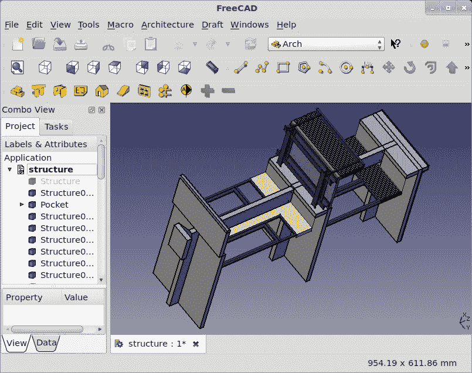

# 前言

FreeCAD 是一个面向工程世界的通用建模工具。与为动画师和艺术家设计的其他建模工具（如 Blender 或 Maya）不同，FreeCAD 对参数化和基于特征的设计给予了高度重视。

FreeCAD 最初是为机械工程和产品设计而设计的，现在正在开发中，以添加适用于广泛工程学科的功能。

FreeCAD 的底层技术投入了大量的预见性和规划。结果是，一个功能强大、易于使用且易于扩展的工具。

强大的脚本语言 Python 的广泛应用是 FreeCAD 灵活性和快速发展的部分原因。最终用户也有几种不同的方式可以访问这种力量。从录制自动化简单任务的宏到直接创建和操作几何形状，几乎什么都是可能的。

几乎 FreeCAD 应用程序的每个方面都可以通过内置的 Python 解释器访问。甚至用户界面也可以通过 Python 代码进行访问和扩展，允许用户创建新的对话框屏幕和扩展核心功能的整个模块。这个概念可以推进多远的一个例子是 Arch 模块。这个工作台是由 Yorik van Havre 开发的，以提供建筑设计能力。它完全是用 Python 编写的。



它的开源架构、可扩展的设计、快速的开发速度和热情的社区弥补了许多局限性。它在所有三个主要平台上运行得同样好，并被翻译成多种语言。加上其免费的价格标签，这意味着任何人现在都可以尝试使用 FreeCAD。

# 本书涵盖的内容

*获取和安装 FreeCAD（必须了解*），将向您介绍如何在您的计算机上使 FreeCAD 运行的基本知识。最新和最好的，还是稳定和容易？Mac、Windows 还是 Linux？我们将向您展示您的选项并讨论权衡。

*理解 FreeCAD 界面（必须了解*），提供了一个广泛的视角来了解 FreeCAD 的组织结构。这个配方将带您了解用户界面，并让您熟悉根据您的需求进行自定义。

*在 Part 工作台中执行 CSG 建模（必须了解*），向您展示如何从简单的形状开始，将它们组合起来构建复杂对象。CSG 建模是 FreeCAD 使可能的多项重要技术之一，也是您建模工具套件中不可或缺的一部分。

*录制和编辑宏（应该了解*），通过录制和回放一系列常用命令来使生活变得更简单。创建您自己的自定义命令或自动化常规任务。

*使用 Draft 工作台建模简单部件（必须了解*），介绍了 FreeCAD 中可用的另一种建模技术。许多设计，甚至复杂的 3D 对象，都是从 2D 图纸开始的。Draft 工作台提供了处理圆、弧、线和其他 2D 元素的工具。

*旋转和拉伸以创建部件（应了解）*，将展示如何将 2D 图纸转换为 3D 模型。旋转和拉伸是每个 FreeCAD 用户都应该了解的两个工具。

*使用 Python 创建 3D 实体（成为专家）*，展示了如何使用 Python 创建自定义 3D 对象。Python 是 FreeCAD 工具箱中的另一个强大工具。

*创建自定义对话框来自动化任务（成为专家）*，将向您展示如何通过创建自定义用户界面来使您的 Python 脚本更容易使用。您可以创建一个看起来很棒的对话框。

*使用约束建模（必须了解）*，涵盖了 FreeCAD 用户可用的一些最强大的技术之一。需要在不破坏其余部分的情况下更改模型的一个方面？使用约束设计意味着将灵活性构建到设计中。现在，您的设计可以轻松调整，并产生可预测的结果。

*使用外部约束（应了解）*，将使用 FreeCAD 中一些高级草图工具，超越简单的草图。您可以在现有对象的面上建模附加特征，并将草图附加到现有对象。

*使用 Python 添加或修改约束（成为专家）*，将 Python 的力量应用于基于约束的建模。您可以使用 Python 脚本深入了解草图约束的内部工作原理。

*创建部件的图纸（应了解）*，教您如何通过创建一个准备打印的图纸来将 3D 设计呈现给 2D 世界。

*导出 DXF 文件以供其他应用程序使用（应了解）*，将向您展示如何使用行业标准 DXF 文件将设计导出到其他应用程序。您将需要在外部对项目进行操作的时候，导出是极其宝贵的。

*导入数据（应了解）*，将为您提供有关如何与其他应用程序中的设计交互的信息。

# 您需要这本书的内容

FreeCAD 是一个独立的设计工具。一旦安装，开始设计复杂模型就不再需要任何额外的工具。如果您想编译 FreeCAD 的最新版本，互联网上提供了开源工具，包括 Git 版本控制系统，这是下载源代码所必需的。

# 这本书面向的对象

这本书专门为 CAD 软件的新用户编写，他们几乎没有或没有任何经验，这本书还将帮助其他 CAD 应用程序的用户快速熟悉 FreeCAD 的独特概念。

# 习惯用法

在这本书中，您将找到许多不同风格的文本，以区分不同类型的信息。以下是一些这些风格的示例及其含义的解释。

文本中的代码词如下所示：“注意它如何为您提供了关于`makeBox`类的有用提示。”

代码块设置如下：

```py
	import FreeCAD
	import Part
	App.ActiveDocument.addObject("Part::Box","Box")
	FreeCAD.getDocument("Unnamed").getObject("Box").Width = 20.00

```

当我们希望您注意代码块中的特定部分时，相关的行或项目将以粗体显示：

```py
 QtCore.QObject.connect \
	(self.okButton, QtCore.SIGNAL("pressed()"),self.box) 

```

**新术语**和**重要词汇**以粗体显示。您在屏幕上看到的单词，例如在菜单或对话框中，在文本中显示如下：“选择电线并点击**升级**按钮将其转换为面。”

### 注意

警告或重要提示以这种方式出现在一个框中。

### 小贴士

小贴士和技巧看起来像这样。

# 读者反馈

读者反馈始终受到欢迎。让我们知道您对这本书的看法，您喜欢什么或可能不喜欢什么。读者反馈对我们开发您真正从中获得最大收益的标题非常重要。

要向我们发送一般反馈，只需发送一封电子邮件到`<feedback@packtpub.com>`，并在邮件主题中提及书名。

如果有您需要的书籍并希望我们看到出版，请通过[www.packtpub.com](http://www.packtpub.com)上的**建议标题**表单发送给我们，或通过电子邮件发送到`<suggest@packtpub.com>`。

如果您在某个主题上具有专业知识，并且您有兴趣撰写或为书籍做出贡献，请参阅我们的作者指南[www.packtpub.com/authors](http://www.packtpub.com/authors)。

# 客户支持

现在您已经是 Packt 书籍的骄傲拥有者，我们有多种方式可以帮助您充分利用您的购买。

## 下载示例代码

您可以从[`www.PacktPub.com`](http://www.PacktPub.com)下载您购买的所有 Packt 书籍的示例代码文件。如果您在其他地方购买了这本书，您可以访问[`www.PacktPub.com/support`](http://www.PacktPub.com/support)并注册，以便将文件直接通过电子邮件发送给您。

## 错误清单

尽管我们已经尽最大努力确保内容的准确性，但错误仍然可能发生。如果您在我们的某本书中发现错误——可能是文本或代码中的错误——如果您能向我们报告这一点，我们将不胜感激。通过这样做，您可以避免其他读者的挫败感，并帮助我们改进本书的后续版本。如果您发现任何错误清单，请通过访问[`www.packtpub.com/support`](http://www.packtpub.com/support)，选择您的书籍，点击**错误提交表单**链接，并输入您的错误详情来报告它们。一旦您的错误清单得到验证，您的提交将被接受，错误清单将被上传到我们的网站，或添加到该标题的错误清单部分。任何现有的错误清单都可以通过从[`www.packtpub.com/support`](http://www.packtpub.com/support)选择您的标题来查看。

## 侵权

互联网上版权材料的侵权是一个跨所有媒体的持续问题。在 Packt，我们非常重视我们版权和许可证的保护。如果您在互联网上发现我们作品的任何非法副本，无论形式如何，请立即提供位置地址或网站名称，以便我们可以寻求补救措施。

如果您发现了疑似盗版材料，请通过 `<copyright@packtpub.com>` 联系我们，并提供链接。

我们感谢您在保护我们作者方面的帮助，以及我们为您提供有价值内容的能力。

## 问题和疑问

如果您在本书的任何方面遇到问题，可以通过 `<questions@packtpub.com>` 联系我们，我们将尽力解决。
