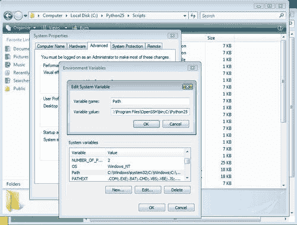
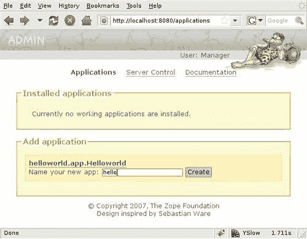
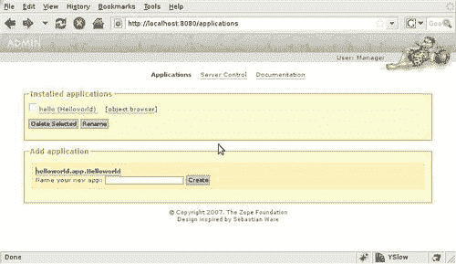
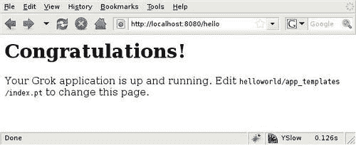
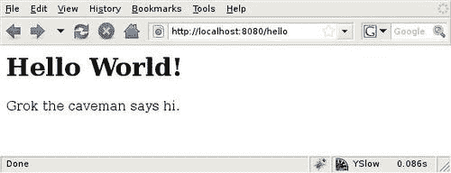
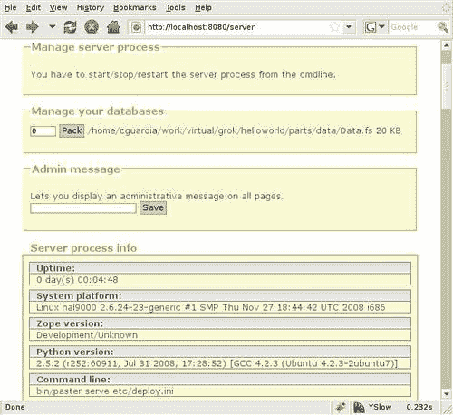

# 第二章：开始使用 Grok

现在我们已经对 Grok 及其历史有所了解，让我们开始使用它吧。当然，首先要做的是安装 Grok 所依赖的程序。幸运的是，大部分工作将自动为我们完成，但有三项关键程序你可能需要手动安装：Python、一个 C 编译器（Windows 系统上不需要），以及 EasyInstall。另外，请注意 Grok 会通过网络安装自身，因此需要互联网连接。

在本章中，我们将涵盖：

+   如何在不同的平台上安装 Python

+   Python 软件包索引（PyPI）是什么

+   如何使用 EasyInstall 通过网络快速安装 PyPI 上的软件包

+   `virtualenv` 如何让我们为开发工作设置干净的 Python 环境

+   如何使用 `grokproject` 创建项目

+   如何使用 paster 运行应用程序

+   Grok 管理员用户界面是什么，以及如何使用它

由于 Python 支持许多不同的平台，Grok 几乎可以在任何地方安装。在本章中，我们将提供在三个特定平台上安装它的说明：Unix/Linux、Mac OS X 和 Windows。

# 获取 C 编译器

如果你使用 Linux 或 Mac OS X，你的第一步是获取一个编译器。Grok 依赖于 Zope 工具包，该工具包在其源代码中包含一些 C 扩展，因此我们需要一个编译器来构建这些扩展，在大多数平台上。

Windows 用户无需担心这个问题，因为 Grok 安装过程使用的是预编译包，但其他系统确实需要安装编译器，以便构建 Grok。

许多 Linux 发行版在默认设置中包含编译器，因此对于这些发行版不需要采取任何行动，但 Ubuntu 需要安装一个包含编译器和其他开发工具的特殊软件包。在这种情况下，软件包名称是 `build-essential`，你可以通过以下命令安装它：

```py
# sudo apt-get install build-essential 

```

在 Mac OS X 系统中，系统 DVD 上的开发者工具包中包含了一个编译器。更多信息请参阅[`developer.apple.com/tools/xcode/`](http://developer.apple.com/tools/xcode/)。

# 安装 Python

Grok 最伟大的优势之一是它是用 Python 编写的。Grok 需要 Python 版本 2.4 或 2.5 来运行（在撰写本文时，2.6 版本的支持即将到来），但请注意，它不能在最近发布的 3.0 版本上运行，因为该版本与旧版本的 Python 不兼容，因此大多数库和框架仍然不支持它。

## 在 Unix/Linux 上安装 Python

Unix/Linux 发行版通常已经预装了 Python，所以你的系统可能已经安装了合适的 Python 版本。要查看你的版本，请在 shell 提示符下输入命令 `python V`；你将得到类似以下的结果：

```py
# python -V
Python 2.5.2 

```

如果您遇到错误，这意味着 Python 没有安装到您的机器上，因此您必须自行安装它。这在任何主流 Linux 发行版中都不太可能发生，但可能在某些 Unix 变体中发生。尽管如此，这种情况非常罕见，因此您应该得到一个类似于上一个示例的版本号。

如果您的版本号是 2.4 或 2.5，您可以使用系统上的 Python 安装来开发 Grok。然而，根据您的 Linux 发行版，您可能需要额外的包。一些发行版将 Python 的开发库和头文件捆绑在单独的包中，因此可能需要在您的系统上安装这些包。

例如，如果您使用 Ubuntu 或 Debian，您还需要安装 `python-dev` 包。您可以通过使用命令行轻松完成此操作。

```py
# sudo apt-get update
# sudo apt-get install python-dev 

```

其他发行版可能需要安装不同的包。请参阅您系统的文档以获取说明。

如果您没有安装 Python，您应该能够使用系统包管理器轻松安装它，类似于我们设置附加包的方式：

```py
# sudo apt-get install python 

```

如果您有 Python，但不是 2.4 或 2.5 版本，那么您的 Linux 发行版很可能包含了 2.5 版本的包。在 Ubuntu 或 Debian 中，您可以使用以下命令：

```py
# sudo apt-get install python2.5 

```

您不一定必须使用系统版本的 Python。一些开发者更喜欢从源代码手动编译自己的 Python。这可以给您带来更多的灵活性，并且还可以避免包冲突，当不同的 Python 框架或工具在同一系统上安装时可能会发生包冲突（请注意，在不编译自己的版本的情况下，也可以通过使用本章其他地方描述的 `virtualenv` 工具实现类似的目标）。

要从源代码安装，您需要从 [`www.python.org/download/`](http://www.python.org/download/) 下载所需的版本，并完成 Unix/Linux 软件包所需的常规 **configure-build-install** 循环。请记住使用 Python 2.4 或 2.5。

## 在 Mac OS X 上安装 Python

Mac OS X 总是预装了 Python，但由于 Mac 发布周期，安装到您计算机上的版本可能是一年甚至两年前的版本。因此，在许多情况下，Python-Mac 社区成员建议您安装自己的版本。

如果您的 OS X 版本是 10.5，您应该可以使用已安装的 Python 版本。对于更早的版本，您可能需要查看 [`www.python.org/download/mac/`](http://www.python.org/download/mac/) 以获取可用的安装程序和建议。

Grok 与 Mac OS X 最新版本中包含的网络包**Twisted**存在已知的依赖冲突，因此最好为 Grok 使用单独的 Python 环境。当然，您可以按照本章末尾的*在 Unix/Linux 上安装 Python*部分所述构建自己的版本。如果您出于某种原因不习惯从源代码构建自己的 Python，建议的方法是使用虚拟环境。这将在本章后面进行介绍。

## 在 Windows 上安装 Python

除了源代码下载外，Python 发行版还附带了一个非常好的 Windows 安装程序。要在 Windows 上安装 Python（我们建议您使用至少 XP 或 Vista），您只需从[`www.python.org/download/`](http://www.python.org/download/)选择一个 Python 版本，然后从提供的选项中选择下载相应的`.msi`安装程序。

下载安装程序后，双击安装文件，选择一个合适的目录来安装 Python（默认设置应该没问题），然后您就可以开始使用 Python 了。由于您需要从命令行使用 Grok，您可能希望将 Python 安装路径添加到系统路径中，这样您就可以从任何目录轻松访问 Python 解释器。

要这样做，请转到 Windows **控制面板**，单击**系统**图标，然后选择**高级**选项卡。从那里，单击**环境变量**按钮，并从**系统变量**窗口（位于底部）中选择**Path**。单击**编辑**，将显示一个带有文本框的窗口，您可以在其中编辑当前值。请确保将当前值保持原样，并在末尾添加 Python 安装路径。路径是您运行安装程序时选择的路径，通常形式为`C:\PythonXX`，其中 XX 代表不带点的 Python 版本（例如，**C:\Python25**，如以下截图所示）。使用分号将此路径与系统路径中已存在的路径分开。您还可能希望在后面添加`C:\PythonXX\Scripts`，这样我们将在本章中安装的 Python 脚本也可以从任何位置调用。



要使用 Grok，您还需要安装`win32all`包，该包包括 Win32 API、COM 支持和 Pythonwin。此包还附带安装程序，因此应该很容易设置。只需访问[`sourceforge.net/projects/pywin32/files`](http://sourceforge.net/projects/pywin32/files)，下载与您已安装的 Python 版本对应的`win32all`版本。下载后，只需运行安装程序，一切就绪。

# EasyInstall 和 Python 包索引（PyPI）

**Python 包索引**（**PyPI**）是 Python 软件的仓库，其中提供了数千个可供下载的软件包。您可以在那里找到许多种类的库和应用程序，Zope 和 Grok 都有很好的代表，您有数百个软件包可供使用。

使 PyPI 变得更有力的一个因素是名为 `easy_install` 的 Python 脚本，它允许 Python 开发者通过网络安装 PyPI 上索引的任何软件包，同时跟踪依赖关系和版本。可以轻松安装的软件包要么打包为压缩文件，要么使用特殊格式，即 `.egg` 扩展名，并被称为 **Python eggs**。

`easy_install` 模块是 `setuptools` 软件包的一部分，因此您需要安装它才能获取它。在 setuptools PyPI 页面上有 Windows 安装程序和 Unix/Linux/Mac 的 `.egg` 文件可供下载，网址为 [`pypi.python.org/pypi/setuptools`](http://pypi.python.org/pypi/setuptools)。

要在 Windows 上安装 `setuptools`，只需运行安装程序。对于 Unix/Linux/Mac 系统，将 `.egg` 文件作为 shell 脚本运行，如下例所示（您的版本可能不同）：

```py
# sh setuptools-0.6c11-py2.4.egg 

```

许多 Linux 发行版都包含 `setuptools` 的软件包。例如，在 Ubuntu 或 Debian 中，您可以使用 `apt-get` 来安装它：

```py
# sudo apt-get install python-setuptools 

```

然而，我们建议您手动安装最新版本，即使您的系统有可用的软件包也是如此，因为这样您可以确保获得最新版本。

之后，`easy_install` 脚本将出现在系统 Python 的路径上，从那时起，您可以使用以下命令在您的系统上安装 PyPI 上的任何软件包：

```py
# sudo easy_install <package name> 

```

可能您已经安装了 `setuptools`，但您想要轻松安装的某些软件包可能需要更近期的版本。在这种情况下，您将收到一个错误信息，告知您这一事实。要快速更新您的 `setuptools` 版本，请使用以下命令：

```py
# sudo easy_install -U setuptools 

```

`-U` 开关告诉 `easy_install` 获取软件包的最新版本，并就地更新之前的版本。在 Windows 系统上，`easy_install` 命令是相同的。只需在开头省略 `sudo` 这个词即可。

如前所述，Grok 和您可以使用 Grok 和纯 Zope 一起使用的数十个软件包，可在 PyPI 上找到，因此我们将使用 `easy_install` 安装 Grok 所需的软件包。但首先，我们将学习如何为我们的 Grok 开发工作设置一个干净的环境。

# Grok 和 Python 环境

Grok 使用相当多的软件包。如果其他大型 Python 软件包，甚至是一系列较小的 Python 软件包，在相同的 Python 安装下安装，有时可能会出现依赖关系问题或版本冲突。这是因为，通过 `easy_install` 或其他 Python 安装方法安装的 Python 软件包的代码通常存储在 Python 库的 `site-packages` 目录中。

Grok 通过将它们放置在 `.buildout/eggs` 目录中来隔离其包，但 Python 解释器仍然会查找 `site-packages` 以找到所需的包，这意味着如果另一个 Python 工具安装了 Grok 所用库的不同版本，可能会发生冲突。

这可能不会给你带来问题，除非你使用其他基于 Zope 的技术，例如 **Plone**。如果你是从 Grok 开始的，最简单的做法可能是直接安装它，但如果在那里遇到任何版本冲突，有一个工具可以帮助你摆脱混乱；它被称为 `virtualenv`。

# Virtualenv

`virtualenv` 是一个 Python 包，允许创建独立的 Python 环境。这是一种避免 `site-packages` 目录内的冲突包干扰你的 Grok 应用程序的方法。

可以使用 `easy_install:` 安装 `virtualenv`。

```py
# sudo easy_install virtualenv 

```

安装完成后，你可以通过为任何新项目创建环境来使用它。例如，为了为 Grok 创建一个测试环境，前往你主目录下的任意目录，并输入：

```py
# virtualenv --no-site-packages no-site-packages no-site-packages testgrok 

```

此命令将创建一个名为 `testgrok` 的目录，其中包含子目录 `bin` 和 `lib`（Windows 下的脚本和 `Lib`）。在 `bin` 目录中，你可以找到 `python` 和 `easy_install` 命令，它们将在你刚刚创建的虚拟环境上下文中运行。这意味着 `python` 将使用 `testgrok` 下的 `lib` 目录来运行 Python 解释器，而 `easy_install` 将在该 `site-packages` 目录下添加新包。

`--no-site-packages` 选项告诉 `virtualenv`，系统 Python `site-packages` 目录下的现有包都不应该在新 `virtualenv` 中可用。建议在为 Grok 构建环境时使用此选项。然而，如果你有多个不同的环境，这些环境倾向于使用相同的通用库，你可以在主 Python 环境下安装这些库，只需在虚拟环境中添加每个应用程序所需的包即可。在这种情况下，不应使用 `no-site-packages` 选项，但你需要非常仔细地规划你的设置。

在 `virtualenv` 内工作的时候，你必须记得使用 `python` 和 `easy_install` 命令的完整路径，否则你可能会无意中在主 Python 环境中安装包，或者使用与你预期不同的包集运行你的应用程序。为了防止这个问题，`virtualenv` 的 `bin` 目录（Windows 下的脚本目录）中包含了一个名为 `activate` 的批处理脚本。一旦运行它，所有后续的 `python` 和 `easy_install` 命令都将使用它们的 `virtualenv` 版本，直到你使用相应的 `deactivate` 脚本结束会话。

使用以下命令在 Unix/Linux/Mac 下激活 `virtualenv` 的 `testgrok` 环境：

```py
# source testgrok/bin/activate 

```

在 Windows 上：

```py
> testgrok\scripts\activate 

```

由于`buildout`本身负责这一点，因此对于 Grok 不需要`activate`和`deactivate`脚本；这里只是提及以示完整。

## 使用 grokproject 安装 Grok

我们终于准备好安装 Grok 了。为了便于创建项目以及基本目录结构，Grok 使用了`grokproject`包，可以使用`easy_install`来安装。前往你想要创建应用程序的目录（如果你使用`virtualenv`，请进入我们在上一节中创建的`testgrok virtualenv`内部）。现在输入以下命令：

```py
# easy_install grokproject 

```

你现在已经安装了它，但请记住`easy_install`的`-U`开关，它允许你在原地更新一个包，因为`grokproject`正在持续开发中，频繁更新是个好主意。现在我们可以创建我们的第一个 Grok 项目。

## 创建我们的第一个项目

如前所述，我们刚刚安装的`grokproject`包是一个用于创建项目的工具。Grok 项目是一个目录，它构成了一个工作环境，其中可以开发 Grok 应用程序。它是一个模板，包括一个简单的可执行应用程序，可以用作开发的基础，并作为 Grok 中事物通常去向的指南。

创建项目非常简单。让我们使用 Grok 创建传统的 hello world 示例：

```py
# grokproject helloworld 

```

`grokproject`将作为参数接受将要创建项目的目录名称。运行命令后，你将立即被要求输入管理员用户名和密码。请注意这一点，因为稍后你需要它来运行应用程序的第一次。

一旦它有了所需的信息，`grokproject`将下载并安装 Grok 所需的 Zope Toolkit 包，以及 Grok 本身。这可能需要几分钟，具体取决于你的网络连接速度，因为 Grok 由许多包组成。下载完成后，`grokproject`将配置 Grok，并设置 Grok 应用程序模板，使其准备好使用。

## 运行默认应用程序

要运行与项目工作空间一起创建的默认应用程序，我们需要启动 Grok。让我们将当前目录更改为我们的 hello world 示例所在的目录，并执行该操作。

```py
# cd helloworld
# bin/paster serve parts/etc/deploy.ini 

```

注意，该命令需要直接在项目目录中运行。请不要切换到`bin`目录并尝试在那里运行`paster`。一般来说，所有项目脚本和命令都旨在从主项目目录运行。

此命令将在 8080 端口启动 Grok，这是它的默认端口。现在你可以通过打开网页浏览器并将它指向`http://localhost:8080`来最后看到 Grok 的实际运行情况。

如果出于某种原因，您必须在系统上使用不同的端口，您需要编辑`parts/etc/`目录内的`deploy.ini`文件。此文件包含 Grok 的部署配置。您将找到设置端口的行（文件底部附近）。只需将其更改为您想要的任何数字，然后再次运行`paster`。以下是文件相关部分的示例：

```py
[server:main]
use = egg:Paste#http
host = 127.0.0.1
port = 8888

```

当您访问该 URL 时，您将看到一个登录提示。在这里，您必须使用您在上一节创建项目时选择的登录名和密码。之后，您将进入 Grok 管理界面（参考以下截图）。



要创建默认应用程序的副本，您只需在标签为**命名您的应用程序**的文本框中输入名称，然后点击**创建**按钮。例如，可以命名为**hello**。之后，您将在页面上看到一个新部分，显示已安装的应用程序，其中**hello**应该是列表中唯一的，如下一张截图所示。您可以从那里点击名称，或者将浏览器指向`http://localhost:8080/hello`，以查看正在运行的应用程序。



此时，您的浏览器应显示一个非常简单的 HTML 页面，其中有一条消息告诉您 Grok 正在运行，如下面的截图所示：



要停止服务器，您需要按*Ctrl + C*，这将让您重新控制 shell。要重新启动它，只需再次运行`paster serve`命令。

# Grok 项目内部有什么？

如我们之前提到的，我们在上一节中创建项目时使用的`grokproject`命令（幕后）使用了一个名为`zc.buildout`的工具，这是一个用于管理可重复的开发和生产环境的系统。`buildout`负责下载 Grok 的所有依赖项，并在项目目录下构建和安装它们。它还安装了运行 Grok 所需的所有脚本，例如我们之前使用的`paster`命令。

我们将在本书的后面部分更详细地探讨`buildout`及其目录结构。现在，只需注意主项目目录中的文件是`buildout`的一部分。实际的 Grok 应用程序将存储在`src`目录下。

让我们来看看与我们所创建的“hello world”Grok 应用程序特别相关的目录和文件。

## 应用程序结构概述

“hello world”应用程序代码存储在`grokproject`在本书早期为我们创建的`helloworld`目录下的`src`子目录中。让我们来看看那里存储的文件：

| 文件 | 描述 |
| --- | --- |
| `app.py` | 包含应用程序的模型和视图 |
| `app_templates` | 存储应用程序模板的目录 |
| `app.txt` | 应用程序的功能测试 |
| `configure.zcml` | Zope 3 XML 配置文件 |
| `ftesting.zcml` | 功能测试的 XML 配置 |
| `__init__.py` | 此文件存在是为了使目录成为一个包 |
| `startup.py` | WSGI 应用程序工厂 |
| `static` | 静态资源目录，例如图像和 CSS |
| `tests.py` | 包含应用程序测试代码 |

我们将在后续章节中详细介绍所有这些文件，但到目前为止，最重要的要点是：

+   文件 `app.py` 包含实际的应用程序代码，在这个例子中是最小的。

+   当我们执行应用程序时在浏览器窗口中显示的消息来自存储在 `app_templates` 目录中的 `index.pt` 模板。

+   一个 XML 配置文件，主要用于加载 Grok 的配置。

## 创建我们的第一个模板

在上一节中，我们展示了一个仅包含 hello world 应用程序可见部分的模板。这个模板可以在我们的 Grok 项目的 `src/app_templates` 目录中找到。为了让我们对 Grok 有所了解，让我们更改这个模板并添加我们自己的消息。

从 `helloworld` 目录中，使用你喜欢的文本编辑器打开 `src/app_templates/index.pt` 文件。该文件具有以下内容：

```py
<html>
<head>
</head>
<body>
<h1>Congratulations!</h1>
<p>Your Grok application is up and running.
Edit <code>testdrive/app_templates/index.pt</code> to change
this page.</p>
</body>
</html>

```

将文件更改为如下所示：

```py
<html>
<head>
</head>
<body>
<h1>Hello World!</h1>
<p>Grok the caveman says hi.</p>
</body>
</html>

```

实际上，你可以更改消息以显示你喜欢的任何内容；只需注意 Grok 模板需要 XHTML。

最后，保存模板并再次使用 `paster` 运行服务器实例：

```py
# bin/paster serve parts/etc/deploy.ini 

```

如果你之前让服务器运行过，由于页面模板、图像和 CSS 的修改可以立即查看，因此无需重新启动服务器以进行此更改。

在你的浏览器中打开 URL `http://localhost:8080/hello`。你应该看到以下截图类似的内容：



Grok 说你好。现在欢呼吧，你已经完成了你的第一个 Grok 应用程序。

# Grok 管理员用户界面

在你命名并启动 hello world 应用程序之前，你已经简要地与 Grok 管理应用程序管理器进行了交互。让我们更详细地看看这个管理员用户界面中的三个标签页。

## 应用程序

在此标签页中，你可以管理所有你的应用程序实例。对于你定义的任何应用程序，你将看到其点状类路径，例如在我们的例子中是 `helloworld.app.Helloworld`，以及一个用于创建和命名实例的文本框和按钮。

一旦创建了一个应用程序实例，你将在页面顶部看到它，以及你之前可能创建的任何其他应用程序。从那里，你可以通过点击其名称来启动应用程序，或者可以通过使用其左侧的复选框和相应的按钮来删除它或重命名它。

您还可以使用应用程序名称旁边的**对象浏览器**链接来检查实例，并查看其基类、属性、属性和方法。例如，您可以探索类或模块的 docstrings 中包含的文档。您可以在**运行默认应用**部分的第二个截图下查看 Grok 管理界面中的对象浏览器链接。

## 服务器控制

**服务器控制**标签页允许您查看服务器进程信息，例如运行时间、平台和软件版本。它还允许您启动、停止或重启服务器进程，前提是您以守护进程方式运行它，而不是从命令行运行。请参阅下一张截图，以查看此标签页中找到的信息示例。



由于 Grok 用于持久化的 **ZODB** 是事务性的并且支持撤销，因此随着越来越多的对象被添加并不断修改，它的大小往往会变得很大。为了保持您项目数据库的整洁有序，建议您定期“打包”它。打包过程删除了您对象的旧版本，只保留最新信息，从而减小文件大小。

您可以从服务器控制面板中打包 Grok 的 ZODB。只需选择您希望保留对象信息的天数，然后点击**打包**按钮。**0**的值会清除所有之前的对象修订版本，只保留所有对象的最新版本。打包过程在后台运行，因此您的应用程序在打包过程中仍然可以处理请求。

您可以从此标签页使用的一个最后功能是管理消息，它允许您输入一条消息，该消息将在 Grok 管理界面的每一页上显示给所有管理员，直到有人重置文本。

## 文档

**文档**标签页提供了到 DocGrok 包和对象浏览器的链接，这些链接允许您查看运行中的 Grok 进程下大多数事物的所有信息。这包括但不限于对象、类、模块、函数和文本文件。

# 摘要

在本章中，我们安装了 Grok 及其依赖项，并创建了我们的第一个 Grok 项目和应用。

现在我们已经可以创建自己的 Grok 项目了，是时候学习如何定义和创建不同类型的视图，并使用这些知识开发我们的第一个工作应用了。
