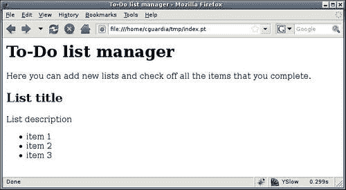
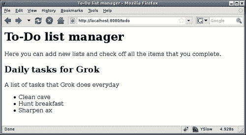
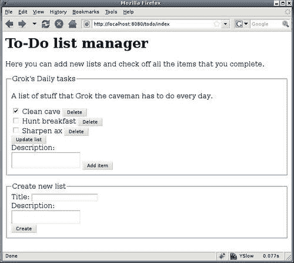
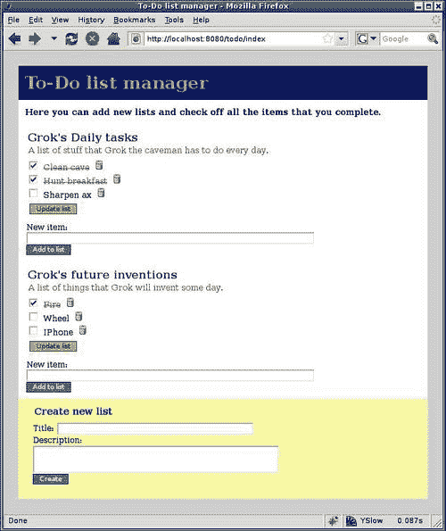

# 第三章。视图

在上一章中，我们创建了我们的第一个 Grok 项目，并学习了如何启动一个简单的 hello world 应用程序。现在我们将学习关于视图和模板的内容，它们构成了我们 Web 应用程序的表现层。为此，我们将创建一个简单的应用程序来管理待办事项列表。目标是到本章结束时，创建一个可以允许用户创建和管理任意数量列表、向其添加条目并标记为完成的应用程序。

为了达到我们的目标，我们将在本章中探讨以下主题：

+   视图是什么以及在哪里定义 Grok 应用程序代码中的视图

+   如何使用 ZPT 模板引擎，以及最常见的语句在行动中的示例

+   如何仅使用视图编写完整的 Grok 应用程序

+   如何从 Web 请求中获取表单参数

+   如何向 Grok 应用程序添加静态资源

+   如何创建和使用额外的视图

+   如何使用不需要关联模板的视图

# Grok 视图

**Web 应用程序**只是一系列网页，通过允许用户输入一些数据、以各种方式处理这些数据并向用户展示一些结果或确认，帮助用户完成一个或多个任务。在 Web 应用程序框架中，允许用户查看正在发生的事情的网页和允许他捕获信息的 Web 表单被称为**视图**。

视图通常通过使用某种页面模板来实现，但在 Grok 中，我们也可以有独立的 Python 代码来处理更复杂的逻辑，使其更容易。实际上，我们甚至可以使用仅使用 Python 代码而不使用模板来渲染视图。这给开发者提供了更多的权力（实际上是 Python 的全部权力），并允许视图表现和视图逻辑的清晰分离，从而在模板和 Python 两侧都产生更易读的代码。

我们在第二章的末尾已经处理了视图的模板部分，当时我们修改了`helloworld`项目中的`index.pt`文件。除了这个页面模板之外，如果你查看该项目`src/helloworld`目录中的`app.py`文件，你将看到视图的 Python 部分。以下是`helloworld`应用程序的完整源代码：

```py
import grok
class Helloworld(grok.Application, grok.Container):
pass
class Index(grok.View):
pass # see app_templates/index.pt 

```

在这种情况下，视图的 Python 代码仅由一个类声明组成，我们从这个类继承自`grok.View`，这是基本的 Grok 视图。由于我们只是将要展示模板，我们不需要更多的代码，但如果我们查看类的名称，我们可以看到 Grok 的一个约定正在起作用：`Index`。正如类定义之后的注释所说，这个类的模板将在`application`目录下的`app_templates/index.pt`中找到。Grok 不需要在代码或配置中被告知这一点，因为按照约定，模板名称将与类名相同，模板名称为小写，并附加`.pt`扩展名。

要向应用程序添加新的视图，我们只需要定义一个从`grok.View`继承的类，并在`app_templates`文件夹内创建相应的模板。然后我们可以通过使用模板名称在 URL 中引用这个视图。注意，名称`index.pt`是一个特殊情况，它代表另一个约定，因为具有该名称的视图将被视为应用程序的默认视图，这意味着在 URL 中不需要指定其名称。

# Zope 页面模板 (ZPT)

对于 HTML 生成，Grok 使用**Zope 页面模板**（**ZPT**）。它们很好地符合 Grok 的哲学，因为它们设计背后的一个驱动原则是严格分离逻辑和展示。尽可能的情况下，视图模板应只包含展示和结构逻辑，以及视图类中的名称和方法调用。

ZPT 的另一个重要设计原则是与编辑工具良好地协同工作，从而允许设计师从开发者那里取回模板代码，同时仍然能够看到并处理页面的完整 HTML 表示，而不会丢失任何逻辑。这是通过使用有效的 HTML/XHTML 作为页面模板来实现的。

## 模板属性语言 (TAL)

为了实现与编辑工具良好协作的目标，ZPT 使用**模板属性语言**（**TAL**）。这种语言中的语句使用带有 XML 命名空间的 HTML 属性，这基本上意味着它们以“tal:”和冒号作为前缀，例如`tal:content`或`tal:replace`。编辑工具通常会忽略不是常规 HTML 的一部分的语句，因此它们会保留 TAL 语句不变。

让我们快速概述一下最重要的 TAL 语句和结构。这里我们将介绍基础知识，但完整的参考可以在[`docs.zope.org/zope2/zope2book/AppendixC.html`](http://docs.zope.org/zope2/zope2book/AppendixC.html)找到。

让我们通过一个简单的例子开始我们的 TAL 介绍：

```py
<h1 tal:content="python:5*5">Me Grok can multiply</h1>

```

`content`是一个 TAL 语句，它保持标签不变，但用引号中的表达式结果替换其内容。在这种情况下，当页面渲染时，我们将得到以下内容：

```py
<h1>25</h1>

```

注意，标签仍然是一个`<h1>`标签，但标签的内容会变为表达式的结果，每次页面渲染时都会动态计算。使用所见即所得(WYSIWYG)工具的设计师会看到“一个简单的乘法”这样的文字，但仍然能够正确地看到页面的预期结构。

按设计，ZPT 不是一个通用编程语言，因此复杂的代码最好放在视图类中的 Python 代码中。然而，仍然可以根据某些条件重复标签、省略或显示它们，甚至包括其他页面模板的部分。这通常足以处理大多数页面结构，即使不是这样，也可以在 Python 代码中生成 HTML 的一部分，并将其插入模板中。

### 注意

ZPT 不是唯一可以与 Grok 一起使用的模板引擎，因为它被精心设计为允许可插拔的引擎。在撰写本文时，有两个这样的引擎的包可用：`megrok.genshi` 和 `megrok.chameleon`。开发者可以选择更适合他风格的模板引擎，并使用它而不是 ZPT。

## 表达式类型

在上一个示例中，我们使用了表达式 `python:5*5` 来获取乘法的结果。这些被称为 Python 表达式，可以在冒号之后包含任何有效的 Python 表达式。当然，Grok 的一个原则是明确分离表现和逻辑，我们希望避免使用非常长的表达式。但 Python 表达式有时非常有用，尤其是在处理条件或列表、字典等 Python 对象时。

有几个原因说明将大部分逻辑保留在模板之外是一个好主意。首先，如果我们能使用 Python 开发工具，调试和测试代码会容易得多。此外，通过使用这种策略，我们可以潜在地改变应用程序的表现（模板）而不必触及主代码。

虽然还有其他类型的表达式。ZPT 中的默认表达式类型被称为**路径表达式**。以下是一个示例：

```py
<p tal:content="request/URL">Me Grok want current URL</p>

```

它被称为路径表达式的原因是因为它以变量名开头，并使用斜杠来分隔对该变量子对象的调用，返回路径中最后一个对象的调用结果，或者如果它不可调用，则返回该对象本身。在前面的示例中，我们通过从 `request` 到 `URL` 的路径从特殊名称 `request` 获取当前 URL。

如果路径的某个组件未找到，将发生错误，但在这种情况下，可以回退到其他对象或值。为此，我们使用 `|` 符号来分隔可能的表达式值。例如，要从请求中获取一些参数：

```py
<span tal:content="request/param1|request/param2|nothing">Me Grok will settle for any value here</span>

```

在这个路径表达式中，我们寻找请求参数 `param1`；如果它未定义，我们使用 `param2` 的值，如果两个都没有定义，则使用特殊值 `nothing`。此值等同于 Python 的 `None` 值，因此如果发生这种情况，span 标签内将没有任何内容，但不会发生错误。

除了路径和 Python 表达式之外，还有一种称为**字符串表达式**的第三种类型。当你需要将任意字符串与路径表达式的结果组合时，这些表达式非常有用。以下是一个示例：

```py
<p tal:content="string:Me Grok web page is at this URL: ${request/URL}"></p>

```

冒号之后的所有内容都被视为要显示的字符串，除了字符串中带有 `$` 标记的路径表达式和这些表达式的结果会被替换。当路径表达式由多个部分组成（当我们必须使用 `/` 分隔符时）或者它与其他字符在字符串中未分隔时，必须将表达式括在 `{}` 大括号内，就像前面的示例一样。要插入 `$` 符号，使用两个 `$` 符号，如下所示：

```py
<p tal:content="string: Me Grok is richer by $$ $amount"></p>

```

如果变量`amount`的值为 45，前面的表达式将输出以下 HTML：

```py
<p>Me Grok is richer by $ 45</p>

```

## 插入文本

我们已经看到`content`语句会替换一个标签的所有内容，包括任何嵌套的标签。还有一个`replace`语句，它可以完全删除标签，并在其位置插入所需的文本。

```py
<span tal:replace="string:Me Grok need no tag here">text</span>

```

在这种情况下，`<span>`标签只是一个占位符标签，因为当模板渲染时它不会被输出。

除了插入文本外，`replace`语句还可以用于在页面上包含占位内容，这对于一些想要使用更详细的模拟网页进行演示的设计师来说可能很有帮助，而最终渲染的页面上不会出现这些内容。为此，我们只需将 HTML 替换为特殊名称`nothing:`。

```py
<p tal:replace="nothing">Me Grok will not use this content</p>

```

## 重复标签

当处理 HTML 表格和列表时，我们通常会需要为 Python 序列中的每个项目添加一个表格行或列表项，例如列表或元组。例如，我们可能有一个用于显示为 HTML 无序列表的武器列表，名为'Grok the caveman'。`repeat`语句会导致标签及其所有内容在序列中的每个元素上重复一次。为了了解它是如何工作的，假设我们有一个作为视图属性传递给模板的武器列表，名称为`weapon:`。

```py
<h1>Grok's Arsenal</h1>
<ul>
<li tal:repeat="weapon python:view.weapons" tal:content="weapon">Weapon</li>
</ul>

```

如果`weapon`包含列表`['Rock','Club','Spear']`，模板将渲染如下：

```py
<h1>Grok's Arsenal</h1>
<ul>
<li>Rock</li>
<li>Club</li>
<li>Spear</li>
</ul>

```

`repeat`语句接受两个参数。第一个是循环变量的名称，它将按顺序分配列表中每个元素的值。第二个是一个返回元素存储序列的表达式。注意我们如何使用选定的名称`weapon`，结合`content`语句，在`<li>`标签内插入当前武器的名称。

可以嵌套多个`repeat`语句，这就是为什么我们需要给循环变量命名。这个名称也可以用来确定我们在列表中的位置，通过结合使用特殊的`repeat`变量。例如，表达式`repeat/weapon/number`将返回 1 作为第一个元素，2 作为第二个元素，依此类推。表达式`repeat/weapon/index`做同样的事情，但起始值为 0。

## 条件元素

`condition`语句用于在渲染时决定是否在页面上显示一个标签及其内容。它评估传递给它的表达式，如果结果为假，则删除该标签。当表达式为真时，标签会正常显示。

为了帮助“穴居人”更好地跟踪他的武器库，我们可以将列表转换成表格，同时显示他每种武器的数量。当物品数量被认为过少时，可以在每一行添加一个有用的提示。在这种情况下，`view`变量将包含一个字典列表，例如这个：[{'name':'Rock','quantity':10},{'name':'Club','quantity':1},{'name':'Spear','quantity':3}]。要显示表格，我们可以使用以下标记：

```py
<table>
<tr>
<th>Weapon</th>
<th>Quantity</th>
<th>Notes</th>
</tr>
<tr tal:repeat="weapon view/weapons">
<td tal:content="weapon/name">Weapon</td>
<td tal:content="weapon/quantity">Quantity</td>
<td tal:condition="python:weapon['quantity']>=3">OK</td>
<td tal:condition="python:weapon['quantity']<3">Need to get more!</td>
</tr>
</table>

```

这将生成以下 HTML：

```py
<table>
<tr>
<th>Weapon</th>
<th>Quantity</th>
<th>Notes</th>
</tr>
<tr>
<td>Rock</td>
<td>10</td>
<td>
OK
</td>
</tr>
<tr>
<td>Club</td>
<td>1</td>
<td>
Need to get more!
</td>
</tr>
<tr>
<td>Spear</td>
<td>3</td>
<td>
OK
</td>
</tr>
</table>

```

关于这段代码，有几个需要注意的地方。首先，注意我们是如何使用路径表达式来引用`name`和`quantity`列中的字典键的。路径表达式对于字典键、对象属性和方法的工作方式相同。相比之下，在`condition`语句的 Python 表达式中，我们必须使用字典语法。其他需要注意的事情是，我们实际上需要重复相同的`<span>`标签两次，条件不同。渲染的模板只显示那些为真的标签。在这种情况下，我们具有互斥的条件，但在其他情况下，我们可能有多个条件，具有独立的真或假值。

## 变量

有时候，我们需要在整个页面模板中重复使用表达式。我们可以在多个地方重复表达式，但这会导致它被多次评估，这是低效的。对于这些情况，ZPT 提供了一个`define`语句，允许我们将表达式的结果分配给一个变量。以下是一个模板片段的例子，其中变量定义会有所帮助：

```py
<ul>
<li tal:repeat="weapon view/weapons">
<span tal:replace="weapon">weapon</span> is weapon
<span tal:replace="repeat/weapon/number">number</span> of
<span tal:replace="python:len(view.weapons)">total number of weapons </span>
</li>
</ul>

```

在这个例子中，表达式`view/weapons`在`repeat`语句中计算一次，然后对于列表中的每个项目再计算一次。对于`weapons`列表中的每个项目，列表的长度也只计算一次。如果我们使用`define`语句，这可以避免：

```py
<ul tal:define="weapons view/weapons;total_weapons python:len(weapons)">
<li tal:repeat="weapon weapons">
<span tal:replace="weapon">weapon</span> is weapon
<span tal:replace="repeat/weapon/number">number</span> of
<span tal:replace="total_weapons">total number of weapons</span>
</li>
</ul>

```

`define`语句接受变量的名称和用于其值的表达式，两者之间用空格分隔。请注意，我们可以在单个语句中具有多个定义，由分号分隔。现在，假设我们需要在列表顶部添加一个标题，显示武器总数：

```py
<h1>Grok's Arsenal (<span tal:replace="python:len(view.weapons)"> number</span> total weapons)
</h1>

```

我们不能仅在`<h1>`标签中定义长度，因为`define`语句的作用域仅限于使用它的标签及其内容。尽管如此，我们仍然希望有一个可以重复使用的定义。在这种情况下，可以使用`global`关键字：

```py
<h1 tal:define="global weapons view/weapons;total_weapons python:len(weapons)">Grok's Arsenal (<span tal:replace="python: total_weapons">number</span> total weapons)
</h1>

```

一旦使用`global`关键字定义了一个变量，它就可以在模板的任何地方重复使用，不受页面标签结构的限制。

关于定义的一个重要注意事项是，路径表达式始终返回路径中最后一个元素的调用结果。因此，当我们与可调用对象一起工作时，我们可能会将错误的东西分配给变量，并弄乱页面。这有时很难调试，所以尽可能使用 Python 表达式是个好主意，因为它们更明确。

这并不意味着我们不能使用路径表达式（毕竟，它们是默认类型），但我们必须确保我们得到我们想要的价值。当我们需要获取一个对象而不是调用该对象的结果时，我们可以使用特殊的`nocall`路径表达式来获取它：

```py
<p tal:define="object nocall:view/object">Me Grok need object</p>

```

## 特殊变量

Grok 还为每个页面模板提供了一些特殊变量，这样模板作者就可以引用不同的应用程序对象和视图。

+   `view:` 使用这个特殊名称，可以访问与模板关联的视图类的所有方法和属性。

+   `context:` 上下文名称指的是正在查看的模型，并且允许访问其方法和属性。

+   `request:` 请求对象包含当前网络请求的数据。

+   `static:` 这个特殊名称允许创建指向静态资源的 URL。

## 修改 HTML 标签属性

除了在页面中插入文本外，通常还需要在渲染时动态定义 HTML 标签的属性。`attributes`语句允许我们做到这一点。例如，让我们为 Grok 这个穴居人的武器库中的每件武器添加描述页面的链接：

```py
<h1>Grok's Arsenal</h1>
<ul>
<li tal:repeat="weapon view/weapons">
<a tal:content="weapon" href="" tal:attributes="href string:${request/URL}/${weapon}">Weapon</a>
</li>
</ul>

```

在这个例子中，我们修改链接的`href`属性，使其使用当前页面的 URL，并附加武器的名称，假设列表中的每件武器都存在一个具有该名称的武器描述页面。

与`define`语句一样，`attributes`语句允许使用分号分隔的多个属性定义。

## 插入结构

由于安全原因，使用`content`和`replace`标签插入的字符串会被引号括起来，以便转义任何 HTML 标签，所以`<`括号变成`&lt`；而`>`括号变成`&gt`；。这导致 HTML 标签在渲染的页面上显示，而不是被解释为 HTML。这对于防止一些跨站脚本攻击很有用，但也会妨碍从 Python 代码生成 HTML。在表达式之前使用`structure`关键字，告诉 ZPT 返回的文本应该被解释为 HTML，并像页面上的其他标签一样渲染。

例如，如果我们假设变量 text 包含以下 HTML：

```py
<p>This is the text</p>

```

这个标签将转义 HTML：

```py
<div tal:content="text">The text</div>

```

生成的 HTML 将看起来像这样：

```py
<div>&lt;p&gt;This is the text&lt;/p&gt;</div>

```

让我们使用`structure`关键字：

```py
<div tal:content="structure text">The text</div>

```

现在我们得到以下结果：

```py
<div><p>This is the text</p></div>

```

## 一个标签中的多个语句

在一些早期的例子中，我们在单个标签内使用了多个 TAL 语句。由于 XML 不允许在标签内重复属性，我们可以在给定的标签中只使用每种类型的 TAL 语句中的一个，并且我们可以根据需要将它们组合起来，除了`content`和`replace`语句，它们是互斥的，并且不能在同一个标签中使用。

当在一个标签中使用多个语句时，需要知道的最重要的事情是它们执行的顺序是固定的。我们如何放置它们在标签中无关紧要，它们将按照以下顺序执行：

1.  `define`

1.  `condition`

1.  `repeat`

1.  `content/replace`

1.  `attributes`

因此，如果我们需要在这个列表中较低位置的语句在较高位置的语句之前执行，我们必须添加所需的`<div>`或`<span>`标签来绕过固定的顺序。例如，假设我们想在`repeat`语句的每个元素中定义一些变量。我们不能在`repeat`语句本身所在的标签中添加`define`语句，因为`define`在`repeat`之前执行，所以我们会因为循环变量在那个点未定义而得到错误。

一个可能的解决方案是在`repeat`语句之后使用`<span>`标签来定义变量，如下面的示例所示：

```py
<h1>Grok's Arsenal</h1>
<ul>
<li tal:repeat="weapon view/weapons">
 <span tal:define="weapon_uppercase python:weapon.upper()" tal:content="weapon_uppercase">
Me Grok want uppercase letters
</span> 
</li>
</ul>

```

一个稍微更好的解决方案是使用具有 XML 命名空间的标签`tal`，它将作为结构标记但不会出现在最终的页面渲染中：

```py
<h1>Grok's Arsenal</h1>
<ul>
<li tal:repeat="weapon view/weapons">
<tal:weapon define="weapon_uppercase python:weapon.upper()" content="weapon_uppercase">
Me Grok want uppercase letters
</tal:weapon> 
</li>
</ul>

```

我们不使用`<span>`标签，而是使用`<tal:weapon>`。这并不是因为 ZPT 有一个`weapon`标签；技巧在于名字中的`tal`部分。在这里我们可以用任何其他东西代替`weapon`。请注意，由于标签本身明确使用了`tal`命名空间，当使用 ZPT 时，同一标签中的`define`和`content`语句不需要以它为前缀。

## 宏和插槽

许多网站在每一页上使用标准元素，例如标题、页脚、侧边栏等。ZPT 的一个不错之处在于它允许我们重用这些元素，而无需在各个地方重复它们。用于执行此操作的机制称为宏和插槽。

**宏**是一个声明为单个实体并赋予名称的页面或页面的一部分。一旦完成此声明，所命名的标记就可以在不同的页面中重用。这样，我们可以有一个单页宏来定义我们网站的外观和感觉，并且让其他每一页看起来都像它，最重要的是，当宏更改时，它会自动更改。

宏的定义使用 HTML 属性，就像 TAL 语句一样。宏定义语言被称为**宏扩展模板属性语言**，或简称**METAL**。以下是一个示例：

```py
<div metal:define-macro="about">
<h1>About Grok</h1>
<p>Grok is a friendly caveman who likes smashing websites</p>
</div>

```

`define-macro`语句创建了一个带有引号中给定名称的宏，在这个例子中是`about`。这个名字被添加到页面上定义的宏列表中，这个列表被恰当地命名为`macros`。我们可以在页面模板中定义任意数量的宏，只要我们为每个宏使用不同的名称。要使用宏，我们需要通过使用所需的名称来访问创建它的页面的`macros`属性。假设`about`宏定义在名为`main.pt`的页面模板中，我们就可以在任意其他页面中使用这个宏，如下所示：

```py
<p metal:use-macro="context/main.pt/macros/about">
About
</p>

```

当这个其他模板被渲染时，整个`<p>`标签会被包含宏的`<div>`标签所替换。这就像是将宏中的 HTML 复制并粘贴到包含`use-macro`语句的标签位置一样。

通过使用宏，你可以轻松地在多个页面中重用大块或小块的 HTML，但使这一概念更加有用的是插槽的概念。将插槽想象为现有宏内部自定义 HTML 的占位符。尽管 HTML 的一般结构保持不变，但使用宏的模板可以在渲染时填充这些占位符，从而比简单的宏提供更多的灵活性。

最有效的使用插槽的方法是在全页宏中定义部分，这些部分可以通过不同的模板使用宏来填充。这样我们就可以在一个地方定义我们网页的结构，并且让整个网站都能从中受益。

让我们定义一个页面宏来展示这些概念的实际应用：

```py
<html metal:define-macro="page">
<head>
<title tal:content="context/title">title</title>
</head>
<body>
<div metal:define-slot="header">
<h1 tal:content="context/title">Grok's Cave</h1>
</div>
<div metal:define-slot="body">
<p>Welcome to Grok's cave.</p>
</div>
<div metal:define-slot="footer">
<p>Brought to you by Grok the caveman.</p>
</div>
</body>
</html>

```

注意我们是如何在第一个标签内部定义宏的，这样整个页面就是一个大宏。然后，使用`define-slot`语句，我们定义了三个插槽，分别对应于页眉、页脚和主体。其他模板可以重用这个宏，并填充一个或多个这些插槽来定制最终的页面渲染。以下是实现方法：

```py
<html metal:use-macro="context/main.pt/page">
<div fill-slot="body">
Me Grok likes macros!
</div>
</html>

```

`fill-slot`语句接受一个插槽的名称，并用使用该语句的标签开始的节的内容替换其内容。`main.pt`模板中的其他内容将完全按照其出现的方式使用。这是渲染后的 HTML 看起来像这样：

```py
<html>
<head>
<title>example</title>
</head>
<body>
<div>
<h1>example</h1>
</div>
<div>
<p>Me Grok likes macros!</p>
</div>
<div>
<p>Brought to you by Grok the caveman.</p>
</div>
</body>
</html>

```

## 超越 ZPT 基础

虽然我们确实介绍了一些概念，包括在模板中插入文本、重复标签、条件、变量、属性和宏，但这只是一个对 ZPT 的简要介绍。更多详细信息，可以参考 Zope 书籍，该书籍可在[`docs.zope.org/zope2/zope2book/`](http://docs.zope.org/zope2/zope2book/)在线获取。

# 待办事项列表应用程序

现在我们已经了解了 ZPT，让我们从待办事项应用程序的代码开始。想法是用户将有一个网页，他可以通过列表来管理他的任务。他不仅可以使用单个列表，还可以创建多个列表来处理高级任务，每个列表包含多个较小的任务。应用程序将允许用户创建带有描述的列表，向其中添加任务，并在完成时勾选它们。他可以添加他需要的任何数量的列表，并在任何时候删除它们。

这一切都非常简单，所以现在列表管理器将使用一个带有相关模板的单个视图。随着我们进入本章的后续内容，我们将添加更多功能。

当然，第一步是创建一个新的 Grok 项目：

```py
# grokproject todo 

```

现在，我们将使用 Python 列表来保存我们的待办事项列表。每个列表将是一个包含标题、描述和项目的字典。我们的下一步将是创建一个模板来显示所有列表及其项目。我们将用以下代码替换 `app_templates` 中 `index.pt` 模板的内 容：

```py
<html>
<head>
<title>To-Do list manager</title>
</head>
<body>
<h1>To-Do list manager</h1>
<p>Here you can add new lists and check off all the items that you complete.
</p>
<tal:block repeat="todolist context/todolists">
<h2 tal:content="todolist/title">List title</h2>
<p tal:content="todolist/description">List description</p>
<ul>
<li tal:repeat="item todolist/items" tal:content="item">item 1</li>
<li tal:replace="nothing">item 2</li>
<li tal:replace="nothing">item 3</li>
</ul>
</tal:block>
</body>
</html>

```

检查代码。确保你理解我们使用的所有 ZPT 语句。如有必要，再次查看 ZPT 部分。我们假设特殊名称 `context` 将包含在名为 `todolists` 的属性中的列表，并且它通过使用 `repeat` 语句遍历所有列表。我们还在其中嵌套了一个 `repeat` 语句，以列出每个待办事项列表中的所有项目。

在做任何事情之前，使用你的网络浏览器的打开文件选项打开 `index.pt` 文件。注意我们如何得到一个页面一旦有真实数据的预览（见以下截图）。这是使用 ZPT 的一大好处。我们明确利用了这一特性，通过在列表中使用 `replace="nothing"` 技巧添加了两个虚拟列表项。



现在我们来看看它在 Grok 中的工作情况。请记住，模板假设在 `context` 中将有一个名为 `todolists` 的列表可用。这实际上将指向应用程序模型，但为了现在，我们只需在那里硬编码一些值来查看模板是如何渲染的。我们稍后会使用一个真实模型。打开 `src` 目录中的 `app.py` 文件，并将其修改如下：

```py
import grok
class Todo(grok.Application, grok.Container):
todolists = [{
'title' : 'Daily tasks for Grok',
'description' : 'A list of tasks that Grok does everyday',
'items' : ['Clean cave',
'Hunt breakfast',
'Sharpen ax']
}]
class Index(grok.View):
pass

```

现在启动应用程序：

```py
# bin/paster serve etc/deploy.ini 

```

通过使用管理控制面板创建一个应用程序，并点击其链接。将显示一个类似于以下截图的屏幕。注意它与之前我们打开的预览模板的相似性。



# 处理表单数据

现在我们可以正确地显示待办事项列表及其项目，但我们需要一种方法来添加新的列表和项目，我们还需要能够以某种方式勾选它们。我们需要表单来处理这些操作，所以让我们修改模板，使其看起来像这样：

```py
<html>
<head>
<title>To-Do list manager</title>
</head>
<body>
<h1>To-Do list manager</h1>
<p>Here you can add new lists and check off all the items that you complete.
</p>
<tal:lists repeat="todolist context/todolists">
<form method="post" tal:attributes="action view/url">
<fieldset>
<legend tal:content="todolist/title">
title</legend>
<p tal:content="todolist/description">
description</p>
<div tal:repeat="item todolist/items">
<span tal:content="item/description">
</span>
</div>
</fieldset>
</form>
</tal:lists>
</body>
</html>

```

我们现在为每个列表使用一个表单，并且每个表单都有相同的操作，该操作在渲染时通过使用`attributes`语句定义。Grok 视图始终有一个`url`方法，它返回视图 URL，因此我们在这里所做的就是将表单提交给自己。我们将在添加视图的 Python 代码时稍后处理表单提交。

为了在视觉上分隔列表，每个列表都包含在一个`fieldset`中，其中包含其标题和描述。为了列出单个项目，我们丢弃了第一个模板中的`<ul>`，并使用了一个`<div>`，因为我们现在需要有一个复选框来标记已完成的项目。让我们添加复选框，同时提供一个在添加项目的同时从列表中删除项目的方法：

```py
<div tal:repeat="item todolist/items">
<input type="checkbox" tal:attributes="name string:item_{repeat/item/index}; checked item/checked"/>
<span tal:content="item/description"></span>
<input type="submit" tal:attributes="name string:delete_${repeat/item/index}" value="Delete"/>
</div>
<br/>
<input type="hidden" name="list_index" tal:attributes="value repeat/todolist/index"/>
<input type="submit" name="update_list" value="Update list"/>
<br />

```

注意使用`repeat/item/index`变量来命名每个项目，根据其在列表中的位置，这样我们就可以在视图中单独引用它们。我们还需要知道项目属于哪个列表，这就是为什么每个列表表单都有一个隐藏的输入字段，其中包含其索引，使用`repeat/todolist/index`来获取该值。最后，我们有一个更新列表按钮，用于一次性检查和取消选中多个列表项。

现在所需的就是一种向列表中添加新项目的方法。我们只需在之前的代码中添加一个用于项目描述的文本区域和一个用于添加项目的提交按钮。这里并没有什么特别之处：

```py
<label for="item_description">Description:</label><br/>
<textarea name="item_description"></textarea>
<input type="submit" name="new_item" value="Add item"/>

```

在显示所有列表之后，我们想要另一个表单来添加新的列表。这个表单也提交给自己。将此代码放置在上述`</tal:lists>`标签之后。

```py
<form method="post" tal:attributes="action view/url">
<fieldset>
<legend>Create new list</legend>
<label for="list_title">Title:</label>
<input type="text" name="list_title"/><br/>
<label for="list_description">Description:</label>
<br/>
<textarea name="list_description"></textarea><br/>
<input type="submit" name="new_list" value="Create"/>
</fieldset>
</form>

```

视图模板已经准备好了。现在让我们创建视图类。记住，在 Grok 中，视图通常由一个用于 UI 的模板和一个用于将计算数据传递给模板并处理任何表单输入的类组成。由于我们现在有各种将表单数据发送到视图的提交按钮，我们需要一种处理这些数据的方法。最简单的方法是定义一个`update`方法，Grok 知道在渲染页面模板之前调用该方法。

要获取表单数据，我们将使用在每个视图类中都可用的`request`变量。该变量包含当前`HTTP`请求的所有数据，包括表单字段。使用`request.form`，我们将得到一个包含所有可用表单字段的字典，字段的`name`属性用作键。每个提交按钮都有自己的名称，因此我们可以检查其是否存在，以查看需要执行哪个操作。

将`app.py`修改为以下代码：

```py
import grok
class Todo(grok.Application, grok.Container):
todolists = []
class Index(grok.View):
def update(self):
form = self.request.form
if 'new_list' in form:
title = form['list_title']
description = form['list_description']
self.context.todolists.append({'title':title, 'description':description, 'items':[]})
return
if 'list_index' in form:
index = int(form['list_index'])
items = self.context.todolists[index]['items']
if 'new_item' in form:
description = form['item_description']
items.append({'description':description, 'checked':False})
return
elif 'update_list' in form:
for item in range(len(items)):
if 'item_%s' % item in form:
items[item]['checked'] = True
else:
items[item]['checked'] = False
return
else:
for item in range(len(items)):
if 'delete_%s' % item in form:
items.remove(items[item])

```

首先，在应用程序定义中，我们删除之前添加的测试数据，将`todolists`属性定义为空列表，这样当我们启动应用程序时，我们就有一个干净的起点。

在`update`方法中，我们通过使用`self.request.form`将表单数据分配给`form`变量，正如之前所讨论的。然后我们有三种可能的情况。

+   **第一种情况**：提交了添加列表的表单，在这种情况下，`new_list`的名称将在表单中。

+   **情况二**：按下了添加项目、删除项目或更新特定列表的按钮之一，因此`list_index`隐藏字段将在表单中。

+   **情况三**：没有发生表单提交，例如当第一次访问视图时，因此不应采取任何操作。

在新列表的情况下，我们获取标题和描述字段的值，然后简单地将一个包含空项目列表的新字典附加到应用程序的`todolists`变量中。

如果按下了特定的列表按钮之一，那么我们就从表单中获取列表索引，并使用它来获取受影响列表的列表项。如果按下了`new_item`按钮，我们获取项目描述，并将一个包含此描述和选中键的字典附加到以跟踪其开/关状态的字典上。如果按下了`update_list`，我们遍历每个列表项，如果它在表单上存在，则将其状态设置为`True`，否则设置为`False`。最后可能的情况是当按下列表项的删除按钮时，因此我们遍历项目并删除任何在表单上出现的名称。

运行应用程序并稍微玩一下。它看起来不太美观，但它具有我们在本章开头概述的完整功能。以下截图显示了测试运行的外观：



# 添加静态资源

现在我们有一个运行中的应用程序，所以下一步将是让它看起来更好。显然，我们需要使用 CSS 添加一些样式。此外，列表项右侧的**删除**按钮太分散注意力了，所以让我们使用一个小型垃圾箱图标代替。

在这种情况下，我们将处理静态资源，如图像和样式表，而不是动态模板和类。为了处理这些类型的资源，Grok 按照惯例使用一个名为`static`的目录，你将在与项目源相同的目录中找到它。我们可以简单地将我们的静态文件放在这个目录中，Grok 将能够找到它们并为它们生成链接。

我们在这里将使用的图标可以在书的代码中找到，位于项目的`static`目录下。如果你要跟随这个示例，你需要在你项目的该目录中放置一些图标。对于样式表，在那个目录中创建一个名为`styles.css`的文件，并添加以下 CSS 代码：

```py
body {
background-color: #e0e0e0;
padding: 15px;
}
h1 {
background-color : #223388;
font-size: 1.6em;
color : #ffcc33;
padding : 10px;
margin: 0px;
}
h2 {
background-color: white;
margin: 0px;
padding: 10px;
font-size: 0.8em;
}
.todolist {
background-color: white;
padding: 10px;
margin: 0px;
}
.todolist fieldset {
border: none;
padding: 0px;
}
.todolist legend {
color: #223388;
font-weight: bold;
font-size: 1em;
}
.todolist p {
padding: 0px;
margin: 2px 0px 5px 3px;
color: gray;
font-size: 0.8em;
}

```

这只是一个示例。完整的 CSS 文件可以在本书的示例代码中找到。为了使样式真正生效，我们需要对`index.pt`模板进行一些修改，添加一些类，并将删除按钮修改为使用图像。以下是带有一些解释和更改高亮的代码：

```py
<html>
<head>
<title>To-Do list manager</title>
<link rel="stylesheet" type="text/css" tal:attributes="href static/styles.css" /> 
</head>

```

首先，注意文档头部中的链接声明是如何使用 TAL 的`attributes`语句来设置`href`属性的。这里的单词`static`并不指代文件系统目录本身，而是指代一个特殊的视图，该视图在该目录中查找文件并生成指向相应文件的链接。以这种方式创建链接是为了确保无论应用程序安装在哪里，即使我们使用虚拟主机，它都能正确工作。

```py
<body>
<h1>To-Do list manager</h1>
<h2>Here you can add new lists and check off all the items that you complete .</h2>
<tal:block repeat="todolist context/todolists">
<form class="todolist" method="post" tal:attributes="action view/url"> 
<fieldset>
<legend tal:content="todolist/title">title</legend>
<p tal:content="todolist/description">description</p>
<div tal:repeat="item todolist/items" tal:attributes="class python:item['checked'] and 'done' or 'pending'"> 
<input type="checkbox" tal:attributes="name string:item_${repeat/item/index}; checked item/checked"/>
<span tal:content="item/description"></span>
<input type="image" tal:attributes="name string:delete_${rep eat/item/index}; src static/bin_closed.png" value="Delete"/><br/> 
</div>
<input type="hidden" name="list_index" tal:attributes="value repeat/todolist/index"/> 
<input type="submit" class="update_button" name="update_list" value="Update list"/><br/> 
<label for="item_description">New item:</label><br/>
<input type="text" size="60" name="item_description"><br/> 
<input type="submit" class="new_button" name="new_item" value="Add to list"/> 
</fieldset>
</form>
</tal:block>
<form class="add" method="post" tal:attributes="action view/url"> 
<fieldset>
<legend>Create new list</legend>
<label for="list_title">Title:</label>
<input type="text" name="list_title" size="40"/><br/>
<label for="list_description">Description:</label><br/>
<textarea name="list_description" rows="3" cols="50"></textarea><br/>
<input type="submit" class="new_button" name="new_list" value="Create"/> 
</fieldset>
</form>
</body>
</html>

```

我们添加的类属性相当直接，但在列表项的情况下，我们希望已选中的项与未选中的项显示不同，因此我们再次使用`attributes`语句在渲染时动态决定每个项是否被选中（class done）或未选中（class pending），并在每种情况下使用不同的类。

最后，我们将删除按钮的输入类型从`submit`更改为`image`，并再次使用特殊的`static`名称添加了一个指向图标的链接。

就这样。我们不需要停止服务器来查看效果。只需重新加载页面即可查看。Python 代码甚至都没有被修改，模板也只做了最小限度的更改，但当它使用 CSS 时，应用程序看起来却完全不同，如下面的截图所示：



# 添加一些 JavaScript 的华丽效果

我们的任务应用现在看起来好多了，但我们还可以做一些改进，让它感觉更好。每次勾选一个任务时都必须按下更新按钮，这有点尴尬，也容易忘记。如果列表在点击复选框时自动更新，那就太好了。

从视觉上看，添加列表项的输入框和按钮有点分散注意力，所以我们可能需要将它们隐藏，直到需要时再显示。我们还可以添加的一个最终视觉触感是将所有已完成的项移动到列表底部，这样就可以清楚地看到哪些已经完成，哪些还没有完成。

对于隐藏表单控件，我们必须修改模板，使新项目标签可点击，并在用户点击时调用 JavaScript 中的切换函数。我们将动态分配`onclick`属性，以便引用包含控件的`<div>`的唯一 ID。

```py
<label for="item_description" tal:attributes="onclick string:toggleAddControls('add_controls_${repeat/todolist/index}');"> New item</label><br/>

```

当然，为了实现这一点，我们必须将控件包裹在一个`<div>`标签中，并给它分配相同的 ID：

```py
<div class="controls" tal:attributes="id string:add_controls_${repeat/todolist/index}">
<input type="text" size="60" name="item_description"><br/>
<input type="submit" class="new_button" name="new_item" value="Add to list"/>
</div>

```

就这样。实际上，这非常简单，我们可以为创建列表控件做同样的操作。唯一需要注意的是，这里我们不需要动态 ID，因为只有一个“创建列表”表单：

```py
<legend onclick="toggleAddControls('new_list_controls');">Create new list</legend>
<div class="controls" id="new_list_controls">
<label for="list_title">Title:</label>
<input type="text" name="list_title" size="40"/><br/>
<label for="list_description">Description:</label><br/>
<textarea name="list_description" rows="3" cols="50"></textarea><br/>
<input type="submit" class="new_button" name="new_list" value="Create"/>
</div>

```

将已完成的项目移动到底部不需要我们在模板中做任何修改。这一切都是使用 JavaScript 和 DOM 完成的。然而，跳过使用更新按钮则有点困难，因为我们需要使用`XMLHTTPRequest`对象（现在更常被称为 AJAX）从 JavaScript 中调用 Grok 视图。

之前我们提到，视图通常由一个模板和一个类组成。然而，有些情况下模板并不是必需的。我们这里需要的是一个简单的视图，它会设置用户点击的复选框的选中状态。这个视图应该只返回受影响项目的 ID，这样我们就可以动态地更改其 CSS 类以反映变化。

在 Grok 中添加视图非常简单，我们只需要定义一个从`grok.View`继承的类，然后添加所需的行为。在这种情况下，我们甚至不需要模板，因为我们只将返回项目 ID 作为纯文本。Grok 允许我们在不想使用模板或需要返回除 HTML 之外的内容时，在视图中使用`render`方法。我们将新的视图添加到`app.py`中：

```py
class Check(grok.View):
def update(self,list_index,item_index):
self.div_id = 'div_item_%s_%s' % (list_index,item_index)
list_index=int(list_index)
item_index=int(item_index)
items = self.context.todolists[list_index]['items']
items[item_index]['checked'] = not items[item_index] ['checked']
def render(self):
return self.div_id

```

新的视图类名为`Check`，因此视图 URL 将使用小写的单词`check`。这个视图期望传递一个列表索引和一个项目索引来切换列表中某个项目的状态。在这种情况下，我们不需要检查表单，因为我们知道我们始终需要相同的参数。Grok 可以很容易地通过在`update`方法中指定它们来为我们检索参数，如果其中一个或两个参数不存在，将会发生错误。

注意，首先调用的是`update`方法，因此我们在视图属性`div_id`中存储项目 ID，以便在模板实际渲染时能够返回它。然后，我们使用索引来找到正确的项目，并通过使用`not`运算符切换其状态。

如我们之前提到的，我们将返回一个简单的字符串 ID，因此不需要模板。这就是为什么这个视图有一个`render`方法，在这种情况下，它只是返回我们之前存储的 ID。在其他情况下，`render`方法可以做更多的事情，例如生成页面的 HTML，或者发送特定类型的内容，如图片或 PDF 文件。为了做到这一点，除了渲染所需文档的代码外，`render`方法还必须通过使用特殊的`response`对象来设置`Content-Type`，就像返回 XML 的示例一样：

```py
self.response.setHeader('Content-Type','text/xml; charset=UTF-8')

```

当我们使用`render`方法时，不需要模板，所以如果 Grok 找到一个应该与这个视图关联的模板，它将发出错误信号以避免歧义。在这种情况下，如果我们把名为`check.pt`的模板放在`app_templates`目录中，Grok 将会因为错误而停止。

现在我们有了新的视图，我们需要在用户点击复选框时从模板中调用它。我们也会在这里使用`onclick`事件处理器：

```py
<div tal:repeat="item todolist/items" tal:attributes="class python:item['checked'] and 'done' or 'pending'; id string:div_item_${repeat/todolist/index}_${repeat/item/index}">
<input type="checkbox" tal:define="check_url python:view.url('check');" tal:attributes="name string:item_${repeat/item/index}; checked item/checked; onclick string:checkItem( '${check_url}?list_index=${repeat/todolist/index}& item_index=${repeat/item/index}')"/>
<span tal:content="item/description"></span>
<input type="image"
tal:attributes="name string:delete_${repeat/item/index}; src static/bin_closed.png" value="Delete"/>
<br/>
</div>

```

首先，我们需要为每个项目分配一个唯一的 ID，我们通过在 `<div>` 标签中使用 `list` 和 `item` 索引来实现这一点。然后，我们通过使用 TAL 的 `attributes` 语句来分配 `onclick` 属性，这样我们就可以动态地构造带有 `check` 视图名称以及列表和项目索引作为查询参数的 URL。为了避免硬编码 URL 信息，我们使用视图类中的 `url` 方法，当它用一个字符串作为参数调用时，会返回具有该名称的视图。我们使用 `define` 语句来做到这一点。

现在，当用户点击复选框时，JavaScript 会通过 `GET` 请求调用 `check` 视图，并且获取返回值的 JavaScript 回调函数将使用它来设置正确的 CSS 类以表示选中状态，并重新排列底部的已完成项。

完成这项工作所需的 JavaScript 代码包含在这本书的源代码中。如果您对细节感兴趣，应该学习它。解释这段代码超出了本章的目标。从这个例子中，我们得到的关键点是 Grok 视图能够返回我们想要的任何内容，而不仅仅是模板。

# 摘要

利用我们新获得的对 ZPT 的知识，我们现在拥有了一个简单但完整的 Grok 应用程序，包括一个很好的设计和 JavaScript 装饰。正如我们设计的，我们学习了 Grok 视图是什么以及如何与之合作的基础知识。在下一章中，我们将看到视图数据来自哪里：定义 Grok 应用的内容对象或模型。
