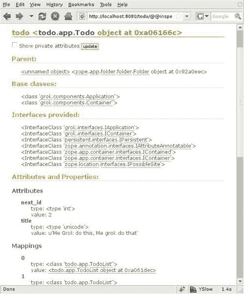

# 第四章 模型

在第三章中，我们学习了如何通过使用视图在网页上显示信息。实际上，正如我们所看到的，视图机制足够强大，可以创建完整的应用程序，就像我们的待办事项列表管理器。现在，我们将注意力转向这些视图的数据来源：内容对象，或定义 Grok 应用程序的模型。以下是本章我们将涵盖的内容列表：

+   模型是什么以及它与视图有什么关系

+   如何在 ZODB 上持久化模型数据

+   如何结构化我们的代码以保持显示逻辑与应用逻辑的分离

+   容器是什么以及如何使用它

+   如何使用多个模型并将特定视图关联到每个模型

+   如何使用 Grok 内省器导航模型

# 模型和应用程序

尽管视图执行显示数据和处理用户交互的实际工作，但它们只是显示数据的一种可能方式。在前一章中，我们从一个非常简单的视图开始，没有任何样式或客户端脚本，到本章结束时，我们有了完全不同的应用程序。始终不变的是我们正在处理的东西：待办事项列表。

每当我们添加列表或列表项并勾选项目时，我们都在与应用程序的模型进行交互，在这个例子中，它只由两行代码定义：

```py
class Todo(grok.Application, grok.Model):
todolists = []

```

Grok 应用程序由一个或多个模型组成。这些模型可以是简单的 Python 对象，但通常使用`grok.Model`作为基类。应用程序的主要模型也应该继承自`grok.Application`，这正是前面代码所发生的情况。

模型包含应用程序数据和所有与如何显示这些数据直接无关的逻辑。在我们的待办事项列表管理器中，模型仅由一个`todolists`类属性组成，它包含所有列表及其项目。

尽管这个模型如此简单，视图是为模型工作而不是相反。如果我们查看`index`和`check`视图中的代码，我们会看到每次发生重要事件时，`self.context.todolists`的值都会被修改。正如我们之前提到的，所有视图都有一个`context`属性，它指向它们关联的模型。通过它，视图可以访问这个模型的所有属性。

# 存储模型数据

到目前为止，我们可以成功创建和管理列表，但一旦我们重新启动应用程序，我们就会丢失所有数据。我们需要一种方法来持久化信息。

对于 Web 应用程序，这通常意味着在关系型数据库中创建一些表，并通过直接 SQL 查询或**对象关系映射器**（**ORM**）来存储信息。ORM 是一个很好的解决方案，因为它将我们的对象透明地存储在相应的表中。每次我们需要处理我们的对象时，ORM 都会再次从数据库中重新组装它们，而无需我们担心 SQL。

Grok 可以使用纯 SQL 以及多种 Python ORM（如 SQLAlchemy [`www.sqlalchemy.org`](http://www.sqlalchemy.org) 或 Storm [`storm.canonical.com`](https://storm.canonical.com)）在关系数据库中存储数据。然而，Grok 为我们提供了另一个更有趣的选项，它更适合我们的 Python 对象，并且可以比 ORM 更透明地工作：**Zope 对象数据库**（**ZODB**）。

## ZODB

我们在第一章中讨论了 ZODB，其中我们提到它与 Grok 集成得非常好。现在我们将展示一个存储数据的简单示例，稍后我们将回到细节。

目前，待办事项列表管理应用程序的标题定义在`index`模板中的`<h1>`标签内。让我们给每个应用程序实例一个`title`属性，这样用户就可以自己设置标题。首先，我们将用更现实的代码替换到目前为止我们所使用的简单模型定义：

```py
class Todo(grok.Application, grok.Model):
def __init__(self):
super(Todo, self).__init__() 
self.title = 'To-Do list manager'
self.todolists = []

```

我们添加了一个在应用程序创建时被调用的`__init__`方法。在这个方法内部，我们确保调用超类`__init__`方法，这样我们的方法扩展而不是替换原始代码。然后我们定义了两个实例属性，`title`和`todolists`。

在 Python 中，有两种类型的对象：**可变对象**，其值可以更改，和**不可变对象**，其值不能更改。对于不可变对象，如字符串或数字，我们只需通过从`grok.Model`继承即可在 ZODB 中获得自动持久性。在标题的情况下，现在我们可以透明地将其存储在 ZODB 中。`todolists`（因为它们存储在一个列表中，一个可变对象）需要做更多的工作，但稍后我们会讨论。

## 动态更改标题

现在我们有了`title`属性，我们可以修改`index.pt`模板，以显示新文本而不是旧文本。`<title>`和`<h1>`标签都需要一个`tal:content`语句，如下例所示：

```py
<h1 tal:content="context/title">To-Do list manager</h1>

```

现在，模板将使用存储在应用程序实例中的任何标题。现在我们需要一种让用户设置标题的方法。让我们创建一个简单的 Ajax 视图来完成这个任务：

```py
class SetTitle(grok.View):
def update(self,new_title):
self.context.title = new_title
def render(self):
return self.context.title

```

所有这些只是检查请求中的键`new_title`，并将`title`属性设置为它的值。正如我们在第三章中与`Check`视图所做的那样，响应不使用模板，而是一个简单的 Python 代码，返回纯文本。我们只是返回在`update`方法中更改的`title`属性，以便 JavaScript 回调函数可以在设置后立即更改它。

在客户端，我们使用几个 JavaScript 函数来产生一个*原地编辑*效果，这样用户就可以点击标题并立即更改它。我们不会在这里深入代码，但你可以找到它在该书的代码包的第四章目录中。你可以在以下屏幕截图中查看结果：


如果我们现在运行应用程序，将能够编辑标题、重新启动应用程序，并看到其值在服务器重启后仍然被保存。不过有一个警告：因为我们已经在 `__init__` 方法中向应用程序实例添加了一个属性，所以在尝试这段代码之前，必须删除任何现有的应用程序实例。这是因为 `title` 属性是在应用程序创建时添加的，当时 `__init__` 方法被调用，而在上一章创建应用程序时并没有发生这种情况。如果我们尝试使用较旧的应用程序实例，当我们尝试访问 `title` 属性时，将会得到一个属性错误。

## 持久性规则

正如我们之前提到的，`todolists` 属性不会那么容易持久化到 ZODB。原因是每当对可变属性进行更改时，应用程序需要通知 ZODB 已发生更改。这是通过将实例的特殊 `_p_changed` 属性设置为 `True` 来实现的。

在 `todolists` 属性的情况下，我们只需在修改属性后将其 `_p_changed` 设置为 `True`。我们只需在索引和检查视图的 `update` 方法末尾添加此代码：

```py
self.context.p_changed_ = True

```

幸运的是，这是我们与 Grok 一起使用 ZODB 时必须记住的唯一规则。好吧，还有一些其他规则，但 Grok 已经遵循了它们，所以这是唯一一个需要我们修改代码的规则。让我们看看 ZODB 的持久性规则：

+   从 `persistent.Persistent`（ZODB 代码中定义的一个类）或其子类继承。Grok 类 `grok.Model` 和 `grok.Container` 已经为我们做了这件事，所以通过扩展它们，我们将自动持久化我们的类。

+   类实例必须以层次结构相互关联。ZODB 有一个根对象，该对象包含其他对象，这些对象反过来又可以包含一些其他对象，形成一个树状结构。

+   当修改不是持久化的持久化对象的可变属性时，持久化机制必须通过将实例的特殊 `_p_changed` 属性设置为 `True` 来通知。

正如我们所说的，Grok 遵循这些规则，所以通过使用 Grok 的模型和容器，我们自动为我们的应用程序提供了持久数据存储。这样，我们只需考虑类和属性，而无需在心中（和代码中）将它们来回转换成表和列。

我们只需这样做就可以在 ZODB 中存储待办事项列表。我们几乎已经完成了一个完整的应用程序，所以现在让我们关注如何更好地组织我们的代码。

# 显示逻辑和应用逻辑

我们一直在谈论显示逻辑和应用逻辑的分离，但我们的代码到目前为止显然没有强制执行这一规则。模型只持有列表，而所有其他操作都在视图中进行。

这种方法的缺点在于我们的视图需要了解太多关于模型实现的方式，因此在不修改某些或所有视图的情况下，改变它变得非常困难。

例如，当我们在我们索引视图的`update`方法中添加一个列表项时，我们必须知道列表项是以`description`和`check`键存储为字典的。我们还得知道，项目列表存储在代表列表本身的字典中的`items`键下。这些都是太多的内部细节，如果模型实现发生变化，依赖于这些知识的视图代码可能需要进行重大修改。

更糟糕的是，依赖于这些知识使得我们的代码比应有的重复性更高，并且在有修改时，我们不得不在多个地方进行相同的更改。看看这个来自待办事项管理器的代码行：

```py
items = self.context.todolists[list_index]['items']

```

我们只有两个视图，并且这一行出现在它们两个中。如果我们添加更多视图并且需要查看它们中的某些列表项，我们就必须再次重复这段代码。现在假设我们向应用程序添加项目，并希望将列表存储在项目中。在这种情况下，我们必须在每个视图中更改这一行的每个出现，以反映新的结构。

这就是为什么分离显示和应用逻辑如此重要的原因。它有助于结构化我们的应用程序，并允许我们更改数据的显示方式，而无需修改其内部表示，反之亦然。

## 分离显示和应用逻辑

让我们思考一下如何重构应用程序，以便考虑到这个原则。记住，模型不应该了解任何关于它如何显示的信息，而视图不应该依赖于模型中的任何实现细节。

我们可以从向模型添加一些方法开始，用于添加列表和从列表中获取所有项，这样我们就可以从视图中调用这些新方法，并停止依赖于列表数据在待办事项列表主列表中的存储方式。我们可能会想写点像这样东西：

```py
class Todo(grok.Application, grok.Model):
def __init__(self):
super(Todo, self).__init__()
self.title = 'To-Do list manager'
self.todolists = []
def createList(self, title, description):
self.todolists.append({'title':title, 'description':description, 'items':[]})
self._p_changed = True
def getListItems(self, index):
items = self.todolists[index]['items']
return items

```

然而，我们必须抵制这种诱惑。如果我们走这条路，我们的代码将充满`self._p_changed`行，并且我们会像疯狂一样传递列表索引。将待办事项列表表示为简单的列表真的不是一条好路。我们应该使用更精心设计的模型，并充分利用 Grok 的模型类。

# 使用容器和多个模型

到目前为止，我们正在使用`grok.Model`作为我们应用程序的基类，这基本上为我们提供了我们看到的几乎透明的 ZODB 存储。然而，大多数非平凡的应用程序都需要多种类型的对象才能有用。此外，使用父级和子级关系组织应用程序数据相当常见，这样主要对象就是父级，并包含多个子对象。在我们的待办事项列表管理应用程序中，主要应用程序是待办事项列表的容器，而每个列表又可以包含多个项目。

因为这是一个非常常见的模式，Grok 提供了一个`grok.Container`类，它允许我们存储其他模型，并处理 ZODB 持久化。使用它，我们可以更好地组织我们的代码，简化它，并且还可以消除每次对列表或其项目进行更改时向框架发出信号的需求（不再需要`self._p_changed`行）。我们不再需要处理一个临时的列表结构并跟踪索引，我们可以考虑列表对象和项目对象。

## 将容器添加到我们的应用程序中

从概念上讲，我们的应用程序将包含一个列表的容器。列表对象也将是一个容器，其中将存储项目。让我们首先定义主要模型：

```py
class Todo(grok.Application, grok.Container):
def __init__(self):
super(Todo, self).__init__()
self.next_id = 0
self.title = 'To-Do list manager'

```

这与我们之前所拥有的并没有太大区别。重要的变化是我们现在从`grok.Container`继承，而不是从`grok.Model`继承。这将允许应用程序存储列表对象。我们还定义了一个`next_id`属性来为列表创建标识符。好的，现在让我们定义列表模型：

```py
class TodoList(grok.Container):
def __init__(self,list_title,list_description):
super(TodoList, self).__init__()
self.next_id = 0
self.title = list_title
self.description = list_description

```

列表有`title`和`description`属性，两者都是实例创建时的必填参数。与列表模型一样，我们也定义了一个`next_id`属性来跟踪单个项目。请注意，`grok.Application`在这里不是一个基类，因为这个是一个将用于之前定义的应用程序中的模型。在某些情况下，我们可能需要在项目中使用多个应用程序，技术上我们可以在同一个文件中定义这两个应用程序，但通常建议我们为不同的应用程序使用单独的文件。

`TodoList`类也是一个`grok.Container`，因为它将包含待办事项。这些项目不会包含其他类型的模型，因此列表项目类定义将简单地是一个模型：

```py
class TodoItem(grok.Model):
def __init__(self,item_description):
super(TodoItem, self).__init__()
self.description = item_description
self.checked = False

```

`TodoItem`类仅从`grok.Model`继承。它只有一个`description`属性，这是实例创建时的一个必填参数。

## 向模型添加行为

现在我们已经将应用程序模型结构化，我们应该考虑哪个模型将执行哪些操作。我们正在讨论应用程序执行的不同操作，例如列表和项目的创建。然而，在之前的版本中，它们都拥挤在`index`视图的`update`方法中。有了干净的模式结构，我们现在可以分离这些操作，并将每个操作放在它更适合的位置。

主应用程序是列表管理器，因此应该将列表创建和删除的方法添加到 `Todo` 类中。让我们开始编写代码：

```py
def addList(self,title,description):
id = str(self.next_id)
self.next_id = self.next_id+1
self[id] = TodoList(title,description)
def deleteList(self,list):
del self[list]

```

`addList` 方法接受 `title` 和 `description`，并简单地创建一个 `TodoList` 实例。新的列表使用键存储在容器中，就像 Python 字典一样工作（实际上，它支持相同的方法，如 keys、values 和 items）。键是使用我们之前讨论的 `next_id` 属性生成的，然后为下一个列表创建递增。

`deleteList` 方法甚至更简单，因为我们只需要使用 `del` 语句从字典中删除所需的键。正如我们承诺的那样，请注意，没有直接处理持久性的代码。列表将在 ZODB 中正确存储，无需显式通知。

## `TodoList` 模型

现在，让我们将注意力转向 `TodoList` 模型。我们需要一种方法来添加和删除项目，类似于我们在主应用程序中所做的。此外，如果我们想保持非 JavaScript 启用的应用程序版本正常工作，我们需要一种方法来同时更改多个项目的 `checked` 状态。以下是我们要添加到 `TodoList` 类中的代码：

```py
def addItem(self,description):
id = str(self.next_id)
self.next_id = self.next_id+1
self[id] = TodoItem(description)
def deleteItem(self,item):
del self[item]
def updateItems(self, items):
for name,item in self.items():
if name in items:
self[item].checked = True
else:
self[item].checked = False

```

`addItem` 方法几乎是我们之前看到的 `addList` 方法的逐字逐句的复制。我们使用 `next_id` 模式来创建 ID，并创建一个新的 `TodoItem` 实例。`deleteItem` 方法与之前讨论的 `deleteList` 方法相同。`updateItems` 方法不同，因为它期望一个包含要标记为已检查的项目 ID 的列表。我们遍历列表中的所有项目，如果它们在接收到的列表中，则将它们的 `checked` 属性设置为 `True`，否则设置为 `False`。

`TodoItem` 模型是三个中最简单的。我们可以直接将 `checked` 属性设置为 `True` 或 `False`，所以我们可能不需要单独的方法来做这件事。我们将只添加一个方便的方法来切换项目的 `checked` 状态，而无需我们知道当前状态。这将对我们之前创建的 Ajax 启用的检查视图很有用：

```py
def toggleCheck(self):
self.checked = not self.checked

```

`toggleCheck` 方法简单地将 `TodoItem` 的 `checked` 属性的值设置为当前值的相反，从而起到切换的作用。

现在我们有一个完整的模型，它使用了 Grok 的特性，并包含了所有应用程序逻辑。视图现在将能够执行显示工作，而不会干扰应用程序的内部结构。

## 重新组织视图

说到视图，我们也需要重构它们。到目前为止，我们一直只用一个视图做所有事情，但这一点需要改变。我们希望保持应用程序只有一个单一的主视图，并在同一页面上显示对不同模型的全部修改，但每个模型的操作调用应来自与该模型关联的视图。这是因为这样 Grok 将正确地设置视图的上下文，我们就不必担心在代码中确保我们作用于正确的模型。记住，我们之前使用了一个隐藏的`<input>`标签和列表索引来告诉我们的`update`方法我们想要在哪个列表上操作。如果我们把视图与正确的模型关联起来，我们就不需要这样做。

对于主应用程序，我们将保留`index`视图和`setTitle`视图。我们还将添加调用`addList`和`deleteList`方法的视图。新的`TodoList`模型将为它的三个操作（`addItem`、`deleteItem`和`updateItem`）各自提供一个视图。对于`TodoItem`模型，我们将重用现有的`check`视图，但与这个模型相关联，而不是主应用程序。

就这样。所以，之前我们有一个单一模型和三个视图，但现在我们有三个模型，每个模型都需要几个视图。Grok 将如何知道哪些视图与哪个模型相关联？

## 介绍类注解

Grok 的一个约定是，在一个模块中定义了单个模型的情况下，所有定义的视图都将与这个模型相关联。Grok 知道这是唯一可能性，因此自动将所有视图的`context`属性设置为这个模型。现在我们有三个模型，我们创建的每个视图都必须明确告诉 Grok 它属于哪个模型。

Grok 用来做这件事的机制被称为**类注解**。Grok 有许多约定，有助于它在没有信息的情况下做出决定，但当我们需要时，我们当然可以告诉 Grok 该怎么做。类注解只是告诉 Grok 关于类的一些信息的声明性方式。

为了明确地将一个视图与一个模型关联，我们使用`grok.context`类注解。这个类将我们想要关联视图的模型作为参数。让我们重新定义我们的`index`视图：

```py
class Index(grok.View):
grok.context(Todo)

```

我们使用`grok.context`类注解来告诉 Grok 这个视图将使用`Todo`模型作为上下文。实际上，这就是我们为这个视图需要的所有代码，因为我们已经将模型责任分成了三个不同的视图。不再有满是`if`语句的巨大`update`方法。

在继续其他视图之前，让我们稍微思考一下`index`视图是如何工作的。正如我们在上一章所看到的，如果一个视图的名称是`index`，它将被视为该模型的默认视图。我们还了解到，视图的名称是自动由其类名的小写版本给出的。现在，对于我们有多个模型并且我们希望每个模型都有一个默认视图的情况，我们该如何命名视图类？在同一个模块中不能定义两个`Index`类。

## 明确设置视图名称

如果你猜到类注解会再次发挥作用，你完全正确。对于这类情况，我们有`grok.name`类注解，它可以用来显式设置视图的名称。目前，我们只需要在我们的代码中有一个`index`视图，但以后我们可能需要为其他模型添加默认视图，所以我们可以在这个时候修改代码：

```py
class TodoIndex(grok.View):
grok.context(Todo)
grok.name('index')

```

我们将视图类名更改为`TodoIndex`，这将导致名为`todoindex`的 URL。然后我们使用`grok.name`注解将视图名称设置为`index`，这样我们就可以调用默认视图而不使用其名称。

现在，让我们看看这个模型的动作视图。首先，是`addlist`视图，它将被用来向应用程序添加新的列表：

```py
class TodoAddList(grok.View):
grok.context(Todo)
grok.name('addlist')
def update(self,title,description):
self.context.addList(title,description)
def render(self):
self.redirect(self.url('index'))

```

`TodoAddList`视图也与`Todo`模型相关联，但使用不同的名称。当用户填写创建列表表单并点击提交按钮时，将调用此视图。

注意在这段代码中，`update`方法只有一行长。我们只是调用`context`的`addList`方法，并将两个必需的参数传递给它。不需要处理表单参数或进行`if`检查以查看所需的操作。

## 视图重定向

在这个应用程序中，我们希望索引页面能够立即显示所有更改。因此，在`render`方法中，我们不是使用模板生成 HTML，或者像我们之前所做的那样发送一个纯文本字符串，而是使用视图可用的`redirect`方法将视图重定向到索引视图。

`deletelist`视图与`addlist`视图非常相似。我们最初的应用程序版本中没有实现这个功能，但现在你会看到，有了适当的结构，实现这个功能真的很简单：

```py
class TodoDeleteList(grok.View):
grok.context(Todo)
grok.name('deletelist')
def update(self,list):
self.context.deleteList(list)
def render(self):
self.redirect(self.url('index'))

```

我们只是使用不同的名称并调用模型的`deleteList`方法，但除此之外代码是相同的。

`Todo`模型的最后一个视图是我们在本章开头添加的`setTitle`视图。以下是它的样子：

```py
class TodoSetTitle(grok.View):
grok.context(Todo)
grok.name('settitle')
def update(self,title):
self.context.title = title
def render(self):
return self.context.title

```

在这种情况下，我们保留了在渲染时返回新标题的旧行为。这里唯一的改变是，与模型的关联是明确的，并且我们给它一个不同于其类名的名称。

与`TodoList`模型关联的三个视图几乎与`Todo`模型的`addlist`和`deletelist`视图完全相同。让我们看看并讨论一下有什么不同：

```py
class TodoListAddItem(grok.View):
grok.context(TodoList)
grok.name('additem')
def update(self,description):
self.context.addItem(description)
def render(self):
self.redirect(self.url(self.context.__parent__,'index'))
class TodoListDeleteItem(grok.View):
grok.context(TodoList)
grok.name('deleteitem')
def update(self,item):
self.context.deleteItem(item)
def render(self):
self.redirect(self.url(self.context.__parent__,'index'))
class TodoListUpdateItems(grok.View):
grok.context(TodoList)
grok.name('updateitems')
def update(self,items):
self.context.updateItems(items)
def render(self):
self.redirect(self.url(self.context.__parent__,'index'))

```

注意这三者如何使用`grok.context`注解将自己与`TodoList`模型关联。这三个的`update`方法与其他方法非常相似，只是调用`context`的正确`update`方法，在这种情况下我们知道是一个`TodoList`实例。

在`render`方法上的`redirect`调用略有不同。因为上下文是`TodoList`，而我们想显示`Todo`模型的索引视图，所以我们需要获取这个列表的容器，以便将其传递给视图的`url`函数，这样它就可以生成正确的 URL。为此，我们使用 Grok 模型对象的另一个特性，即`__parent__`属性，它指向其容器。正如我们所知，列表被`Todo`模型包含，我们可以这样访问它。模型对象还有一个`__name__`属性，它存储用于访问容器内对象的键。我们将在稍后看到索引模板如何改变以适应新的模型结构时使用它。

至于`TodoItem`模型，我们只需要之前版本中已经使用的`check`视图：

```py
class TodoItemCheck(grok.View):
grok.context(TodoItem)
grok.name('check')
def update(self):
self.div_id = 'div_item_%s_%s' % (self.context.__parent__.__name__,self. context.__name__)
self.context.toggleCheck()
def render(self):
return self.div_id

```

有一些差异。现在视图明确地使用`grok.context`与`TodoItem`模型关联，这是显而易见的。现在我们调用`TodoItem`的新`toggleCheck`方法，而不是在视图中进行更改。最后，我们通过使用模型的`__parent__`和`__name__`属性来构造视图将返回的`<div>`标签的 ID。这样，我们就避免了需要将列表和项目索引作为视图参数传递的需要。

现在，在我们的待办事项列表管理应用程序中，应用程序和显示逻辑的分离要好得多。让我们看看这对`index`视图代码的影响，现在它必须显示来自三个模型而不是一个模型的数据。看看显示列表及其项目的循环代码。首先，注意我们现在使用`context/values`而不是旧模型中的列表元素来遍历列表：

```py
<tal:block repeat="todolist context/values">
<div class="todolist">

```

之后，我们定义了`todo`列表表单。注意我们如何使用`view.url()`生成表单的正确 URL。记住，这个函数通过传递我们想要生成 URL 的对象以及可选的附加到它上面的视图名称来工作。在下面的代码中，第一个表单的动作是通过调用`view url`方法定义的，将当前的`todolist`对象和`updateitems`视图名称传递给它。

```py
<form method="post" tal:attributes="action python:view.url(todolist,'updateitems')">
<fieldset>

```

接下来，我们有删除列表的代码。看看我们如何使用`__name__`属性来创建包含我们感兴趣的对象的名称的 URL。这样，期望接收键的方法将直接从这个视图中接收它。我们不需要进行任何列表和项目索引的计算，也不需要添加包含列表数据的隐藏字段：

```py
<legend><span tal:content="todolist/title">title</span>
<a tal:define="url python:view.url('deletelist')" tal:attributes="href string:${url}?list=${todolist/__name__}">

</a>
</legend>

```

表单的其余部分有非常相似的变化，主要是使用`__name__`和`view.url:`。

```py
<p tal:content="todolist/description">description</p>
<div tal:repeat="item todolist/values" tal:attributes="class python:item.checked and 'done' or 'pending'; id string:div_item_${todolist/__name__} _${item/__name__}">
<input type="checkbox" name="items:list" tal:define="check_url python:view.url(item,'check');" tal:attributes="checked item/checked; onclick string:getRequest('{check_url}', processReqChange)"/>
<span tal:content="item/description"></span>
<a tal:define="url python:view.url(todolist,'deleteitem')" tal:attributes="href string:${url}?item=${item/__name__}">

</a>
<br/>
</div>
<input type="submit" class="update_button" name="update_list" value="Update list"/>
</fieldset>
</form>

```

最后，添加列表项的表单现在也使用`view.url`来生成表单操作：

```py
<form method="post" tal:attributes="action python:view.url(todolist,'add item')">
<label for="description"tal:attributes="onclick string:toggleAddControls('add_controls_${repeat/todolist/index}');; this.form.description.focus();">New item</label><br/>
<div class="controls" tal:attributes="id string:add_controls_${repeat/todolist/index}">
<input type="text" size="60" name="description">
<br/>
<input type="submit" class="new_button" name="new_item" value="Add to list"/>
</div>
</form>
</tal:block>

```

人们可能会认为需要使用三个模型可能会使视图中的事情变得复杂，但实际上这次我们使用的代码更少。它也更为简洁。我们不再使用一个包含多个提交按钮的大表单，这些按钮都指向同一视图中的相同`update`方法，我们现在使用几个表单，并通过使用`view.url()`生成每个情况下的正确 URL，将表单提交直接导向相应的视图。

除了这些更改之外，模板的代码基本上与我们已有的相同，因此不需要进行大的更改来使其工作。

# Grok 内省器

因此，我们现在有一个完全工作的应用程序。玩一玩它，创建一些列表和任务。所有内容都将安全地存储在 ZODB 中。

现在我们快速浏览一下 Grok 提供的一个工具，这个工具在处理他人开发的应用程序（或回顾我们多年前编写的应用程序）时，可以帮助我们理解对象关系和职责。

Grok 内省器是一个可以从`http://localhost:8080/applications`的应用程序列表访问的工具。前往那里，在**已安装的应用程序**下，你会看到`Todo`应用程序的实例。应用程序名称是一个链接，可以运行它，但在名称的右侧有一个链接，上面写着**对象浏览器**。点击这个链接，你会看到类似于下一张截图的内容：



在这种情况下，我们可以看到`Todo`模型当前实例的数据。注意用于`__parent__`属性的父信息就在顶部。下面我们可以看到该对象的基本类，我们知道它们是`grok.Application`和`grok.Container`。在**基类**部分下面有一个**提供的接口**部分。我们稍后会更多地讨论接口，所以现在让我们跳过那个部分。

在下面你可以看到一个名为**属性和属性**的部分。在**属性**下，你可以找到`Todo`模型的`title`和`next_id`属性及其当前值。然后是**映射**部分，其中显示了存储在此容器中的所有对象的值。如果你点击这些值中的任何一个，你将得到一个页面，显示相应模型实例的数据，这样你可以轻松地导航应用程序产生的整个数据结构并查看其中的信息。

最后，显示了该对象所有方法的名称和文档字符串。尝试在我们的应用程序中添加一个方法的文档字符串，你将看到它在那个部分中反映出来（当然，在服务器重启后）。

# 摘要

在本章中，我们通过使用模型扩展了我们的演示应用。代码量与上一章相比并没有大幅增加，但我们得到了一个更加优雅且结构更优的应用。代码的维护性也更强，并且具有很好的扩展性，这一点我们将在处理 Grok 中的表单时学到。
