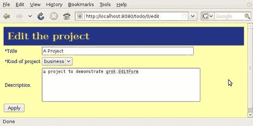
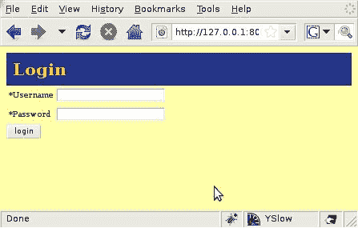
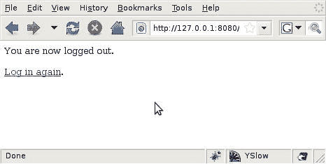
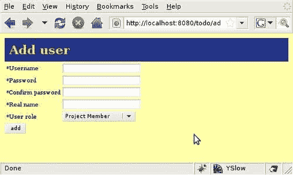
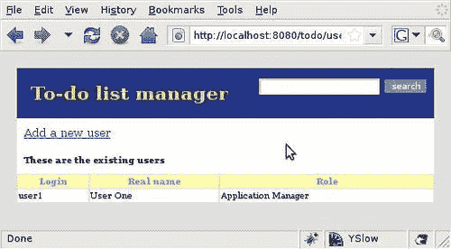

# 第七章 安全

目前，我们的待办事项管理应用程序可以被任何人访问。任何能够访问 Grok 服务器上的 8080 端口的用户都将能够创建、更新和删除项目和任务。

如果我们考虑应用程序想要执行的操作，那么最初只允许经过身份验证的用户访问它将会很理想。例如，应该可以在公司内部安装应用程序，并且只有单个部门作为应用程序的用户。拥有正确权限的用户可以创建项目和将任务分配给团队成员。

Grok 包括完成此任务所需的工具，正如我们将在本章中看到的那样。以下是我们将学习的核心概念：

+   身份验证和授权

+   实体、权限和角色

+   默认安全策略是什么以及如何在`site.zcml`配置文件中定义它

+   使用`site.zcml`声明设置身份验证

+   设置自定义安全策略

+   添加和管理用户

# 身份验证和授权

在讨论 Web 应用程序安全时，在开始之前有两个重要概念需要正确理解：**身份验证**和**授权**。

在一个特定的应用程序中，我们可能会有许多被允许登录的用户。为了这样做，他们通常会提供一个用户名和一个密码。如果用户名和密码匹配，则用户已经通过身份验证，因此系统假设他就是他所说的那个人。在本章中，我们将学习如何通过使用插件在 Grok 中执行身份验证。

一旦用户登录，他可能想要执行多项操作，从仅查看应用程序到管理它。通过给予他执行特定操作的特定权限，用户被授权执行一些或所有可用的操作。

# 实体、权限和角色

在 Grok 中，用户被称为“实体”。一个**实体**代表与应用程序交互的任何实体，无论是用户还是任何类型的代理，例如远程客户端程序。一个**组**是一种特殊的实体，可以包含其他实体。在本章的其余部分，当我们谈论实体时，我们将主要使用更熟悉的术语“用户”。

Grok 中的视图可以通过权限进行保护，这样只有拥有正确权限的用户才能访问每个视图。然而，默认情况下，Grok 允许包括经过身份验证的用户在内的每个人都无限制地访问所有视图。

与为单个用户分配和跟踪权限相比，将相关权限分组并将此组分配给用户更有效率。这就是 Grok 中角色的作用。例如，我们一直在使用的用于访问 Grok 管理 UI 的 admin 用户具有`zope.Manager`角色，该角色授予此用户所有现有权限。

在介绍本章的“*设置自定义安全策略*”部分中的安全策略之后，我们将了解权限和角色。

# 安全策略

因此，Grok 应用程序将具有许多主体、权限和角色。这些集合被称为**安全策略**，代表特定应用程序的全局安全决策。

如前所述，Grok 应用程序有一个默认的安全策略，它给予所有人查看权限。它还定义了认证和未认证的用户组。

## 默认的 Grok 安全策略定义

Grok 默认使用的安全策略定义在`site.zcml`文件中，该文件位于`etc`目录内。此文件中有几个声明，我们将逐一讨论。

以下声明是系统中未认证用户的用户表示：

```py
<unauthenticatedPrincipal id="zope.anybody" title="Unauthenticated User" />

```

所有未认证访问应用程序的用户将共享相同的 ID。

未认证组被分配给未认证主体：

```py
<unauthenticatedGroup id="zope.Anybody" title="Unauthenticated Users" />

```

对于分组操作来说，定义这一点是有用的。

接下来，我们有一个包含所有已认证用户的动态组，无论他们的权限或角色如何：

```py
<authenticatedGroup id="zope.Authenticated" title="Authenticated Users" />

```

最后，有一个包括所有用户（认证或不认证）的组：

```py
<everybodyGroup id="zope.Everybody" title="All Users" />

```

现在我们来到了定义用户的部分。在这种情况下，只有一个用户，即“站点管理员”，登录名为“admin”：

```py
<principal id="zope.manager"
title="Manager"
login="admin"
password_manager="Plain Text"
password="admin"
/>

```

如您所见，密码以纯文本形式分配给此管理员。您可能还记得这里定义的标题是我们列出仪表板中的项目时在创建者列中显示的内容。

下面的两个声明将查看权限授予`zope`。任何代表之前定义的未认证主体的`Anybody`用户。

```py
<grant permission="zope.View"
principal="zope.Anybody" />
<grant permission="zope.app.dublincore.view"
principal="zope.Anybody" />

```

注意，在这种情况下，没有单独的权限定义，因为权限只是一个名称。这些声明允许所有未认证用户查看，因此默认情况下，应用程序对查看是开放的。

接下来是角色定义：

```py
<role id="zope.Manager" title="Site Manager" />
<role id="zope.Member" title="Site Member" />

```

定义了一个“站点管理员”角色用于管理站点。然后，定义了一个“站点成员”角色用于常规站点用户，尽管在默认配置中此角色未使用。

最后，通过使用`grantAll`将所有权限授予`zope.Manager`角色。

```py
<grantAll role="zope.Manager" />
<grant role="zope.Manager"
principal="zope.manager" />

```

这意味着具有管理角色的用户将获得所有定义的权限。然后，该角色被分配到我们在*主体、权限和角色*部分中定义的用户。

回顾一下，安全策略由以下内容组成：

+   一群可以登录应用程序的用户。

+   用户组，可以包含任意数量的用户。一个用户也可以属于多个组。

+   允许这些用户与应用程序的部分进行工作的特定权限。

+   可以分配多个权限的角色，这样用户或组可以分配一个包含所有相关权限的任务角色。这大大简化了权限管理。

## 修改安全策略

到目前为止，我们一直是通过使用在*默认 Grok 安全策略定义*部分中定义的“manager”用户来访问应用程序的。现在，关闭所有浏览器窗口，重新打开浏览器，直接访问`todo`应用程序的 URL，无需登录。你未经过身份验证，但不会显示登录窗口。添加一个项目或进行其他更改，看看应用程序是如何顺从地执行的。



等一下，我们不是说只将查看权限分配给了未经身份验证的用户吗？那么 Grok 为什么允许我们更改项目呢？

嗯，问题是，如果我们想保护它们，视图需要通过权限进行特别保护。在我们这样做之前，用户是否经过身份验证并不重要，更不用说如果他拥有所需的权限。再次强调，所有这些都是 Grok 应用程序非常开放默认安全策略的意图。

### 修改默认视图权限

让我们稍微修改一下默认安全策略，看看它是如何工作的。在待办事项列表管理员的特定情况下，我们希望阻止未经身份验证的用户，因此让我们首先将`grant permission`声明更改为以下代码：

```py
<grant permission="zope.View"
principal="zope.Authenticated" />
<grant permission="zope.app.dublincore.view"
principal="zope.Authenticated" />

```

我们不是将查看权限授予每个人，而是授予我们之前定义的`zope.Authenticated`组，这样只有经过身份验证的用户才能访问应用程序。

### 添加新用户

为了测试这些声明，我们需要向网站添加另一个用户，因为“manager”用户无论如何都会获得查看权限。在`site.zcml`中添加以下行，在 manager 定义之后：

```py
<principal id="todo.user"
title="User"
login="user"
password_manager="Plain Text"
password="user"
/>

```

我们现在有一个`todo.user`，用户名为“user”，密码为“password”。保存文件并重新启动 Grok。由于安全策略是在创建应用程序时应用的，因此有必要删除并重新创建应用程序。

现在应该可以以`todo.user`的身份登录。试试看：前往网站的根目录以获取登录窗口，然后输入新用户的登录名和密码。你会看到一个错误消息，因为新用户没有权限管理 Grok 应用程序。忽略错误并转到应用程序 URL。项目仪表板将在浏览器中显示。

当然，我们的新用户可以创建和删除项目以及任务，因为视图没有受到保护。不仅如此，未经身份验证的用户仍然可以查看和编辑一切。

### 保护视图

是时候保护一个视图并阻止未经身份验证的用户访问它了，正如预期的那样。只需将仪表板视图更改为以下内容：

```py
class DashBoard(grok.View):
grok.context(Todo)
grok.name('index')
grok.require('zope.View')

```

为了使用权限保护一个视图，我们使用`grok.require`类注解。注意我们是如何将权限名称传递给它，正如在`site.zcml`配置文件中定义的那样。重新启动应用程序（这次不需要重新创建它），然后关闭并重新打开浏览器以丢失当前的认证信息。尝试在不登录的情况下访问应用程序 URL，你应该会看到登录窗口。未经认证的用户不能再查看仪表板了。输入`todo.user`凭证，仪表板将再次出现。

# 设置自定义安全策略

现在我们已经了解了安全机制的工作原理，我们准备将我们自己的安全策略添加到应用程序中。让我们从创建一些权限并将它们附加到我们的视图中开始。

## 创建权限

Grok 提供了一个非常简单的机制来定义权限和限制访问。可以通过从`grok.Permission`类派生并添加一个名称来简单地定义一个权限。

为了保持简单，让我们只为我们的应用程序定义四个权限：一个通用的查看权限，以及添加项目和列表或修改列表项的特定权限：

```py
class ViewTodos(grok.Permission):
grok.name('todo.view')
class AddProjects(grok.Permission):
grok.name('todo.addprojects')
class AddLists(grok.Permission):
grok.name('todo.addlists')
class ChangeItems(grok.Permission):
grok.name('todo.changeitems')

```

通过使用`grok.require`指令将权限应用于视图，因此为了保护我们的每个视图，我们需要遍历我们的应用程序代码，并为每个视图添加适当的`grok.require`语句。例如：

```py
class DashBoard(grok.View):
grok.context(Todo)
grok.name('index')
grok.require('todo.view')
class ProjectIndex(grok.View):
grok.context(Project)
grok.name('index')
grok.require('todo.view')
class TodoAddList(grok.View):
grok.context(Project)
grok.name('addlist')
grok.require('todo.addlists')
class TodoDeleteProject(grok.View):
grok.context(Todo)
grok.name('deleteproject')
grok.require('todo.addprojects')

```

我们使用视图权限保护仪表板，这意味着匿名用户将无法访问它。`TodoAddList`视图将需要`addlists`权限，而要删除项目，则需要`addprojects`权限。这样，我们可以使用我们想要的权限来保护所有视图。

## 角色

视图通过权限进行保护，但将权限分配给实际用户最好是通过使用角色。让我们为应用程序定义三个简单的角色。*项目成员*将只能查看和更改列表项。*项目经理*可以执行所有这些操作，还可以创建列表。*应用程序管理员*是唯一可以创建项目的人。

`grok.Role`类对于定义这些角色很有用，如下面的代码所示：

```py
class ProjectMemberRole(grok.Role):
grok.name('todo.ProjectMember')
grok.permissions('todo.view','todo.changeitems')
class ProjectManagerRole(grok.Role):
grok.name('todo.ProjectManager')
grok.permissions('todo.view','todo.changeitems','todo.addlists')
class AppManagerRole(grok.Role):
grok.name('todo.AppManager')
grok.permissions('todo.view','todo.changeitems', 'todo.addlists','todo.addprojects')

```

在这里，我们已经为我们的应用程序中不同用户级别创建了四个不同的角色。每个角色分别通过使用`grok.name`和`grok.permissions`声明分配了一个名称和一个或多个权限。

如您所见，**角色**只是一个具有名称的权限集合。使用此类集合而不是单独分配每个权限的好处是，一旦将角色分配给用户，就可以在不为每个用户单独授予或撤销权限的情况下，向角色添加或删除权限。

# 添加认证

我们现在已经保护了所有的视图，但到目前为止还没有用户，所以没有人可以被分配我们创建的角色。我们需要添加一个创建和管理用户以及验证他们并分配角色的机制，这样他们就可以使用不同的视图。

## 可插拔认证工具

**可插拔认证工具**（**PAU**）是一个用于用户认证的框架。它是 Zope 工具包的一部分，目前 Grok 没有提供内置机制来与之工作，但我们将看到它并不复杂。

PAU 使用插件来完成其工作，因此可以有不同的认证源插件，并且可以轻松地替换它们，甚至让它们协同工作。

PAU 有两种类型的插件：“凭证”插件从请求中提取凭证（例如用户名和密码），“认证”插件检查这些凭证是否有效，并在凭证有效的情况下为应用程序生成一个用户。

## 在我们的应用程序中注册 PAU

要能够在我们的应用程序中使用 PAU，我们首先需要将其注册为一个本地实用程序。**实用程序**是一个应用程序可以提供的服务。本地意味着它可以存储特定于应用程序每个实例的信息和配置。

下面是如何在我们的主`todo`应用程序定义中注册 PAU 的方法。首先，我们导入`PluggableAuthentication`，这是一个工厂，将创建实际的 PAU 对象。我们还导入了`IAuthentication`，这是我们的 PAU 实用程序必须提供的接口，以便与认证机制集成。

```py
from zope.app.authentication.authentication import PluggableAuthentication
from zope.app.security.interfaces import IAuthentication
from auth import setup_authentication

```

当我们注册一个 PAU 实用程序时，我们需要配置它使用适当的插件，这就是前面代码中`setup_authentication import`语句的目的。

现在我们通过使用`grok.local_utility`指令并传递给该指令`PluggableAuthentication`工厂、它将要提供的接口以及`setup`函数来注册这个实用程序。请注意，这个指令并不局限于 PAU，任何类型的服务都可以这样注册：

```py
class Todo(grok.Application, grok.Container):
grok.implements(ITodo)
grok.local_utility(
PluggableAuthentication, provides=IAuthentication,
setup=setup_authentication,
)

```

目前在主`app.py`文件中我们只需要做这么多。让我们添加`setup_authentication`方法，以及其他所有安全类和视图，到另一个模块中。创建`auth.py`文件，并添加以下行到其中：

```py
def setup_authentication(pau):
pau.credentialsPlugins = ['credentials']
pau.authenticatorPlugins = ['users']

```

这是一个非常简单的方法，它只是将一个名为`credentials`的插件分配给 PAU 的`credentialsPlugins`，并将另一个名为`users`的插件分配给`authenticatorPlugins`。第一个将负责从浏览器请求中提取用户的凭证并将其提供给应用程序。`users`插件将用于认证。当然，这些插件目前还不存在；我们需要创建它们。

## 添加凭证插件

对于凭据提取服务，我们将使用一个名为 `SessionCredentialsPlugin` 的插件，该插件包含在 Zope 工具包中。正如其名称所暗示的，此插件通过请求会话存储提取的凭据，以便应用程序可以轻松使用这些信息。由于我们不需要在插件中存储任何特定于应用程序的信息，这次让我们使用一个全局实用工具。

```py
from zope.app.authentication.session import SessionCredentialsPlugin
from zope.app.authentication.interfaces import ICredentialsPlugin
class MySessionCredentialsPlugin(grok.GlobalUtility, SessionCredentialsPlugin):
grok.provides(ICredentialsPlugin)
grok.name('credentials')
loginpagename = 'login'
loginfield = 'login'
passwordfield = 'password'

```

**全局实用工具** 简单来说是一个不存储在应用程序数据中，但位于可供 Grok 中所有应用程序实例访问的注册表中的服务。我们将在第十一章中更详细地解释实用工具。

注意我们如何从 `grok.GlobalUtility` 和我们之前提到的 `SessionCredentialsPlugin` 继承。这里的 `grok.name` 指令非常重要，因为它为我们之前在 `setup_authentication` 方法中为我们的 PAU 配置的插件分配了一个名称。

之后是一些用于配置插件工作方式的类变量。`loginpagename` 是当用户尝试访问受保护页面时将显示的视图的名称。通常，这指向一个登录表单。`loginfield` 和 `passwordfield` 是表单中包含用户凭据的字段名称。它们将由认证插件用于使用应用程序对用户进行认证。

### 登录表单

现在我们已经配置了凭据插件，当用户想要访问受保护视图时查找登录表单，我们不妨立即创建该表单。

首先，我们通过使用接口定义一个表单模式。`login` 和 `password` 字段应该与我们配置在凭据插件中的名称完全相同。我们添加了一个 `camefrom` 参数，该参数将用于在用户登录之前将其重定向到他想要查看的页面。

```py
class ILoginForm(Interface):
login = schema.BytesLine(title=u'Username', required=True)
camefrom = schema.BytesLine(title=u'', required=False)
password = schema.Password(title=u'Password', required=True)

```

`SessionCredentialsPlugin` 在将用户重定向到登录表单时自动将此变量添加到请求中，因此名称必须相同。这就是为什么我们在以下代码中将表单字段的 `prefix` 赋值为空字符串，以保持名称不变。

注意，我们使用 `grok.require` 声明将权限 `zope.Public` 分配给视图。此权限在驱动 Grok 的 Zope 工具包中定义，并分配给所有人都可以看到的视图。我们使用此权限来明确表示，每位访问我们应用程序的访客都可以访问登录表单。

```py
class Login(grok.Form):
grok.context(Interface)
grok.require('zope.Public')
label = "Login"
template = grok.PageTemplateFile('custom_edit_form.pt')
prefix = ''
form_fields = grok.Fields(ILoginForm)

```

我们需要在这个类中实现一个 `setUpWidgets` 方法，以确保 `camefrom` 字段不会在表单上显示，该表单使用我们在第五章中创建的自定义模板。这样做是为了使其看起来与我们所使用的布局融为一体。

```py
def setUpWidgets(self, ignore_request=False):
super(Login,self).setUpWidgets(ignore_request)
self.widgets['camefrom'].type = 'hidden'

```

最后，`handle_login` 动作将用户重定向到 `camefrom` URL，或者如果 `camefrom` 不可用，则重定向到网站根目录。如果用户输入无效凭据，登录表单将再次显示。

```py
@grok.action('login')
def handle_login(self, **data):
self.redirect(self.request.form.get('camefrom', self.url(grok.getSite())))

```

就这样。看看下一个截图中的表单在实际操作中的样子：



### 注销视图

我们有一个登录机制，所以我们需要一种方法来结束会话，也许登录为不同的用户。我们将添加一个注销视图来处理这个需求：

```py
from zope.app.security.interfaces import IAuthentication, IUnauthenticatedPrincipal, ILogout
class Logout(grok.View):
grok.context(Interface)
grok.require('zope.Public')
def update(self):
if not IUnauthenticatedPrincipal.providedBy( self.request.principal):
auth = component.getUtility(IAuthentication)
Ilogout(auth).logout(self.request)

```

首先，我们需要确定当前用户是否已登录，我们通过使用 `self.request.principal` 从请求中获取此信息，并检查它是否提供了 `IUnauthenticatedPrincipal` 接口。如果是，那么我们就知道这个用户未认证。如果结果显示他已经认证，我们将使用 `component.getUtility` 来查找我们的 PAU 并调用 `logout` 方法。

这个视图需要一个模板，我们现在将保持它相当简单。请看下一张截图以查看此视图的实际操作。

```py
<html>
<head>
<title>Logged out</title>
</head>
<body>
<p>You are now logged out.</p>
<p><a tal:attributes="href python:view.url(context)"> Log in again</a>.
</p>
</body>
</html>

```



## UserAuthenticator 插件

对于认证部分，我们需要另一个本地实用工具，因为我们需要在那里存储用户信息。我们以类似 PAU 实用工具的方式注册该实用工具，使用 `grok.local_utility` 指令。实际上，这段代码位于我们的主应用程序文件 `app.py` 中的 PAU 声明下方：

```py
from auth import UserAuthenticatorPlugin
grok.local_utility(
UserAuthenticatorPlugin, provides=IAuthenticatorPlugin,
name='users',
)

```

这里的唯一区别是我们传递了一个 `name` 参数，它必须与我们在 `setup_authentication` 方法中用于插件的名称相匹配。

我们将创建一个 Grok 容器来存储用户账户，因此我们的插件将知道如何创建新用户，并决定登录尝试是否为现有用户提供了有效的凭证。让我们一步一步地查看认证插件代码。

首先，我们需要做一些导入，然后是插件定义：

```py
from zope.app.authentication.session import SessionCredentialsPlugin
from zope.app.authentication.interfaces import ICredentialsPlugin
from zope.app.authentication.interfaces import IAuthenticatorPlugin
from zope.app.authentication.interfaces import IprincipalInfo
class UserAuthenticatorPlugin(grok.LocalUtility):
grok.implements(IAuthenticatorPlugin)
grok.name('users')
def __init__(self):
self.user_folder = UserFolder()

```

注意我们如何从 `grok.LocalUtility` 继承并实现 `IAuthenticatorPlugin` 接口。当实用工具初始化（`__init__` 方法）时，我们创建一个用户文件夹并将其存储在那里。用户文件夹是一个简单的 Grok 容器：

```py
class UserFolder(grok.Container):
pass

```

现在我们来看插件本身的方法。`authenticateCredentials` 方法在每次登录尝试时被调用。它接收凭证插件从请求中提取的凭证，然后使用 `getAccount` 方法尝试获取一个有效账户。接下来，它调用账户的 `checkPassword` 方法来验证密码与用户凭证中的密码是否一致。

```py
def authenticateCredentials(self, credentials):
if not isinstance(credentials, dict):
return None
if not ('login' in credentials and 'password' in credentials):
return None
account = self.getAccount(credentials['login'])
if account is None:
return None
if not account.checkPassword(credentials['password']):
return None
return PrincipalInfo(id=account.name,
title=account.real_name,
description=account.real_name)

```

注意，`authenticateCredentials` 方法返回一个包含账户名称、标题或显示名称和用户描述的 `PrincipalInfo` 对象。此对象实现了在代码顶部导入的 `IPrincipalInfo` 接口，这意味着你可以在其他认证插件中期待找到类似的行为。

这是此插件中使用的 `PrincipalInfo` 类代码。除了主体信息外，它还持有用于授权用户的凭证和认证插件。

```py
class PrincipalInfo(object):
grok.implements(IPrincipalInfo)
def __init__(self, id, title, description):
self.id = id
self.title = title
self.description = description
self.credentialsPlugin = None
self.authenticatorPlugin = None

```

我们在这个插件中实现的 `IAuthenticatorPlugin` 接口需要有一个 `principalInfo` 方法，该方法应返回我们刚刚定义的 `PrincipalInfo` 对象：

```py
def principalInfo(self, id):
account = self.getAccount(id)
if account is None:
return None
return PrincipalInfo(id=account.name,
title=account.real_name,
description=account.real_name)

```

插件最重要的方法是 `getAccount`，它试图在 `user_folder` 中找到指定的用户账户，并返回该账户，如果用户未找到，则返回 `None`。目前我们使用 Grok ZODB 存储用户，但我们可以通过修改此方法轻松访问关系数据库或外部认证系统。

实现相当直接。我们使用布尔表达式检查传递给方法的方法登录是否在我们的 `user` 文件夹中，如果是，则返回文件夹内的用户对象。否则，我们返回 `None`：

```py
def getAccount(self, login):
return login in self.user_folder and self.user_folder[login] or None

```

### 添加用户

我们认证插件中的另一个重要方法是 `addUser`。它创建一个具有给定用户名的账户对象，然后使用此名称为用户分配一个角色。

```py
def addUser(self, username, password, real_name, role):
if username not in self.user_folder:
user = Account(username, password, real_name, role)
self.user_folder[username] = user
role_manager = IPrincipalRoleManager(grok.getSite())
if role==u'Project Manager':
role_manager.assignRoleToPrincipal ('todo.ProjectManager',username)
elif role==u'Application Manager':
role_manager.assignRoleToPrincipal ('todo.AppManager',username)
else:
role_manager.assignRoleToPrincipal ('todo.ProjectMember',username)

```

在我们的 `user` 文件夹内创建用户账户后，这个方法中最重要的部分是我们根据 `addUser` 表单传递的角色分配适当的角色给新用户的部分。

观察我们首先如何获取站点的 `RoleManager`，如下所示：

```py
role_manager = IprincipalRoleManager(grok.getSite())

```

然后，当我们知道要应用什么角色时，我们使用其 `assignRoleToPrincipal` 方法：

```py
role_manager.assignRoleToPrincipal('todo.ProjectMember',username)

```

这里是我们使用的账户类：

```py
from zope.app.authentication.interfaces import IpasswordManager
class Account(grok.Model):
def __init__(self, name, password, real_name, role):
self.name = name
self.real_name = real_name
self.role = role
self.setPassword(password)
def setPassword(self, password):
passwordmanager = component.getUtility(IPasswordManager, 'SHA1')
self.password = passwordmanager.encodePassword(password)
def checkPassword(self, password):
passwordmanager = component.getUtility(IPasswordManager, 'SHA1')
return passwordmanager.checkPassword(self.password, password)

```

账户对象需要包含 `checkPassword` 和 `setPassword` 方法，这些方法与密码管理实用程序一起使用。实用程序执行所有繁重的工作，因为 `checkPassword` 方法只是获取账户密码并将其与用户输入的密码一起传递给 `passwordManager` 的 `checkPassword` 方法。

`setPassword` 方法使用 `passwordManager` 实用程序的 `encodePassword` 方法来设置密码。你可能还记得，当我们在本章开头处理 `site.zcml` 声明时，我们看到了一个 'plain-text' 密码管理器。在这种情况下，我们使用 `SHAI` 密码管理器，以便能够存储加密密码。

### 基本用户管理

当然，我们需要一种方法将用户添加到我们的应用程序中。`UserAuthenticator` 的 `addUser` 方法仅由我们使用第五章中讨论的接口和模式机制定义的表单自动呈现机制调用。首先，我们为表单字段定义一个接口：

```py
class IAddUserForm(Interface):
login = schema.BytesLine(title=u'Username', required=True)
password = schema.Password(title=u'Password', required=True)
confirm_password = schema.Password(title=u'Confirm password', required=True)
real_name = schema.BytesLine(title=u'Real name', required=True)
role = schema.Choice(title=u'User role', values=[u'Project Member', u'Project Manager', u'Application Manager'], required=True)

```

然后，我们定义实际的 `AddUser` 表单，该表单使用先前定义的接口中的字段来构建表单。`handle_add` 方法使用 Grok 的 `action` 装饰器向表单添加一个按钮，该按钮将调用认证插件中的 `addUser` 方法：

```py
class AddUser(grok.Form):
grok.context(Interface)
grok.require('zope.ManageApplication')
label = "Add user"
template = grok.PageTemplateFile('custom_edit_form.pt')
form_fields = grok.Fields(IAddUserForm)
@grok.action('add')
def handle_add(self, **data):
users = component.getUtility(IAuthenticatorPlugin,'users')
users.addUser(data['login'],data['password'], data['real_name'],data['role'])
self.redirect(self.url(grok.getSite(),'userlist'))

```

注意我们如何添加一个角色字段，允许管理员将我们定义的其中一个角色分配给每个用户。值得注意的是，这个用户管理视图受到`zope.ManageApplication`权限的保护，这个权限仅分配给 Zope 管理员。如果我们使用我们自己的权限，我们根本无法首先创建用户。完成后的表单可以在以下截图查看：



一个简单的用户列表视图完成了我们用户管理应用程序的用户界面：

```py
class UserList(grok.View):
grok.context(Interface)
grok.require('zope.ManageApplication')
def update(self):
users = component.getUtility(IAuthenticatorPlugin,'users')
self.users = users.listUsers()

```

这里没有新内容。我们只是从`UserAuthenticator`插件获取用户列表，并将其传递给视图模板，模板简单地以表格形式列出用户。你现在应该熟悉一些这段代码。首先，我们使用静态视图插入我们的样式表定义，以正确显示模板中的 URL：

```py
<html>
<head>
<title tal:content="context/title">To-Do list manager</title>
<link rel="stylesheet" type="text/css" tal:attributes="href static/styles.css" />
</head>

```

在模板的主体中，我们有一个作为页眉一部分的站点搜索表单，其中包含应用程序的标题。然后有一个链接用于添加新用户，它指向我们刚刚定义的表单。

```py
<body>
<div id="appheader">
<form id="search" tal:attributes="action python:view.url('search')">
<input type="text" name="query" />
<input class="new_button" type="submit" value="search" />
</form>
<h1 id="apptitle" tal:content="context/title"> To-Do list manager</h1>
</div>
<p class="create"><a href="adduser">Add a new user</a></p>

```

只有当存在用户时，用户列表才会显示，它由一个表格组成，该表格遍历在`UserList`视图中定义的用户列表（视图/users）。

```py
<h2 tal:condition="view/users">These are the existing users</h2>
<div class="projects">
<table>
<tr>
<th>Login</th>
<th>Real name</th>
<th>Role</th>
</tr>
<tr tal:repeat="user view/users">
<td tal:content="user/name">type</td>
<td tal:content="user/real_name">type</td>
<td tal:content="user/role">type</td>
</tr>
</table>
</div>
</body>
</html>

```

就这样。现在我们可以在应用程序中拥有多个具有不同配置文件的用户，如下一张截图所示。创建一些用户并测试权限和角色，以了解它们是如何协同工作的。



# 摘要

在本章中，我们学习了 Grok 的安全功能，并将身份验证和授权添加到我们的应用程序中。
